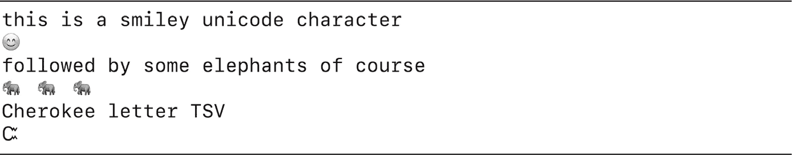
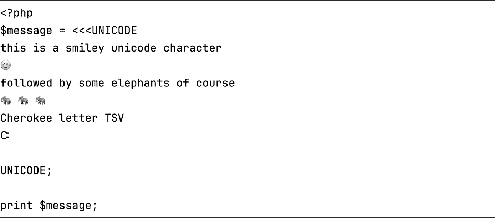
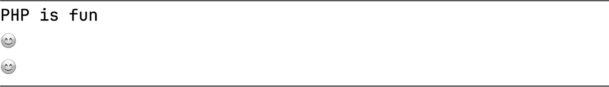

## 第三章：3 字符串与字符串函数


在本章中，我们将深入探讨字符串，包括如何创建它们、如何组合它们，以及如何使用 PHP 的许多内置字符串函数来搜索、转换和处理它们。几乎每个 PHP 程序和 Web 应用程序都涉及文本，因此了解如何创建和操作字符串非常重要。

本章介绍了 PHP 的四种字符串写法风格：使用单引号或双引号，或者在较长的多行字符串中使用 heredoc 或 nowdoc。这些风格有不同的特点，例如能否嵌入变量或表示特殊符号。尽管这些风格有所不同，它们最终都会得到相同的结果：一个字符串数据类型的值，也就是一串字符。

### 空白字符

在我们讨论可见字符的字符串（如字母和数字）之前，先谈谈*空白字符*，即那些你看不见的字符。这些字符在打印时不会使用任何墨水（例如空格字符、制表符字符、换行符字符等等）。有时区分*水平*空白字符（如空格和制表符）与*垂直*空白字符（如换行符和垂直制表符）是很有用的。

当你编写代码时，你使用的空白字符的细节通常对代码的执行并不重要。只要表达式之间至少有一个空白字符（例如空格或换行符），是否有额外的空白字符（如额外的空格或制表符）并不重要。例如，PHP 引擎会将以下四个语句解释为完全相同，忽略变量名和等号两边的多个空格、制表符和换行符，以及字符串两边的空白字符：

```
$lastName = 'Smith';
      $lastName = 'Smith';
   $lastName      =      'Smith'    ;
$lastName
=
    'Smith'
;
```

然而，当你声明或处理字符串表达式中的内容时，你必须精确地使用空白字符。否则，单词可能会粘在一起，没有空格，或者某些文本可能会出现在不同的行上。例如，这四个语句中的字符串都是不同的，因为多余的空白字符*在*引号内：

```
$lastName = 'Smith';
$lastName = '   Smith';
$lastName = 'Smith   ';
$lastName = '     Smith   ';
```

空白字符不仅仅来源于你写的代码。当你从用户或外部软件系统（如应用程序编程接口（API））获取输入字符串时，也可能会引入空白字符。在这种情况下，你通常需要验证该输入并修剪其开头和结尾的任何不必要的空白字符。同样，你可能希望将字符串中的任何制表符或换行符替换为单个空格（有时用户在输入时不小心按下功能键，导致输入中出现了意外的、不可见的空白字符）。你将在本章中学习如何做这些事情（例如，参见“移除所有不必要的空白字符”在第 60 页）。

PHP 中最简单的字符串类型是用单引号括起来的，例如 'matt smith'。几乎所有出现在单引号内的内容都会被字面处理，意味着如果打印该字符串，内容将按原样逐字符输出。

PHP 只有两个特殊的单引号字符串情况。首先，由于单引号用于限定字符串，因此必须有一种机制将单引号包含在字符串内部。否则，单引号会被解释为字符串的结束。解决方案是在单引号前加上反斜杠（\'），就像 'matt smith\'s string' 中那样。当这个字符串打印时，单引号会显示出来，但反斜杠不会显示，正如你在 PHP 的交互模式中所看到的那样：

```
php > **print 'matt smith\'s string';**
matt smith's string
```

这种在字符串中使用特殊字符序列，并让 PHP 解释为某个特定字符的技术被称为 *转义*。由于反斜杠需要用来转义单引号，因此也必须有一种方法在单引号字符串中指定反斜杠字符。为此，可以写两个反斜杠：\\。

\' 和 \\ 这两个转义序列是 PHP 引擎在单引号字符串中唯一会解释为其他意义的字符。你可能知道的其他转义序列，例如 \n 用于换行，在单引号字符串中不会被识别。

然而，这并不意味着你不能在单引号字符串中包含换行符。为此，只需在字符串中你希望出现换行的地方添加换行符，PHP 会按你写的方式精确地再现这些换行符。实际上，PHP 要求用分号来声明语句结束的原因之一，是为了允许将单个语句分布在多行中。列表 3-1 展示了一个跨多行的字符串。

```
<?php
print 'the
cat
sat on
the mat!
';
```

列表 3-1：包含换行符的字符串脚本

这个脚本包括一个打印语句，输出包含多个换行符的字符串。以下是在命令行运行此脚本的输出：

```
the
cat
sat on
the mat!
```

输出包括了字符串中所有的换行符。 ### 字符串连接：连接

经常你需要将多个字符串、变量或常量组合成一个单一的字符串表达式。你可以通过 PHP 的字符串连接运算符实现，表示为句点（.）。考虑以下在 PHP 交互模式中的例子：

```
php > **$name = 'Matt Smith';**
php > **print 'my name is ' . $name;**
my name is Matt Smith
```

我们声明了变量 $name，其值是字符串 'Matt Smith'。然后，我们使用字符串连接运算符将这个变量的值与另一个字符串组合，并打印出结果的更长字符串。注意，在字符串 'my name is ' 和闭合的单引号之间有额外的空格。连接运算符不会在连接的字符串之间添加任何空格，所以这个额外的空格是为了防止像 isMatt 这样的字符串被打印出来。

当在一行中连接字符串时，良好的编程实践是在句点的两边添加空格，以提高可读性，如前面的示例所示。你也可以将这样的语句分布在几行上，这有助于使长字符串表达式更具可读性，正如清单 3-2 中的脚本所示。这展示了我个人的偏好，即缩进语句的每一行，并让每行以连接操作符开始，这样就能清楚地表明每一行都在向字符串表达式追加内容。

```
<?php
$name = 'Matt Smith';
print 'my name is '
    . $name
    . ', I\'m pleased to meet you!'
    . PHP_EOL;
```

清单 3-2：一个用于连接并打印多个字符串的脚本

该脚本打印出一个由四个较短字符串连接而成的字符串，其中包括前一个示例中的两个字符串。请注意，我们已经转义了单引号，以在第三个字符串中的单词 I'm 中创建撇号。

表达式末尾的第四个字符串是特殊的字符串常量 PHP_EOL，代表*行结束符*。这是一个包含系统适用字符（或字符组）的字符串，用来将光标移动到命令行终端的下一行的开始位置（就像按下 ENTER 键一样）。由于不同操作系统在指定行结束符时采用的方式略有不同，过去曾经需要这种特殊常量。现在大多数操作系统的应用程序通常能够处理彼此的文件，因此这已经不再是问题，但该常量依然方便用来确保单引号字符串后面的下一个终端提示符出现在新的一行。以下是运行此脚本时在命令行中的输出：

```
% **php multi_line.php**
my name is Matt Smith, I'm pleased to meet you!
%
```

我将来自清单 3-2 的脚本保存为名为*multi_line.php*的文件。运行该脚本时，它将连接字符串并在同一行上打印结果。请注意，接下来的终端提示符（在本例中为百分号字符%）会出现在下一行，这要归功于 PHP_EOL 常量。

如果一个变量已经包含了一个字符串，我们可以使用连接赋值操作符（.=）将另一个字符串表达式追加到该变量的末尾。以下是使用 PHP 交互模式的示例：

```
php > **$name = 'Matt';**
php > **$name .= ' Smith';**
php > **print** **$name;**
Matt Smith
```

首先，我们将$name 变量初始化为字符串'Matt'。然后，我们使用连接赋值操作符将'Smith'追加到$name 的内容末尾。当我们打印该变量时，可以看到它现在包含了 Matt Smith。### 双引号字符串

PHP 字符串的第二种类型是用双引号括起来的，例如"Matt Smith"。双引号字符串与单引号字符串的不同之处在于，它们会被 PHP 引擎*解析*，即 PHP 引擎会处理它们，这意味着它们可以包含 PHP 变量。当你在双引号字符串中写入一个变量（以美元符号开头）时，PHP 引擎会查找变量的值，并在打印之前将其插入到字符串中。这通常比使用句点连接单引号字符串与变量内容更加方便，就像我们在上一节中所做的那样。以下是使用 PHP 交互模式的示例：

```
php > **$name = 'Matt Smith';**
php > **print "My name is $name \nI'm pleased to meet you";**
My name is Matt Smith
I'm pleased to meet you
```

首先，我们将字符串'Matt Smith'赋值给$name 变量，就像之前一样。注意，我们本可以使用双引号表示这个字符串，但大多数 PHP 程序员通常仅在需要解析的字符串中使用双引号。接下来，我们打印一个包含$name 变量的双引号字符串。输出显示 PHP 成功解析了这个字符串，并将 Matt Smith 替换为变量值。

注意，双引号字符串中包含了收缩词 I'm 中的单引号字符。这在双引号字符串中是完全有效的，并且不需要转义。我们的双引号字符串还包含了转义序列\n，用于在输出中间创建换行符。这是双引号字符串中可以使用的多个转义序列之一。表格 3-1 列出了其中一些常见的转义序列。

表格 3-1：双引号字符串中的常见转义序列

| 转义序列 | 描述 |
| --- | --- |
| \\ | 反斜杠 |
| \" | 双引号 |
| \$ | 美元符号 |
| \n | 换行符 |
| \t | 制表符 |

特别需要注意的是，由于美元符号会让 PHP 引擎解析变量，所以在双引号字符串中包含实际的美元符号时，必须使用\$。同样，要在字符串中包含双引号，必须使用\"。

你不能在双引号字符串中包含常量，因为 PHP 引擎无法分辨字符串中的字符和常量的名称之间的区别。（回忆一下第一章，常量是没有美元符号的。）其中一个副作用是，你不能在双引号字符串中包含 PHP_EOL 常量来在字符串末尾创建换行符。相反，你应该使用\n 换行符转义序列。

> 注意

*在极少数情况下，当你需要操作系统无关的* PHP_EOL *常量与双引号字符串一起使用时，可以通过字符串连接操作符将常量添加到字符串中，就像你在示例 3-2 中看到的那样。这种情况可能发生在脚本需要根据 PHP 引擎运行的系统精确输出适当的换行符和光标到行首的字符序列时（例如，确保系统文件具有正确的行尾符）。*

#### 处理变量名后的字符

当变量名后跟一个空格出现在双引号字符串中时，例如"my name is $name \nI'm pleased to meet you"，PHP 引擎可以轻松识别变量（$name），并确认其值后应跟一个空格。即使是标点符号，如句号、逗号和冒号，紧跟在变量后面也没有问题，转义序列也是如此，因为这些字符在变量名中是不合法的。例如，在$name 变量后面紧跟逗号是完全可以的：

```
php > **$name = 'Matt Smith';**
php > **print "my name is $name, and I'm pleased to meet you";**
my name is Matt Smith, and I'm pleased to meet you
```

然而，如果你希望其他字符紧随变量后面成为字符串的一部分，情况就会变得稍微复杂一些。在变量名的第一个字母（或下划线字符）之后，变量名的字符可以是字母、数字和下划线，因此，如果在双引号字符串中紧跟这些字符，PHP 引擎会将它们视为变量名的一部分。例如，如果我们有一个$weight 变量，并希望其值后面紧跟 kg（例如 80kg），我们不能这样写：

```
print "$weightkg";
```

PHP 引擎会报错，提示没有名为$weightkg 的变量。解决这些更复杂的双引号字符串解析任务的方法是将变量名用花括号（大括号）括起来：

```
php > **$weight = 80;**
php > **print "my weight is {$weight}kg";**
my weight is 80kg
```

由于使用了花括号，PHP 可以顺利地在$weight 的值后面直接打印出 kg。请注意，这是*类型转换*字符串上下文的一个例子，如第二章中介绍的那样。当字符串"my weight is {$weight}kg"被解析时，$weight 的值会从整数 80 转换为字符串'80'，并插入到最终字符串中。

#### 包含 Unicode 字符

并非所有字符都可以直接通过键盘输入，或者属于当前计算机系统的语言设置，但这并不意味着你不能在双引号字符串中包含它们。*Unicode*是一个国际标准，用于声明和处理各种字符和符号，包括普通的英文字母、表情符号、其他字母表的字母等等。每个 Unicode 字符都有一个唯一的十六进制代码。例如，代码 1F60A 对应多个笑脸表情之一。

要在双引号字符串中使用 Unicode 字符，可以以转义序列\u 开始，然后在花括号中提供该字符的十六进制代码。Listing 3-3 展示了声明和打印多个 Unicode 字符的代码。

```
<?php
$smiley = "\u{1F60A}";
$elephant = "\u{1F418}";
$cherokeeTSV = "\u{13E8}";

print "this is a smiley unicode character\n$smiley\n";
print "followed by some elephants of course\n$elephant $elephant $elephant\n";
print "Cherokee letter TSV\n$cherokeeTSV\n";
```

Listing 3-3：显示各种 Unicode 字符的脚本

首先，我们声明变量$smiley、$elephant 和$cherokeeTSV，分别包含带有相应的笑脸和大象表情符号，以及切罗基 TSV 符号的双引号字符串。然后，我们打印一些包含这些变量的双引号字符串。结果如下：



请注意，我们本可以直接在被打印的双引号字符串中包含 Unicode 字符的转义序列，而不是先将它们赋值给变量。将它们放在变量中可以让我们更容易地在整个脚本中重用它们——例如，打印三只大象，而不仅仅是一只。（PHP 社区特别喜欢大象。）要查看完整的 Unicode 字符及其对应的十六进制代码，请访问*[`home.unicode.org`](https://home.unicode.org)*。### Heredocs

*Heredoc*是双引号字符串的替代品。它们与双引号字符串类似，都会被解析，因此可以包含变量，但它们的不同之处在于，heredoc 通常跨越多行。尽管双引号字符串也可以跨越多行，但许多程序员更喜欢使用 heredoc 来处理多行字符串，因为它们的语法使得它们与周围的代码更明显地区分开来。

要声明一个 heredoc，首先使用 heredoc 运算符(<<<)，然后跟上你选择的字符序列，作为分隔符。接着，在新的一行开始编写字符串。当你写到字符串的结尾时，在独立的一行重复你选择的分隔符，后面加上分号以结束语句。

最常用的 heredoc 分隔符是 EOT（即*end of text*的缩写），但选择哪个分隔符并不重要，只要该字符序列没有出现在被声明的字符串中，并且 heredoc 的开头和结尾的分隔符匹配。为了提高代码的可读性，建议要么始终使用 EOT，要么选择与 heredoc 内容相关的有意义的分隔符，例如，如果它包含 SQL 语句，则使用 SQL，或者如果它包含 HTML，则使用 HTML。列表 3-4 展示了一个包含示例 heredoc 的脚本。

```
<?php
$age = 22;
$weight = 80;

❶ $message = <<<EOT
my age is $age
my weight is {$weight}kg

❷ EOT;

print $message;
```

列表 3-4：使用 EOT 分隔符声明并打印的 heredoc 字符串

这段代码创建了变量$age 和$weight，分别包含 22 和 80。然后，我们将一个 heredoc 表达式赋值给$message 变量❶。heredoc 以<<<EOT 开始，它的内容是从下一行开始直到遇到换行符和 EOT;结束❷。最后，我们打印$message 的内容。以下是结果：

```
% **php heredoc.php**
my age is 22
my weight is 80kg
%
```

我将脚本保存为*heredoc.php*并在命令行运行。请注意，变量$age 和$weight 在 heredoc 中成功解析，包括当我们使用大括号时，使得变量后面的字符可以立即输出。还要注意，接下来的命令行提示符在新的一行开始。这是因为 heredoc 在关闭分隔符前有一个空行；heredoc 可以包含换行符。

#### 转义序列

你不能使用 \" 转义序列在 heredoc 中写入双引号。如果你在 heredoc 中写入 \"，反斜杠将成为字符串中的普通字符，就像双引号一样。在 heredoc 中你根本不需要这个转义序列：由于你不再使用双引号来界定字符串，在字符串内使用双引号不会引起混淆。

你*可以*在 heredoc 中包含其他转义序列，比如 \t 表示制表符，\n 表示换行。然而，这些转义序列并不是严格必要的，因为你可以直接在编写 heredoc 内容时使用 TAB 和 ENTER 键。如果你的编辑器支持 Unicode，你还可以直接在 heredoc 中输入 Unicode 字符。清单 3-5 展示了一个示例。



清单 3-5：在 heredoc 字符串中声明 Unicode 字符的脚本

我们通过使用 UNICODE 作为定界符来声明这个 heredoc。代码中的 Unicode 字符是直接输入到字符串中的，而不是通过转义序列创建的。运行这个脚本的输出与清单 3-3 的输出相同。

#### 缩进

heredocs 的一个偶尔有用的特性是，如果在结束定界符之前出现了缩进（空格或制表符），PHP 引擎会尝试从 heredoc 的所有行中移除相同数量的缩进。例如，在清单 3-6 中，我们声明并打印了一个 heredoc 字符串，其中每一行（包括包含结束 TEXT 定界符的那一行）都缩进了四个空格。

```
<?php
$message = <<<TEXT
    If the closing delimiter is indented
    then that amount of indention
    is removed from the lines of the string

    TEXT;

print $message;
```

清单 3-6：带有缩进的 heredoc 脚本

由于这个 heredoc 的每一行都与结束定界符行有相同的缩进，因此在打印字符串时，所有缩进都会从每一行中移除。输出结果如下：

```
If the closing delimiter is indented
then that amount of indention
is removed from the lines of the string
```

如果 heredoc 中的任何行比结束定界符行有更多的缩进，这部分额外的缩进将保留在输出中。清单 3-7 展示了一个示例。

```
<?php
$message = <<<END
    I'm the same indention as the ending delimiter (4 spaces)
      I have 2 extra spaces
      So have I!
    I'm back to 4 spaces again

    END;

print $message;
```

清单 3-7：保留 heredoc 中额外缩进的脚本

这个 heredoc 的第一行和最后一行都缩进了四个空格，结束定界符也有四个空格的缩进。heredoc 中间的两行多缩进了两个空格。在输出中，四个空格将从每一行的开头被去掉，留下中间两行的两个空格缩进，如下所示：

```
I'm the same indentation as the ending delimiter (4 spaces)
  I have 2 extra spaces
  So have I!
I'm back to 4 spaces again
```

移除 heredoc 缩进的这个特性主要在 heredoc 作为函数体的一部分时非常有用，因为在这种情况下，所有代码通常都有一定的缩进级别。这样，你就可以编写更整洁的 heredoc，使其符合周围代码的缩进约定。我们将在第五章中介绍函数。

> 注意

*如果 heredoc 中的任何行缩进比结束定界符少，或者它们使用了不同类型的缩进（比如使用了制表符而不是空格），则在运行时会发生错误。*

### Nowdocs

PHP 字符串的最后一种风格是 *nowdoc*，它是一个使用 <<< 运算符和定界符编写的未解析字符串。本质上，nowdoc 对未解析的单引号字符串的作用就像 heredoc 对解析的双引号字符串的作用。声明 nowdoc 和 heredoc 的唯一区别是 nowdoc 的起始定界符必须用单引号括起来，如 <<<'EOL'。结束定界符则不使用单引号。

nowdocs 的一种用途是打印 PHP 代码。由于 nowdocs 是未解析的，任何代码，包括变量名，都将被字面复制到字符串表达式中。清单 3-8 显示了一个示例。

```
<?php
❶ $name = "Matt Smith";

❷ $codeSample = <<<'PHP'
    $message = "hello \n world \n on 3 lines!";
    $age = 21;
  ❸ print $name;
    print $age;

    PHP;

print $codeSample;
```

清单 3-8：声明一个包含未解析 PHP 代码的 nowdoc 脚本

首先，我们声明一个 $name 变量 ❶。然后，我们通过使用定界符 PHP 声明一个 nowdoc，并将其赋值给 $codeSample 变量 ❷。（注意，起始定界符用单引号括起来，而结束定界符没有。）nowdoc 包含诸如变量声明（$age）、带有转义字符的字符串以及对 $name 变量的引用 ❸。当我们打印 nowdoc 时，所有这些内容都没有被解析，正如你在输出中看到的：

```
$message = "hello \n world \n on 3 lines!";
$age = 21;
print $name;
print $age;
```

整个 nowdoc 被逐字打印，包括转义序列和字符 $name。nowdoc 中的程序语句没有被执行；它们仅仅成为声明的 nowdoc 字符串的一部分。需要注意的是，nowdoc 中的缩进被去除了，因为它与结束定界符的缩进相匹配。这与 heredoc 的行为一致。

我们已经完成了四种字符串风格的概述。选择使用哪一种通常是个人偏好的问题。一般来说，单引号最适用于不包含需要解析的变量的短字符串。对于没有解析的较长多行字符串，可以考虑使用 nowdocs。如果需要包含解析的变量，则对于较短的字符串使用双引号，或者对于较长的多行字符串使用 heredocs。

### 内置字符串函数

PHP 有超过 100 个内置函数，用于操作和分析字符串，涵盖从标准任务（如大小写转换）到更专业的任务（如实现哈希算法）。我们将在本节中介绍一些最常用的字符串函数。

如果你是从其他编程语言转到 PHP，可能已经习惯于将这些操作作为直接在字符串本身上调用的方法。然而，由于 PHP 最初并不是面向对象的，因此这些操作作为独立函数存在。

> 注意

*有关 PHP 字符串函数的完整列表，请参见* [`www.php.net/manual/ref.strings.php`](https://www.php.net/manual/ref.strings.php)*。*

#### 转换为大写和小写

在处理用户输入时，你经常需要通过确保所有字符串都遵循相同的大小写规则来标准化字符串。这使得比较字符串更容易，或者以一致的格式将文本存储到数据库或发送到 API。为此，PHP 提供了调整字符串大小写的函数。strtolower() 和 strtoupper() 函数分别将所有字母转换为小写或大写。以下是一些使用 PHP 交互模式演示的示例：

```
php > **$myString = 'the CAT sat on the Mat';**
php > **print strtolower($myString);**
the cat sat on the mat
php > **print strtoupper($myString);**
THE CAT SAT ON THE MAT
```

我们声明一个包含大写字母和小写字母的字符串。将该字符串传递给 strtolower() 函数会将所有字母转换为小写，而传递给 strtoupper() 函数则会将所有字母转换为大写。

PHP 的 ucfirst() 函数将字符串的首字母大写（如果它还没有大写的话）。这在创建要输出给用户的消息时非常有用；将首字母大写有助于使消息看起来像语法正确的句子：

```
php > **$badGrammar = 'some people don\'t type with capital letters.';**
php > **print ucfirst($badGrammar);**
Some people don't type with capital letters.
```

相关的函数 lcfirst() 会将字符串的首字母转换为小写：

```
php > **$worseGrammar = 'SOME PEOPLE TYPE WITH ALL CAPS.';**
php > **print lcfirst($worseGrammar);**
sOME PEOPLE TYPE WITH ALL CAPS.
```

通常这不会对语法带来太大的改进，但它在某些情况下是有用的，例如，如果你正在编写一个输出代码的脚本。在这种情况下，为了遵循编程语言的命名约定（例如变量的命名），确保字符串的第一个字符是小写可能很重要。

ucwords() 函数将字符串中每个单词的首字母大写。如果单词之间用空格分隔，PHP 可以区分这些不同的单词：

```
php > **$mixedCaps = 'some peoPLE use CAPS spoRADically.';**
php > **print ucwords($mixedCaps);**
Some PeoPLE Use CAPS SpoRADically.
```

注意，如果单词中的后续字母是大写的，它们将保持不变。只有每个单词的首字母会受到影响。PHP 没有类似的函数可以将每个单词的首字母转换为小写。

#### 搜索和计数

PHP 的多个内置字符串函数用于分析目的，例如报告字符串的长度、在字符串中查找字符或子字符串，或计算字符串中字符或子字符串的出现次数。（*子字符串*是一个较大字符串的部分。）不过，在我们研究这些函数之前，有必要区分字符串中*字符的数量*和*字符在字符串中的位置*。

以字符串 'cat scat' 为例。它包含八个字符（中间的空格也算），但是在 PHP 中，字符位置是从零开始编号的。因此，位置 0 上的字符是 c，位置 1 上的是 a，以此类推，直到位置 7 上的 t。这个从零开始计数的方式被称为 *零基索引*，它在计算机编程中很常见。使用这个系统，我们可以说子字符串 'cat' 在字符串中出现了两次，第一次出现在位置 0，第二次出现在位置 5：

```
cat scat
01234567
cat  cat
```

有了这个概念，我们来试一下对字符串 'cat scat' 使用一些分析性字符串函数。首先，strlen() 函数报告字符串的长度，如下所示，使用 PHP 交互模式：

```
php > **$myString = 'cat scat';**
php > **print strlen($myString);**
8
```

正如预期的那样，这告诉我们 'cat scat' 的长度是 8 个字符。

substr_count() 函数用于计算子字符串在字符串中出现的次数。例如，在这里，我们计算子字符串 'cat' 出现的次数：

```
php > **$myString = 'cat scat';**
php > **print substr_count($myString, 'cat');**
2
```

我们向 substr_count() 函数传递两个字符串。第一个是我们要搜索的字符串*所在*的位置，在这里我们提供的是 $myString 变量。第二个是我们要搜索的字符串*目标*：在这个例子中是 'cat'。在计算机搜索术语中，这两个字符串通常被称为*大海捞针*中的*针*和*海*，来源于“在大海捞针”这一表达。

> 注意

*在函数的括号中输入的项目，例如* $myString *和* 'cat' *在上面的例子中，被称为*参数*。它们是函数执行任务所需要的数据。我们将在第五章详细讨论函数。*

大多数涉及字符串搜索的 PHP 函数，包括 substr_count()，都是区分大小写的，因此在处理时需要注意字母的大小写。例如，如果我们尝试在 'cat scat' 中搜索子字符串 'Cat' 而不是 'cat'，我们会得到计数为 0 的结果：

```
php > **$myString = 'cat scat';**
php > **print substr_count($myString, 'Cat');**
0
```

strpos() 函数报告子字符串在字符串中出现的起始位置（从零开始计数）。如果子字符串出现多次，只会给出第一次出现的位置。在这里，我们搜索子字符串 'cat' 的第一次出现：

```
php > **$myString = 'cat scat';**
php > **print strpos($myString, 'cat');**
0
```

与 substr_count() 相似，我们向 strpos() 函数传递两个字符串作为参数，第一个是大海（haystack），第二个是针（needle）。该函数报告 'cat' 第一次出现的位置为 0。

可选地，你可以向 strpos() 函数提供一个*偏移量*作为附加参数，这是一个告诉它从不同位置开始搜索子字符串的数字，而不是从字符串的开头开始搜索。在这里，我们告诉函数从位置 2 开始搜索：

```
php > **$myString = 'cat scat';**
php > **print strpos($myString, 'cat', 2);**
5
```

这一次，由于函数不是从字符串的开头进行搜索，它会识别出 'cat' 的第二次出现，位置为 5。如果函数没有找到目标子字符串，它会返回 false。

count_chars() 函数分析字符串中包含和不包含的字符。它是一个强大的字符串分析函数，你可能会在评估密码复杂度或进行数据加密和解密任务时使用。它有几个模式，可以通过在调用函数时指定数字来选择。在下面的例子中，我们使用模式 3，它生成一个新字符串，其中包含被分析字符串中所有唯一的字符：

```
php > **$myString = 'cat scat';**
php > **print count_chars($myString, 3);**
acst
```

我们在 $myString 上调用 count_chars() 函数，并指定模式 3。结果字符串显示了 'cat scat' 中每个字符的一个实例，并按字母顺序排列。它告诉我们，'cat scat' 仅包含字母 *a*、*c*、*s* 和 *t*。

> 注意

*count_chars() 函数有其他模式来统计每个字符的出现次数，但结果是以数组形式返回的，所以我们在这里不讨论这些模式。我们将在 第七章 和 第八章 中讨论数组。*

#### 提取和替换子串

其他 PHP 函数通过提取字符串的一部分或用其他内容替换部分字符串来操作字符串。例如，substr() 函数提取字符串的一部分，从给定的位置开始。它是这样工作的：

```
php > **$warning = 'do not enter';**
php > **print substr($warning, 7);**
enter
```

我们声明一个字符串变量 'do not enter'，然后将其传递给 substr() 函数。数字 7 告诉函数从位置 7 开始提取所有字符直到末尾，结果是 enter。

如果你使用负数，函数会从字符串的末尾开始计数来提取。例如，在这里我们使用 -2 来获取最后两个字符：

```
php > **$warning = 'do not enter';**
php > **print substr($warning, -2);**
er
```

你可以选择在函数调用中包括第二个数字来指定提取的长度。例如，在这里我们从位置 7 开始提取三个字符：

```
php > **$warning = 'do not enter';**
php > **print substr($warning, 7, 3);**
ent
```

strstr() 函数提供了另一种提取字符串部分的技术。默认情况下，它会查找字符串中第一次出现的子串，并从该子串开始提取字符串内容。例如，在这里我们查找子串 '@' 来提取电子邮件地址中的域名和扩展名：

```
php > **$email = 'the.cat@aol.com';**
php > **print strstr($email, '@');**
@aol.com
```

该函数查找第一个出现的 @ 符号并返回从该点开始到字符串结尾的所有内容，包括 @ 符号本身。我们也可以使用 strstr() 提取字符串中*在*第一次出现子串之前的所有内容。为此，向函数调用的末尾添加 true，如下所示：

```
php > **$email = 'the.cat@aol.com';**
php > **print strstr($email, '@', true);**
the.cat
```

再次，我们在字符串中查找第一个出现的 @ 符号，但这一次，感谢添加的 true，函数返回的是字符串中从开头到 @ 符号（不包括它）的内容。这给我们返回的是电子邮件地址中的用户名。

> 注意

*strstr() 函数是区分大小写的，但 PHP 提供了一个不区分大小写的版本，称为* stristr() *。*

str_replace() 函数查找字符串中所有子串的出现并将其替换为另一个子串。替换的结果作为一个新字符串返回，这意味着原始字符串本身没有被修改。以下是一个示例：

```
php > **$foodchain = 'dogs eat cats, cats eat mice, mice eat cheese';**
php > **print str_replace('eat', 'help', $foodchain);**
dogs help cats, cats help mice, mice help cheese
php > **print $foodchain;**
dogs eat cats, cats eat mice, mice eat cheese
```

当我们调用 str_replace() 时，需要提供三个字符串。第一个是要查找的子串（在此示例中为 'eat'）。第二个是替换用的子串（在此示例中为 'help'）。第三个是要搜索的字符串，我们将其赋值给 $foodchain 变量。该函数通过将所有 'eat' 替换为 'help' 来生成一个新字符串。然后我们打印 $foodchain 的值，确认它没有被函数调用所影响。

要使替换结果保持一定程度的永久性，可以将调用 str_replace() 的结果存储在一个新变量中，如下所示：

```
php > **$foodchain = 'dogs eat cats, cats eat mice, mice eat cheese';**
❶ php > **$friendchain = str_replace('eat', 'help', $foodchain);**
php > **print $foodchain;**
❷ dogs eat cats, cats eat mice, mice eat cheese
php > **print $friendchain;**
dogs help cats, cats help mice, mice help cheese
```

这次当我们调用 str_replace() 时，我们将结果赋值给 $friendchain ❶。原始的 $foodchain 变量仍然没有受到替换操作的影响 ❷，但至少现在我们已经有了一个修改后的字符串，可以在之后使用。

另一个替换函数是 substr_replace()。与指定要替换的子字符串不同，这个函数允许你指定替换操作应该发生的位置。以下是一个示例：

```
php > **$foodchain = 'dogs eat cats, cats eat mice, mice eat cheese';**
php > **print substr_replace($foodchain, 'help', 5, 3);**
dogs help cats, cats eat mice, mice eat cheese
```

当我们调用 substr_replace() 函数时，首先提供原始字符串（在 $foodchain 中）和替换字符串（'help'）。然后我们提供两个额外的数字作为参数。第一个数字 5 是原始字符串中替换开始的位置。第二个数字 3 是原始字符串中从指定位置开始替换的字符数。这样会将单词 *eat*（该单词长度为 3，从位置 5 开始）替换为单词 *help*，同时保留字符串的其余部分不变。

通过将替换长度设置为 0，我们可以使用 substr_replace() 向字符串中插入子字符串，而不对其进行其他修改，如下所示：

```
php > **$foodchain = 'dogs eat cats, cats eat mice, mice eat cheese';**
php > **print substr_replace($foodchain, 'don\'t ', 5, 0);**
dogs don't eat cats, cats eat mice, mice eat cheese
```

这将在 $foodchain 字符串的第 5 位开始插入单词 *don’t*，而不会替换任何字符。

#### 去除空白字符

通常需要去除字符串开头或结尾的空白字符，这个任务叫做 *trimming*（修剪）。PHP 提供了三个修剪函数：

trim()   去除字符串开头和结尾的空白字符

ltrim()   去除字符串开头的空白字符（*l* 代表 *left*，即左侧）

rtrim()   去除字符串结尾的空白字符（*r* 代表 *right*，即右侧）

这三个函数的工作原理相同：给定一个字符串，它们会去除所有的空格、制表符、垂直制表符、换行符、回车符或美国标准信息交换码（ASCII）空字节字符，直到第一个非空白字符和/或字符串最后一个非空白字符为止。例如，这里我们使用 trim() 去除字符串开头和结尾的空格和换行符：

```
php > **$tooSpacey = "    \n\nCAT\nDOG\n\n";**
php > **print trim($tooSpacey);**
CAT
DOG
```

输出显示，字符串的换行符以及开头和结尾的空白字符已经被去除，但请注意，*CAT* 和 *DOG* 之间仍然保留了一个换行符。trim 函数对字符串中间的空白字符没有影响。

你可以选择性地通过在调用函数时，在一个单独的双引号字符串中指定要去除的空白字符。以下是一个示例：

```
php > **$evenSpacier = "\n\n    CAT\nDOG\n\n";**
php > **print ltrim($evenSpacier,** ❶ **"\n");**
    CAT
DOG
❷
php >
```

这次我们使用字符串 "\n" ❶ 来指定仅去除换行符。在输出中，注意到单词 *CAT* 前的空格被保留，因为函数只忽略了除换行符外的其他字符。下一个提示符前的空行 ❷ 也表明，字符串末尾的换行符保持原样，因为 ltrim() 函数只影响字符串的开头部分。

#### 移除所有不必要的空白字符

要去除字符串中的所有空白字符，而不仅仅是边缘上的空白，可以使用 str_replace() 来查找特定的空白字符，并将其替换为空字符串。例如，这里我们使用这种技巧去除字符串中的所有制表符字符：

```
php > **$tooTabby = "\tCat \tDog \t\tMouse";**
php > **print $tooTabby;**
    Cat     Dog         Mouse
php > **print str_replace("\t", '', $tooTabby);**
Cat Dog Mouse
```

分配给 $tooTabby 的字符串包含多个制表符字符。将每个 "\t" 替换为 ''（空字符串）可以去除制表符，同时保留每个单词之间的普通空格。

清单 3-9 将这一技巧进一步推广，反复使用 str_replace() 来移除字符串中的任何空白字符，除了单词之间的单个空格字符。这包括去除制表符、换行符和多个连续的空格字符。

```
<?php
❶ $string1 = <<<EOT
the
    cat     sat
    \t\t on    the
mat

EOT;

❷ $noTabs = str_replace("\t", ' ', $string1);
$noNewlines = str_replace("\n", ' ', $noTabs);

❸ $output = str_replace('  ', ' ', $noNewlines);
$output = str_replace('  ', ' ', $output);
$output = str_replace('  ', ' ', $output);

$output = trim($output);

print "[$output]";
```

清单 3-9：在字符串中替换所有空白字符（除了单个空格字符）

我们使用 heredoc 来声明 $string1 变量，它包含制表符、换行符以及单词之间的多个空格 ❶。然后我们使用 str_replace() 函数两次，第一次将所有制表符替换为单个空格，第二次将所有换行符替换为单个空格 ❷。（我们没有将它们替换为空字符串，以防制表符或换行符是两个单词之间唯一的字符。）

接下来，我们反复使用 str_replace() 来将两个空格字符的任何实例替换为一个空格 ❸。需要三次函数调用，直到只剩下单个空格。（在第六章中，我们将深入探讨循环，这提供了一种更高效的方式来多次重复相同的代码，或直到满足特定条件。）为了确保万无一失，我们使用 trim() 来移除字符串开始或结束处的任何残留空白，然后再打印出结果字符串，字符串被方括号括起来，便于查看它的起始和结束位置。以下是运行该脚本的输出：

```
[the cat sat on the mat]
```

最终的字符串在前后没有空白字符，每个单词之间只有单个空格。所有多余的空白字符都已被移除。

#### 重复与填充

一些 PHP 字符串函数通过重复一个字符或子字符串来生成更长的字符串。例如，要通过重复一个字符串一定次数来创建一个新字符串，可以使用 str_repeat()，像这样：

```
php > **$lonely = 'Cat';**
php > **print str_repeat($lonely, 5);**
CatCatCatCatCat
```

这会通过重复 'Cat' 五次，为我们孤单的字符串增添一些“伴侣”。

与重复密切相关的是 *填充*：一个字符或子字符串被反复添加到字符串的开头或结尾，直到字符串达到所需的长度。填充非常有用，例如，如果你要显示不同长度的多个数字，并希望它们的数字对齐。在这种情况下，你可能会在数字前面添加空格或零作为填充，示例如下：

```
 12 // padded with spaces
   1099

000001 // padded with zeros
000855
```

PHP 有一个 str_pad() 函数用于这样的填充任务。这里，举例来说，我们用连字符（-）填充字符串 'Cat'，直到它的长度为 20 个字符：

```
php > **$tooShort = 'Cat';**
php > **print str_pad($tooShort, 20, '-');**
Cat-----------------
```

我们调用 str_pad()，提供原始字符串（$tooShort）、所需长度（20）和用作填充的字符串（'-'）。默认情况下，PHP 会将填充添加到原始字符串的右侧，但你可以在函数调用中添加常量 STR_PAD_LEFT 或 STR_PAD_BOTH，以便将填充添加到左侧或将填充均匀地添加到两侧。以下是一些示例：

```
php > **$tooShort = 'Cat';**
php > **print str_pad($tooShort, 20, '-', STR_PAD_LEFT);**
-----------------Cat
php > **print str_pad($tooShort, 20, '-', STR_PAD_BOTH);**
--------Cat---------
```

在每种情况下，该函数会添加连字符，直到生成的字符串长度为 20 个字符。

### 总结

字符串是你在创建每个网页应用时可能都会用到的核心数据类型。在本章中，你学习了声明字符串的四种方式：单引号字符串、双引号字符串、heredoc 和 nowdoc。你看到双引号字符串和 heredoc 是如何解析的，因此可以包含变量，而单引号字符串和 nowdoc 则不能。你还尝试了 PHP 内置的字符串操作函数，并学习了如何使用 . 和 .= 运算符来连接字符串。

### 练习

1.   编写一个脚本，声明一个包含你名字的 $name 变量，并将其设置为单引号字符串。然后，使用字符串连接运算符 (.) 来将 $name 的内容与字符串 ' is learning PHP' 合并，并输出结果。当你运行脚本时，输出应如下所示：

```
Matt is learning PHP
```

2.   在一个脚本中，创建一个 $fruit 变量，内容为字符串 'apple'。然后，使用双引号字符串和 print 语句输出以下信息：

```
apple juice is made from apples.
```

修改你的脚本，使得 $fruit 包含 orange，从而输出以下内容：

```
orange juice is made from oranges.
```

提示：你需要使用花括号来从 $fruit 变量创建复数形式的水果名称。

3.   编写一个脚本，声明一个 heredoc 字符串变量 $happyMessage，内容如下（包括换行）：



输出 $happyMessage 变量的内容。

4.   在一个脚本中，创建一个 $appleJuice 变量，内容为字符串 'apple juice is made from apples.' 然后，使用 str_replace() 函数创建一个新的字符串变量 $grapefruitJuice，内容为字符串 'grapefruit juice is made from grapefruits.' 尝试使用其他 PHP 函数进一步转换字符串。例如，将字符串的首字母大写，使其看起来像是一个语法正确的句子。
