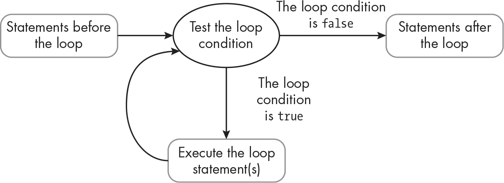
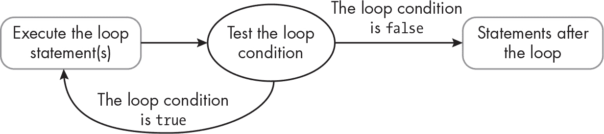

## 第六章：6 循环


本章介绍了*循环*，一种控制结构，它允许你反复执行一系列语句。一旦你理解了如何使用循环，你将能够轻松创建脚本，处理大量数据，并用高效编写的代码执行重复性任务。

我们将介绍两种主要的 PHP 循环：`while` 循环和 `for` 循环。`while` 循环用于在满足特定条件之前重复一系列操作，而 `for` 循环用于重复固定次数的操作。我们还将了解 `do...while` 循环，它是 `while` 循环的一种变体。第四种类型的 PHP 循环是 `foreach` 循环，专门用于遍历数据集合，如数组。我们将在第七章介绍 `foreach` 循环时讲解数组。

### while 循环

PHP 中的一种循环是 `while` 循环：一系列语句会在某个条件为真时*反复*执行。图 6-1 展示了这一过程是如何运作的。



图 6-1：`while` 循环的逻辑流程

当脚本包含 `while` 循环时，通常会有一些语句在循环开始之前执行。然后，PHP 引擎检查控制循环的条件。如果条件为假，则循环中的语句将永远不会执行，程序会跳过循环后面的语句。如果条件为真，循环中的语句会执行一次，然后再次检查条件。如果条件仍然为真，循环中的语句将再次执行。这个过程会继续进行，PHP 引擎会在每次新一轮重复前检查条件，直到条件为假，循环结束。

编写 `while` 循环时，从 `while` 关键字开始，后跟括号中的布尔条件，控制循环的执行。然后，将需要重复执行的语句放入大括号中。如果循环只包含一条语句，大括号是可选的，但大多数程序员仍然会使用大括号，以强调该语句是循环的一部分。

示例 6-1 显示了一个使用 `while` 循环来测试密码长度的脚本。该循环会不断提示用户输入新密码，直到密码足够长。

```
<?php
$password = "cat";

while (strlen($password) < 6) {
    $password = readline("enter new password (at least 6 characters): ");
}

print "password now set to '$password'";
```

示例 6-1：一个要求密码长度为六个字符或更多的 `while` 循环

在循环之前，我们将 `$password` 变量设置为初始值 "cat"。然后我们声明 `while` 循环，使用 `strlen($password) < 6` 作为条件。在每次循环之前，PHP 会检查 `$password` 的长度。如果密码长度小于六个字符，条件为真，循环中的语句将执行。如果密码长度为六个字符或更多，条件为假，循环将结束。由于 `$password` 最初是三个字符，所以我们知道循环至少会执行一次。

在循环内，我们使用内置的 `readline()` 函数从用户那里获取密码。该函数将传递的字符串作为命令行提示符显示，然后读取用户在命令行输入的内容，直到按下 ENTER 键。我们将结果存储回 `$password` 变量中，因此在下一次循环重复之前，我们会检查新的值。当密码长度足够并且循环结束时，我们会将新值的 `$password` 返回给用户确认。

> 注意

*这个程序* 不是 *一个良好的安全密码协议示例，因为密码会显示在屏幕上，任何人都可以看到。但它是一个演示 `while` *循环* 的便捷示例。*

以下是该脚本的一个示例运行。我在输入一个可接受的密码之前，先输入了几个过短的密码：

```
enter new password (at least 6 characters): **dog**
enter new password (at least 6 characters): **whale**
enter new password (at least 6 characters): **catdog123**
password now set to 'catdog123'
```

以下是每次 PHP 引擎检查 `strlen($password) < 6` 条件时的情况，发生在此脚本的运行过程中：

1.   $password 包含 "cat"，因此条件为真。循环执行一次。

2.   $password 包含 "dog"，所以条件依然为真。循环第二次执行。

3.   $password 包含 "whale"，所以条件依然为真。循环第三次执行。

4.   $password 包含 "catdog123"，所以条件为假。循环结束，最后的打印语句执行。

总的来说，PHP 引擎检查循环条件四次，并且循环内容重复执行三次。每次 `while` 循环的条件检查次数总比循环的重复次数多一次，因为条件检查发生在循环内容执行*之前*。试着将$password 的初始值改为至少六个字符的文本，然后再次运行脚本。你会发现脚本直接跳到最后的打印语句，因为第一次检查循环条件时条件值为假。

#### `do...while` 循环

`do...while` 循环是 `while` 循环的另一种形式：条件检查发生在每次循环重复*之后*，而不是之前。这样，循环中的语句保证至少执行一次，且循环的重复次数将与条件检查的次数相匹配。图 6-2 展示了这一过程是如何工作的。



图 6-2：`do...while` 循环的逻辑流程

使用 `do...while` 循环时，我们首先执行一次循环中的语句。然后测试循环条件。如果条件为假，程序会跳到循环后的语句，因此循环只执行一次。如果条件为真，循环语句会再次执行，依此类推，直到条件为假。

要编写 do...while 循环，首先使用 do 关键字，然后用大括号括起应重复执行的语句。闭括号之后，写上 while 关键字，然后在括号内写上循环条件。例如，示例 6-2 展示了如何通过使用 do...while 循环来重写 示例 6-1 中的密码检查脚本，而不是使用 while 循环。更改部分用黑色文字显示。

```
<?php
do {
 $password = readline("enter new password (at least 6 characters): ");
} while (strlen($password) < 6);

print "password now set to '$password'";
```

示例 6-2：示例 6-1 的修改版本，使用了 do...while 循环

我们通过 do 关键字开始循环。然后，在 readline() 函数的语句之后，在闭括号所在的同一行，我们写上 while 关键字，然后在括号内写上与之前相同的 strlen ($password) < 6 循环条件。请注意，我们需要在条件后加上分号，以结束语句。

这与之前版本脚本的关键区别在于，我们不再需要在进入循环前为 $password 变量设置初始值。相反，在第一次运行循环时，我们从用户那里读取一个初始密码，然后测试其值并决定是否需要重复。一般来说，如果你知道希望循环中的语句至少执行一次，那么 do...while 循环可能比 while 循环更适合。

#### 布尔标志

如果决定是否继续循环的逻辑比单一条件更复杂，通常通过使用一个布尔变量（称为*标志*）来控制循环会更加清晰。通常，你会将标志设置为 true，然后进入循环，使用该标志作为条件。循环本身会包含逻辑（可能是一个 if 语句系列），在循环准备结束时，将标志的值设置为 false。

例如，假设我们想要反复提示用户输入，直到他们输入 *quit* 或 *q*。我们可以通过以下方式使用 while 循环来实现：

```
while (($userInput != 'q') && ($userInput != 'quit')) {
```

这个循环的条件几乎难以阅读，如果我们想要监控第三个输入，它会变得更加复杂。通过布尔标志控制循环可以使代码更清晰，正如在示例 6-3 中所示。

```
<?php
$continueLooping = true;
while ($continueLooping) {
    $userInput = readline("type something (or: quit): ");

    if ($userInput == 'quit') {
        $continueLooping = false;
    }
    if ($userInput == 'q') {
        $continueLooping = false;
    }

    print "you typed '$userInput'\n";
}

print '--- I have left the loop! ---';
```

示例 6-3：使用布尔标志变量作为循环条件

我们首先创建布尔标志变量 $continueLooping 并将其设置为 true。然后，我们声明一个 while 循环，以该标志作为循环条件。请注意，这比之前的复合条件更清晰。由于条件最初为 true，我们将进入循环并至少执行一次循环语句组。在提示用户输入文本并将其存储在 $userInput 变量中之后，我们使用两个 if 语句来检查该变量是否包含 'quit' 或 'q'。这两个 if 语句代替了原来的复合循环条件；当用户要求退出时，它们将标志设置为 false，从而结束循环。在 if 语句之后，我们打印用户的输入。然后，在循环外部，我们打印一条消息，确认循环已经结束。

这是脚本的一个示例运行：

```
type something (or: quit): **the**
you typed 'the'
type something (or: quit): **cat sat**
you typed 'cat sat'
type something (or: quit): **on**
you typed 'on '
type something (or: quit): **the mat**
you typed 'the mat'
type something (or: quit): **quit**
you typed 'quit'
--- I have left the loop! ---
```

如你所见，脚本会打印出用户输入的任何文本。在这个例子中，循环在我输入*quit*后结束，但如果你输入字母*q*，它也会结束。

#### `break`语句

`break`关键字会立即退出循环，不允许任何剩余的语句在循环中执行。在前一个脚本的输出中，你可能注意到当我输入*quit*时，这个词会在循环的最后一个打印语句（你输入了'quit'）中重复显示，然后才会终止循环。使用`break`语句后，当用户输入*quit*或*q*时，我们可以立即停止循环，而不会执行打印语句。

使用`break`还消除了布尔标志的需求。相反，我们可以通过写`while (true)`来直接使用布尔值`true`作为循环条件。由于`true`始终为真，这个循环理论上会永远重复，或者至少直到某个条件逻辑触发`break`语句为止。列表 6-4 展示了如何更新我们的用户输入脚本，使用`while (true)`和`break`。

```
<?php
❶ while (true) {
 $userInput = readline("type something (or: quit): ");

 if ($userInput == 'quit'){
        break;
 }

 if ($userInput == 'q'){
        break;
 }

  ❷ print "you typed '$userInput'\n";
}

❸ print '--- I have left the loop! ---';
```

列表 6-4：列表 6-3 的更新版本，使用`break`语句退出`while (true)`循环

我们删除了$continueLooping 布尔标志，并用字面量`true`替换了`while`循环的条件❶。在循环内部，我们仍然有两个`if`语句来测试`$userInput`是否包含字符串'quit'或'q'，但这次每个`if`语句中都简单地包含了`break`关键字，以立即退出循环。这样，如果任何一个`if`语句通过，我们将直接跳到最终的打印语句❸，而不会执行循环内部的打印语句❷。

这是更新后的脚本版本的一个示例运行：

```
type something (or: quit): **hello**
you typed 'hello'
type something (or: quit): **world**
you typed 'world'
type something (or: quit): **quit**
--- I have left the loop! ---
```

这次，当我输入*quit*时，循环不再打印“你输入了'quit'”这样的消息。相反，循环会立即结束，所以下一条消息是——我已经离开循环！——。

在许多情况下，是否使用`break`语句或布尔标志来终止循环，取决于个人偏好。如果你来自于不支持`break`语句的语言，布尔标志可能会感觉更自然。另一方面，如果需要测试多个条件来决定循环是否结束，`break`语句则更为实用。例如，在编写代码编译器或编程语言工具时，可能需要包含几十个甚至上百个测试。使用`break`语句可以避免你在执行完所有测试后，需要滚动浏览代码页面以查看后续循环语句中可能发生的情况。

### `for`循环

for 循环是一种重复固定次数的循环。如果你确切知道你想要重复任务的次数（例如，给用户三次机会输入正确的密码，或者从试题库中随机选择 10 道题目测试学生），那么 for 循环可能比 while 循环更合适。for 循环围绕一个 *计数器变量*，通常称为 $i（即 *迭代器* 的缩写），它控制循环的重复次数。声明一个 for 循环需要三个表达式，所有表达式都涉及到这个计数器变量：

1.   一个表达式，用于将计数器初始化为起始值

2.   一个表达式，用于测试计数器的值，以决定何时停止循环

3.   一个表达式，用于在每次循环后递增（或递减）计数器

要声明一个 for 循环，这三个表达式会在 for 关键字后面依次写在一行内，并且被一对括号括起来。下面是一个示例：

```
for ($i = 1; $i <= 5; $i++) {
```

这里 $i = 1 将计数器变量初始化为 1。然后 $i <= 5 设置循环条件；只要 $i 小于或等于 5，循环将继续执行。PHP 会在每次新一轮循环前检查这个条件。最后，$i++ 使用增量运算符（++）告诉 PHP 在每次循环后将 1 加到 $i 上。这样，$i 就会在每个循环周期中获取一个新的值，并且这个值可以与循环条件进行比较。在这种情况下，第一次执行时，$i 的值为 1，第二次执行时为 2，以此类推。当第五次执行时，$i 的值为 5，$i <= 5 的条件仍然成立，但在第五次循环结束时，$i 会被递增到 6。此时，$i 不再小于或等于 5，因此循环在执行完五次后结束。

为了验证 for 循环是否按预期工作，让我们在循环体内填入一个简单的 print 语句，如示例 6-5 所示。这个脚本应该会打印相同的消息五次。

```
<?php
for ($i = 1; $i <= 5; $i++) {
    print "I am a for loop\n";
}
```

示例 6-5：一个 for 循环的示例

我们声明一个 for 循环，使用我们刚刚讨论过的循环变量 $i 的相同表达式集。在大括号内，定义了循环语句组，我们写入一个 print 语句。下面是运行该脚本的输出：

```
I am a for loop
I am a for loop
I am a for loop
I am a for loop
I am a for loop
```

如你所见，由于 for 循环的计数器变量从 1 开始递增，直到不再小于或等于 5，消息确实打印了五次。

#### 在循环中使用计数器

for 循环的一个优势是计数器变量 $i 可以在循环体内使用。这有助于处理数学任务或使用通过一系列整数索引或标识的有序数据集。例如，我们可能希望处理数据库表中所有 ID 为从 1 开始的整数序列的项（有关数据库的更多信息，请参见 第六部分）。或者我们可能希望顺序遍历一个整数索引数组中的所有元素（有关数组的更多信息，请参见 第七章）。

为了演示，列表 6-6 显示了我们原始 for 循环的更新版本，该版本将 $i 的值包含到打印的消息中。由于 $i 在每次循环重复时都有不同的值，现在每条消息都将是唯一的。

```
<?php
for ($i = 1; $i <= 5; $i++) {
    print "I am repetition $i of a for loop\n";
}
```

列表 6-6：在 for 循环中使用计数器变量 $i

我们已经更新了循环的打印语句，以包括 $i 的值。以下是结果：

```
I am repetition 1 of a for loop
I am repetition 2 of a for loop
I am repetition 3 of a for loop
I am repetition 4 of a for loop
I am repetition 5 of a for loop
```

请注意，每一行输出中的数字会根据 $i 的值变化。输出有助于说明计数器变量是如何工作的：它从 1 开始，并随着每次循环重复增加 1。一旦 $i 达到 6，$i <= 5 条件不再成立，因此循环结束，而没有打印 "I am repetition 6 of a for loop"。

到目前为止，我们一直将 $i 初始化为 1，但你可以将其初始化为任何你想要的值。实际上，你会发现很多 for 循环的例子使用了从 0 开始的计数器变量。这是因为 for 循环通常与数组一起使用，数组是从 0 开始编号的项目集合。我们将在 第七章 中讨论数组，以及如何遍历它们。

当你将计数器变量初始化为 0 时，通常也会使用小于运算符 (<) 设置循环条件，而不是小于或等于运算符 (<=)，如下所示：

```
for ($i = 0; $i < 3; $i++) {
```

只要 $i 小于 3，循环就会继续执行。由于 $i 从 0 开始，循环将执行三次，$i 分别为 0、1 和 2。

#### 跳过循环语句

continue 关键字停止当前循环的重复，但与 break 关键字不同，它不会完全结束循环。相反，循环会立即跳到下一个重复。这在你想跳过某些循环次数时非常有用。例如，也许你正在从数据库中检索条目，并希望忽略某些值，或者你只想使用某些序列中的数字，例如从一个随机排列的数据集中每三个项目的随机样本。

列表 6-7 显示了一个包含 continue 语句的 for 循环示例。在这里，我们使用 continue 跳过计数器变量 $i 的奇数值，因此我们最终只打印偶数值。该列表还展示了如何让 for 循环递减计数器变量，而不是递增它。

```
<?php
for ($i = 8; $i > 0; $i--) {
  ❶ $odd = ($i % 2);

    if ($odd) {
        continue;
    }
  ❷ print "I am an even number: $i\n";
}
```

列表 6-7：使用 continue 跳过 for 循环的部分

我们声明了一个 for 循环，其中 $i 计数器变量从 8 开始，并在每次重复后通过 $i-- 表达式递减。循环将倒计时到 1，然后当 $i 等于 0 时停止。在循环内部，我们使用取模运算符 (%) 测试当前 $i 的值是偶数还是奇数 ❶。如果是偶数，$i % 2 的结果为 0；如果是奇数，$i % 2 的结果为 1。不论哪种情况，我们将结果存储在 $odd 变量中，然后将该变量作为 if 语句的条件。

由于 if 语句需要一个布尔条件，$odd 将被强制转换为布尔值：当为 1 时为 true，0 时为 false。这样，当 $i 为奇数时，我们会执行 if 语句，该语句只包含 continue 关键字，用于中断当前循环的重复并跳到下一个。当 $i 为偶数时，我们不执行 if 语句的主体，从而通过执行 print 语句 ❷ 完成当前循环的重复。最终效果是我们只打印出 $i 的偶数值，输出如下所示：

```
I am an even number: 8
I am an even number: 6
I am an even number: 4
I am an even number: 2
```

由于我们的条件逻辑触发了循环中的 continue 语句，我们成功跳过了奇数。

> 注意

*continue* 关键字在 *while* 循环中的作用与在 *for* 循环中一样。同样，*break* 关键字也用于完全停止一个 *for* 循环。

#### 处理最后一次重复

有时候，你可能希望在循环的最后一次重复时做一些不同的事情。对于 while 或 do...while 循环，直到循环结束时你才知道是否是最后一次重复，但对于 for 循环，你可以通过条件逻辑预见到最后一次重复，并编写代码以不同的方式处理这一重复。

比如说，我们使用一个 for 循环来构建一个字符串，其中包含用户输入的项列表，并且我们希望用逗号分隔每一项。我们可能会想写类似 Listing 6-8 这样的代码。

```
<?php
$message = "go to the market and buy: ";
$numItems = 3;
for ($i = 1; $i <= $numItems; $i++) {
    $item = readline("type something to buy: ");
    $message .= "$item, ";
}

print $message;
```

Listing 6-8: 一个使用 for 循环创建的项列表，并用逗号分隔

我们初始化一个 $message 变量，值为 "go to the market and buy: "。然后我们将 $numItems 的值设为 3。这将是我们 for 循环的重复次数。接着，我们声明 for 循环，在该循环中，$i 从 1 数到 $numItems（3）。每次循环时，我们提示用户输入一个要购买的商品，并将输入值存储在 $item 变量中。然后我们将 $item 的值附加到 $message 字符串后面，后面跟一个逗号和一个空格。当循环结束时，我们打印出构建好的 $message 字符串。

问题在于我们将循环的每次重复都视为相同，因此最终消息中的每一项后面都会跟一个逗号，包括最后一项。你可以在以下脚本的示例运行中看到这一点：

```
type something to buy: **bread**
type something to buy: **butter**
type something to buy: **apples**
go to the market and buy: bread, butter, apples,
```

我们的脚本已经构建了一个包含在命令行输入的三项内容的消息，但不幸的是，最后一项“apples”后面出现了逗号。我们可以通过添加一个测试来确定是否是最后一次循环迭代，然后只有在不是最后一次迭代时才添加逗号。清单 6-9 展示了如何更新脚本。

```
<?php
$message = "go to the market and buy: ";
$numItems = 3;
for ($i = 1; $i <= $numItems; $i++) {
 $item = readline("type something to buy: ");
    $message .= $item;
    $lastIteration = ($i == $numItems);
    if (!$lastIteration) {
        $message .= ', ';
    }
}

print $message;
```

清单 6-9：更新清单 6-8 的脚本以去掉最后的逗号

这次，我们首先仅将 $item 的值附加到 $message 字符串中，不加逗号和空格。然后，我们创建了一个布尔变量 $lastIteration，并赋予它表达式 $i == $numItems 的值。这个表达式只有在循环的最后一次迭代时才为 true。接下来，我们使用 if 语句，并将 !$lastIteration 作为条件。感谢 NOT 操作符（!），这个条件在所有循环迭代中都为 true，除了最后一次。在 if 语句内部，我们将逗号和空格附加到 $message。这样，除了最后一项，列表中的每一项后面都会有逗号。

下面是更新后的脚本运行示例：

```
type something to buy: **bread**
type something to buy: **butter**
type something to buy: **apples**
go to the market and buy: bread, butter, apples
```

我们不再在列表的最后一项“apples”后面加逗号，因为我们将 for 循环的最后一次迭代与其他迭代区分开来处理。

> 注意

*一旦我们开始使用数组，就可以通过使用内置的* implode() *函数来避免这种特殊的最后一次迭代循环逻辑。它智能地在列表中的每一项之间添加分隔符，但不会在最后一项后添加。我们将在第七章中讨论这个问题。*

### 另一种循环语法

PHP 提供了另一种语法来编写 while 和 for 循环，用冒号（:）而不是用大括号将循环内容括起来。就像我们在第四章中讨论的 if 语句的替代语法一样，这种编写循环的方式在将 PHP 语句与模板文本（如用于 web 应用程序的 HTML）结合使用时非常有用。为了演示，清单 6-10 使用替代语法重写了清单 6-1 中的密码设置 while 循环。

```
<?php
$password = "cat";

while (strlen($password) < 6):
    $password = readline("enter new password (at least 6 characters): ");
endwhile;

print "password now set to '$password'";
```

清单 6-10：来自清单 6-1 的 while 循环的另一种语法

请注意，声明 while 循环的那一行以冒号结尾，而不是以大括号开头。我们使用 endwhile 关键字来表示循环的结束，而不是闭合大括号。

清单 6-11 同样展示了来自清单 6-6 的 for 循环的另一种语法。

```
<?php
for ($i = 1; $i <= 5; $i++):
    print "I am repetition $i of a for loop\n";
endfor;
```

清单 6-11：来自清单 6-6 的 for 循环的另一种语法

再次注意声明循环的那一行以冒号结尾，并且使用 endfor 关键字来表示循环的结束。

> 注意

*PHP 没有 do...while 循环的另一种语法*。

### 避免无限循环

很容易不小心陷入一个无限循环，导致循环不断重复，因为停止条件永远无法满足。为了避免这种情况，确保控制循环的条件能够在适当的时候变为假是非常重要的。一种常见的错误写法是在循环条件相对的方向上设置递增表达式。例如，考虑以下代码：

```
for ($i = 1; $i > 0; $i++) {
```

这个递增表达式在每次重复后给$i 加 1。同时，循环条件会测试$i 是否大于 0。由于$i 在每次重复时都在增加，它将始终大于 0，因此循环永远不会结束。解决方法是让$i 递减，而不是递增，或者将循环条件改为某种小于比较。

使用 while 和 do...while 循环时，如果循环条件中的变量在循环语句中没有机会被正确改变，就容易陷入无限重复。例如，假设我们想编写一个脚本，将用户输入的价格累加，直到总和超过 100 美元，然后打印出结果。我们可能会不小心写出像列表 6-12 这样的代码，导致无限循环。

```
<?php
$total = 0;

do {
    $costString = readline("enter item cost: ");

    if (is_numeric($costString)) {
      ❶ $total = floatval($costString);
    }
} while ($total < 100);

print "grant total = \$$total\n";
```

列表 6-12：一个无意中的无限 do...while 循环

我们将$total 设置为 0，然后进入一个 do...while 循环，只要$total 小于 100 就一直重复。在循环内部，我们从用户那里获取一行输入，并验证其是否为数字。如果是数字，我们将输入转换为浮动类型，并将该值存储在$total 中❶。

你看到问题了吗？我们本应该使用类似`$total += floatval($costString);`这样的代码来将最新输入的值加到已有的$total 值中，但我们使用了常规的赋值操作符（=），而不是加法赋值操作符（+=）。因此，$total 的值将始终是最后输入的值。如果用户输入的值大于 100，循环会结束，打印语句会回显该最后的值。否则，我们就会陷入无限循环，而无法真正计算累计总和。

无限 while 循环还会发生在循环条件中测试的变量永远不会变化的情况下，一旦进入循环，就无法退出。回到列表 6-12，例如，我们可能会使用一个$grandTotal 变量来设置循环条件，如`while($grandTotal < 100)`，但在循环内部递增的是$total 变量，而不是$grandTotal。这样，$grandTotal 将永远不变，循环将永远执行下去。

### 总结

在本章中，我们研究了 `while` 循环、`do...while` 循环和 `for` 循环，这些循环提供了不同的方式来重复执行一系列语句。关键在于如何决定循环的重复次数：可以设置循环停止的条件，如 `while` 或 `do...while` 循环，或者指定固定的重复次数，如 `for` 循环。除了这些基本的循环结构外，我们还讨论了 `break` 和 `continue` 语句，分别提供了强制结束整个循环或当前循环重复的机制。掌握了像循环和选择语句这样的控制结构后，你将能够编写出执行重复任务并根据当前条件作出决策的复杂程序。

### 练习

1.   使用 `do...while` 循环持续接受用户输入的单词，直到输入的单词以大写字母开头。

提示：将输入的字符串与 `ucfirst()` 函数返回的值进行比较。

2.   使用 `while (true)` 循环配合 `break` 语句，持续接受用户输入的字符串，直到输入的字符串是数字。

提示：使用 `is_numeric()` 函数。

3.   在 `for` 循环中使用 `continue` 语句，打印出所有小于等于 21 的 3 的倍数（3、6、9，依此类推）。
