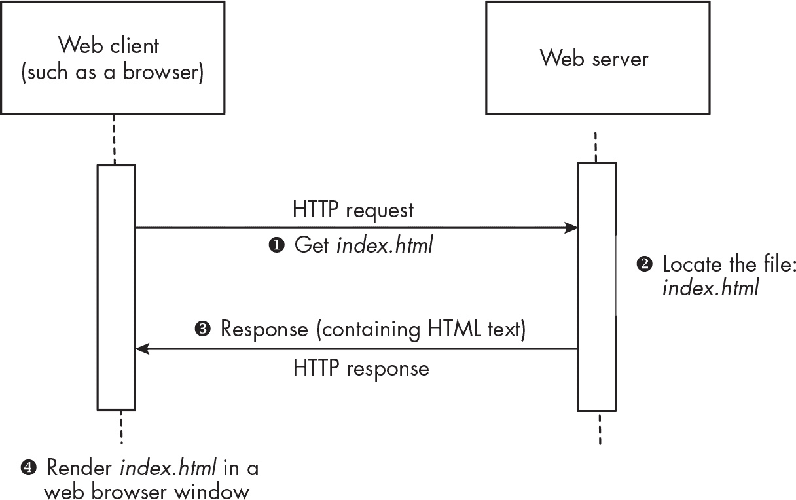
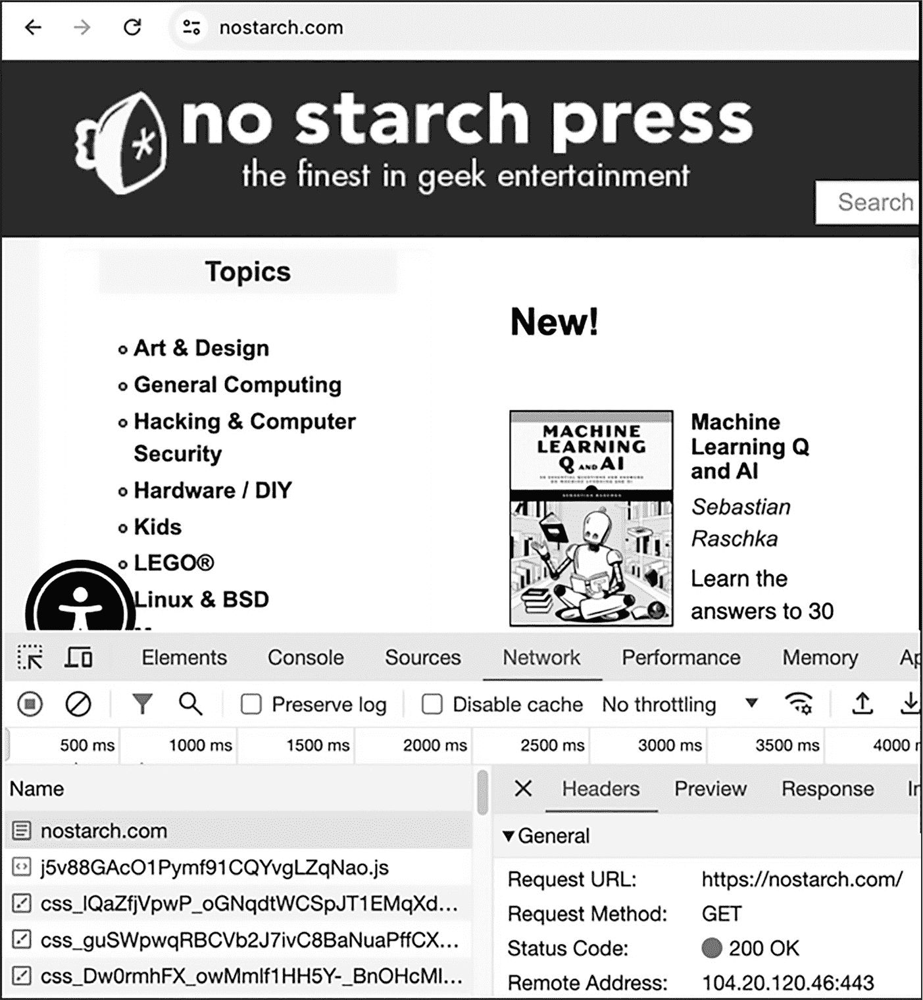
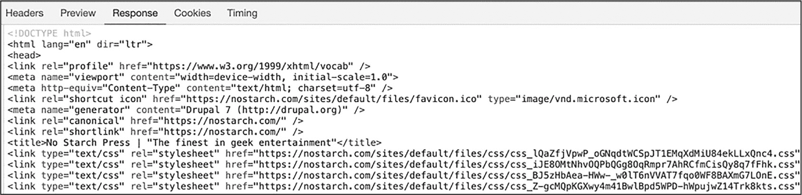
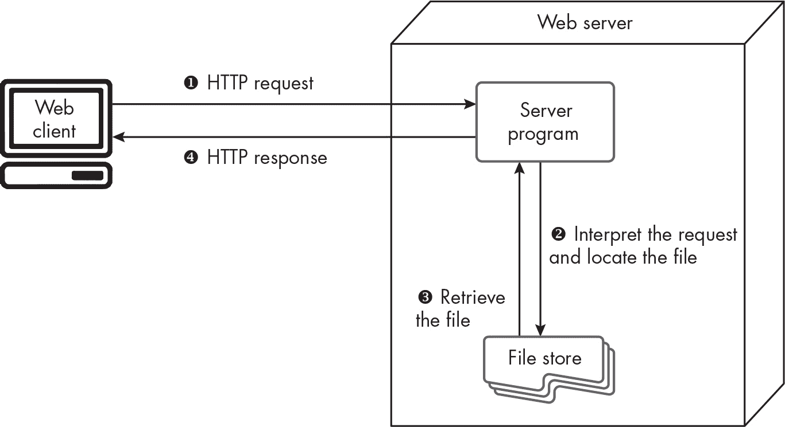
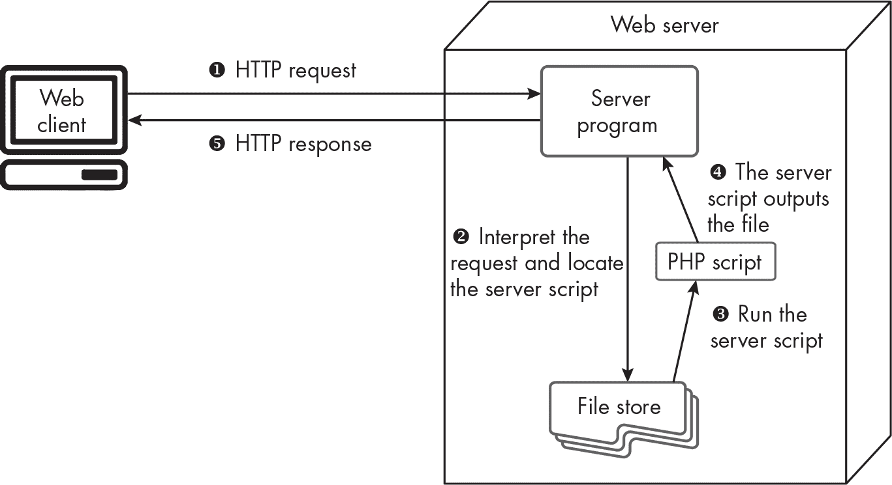
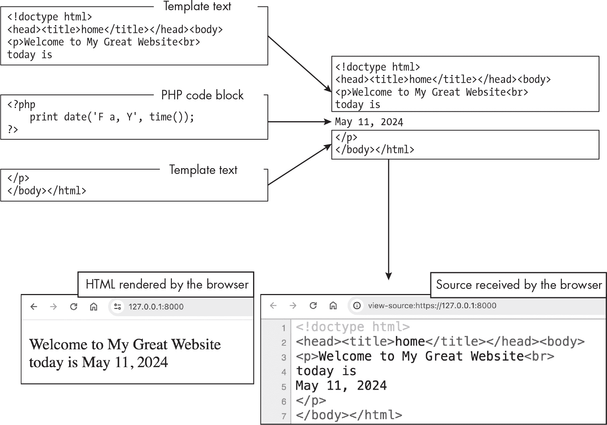
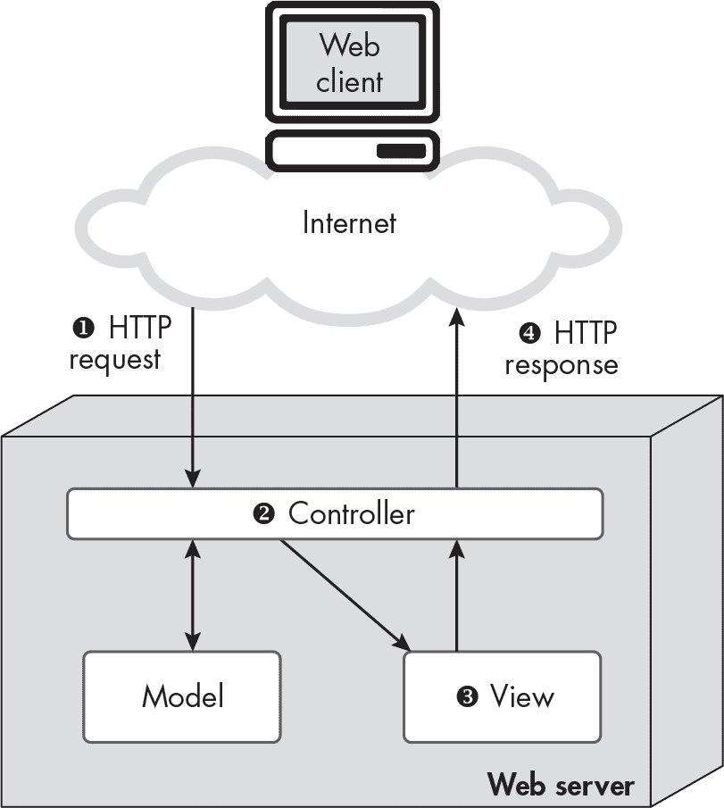
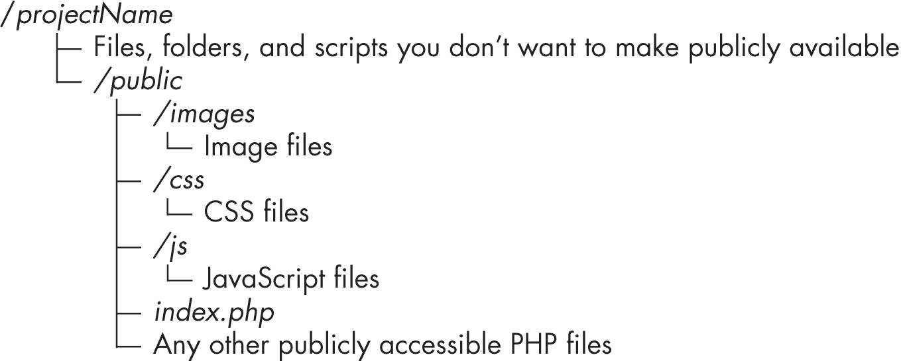
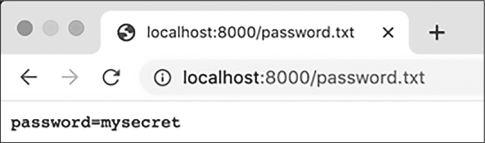

## 第十章：10 客户端/服务器通信与网页开发基础


作为互联网语言，PHP 与网页*客户端*和网页*服务器*之间的通信紧密相关。在本章中，我们将了解客户端和服务器如何工作，检查它们之间传递的消息。我们还将学习如何有效地将 PHP 语句嵌入静态 HTML 代码中，以构建一个完整的 HTML 文本文件，网页浏览器客户端可以理解并在屏幕上呈现为网页。最后，我们将讨论典型的 PHP 网页应用程序的结构，包括对模型-视图-控制器（MVC）架构的初步了解。

不管你是否意识到，你可能每天都会使用客户端和服务器。当你检查你的电子邮件或社交媒体账户时，你正在使用一个客户端应用程序与服务器进行通信，请求更新。这类应用程序不断地向服务器发送请求；例如，你的电子邮件应用程序会向像 Google Gmail 或 Apple iCloud 这样的服务器请求，以便下载任何新邮件并更新手机上的信息和文件夹，确保与服务器上的变化保持同步。

你可以在两个地方运行网页服务器应用程序：本地计算机上，或者是一个可以公开访问的互联网计算机上。作为 PHP 程序员，你会在自己的机器上进行大量本地开发。当你觉得一个项目准备好了，你会在公共服务器上测试它，最后，在所有测试完成后将网站发布到线上。

### HTTP 请求-响应周期

在基于网页的客户端/服务器通信的核心是*HTTP 请求-响应周期*。从高层次来看，客户端向服务器发送*请求*，然后服务器向客户端返回*响应*。响应本身可以是一个错误代码，或者是一个包含文本、图像文件、二进制可执行文件或其他内容的消息。图 10-1 展示了一个简单的请求-响应周期。



图 10-1：一个简单的 HTTP 请求-响应周期

客户端，即一个网页浏览器，发送请求，要求获取*index.xhtml*文件❶。服务器接收到并解码请求，然后搜索并成功找到请求的资源（文件）❷。服务器接着创建并返回一个响应，其主体是*index.xhtml*的 HTML 文本❸。最后，网页浏览器读取收到的 HTML，并在浏览器窗口中漂亮地显示网页内容给用户❹。

客户端可以发送不同类型的请求。两种最常见的请求方法是 GET 和 POST。HTTP GET 方法更简单，在使用 Web 浏览器客户端时，显示许多发送的内容在 Web 浏览器的 URL 地址栏中。例如，如果你使用 Google 搜索引擎搜索 *cheese cake* 这个短语，你会看到这些词出现在 URL 的末尾，发送查询给 Google 时是这样的：*https://www.google.com/search?q=cheese+cake*。实际上，每当你在浏览器地址栏中输入一个 URL 并按下回车键时，你就是在发送 GET 请求。

POST 方法可以隐藏请求消息体中发送的许多内容。因此，它通常用于更私密的网站操作。

除了 GET 和 POST，原始的 HTTP 1.0 定义了第三种方法 HEAD。它请求一个没有消息体的响应，只有头部，其中包含关于响应的一般信息。自从引入 HTTP 1.1 后，还允许使用其他五种方法（OPTIONS、PUT、DELETE、TRACE 和 CONNECT）。这些方法对于本书中讨论的 Web 开发层级并不需要，尽管它们对于复杂的 Web 应用程序来说是有用的。

#### 响应状态码

每个由服务器返回的 HTTP 响应开头都有一个三位数的 HTTP *状态码*，告诉客户端服务器尝试处理并完成请求的状态。所有符合 HTTP 标准的服务器必须使用一套标准代码，此外，不同的服务器还会使用自定义代码。最常见的代码是 200 OK，表示请求已成功完成，以及 404 Not Found，表示服务器无法找到请求的资源。

状态码的第一位数字表示服务器对请求的解释和处理的总体状态。以下是第一位数字的含义概述：

1nn **(信息性状态码)**   请求头已经接收并理解，进一步处理需要进行。换句话说，“到目前为止一切顺利，但还没有完成。”这些状态码相对不常见，它们是信息性状态码，用于当服务器需要向客户端传达某些信息，但不是完整的响应时。

2nn **(成功)**   请求已接收、理解并接受（例如，200 OK）。

3nn **(重定向)**   请求已理解，但客户端必须采取进一步行动，例如从选项中选择（300 多重选择）或如果资源已永久移动，按照新 URL 访问（301 永久移动）。

4nn **(客户端错误)**   请求无效（如 400 错误请求），或者由于客户端错误，服务器无法完成请求（如 404 未找到或 403 禁止访问）。

5nn **(服务器错误)**   服务器遇到错误或因其他原因无法完成请求。例子包括 500 服务器错误和 502 服务不可用。

你可以在 Todd Fredrich 的免费在线 REST API 教程中了解更多关于 HTTP 及其状态码的内容：*[`www.restapitutorial.com`](https://www.restapitutorial.com)*。

#### 一个 GET 请求的例子

让我们通过查看访问 No Starch Press 网站时发生的幕后情况，来看一个简单的请求-响应周期的例子。首先，你需要显示浏览器的请求-响应检查工具。在 Google Chrome 中，这些工具通常可以通过名为开发者工具的菜单项访问。打开开发者工具后，你会看到一个窗口，类似于图 10-2 底部的样子。



图 10-2：GET 请求 No Starch Press 主页

点击**网络**标签，你就可以开始记录和查看 HTTP 请求-响应周期了。在浏览器地址栏中输入**nostarch.com**。当你按下 ENTER 键时，你应该能看到主页出现。在开发者窗口的左侧找到“名称”列，定位到第一个文件，它应该是*nostarch.com*，然后点击它。点击**头部**以查看 HTTP 头部的总结，显示在图 10-3 中。

这个总结表示，HTTP 请求的目标是网址*[`nostarch.com`](https://nostarch.com)*，请求方法为 GET（因为我们刚在地址栏中输入了网址）。HTTP 响应头中最重要的部分是 200 的成功状态码。

向下滚动 HTTP 头部内容，你将看到 HTTP 请求和 HTTP 响应头部的详细信息。在请求头部部分，你可以看到网页客户端愿意接受的文件类型列表，如 HTML、XML、图像等。你还可以看到内容可用的语言（例如，EN 代表英语）。对应地，响应头部则指示响应体中的实际内容类型，如 text/html、文件的最后修改日期等。

> 注意

*现代大多数网站现在使用超文本传输协议安全（HTTPS），它使客户端和服务器能够交换证书，从而确保 HTTP 消息的加密传输。这就是为什么 No Starch Press 的网址以* https://*开头的原因。HTTPS 已集成在许多 PHP 网页服务器中，因此我们此时不再深入讨论它。*

现在点击**响应**标签查看响应体的内容，如图 10-3 所示。这是网页浏览器接收到的 HTML 文本，然后它会渲染成一个吸引人的图形网页，供你查看和交互。



图 10-3：HTTP 响应体中的 HTML 文本内容

在 HTML 代码的底部，你会看到一列 CSS 链接。当处理收到的 HTML 时，Web 客户端（浏览器）会寻找页面所需的其他内容文件，如 CSS 样式表、图像文件和 JavaScript 文件。浏览器会快速地（在现代网络速度下我们很少注意到这一点）向服务器发起额外的 HTTP 请求来获取这些文件，并且随着相应的 HTTP 响应到达，浏览器会渲染网页。这些从 Web 服务器收到的额外文件可以在 图 10-2 的名称列中看到，位于原始请求 *nostarch.com* 下面，它们的名称像 *css_lQaZ* 等等。

需要强调的是，并非每个 HTTP 请求都必须由用户通过输入 URL、点击链接或提交表单来发起。Web 浏览器可以在后台（异步地）发起额外的请求，以获取所需的资源，例如图像、CSS 文件和 JavaScript 文件。这些额外的请求可能会发送到与浏览器正在处理的 HTML 相同的 Web 服务器，或者发送到其他 Web 服务器（例如，下载免费的 Google 字体或 Bootstrap CSS 和 JavaScript）。

> 注意

*JavaScript 代码也可以发起额外的 HTTP 请求，例如从远程网站获取数据。这被称为* 异步 JavaScript 和 XML (AJAX)*，虽然许多类型的数据文件可以被检索，例如 JSON 和纯文本，因此这样的 HTTP 请求并不限于仅检索 XML 数据。这个话题超出了本 PHP 书的范围。*

### 服务器的运作方式

我们已经在较高层次上讨论了客户端和服务器如何通过 HTTP 请求和响应进行通信。现在，让我们更仔细地看看 Web 服务器的工作原理。我们还将开始了解 PHP 如何在服务器的操作中发挥作用。

#### 用于文件检索的简单 Web 服务器

简单 Web 服务器的任务是监听资源请求，并在收到请求时，识别请求的资源并返回包含资源的消息，或者如果找不到该资源，则返回错误消息。简单的 Web 服务器本质上是一个能够理解 HTTP 请求并发送 HTTP 响应的文件服务器。图 10-4 展示了一个简单的 Web 服务器。



图 10-4：简单的 Web 服务器与 Web 客户端的通信

通常，客户端发送一个 GET 请求 ❶，请求一个文件，如 *index.xhtml*、*style.css* 或 *logo.png*。服务器接收并解释该请求，然后搜索请求的资源（文件） ❷。如果文件找不到，服务器会创建并返回一个 404 Not Found 错误。如果文件找到，服务器将检索其内容 ❸。最后，服务器会创建并返回一个响应给客户端 ❹。响应体是请求文件的内容，其头部包括 200 OK 状态码。

这个过程的一个很好的类比是，一个简单的网页服务器就像图书馆中的图书管理员：图书管理员会去找到请求的书籍，并带回书籍或一条信息，说明书籍无法找到。  

简单的网页服务器足以支持超文本或超媒体浏览不变的 HTML 页面集，例如常见问题解答（FAQ）及其回答段落，或者是很少需要更新的参考资料，如用户手册。简单的网页服务器是*无状态的*，这意味着相同的请求总是返回相同的文件。不同的客户端也会收到相同的文件。这通常被称为*静态*内容，表示它是固定不变的。回到图书管理员的类比，你不会期望图书管理员在取书时改变书的内容。  

我们可以总结简单的无状态网页服务器的行为如下：  

+   永不改变  

+   无论用户是否曾经访问过，都一样  

+   对每个用户都相同  

大多数网页活动比仅仅点击链接获取特定的静态文档要更加互动。大多数现代网页项目需要*动态交互性*，即系统根据用户输入做出不同的响应。动态交互性包括处理网页表单、管理购物车、根据最近的浏览历史定制内容等任务。大多数 PHP 网页应用程序是*动态*网页服务器，接下来我们将深入探讨。  

#### 处理数据的动态网页服务器  

对于一个基于网页的系统，要实现超越静态资源获取的交互性，除了基本的内容标记和超文本链接外，还需要其他技术。这些能力包括以下内容：  

+   支持用户输入方法，如输入文本、点击按钮和从菜单中选择  

+   可以根据不同的用户输入以不同方式处理和响应的简短代码脚本  

+   浏览器将用户输入或数据发送到服务器程序，以便处理数据并生成交互式响应的方法  

具备这些功能的动态服务器处理许多现代互联网活动，如在搜索引擎中输入关键词并呈现一个定制的、优先排序的链接页面，登录到个人电子邮件系统并查看自己的收件箱中的邮件，在线浏览商品目录并使用信用卡完成购买。  

在本书中，我们最关注的是理解并能运行 PHP 脚本的动态网页服务器。图 10-5 展示了客户端与这样一个动态网页服务器的通信。  

  

图 10-5：动态网页服务器与网页客户端的通信

在此模型中，客户端向服务器发送 HTTP 请求 ❶。然后，服务器程序解析请求并识别应执行哪个 PHP 服务器脚本 ❷。脚本执行 ❸ 并生成输出，例如 HTML 文本。运行 PHP 脚本还可能触发 Web 服务器上的其他操作，例如与数据库的通信，这是我们将在第六部分中探讨的内容。接下来，Web 服务器应用程序接收输出 ❹。最后，输出被打包到 HTTP 响应消息的主体中，并带着适当的头信息返回给最初发出请求的客户端 ❺。

#### 路由过程

*路由*是 Web 服务器用来决定如何响应所收到的 HTTP 请求的过程；服务器检查请求并确定它认为客户端请求的操作，如请求文件、尝试使用包含在请求中的用户名和密码数据登录、从数据库中删除项等。在最简单的情况下，请求包含特定资源文件的有效路径，如*/images/logo.jpg*或*/styles/homepage.css*。在这种情况下，Web 服务器充当文件服务器，返回包含文件内容并带有适当头信息的 HTTP 响应消息。

如果请求了有效的公开可用的*php*文件路径，如*/about.php*，则该 PHP 脚本将被解释并执行，以构建返回给客户端的 HTTP 响应。如果没有请求特定的文件，几乎所有 Web 服务器都有定义的*默认路由*，通常会路由到主页文件，通常为*index*。简单的静态 Web 服务器会查找*index.xhtml*作为默认主页返回，而 PHP Web 服务器通常会首先查找*index.php*，如果没有找到默认的 PHP 文件，则可能会查找*index.xhtml*。如果没有请求文件且未找到索引文件，服务器将返回 404 Not Found 响应。

复杂的 PHP Web 应用程序将使用编码在默认*index.php*脚本中的逻辑来检查请求的 URL 路径的内容和模式，从而决定如何响应请求。使用这种逻辑来管理多功能网站复杂性的*index.php* 文件被称为*前端控制器*。

以下是 Web 浏览器用来向 Web 服务器发出请求的一些 URL 示例，并附有解释其含义：

***tudublin.ie***   在域名后没有指定路径，因此 Web 服务器将执行默认的主页脚本（如果是 PHP Web 服务器，则为*index.php*）。TU Dublin 主页的 HTML 内容会返回给客户端。

***bbc.com/travel/columns/discovery***   该路径包含通过斜杠分隔的文本，因此主页脚本执行逻辑，搜索站点数据库中与主要话题*旅行*和子话题*发现*相关的内容。

***nostarch.com/sites/all/themes/nostarch/logo.png***   路径包含一个静态资源文件，因此 Web 服务器会定位并返回*logo.png*图像文件的内容。

***google.com/search?q=cheese+cake***   路径包含指示搜索的文本，在正斜杠后面（*search*），然后是搜索文本（*cheese cake*），这是一个在问号字符（*?*）后面赋值的变量（*q*）。因此，Google 主页脚本会执行逻辑，搜索与*cheese cake*相关的网页。在第十一章中，你将学习如何通过变量在 URL 中传递数据。

在第十三章中，我们将研究如何编写 PHP 前端控制器逻辑来执行路由决策，类似于这里总结的内容。

### 模板

几乎所有 PHP 应用程序都设计用来运行网站。对于大多数 HTTP 请求，响应的内容是某种文本，如 HTML、JavaScript 或 CSS 文件，或者可能是编码为 JSON 或 XML 的数据。因此，PHP 的设计是为了方便输出文本（例如，使用 print 和 echo 命令）。

此外，正如第一章中所暗示的，语言还使得将预写文本（如 HTML）与通过执行 PHP 代码动态生成的文本混合变得容易。这个特性使得 PHP 成为*模板语言*：它可以将动态生成的值插入到 HTML 或其他文本的静态模板中。基于 PHP 的网站受益于这种动态输出，可能是通过数据库交互或与各种数据源（如 Google Maps、天气 API 等）的通信来实现的。

在前几章中，我们编写了纯 PHP 程序，这些程序仅包含 PHP 代码。一旦我们开始使用 PHP 作为模板语言，混合 PHP 语句和其他模板文本（通常是 HTML）变得更加常见。这使得我们可以将不变的 HTML 网页部分直接写为 HTML；任何需要动态变化的部分都可以通过我们在 PHP 语句中编写的逻辑来输出。方便的是，许多网页中的 HTML 包含大量相同的内容，例如页头、导航栏（可能仅通过突出显示访问的特定页面而发生变化）和页面布局 HTML 代码（例如，div、header 和 footer 元素的层次结构）。所有这些不变的静态内容都非常适合用于 PHP 模板。

理论上，通过编写大量的 print 语句，可以让纯 PHP 脚本输出 HTML，但这种方法会导致代码冗长且难以阅读。请查看清单 10-1，它通过使用纯 PHP print 语句来输出 HTML。

```
<?php
print '<!doctype html>';
print '<head><title>home</title></head>';
print '<body>';
print '<p>Welcome to My Great Website<br>';
❶ print 'today is ' . date('F d, Y');
print '<p>';
print '</body></html>';
```

清单 10-1：通过 print 语句输出 HTML

我们在这里使用的唯一真正的 PHP 逻辑是调用 `date()` 函数，以字符串形式获取当前日期，格式为 *月 日, 年*（例如，*2025 年 1 月 1 日*）❶。其他所有行都是输出不变的 HTML 的打印语句，这些打印语句并不是必需的。通过仅在需要的地方使用 PHP，并将其插入到 HTML 模板中，我们可以使代码更加简洁和可读。这正是我们在示例 10-2 中所做的，在那里不变的 HTML 被直接写入，正如它最终将出现在发送给客户端的 HTML 文本文件中。

```
<!doctype html>
<head><title>home</title></head><body>
<p>Welcome to My Great Website<br>
today is
❶ <?php
    print date('F d, Y');
❷ ?>
</p>
</body></html>
```

示例 10-2：将 HTML 模板文本与 PHP 代码块混合

我们使用开头的 ❶ 和结尾的 ❷ PHP 标签将调用 `date()` 函数的打印语句包围起来，因为这是唯一需要 PHP 代码来动态生成内容的地方。与此同时，我们将其他所有内容编写为常规 HTML；不需要打印语句、引号或分号。图 10-6 显示了 PHP 如何查看并处理脚本内容。



图 10-6：PHP 如何处理混合模板文本和动态代码

首先，需要将一块模板文本逐字复制到文本输出中。接下来，需要解释和执行一块 PHP 代码（位于 <?php 和 ?> 之间），然后将结果添加到脚本的文本输出中。最后，需要将另一块模板文本逐字复制到输出文本中。PHP 脚本的多个部分输出的文本的临时存储区被称为 *输出缓冲区*。

假设示例 10-2 中的脚本是来自 web 浏览器的 HTTP 请求的一部分。当脚本中的所有 PHP 执行完成后，输出缓冲区中的文本将通过添加头部信息被封装成一个 HTTP 响应，并发送回浏览器客户端。然后，浏览器将渲染（绘制）网页以供用户查看，解释它在 HTTP 响应的主体文本中收到的 HTML，从而显示图 10-6 底部所示的简单页面。

#### PHP 标签

正如你刚才看到的，当你在模板文本中嵌入 PHP 代码时，重要的是使用开头的 <?php 标签和结尾的 ?> 标签来界定代码。相比之下，当编写仅包含代码的 PHP 脚本时，脚本应以开头的 <?php 标签开始，但不应在文件末尾包含结尾的 ?> 标签。

你省略结尾标签有两个原因。首先，你不需要它，因为代码没有模板文本需要与 PHP 语句分隔开。其次，如果你包括了结尾的 PHP 标签，任何（无意的且不可见的）空白字符，如空格、制表符或换行符，都会在结尾标签后出现，并被解释为模板文本，可能会过早开始创建输出缓冲区。

#### 短 echo 标签

到目前为止，我们一直关注 PHP 的主要 `<?php` 标签，但该语言还提供了一个*简短回显标签*，用 `<?=` 符号表示，它进一步简化了模板编写。这个标签可以让你避免编写冗长的命令，当你只想将表达式的结果输出为文本时。比如，显示一个变量的内容，或者是复杂计算或字符串连接的结果。例如，你可以用简短的回显标签 `<?= $someVariable ?>` 代替写 `<?php print $someVariable; ?>` 来输出 `$someVariable` 的值。

简短回显标签减少了输入，因为它省略了 print（或 echo），并且不需要结尾的分号。此外，任何有经验的 PHP 程序员看到简短回显标签时，能立刻识别出唯一的逻辑就是输出一个字符串。总体来说，简短回显标签的主要优势在于，当脚本主要包含 HTML 模板文本时，它不会让读者（或编写者）被多余的 PHP 代码块语法分心。动态生成的 PHP 代码值与周围的 HTML 更好地融合，正如清单 10-3 所示。

```
<?php
❶ $dateString = date('F d, Y', time());
?>
<!doctype html><head><title>home</title></head><body>
<p>Welcome to My Great Website<br>
❷ Today is <?= $dateString ?>
</p>
</body></html>
```

清单 10-3：使用 PHP 简短回显标签简化代码

在一个完整的 PHP 代码块中，包围在普通 PHP 标签之间，我们创建了一个包含格式化日期字符串的 `$dateString` 变量 ❶。这让我们可以简单地在模板中希望输出字符串的位置写 `<?= $dateString ?>`，使用简短回显标签 ❷。无需编写 print 语句或分号。

### 模型-视图-控制器架构

几乎所有的大型 Web 应用程序都会将不同的责任委派给不同的系统组件。大多数应用通过实现某种形式的*模型-视图-控制器（MVC）*架构来做到这一点。这是一种软件设计模式，用于区分软件的基础数据（*模型*）、数据如何显示给用户（*视图*）以及何时显示哪些数据的决策（*控制器*）。

本章中我们已经涉及了 MVC 架构的一些方面。我们提到过 PHP 应用程序如何根据传入的 HTTP 请求做路由决策（控制器任务），以及如何通过将动态生成的值注入静态 HTML 文本来使用 PHP 进行模板化（视图任务）。现在让我们再填补一些空白，看看 MVC 模式如何适应请求-响应周期。图 10-7 展示了 Web 应用程序中 MVC 架构的典型解释。



图 10-7：Web 应用程序常见的 MVC 架构

首先，Web 客户端发送一个 HTTP 请求❶。然后，控制器（主要应用逻辑）解析该请求并决定采取什么操作❷。这可能涉及检查任何存储的安全凭证和其他数据（如购物车内容），并决定在收到请求后采取的适当行动。通常，控制器需要读取数据存储的内容，如数据库系统、文件存储，甚至是运行在另一个服务器上的 API。这些数据就是 MVC 模式中的模型组件。如果收到的请求包含来自表单的数据，控制器可能需要更新或删除某些模型数据。

然后，控制器调用视图组件❸，例如模板文件，以创建响应内容并返回给用户。如果需要，控制器在调用视图组件时会传递从模型中收集的数据。最后，控制器将其创建的响应返回给 Web 客户端（并添加任何适当的头信息、响应代码等）❹。

本书中我们将多次回顾 MVC 模式，并进一步探讨如何构建 PHP Web 应用程序。如前所述，在第十三章中，我们将研究如何创建一个前端控制器脚本来管理架构中的控制器部分。在第二十一章中，我们将介绍 Twig 库，它简化了架构中视图部分的模板化。最后，在第六部分，从第二十七章开始，我们将探讨如何将 PHP 应用程序与数据库集成，以处理架构中的模型部分。

### PHP Web 开发项目的结构

正如我们在第一章中讨论的那样，PHP 引擎自带一个内置的 Web 服务器，供测试使用，你可以通过命令行使用 php -S localhost:8000 命令运行它。默认情况下，这个命令会使当前命令行所在目录中的所有文件和文件夹通过 Web 服务器公开。例如，如果你的命令行导航到了主硬盘的根目录（例如 Windows 计算机上的*C:\*），然后执行了 PHP Web 服务器命令，那么你就会将硬盘上的所有内容都暴露出来！从安全角度来看，这可能并不是一个好主意。

即使是在特定的 PHP 项目文件夹内，你也可能有一些文件或内容不希望公开发布，例如包含用户名和密码凭证的代码，用于数据访问的脚本，或仅应由授权用户访问的脚本。因此，在进行 PHP 网络开发项目时，通常（并强烈建议）在整个文件夹中创建一个*public*文件夹。该*public*文件夹（及其子文件夹，如果有的话）应只包含那些通过 web 服务器公开访问的文件，包括任何图片、音频文件、视频文件、CSS 样式表、JavaScript 文本文件以及网站所需的其他内容。任何响应来自 web 客户端的 HTTP 请求并需要执行的 PHP 脚本也应位于*public*文件夹中，而不应公开访问的其他内容应存放在项目目录结构中的其他位置。

组织一个安全的 web 应用程序的通常方法是，在项目的*public*文件夹中仅有一个名为*index.php*的 PHP 脚本。这个脚本（我们将在第十三章进一步讨论的前控制器）然后根据传入的 HTTP 请求和其他存储的数据，决定应该执行哪些其他非公开脚本。因此，一个典型的 PHP 项目文件夹结构如下所示：



通常，最好从项目的根文件夹而非*public*文件夹中进行命令行操作。由于这种做法非常常见，内置的 PHP 网络服务器提供了 -t 命令行选项，用于指定从哪个子文件夹提供网页。因此，在命令行界面导航到根项目目录后，你可以输入以下命令，仅通过端口 8000 提供*public*文件夹中的文件：

```
**php -S localhost:8000 -t public**
```

让我们测试这两种运行内置 PHP 网络服务器的方式：带和不带 -t 选项。首先，创建一个名为* 第十章*的新空文件夹，并在该文件夹中创建一个名为*index.php*的文件，文件内容为列表 10-4 中显示的代码。

```
<?php
❶ $total = 2 + 2;
?>
<!doctype html><html><head><title>Home page</title></head>
<body>
❷ <?= "total = $total" ?>
</body></html>
```

列表 10-4：一个简单的 index.php 文件

这个脚本仅包含两条 PHP 语句：在完整的 PHP 标签内，我们将 $total 变量设置为评估数学表达式 2 + 2 ❶ 的结果，并使用简短的 echo 标签输出该变量的内容 ❷。为了确保这个脚本能够正常工作，请将命令行界面导航到*chapter10*文件夹（如果你还没在该文件夹中，使用 cd 命令切换目录），然后运行内置 PHP 网络服务器，在不指定文件夹的情况下通过端口 8000 提供服务：

```
% **php -S localhost:8000**
```

打开 web 浏览器并访问*localhost:8000*，你应该能看到一个显示 PHP 输出语句结果的网页：total = 4。

现在让我们看看为什么发布项目文件夹的全部内容是一个坏主意。在你的*chapter10*文件夹中，还创建一个名为*password.txt*的文本文件，内容是 password=mysecret。然后在 Web 浏览器中访问*localhost:8000/password.txt*，你会发现这个文本文件也像*index.php*脚本一样可以公开访问（参见图 10-8）。



图 10-8：Web 服务器发布秘密密码

让我们通过创建一个名为*public*的子文件夹，并将*index.php*脚本移动到这个子文件夹中，同时将*password.txt*保留在主*chapter10*文件夹中，从而让这个文件更加安全。一旦完成此更改，按 CTRL-C 终止旧的 Web 服务器进程，然后重新启动 Web 服务器，这次限制它只访问*public*子文件夹中的内容：

```
% **php -S localhost:8000 -t public**
```

再次尝试在浏览器中访问*localhost:8000*和*localhost:8000/password.txt*。你应该仍然能够看到首页，因为它位于*public*文件夹中，但当你尝试访问*password.txt*文件时，应该会收到 404 错误，因为它不在*public*文件夹中。我们将在本书中遵循使用*public*文件夹来隔离仅应公开访问的资源的结构。

在本章中，我们探讨了 PHP Web 开发的基本概念。我们考虑了形成 Web 客户端/服务器通信基础的 HTTP 消息，并开始讨论路由的概念，即 Web 服务器如何评估 HTTP 请求路径的内容并决定返回哪些文件或执行哪些服务器脚本。我们还看到了 PHP 作为模板语言的应用，它使我们能够将动态的 PHP 语句与不变的模板文本混合。我们展示了一种使用短 echo 标签将 PHP 输出与 HTML 模板文本整洁地结合在一起的方法。

我们首次了解了 MVC 架构，这是分割和组织驱动 Web 应用程序的任务和数据的一种强大方式。最后，我们查看了 PHP Web 开发项目的典型结构。特别地，我们讨论了需要一个包含所有应公开访问资源的*public*子文件夹的必要性；任何不应公开访问的文件或脚本必须位于此子文件夹之外。

### 练习

1.   打开 Web 浏览器的开发者工具并访问一个你喜欢的网站。检查你 HTTP GET 请求的头部以及返回给浏览器的 HTTP 响应消息的正文。

2.   打开 Web 浏览器的开发者工具，访问一个提供表单的网页。填写表单并提交时，查看 HTTP 请求体。你应该能够看到通过 POST HTTP 方法发送到 Web 服务器的名称或值变量。

3.   编写一个“纯”PHP 脚本，全部写在一个 PHP 代码块中，完成以下任务：

a.   定义一个 PHP $pageTitle 变量，包含字符串 'Home Page'。

b.   输出 <!doctype html><html><head><title>。

c.   输出$pageTitle 变量中的值。

d.   输出</title></head>。

4.   重新编写第 3 题的答案，尽可能使用模板文本代替 PHP 代码。对于 PHP 代码，使用完整的代码块，包含<?php 和?>标签。

5.   重新编写第 4 题的答案，使用短回显标签输出$pageTitle 变量中的值。
