## 第十一章：11 创建与处理网页表单


在简单、可点击的链接之后，网页表单可能是人们与网站互动的最常见方式。在本章中，我们将探讨网页客户端如何向服务器脚本提交表单数据，并创建一系列发送数据的网页表单。我们还将练习编写服务器端的 PHP 脚本，以提取和处理传入的表单数据。你将学习如何处理来自各种网页表单元素的数据，并使用 GET 和 POST HTTP 请求发送这些数据。

*网页表单*只是网页的一部分，允许用户输入数据，然后将用户输入传递给服务器应用程序。网页表单的交互实例包括创建 Facebook 帖子、预订航班或娱乐票、以及输入登录信息。如你所见，网页上的每个表单都在开始和结束的 HTML <form> 标签之间定义。表单数据可能是用户输入的文本，或者可能来自单选按钮、选择列表或复选框等机制。本章将讨论如何处理这些不同类型的输入。

### 网页表单的基本客户端/服务器通信

在典型的网页表单背后，是网页客户端（如用户的浏览器）与网页服务器之间四个消息的序列，其中表单被请求、接收、提交和处理。图 11-1 总结了这些消息。

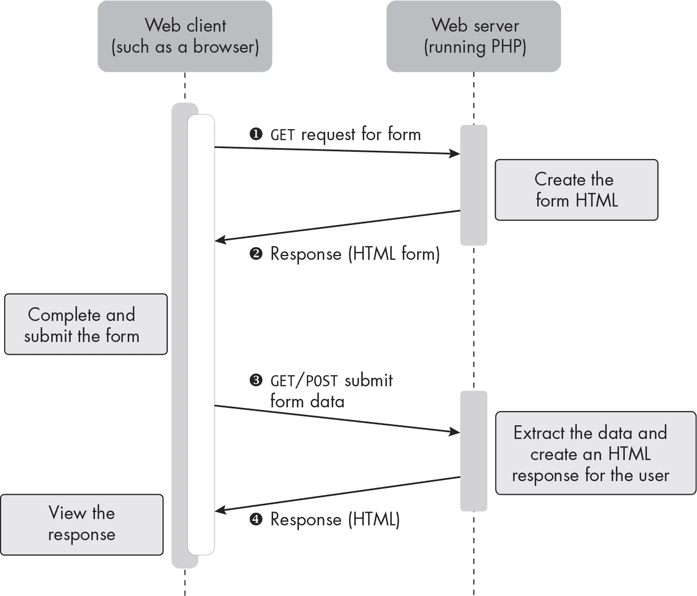

图 11-1：显示和处理网页表单的典型消息交换

首先，网页浏览器客户端从服务器请求表单的 HTML ❶。用户通过点击链接或按钮等操作触发此请求。接下来，服务器检索并在某些情况下定制表单的 HTML，然后将其发送回客户端 ❷。用户输入数据并提交表单后，表单数据会发送回服务器 ❸。最后，服务器处理接收到的数据，构造适当的消息并发送回客户端 ❹。这个最终消息可以是简单的数据接收确认，或者如果发生问题则是错误消息，或者它可能是原始表单，表明缺少必填数据。

#### GET 与 POST 请求

如第十章所述，从客户端发送到服务器的两种最常见的 HTTP 请求是 GET 和 POST。当你创建 HTML 表单时，可以使用这两种请求中的任何一种将数据发送到服务器，因为 GET 和 POST 都可以将变量从浏览器客户端发送到网页服务器作为请求的一部分。在几乎所有情况下，从网页表单发送到服务器的数据变量都是简单的名称/值对，例如 username=matt 或 q=chocolate。

你使用的请求类型取决于表单的目的以及你希望表单数据如何发送。正如你将看到的，GET 方法会使提交的变量在 URL 中可见，而 POST 方法则可以将变量隐藏在 HTTP 请求的主体中。

##### 使用 GET 发送数据

HTTP GET 请求主要用于从服务器获取数据或网页。虽然你可以在请求中发送数据以帮助检索，但 GET 请求不应导致服务器上存储的内容发生变化（例如，修改数据库中的值）。

在 GET 请求中，服务器完成请求所需的任何变量，包括通过 Web 表单提交的值，都被添加到请求的 URL 末尾，紧跟着一个问号字符（?）。问号后面的这部分 URL 被称为*查询字符串*，并且它将在浏览器的地址栏中可见。变量以名称/值对的形式进行编码，格式为 name=value，例如 username=matt。例如，当你使用 Google 或 Bing 搜索时，输入的搜索词会被分配给变量 q，添加到 URL 查询字符串中，并通过 GET 请求发送。

假设你使用 Google 搜索短语 *cheese cake*。当你查看搜索结果时，地址栏中应该会看到类似 *https://www.google.com/search?q=cheese+cake* 的内容。单个字母 *q* 表示你的搜索查询，并与输入到 Google Web 表单中的值配对。这表明你的查询是通过 GET 请求传递给 Google 服务器的。

特殊规则定义了 URL 中允许的字符，使用 HTTP GET 方法发送的变量也必须遵循这些规则。因此，特殊字符和空格不能在查询字符串中按原样表示，而必须编码为其他符号。例如，每个空格被替换为 %20 或加号 (+)，这就是为什么 Google 搜索查询字符串显示为 *q=cheese+cake* 而不是 *q=cheese cake* 的原因。当编码两个或更多变量时（例如来自表单中不同字段的变量），名称/值对通过和符号（&）分隔，如 *?firstname=matt&lastname=smith*。Web 浏览器会自动处理这种编码，但了解这一点很有用，因为它解释了为什么在使用 GET 方法发送表单数据时，你经常会看到一些加密的、百分号编码的字符。

GET 方法的一个常见用途是创建一个易于书签保存的 URL，可能是通过电子邮件或短信与他人分享。例如，Google 的*芝士蛋糕*查询就是一个例子：*https://www.google.com/search?q=cheese+cake*。另一个例子可能是 Google Maps 搜索，例如这个指向爱尔兰都柏林的链接：*https://www.google.com/maps?q=dublin+ireland*。URL 中的变量可以来自用户输入的值（如 Google 搜索的情况），也可以通过明确添加问号和所需的名称/值对到 URL 的末尾来硬编码。

图 11-2 展示了后者的例子，点击 COMP H2029 -FT 链接会发起一个 GET 请求，其中包括查询字符串中的名称/值对 id=1499。这个 id 值不是来自用户输入，而是硬编码在网站的逻辑中。

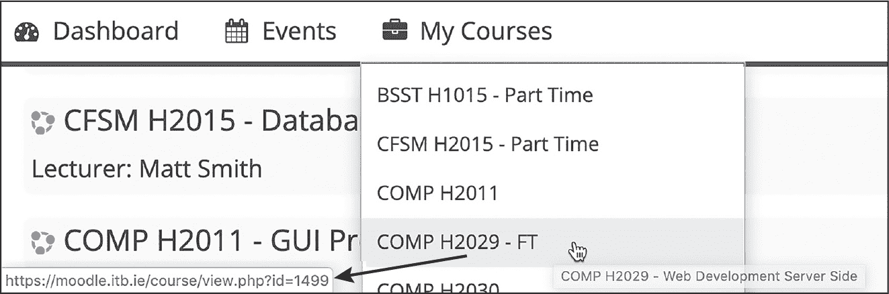

图 11-2：一个带有硬编码值的链接，通过 GET 请求方法发送

网络服务器不关心 GET 请求是如何创建的。无论查询字符串变量来自表单提交还是硬编码，服务器端脚本都可以提取这些名称/值对进行处理。

##### 使用 POST 隐形发送数据

HTTP POST 请求主要用于创建或修改服务器上的资源。使用 POST 方法，你可以将变量发送到 HTTP 消息的主体中，这意味着它们不会出现在结果 URL 中。对于任何机密数据，比如用户名和密码，你应该使用 POST 请求，以便屏幕上的人无法看到发送到服务器的数据值。事实上，大多数网页表单都使用 POST 方法发送数据。图 11-3 展示了一个 POST 方法的登录表单。

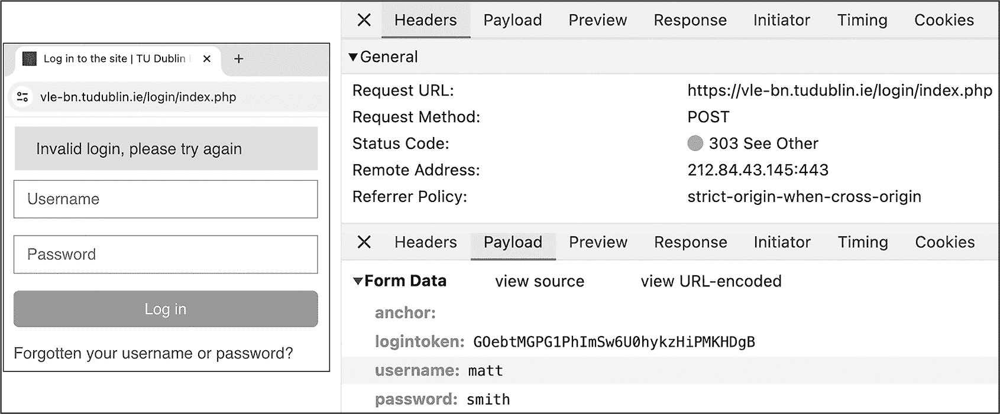

图 11-3：POST 方法在请求主体中的变量

在这个例子中，我尝试用用户名 matt 和密码 smith 登录一个网站。浏览器的 HTTP 消息检查工具显示，用户名和密码值是作为 HTTP POST 请求的主体发送的。因此，这些值并未出现在地址栏的 URL 中。

> 注意

*一个*POST*请求可以像*GET*请求一样，直接在查询字符串中发送数据，也可以在请求主体中发送数据。我们将在《发送不可编辑数据和表单变量一起发送》一节中探讨*POST*请求的两种方式，详见第 206 页。*

#### 一个简单的例子

为了更清楚地理解 GET 和 POST 方法如何以不同方式发送数据，我们来构建一个简单的网站，其中包含一个只有单一文本框的表单，用户可以在其中输入他们的名字（见图 11-4）。我们将尝试使用这两种 HTTP 方法从表单传递数据。正如你所见，在创建 HTML <form>元素时，我们可以选择使用哪种方法。

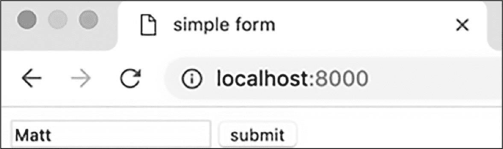

图 11-4：浏览器中显示的简单网页表单

我们的项目将包含一个*public*文件夹，其中包含两个 PHP 脚本文件，*index.php*和*process.php*。其中，*index.php*是默认的主页脚本，用于显示表单，而*process.php*将接收用户在主页提交的姓名，并生成一个*Hello <name>*消息作为响应。

##### 使用 GET 方法创建表单

我们将从简单网页表单的 GET 版本开始。创建一个新的项目，并在该项目的*public*文件夹中创建一个名为*index.php*的新的 PHP 脚本文件。输入示例 11-1 中显示的代码。

```
<!doctype html><html><head><title>simple form</title></head>
<body>
<form method="GET" action="process.php">
    <input name="firstName">
    <input type="submit">
</form>
</body>
</html>
```

示例 11-1：使用 GET 方法的简单网页表单的 HTML 代码

该文件完全由 HTML 模板文本组成，包括一个定义网页表单的<form>元素。我们使用该元素的 method 属性声明表单数据应使用 GET HTTP 方法提交，并使用 action 属性指定 HTTP 请求及其数据应发送到*process.php*服务器脚本。请注意，HTML 表单的 method 属性中的 GET 或 POST 值是不区分大小写的，因此我们也可以写 method="get"。

在表单内，我们创建一个<input>元素并为其指定名称为 firstName。我们还创建第二个<input>元素，类型为 submit，以向表单中添加一个提交按钮。由于我们没有指定 firstName 输入的类型，HTML 5 会自动将默认的表单输入类型定义为文本框。文本框会以矩形输入框的形式显示给用户。如果你想明确声明输入类型，可以通过<input type="text" name="firstName">来实现。你还可以进一步设置文本框的字符宽度和其他规格，使用各种 HTML 表单输入的可选属性。

由于我们的表单只输入一个值，我们不需要向用户显示文本标签。然而，当表单包含多个输入控件时，应在每个输入框前加上提示，以便用户知道哪个文本框（或单选按钮或其他输入类型）对应哪个值。例如，如果我们想让用户输入年龄，可能会写上模板文本 Age:，然后是表单输入，像这样：

```
Age: <input name="age">
```

现代 HTML 的最佳实践还要求我们为年龄输入添加 id 属性，使用<input name="age" id="age">，并使用<label>元素包围模板文本，使用<label for="age">Age:</label>。这允许用户点击标签或文本框，使年龄成为活动的表单输入。##### 处理 GET 请求

我们已经创建了一个 HTML 网页表单，但我们的工作才完成一半；我们还需要编写*process.php*脚本来处理通过表单提交的数据。在编写简单表单的处理脚本时，我们只需要知道脚本将接收的变量名称，以及该变量是通过查询字符串（如 GET 方法）提交的，还是通过请求体（如 POST 方法）提交的。

在这种情况下，脚本应该尝试从通过 GET 请求接收到的查询字符串中查找 firstName 变量的值，然后输出 HTML 以显示包含该名称的问候语。将 *process.php* 文件添加到项目的 *public* 文件夹中，并在其中输入 示例 11-2 中的代码。

```
<?php
//----- (1) LOGIC -----
❶ $firstName = filter_input(INPUT_GET, 'firstName');
?>

<!-- (2) HTML template output -->
<!doctype html> <html><head><title>process</title></head><body>
❷ Hello <?= $firstName ?>
</body></html>
```

示例 11-2：一个 process.php 服务器脚本，用于响应 Web 表单

请注意，我们在这个脚本中使用了两种类型的注释，因为它混合了两种语言：一个以 // 开头的 PHP 注释和一个 HTML 注释 <!--。在最初的 PHP 代码块中，我们调用了 filter_input() 函数来读取来自 HTTP 请求的数据，并将结果存储在 $firstName 变量中 ❶。INPUT_GET 参数指定我们要读取嵌入在 URL 查询字符串中的数据，而 'firstName' 参数标识我们要查找的特定 HTML 表单变量。表单输入变量名是区分大小写的，因此在调用 filter_input() 函数时，务必要小心匹配 HTML 表单中定义的变量名。例如，如果我们传递的是 'firstname' 而不是 'firstName'，脚本就无法正常工作。当将表单变量的值传递给 PHP 变量时，像我们这里所做的那样，通常的良好实践是给 PHP 变量与对应表单变量相同的名称。

接下来，我们声明应该作为响应发送的 HTML，这包括模板文本 Hello，后面跟着 PHP 短标签内的 $firstName 变量值 ❷。

> 注意

*INPUT_GET* 参数传递给 *filter_input()* 函数时，其名称可能会让人误解。它的目的是从 URL 查询字符串中检索数据，无论这些数据是通过 *GET* 方法（所有变量都是查询字符串的一部分）还是通过 *POST* 方法（数据可以在查询字符串中，也可以在请求体中）发送的。因此，当你在 PHP 表单处理代码中看到 *GET* 时，应将其理解为 *查询字符串变量*，而不必假设它们来自 *GET* 请求。##### 测试表单

现在我们已经在 *index.php* 中创建了 Web 表单，并编写了 *process.php* 脚本来响应它，接下来让我们测试一下我们的工作。通过命令行启动 PHP Web 服务器，使用 php -S localhost:8000 -t public 命令，如 第十章 中所讨论的那样；然后打开浏览器标签页并访问 *localhost:8000*。默认情况下，我们创建的表单应该会显示出来，因为文件名是 *index.php*。你将看到类似于 图 11-4 中的表单：一个带有提交按钮的文本框。

在表单中输入你的姓名，然后点击 **提交**。此时，输入的文本应作为 HTTP GET 请求的一部分从浏览器发送到 PHP 服务器。GET 请求触发服务器执行 *process.php* 脚本，如 HTML <form> 元素中的 action 属性在 *index.php* 中所声明。该脚本提取提交的值并将其注入到 HTML 模板文本中，然后将其添加到文本缓冲区，这些文本最终成为服务器发送回请求客户端（即网页浏览器）的 HTTP 响应消息的正文。你应该看到类似 图 11-5 的结果。

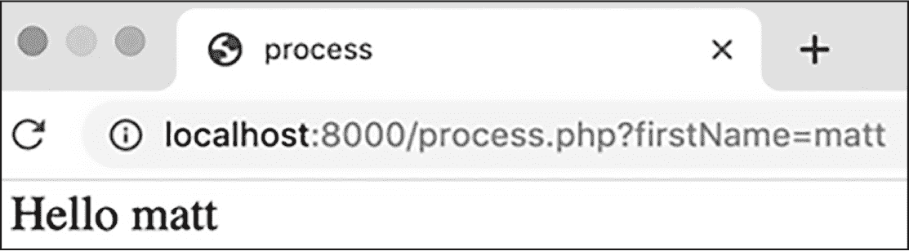

图 11-5：process.php 脚本的结果，确认通过表单接收到的数据

你不仅在页面显示的问候语中看到自己的名字（例如图中的 *Hello matt*），还可以在浏览器地址栏的 URL 末尾看到它，因为表单是通过 GET 请求提交的。例如，当我通过表单提交 matt 时，得到的 URL 是 *localhost:8000/process.php?firstName=matt*。这表明 GET 请求正尝试访问 *process.php* 脚本，并传递一个值为 matt 的 firstName 变量。注意，问号将查询字符串与 URL 其余部分分开。

##### 切换到 POST 方法

让我们修改我们的项目，改用 POST 方法发送表单数据，而非 GET，看看会有什么不同。只需做几个小修改。首先，更新 *index.php* 脚本，如 列表 11-3 所示。

```
<!doctype html><html><head><title>simple form</title></head>
<body>
<form method="POST" action="process.php">
 <input name="firstName">
 <input type="submit">
</form>
</body>
</html>
```

列表 11-3：在 index.php 中从 GET 切换到 POST

现在我们将 <form> 元素的 method 声明为 POST。就这样：无需对 index 脚本做进一步修改，确保网页浏览器使用 POST 方法而非 GET 提交表单数据。接下来，更新 *process.php*，如 列表 11-4 所示。

```
<?php
//----- (1) LOGIC -----
$firstName = filter_input(INPUT_POST, 'firstName');
?>

<!-- (2) HTML template output -->
<!doctype html> <html><head><title>process</title></head><body>
Hello <?= $firstName ?>
</body></html>
```

列表 11-4：在 process.php 中从 GET 切换到 POST

这是另一个简单的更改：我们只需将 INPUT_GET 改为 INPUT_POST 作为 filter_input() 的参数，告诉该函数在请求体中查找通过 POST 提交的变量。

尝试重新运行 web 服务器，并再次通过表单提交你的姓名。你应该仍然会看到与之前相同的 *Hello <name>* 问候语。然而，如果你仔细查看，你会看到一些关键的不同之处，如 图 11-6 所示。

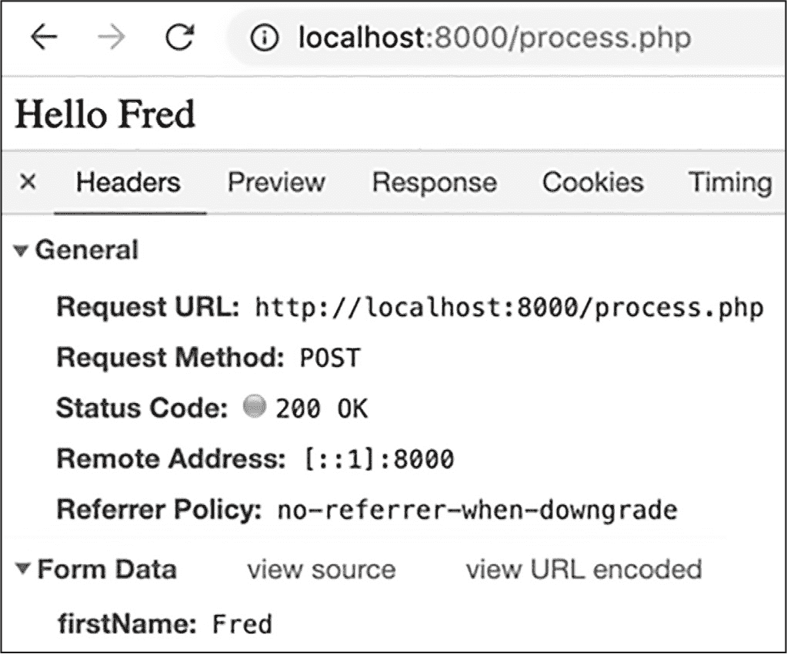

图 11-6：使用浏览器开发者工具查看 HTTP POST 请求和 firstName 变量

首先，浏览器地址栏中的 URL 应该只显示 *localhost:8000/ process.php*。因为 firstName 表单变量现在通过 POST 请求体发送，它不再出现在所有人都能看到的 URL 查询字符串中。你可以通过查看浏览器的开发者工具来验证变量是否仍然被传输。在这个例子中，我通过表单提交了名字 Fred，你可以在 图 11-6 中看到，确实，表单数据变量 firstName=Fred 显示在 POST 请求的请求体中。

### filter_input() 函数

我们的简单网页表单项目演示了如何使用 PHP 的 filter_input() 函数接收传入的表单数据。这个函数使得提取通过 GET 和 POST 方法提交的值变得容易。然而，编写表单处理脚本并不总是如此简单；在较早的 PHP 版本中，从用户接收的数据通常是通过访问内建的 $_GET 和 $_POST *超全局数组* 来提取的。

$_GET 数组包含表示作为 URL 查询字符串一部分接收到的所有变量的键/值对，而 $_POST 数组包含表示通过 POST HTTP 方法接收到的所有变量的键/值对。例如，通过 GET 请求提交名字 Matt 的简单网页表单将产生一个包含 ['firstName' => 'Matt'] 的 $_GET 数组，以及一个空的 $_POST 数组。

> 注意

*$_GET* 和 *$_POST* 数组是 PHP 的*超全局变量*的例子。这些数组总是存在的，可以从 PHP 代码的任何地方（即任何作用域中），包括函数和类方法内部访问。

即使在现代 PHP 编程中，从这两个超全局数组中提取表单数据仍然在理论上是可能的。但 PHP 5.2 版本引入了 filter_input() 函数，作为访问提交数据的更好方法。为了说明这一改进，让我们来看一下处理这些超全局数组的过程。

在 第七章 中，你已经学到，尝试访问数组中不存在的键将触发警告，你可以通过使用 isset() 函数来验证数组键是否存在，以避免这种警告。进行这种测试可以使脚本更健壮，减少错误，尤其是在直接处理 $_GET 和 $_POST 数组时更为重要。不幸的是，这种测试也会向脚本中添加额外的代码。例如，示例 11-5 演示了如何安全地从 $_GET 数组中提取 $firstName 变量。

```
<?php
if (isset($_GET['firstName'])) {
    $firstName = $_GET['firstName'];
    // Now use filters / apply sanitization/validation to extracted value
} else {
    $firstName = NULL;
}
```

示例 11-5：在尝试从 $_GET 中提取值之前，使用 isset() 测试数组键

我们在 if...else 语句中使用 isset()来检查$_GET 数组中是否存在'firstName'键（表示通过传入的查询字符串提交了 firstName 表单变量）。如果该键存在，我们将其值传递给$firstName 变量。否则，我们将$firstName 设置为 NULL。这个 if...else 语句可以避免我们在没有警告的情况下直接访问数组中不存在的值。

列表 11-5 将正常工作，但它表示了 PHP 表单处理代码中一个常见的动作序列，因此引入了 filter_input()函数来封装这一过程。因此，我们的整个 if...else 语句可以用一句话来替换：

```
$firstName = filter_input(INPUT_GET, 'firstName')
```

filter_input()函数会在尝试访问变量之前自动检查所需的变量是否存在，如果不存在，通常会返回 NULL。这使我们免去了像列表 11-5 中那样编写繁琐的条件测试。

filter_input()函数的另一个优点是，它可以使用过滤器忽略并移除接收到的表单数据中的不需要的和潜在危险的内容。这有助于防止安全漏洞，如跨站脚本攻击。例如，为了过滤掉（丢弃）用户输入中的任何非字母字符，我们可以在 filter_input()调用中添加一个第三个参数 FILTER_SANITIZE_SPECIAL_CHARS：

```
$firstName = filter_input(INPUT_GET, 'firstName',
FILTER_SANITIZE_SPECIAL_CHARS);
```

### 发送数据的其他方式

通过网页表单获取用户输入并不是通过 HTTP 请求发送数据的唯一方式。在本节中，我们将考虑其他将数据传输到服务器的技术。我们将研究如何将不可编辑的数据嵌入查询字符串中，以便与用户输入的表单数据一起提交，如何发送关于表单提交按钮本身的数据，以及如何将查询字符串变量添加到常规超链接中，独立于任何网页表单。过程中，你还将看到如何处理查询字符串和 POST 变量的混合，以及如何利用 PHP 数组和循环以编程方式生成查询字符串变量。

#### 与表单变量一起发送不可编辑数据

通常，你希望网页表单发送一些用户无法编辑的额外数据。最常见的例子可能是用户（也许是员工）正在编辑数据库中某个项的详细信息。这个项可能是有关产品或客户的记录，它已经有一个分配的 ID，这个 ID 应该包含在表单数据中，但 ID 本身不应通过表单进行更改。对于这种情况，你可以将不可编辑的值作为查询字符串变量通过表单的 action 属性（例如，action="/process.php?id=1022"）在 URL 的末尾发送。

为了说明，假设我们创建一个新的网页表单，用于提交关于电影的信息。启动一个新的项目，其中包含一个*public*文件夹，并在其中创建一个*index.php*脚本。然后输入列表 11-6 中的 HTML 代码以创建网页表单。

```
<!doctype html><html><head><title>Movie Form 1</title></head><body>
<h1>Edit movie</h1>
❶ <form method="POST" action="/process.php?id=1022">
  ❷ <label for="title">Title: </label><input name="title" id="title">
 <br>
  ❸ <label for="price">Price: </label><input name="price" id="price">
    <br>
    <input type="submit">
</form>
</body>
</html>
```

列表 11-6：index.php 中电影表单的 HTML 代码

我们使用 POST 方法声明了一个表单 ❶。（在更现实的场景中，这个表单很可能会导致数据库中记录的更改，因此此处使用 POST 而非 GET 方法是合适的。）对于表单的 action 属性，我们指定了处理表单的脚本为 *process.php*，并且还发送了一个名为 id 的 URL 查询字符串变量，值为硬编码的 1022。当表单提交时，这个额外的名称/值对将在生成的 URL 中可见（就像使用 GET 方法发送的数据一样）。同时，表单还会将用户输入的两个变量 title ❷ 和 price ❸ 作为 POST 请求体中的数据发送。

#### 处理混合查询字符串和 POST 变量

现在让我们编写 *process.php* 脚本来接收并提取来自此电影表单的数据。与我们早期的表单处理脚本不同，这个脚本需要从传入的 POST 请求中提取多个变量，包括通过查询字符串发送的 id 变量和嵌入在请求体中的 title 和 price 变量。将 *process.php* 添加到项目的 *public* 文件夹中，并在其中输入 列表 11-7 中的代码。

```
<?php
//----- (1) LOGIC -----
$id = filter_input(INPUT_GET, 'id');
$title = filter_input(INPUT_POST, 'title');
$price = filter_input(INPUT_POST, 'price');
?>

<!-- (2) HTML template output -->
<!doctype html> <html><head><title>process</title></head><body>
id = <?= $id ?>
<br>title = <?= $title ?>
<br>price = <?= $price ?>
</body></html>
```

列表 11-7：处理电影表单的 PHP 服务器脚本

我们使用 filter_input() 函数，并带上 INPUT_GET 参数，将 id 查询字符串变量读取到对应的 PHP 变量 $id 中。（记住，INPUT_GET 只是意味着我们正在从查询字符串读取数据，即使这些数据是通过 POST 方法而非 GET 方法发送的。从服务器端脚本的角度来看，HTTP 请求的实际方法差别不大。）然后我们再使用 filter_input() 函数两次，带上 INPUT_POST，将请求体中的两个值读取到 $title 和 $price 变量中。经过一些基础的 HTML 页面标签后，我们通过 PHP 短 echo 标签输出每个变量的名称和值，用 HTML <br> 换行符分隔。

图 11-7 显示了 *process.php* 脚本如何处理传入的表单数据。

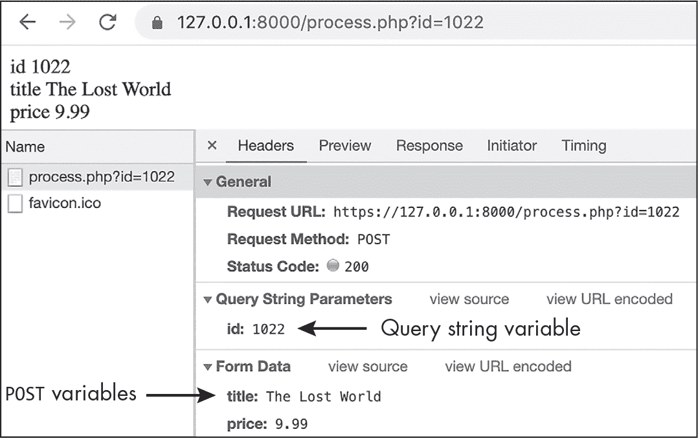

图 11-7：发送查询字符串和 POST 变量的 HTTP 请求

在这个示例中，我在表单的标题字段中填写了《失落的世界》，在价格字段中填写了 9.99。浏览器中的输出显示了这些值的回显，以及我们在查询字符串中硬编码的 id 值 1022。你还应该在浏览器的地址栏中看到 URL 中的 id 变量，如果使用浏览器开发者工具查看请求，你会看到 id 被列为查询字符串参数，而 title 和 price 被列为请求体中的表单数据变量。

#### 提供多个提交按钮

通过表单发送数据的另一种方式是给表单的提交按钮添加一个 name 属性。当你希望表单包含多个提交按钮时，这种方式尤其有用，因为用户可以选择如何处理表单中的数据。

例如，租用在线视频的客户可能希望支付费用后立即开始观看，或者他们可能希望先支付费用，但稍后再观看。每个选项都可以通过不同的提交按钮触发，如 图 11-8 所示。服务器端脚本可以检测用户点击的按钮名称，并作出相应的响应。


图 11-8：同一表单的两个提交按钮

让我们设计一个带有多个提交按钮的表单。创建一个新项目，其中包含一个名为 *index.php* 的 PHP 脚本文件，并在其中输入 列表 11-8 中的代码。

```
<!doctype html><html><head><title>Movie Rent Form 1</title>
<link rel="stylesheet"
    href="https://cdn.jsdelivr.net/npm/bootstrap@5.3.3/dist/css/bootstrap.min.css"
> ❶
</head>
<body class="container">
<h1>Rent movie</h1>
<form method="POST" action="process.php?movieId=80441"> ❷
    <p><label for="number">Credit card number:</label>
    <input name="number" id="number"></p>
    <p><label for="date">
    Expiry date:</label>
    <input name="date" id="date"></p>
    <p><label for="ccv">
    CCV code:</label>
    <input name="ccv" id="ccv"></p>
    <p>
    <input type="submit" name="watchNow" ❸
        value="Pay and start watching now" class="btn btn-success">
    <input type="submit" name="watchLater" ❹
        value="Pay and watch later" class="btn btn-success">
    </p>
</form>
</body>
</html>
```

列表 11-8：带有两个提交按钮的表单 HTML 代码

首先，我们引入了 Bootstrap CSS 样式表 ❶。这使得我们可以通过使用 class="btn btn-success" 来将提交类型的输入框样式化为漂亮的绿色按钮，而无需自己编写任何 CSS 代码。然后我们使用 POST 方法设置表单，因为该表单提交的数据可能会导致服务器上的更改（处理支付并记录电影被用户租用） ❷。注意，我们通过表单的 action 属性将 movieID 变量硬编码到查询字符串中，就像前面的电影表单示例一样。

我们为表单提供了用户信用卡信息的输入字段，然后定义了两个提交按钮，一个具有 watchNow ❸ 的 name 属性，另一个具有 watchLater ❹ 的 name 属性。这些按钮还具有 value 属性，用于定义每个按钮上显示的文本。由于这些按钮的 name 属性，当其中一个按钮被点击时，它的 name 和 value 会作为键/值对与其他表单数据一起发送到 POST 请求的主体中。例如，如果用户点击 watchNow 按钮，将会发送 watchNow=Pay and start watching now 的请求。值部分意义不大，但服务器端脚本可以检查表单数据中是否包含 watchNow 键，以确定点击了哪个提交按钮。列表 11-9 显示了一个 *process.php* 文件，它正是实现了这一功能。

```
<?php
if (filter_has_var(INPUT_POST, 'watchNow')) {
    print 'you clicked the button to <b>Watch Now</b>';
} else {
    print 'you clicked the button to <b>Watch Later</b>';
}
```

列表 11-9：在 process.php 中检测点击了哪个提交按钮

由于表单只有两个提交按钮，我们使用 if...else 语句测试是否点击了其中一个按钮（watchNow）；如果没有点击，我们可以安全地假设点击了另一个按钮。（如果有三个或更多按钮，我们可以使用 elseif 语句或 switch 语句来检测正确的按钮。）理论上，我们可以像往常一样调用 filter_input() 函数，提取 watchNow 变量的值，并检查其值是否为 NULL，以确定是否是该按钮被点击。由于我们并不关心 watchNow 的值，而是关心该变量是否存在于传入的请求中，因此我们改用 PHP 的 filter_has_var() 函数来设置 if...else 语句的条件。该函数接受两个输入参数，变量的来源（通常是 INPUT_GET 或 INPUT_POST）和变量的名称，并根据是否找到该命名值返回 true 或 false。

图 11-9 显示了通过我们的电影租赁网页表单提交的示例。

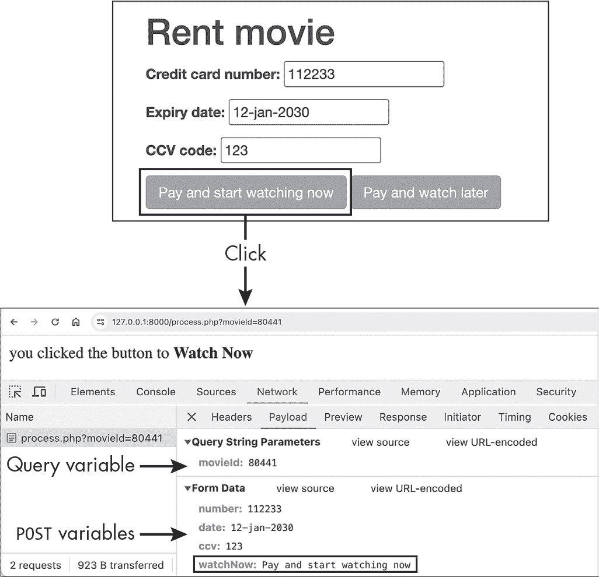

图 11-9：在请求体中的 POST 变量中找到提交按钮的名称

在这个示例中，我使用了 watchNow 按钮来提交表单数据。结果页面上的消息确认了 *process.php* 脚本检测到了该按钮。此外，通过浏览器的开发者工具查看请求，显示 watchNow 与其他 POST 变量一起列出。

#### 在超链接中编码数据

除了通过网页表单发送数据外，我们还可以通过在 HTML 超链接的 URL 末尾添加名称/值对将数据发送到服务器。这些数据将通过 GET 方法发送，因为每当你点击网页上的一个链接时，浏览器会使用该链接的 URL 发起 HTTP GET 请求。HTML 超链接通过锚点（<a>）元素表示；链接的 URL 通过元素的 href 属性设置。

我们将通过一个典型的示例来探讨这种通过 GET 方法发送数据的附加方式，该示例展示了一个显示在线购物车中项目详细信息的链接。图 11-10 显示了我们希望创建的按钮样式链接。

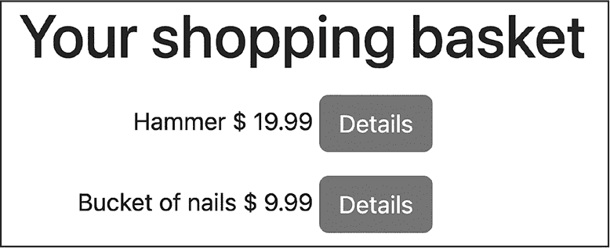

图 11-10：购物车中的按钮样式的详细信息超链接

购物车中的每个项目旁边都有一个超链接（样式为按钮），用来显示该项目的详细信息。链接可能指向像 */show.php?id=102* 这样的 URL。这个 URL 会通过 GET 方法请求 PHP 脚本 *show.php*，同时将产品的 ID（在此例中为 102）通过查询字符串 id 变量传递。由于此处的目标只是显示数据（因此不会改变服务器上的任何内容），使用 GET 方法比 POST 方法更合适。

##### 硬编码链接

让我们创建如图 11-10 所示的页面。为简便起见，我们将从硬编码产品 ID 到超链接开始。创建一个包含 *public* 文件夹的新项目，并将 *index.php* 脚本添加到该文件夹中。然后输入列表 11-10 中的代码。

```
<!doctype html><html><head><title>Basket Form 1</title>
<link rel="stylesheet"
    href="https://cdn.jsdelivr.net/npm/bootstrap@5.3.3/dist/css/bootstrap.min.css"
>
</head>
<body class="container">
<h1>Your shopping cart</h1>

<div class="row">
    <div class="col-lg-3 text-end py-2">
        Hammer $ 19.99
        <a href="/show.php?id=102" class="btn btn-primary">Details</a> ❶
    </div>
</div>

<div class="row">
    <div class="col-lg-3 text-end py-2">
        Bucket of nails $ 9.99
        <a href="/show.php?id=511" class="btn btn-primary">Details</a> ❷
    </div>
</div>
</body>
</html>
```

列表 11-10：一个包含数据并嵌入 Details 超链接的 index.php 文件

如前面的示例所示，我们通过读取 Bootstrap CSS 样式表来快速为页面添加样式。在页面的 HTML 中，我们创建了两个文本为“Details”的链接，并使用 Bootstrap CSS 类 btn btn-primary 将其样式化为蓝色按钮：一个指向锤子 ❶，另一个指向一桶钉子 ❷。每个链接都指向 PHP 脚本 *show.php*，产品的 ID 会以 ?id=102 这种方式编码到 URL 中。点击其中一个链接将通过 GET 请求发送相应的 id 变量，如图 11-11 所示。

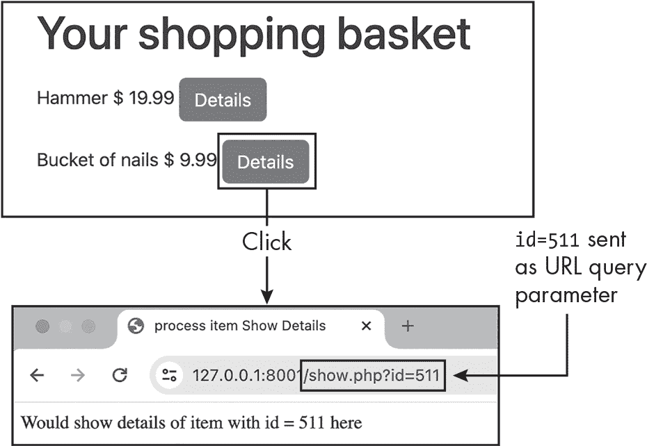

图 11-11：点击 Details 链接后的结果

我们不必担心编写 *show.php* 脚本，但请注意，点击钉子桶的“Details”链接会发起一个 GET 请求，其中 id 值 511 被嵌入到查询字符串中。

> 注意

*在更实际的场景中，我们不会像这样将 id 值硬编码到链接中。相反，我们会通过循环遍历表示用户购物车中产品的数组，并编程地将每个产品的 ID 插入到相应的 Details 链接中。接下来我们将讨论如何做到这一点。*

##### 程序化生成链接

大多数网页展示的内容都是基于网站数据库中值动态生成的。因此，链接通常不会像 */show.php?id=102* 这样硬编码产品 ID，而是通过 PHP 语句编程生成链接，遍历表示用户购物车中商品的一个数据集合。每次循环时，都会查找并动态插入该商品的 ID 到超链接中。产品的描述和价格也会类似地动态插入到通用的 HTML 模板文本中。

让我们更新购物车页面，尝试这种方法。我们将使用一个数组来表示整个购物车；数组中的每个项将是一个代表特定购物车商品的数组，包含该产品的 ID、描述和价格三个值。按列表 11-11 所示修改 *index.php* 文件。

```
<?php
// Set up data array
$items = [
    ['id' => 102, 'description' => 'Hammer', 'price' => 9.99],
    ['id' => 511, 'description' => 'Bucket of nails', 'price' => 19.99],
];
?>
<!doctype html><html><head><title>Cart From Array</title>
<link rel="stylesheet"
 href="https://cdn.jsdelivr.net/npm/bootstrap@5.3.3/dist/css/bootstrap.min.css"
>
</head>
<body class="container">
<h1>Your shopping cart</h1>
<?php foreach ($items as $item): ?> ❶
 <div class="col-lg-3 text-end py-2">
        <?= $item['description'] ?> $ <?= $item['price'] ?>
        <a href="/show.php?id=<?= $item['id'] ?>" class="btn btn-primary">Details</a> ❷
 </div>
<?php endforeach; ?> ❸
</body>
</html>
```

列表 11-11：使用 PHP 循环为购物车中的商品创建 Details 链接

在任何 HTML 之前，我们使用一个 PHP 代码块来声明一个$items 数组，包含我们两个产品的信息。（当然，我们仍然在硬编码这些信息，尽管是放在数组中；在更实际的场景中，我们会从数据库中获取产品信息，正如我们在第六部分中将要讨论的那样。）然后我们开始 HTML 模板文本。在“您的购物车”标题下，我们使用另一个 PHP 代码块开始一个 foreach 循环，其中$items 数组的当前元素由$item 变量表示 ❶。我们使用带冒号（:）的替代循环语法来设置循环的开始，并使用 endforeach ❸来结束循环。请参见第六章以回顾这种替代的循环语法，它使得将 PHP 与 HTML 结合更加容易。

在循环内部，我们结合使用 HTML 和 PHP 短标签来在`<div>`中插入当前产品的'描述'、'价格'和'id'值到模板文本中。通过这种方式，我们为每个产品动态创建一个`<div>`元素，包括一个 Bootstrap 样式的详细信息链接。特别需要注意的是，我们将产品的 ID 嵌入到`<a>`元素的 href 属性中 ❷，这将生成类似于*/show.php?id=102*的超链接，与之前相同。总体而言，页面应该看起来与图 11-10 完全相同。

### 其他表单输入类型

单一文本和数字表单输入（如文本框、密码框、文本区域等）都会作为名称/值对发送到 HTTP 请求中，但其他类型的表单数据就没有那么简单了。理解浏览器如何为这些其他表单元素选择变量名称和值非常重要，这样你才能编写服务器脚本，正确获取和验证传入的数据。在本节中，我们将讨论如何处理其他常见的表单元素，如单选按钮、复选框以及单选和多选列表。

#### 单选按钮

*单选按钮*是一组两个或更多供用户选择的表单输入选项，其中只能选择一个值。单选按钮输入以共享相同名称属性的分组方式声明，每个选项都有一个唯一的值属性，用于区分选中了哪个输入。通过这种方式，一组单选按钮形成了一个互斥的选项组，供分配给共享名称属性的值选择。除非在少数情况下不接受选择任何选项，否则应该自动选中其中一个单选按钮，以便用户能够选择默认选项。这样，值将在 HTTP 请求中被发送。

让我们编写一个 HTML 表单，使用单选按钮呈现两个爱尔兰县之间的选择，如图 11-12 所示。该图还展示了当表单通过*process.php*处理时的输出。

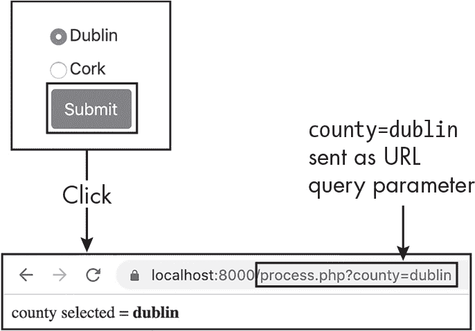

图 11-12：通过查询字符串参数提交值的单选按钮

创建一个新项目，其中包含一个*public*文件夹和一个*index.php*脚本，然后输入清单 11-12 中显示的代码。

```
<!doctype html><html><head><title> Radio Buttons </title>
<link rel="stylesheet"
    href="https://cdn.jsdelivr.net/npm/bootstrap@5.3.3/dist/css/bootstrap.min.css"
>
</head>
<body class="container">
<form method="GET" action="process.php">
    <br>
    <label>
        <input type="radio" name="county" value="dublin" checked> ❶
        Dublin
    </label>

 <br>
    <label>
        <input type="radio" name="county" value="cork"> ❷
        Cork
    </label>
    <br>
    <input type="submit" class="btn btn-primary">
</form>
</body>
</html>
```

列表 11-12：演示单选按钮的 HTML 表单

我们使用 GET 方法创建一个表单，并通过 action 属性请求*process.php*脚本。在表单内，我们声明了两个单选按钮（类型为"radio"的<input>元素），它们的 name 属性均为"county"。其中一个的值为"dublin" ❶，另一个的值为"cork" ❷。我们使用 checked 属性将都柏林选项设置为默认选项。用户在页面上看到的单选按钮是一个小圆形输入框，因此在每个单选按钮旁边添加文本或图片提示非常重要，同时还要使用<label>元素，以便用户可以点击文本或按钮进行选择。

> 注意

*标签显示每个县的名称，首字母大写（例如*都柏林*），而对应的值以小写字母开头（*dublin*）。就个人而言，我总是为单选按钮、复选框和其他输入使用小驼峰命名法。采用一致的命名规范可以使编写表单处理逻辑变得更加容易，无需反复查看表单代码本身，也能减少出错的概率。*

由于这个表单使用的是 GET 方法，我们在提交表单时会在 URL 中看到?county=dublin 或?county=cork。换句话说，单选按钮组的 name 属性充当查询字符串变量的键，选中按钮的 value 属性充当该变量的值。因此，我们可以使用 filter_input(INPUT_GET, 'county')来提取用户通过按钮组提交的值。

#### 复选框

*复选框*为用户提供布尔值（真/假）选择。它们在浏览器中显示为可以勾选或取消勾选的小方框。例如，您可能会在一个表单中使用复选框，允许用户在点餐时选择披萨的配料。与单选按钮不同，复选框不是互斥的；用户可以选择任意多个复选框。与单选按钮一样，在每个复选框旁边添加文本或图片提示可以让用户知道他们在选择什么。

表单中的复选框可以单独处理，也可以作为数组进行统一处理。我们将查看这两种方法。

##### 单独处理

当复选框被单独处理时，每个复选框应有一个唯一的 name 属性。您还可以为每个复选框定义一个 value 属性，但对于表单处理来说这并不是必须的。复选框只有在被选中时才会将其 name/value 对随 HTTP 请求发送，因此在接收端，只需通过 filter_has_var()函数测试复选框的 name 即可，无需关心复选框的 value。如果复选框被选中且没有定义 value，则会将默认值"on"与表单数据一起提交。

为了演示这个功能，让我们使用复选框来创建一个披萨配料的表单。图 11-13 展示了表单的外观。

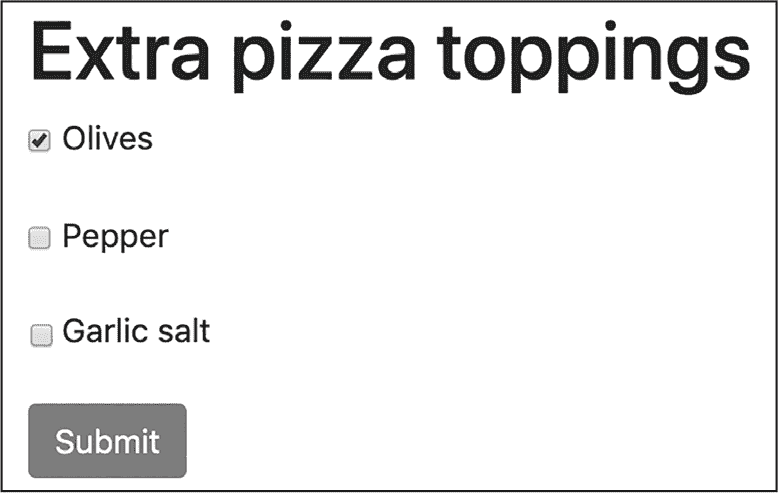

图 11-13：带有复选框的表单

从一个包含 清单 11-13 中代码的 *public/index.php* 文件开始一个新项目，用于设计披萨配料表单。

```
<!doctype html><html><head><title> Checkboxes </title>
<link rel="stylesheet"
      href="https://cdn.jsdelivr.net/npm/bootstrap@5.3.3/dist/css/bootstrap.min.css"
>
</head>
<body class="container">
<h1>Extra pizza toppings</h1>
<form method="GET" action="process.php">
    <p><label><input type="checkbox" name="olives"> Olives</label></p>
    <p><label><input type="checkbox" name="pepper"> Pepper</label></p>
    <p><label><input type="checkbox" name="garlic"> Garlic salt</label></p>
    <p><input type="submit" class="btn btn-primary"></p>
</form>
</body>
</html>
```

清单 11-13：带有复选框的 HTML 表单

在使用 GET 方法声明的表单内，我们为橄榄、辣椒和大蒜盐选项创建复选框，并添加一个提交按钮。每个复选框都有一个独特的 name 属性，紧随其后的是一个文本标签，指示复选框代表的选项。由于复选框没有显式声明值属性，当用户提交表单时，每个选中的复选框会将一个变量添加到查询字符串中，形式为 *<name>=on*。例如，如果只有“橄榄”被选中，表单将触发一个 GET 请求，URL 为 *http://localhost:8000/process.php?olives=on*。

清单 11-14 展示了我们在 *process.php* 脚本中可能使用的逻辑，用于检测其中一个复选框。

```
<?php
$olivesSelected = filter_has_var(INPUT_GET, 'olives');
var_dump($olivesSelected);
```

清单 11-14：检测单个复选框

我们使用 filter_has_var() 与 INPUT_GET 和 'olives' 一起调用，检测是否有 olives 变量随 GET 请求发送，表示该复选框已被选中。我们将结果的 true/false 值存储在 $olivesSelected 中，出于简便起见，我们将其传递给 var_dump()。在更现实的场景中，我们可能会使用该布尔值来设置条件逻辑。我们可以对其他复选框进行类似的 filter_has_var() 测试，只要每个复选框都有唯一的名称。

##### 作为数组处理

有时候，将两个或多个复选框视为相关联的更实际做法是为它们都赋予相同的 name 属性，并以方括号结尾。例如，披萨配料表单中的复选框可以都命名为 toppings[]。这样，所有选中的配料会被分组到一个数组中，并在 HTTP 请求中以相同的 toppings 变量名发送。当采用这种方法时，必须确保每个复选框都有一个独特的值属性，以便能够区分各个复选框。

清单 11-15 显示了如何重写披萨配料表单，将所有选中的复选框作为值发送到一个单一的数组中。

```
<!doctype html><html><head><title>Checkboxes array</title>
<link rel="stylesheet"
 href="https://cdn.jsdelivr.net/npm/bootstrap@5.3.3/dist/css/bootstrap.min.css"
>
</head>
<body class="container">
<h1>Extra pizza toppings</h1>
<form method="GET" action="process.php">
    <p><label>
        <input type="checkbox" name="toppings[]" value="olives"> Olives
    </label></p>
 <p><label>
        <input type="checkbox" name="toppings[]" value="pepper"> Pepper
    </label></p>
    <p><label>
        <input type="checkbox" name="toppings[]" value="garlic"> Garlic salt
    </label></p>
 <p><input type="submit" class="btn btn-primary"></p>
</form>
</body>
</html>
```

清单 11-15：将表单中的复选框分组为一个数组

和之前一样，我们为三个配料选项声明复选框。然而，这次我们为每个复选框分配 toppings[] 作为 name，这样它们就会被分组到一个 toppings 数组中。我们还为每个复选框添加了一个值属性，表示如果该选项被选中，所添加到数组中的配料类型。图 11-14 显示了当提交表单并勾选所有三个复选框时，toppings[] 的多个值如何出现在查询字符串中。

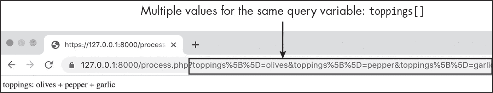

图 11-14：复选框的值作为单一数组变量的值提交

为了成功处理这个表单，我们必须确保 *process.php* 脚本已经设置好以接受复选框值的数组。如果没有选择复选框，数组可能为空，或者数组可能包含一个或多个值。列表 11-16 使用 if...else 语句来处理这两种情况，因此无论选择了多少个比萨配料，它都能正常工作。

```
<?php
❶ $toppings
      = filter_input(INPUT_GET, 'toppings', options: FILTER_REQUIRE_ARRAY);

if (empty($toppings)) {
  ❷ print 'no extra toppings selected';
} else {
  ❸ $toppingsString = implode('+', $toppings);
    print "toppings: $toppingsString";
}
```

列表 11-16：处理复选框值的数组

现在复选框的值变得重要了，我们需要使用 filter_input() 而不是 filter_has_var() ❶。像往常一样，我们使用函数的前两个参数从查询字符串中获取 toppings 变量，但这次我们还使用了一个命名参数 `options: FILTER_REQUIRE_ARRAY`，指定我们需要获取 toppings 变量名下的一个数组。我们将结果数组存储在 `$toppings` PHP 变量中。

我们需要在这里使用命名参数，因为 `$options` 是 filter_input() 函数的第四个参数。我们跳过了第三个参数 `$filter`，让它保持默认值 FILTER_DEFAULT。关于命名参数和可选参数的复习，请参见 第五章。

接下来，我们使用 if...else 语句来检查 `$toppings` 数组是否为空。如果为空，我们会相应地打印一条消息 ❷。否则，我们使用内置的 implode() 数组函数将 toppings 数组压缩成一个单一的字符串，字符串中的配料名称通过加号连接 ❸。回顾 图 11-14 底部，可以看到当三个选框都被选中时，生成的配料字符串。

#### 单选列表

*单选列表* 显示为一个下拉菜单，允许用户选择一个选项。这个列表是通过 HTML `<select>` 元素创建的，元素中包含 `<option>` 元素，表示可能的选择。`<select>` 元素有一个名称，在表单提交时，该名称将与所选 `<option>` 元素的值一起传送，从而在接收端形成一个简单的名称/值对。例如，图 11-15 显示了一个提供简单单选花卉列表的表单。

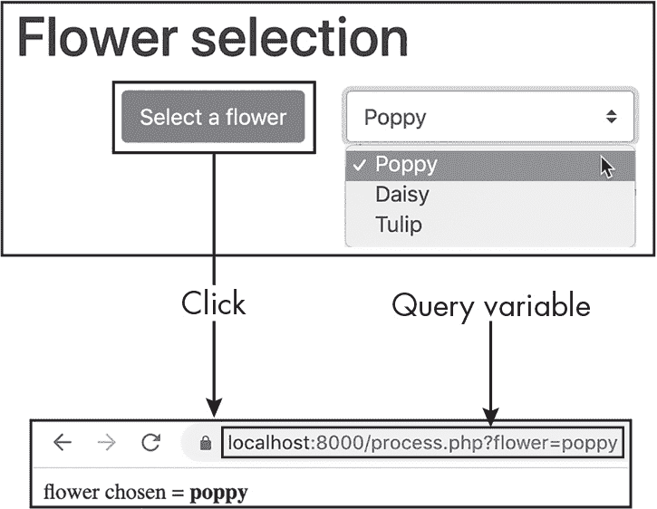

图 11-15：单选列表

让我们来创建这个花卉表单。首先创建一个新项目，包含 *public/index.php* 文件，并输入 列表 11-17 的内容。

```
<!doctype html><html><head><title>Single Selection list</title>
<link rel="stylesheet"
      href="https://cdn.jsdelivr.net/npm/bootstrap@5.3.3/dist/css/bootstrap.min.css"
>
</head>
<body class="container">
<h1>Flower selection</h1>
<form method="GET" action="process.php">
<div class="row">
    <div class="col-lg-3 text-end py-2">
        <input type="submit" value="Select a flower" class="btn btn-primary">
    </div>
    <div class="col-lg-3 text-end py-2">
        <select name="flower" class="custom-select"> ❶
            <option value="poppy">Poppy</option>
            <option value="daisy">Daisy</option>
            <option value="tulip">Tulip</option>
        </select>
    </div>
</div>
</form>
</body>
</html>
```

列表 11-17：带有单选列表的 HTML 表单

我们声明一个使用 GET 方法的表单，表单中有一个提交按钮和一个名为 flower 的选择列表 ❶。`<select>` 元素包含三个 `<option>` 元素，它们的值分别为 poppy、daisy 和 tulip。当表单提交时，所选的花卉将作为名为 flower 的查询参数发送到 HTTP 请求中。例如，在 图 11-15 中，当选择了 poppy 时，查询字符串中会出现 *flower=poppy*。

我们可以通过使用 filter_input()和选择元素的名称来处理通过单选列表提交的选择。例如，在我们的花卉表单中，我们可以使用 filter_input(INPUT_GET, 'flower')来提取用户选择的花卉。

#### 多选列表

多选列表允许用户从菜单中选择多个选项。通过在 HTML 的<select>元素中添加 multiple 属性来创建此列表。图 11-16 展示了我们花卉表单的多选版本。

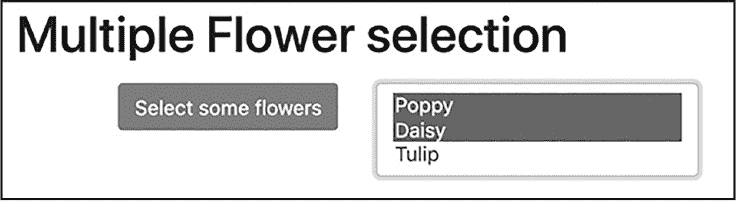

图 11-16：多选列表

单选列表结果是简单的名称/值对，而多选列表应该像我们在复选框中使用的数组方法一样处理：列表应该具有以方括号结尾的名称属性，如 flowers[]。通过这种方式，我们将得到一个包含从列表选项中选择的零个、一个或多个值的数组。清单 11-18 展示了如何修改*index.php*文件，使其将花卉表单转变为多选列表。

```
<!doctype html><html><head><title>Multiple Selection list</title>
<link rel="stylesheet"
 href="https://cdn.jsdelivr.net/npm/bootstrap@5.3.3/dist/css/bootstrap.min.css"
>
</head>
<body class="container">
<h1>Flower selection</h1>
<form method="GET" action="process.php">
<div class="row">
 <div class="col-lg-3 text-end py-2">
 <input type="submit" value="Select some flowers" class="btn btn-primary">
 </div>
 <div class="col-lg-3 text-end py-2">
        <select name="flowers[]" ❶
                class="custom-select"
                size="3"
                multiple> ❷
 <option value="poppy">Poppy</option>
 <option value="daisy">Daisy</option>
 <option value="tulip">Tulip</option>
 </select>
--snip--
```

清单 11-18：一个 HTML 表单，展示了作为值数组的多选列表

我们修改选择列表，使其拥有一个名为 flowers[]的数组❶，并指定它应显示为适合三行的框。我们添加 multiple 属性以表示用户可以从列表中选择多个项目（此属性不需要指定值）❷。当表单提交时，任何选择的花卉将作为名为 flowers 的数组随 HTTP 请求一起发送。

我们可以通过使用与清单 11-16 中处理复选框数组的脚本类似的逻辑来处理这个表单。我们使用 if...else 语句来检查传入的数组是否为空，如清单 11-19 所示。

```
<?php
$flowers = filter_input(INPUT_GET, 'flowers', options: FILTER_REQUIRE_ARRAY);

if (empty($flowers)) {
    print 'no flowers selected';
} else {
    $toppingsString = implode(' + ', $flowers);
    print "flowers: $toppingsString";
}
```

清单 11-19：处理来自多选列表的值数组

我们从传入的 GET 请求中提取$flowers 数组，再次使用额外的选项：FILTER_REQUIRE_ARRAY 参数来传递给 filter_input()，以指定我们正在查找一个数组。然后，如果数组不为空，我们使用 implode()将接收到的花卉合并成一个由加号分隔的字符串。

### 总结

本章我们探讨了如何创建提交数据到服务器脚本的 Web 表单，并讨论了使用 HTTP GET 和 POST 方法提交这些表单的区别。我们还介绍了如何编写服务器端脚本来识别并提取提交的表单数据。我们重点讲解了如何使用 PHP 的 filter_input()函数从传入的 HTTP 请求中提取变量的值，以及如何使用 filter_has_var()在我们只需要知道变量是否存在的情况下使用它。我们将这种方法应用于多种表单输入类型，包括文本输入、单选按钮、复选框和选择列表。

### 练习

1.   为一个服装租赁公司创建一个表单，使用户能够提交他们想要的超级英雄服装的名称。使表单通过 HTTP GET 方法提交数据到名为*costumeSearch.php*的 PHP 脚本，并使用 hero 作为用户输入的文本值的名称。通过你的 web 服务器访问该表单并提交值 superman。你应该会在结果 URL 中看到*costumeSearch.php?hero=superman*。

2.   使用 HTTP POST 方法创建一个基本的登录表单，表单中包含一个用户名（使用默认的文本类型）和一个密码（使用密码类型）的`<input>`元素。使用浏览器的开发者工具检查提交的表单数据。

3.   创建一个输入用户年龄的表单和一个处理接收到的年龄的脚本。处理脚本应返回一个包含用户下一个生日时年龄的消息的 HTML 页面。

4.   创建一个包含单选按钮的表单，询问用户是否愿意为环保汽车支付更多费用。如果他们回答“是”，返回一个包含推荐购买电动汽车的消息的 HTML 页面。如果他们回答“否”，则推荐购买燃油车。

5.   创建一个表单，向用户提供几种新车选项，每个选项用一个独特名称的复选框表示。例如，提供金属漆、雾灯和倒车影像等选项。编写一个脚本，处理表单数据并返回一个包含确认每个选定选项的消息的 HTML 页面。

6.   复制关于汽车选项的第 5 题答案，但将复选框更改为将数据作为名为 extras[]的数组变量发送。更新表单处理代码以处理该数组。思考一下，你觉得使用数组方式处理比单独处理复选框更容易还是更困难？
