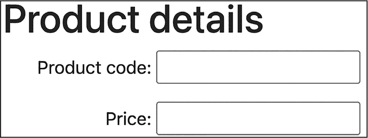
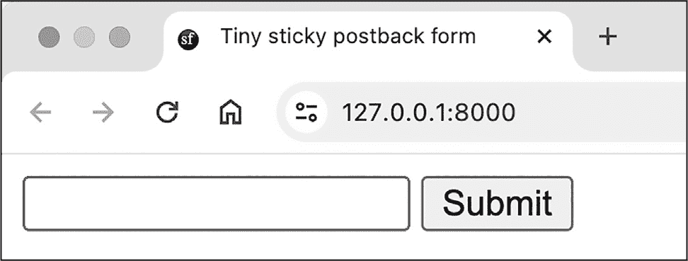
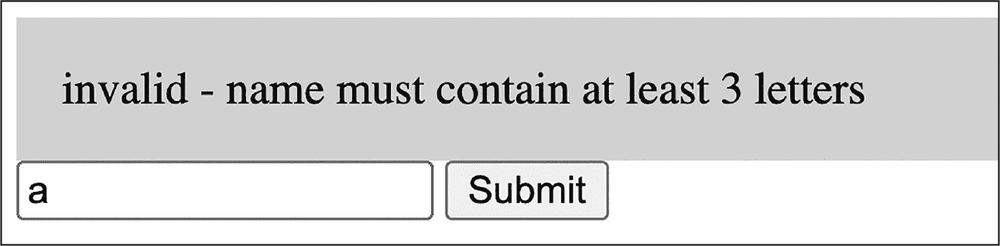
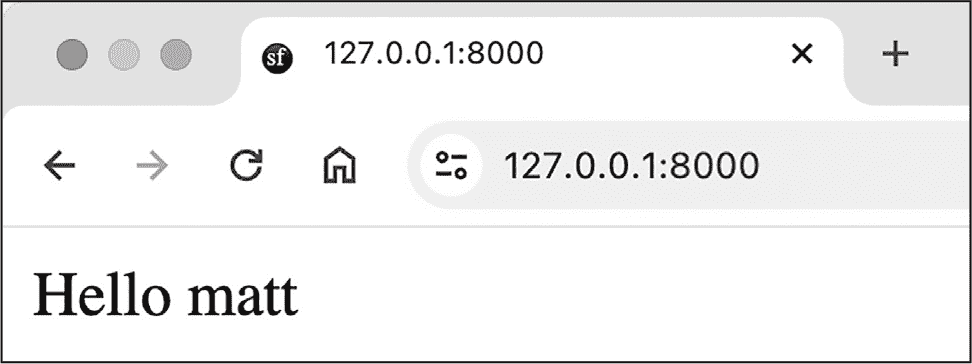
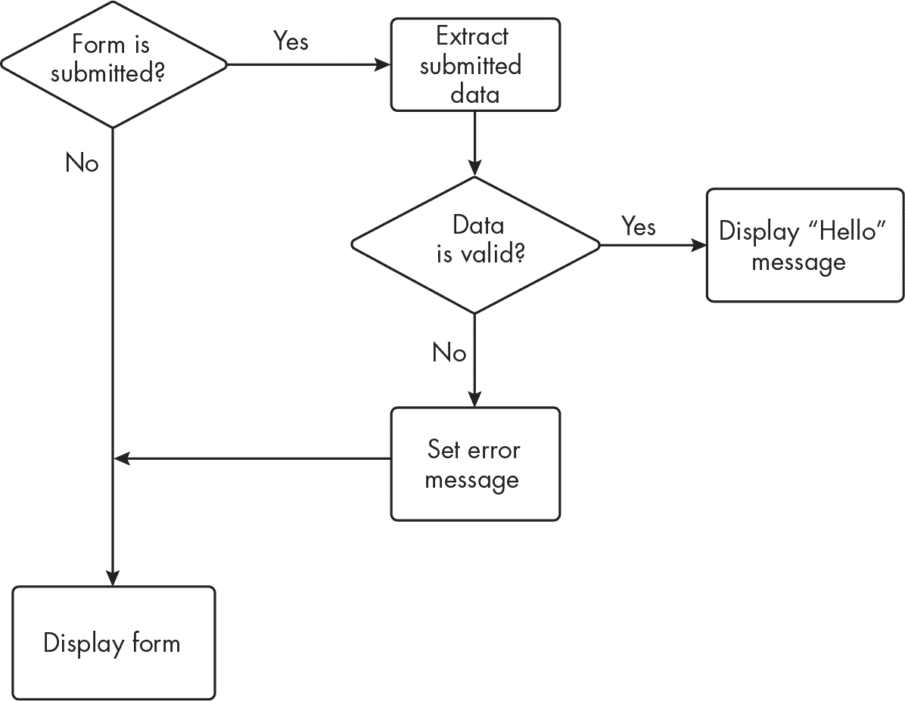
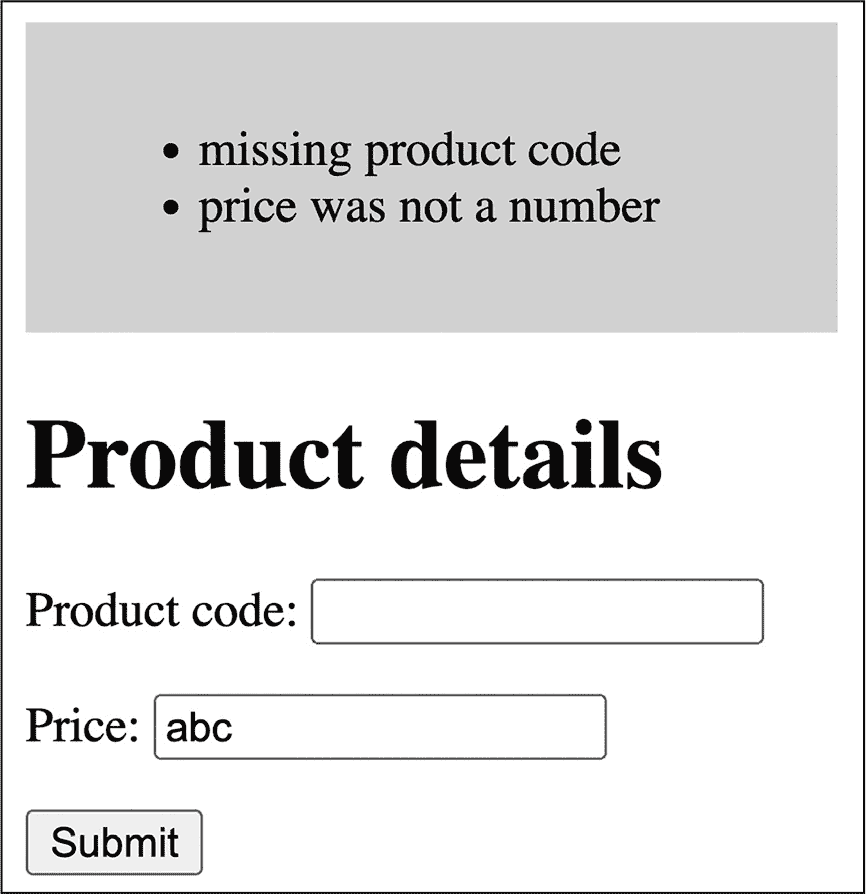

## 第十二章：12 验证表单数据


通过网页表单接收到的数据并不总是有效的；用户可能会犯错或漏填必填值，或者其他一些问题可能会导致错误。在本章中，我们将探讨验证接收数据的方法，并设计一些典型的决策逻辑，以根据接收到的值（以及缺失的值）采取适当的行动。

重要的是要认识到，HTML 表单提交的值仅作为文本字符串，无论输入类型是什么。PHP 不区分数据类型的一个重要原因是，它让我们可以轻松地将包含数字的字符串当作数字处理，而无需显式地进行类型转换或包括数据类型转换语句。这使得仔细编写（并测试）用于处理接收到的表单数据的验证规则变得尤为重要。

### 编写自定义验证逻辑

在第十一章中，你学会了如何使用简单的内建过滤器，如 FILTER_SANITIZE_SPECIAL_CHARS，结合 filter_input()来净化传入的表单数据。然而，现实中的数据通常有自己特殊的验证标准，超出了这些内建过滤器的范围。因此，一旦你从提交的表单请求中提取数据，你可能需要编写自定义验证逻辑，确保数据符合预期。

让我们通过一个简单的示例来说明这是如何工作的：一个产品详情表单，要求用户输入产品代码和价格（见图 12-1）。我们假设产品代码必须至少有三个字符，价格必须是一个数字（可以是整数或小数）。



图 12-1：需要验证逻辑的产品详情表单

正如我们在第十一章中探讨的那样，我们可以编写一个简单的脚本来确认接收到的表单数据，使用几行 PHP 代码。代码清单 12-1 展示了如何实现。

```
<?php
$productCode = filter_input(INPUT_GET, 'productCode');
$price = filter_input(INPUT_GET, 'price');
?>
<h1>Data received:</h1>
<p>Product Code: <?= $productCode ?></p>
<p>Price: <?= $price ?></p>
```

[代码清单 12-1]：确认收到的产品代码和价格

在这里，我们使用 filter_input()函数从接收到的 URL 编码表单数据中提取 productCode 和 price 变量，并通过 PHP 短版 echo 标签将它们显示给用户。如果用户按照预期提交了数据，这样会有效，但假设来自用户的数据完全正确并存在，始终不是一个好主意。

我们应该扩展脚本，在确认数据给用户之前进行验证。我们将尝试通过以下方式验证价格和产品代码数据：

+   如果产品代码缺失或为空，显示错误消息“缺少产品代码”。

+   如果产品代码少于三个字符，显示错误消息“产品代码字符太少”。

+   如果价格不是一个数字，显示错误消息“价格不是数字”。

+   如果没有验证错误，显示消息“输入数据没有错误”。

正如你将看到的，PHP 提供了内建函数来帮助进行这些验证检查。

#### 管理多个验证错误

管理具有多个潜在错误的自定义验证逻辑的一种常见方法是使用数组来存储错误。首先创建一个空数组，然后使用一系列 if...else 语句，每当检测到新的验证错误时，就将错误信息添加到数组中。如果所有验证完成后数组为空，表示数据没有错误。如果数组不为空，你可以遍历该数组，向用户显示所有错误信息。列表 12-2 使用这种方法实现了我们产品详情表单的验证逻辑。

```
<?php
$productCode = filter_input(INPUT_GET, 'productCode');
$price = filter_input(INPUT_GET, 'price');

❶ $errors = [];
❷ if (empty($productCode)) {
    $errors[] = 'missing product code';
} elseif (strlen($productCode) < 3) {
    $errors[] = 'product code too few characters';
}

❸ if (!is_numeric($price)) {
    $errors[] = 'price was not a number';
}

❹ if (sizeof($errors) > 0) {
    // errors
    print 'Data validation errors:<ul>';
    foreach ($errors as $error) {
        print "<li> $error </li>";
    }
    print "</ul>";
} else {
    print 'input data was error free';
}
```

列表 12-2：使用错误信息数组实现自定义验证逻辑

在从传入的表单数据中提取产品代码和价格后，我们在 $errors 变量中创建一个空数组 ❶。然后，我们使用 if...elseif 结构 ❷ 来验证 $productCode 变量。如果 $productCode 为空，if 分支会将消息 'missing product code' 添加到 $errors 数组中。（如果 $productCode 在接收到的表单数据中不存在，或者包含空字符串，empty() 函数会返回 true。）elseif 分支仅在 $productCode 不为空时才会被执行，如果 strlen() 函数检测到产品代码少于三个字符，则将 'product code too few characters' 添加到数组中。

接下来，我们使用一个单独的 if 语句来验证 $price 变量 ❸。我们将该变量传递给 is_numeric() 函数，如果接收到的字符串可以解释为整数或浮动数，则返回 true。如果不能，我们将消息 'price was not a number' 添加到数组中。

最后，我们测试 $errors 数组是否包含任何错误 ❹。如果有，我们使用 foreach 循环将每个错误作为 HTML 有序列表中的一项显示给用户。否则，如果数组为空，我们显示消息 '输入数据没有错误'。

这个例子展示了一些典型的验证情况。你经常会检查以下内容：

**任何缺失的必填数据**   你可以使用 empty() 函数来检测这一点。

**文本数据字符过少**   例如，你可能需要确保输入符合用户名或密码的最小长度规则。你可以使用 strlen() 函数来检测这一点。

**非数字值**   你可能想知道接收到的值是否既不是有效的整数，也不是有效的浮动数。你可以使用 is_numeric() 函数来进行检测。

虽然我们能够依赖 PHP 内建函数来进行验证检查，但我们需要自定义逻辑将它们串联起来，并使其符合产品详情表单的特定要求。

#### 检测有效的零值

由于 PHP 的类型不敏感，编写代码时容易错误地将数值 0 视为缺失或错误。这是因为在 PHP 中，以下所有内容（以及其他值）都被认为是 false：

+   布尔值 false 本身

+   整数 0 和 -0

+   浮动数 0.0 和 -0.0

+   空字符串和字符串 "0"

+   特殊的 NULL 类型（包括 unset 变量）

为了说明这个问题，假设你想测试用户是否留下了表单字段空白。你通常会使用 empty()函数，但如果用户在表单字段中输入了数字 0，那么测试 empty('0')会返回 true，就像测试 empty('')一样，表示表单字段真的为空（记住，所有表单值在 HTTP 请求中都会以字符串形式到达，即使它们是数字字符）。如果你希望 0 是该字段的有效输入（例如，如果该字段用于记录某人的考试成绩），你需要编写代码区分有效的 0 输入和不可接受的空字符串。解决方案是使用三等号运算符(===)，它测试操作数是否具有相同的值*并且*数据类型，正如在第二章中所讨论的那样。

> 注意

*PHP 文档描述了类型比较，详见*[`www.php.net/manual/en/types.comparisons.php`](https://www.php.net/manual/en/types.comparisons.php)*，比较==*和*===*运算符的结果，以及展示如*gettype()*, *empty()*, 和*isset()*等函数在处理可能引起混淆的值时的结果。我建议你将此页面添加书签以备查阅。*

示例 12-3 假设表单已通过 GET 方法提交，并发送一个名为 score 的变量。代码使用 if...elseif 语句来区分没有值和 0 值的情况。

```
$score = filter_input(INPUT_GET, 'score');
if ($score === '0') {
    print "score was the string '0'";
} elseif (empty($score)) {
    print 'score was empty (but not zero)';
}
```

示例 12-3：区分数字 0 与空值或 NULL 值

我们首先使用===运算符测试$score 是否包含确切的字符串'0'。如果不是，我们使用 empty()函数检查是否接收到空字符串。

如果你需要经常测试有效的 0，封装必要的逻辑到一个函数中会很有用，当传入字符串'0'或 empty()函数结果时返回 false，如示例 12-4 所示。创建一个*zeroFunction.php*文件，包含这段代码，因为我们将在本章稍后的部分使用它。

```
<?php
function isAnEmptyNonZeroString($s): bool
{
    if ($s === '0') return false;
    return empty($s);
}
```

示例 12-4：一个测试空字符串但不将数字 0 视为空字符串的函数

请记住，如果数字值 0 是一个可接受的表单输入，你可能需要做的不仅仅是将传入的字符串与字面量字符串'0'进行比较。因为其他字符串也可能被评估为 0，例如'0.0'、'0.00'等。为了彻底测试，你需要检查传入字符串所表示的底层数值。幸运的是，PHP 提供了 intval()函数，它可以接收一个字符串并返回该字符串内容的数字整数值。PHP 的类型转换会正常发生，因此字符串开头的任何有效数字字符都会用来确定该字符串的整数值。如第二章所讨论，字符串中的任何非数字内容在类型转换过程中都会被忽略。

表 12-1 列出了字符串及其对应的 intval()评估结果。请注意，字符串中的非数字部分会被简单忽略（例如，'5abc'被评估为 5），而数字字符串中的任何小数部分也会被忽略。

表 12-1：intval() 调用示例

| 函数调用 | 返回值 |
| --- | --- |
| intval('0') | 0 |
| intval('00') | 0 |
| intval('0.00') | 0 |
| intval('0.99') | 0（小数部分被忽略） |
| intval('0005') | 5（忽略前导零） |
| intval('5abc') | 5（忽略从'a'开始的部分） |

到头来，验证应该符合表单所有者指定的可接受数据。当然，在任何验证和字符串到数字的转换后，始终为用户提供一个确认页面，让他们有机会修正值，以确保表单的验证逻辑符合用户的意图，这始终是一个好主意。

### 在单一回发脚本中显示和验证表单

验证网页表单的一个常用策略是使用一个单一的脚本，称为*回发（postback）*，既用来显示表单，也用来执行验证。将这两个动作结合起来，确保在出现验证错误时，表单能够重新展示给用户，并附带相应的验证错误信息。回发还便于实现*粘性表单*，即重新展示表单时，之前提交的值会预填充到相应的字段中，避免用户重新输入数据。（*粘性*指的是表单提交后，数据仍然保留在表单中。）

使用一个单一脚本来同时显示和验证有两个缺点。首先，脚本可能变得非常长，尤其是对于包含大量验证逻辑的复杂表单。其次，一个执行多重任务的脚本复杂度较高，可能导致代码更难理解、更容易出错，也更难以在后期进行更新或维护。在第十三章中，我们将讨论这些缺点，并探讨如何将逻辑与显示代码分离的策略。

现在，我们将重点关注为粘性回发表单创建单一脚本。我们将从一个仅需要简单验证逻辑的表单开始，然后再回到本章前面讨论的基于数组的多重验证错误处理方法。

#### 简单的验证逻辑

让我们为一个粘性表单创建一个简单的回发脚本，用户输入姓名后，收到*Hello <name>* 的问候响应。我们假设提交的姓名必须至少有三个字符才能有效。我们的回发脚本需要处理服务器收到新 HTTP 请求后的三种可能情况。第一种情况是初始表单请求（通过 GET HTTP 方法），此时用户看到一个空的文本框和提交按钮，如图 12-2 所示。



图 12-2：粘性回发表单的首次展示

第二种情况是提交了无效数据的表单（通过 POST HTTP 方法）。在这种情况下，表单应重新显示给用户，并显示有关无效提交的错误消息。由于表单是粘性的，文本框应填充用户上次提交的文本，如图 12-3 所示。在本例中，提交的是单个字母 a。



图 12-3：带有无效数据消息的回发粘性表单

第三个也是最后一种情况是有效数据的表单提交（通过 POST HTTP 方法）。在这种情况下，应向用户显示确认消息，如图 12-4 所示。



图 12-4：提交有效数据后显示确认消息

我们的回发 PHP 脚本的逻辑可以通过一个有两个决策的流程图来呈现（图 12-5）。



图 12-5：回发粘性表单的决策流程图

我们将在*public/index.php*文件中分四个阶段编写回发脚本：设置默认值、验证提交的数据、显示有效数据的确认消息以及显示表单。

##### 设置默认值

首先，我们需要为两个关键的回发变量$isSubmitted 和$isValid 设置默认值。第一个布尔标志记录表单是否已提交，判断依据是传入请求使用的是 POST 方法（表示表单提交）还是 GET 方法（表示初次请求表单）。第二个标志表示接收到的数据是否有效。第三个变量将设置$firstName 变量的默认值供我们的逻辑使用。示例 12-5 展示了代码。

```
<?php
$isSubmitted = ($_SERVER['REQUEST_METHOD'] === 'POST');
$isValid = true;
$firstName = '';
```

示例 12-5：设置默认值

我们将$isSubmitted 布尔标志设置为 true 或 false，具体取决于$_SERVER 数组中'REQUEST_METHOD'键的值。这个超全局数组包含来自 Web 服务器的关于当前执行脚本、正在处理的请求等信息。如果值是字符串'POST'，则$isSubmitted 为 true；否则，它将是 false。

接下来，我们将$isValid 布尔标志默认设置为 true；因此，我们假设接收到的数据是有效的，除非后续逻辑另行确定。最后，我们将$firstName 设置为空字符串，以确保无论发生什么，我们都有一个可以在表单呈现给用户时插入文本框的值。

> 注意

*在 PHP 文档中* $_SERVER *数组的更多信息，请访问* [`www.php.net/manual/en/reserved.variables.server.php`](https://www.php.net/manual/en/reserved.variables.server.php)*。

##### 验证提交的数据

我们在回发脚本中的第二段代码，如示例 12-6 所示，尝试在表单成功提交后验证提交的表单数据。

```
if ($isSubmitted) {
  ❶ $firstName = filter_input(INPUT_POST, 'firstName');

  ❷ if (strlen($firstName) < 3) {
        $isValid = false;
        $errorMessage = 'invalid - name must contain at least 3 letters';
    }
}
```

示例 12-6：验证$firstName 的字符数

我们在一个 if 语句内执行验证，只有当$isSubmitted 布尔值为 true 时，其主体才会执行。因此，当表单是第一次请求时，我们会跳过这段代码。为了验证数据，我们使用 filter_input()来获取提交的 POST 变量中的 firstName 值，从而覆盖默认的空字符串值（$firstName）❶。然后，我们使用 strlen()来检查接收到的字符串是否少于三个字符❷。如果是这样，我们将$isValid 布尔值设置为 false，并将错误信息分配给$errorMessage 变量。

##### 显示有效数据的确认信息

在这一点上，我们在$isSubmitted 和$isValid 标志中有了可以用来决定向用户展示什么的值。我们第三段代码，见清单 12-7，在一个单独的 if 语句中使用了这些标志，适用于表单已经提交且数据有效的情况。

```
if ($isSubmitted && $isValid) {
    print "Hello $firstName";
    die(); // End script processing here
}
?>
```

清单 12-7：响应有效数据

如果两个标志都为 true，我们会向用户显示一个“Hello $firstName”的确认消息。然后，我们使用 die()函数终止脚本。

##### 显示表单

如果清单 12-7 中的 if 语句未通过，说明表单是第一次请求（$isSubmitted 为 false），或者提交的数据无效（$isValid 为 false）。无论哪种情况，结果都是一样的：我们需要向用户展示表单。清单 12-8 展示了必要的 HTML 和 PHP 代码混合。

```
<!doctype html>
<html><head>
    <title>Tiny sticky postback form</title>
  ❶ <style>.error {background-color: pink; padding: 1rem;}</style>
</head>
<body>
❷ <form method="POST">
  ❸ <?php if ($isSubmitted && !$isValid): ?>
        <div class="error"><?= $errorMessage ?></div>
    <?php endif; ?>

  ❹ <input name="firstName" value="<?= $firstName ?>">
    <input type="submit">
</form>
</body></html>
```

清单 12-8：向用户展示表单

在 HTML 的 head 部分，我们为需要显示的任何错误信息定义了一个 CSS 错误类，设置了粉红色背景和一些内边距❶。在页面的 body 部分，我们声明了一个使用 POST 方法的<form>元素❷。请注意，我们没有包含一个 action 属性来设置处理表单的 PHP 脚本；当未指定 action 时，表单提交请求默认会发送到显示表单的相同 URL。这个默认设置非常适合像这样的回传表单。

> 注

*在 HTML 4 中，表单必须指定一个* action *属性，但在 HTML 5 中，该属性默认为空字符串，这导致表单提交到与显示表单相同的 URL。*

在<form>元素内，我们使用 PHP 的替代 if 语句语法来显示一个<div>元素，内容为$errorMessage 变量的值，前提是表单已提交但数据无效❸。我们使用错误的 CSS 类来样式化该<div>元素。接着，我们显示文本输入框，并将其 value 属性设置为 PHP 变量$firstName 的内容❹。如果表单是第一次显示，这将是我们在 Listing 12-5 中声明的默认空字符串，但如果表单在输入无效后重新显示，$firstName 将保存用户的上次提交。这种机制使表单具有粘性：提交后，提交的值会保留在文本框中，避免用户再次输入值。#### 基于数组的验证逻辑

现在，让我们将本章的两个关键概念结合起来，实现早先提到的产品详细信息表单，并将其错误消息的基于数组的方法应用于一个粘性回发表单。图 12-6 展示了在提交的数据缺少值或违反任何验证规则时要输出的错误消息示例。



图 12-6：带错误的粘性回发产品表单

即使采用基于数组的数据验证方法，我们的回发脚本也将遵循与之前相同的基本步骤：设置默认值、验证数据、对有效输入进行确认并显示表单。Listing 12-9 处理第一步。

```
<?php
require 'zeroFunction.php'; // Read in our function

$isSubmitted = ($_SERVER['REQUEST_METHOD'] === 'POST');
$productCode = '';
$price = '';
$errors = [];
```

Listing 12-9：设置默认值

如前所述，我们根据$_SERVER['REQUEST_METHOD']是否包含'POST'来设置$isSubmitted 布尔标志为 true 或 false。然后，我们将$productCode 和$price 变量设置为空字符串，以确保在表单输入框中安全地引用它们作为默认值。最后，我们将$errors 设置为空数组。只有在发现验证错误时，我们才会往这个数组中添加内容；一个空数组则表示数据有效。

Listing 12-10 尝试验证提交的表单数据。

```
if ($isSubmitted) {
    $productCode = filter_input(INPUT_POST, 'productCode');
    $price = filter_input(INPUT_POST, 'price');

  ❶ if (empty($productCode)) {
        $errors[] = 'missing product code';
    }
  ❷ elseif (strlen($productCode) < 3) {
        $errors[] = 'product code too few characters';
    }

  ❸ if (isAnEmptyNonZeroString($price)) {
        $errors[] = 'missing price';
    } elseif (!is_numeric($price)) {
        $errors[] = 'price was not a number';
    }
}
```

Listing 12-10：验证提交的表单数据

再次强调，我们的所有验证都发生在一个 if 语句内部，只有在$isSubmitted 标志为 true 时才会执行。我们首先从提交的 POST 变量中获取$productCode 和 price 值。然后我们测试$productCode 是否为空❶，如果为空，则将错误消息添加到$errors 数组中。否则，我们测试$productCode 的长度是否小于三个字符❷，如果不符合，则再次向数组中添加错误消息。对于最后的验证检查，如果$price 为空或不是数字❸，我们会添加另一个错误消息。

接下来，Listing 12-11 显示了确认有效表单提交的代码。

```
$isValid = empty($errors);
if ($isSubmitted && $isValid) {
    print 'input data was error free';
    die(); // End script processing here
}
?>
```

Listing 12-11：确认有效的提交

首先，我们测试$errors 数组是否为空，并相应地设置$isValid 布尔标志。然后，如果$isSubmitted 和$isValid 两个布尔标志都为真，我们向用户显示确认消息，并用 die()函数终止脚本。如果任何一个标志为假，我们则需要向用户展示表单，并在适当的情况下显示错误。清单 12-12 展示了这段代码。

```
<!doctype html>
<html><head>
    <title>Two-field postback form</title>
    <style>.error {background-color: pink; padding: 1rem;}</style>
</head>
<body>
  ❶ <?php if ($isSubmitted && !$isValid): ?>
    <div class="error">
        <ul>
          ❷ <?php foreach ($errors as $error): ?>
                <li><?= $error ?></li>
            <?php endforeach; ?>
        </ul>
    </div>
    <?php endif; ?>

    <h1>Product details</h1>
    <form method="POST">
      ❸ Product code: <input name="productCode" value="<?= $productCode ?>">
      ❹ <p>Price: <input name="price" value="<?= $price ?>"></p>
        <p><input type="submit"></p>
    </form>
</body></html>
```

清单 12-12：显示表单并附带任何错误消息

起初，这段代码与我们之前的粘性表单模板类似，来自清单 12-8，直到检查表单是否已提交但数据无效的 if 语句 ❶。从那里，我们使用 PHP 的 foreach 循环 ❷，将$errors 数组中的每条消息作为一个独立的列表项打印到<div>标签内，并应用我们定义的错误 CSS 类样式。接着，我们通过预填充产品代码和价格字段（来自$productCode ❸ 和$price ❹ 变量的值，这些值可以是用户之前的提交或默认的空字符串）来使<form>元素变得粘性。

如你所见，适用于我们简单表单的相同基本结构，也适用于这个更复杂的后置提交粘性表单脚本，而且构建和展示错误消息数组的策略很好地融入了这个结构。然而，完整的 PHP 后置提交脚本长达 60 行，并执行了足够多的操作，使得单一脚本变得复杂。

在下一章中，我们将探索策略，保持后置提交方法在表单处理中的优势（例如与表单一起显示验证消息，并使用粘性表单值以避免用户重新输入），同时将表单展示、验证、错误消息展示和确认逻辑的任务分解成更简单的脚本。在这个过程中，我们将开发一个基本的 Web 应用架构，能够扩展以满足复杂网站、表单和验证规则的需求。 ### 总结

在本章中，我们介绍了验证提交的表单数据的策略，包括使用数组灵活处理需要解决零个、一个或多个验证错误的情况。我们强调了在表单中提交 0 作为有效条目时需要特别小心。最后，我们介绍了后置提交技术，使用单一脚本展示和验证表单，并实现了粘性表单，方便地预填充用户的上次输入。作为一名 PHP 程序员，你可能需要理解并维护多种网站编程风格，本章中的后置提交方法是一种常见的方式，你很可能会在其他程序员的代码中遇到它，即使你在编写自己代码时不常使用这种方法。

### 练习

1.   使用 HTTP POST 方法创建一个粘性表单，提示输入整数年龄，并每次重新显示填写了提交值的表单。

2.   改进你对练习 1 的回答，当输入非数字的年龄时，显示错误消息。

3.   改进你对练习 2 的回答，使其在接收到有效（数字）提交后，显示确认消息，告知用户他们下一个生日后的年龄。

4.   使用 HTTP POST 方法创建一个粘性表单，要求输入电子邮件地址。如果地址有效，则显示确认消息；如果地址无效，则重新显示表单并显示错误消息，说明电子邮件地址无效。思考有效电子邮件地址的要求。
