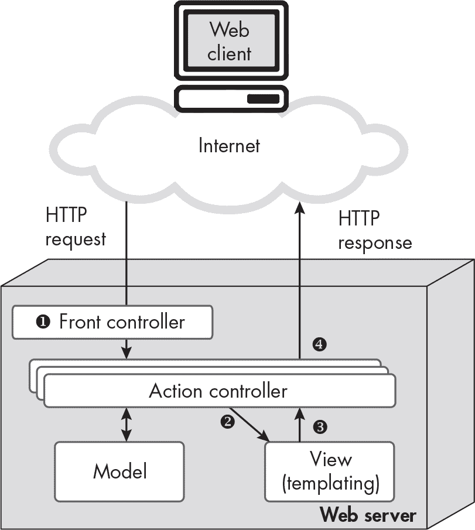
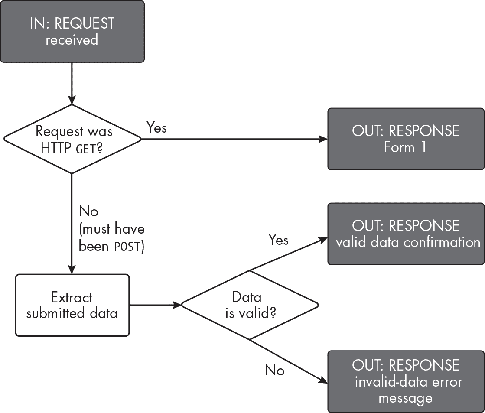
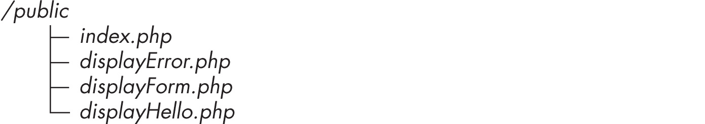
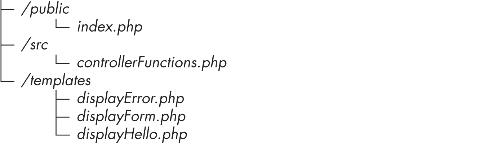
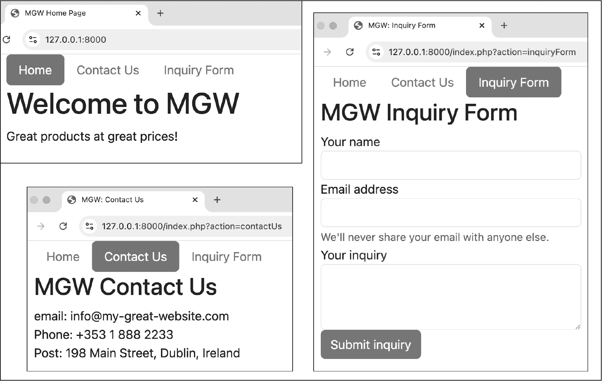
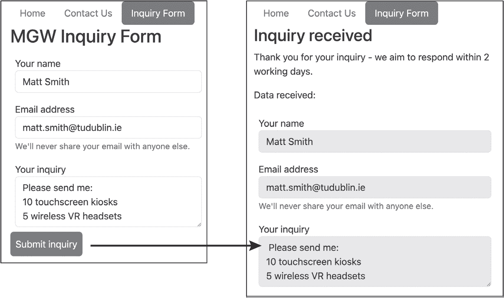
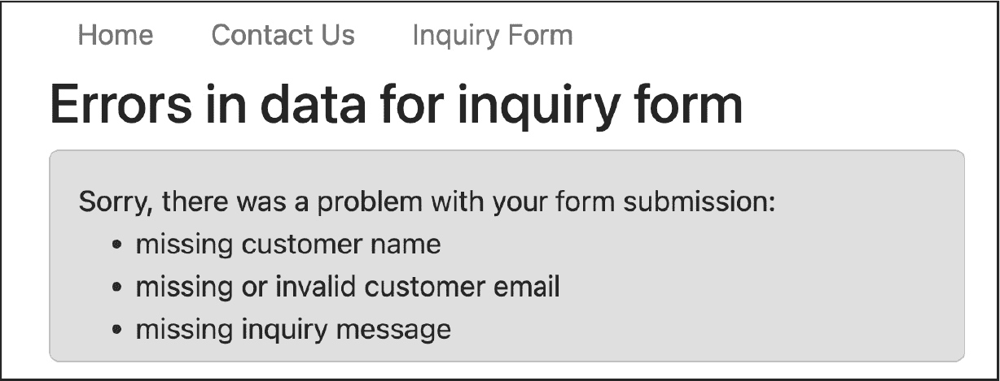

## 第十三章：13 组织 Web 应用程序


在本章中，我们将逐步探索一种结构化的方法，将 Web 应用程序的职责划分到多个脚本中，同时开发一个项目文件夹架构，为每个脚本定义一个明确的家园。你将会接触到*前端控制器*设计模式，它要求通过一个单一的脚本将每个请求发送到 Web 服务器，该脚本决定如何响应，然后将生成响应的责任委派给其他服务器脚本。

第十一章和第十二章介绍了设计 Web 应用程序的不同方法。一种方法是为每个 Web 表单编写多个脚本，分别处理显示、验证和确认表单；另一种方法是创建一个单一的回传脚本来完成所有这些任务。这两种方法各有优缺点，但对于可能随着时间推移而在规模和复杂度上增长的 Web 应用程序来说，任何一种方法都无法扩展。你肯定不希望在应用程序的*public*文件夹中存放几十、几百甚至上千个 PHP 脚本，这种情况可能出现在第一种方法中，原因包括维护和安全性（例如，恶意用户可能尝试按顺序执行公共脚本，以绕过验证检查）。但是，你也不希望单个脚本变得过于复杂，这可能是第二种方法的弊端。

本章中我们将讨论的架构通过将所有决策逻辑集中在单一的前端控制器脚本上来解决这些问题，同时使用其他脚本或函数来执行所有其他任务。前端控制器就像一个大型办公楼的接待员，所有客人都必须拜访它；它识别并解释每个请求（访客是谁，他们要求什么），然后将请求引导到适当的服务器脚本（办公楼中的一个房间）来满足请求。使用这种架构，任何一个脚本都不会变得过于复杂，而随着应用程序的增长，可能会包含许多脚本，但它们的组织方式使得应用程序易于维护和扩展。

### 前端控制器与 MVC 架构

第十章介绍了模型-视图-控制器（MVC）架构，这是一种将 Web 应用程序分为三个主要组件的设计模式。*模型*代表应用程序背后的数据，通常存储在数据库中；*视图*使用模板来决定如何将数据显示给用户；*控制器*则决定何时显示哪些数据。本章中我们将探讨的前端控制器脚本是 MVC 架构中控制器部分的核心，因为它们处理所有的 HTTP 请求，并决定如何响应。图 13-1 展示了前端控制器如何适应 MVC 模式。



图 13-1：MVC 架构，具有前端控制器

*前端控制器* ❶ 处理从 Web 客户端接收到的每个 HTTP 请求，决定应该调用哪个 *动作控制器*。这些动作控制器是更专业化的脚本或函数，也是 MVC 架构中的控制器组件的一部分，执行应用程序的特定任务，例如检查存储的安全凭证或操作数据，如购物车内容。动作控制器可能需要读取数据存储的内容，如数据库系统（更多内容见 第六部分）。然后，动作控制器调用视图（模板）组件 ❷ 来创建返回给用户的响应内容，必要时传递来自模型的数据。接着，动作控制器接收来自视图组件的输出 ❸ 并添加任何适当的头信息或响应代码。最后，响应被发送回 Web 客户端 ❹。  ### 分离显示和逻辑文件

我们将重新访问前两章中开发的简单 *Hello <name>* 表单，开始将应用程序中的显示代码与决策逻辑分离的过程。请参见 “简单示例” 以回顾我们如何使用独立的脚本创建和处理该表单，以及 “简单验证逻辑” 以了解我们如何通过单个回传脚本验证和显示表单。在此版本中，应用程序将有三种可能的响应。

+   如果 HTTP 请求使用 GET 方法，则显示空表单

+   如果收到有效的名称，则显示 *Hello <name>* 确认信息

+   如果接收到无效的名称（少于三个字符），则显示错误信息

决策逻辑和可能的输出在 图 13-2 中的流程图中进行了建模。



图 13-2：建模 Hello <name> 应用程序的逻辑和输出

我们将为三种可能的输出创建一个单独的文件。同时，所有请求将被路由到*index.php*文件中的前端控制器。前端控制器中的逻辑将决定该做什么（即，从其他三个文件中选择哪个来生成返回给用户的输出）。因此，完成后项目的文件结构将如下所示：



请注意，所有文件都位于项目的 *public* 文件夹中。

#### 创建前端控制器

我们将首先编写 *index.php* 前端控制器脚本。此项目的所有请求将指向 *index.php*，其中一些使用 GET 方法，一些使用 POST 方法，一些包含有效的提交数据，另一些则包含无效的提交数据。根据 HTTP 方法（GET 或 POST）以及提交的数据是否有效，脚本将决定返回哪个显示页面作为响应。列表 13-1 显示了代码。

```
<?php
$isGetMethod = ($_SERVER['REQUEST_METHOD'] === 'GET');

if ($isGetMethod) {
  ❶ require_once 'displayForm.php';
} else {
    $firstName = filter_input(INPUT_POST, 'firstName');

    if (strlen($firstName) < 3) {
        $errorMessage = 'invalid - name must contain at least letters';
      ❷ require_once 'displayError.php';
    } else {
      ❸ require_once 'displayHello.php';
    }
}
```

列表 13-1：index.php 中的前端控制器脚本，决定显示哪个页面

首先，我们测试接收到的请求是否为 GET 方法，并相应地设置 $isGetMethod 布尔标志。然后，我们将这个标志传递给 if...else 语句。如果为 true，则通过要求文件*displayForm.php*来显示表单 ❶。否则，我们一定是在处理一个包含表单提交的 POST 请求，因此我们使用 else 分支（即脚本的其余部分）的逻辑来读取和验证数据。为此，我们使用 filter_input() 从 POST 变量中提取 $firstName 值。然后我们测试接收到的名称的有效性。如果名称太短，我们将 $errorMessage 设置为适当的错误信息，然后读取*displayError.php*文件来显示错误页面 ❷。如果名称有效，则读取*displayHello.php*文件，显示*Hello <name>* 确认信息 ❸。

#### 编写显示脚本

接下来，我们将创建三个显示脚本，首先是网页表单本身。将列表 13-2 的内容输入到名为*displayForm.php*的文件中，该文件位于*public*文件夹内。

```
<!doctype html><html><head><title>Tiny Form</title></head>
<body>
    <form method="POST">
        <input name="firstName">
        <input type="submit">
    </form>
</body></html>
```

列表 13-2：displayForm.php 脚本，用来向用户显示表单

这个脚本完全由 HTML 模板文本组成，即一个 POST 方法的表单，包含一个名称输入框和一个提交按钮。因为我们没有给表单指定 action 属性，表单会提交到与显示表单的请求相同的 URL。在这种情况下，就是我们的*index.php*前端控制器脚本。

接下来，列表 13-3 创建了一个确认有效提交的页面。将列表内容复制到名为*displayHello.php*的文件中。

```
<!doctype html><html>
<head><title>hello</title></head><body>
    Hello <?= $firstName ?>
</body></html>
```

列表 13-3：displayHello.php 脚本，用来确认已收到有效的名称

在 HTML 模板文本中，我们使用 PHP 简短的 echo 标签输出 $firstName 变量的值。请注意，这个变量并没有在*displayHello.php*中声明，但这没关系。这个文件不是作为独立脚本编写的，而是打算从另一个脚本（*index.php*）中被引入。只要我们在读取这个脚本之前在*index.php*中设置了 $firstName 变量（我们已经设置了），该变量在*displayHello.php*中也可以访问。

最后，我们将编写第三个显示页面，输出错误信息。创建*displayError.php*并输入列表 13-4 的内容。

```
<!doctype html><html><head>
    <title>error</title>
    <style>.error {background-color: pink; padding: 1rem;}</style>
</head><body>
<div class="error">
    <p>Sorry, there was a problem with your form submission</p>
    <p><?= $errorMessage ?></p>
</div>
</body></html>
```

列表 13-4：用来向用户显示错误信息的 displayError.php 脚本

我们再次使用 PHP 简短的 echo 标签输出变量的值（在此例中是$errorMessage）。我们需要确保在前端控制器脚本引用*displayError.php*显示脚本之前，*index.php*中已经给这个变量赋值。

现在，我们的项目中有四个 PHP 脚本。虽然这看起来有点多，但每个脚本都有一个核心职责。我们有三个脚本来显示应用程序的三个可能页面，还有一个*index.php*前端控制器脚本，负责将主要程序逻辑整合在一起。

### 将网站逻辑移入函数

我们可以通过将*index.php*前端控制器中的每个任务或决策封装成独立的函数，进一步组织我们的项目。虽然当前*index.php*的复杂度适合这个小项目，但对于有多个表单的多页面网站来说，单个脚本将变得过于复杂，无法处理。我们将创建一个名为*controllerFunctions.php*的 PHP 文件来存储这些函数，从而简化前端控制器脚本。

此外，目前所有文件都位于项目的*public*文件夹中，这意味着其中任何一个文件都可以被直接请求并传递给用户。例如，你可以在浏览器的地址栏中输入*localhost:8000/displayHello.php*，然后显示脚本会被执行，但此时变量$firstName 尚未赋值，因为*index.php*中的表单处理逻辑尚未执行。这将触发一个通知级别的错误，提示未定义的变量。

对于一个较大的项目来说，这种文件结构会显得杂乱无章，难以管理，*public*文件夹中可能有数百个可以直接访问的文件。此外，我们暴露了用户不应直接请求的 PHP 脚本。解决方案，如在第十章中首次讨论的那样，是使用文件夹将公共脚本（通常是*index.php*前端控制器）与不应直接对公众开放的脚本分开。我们也将实现这一变更。

#### 设计一个安全的文件夹结构

为了使应用程序更安全，将三个输出脚本（*displayHello.php*、*displayError.php*和*displayForm.php*）从*public*文件夹移动到一个名为*templates*的新文件夹中。同样，我们不希望用户能够直接请求我们新的*controllerFunctions.php*文件。这个文件只包含函数声明，因此没有必要将其发布在*public*文件夹中。相反，我们将把*controllerFunctions.php*放在一个自己的文件夹中，按照惯例我们将其命名为*src*（即*源代码*的缩写）。因此，经过重构的项目文件结构将如下所示：



像这样使用单独的文件夹不仅能提高应用程序的安全性，还能更好地组织它，将脚本按其用途分组到不同的文件夹中。

#### 简化前端控制器脚本

现在让我们通过用函数调用替换部分逻辑来简化前端控制器脚本。前端控制器的主要任务是检查接收到的请求是否使用了 GET 方法（在这种情况下应该显示表单）或 POST 方法（在这种情况下应该处理表单）。

我们将更新脚本，专注于这个决策，并将剩余的细节交给单独的函数（我们接下来将编写）。列表 13-5 展示了如何修改*index.php*文件。

```
<?php
require_once '../src/controllerFunctions.php';

$isGetMethod = ($_SERVER['REQUEST_METHOD'] === 'GET');
if ($isGetMethod) {
    displayForm();
} else {
    processForm();
}
```

列表 13-5：index.php 中的简化前端控制器脚本

我们从*src/controllerFunctions.php*中读取所有将要使用的函数的定义。文件路径开头的两个点（..）表示相对于当前脚本目录的父级目录（即包含*public*和*src*文件夹的整个项目文件夹）。与之前一样，我们接着设置$isGetMethod 布尔标志，并用它来控制 if...else 语句。不过这次，if...else 语句仅在服务器收到 GET 请求时调用 displayForm()函数，或者在收到 POST 请求时调用 processForm()函数。

#### 编写函数

剩下的就是在新的*src/controllerFunctions.php*文件中声明处理更细粒度前端控制器逻辑的函数了。首先，让我们编写 displayForm()函数，如列表 13-6 所示。

```
<?php
function displayForm(): void
{
    require_once '../templates/displayForm.php';
}
```

列表 13-6：显示表单的函数

该函数仅通过使用 require_once 读取并执行*templates/displayForm.php*文件的内容。

接下来，让我们编写 processForm()函数，该函数将从 POST 变量中提取名字，并根据其有效性决定执行什么操作，如列表 13-7 所示。

```
function processForm(): void
{
    $firstName = filter_input(INPUT_POST, 'firstName');

    if (strlen($firstName) < 3) {
        displayErrorMessage();
    } else {
        displayHello($firstName);
    }
}
```

列表 13-7：处理表单的函数

该函数从传入的请求中读取$firstName 变量，并测试它是否小于三个字符。如果是，根据结果调用另一个自定义函数：要么调用 displayErrorMessage()，要么调用 displayHello()。请注意，后者将$firstName 变量作为参数传递；稍后你将更详细地了解这一点。我们将在列表 13-8 中定义这两个函数。

```
function displayHello($firstName) : void
{
    require_once '../templates/displayHello.php';
}

function displayErrorMessage(): void
{
    $errorMessage = 'invalid - name must contain at least 3 letters';
    require_once '../templates/displayError.php';
}
```

列表 13-8：用于显示 Hello <name>问候语或错误信息的函数

displayHello()函数接收有效的名字字符串，然后读取并显示*displayHello.php*页面。displayErrorMessage()函数将错误消息字符串分配给$errorMessage 变量，然后读取并显示*displayError.php*页面。

`displayHello()` 函数有一个 `$firstName` 参数，这是由于 PHP 中变量的作用域。当一个函数通过 `require_once` 语句读取并执行 PHP 脚本文件时，任何该脚本需要的变量必须是函数接收的参数或者在函数内创建的变量。在这种情况下，由于 *displayHello.php* 脚本需要访问 `$firstName`，因此必须将该变量的值传递给 `displayHello()` 函数。如果 `$firstName` 不是一个函数参数，则在 *displayHello.php* 脚本中无法使用该名称的变量进行输出，我们将看到在 图 13-2 中显示的错误。

总体来说，我们应用程序的功能和之前一样，但它具有更好的架构，易于维护、更安全，并且在未来项目需求扩展时具有更好的可扩展性。我们唯一的公共脚本是 *public/index.php* 中的前端控制器，每个 HTTP 请求都通过这个脚本。前端控制器决定用户是想显示表单（通过 GET 请求），还是已经提交表单进行处理（通过 POST 请求）。剩余的控制器逻辑被封装在 *src/controllerFunctions.php* 文件中声明的一系列函数中。同时，返回给客户端的三种响应定义在 *templates* 文件夹中的脚本中：*displayForm.php*、*displayHello.php* 和 *displayError.php*。

### 通用前端控制器结构

你已经看到，脚本和函数在开始将应用程序拆分成独立的职责后变得多么简单。接下来，我们将在一个新的、更复杂的多页面网站项目中测试我们开发的架构。你将看到一个前端控制器脚本如何处理多个 GET 请求以及 POST 表单提交和其验证逻辑。

图 13-3 展示了我们将创建的三页站点，包括一个主页、一个联系方式页面和一个查询表单。*MGW* 名称是一个占位符，代表 *My Great Website*。



图 13-3：在浏览器中显示的三页 Web 应用程序

每个页面顶部都有一个导航栏，当前页面被高亮显示，后面跟着一个一级标题和一些页面内容。为了给页面提供如图所示的漂亮样式，我们将链接到预编写的 Bootstrap CSS 样式表，正如我们在 第十一章 中所做的那样。

#### 区分请求的页面

我们应用中的三个页面将响应 GET 请求进行显示，因此我们需要一种方法来确定哪个页面正在被请求。这与我们*Hello <name>*应用有所不同，在那个应用中，我们知道 GET 请求仅用于显示网页表单。一个简单且常见的解决方案是为每个请求添加一个操作查询字符串变量，无论使用的是 GET 方法还是 POST 方法，并为该变量赋值，以指示所需的操作或页面。因此，请求的 URL 将类似于*index.php?action=contactUs*，用于显示联系方式页面，*index.php?action=inquiryForm*，用于显示咨询表单页面。

在构建我们新网站的过程中，我们将确保为用户呈现链接，这些链接会将操作变量传递给服务器，以便在每个 GET 请求中使用。我们还会在使用 POST 方法提交咨询表单时，将操作查询字符串变量设置为 processForm。所有请求都会发送到*index.php*前端控制器脚本，脚本只需要检测操作变量的值来确定执行什么操作。如果没有接收到操作值，或者值无法识别，则默认显示主页。

请注意，操作查询字符串变量的不同值也可以在图 13-3 中的 URL 地址栏中看到。主页，也是网站的根目录，仅为*localhost:8000*；联系我们页面以*index.php?action=contact*结尾；咨询表单页面以*index.php?action=enquiryForm*结尾。

#### 构建多页面应用

接下来，我们将构建一个三页的网站应用，如图 13-3 所示。为此项目创建一个新文件夹，并在其中创建*public*、*src*和*templates*子文件夹。我们将遵循本章前面简单应用程序使用的相同目录结构。我们将从编写应用程序的前端控制器脚本开始。

##### 创建前端控制器

我们将围绕一个简单的 PHP switch 语句（参见第四章）来构建*public/index.php*脚本，该语句基于操作查询字符串变量的值。列表 13-9 显示了该脚本。它包括调用我们稍后将编写的一些函数。

```
<?php
require_once '../src/controllerFunctions.php';

$action = filter_input(INPUT_GET, 'action');

switch ($action) {
 case 'contactUs':
        displayContactUs();
        break;

    case 'inquiryForm':
        displayInquiryForm();
        break;

   case 'processForm':
        processForm();
        break;

    default:
        displayHomePage();
}
```

列表 13-9：用于三页网站的 index.php 中的前端控制器逻辑

前端控制器读取*controller Functions.php*中的函数声明，然后提取操作查询字符串变量的值，并将其传递给 switch 语句。该语句包含用于显示每个页面的情况（包括默认的显示主页情况），以及处理提交的咨询表单的情况。每个情况简单地调用一个自定义函数来处理执行所需操作的实际工作，例如，displayContactDetails()用来显示联系方式页面。

设计围绕 switch 语句的前端控制器使得在必要时扩展应用程序变得非常简单。要向网站添加另一页，我们所需要做的只是将另一个 case 插入到 switch 语句中，在 *controllerFunctions.php* 中编写相应的函数，并为页面创建一个模板并添加到 *templates* 文件夹中。对于更复杂的网站，我们可以通过为不同类型的网页操作创建不同的函数集合来进一步拆分。例如，管理者操作可以放在一个名为 *managerFunctions.php* 的文件中，以此类推。

##### 编写显示函数

现在我们将编写简单的函数来显示三个基本页面。创建包含 列表 13-10 中代码的 *src/controllerFunctions.php* 文件。

```
<?php
function displayHomePage(): void
{
    require_once '../templates/homePage.php';
}

function displayContactUs(): void
{
    require_once '../templates/contactDetails.php';
}

function displayInquiryForm(): void
{
 require_once '../templates/inquiryForm.php';
}
```

列表 13-10：显示三个基本页面的函数

每个函数使用 require_once 语句来读取并显示相应模板文件的内容。（接下来我们将创建这些模板文件。）例如，displayHomePage() 函数读取并显示 *templates/homepage.php* 脚本。

##### 创建页面模板

接下来，我们将为应用程序的各个页面创建模板，从 *templates/homePage.php* 开始，这是项目的主页。按照 列表 13-11 所示创建该文件。

```
<!doctype html><html><head><title>MGW Home Page</title>
<link rel="stylesheet"
      href="https://cdn.jsdelivr.net/npm/bootstrap@5.3.3/dist/css/bootstrap.min.css"
>
</head><body class="container">
<ul class="nav nav-pills"> ❶
    <li class="nav-item"><a class="nav-link active" href="/">Home</a></li> ❷
    <li class="nav-item"><a class="nav-link"
        href="/index.php?action=contact">Contact Us</a></li>
    <li class="nav-item"><a class="nav-link"
        href="/index.php?action=inquiryForm">Inquiry Form</a></li>
</ul>

<h1>Welcome to MGW</h1>
<p>Great products at great prices!</p>
</body></html>
```

列表 13-11：homePage.php 模板

在链接到 Bootstrap 样式表后，我们通过使用带有 Bootstrap nav 和 nav-pills 样式的无序列表来创建页面顶部的导航栏 ❶。每个列表项都使用 nav-item 类样式，并包含指向三个页面之一的链接。每个链接都使用 nav-link 类样式。当前显示的页面（首页）的链接也使用 active 类样式，以便高亮显示 ❷。注意，我们在“联系我们”和“查询表单”页面的超链接中包括了一个 action 查询字符串变量。首页的超链接则是简单的斜杠（/）。我们本可以使用 /index.php 代替，但由于 *index.php* 脚本是默认加载的，所以不需要这样做。

现在我们可以复制首页脚本，并修改其代码来创建 *templates/contactUs.php* 中的联系信息页面，如 列表 13-12 所示。

```
<!doctype html><html><head><title>MGW: Contact Us</title>
<link rel="stylesheet"
 href="https://cdn.jsdelivr.net/npm/bootstrap@5.3.3/dist/css/bootstrap.min.css"
>
</head><body class="container">
<ul class="nav nav-pills">
 <li class="nav-item"><a class="nav-link" href="/">Home</a></li>
 <li class="nav-item"><a class="nav-link active"
 href="/index.php?action=contact">Contact Us</a></li>
 <li class="nav-item"><a class="nav-link"
 href="/index.php?action=inquiryForm">Inquiry Form</a></li>
</ul>
<h1>MGW Contact Details</h1>
<p>email: info@my-great-website.com<br>
   Phone: +353 1 888 2233<br>
   Post: 198 Main Street, Dublin, Ireland
</p>
</body></html>
```

列表 13-12：contactUs.php 模板

我们保持了文件开头的基本 HTML 结构不变，唯一的修改是更改了页面标题，并将导航栏中的“联系我们”链接样式设置为激活状态，而不是首页链接。然后，我们在页面的主体部分填写了一些联系信息。

然后，我们将编写查询表单的代码。再次通过复制其他模板中的一个文件到一个新的 *templates/inquiryForm.php* 文件中开始。然后更改页面标题，并将导航栏中的“查询表单”链接设置为激活状态。使用 列表 13-13 中的 HTML 代码来创建查询表单本身。

```
--snip--
<ul class="nav nav-pills">
 <li class="nav-item"><a class="nav-link" href="/">Home</a></li>
 <li class="nav-item"><a class="nav-link"
 href="/index.php?action=contact">Contact Us</a></li>
 <li class="nav-item"><a class="nav-link active" ❶
 href="/index.php?action=inquiryForm">Inquiry Form</a></li>
</ul>

<h1>MGW Sales Inquiry</h1>
<form method="POST" action="/index.php?action=processForm"> ❷
<div class="form-group">
    <label for="customerName">Your name</label>
    <input class="form-control" name="customerName" id="customerName">
</div>

<div class="form-group">
    <label for="customerEmail">Email address</label>
    <input type="email" class="form-control" name="customerEmail"
        id="customerEmail">
    <small class="form-text text-muted">
        We'll never share your email with anyone else.
    </small>
</div>

<div class="form-group">
    <label for="inquiry">Your inquiry</label>
 <textarea class="form-control" name="inquiry" id="inquiry" rows="3"></textarea>
</div>

<input type="submit" value="Submit inquiry" class="btn btn-success">
</form>
```

列表 13-13：inquiryForm.php 模板

我们使“提交询问”链接在导航栏中变为激活状态❶。我们声明表单使用 POST 方法，并将其 action 设置为 /index.php?action=processForm❷，因此当表单提交时，它将传递一个名为 action 的查询字符串变量，值为 processForm。剩余的 HTML 添加了客户姓名、电子邮件地址和询问内容（作为文本区域输入）的表单输入项，还有一个提交按钮，所有这些都装饰有更多的 Bootstrap CSS 类。

##### 确认有效表单数据的接收

如果用户输入有效数据（对于这个项目，我们只测试表单字段是否为空），我们将显示一个确认页面，声明询问已收到，并将提交的值回显给用户。实现这一点的一种简单方法是呈现一个类似的表单，预填入提交的值，且每个字段都设置为禁用，这样用户无法编辑信息并尝试重新提交。

图 13-4 显示了一个完整的询问表单（左侧）和相应的只读确认表单页面（右侧）。用户将明白该页面是只读的，因为框已被灰显，没有提交按钮，且点击表单字段时不会发生任何事情。



图 13-4：比较表单提交与确认页面

将列表 13-14 中的内容输入到一个名为 *templates/confirmData.php* 的新模板文件中，以创建有效的表单确认。大部分代码可以从询问表单脚本 *inquiryForm.php* 中复制。你还需要在文件的开头添加我们的标准 HTML 头和导航栏。

```
--snip--
<h1>Inquiry received</h1>
<p>Thank you for your inquiry - we aim to respond within 2 working days.</p>
<p>Data received:

<div class="form-group">
    <label for="customerName">Your name</label>
    <input class="form-control" name="customerName" value="<?= $customerName ?>"
           id="customerName" disabled> ❶
</div>

<div class="form-group">
    <label for="customerEmail">Email address</label>
    <input type="email" class="form-control" name="customerEmail"
        id="customerEmail" value="<?= $customerEmail ?>" disabled >
    <small class="form-text text-muted">
        We'll never share your email with anyone else.
    </small>
</div>

<div class="form-group">
    <label for="inquiry">Your inquiry</label>
    <textarea class="form-control" name="inquiry" rows="3" id="inquiry"
        disabled> <?= $inquiry ?></textarea>
</div>
```

列表 13-14：confirmData.php 模板

我们使用 PHP 短回显标签将 $customerName 变量的值插入到 customerName 输入字段中，并将该字段设置为禁用，以防止编辑❶。我们使用相同的机制显示接收到的 $customerEmail 和 $inquiry 值。我们不需要在此模板页面中添加 `<form>` 元素或提交按钮；我们只是将数据回显给用户，所以这不是一个交互式表单。

##### 处理提交的数据

现在让我们编写 `processForm()` 函数，接收通过 POST 请求提交的表单数据，并根据数据是否有效决定下一步操作。将列表 13-15 中的函数添加到 *src/controllerFunctions.php* 文件的末尾（尽管在这种文件中，函数的声明顺序实际上并不重要）。

```
--snip--
function processForm(): void
{
  ❶ $customerName = filter_input(INPUT_POST, 'customerName',
                                 FILTER_SANITIZE_SPECIAL_CHARS);
    $customerEmail = filter_input(INPUT_POST, 'customerEmail',
                                  FILTER_SANITIZE_EMAIL);
 $inquiry = filter_input(INPUT_POST, 'inquiry',
                            FILTER_SANITIZE_SPECIAL_CHARS);

  ❷ $errors = [];
    if (empty($customerName)) {
        $errors[] = 'missing customer name';
    }

    if (empty($customerEmail)) {
        $errors[] = 'missing or invalid customer email';
    }

    if (empty($inquiry)) {
        $errors[] = 'missing inquiry message';
    }

  ❸ if (sizeof($errors) > 0) {
        require_once '../templates/displayError.php';
    } else {
        confirmData($customerName, $customerEmail, $inquiry);
    }
}
```

列表 13-15：一个处理表单数据的函数

首先，我们使用三个 filter_input() 调用 ❶ 尝试提取接收到的 POST 表单数据中的三个预期值。请注意，对于两个字符串（姓名和咨询），我们使用 FILTER_SANITIZE_SPECIAL_CHAR 过滤器作为第三个函数参数，对于客户电子邮件输入，则使用 FILTER_SANITIZE_EMAIL。这些过滤器会删除通过表单提交的任何不安全字符，防止跨站脚本攻击（XSS），即通过表单提交 JavaScript 代码，试图进入网站数据。

接下来，我们实现了基于数组的数据验证方法，这在第十二章中进行了讨论。我们将 $errors 声明为空数组 ❷，然后使用三个 if 语句测试是否有接收到的表单变量为空，如果有必要，则将相应的错误消息添加到数组中。最后，我们测试 $errors 数组的大小 ❸，如果发现任何错误，就显示文件 *templates/displayError.php*（接下来我们将创建它）。否则，如果提交的数据全部有效，我们调用 confirmData() 函数，并传入 $customerName、$customerEmail 和 $inquiry 作为参数。列表 13-16 显示了这个函数的代码。请将代码输入到 *src/controllerFunctions.php* 文件的末尾。

```
function confirmData($customerName, $customerEmail, $inquiry): void
{
    require_once '../templates/confirmData.php';
}
```

列表 13-16：一个确认有效数据给用户的函数

这个函数读取并执行 *templates/confirmData.php* 文件。如前所述，该函数必须将模板脚本中所需的变量作为参数传入。

##### 创建错误页面

最后，我们需要创建一个模板文件，用于向用户显示任何错误消息。图 13-5 显示了所有三项验证检查失败时的错误页面。



图 13-5：错误页面

创建一个名为 *templates/displayError.php* 的新文件，包含列表 13-17 中显示的错误输出脚本。同样，您还需要在脚本开始时添加标准的 HTML 头部和导航栏代码。

```
--snip--
<h1>Errors in data for inquiry form</h1>
❶ <div class="alert alert-danger" role="alert">
    Sorry, there was a problem with your form submission:

    <ul>
      ❷ <?php foreach ($errors as $error): ?>
          ❸ <li><?= $error ?></li>
        <?php endforeach; ?>
    </ul>
</div>
```

列表 13-17：一个 displayError.php 模板

我们将页面的主要 <div> 的 CSS 样式设置为 Bootstrap 类 "alert alert-danger" ❶，这是一种典型的网页错误样式，背景为粉红色。然后，我们使用带有替代语法的 foreach 循环来遍历 $errors 数组中的每条信息 ❷，并将其作为列表项显示 ❸。### 总结

在本章中，我们致力于构建一个组织良好且可扩展的 Web 应用架构，并将其应用于一个包含静态页面和 Web 表单的多页面网站。该架构依赖于一个名为*public/index.php*的前端控制器脚本，其核心是一个简单的 `switch` 语句，根据每个传入 HTTP 请求中带有的 `action` 查询字符串变量来决定执行的操作。我们将其他更为细致的逻辑委托给自定义函数，这些函数已安全地声明在 *public* 文件夹之外的 *src/controllerFunctions.php* 文件中。与此同时，所有向用户输出 HTML 内容的脚本都位于 *templates* 文件夹中。这些脚本利用 Bootstrap CSS 实现了专业外观的格式化，且代码量最小。

尽管这个项目比前几章的表单处理项目有更多的页面和功能，但我们的脚本或函数并不复杂或冗长，证明我们采用的架构适用于更复杂的网站，同时仍然易于理解和维护。

### 习题

1.   创建一个包含四个简单页面模板（无表单）的网页：一个主页（*home.php*）、一个关于页面（*about.php*）、一个联系方式页面（*contact.php*）和一个客户推荐页面（*recommendations.php*）。这些页面应通过索引页的`action`查询字符串参数来访问，示例如下：

```
index.php?action=home
index.php?action=about
index.php?action=contact
index.php?action=recommendations
```

按照本章展示的前端控制器架构以及在 *src/controllerFunctions.php* 中声明的函数来组织项目。你的项目应该具有以下文件结构：


2.   使用本章中的前端控制器架构，创建一个新的网站，主页模板为（*home.php*），其中包含指向员工登录页面的链接。员工登录页面模板（*loginStaff.php*）应显示一个标准的用户名/密码登录表单。成功登录的员工用户名为 author，密码为 words。如果输入正确的用户名和密码，则显示员工登录成功页面（*successStaff.php*）；如果收到的用户名和密码不匹配正确的值，则显示登录错误页面（*loginError.php*）。错误页面应包含返回主页的链接。

网站页面应通过索引页的`action`查询字符串参数来访问，示例如下：

```
index.php?action=home
index.php?action=loginStaff
```

3.   复制并扩展第 2 题的解决方案，添加一个客户登录页面（*loginClient.php*），并在主页上提供指向该页面的链接。客户登录的用户名为 customer，密码为 paying。如果收到正确的客户登录信息，则显示客户登录成功页面（*successClient.php*），如果信息无效，则显示登录错误页面（*loginError.php*）。

网站页面应该通过索引页面访问，并通过 action 查询字符串参数的值来进行访问，格式如下：

```
index.php?action=home
index.php?action=loginStaff
index.php?action=loginClient
```

4.   复制并扩展第 3 题的解法，将员工和客户登录表单放入主页。主页应包含欢迎文本和两个登录表单，一个供员工使用，一个供客户使用。

5.   复制并扩展第 4 题的解法，现在在主页上提供一个登录表单，但有两个提交按钮：一个供员工使用，一个供客户使用。

提示：查看第十一章以复习如何检测哪个提交按钮被点击了。
