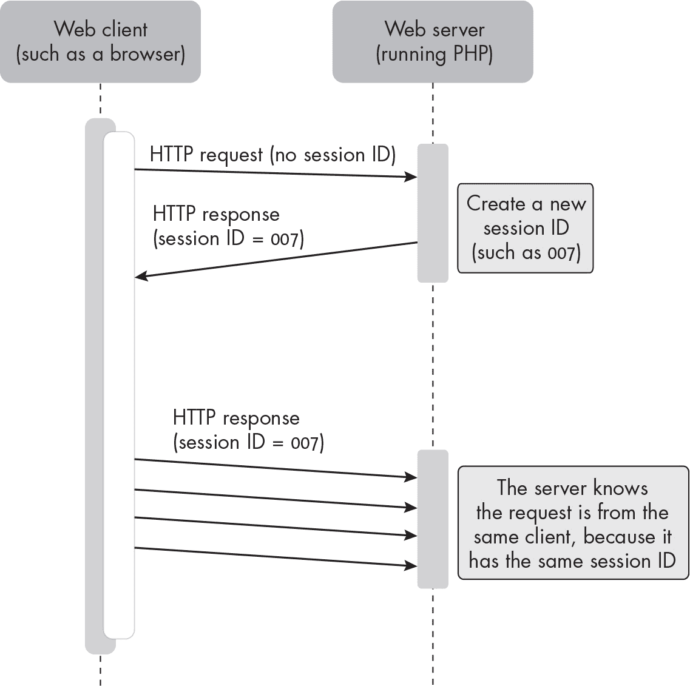
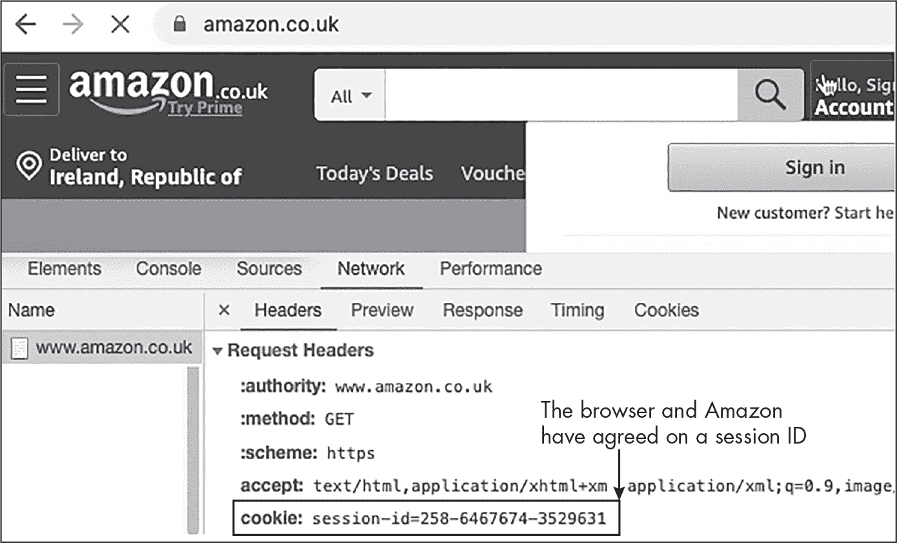
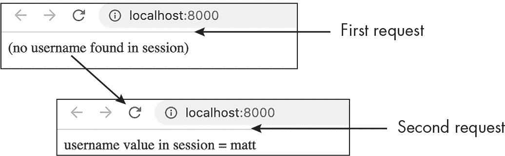
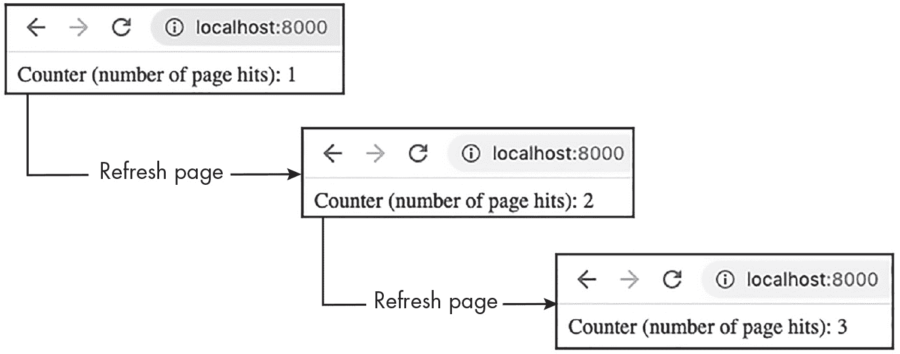
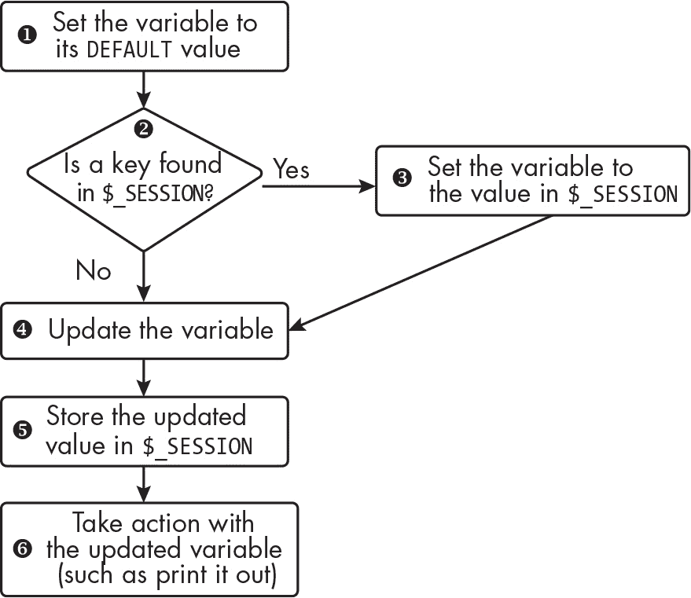
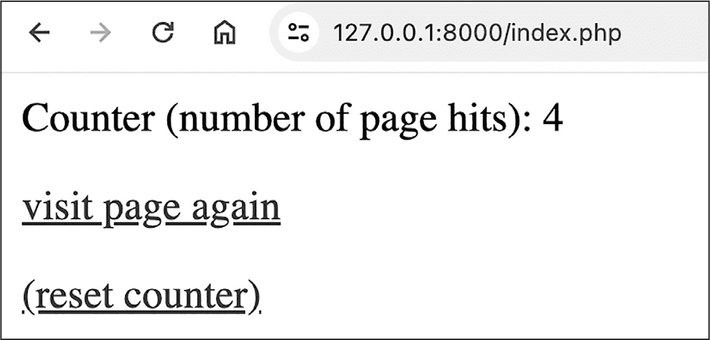
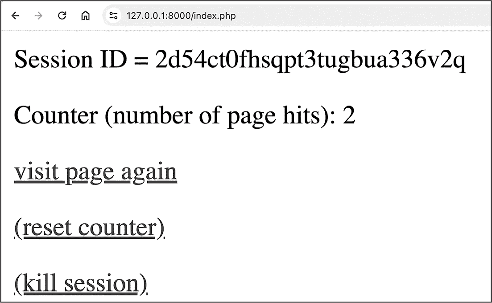

## 第十四章：14 使用会话


本章介绍了浏览器会话，它使得 Web 客户端和服务器可以在一段时间内记住用户信息。例如，当浏览在线商店时，你期望能够将商品加入购物车，并且这些商品会在几分钟后，甚至跨浏览器标签页被记住。类似地，如果你输入用户名和密码访问基于 Web 的电子邮件系统，你期望在点击浏览页面查看电子邮件、草稿等内容时，成功登录状态能够被记住。会话使得这种记忆成为可能。

本章讨论了如何在 PHP 中使用浏览器会话，包括存储和检索值，以及重置或完全销毁会话。我们将开发一个通用的编写会话代码的模式，这个模式适用于大多数情况，例如购物车和登录认证。

### 一个 Web 浏览器会话

*浏览器会话* 是一个临时的信息交换过程，发生在 Web 客户端（如浏览器或手机应用）和 Web 服务器之间。会话从某一时刻开始，并将在稍后的某一时刻终止。会话通常在用户将浏览器指向一个新网站时开始；浏览器和服务器商定一个唯一的会话 ID，并在后续的 HTTP 请求和响应中使用该 ID，以表明它们都是同一个会话的一部分。图 14-1 展示了 Web 客户端通过继续使用首次请求后创建的会话 ID 来发起重复请求。



图 14-1：Web 客户端的重复请求，每个请求都包含相同的会话 ID

你可以使用浏览器的开发者工具检查 HTTP 请求，查看现实世界 Web 交互背后的会话 ID。例如，图 14-2 显示了 Amazon 英国网站与我的 Web 浏览器商定会话 ID 的过程。



图 14-2：Chrome 浏览器工具显示来自 Amazon 的会话 ID

服务器和客户端都需要记录商定的会话 ID，因为这个唯一的令牌必须包含在每个 HTTP 请求中。这样，当服务器收到传入请求时，它可以立即识别该请求属于哪个会话，即使服务器可能正在跟踪成千上万的会话。服务器还使用会话 ID 来存储和管理每个会话的数据，例如购物车、成功登录等。PHP 网络服务器会自动创建这些会话 ID，且 PHP 语言提供了多个用于处理会话的函数。Web 客户端通常使用 HTTP cookie 临时存储会话 ID。

会话可以通过多种方式结束，具体取决于 Web 服务器设置、PHP 代码以及有时在 Web 客户端上运行的额外 JavaScript 代码。当用户退出浏览器应用程序时，会话将结束。会话也可以通过 PHP 服务器代码终止，例如当用户选择退出账户时。一些网站在 Web 浏览器中运行 JavaScript 来检测用户何时关闭或离开浏览器标签页，这时 JavaScript 会向服务器发送请求，要求结束会话。

会话也可能会超时；服务器可以设置一个时间限制，从最新的客户端请求开始计算，如果在指定时间内没有收到新的请求，服务器将自动终止会话。超时有助于保持站点的安全：如果用户离开电脑，会话可能会超时，从而防止未授权人员继续进行已授权的会话。（尽管有超时设置，但在离开电脑前注销或退出浏览器*始终是一个好主意*。）

### session_start() 和 session_id() 函数

PHP 提供了 session_start() 函数，如果当前没有会话，则启动一个新会话；如果收到的 HTTP 请求中包含有效的会话 ID，则更新现有会话。当更新现有会话时，函数会重新启动超时计时器。尽管在编写 PHP 脚本时你很少需要知道唯一的会话 ID，但语言确实提供了一个函数来检索它：session_id()。

列表 14-1 显示了一个包含两条语句的 PHP 脚本，该脚本首先调用 session _start()，然后打印 session_id() 返回的值。

```
<?php
session_start();
print session_id();
```

列表 14-1：启动（或重新启动）会话并打印其 ID

如果你运行这个脚本，输出将是一个由字母和数字组成的长字符串，类似于 d98rqmn9amvtf3cqbpifv95bdd。这是通过 session_start() 生成的唯一会话 ID，并通过 session_id() 获取。

> 注意

*在 PHP 代码中使用* session_start() *函数的替代方法是通过配置 PHP 引擎的设置启用自动启动会话（在* php.ini *文件中设置* session.auto_start = 1 *），或为 Web 服务器启用（在 Apache Web 服务器的* .htaccess *文件中设置* php_value session.auto_start 1 *）。然而，在学习使用会话时，或者当你的 Web 主机难以修改配置时，最佳做法是使用* session_start() *函数，正如本章中所示的那样。* ### $_SESSION 超全局数组

通常你不需要在 PHP 代码中引用特定的会话 ID 来处理会话。相反，你主要通过内置的 $_SESSION 数组来处理会话数据。这是 PHP 的另一个*超全局变量*，就像我们在第十一章中遇到的 $_GET 和 $_POST 一样。

$_SESSION 数组保存与当前会话相关的数据，使用字符串键。这是 PHP 引擎在接收到来自客户端的带有会话 ID 的 HTTP 请求时自动提供的。它的存在是为了让 PHP 网页程序员有一个变量，可以存储需要在当前客户端的会话中从一次请求到另一次请求记住的任何值。

理解这一点的一种方法是考虑到，典型的网络服务器可能会维护数十、数百或数千个$_SESSION 数组，每个数组对应一个与当前正在与服务器通信的客户端的会话。（想象一下，成千上万的人在任何时候都在使用 eBay 或 Amazon。）当服务器执行一个 PHP 脚本来处理某个特定客户端请求时，该请求包含一个唯一的会话 ID，PHP 引擎会检索与该会话 ID 关联的存储在服务器上的数据，并将其放入$_SESSION 数组中，以供该脚本的副本使用。（在任何时刻，可能会有多个脚本副本在执行，每个副本对应一个正在使用该网站的客户端。）这个过程使得脚本的副本可以记住在会话期间，客户端/服务器交互的任何值。

为了理解这一切是如何工作的，让我们编写一个脚本，尝试从$_SESSION 数组中存储和检索一个值。会话的一个常见用途是存储登录验证令牌，因此我们将使用当前登录用户的用户名作为示例。清单 14-2 显示了代码。

```
<?php
session_start();
$message = '(no username found in session)';

if (isset($_SESSION['username'])) {
    $message = 'username value in session = ' . $_SESSION['username'];
}

$_SESSION['username'] = 'matt';

print $message;
```

清单 14-2：尝试从$_SESSION 数组中检索，然后存储一个值

在使用 session_start()（重新）启动会话后，我们将默认字符串值（会话中未找到用户名）存储到$message 变量中。然后，我们使用 isset()函数测试在$_SESSION 数组中的'username'键下是否能找到任何值。如果找到值，我们将$message 更新为包含该值的新字符串。接下来，我们将值'matt'存储到$_SESSION['username']中。这将覆盖$_SESSION 数组中'username'键的任何现有值。最后，我们输出存储在$message 中的任何字符串。图 14-3 显示了连续两次访问该网页的结果。



图 14-3：在第二次请求中从会话中检索用户名

当页面首次访问时，在执行 if 语句时，找不到'session'中'username'的值，因此显示默认消息。然而，第二次访问页面时，第一次通过脚本存储到$_SESSION 数组中的'matt'值会被检索并显示回来。通过这种方式，会话允许我们记住从一次脚本执行到下一次执行的值。

#### 更新存储的值

$_SESSION 数组的一个好处是它的值可以根据需要更新。例如，如果你使用会话来跟踪用户的购物车，那么每次用户添加或删除商品时，你都需要进行更新。我们将在第十五章中详细探讨这个场景，但现在我们考虑一个更简单的例子：在$_SESSION 数组中更新一个值——一个存储并显示访问网站次数的访问计数器。当个人网站首次流行时，拥有这样一个访问计数器是很常见的。

这里有一个警告：实际上，会话并不是存储不同网站访问者数据的合适机制，也不适用于存储超过秒或分钟的时间段的值。正如我们所讨论的，每个用户的会话都存储一组单独的数据，因此基于会话的访问计数器只能计算*同一用户*的访问次数。此外，当用户退出浏览器或会话超时时，会话会被终止，因此在一天稍晚的时候（或另一天）访问该站点时，基于会话的访问计数器会从 1 重新开始，"忘记"之前的访问记录。不过，基于会话的访问计数器对于介绍会话存储操作中涉及的一些核心逻辑是一个有用的项目。

图 14-4 展示了我们旨在创建的计数器。第一次访问页面时，计数器为 1。然后，每次刷新页面时，之前的总数会被记住并增加 1。



图 14-4：页面刷新后，访问计数器的递增

列表 14-3 展示了创建基于会话的访问计数器所需的*public/index.php*脚本。

```
<link rel="icon" href="data:image/png;base64,iVBORw0KGgoAAAANSUhEUgAAAAEAAAABC
AIAAACQd1PeAAAADElEQVQI12P4//8/AAX+Av7czFnnAAAAAElFTkSuQmCC">

<?php
session_start();

❶ $pageHits = 0;
❷ if (isset($_SESSION['counter'])) {
  ❸ $pageHits = $_SESSION['counter'];
}

❹ $pageHits++;

❺ $_SESSION['counter'] = $pageHits;

❻ print "<p>Counter (number of page hits): $pageHits</p>";
```

列表 14-3：使用会话变量模拟网站访问计数器

脚本的第一部分是一个虚拟的 favicon 的 HTML 代码。由于现代浏览器如果在接收到的 HTML 中没有定义 favicon 图像，会发送额外的请求，因此在脚本开头添加这个<link>元素可以保持浏览器的正常工作，防止它发送多余的请求，这样就能避免访问计数器变得混乱。

这个脚本的逻辑基于首先测试会话中是否存在任何值，然后再尝试检索和更新它。我们使用一个名为$pageHits 的本地 PHP 变量来表示脚本执行时的页面访问次数，同时我们使用'counter'键将运行总数存储在$_SESSION 数组中。（不同的名称有助于避免这两个值之间的混淆。）

在启动会话后，我们将$pageHits 设置为默认值 0，以表示会话中没有存储现有值的情况❶。接下来，我们测试在$_SESSION 数组中的'counter'键下是否能找到任何值❷。如果找到值，我们从数组中检索它并存储到$pageHits 变量中，覆盖默认值❸。

此时，无论 $_SESSION 数组中是否找到值，我们都知道在 $pageHits 变量中有一个合适的值：要么是 0，要么是截至当前页面访问之前的访问总数。在这两种情况下，我们都将 $pageHits 加 1，以计入当前访问页面 ❹。然后，我们将更新后的 $pageHits 值存储到 $_SESSION 数组中的 'counter' 键下，若是第一次访问该页面，则创建该键；若已经存在该键，则覆盖其值 ❺。最后，我们输出一条消息，显示页面被访问的次数 ❻。

图 14-5 中的流程图展示了我们访问计数器脚本的基本逻辑。你可以将这个流程图与清单 14-3 中的 ❶ 到 ❻ 各个点进行关联。



图 14-5：如何更新（或设置）会话变量

流程图中的逻辑可以概括为你可能需要做的任何与会话值相关的工作。首先，在本地脚本中将一个变量设置为默认值。然后，检查在 $_SESSION 数组中是否能找到先前存储的值，并在适当的情况下用它来覆盖默认值。接下来，更新本地变量并将更新后的值存储回 $_SESSION 数组中。通常，你还需要对更新后的变量执行某些操作。无论是在会话开始时（即 $_SESSION 数组中没有存储任何内容），还是在会话期间第二次、第三次或 *n* 次请求时执行代码（即从上次脚本运行中 $_SESSION 数组中存储了某个值），这种方法都能奏效。

#### 取消设置一个值

有时，你可能想要删除会话中存储的某个特定值。正如我们在第八章中讨论的那样，可以使用 unset() 函数从数组中删除一个值。这与将数组元素设置为 NULL、空字符串或 0 不同，因为 unset 会移除与字符串键相关联的 *任何* 值。以我们的访问计数器示例为例，我们可以通过调用 unset($_SESSION['counter']) 来删除与 'counter' 键相关联的任何会话值。例如，如果页面有一个重置按钮，用来清除访问计数器，我们可能会这样做。

现在，让我们实现一个重置按钮，并添加一个链接，以重新访问访问计数器页面（从而增加计数）。图 14-6 展示了我们尝试创建的页面。



图 14-6：具有重新访问和重置链接的访问计数器页面

为了添加这个功能，请更新你的 *index.php* 脚本，使其与清单 14-4 匹配。

```
<link rel="icon" href="data:image/png;base64,iVBORw0KGgoAAAANSUhEUgAAAAEAAAABC
AIAAACQd1PeAAAADElEQVQI12P4//8/AAX+Av7czFnnAAAAAElFTkSuQmCC">

<?php
session_start();

$action = filter_input(INPUT_GET, 'action');
if ('reset' === $action) {
  ❶ unset($_SESSION['counter']);
}

$pageHits = 0;
❷ if (isset($_SESSION['counter'])) {
 $pageHits = $_SESSION['counter'];
}

$pageHits++;

$_SESSION['counter'] = $pageHits;
?>

<p>Counter (number of page hits): <?= $pageHits ?>
<p><a href="/index.php">visit page again</a>
❸ <p><a href="/index.php?action=reset">(reset counter)</a>
```

清单 14-4：向访问计数器添加重置链接

在（重新）启动会话后，我们检索并测试'action'查询字符串变量的值。如果其值为'reset'，我们将取消设置$_SESSION 数组中的'counter'元素❶。然后脚本继续按之前的方式执行。如果用户点击了重置按钮并且'counter'元素被取消设置，那么就好像这个元素从未存在过一样，因此 isset()测试❷将失败，'counter'元素将获得一个新的值 1（在默认值 0 被增加之后）。

在文件的末尾，我们添加了两个链接。第一个链接只是为了重新访问*index.php*（从而增加计数器）。第二个链接也是指向*index.php*，但是包含了一个'action'查询字符串变量，值为'reset'，这将触发脚本重置计数器❸。

#### 销毁会话并清空会话数组

有时你可能希望销毁整个会话，从而使会话 ID 失效并删除所有存储的会话数据。删除可能是出于安全要求，例如，因为销毁会话应当导致服务器会话数据*立即*销毁，而不是等待垃圾收集过程（例如，在会话超时之后）。不过，完全销毁会话通常不推荐，因为它可能会干扰正在进行的并发请求，例如异步 JavaScript。如果你只想清空$_SESSION 数组，你可以在不完全销毁会话的情况下做到这一点：使用 unset($_SESSION)或$_SESSION = []将$_SESSION 变成一个空数组。

如果你*确实*需要完全销毁会话，请按照以下步骤操作：

1.   （重新）启动会话，使用 session_start()。

2.   将$_SESSION 数组设置为空数组。

3.   如果使用 cookies，使会话 cookie 失效（超时）。

4.   通过执行 session_destroy()函数销毁 PHP 会话。

查看关于此过程的更多信息，请参阅* [`www.php.net/manual/en/function.session-destroy.php`](https://www.php.net/manual/en/function.session-destroy.php) *上的 PHP 文档。

接下来，让我们在点击计数器页面上添加一个销毁会话的链接。图 14-7 显示了添加了该链接的页面，当用户希望完全销毁会话时，它会传递 action=kill 查询字符串变量。



图 14-7：带有新链接以销毁会话的点击计数器页面

为了避免我们的*index.php*文件过于复杂，我们将销毁会话的代码封装到一个单独的函数中。列表 14-5 显示了 killSession()函数的代码；它实现了之前概述的会话销毁过程中的步骤 2 到 4（步骤 1 发生在*index.php*文件的开始）。将*src/usefulFunctions.php*文件添加到你的点击计数器项目中，并输入列表中的代码。

```
function killSession() {
    $_SESSION = [];

    if (ini_get("session.use_cookies")) {
        $params = session_get_cookie_params();
        setcookie(session_name(), '', time() - 42000,
            $params["path"], $params["domain"],
            $params["secure"], $params["httponly"]
        );
    }

    session_destroy();
}
```

列表 14-5：销毁会话的函数

该函数首先将 $_SESSION 设置为空数组（步骤 2），最后通过调用 session_destroy() 结束（步骤 4）。在这之间，if 语句实现了会话销毁过程的步骤 3：使会话 cookie 无效。为此，我们检查是否正在使用 cookies，然后将当前会话名称的 cookie 改为空字符串，并设置一个过期时间（time() - 42000），有效地删除该 cookie。

在声明了 killSession() 函数后，如 示例 14-6 所示，更新 *public/index.php* 脚本，以便在访问计数页面上提供一个销毁会话的链接。

```
<link rel="icon" href="data:image/png;base64,iVBORw0KGgoAAAANSUhEUgAAAAEAAAABC
AIAAACQd1PeAAAADElEQVQI12P4//8/AAX+Av7czFnnAAAAAElFTkSuQmCC">

<?php
require_once __DIR__ . '/../src/usefulFunctions.php';

session_start();

$action = filter_input(INPUT_GET, 'action');

❶ switch ($action) {
    case 'reset':
        unset($_SESSION['counter']);
        break;

    case 'kill':
        killSession();
        break;
}

$pageHits = 0;
if (isset($_SESSION['counter'])) {
 $pageHits = $_SESSION['counter'];
}

$pageHits++;

$_SESSION['counter'] = $pageHits;

?>

❷ <p>Session ID = <?= session_id() ?>
<p>Counter (number of page hits): <?= $pageHits ?>
<p><a href="/index.php">visit page again</a>
<p><a href="/index.php?action=reset">(reset counter)</a>
<p><a href="/index.php?action=kill">(kill session)</a>
```

示例 14-6：在访问计数页面上添加一个销毁会话的链接

首先，我们从源文件中读取 killSession() 函数的声明。然后，由于我们需要检查多个 'action' 查询字符串变量的值，我们使用 switch 语句 ❶ 来决定如何处理传入的 HTTP 请求。如果 action 为 'reset'，我们像之前一样取消设置 $_SESSION 数组中的 'counter' 键；如果 action 为 'kill'，我们调用 killSession()。在脚本末尾的 HTML 中，我们添加了一个销毁会话的链接，传递 action=kill 查询字符串变量到 *index.php*。我们还添加了一行显示当前会话 ID 的代码，以证明会话确实被销毁 ❷；如果点击销毁会话链接，这个字段应该为空，访问计数器也会重置为 1。  

本章向你介绍了会话，它为 Web 服务器提供了一种在多个 HTTP 请求中记住用户信息的机制。你学习了如何使用 session_start() 启动会话，如何在 $_SESSION 超全局数组中存储和更新值，以及如何清除该数组中的值或完全销毁会话。我们概述了处理会话数据的基本模式：首先设置一个默认值，然后用 $_SESSION 数组中的值（如果存在）覆盖该默认值，最后更新该值并将其存储回数组中。

### 练习

1. 访问一个你认为正在使用会话的网站，例如带有购物车功能的电子商务网站或具有登录页面的网站。使用浏览器的开发者工具找到服务器和客户端约定的会话 ID，并将其作为 cookie 存储在客户端设备上。

2. 编写一个 PHP 脚本，在 $_SESSION 数组中查找键为 'guess' 的值。如果找不到，存储 0 为该键，并向用户显示一条消息，说明没有找到先前的值。如果会话中找到了值，则将 1 到 10 之间的随机数加到该值上。将结果重新存储回 $_SESSION 数组并显示给用户。

3. 编写一个脚本，显示一个表单，其中包含一个文本框，用户可以在其中输入数字，并带有两个提交按钮。一个提交按钮应将文本框中的值存储在会话中。第二个按钮应简单地显示当前存储在会话中的值，或者在没有找到值时显示一条消息，具体视情况而定。
