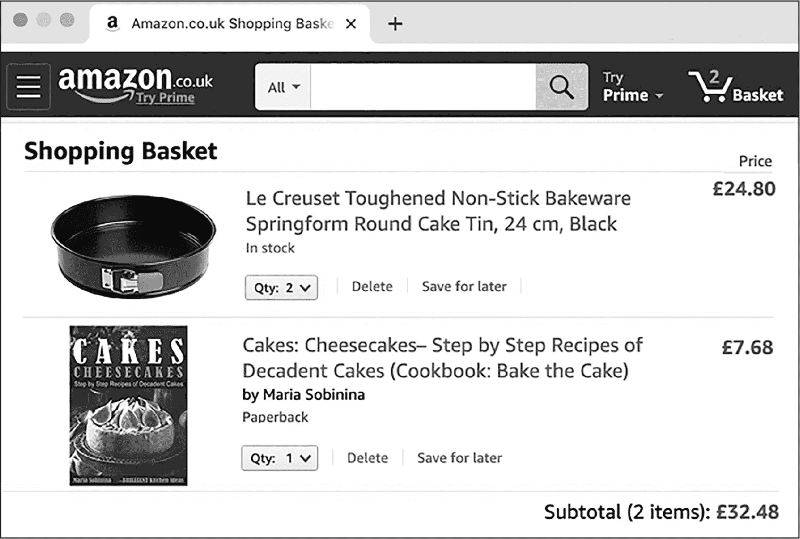
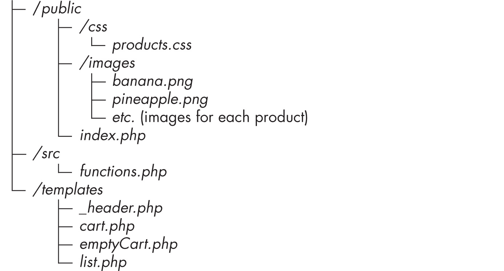
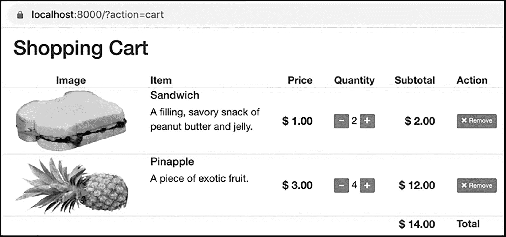
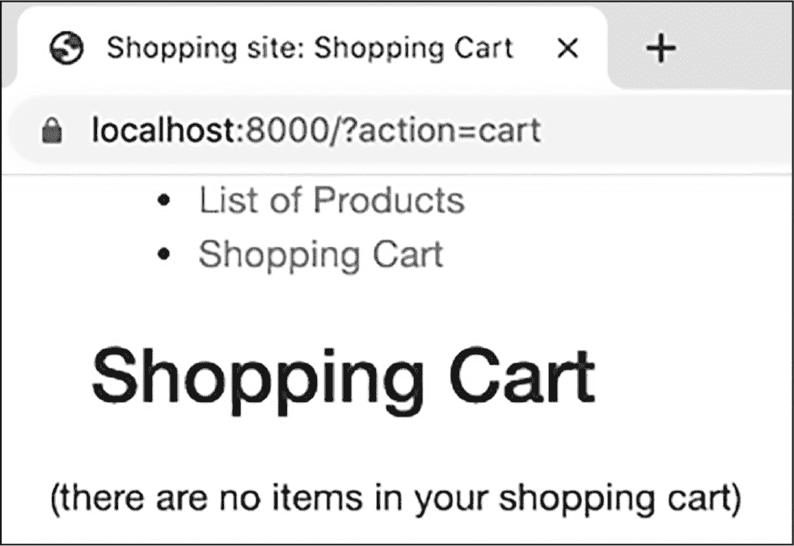

## 第十五章：15 实现购物车


在浏览在线商店时，你希望将商品添加到购物车，并且希望它们在你准备结账时仍被记住。这是一个非常常见的需求，因此在本章中，我们将重点构建一个具有购物车的应用程序。在这个过程中，你将学习如何更高效地使用会话，在$_SESSION 超级全局中存储和更新整个数组。我们还将继续努力将用户行为的核心逻辑封装成单独的函数，并通过前端控制器脚本进行协调，从而得到一个结构良好、易于维护的应用程序。

*购物车*基本上是记录用户选择了哪些产品及其数量的方式。因此，我们的网站需要显示一份产品列表，并允许用户将商品添加到购物车中，查看购物车的内容。我们还应提供一种编辑购物车的方法，让用户可以更改商品数量、删除商品或清空购物车。例如，图 15-1 展示了一个亚马逊购物车，里面有一些商品。



图 15-1：一个电子商务购物车

注意到购物车显示了每个商品的价格以及整个订单的总费用。亚马逊购物车页面还提供了更改每个商品数量和删除商品的方式。我们将在自己的购物车中模仿所有这些功能。

### 购物车文件结构

我们的购物车网页应用将包含多个文件，其中包括一个*index.php*前端控制器脚本，一个*functions.php*文件声明各种实用函数，一组模板脚本以及其他支持文件。最终，项目的完整结构将如下所示：



现在，开始一个新的 PHP 项目，创建必要的文件夹，并将书中提供的资源文件中的图像文件（*banana.png*、*pineapple.png*等）复制到*public/images*文件夹中。这样，我们就可以开始构建应用程序了。书中的资源文件和练习解决方案可以在*[`github.com/dr-matt-smith/php-crash-course`](https://github.com/dr-matt-smith/php-crash-course)*找到。

### 定义产品列表

在我们创建购物车之前，我们将首先构建一个供用户选择的产品列表。我们将使用一个数组来存储我们在线商店中可用的产品。（通常，产品信息会存储在数据库中，但我们将在第六部分中讨论这些内容。）除了产品数组，我们还将在会话中使用第二个数组来跟踪每个用户的购物车内容。你已经在第十一章中学会了如何循环遍历产品数组，自动生成包含产品 ID 的链接（请参阅第 11-11 列表）。我们将在这里做类似的操作。

图 15-2 展示了我们将要创建的产品列表页面。像往常一样，我们可以使用少量的 Bootstrap 来帮助制作一个专业的页面，几乎不需要 CSS。


图 15-2：展示产品列表的页面

我们的站点将展示五个产品。表 15-1 列出了每个产品需要存储的数据值。

表 15-1：产品详情

| 属性 | 每个产品的属性值 |
| --- | --- |
| ID | 010 | 025 | 005 | 021 | 002 |
| 名称 | 三明治 | 芝士蛋糕切片 | 菠萝 | 果冻甜甜圈 | 香蕉 |
| 描述 | 一种充实的、咸味的花生酱果冻三明治。 | 给自己犒赏一块巧克力裹着的芝士蛋糕。 | 一块异国情调的水果。 | 最棒的甜甜圈——充满甜美果酱。 | 一个制作美味冰沙的好基础，富含钾元素。 |
| 价格 | 1.00 | 2.00 | 3.00 | 2.50 | 0.50 |
| 星级 | 4 | 5 | 2 | 3 | 5 |
| 图片 | peanut _butter.png | chocolate_cheese _cake.png | pineapple.png | jellydonut.png | banana.png |

注意，每个产品都有一个唯一的 ID、名称、描述、价格、星级评价（从 1 到 5）和相关的图片文件名。为了实现这一切，我们将创建一个$products 数组，其中包含每个产品的元素，使用产品 ID 作为键。数组中的每个产品本身也是一个数组，包含每个属性的键，例如'name'、'description'、'price'等。

#### 创建产品数组

列表 15-1 显示了如何声明每个产品数组元素来存储其数据值，并为前两个产品创建元素。将此代码输入到*public/index.php*中。

```
<?php
$products = [];

$products['010'] = [
    'name' => 'Sandwich',
 'description' =>
    'A filling, savory snack of peanut butter and jelly.',
    'price' => 1.00,
    'stars' => 4,
    'image' => 'peanut_butter.png'
];

$products['025'] = [
    'name' => 'Slice of cheesecake',
    'description' =>
    'Treat yourself to a chocolate-covered cheesecake slice.',
    'price' => 2.00,
    'stars' => 5,
    'image' => 'chocolate_cheese_cake.png'
];
--snip--
```

列表 15-1：在 index.php 中声明前两个产品

首先，我们创建一个新的空数组，命名为$products。然后，我们使用$products['010']将一个新元素追加到$products 的末尾，索引键为'010'。这个新元素被设置为一个包含花生酱果冻三明治属性的数组。接着，我们再将一个包含芝士蛋糕切片属性的数组元素添加到$products，键名为'025'。

使用前两个产品作为模型，添加声明数组元素的代码，以便将表 15-1 中剩下的三个产品添加到数组中。确保使用包含产品 ID 的字符串作为数组的键。

#### 添加 CSS

我们需要一些 CSS 来样式化产品列表页面，因此创建 *public/css/products.css* 文件，包含 Listing 15-2 的内容。

```
.glyphicon-star {
  ❶ color: goldenrod;
    font-size: 150%;
}

.glyphicon-star-empty {
  ❷ color: darkgray;
    font-size: 150%;
}

❸ .product img {
    width: 100%;
}

❹ .price {
    font-size: 1.5rem;
    font-weight: bold;
}
```

Listing 15-2：在 css/products.css 中样式化产品列表的 CSS

我们首先为表示产品评分的星星设置样式。我们使用 Bootstrap Glyphicon 星星图标。填充的星星将显示为金色 ❶，禁用的星星将显示为灰色 ❷。然后，我们将产品图片设置为填充（100%）可用的横向空间（对于动态弹性块） ❸。我使用图像编辑器将所有图片调整为相同的大小，以确保一致的专业外观和感觉。我们还将价格设置为比正常文本大（1.5 倍）并加粗 ❹。这将应用于产品列表页面和购物车中的价格。

#### 显示星级评分

接下来，我们将编写一个 PHP 函数，返回一个包含给定数量星星的 HTML 和 CSS 类的字符串。根据 Listing 15-3 的内容，创建并完成 PHP 脚本 *src/functions.php*。

```
<?php
function starsHtml($stars): string
{
    $s = '';
    switch ($stars) {
        case 0:
            $s .= '<span class="glyphicon glyphicon-star-empty"></span>';
            $s .= '<span class="glyphicon glyphicon-star-empty"></span>';
            $s .= '<span class="glyphicon glyphicon-star-empty"></span>';
            $s .= '<span class="glyphicon glyphicon-star-empty"></span>';
            $s .= '<span class="glyphicon glyphicon-star-empty"></span>';
            break;

        case 1:
            $s .= '<span class="glyphicon glyphicon-star"></span>';
            $s .= '<span class="glyphicon glyphicon-star-empty"></span>';
            $s .= '<span class="glyphicon glyphicon-star-empty"></span>';
            $s .= '<span class="glyphicon glyphicon-star-empty"></span>';
            $s .= '<span class="glyphicon glyphicon-star-empty"></span>';
            break;

        case 2:
            $s .= '<span class="glyphicon glyphicon-star"></span>';
            $s .= '<span class="glyphicon glyphicon-star"></span>';
            $s .= '<span class="glyphicon glyphicon-star-empty"></span>';
            $s .= '<span class="glyphicon glyphicon-star-empty"></span>';
            $s .= '<span class="glyphicon glyphicon-star-empty"></span>';
            break;
--snip--
        // Fill in the rest up to case 5.
    }

    return $s;
}
```

Listing 15-3：输出金色和灰色星星的函数

为了保持代码简洁，我们创建了一个可重用的函数，返回显示给定数量填充金色星星所需的 HTML（由函数的 $stars 参数设置），同时将其余（禁用的）星星显示为灰色。我们使用 switch 语句处理从 0 到 5 的每个可能的星级评分。（我展示了 0 到 2 的情况，你可以补充剩余的情况。）我们通过使用 HTML <span> 元素来显示每个 Bootstrap Glyphicon 星星字符，对于填充的金色星星使用 CSS 类 glyphicon glyphicon-star，对于灰色星星使用 glyphicon glyphicon-star-empty。我们也可以使用某种循环来实现这个 starsHtml() 函数，但 switch 语句更容易理解。

#### 创建模板脚本

我们现在需要编写产品列表页面的模板脚本。它将遍历 $products 数组，为每个产品的数据添加适当的 HTML。（为了让这个功能正常工作，$products 数组必须在模板脚本执行之前在调用脚本中创建；我们在 Listing 15-1 中做了这件事。）创建 *templates/list.php* 文件，并输入 Listing 15-4 的内容。

```
<!doctype html>
<html>
<head>
    <title>Shopping site: Product List</title>
    <link rel="stylesheet" href="/css/products.css">
    <link rel="stylesheet"
          href="https://cdn.jsdelivr.net/npm/bootstrap@5.3.3/dist/css/bootstrap.min.css">
    <link rel="stylesheet"
          href="https://netdna.bootstrapcdn.com/bootstrap/3.0.0/css/bootstrap-glyphicons.css">
</head>

<body class="container">

<h1>List of Products</h1>

<div class="row">

<?php
foreach ($products as $id => $product): ❶
    $price = number_format($product['price'], 2); ❷
?>
    <div class="product col-md-2 text-center">
        " alt="<?= $product['name'] ?>"> ❸
        <?= starsHtml($product['stars']) ?> ❹
        <h1 class="fs-5"><?= $product['name'] ?></h1>
        <div class="price">
            $ <?= $price ?>
            <form method="post" action="/?action=addToCart&id=<?= $id ?>"
                style="display: inline"> ❺
                <button class="btn btn-primary btn-sm">Add To Cart</button>
            </form>
        </div>
 <div>
            <?= $product['description'] ?> ❻
        </div>
    </div>
<?php endforeach; ?>
</div>
</body>
</html>
```

Listing 15-4：list.php 模板

我们使用三个 `<link>` 元素来加载 Bootstrap CSS 样式和字形，同时加载我们自定义的 *products.css* 样式表（位于 *css* 文件夹中）。然后，我们声明一个 PHP 的 `foreach` 循环，逐一遍历 `$products` 数组 ❶。在每次迭代中，循环提取当前产品的详细信息数组（该数组的元素通过 'name'、'price'、'stars' 和 'image' 索引），并将该数组命名为 `$product`。`foreach` 语法 `$products as $id => $product` 还意味着当前数组元素的键（包含当前产品 ID 的字符串）将在 `$id` 变量中可用。这一点非常重要，因为我们的购物车逻辑需要知道每个产品的 ID，以便显示和修改购物车内容。

在循环内部，我们创建一个 `$price` 变量，包含当前产品数组中 'price' 元素的值，并使用 `number_format()` 函数将其格式化为保留两位小数 ❷。接下来，我们创建一个 HTML `` 元素，使用存储在 `$product['image']` 中的图像文件名来创建公共 *images* 文件夹中相应图像文件的路径（例如，*images/banana.png*） ❸。然后，我们将星级数（`$product['stars']`）传递给 `starsHtml()` 函数，以便输出适当的五颗金色和灰色星星的 HTML ❹。

仍然在 `foreach` 循环中，我们将产品的名称设置为一级标题，并使用 fs-5 Bootstrap CSS 类来调整文本大小。接着，我们创建一个带有价格 CSS 类的 `<div>`（该类定义在我们的 *css/products.css* 文件中）。这个 `<div>` 显示当前产品的价格，并包含一个标有 "添加到购物车" 的按钮。添加购物功能后，点击此按钮将通过 POST HTTP 请求将当前产品的 ID 添加到购物车。表单传递了两个查询字符串参数：action 的值为 addToCart，id 的值为当前产品的 ID ❺。最后，我们在自己的 `<div>` 中显示产品的文本描述，并使用 fs-6 Bootstrap CSS 类来设置小号字体 ❻，然后关闭 `foreach` 循环。

#### 更新索引脚本

为了完成我们的产品列表，我们需要在 *index.php* 脚本中添加 `require_once` 语句，以便它可以访问项目其他部分的代码。更新 *public/index.php*，如列表 15-5 所示。

```
<?php
require_once __DIR__ . '/../src/functions.php';

$products = [];
$products['010'] = 
 'name' => 'Sandwich',
--snip--

require_once __DIR__ . '/../templates/list.php';
```

列表 15-5：将函数声明和模板脚本读取到 `index.php` 中

我们使用 `require_once` 来读取函数声明文件，这样页面模板就可以访问 `starsHtml()` 函数。然后，在脚本的末尾，我们读取模板脚本以显示产品列表页面。因为我们在中间声明了 `$products` 数组，所以模板也可以访问这个数组。此时，如果你运行 PHP 网络服务器（`php -S localhost:8000 -t public`）并在浏览器中访问主页，你应该能看到产品列表，正如之前在[图 15-2 中所示。

### 设计购物车

现在让我们创建一个购物车展示页面，这样用户就可以查看他们的购物车。在第 293 页的《实现购物车操作功能》中，我们将实现添加、删除和更改购物车商品数量的逻辑。图 15-3 展示了我们将要创建的购物车页面。



图 15-3：购物车页面

我们需要为购物车中的每个产品显示一行，包含单价、购物车中的数量和该产品的小计。每个商品还需要有“+”和“-”按钮，以便逐步增加或减少商品数量，另外还有一个红色的“移除”按钮，用来将该商品完全从购物车中删除。我们还会在商品下方增加一行，显示购物车中所有商品的总成本。

#### 创建前端控制器

由于购物车将是我们的第二个展示页面，我们需要在*public/index.php*中引入前端控制器逻辑，以选择合适的模板进行展示。我们将在每个页面的顶部提供两个导航链接：产品列表（href="/"）和购物车（href="/?action=cart"）。因此，前端控制器可以检查带有 cart 值的 action 查询字符串变量，以确定用户请求的是哪个页面。删除当前在*public/index.php*末尾的 require_once 语句，并用列表 15-6 中的代码替换它。

```
--snip--
// Default is product list page
$page = 'list.php';

// Try to find "action=cart" in query-string variables
$action = filter_input(INPUT_GET, 'action');
if ('cart' == $action){
    // If found, change template file to be displayed
    $page = 'cart.php';
}

// Read in and execute the $page template
❶ require_once __DIR__ . "/../templates/$page";
```

列表 15-6：决定在 index.php 末尾显示哪个模板

这段代码创建了一个$page 变量，其值为模板文件的名称。我们将$page 的值插入到脚本末尾的 require_once 语句中，以显示适当的模板 ❶。我们只有两个模板可供选择：产品列表（*list.php*）和购物车（*cart.php*，我们稍后会编写）。默认情况下，我们首先将$page 设置为产品列表模板。然后，我们从查询字符串参数中获取 action 变量的值，如果值为 cart，我们将$page 更改为购物车模板。

在第 297 页的《编写 switch 语句》中，我们将扩展前端控制器逻辑，考虑用户在购物车页面上可以执行的所有操作。不过，目前为止，列表 15-6 已经包含了我们查看购物车所需的所有前端控制器逻辑。

#### 管理产品和购物车数组

我们将通过使用$cartItems 数组来表示购物车的内容，其键为产品 ID，值为这些产品在购物车中的数量。我们不需要在这个数组中存储额外的产品信息，如价格，因为我们可以通过产品 ID 从产品数据源——$products 数组中检索其他详细信息。

最终，我们将从会话中读取购物车数组的内容，但现在，我们将为测试目的硬编码一个购物车物品数组。这是开发新功能时常见的一种方法：你硬编码初始数据，以便编写与新功能数据一起工作的脚本，然后当一切正常运行时，你将数据的来源变为动态的（例如，从会话或数据库中获取）。

为了避免*index.php*脚本变得过于复杂，我们将编写一个单独的函数，返回当前购物车中物品的数组。将清单 15-7 中显示的 getShoppingCart()函数添加到*src/functions.php*文件的末尾。

```
function getShoppingCart(): array
{
    $cartItems = [];
    $cartItems['010'] = 2; // 2 sandwiches
    $cartItems['005'] = 4; // 4 pineapples

    return $cartItems;
}
```

清单 15-7：getShoppingCart()函数

getShoppingCart()函数创建并返回$cartItems 数组的内容。数组中的每个元素都有一个作为键的产品 ID 字符串（在这个硬编码示例中，三明治和菠萝产品的 ID 分别是'010'和'005'）。每个元素的值是该产品在购物车中的数量（三明治 2 个，菠萝 4 个）。

在此过程中，我们还将把在*index.php*中声明$products 数组的所有代码移动到 getAllProducts()函数中。这样做有助于保持索引脚本不至于过于复杂。从清单 15-1 中复制你在*public/index.php*中创建的代码，并将其粘贴到*src/functions.php*脚本的末尾，如清单 15-8 所示。为了将代码嵌入函数中，你还需要添加黑色字体中所示的行。

```
function getAllProducts(): array
{
 $products = [];
 $products['010'] = [
 'name' => 'Sandwich',
 'description' =>
 'A filling, savory snack of peanut butter and jelly.',
 'price' => 1.00,
 'stars' => 4,
 'image' => 'peanut_butter.png'];

 $products['025'] = [
 'name' => 'Slice of cheesecake',
 'description' =>
 'Treat yourself to a chocolate-covered cheesecake slice.',
 'price' => 2.00,
 'stars' => 5,
 'image' => 'chocolate_cheese_cake.png'];

 $products['005'] = [
 'name' => 'Pineapple',
 'description' =>
 'A piece of exotic fruit.',
 'price' => 3.00,
 'stars' => 2,
 'image' => 'pineapple.png'];

 $products['021'] = [
 'name' => 'Jelly donut',
 'description' =>
 'The best type of donut - filled with sweet jam.',
 'price' => 4.50,
 'stars' => 3,
 'image' => 'jellydonut.png'];

 $products['002'] = [
 'name' => 'Banana',
 'description' =>
 'The basis for a good smoothie and high in potassium.',
 'price' => 0.50,
 'stars' => 5,
 'image' => 'banana.png'];
    return $products;
}
```

清单 15-8：getAllProducts()函数

这个函数构建$products 数组并返回它，从而使得该数组可以在*public/index.php*中使用。

#### 简化索引脚本

现在，我们可以更新*index.php*脚本，利用新的 getAllProducts()和 getShoppingCart()函数。如果你还没有这样做，请从*index.php*脚本中删除构建$products 数组的代码。然后按照清单 15-9 中显示的语句更新文件。

```
<?php
require_once __DIR__ . '/../src/functions.php';

$products = getAllProducts();
$cartItems = getShoppingCart();

// Choose page to display
$page = 'list.php';
$action = filter_input(INPUT_GET, 'action');
if ('cart' == $action) {
 // If found, change template file to be displayed
 $page = 'cart.php';
}
require_once __DIR__ . "/../templates/$page";
```

清单 15-9：简化后的 index.php 脚本

现在，我们使用在*src/functions.php*中声明的 getAllProducts()和 getShoppingCart()函数来创建$products 和$cartItems 数组。因此，这些数组可以在最终 require_once 语句调用的任何模板脚本中使用。

#### 创建头部模板

当我们为购物车编写展示模板时，它的大部分页面头部内容将与产品列表页面相同。为了简化购物车和产品展示模板，我们将所有公共的 HTML 内容放入一个单独的模板文件，命名为*templates/_header.php*。

这个名称遵循了常见的约定，使用下划线作为 *部分模板*（一个只渲染页面部分并且被多个其他模板共享的文件）名称的前缀。这个约定使得你可以快速识别文件夹中的部分模板，从而在寻找特定的完整模板文件时可以忽略它们。

复制 *templates/list.php* 中的代码，将其粘贴到一个新的 *templates/_header.php* 文件中，并根据清单 15-10 更新代码。

```
<!doctype HTML>
<html>
<head>
    <title>Shopping site: <?= $pageTitle ?></title> ❶

 <link rel="stylesheet" href="/css/products.css">
 <link rel="stylesheet"
 href="https://cdn.jsdelivr.net/npm/bootstrap@5.3.3/dist/css/bootstrap.min.css">
 <link rel="stylesheet"
 href="https://netdna.bootstrapcdn.com/bootstrap/3.0.0/css/bootstrap-glyphicons.css">
</head>

<body class="container ">

    <nav>
        <ul>
            <li>
                <a href="/">
                    List of Products
                </a>
            </li>
            <li>
                <a href="/?action=cart">
                    Shopping Cart
                </a>
            </li>
        </ul>
    </nav>

    <h1><?= $pageTitle ?></h1> ❷
```

清单 15-10：_header.php 中的常见页面头部内容

头部模板使用了一个 $pageTitle 变量，这个变量需要在每个需要此头部模板的脚本中定义。该变量出现了两次：一次是在 <head> 元素中的 HTML 标题 ❶，另一次是在每个页面主体中的一级 HTML 标题 ❷。在这两者之间，我们添加了一个简单的导航列表，其中有两个链接，一个用于显示产品列表，另一个用于显示购物车。

现在，我们可以从产品列表页面 (*templates/list.php*) 中移除所有的常见头部内容。清单 15-11 显示了更新后的、简化的模板内容。

```
<?php
    $pageTitle = 'List of products';

    require_once '_header.php';
?>

<div class="row">

<?php
foreach ($products as $id => $product):
 $price = number_format($product['price'], 2);
?>

 <div class="product col text-center">
--snip--
```

清单 15-11：简化后的 list.php 模板

我们使用一个 PHP 代码块为 $pageTitle 设置值，并读取 *_header.php* 模板以创建页面头部。文件的其余部分与之前相同：一个作为 Bootstrap 行样式的单个 <div>，以及一个 foreach 循环来为每个产品添加列 div。

#### 创建购物车显示模板

我们现在准备编写显示购物车中商品的模板。该脚本将循环遍历并显示 $cartItems 数组中的每个产品，计算每个产品的小计，并找出完整购物车的总金额。这个脚本相当长，因此我们将分部分进行讨论。

脚本的第一部分访问了常见的 HTML 页面头部代码，并为购物车显示中的每一列设置了标题。创建一个新的 *templates/cart.php* 文件，并在清单 15-12 中输入代码。

```
<?php
    $total = 0;
    $pageTitle = 'Shopping Cart';

    require_once '_header.php';
?>

❶ <div class="row">
    <div class="col-2 fw-bold text-center">
        Image
    </div>

 <div class="col-4 fw-bold">
        Item
    </div>

    <div class="col fw-bold text-right">
        Price
    </div>

    <div class="col-3 fw-bold text-center">
        Quantity
    </div>

    <div class="col fw-bold text-right">
        Subtotal
    </div>

    <div class="col fw-bold">
        Action
    </div>
</div>
```

清单 15-12：cart.php 模板的第一部分：设置购物车显示

首先，我们将 $total 变量归零；它最终将保存购物车中所有商品的总金额。然后，我们设置 $pageTitle 变量并读取头部模板，就像在产品列表页面上做的那样。接着，我们创建一个列头行 ❶，标识出图像、商品、价格、数量、小计和操作列。我们使用 Bootstrap 的 12 列布局，使得图像（col-2）、商品（col-4）和数量（col-3）列比价格、小计和操作列更宽（后者默认是 1/12 页面宽度的列）。

购物车显示脚本的核心部分是循环遍历 $cartItems 数组。对于数组中的每个商品，我们将显示该商品的图片、名称、描述、单价、数量和小计。在循环内部，我们还会创建表单按钮，用于更改数量和将商品从购物车中完全移除。清单 15-13 显示了循环开始时的主要 PHP 代码块。

```
<?php
foreach ($cartItems as $id => $quantity):
  ❶ $product = $products[$id];
    $price = $product['price'];
  ❷ $subtotal = $quantity * $price;

    // Update total
  ❸ $total += $subtotal;

    // Format prices to 2 d.p.
    $price = number_format($price, 2);
    $subtotal = number_format($subtotal, 2);
?>
```

清单 15-13：cart.php 模板的第二部分：商品循环

循环将在清单 15-14 中继续，展示显示每个购物车商品所需的所有 HTML 列 <div> 元素。

在一个 PHP 代码块内，我们开始遍历 $cartItems 数组的 foreach 循环，将 $id 设置为当前数组元素的键，将 $quantity 设置为当前元素的值。由于 $id 也对应 $products 数组中的一个键，我们用它来检索当前购物车商品的所有详细信息，并将其存储在 $product 变量中 ❶。然后，我们提取商品的价格到 $price，并将其乘以 $quantity 以获得该购物车商品的小计 ❷。接下来，我们将当前购物车商品的小计添加到总金额 ($total) 中 ❸。这个总金额将在循环过程中逐步累加。最后，我们将 $price 和 $subtotal 格式化为保留两位小数的数字，因为它们表示货币值。

清单 15-14 显示了 foreach 循环的其余部分，我们在其中展示了显示每个购物车商品所需的 HTML。

```
<div class="row border-top"> ❶

    <div class="col-2 product text-center"> ❷
        " alt="<?= $product['name'] ?>">
    </div>

    <div class="col-4"> ❸
        <h1><?= $product['name'] ?></h1>
        <div>
            <?= $product['description'] ?>
        </div>
    </div>

    <div class="col price text-end align-self-center"> ❹
        $ <?= $price ?>
    </div>

    <div class="col-3 text-center align-self-center"> ❺
        <form action="/?action=changeCartQuantity&id=<?= $id ?>" method="post">
            <button type="submit" name="changeDirection" value="reduce"
                class="btn btn-primary btn-sm">
                <span class="glyphicon glyphicon-minus"></span>
            </button>
            <?= $quantity ?>
            <button type="submit" name="changeDirection" value="increase"
                class="btn btn-primary btn-sm">
                <span class="glyphicon glyphicon-plus"></span>
            </button>
        </form>
    </div>

    <div class="col price text-end align-self-center"> ❻
        $ <?= $subtotal ?>
    </div>

    <div class="col align-self-center"> ❼
        <form action="/?action=removeFromCart&id=<?= $id ?>" method="post">
            <button class="btn btn-danger btn-sm">
 <span class="glyphicon glyphicon-remove"></span>
                Remove
            </button>
        </form>
    </div>

</div>
<?php endforeach; ?> ❽
```

清单 15-14：cart.php 模板的第三部分：商品 <div> 元素

我们开始一个新的 <div>，它将是 foreach 循环中当前购物车商品的一行 ❶。然后，我们展示一个 <div>，其中包含一个 HTML 图像标签，显示当前商品的图片，图片文件名来自 $product['image'] 的值 ❷。该图片居中，并且通过产品的 CSS 类（来自我们的 *products.css*）进行了样式设置，使得图片大小适应 <div>（大小：100%）。对于购物车商品显示，我们有一个不同的（更小的）图片，且名称相同，因此图片的 URL 会引用 *images* 文件夹的 *cart* 子文件夹：/images/cart/<?= $product['image'] ?>。

接下来，我们创建一个 <div>，展示商品名称 ($product['name'])，作为一级标题，并显示商品的文本描述 ($product['description']) ❸。然后，我们在一个 <div> 中展示存储在 $price 中的两位小数值，使用 Bootstrap align-self-center 类将内容在行内垂直居中，文本右对齐 (text-end)，并应用价格的 CSS 类（加粗和较大字体），来自我们的 *products.css* 样式表 ❹。

下一个<div>显示当前购物车商品的数量❺。这实际上是一个 HTML 表单，包含两个按钮（一个减号和一个加号）以及显示的$quantity 变量。该表单使用 POST 方法（因为我们正在更改服务器上的内容），并传递两个查询字符串参数：action=changeCartQuantity 和商品的 ID（id=<?= $id ?>）。稍后在本章中，我们将向*index.php*脚本添加更多逻辑，以识别这个新的 action 参数值并处理数量的更改。对于按钮，我们使用减号 Glyphicon 符号（Bootstrap CSS 类 glyphicon-minus）并设置 name 为 changeDirection，值为 reduce；加号 Glyphicon 符号，同样设置 name 为 changeDirection，值为 increase。

接下来，我们显示$subtotal 的值。我们再次使用价格 CSS 类来格式化它的<div>，因为它是一个货币值，并且我们将文本对齐到右侧（text-end）❻。然后我们输出另一个垂直居中的<div>，文本对齐到右侧（text-end），显示一个按钮，供用户完全从购物车中移除该商品❼。这是另一个使用 POST 方法提交的表单。它发送两个查询字符串变量：action=removeFromCart 和当前商品的 ID（id=<?= $id ?>）。该表单提供一个按钮，由一个叉号 Glyphicon 符号和单词 Remove 组成。稍后在本章中，我们将向*index.php*脚本添加更多逻辑，以处理从购物车中移除商品的操作。至此，我们结束了 foreach 循环❽。

列表 15-15 展示了*templates/cart.php*脚本的最后部分。该部分代码显示了总金额。

```
<div class="row border-top">
    <div class="col-11 price text-end">
        <?php
        $total = number_format($total, 2);
        ?>
        $ <?= $total ?>
    </div>

    <div class="col fw-bold ">
        Total
    </div>
</div>
</body>
</html>
```

列表 15-15：cart.php 模板的最后部分：显示总金额

这段代码输出最后一行，显示两个<div>元素。一个显示购物车总金额（$total），格式化为两位小数。另一个仅输出 Total 字样。用于显示总金额的<div>足够宽，以覆盖其左侧所有缺失的列，使用了 Bootstrap 类 col-11，并且由于值是货币形式，它再次使用在*products.css*样式表文件中定义的价格 CSS 类进行样式化。

到目前为止，我们已经实现了一个包含两页的网站。一页显示从$products 数组中获取的产品列表，另一页显示使用$cartItems 数组显示的购物车内容。

### 与会话的交互

到目前为止，我们使用了一个硬编码的函数，始终返回相同的购物车内容。现在我们将修改应用程序，使其与存储在$_SESSION 数组中的动态互动购物车一起工作，以便在浏览器会话期间记住购物车的内容。在这个过程中，我们将实现修改购物车内容的功能。

#### 更新购物车获取功能

要处理动态购物车数据，我们首先必须更新 **getShoppingCart()** 函数，以从会话中检索购物车内容。正如我们在 第十四章 中探讨的那样，在尝试从会话中检索值之前，我们应该设置一个默认值以防找不到任何内容。我们的默认情况将是一个空的购物车数组。

在 *src/functions.php* 中的 **getShoppingCart()** 代码已更新，见清单 15-16。

```
function getShoppingCart(): array
{
    // Default is empty shopping cart array
    $cartItems = [];

 if (isset($_SESSION['cart'])) {
        $cartItems = $_SESSION['cart'];
    }

    return $cartItems;
}
```

清单 15-16：从会话中检索购物车数组的函数

我们将 $cartItems 设置为空数组的默认值。然后，我们使用 isset() 来测试 $_SESSION 数组中是否可以找到 'cart' 键的值。如果该键存在一个元素，则将其值复制到 $cartItems 变量中。最后，函数返回 $cartItems 的内容。

#### 实现购物车操作函数

接下来，我们将实现用于操作购物车内容的函数。首先，为了向存储在 $_SESSION 数组中的购物车中添加商品，我们需要一个函数，该函数将使用产品 ID 作为键并将数量设置为 1，向数组中添加一个新元素。如果 $_SESSION 中没有当前的购物车数组，则同样的函数应该创建一个包含一个元素的新数组。我们将在 *src/functions.php* 中添加一个新函数，如 清单 15-17 所示。

```
function addItemToCart($id): void
{
    $cartItems = getShoppingCart();
    $cartItems[$id] = 1;

    $_SESSION['cart'] = $cartItems;
}
```

清单 15-17：向购物车添加新产品的函数

此函数接受一个 $id 参数，表示要添加到购物车中的项目的 ID。我们首先通过调用我们的 **getShoppingCart()** 函数将当前购物车数组存储在 $cartItems 变量中。然后，我们向 $cartItems 添加一个新元素，其键为 $id 参数，值为 1（购物车中此产品的数量）。最后，我们将更新后的 $cartItems 数组存储在 $_SESSION 中，如果存在的话，将覆盖前一个 $_SESSION['cart'] 数组。

完全从购物车中移除产品与添加项目类似。我们将在 *src/functions.php* 中添加一个新的 **removeItemFromCart()** 函数，如 清单 15-18 所示。

```
function removeItemFromCart($id): void
{
    $cartItems = getShoppingCart();
    unset($cartItems[$id]);
    $_SESSION['cart'] = $cartItems;
}
```

清单 15-18：从购物车中移除产品的函数

再次，该函数接受一个 $id 参数，并开始获取购物车中项目的数组。然后，我们使用 **unset()** 来从 $cartItems 数组中删除指定 ID 的元素。与以前一样，最后通过将更新后的数组存储在会话中来完成操作，覆盖先前的数组。

接下来，我们将编写一个 **getQuantity()** 函数，用于查找购物车数组中给定产品的当前数量。此函数如 清单 15-19 所示，将帮助我们编写其他增加和减少购物车中产品数量的函数。

```
function getQuantity($id, $cart): int
{
    if (isset($cart[$id])) {
        return $cart[$id];
    }

    // If $id not found, then return zero
    return 0;
}
```

清单 15-19：检查产品数量的函数

这个函数接受所需的产品 ID 和购物车数组作为参数。我们使用 isset() 来测试是否可以在购物车中找到给定 ID 的元素。如果找到，我们返回该数组元素的值，表示该商品的当前数量。如果没有找到以 $id 索引的元素，说明商品不在购物车中，我们返回数量 0。

要将购物车中某个产品的数量增加 1，我们需要获取现有的数量，加 1 后将更新后的数组保存回会话中。我们将在 increaseCartQuantity() 函数中实现这个逻辑，如 列表 15-20 所示。

```
function increaseCartQuantity($id): void
{
    $cartItems = getShoppingCart();
    $quantity = getQuantity($id, $cartItems);
    $newQuantity = $quantity + 1;
    $cartItems[$id] = $newQuantity;

    $_SESSION['cart'] = $cartItems;
}
```

列表 15-20：一个用于增加购物车项目数量的函数

在获取 $cartItems 数组后，我们使用 getQuantity() 函数来确定给定 $id 的产品数量。接着，我们将数量加 1，并将新的数量分配给 $cartItems 数组中的 $id 键。然后，我们将更新后的数组存储回 $_SESSION['cart']，覆盖之前的数组。

减少数量 1 比增加数量稍微复杂一些，因为这可能会将数量减少到 0，这时我们应该将该产品完全从购物车中移除。我们需要获取现有的数量，将其减 1，测试数量是否变为 0，然后适当地更新购物车数组，并将更新后的数组保存回会话中。我们将在 reduceCartQuantity() 函数中实现这个逻辑，如 列表 15-21 所示。

```
function reduceCartQuantity($id): void
{
    $cartItems = getShoppingCart();
    $quantity = getQuantity($id, $cartItems);
    $newQuantity = $quantity - 1;

    if ($newQuantity < 1) {
        unset($cartItems[$id]);
    } else {
        $cartItems[$id] = $newQuantity;
    }

    $_SESSION['cart'] = $cartItems;
}
```

列表 15-21：一个用于减少购物车项目数量的函数，位于文件 src/functions.php

我们从会话中获取购物车，并查找给定 $id 的产品数量，就像我们在之前的函数中做的那样。然后，我们将这个数量减去 1。接着，我们测试减少后的数量是否小于 1（即 0），如果是，我们使用 unset() 从购物车中移除整个元素。否则，我们将减少后的数量存储在购物车中。最后，我们将更新后的 $cartItems 数组存储回会话中，覆盖之前的值。

> 注意

*当容易做到时，我总是推荐使用强烈的测试，例如小于或大于，如我们在 列表 15-21 的 if *语句中所做的，而不是使用类似 0 的值来测试是否相等。*

#### 创建空购物车模板

现在我们让购物车变得动态，我们需要考虑用户在购物车为空时尝试查看购物车的情况。我们将创建一个单独的空购物车模板，以便在这种情况下显示。图 15-4 显示了应该如何显示。



图 15-4：空购物车页面

列表 15-22 显示了空购物车模板的代码。将此代码输入到名为 *templates/emptyCart.php* 的新文件中。

```
<?php
$pageTitle = 'Shopping Cart';

require_once '_header.php';
?>

<div class="row">
    (there are no items in your shopping cart)
</div>

</body>
</html>
```

列表 15-22：emptyCart.php 模板

这个模板非常简短，因为和我们其他的显示模板一样，它使用了在*_header.php*中的所有公共内容（在首先设置所需的$pageTitle 变量之后）。除了头部，它还包含一行文本，告知用户购物车为空。

### 完成前端控制器

我们的网站现在有三个用户可以看到的页面：产品列表、空购物车和包含商品的购物车。应用程序需要识别并执行一系列操作，如将商品添加到购物车和更改数量。因此，为了完成我们的购物车应用程序，我们需要扩展*index.php*中的前端控制器脚本，以便从这些页面和操作中进行选择。

#### 添加显示函数

虽然我们将扩展前端控制器，但我们仍然希望尽可能保持它的简洁明了。因此，我们将声明两个最终的辅助函数：一个用于显示产品列表，一个用于显示购物车（无论是空的还是满的）。将 Listing 15-23 中的代码添加到*src/functions.php*文件中。

```
function displayProducts(): void
{
    $products = getAllProducts();
    require_once __DIR__ . '/../templates/list.php';
}

function displayCart(): void
{
    $products = getAllProducts();
    $cartItems = getShoppingCart();

  ❶ if (!empty($cartItems)) {
        require_once __DIR__ . '/../templates/cart.php';
    } else {
        require_once __DIR__ . '/../templates/emptyCart.php';
    }
}
```

Listing 15-23：显示产品和购物车的函数

首先，我们声明 displayProducts()函数。它调用 getAllProducts()以获取所有产品的数组，然后读取并执行*list.php*模板。接下来，我们声明 displayCart()函数。它检索$products 和$cartItems 数组，然后测试$cartItems 是否为空 ❶。根据结果，该函数显示相应的模板，*cart.php*或*emptyCart.php*。

#### 编写 switch 语句

我们准备好将所有内容整合到更新后的前端控制器代码中。我们将遵循在第十三章中讨论的模式，使用 switch 语句来检测所需的操作并做出相应的响应。我们的前端控制器需要处理来自用户的六个查询：

+   显示所有产品

+   显示购物车

+   向购物车添加一个产品（给定产品 ID）

+   从购物车中移除一个产品（给定产品 ID）

+   通过产品 ID 将产品数量增加 1

+   通过产品 ID 将产品数量减少 1，并在数量为 0 时将其移除

使用 Listing 15-24 中的代码替换*public/index.php*的现有内容。这是一个结构良好的脚本，因为所有复杂的逻辑已经被分离到单独的函数中。前端控制器脚本简单地专注于检索查询字符串和 POST 值，决定调用哪个函数，并选择在执行适当的函数后显示产品列表或购物车。

```
<?php
session_start();

require_once __DIR__ . '/../src/functions.php';

// Try to find "action" in query-string variables
$action = filter_input(INPUT_GET, 'action');
switch ($action){
  ❶ case 'cart':
        displayCart();
        break;

  ❷ case 'addToCart':
        $id = filter_input(INPUT_GET, 'id');
        addItemToCart($id);
        displayCart();
        break;

  ❸ case 'removeFromCart':
        $id = filter_input(INPUT_GET, 'id');
        removeItemFromCart($id);
        displayCart();
        break;

  ❹ case 'changeCartQuantity':
        $id = filter_input(INPUT_GET, 'id');
        $changeDirection = filter_input(INPUT_POST, 'changeDirection');

        if ($changeDirection == 'increase') {
            increaseCartQuantity($id);
        } else {
            reduceCartQuantity($id);
        }

        displayCart();
        break;

  ❺ default:
        displayProducts();
}
```

Listing 15-24：index.php 中前端控制器逻辑的最终版本

我们使用 PHP 的 session_start() 函数来启动一个新会话（如果当前没有会话）或更新现有会话。当处理涉及 $_SESSION 数组中的数据的服务器请求时，调用此函数是你必须做的第一件事。接下来，在从 *src/functions.php* 中读取函数声明后，我们尝试从查询字符串参数中找到 $action 变量的值，并利用它开始一个 switch() 语句。

如果 $action 的值是 'cart' ❶，我们通过调用 displayCart() 函数来显示购物车。如果值是 'addToCart' ❷ 或 'removeFromCart' ❸，我们会从查询字符串中获取 id 变量的值，传递给相应的函数来添加或移除购物车项，然后显示购物车。如果 $action 的值是 'changeCartQuantity' ❹，我们会从查询字符串中获取产品 ID，并从 POST 变量中获取 changeDirection 的值。如果该值是 'increase'，我们调用 increaseCartQuantity()；否则，调用 decreaseCartQuantity()。无论哪种情况，我们都将显示购物车。最后，如果没有找到 action 查询字符串变量的值，我们会使用默认情况来显示产品列表 ❺。

### 总结

在本章中，我们探讨了与会话相关的真实世界应用：一个互动购物车。我们在 $_SESSION 数组中存储的购物车的操作遵循了与前一章相同的方法：我们设置一个默认值，尝试从 $_SESSION 数组中读取值，对该值进行处理，然后将更新的数据保存回会话中。本章项目的核心逻辑围绕两个数组展开，一个是产品列表，另一个是购物车，两个数组的键值都是产品 ID。在本章中，我们的产品列表固定在数组中，但将代码重构为从数据库中读取产品列表是非常简单的，这也是大多数现实世界电子商务网站的运作方式。

通过确定我们希望应用于购物车数组的操作，并将这些逻辑编码为 *src/functions.php* 中的独立函数，我们最终的 *public/index.php* 前端控制器变得非常简单。*templates/list.php* 和 *templates/cart.php* 的代码相对较长，但这主要是因为我们引入了一些 Bootstrap CSS，使得产品列表和购物车看起来更加专业。事实上，如果我们没有使用 *templates/_header.php* 文件来存储所有三个页面共同的内容，显示模板的代码可能会更长。

许多软件系统的设计围绕着 *数据结构*（信息存储的方式）和 *算法*（应用程序逻辑的编程）之间的关系展开。在本例中，我们围绕唯一的产品 ID 结构化了我们的产品详情和购物车数组。这个决定使得创建网站的逻辑和显示模板变得更加直接。

我们还看到，并非所有关于会话的信息都需要存储到会话中。例如，购物车的小计和总计可以每次加载购物车页面时动态计算；它们不需要存储。同样，我们也不在购物车数组中存储产品详细信息，只存储产品 ID，因为我们可以从产品项数组中检索购物车中每个产品的其他属性。总结来说，我们创建了两个数据结构（用于产品详细信息和购物车内容的数组），然后设计了算法（我们的前端控制器逻辑和显示模板）以高效地与它们交互。

### 练习

1.   为购物车应用中的产品添加一个新的'category'属性，可能的值有'savory'（三明治）、'sweet'（芝士蛋糕和甜甜圈）或'fruit'（菠萝和香蕉）。你需要在 getAllProducts()函数中为每个产品添加这个元素，并在*list.php*模板中添加一个新的<div>来显示它。

2.   在购物车显示页面上添加一个标记为“清空购物车”的按钮，触发一个 POST 请求，发送查询字符串参数 action=emptyCart。然后在*src/functions.php*文件中添加一个 emptyShoppingCart()函数，并在前端控制器的 switch 语句中添加一个新的 case，调用该函数并清空购物车内容。

提示：由于这个项目中没有存储其他内容到会话中，你可以使用第十四章中的 killSession()函数方法，或者直接用一个空数组替换现有的$_SESSION['cart']内容。

3.   我们的代码没有任何对缺失或无效数据的验证检查。例如，当操作查询字符串变量是 addToCart 时，如果 ID 缺失或无效，或者$products 数组中没有匹配接收到的 ID 的产品，我们会遇到问题。添加一些简单的验证，以便在需要 ID 时，如果 ID 出现任何问题，显示产品列表页面并且不对购物车做任何更改。
