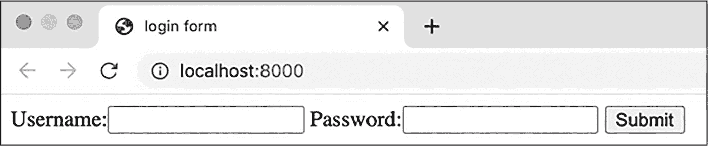
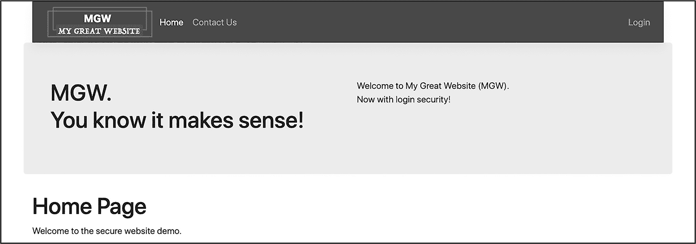
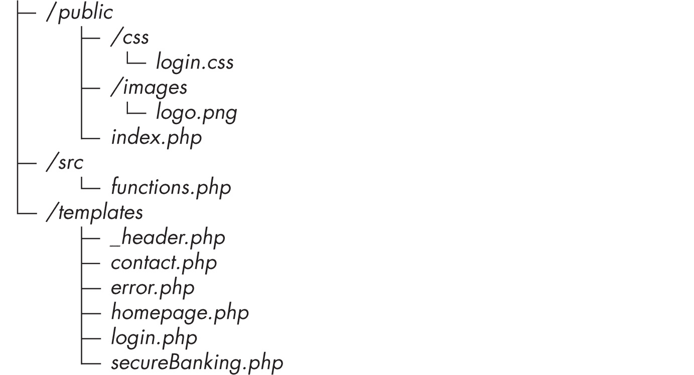
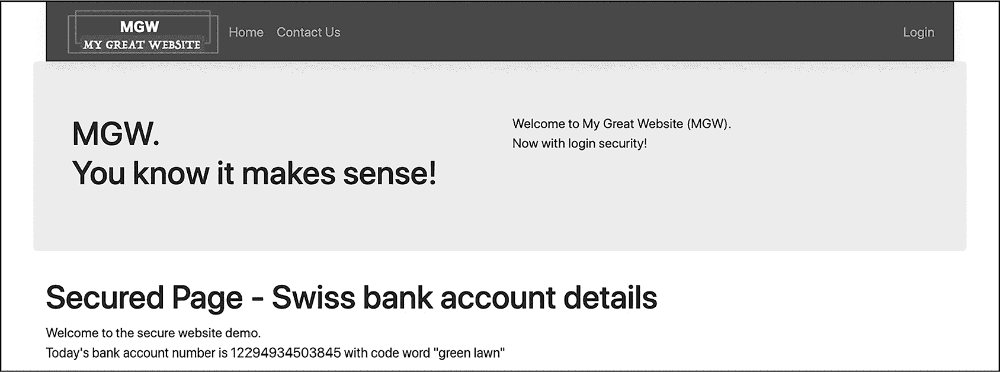
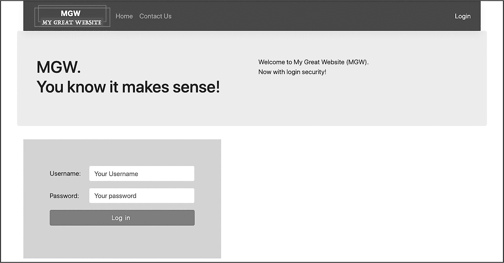
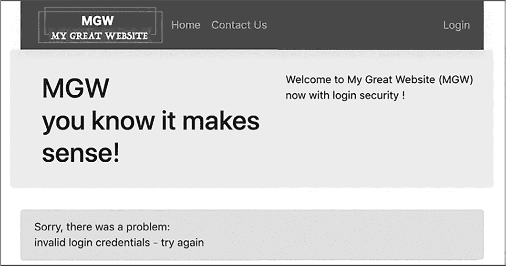

## 第十六章：16 认证与授权


许多网站采取安全措施来保护私密内容或敏感数据。在本章中，我们将使用 PHP 会话来开发一个应用程序，采用其中一种安全措施——登录表单。在这个过程中，你将学习如何实现两个相关的安全概念：认证和授权。

*认证*确定使用计算机系统的人的身份——也就是，*谁*是用户？我们的应用程序将利用用户名和密码登录的认证方法来识别用户。与此同时，*授权*确定用户是否被允许访问计算机系统的特定部分（*用户被允许做什么*）。我们的应用程序将使用存储在 PHP 会话中的数据，并结合访问控制逻辑，来授权用户可以访问的网页应用程序的某些部分。

### 一个简单的登录表单

从本质上来说，登录页面是一个 HTML 表单，通常包含一个用于唯一用户标识符（如用户名或电子邮件地址）的文本字段，一个密码文本字段，以及一个提交按钮。就这样！常规文本字段和密码文本字段的区别在于，后者浏览器会将每个输入的字符显示为像星号（*）这样的占位符符号，以便实际的密码不会显示在屏幕上，让窥探者看到。图 16-1 展示了一个简单的登录表单。



图 16-1：一个简单的登录表单

这个表单包含了我们之前描述的三个元素：用户名字段、密码字段和提交按钮。清单 16-1 展示了显示这个登录表单所需的 HTML 代码。

```
<!doctype html>
<html>
<head>
<title>login form</title>
</head>
<body>

    <form action="/?action=login" ❶ method="post">
        <label>Username:<input name="username"></label>
        <label>Password:<input name="password" ❷ type="password"><label>
        <input type="submit">
    </form>

</body>
</html>
```

清单 16-1：基本登录表单的代码

这段代码创建了我们的用户名和密码标签输入框，以及一个提交按钮。我们为密码字段指定了 type="password"，这样输入的内容将以占位符字符的形式显示❷。登录表单通过 POST HTTP 方法提交❶。几乎所有的登录表单都使用 POST 方法，这样用户的密码就不会像使用 GET 方法时那样，作为查询字符串变量显示在浏览器地址栏中。使用 POST 的第二个原因是我们不希望登录数据被缓存。相反，我们希望服务器在登录表单提交时处理每个用户名和密码。

*缓存*是指当计算机系统或应用程序（如网页浏览器）将文件的副本本地存储（存储在桌面、笔记本或手机中），以便下次请求时能更快地检索它们。虽然这种方式对网站标志和不会改变的页面内容（如首页）效果很好，但通常不希望网页浏览器存储已提交表单的本地副本，例如登录表单。

网络浏览器应用程序通常会缓存通过 GET HTTP 方法请求的网页，但它们不会缓存在 POST HTTP 请求之后接收的网页内容。请记住，GET 请求只是检索信息（不会更改服务器上的内容），因此缓存此类请求是没有问题的。然而，POST 请求通常涉及表单数据提交（包括登录表单），此类请求可能会导致服务器内容的变化，如删除或更改数据库内容，因此缓存并重复这些 POST 请求可能是危险的，甚至可能不安全。

### 创建一个带有登录表单的网站

现在你知道如何创建一个基本的登录表单了，让我们来构建一个包含功能性、专业外观的登录页面的网站。我们将通过要求用户登录才能查看网站的某一页面，从而保护该页面。该网站将包括以下页面：

+   一个主页

+   一个联系我们页面

+   一个登录表单

+   错误信息页面

+   一个安全银行页面（包含瑞士银行账户详细信息！）

虽然我们很高兴让任何用户（无论是否登录）都能访问主页、联系我们页面和登录页面，但我们需要通过登录页面上的表单验证用户身份，以便只允许授权用户查看受保护的瑞士银行账户页面。

网站的所有页面将具有相同的结构和外观。例如，图 16-2 展示了主页。



图 16-2：我们网站的主页

每个页面都会有一个采用 Bootstrap 样式的页头，页头包括自定义徽标和导航栏。在适当的情况下，当前页面相关的导航链接将用白色高亮显示，而其他链接则为灰色。导航栏下方是一个横幅，左侧是网站标语，右侧是问候语。每个页面的底部包含该页面的内容（在此例中，是一个标题和告知用户这是主页的文本）。

为了构建这个网站，我们将首先创建各个页面。然后，我们将创建登录表单和登录处理逻辑，并添加代码，确保只有成功登录的用户才能查看受保护的瑞士银行账户页面。

#### 定义文件结构

为项目创建一个文件夹。在文件夹内，结构如下：



#### 创建共享页面内容

现在我们将创建一个*_header.php*文件，定义所有页面模板共享的页头内容。使用共享的页头文件将使网站保持一致的外观，并避免不必要的代码重复。此外，如果我们想更改网站样式或导航栏内容，只需要更改这个单独的页头文件的内容。

将*_header.php*文件添加到*templates*子文件夹中。该文件将包含不少行代码（主要是 Bootstrap 类和 HTML <div>元素），所以我们将分三部分来看它，从列表示例 16-2 开始。

```
<?php
$homeLink =  $homeLink ?? '';
$contactLink =  $contactLink ?? '';
$loginLink =  $loginLink ?? '';

$pageTitle =  $pageTitle ?? '';
?>
<!doctype HTML>
<html>
<head>
    <meta name="viewport" content="width=device-width">
    <title>Secure site: <?= $pageTitle ?></title> ❶
    <link rel="stylesheet" href="/css/login.css">
    <link rel="stylesheet"
          href="https://cdn.jsdelivr.net/npm/bootstrap@5.3.3/dist/css/bootstrap.min.css"
    >
</head>
<body class="container">
```

列表示例 16-2：_header.php 的第一部分

我们从一个 PHP 代码块开始，声明了三个变量来帮助控制页面顶部导航链接的显示：$homeLink、$contactLink 和$loginLink，分别对应首页、联系我们和登录页面链接。稍后，当我们编写这些页面的单独模板时，我们将添加代码，将该页面的变量设置为'active'字符串，这与一个 CSS 样式选择器对应，该选择器将使页面的导航链接以白色显示。在这个*_header*模板中，我们使用空合并操作符??（见第四章）来设置所有三个变量为空字符串，如果它们尚未有值的话。空字符串会使导航链接显示为灰色。

因此，当我们加载登录页面时，例如，$loginLink 将被设置为'active'，而登录导航链接将以白色显示，而$homeLink 和$contactLink 由于没有预设值，将被设置为空字符串，它们的链接将显示为灰色。这种使用 PHP 变量填充 CSS 样式值的方法是高亮显示导航栏中当前页面并将其他页面链接灰化的有效方式。

> 注

*如果你不熟悉空合并操作符（null-coalescing operator），你可以始终使用 isset()函数编写一个 if 语句，以提供相同的功能，例如* if (!isset($homeLink)) $homeLink = ''*。

接下来，我们使用另一个空合并操作符将$pageTitle 变量设置为空字符串，以防它尚未设置。然后我们使用$pageTitle 的值来形成页面的 HTML <title>元素❶。通过这种方式，包含我们*_header.php*文件的每个函数都可以为 PHP 变量$pageTitle 定义一个值，从而为每个页面提供一个有意义的标题，浏览器大多数情况下会使用这个标题作为书签文本。然后我们读取了 Bootstrap 样式表以及我们自己的 CSS 样式表文件*/public/css/login.css*。这个样式表文件稍后我们会创建，包含一些登录页面的样式。该清单中的最后一行开始了一个<body>元素，使用了 Bootstrap 的容器类样式。

我们的头部模板代码继续在清单 16-3 中。

```
❶ <header class="navbar navbar-expand navbar-dark d-flex mb-3 bg-primary">

    

    <ul class="navbar-nav p-2">
        <li class="nav-item">
          ❷ <a class="nav-link <?= $homeLink ?>" href="/">
                Home
            </a>
        </li>

        <li class="nav-item">
          ❸ <a class="nav-link <?= $contactLink ?>" href="/?action=contact">
                Contact Us
            </a>
         </li>
    </ul>

    <ul class="navbar-nav ms-auto p-2">
        <li class="nav-item">
          ❹ <a class="nav-link <?= $loginLink ?>" href="/?action=login">
                Login
            </a>
        </li>
    </ul>
</header>
```

清单 16-3：_header.php 的第二部分

我们声明了一个头部元素，该元素将包含 logo 图片和导航链接❶。在其中，我们声明了主页的导航链接，使用 class="nav-link <?= $homeLink ?>"来为这个链接设置样式❷。这里是我们继续实现清单 16-2 开始时设置的导航链接样式机制的地方。该链接将被样式化为 Bootstrap 的导航链接（nav-link），但是如果我们将$homeLink 变量设置为'active'，它也会被高亮显示（以白色显示）。否则，如果$homeLink 为空字符串，导航栏链接将不会作为活动页面链接以白色高亮显示。我们以类似的方式为“联系我们”❸和“登录”❹链接设置样式，只有当它们相应的链接变量（$contactLink 或$loginLink）包含字符串'active'时，才会将它们设置为活动状态。

列表 16-4 是我们公共 page-header 代码的最后部分。

```
<div class="row bg-light p-5">
    <div class="col">
        <h1>MGW. <br>You know it makes sense!</h1>
    </div>

    <div class="col">
        <p>
            Welcome to My Great Website (MGW).
            <br>
            Now with login security!
 </p>
    </div>
</div>
```

列表 16-4：_header.php 的第三部分

在这里，我们声明一个带有标准内容的 Bootstrap 行 <div>，该内容适用于网站上的每一页。此 <div> 被设置为浅灰色背景并添加了一些内边距。它包含两个样式化为列的 <div> 元素，一个显示网站的标语，另一个显示带有网站登录功能的问候语。

#### 设计页面模板

接下来，我们将创建首页、联系我们和安全银行页面的模板。由于大部分工作由公共的 page-header 模板完成，这三个页面的模板脚本非常简单。列表 16-5 显示了我们的首页模板脚本。将此脚本保存在 *templates* 子文件夹中，命名为 *homepage.php*。

```
<?php
$pageTitle = 'Home Page';
$homeLink = 'active';
require_once '_header.php';
?>

❶ <h1><?= $pageTitle ?></h1>

<p>
Welcome to the secure website demo.
</p>
</body>
</html>
```

列表 16-5：homepage.php 模板

我们首先为 $pageTitle 变量赋值，避免列表 16-2 中的空合并运算符。除此之外，由于我们希望导航栏中的首页链接被高亮显示，因此将字符串 'active' 赋值给 $homeLink 变量。然后我们读取并执行 *_header.php* 模板。接下来，我们在 HTML 页面的正文部分以一级标题显示 $pageTitle 的值 ❶。接着是页面内容的段落，最后是关闭 <body> 和 <html> 元素的标签。

列表 16-6 展示了 *templates/contact.php* 中的联系我们页面代码。

```
<?php
❶ $pageTitle = 'Contact Us';
❷ $contactLink = 'active';
require_once '_header.php';
?>

<h1><?= $pageTitle ?></h1>

❸ <p>
    Contact us as follows:
</p>

<dl>
    <dt>Email</dt>
    <dd>enquiries@securitydemo.com</dd>

    <dt>Phone</dt>
    <dd>+123 22-333-4444</dd>

    <dt>Address</dt>
    <dd>1 Main Street,<br>Newtown,<br>Ireland</dd>
</dl>

</body>
</html>
```

列表 16-6：contact.php 模板

联系我们模板与首页模板类似，唯一的不同是 $pageTitle 的值 ❶、用于高亮显示联系我们导航链接的变量 ❷ 以及页面内容段落和定义列表的详细信息 ❸。

接下来，我们将创建安全银行页面，见图 16-3。稍后我们将添加授权逻辑，以确保只有已登录的用户才能查看此页面。



图 16-3：我们网站的安全银行页面

列表 16-7 创建了安全银行页面。将此代码保存在 *templates/secureBanking.php* 中。

```
<?php
❶ $pageTitle = 'Secure Banking - Swiss bank account details';
require_once '_header.php';
?>

<h1><?= $pageTitle ?></h1>

❷ <p>
    Welcome to the secure website demo.
    <br>
    Today's bank account number is 12294934503845 with code word "green lawn"
</p>
</body>
</html>
```

列表 16-7：secureBanking.php 模板

再次说明，这个模板与首页和联系我们页面的模板类似。唯一的不同是 $pageTitle 的值 ❶ 和页面内容段落 ❷。由于我们当前在导航栏中没有链接到此页面，因此无需设置变量为 'active'。

#### 开发登录表单

现在，我们将为我们的网站创建一个登录表单（见图 16-4）。虽然我们将使用一些额外的 HTML 和 CSS 使表单看起来更加专业，但其核心与我们在本章开始时创建的基本登录表单相同，包含用户名字段、密码字段和登录提交按钮。



图 16-4：我们网站的登录页面

列表 16-8 展示了用于创建登录表单的代码，保存在 *templates/login.php* 中。

```
<?php
$pageTitle = 'Login';
$loginLink = 'active';
require_once '_header.php';
?>

<div class="formLogin">

  ❶ <form action="/?action=login" method="post">
      ❷ <div class="form-group row m-3">
            <label for="username" class="col-form-label col-sm-3">
                Username:
            </label>
            <div class="col">
                <input name="username" id="username"
                    placeholder="Your username" class="form-control"
                >
            </div>
        </div>

      ❸ <div class="form-group row m-3">
            <label for="password" class="col-form-label col-sm-3">
                Password:
            </label>
            <div class="col">
                <input name="password" id="password" type="password"
                    placeholder="Your password" class="form-control"
                >
            </div>
        </div>

      ❹ <div class="form-group">
            <input type="submit" class="btn btn-primary w-100"
                value="Log in" class="form-control"
            >
        </div>
    </form>

</div>
</body>
</html>
```

列表 16-8：login.php 模板

脚本的启动方式与其他模板类似：我们为 $pageTitle 赋值，将 $loginLink 设置为字符串 'active'，以便登录链接在导航栏中被高亮显示，并读取和执行 *_header.php* 模板。然后我们定义一个 <div> 元素来封装登录表单，并使用一个自定义的 formLogin CSS 类（我们稍后会创建）。登录表单本身声明为使用 POST 方法并带有 /?action=login 动作 ❶。

我们将使用相同的动作值（login）来请求显示登录表单并处理提交的表单数据，通过 HTTP 方法来区分请求：GET 请求显示表单，POST 请求处理提交的登录表单数据。我们将在本章后面实现这个逻辑。

我们的表单结构由三个 Bootstrap 行组成，分别用于用户名 ❷、密码 ❸ 和登录 ❹ 输入，每个输入都由一个 <div> 元素表示。用户名和密码行包含 <label> 和 <input> 元素。请注意，输入框有一个 placeholder 属性，其值将显示为淡灰色的填充文本，并且我们为密码输入框指定了 type="password" 属性，以便在输入密码时进行隐藏。

为了完成登录页面，我们将创建 CSS 样式表 *public/css/login.css*，如 清单 16-9 所示。它为登录表单添加了自定义样式。回想一下，通用的 *_header.php* 模板会为每个页面读取这个样式表。

```
.formLogin {
    background-color: lightgray;
    padding: 4rem;
    max-width: 30rem;
}
```

清单 16-9：login.css 中的 CSS 代码

样式表定义了 清单 16-8 中引用的 formLogin 类。此样式将表单背景设置为浅灰色，添加填充，并设置最大宽度为 30 个字符。

#### 编写前端控制器

如同往常一样，我们将创建一个单一的前端控制器，所有对我们 Web 应用的请求都必须通过它。创建 *public/index.php*，其中包含 清单 16-10 中的代码。

```
<?php
require_once __DIR__ . '/../src/functions.php';

$action = filter_input(INPUT_GET, 'action');

switch ($action) {
  ❶ case 'contact':
        contact();
        break;

  ❷ case 'login':
        $isSubmitted = ($_SERVER['REQUEST_METHOD'] === 'POST');
        if ($isSubmitted) {
            // POST method so process submitted login data
            processLogin();
        } else {
            // GET method to display login form
            loginForm();
        }
        break;

  ❸ default:
        home();
}
```

清单 16-10：index.php 前端控制器脚本

该脚本遵循通常的模式，读取函数声明文件，提取动作查询字符串参数的值（如果请求中存在），并将其传递给一个 `switch` 语句来决定执行的操作。如果值是 contact ❶，我们调用 contact()，它会读取模板并显示联系我们页面。如果值是 'login' ❷，我们测试 HTTP 请求是否使用了 POST 方法，表明用户已通过登录表单提交了用户名和密码，如果是这样，则调用 processLogin() 函数。否则，我们调用 loginForm() 函数显示登录页面。最后，默认情况 ❸ 调用 home() 函数显示首页。

#### 实现逻辑函数

接下来，我们需要创建实现网站逻辑的函数，这些函数保存在*src/functions.php*中。五个函数非常简单：它们只是显示网站的四个主要页面（主页、联系我们、登录页面、银行安全页面），以及一个错误信息页面。我们将首先查看这些函数，如清单 16-11 所示。

```
<?php
function home(): void
{
    require_once __DIR__ . '/../templates/homepage.php';
}

function contact(): void
{
    require_once __DIR__ . '/../templates/contact.php';
}

function loginForm(): void
{
    require_once __DIR__ . '/../templates/login.php';
}

function secureBanking(): void
{
    require_once __DIR__ . '/../templates/secureBanking.php';
}

function showError($message): void
{
    require_once __DIR__ . '/../templates/error.php';
}
```

清单 16-11：functions.php 中的显示函数

前四个函数都执行相同的任务：它们使用 require_once 语句读取并显示其中一个模板脚本。接下来，showError()函数期望一个$message 字符串作为参数。它也使用 require_once 语句读取并显示其中一个模板脚本。在这种情况下，由于$message 是一个参数，它在读取并执行*error.php*模板时具有作用域，因此模板可以显示$message 字符串中的内容。（我们将很快创建*error.php*模板。）

*functions.php*脚本的第二部分，如清单 16-12 所示，声明了三个用于处理从登录表单提交的用户名和密码的函数。

```
❶ function getUsers(): array
{
    $users = [];
    $users['matt'] = 'smith';
    $users['james'] = 'bond';
    $users['jane'] = 'doe';

    return $users;
}

❷ function processLogin(): void
{
    $username = filter_input(INPUT_POST, 'username');
    $password = filter_input(INPUT_POST, 'password');

  ❸ if (validLoginCredentials($username, $password)) {
        secureBanking();
    } else {
        showError('invalid login credentials - try again');
    }
}

❹ function validLoginCredentials($username, $password): bool
{
    $users = getUsers();

    if (isset($users[$username])) {
        $storedPassword = $users[$username];
        if ($password == $storedPassword) {
            return true;
        }
    }

    // If get here, no matching username/password
  ❺ return false;
}
```

清单 16-12：functions.php 的第二部分

在这部分脚本中，我们声明了 getUsers()函数❶，它返回一个名为$users 的数组，数组的键是用户名，值是密码。这是可以通过我们网站的登录系统进行身份验证的用户列表（通过提供有效的用户名及其对应的密码）。虽然这里使用的是数组，但在实际网站中，通常会从数据库中获取用户名和密码数据，并且密码会出于安全原因进行哈希处理。我们将在第三十章中学习如何实现这一点。

接下来，我们定义了 processLogin()函数❷。在这个函数中，我们使用 filter_input()尝试获取通过登录表单提交的用户名和密码，并将这些值存储在$username 和$password 变量中。然后，我们将这些值传递给 validLoginCredentials()函数❸。如果该函数返回 true，我们就成功验证了用户，因为他们能够提供匹配的用户名-密码组合。因此，我们通过调用 secureBanking()函数来显示银行安全页面。如果 validLoginCredentials()返回 false，则调用 showError()函数显示错误页面，并传递一个错误信息，说明登录凭据无效。

请注意，错误信息并没有告诉用户问题出在用户名还是密码。这遵循了*最小信息披露*的常见安全做法。我们不应该告诉用户（或黑客机器人或任何尝试登录的程序）他们是否已经找到了有效的用户名。有了这个信息，攻击者可以反复使用有效的用户名，搭配不同的密码尝试访问系统，这比每次都需要猜测用户名*和*密码要容易。

最终的函数是 validLoginCredentials() ❹，它期望两个参数，$username 和$password。这是我们执行至关重要的任务——验证尝试登录的用户的地方。我们首先从 getUsers()获取以用户名为索引的密码数组，并将其存储在$users 变量中。

然后我们测试是否可以在$users 中找到键$username 对应的元素。如果没有找到这样的键（isset($users[$username])为 false），我们将退出 if 语句，函数返回 false ❺，表示提交的用户名和密码无效。然而，如果$users 中可以找到$username，相关的值将存储在$storedPassword 变量中。然后我们测试从登录表单接收到的密码($password)是否与从数组中获取的密码($storedPassword)匹配。如果两个密码匹配，我们就拥有有效的凭证，因此返回 true。否则，脚本将退出 if 语句并返回 false。

#### 创建错误页面模板

现在我们将创建错误页面的模板（图 16-5）。



图 16-5：无效登录凭证后的错误信息页面

这个模板保存在*templates/error.php*中，类似于我们之前创建的其他页面模板，如清单 16-13 所示。

```
<?php
$pageTitle = 'Error page';
require_once '_header.php';
?>

<div class="alert alert-danger" role="alert">
    Sorry, there was a problem:
    <p>
      ❶ <?= $message ?>
    </p>
</div>
</body>
</html>
```

清单 16-13：error.php 模板

我们将$pageTitle 的值设置为“错误页面”，然后读取并执行公共的*header.php*模板。在一个粉色的 Bootstrap 警告样式的<div>中，我们输出$message 变量中的字符串 ❶。所有包含此错误页面模板的脚本，应该首先将一个字符串赋值给此变量（正如我们在清单 16-12 中所做的那样，当我们调用 showError()并传递字符串“无效的登录凭证 - 请再试一次”时）。 ### 使用会话存储登录数据

虽然我们的网站目前允许用户通过登录表单进行身份验证并访问安全银行页面，但该网站并不记住成功的登录凭证。一旦用户离开银行详细信息页面，他们将需要返回登录表单并重新提交凭证才能再次查看。为了使网站更加用户友好，我们可以使用 PHP 会话来记住成功的登录。

如果所有登录用户应该具有相同级别的访问权限，我们可以在成功登录后简单地将用户名存储到会话中，正如我们将在本节中所做的那样。如果不同的用户有不同的角色，并且每个角色对应不同的授权级别（例如销售、主管、经理、管理员），我们可以将用户名和相应的角色都存储在会话中。然后我们会编写逻辑，使已登录的用户只能访问适合其角色的页面。我们将在本章末的练习 3 中讨论第二种方法。

让我们添加一些代码，将登录数据保存到会话中。我们还将为导航栏添加一个指向安全银行页面的链接，但只有在用户登录后才能访问该页面。否则，我们将显示身份验证错误信息。

#### 更新前端控制器

我们首先需要编辑我们的*index.php*前端控制器，以处理导航到安全银行详情页面。由于我们现在计划使用会话来记住登录数据，因此我们还需要在前端控制器脚本的开始部分（重新）启动 PHP 会话。列表 16-14 显示了更新后的脚本，并突出显示了新增的代码。

```
<?php
session_start();
require_once __DIR__ . '/../src/functions.php';

$action = filter_input(INPUT_GET, 'action');

switch ($action) {
 case 'contact':
 contact();
 break;

 case 'login':
 $isSubmitted = ($_SERVER['REQUEST_METHOD'] === 'POST');
 if ($isSubmitted) {
 // POST method so process submitted login data
 processLogin();
 } else {
 // GET method to display login form
 loginForm();
 }
 break;

 ❶ case 'secured':
        if (isLoggedIn()) {
            secureBanking();
        } else {
            showError('invalid login credentials - try again');
        }
        break;

 default:
 home();
}
```

列表 16-14：更新后的 index.php 前端控制器脚本

在脚本开始时，我们（重新）启动会话。然后我们为当 $action 的值为 'secured' 时，向 switch 语句添加一个新的 case❶。在这种情况下，我们调用 isLoggedIn() 函数，稍后我们将编写该函数。如果返回 true，则调用 secureBanking() 显示安全银行页面。否则，我们显示错误页面，并提示“无效的登录凭据 - 请重试”。

#### 编写登录功能

现在我们需要编写一个新的 isLoggedIn() 函数，用来检查 $_SESSION 数组中是否存储了用户名，从而表明用户已成功登录。我们还需要更新我们的 processLogin() 函数，以便在处理有效的登录凭据时，将用户名存储到 $_SESSION 中。首先，按照 列表 16-15 中所示，将 isLoggedIn() 添加到 *src/functions.php* 的末尾。

```
function isLoggedIn(): bool
{
    if (isset($_SESSION['username'])) {
        return true;
    } else {
        return false;
    }
}
```

列表 16-15：isLoggedIn() 函数

该函数使用简单的 if...else 语句，基于是否可以在 $_SESSION 数组中找到 'username' 字符串键的值。如果找到了，我们返回 true；如果没有找到，我们返回 false。请注意，我们不需要测试会话中 'username' 键下存储的实际值。我们只测试该键是否存储了*任何*值。我们并不关心已登录用户的用户名是什么，只要他们已经成功登录。

现在，按照 列表 16-16 中所示，编辑 *src/functions.php* 中的 processLogin() 函数，以便在成功登录后将用户名存储到会话中。

```
function processLogin(): void
{
 $username = filter_input(INPUT_POST, 'username');
 $password = filter_input(INPUT_POST, 'password');

 if (validLoginCredentials($username, $password)) {
        $_SESSION['username'] = $username;
 secureBanking();
 } else {
 showError('invalid login credentials - try again');
 }
}
```

列表 16-16：更新 processLogin() 函数

在函数条件逻辑的 if 分支中，我们将提交的用户名存储在 $_SESSION 数组的 'username' 键下。这样，isLoggedIn() 的测试将在成功登录后通过。

#### 更新头部模板

现在让我们编辑公共的 *templates/_header.php* 文件，添加一个指向安全银行页面的导航栏链接，并包含其相关的 CSS 样式变量。我们将使用 if 语句，使得此链接仅在用户登录时才会出现。我们需要将这个条件导航项添加到主页和联系我们页面的导航栏项之后，如 列表 16-17 所示。

```
<?php
$homeLink =  $homeLink ?? '';
$contactLink =  $contactLink ?? '';
$loginLink =  $loginLink ?? '';
❶ $securedLink =  $securedLink ?? '';

$pageTitle =  $pageTitle ?? '';
?>

--snip--

<ul class="navbar-nav">
 <li class="nav-item">
 <a class="nav-link <?= $homeLink ?>" href="/">
 Home
 </a>
 </li>

 <li class="nav-item">
 <a class="nav-link <?= $contactLink ?>" href="/?action=contact">
 Contact Us
 </a>
 </li>

❷ <?php if (isLoggedIn()): ?>
    <li class="nav-item">
      ❸ <a class="nav-link <?= $securedLink ?>" href="/?action=secured">
            Secure banking
        </a>
    </li>
<?php endif; ?>
</ul>
--snip--
```

列表 16-17：在 _header.php 中为安全银行页面添加条件导航链接

我们使用空合并操作符，如果$securedLink 变量尚无值，则将其设置为空字符串 ❶。然后，我们添加一个 if 语句，使用 isLoggedIn()函数测试用户是否已登录 ❷。如果是，那么 if 语句中的导航链接将会显示。该链接会将 action=secured 变量添加到查询字符串中 ❸。还需要注意，$securedLink 变量的值是该链接的 CSS 类的一部分。与其他导航链接一样，如果该变量包含字符串'active'，则该链接会被高亮显示。

#### 更新银行页面模板

既然我们已经为安全银行页面添加了一个导航链接，我们需要更新*templates/secureBanking.php*脚本，将$securedLink 变量设置为'active'。这将在查看页面时高亮显示页面的导航链接。按 Listing 16-18 所示更新模板。

```
<?php
$pageTitle = 'Secure Banking- Swiss bank account details';
$securedLink = 'active';
require_once '_header.php';
?>
--snip--
```

Listing 16-18：更新 secureBanking.php 模板

在这里，我们需要做的唯一更改是，在读取共享的头部模板之前，添加设置$securedLink 变量的语句。

### 提供登出功能

如果我们提供了用户登录并记住其登录信息的方式，我们也应该提供登出的方式。登出用户意味着将$_SESSION 数组设置为空，这样它就不再包含字符串键'username'的元素。为了实现这一点，我们需要添加一个新函数，更新前端控制器，并在导航栏中创建一个登出链接。

#### 添加登出功能

首先，让我们在*src/functions.php*中编写一个 logout()函数，清除会话中的用户数据。将 Listing 16-19 中的代码添加到文件末尾。

```
function logout(): void
{
    $_SESSION = [];
    home();
}
```

Listing 16-19：logout()函数

我们将$_SESSION 设置为空数组，清除会话中的存储用户名。然后，我们调用 home()函数，在用户登出后显示主页。

#### 更新前端控制器

现在，我们需要在*index.php*前端控制器的 switch 语句中添加一个新的登出案例。按 Listing 16-20 所示更新文件。

```
--snip--

 case 'secured':
 if (isLoggedIn()) {
 secureBanking();
 } else {
 showError('invalid login credentials - try again');
 }
 break;

  ❶ case 'logout':
        logout();
        break;

 default:
 home();
}
```

Listing 16-20：index.php 中的登出案例

我们添加了一个案例，当$action 变量的值为'logout'时调用 logout()函数 ❶。

#### 显示登出链接

最后，我们需要根据用户是否已登录来有条件地决定是提供登录链接还是登出链接。因此，我们需要在公共的*templates/_header.php*文件中添加一个 if 语句，如 Listing 16-21 所示。

```
--snip--
 <?php if (isLoggedIn()):?>
 <li class="nav-item">
 <a class="nav-link <?= $securedLink ?>" href="/?action=secured">
 Secure Banking
 </a>
 </li>
 <?php endif; ?>

 </ul>

 <ul class="navbar-nav ms-auto p-2">
 <li class="nav-item">

      ❶ <?php if (isLoggedIn()): ?>
            <a class="nav-link" href="/?action=logout">
                Logout
            </a>
      ❷ <?php else: ?>
 <a class="nav-link <?= $loginLink ?>" href="/?action=login">
 Login
 </a>
        <?php endif; ?>

 </li>
 </ul>
</header>
```

Listing 16-21：_header.php 中条件性登录/登出导航栏链接

在声明具有 nav-item 类的 HTML 列表项内部，我们使用 if...else 语句来测试 isLoggedIn()函数返回的值。如果用户已登录 ❶，我们显示/?action=logout 链接。否则，如果用户未登录 ❷，我们像以前一样显示/?action=login 链接。

图 16-6 显示了用户成功登录并访问安全银行详细信息页面时的导航栏。


图 16-6：显示“安全银行”和“注销”链接的导航栏

请注意，注销链接出现在右侧，而不是登录链接。此外，中间的“安全银行”链接被突出显示，因为这是用户当前查看的页面。

### 显示已登录的用户名

我们将为网站添加的最后一个功能是，在导航栏中显示已登录用户的用户名，位于注销链接的上方。为此，我们需要一个函数来返回存储在 $_SESSION 数组中的用户名。我们还需要更新共享的头部模板并向我们的 CSS 样式表中添加额外的代码。

#### 检索用户名

要查找当前用户的用户名，请将 列表 16-22 中的函数添加到 *src/functions.php* 文件的末尾。

```
function usernameFromSession(): string
{
    if (isset($_SESSION['username']))
        return $_SESSION['username'];
    else
        return '';
}
```

列表 16-22：usernameFromSession() 函数

在这里，我们定义了 usernameFromSession() 函数。使用 isset()，我们检查 $_SESSION 数组中是否可以在 'username' 键下找到值。如果存在值，它将被返回。否则，函数将返回一个空字符串。

#### 更新导航栏

列表 16-23 显示了我们需要在公共 *templates/_header.php* 文件中添加什么，以显示当前用户名以及注销链接。

```
--snip--
<?php if (isLoggedIn()):?>
    <span class="username">
        You are logged in as:
        <strong><?= usernameFromSession() ?></strong>
    </span>
 <a class="nav-link" href="/?action=logout">
 Logout
 </a>
<?php else: ?>
--snip--
```

列表 16-23：在 _header.php 中显示用户名

我们声明一个 HTML <span> 元素，并使用 CSS username 类（我们接下来将创建）进行样式设置。它显示文本“您已登录为：”，后跟从 usernameFromSession() 函数返回的值。由于我们应该仅在用户登录时显示此文本，因此始终会有存储的用户名，因此 usernameFromSession() 永远不应返回空字符串。

#### 更新 CSS

最后，我们需要为用户名类添加一个 CSS 规则到 *public/css/login.css*，如 列表 16-24 中所示。此样式规则将用户名文本的颜色设置为黄色（与导航栏的深色背景形成对比）。username {

```
 color: yellow;
}
```

列表 16-24：login.css 中的用户名 CSS 类

图 16-7 显示了由于此 CSS 声明，用户名是如何在导航栏中显示的。


图 16-7：导航栏中的用户名和注销链接

显示用户名的文本出现在注销链接的上方。在此示例中，我使用用户名 matt 登录。这个用户名已成功存储在 $_SESSION 数组中，并随后被检索并显示出来。

### 总结

在本章中，我们创建了一个前端控制器驱动的网站，使用登录表单方法来验证用户身份。虽然这是一个只有几页的小网站，但其基本架构和安全性方法与现实世界中安全网站的运作方式类似。我们编写了函数来检查提交的用户名和密码是否与存储的用户名和密码对匹配。

我们将成功认证的用户的详细信息存储在 PHP 会话中，以便记住用户何时已登录。然后，我们编写了程序逻辑，例如 isLoggedIn() 函数，使我们的网站能够决定用户是否有权查看银行详情。我们使用相同的逻辑来决定是否在导航栏中显示登录或注销链接。

### 练习

1.   为本章的网站添加第二个受保护的页面，显示一个数学问题的解答（答案 = -2!）。在导航栏中，添加一个链接到该受保护页面的链接，只有在用户成功登录时才会显示。

提示：你需要在 *index.php* 前端控制器中添加一个新的情况，并在 *functions.php* 中添加一个新的函数来显示页面。

2.   为系统添加两个额外的授权用户，一个用户名为 fred，密码为 flintstone，另一个用户名为 teddy，密码为 cuddly。

3.   通过为网站添加两个用户认证角色：'USER' 和 'BANKER'，尝试为网站添加另一层安全保护。任何已登录的用户都可以查看数学解题页面，但只有具有 'BANKER' 角色的用户才能查看银行详情页面。为系统添加两个更多的授权银行用户凭据，一个用户名为 banker1，密码为 rich，另一个用户名为 banker2，密码为 veryrich。

提示：尝试以下方法：

a.   就像你有 getUsers() 函数一样，添加一个 getBankers() 函数。

b.   将 validLoginCredentials() 函数重命名为 validUSERLoginCredentials()。

c.   编写该函数的第二个版本，命名为 validBANKERLoginCredentials()。

d.   更改 processLogin() 函数中的逻辑，执行以下操作：如果一个有效用户登录，存储其用户名到会话中并显示主页。如果一个有效银行用户登录，存储其用户名到会话中，将其角色存储到会话中 ($_SESSION['role'] = 'BANKER')，并显示主页。

e.   添加一个新的 getRoleFromSession() 函数，用于返回会话中找到的角色。如果 $_SESSION['role'] 中有值，则返回该字符串；否则，返回一个空字符串。

f.   更改 *index.php* 前端控制器中的逻辑如下：对于数学解题页面，检查用户是否已登录；对于银行页面，检查已登录用户的角色是否为 'BANKER'。你可以写类似 `getRoleFromSession() == 'BANKER'` 的代码。
