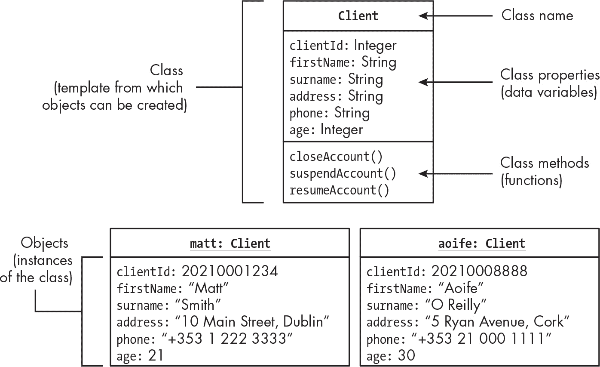
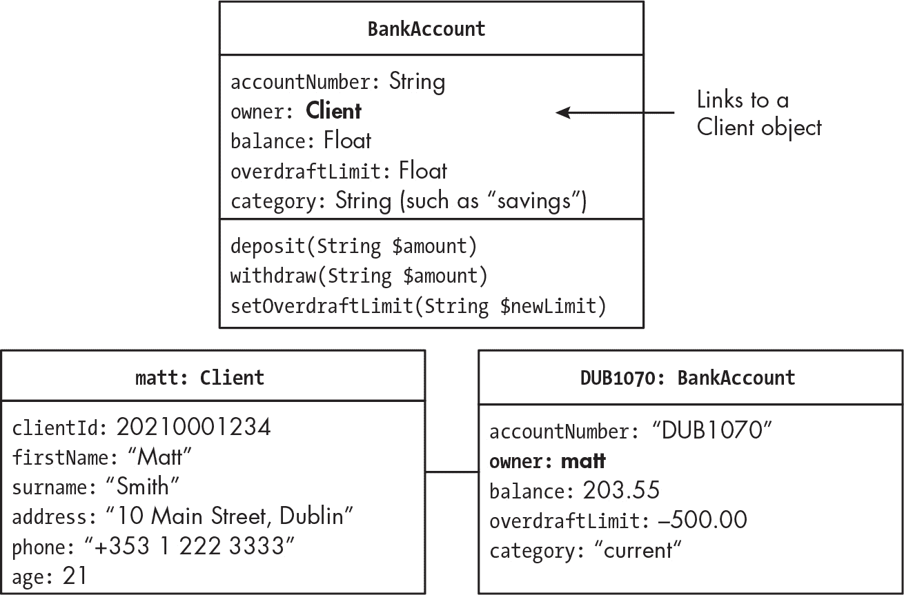
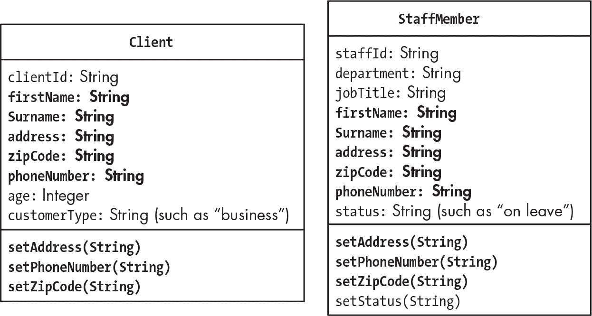
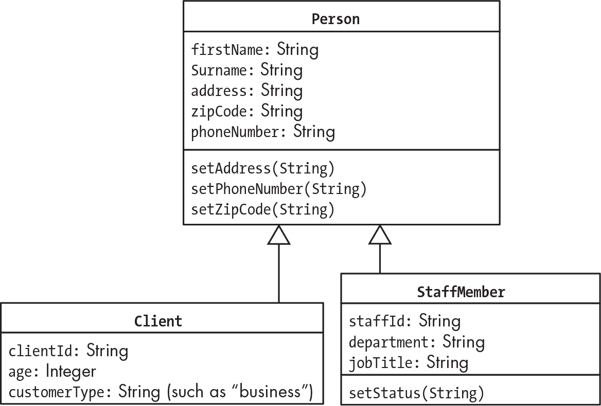

## 第十七章：17 面向对象编程简介


到目前为止，我们一直在使用 PHP 编写*过程式*代码，这是按顺序执行的一系列指令。现在，我们将把注意力转向另一种使用 PHP 的方式：面向对象编程（OOP）。本章将概述一些重要的 OOP 概念。接下来的几章将更深入地介绍如何在 PHP 项目中应用 OOP。

面向对象的编程风格围绕着*对象*展开，对象是现实世界事物的计算机表示，以及*类*，即定义了每个特定类别的对象应具备的所有能力和特征的通用模型。在面向对象的计算机系统中，对象之间相互发送消息，解释这些消息，并决定响应时要执行的指令，通常会生成一个返回给发送者的值。

OOP 的力量在于它的抽象能力：程序员可以将大量精力集中在规划一个与应用程序要解决的现实任务或问题相关的类系统上，而不是总是需要考虑代码本身。例如，一个在线银行系统可能需要像 Client、BankAccount 和 Transaction 这样的类，从这些类创建的对象将表示特定的客户、银行账户和交易实例。修改这些对象的消息和操作可能包括像 withdrawCash($sum)、setNewOverdraft($limit) 或 updateClientAddress($address) 这样的函数。类似地，一个在线电脑游戏可能需要像 Player、Level 和 InventoryItem 这样的类，操作和消息可能包括 purchaseInventoryItem($itemID) 和 setPlayerName($name)。程序员可以在编写一行代码之前就识别出所有这些需求，并规划出必要的类关系网。得益于这种规划和组织，编写代码的过程变得更加容易。

最终，程序员必须声明每个类，这确实需要编写代码。程序员将声明数据变量和函数，以执行诸如进行数值计算、操作字符串和数组等典型的编程任务。然而，OOP 的美妙之处在于，一旦你创建了一个类，它的结构本质上是“隐藏在幕后”的。剩下的编程过程可以集中在利用对象的消息和函数上，这些消息和函数与现实世界的概念和任务密切相关。

### 类和对象

面向对象程序由声明类的 PHP 文件组成。类可以被视为一个蓝图或模板，基于这个蓝图可以创建对象。就像汽车的蓝图只是纸上的一张图纸一样，声明类的 PHP 文件本身并不做任何事情。然而，正如你可以要求工厂根据汽车蓝图制造一辆或多辆实际汽车一样，你可以要求 PHP 引擎使用类声明来创建基于该类的对象。

有时候人们把对象称为类的 *实例*，因为每个对象是类定义的通用特征和行为的一个具体体现。你可以将*对象*和*实例*视为同义词：它是计算机内存中的一个对象，从类模板创建，具有一组数据值，并能够响应消息和执行函数。图 17-1 说明了类与从该类创建的对象之间的关系。



图 17-1：Client 类和两个 Client 对象，matt 和 aoife

图中的类 Client 代表银行的客户。你需要了解类的三个重要方面：它的名称、它的数据变量和它的函数。在这个例子中，我们的 Client 对象将包含客户的 ID 号、姓名和联系方式等数据变量。当变量作为类的一部分声明时，它们被称为 *属性*。同样，我们的 Client 对象有几个函数：你可以关闭、暂停或恢复客户账户。当函数作为类的一部分声明时，它们被称为 *方法*。类的各个部分统称为它的 *成员*；类的成员包括所有属性（变量）、方法（函数）和常量。

图 17-1 底部还展示了从 Client 类创建的两个对象（或实例），分别命名为 matt 和 aoife。每个对象都有自己的一组属性（例如，matt 对象的姓氏是 Smith，地址是都柏林主街 10 号），并且这两个对象都可以访问 Client 类中定义的方法。在 PHP 编程中，你可以拥有一个 $matt 变量，作为对同名 Client 对象的引用，你可以通过编写 $matt->closeAccount() 发送消息来关闭 Matt 的账户。当 $matt 对象收到这个消息时，它将执行其 closeAccount() 方法。

> 警告

*当你编写面向对象的 PHP 代码时，确保不要将* -> *对象运算符（用于对象和消息）与* => *运算符混淆，后者用于数组中的键/值关系。* ### 创建对象之间的关系

面向对象编程（OOP）的一个强大特性是，你可以通过将一个对象的属性链接到另一个对象，建立对象之间的关系。在某些情况下，你可能会将同一类的对象关联起来。例如，如果你有一个 Person 类，你可能会将一个 Person 对象链接到另一个 Person 对象，以展示一个人是另一个人的父母。其他时候，你可能会将不同类的对象关联起来，比如建立一个 Client 对象是一个 BankAccount 对象的所有者，如图 17-2 所示。



图 17-2：BankAccount 类声明每个 BankAccount 对象都与一个 Client 对象相连接。

图的顶部显示了 BankAccount 类。与我们之前讨论的 Client 类一样，它包含了该类对象可能拥有的数据属性和方法：每个 BankAccount 对象都有一个账户号码、一个所有者、一个余额、一个透支限额和一个类别，并且拥有存款、取款以及设置透支限额的方法。

owner 属性特别重要：它的值必须是指向 Client 对象的引用。因此，owner 属性在 BankAccount 和 Client 类的对象之间创建了一个联系。例如，如你在图的底部看到的，DUB1070，一个 BankAccount 对象，链接到 matt，一个 Client 对象。这个机制的妙处在于，对于我们正在处理的任何 BankAccount 对象，我们可以通过 owner 属性的链接找到其相关的 Client 对象，从而得知拥有该银行账户的人的姓名、地址以及其他细节。### 封装与信息隐藏

一个类将对象的数据和可以影响这些数据的方法组织在一起，将它们聚集在同一地方。这一原则被称为*封装*，它是面向对象编程的核心。封装有助于保持项目的组织性；回到图 17-1 中的例子，可以看出，处理客户数据的方法声明在同一个文件中，该文件还声明了应存储的客户数据属性。

然而，如果一个对象的所有数据都可以被计算机系统中任何可以访问该对象的部分直接更改，就会产生风险。例如，我们不希望 Client 对象的年龄被设置为 0 或负数！事实上，银行可能有政策要求客户的最低年龄为 16 岁。为了避免这种未经授权的更改并确保数据有效，面向对象的语言（包括 PHP）提供了控制访问对象数据的方式。

面向对象编程（OOP）中的一个特性是管理对象数据和方法的访问权限，这被称为*信息隐藏*。在 PHP 中，你可以使用 public、private 和 protected 关键字来声明不同级别的访问权限，以控制类对象的属性和方法的访问权限。继续我们之前的例子，我们可能通过将 Client 对象的年龄属性设为 private 来防止直接访问。然后，我们可能声明一个 public 的 setAge()方法，只有在满足某些验证要求（如年龄为 16 岁或更大且为整数）时，才会更新年龄。我们将在接下来的几章中详细讨论如何使用面向对象的 PHP 特性。

### 超类、继承与重写

你可以将几个类之间共有的属性和方法分配给一个*超类*，这是一个通用类，其他类（称为*子类*）可以从中*继承*特性。例如，银行的员工和客户将共享许多共同的数据属性，如姓名、地址和电话号码。图 17-3 显示了 Client 和 StaffMember 类的共同属性和方法，已用粗体标出。一些属性和方法是每个类特有的，例如 Client 对象的 clientId 和 StaffMember 对象的 staffId。



图 17-3：Client 和 StaffMember 类有许多重复的成员——效率极低！

图 17-4 说明了我们如何将共同的属性和方法概括成一个名为 Person 的新超类，Client 和 StaffMember 类都从中继承。只有那些特定子类独有的属性和方法才会直接在子类中定义。在 PHP 中，我们可以通过简单地写`class Client extends Person`来表示一个类从另一个类继承。



图 17-4：通用的 Person 超类消除了重复。

超类和继承帮助你避免在多个类中重复代码。例如，你不希望在多个地方编写验证电话号码和地址等操作的代码；如果某些内容发生变化（例如 2014 年引入了爱尔兰的邮政编码——Eircodes！），你将不得不更新多个类，可能会导致地址和电话号码在系统的不同部分被不同对待。得益于超类和继承，代码只需要更新一次。

通常，你会希望子类继承其父类的所有方法，但这并不总是适用。有时，一个类可能需要具有与其父类不同的逻辑。例如，你可能有一个客户的子类，它的成本或税费计算方式不同，或者你可能有一些产品需要显示特殊的免责声明。在这种情况下，子类可以*重写*继承的方法；也就是说，你可以在子类中直接创建一个方法，这个方法将优先于父类中同名的方法。在 PHP 中，重写方法非常简单：如果子类声明实现了一个与父类继承的方法匹配的方法，那么将使用子类的方法。

### 面向对象系统的控制流

每种类型的编程语言都有一个*控制流*，它指示计算机系统启动后如何运行，并决定接下来要做什么。正如你在前几章中看到的，面向过程的 PHP Web 应用程序的控制流通常由*index.php* PHP 脚本中的前端控制器驱动。当 Web 服务器接收到 HTTP 请求时，*index.php*中的语句按顺序执行。然而，在面向对象的应用程序中，许多 PHP 文件用于声明对象类，控制流可能看起来更加晦涩。那些类的对象到底什么时候会被创建，并开始相互发送消息呢？

面向对象的 PHP Web 应用程序仍然有一个*index.php*脚本，尽管它看起来与我们之前看到的有所不同。它通常会创建主要的应用程序对象，该对象作为前端控制器，并指示该对象处理接收到的请求并作出适当的响应。示例 17-1 展示了我们将在接下来的章节中编写的*index.php*脚本的类型。

```
<?php
require_once __DIR__ . 'path to class declaration file';

$app = new WebApplication();

$app->run();
```

示例 17-1：面向对象的 index.php 前端控制器的典型代码

首先，我们读取我们将使用的类（或类）的声明。你将在第十八章中学到一种简单的方法来实现这一点，然后在第二十章中，你将学习如何使用 Composer PHP 命令行工具以更通用的方式加载类声明。

接下来，我们创建一个新的 WebApplication 类对象，并将对这个新对象的引用存储在$app 变量中。WebApplication 类将包含处理来自 Web 客户端的 HTTP 请求的逻辑，这些逻辑本来是我们以前会直接放入*index.php*脚本中的内容。

然后，我们向 WebApplication 对象发送消息 run()，这将导致在 WebApplication 类中为特定的$app 对象执行声明的 run()方法。run()方法的代码将包括诸如从 URL 编码的变量中提取动作并检查会话中的登录状态等操作。代码还可能调用其他方法或根据需要创建新对象，以完成网页客户端请求的操作。

总结来说，对于像这样的网页应用程序，控制流是在*index.php*文件中顺序进行的；该文件中的语句会按顺序执行。因此，会创建一个对象，并向该对象发送消息以开始处理 HTTP 请求。从此之后，网页应用程序的所有其他逻辑将位于 WebApplication 类的方法中，或者是 WebApplication 类方法执行过程中会创建对象的其他类中。

### 示例类声明

现在让我们来看一个 PHP 类声明的示例。在 Listing 17-2 中，我们声明了一个名为 Player 的类，可能是在线游戏系统的一部分。暂时不要太担心代码的细节；我们将在后面的章节中更加详细地介绍如何编写 PHP 类。现在，这个示例只是提供了即将到来的代码类型的一瞥。

```
<?php
class Player
{
    private string $name;
  ❶ private int $highScore = 0;

  ❷ public function setName(string $name)
    {
        $this->name = $name;
    }

  ❸ public function setHighScore(int $newScore)
    {
        if ($newScore > $this->highScore) {
            $this->highScore = $newScore;
        }
    }
}
```

Listing 17-2：声明 Player 类的 PHP 代码

我们使用 class 关键字声明一个名为 Player 的类，并为该类提供两个属性：name 和 highScore。就像在非面向对象 PHP 中声明变量一样，你可以为属性指定默认值。我们在这里这么做，设置 highScore 的默认值为 0❶，这样每个新的 Player 对象都会创建时拥有初始的高分 0。接着，我们声明 setName()方法❷，当调用时，它会接收一个字符串参数并将其存储在 Player 对象的 name 属性中。然后我们声明 setHighScore()方法❸。它接收一个参数($newScore)，如果这个新分数高于该对象存储的高分，那么新的分数将存储在对象的 highScore 属性中。

当一个方法被执行时，它将在特定的由类创建的对象的属性上进行操作。在方法的定义中，特殊的 PHP 关键字$this 表示将调用该方法的对象。因此，在 setName()方法的定义中，我们使用$this 关键字（如$this->name = $name;）作为占位符，代表正在设置名称的 Player 对象。例如，我可能有一个对象$player1，其名称设置为"Matt"，另一个对象$player2，其名称设置为"Aoife"。在这两种情况下，setName()方法代码❷都会被调用来设置名称，并且在这两种情况下，$this 都会代表正在设置名称的 Player 对象：首先是$player1，然后是$player2。

我们的类声明包括了信息隐藏的示例，因为 name 和 highScore 属性被声明为私有的。它们不能被 Player 类外部的代码修改。然而，我们也将 setName() 和 setHighScore() 方法声明为公共的。这些*setter* 方法允许与 Player 对象进行外部交互，但仅通过方法中的内部验证检查（例如，在覆盖 highScore 属性之前检查新得分是否超过了之前的最高得分）；这些检查确保对象的数据永远不会被设置为无效或不一致的值。

请注意，列表 17-2 中的每个方法都很简短和简单。一旦应用程序的架构创建完成，编写代码以声明类的每个属性和方法通常是相对直接的。尽管一个完整的 Web 应用程序的方法会比此示例中的方法更长，但面向对象编程（OOP）的一个好处是，它通常允许程序员一次专注于编写类的一个方法，每个方法都有一个明确的职责。

使用面向对象编程，你不需要考虑方法可能的所有使用方式；你只需要确保你编写的行为是该类的正确行为。例如，不论一个 Player 对象的名字是在游戏开始时第一次设置，还是在游戏中间因为玩家改变了主意而更新，或者因为玩家变成了青蛙而自动改变，都不重要。关键是编写 setName() 方法，确保它要求有效的参数，并正确地修改 Player 对象的属性。因此，代码将易于编写和维护。

### 总结

在本章中，我们探讨了一些重要的面向对象编程概念。你看到了类是创建对象的模板，并且类允许你将对象所需的所有变量和函数存储在一个地方，这个概念叫做*封装*。你还看到对象可以通过它们的属性相互关联，不同子类的对象可以继承父类的共享属性和方法。最后，你初步了解了一些实现这些概念的 PHP 代码。

在接下来的几章中，你将学习如何声明类、创建对象、以及向对象发送消息以调用其方法并更改其数据。然后，你将开始将所有这些知识结合起来，创建结构良好的面向对象的 Web 应用程序，基于我们在前几章中探讨的特性。在你继续阅读时，别忘了你已经知道了编写面向对象 PHP 程序的许多核心要求，因为 OOP 的核心就是声明变量并在函数中编写 PHP 语句；只不过变量（属性）和函数（方法）被组织（封装）在类中，并且方法会响应发送给类的对象的消息进行调用。

### 练习

1.   选择一个计算机系统，例如一个在线商店、桌面或笔记本上的应用程序，或是手机或平板上的应用。思考该系统可能使用的某些对象类。选择一个对象类，并写出它可能存储的数据项以及它可能需要用来处理这些数据的一些方法。

2.   再次思考练习 1 中的类，尝试识别一个你希望限制访问的数据属性，以便它只能通过一个方法进行更改，该方法会记录更改日志。

3.   考虑一个图书馆的计算机系统。想想计算机系统可能使用的两类共享多个数据属性和方法的对象（例如，图书馆提供借阅的不同类型物品）。现在将这些公共属性和方法概括为一个适当命名的超类，并绘制类似于图 17-4 的类图，显示从超类继承的属性和方法以及每个子类特有的属性和方法。
