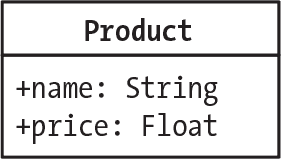
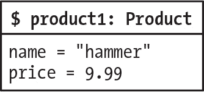
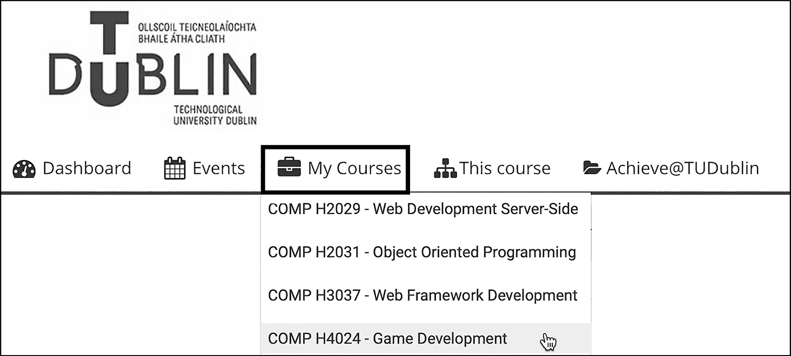

## 第十八章：18 声明类并创建对象


在本章中，您将学习如何通过使用类声明文件来定义类的结构，并练习创建该类的各个对象。您将看到，具有公共属性的类允许您直接更改对象的数据，而具有私有属性的类则意味着您只能通过其方法来更改对象的数据，其中一些方法可以执行验证。您还将学习 PHP 的“魔术”方法，这些方法使编写面向对象的代码变得更容易。

### 声明类

*类声明*定义了一个类：它列出了该类的每个对象将拥有的属性（变量），以及可以作用于这些属性的方法（函数）。类声明还建立了该类与其他类的任何关系（例如继承，您将在第十九章中学习到）。

像函数声明一样，类声明存储在项目的*src*目录中的 PHP 文件中。对于本书中的所有项目，每个类将声明在其自己的文件中；如果一个项目有五个类，那么它将有五个类声明文件，依此类推。

> 注意

*在本书中，我们不会探讨*匿名类*这一高级主题，它是少数几个可以在一个文件中声明多个类的情况之一。您可以在[`www.php.net/manual/en/language.oop5.anonymous.php`](https://www.php.net/manual/en/language.oop5.anonymous.php)了解更多信息。*

根据面向对象编程（OOP）中的约定，类名和类声明文件名始终以大写字母开头。如果名称包含多个单词，每个单词应以大写字母开头，且单词之间不应有空格。这被称为*大驼峰命名法*，有时也称为*Pascal 命名法*。有效的类名示例包括 Product、NetworkSupplier、DesktopComputer、ReferenceBook 和 InventoryItem。

在本章中，我们将使用一个名为 Product 的类，它可以表示通过电子商务网站销售的各种商品。现在让我们来声明它。创建一个新目录用于新项目，并在其中创建一个*src*目录。在此*src*目录中，创建一个*Product.php*文件并输入列表 18-1 的内容。

```
<?php
class Product
{
    public string $name;
    public float $price;
}
```

列表 18-1：声明 Product 类的 Product.php 文件

我们从标准的 PHP 起始代码标签开始，因为我们使用 PHP 代码来声明类。接着我们使用 class 关键字来声明一个名为 Product 的新类。类名后面跟着大括号，我们在其中定义与该类对象相关的任何属性或方法。在这个例子中，我们为每个 Product 类的对象声明了两个属性：name，类型为字符串，以及 price，类型为浮点数。我们将两个属性声明为 public，这意味着程序的任何部分，只要能够访问 Product 对象，都可以读取和修改其属性值。我们将在本章后面探讨 public 属性的含义。

如果我们希望所有对象在某个属性上都有一个*默认值*，我们可以在类声明中为该属性赋值。例如，如果我们的系统为每个新的 Product 对象设置一个初始的 -1 价格，我们可以这样写：`public float $price = -1`。

图 18-1 显示了一个*统一建模语言（UML）*类图，直观地展示了我们刚刚编写的类。UML 是一种常用的工具，用于通过图表和文本表示类、对象及其交互。



图 18-1：Product 类

图表的第一行表示类名（Product），第二行列出了与该类相关的属性，并显示了每个属性预期的数据类型。每个属性名前的加号表示这些属性具有公共可见性。

### 创建对象

你使用 PHP 关键字 new 来创建类的对象。new 关键字后跟类的名称，然后是一对圆括号。在圆括号内，你可以传递初始化参数，正如我们在《使用构造方法初始化值》一节中讨论的那样，参见 第 346 页。创建对象的语句的一般形式是 `new ClassName()`。创建对象也叫做*实例化*，因为该对象是该类的*实例*。

通过写下新关键字和类名，你是在要求 PHP 创建一个指定类的新对象。当一个对象在计算机内存中使用 new 关键字创建时，PHP 引擎会自动返回对新对象的引用。在大多数情况下，你会希望将对该新创建对象的引用存储在一个变量中——例如，`$myObject = new ClassName()`。重要的是要理解，对于这样的语句，变量 `$myObject` 实际上并不包含对象本身，而是包含了*对*该对象的引用。多个变量，甚至没有变量，都有可能引用内存中的同一个对象。

一旦你引用了一个对象，使用*对象操作符*（->）来访问该对象的属性和方法。例如，你可以写 $myObject->description 来访问由 $myObject 引用的对象的 description 属性。同样，你可以通过写类似 $myObject->setDescription('small carpet') 的代码来调用对象的 setDescription() 方法。括号的有无很重要，因为它们告诉 PHP 引擎（以及阅读代码的人）一条语句是在访问属性（没有括号）还是在调用方法（有括号）。

考虑到这些，我们来创建一个对象。我们将编写一个 *index.php* 脚本，读取 *Product.php* 类声明文件，创建一个 Product 对象，并设置它的属性值。图 18-2 展示了我们的目标：一个 $product1 变量，存储了对一个 Product 对象的引用，该对象的属性值为 'hammer' 和 9.99。



图 18-2：$product1 变量引用了一个 Product 类的对象。

为了简化起见，我们将从创建一个 Product 对象并仅设置它的 name 属性开始。为了确保我们的代码正常工作，我们还将打印该对象的 name 属性值到项目的主页。在你的项目目录中，创建一个 *public* 文件夹，并在该文件夹中创建一个包含清单 18-2 中代码的 *index.php* 文件。

```
<?php
require_once __DIR__ . '/../src/Product.php';

$product1 = new Product();
$product1->name = 'hammer';

print 'product 1 name = ' . $product1->name;
```

清单 18-2：一个创建和操作 Product 对象的 index.php 脚本

我们在声明 Product 类时，使用 __DIR__ 魔术常量从 *index.php* 文件所在位置（位于 *public* 文件夹内）创建路径到 *Product.php* 文件所在位置（位于 *src* 文件夹内）。然后我们使用 new 关键字来创建一个 Product 类的新对象。由于该类在创建对象时不需要任何初始值或选项，我们在类名后面不传递任何参数。

如果你在创建新对象时没有传递任何参数，PHP（与大多数面向对象语言不同）允许你省略类名后面的括号。写 new Product() 和写 new Product 是等价的。然而，有几个很好的理由总是包含括号，因此你将在本书中看到这种风格。也许最重要的理由是，始终在 new 关键字后使用括号可以提醒我们，构造方法可能会在新对象创建时执行；我们将在“使用构造方法初始化值”章节中讨论这类方法，详见第 346 页。

新的 `Product()` 表达式创建了一个新对象，并返回一个对它的引用，我们将这个引用存储在 `$product1` 变量中。为了重申，`$product1` 并不包含对象本身，也不包含对象的副本。它仅仅包含一个指向计算机系统内存中创建的对象的*引用*。“对象变量作为引用”一节在 第 351 页 中，我们将用两个变量引用同一个对象来帮助说明这个概念。

接下来，我们将对象的名称属性值设置为字符串 'hammer'；我们之所以能这样做，是因为该属性被声明为 public。我们在 `$product1` 变量后使用对象操作符 `->` 来引用该对象的名称属性。

> 警告

*不要* 在 `->` *字符后写美元符号*：`$product->name` *是正确的，而* `$product->$name` *是错误的。如果你写后者，PHP 引擎不会产生警告或错误，但它会将代码解释为：有一个名为* `$name` *的变量，其值是你想访问的* `$product` *对象上的属性名。这与访问* `$product` *对象的* name *属性的值是完全不同的。如果你的代码行为异常，请检查是否有这个编程错误。*

最后，脚本通过打印一条消息来结束，消息中包含从 `$product` 对象的名称属性中检索到的值。如果你运行 web 服务器并访问项目的主页，你应该能看到这行文本显示出来：

```
product 1 name = hammer
```

`->` 操作符允许你通过名称操作对象的任何公共属性。让我们更新脚本，以设置并显示对象的价格以及名称。修改 *index.php* 文件，如 列表 18-3 所示。

```
<?php
require_once __DIR__ . '/../src/Product.php';

$product1 = new Product();
$product1->name = 'hammer';

print 'product 1 name = ' . $product1->name;

$product1->price = 9.99;
print ", and price = {$product1->price}";
```

列表 18-3：在 `index.php` 中设置并显示产品价格

我们将对象的价格属性设置为 9.99，格式与 列表 18-2 中设置名称属性时使用的格式相同。然后我们显示该属性的值。请注意，这次我们使用双引号字符串将消息和属性值组合在一起。这说明在双引号字符串中，指向对象公共属性的引用，例如 `$product1->price`，将被解析，结果值将被输出，就像简单变量一样。

再次访问主页时，你应该能看到产品名称和价格显示出来：

```
product 1 name = hammer, and price = 9.99
```

我们现在已经创建了一个 `Product` 类的对象，并且由于该类的属性是 public，我们可以直接设置和获取这些属性的值。然而，在实际开发中，大多数类会使用 private 而不是 public 属性。

### 具有公共访问器方法的私有属性

当属性声明为 private 时，它们不能被类声明外的代码访问。相反，它们可以通过公共的*访问器方法*来访问，这些方法允许检索（*getter 方法*）或更新（*setter 方法*）对象属性值。使用私有属性和公共访问器方法的机制可以减少无效属性值的风险；当必须通过 setter 方法修改属性时，可以在方法中实现验证逻辑（例如，防止负值或超出范围的值）。此外，相关属性或其他对象可能需要一起更新，比如一个银行账户的余额减少与另一个账户的余额增加相同的数值。通过 setter 方法和私有属性，可以轻松强制执行这些规则，以确保应用程序中的数据保持正确且内部一致。

类成员的默认可见性是 public，因此如果没有为属性提供访问修饰符，PHP 引擎会自动将其声明为具有 public 可见性。即使有默认行为，当你希望类成员具有 public 可见性时，最好在类声明中明确使用 public 访问修饰符。否则，使用 private 访问修饰符将成员声明为私有。

> 注意

除了*public*和*private*，还有第三种访问修饰符，*protected*，可以与继承一起使用。我们将在第十九章中探讨这个话题。

对于 PHP 和几乎所有的 OOP 语言，getter 或 setter 方法的名称通常以*get*或*set*开头，后跟该方法影响的属性名称，并且首字母大写。根据这一惯例，我们的 Product 类的 name 属性的 getter 方法应为 getName()，setter 方法应为 setName()。对于 price 属性，方法应为 getPrice()和 setPrice()。这个惯例的例外情况是当属性包含一个布尔值（true/false）时。在这种情况下，getter 方法通常命名为 isPropertyName，而不是 getPropertyName。例如，如果 Product 类有一个名为 dangerousItem 的属性，其值为 true 或 false，那么 getter 方法应命名为 isDangerousItem()。

getter 方法通常返回与它所配对的属性相同数据类型的值（尽管有时我们会为对象属性的不同表示形式编写多个 getter 方法，例如返回浮动属性的四舍五入整数和浮动值的方法）。setter 方法通常接收一个相同类型的参数，并将其值存储在属性中，可能在过程中进行验证检查。通常，setter 方法不会返回任何值，因此它们声明为返回 void。

让我们修改 Product 类的声明，将其 name 和 price 属性设为私有，并添加四个公共访问器方法，每个属性各两个。请按照列表 18-4 所示更新*src/Product.php*文件。

```
<?php
class Product
{
    private string $name;
    private float $price;

 ❶ public function getName(): string
    {
        return $this->name;
    }

  ❷ public function setName(string $name): void
    {
      ❸ $this->name = $name;
    }

    public function getPrice(): float
    {
        return $this->price;
    }

    public function setPrice(float $price): void
    {
        $this->price = $price;
    }
}
```

列表 18-4：修改 Product 类以使用 getter 和 setter 方法

首先，我们将两个属性的声明修改为私有。然后，我们声明 getName()，这是 name 属性的公共 getter 方法❶。类中的方法可以使用特殊的伪变量$`this`来引用调用对象；也就是说，$this 代表我们正在操作的对象的属性和方法。因此，我们的 getName()方法返回当前调用该方法的 Product 对象的 name 属性值。该方法的返回类型是字符串，因为 name 属性是一个字符串。

接下来，我们声明 setName()，这是 name 属性的公共 setter 方法❷。该方法通过$name 参数接收一个新的字符串 name 值，并将该值存储到当前对象的 name 属性中，再次使用$`this`来引用该对象。此 setter 方法没有返回值。price 的 getter 和 setter 方法遵循相同的模式。

请注意在 setName()方法体内，PHP 如何区分$name 参数和当前对象的 name 属性❸。前者以美元符号$开头，而后者附加在$`this->`后面，并且没有美元符号，表示它是当前对象的属性。换句话说，setName()方法中的$name 明确指的是传递给该方法的参数值，而通过 setName()方法接收到消息的对象的私有 name 属性则通过$`this->name`明确指代。同样的情况适用于 setPrice()方法中的 float $price 参数和调用该方法的对象的 price 属性。

当你在类声明文件中编写方法时，必须时刻记住，同样的方法可能会在零个、一个或成千上万个对象上执行，这取决于对象收到带有方法名称（及任何必要参数）的消息。尽管你可能在编写声明时只打算创建并使用类的一个实例（对象），但一个编写良好的类封装了该类的*任何*对象的数据（属性）和行为（方法）。当你在编程时考虑到通用使用时，通常可以在同一个项目的其他部分，甚至是完全不同的项目中使用该类，而无需或几乎无需更改类声明。编写良好的类声明有助于复用。

> 注意

*虽然你可以手动编写访问器方法，但许多代码编辑器，包括 PhpStorm，提供了自动化功能来为你生成简单的 getter 和 setter 方法。自动生成代码比手动输入更快，并且可以确保生成遵循 PHP 编程规范的无错误脚本。*

#### 获取和设置私有属性

由于任何 Product 对象的两个属性现在被声明为私有，我们无法直接访问它们，比如通过写 `$product1->name` 或 `$product1->price`。如果你运行现有的 *index.php* 脚本，你会遇到一个关于无法访问私有 name 属性的致命错误。相反，我们必须通过使用它们的公共访问器方法来读取和修改这些私有属性。列表 18-5 显示了如何更新 *index.php* 来使用这些新方法。

```
<?php
require_once __DIR__ . '/../src/Product.php';

$product1 = new Product();
$product1->setName('hammer');
$product1->setPrice(9.99);
print 'product 1 name = ' . $product1->getName();
print ", and price = {$product1->getPrice()}";
```

列表 18-5：在 index.php 中使用访问器方法

如同在 列表 18-3 中一样，我们创建了 $product1 对象，设置了它的属性，并打印出了这些属性。然而这次，我们完全依赖于访问器方法。我们使用 setter 方法来更新对象属性的值，比如 `$product1->setName('hammer')`。同样，我们使用 getter 方法来从对象中获取值，比如 `$product1->getName()`。得益于这些方法，$product1 对象中的数据被安全地封装，但仍然可以访问。

#### 筛选无效数据

保护对象数据属性的一个优点是，你可以向 setter 方法中添加验证逻辑，以防止无效值存储在属性中。例如，大多数企业可能不希望为产品设置负数价格（尽管某些东西可能是免费的赠品，因此我们会允许价格为 0）。因此，我们应该在 setPrice() 方法中添加一个 if 语句，只有当新值大于或等于 0 时才更新存储的价格。列表 18-6 显示了如何更新 *src/Product.php* 中的方法。

```
--snip--
public function setPrice(float $price): void
{
    if ($price >= 0) {
 $this->price = $price;
}
}
```

列表 18-6：向 Product 类的 setPrice() 方法添加验证逻辑

在我们的验证逻辑中，我们确认新传入的 $price 参数大于或等于 0，然后再设置对象的价格属性。为了确保验证检查有效，我们可以更新 *index.php* 脚本，尝试设置一个无效的负价格值。我们应该看到无效值不会被存储在对象中。列表 18-7 为 *index.php* 添加了额外的语句，用于验证逻辑的两次测试。

```
<?php
require_once __DIR__ . '/../src/Product.php';

$product1 = new Product();
$product1->setPrice(9.99);

print "(initial value) product 1 price = {$product1->getPrice()}\n";

$product1->setPrice(-0.5);
print '<br>(test 1) trying -0.5: ';
print "product 1 price = {$product1->getPrice()}\n";

$product1->setPrice(22);
print '<br>(test 2) trying 22: ';
print "product 1 price = {$product1->getPrice()}\n";
```

列表 18-7：在 index.php 中测试 setter 验证逻辑

如前所述，我们创建一个新的 Product 对象并将其价格设置为 9.99。然后我们尝试将价格设置为无效的负数值，再设置一个有效的正数值，这个值与初始值不同，并且每次都打印出产品价格。以下是该脚本在浏览器中的输出：

```
(initial value) product 1 price = 9.99
(test 1) trying -0.5: product 1 price = 9.99
(test 2) trying 22: product 1 price = 22
```

对于测试 1（负价格 -0.5），存储的价格保持不变，仍为 9.99。对于测试 2（非负值 22），存储的价格被更新。我们的验证逻辑已经起作用。在这个例子中，我们只是忽略了无效值，但通常最好以某种方式表明存在问题。一种选择是，当没有设置值时，setters 返回布尔值 false。另一种选择是抛出一个异常对象，我们将在第二十三章中讨论。

PHP 提供了多个*魔术方法*，用于重写对象的默认行为。例如，__construct()魔术方法重写了创建类的对象的默认方式，而 __toString()魔术方法重写了在打印语句和其他需要字符串的上下文中处理对象的方式。在本节中，我们将逐一探讨这些魔术方法。

尽管名称中有“魔术”二字，魔术方法与 PHP 的魔术常量无关。魔术方法是面向对象 PHP 的一个特性，它允许更改对象的默认行为。所有魔术方法的名称都以双下划线（__）开头；因此，当你为类声明一个魔术方法时，应以此前缀命名方法。你可以在*[`www.php.net/manual/en/language.oop5.magic.php`](https://www.php.net/manual/en/language.oop5.magic.php)*中找到所有 PHP 魔术方法的列表。

#### 使用构造方法初始化值

通常，我们希望在创建对象后立即设置该对象的一些（或所有）属性。如清单 18-5 所示，你可以通过首先创建对象，然后依次调用 setter 方法来设置每个属性的值。然而，立即在创建对象后初始化对象属性是一个非常常见的需求，因此 PHP 允许你通过编写一个名为*构造函数*的魔术方法，将这些操作合并为一步，并将其作为类声明的一部分。

每个类声明文件要么不声明构造方法（如本章前面所述），要么声明一个名为 __construct()的单一构造魔术方法。它被称为“魔术”是因为它重写了创建对象的默认方式：在不设置任何属性的情况下创建对象。__construct()方法接收一系列参数，并将它们作为新创建的对象属性的初始值。例如，在*index.php*文件中使用构造方法，只需在类名后的小括号内提供初始值作为参数：$myObject = new ClassName($value1, $value2)。得益于 new 关键字的使用，PHP 会自动将参数与构造方法关联，即使 __construct()没有显式调用。

> 注意

*PHP 作为面向对象的语言有些不同，构造函数方法的名称并不与类名相同。在其他大多数面向对象语言中，`Product()` 方法在 `Product` 类中将是构造函数方法，但在 PHP 中，方法名称与声明所在类名相同并没有什么特别之处。*

将属性作为构造函数方法的一部分来设置，可以在创建新对象时节省一些代码。例如，如果我们知道在创建 `Product` 对象时需要设置名称和价格属性，我们可以为 `Product` 类添加一个构造函数方法，该方法接受 `$name` 和 `$price` 参数，自动设置这些属性。这样，当我们在 *index.php* 中创建 `$product1` 对象时，就可以将以下三条语句替换为一条语句：

```
$product1 = new Product();
$product1->setName('hammer');
$product1->setPrice(9.99);
```

只需一条语句：

```
$product1 = new Product('hammer', 9.99);
```

更新 *Product.php* 如列表 18-8 所示，添加一个构造函数方法来设置名称和价格属性。

```
<?php
class Product
{
 private string $name;
 private float $price;

  public function __construct(string $name, float $price)
    {
        $this->setName($name);
        $this->setPrice($price);
    }

 public function getName()
--snip--
```

列表 18-8：为 Product 类添加构造函数方法

我们声明了一个新的 `__construct()` 方法。它通过要求两个参数（新 `Product` 对象的初始字符串 `name` 和 `float` 类型的 `price` 值）来替代默认的无参创建对象方式 `new Product()`。请注意，构造函数方法不指定任何返回类型。在 `__construct()` 方法定义中，我们调用了 `setName()` 和 `setPrice()` 方法，这些方法已经在 `Product` 类声明的其他地方定义过，并将 `$name` 和 `$price` 参数传递给它们。虽然这看起来并不比在 *index.php* 脚本中调用这些方法更简单，但随着你开始创建更多相同对象的实例，通过构造函数设置属性会变得更高效。这种方法还确保了，在对象构造时设置值与之后通过直接调用 setter 方法更改值时，所应用的验证完全相同。

> 注意

*许多集成开发环境（例如 PhpStorm）提供了交互式构造函数生成器，允许你将选定的属性作为参数添加，并通过生成的构造函数代码设置它们的值。*

列表 18-9 展示了如何简化 *index.php* 以利用新的构造函数方法。

```
<?php
require_once __DIR__ . '/../src/Product.php';

$product1 = new Product('hammer', 9.99);
print 'product 1 name = ' . $product1->getName();
print ", and price = {$product1->getPrice()}";
```

列表 18-9：简化的 *index.php* 脚本，使用构造函数方法

当我们创建 `$product1` 对象时，我们将所需的初始值（名称和价格属性）作为构造函数的参数传入。如前所述，这将把三行代码（创建对象并设置其两个属性）合并为一行。 #### 将对象转换为字符串

将对象的内容总结为字符串是很常见的做法，有时用于显示对象的详细信息，有时用于调试和记录目的。将对象转换为字符串的一个常见原因是生成 Web 界面上的对象列表，例如下拉菜单。图 18-3 显示了一个包含我教授的一些课程的下拉菜单示例。



图 18-3：作为字符串总结的课程列表

你可以想象，这些课程中的每一门都在 PHP 中由一个 Course 对象表示，拥有像 courseNumber 和 courseName 这样的属性。为了生成下拉菜单，PHP 会将每个 Course 对象转换为字符串，格式为 courseNumber - courseName，例如 COMP H2029 - Web Development Server-Side。然后，这些字符串可以传递到 HTML 代码中，用于显示菜单。

那么，如何将其转换为字符串呢？大多数面向对象的语言，包括 PHP，都提供了一种方法，在需要字符串的表达式中使用对象时返回一个字符串（例如，像 `print $course1` 这样的表达式，其中 $course1 是指向一个 Course 对象的引用）。在 PHP 中，这一功能来自另一个魔术方法，方法名前有两个下划线字符：__toString()。

你并不*必须*为每个类实现 __toString() 方法，但如果你知道自己需要对象的字符串摘要（例如，用于下拉 HTML 菜单），或者你想将对象的详细信息记录到报告中，那么 __toString() 方法是非常有用的。如果一个类没有 __toString() 方法，而你尝试在需要字符串的表达式中引用该类的对象，则会出现“无法转换为字符串”的致命错误。让我们通过将 *index.php* 脚本末尾的 print 语句替换为 print $product1 来看看这个问题。更新 *index.php* 以匹配 Listing 18-10。

```
<?php
require_once __DIR__ . '/../src/Product.php';

$product1 = new Product('hammer', 9.99);
print $product1;
```

Listing 18-10：尝试在 index.php 中通过 print 输出对象的详细信息

我们将表达式 $product1 传递给 print 语句。因为 print 语句期望的是字符串表达式，而 $product1 不是字符串，PHP 会尝试将其转换为字符串。由于 PHP 引擎无法在没有 __toString() 方法的情况下将对象引用转换为字符串，因此会发生致命错误。

现在让我们为 Product 类实现一个 __toString() 方法，既为了探索面向对象编程的这一常见特性，又为了让我们能够使用简化的 *index.php* 脚本，参考 Listing 18-10。Listing 18-11 显示了新添加的 __toString() 方法，该方法已被加入到 *src/Product.php* 文件中。

```
<?php
class Product
{
 private string $name;
 private float $price;

 public function __construct(string $name, float $price)
 {
 $this->setName($name);
 $this->setPrice($price);
 }

    public function __toString(): string
    {
      ❶ return '(Product) name = ' . $this->name
            . ', and price = ' . $this->price;
    }
 public function getName(): void
--snip--
```

Listing 18-11：为 Product 类添加 __toString() 方法

我们为类添加了一个新的 __toString()方法。这个方法包含一个简单的语句，用于构建并返回一个总结对象属性值的字符串。请注意，我们将字符串消息的一部分进行了泛化，改为从'(Product) '开头，而不是'product 1 '❶。由于这是类的方法，且可能会被多个对象使用，所以我们不应该在类的通用声明文件中硬编码引用特定对象的变量名称。

按照列表 18-10 中更新的方式运行*index.php*脚本，你应该看到 print $product1 语句正确执行，这要归功于新增的 __toString()方法。### 对象变量作为引用

如前所述，贯穿本章的$product1 变量是指向内存中一个 Product 对象的引用，而不是 Product 对象本身。这个区别的一个含义是，多个变量可以引用同一个内存中的对象。这种情况可能在很多场景下发生。例如，当你需要遍历一个对象集合并对每个对象进行操作时，就会出现这种情况。在这种情况下，一个临时的局部变量会引用当前正在处理的对象，而集合中也会持有对该对象的另一个引用。

为了查看对象变量如何只是内存位置的引用，请更新*index.php*，如列表 18-12 所示。在这段代码中，我们创建了$variable2，使其引用与$product1 相同的对象，并通过$variable2 修改了该对象的一个属性。如你所见，这一修改同样影响了$product1 引用的对象，证明了这两个变量引用的是同一个对象。

```
<?php
require_once __DIR__ . '/../src/Product.php';

$product1 = new Product('hammer', 5.00);
print $product1;
print '<br>';

❶ $variable2 = $product1;
print 'changing price via $variable2';
print '<br>';
$variable2->setPrice(20.00);
print $product1;
```

列表 18-12：更新 index.php，演示对象变量是如何作为引用的

我们将$variable2 设置为与$product1 引用同一个对象❶。然后我们调用 setPrice()方法，修改$variable2 所引用的对象的价格属性，将其设置为 20.00。接着我们第二次打印$product1。由于$product1 是一个对象引用，它的 __toString()方法将被调用。这会在浏览器中产生以下输出：

```
(Product) name = hammer, and price = 9.99
Changing price via $variable2
(Product) name = hammer, and price = 20
```

通过$variable2 修改价格时，$product1 引用的对象的价格被改为了 20。因此，这两个变量必须引用同一个对象。

### 处理缺失对象

有时代码的编写方式是，你期望一个变量引用某个对象，但并未找到该对象。在这种情况下，该变量会是 NULL，因此，在编写面向对象的代码时，通常需要包含 NULL 检查。

让我们考虑一个示例。假设你正在为一个博客编写代码。为了显示一篇特定的博客文章，代码期望从 HTTP 请求中获取一个有效的博客文章 ID，然后使用该 ID 从数据库中检索数据并构建一个 Blog 对象。如果请求中没有找到 ID，或者 ID 无效，或者 ID 与数据库中的任何项都不匹配，那么应用程序就无法创建 Blog 对象，因此代码会返回 NULL，而不是对象引用。

为了处理这种情况，其他期望与 Blog 对象一起工作的代码会首先测试 NULL，然后决定是处理无效的 ID（比如 0 或负数），还是处理成功检索到的 Blog 对象。清单 18-13 展示了一个示例方法，可能来自数据库驱动的博客网站，用来说明这一点。

```
<?php
--snip--

public function blogFromId (int $id): ?Blog
{
  ❶ if (is_numeric($id) && $id > 0) {
        return $this->blogRepository->find($id);
    }

    return NULL;
}

--snip--
```

清单 18-13：使用可空返回类型

这个 blogFromId() 方法接受一个 $id 值，并返回一个 Blog 对象的引用或 NULL，使用可空返回类型 ?Blog。（我们也可以将其写作联合返回类型 Blog|NULL。）该方法测试 $id 是否为数字且大于 0 ❶。如果是，它将有效的 $id 传递给 blogRepository 属性的 find() 方法，并返回该方法的值（无论是 NULL 还是数据库中为此 ID 查找到的 Blog 对象）。如果 $id 无效，则返回 NULL。

这个示例做了很多假设，但关键是，调用 blogFromId() 方法的结果所赋值的变量，要么是指向一个对象的引用，要么是 NULL。像这样的代码在面向对象编程（OOP）中非常常见（如你将在第六部分中看到的），这也是为什么你经常需要测试一个你期望是对象引用的变量是否为 NULL，以确定是否有对象被引用。这与处理非面向对象的 PHP 变量相比，其中 NULL 可能意味着，例如，变量尚未初始化，或 HTTP 表单提交中的 URL 编码变量没有接收到任何字符串值。

你可以为一个类编写各种自定义方法，除了标准的 getter、setter 和 __construct() 及 __toString() 魔术方法。记住，方法只是附加在对象类上的函数，因此*自定义方法*是实现与类的对象相关的逻辑和计算的函数。例如，我们的 Product 类可能会包含一个计算产品总价的方法，包括税费。税率将是一个浮动值，比如 0.5（即 50%）。这样的一个方法仍然可以作为 getter 使用，但与简单地返回存储的属性值不同，它会在每次调用时动态计算一个值。

为了查看它是如何工作的，我们将在 Product 类声明中添加一个 getPriceIncludingTax()方法。该方法将从相应的对象属性中获取税率和产品的税前价格，进行必要的计算，并返回包含税费的总价格。例如，对于一个税率为 0.1（10%）且价格为 5.00 的产品，该方法应返回 1.1 * 5.00 = 5.50。为了创建这个方法，我们还需要在类中添加一个私有的 taxRate 属性，以及用于设置和获取产品税率的访问器方法。

示例 18-14 展示了更新后的*Product.php*类声明文件。除了添加 taxRate 属性、它的访问器和自定义方法外，我们还修改了 __toString()方法，以显示税费计算的结果。

```
<?php
class Product
{
 private string $name;
 private float $price;
❶private float $taxRate;

 public function __construct(string $name, float $price)
 {
 $this->setName($name);
 $this->setPrice($price);
 }

 public function __toString(): string
 {
 return '(Product) name = ' . $this->name
 . ', and price = ' . $this->price
            . ', and price with Tax = ' . $this->getPriceIncludingTax();
    }

  ❷ public function getTaxRate(): float
    {
        return $this->taxRate;
    }

    public function setTaxRate(float $taxRate): void
    {
 $this->taxRate = $taxRate;
    }

  ❸ public function getPriceIncludingTax(): float
    {
        return (1 + $this->taxRate) * $this->price;
    }

 public function getName()
--snip--
```

示例 18-14：向 Product 类中添加 taxRate 属性及相关方法

我们声明了 taxRate 属性❶及其简单的 getter 和 setter 方法❷。然后，我们声明了 getPriceIncludingTax()方法❸。该方法返回含税后的价格。

如你所见，我们的 getPriceIncludingTax()自定义方法只是一个为我们的类执行有用计算的函数。在这种情况下，它本质上是一个额外的 getter 方法，提供了对类存储属性 price 的变化。实际上，在面向对象编程中，看到多个 getter 方法用于同一对象属性是非常常见的：返回产品税前和税后价格的方法，返回同一属性但精度不同的方法（例如，四舍五入到最接近的整数或包括最多两位小数），以及返回相同属性转换成不同货币或单位的方法（如美元与欧元、英尺与米）等。

在其他情况下，自定义方法可以充当*虚拟属性*：它们不仅提供现有属性的变体，还通过计算得到全新的信息。虚拟属性的一个例子可能是一个计算产品年龄的方法。如果产品有一个 dateReceived 属性，产品的年龄可以通过 getProductAge()方法动态计算。该方法将当前日期减去 dateReceived。在这种情况下，产品的年龄实际上并没有作为对象的属性存储，但由于有了 getProductAge()方法，信息就像属性一样可以被获取。

自定义方法突显了 OOP 的一些强大功能：编写代码的人使用 Product 对象的 public getProductAge()方法时，不需要担心该方法是如何实现的。唯一重要的是该方法能正常工作。如果方法的实现发生变化（例如将 dateReceived 属性的数据类型从存储的 MySQL datetime 值更改为 Linux 时间戳），但其行为保持正确且不变，那么这对系统中向 Product 对象发送消息并使用这些方法返回值的部分没有任何影响。

### 总结

本章介绍了如何声明类，如何将这些声明读取到*index.php*文件并用它们创建对象，以及如何调用对象的方法来设置和获取它们的属性值。你了解了如何通过将对象的数据属性声明为 private 来保护对象的属性数据，以及如何使用声明为 public 的 getter 和 setter 方法来管理对对象属性的访问并在相关情况下进行验证。我们还讨论了如何使用 PHP 的“魔术”方法执行一些常见的有用操作，例如通过构造方法创建新对象并初始化某些属性，以及通过声明 __toString()方法生成表示对象属性的字符串消息。

### 练习

1.   为 Cat 类编写 PHP 类声明，包含 public 属性 name、breed 和 age。然后编写一个*index.php*文件来读取类声明并创建一个 Cat 对象。将对新对象的引用存储在名为$cat1 的变量中，并按以下方式设置它的属性：

name = 'Mr. Fluffy'

breed = 'long-haired mix'

age = 2

最后，添加语句来打印$cat1 的每个属性的数据值。

2.   为 Pet 类编写 PHP 类声明，包含一个 private 的 name 属性，以及用于该 name 变量的 public get 和 set 访问器方法。然后编写一个*index.php*文件来读取类声明并创建一个由名为$pet1 的变量引用的 Pet 对象。使用 setter 方法将其 name 设置为'Fifi'，并添加语句打印该对象存储的 name。

3.   为你的 Pet 类添加一个构造方法，这样你就可以使用类似以下的语句来创建具有初始值 name 变量的新 Pet 对象：

```
$pet1 = new Pet('Mr. Fluffy');
```

更新你的*index.php*文件，使用此构造方法，而不是通过 setter 方法设置 name。

4.   对于以下属性和类型，编写它们对应的访问器（getter/setter）方法名称：

age // 整数

houseNumber // 整数

color // 字符串

length // 浮动值

heavy // 布尔值
