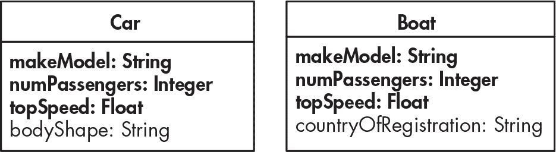
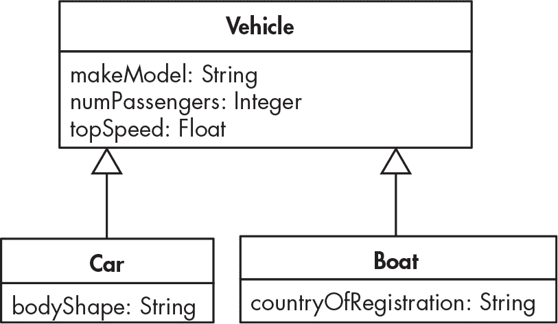
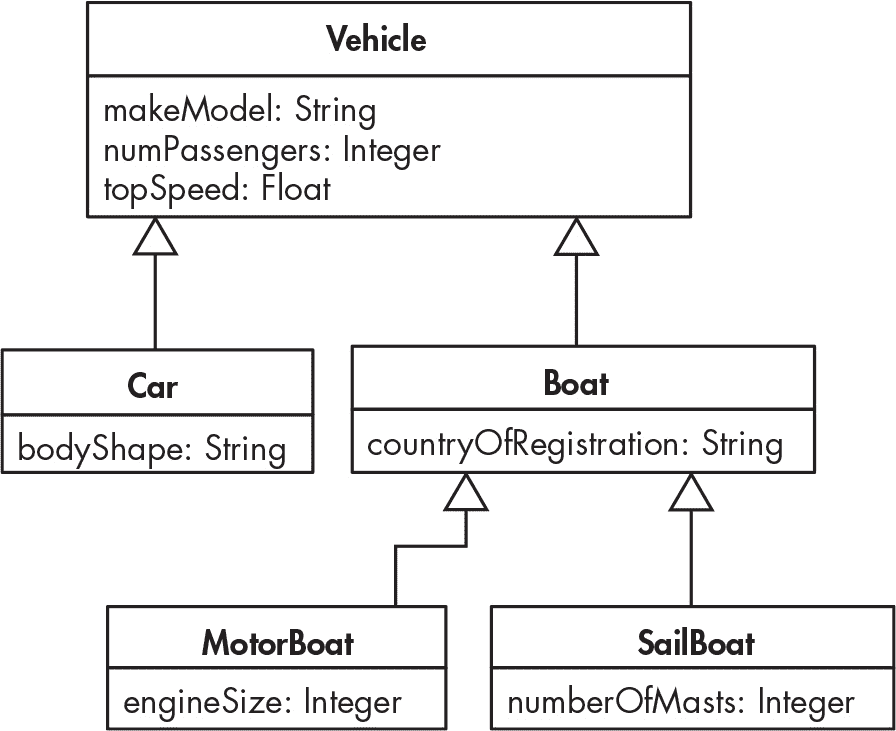
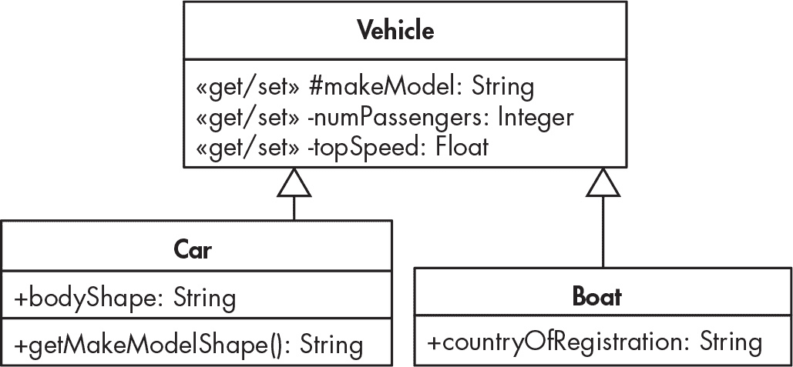
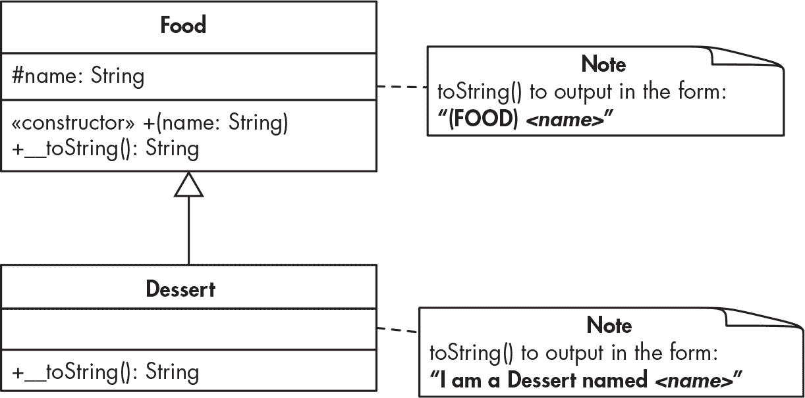
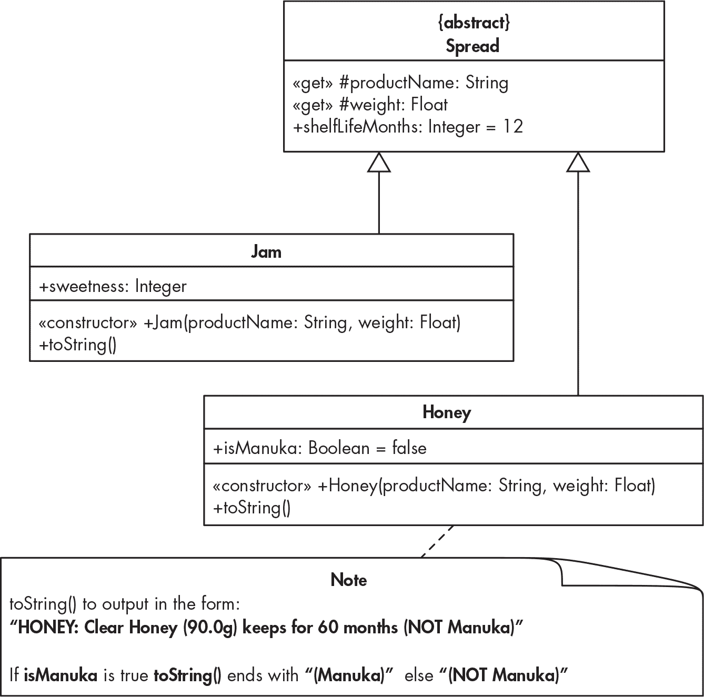
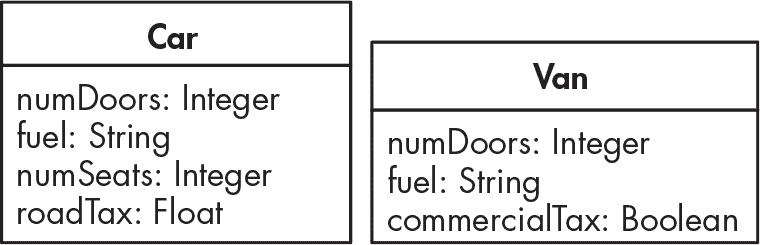

## 第十九章：19 继承


本章介绍了面向对象编程（OOP）中或许是最强大且最重要的特性：*继承*。继承是指一个或多个类（称为*子类*）能够自动继承另一个类（称为*超类*）的所有属性和方法。继承使得 OOP 更加高效：你只需要在超类中定义一次任何通用的共享成员。子类的对象将继承这些属性和方法，并且还会有属于各自子类的特有属性和方法。

与继承相关的是子类能够在继承的方法不适合特定子类时，*重写*超类的继承方法。正如本章中所探讨的，你也可以通过使用 parent 关键字实现两全其美（执行继承的方法*并且*通过子类的方法添加额外的行为）。此外，我们还将讨论 PHP 提供的第三种方法和属性保护方式：protected。你将了解 protected 成员与 public 和 private 成员的区别，以及何时使用每种可见性修饰符。

### 继承作为泛化

继承通过识别和概括对象类之间共享的属性和行为来简化代码。考虑图 19-1 中显示的汽车和船舶对象的属性。



图 19-1：汽车类和船舶类，具有以粗体显示的共享属性

每个类的前三个属性都是相同的：汽车和船舶对象都有制造商和型号、乘客数和最高速度。为了避免冗余，我们可以将这些共有的属性（以及任何相关的方法）概括到一个超类中，我们将其命名为车辆（Vehicle）。图 19-2 展示了这个泛化的车辆类，其中包含三个共享属性，并且简化了的汽车和船舶类，每个类现在只包含一个自己的属性。



图 19-2：车辆超类和汽车、船舶子类

从汽车类和船舶类指向车辆类的箭头表示汽车和船舶类都继承自车辆类；也就是说，汽车和船舶是泛化车辆超类的子类。请注意，图中并未标明属性的可见性（public 与 private）。目前，我们将通过使用简单的公共属性来实现这些类。稍后在本章中，我们将通过使用第三种可见性设置——protected 来重构这些类。

列表 19-1 实现了图 19-2 中显示的车辆类。开始一个新项目，并创建包含此代码的*src/Vehicle.php*文件。

```
<?php
class Vehicle
{
    public string $makeModel;
    public int $numPassengers;
    public float $topSpeed;
}
```

列表 19-1：实现车辆超类

我们声明了一个车辆类（Vehicle），它有三个公共属性：makeModel、numPassengers 和 topSpeed。

列表 19-2 实现了 Vehicle 类的 Car 子类，这个类应当创建在*src/Car.php*中。

```
<?php
class Car extends Vehicle
{
    public string $bodyShape;
}
```

列表 19-2：将 Car 作为 Vehicle 的子类实现

我们声明 Car 类应当是 Vehicle 类的子类，只需在类声明的开头添加 extends 关键字，后面跟上超类名称。我们创建的任何 Car 对象将自动继承 Vehicle 超类的所有属性和方法，同时还会包含在 Car 类中直接声明的 bodyShape 属性。

#### 从子类创建对象

为了验证我们的继承示例是否有效，我们将创建一个 Car 对象并为其属性设置值——包括在 Car 类中直接声明的属性以及从 Vehicle 类继承的属性。创建*public/index.php*并输入列表 19-3 中的代码。

```
<?php
require_once __DIR__ .  '/../src/Vehicle.php';
require_once __DIR__ .  '/../src/Car.php';

$car1 = new Car();

$car1->bodyShape = 'Sedan';
$car1->makeModel = 'Ford Mustang';
$car1->numPassengers = 5;
$car1->topSpeed = 150;

var_dump($car1);
```

列表 19-3：在 index.php 中创建 Car 对象

我们首先读取声明 Vehicle 和 Car 类的文件。必须读取代码所使用的*所有*类的声明，包括像 Vehicle 这样的继承类，即使我们不会直接创建该类的对象。我们读取文件的顺序也很重要：为了让 Car 类能够扩展 Vehicle 类，必须先读取并执行 Vehicle 类的声明，再读取并声明 Car 类。否则，会报错提示找不到 Vehicle 类。

> 注意

*大型项目可能需要几十个，甚至上百个类声明。在第二十章中，我们将介绍一种方法，通过使用一个名为*autoloader*的脚本，以单个语句按需要的顺序读取所有类声明。*

接下来，我们创建一个新的 Car 对象，并将其引用存储在$car1 变量中。然后，我们为 bodyShape、makeModel、numPassengers 和 topSpeed 属性设置值。无论属性是直接在 Car 类中声明的，还是从 Vehicle 类继承的，语法都是一样的：无论如何，我们都只是使用$car1->propertyName = value。最后，我们使用 var_dump()输出关于$car1 变量及其在内存中引用的对象的结构化信息。以下是运行命令行中 index 脚本的结果：

```
$ **php public/index.php**
object(Car)#1 (4) {
  ["bodyShape"]=>
  string(5) "Sedan"
  ["makeModel"]=>
  string(12) "Ford Mustang"
  ["numPassengers"]=>
  int(5)
  ["topSpeed"]=>
  float(150)
}
```

Car 对象确实有四个属性，并且我们已经成功设置了这四个属性，包括在*Car.php*中声明的属性（bodyShape）和从 Vehicle 超类继承的三个属性。

让我们通过声明 Boat 子类，完成图 19-2 中的类层次结构实现。创建*src/Boat.php*并输入列表 19-4 中的代码。

```
<?php
class Boat extends Vehicle
{
    public string $countryOfRegistration;
}
```

列表 19-4：实现 Boat 类

我们声明 Boat 类应该继承自 Vehicle 类，再次使用 extends 关键字来建立子类/父类的关系。这个类只有一个独特的属性 countryOfRegistration，但 Boat 对象也将继承 Vehicle 类的三个公共属性：makeModel、numPassengers 和 topSpeed。

#### 使用多层次的继承

类层次结构可以涉及多个继承层级：类 A 可以有子类 B，类 B 可以有子类 C，依此类推。在这种情况下，类 C 将从其直接超类 B 和超类的超类 A 继承方法和属性。图 19-3 说明了我们如何利用这一机制进一步扩展我们的车辆类层次结构。



图 19-3：一个三层类层次结构，包含子类的子类

类层次结构中包含 Boat 的两个子类：MotorBoat 和 SailBoat。所有 MotorBoat 和 SailBoat 对象将继承 Boat 作为超类的属性和方法。这包括 Boat 从 Vehicle 继承的属性和方法。同时，MotorBoat 对象还将拥有自己的特殊属性 engineSize，而 SailBoat 则将有一个独特的属性 numberOfMasts。

当我们声明 MotorBoat 类时，我们会从 class MotorBoat extends Boat 开始。我们不需要在 MotorBoat 类声明中提到 Vehicle；从 Vehicle 继承的部分已经在*src/Boat.php*类声明文件中涵盖了。

像大多数面向对象语言一样，PHP 允许每个类只能有一个直接的超类。这个保护机制防止了继承来源的歧义，但也为设计类层次结构带来了挑战。例如，由于汽车和摩托艇都有引擎，可能有意义创建一个 Vehicle 的 MotorizedVehicle 子类。Car 类将自然地继承自 MotorizedVehicle，但摩托艇呢？它应该继承自 Boat 还是 MotorizedVehicle？它只能直接继承其中的一个。正如这个例子所示，一旦类层次结构变得更加复杂，在设计时就必须小心谨慎。

### Protected 可见性

随着继承的引入，除了 public 和 private 之外，第三个可见性关键字变得相关：protected。当方法或属性被声明为 protected 时，它可以被任何继承它的子类访问，但不能被项目中其他地方的代码访问。例如，Vehicle 超类的一个 protected 属性可以在*Car.php*中访问，因为 Car 继承自 Vehicle。相比之下，该 protected 属性无法在一般的*index.php*文件中访问。

protected 可见性比 public 更具限制性，因为 public 属性和方法可以从项目代码中的任何地方访问。另一方面，protected 比 private 更不具限制性。当方法或属性是 private 时，它仅在类内部可访问；即使是子类的方法也不能直接访问超类的 private 属性和方法。

为了说明三种可见性关键字之间的区别，我们将重构 Vehicle 类。首先，我们将更新类，使其具有私有属性和公共访问器方法，正如我们在第十八章中讨论的那样。然后，我们会将 protected 关键字加入其中。列表 19-5 显示了对 *src/Vehicle.php* 的首次修改。

```
<?php
class Vehicle
{
    private string $makeModel;
    private int $numPassengers;
    private float $topSpeed;

  ❶ public function getMakeModel(): string
    {
        return $this->makeModel;
    }

    public function setMakeModel(string $makeModel): void
    {
        $this->makeModel = $makeModel;
    }

    public function getNumPassengers(): int
    {
        return $this->numPassengers;
    }

    public function setNumPassengers(int $numPassengers): void
    {
        $this->numPassengers = $numPassengers;
    }

 public function getTopSpeed(): float
    {
        return $this->topSpeed;
    }

    public function setTopSpeed(float $topSpeed): void
    {
        $this->topSpeed = $topSpeed;
    }
}
```

列表 19-5：修改 Vehicle 类，使其具有私有属性和公共访问器方法

我们将所有三个类属性声明为私有而非公共。这意味着它们不能直接设置。相反，我们为每个属性声明了公共的 getter 和 setter 方法❶。

我们现在需要更新 index 脚本，使用 setter 方法为 Car 对象设置属性值。修改 *public/index.php*，使其与列表 19-6 中的代码相符。

```
<?php
require_once __DIR__ .  '/../src/Vehicle.php';
require_once __DIR__ .  '/../src/Car.php';

$car1 = new Car();

❶ $car1->bodyShape = 'Sedan';

$car1->setMakeModel('Ford Mustang');
$car1->setNumPassengers(5);
$car1->setTopSpeed(150);

var_dump($car1);
```

列表 19-6：更新 index.php，通过 setter 方法设置继承的属性

我们仍然可以直接访问在 Car 类中声明的 bodyShape 属性❶，因为它仍然是公共的。然而，我们现在需要使用 setter 方法为三个继承的属性（makeModel、numPassengers 和 topSpeed）赋值，因为这些属性现在在 Vehicle 超类中声明为私有。Car 对象继承了来自 Vehicle 的访问器方法，就像它继承了属性本身一样。由于有了访问器方法，var_dump() 将像以前一样工作。

在 *index.php* 中使用公共 setter 方法来更新私有属性是有意义的；这正是我们在第十八章中所做的。但是，如果我们想将从 Vehicle 继承的某个属性作为 Car 类中声明的一个方法的一部分来使用，会发生什么呢？我们来试试，看会发生什么。我们将为 Car 添加一个新的 getMakeModelShape() 方法，返回对象一些属性的字符串总结。更新 *src/Car.php*，使其与列表 19-7 中的代码相符。

```
<?php
class Car extends Vehicle
{
 public string $bodyShape;

    public function getMakeModelShape(): string
    {
        return "$this->makeModel, $this->bodyShape";
    }
}
```

列表 19-7：尝试从子类访问私有超类属性

我们在 Car 类中声明了新的 getMakeModelShape() 方法。该方法试图将 makeModel 和 bodyShape 属性的值插入到一个字符串中。为了查看这个方法是否有效，我们将在 index 脚本中调用它。更新 *public/index.php*，如列表 19-8 所示。

```
<?php
require_once __DIR__ .  '/../src/Vehicle.php';
require_once __DIR__ .  '/../src/Car.php';

$car1 = new Car();

$car1->bodyShape = 'Sedan';

$car1->setMakeModel('Ford Mustang');
$car1->setNumPassengers(5);
$car1->setTopSpeed(150);

print $car1->getMakeModelShape();
```

列表 19-8：在 index.php 中测试 getMakeModelShape() 方法

我们已将 var_dump() 函数调用替换为一个打印语句，调用我们 $car1 对象引用的 getMakeModelShape() 方法。然而，如果你现在运行 index 脚本，你会得到一个未定义属性的警告，如下所示：

```
$ **php public/index.php**

Warning: Undefined property: Car::$makeModel in /Users/matt/src/Car.php
on line 10
, Sedan
```

我们的 Car 类方法中的语句无法访问继承的私有属性，因此 PHP 引擎在执行 getMakeModelShape() 时无法找到 makeModel 属性。然而，注意到警告信息后面跟着文本 "Sedan"。这表明，即使出现问题，索引脚本仍然继续执行。实际上，在从未定义的属性警告继续执行后，PHP 引擎对 getMakeModelShape() 方法中的 $this->bodyShape 部分没有任何问题，因为 bodyShape 是直接在 Car 类本身定义的属性。

我们访问继承属性值的一种方式是使用公共 getter 方法访问 makeModel 属性，但在某些情况下，最好不要为属性提供公共的 getter 或 setter 方法。当你希望让子类的方法直接访问从父类继承的属性或方法，而又不想让该属性或方法公开时，最佳的解决方案是将该属性或方法设为受保护可见性。为此，更新 Vehicle 类，如 清单 19-9 所示。

```
<?php
class Vehicle
{
  ❶ protected string $makeModel;
 private int $numPassengers;
 private float $topSpeed;

 public function getMakeModel(): string
 {
 return $this->makeModel;
 }

--snip--
```

清单 19-9：在 Vehicle 类中使用受保护可见性来访问 makeModel

我们现在将 Vehicle 属性 makeModel 的可见性声明为受保护 ❶，这意味着它可以被 Car 子类中的语句直接访问。重新执行索引脚本，你将看到没有警告的 make、model 和 shape 字符串输出：Ford Mustang，Sedan。

图 19-4 显示了我们三个类的 UML 图，更新后指示了每个类属性和方法的可见性。



图 19-4：显示类层次结构中可见性设置的更新 UML 图

在 Vehicle 类中，井号（#）表示 makeModel 属性的受保护可见性，而其他两个属性则以负号表示为私有。Car 和 Boat 类的所有属性和方法都是公开的，因此用加号表示。图中的 *«get/set»* 注释表示 Vehicle 类所有三个属性的公共 getter 和 setter 访问方法。

这个示例展示了私有和受保护可见性之间的区别。为了说明公共和受保护可见性属性之间的差异，让我们修改 *public/index.php* 脚本，尝试直接设置 makeModel 属性的值。更新索引脚本以匹配 清单 19-10。

```
<?php
require_once __DIR__ .  '/../src/Vehicle.php';
require_once __DIR__ .  '/../src/Car.php';

$car1 = new Car();

$car1->bodyShape = 'Sedan';
$car1->makeModel = 'Ford Mustang';

$car1->setNumPassengers(5);
$car1->setTopSpeed(150);

print $car1->getMakeModelShape();
```

清单 19-10：展示公共和受保护可见性之间的区别

我们像以前一样将公共 bodyShape 属性的值设置为 'Sedan'。然后，我们尝试直接将 $car1 中的 makeModel 属性的值更改为字符串 'Ford Mustang'。执行这个脚本时，你将遇到致命错误，如下所示：

```
$ **php public/index.php**

Fatal error: Uncaught Error: Cannot access protected property Car::$makeModel
in /Users/matt/public/index.php:13
Stack trace:
#0 {main}
  thrown in /Users/matt/public/index.php on line 13
```

makeModel 属性具有受保护可见性，因此无法从我们的索引脚本中访问。只有 Vehicle 的子类才能直接访问该属性。

### 抽象类

*抽象类*是指永远不会用于创建对象的类。相反，抽象类通常声明为它们的成员（属性和方法）可以被子类继承。例如，Vehicle 类就是一个抽象类。我们永远不希望创建一个 Vehicle 对象；我们仅仅声明这个类是为了从 Car 和 Boat 类中泛化常见的属性和方法。

抽象类的另一个用途是声明与整个类相关的静态成员、属性或方法，而不是与单个对象相关。我们将在第二十五章中探讨静态成员。

最好尽可能具体地说明类及其成员的使用方式。为此，如果你知道一个类是抽象的，最好在声明时包含 abstract 关键字。这个关键字确保在没有触发错误的情况下不能创建该类的对象。为了演示，我们将在 Vehicle 类的声明中添加 abstract 关键字。请更新*src/Vehicle.php*，如清单 19-11 所示。

```
<?php

abstract class Vehicle
{
 protected string $makeModel;
--snip--
```

清单 19-11：将 Vehicle 声明为抽象类

我们通过在 class 关键字前面立即添加 abstract 来声明 Vehicle 是一个抽象类。如果你在做出这个更改后再次运行索引脚本，你将不会看到程序行为有任何差异。然而，如果你现在尝试创建一个 Vehicle 对象，如清单 19-12 所示，将会发生致命错误。请更新*public/index.php*以匹配清单内容。

```
<?php
require_once __DIR__ .  '/../src/Vehicle.php';
require_once __DIR__ .  '/../src/Car.php';

❶ $vehicle1 = new Vehicle();

$car1 = new Car();
--snip--
```

清单 19-12：尝试创建一个抽象 Vehicle 类的对象

我们尝试创建一个 Vehicle 类的对象，并将创建的对象的引用存储在$vehicle1 变量中❶。如果你尝试运行这个索引脚本，结果将是这样：

```
$ **php public/index.php**

Fatal error: Uncaught Error: Cannot instantiate abstract class Vehicle in
/Users/matt/public/index.php:5
Stack trace:
#0 {main}
  thrown in /Users/matt/public/index.php on line 5
```

会发生致命错误，错误信息为“无法实例化抽象类”。这正是我们想要的：通过将 Vehicle 类声明为抽象类，我们确保了无法创建任何 Vehicle 对象。

### 重写继承的方法

在某些情况下，你可能希望改变子类中继承方法的行为，相比于它在父类中的定义。这称为*重写*方法，你可以通过在子类中直接定义该方法，并将其命名为与父类继承的方法相同的名称来实现。PHP 会优先执行类层次结构中较低层级定义的属性和方法，因此它会执行来自子类的定义，而不是父类中的方法定义。

让我们通过一个声明了 __toString()方法的父类，以及一个通过自己的 __toString()实现来重写该声明的子类来进行说明。图 19-5 显示了我们将用于研究如何重写继承方法的两个类的 UML 图，并附有注释说明每个 __toString()方法的行为。我们将创建一个通用的 Food 类和一个 Food 类的 Dessert 子类。



图 19-5：Dessert 子类重写了从 Food 继承的 __toString()方法。

Food 类有一个 __toString()方法，它生成类似"(FOOD) foodname"的字符串，例如"(FOOD) apple"。与此同时，Dessert 子类通过自己的 __toString()方法覆盖了这一行为，生成类似“我是一种名为 foodname 的甜点”的字符串，例如“我是一种名为草莓芝士蛋糕的甜点”。

首先，我们将声明 Food 类。创建一个新项目，然后创建*src/Food.php*，并将 Listing 19-13 中的代码填入其中。

```
<?php
class Food
{
    protected string $name;

    public function __construct(string $name)
    {
        $this->name = $name;
    }

    public function __toString(): string
    {
        return "(FOOD) $this->name";
    }
}
```

Listing 19-13：Food 类

我们声明 Food 类，并给它一个名为 name 的字符串属性，该属性具有保护可见性，以便所有子类可以直接访问它。该类有一个构造函数，用于在创建每个新对象时初始化 name 属性，并且包含如图 19-5 所示的 __toString()方法。

现在让我们将 Dessert 声明为 Food 的子类。创建*src/Dessert.php*并输入 Listing 19-14 中的内容。

```
<?php
class Dessert extends Food
{
    public function __toString(): string
    {
        $message = "I am a Dessert named $this->name";
        return $message;
    }
}
```

Listing 19-14：Dessert 类，包含自己的 __toString()方法

我们声明 Dessert 是 Food 的一个子类（继承自 Food），并为其提供自己的 __toString()方法，如图 19-5 所示。由于 PHP 优先使用类层级中较低位置声明的方法，因此这个 __toString()方法将覆盖为 Food 父类定义的 __toString()方法。请注意，我们在 Dessert 类的 __toString()方法中引入了一个局部变量$message。这个变量现在看似不必要，但我们将在本章稍后回到这个示例，并将其添加到消息中。

通过创建*public/index.php*脚本来测试这些类，该脚本在 Listing 19-15 中有展示。这个脚本创建了两个对象，一个 Food 对象和一个 Dessert 对象，并打印出每个对象的内容，这将导致对象的 __toString()方法被调用。

```
<?php
require_once __DIR__ . '/../src/Food.php';
require_once __DIR__ . '/../src/Dessert.php';

$f1 = new Food('apple');
❶ print $f1;
print '<br>';

$f2 = new Dessert('strawberry cheesecake');
print $f2;
```

Listing 19-15：在 index.php 中创建并打印 Food 和 Dessert 对象

我们读取并执行 Food 和 Dessert 类的声明，从父类开始。然后我们创建并打印每个类的对象，这将触发对象的 __toString()方法❶。以下是运行 Web 服务器并请求页面后的浏览器输出：

```
(FOOD) apple
I am a Dessert named strawberry cheesecake
```

请注意，Dessert 对象输出“我是一种名为草莓芝士蛋糕的甜点”，这表明它成功地重写了从 Food 继承的 __toString()方法，并用自己的方法定义来替代。重写一个方法并不会打乱子类继承父类的其他方法或属性。然而，在这个例子中，Dessert 对象依然成功地继承了 Food 中的 name 属性和 __construct()方法。

### 扩展继承行为

有时，你可能并不希望完全替换（覆盖）继承的方法，而是想要*增强*继承的方法，加入特定于子类的附加行为。PHP 提供了关键字 parent 来实现这一点：它允许你在子类声明文件中引用父类的方法或属性。为了说明这一点，我们将修改 Dessert 子类的 __toString()方法。它将通过使用父类 Food 的 __toString()方法生成一个字符串，然后添加一个特定于 Dessert 对象的特殊消息。请按照 Listing 19-16 中的示例更新*src/Dessert.php*。

```
<?php
class Dessert extends Food
{
 public function __toString(): string
 {
        $message = parent::__toString();
        $message .= " I am a Dessert!";
 return $message;
 }
}
```

Listing 19-16：Dessert 子类更新后的 __toString()方法

我们调用了父类（Food）的 __toString()方法，并将结果存储到$message 变量中。要访问父类方法，我们使用关键字 parent，然后是双冒号*作用域解析操作符*（::），接着是方法名。接下来，我们使用字符串拼接将“ I am a Dessert!”添加到消息的末尾。所有这些都发生在 Dessert 类的 __toString()方法的定义中，这意味着我们仍然在技术上覆盖了父类的 __toString()方法。只是我们通过 parent 来访问父类的方法定义，同时进行覆盖。

现在访问索引网页，你应该能看到如下内容：

```
(FOOD) apple
(FOOD) strawberry cheesecake I am a Dessert!
```

Dessert 对象返回的字符串是由 Food 类的 __toString()方法生成的字符串“(FOOD)草莓芝士蛋糕”，加上 Dessert 对象特有的“ I am a Dessert!”消息拼接而成的。

你可以通过显式地按名称引用父类，而不是使用 parent::来访问父类的方法，例如在我们的例子中是 Food::。在多层次的类层级结构中（例如，D 是 C 的子类，C 是 B 的子类，B 是 A 的子类），这非常有用，你可能希望引用层级结构中更高处的继承类，而不是直接的父类。在这种情况下，显式命名类是唯一的选择，因为 parent 关键字总是指向直接的父类。

增强方法而不是完全覆盖方法的一个常见原因是创建一个适用于子类的构造函数。如果子类拥有父类的所有属性加上它自己的一些属性，那么创建一个构造函数，首先使用 parent::__construct()调用父类的构造函数，然后再设置特定于子类的属性，这样就很高效。这样，你可以重用父类构造方法中的任何验证或其他重要逻辑。

> 注意

*构造函数不受 LSP 方法签名规则的约束。如果子类和父类构造函数的参数列表不兼容，也没关系，就像子类构造函数有额外的强制性参数一样。*

为了演示如何增强构造函数，我们将在 Dessert 对象中添加一个新的 calories 属性。然后，我们将为 Dessert 对象创建一个构造函数，通过设置 calories 和 name 来增强 Food 构造函数。更新 *src/Dessert.php* 文件以匹配 示例 19-17 中的代码。

```
<?php
class Dessert extends Food
{
    private int $calories;

  ❶ public function __construct(string $name, int $calories)
    {
        parent::__construct($name);
        $this->setCalories($calories);
    }

 ❷ public function setCalories(int $calories)
    {
        $this->calories = $calories;
    }

 public function __toString(): string
 {
 $message = parent::__toString();
        $message .= " I am a Dessert containing $this->calories calories!";
 return $message;
 }
}
```

示例 19-17：为 Dessert 类添加增强的构造函数

我们声明了新的 calories 属性并将其设为私有（因为我们在这个项目中没有 Dessert 的子类）。然后，我们声明了一个构造方法，它接受两个参数，分别是要创建的新 Dessert 对象的名称和卡路里 ❶。在方法定义中，我们使用 parent:: 调用 Food 超类的构造方法，在此过程中设置名称属性。接着，我们完成 Dessert 构造函数，通过设置对象的 calories 属性。我们使用 setter 方法 setCalories()，该方法我们随后会声明 ❷。最后，我们更新 __toString() 方法，以便输出对象的 calories 属性值，以确认代码是否正常工作。

在我们创建一个 Dessert 对象时，现在需要在索引脚本中为 calories 属性添加一个值。更新 *public/index.php* 以匹配 示例 19-18 中的代码。

```
<?php
require_once __DIR__ . '/../src/Food.php';
require_once __DIR__ . '/../src/Dessert.php';

$f1 = new Food('apple');
print $f1;
print '<br>';

$f2 = new Dessert('strawberry cheesecake', 99);
print $f2;
```

示例 19-18：在索引脚本中添加卡路里参数

我们创建一个 Dessert 对象，并传入两个参数，分别对应名称和卡路里属性。以下是访问网页后的结果：

```
(FOOD) apple
(FOOD) strawberry cheesecake I am a Dessert containing 99 calories!
```

第二条消息表明 Dessert 对象的两个属性已经通过类的构造方法成功设置，该方法增强了其父类的构造方法。此外，它还显示我们成功增强了 Dessert 子类的 __toString() 方法，并调用了其父类的 __toString() 方法。### 防止子类化和重写

在某些情况下，你可能永远不希望允许从你声明的类中创建子类。在这种情况下，可以使用 final 关键字声明该类，防止其他类扩展（子类化）该类。关键字应放在类声明的最开始（例如：final class Dessert）。你还可以将 final 关键字添加到单个方法的声明中，以防止该方法被子类重写。

尤其对于整个类的 final 关键字使用，在面向对象编程（OOP）社区中一直是一个激烈争论的话题。只有在有充分理由的情况下，才建议将类或方法声明为 final。例如，如果你有一个 API 库，你可能会将某个类声明为 final，以防止任何人对其进行子类化，因为你不希望允许或鼓励程序员期望 API 中声明的行为之外的不同表现。final 声明还可以帮助防止版本间或更新后的代码出现问题：当一个类是 final 的时，类的内部实现（私有方法和属性）发生变化也不会对类外的代码产生意外影响。

#### 声明一个 final 类

让我们创建一个 final 类的示例，并查看如果尝试声明其子类时会发生什么错误。启动一个新项目，并创建 *src/Product.php*，如 清单 19-19 所示。

```
<?php
❶ final class Product
{
    private int $skuId;
    private string $description;

  ❷ public function __construct(int $skuId, string $description)
    {
        $this->skuId = $skuId;
        $this->description = $description;
    }

    public function getSkuId(): int
    {
        return $this->skuId;
    }

    public function getDescription(): string
    {
        return $this->description;
    }
}
```

清单 19-19：声明为 final 的 Product 类

我们声明 Product 类，并将其指定为 final ❶。这个简单的类具有库存单位（SKU）编号和文本描述属性，这些属性在类的构造函数 ❷ 中设置。它还为每个属性提供了一个 getter 方法。

接下来，我们将尝试通过声明一个子类来扩展 Product。创建 *src/MyProduct.php*，包含 清单 19-20 中的代码。

```
<?php
class MyProduct extends Product
{
}
```

清单 19-20：Product 的 MyProduct 子类

我们声明 MyProduct 是 Product 的子类，同时将其主体留空。

现在创建一个 *public/index.php* 脚本，读取这两个类的声明，如 清单 19-21 所示。

```
<?php
require_once __DIR__ . '/../src/Product.php';
require_once __DIR__ . '/../src/MyProduct.php';
```

清单 19-21：读取 Product 和 MyProduct 声明的索引脚本

为了演示声明为 final 的类不能被扩展，我们不需要更多的 require_once 语句。执行索引脚本后，你应该会看到这个错误：Fatal error: Class MyProduct may not inherit from final class Product。

#### 声明 final 方法

将特定方法声明为 final 可以防止它们被重写，同时仍允许类拥有子类。除了其他应用场景外，这一技术确保方法在类层次结构的所有级别上具有一致的验证逻辑。

为了说明这一点，让我们修改 Product 类，移除其整体 final 声明并添加一个新方法来设置 skuId 属性。该方法将进行验证，确保 SKU 编号大于 0。我们将把这个方法声明为 final，这样任何子类都无法用不包含验证逻辑的方法来替换它。更新 Product 类声明，如 清单 19-22 所示。

```
<?php
class Product
{
    protected int $skuId;
 private string $description;

 public function __construct(int $skuId, string $description)
 {
 $this->skuId = $skuId;
 $this->description = $description;
 }

 public function getSkuId(): int
 {
 return $this->skuId;
 }

 public function getDescription(): string
 {
 return $this->description;
 }

    final public function setSkuId(int $skuId): void
    {
        if ($skuId > 0)
            $this->skuId = $skuId;
    }
}
```

清单 19-22：为 Product 类添加 final 方法

我们从整体类声明中移除 final 关键字，允许该类被扩展，并将 skuId 属性的可见性更改为 protected，这样它可以在子类的方法中使用。然后，我们为 skuId 属性添加一个新的 final setter 方法，确认所需的值大于 0。

现在更新 MyProduct 类，使其与 清单 19-23 中的内容相匹配，在其中我们尝试重写 setSkuId() 方法。

```
<?php
class MyProduct extends Product
{
  ❶ public function setSkuId(int $skuId): void
    {
        $this->skuId = $skuId;
    }
}
```

清单 19-23：在 MyProduct 中重写 setSkuId() 方法

我们尝试直接在 MyProduct 类 ❶ 中声明 setSkuId() 方法，而不进行大于零的验证检查。这是不允许的，因为在 Product 超类中，setSkuId() 方法已经声明为 final。如果重新运行索引脚本，你应该会看到一个致命错误，指出无法重写 Product 类的 setSkuId() 方法。 ### 总结

在本章中，我们探讨了几个面向对象编程（OOP）特性，最显著的是类之间的继承。我们还讨论了与保护可见性相关的主题，这使得子类能够访问继承的属性和方法，以及方法重写和通过父类关键字调用继承的方法行为。最后，我们看了如何通过使用 abstract 和 final 关键字来限制类和方法的使用。

### 练习

1.   实现 图 19-6 中的 Jam 类图。


图 19-6：Jam 类及其 `$food1` 对象

编写一个索引脚本来创建图中所示的 Jam 类的 `$food1` 对象。使用打印语句调用该对象的 `__toString()` 方法。

2.   复制你在练习 1 中的项目。创建两个新类，Spread 和 Honey，并简化 Jam 类，如 图 19-7 所示。注意 Spread 类中属性的可见性：# 表示保护级别，+ 表示公共级别。



图 19-7：Jam 和 Honey 子类继承自 Spread

更新你的索引脚本，创建并打印一个 Jam 对象和一个 Honey 对象。

提示：你可以通过创建一个私有的辅助方法 `manukaString()` 来简化字符串创建代码，该方法根据 `isManuka` 属性的值返回字符串（Manuka）或（NOT Manuka）。

3.   查看 图 19-8 中的 Car 和 Van 类，并计划一个抽象的超类来包含这两个类的共同成员。



图 19-8：Car 类和 Van 类

声明你的超类，以及 Car 和 Van 类。然后编写一个索引脚本，创建一个 Car 对象和一个 Van 对象，并使用打印语句调用它们的 `__toString()` 方法。

4.   测试使用 `final` 关键字防止子类化。复制你在练习 2 中的项目，并在 Spread 类声明的开头将 `abstract` 关键字替换为 `final` 关键字。运行你的索引脚本，Jam 和 Honey 类的声明应该触发一个致命错误。
