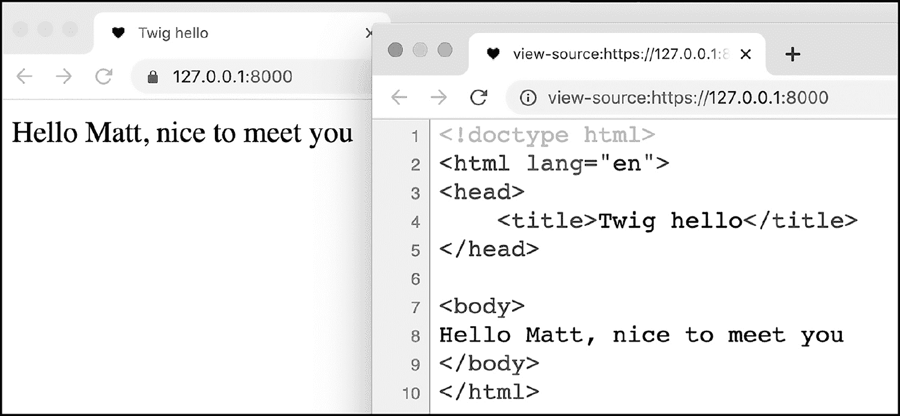
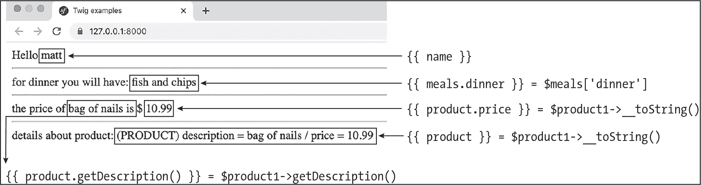
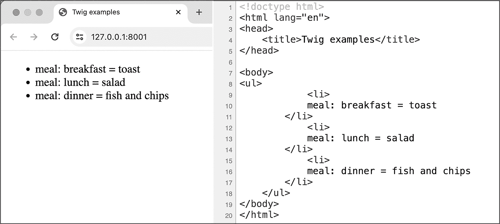
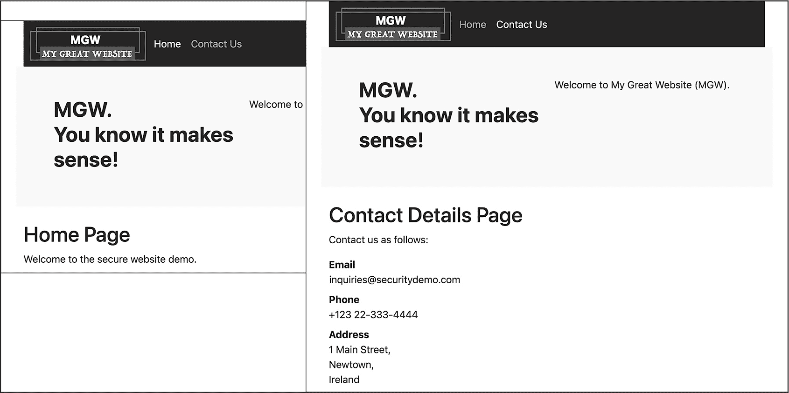
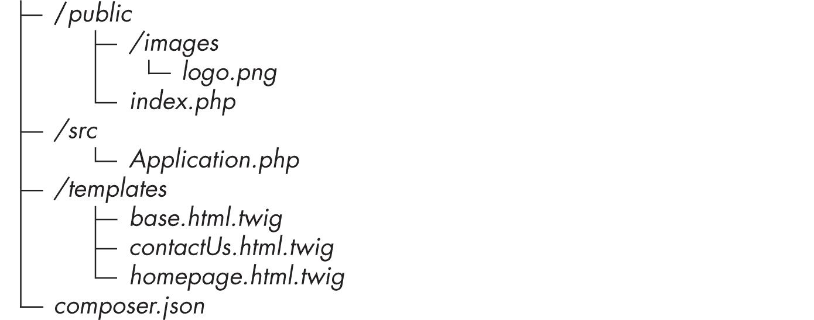
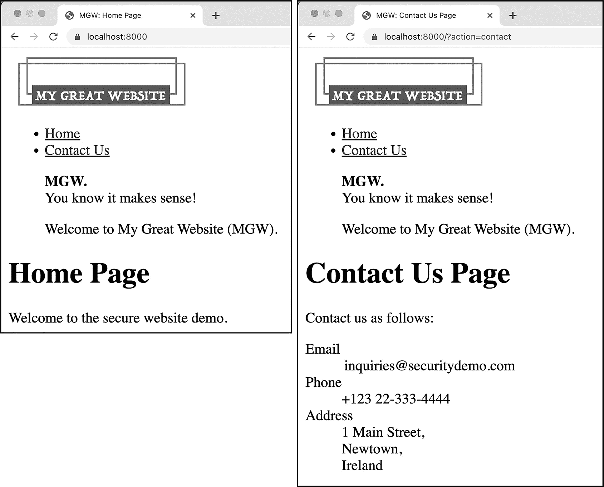
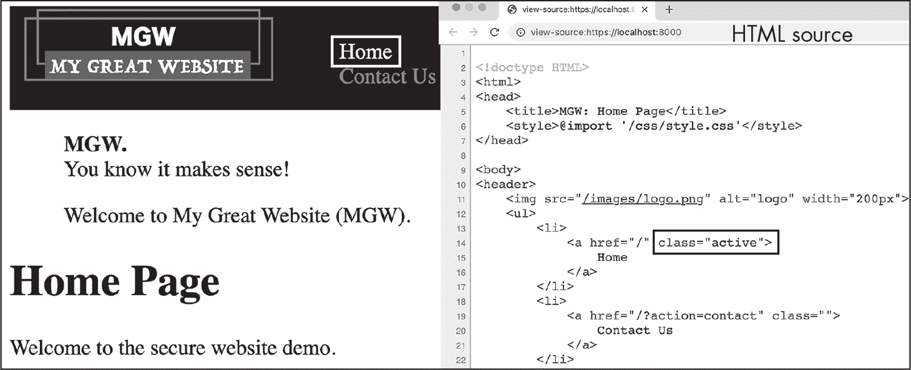

## 第二十一章：21 使用 Twig 进行高效模板设计


本章介绍了免费的开源 Twig 模板库，这是一个应用面向对象原则（如继承）来处理页面展示模板的第三方软件包。模板与面向对象编程（OOP）的结合简化了 Web 应用程序的设计过程。我们将首先学习使用 Twig 的基础知识，然后利用它逐步构建一个多页面的网站。

本章还首次展示了面向对象编程风格如何影响我们在第三部分中得到的 Web 应用架构。例如，我们不再编写实现前端控制器逻辑的函数，而是创建包含前端控制器方法的面向对象类。随着我们进一步开发本章的多页面网站，面向对象的应用开发方法将在第二十二章中得到进一步完善。

### Twig 模板库

类似 Twig 库这样的 Web 模板系统（可以在 *[`twig.symfony.com`](https://twig.symfony.com)* 找到）通过区分不变内容和可能在每次请求时发生变化的内容，管理了 Web 应用程序输出中常见的重复内容。这使得开发 Web 应用程序的 MVC 架构中的视图部分变得更加高效。正如我们在前几章中讨论的那样，许多基础的 HTML 往往会在每个页面的模板脚本中重复，因为多个页面通常共享如页眉和导航栏等元素。例如，在第十三章中创建的三页网站中，每个页面模板文件中的大部分代码都是重复的 HTML；几乎没有任何代码是特定于当前页面的。

在多个模板中复制大量 HTML 会导致两个问题。首先，如果需要更改网站设计的某个方面（例如导航栏的外观和感觉，或者特殊的页眉或页脚），你必须编辑*每一个*页面模板，对于一个大型网站来说，这可能涉及到几十、几百甚至几千个文件。其次，在编辑页面模板的内容或行为时，当内容被隐藏在大量通用代码中时，识别出当前页面特有的内容会变得非常困难。你希望能够专注于编辑特定页面的内容。

一种解决方案是将网页的公共部分分离成子模板，例如头部、导航、页脚等。例如，在第十五章中，我们创建了一个 *templates/_header.php* 文件，其中包含了我们购物车网站中所有页面共有的头部元素。然而，一个更优雅的解决方案是使用专门的 PHP 模板库，特别是像 Twig 这样的支持模板继承的库。正如你所看到的，模板继承的一个关键优势是，在我们声明某个页面的模板继承自父模板之后，子页面中唯一的内容就是该页面本身的内容；我们不需要为标准的页面头部、页脚、导航栏等编写 require 语句。这样，每个子模板就能专注于其代表的页面，避免了多余的干扰。

模板库的另一个优势是，它们通过将 PHP 代码从模板中移除，限制了可以在页面模板中编码的行为。如果你在一个团队中工作，这些限制意味着你可以安全地让团队中的其他成员（比如营销部门）编辑页面模板，以完善网站的外观和感觉，且可以放心他们不会不小心插入可能导致网站崩溃或产生安全漏洞的 PHP 代码。毕竟，模板文件是 MVC 架构中的视图组件，因此它们只应使用类似 HTML 这样的标记语言，通过标签来“装饰”提供的数据。

#### Twig 工作原理

在我们使用 Twig 创建任何内容之前，让我们先了解在使用 Twig 模板时涉及的基本文件、对象和方法。当在代码中使用 Twig 时，我们会操作一个 Twig\Environment 类的对象。这个对象负责根据模板文件和任何需要的数据显示来生成网页的 HTML 内容。它通过其 render() 方法来实现这一点。通常，你会将 Twig\Environment 对象的引用存储在一个名为 twig 的变量中，而这个变量本身是一个通用应用程序类的属性，该类封装了所有与网页应用程序相关的高级逻辑。

render() 方法需要两个参数。第一个是一个包含所需模板文件路径的字符串。这个字符串通常存储在一个名为 $template 的变量中。第二个参数是一个数组，包含需要提供给模板的变量，用以定制页面的内容。这个数组通常存储在一个名为 $args 的变量中，因为该数组本质上是在向模板提供参数。数组中的字符串键应该对应于 Twig 模板中使用的任何变量的名称。如果模板不需要任何值，$args 将是一个空数组。

举个例子，假设你想显示一个显示购物车中商品的页面。这个页面的模板文件叫做*shoppingCart.xhtml.twig*（按照约定，输出 HTML 的 Twig 模板文件的命名形式为*<pageName>.xhtml.twig*），模板中会有一个 products 变量，代表用户购物车中的所有商品（Twig 模板中的变量不以美元符号开头）。

你需要将模板文件路径作为第一个参数传递给 Twig\Environment 类的 render()方法。第二个参数将是一个包含'products'键（与模板中变量的名称相同）的$arg 数组，该键的值是一个 Product 对象的数组。然后，render()方法将返回一个包含网页 HTML 的字符串，网页上列出了所有产品，呈现为一个漂亮的购物车，带有小计、总计、删除商品或更改数量的链接等等。这个字符串可以被打印到输出缓冲区，作为返回给 Web 客户端的 HTTP 响应体的一部分。

如果一个 Web 应用程序使用 Twig 模板，每个返回 HTML 响应文本的方法都会包含类似示例 21-1 中的代码。

```
$template = 'path/templateName.xhtml.twig';
$args = [
    'variable1NameForTwig' => $phpVariable1,
    'variable2NameForTwig' => $phpVariable2,
    ...
];
$html = $this->twig->render($template, $args);
print $html;
```

示例 21-1：从 Twig 模板创建并打印 HTML 的典型代码

我们将模板路径存储在$template 变量中，然后使用所需的模板变量构建$args 数组。我们将这些变量传递给 render()方法。记住，通常我们会在一个顶层的 Application 类中存储对拥有 render()方法的 Twig\Environment 对象的引用，这就是为什么调用该方法时写作$this->twig->render()而不是$twig->render()。我们将返回的字符串存储在$html 中，然后打印它。很快，你会在实际应用中看到这种代码模式，因为我们使用 Twig 创建一个基本的网页。

#### 一个简单的示例

在本节中，我们将使用 Twig 创建一个简单的“Hello, world！”网页，显示一个问候信息。通过 Twig，我们将能够根据 PHP 变量的值定制问候语，填入被问候的人的名字。除了演示使用 Twig 的基本操作，这个项目还将首次展示一个面向对象的 Web 应用程序是如何结构化的。

为了创建我们的基本问候页面，我们首先要设置 Twig。接着，我们将编写一个包含姓名变量的 Twig 模板，并编写必要的 PHP 脚本使模板能够正常工作。

##### 将 Twig 添加到项目中

将 Twig 添加到项目中最简单的方法是使用 Composer。为项目创建一个新的空文件夹，然后在命令行中输入以下内容：

```
$ **composer require twig/twig**
```

此命令触发 Composer 将 Twig 包的最新版本安装到项目的*vendor*文件夹中（该文件夹将被创建，因为项目尚未包含此文件夹）。该命令还会安装 Twig 所需的任何额外依赖项，如 symfony/polyfill-mbstring 和 symfony/polyfill-ctype。如果你查看安装完成后的*vendor*文件夹内容，你应该能看到这些包的文件夹已经被创建。你甚至可以查看每个包的*src*文件夹，检查包中的每个类和配置文件。

现在 Twig 包已经被复制到我们的项目文件夹中，我们可以在类中添加 use 语句，以便在项目中创建并利用该库的功能。

##### 编写 Twig 模板

根据约定，Twig 模板文件存储在*templates*文件夹中，就像我们在前面的章节中编写的 PHP 模板文件一样。将此文件夹添加到项目目录中，然后在该文件夹中创建一个*hello.xhtml.twig*模板，并输入 Listing 21-2 的内容。

```
<!doctype html>
<html lang="en">
<head>
    <title>Twig hello</title>
</head>

<body>
  ❶ Hello {{name}}, nice to meet you
</body>
</html>
```

Listing 21-2：创建围绕 name 变量的 HTML 问候语的 hello.xhtml.twig 模板

和许多网页模板语言一样，Twig 模板使用双大括号来表示应该填写的值，例如此模板中的 {{name}} ❶。这声明了一个名为 name 的 Twig 变量的值将在 render() 方法生成 HTML 输出字符串时插入到此处。在调用此模板的 PHP 脚本中，我们需要通过 $args 数组为该变量传递一个值，并使用相同名称的键。例如，如果我们将 $args 数组声明为 ['name' => 'Matt']，则 render() 方法会生成 Listing 21-3 中显示的 HTML，将 Matt（这里以粗体显示）插入 name 变量的位置。

```
<!doctype html>
<html lang="en">
<head>
    <title>Twig hello</title>
</head>

<body>
  ❶ Hello **Matt**, nice to meet you
</body>
</html>
```

Listing 21-3：当 name 包含 'Matt' 时，Twig 模板渲染的 HTML

我们看到 Matt 已经被插入到 HTML 文本输出中说 hello 的那一行 ❶。

Twig 的双大括号类似于 PHP 的 <?= 短 echo 标签，因为它们都标识了需要插入到输出 HTML 中的字符串表达式。（就像 PHP 一样，Twig 还有其他标签用于标识逻辑代码，如循环和条件语句，而不是字符串输出语句。）然而，由于 Twig 模板不能包含 PHP 语句，使用 Twig 的双大括号而非 PHP 短 echo 标签，可以保护网站的模板免受 PHP 安全漏洞的影响。

##### 创建应用程序类

现在让我们为问候页面编写一个 Application 类。它将在构造方法中设置 Twig\Environment 对象，并拥有一个 run() 方法，用于设置变量并通过 Twig 生成页面的 HTML。所有面向对象的 MVC 网页应用程序都有类似的 Application 类来执行任何所需的设置和初始化，然后执行处理应用程序请求的主要逻辑。

目前，类始终输出相同的 HTML，但在本章稍后，我们将在类的 run()方法中看到一些逻辑，以根据请求中接收到的变量输出不同的 HTML 内容。要声明该类，请创建*src/Application.php*，其中包含示例 21-4 中的代码。

```
<?php
namespace Mattsmithdev;

use \Twig\Loader\FilesystemLoader;
use \Twig\Environment;

class Application
{
    const PATH_TO_TEMPLATES = __DIR__ . '/../templates';

    private Environment $twig;

    public function __construct()
    {
        $loader = new FilesystemLoader(self::PATH_TO_TEMPLATES);
      ❶ $this->twig = new Environment($loader);
    }

    public function run()
    {
        $name = 'Matt';

        $template = 'hello.xhtml.twig';
        $args = [
            'name' => $name,
        ];

      ❷ $html = $this->twig->render($template, $args);
        print $html;
    }
}
```

示例 21-4：类 src/Application.php，用于创建一个 Twig 对象并输出 HTML 的方法

我们将 Application 类声明为 Mattsmithdev 命名空间的一部分，并包含两个 use 语句，因为我们需要在构造方法中创建来自 Twig 命名空间的类的对象。接着，我们声明一个名为 PATH_TO_TEMPLATES 的常量，它保存着所有模板文件所在的基础*templates*目录的路径。我们还声明了一个私有的 twig 属性，它将是指向 Twig\Environment 对象的引用。

接下来，我们声明类的构造方法。在构造方法中，我们创建了两个与 Twig 相关的对象，FilesystemLoader 和 Environment。后者包含了至关重要的 render()方法，而前者则帮助 Environment 对象访问模板文件。FilesystemLoader 对象只在临时作用域内创建，因为它的引用存储在$loader 变量中，只在构造方法的作用域内有效。当我们创建 Environment 对象（使用$loader 时），我们将其引用存储在 Application 对象的 twig 属性中 ❶，以便所有 Application 方法都能通过写入$this->twig 来访问它。

注意，当我们通过使用 PATH_TO_TEMPLATES 常量来创建 FilesystemLoader 对象时，必须在常量标识符前加上 self::。正如我们将在第二十五章中讨论的那样，在引用同一类中声明的常量时，这个前缀是必要的。这是因为 PHP 并不会为每个类的对象创建常量的副本。相反，所有类的对象共享一个常量，因此写$ this->PATH_TO_TEMPLATES 是不合法的。

接下来，我们声明 Application 类的 run()方法。在该方法中，我们定义了一个$name 变量，用来保存我们想要问候的人的名字。然后我们创建了一个$template 变量，它保存了我们的模板文件的名字（*hello.xhtml.twig*），以及一个$args 变量，它是一个数组，包含一个元素，该元素在'name'键下保存了$name 变量的值。正如我们所讨论的，这个键对应着模板文件中被双大括号包围的 Twig 变量。在 run()方法中，我们接着调用了 Twig 对象的 render()方法，将返回的字符串存储在$html 变量中 ❷。最后，我们打印出$html 的内容，它将作为响应的 HTML 主体返回给 Web 客户端。

##### 创建自动加载器

现在让我们让 Composer 为位于 *src* 目录中的 Mattsmithdev 命名空间类（例如我们的 Application 类）创建自动加载器。为此，我们需要在项目的顶级目录中的 *composer.json* 文件中添加一个 "autoload" 属性。当我们使用 Composer 将 Twig 包添加到项目中时，这个文件会自动创建，并且它应该已经包含有关 Twig 的 "require" 属性。按照 Listing 21-5 中的内容更新此文件。

```
{
    "autoload": {
        "psr-4": {
            "Mattsmithdev\\": "src"
        }
  ❶},
 "require": {
 "twig/twig": "³.10"
 }
}
```

Listing 21-5：更新 composer.json 以支持类的自动加载

我们添加了一个 "autoload" 属性，声明 Mattsmithdev 命名空间的类符合 PSR-4 规范，并可以在 *src* 目录中找到。别忘了在关闭的大括号后加上逗号 ❶；如果缺少这个逗号，你将会遇到 JSON 语法错误。

一旦你更新了 *composer.json*，在命令行中输入以下内容：

```
$ **composer dump-autoload**
```

这指示 Composer 在 *vendor* 文件夹中生成必要的自动加载脚本。

##### 添加索引脚本

启动我们的问候页面的最后一步是创建一个简单的索引脚本，它将加载自动加载器，创建一个 Application 对象，并调用其 run() 方法。我们所有面向对象的 Web 应用程序都会有一个像这样的简单索引脚本，因为所有的工作都由 Application 对象执行。创建 *public/index.php*，如 Listing 21-6 所示。

```
<?php
require_once __DIR__ . '/../vendor/autoload.php';

use Mattsmithdev\Application;
$app = new Application();
$app->run();
```

Listing 21-6：index.php 脚本

我们首先读取并执行生成的自动加载脚本。注意，Composer 创建的自动加载器将加载 Mattsmithdev 命名空间中声明的任何类，以及 Composer 添加到项目中的第三方库中的任何类（例如 Twig）。接下来，我们添加一个 use 语句，以便我们可以在不每次指定命名空间的情况下引用 Application 类。然后，我们创建一个 Application 对象并调用其 run() 方法。

如果你运行 PHP Web 服务器并访问项目主页，你应该看到类似于 Figure 21-1 的内容。图中还显示了 Web 客户端收到的响应的 HTML 源代码。注意，HTML 和生成的网页中，Twig {{name}} 变量的位置都填充了 *Matt*。



图 21-1：我们的基本 Twig 项目的 Web 输出，包含 HTML 源代码

这可能看起来对于一个简单的“Hello, world!”网站来说是 *很多* 工作，但我们现在已经创建了任何使用强大 Twig 模板系统的项目所需的所有结构。在将这些结构应用到一个更大的网站之前，让我们先探索一些 Twig 包的其他有用功能。

### 在 Twig 模板中操作对象和数组

除了像字符串这样的简单数据类型，Twig 模板还可以与 PHP 对象、数组等一起使用。然而，语法与我们在 PHP 中习惯的有所不同，因为 Twig 使用*点表示法*来访问对象的属性或方法，或者访问数组中的元素。例如，在 PHP 中，你会写 `$product->price` 来访问 Product 对象的 price 属性，而在 Twig 模板中，你需要写 {{product.price}} 来实现相同的操作。方便的是，无论属性是公共的还是私有的，这种方式都有效，前提是如果属性是私有的，必须有一个公共的 getter 方法，且该方法遵循通常的命名规则，如 getPropertyName() 或 isBooleanPropertyName()。例如，{{product.price}} 仍然可以成功访问对象的私有 price 属性，只要该对象有一个公共的 getPrice() 方法。你不需要在 Twig 模板中显式引用 getPrice() 方法，因为 Twig 会自动调用该方法。

为了说明 Twig 模板如何与这些更复杂的数据类型一起工作，我们将更新我们的 "Hello, world!" 网页，以展示从 PHP 对象和数组中获取的信息。首先，我们需要编写一个类，以便可以创建一个对象并将其传递给 Twig 模板。列表 21-7 显示了一个简单的 Product 类，我们可以将其用作示例。创建 *src/Product.php* 并输入列表中的内容。

```
<?php
namespace Mattsmithdev;

class Product
{
    private string $description;
    private float $price;

    public function getDescription(): string {
        return $this->description;
    }

    public function setDescription(string $description): void {
        $this->description = $description;
    }

    public function getPrice(): float {
        return $this->price;
    }

    public function setPrice(float $price): void {
        $this->price = $price;
    }

    public function __toString(): string {
        return "(PRODUCT) description =
            $this->description / price = $this->price";
    }
}
```

列表 21-7：在 Twig 演示中使用的简单 Product 类

该类有两个私有属性：description 和 price。代码还为这些属性提供了公共的 getter 和 setter 方法，以及一个 __toString() 方法，用于生成对象的字符串摘要。

接下来，我们将修改 Application 类的 run() 方法。新的方法将创建一个数组和一个 Product 对象，并将它们连同原始的 name 变量一起传递给 Twig 模板。更新 *src/Application.php* 以匹配列表 21-8 中的内容。

```
--snip--
 public function run()
 {
        $meals = [
            'breakfast' => 'toast',
            'lunch' => 'salad',
            'dinner' => 'fish and chips',
        ];

        $product1 = new Product();
        $product1->setDescription('bag of nails');
        $product1->setPrice(10.99);

 ❶ $template = 'demo.xhtml.twig';
        $args = [
            'name' => 'matt',
            'meals' => $meals,
            'product' => $product1
        ];

 $html = $this->twig->render($template, $args);
 print $html;
 }
}
```

列表 21-8：更新后的 Application 类，将对象和数组传递给模板

我们创建了一个包含键 'breakfast'、'lunch' 和 'dinner' 的 $meals 数组，以及一个描述为 'bag of nails' 且价格为 10.99 的 Product 对象。接着我们声明了 render() 方法所需的 $template 和 $args 变量。在 $args 中，我们为 Twig 模板中的三个变量：name、meals 和 product 传递了值。这次我们直接在数组中声明 'name' 键的值，而不是将其作为单独的变量声明。

请注意，我们声明 Twig 模板为 *demo.xhtml.twig*，而不是之前创建的 *hello.xhtml.twig* 模板 ❶。我们现在将创建这个新模板，并设计它来展示 Twig 如何与对象和数组进行交互。复制 *hello.xhtml.twig*，将其重命名为 *demo.xhtml.twig*，并更新该新文件以匹配列表 21-9。

```
<!doctype html>
<html lang="en">
<head>
    <title>Twig examples</title>
</head>

<body>
❶ Hello {{name}}
<hr>
❷ for dinner you will have: {{meals.dinner}}
<hr>
the price of ❸ {{product.getDescription()}} is $ ❹ {{product.price}}

<hr>
❺ details about product: {{product}}

</body>
</html>
```

列表 21-9：demo.xhtml.twig 模板

在模板的主体部分，我们首先打印 Twig 变量 name 的值 ❶。然后，我们打印 meals 数组变量中 dinner 键的值 ❷。这里的 Twig 点表示法{{meals.dinner}}对应 PHP 表达式$meals['dinner']。

接下来，我们打印产品对象变量 ❸的 getDescription()方法返回的值。在这个例子中，Twig 的点表示法{{product.getDescription()}}对应 PHP 表达式$product->getDescription()。我们还打印对象的 price 属性值 ❹。当 Twig 尝试访问这个 price 属性时，它会发现该属性是私有的，因此它会自动尝试调用对象的 getPrice()访问器方法。Twig 的点表示法{{product.price}}因此对应 PHP 表达式$product->getPrice()。

最后，我们将 Twig 产品变量放入双大括号中，不使用任何点表示法 ❺。当 Twig 看到 product 是一个对象时，它会自动尝试调用它的 __toString()方法。这类似于 PHP 在预期字符串的上下文中使用对象引用时自动调用该对象的 __toString()方法。本质上，Twig 中的{{product}}对应于 PHP 中的 print $product，进而对应于$product->__toString()。图 21-2 展示了从这个模板渲染出的 HTML 在浏览器中的显示效果。



图 21-2：浏览器呈现的来自 Twig 演示模板的 HTML

正如你所看到的，Twig 成功地填充了所有从对象和数组传递到模板中的信息。图中的注释总结了用于访问每个信息的 Twig 表示法，以及在 PHP 中等效的表达式。

### Twig 控制结构

除了打印单个值，Twig 模板语言还提供了若干控制结构，包括 if 和 for 语句，允许你向 Twig 模板添加条件逻辑和循环。这大大扩展了模板根据它们接收到的$args 数组中的数据进行适应的能力。

Twig 控制语句是写在单个大括号和百分号字符内的，例如或，每个控制结构必须以结束标签结尾，例如或。

Twig 可以使用来循环遍历数组中的所有值，类似于 PHP 中的 foreach 循环。如果你需要每个数组项的键和值，可以写成。现在，让我们尝试通过创建一个 Twig 模板，来遍历前面章节中创建的 PHP $meals 数组中的项。按照列表 21-10 中的示例更新 Twig 模板*demo.xhtml.twig*。

```
<!doctype html>
<html lang="en">
<head>
 <title>Twig examples</title>
</head>

<body>
<ul>
  ❶ 
        <li>
          ❷ meal: {{key}} = {{value}}
        </li>
  ❸ 
        <li>
            (there are no meals to list)
        </li>
  ❹ 
</ul>
</body>
</html>
```

列表 21-10：循环输出 meals 作为 HTML 列表

我们声明一个 Twig for 循环来迭代餐点数组中的元素❶。数组中每个元素的键和值将成为 HTML 无序列表中的一个列表项，并以 HTML 形式输出，格式为<li>meal: lunch = salad</li>❷。我们无需为列表中的每一项编写单独的 HTML 代码，只需使用 Twig 变量的键和值编写一个项，for 循环将为我们生成所有项。循环还包括一个 Twig else 语句❸，如果给定数组为空，则会执行该语句。在这种情况下，我们输出一条消息，说明列表中没有餐点。循环以闭合的 endfor 标签❹结束。图 21-3 展示了当你使用 Web 服务器提供此代码时呈现的网页。



图 21-3：Twig for 循环生成的网页和 HTML 源代码

Twig 的 for 循环成功地使用$meals 数组中的键和值生成了一个 HTML 列表。

### 使用 Twig 创建多页面网站

在本章的其余部分，我们将利用 Twig 模板引擎创建一个多页面网站。除了展示 Twig 模板引擎的价值外，构建这个网站还将展示我们在前几章使用的前端控制器结构是如何转化为面向对象的 Web 应用程序的。图 21-4 展示了我们将逐步开发的网站：这是我们在第十六章中创建的简化版两页网站，登录页面已被删除。



图 21-4：使用 Twig 模板引擎创建的两页网站

我们的网站将包括一个主页和一个联系我们页面，两个页面共享相同的头部和导航链接。所有公共的 HTML 都将在一个*基础模板*中声明，页面特定的内容模板将继承该模板。

这意味着每个*页面（子）模板*将只包含该页面的特定内容。这还意味着网站中的每个页面都可以通过简单地更新基础模板来进行修改（例如，如果我们想要添加或更改导航链接、更改标志，或者在圣帕特里克节时将网站背景改为绿色）。

#### 文件结构和依赖关系

首先，我们来建立应用程序的文件结构。创建一个新的项目文件夹。在其中，我们将构建以下目录和文件：



有两个文件与本章之前示例中的文件完全相同：*public/index.php*和*composer.json*。正如你在清单 21-6 中看到的，*index.php*脚本仅仅读取自动加载器，创建一个 Application 类的对象，并调用该类的 run()方法。*composer.json*文件（清单 21-5）提供了自动加载器的信息以及项目的命名空间（Mattsmithdev）和第三方库要求（Twig）。将这两个文件复制到为项目创建的文件夹中。

同时，复制本书随附文件中的*public/images/logo.png*图片，位于*[`github.com/dr-matt-smith/php-crash-course`](https://github.com/dr-matt-smith/php-crash-course)*（或者使用你自己的 logo 图片）。最后，由于我们将使用与之前相同的命名空间和 Twig 库，你也可以复制*vendor*文件夹，以获得相同的自动加载器和库文件。

#### Application 类

我们项目中的 Application 类充当了前端控制器的角色：它根据 URL 编码的导航动作来决定显示网站的哪个页面。如果 URL 没有 action 变量，Application 将显示主页。如果 Application 找到一个值为 contact 的 action 变量，它将显示“联系我们”页面。

Application 类还负责创建一个 Twig\Environment 对象来管理 Twig 模板，因此，Application 类声明的前几行与我们之前在本章“Hello, world！”项目中使用的相同。从之前的项目中复制*src/Application.php*文件，并更新它以匹配清单 21-11。

```
<?php
namespace Mattsmithdev;

use \Twig\Loader\FilesystemLoader;
use \Twig\Environment;

class Application
{
 const PATH_TO_TEMPLATES = __DIR__ . '/../templates';

 private Environment $twig;

 public function __construct()
 {
 $loader = new FilesystemLoader(self::PATH_TO_TEMPLATES);
 $this->twig = new Environment($loader);
 }

  ❶ public function run(): void
    {
        $action = filter_input(INPUT_GET, 'action');
        switch ($action) {
            case 'contact':
                $this->contactUs();
                break;

            case 'home':
            default:
                $this->homepage();
        }
    }

  ❷ private function homepage(): void
    {
        $template = 'homepage.xhtml.twig';
        $args = [
            'pageTitle' => 'Home Page'
        ];

        $html = $this->twig->render($template, $args);
        print $html;
    }

  ❸ private function contactUs(): void
    {
        $template = 'contactUs.xhtml.twig';
        $args = [
            'pageTitle' => 'Contact Us Page'
        ];

        $html = $this->twig->render($template, $args);
        print $html;
    }
}
```

清单 21-11：两页网站的 Application 类

我们首先声明 run()方法❶，它替代了我们之前在*index.php*脚本中编写的前端控制器代码。该方法尝试找到名为 action 的 URL 编码变量，然后将其值传递给一个典型的前端控制器 switch 语句。如果值为'contact'，则调用 contactUs()方法。否则，调用 homepage()方法。

接下来，我们声明 homepage()方法❷。它输出运行 twig 属性（其中包含 Twig\Environment 对象的引用）中的 render()方法的结果。当我们调用 render()时，我们传入$template，值为 'homepage.xhtml.twig'，并传入$args 数组，提供 Twig 的 pageTitle 变量，值为 'Home Page'。

我们还声明了 contactUs()方法，用于显示“联系我们”页面❸。该方法类似地调用 render()并输出结果，这次传入$template，值为 'contactUs.xhtml.twig'，并传入$args，提供 Twig 的 pageTitle 变量，值为 'Contact Us Page'。

这两个方法，homepage()和 contactUs()，替代了我们之前在*functions.php*文件中编写的独立帮助函数。通过这种方式，我们的面向对象应用程序将所有显示逻辑封装在 Application 类中。

#### Twig 模板

现在，完成我们网站的唯一任务就是为这两页编写 Twig 模板文件。我们从主页开始。创建*templates/homepage.xhtml.twig*，并在其中编写清单 21-12 中的代码。

```
<!doctype html>
<html lang="en">
<head>
  ❶ <title>MGW: {{pageTitle}}</title>
</head>

<body>
<header>
  ❷ 
    <ul>
        <li>
          ❸ <a href="/">
                Home
            </a>
        </li>
        <li>
          ❹ <a href="/?action=contact">
                Contact Us
            </a>
        </li>
    </ul>
</header>

❺ <blockquote>
    <p>
        <b>MGW. </b>
        <br>You know it makes sense!
    </p>
    <p>
        Welcome to My Great Website (MGW).
    </p>
</blockquote>

❻ <h1>{{pageTitle}}</h1>

❼ <p>
    Welcome to the secure website demo.
</p>

</body>
</html>
```

清单 21-12：homepage.xhtml.twig 模板

我们声明 HTML 标题，输出 MGW，然后是 Twig pageTitle 变量的内容 ❶。接着显示站点 logo 图像 ❷。然后呈现一个简单的导航列表，包含链接到主页 ❸ 和联系我们页面 ❹。接着使用 <blockquote> 元素展示网站的标语和问候语 ❺，随后是一个一级标题，重新使用 Twig pageTitle 变量 ❻。最后，声明特定于页面的内容；对于这个主页，它只是一个段落中的一句话 ❼。

Listing 21-13 显示了 Contact Us Twig 模板中不同的页面部分。复制 *homepage.xhtml.twig*，将副本命名为 *contactUs.xhtml.twig*，并编辑此文件以匹配该列表。

```
--snip--
 </p>
 <p>
 Welcome to My Great Website (MGW).
 </p>
</blockquote>

<h1>{{pageTitle}}</h1>

❶ <p>
    Contact us as follows:
</p>

<dl>
    <dt>Email</dt>
    <dd>inquiries@securitydemo.com</dd>

    <dt>Phone</dt>
    <dd>+123 22-333-4444</dd>

    <dt>Address</dt>
    <dd>1 Main Street,<br>Newtown,<br>Ireland</dd>
</dl>
</body>
</html>
```

Listing 21-13: contactUs.xhtml.twig 模板

这个模板唯一与主页不同的内容是在 HTML body 末尾的段落和定义列表 ❶。由于使用了 Twig 的 pageTitle 变量，其它部分模板完全相同。Twig 会根据需要填充变量，主页或联系我们页面。

此时，网站已经具备了显示和导航这两页的所有内容。如果你运行项目，你会看到类似 Figure 21-5 的内容。



Figure 21-5: 使用 Twig 构建的简单两页网站

请注意，Twig 已正确填写了每个页面的 pageTitle 变量的值。

#### Twig 特性以提高效率

我们的两页网站现在按照预期工作，但两个 Twig 模板文件中仍然有很多重复的代码。在本节中，我们将探索提高模板效率的技术，例如 include 语句和模板继承。这些特性使得 Twig 在开发多页 web 应用程序时特别有用。

##### include 语句

如你所见，网站中的页面通常共享大部分相同的 HTML 代码。Twig 的 include 语句使得创建包含共享代码的部分模板成为可能，并将这些部分模板的渲染输出添加到需要它们的实际页面模板中。这些 include 语句的格式是 {{include(templateName)}}。

为了演示，我们将把每个页面模板顶部的所有共享内容放入一个公共的 *_header.xhtml.twig* 文件中。（记住，像这样的部分模板通常以下划线为前缀。）然后，我们将使用 include 语句将这个部分模板添加到页面模板文件的顶部，这样我们就可以简化模板，只包含每个页面独有的内容。

创建 *templates/_header.xhtml.twig* 并将页面模板文件顶部的代码复制进去，如 Listing 21-14 所示。

```
<!doctype html>
<html lang="en">
<head>
    <title>MGW: {{pageTitle}}</title>
</head>

--snip--
    <p>
        Welcome to My Great Website (MGW).
    </p>
</blockquote>

<h1>{{pageTitle}}</h1>
```

Listing 21-14: 部分 _header.xhtml.twig 模板

从页面的第一级标题开始（同样使用 Twig 的 pageTitle 变量），所有内容都已被移入这个*header.xhtml.twig* 部分模板。这样，我们可以大大减少首页和“联系我们”模板中的内容。列表 21-15 显示了更新后的首页 Twig 模板，将所有重复的内容替换为简单的 Twig include 语句。按此列出的内容更新 *templates/homepage.xhtml.twig*。

```
{{include('_header.xhtml.twig')}}

<p>
 Welcome to the secure website demo.
</p>

</body>
</html>
```

列表 21-15：简化版首页模板 homepage.xhtml.twig

我们从 Twig include 语句 {{include('_header.xhtml.twig')}} 开始，告诉 Twig 读取部分模板文件 *_header.xhtml.twig*。模板中剩下的只是页面特定的内容。

我们可以类似地从“联系我们”模板中移除重复内容。按列表 21-16 所示更新*templates/contactUs.xhtml.twig*。

```
{{include('_header.xhtml.twig')}}
<p>
 Contact us as follows:
</p>

<dl>
 <dt>Email</dt>
 <dd>inquiries@securitydemo.com</dd>

 <dt>Phone</dt>
 <dd>+123 22-333-4444</dd>

 <dt>Address</dt>
 <dd>1 Main Street,<br>Newtown,<br>Ireland</dd>
</dl>

</body>
</html>
```

列表 21-16：简化版联系我们模板 contactUs.xhtml.twig

再次，我们移除了重复的内容，并将其替换为 Twig include 语句。接下来是页面特定的内容。

使用 Twig include 语句，我们已经大大简化了各个页面模板。然而，注意到我们仍然保留了在两个模板中共享的最终 </body> 和 </html> 标签。理论上，我们可以将这些标签移动到一个部分模板 *_footer.xhtml.twig* 中。对于一个简单的网站，这可能是一个合理的做法，但对于更复杂的页面和大型网站，Twig 提供了一个比 include 语句更强大的功能来合并冗余内容：模板继承。

##### 模板继承

*模板继承* 是指创建一个*基础模板*，其中包含一组网页共享的所有内容，然后创建单独的*子模板*，通过填充或覆盖特定页面独有的内容来扩展基础模板。这就像面向对象编程中创建子类，继承、扩展并重写父类的某些行为。

基础模板确保所有网站页面都具备所需的有效、格式正确的 HTML，包括结束标签，从而使子模板能够专注于其特定页面内容。如你所见，这种继承方法比使用 include 语句来合并部分模板要简洁得多。

为了使用模板继承，我们首先将 *templates/_header.xhtml.twig* 文件转换为其他模板可以继承并扩展的基础模板。将 *_header.xhtml.twig* 重命名为 *base.xhtml.twig*，并按列表 21-17 所示进行编辑。

```
<!doctype html>
<html lang="en">
<head>
 <title>MGW: {{pageTitle}}</title>
</head>

--snip--
 <p>
 Welcome to My Great Website (MGW).
 </p>
</blockquote>

<h1>{{pageTitle}}</h1>




</body>
</html>
```

列表 21-17：基础模板 base.xhtml.twig

模板继承的关键在于在基础模板中使用 Twig 语句来划定代码块，这些代码块将在每个子页面模板中被填充或覆盖。在这个例子中，我们定义了一个名为 main 的代码块。这就是每个页面的独特内容将要放置的位置。然而，在我们的基础模板中，这个代码块是空的，因此 `block` 和 `endblock` 语句之间没有内容。Twig 的代码块有名字（在本例中是 main），这样子模板就可以指定哪些代码块（如果有的话）需要用页面特定的内容进行覆盖。

请注意，在这种继承方式中，我们的基础模板包含了一个完整的网页；也就是说，它不是一个部分模板。特别是，基础模板包含了闭合的 `</body>` 和 `</html>` 标签。一个 Twig 基础模板本身就是一个完整的 HTML 页面，尽管它可能有一些默认或空的代码块，旨在被子模板覆盖。

我们现在可以更新我们的首页和联系我们模板，让它们继承自基础模板，并用各自的页面内容覆盖 main 块。首先，更新 *templates/homepage.xhtml.twig* 以匹配 列表 21-18。

```



<p>
 Welcome to the secure website demo.
</p>

```

列表 21-18: `homepage.xhtml.twig` 模板，继承自基础模板

我们声明这个模板继承自（即从...继承） *base.xhtml.twig*。然后我们在 main 块内嵌入页面特定的段落，覆盖基础模板中该块的空内容。最后，我们使用 `endblock` 语句结束，以便 Twig 知道覆盖内容何时结束。`endblock` 语句非常重要，因为在更复杂的页面中，我们可能会在子页面模板中覆盖两个或更多的代码块。注意，在文件末尾我们不再有闭合的 HTML 标签，因为这些标签已转移到基础模板中。

接下来，我们需要对联系我们页面做相同的修改。更新 *templates/contactUs.xhtml.twig* 以匹配 列表 21-19。

```



<p>
 Contact us as follows:
</p>

<dl>
 <dt>Email</dt>
 <dd>inquiries@securitydemo.com</dd>

 <dt>Phone</dt>
 <dd>+123 22-333-4444</dd>

 <dt>Address</dt>
 <dd>1 Main Street,<br>Newtown,<br>Ireland</dd>
</dl>


```

列表 21-19: `contactUs.xhtml.twig` 模板，继承自基础模板

再次使用 `extends`，这样该模板将继承自 *base.xhtml.twig*，并用页面特定的内容覆盖 main 块。和之前一样，我们用 `endblock` 语句结束 main 块。

##### 使用代码块代替变量

对于这个简单的静态两页网站，我们不应该需要通过 `$args` 数组向 Twig 模板传递任何变量。当我们调用 `render()` 方法时，目前我们的控制器方法将页面标题作为一个名为 `pageTitle` 的 Twig 变量传递。然而，我们可以将页面标题设置为基础模板中的一个代码块，并在每个子模板中覆盖该块，使用适当的文本。

让我们移除在我们的 `Application` 类中由控制器方法传递的 `pageTitle` 变量。更新 *src/Application.php* 以匹配 列表 21-20。

```
--snip--
 private function homepage(): void
 {
 $template = 'homepage.xhtml.twig';
        $args = [];

 $html = $this->twig->render($template, $args);
 print $html;
 }

 private function contactUs(): void
 {
 $template = 'contactUs.xhtml.twig';
        $args = [];

 $html = $this->twig->render($template, $args);
 print $html;
 }
}
```

列表 21-20: 在 `Application` 类中传递一个空的 `$args` 数组

我们在 homepage() 和 contactUs() 方法中将 $args 声明为空数组。虽然我们可以直接将空数组作为 render() 的第二个参数传递，但首先将数组声明为变量有助于澄清是否有任何变量被传递给 Twig 模板。

我们现在必须更新基础模板，声明一个页面标题块，而不是直接输出 Twig 变量的内容。更新 *templates/base.xhtml.twig* 文件，参见列表 21-21。

```
<!doctype html>
<html lang="en">
<head>
    <title>MGW: </title>
</head>

--snip--
 <p>
 Welcome to My Great Website (MGW).
 </p>
</blockquote>

❶ <h1>{{block('pageTitle')}}</h1>




</body>
</html>
```

列表 21-21：向 base.xhtml.twig 模板添加页面标题块

我们声明一个新的 pageTitle Twig 块，其内容将成为 HTML <title> 元素的一部分。我们还需要稍后重复这个块的内容，作为一级标题 ❶。然而，我们不允许声明第二个同名的块。相反，我们通过使用 Twig 的 block() 函数来输出该块的内容，block() 函数接受一个参数，指示要输出的块的名称。我们需要将此函数调用括在双大括号中，就像其他 Twig 表达式一样。

剩下的工作是更新每个子页面，声明一个包含适当页面名称的 pageTitle 块，覆盖基础模板中的默认空 pageTitle 块。更新 *templates/homepage.xhtml.twig* 文件，以匹配列表 21-22。

```


Home Page


<p>
 Welcome to the secure website demo.
</p>

```

列表 21-22：在 homepage.xhtml.twig 模板中声明页面标题块

我们声明一个包含主页内容的 pageTitle 块。仅此一条声明便足以填充 base 模板中两个位置的页面标题。以同样的方式更新 *templates/contactUs.xhtml.twig* 文件，声明一个包含联系我们页面内容的 pageTitle 块。

当您现在加载网站时，应该会发现页面没有任何变化。然而，我们通过使用模板继承使代码变得更加高效。

#### 使用 CSS 改进页面样式

我们的网站已经可以正常工作，模板代码高效且结构清晰，但页面本身看起来并不吸引人。我们将通过引入一些 CSS 来完善网站的设计，使其看起来更加精致。由于所有网站的通用内容都被限制在单一的 *base.xhtml.twig* 模板文件中，您会发现，Twig 使得更新网站外观的过程变得非常简单。

##### 高亮当前导航链接

高亮当前页面的导航栏链接是一种常见的方式，用来告知用户他们正在查看哪个页面。在第十六章中，我们使用了 PHP 变量来实现这一点。现在您将看到，Twig 模板继承使得这个过程变得更简单。在基础模板中，我们将为导航列表中每个链接元素的 class 属性内容声明一个独特名称的 Twig 块。然后，在子模板中，我们将重写相应的 Twig 块，将当前页面链接的 class 属性设置为 active。我们将使用 CSS 将激活的链接与其他链接区分开，使用不同的颜色进行样式化。

首先，更新 *base.xhtml.twig* 文件，以匹配列表 21-23。

```
<!doctype html>
<html lang="en">
<head>
 <title>MGW: </title>
    <style>@import '/css/style.css'</style>
</head>

<body>
<header>
 
 <ul>
 <li>
            <a href="/" class="">
 Home
 </a>
 </li>
 <li>
            <a href="/?action=contact"
                class="">
 Contact Us
 </a>
 </ul>
</header>

--snip--
```

列表 21-23：带有导航链接块的 base.xhtml.twig 模板

我们添加一个样式导入声明，以便网站的所有页面都能使用 *public/css/style.css* 中声明的 CSS 样式（我们稍后会创建该文件）。然后，我们声明一个 homeLink Twig 块作为主页链接的类属性内容。该块为空，因此如果没有被覆盖，链接将不会分配任何类。同样，我们声明一个 contactLink Twig 块，作为“联系我们”链接的类属性内容。

现在我们需要让子模板覆盖这些块。按照 列表 21-24 所示更新 *homepage.xhtml.twig* 模板文件。

```


Home Page

active


<p>
 Welcome to the secure website demo.
</p>

```

列表 21-24：在 homepage.xhtml.twig 中声明一个 homeLink 块

我们声明 homeLink 块具有活动内容，从而将其分配给一个 CSS 类，以便将该页面的链接高亮显示为与默认导航链接不同的颜色。列表 21-25 展示了如何以相同的方式更新 *contactUs.xhtml.twig* 模板文件。

```


Contact Us Page

active


<p>
 Contact us as follows:
</p>
--snip--
```

列表 21-25：在 contactUs.xhtml.twig 中声明一个 contactLink 块

我们声明 contactLink 块并赋予其活动内容，这样当用户访问页面时，它将再次突出显示页面的链接。

最后，我们需要声明一些简单的 CSS 规则。我们将页面头部（包含导航列表）设置为深色背景，并定义链接的默认颜色和活动颜色。为项目创建一个新的 *public/css* 文件夹，然后在其中创建 *style.css* 文件，并输入 列表 21-26 的内容。

```
header {
    background-color: rebeccapurple;
}

❶ a {
    color: gray;
    text-decoration: none;
}

❷ a.active {
    color: white;
}

❸ header ul {
    display: inline-block;
}
```

列表 21-26：style.css 样式表

我们将所有 <a> 元素的默认颜色设置为灰色 ❶，而任何具有 active 类属性的 <a> 元素则会显示为白色 ❷。最后，我们在头部元素中声明无序列表显示为 inline-block ❸，这样导航项就会与头部的 logo 图像在同一行显示。图 21-6 展示了我们网站更新后的主页，以及该页面的 HTML 源代码。



图 21-6：主页及其在 HTML 源代码中对应的活动 CSS 类

在 HTML 中，可以注意到 homeLink 块中的活动内容出现在导航栏的主页链接的类元素中。因此，主页链接显示为白色，以指示这是当前正在查看的页面。

##### 使用 Bootstrap 美化网站

与其自己编写 CSS 来实现更专业且响应式的页面布局，不如再次利用强大的 Bootstrap CSS 框架来为我们完成大部分工作。Twig 使得集成 Bootstrap 样式变得简单。我们所需要做的只是对基础模板进行一些修改，这些修改将影响网站的每个页面。我们不需要修改任何子页面模板。

我们将让 Bootstrap 来样式化我们的导航链接，并使用 Bootstrap 提供的预定义颜色，因此可以完全删除文件夹和文件 *css/style.css*。接着，我们只需修改网站的基础模板。编辑 *base.xhtml.twig* 以匹配清单 21-27 的内容。

```
<!doctype HTML>
<html>
<head>
 <title>MGW: </title>
    <meta name="viewport" content="width=device-width"> ❶

    <link rel="stylesheet"
          href=https://cdn.jsdelivr.net/npm/bootstrap@5.1.3/dist/css/bootstrap.min.css> ❷
</head>

<body class="container"> ❸

<header class="navbar navbar-expand navbar-dark bg-dark"> ❹
    

<ul class="navbar-nav"> ❺
 <li class="nav-item">
 <a class="nav-link " href="/">
 Home
 </a>
 </li>
 <li class="nav-item">
 <a class="nav-link " href="/?action=contact">
 Contact Us
 </a>
 </li>
</ul>

</header>

<div class="row bg-light p-5 mb-4"> ❻
    <div class="col display-6">
        <span class="fw-bold">MGW. </span>
 <br>You know it makes sense!
    </div>

    <div class="col">
 <p>
 Welcome to My Great Website (MGW).
 </p>
    </div>
</div>

<h1>{{block('pageTitle')}}</h1>
--snip--
```

清单 21-27：使用 Bootstrap 更新 base.xhtml.twig 模板

我们添加了一个 meta 元素，以防页面内容在移动设备上查看时显示得过小 ❶。接着，我们加载了 Bootstrap 样式表 ❷，并将整个 HTML 页面主体作为 Bootstrap 容器 ❸。这样，在 Bootstrap 确定了页面内容的最大宽度后，它会在页面的左右边距添加基本的间距，以适应 Web 客户端视口的尺寸。

我们为包含 logo 和导航栏的 header 元素分配了几个 Bootstrap 类，以将该元素渲染为暗模式下的导航栏，并使用预定义的 bg-dark 背景色 ❹。包含导航链接的无序列表则应用了 navbar-nav 样式 ❺，使链接看起来更加专业。我们将每个链接的列表项样式化为 nav-item，将其锚链接元素样式化为 nav-link。请注意，Twig 中的 homeLink 和 contactLink 块仍然作为链接类属性的一部分，和 nav-link 类一起出现。这样，当前显示页面的链接元素将同时应用 nav-link 和 active 样式，Bootstrap 会相应地高亮该链接。

通过结合使用 Bootstrap 工具类，我们实现了 header 的背景色、间距和多列布局。我们用一个样式化为具有浅色背景（bg-light）、四个边都有大量填充（p-5）且底部有中等间距（mb-4）的行（row）的 <div> 元素替换了 header 中原有的 <blockquote> 元素 ❻。该 header <div> 包含一个作为列（col display-6）样式化的 <div>，用于显示主标题和标语，这将出现在另一个 <div> 的左侧，该 <div> 用于显示站点的问候语。

通过添加 Bootstrap 样式，我们的网站现在拥有了如之前在图 21-4 所示的专业外观和感觉。我们只需更改基础模板文件，就能实现这种样式，而无需触及任何子页面模板。

### 总结

在本章中，你学习了 Twig 模板包的基础知识，它极大简化了创建通用 HTML 模板的过程，这些模板可以通过页面特定的内容进行自定义。使用 Twig，我们创建了一个多页面网站，由一个应用类的 run() 方法驱动，充当前端控制器。我们的网站应用程序中唯一不是面向对象的部分是 *public/index.php* 脚本中的代码，它读取并执行 Composer 自动加载器，创建一个 Application 对象，并调用它的 run() 方法。

多亏了 Twig，我们可以安全地将创建和修改页面模板的责任交给无需了解 PHP 编程的团队成员。通过使用 Twig 的继承和可覆盖区块功能，每个页面的模板都很小，并专注于该页面特定的内容。我们利用了 Twig 强大的继承功能，使我们能够通过在顶级基本模板中的声明，添加诸如专业的 Bootstrap 样式和活动链接高亮等功能。总体来说，使用像 Twig 这样的模板系统意味着我们强烈地将 Web 应用程序的视图组件与其控制器和模型分离：Twig 模板仅负责装饰提供的数据，使用 HTML 创建响应正文，以返回给请求的 Web 客户端。

### 练习

1.   创建一个项目，包含一个脚本*public/index.php*，该脚本返回一个完整且结构良好的 HTML 页面正文，正文包含一个段落，内容为“Hello name”，其中 name 是一个 URL 编码的变量。然后按照以下顺序逐步重构项目：

a.   将 HTML 移到*templates/hello.php*，并在*public/index.php*中编写前端控制器 PHP 代码来显示此模板。

b.   将前端控制器逻辑移动到一个命名空间为“Application”的类中的 run()方法。run()方法应提取 URL 编码的 name 变量，并将其传递给 hello()方法，后者显示*templates/hello.php*模板。你还需要为类的命名空间创建一个*composer.json*文件，生成 Composer 自动加载器，并更新*public/index.php*来加载自动加载器，创建一个 Application 对象，并调用 run()方法。

c.   将*templates/hello.php*文件转换为一个名为*templates/hello.xhtml.twig*的 Twig 模板，并更新 Application 类，在其构造函数中创建一个 twig 属性。在 hello()方法中使用此属性来创建并打印一个$html 变量，用于返回给 Web 客户端的请求正文。

2.   复制练习 1 中的项目，并通过以下步骤逐步将其转变为一个两页的网站：

a.   将 HTML 结构的核心部分分离到*base.xhtml.twig*模板中，然后重构*hello.xhtml.twig*，使其扩展此基本模板，并用“hello”消息覆盖其主体区块。

b.   创建第二个页面模板*privacy.xhtml.twig*，该模板同样扩展基本模板，并显示以下句子：*该网站不存储任何 Cookies，因此不会以任何方式影响您的浏览隐私。*

c.   在*hello.xhtml.twig*模板中添加一个页脚，内容为“隐私政策”，并链接到 URL*/?action=privacy*。

d.   向 Application 类添加一个 privacy()方法。该方法应显示*privacy.xhtml.twig*模板。

更新 Application 类的 run() 方法中的逻辑，以便 URL 编码的 action 变量的值（如果找到）存储在 $action 变量中。然后，添加一个 switch 语句，如果 $action 的值为 privacy，则调用 privacy() 方法；否则，调用 hello() 方法。

创建一个面向对象、基于继承、使用 Twig 模板的三页网站，包括主页、员工详情页和隐私政策页。页面应包含 Bootstrap CSS 和一个三项导航栏，其中正在显示的页面的导航栏项应通过使用 active CSS 类来高亮显示。员工详情页应使用 Twig 的 for 循环来显示一个包含三名员工的 HTML 表格，数据来源于提供的 Staff 对象数组。Staff 类应具有 name 和 jobTitle 属性。
