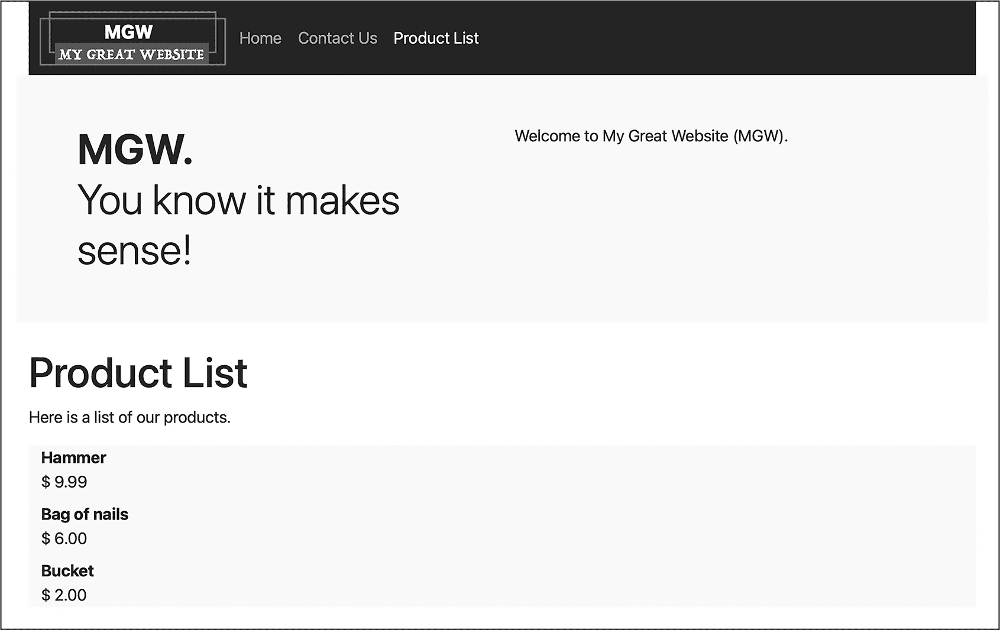
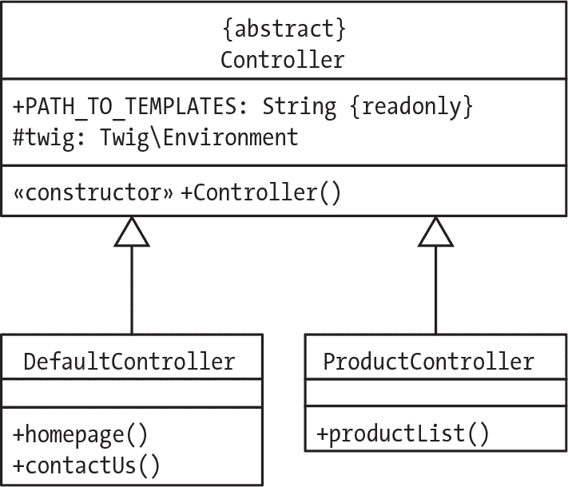

## 第二十二章：22 面向对象的 Web 应用程序结构


在前一章中，我们使用面向对象的 PHP 代码创建了一个由 Application 类控制的简单两页网站。在本章中，我们将重新访问该网站，并探讨如何进一步利用 OOP 技术来改进其结构。你将学习如何使用多个类来划分应用程序逻辑，并看到继承如何帮助这些类之间共享代码，从而减少冗余。

将应用程序逻辑划分到多个类中将有助于使站点更易于管理。这对于一个包含两页的网站来说可能看起来微不足道，但想象一下，如果该网站扩展到包含数十、数百甚至数千页，Application 类很快就会变得不堪重负。此时，必须将代码组织成不同类型的操作，并将这些操作分配给不同的类。

对于我们在第二十一章中的应用程序，需要执行两种主要类型的操作。第一种是在请求进入 Web 服务器时决定做什么。我们可以将此任务分配给一个前端控制器类，该类将检查每个传入的请求，包括其 URL 模式和收到的任何数据变量，并决定返回给 Web 客户端的页面类型。

另一个主要操作是显示请求的页面。我们可以将此任务分配给一系列页面生成控制器类。例如，一个类可以设计用于显示基本页面（如主页和联系我们），另一个用于显示带有安全功能的页面，如登录和更新密码，另一个用于显示产品列表，等等。每个页面控制器类可以在前端控制器已经做出返回适当页面的决策后，继续工作。

### 分离显示和前端控制器逻辑

我们通过将前端控制器决策逻辑（在 Application 类中）与主页和联系我们页面的基本页面生成操作分离，开始改进我们的应用架构。我们将后者移到一个名为 DefaultController 的新类中。这个名字反映了当请求 URL 模式 / 时，主页是默认显示的页面，但该类也可以合理地命名为 BasicPageController、HomePageController 或类似名称。

复制*src/Application.php*，将副本命名为*src/DefaultController.php*，并从这个新 DefaultController 类中删除 run() 方法。还需要将 homepage() 和 contactUs() 方法设为 public，以便它们仍然可以从 Application 类中调用。经过这些更改后，文件应该与清单 22-1 一致。

```
<?php
namespace Mattsmithdev;

use \Twig\Loader\FilesystemLoader;
use \Twig\Environment;

class DefaultController
{
 const PATH_TO_TEMPLATES = __DIR__ . '/../templates';

 private Environment $twig;

 public function __construct()
 {
 $loader = new FilesystemLoader(self::PATH_TO_TEMPLATES);
 $this->twig = new Environment($loader);
 }

    public function homepage()
 {
 $template = 'homepage.xhtml.twig';
 $args = [];

 $html = $this->twig->render($template, $args);
 print $html;
 }

    public function contactUs()
 {
 $template = 'contactUs.xhtml.twig';
 $args = [];

 $html = $this->twig->render($template, $args);
 print $html;
 }
}
```

清单 22-1：声明 DefaultController 类

这个新的 DefaultController 类有一个常量用于模板文件的路径，一个用于渲染模板的 twig 属性，一个构造方法，以及用于显示 Web 应用程序两个页面的 homepage() 和 contactUs() 方法。

现在我们已经将显示网页的逻辑封装到一个单独的类中，我们可以简化 Application 类，让它仅专注于决定显示哪个页面。我们只需要在 Application 中保留 run() 方法，它将决定显示哪个页面并调用相应的 DefaultController 方法。按照 清单 22-2 更新 *src/Application.php*。

```
<?php
namespace Mattsmithdev;

class Application
{
 public function run(): void
 {
 $defaultController = new DefaultController();
 $action = filter_input(INPUT_GET, 'action');
 switch ($action) {
 case 'contact':
              ❶ $defaultController->contactUs();
 break;

 case 'home':
 default:
              ❷ $defaultController->homepage();
 }
 }
}
```

清单 22-2：简化的 Application 类

我们更新后的 Application 类唯一的内容，即 run() 方法，首先创建一个新的 DefaultController 对象。然后，在 switch 语句中，我们根据 HTTP 请求中收到的动作，调用该对象的 contactUs() 方法❶或 homepage() 方法❷来显示相应的页面。

在这种新安排中，Application 充当了真正的前端控制器：它接收来自客户端的请求并决定如何响应。与此同时，生成和打印响应的代码已被委托给 DefaultController 类。对于我们这个简单的两页网站来说，这看起来可能是过度设计，但对于更复杂的网站，这种将前端控制器逻辑与页面生成逻辑分离的做法意味着，当我们为多个页面添加方法时，我们就不会遇到单一的、过于拥挤的 Application 类去做太多的事情。

例如，假设我们有一些页面只能由已登录的用户访问。我们可以将显示这些页面的方法封装在一个 SecureActions 控制器类中。然后，我们会在前端控制器 Application 类中检查用户是否已登录，只有当用户已登录时才调用 SecureActions 的方法。否则，我们可以根据需要向用户提供一个错误页面或登录页面。

将前端控制器动作与页面控制器分离的另一个好处是测试传入 URL 模式中的数据参数。假设我们网站的一些页面通过使用 NewsItem 页面控制器类来显示新闻项。该类的方法需要从数据库或文件存储中检索新闻项的 ID，这取决于 URL 模式，如 */?action=news&id=<id>*。在这种情况下，我们的前端控制器可以检查 URL 中的整数 ID 和新闻动作，然后将该 ID 传递给相应的 NewsItem 对象方法。如果 URL 中没有找到这样的整数 ID，我们可以向用户提供一个错误页面。

在这两个例子中，页面控制器类中的方法可以在已知任何必要的检查和决策（如判断用户是否已登录或检索新闻项 ID）已经完成并得到满足的情况下编写。我们正在将 *做什么*（前端控制器）的决策与定义 *如何做*（页面控制器类方法）的动作分离开来。

### 使用多个控制器类

我们的 DefaultController 类适用于显示像首页这样包含静态内容的简单页面，但具有其他功能的页面会受益于组织在自己的专门控制器类中。例如，一个电子商务网站可能会有几种与产品相关的页面：列出所有可用产品的页面、显示与特定用户查询匹配的产品的搜索结果页面、展示单一产品详情的页面，等等。每个页面可能需要一种与 Product 类的对象交互的方法，可能是将这些对象作为 $products 数组或单个 $product 对象传递到页面模板中。

我们的 DefaultController 类当前无法处理这些与产品相关的操作。我们可以扩展和修改该类，但更合逻辑的做法是创建一个单独的 ProductController 类来处理显示与产品相关页面所需的专门操作。同样，包含登录表单的页面可能有自己的 LoginController 类，显示和编辑购物车的页面可能有自己的 CartController 类，等等。

为了展示多个控制器类的好处，并演示如何轻松地为面向对象的 Web 应用程序添加更多页面和部分，我们将在我们的网站上添加一个产品列表页面，如图 22-1 所示，并且我们将创建一个 ProductController 类来展示这个页面。



图 22-1：我们将创建的产品列表页面

我们的新页面将显示一组产品的名称和价格，其中每个产品都是 Product 类的一个实例（对象）。通过使用 Twig 模板继承，我们将为页面提供与网站其他页面相同的导航栏和头部内容。我们将通过我们新的 ProductController 类来协调页面的显示，该类将专门用于收集可以传递到 Twig 模板中的 Product 对象数组。

为了构建新页面，我们将首先创建 Product 类来表示每个产品的名称和价格。创建一个新文件，*src/Product.php*，其中包含清单 22-3 中的代码。

```
<?php
namespace Mattsmithdev;

class Product
{
    public string $name;
    public float $price;

 ❶ public function __construct(string $name, float $price)
    {
        $this->name = $name;
        $this->price = $price;
    }
}
```

清单 22-3：Product 类

我们为每个 Product 对象声明了两个公共属性：name 和 price。然后，我们声明了一个构造方法 ❶，该方法将在创建新 Product 对象时接受这两个属性的初始值。

现在我们已经有了 Product 类，可以创建 ProductController 类来显示页面。创建一个新的 *src/ProductController.php* 文件，如清单 22-4 所示。

```
<?php
namespace Mattsmithdev;
use \Twig\Loader\FilesystemLoader;
use \Twig\Environment;

class ProductController
{
    const PATH_TO_TEMPLATES = __DIR__ . '/../templates';

    private Environment $twig;

    public function __construct()
    {
        $loader = new FilesystemLoader(self::PATH_TO_TEMPLATES);
        $this->twig = new Environment($loader);
    }

    public function productList()
    {
        $product1 = new Product('Hammer', 9.99);
        $product2 = new Product('Bag of nails', 6.00);
        $product3 = new Product('Bucket', 2.00);
      ❶ $products = [$product1, $product2, $product3];

        $template = 'productList.xhtml.twig';
        $args = [
          ❷ 'products' => $products
        ];

      ❸ $html = $this->twig->render($template, $args);
        print $html;
    }
}
```

清单 22-4：声明 ProductController 类的 src/ProductController.php 文件

ProductController 类的构造方法类似于 DefaultController 类的构造方法：它执行与 Twig 模板协作所需的设置。该控制器与其他控制器的不同之处在于它具有用于显示新产品列表页面的 productList() 方法。

在该方法中，我们创建了三个 Product 对象，并将它们打包成 $products 数组 ❶。然后，我们将 $template 变量设置为 'productList.xhtml.twig'，这是我们将创建的新 Twig 模板文件，用来列出所有产品。接着，我们构建了 $args 数组。它将 'products' 键（将成为一个 Twig 变量名）映射到 $products，这个包含 Product 对象的数组 ❷。然后，我们将 $template 和 $args 变量传递给 Twig，生成页面所需的 HTML 代码 ❸。

接下来，我们需要更新 Application 类中的前端控制器逻辑，当 URL 中的 action 值为 products 时，调用 ProductController 类的 productList() 方法。更新 *src/Application.php*，使其与清单 22-5 相匹配。

```
<?php
namespace Mattsmithdev;

class Application
{
 public function run(): void
 {
 $defaultController = new DefaultController();
      ❶ $productController = new ProductController();
 $action = filter_input(INPUT_GET, 'action');
 switch ($action) {
          ❷ case 'products':
                $productController->productList();
                break;

 case 'contact':
 $defaultController->contactUs();
 break;

 case 'home':
 default:
 $defaultController->homepage();
 }
 }
}
```

清单 22-5：更新 Application 类以处理产品案例

在 run() 方法中，我们创建了 $productController 变量，它引用了一个新的 ProductController 对象 ❶。然后我们向 switch 语句中添加了一个新的 case ❷。当 URL 中的 action 值为 products 时，我们将向 ProductController 对象发送消息，调用它的 productList() 方法。

现在我们可以编写 Twig 模板，循环并显示提供的产品数组。创建新的 Twig 模板文件 *templates/productList.xhtml.twig*，如清单 22-6 所示。

```


Product List

active


<p>
    Here is a list of our products.
</p>

<dl class="container bg-light">
❶ 
    <dt>{{product.name}}</dt>
    <dd> $ {{product.price | number_format(2)}}</dd>

    <dt>(sorry, there are no products to list)</dt>

</dl>


```

清单 22-6：productList.xhtml.twig 模板

像我们其他的页面模板一样，这个模板继承自 *base.xhtml.twig*，从而使其能够访问所有页面共享的内容。因此，我们可以专注于只填充基模板中需要自定义的块。首先，我们重写 pageTitle Twig 块，设置为 "Product List"。然后，我们重写 productsLink Twig 块，将其文本设置为 active，以在导航栏中突出显示该页面的链接（接下来我们将在基模板中添加一个新的导航栏链接）。

接下来，我们重写了主要的 Twig 块，以填充页面特定的主体内容。该内容的核心是一个循环，通过所有的 Product 对象，遍历 products Twig 数组变量，从而生成 HTML 定义列表项 ❶。每个产品的名称作为定义项（<dt>）声明，定义数据元素（<dd>）是该产品的价格，并使用 Twig 的 number_format 过滤器将其格式化为两位小数。如果 products 数组为空，则 Twig else 语句将显示相应的消息。

我们使 Product List 页面正常工作的最后一个步骤是，在基模板的导航栏中添加一个新的项目。更新 *templates/base.xhtml.twig*，使其与清单 22-7 相匹配。

```
--snip--
<body class="container">

<header class="navbar navbar-expand navbar-dark bg-dark">
 

 <ul class="navbar-nav">
 <li class="nav-item">
 <a class="nav-link " href="/">
 Home
 </a>
 </li>
 <li class="nav-item">
 <a class="nav-link " href="/?action=contact">
 Contact Us
 </a>
 </li>
        <li class="nav-item">
            <a class=
"nav-link " href="/?action=products"
            >
                Product List
            </a>
        </li>
 </ul>
</header>
--snip--
```

清单 22-7：将产品列表链接添加到 base.xhtml.twig 模板

我们在导航栏中为 Product List 页面添加了第三个项目。与其他链接一样，我们包含了一个 class 属性，里面有一个名为 productsLink 的 Twig 块，以便在需要时为该链接添加 active 样式。

我们现在已在网站上添加了一个产品列表页面。在新的 ProductController 类中，我们的 productList() 方法创建了一个对象数组，并使用 Twig 模板 *templates/productList.xhtml.twig* 来生成页面的 HTML。向我们的基础 Twig 模板添加一个新的导航链接非常简单。点击该链接会创建一个包含 action=products 的 GET 请求。在我们的 Application 类的前端控制器中，创建了一个 ProductController 的实例，这样当请求 URL 中找到该 action 的值时，就可以调用 productList() 方法。总的来说，产品列表功能的新代码大部分都很好地组织在它自己的控制器类和相应的 Twig 模板中。

### 通过继承共享控制器功能

作为最后一步，让我们使用面向对象编程中的继承原则来简化我们的控制器类。目前，DefaultController 和 ProductController 有几行相同的代码：都声明了一个 PATH_TO_TEMPLATES 常量，都有一个私有的 twig 属性，并且有相同的构造方法来创建一个 Twig\Environment 对象。如果我们需要创建更多的控制器类（如登录安全、购物车等），它们也需要这些相同的代码。

为了避免这些重复，我们将把所有控制器类应该具备的共同属性和行为提取出来，成为一个通用的 Controller 父类。各个具体的控制器类，例如 DefaultController 和 ProductController，将从这个父类继承，并用自己的独特属性和方法扩展它。图 22-2 显示了我们将要创建的类结构的图示。



图 22-2：Controller 父类及其 DefaultController 和 ProductController 子类

我们将把新的 Controller 类声明为抽象类，这意味着我们无法实际创建一个 Controller 对象。这是合适的，因为 Controller 类仅存在于存储所有控制器应该具有的通用代码，并且供我们想要实例化的具体控制器类进行子类化。记住，声明一个类为抽象类是一种告知其他程序员（以及未来的自己）你不希望该类被实例化的方式。

在图 22-2 中，注意加号（+）表示公共方法和常量，以及控制器父类中 twig 属性旁边的井号（#），这表示该属性具有保护可见性，而不是公共或私有可见性。我们不希望这个 twig 属性是公共的，因为它可能会被任何访问到 Controller 对象或其子类的代码错误地更改或使用。然而，如果我们将 twig 属性设为私有，子类方法中的代码也无法访问它。这会造成问题，因为使用 Twig 渲染模板是我们所有控制器类的核心行为。

将 twig 属性设置为 protected 可确保 Controller 的子类可以访问它，同时防止任何位于 Controller 类层次结构之外的代码直接访问它。这是我们在第十九章中探讨的继承概念的一个实用实例。

清单 22-8 显示了 Controller 超类的代码。创建包含此清单代码的 *src/Controller.php* 文件。

```
<?php
namespace Mattsmithdev;

use \Twig\Loader\FilesystemLoader;
use \Twig\Environment;

❶ abstract class Controller
{
    const PATH_TO_TEMPLATES = __DIR__ . '/../templates';

  ❷ protected Environment $twig;

 public function __construct()
    {
        $loader = new FilesystemLoader(self::PATH_TO_TEMPLATES);
        $this->twig = new Environment($loader);
    }
}
```

清单 22-8：Controller 超类

我们将类声明为抽象类，因此它不能被实例化 ❶，并且将 twig 属性指定为 protected，以便子类可以访问它 ❷。除此之外，这段代码与 DefaultController 和 ProductController 类开始时的代码相同。现在，这段代码已经移到 Controller 类中，冗余部分可以被删除。清单 22-9 显示了简化后的 DefaultController 类代码。

```
<?php
namespace Mattsmithdev;

class DefaultController extends Controller
{
 private function homepage()
 {
 $template = 'homepage.xhtml.twig';
 $args = [];

 $html = $this->twig->render($template, $args);
 print $html;
 }

 private function contactUs()
 {
 $template = 'contactUs.xhtml.twig';
 $args = [];

 $html = $this->twig->render($template, $args);
 print $html;
 }
}
```

清单 22-9：简化后的 DefaultController 类，Controller 的子类

我们声明 DefaultController 扩展 Controller 类，从而使其继承构造函数和 twig 属性。由于继承的存在，DefaultController 现在只有两个自己的方法，用于显示主页和联系我们模板。我们可以以类似方式简化 ProductController 类的代码，如清单 22-10 所示。

```
<?php
namespace Mattsmihdev;

class ProductController extends Controller
{
 public function productList()
 {
 $product1 = new Product('Hammer', 9.99);
 $product2 = new Product('Bag of nails', 6.00);
 $product3 = new Product('Bucket', 2.00);
 $products = [$product1, $product2, $product3];

 $template = 'productList.xhtml.twig';
 $args = [
 'products' => $products
 ];

 $html = $this->twig->render($template, $args);
 print $html;
 }
}
```

清单 22-10：简化后的 ProductController 类，Controller 的子类

再次声明类时，我们使用 `extends Controller`，使得 ProductController 能够继承自 Controller。子类特有的唯一方法是 productList()，用于显示产品列表页面。

我们现在成功地使用继承将公共的 twig 属性及其初始化抽象到 Controller 超类中。这简化了两个页面控制器类，同时仍然提供完全相同的功能。

### 总结

在本章中，我们改进了面向对象的 Web 应用程序架构。我们将控制网站的前端控制器逻辑（位于 Application 类中）与显示单个网页的页面控制器逻辑分开。后者被划分为一个抽象的 Controller 超类，其中包含显示任何网页所需的 Twig 设置代码，以及多个子类，这些子类仅包含与显示特定类型页面相关的逻辑代码。

本章中的示例站点只有三个页面：主页、联系我们页面和产品列表页面。然而，本章演示的架构可以轻松扩展到具有数百或数千个页面及复杂功能（如会话交互、购物车、登录安全等）的复杂网站。

### 练习

1.   复制本章中的项目，并为隐私政策添加一个第四个页面。按以下步骤操作：

a.   创建一个 *privacy.xhtml.twig* 模板。

b.   向 DefaultController 类添加一个新的 privacyPolicy() 方法，用于显示新的模板。

c.   在`*base.xhtml.twig*`模板中添加一个隐私政策导航栏链接，URL 为`?action=privacy`。

d.   在`Application`类的`run()`方法中，向`switch`语句添加一个新案例，当 URL 中的`action`值为`privacy`时，调用`DefaultController`对象的`privacyPolicy()`方法。

2.   从练习 1 中复制你的项目，并添加一个用于列出公司员工的第五个页面。按照以下步骤操作：

a.   创建一个`Staff`类来表示员工详情，包括`firstName`、`lastName`和`email`属性。

b.   创建一个名为`StaffController`的`Controller`子类。为其提供一个`list()`方法，该方法创建两个或三个员工对象，并将它们作为数组传递给 Twig 的`render()`方法，以及模板名`*staff.xhtml.twig*`。

c.   在`*base.xhtml.twig*`模板中添加一个新的员工列表导航栏链接，URL 为`?action=staffList`。

d.   基于`productList.xhtml.twig`模板，创建一个*staff.xhtml.twig*模板，使用 Twig 代码循环并打印出接收到的数组中的每个`Staff`对象。

e.   在`Application`类的`run()`方法中，创建一个新的`$staffController`对象，该对象是`StaffController`类的实例。然后添加一个新的`switch`语句案例，如果 URL 中的`action`值为`staffList`，则调用`$staffController->list()`。
