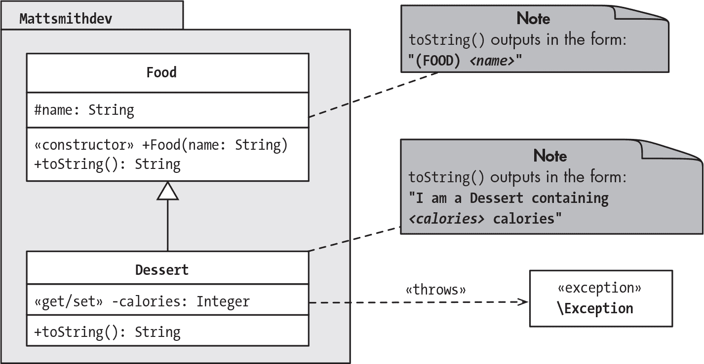
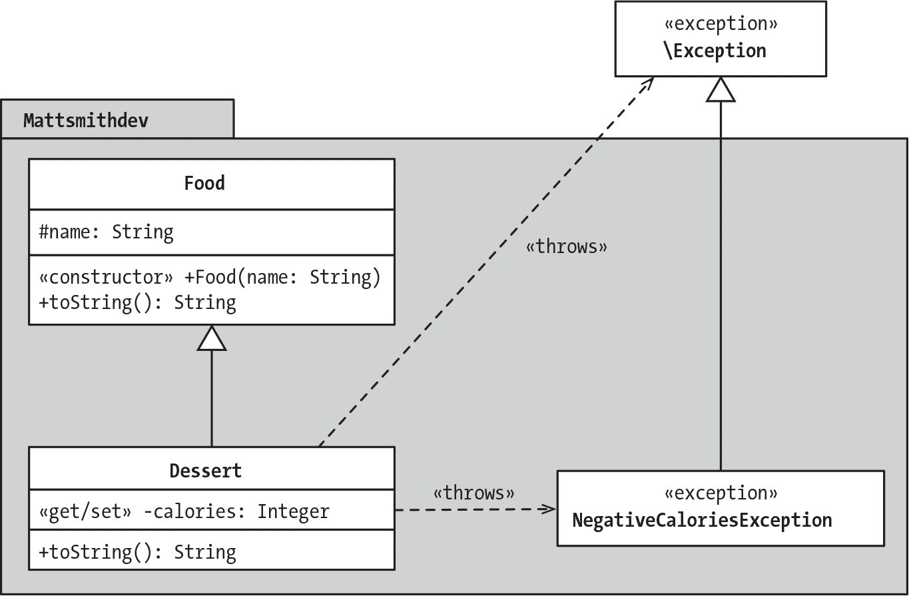

## 第二十三章：23 使用异常处理错误


应用程序并不总是按你想要的方式运行。例如，文件可能因为网络错误而无法上传，或者来自用户或 Web API 的数据可能以某种方式被破坏。在本章中，你将学习如何使用*异常*来预见这些问题并从中恢复，这样当出现问题时，你的应用程序就不会总是崩溃。你将使用 PHP 的通用 Exception 类，以及内置语言中其他更专业化的异常类。你还将看到如何设计自己的自定义异常类，以及如何设计应用程序以安全地处理可能发生的所有异常。

### 异常基础

*异常*是类，提供了一种复杂且可定制的方式来处理和恢复面向对象编程（OOP）中预期的、具有问题的情况。它们不同于*错误*，后者通常是无法恢复的情况或事件，例如计算机系统内存不足或类声明尝试使用一个找不到的常量。PHP 具有一个内置的 Exception 类，用于处理通用问题，以及其他更多针对特定类型错误的专业化异常类。你还可以开发自己的自定义异常类。

基于异常的软件设计允许你按最自然的顺序编写代码，假设一切都会正常工作，然后单独编写代码来捕获并解决可能发生的任何典型问题。这涉及到将测试写入类的方法中，这些方法会生成异常对象，并在发生异常或无效情况时打断程序控制的流程，例如为构造函数或设置方法提供无效的参数。由于有这些测试，可以安全地假设方法中后续出现的代码，如果执行到那一步，表示没有触发抛出异常的条件，代码按预期工作。

异常应用编程的核心是 throw 和 catch 语句。方法使用 throw 语句在发生问题时创建异常对象，这叫做*抛出异常*。throw 语句会中止方法的执行并打断程序的流程。仅仅抛出异常可能会导致致命错误，除非你用 catch 语句*捕获*异常。catch 语句包含的代码是当异常被抛出时执行的代码；这些代码可能允许应用程序从问题中恢复，或者如果无法恢复，则可以记录问题并优雅地结束执行。

在本节中，我们将探讨抛出和捕获异常的基础知识。我们还将介绍 finally 语句，它是在过程结束时执行的代码块，无论是否抛出了异常。

#### 抛出异常

首先，我们将考虑如何抛出未捕获的异常，以导致致命错误并终止应用程序。我们将研究一个常见用例，即当向类的 setter 方法提供无效参数时抛出异常。我们将创建一个变体版本的 Food 和 Dessert 类，基于 第十九章，在 Dessert 类的 setCalories() 方法中添加基于异常的验证行为。如果为新的 Dessert 对象提供负数的 calories 值，则会抛出异常。我们将创建的项目在 图 23-1 的 UML 类图中有所展示。



图 23-1：一个展示 Dessert 类抛出异常的图示

回顾一下，Dessert 是 Food 的一个子类，具有自己的 __toString() 方法和 calories 属性。图示表明，如果 calories 值无效，将抛出异常。

首先，我们声明 Food 类。创建一个新项目，并将 列表 23-1 中的代码放入 *src/Food.php*。

```
<?php
namespace Mattsmithdev;

class Food
{
    protected string $name;

    public function __construct(string $name)
    {
        $this->name = $name;
    }

    public function __toString(): string
    {
        return "(FOOD) $this->name";
    }
}
```

列表 23-1：Food 超类

我们将 Food 类分配到 Mattsmithdev 命名空间，并为其提供一个 name 属性，该属性的访问权限为 protected，以便所有子类可以直接访问。该类有一个简单的构造函数，用于在创建每个新对象时初始化 name，并有一个 __toString() 方法，用于返回 "(FOOD) name" 格式的字符串。

现在，让我们声明 Dessert 作为 Food 的子类。创建 *src/Dessert.php* 并输入 列表 23-2 的内容。

```
<?php
namespace Mattsmithdev;

class Dessert extends Food
{
    private int $calories;

    public function __construct(string $name, int $calories)
    {
        parent::__construct($name);
      ❶ $this->setCalories($calories);
    }
    public function getCalories(): int
    {
        return $this->calories;
    }

    public function setCalories(int $calories)
    {
      ❷ if ($calories < 0) {
            throw new \Exception(
                'attempting to set calories to a negative value');
        }

      ❸ $this->calories = $calories;
    }

    public function __toString(): string
    {
        return "I am a Dessert containing $this->calories!";
    }
}
```

列表 23-2：Dessert 类，如果 calories 值无效，则抛出异常

Dessert 类有一个 calories 属性，在构造函数中通过 setCalories() 方法进行赋值❶。这样，我们将所有的验证逻辑保留在 setter 方法中，因此每一个新的 calories 值都会经过验证，无论是在对象构造时提供，还是通过 setter 在之后的某个时间点提供。

在 setCalories() 中，我们使用 if 语句进行验证❷。如果提供的整数参数 $calories 小于 0，则抛出一个新的 Exception 对象，错误信息为 '试图将 calories 设置为负值'。如果 $calories 参数大于或等于 0，并且没有抛出异常，则代码会继续执行，并将提供的值存储在 Dessert 对象的 calories 属性中❸。

注意抛出异常的语法。我们以 throw 关键字开始，这告诉 PHP 如果 if 语句为真，就中断程序流程。接着我们使用 new 关键字来创建一个新的 Exception 类对象，并传递我们想要显示的错误信息作为参数。由于 Exception 类属于 PHP 的根命名空间，我们必须在前面加上反斜杠（\），而 Dessert 类属于 Mattsmithdev 命名空间。如果没有反斜杠，Exception 会被认为也属于 Mattsmithdev 命名空间。

接下来，我们需要编写一个 *composer.json* 文件来自动加载我们的类。按照 列表 23-3 中的示例创建该文件。

```
{
    "autoload": {
        "psr-4": {
            "Mattsmithdev\\": "src"
        }
    }
}
```

列表 23-3：用于自动加载的 composer.json 文件

一旦你有了这个文件，通过在命令行输入 composer dump-autoload 来生成自动加载脚本。

现在让我们编写一个索引脚本，尝试创建一个 Food 和一个 Dessert 对象。创建*public/index.php*，使其与列表 23-4 匹配。

```
<?php
require_once __DIR__ . '/../vendor/autoload.php';

use Mattsmithdev\Food;
use Mattsmithdev\Dessert;

$f1 = new Food('apple');
print $f1 . PHP_EOL;

$f2 = new Dessert('strawberry cheesecake', -1);
print $f2;
```

列表 23-4：在 index.php 中尝试创建无效的 Dessert 对象

我们读取并执行了自动加载器，并为所需的两个类提供了使用语句。然后我们创建并打印了一个 Food 对象和一个 Dessert 对象，并为后者的卡路里属性传递了无效参数 -1。以下是运行此索引脚本时在命令行中得到的结果：

```
$ **php public/index.php**
(FOOD) apple

Fatal error: Uncaught Exception: attempting to set calories to a negative
value in /Users/matt/src/Dessert.php:23
Stack trace:
#0 /Users/matt/src/Dessert.php(12): Mattsmithdev\Dessert->setCalories(-1)
#1 /Users/matt/public/index.php(10): Mattsmithdev\Dessert->__construct
('strawberry chee...', -1)
#2 {main}
  thrown in /Users/matt/src/Dessert.php on line 23
```

输出的第一行显示，Food 对象已成功创建并打印出来，但由于负卡路里值抛出的异常，我们遇到了致命错误。这个异常被称为*未捕获*，因为我们没有编写任何代码告诉 PHP 如果抛出异常该怎么办。结果，应用程序停止运行并打印出了我们提供的错误消息，随后是*堆栈跟踪*，它报告了代码的执行步骤，显示异常的原因。

堆栈跟踪告诉我们以下内容：

+   #0 显示，当 setCalories() 在*src/Dessert.php* 文件的第 12 行传递 -1 作为参数时，抛出了异常。

+   #1 显示，当调用 Dessert 类的构造方法并传递参数 ('strawberry chee...', -1) 时，setCalories() 被调用了（食物名称字符串已被简化）。

+   #2 报告指出抛出异常的代码位于*src/Dessert.php*文件的第 23 行。

请注意，输出以堆栈跟踪结束，这意味着索引脚本无法打印出 Dessert 对象。未捕获的异常中止了程序的执行，因此索引脚本的最后一行没有执行。

#### 捕获异常

为了避免致命错误并安全地管理异常，我们需要通过在索引脚本中编写 try...catch 语句来*捕获*异常。try 部分指示在正常情况下我们想要做的事情，而 catch 部分指示在抛出异常时该做什么。

通过捕获异常，我们可以防止应用程序用户看到致命错误和随之而来的堆栈跟踪。除了尴尬且不友好，打印堆栈跟踪会“泄漏”关于 Web 应用程序代码结构的信息（例如，在前面的例子中，我们泄漏了文件夹名*src*和类文件名*Dessert.php*）。虽然堆栈跟踪并不是严重的安全漏洞问题，但任何这样的信息泄漏都可能对攻击者有帮助，因此应该尽可能避免。捕获异常使我们可以决定如何处理异常数据，以及当出现问题时用户将看到什么。

> 注意

*在第二十四章中，我们将探讨日志记录，它允许存储有用的调试数据，如堆栈跟踪，供开发人员和网站管理员访问，同时不向任何公共网站访问者或软件客户端发布这些信息。*

为了捕获当输入负的卡路里值时引发的异常，请更新*public/index.php*脚本以匹配示例 23-5。

```
<?php
require_once __DIR__ . '/../vendor/autoload.php';

use Mattsmithdev \Food;
use Mattsmithdev \Dessert;

❶ try {
 $f1 = new Food('apple');
 print $f1 . PHP_EOL;

 $f2 = new Dessert('strawberry cheesecake', -1);
 print $f2;
❷} catch (\Exception $e) {
    print '(caught!) - an exception occurred!' . PHP_EOL;
  ❸ print $e->getMessage();
}
```

示例 23-5：向 index.php 添加`try...catch`语句

以前创建并打印 Food 和 Dessert 对象的代码现在放在一个`try`块中❶。如果在此过程中发生任何异常，PHP 会检查异常的类是否与接下来的`catch`块中指定的类匹配❷。如果类匹配，就会执行`catch`块。在本例中，`catch`语句是针对`\Exception`类的对象，如`catch`关键字后面的小括号所指定的。小括号中的变量`$e`将成为捕获到的 Exception 对象的引用。

在`catch`块中，我们打印出消息'(caught!) - 发生了异常!'，并跟随一个换行符。然后，我们通过 Exception 对象的`public getMessage()`方法打印 Exception 对象中的消息❸。这就是我们之前定义的“尝试将卡路里设置为负值”的消息。

现在我们已经添加了捕获异常的代码，请尝试再次在命令行运行 index 脚本。你应该会看到如下输出：

```
$ **php public/index.php**
(FOOD) apple
(caught!) - an exception occurred!
attempting to set calories to a negative value
```

再次，Food 对象已成功创建并打印。接下来，我们看到从`catch`语句内部打印的消息，后跟来自 Exception 对象本身的消息。在这个示例中，捕获异常后，我们仍然为用户打印出一条消息，但我们已经控制了显示的信息。由于我们正在使用`catch`语句处理异常，现在没有泄漏任何堆栈跟踪信息。

#### 以`finally`语句结束

`finally`语句是一个代码块，不管是否抛出异常，都会被执行。它写在`try`和`catch`语句之后，通常包含*清理代码*，用于优雅地结束任何已启动的进程。例如，你可以使用`finally`语句来确保任何文件流或数据库连接都会被关闭。

让我们在 index 脚本中添加一个`finally`语句，以便每次运行时都优雅地关闭应用程序，即使抛出了异常。修改*public/index.php*以匹配示例 23-6。

```
<?php
require_once __DIR__ . '/../vendor/autoload.php';

try {
 $f1 = new Food('apple');
 print $f1 . PHP_EOL;

 $f2 = new Dessert('strawberry cheesecake', -1);
 print $f2;
} catch (\Exception $e) {
 print '(caught!) - an exception occurred!' . PHP_EOL;
 print $e->getMessage();
} finally {
    print PHP_EOL  . '(finally) -- Application finished --';
}
```

示例 23-6：向 index.php 添加`finally`语句

我们声明了一个`finally`块，在`try`或`catch`块结束后打印一条简单的消息。下面是运行更新后的 index 脚本的结果：

```
$ **php public/index.php**
(FOOD) apple
(caught!) - an exception occurred!
attempting to set calories to a negative value
(finally) -- Application finished --
```

`finally`块中的消息会在输出的最后打印出来，显示异常消息之后。

为了确保即使 catch 语句没有执行，finally 语句仍然会执行，我们将更新脚本，确保 Dessert 对象的卡路里数量是有效的，也就是说不会抛出异常。按照 列表 23-7 中的方式修改 *public/index.php* 中的 Dessert 对象实例化代码。

```
--snip--
    $f2 = new Dessert('strawberry cheesecake', **500**);
--snip--
```

列表 23-7：在 index.php 中创建有效的 Dessert 对象

当你现在运行 index 脚本时，你应该能看到 Food 和 Dessert 对象的消息，以及最终的消息：

```
$ **php public/index.php**
(FOOD) apple
I am a Dessert containing 500 calories!
(finally) -- Application finished --
```

输出确认 Dessert 对象已成功创建且没有抛出异常，同时 regardless 的 finally 语句块仍然会执行。### 使用多个异常类

除了 PHP 的根 Exception 类外，标准 PHP 库（SPL）还提供了其他几种异常类，例如 InvalidArgumentException 类。这些异常类都与 Exception 类通过继承层次结构连接在一起，作为其子类、子类的子类，依此类推。你也可以创建自定义异常类，这些类是某个内置异常类的子类。

乍一看，可能觉得没有必要使用 Exception 的子类，因为我们可以为每种情况创建具有自定义消息的基本 Exception 对象来抛出异常。然而，通过编写抛出不同 Exception 子类对象的代码，你可以包含多个 catch 语句，每个语句处理一个 Exception 子类，从而能够针对每种类型的异常做出不同的响应。

例如，你可以将多个验证检查写入一个 setter 方法，并根据哪个验证检查失败抛出特定的异常类。然后，你可以为每个异常类编写一个单独的 catch 语句，这样每种类型的异常都会生成定制的响应。通常，你最后会以一个 catch 语句来捕获通用的 Exception 对象，这样你就能捕获任何你没有提前考虑到的异常。我们将在接下来的章节中查看这种方法是如何工作的。

#### 其他内置异常类

让我们使用另一个内置的 PHP 异常类，并结合根 Exception 类来使用。我们将更新 Dessert 类的 setCalories() 方法，使其抛出两种异常类对象之一，以验证接收到的 $calories 参数。我们的验证测试如下：

+   如果 $calories 小于 0，抛出一个 \InvalidArgumentException 对象，因为甜点不能有负卡路里。

+   如果 $calories 大于 5000，抛出一个通用的 \Exception 对象，因为那是 *太多了*，一个甜点不可能有这么多卡路里。

更新 *src/Dessert.php* 中的 setCalories() 方法，使其符合 列表 23-8。

```
public function setCalories(int $calories): void
{
 if ($calories < 0) {
        throw new \InvalidArgumentException(
            'attempting to set calories to a negative value');

    }

    if ($calories > 5000) {
        throw new \Exception('too many calories for one dessert!');
    }

 $this->calories = $calories;
}
```

列表 23-8：更新 setCalories() 方法以抛出不同的异常类

首先，我们将当接收到负数作为参数时抛出的异常类更改为\InvalidArgumentException。再次注意，在类名之前有一个斜杠，表示这个类声明在根 PHP 命名空间下。然后我们添加第二个验证测试：当卡路里数大于 5000 时，将抛出一个通用的\Exception 类对象。如果代码执行通过了这两个 if 语句而没有抛出任何异常，我们将像之前一样把提供的值存储在对象的 calories 属性中。

接下来，我们需要更新索引脚本。我们将编写多个 catch 语句，分别适当地处理每个异常对象类。然后，我们将为 Dessert 对象的 calories 属性尝试不同的值，以测试验证逻辑。编辑*public/index.php*，以匹配示例 23-9。

```
<?php
require_once __DIR__ . '/../vendor/autoload.php';

use Mattsmithdev\Food;
use Mattsmithdev\Dessert;

$calories = -1; // Negative invalid argument
$calories = 6000; // General exception
$calories = 500; // Valid

try {
    $f2 = new Dessert('strawberry cheesecake', $calories);
    print $f2;
} ❶ catch (\InvalidArgumentException $e) {
    print '(caught!) - an Invalid Argument Exception occurred!' . PHP_EOL;
    print $e->getMessage();
} ❷ catch (\Exception $e) {
    print '(caught!) - a general Exception occurred!' . PHP_EOL;
    print $e->getMessage();

} finally {
 print PHP_EOL . '(finally) -- Application finished --';
}
```

示例 23-9：public/index.php 脚本中的多个 catch 语句

我们从为$calories 变量赋不同值的三个赋值语句开始。为了彻底测试脚本，将除一个赋值语句外的所有语句注释掉，每次选择一个不同的赋值语句。在 try 块中，我们创建一个新的 Dessert 对象，并将$calories 变量作为参数传入。然后，我们创建两个 catch 语句，一个用于 InvalidArgumentException 类 ❶，另一个用于通用 Exception 类 ❷。每个 catch 语句都会打印不同的消息，并附带从异常对象中获取的消息，使用$e->getMessage()。

表 23-1 展示了$calories 的三个值的输出，证明我们的基于异常的逻辑如预期般工作。

表 23-1：卡路里值的输出

| $calories 的值 | 程序输出 |
| --- | --- |
| -1 | （已捕获！）- 发生了一个无效参数异常！尝试将卡路里设置为负值（最终）-- 应用程序完成 -- |
| 6000 | （已捕获！）- 发生了一个通用异常！一个甜点的卡路里太多了！(最终) -- 应用程序完成 -- |
| 500 | 我是一个含有 500 卡路里的甜点！（最终）-- 应用程序完成 -- |

请注意，-1 和 6000 的值分别触发了它们各自的异常类，而 500 允许成功创建并打印 Dessert 对象。

#### 自定义异常类

PHP 为你提供了编写自定义异常类的灵活性，只要它们是 Exception 或其他内置 PHP 异常类的子类。此外，许多第三方库带有自己专门为该库中的方法设计的自定义异常类。无论你是在编写自己的异常类还是使用他人的，自定义异常类都能让你有更多的自由来组织代码，以便针对各种预期问题做出不同的响应。

让我们为 Dessert 项目添加一个自定义异常类：Mattsmithdev\NegativeCaloriesException。我们将更新项目，以抛出该类的异常对象，而不是 InvalidArgumentException 类。 图 23-2 显示了我们的 Dessert 对象可以抛出的两类异常。请注意，NegativeCaloriesException 类位于 Mattsmithdev 命名空间内，而 Exception 类在外部，因为它位于根 PHP 命名空间中。



图 23-2：Dessert 对象可以抛出的两类异常

首先，在 *src/NegativeCaloriesException.php* 中创建一个新类，包含 列表 23-10 中的代码。

```
<?php
namespace Mattsmithdev;

class NegativeCaloriesException extends \Exception
{
}
```

列表 23-10：自定义的 NegativeCaloriesException 类

我们将 NegativeCaloriesException 声明为根 \Exception 类的子类。它不包含任何方法。由于它没有自己的构造方法，因此将继承其 Exception 超类的构造方法，从而允许它接收用于显示的消息。

现在让我们更新 Dessert 类的 setCalories() 方法，当提供的卡路里值为负时抛出 NegativeCaloriesException 对象。与之前的示例一样，当提供的值大于 5000 时，我们将抛出一个通用的 Exception 对象。更新 *src/Dessert.php* 中的 setCalories() 方法以匹配 列表 23-11。

```
public function setCalories(int $calories)
{
 if ($calories < 0) {
        throw new NegativeCaloriesException(
            'attempting to set calories to a negative value');
    }

 if ($calories > 5000) {
 throw new \Exception('too many calories for one dessert!');
 }

 $this->calories = $calories;
}
```

列表 23-11：在 setCalories() 方法中抛出自定义异常

当接收到的参数为负数时，我们将抛出的异常类更改为 NegativeCaloriesException 类的对象。由于这个新类与我们的 Dessert 类在同一个命名空间中，因此我们不在类标识符前加反斜杠。

接下来，我们需要更新 index 脚本中的 catch 语句，以处理新的自定义异常类。按照 列表 23-12 中所示修改 *public/index.php*。

```
<?php
require_once __DIR__ . '/../vendor/autoload.php';

use Mattsmithdev\Dessert;
use Mattsmithdev\NegativeCaloriesException;

$calories = -1; // Negative invalid argument
$calories = 6000; // General exception
$calories = 500; // Valid

try {
 $f2 = new Dessert('strawberry cheesecake', $calories);
 print $f2;
} catch (NegativeCaloriesException) {
 print '(caught!) - a Negative Calories Value Exception occurred!' . PHP_EOL;
 print $e->getMessage();
} catch (\Exception $e) {
 print '(caught!) - a general Exception occurred! ' . PHP_EOL;
 print $e->getMessage();
} finally {
 print PHP_EOL . '(finally) -- Application finished --';
}
```

列表 23-12：在 index.php 脚本中捕获自定义异常对象

我们添加一个 use 语句，以便可以在不带 Mattsmithdev 命名空间前缀的情况下引用 NegativeCaloriesException 类。然后我们为该类的异常创建一个 catch 语句，打印适当的消息。如果你尝试创建一个卡路里为 -1 的新 Dessert 对象，确认抛出 NegativeCaloriesException，以下是你应该得到的输出：

```
$ **php public/index.php**
(caught!) - a Negative Calories Value Exception occurred!
attempting to set calories to a negative value
(finally) -- Application finished --
```

测试负值是一个简单的示例，但它说明了创建 Exception 的自定义子类是多么简单，这使你能够编写不同的逻辑来处理运行时预期的不同问题。

### 调用栈冒泡

如果一个异常发生在某个代码块中并且没有被该代码块捕获，它将 *冒泡到* 调用栈中调用该代码块的代码。如果在那里没有捕获，它将继续向上冒泡，经过逐渐更高层次的代码，直到它被捕获并处理，或者到达调用栈的顶部。如果异常在顶层代码块中没有被捕获，则会导致致命错误，正如我们在本章的第一个示例中看到的那样。基于这个原因，建议在应用程序的顶层代码中加入一些代码，以捕获任何可能已经冒泡到调用栈顶部的异常。

正如你所看到的，典型的面向对象 PHP Web 应用程序的控制流程是从索引脚本开始的，该脚本创建一个 Application 类的对象并调用其 run() 方法。这又触发了其他对象的创建和其他方法的调用。这些活动中可能会抛出异常。你可以尝试在 Application 类中捕获所有这些异常，但任何未捕获的异常最终都会冒泡到索引脚本，并应在那里捕获，以避免致命错误。

为了演示这一过程，我们将更新我们的 Dessert 项目，将原本位于索引脚本中的代码封装进 Application 类中。这个类将负责捕获在创建 Dessert 对象时抛出的任何 NegativeCaloriesException 对象，但我们将允许其他杂项异常冒泡到调用栈的顶部。然后，我们将在顶层索引脚本中捕获这些异常。

首先，让我们更新我们的索引脚本，以创建一个 Application 对象并调用它的 run() 方法。我们将把这段代码包装在 try...catch 语句中，以处理任何未被捕获的异常，并在其中添加一个 finally 语句来优雅地关闭应用程序。我们还将通过在 catch 和 finally 块打印的消息前添加 (index.php) 前缀，明确表示这些消息是来自这个索引脚本。修改 *public/index.php* 以匹配 列表 23-13。

```
<?php
require_once __DIR__ . '/../vendor/autoload.php';

use Mattsmithdev\Application;

try {
    $app = new Application();
    $app->run();
} catch (\Exception $e) {
    print '(index.php) Exception caught!';
}finally {
 print PHP_EOL;
    print '(index.php) finally -- Application finished --';
}
```

列表 23-13：创建 Application 对象的简化 index.php 脚本

在 try 块中，我们创建一个 Application 对象，将该对象的引用存储在 $app 变量中，并调用其 run() 方法。如果有任何未捕获的 Exception 对象从 try 块语句中冒泡出来，我们将使用 catch 块来处理它们并打印一条消息。由于每个异常对象都是 Exception 类的一个实例（无论是直接的还是作为子类），因此这个 catch 语句作为一个捕获所有异常的通用处理器，用于处理在程序执行过程中抛出的但未在代码中其他地方捕获的异常。我们还添加了一个 finally 块，它会打印最终消息，无论是否抛出异常。

现在让我们编写 Application 类。创建一个名为 *src/Application.php* 的新文件，以匹配 列表 23-14。

```
<?php
namespace Mattsmithdev;

class Application
{
    public function run(): void
    {
        $calories = -1; // Negative invalid argument
        $calories = 6000; // General exception
        $calories = 500; // Valid

        try {
            $f2 = new Dessert('strawberry cheesecake', $calories);
            print $f2;
        } catch (NegativeCaloriesException $e) {
            print
'(Application->run) - Negative Calories Value Exception caught!';
        }
    }
}
```

列表 23-14：Application 类

我们声明了一个包含 `run()` 方法的 Application 类，该方法包含了来自旧版 index 脚本的许多语句。和之前一样，我们为 `$calories` 变量包含了三个赋值语句，你可以选择性地注释掉这些语句来测试项目。然后，我们在一个 try 块中创建并打印一个新的 Dessert 对象，并使用 catch 块来处理 NegativeCaloriesException 对象。表 23-2 显示了在使用不同 `$calories` 值时运行应用程序的结果。

表 23-2：使用调用栈冒泡捕获异常

| $calories 的值 | 程序输出 |
| --- | --- |
| 500 | 我是一个包含 500 卡路里的甜点！ (index.php) 最终 -- 应用程序结束 -- |
| -1 | (Application->run) - 捕获到负卡路里值异常！ (index.php) 最终 -- 应用程序结束 -- |
| 6000 | (index.php) 捕获到异常！ (index.php) 最终 -- 应用程序结束 -- |

当使用有效值 500 时，对象的属性会被打印出来。当值为 -1 时，NegativeCaloriesException 会在 Application 类的 `run()` 方法内被捕获。当使用过高的值 6000 时，Application 类的 `run()` 方法未能捕获抛出的通用异常，因为该方法只会捕获 NegativeCaloriesException 对象。因此，异常会冒泡到 index 脚本，在那里会命中通用的 catch 块。在所有情况下，输出都会以 index 脚本中 finally 块的消息结束。

向 index 脚本添加通用的 try...catch 语句可以确保任何冒泡上来的未捕获异常都会被处理，这意味着应用程序将避免与异常相关的运行时错误。同时，处理更具体异常的代码，如我们自定义的 NegativeCaloriesException，位于应用程序代码的更低级别，这样可以保持 index 脚本简洁且结构良好。

### 总结

本章介绍了如何处理异常。你学习了如何在预期的有问题情况发生时通过编写 throw 语句来创建异常，并通过 try...catch...finally 结构来管理异常。所有异常都是 PHP 顶级 \Exception 类的实例，但我们讨论了如何通过使用提供的异常子类（如 InvalidArgumentException）或声明自定义异常子类来优化程序逻辑。

我们还探讨了一种通用的应用架构，该架构利用未捕获异常的冒泡。当预期的特定异常发生时，可以在类方法中捕获，而任何剩余的异常则可以在应用程序顶层的 index 脚本中捕获。

### 练习

1.   创建一个新项目，并实现一个简单的 Product 类，该类具有私有的 name 和 price 属性，针对每个属性的公共访问方法，以及一个构造函数，该构造函数接收每个属性的新值并使用 setter 方法设置它们。添加以下验证：

a.   如果收到负值的价格，将抛出 InvalidArgumentException。

b.   如果收到的价格大于 1000000，将抛出一个通用 Exception。

c.   如果为 name 属性提供一个空字符串，将抛出 InvalidArgumentException。

创建一个*composer.json*文件和一个索引脚本，尝试使用有效和无效的名称和价格创建一个 Product 对象。然后用 try...catch 语句包裹你的索引代码，这样你就可以处理代码抛出的各种异常。

2.   复制你的第 1 题解答，并引入一个类似于清单 23-14 中的 Application 类。按以下方式重构你的代码：

a.   在你的 Application 类的 run()方法中创建 Product 对象。捕获 InvalidArgumentException 对象，并在 run()方法中打印相应的消息。

b.   在索引脚本中，创建一个 Application 对象并调用其 run()方法。捕获任何向上传播的通用 Exception 对象并打印相应的消息。

3.   复制你的第 2 题解答，并引入一个名为 EmptyStringException 的自定义异常，该异常由 setName()方法抛出。在 Application 类的 run()方法中添加一个适当的 catch 块，以捕获并处理此异常。
