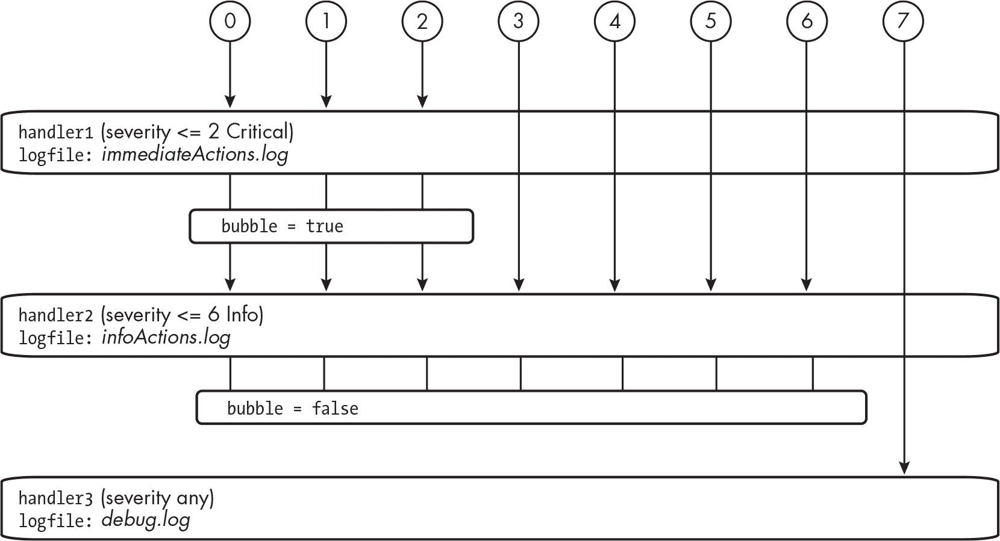
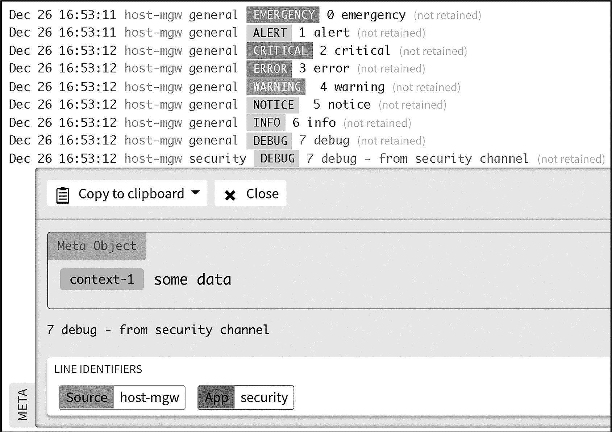

## 第二十四章：24 日志事件、消息和事务


几乎所有的实时商业 Web 应用程序都会保持一个*日志*，记录应用程序在运行过程中生成的消息、错误、事件、性能摘要和其他信息。在本章中，我们将探讨如何为 PHP Web 应用程序维护日志，以便您在应用程序发生问题时能够分析性能并做出响应。您将了解 PHP 的内置日志资源，以及 Monolog，一个流行的第三方 PHP 日志包，还将学习如何将日志消息写入不同的地方。

有时，日志会记录审计事件，例如查看电子货币交易是否存在异常。其他时候，交易会被记录用于备份和恢复目的。例如，如果在向数据库写入信息时出现问题，可以通过恢复到已知时间点的备份（称为*镜像*或*快照*），然后重新运行该快照创建后记录的交易序列，从而将数据库恢复到正确的状态。日志记录也与异常密切相关，我们在上一章中已经讨论过。当抛出异常时，它可以被记录到系统日志中，供日后分析。

### 内置 PHP 日志资源

日志记录是服务器编程的核心部分，因此 PHP 提供了许多资源来简化这一过程。这些资源包括一组预定义常量，表示不同的日志严重性级别，以及用于将日志消息写入文件的内置函数。我们现在将探讨这些功能。

#### 严重性级别的预定义常量

大多数计算机日志系统允许根据特定的紧急性或重要性级别对消息进行分类。为此，PHP 提供了八个预定义常量，用于确定日志的严重性级别。这些严重性级别从 0 到 7 编号，从最紧急到最不紧急，对应于 RFC 5424 中定义的八个级别，RFC 5424 是 IETF 制定的广泛使用的 syslog 协议标准。您可以在 *[`www.rfc-editor.org/rfc/rfc5424`](https://www.rfc-editor.org/rfc/rfc5424)* 查找该协议。

您可以结合使用 PHP 常量和内置的 syslog() 函数（我们将在接下来的内容中讨论），生成适当严重性级别的日志消息。表 24-1 显示了八个严重性级别，它们的 RFC 5424 级别名称以及其含义的摘要。

表 24-1：来自 RFC 5424 的日志消息严重性级别

| Syslog 严重性值 | RFC 5424 日志级别 | 含义 |
| --- | --- | --- |
| 0 | 紧急 | 系统无法使用或不可用。 |
| 1 | 警报 | 发生了问题，需要立即采取行动。 |
| 2 | 严重 | 问题即将发生，必须立即解决。 |
| 3 | 错误 | 发生了一个非紧急但需要在一定时间内采取行动的故障。 |
| 4 | 警告 | 需要采取行动，因为该事件可能导致错误。 |
| 5 | 通知 | 发生了一个预期但重要的事件，值得记录日志，但不需要采取任何行动。 |
| 6 | 信息 | 发生了一个预期的事件，供报告和度量使用。 |
| 7 | 调试 | 用于软件开发人员记录支持当前调试和代码分析的详细信息。 |

表 24-2 显示了与 RFC 5424 日志级别相对应的 PHP 八个命名常量，以及这些常量在 macOS、Unix 和 Windows 系统中的整数值。

表 24-2：PHP 日志级别常量

| PHP 常量 | macOS 和 Unix 值 | Windows 值 |
| --- | --- | --- |
| LOG_EMERG | 0 | 1 |
| LOG_ALERT | 1 | 1 |
| LOG_CRIT | 2 | 1 |
| LOG_ERR | 3 | 4 |
| LOG_WARNING | 4 | 5 |
| LOG_NOTICE | 5 | 6 |
| LOG_INFO | 6 | 6 |
| LOG_DEBUG | 7 | 6 |

在 macOS 和 Unix 系统中，每个常量都有一个整数值，对应八个严重性级别中的一个。例如，LOG_EMERG 常量在 macOS 和 Unix 中的值为 0。如果你在 Windows 服务器上运行 PHP，这些常量的值会有所不同，因为系统头文件的标准不同。无论哪种系统，日志级别的严重性随着常量值的减少而增加，这与 RFC 5424 的原则一致。在本章中，我们将以 macOS 和 Unix 的值为准。

各种严重性级别有其传统用途。例如，在测试和调试代码时，通常使用 LOG_DEBUG 严重性，可能会将这些日志条目定向到自己的调试日志文件中。你可能会将关于标准、非关键问题的消息记录为 LOG_INFO 或 LOG_NOTICE 严重性，比如用户尝试上传过大或类型错误的文件。这样，如果同样的问题多次发生，就可以考虑对用户界面或文件大小进行改进。应当充分考虑那些可能导致错误的事件，并将其记录为 LOG_ERR 严重性。同样，编写异常处理代码时，识别那些可能影响 Web 应用程序整体功能的异常，并使用 LOG_EMERG、LOG_ALERT 或 LOG_CRIT 严重性进行记录，始终是非常重要的。

按照严重性级别对日志消息进行分类，可以让你设计出具有逻辑响应的计算机系统，以不同的方式应对不同重要性的日志消息。例如，当新的日志消息出现在前三个严重性级别（紧急、警报或危急）时，日志系统规则可能会执行诸如发送短信和自动电话呼叫给值班技术人员等操作。与此同时，较低重要性的消息可能会被写入归档文件，或者通过 Web API 发送到云日志系统。我们将在《根据严重性管理日志》一节中详细讨论如何为不同的严重性级别创建定制化响应，第 466 页。

#### 日志功能

PHP 有两个内置的函数用于记录消息：error_log() 和 syslog()。它们的区别在于消息记录的位置。

error_log() 函数将消息附加到 PHP 错误日志文件，该文件的位置由 *php.ini* 文件中的 error_log 路径或服务器日志设置定义，或者可以通过调用函数时作为参数传递到其他位置。（有关如何定位系统的 *php.ini* 文件的信息，请参见 附录 A）

相比之下，syslog() 函数将消息附加到计算机系统的通用 syslog 文件中。表 24-3 显示了该文件在 macOS、Unix 和 Windows 上的默认名称和位置。

表 24-3：Syslog 文件的默认名称和位置

| 操作系统 | 文件名 | 位置 |
| --- | --- | --- |
| macOS | system.log | /var/log |
| Unix | syslog | /etc |
| Windows | SysEvent.evt | C:\WINDOWS\system32\config\ |

在设置应用程序时，选择记录消息的位置可能会很困难：你是想为这个应用程序单独设置日志文件，还是想将 PHP Web 应用程序的日志记录到与其他 PHP 日志相同的位置，或者你希望将应用程序的日志添加到计算机系统的通用日志系统中？正如你将在 第 472 页 的“记录到云端”中看到的，使用第三方日志库提供了更多的选择：选择文件名和位置、使用多个文件记录不同类型的日志，甚至可以记录到 Web API。

选择使用哪个函数在一定程度上取决于项目的性质。对于个人项目开发，将日志记录到本地机器可能是合理的，而对于需要报告实时生产系统的关键任务系统，可能更适合将日志记录到 Web 服务器或云端的文件中，甚至可能是你所工作组织的要求和标准所规定的。

将日志记录到系统的通用 syslog 文件中的一个优点（就像 PHP 的 syslog() 函数一样）是，所有应用程序和进程的日志都集中在一个地方，因此你可以查看与你的 Web 应用程序相关的其他系统问题（例如内存或处理速度问题）。此外，你可以使用多种应用程序来查看、搜索和分析通用日志系统，无论是 Windows、macOS 还是 Unix。然而，通用日志文件很大，并且不断被正在运行的进程附加内容，因此在开发和运行生产站点时，将 Web 应用程序的日志定向到专用文件（如 error_log() 函数那样）通常是更有意义的。有鉴于此，我们来看看这两个内置的 PHP 日志记录函数是如何工作的。

你可以通过写出类似以下的语句，使用 error_log() 将消息记录到 PHP 错误日志文件：

```
error_log('Some event has happened!');
```

将你想要记录的消息作为参数传递给函数。默认情况下，这条消息将被附加到*php.ini*设置中指定的文件中。你可以通过命令行使用 cat（macOS/Unix）或 type（Windows）命令查看该文件，后跟文件名。例如，以下是我在 macOS 笔记本上通过之前的 error_log()调用添加到日志文件中的条目（该文件名为*php_error.log*）：

```
$ **cat php_error.log**
[28-Jan-2025 22:08:16 UTC] Some event has happened!
```

日志条目以时间戳开始，后跟作为参数传递给函数的消息字符串。

syslog()函数接受两个参数。第一个是表示严重性级别的整数（0 到 7）之一，或者是用该整数值声明的常量。这正是之前讨论过的 PHP 内建常量的作用所在。第二个参数是要记录到系统通用 syslog 文件中的字符串消息。以下是调用该函数的示例：

```
syslog(LOG_WARNING, 'warning message from Matt');
```

我们使用 LOG_WARNING 常量作为第一个参数，PHP 将其定义为值 4，对应于 RFC 5424 严重性等级表中的第五级。此事件需要采取行动，因为它可能导致错误。

syslog 文件通常包含数百甚至数千条条目，记录了来自许多系统程序和应用程序的事件和操作。与其显示整个日志文件，过滤出你需要的条目更为有用。对于 macOS 或 Unix，你可以使用 grep 查看包含特定字符串的条目。Windows 有等效的 findstr 命令。以下是使用 grep 查看刚刚通过 syslog()函数创建的日志条目的示例：

```
$ **grep "from Matt" system.log**
Jan 28 22:15:15 matts-MacBook-Pro-2 php[4304]: warning message from Matt
```

这里我使用 grep 只显示包含字符串“from Matt”的日志条目。（在 Windows 中，命令将是 findstr "from Matt" SysEvent.evt。）在我的 Apple MacBook 上，syslog()创建的日志条目以格式化日期开头，后跟计算机名称（matts-MacBook-Pro-2）。接下来是附加到日志的程序或服务（在这种情况下是 php），然后是进程 ID（4304），这是操作系统分配给每个活动进程的唯一标识符。最后，条目以传递给 syslog()函数的消息字符串结束。Windows 中的每个 syslog 条目的内容类似，包含事件类型、事件 ID、来源、消息等。

> 注意

*如果你不习惯在命令行查看 syslog 文件，许多应用程序可以用来查看、过滤和分析这些文件。例如，Windows 有事件查看器，而 macOS 有控制台。*

### Monolog 日志库

在 Web 应用程序中，日志记录非常常见，因此存在多个第三方 PHP 库来帮助处理日志，其中包括流行的 Monolog 库。大多数 PHP Web 框架和云日志系统都与 Monolog 提供集成。它通常是许多 PHP 程序员学习使用的第一个日志系统，有时也是唯一一个。这个库使得开发定制化、复杂的日志记录策略变得更加容易，不同类型的日志条目会以不同的方式处理，日志消息可以记录到各种位置，包括本地文件、基于云的系统等。

Monolog 遵循 PSR-3，这是一个针对 PHP 日志系统的标准推荐。该标准使用与 RFC 5424 syslog 标准相同的八个日志严重性级别。为了符合 PSR-3 标准，日志接口应为每个日志级别提供方法。每个方法应要求一个字符串参数，该字符串包含要记录的消息，并且可以选择性地提供一个数组，以提供有关消息上下文的更多信息。

> 注意

*Monolog 的源代码和文档可以在 GitHub 上找到，网址是* [`github.com/Seldaek/monolog`](https://github.com/Seldaek/monolog)*，你还可以在* [`www.php-fig.org/psr/psr-3/`](https://www.php-fig.org/psr/psr-3/)* *了解更多关于 PSR-3 标准的内容。*

让我们创建一个使用 Monolog 记录消息的示例项目。创建一个新的项目文件夹，然后使用命令 composer require monolog/monolog 来添加 Monolog 库。现在，你应该有一个 *composer.json* 文件和一个包含自动加载器和 Monolog 库类的 *vendor* 文件夹。接下来，在 *public/index.php* 中创建一个包含 列表 24-1 代码的索引脚本。

```
<?php
require_once __DIR__ . '/../vendor/autoload.php';

use Monolog\Logger;
use Monolog\Handler\StreamHandler;

$logFile = __DIR__ . '/../logs/mylogs.log';

$logger = new Logger('demo');
$logger->pushHandler(new StreamHandler($logFile));

❶ $logger->warning('I am a warning.');
$logger->error('I am a test error!');
```

列表 24-1：在 public/index.php 中设置和使用 Monolog

如常，我们的索引脚本通过加载自动加载器脚本开始。然后我们为 Monolog 的 Logger 和 StreamHandler 类提供使用声明。接下来，我们声明了一个指向 *logs* 文件夹中的 *mylogs.log* 文件的路径，用于记录日志消息，但你也可以提供任何你想要的文件路径。第一次 Monolog 尝试将消息附加到这个文件时，它会在文件和目录不存在时创建它们。

接下来，我们创建一个新的 Logger 对象来管理日志，提供频道名称 demo。我们将在下一节中探讨频道及其用途。每个 Logger 对象都需要一个或多个 *log handler* 类来告诉它如何处理日志条目，因此我们还通过调用 Logger 对象的 pushHandler() 方法来创建一个日志处理程序，并传入 Monolog 的 StreamHandler 类的新对象。这个类用于将消息记录到文件中（在我们的例子中，是 $logFile 变量指定的 *logs/mylogs.log* 文件），但 Monolog 也有其他处理程序类用于执行其他操作，例如记录到浏览器、云 API 或数据库。我们将在“记录到云端”一节中讨论另一个日志处理程序，见 第 472 页。

由于 Monolog 遵循 PSR-3 标准，Logger 对象提供了用于记录每个八个标准严重性级别的日志消息的方法。我们使用了其中的两个方法。首先，我们使用 warning() 方法创建一个警告日志条目，内容为 'I am a warning.'❶ 然后，我们使用 error() 方法创建一个错误日志条目，内容为 'I am a test error!'

执行 index 脚本后，*logs/mylogs.log* 文件的内容应类似于以下内容：

```
[2025-01-28T23:26:51.686815 + 00:00] demo.WARNING: I am a warning. [] []
[2025-01-28T23:26:51.688375 + 00:00] demo.ERROR: I am a test error! [] []
```

请记住，你可以通过 cat（macOS 和 Unix）或 type（Windows）在命令行查看文件。

注意，每个由 Monolog 生成的日志条目都以时间戳开始，后跟通道名称和严重性级别（例如 demo .WARNING），然后是日志消息。每个日志条目末尾的空方括号表示没有提供额外的信息。我们将在“记录异常”部分的 第 469 页 中添加更多关于日志消息上下文的信息。

#### 使用通道组织日志

较大的系统被组织成定义明确的子系统，知道哪些子系统生成了哪些日志条目对调试、错误追踪和代码评估有很大帮助。Monolog 通过为每个 Logger 对象分配通道名称，使这一点成为可能。通过创建具有唯一通道名称的多个 Logger 对象，你可以根据日志条目的来源来组织日志。例如，一个在线商店可能会有像 security、database 和 payments 这样的通道，用于记录不同种类的系统事件。

在上一节中，我们创建了一个 Logger 对象，并将其设置为 demo 通道的一部分，我们还看到该通道名称被包含在每个日志条目中。现在，让我们修改项目，以区分两个通道：demo 和 security。更新 *public/index.php* 以匹配 清单 24-2 的内容。

```
<?php
require_once __DIR__ . '/../vendor/autoload.php';

use Monolog\Logger;
use Monolog\Handler\StreamHandler;

$logFile = __DIR__ . '/../logs/mylogs.log';

$demoLogger = new Logger('demo');
$demoLogger->pushHandler(new StreamHandler($logFile));

❶ $securityLogger = $demoLogger->withName('security');

$demoLogger->error('I am a test error!');
$securityLogger->warning('invalid username entered');
```

清单 24-2：在 index.php 中将日志记录到两个独立的通道

我们为名为 demo 的通道创建了一个新的 Logger 对象 $demoLogger，并将其日志处理器设置为 StreamHandler，指向 *logs/mylogs.log* 文件。然后我们创建了一个名为 security 的通道的第二个 Logger 对象。接下来，我们使用 $demoLogger 对象的 withName() 方法，创建一个通道名为 security 的克隆对象 ❶。这样，我们就避免了重新创建第二个 Logger 对象及其日志处理器（该处理器指向与 $demoLogger 相同的文件）。

现在我们有两个 Logger 对象，$demoLogger（通道名为 demo）和 $securityLogger（通道名为 security）。这两个 Logger 对象使用相同的日志处理器，将日志写入 *logs/mylogs.log* 文件。根据我们使用的 Logger 对象，可以确保日志条目被标记上适当的通道名称，从而有助于后续的日志文件分析。我们通过将消息记录到每个通道来完成脚本。最终的 *logs/mylogs.log* 文件内容应类似于以下内容：

```
[2025-01-30T08:54:05.091158 + 00:00]
  demo.ERROR: I am a test error! [] []
[2025-01-30T08:54:05.092702 + 00:00]
  security.WARNING: invalid username entered [] []
```

请注意，错误日志条目被发送到演示频道，而警告日志条目则发送到安全频道。我们可以通过使用 Unix 的 grep 命令或 Windows 的 findstr 命令过滤日志文件，仅显示某一频道的条目。例如，我们可以通过在 Windows 命令终端输入 findstr "security." logs/mylogs.log 来搜索安全频道的条目。

#### 根据严重性管理日志

除了将条目按频道分类外，我们还可以通过根据日志条目的严重性等级对其进行不同的处理，进一步提升日志记录策略的复杂性。Monolog 可以通过将多个日志处理器（统称为*栈*）添加到同一个 Logger 对象来实现这一点。当我们添加日志处理器时，可以选择指定它适用于哪些严重性等级。例如，我们可以为三个最严重的等级设置一个日志处理器，该处理器与 Web API 配合使用，自动通过短信通知 IT 工作人员立即处理问题。第二个日志处理器则可以响应较低严重性的日志条目，并将消息记录到日志文件中。

Monolog 处理器还有一个可选功能，称为*冒泡*，它允许日志条目由一个处理器处理，并且也会被传递（*冒泡*）到栈下，由其他日志处理器再次处理。例如，除了高严重性的日志条目会触发自动消息发送到 IT 工作人员的手机外，这些相同的日志条目也可以与低严重性的条目一起存储到日志文件中，以供归档和分析。图 24-1 展示了一个使用冒泡机制并根据严重性管理日志条目的日志处理器栈的示例。



图 24-1：使用冒泡机制和严重性等级创建复杂的日志记录策略

该图展示了一个由三个日志处理器组成的栈。在栈的顶部，handler1 捕获任何严重性为临界或更高（严重性等级 0 到 2）的日志条目，并将其记录在*immediateActions.log*中。这个第一个处理器启用了冒泡机制，因此高严重性的日志条目也会进一步传递到栈下进行额外处理。

栈中的下一个是 handler2，它捕获所有重要性为信息或更高（等级 0 到 6）的日志条目，并将其记录在*infoActions.log*中。由于冒泡机制，高严重性日志条目因此会被记录在两个独立的文件中。handler2 的冒泡功能被关闭，因此该处理器处理的任何日志条目都不会传递到栈下继续处理。因此，唯一到达日志处理栈底部的日志条目是严重性等级为 7（调试）的条目。这些条目会被 handler3 接收，并记录在*debug.log*中。请注意，handler3 被设置为接收任何严重性等级的日志条目，但实际上它只会接收调试条目，因为所有其他严重性等级的日志条目都停留在 handler2 处。

让我们修改项目，实施这三个日志处理程序的堆栈。为了确保堆栈按预期工作，我们将为所有八个严重性级别生成日志条目，并检查三个日志的内容。更新*public/index.php*，如清单 24-3 所示。

```
<?php
require_once __DIR__ . '/../vendor/autoload.php';

use Monolog\Logger;
use Monolog\Handler\StreamHandler;
❶ use Monolog\Level;

❷ $immediateActionFile = __DIR__ . '/../logs/immediateActions.log';
$logFile = __DIR__ . '/../logs/infoActions.log';
$debugFile = __DIR__ . '/../logs/debug.log';

❸ $handler1 = new StreamHandler($immediateActionFile, Level::Critical);
$handler2 = new StreamHandler($logFile, Level::Info, false);
$handler3 = new StreamHandler($debugFile);

❹ $logger = new Logger('logger');
$logger->pushHandler($handler3);
$logger->pushHandler($handler2);
$logger->pushHandler($handler1);

❺ $logger->emergency('0 emergency');
$logger->alert('1 alert');
$logger->critical('2 critical');
$logger->error('3 error');
$logger->warning(' 4 warning');
$logger->notice(' 5 notice');
$logger->info('6 info');
$logger->debug('7 debug');
```

清单 24-3：在 index.php 中使用三个日志处理程序的堆栈按严重性级别管理日志条目

首先，我们添加了一个 use 语句来让我们访问 Monolog\Level 类中的常量❶。我们声明了三个变量，分别对应*immediateActions.log*、*infoActions.log*和*debug.log*的文件路径❷。然后我们创建了三个引用 StreamHandler 对象的变量❸。这些将是我们堆栈中的三个日志处理程序。

对于第一个$handler1，我们传递即时操作日志文件的路径，并使用常量 Level::Critical 作为第二个参数，将此处理程序分配给 Critical 或更高重要性的条目。处理程序默认启用冒泡机制。我们为$handler2 提供信息操作文件的路径，并使用 Level::Info 将其分配给 Info 级别或更高的日志条目（所有日志，除调试条目外）。第三个参数 false 关闭了$handler2 的冒泡机制。

要创建$handler3，我们只需传递调试日志文件的路径并省略其他参数。默认情况下，所有日志条目将由此处理程序处理，并启用冒泡机制。然而，处理程序只会接收调试级别的条目，并且由于它位于堆栈的底部，因此没有其他日志处理程序可供日志条目冒泡到。

接下来，我们创建一个新的 Logger 对象❹并逐一将所有三个日志处理程序分配给它。当多个处理程序被添加到同一个 Logger 对象时，最后添加的一个会被认为是堆栈的顶部，并且将优先处理所有日志条目。因此，我们以相反的顺序添加处理程序，从$handler3 开始，最后是$handler1。最后，我们记录了八条消息❺，每条消息对应一个严重性级别，并附上了确认级别编号和名称的消息。

执行 index 脚本后，*logs/immediateActions.log*文件应类似于以下内容：

```
[2025-02-13T10:50:52.818515 + 00:00] logger.EMERGENCY: 0 emergency [] []
[2022-02-13T10:50:52.820236 + 00:00] logger.ALERT: 1 alert [] []
[2022-02-13T10:50:52.820352 + 00:00] logger.CRITICAL: 2 critical [] []
```

只有 Critical、Alert 和 Emergency 日志由位于日志处理程序堆栈顶部的$handler1 处理并写入*immediateActions.log*。以下是*logs/infoActions.log*的内容：

```
[2025-02-13T10:50:52.818515 + 00:00] logger.EMERGENCY: 0 emergency [] []
[2025-02-13T10:50:52.820236 + 00:00] logger.ALERT: 1 alert [] []
[2025-02-13T10:50:52.820352 + 00:00] logger.CRITICAL: 2 critical [] []
[2025-02-13T10:50:52.820454 + 00:00] logger.ERROR: 3 error [] []
[2025-02-13T10:50:52.820509 + 00:00] logger.WARNING:  4 warning [] []
[2025-02-13T10:50:52.820563 + 00:00] logger.NOTICE:  5 notice [] []
[2025-02-13T10:50:52.820617 + 00:00] logger.INFO: 6 info [] []
```

所有从级别 0 到 6 的日志都由位于日志处理程序堆栈中间的$handler2 处理并写入*infoActions.log*。由于我们已经在*immediateActions.log*中看到来自$handler1 的级别 0、1 和 2 的日志，因此在*infoActions.log*中再次看到它们，确认了冒泡机制的正常工作，允许这些日志也被$handler2 接收。最后，以下是*logs/debug.log*文件的内容：

```
[2025-02-13T10:50:52.820672 + 00:00] logger.DEBUG: 7 debug [] []
```

只有级别 7（调试）的条目可以在*debug.log*中看到。这表明位于堆栈底部的$handler3 只接收了这一单一的日志条目。

### 记录异常

日志的一个常见用途是记录程序执行过程中发生的异常。在第二十三章中，我们探讨了如何通过 try...catch 语句组织程序：try 语句包含正常情况下应该执行的代码，catch 语句用于处理异常。当应用程序使用日志时，异常会作为 catch 语句的一部分被记录。

让我们创建一个简单的单类项目，来说明如何做到这一点。我们的项目将有一个 Product 类，当我们尝试创建一个价格为负的 Product 对象时，它会抛出异常。我们将使用 Monolog 将这些异常记录到*logs/debug.log*文件中。我们将首先声明 Product 类。创建一个新项目，并在*src/Product.php*中编写清单 24-4 中的代码。

```
<?php
namespace Mattsmithdev;

class Product
{
    private string $name;
    private float $price;

    public function __construct(string $name, float $price)
    {
      ❶ if ($price < 0) {
            throw new \Exception(
                'attempting to set price to a negative value');
        }

        $this->price = $price;
        $this->name = $name;
    }
}
```

清单 24-4：一个抛出异常的 Product 类

我们在 Mattsmithdev 命名空间中声明了 Product 类，并为其定义了两个私有属性，name 和 price。类的构造方法接收$name 和$price 值，用于创建新对象。在构造函数中，我们验证$price 参数的值，如果其值为负，则抛出异常❶。对于这个简单的例子，我们使用 PHP 的根 Exception 类。

我们现在需要创建一个*composer.json*文件来自动加载该类。清单 24-5 展示了如何操作。

```
{
    "autoload": {
        "psr-4": {
            "Mattsmithdev\\": "src"
        }
    }
}
```

清单 24-5：composer.json 文件

接下来，在命令行中使用 Composer 生成自动加载器脚本，并将 Monolog 库添加到项目中：

```
$ **composer dump-autoload**
$ **composer require monolog/monolog**
```

现在，我们需要编写一个 index 脚本，尝试创建一个 Product 对象，并在尝试失败时记录异常。创建*public/index.php*，其内容与清单 24-6 一致。

```
<?php
require_once __DIR__ . '/../vendor/autoload.php';

use Mattsmithdev\Product;
use Monolog\Logger;
use Monolog\Handler\StreamHandler;

$debugFile = __DIR__ . '/../logs/debug.log';
$logger = new Logger('demo');
$logger->pushHandler(new StreamHandler($debugFile));

try {
    $p1 = new Product('hammer', -1);
} catch (\Exception $e) {
  ❶ $logger->error('problem creating new product', ['exception' => $e]);
}
```

清单 24-6：在 index.php 中尝试创建无效的 Product 对象

首先，我们读取并执行自动加载器，并为所需的类添加 use 语句。然后，我们通过创建一个变量来设置日志记录的*logs/debug.log*文件路径，创建一个新的 Logger 对象，为其命名为 demo 的频道，并为其指定日志处理器。接下来，在 try 块中，我们创建一个新的 Product 对象，传递-1 作为价格。在相关的 catch 块中，如果创建产品失败，我们使用 Logger 对象记录一个 Error 级别的日志条目❶。

除了提供日志消息（'创建新产品时出问题'），我们还将一个数组作为第二个参数来记录额外的信息。具体来说，我们传递整个 Exception 对象$e，并将其指定为键 exception。在 Monolog 文档中，这个可选的数组被称为日志条目的*上下文*。它可以包含多个元素，并可以自定义键，这在查看日志并分析模式时非常有用。

执行 index 脚本后，*logs/debug.log*文件应该如下所示：

```
[2025-01-25T11:48:46.813377 + 00:00] demo.ERROR: problem creating new product
{"exception":"[object] (Exception(code: 0): attempting to set price to a
negative value at /Users/matt/src/Product.php:15)"} []
```

已向演示通道的日志文件添加了一个错误级别的日志，消息为 "创建新产品时出现问题"。该日志条目还包含由 Product 构造方法抛出的异常对象的详细信息，包括与异常相关的消息（尝试将价格设置为负值）和触发异常的代码位置。 ### 云日志记录

到目前为止，我们一直在将消息记录到文件中，但大多数大型 Web 应用程序会将日志记录到专用的基于云的日志系统，而不是服务器上的文件。一个流行的云日志系统是 Mezmo（之前称为 LogDNA）。使用如 Mezmo 这样的云日志 API 提供了许多好处，包括日志的历史存储、强大的过滤和搜索功能，以及全面的分析和报告功能。像 Mezmo 这样的云日志 API 还可以与警报通知系统（如 Atlassian 的 Opsgenie）连接，发送需要立即处理的日志条目的电子邮件或短信警报。

让我们创建一个向 Mezmo 发送日志条目的项目。我们将记录到两个独立的通道，并尝试每个严重级别的日志条目。首先，访问 Mezmo 网站（* [`www.mezmo.com`](https://www.mezmo.com) *），并创建一个免费账户。记下在账户详情中为你创建的唯一十六进制 Mezmo 摄取密钥；你将在脚本中引用它。

要在 PHP 代码中与 Mezmo 交互，我们将使用由 Nicolas Vanheuverzwijn 维护的 monolog-logdna 包。这个包为 Monolog 添加了 Mezmo API 通信功能。创建一个新的项目文件夹，并通过在命令行输入 composer require nvanheuverzwijn/monolog-logdna 来添加该包。你现在应该拥有一个 *composer.json* 文件和一个 *vendor* 文件夹，其中包含自动加载器以及用于记录到 Mezmo API 的 Monolog 和其他库类。现在，在 *public/index.php* 中创建一个包含 Listing 24-7 中代码的索引脚本。

```
<?php
require_once __DIR__ . '/../vendor/autoload.php';

use Monolog\Logger;
use Zwijn\Monolog\Handler\LogdnaHandler;

❶ $INGESTION_KEY='your-MEZMO-ingestion-key-goes-here';

$generalLogger = new Logger('general');
$handler = new LogdnaHandler($INGESTION_KEY, 'host-mgw.com');
$generalLogger->pushHandler($handler);

❷ $generalLogger->emergency('0 emergency');
$generalLogger->alert('1 alert');
$generalLogger->critical('2 critical');
$generalLogger->error('3 error');
$generalLogger->warning(' 4 warning');
$generalLogger->notice(' 5 notice');
$generalLogger->info('6 info');
$generalLogger->debug('7 debug');

❸ $securityLogger = $generalLogger->withName('security');
$securityLogger->debug('7 debug - from security channel',
    ['context-1' => 'some data']);
```

Listing 24-7：在 public/index.php 中设置和使用 Monolog

我们提供了 Monolog 的 Logger 类和 LogDnaHandler 的 use 语句，这是记录到 Mezmo 所需的日志处理器。然后，我们声明一个变量，用于存储所需的 Mezmo 摄取密钥；务必在此处填写你自己的密钥 ❶。接下来，我们创建一个名为 $generalLogger 的新 Logger 对象，提供 "general" 作为通道名称，并为其设置日志处理器，传递摄取密钥并将日志主机源命名为 host-mgw.com（通常是 My Great Website 的缩写）。不同的 Web 应用程序或子站点可以在其处理器中使用不同的主机名，以进一步区分日志的来源。

我们将八条消息记录到 $generalLogger 对象 ❷ 中，每条消息对应一个严重级别，并附带确认该级别编号和名称的消息。然后，我们通过使用 withName() 方法创建一个名为 $securityLogger 的 $generalLogger 对象的克隆，并将频道名称设置为 security ❸。这两个 Logger 对象使用相同的日志处理程序，因此可以将日志发送到 Mezmo API。我们使用第二个对象记录一个调试条目，传递一个包含 'context-1' 键和 'some data' 数据字符串的单元素数组作为第二个参数。这测试了我们如何在日志条目中记录额外数据。

图 24-2 显示了我们执行的索引脚本的日志，这些日志已接收并显示在 Mezmo 网站上。



图 24-2：Mezmo 云服务上的日志条目

Mezmo 显示来自 general 和 security 频道的时间戳日志，所有条目来自 host-mgw。每个条目都标有其严重级别。最后一条日志（发送到 security 频道）的详细信息在图中已展开，显示了我们通过数组传递给 Logger 对象的上下文数据。

### 总结

如你在本章中所见，你可以通过多种方式为 Web 应用程序创建日志，从简单的 error_log() 函数调用到复杂的 Monolog 开源日志库包，再到像 Mezmo 这样的 API 用于云存储和分析。每个项目的规模和重要性将决定最合适的方式，但对于几乎所有需要质量保证和维护的项目，你可能需要采用某种形式的日志记录来记录和管理错误与异常，并收集有关系统使用和性能的历史数据。

### 练习

1.   通过使用 syslog() 和 error_log() 函数创建消息条目。在你的计算机系统中找到这些函数写入的文件，并查看日志文件中的消息。

2.   创建一个新项目，并使用 Composer 添加 Monolog 包。在你的索引脚本中，为名为 general 的频道创建一个新的 Logger 对象，并添加一个 StreamHandler，将日志追加到*logs/mylogs.log*文件中。记录几条不同严重级别的日志条目，并在执行索引脚本后查看日志文件中的日志条目。

3.   创建一个新项目，使用两个处理程序的堆栈：handler1（追加到*urgent.log*文件）和 handler2（追加到*other.log*文件）。首先添加 handler2，这样 handler1 将位于堆栈的顶部。关闭 handler1 的冒泡，并将其配置为捕捉所有严重级别为 Critical 或更高的日志条目。生成所有八个严重级别的日志条目。你应该能在*urgent.log*中看到严重级别为 0、1 和 2 的日志条目，在*other.log*中看到所有其他（3 到 7）级别的日志条目。

4.   在像 Mezmo 这样的云日志网站上创建一个账户，并更新第 3 题中的项目，将日志条目发送到该网站的 API。在线查看日志，确认你的程序通过 API 成功发送了日志。
