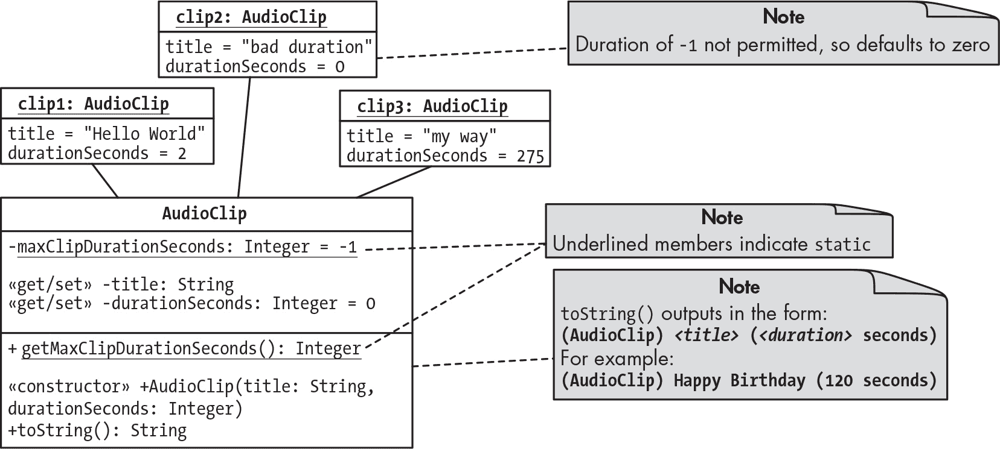
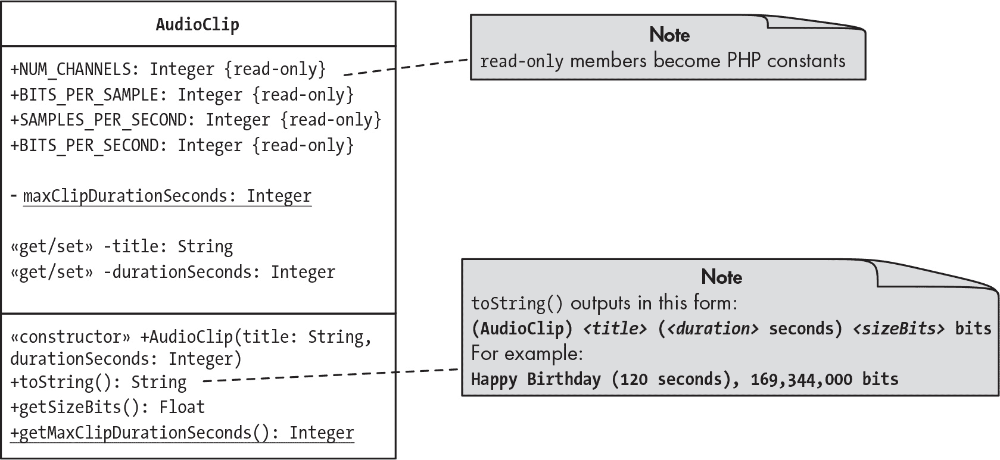
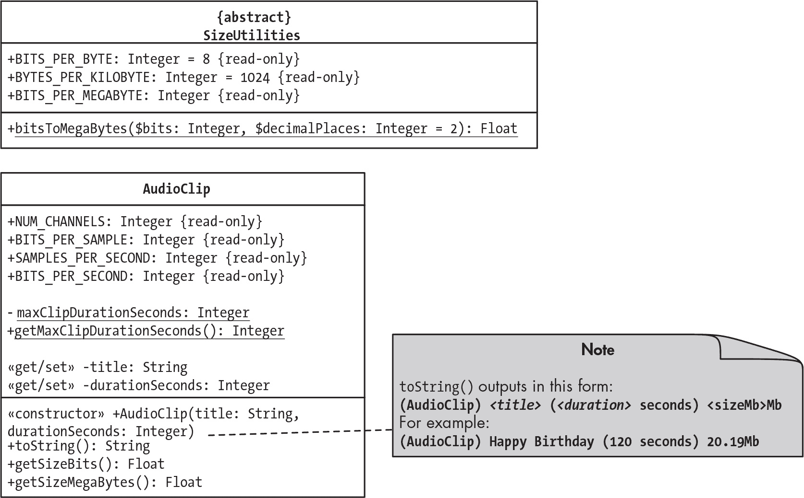
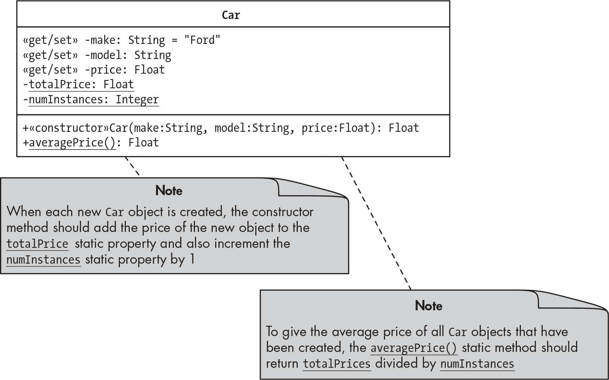

## 第二十五章：25 静态方法、属性和枚举


在本章中，我们将探索 *静态成员*。与我们迄今使用的实例级别的属性和方法不同，静态属性和方法是通过类整体访问的。因此，您不需要创建类的对象就可以使用其静态成员。

我们将讨论如何使用静态成员，并展示它们在存储类所有实例信息或在整个应用程序中共享资源等情况中的有用性。我们还将简要介绍枚举，它提供了一种列出数据类型所有可能值的方式。

### 存储类级别信息

静态成员的一个常见用途是跟踪有关类的所有实例的信息。当需要向类的所有对象发送消息，或者当计算必须基于类的当前实例时，这非常有用。考虑图 25-1 中描述的 AudioClip 类。



图 25-1：带有静态成员的 AudioClip 类

AudioClip 类具有实例成员，用于存储有关给定音频文件的详细信息。这些成员包括标题（title）和持续时间（durationSeconds）属性，以及它们相关的 getter 和 setter 方法。构造函数和 __toString() 方法也是实例成员，因为它们与创建或总结特定对象的内容有关。与此同时，该类有一个 maxClipDurationSeconds 属性，用于跟踪所有已创建的 AudioClip 对象的最大持续时间。由于该属性包含与类的所有对象相关的信息，因此它是静态成员的良好示例（在图中通过下划线表示）。该属性的 getter 方法也应该是静态的。

为了展示静态成员如何有助于存储类级别信息，我们将声明 AudioClip 类并创建它的三个实例。该图表显示了每个实例将拥有自己的标题和持续时间属性值。例如，clip1 的标题为 'Hello World'，持续时间为 2 秒。

创建一个新的项目文件夹，并添加常规的 *composer.json* 文件，声明 Mattsmithdev 命名空间类位于 *src* 文件夹中。通过在命令行中输入 composer dump-autoload 来生成自动加载文件。然后通过创建 *src/AudioClip.php* 文件并输入清单 25-1 的内容来声明 AudioClip 类。

```
<?php
namespace Mattsmithdev;

class AudioClip
{
    // --- Static (per-class) members ---
  ❶ private static int $maxClipDurationSeconds = -1;

 ❷ public static function getMaxClipDurationSeconds(): int
    {
        return self::$maxClipDurationSeconds;
    }

    // --- Object (instance) members ---
  ❸ private string $title;
    private int $durationSeconds = 0;

  ❹ public function __construct(string $title, int $durationSeconds)
    {
        $this->setTitle($title);
        $this->setDurationSeconds($durationSeconds);
    }

    public function getTitle(): string
    {
        return $this->title;
    }

    public function setTitle(string $title): void
    {
        $this->title = $title;
    }

    public function getDurationSeconds(): int
    {
        return $this->durationSeconds;
    }

  ❺ public function setDurationSeconds(int $durationSeconds): void
    {
        // Exit with no action if negative
        if ($durationSeconds < 0) return;

        $this->durationSeconds = $durationSeconds;

        if ($durationSeconds > self::$maxClipDurationSeconds) {
            self::$maxClipDurationSeconds = $durationSeconds;
        }
    }

  ❻ public function __toString(): string
    {
        return "(AudioClip) $this->title ($this->durationSeconds seconds) \n";
    }
}
```

清单 25-1：AudioClip 类

我们通过使用 static 关键字声明 maxClipDurationSeconds，以指定这是一个独立于任何 AudioClip 类对象存在的静态成员❶。我们将其初始化为-1，确保无论第一个被创建的 AudioClip 对象的持续时间是多少，它的持续时间都大于-1，并将被存储在这个静态属性中。稍后，我们将看到这是如何在 setDurationSeconds()设置方法中完成的。

我们将 maxClipDurationSeconds 设置为私有，但声明了一个公共的 getter 方法 getMaxClipDurationSeconds()，它也是静态的❷。将这个方法设为公共方法，允许类内外的代码查询自程序或请求启动以来创建的最长 AudioClip 对象的值。稍后我们会探讨这意味着什么，以及这个属性是如何被使用的。

接下来，我们为每个 AudioClip 对象声明两个实例级别的属性，title 和 durationSeconds❸，其中后者的默认值为 0，以确保即使在构造时提供无效参数，它也会被设置。类的构造方法❹接受这两个属性的初始值，并通过调用相应的 setter 方法将它们设置到对象中。

实例级别的访问器方法都很直接，除了 setDurationSeconds()，它有自定义的验证逻辑❺。一个片段的持续时间不应该是负数，因此我们首先测试这一点，如果提供了负值，则使用 return 停止方法的执行，不再进行其他操作。如果我们通过了这个检查，我们知道提供的参数是 0 或正值，因此我们将其存储在对象的 durationSeconds 属性中。

然后，我们检查对象的新持续时间是否大于存储在 maxClipDurationSeconds 静态属性中的值。如果是，我们更新这个属性，使其等于新的持续时间。由于 maxClipDurationSeconds 初始时的哨兵值为-1，并且由于我们在方法开始时进行的验证，我们知道不会有任何 AudioClip 对象的持续时间为负数。因此，一旦第一个有效持续时间的片段被创建，这个静态属性将被相应地设置。

请注意，我们必须使用 self::来访问 maxClipDurationSeconds 属性。这个*作用域解析运算符*（::）是访问同一类内静态成员的语法。

我们通过 __toString()方法❻完成了类的声明。它返回一个字符串，概述了一个 AudioClip 对象的内容，格式为 (AudioClip) title (durationSeconds 秒)。

现在，让我们通过一个索引脚本来使用我们的类，创建 AudioClip 对象并输出静态 maxClipDurationSeconds 属性的变化值。创建*public/index.php*，如 Listing 25-2 所示。

```
<?php
require_once __DIR__ . '/../vendor/autoload.php';

use Mattsmithdev\AudioClip;

print '- Max AudioClip duration so far = '
    . AudioClip::getMaxClipDurationSeconds() . PHP_EOL;

$clip1 = new AudioClip('hello world', 2);
print $clip1;

print '- Max AudioClip duration so far = '
    . AudioClip::getMaxClipDurationSeconds() . PHP_EOL;

$clip2 = new AudioClip('bad duration', -10);
print $clip2;

print '- Max AudioClip duration so far = '
    . AudioClip::getMaxClipDurationSeconds() . PHP_EOL;

$clip3 = new AudioClip('My Way', 275);
print $clip3;

print '- Max AudioClip duration so far = '
    . AudioClip::getMaxClipDurationSeconds() . PHP_EOL;
```

Listing 25-2：index.php 脚本

首先，我们打印一条信息，显示通过公共静态方法 getMaxClipDurationSeconds()访问的 maxClipDurationSeconds 的值。由于我们还没有实例化任何 AudioClip 对象，该属性的初始值应为-1。注意，我们必须使用 AudioClip::前缀来引用静态成员，而不是 self::，因为我们是在索引脚本中编写代码，而不是在静态成员的类内部。然后，我们创建三个 AudioClip 对象，$clip1、$clip2 和$clip3，打印每个对象并再次显示 maxClipDurationSeconds 的值。

运行索引脚本的输出如下：

```
- Max AudioClip duration so far = -1
(AudioClip) hello world (2 seconds)
- Max AudioClip duration so far = 2
(AudioClip) bad duration (0 seconds)
- Max AudioClip duration so far = 2
(AudioClip) My Way (275 seconds)
- Max AudioClip duration so far = 275
```

最大时长的初始值为-1，但每当创建一个时长非负的 AudioClip 对象时，如果新剪辑的时长更长，这个值就会通过 setDurationSeconds()方法中的逻辑更新。在创建 hello world 对象后，最大时长从-1 变为 2。创建具有无效时长-10 的 bad duration 对象后，值没有变化。（从对象的打印输出中可以看到，它的时长被存储为 0，即默认值，而不是-10，这得益于我们在 setDurationSeconds()方法中的初始验证逻辑。）最后，在创建 My Way 对象后，最大时长更新为 275。

我们更新 maxClipDurationSeconds 的逻辑对于演示目的来说效果不错，但实际上这不是跟踪最长 AudioClip 对象的好方法，因为它假设所有对象在整个应用程序运行期间都存在。假设我们决定不再需要其中一个音频剪辑（用户可能选择将其从列表中删除）。目前的逻辑没有提供回滚最大剪辑时长的方式，如果该剪辑被删除的话。一种更好的方法可能是维护一个活动 AudioClip 对象的数组。每次删除一个剪辑时，我们可以遍历数组并重新计算最长活动剪辑的时长。### 静态属性与类常量

静态属性不应与类常量混淆。在这两种情况下，静态属性或类常量只有一个副本存在于类本身，而不是每个类实例有一个独立的副本。然而，类常量是不可变的，因此其值永远不会改变。相比之下，静态属性的值是可以变化的（正如你在 maxClipDurationSeconds 中看到的那样），就像对象的普通属性值一样。从这个角度来看，*静态*这个术语可能会有点误导。所有 PHP 面向对象的属性，无论是每个对象实例的属性还是每个类的静态属性，都会以美元符号开头，这使得它们与常量区分开来。

当你有一个值应该适用于类的所有对象并且永远不会改变时，请使用类常量。我们之前已经遇到过类常量；一个例子是用于创建 Twig\Environment 对象进行模板渲染的 PATH_TO_TEMPLATES 常量。在这种情况下，模板文件夹的文件路径永远不应更改，并且应适用于所有的 Twig\Environment 对象。类常量的其他使用场景包括定义特殊值，比如将学校成绩点平均值（GPA）的最高分设置为 4.0，或者将 pH 酸碱度尺度的中性值设置为 7.0。

在我们的 AudioClip 类的情况下，我们可能会有类常量来定义诸如音频文件的通道数或采样率等细节，假设这些参数在所有音频剪辑中都是标准的。为了探索类常量和静态属性之间的区别，我们现在将在 AudioClip 项目中添加一些类常量。图 25-2 展示了更新后的 AudioClip 类的图示。



图 25-2：向 AudioClip 类添加类常量和额外方法

图示显示，AudioClip 类现在将提供四个公共类常量，这些常量在类图中标记为 {只读}。对于我们的项目，我们将对类所表示的音频剪辑做出一些假设：它们都是立体声（两个通道），每个样本存储 16 位（CD 质量的数字音频）。每秒的样本数将始终为 44,100，这是一个常见的音频采样率。这些值由 AudioClip 类常量 NUM_CHANNELS、BITS_PER_SAMPLE 和 SAMPLES_PER_SECOND 表示，并一起用于计算 BITS_PER_SECOND 常量。

> 注意

*对于更现实的示例，这些常量可以被实例属性替代，因为并非所有音频剪辑都可能符合常量所设定的标准。*

我们还将添加一个新的 getSizeBits() 方法，该方法使用类常量来计算存储音频剪辑所需的内存或磁盘上的位数。此外，我们还将把这个新方法的值作为对象摘要的一部分，通过 __toString() 方法返回。

要实现这些更改，请按照 清单 25-3 中所示编辑 *src/AudioClip.php* 文件。

```
<?php
namespace Mattsmithdev;

class AudioClip
{
    const NUM_CHANNELS = 2;

    const BITS_PER_SAMPLE = 16;

    const SAMPLES_PER_SECOND = 44100;

    const BITS_PER_SECOND = self::NUM_CHANNELS
        * self::BITS_PER_SAMPLE * self::SAMPLES_PER_SECOND;

--snip--

    public function getSizeBits(): int
    {
        return self::BITS_PER_SECOND * $this->durationSeconds;
    }

  ❶ public function __toString(): string
 {
        $numBitsFormatted = number_format($this->getSizeBits());
        return "(AudioClip) $this->title "
            . "($this->durationSeconds seconds), $numBitsFormatted bits \n";
 }
}
```

清单 25-3：向 AudioClip 类添加常量和 getSizeBits() 方法

在声明类时，通常会先列出常量，再列出任何属性和方法，因此我们通过声明常量 NUM_CHANNELS、BITS_PER_SAMPLE 和 SAMPLES_PER_SECOND 来开始 AudioClip 类的定义，其值如前所述。然后我们声明了 BITS_PER_SECOND，它是一个 *计算常量* 的例子，因为其值是根据其他常量的值确定的，而不是直接设置的。通过预先计算这个值并将其存储为常量，我们避免了每次需要将音频的秒数转换为数据的位数时都要重复计算。请注意，在 BITS_PER_SECOND 计算中使用了 self:: 来访问其他常量。这种语法用于在类内部访问类常量，就像访问静态成员一样。

接下来，我们声明了 getSizeBits()，这是每个 AudioClip 对象的一个有用的额外获取器方法。它返回一个整数，表示存储音频片段所需的位数，通过将预先计算的 BITS _PER_SECOND 常量乘以对象的 durationSeconds 属性来获得。我们还更新了 __toString() 方法 ❶，总结了 AudioClip 对象的内容，包括其位数大小，感谢我们新方法的加入。请注意，我们使用了内置的 number_format() 函数来创建一个临时的 $numBitsFormatted 字符串变量。使用函数的默认设置，它会在每三位数字之间创建逗号分隔符，从而使数字的表示更加易读。

这是重新运行索引脚本后的终端输出（索引脚本无需更改）：

```
- Max AudioClip duration so far = -1
(AudioClip) hello world (2 seconds), 2,822,400 bits
- Max AudioClip duration so far = 2
(AudioClip) bad duration (0 seconds), 0 bits
- Max AudioClip duration so far = 2
(AudioClip) My Way (275 seconds), 388,080,000 bits
- Max AudioClip duration so far = 275
```

每个 AudioClip 对象的输出现在都会以该音频片段数据占用的位数的整数形式结束，感谢我们使用的类常量。即使是一个两秒钟的片段，也需要超过 200 万位（这就是为什么我们将位数格式化为每三位用逗号分隔的原因）。

### 带有静态成员的工具类

静态成员也可以作为 *工具类* 的一部分来创建；这些工具类旨在帮助其他类完成工作，并不用于创建对象。工具类的静态成员可能会存储有用的信息或执行基本的、通用的计算，这些计算在其他项目或当前项目的其他部分可能会用到。

继续以我们的 AudioClip 示例为例，假设我们想要以兆字节而不是位的形式显示每个音频片段的大小。我们需要一种从位转换为兆字节的方法。我们可以重构 AudioClip 类的 getSizeBits() 方法来进行必要的计算。这个计算，以及支持性的信息，比如一个字节中包含的位数，足够通用，可能对项目中的其他非音频部分或者完全不同的项目也有用。因此，将必要的代码放在工具类中是有意义的。

我们将创建一个名为 SizeUtilities 的工具类，帮助 AudioClip 类计算内存大小。通常，工具类不用于创建对象，而 SizeUtilities 也不例外。由于这个类的对象永远不会被实例化，我们将把 SizeUtilities 声明为抽象类。因此，由于不会有 SizeUtilities 对象，所有类的成员需要通过类本身访问。也就是说，SizeUtilities 必须由类级常量和静态成员组成。图 25-3 显示了修改后的 AudioClip 类和新的 SizeUtilities 工具类的图示。



图 25-3：展示静态方法和属性的 AudioClip 和 SizeUtilities 类图

SizeUtilities 类提供了三个公共类常量，图示中标明为{只读}：BITS_PER_BYTE、BYTES_PER_KILOBYTE 和 BITS_PER_MEGABYTE。这些常量将在计算文件大小时非常有用。该类还提供了一个名为 bitsToMegaBytes() 的公共静态方法，该方法接收一个比特数作为参数，并返回相应的以兆字节为单位的数字（默认精确到两位小数）。同时，AudioClip 类声明了一个新的 getSizeMegaBytes() 方法，借助 SizeUtilities 类返回一个表示该音频剪辑所需内存大小（以兆字节为单位）的浮动值。请注意，AudioClip 类还修改了 __toString() 方法，该方法在对象摘要中包含了文件大小（以兆字节为单位）。

让我们声明 SizeUtilities 类。创建 *src/SizeUtilities.php* 文件，包含清单 25-4 中的代码。

```
<?php
namespace Mattsmithdev;

abstract class SizeUtilities
{
    const BITS_PER_BYTE = 8;
 const BYTES_PER_KILOBTYE = 1024;
    const BITS_PER_MEGABTYE =
        self::BITS_PER_BYTE * self::BYTES_PER_KILOBTYE * 1024;

    public static function bitsToMegaBytes(int $bits): float
    {
        return $bits / self::BITS_PER_MEGABTYE;
    }
}
```

清单 25-4：包含常量和静态方法的 SizeUtilities 类

我们将 SizeUtilities 声明为抽象类，因为该类的所有成员都是常量或静态成员。它的 BITS_PER_BYTE 和 BYTES_PER_KILOBYTE 常量分别为 8 和 1024，而 BITS_PER_MEGABYTE 常量是基于这两个常量计算得出的。该类的 bitsToMegaBytes() 静态方法接受一个比特数，并将其除以 BITS_PER_MEGABYTE 常量，以返回相应的兆字节数。

接下来，按照清单 25-5 中的内容更新 *src/AudioClip.php* 文件。

```
<?php
namespace Mattsmithdev;

class AudioClip
{
--snip--

 public function getSizeBits(): int
 {
 return self::BITS_PER_SECOND * $this->durationSeconds;
 }

    public function getSizeMegaBytes(): float
    {
      ❶ return SizeUtilities::bitsToMegaBytes($this->getSizeBits());
    }

 public function __toString(): string 2
 {
        $numMegaBytesFormatted = number_format($this->getSizeMegaBytes(), 2);
        return "(AudioClip) $this->title "
            . "($this->durationSeconds seconds), $numMegaBytesFormatted MB \n";
 }
}
```

清单 25-5：更新 AudioClip 类以使用 SizeUtilities

我们添加了 getSizeMegaBytes() 方法，该方法返回一个浮动值，表示 AudioClip 对象的大小（以兆字节为单位）。该方法获取比特数，并将其传递给我们在 SizeUtilities 类中声明的公共静态方法 bitsToMegaBytes() ❶。这是一个很好的例子，展示了如何在其他类中使用公共静态方法：我们无需创建 SizeUtilities 类的对象即可使用其公共静态方法，而是简单地写 SizeUtilities:: 后跟方法名。

在新的 __toString() 方法中，我们创建了一个临时的 $numMegaBytesFormatted 变量，保存了以兆字节为单位的剪辑大小，并将其格式化为带有两位小数的字符串。然后，我们将这个变量的值作为字符串的一部分返回。再一次，我们不需要对索引脚本做任何更改来测试我们的更新，因为我们仍然使用 __toString() 来输出信息。以下是更新后的终端输出：

```
- Max AudioClip duration so far = -1
(AudioClip) hello world (2 seconds), 0.34 MB
- Max AudioClip duration so far = 2
(AudioClip) bad duration (0 seconds), 0 MB
- Max AudioClip duration so far = 2
(AudioClip) My Way (275 seconds), 46.26 MB
- Max AudioClip duration so far = 275
```

每个 AudioClip 对象的大小现在以兆字节为单位给出。我们新的实用类成功地帮助 AudioClip 类通过其静态方法和类常量完成了位到兆字节的转换。

### 在应用程序中共享资源

静态方法的另一种用途是为软件系统的所有部分提供功能（例如从数据库读取或写入，或将消息附加到日志文件），而无需每个部分都重复所需的设置代码。其思路是创建一个包含静态方法的抽象类，这些方法负责执行必要的工作，比如建立数据库连接或设置日志记录器及日志处理器。然后，您可以在代码中的任何地方调用这些静态方法，每当您需要该功能时。这样，像日志记录或与数据库连接的操作就变得非常简单。

为了说明这如何工作，我们来创建一个项目，允许在系统中的任何地方进行日志记录，只需像这样写：

```
Logger::debug('my message');
```

为了使这个功能工作，我们需要一个具有公共静态 debug() 方法的 Logger 类，该方法可以在系统中的任何地方调用。这个方法将处理日志记录过程的细节，这样系统的其他部分就不需要处理这些。

创建一个新的项目文件夹并创建通常的 *composer.json* 文件来自动加载 Mattsmithdev 命名空间的类。然后在命令行中输入此命令将 Monolog 库添加到项目中：

```
$ **composer require monolog/monolog**
```

由于我们有一个 *composer.json* 文件，Composer 在这一步也会生成自动加载脚本，除了加载 Monolog 库外，所有相关文件都会放在您的项目的 *vendor* 目录中。

接下来，创建一个自定义的 Logger 类，文件位置为 *src/Logger.php*，如示例 25-6 所示。

```
<?php
namespace Mattsmithdev;

❶ use Monolog\Logger as MonologLogger;
use Monolog\Handler\StreamHandler;

abstract class Logger
{
    const PATH_TO_LOG_FILE = __DIR__ . '/../logs/debug.log';

  ❷ public static function debug(string $message): void
    {
        $logger = new MonologLogger('channel1');
        $logger->pushHandler(new StreamHandler(self::PATH_TO_LOG_FILE));
        $logger->debug($message);
    }
}
```

示例 25-6：具有公共静态日志记录方法的 Logger 类

我们在 Mattsmithdev 命名空间中声明 Logger 类，以避免与 Monolog 库的 Logger 类发生命名冲突，并将其指定为抽象类，因为我们永远不需要实例化它。use 语句允许我们在代码中引用 Monolog 类，而无需编写完整的命名空间。请注意，我们将 Monolog 的 Logger 类别名为 MonologLogger，以便与我们自己的类更好地区分 ❶。

在类内，我们为*logs/debug.log*的文件路径创建一个常量。然后我们将 debug()声明为一个公共静态方法，它接受一个$message 字符串参数❷。该方法为 channel1 创建一个新的 MonologLogger 对象，并为其分配一个日志处理器，用于将信息写入调试日志文件，然后使用 Monolog 类的 debug()方法将$message 记录到日志文件中。

现在在*public/index.php*中创建一个索引脚本，包含清单 25-7 中的代码。

```
<?php
require_once __DIR__ . '/../vendor/autoload.php';
use Mattsmithdev\Application;
$app = new Application();
$app->run();
```

清单 25-7：在 index.php 中创建 Application 对象

我们读取并执行 Composer 生成的自动加载器，创建一个 Application 类的对象，并调用它的 run()方法。这是我们在第二十一章中讨论的面向对象的 Web 应用程序索引脚本的基本模式。

最后，在*src/Application.php*中声明 Application 类，如清单 25-8 所示。该类包括通过我们 Logger 类的静态方法记录消息的代码。

```
<?php
namespace Mattsmithdev;

class Application
{
    public function run(): void
    {
        print 'Hello, world!';
        Logger::debug('Hello, world! printed out');
        Logger::debug('another log message');
    }
}
```

清单 25-8：应用程序类

在 Application 类的 run()方法中，我们打印出一个“Hello, world!”消息。然后我们调用 Logger 类的静态 debug()方法，将消息记录到调试日志文件中。请注意，我们不需要在 Application 类中创建 Logger 对象或包含任何设置代码（例如声明日志文件路径或创建日志处理器）；所有这些都由我们在 Logger 类中定义的静态方法处理。如果 Application 类和 Logger 类位于不同的命名空间，我们只需在使用时添加 use 语句或完全限定类名，像这样：

```
Mattsmithdev\Logger::debug('Hello, world! printed out');
```

我们可以通过运行索引脚本后查看*logs/debug.log*的内容来确认这两条消息已经被附加到日志文件中。记得使用 cat 命令（macOS 和 Unix）或 type 命令（Windows），如第二十四章所讨论的那样。你应该能看到类似这样的内容：

```
$ **cat debug.log**
[2025-01-30T10:49:54.516974 + 00:00]
channel1.DEBUG: Hello, world! printed out [] []

[2025-01-30T10:49:54.519278 + 00:00]
channel1.DEBUG: another log message [] []
```

我们成功地使用我们的静态方法将消息附加到日志文件。如果我们愿意，可以向此方法添加可选参数，以更改日志文件的名称和位置，记录到不同的频道，或提供一个上下文数组，例如异常对象。这个基本示例一般说明了一个类如何提供一个静态方法，使得软件系统中的任何部分都可以轻松利用它的功能。 ### 使用单例模式节省资源

我们在前一部分中使用的共享资源的方法可以在许多情况下工作，但在某些情况下，比如创建数据库连接或设置邮件或文件写入对象，静态方法的任务会占用足够的时间和内存，影响应用程序的性能。在这些情况下，一种叫做*单例模式*的面向对象设计技术可以帮助节省计算资源，同时仍然使得操作在整个应用程序中可用。

回顾一下上一节的 Listing 25-6，我们在其中声明了 Logger 类。根据我们对静态 debug()方法的定义，每次调用该方法记录调试信息时，都会创建一个新的 MonologLogger 对象和一个新的 StreamHandler 对象。在我们应用程序的 run()方法中（见 Listing 25-8），我们调用了该方法两次，因此为了记录两条信息，创建了四个对象，这有点浪费。当操作消耗资源时，更高效的做法是只执行一次，然后*缓存*（存储）这些创建的资源以供以后使用。单例模式就是一种实现方式。

单例模式声明了一个具有私有构造函数的类，并添加了逻辑来确保最多只创建一个类的对象。该类提供了一个名为 getInstance()的公共静态方法，用于返回类的唯一实例的引用。如果没有实例存在，则在第一次调用 getInstance()方法时创建一个实例。否则，类会缓存或记录该唯一实例，以便下次调用 getInstance()时返回同一个实例。

每当你需要使用单例类时，可以在代码中的任何地方写类似如下的代码：

```
$myObject = Singleton::getInstance();
```

这将把对单例类唯一实例的引用存储在$myObject 变量中。然后，你可以通过$myObject 引用使用 Singleton 类的资源。Listing 25-9 展示了单例风格类的典型骨架。

```
<?php
class Singleton
{
    private static ?Singleton $instance = NULL;

    private function __construct()
    {
        // -- Do the resource-expensive work here --
    }

    public static function getInstance(): Singleton
    {
      ❶ if (self::$instance == NULL)
        {
 ❷ self::$instance = new Singleton();
        }

        return self::$instance;
    }
}
```

Listing 25-9：Singleton 类

我们声明了一个名为 instance 的私有静态属性，并将其初始化为 NULL。最终，这个属性将保存对单例类唯一对象的引用。然后，我们声明了一个私有构造方法，在这里可以完成任何资源密集型的工作。由于构造方法被声明为私有的，它不能在类外部通过 new 关键字调用。

接下来，我们声明该类唯一的公共成员：静态的 getInstance()方法。该方法首先测试 instance 是否为 NULL ❶。如果是，这必定是第一次调用该方法，因此会创建一个新的 Singleton 对象（这会调用构造函数，触发资源密集型的工作），并将新对象的引用存储在静态 instance 属性中 ❷。然后，方法返回 instance 中的对象引用，使得该对象可以在应用程序的其他地方使用。

让我们修改前一节的项目，使用单例模式来节省计算资源。这样，无论我们记录多少条消息，我们都只需要创建一次 Logger 对象和日志处理器。通过将自定义的 Logger 类设置为 Monolog 的 Logger 类的子类，我们还可以使应用程序更加灵活，这样我们就能使用后者的任何方法和可选参数（例如，提供上下文数据以及通过继承的方法记录不同严重程度的日志）。

首先，更新*src/Logger.php*中 Logger 类的声明，使其与列表 25-10 一致。这个重新设计的类 closely modeled on 列表 25-9 中演示的骨架单例类。

```
<?php
namespace Mattsmithdev;

use Monolog\Logger as MonologLogger;
use Monolog\Handler\StreamHandler;

❶ class Logger extends MonologLogger
{
 const PATH_TO_LOG_FILE = __DIR__ . '/../logs/debug.log';

    private static ?Logger $instance = NULL;

    private function __construct()
    {
        parent::__construct('channel1');
        $this->pushHandler(new StreamHandler(self::PATH_TO_LOG_FILE));
    }

 ❷ public static function getInstance(): Logger
    {
        if (self::$instance == NULL)
        {
            self::$instance = new Logger();
        }

        return self::$instance;
    }
}
```

列表 25-10：实现使用单例模式的 Logger 类

我们将 Logger 类声明为 Monolog Logger 类的子类（别名为 MonoLogger）❶。由于我们将只创建此类的一个实例，因此不再将其声明为抽象类。接下来，我们将私有静态实例属性初始化为 NULL，并声明一个私有构造函数。构造函数使用 parent::调用 Monolog Logger 类的构造函数，创建一个带有 channel1 的新对象，然后将其分配一个调试日志文件的日志处理程序。由于这一切都封装在私有构造函数内，因此它只会执行一次。

我们还声明了公共静态方法 getInstance()，这是典型的单例类方法❷。该方法遵循列表 25-9 中描述的逻辑，如果实例为 NULL，则创建并返回一个 Logger 对象，或者如果实例已经创建，则直接返回该实例。

现在让我们更新我们应用程序类的 run()方法。我们将获取 Logger 类的单一实例的引用，然后使用该对象引用记录一些条目。修改*src/Application.php*，使其与列表 25-11 一致。

```
<?php
namespace Mattsmithdev;

class Application
{
 public function run(): void
 {
 print 'Hello, world!';
        Logger::getInstance()->warning('I am a warning.');
        Logger::getInstance()->error('I am a test error!',
            ['exception' => new \Exception('example of exception object')]);
 }
}
```

列表 25-11：更新后的应用程序类，使用我们的单例 Logger 类

我们通过编写 Logger::getInstance()获取 Logger 单例实例的引用，并使用它通过继承自 Monolog Logger 类的 warning()方法记录一个警告级别的消息。由于这是第一次尝试获取单例实例，因此 Logger 类的实例属性为 NULL，将创建一个新的 Logger 对象并将其引用保存在实例中。

然后，我们再次获取 Logger 单例实例的引用并记录一个错误级别的消息，创建并传递一个新的 Exception 对象作为上下文的第二个参数。这次，Logger 的实例属性不是 NULL，因此返回现有对象的引用。通过这种方式，两个日志条目都是由 Logger 类的单一实例创建的，从而节省了时间和资源，同时在应用程序的任何地方仍然可以使用日志功能。

运行 index 脚本后，使用 cat 或 type 命令查看*logs/debug.log*的内容。你应该能看到如下内容：

```
$ **cat debug.log**
[2025-01-30T14:37:32.728758 + 00:00]
channel1.WARNING: I am a warning. [] []

[2025-01-30T14:37:32.730002 + 00:00]
channel1.ERROR: I am a test error! {"exception":"[object]
(Exception(code: 0): example of exception object
    at /Users/matt/src/Application.php:13)"} []
```

两条消息已成功附加到日志文件中，包括添加到错误级别日志条目的异常对象上下文数据。

你已经看到了单例模式的有用之处。然而，许多程序员认为它是一个*反模式*，即解决常见问题的方案，结果却比它试图解决的问题更糟。单例模式的批评者反对它作为一种全局程序状态，这使得代码测试变得更加困难，因为使用单例的代码不能与单例本身分开测试。此外，单例具有*全局可见性*，意味着应用程序中的任何代码都可能依赖于它。因此，需要更复杂的代码分析来确定应用程序中哪些部分依赖于或不依赖于全局可见的单例。另一方面，支持者认为，资源使用的减少足以抵消一些测试或其他部分设计上的开销。

### 枚举

*枚举*是逐一列举每一个可能性，在计算机编程中，*枚举*是数据类型所有可能值的列表。一个很好的枚举数据类型例子是 bool，它列出了唯一的两个可能值：true 和 false。布尔值是语言内建的，但从 8.1 版本开始，PHP 允许你创建并使用自己的自定义枚举类型，也被称为*枚举类*。

当你有的数据项只能取闭合集合中的一个值时，枚举类非常有用。例如，一张披萨订单可以指定为外送或自取，员工的工作状态可以是全职或兼职，扑克牌的花色可以是红桃、方块、梅花或黑桃。虽然当你只有两个可能值时可以使用布尔属性（例如，$fullTime = false），但当有超过两个可能值时，枚举类更为合适。即使只有两个可能值，通过枚举类来定义它们也能使选择更加明确。

在一个枚举类内部，你声明该类的每个可能案例，每个案例都是该类的一个对象。例如，你可能有一个扑克牌花色的枚举类，其中的可能案例包括 HEARTS、DIAMONDS、CLUBS 和 SPADES。要引用枚举类的案例，你使用与使用静态成员或类常量时相同的双冒号语法（作用域解析运算符）（例如，$card1Suit = Suit::SPADES）。

由于这种共享的语法，枚举类与静态成员和类常量有一定的关系。主要的区别在于，枚举类的每个案例都是该类的一个真正的*对象*，而类常量和静态属性、方法是类的*成员*。关键是，这意味着枚举类可以作为其他类的属性的数据类型，以及函数的参数和返回值。

作为一个简单的例子，Listing 25-12 显示了扑克牌花色的枚举类声明。像普通的类声明文件一样，在名为 *Suit.php* 的文件中声明此枚举类。

```
<?php
namespace Mattsmithdev;

enum Suit
{
    case CLUBS;
    case DIAMONDS;
    case HEARTS;
    case SPADES;
}
```

Listing 25-12: Suit 枚举类

在命名空间之后，我们使用 enum 关键字，后跟类名 Suit。然后我们为这个枚举类声明了四个案例，代表四种扑克牌花色。因为枚举案例的作用类似于类常量（即定义固定值），我倾向于将它们写成全大写，尽管许多程序员只将每个案例的第一个字母大写。

现在我们可以将 Suit 枚举类的对象分配给一个变量。为了说明，Listing 25-13 展示了一个简单的 Card 类，利用了 Suit 枚举。

```
<?php
namespace Mattsmithdev;

class Card
{
  ❶ private Suit $suit;
    private int $number;

    public function getSuit(): Suit
    {
        return $this->suit;
    }

 public function setSuit(Suit $suit): void
    {
        $this->suit = $suit;
    }

    public function getNumber(): int
    {
        return $this->number;
    }

    public function setNumber(int $number): void
    {
        $this->number = $number;
    }

  ❷ public function __toString(): string
    {
        return "CARD: the " . $this->number . " of " . $this->suit->name;
    }
}
```

Listing 25-13: 带有使用 Suit 枚举类的 suit 属性的 Card 类

我们首先将 suit 声明为 Suit 数据类型的属性 ❶。再次强调，由于枚举被视为类，它们可以用作有效的数据类型。我们还为类添加了一个数字属性，并为 suit 和 number 提供了简单的 getter 和 setter。然后我们声明一个 __toString() 方法来输出 Card 对象属性的详细信息 ❷。在其中，我们从其 name 属性获取枚举对象名称的字符串版本，通过表达式 $this->suit->name 访问。

Listing 25-14 展示了一个简单的索引脚本，演示了 Suit 和 Card 类的使用。

```
<?php
require_once __DIR__ . '/../vendor/autoload.php';

use Mattsmithdev\Suit;
use Mattsmithdev\Card;

$card1 = new Card();
❶ $card1->setSuit(Suit::SPADES);
$card1->setNumber(1);

print $card1;
```

Listing 25-14: 使用 Card 和 Suit 在索引脚本中

在为这两个类提供使用语句后，我们创建一个新的 Card 对象，并将其 suit 属性设置为 Suit 枚举类的 SPADES 案例的引用，使用双冒号 Suit::SPADES 语法引用案例 ❶。我们还将此 Card 对象的 number 设置为 1（代表一张 Ace）。然后我们打印 $card1 变量的详细信息，这将调用其 __toString() 方法。运行此索引脚本的输出如下：

```
$ **php public/index.php**
CARD: the 1 of SPADES
```

输出显示了数字属性为 1 和字符串 SPADES，这是对象的 suit 属性中引用的 Suit 枚举类的名称。

#### 支持的枚举

除了给枚举案例命名如 SPADES 和 HEARTS 外，你还可以将整数或字符串值与每个案例关联起来。当你给案例赋值时，该类被称为*值支持的枚举*，或简称*支持的枚举*。必须在枚举类名后声明 int 或 string 类型，并且必须为每个案例分配一个值；否则将会出现错误。

让我们通过为每个案例分配一个字符串值将 Suit 转换为支持的枚举。我们可以选择与案例名称完全匹配的字符串（'HEARTS'、'CLUBS' 等），或者我们可以玩得开心一点，分配具有相应扑克牌花色符号的字符串。请参见 Listing 25-15 中更新后的 Suit 声明。

```
<?php
namespace Mattsmithdev;

enum Suit: string
{
 case CLUBS = '♣';
 case DIAMONDS = '♦';
 case HEARTS = '♥';
 case SPADES = '♠';
}
```

Listing 25-15: 将 Suit 转换为支持的枚举类

我们通过在类名后添加冒号和字符串类型来声明 Suit 为一个字符串类型的枚举类型。然后，我们将字符串 '♣' 作为 CLUBS 的值，并为其他三个花色分配相应的符号。要获取一个枚举类型的值，可以使用其公开的 value 属性。例如，如果 $card1Suit 变量是指向 Suit 枚举对象的引用，我们可以通过表达式 $card1Suit->value 来获取它的字符串值。这些值是只读的；一旦在枚举类声明中设置，它们就不能在代码的其他地方被更改。

#### 所有情况的数组

所有枚举类都有一个内置的静态方法 cases()，它返回一个包含所有枚举案例对象的数组。我们可以利用这个方法来构建一个包含案例关联值的数组。例如，列表 25-16 显示了一个索引脚本，利用循环遍历每个 Suit 枚举对象，并将其字符串值附加到一个数组中进行打印。

```
<?php
require_once __DIR__ . '/../vendor/autoload.php';
use Mattsmithdev\Suit;

$cases = Suit::cases();
$caseStrings = [];
foreach ($cases as $case) {
    $caseStrings[] = $case->value;
}
print implode($caseStrings);
```

列表 25-16：创建所有 Suit 枚举案例值的数组

我们调用 Suit::cases() 静态方法来获取一个包含每个可能 Suit 枚举值的实例的 $cases 数组。然后我们将 $caseStrings 初始化为空数组。接下来，我们遍历 $cases 中的 Suit 枚举对象，并将它们的字符串值附加到 $caseStrings 数组中。最后，我们使用内置的 implode() 函数将字符串数组打印为一个单一的字符串。以下是运行此索引脚本时在命令行上的输出：

```
$ **php public/index.php**
♣♦♥♠
```

所有四个花色的字符都已经在同一行打印出来。在这里，我们仅仅打印了案例值，但我们也可以使用类似的循环技术，例如，从枚举类中创建一个包含所有案例值的下拉菜单，用户可以选择其中一个选项。

### 小结

本章中，我们探讨了类的静态成员：这些成员与个别对象无关，而是属于整个类。你已经看到了如何通过 self:: 在类内访问静态成员，以及如何通过 ClassName:: 在类外访问静态成员（假设静态成员是 public）。你了解了静态成员的使用，包括记录类范围的信息、通过工具类提供公共方法、以及通过抽象类或单例设计模式在应用程序中共享功能。我们还讨论了与类常量和枚举类相关的概念。

### 练习

1.   创建一个新的项目来实现一个 Car 类，表示不同的汽车。如图 25-4 所示，该类应该具有表示品牌、型号和价格的实例属性，并且在创建新对象时，通过构造函数传入每个实例属性的值。你还应该有 private 静态属性用于 totalPrice 和 numInstances。



图 25-4：Car 类

每次创建一个新的 Car 对象时，构造函数方法应该增加 numInstances，并将新创建的 Car 对象的价格加到 totalPrice 上。

2.   在练习 1 中的 Car 类中添加一个公共静态方法 averagePrice()，该方法使用静态的 numInstances 和 totalPrice 属性来计算并返回所有已创建的 Car 对象的平均价格。

3.   创建一个新项目，包含一个名为 DietType 的枚举类，其中有三个值：VEGAN（纯素）、VEGETARIAN（素食）、CARNIVORE（食肉）。同时创建一个 Dessert 类，具有 name 属性（一个字符串）和 diet 属性（一个 DietType 枚举值），并且包含一个 __toString()方法，用于以'(DESSERT) 甜点名称 (DietType 菜肴)'的形式总结 Dessert 对象。编写一个索引脚本，创建一个 Dessert 对象并打印其详细信息。输出应类似于以下内容：

```
(DESSERT) Eton Mess (VEGETARIAN dish)
```
