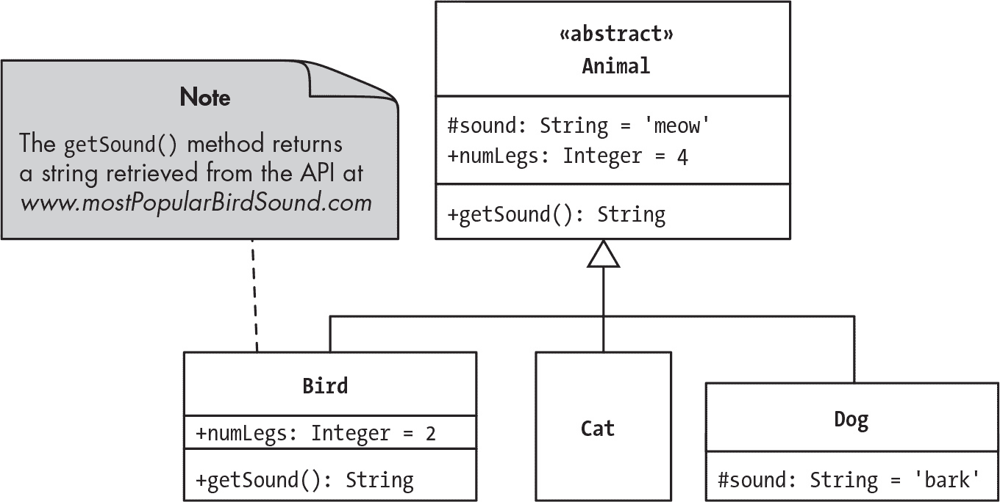
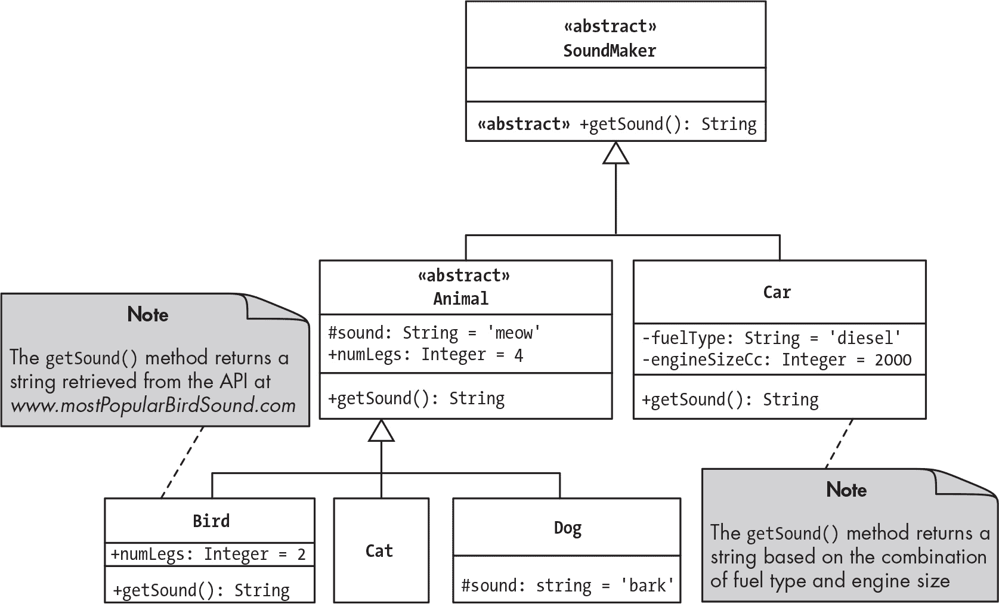
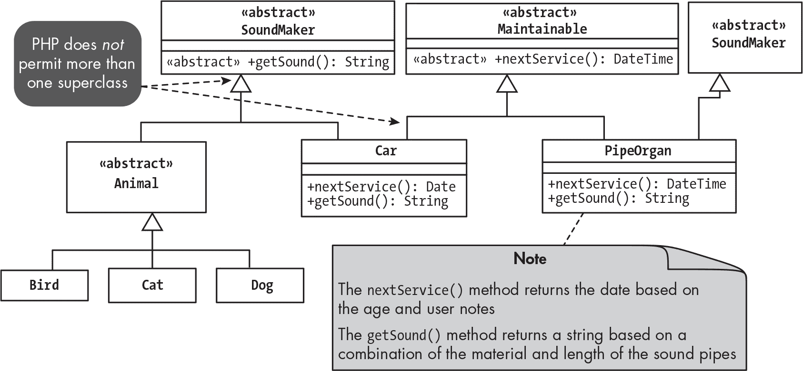
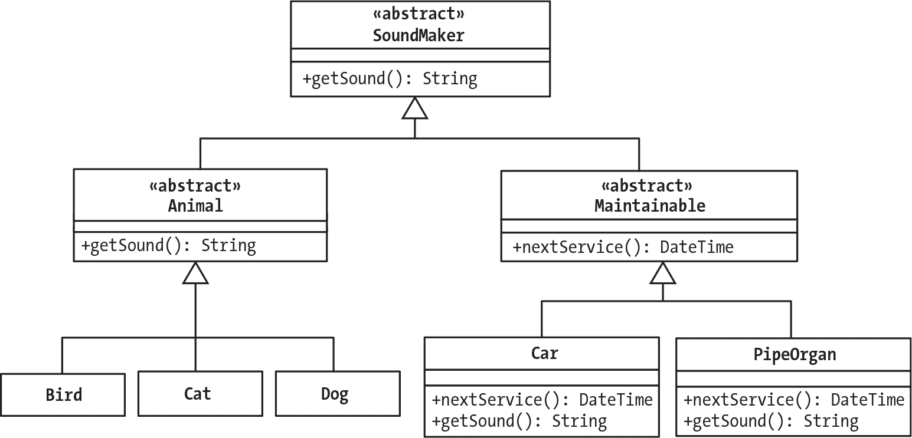
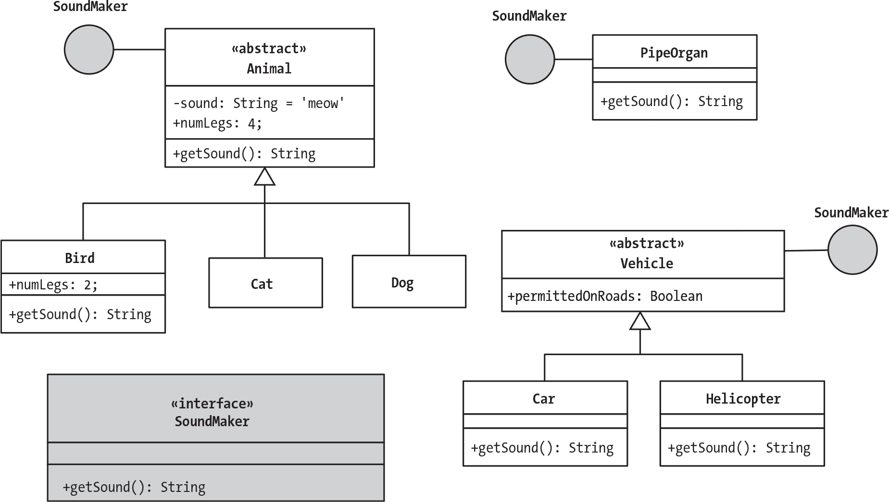
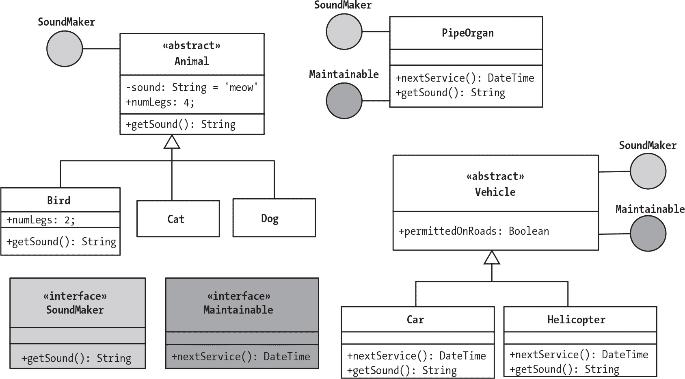
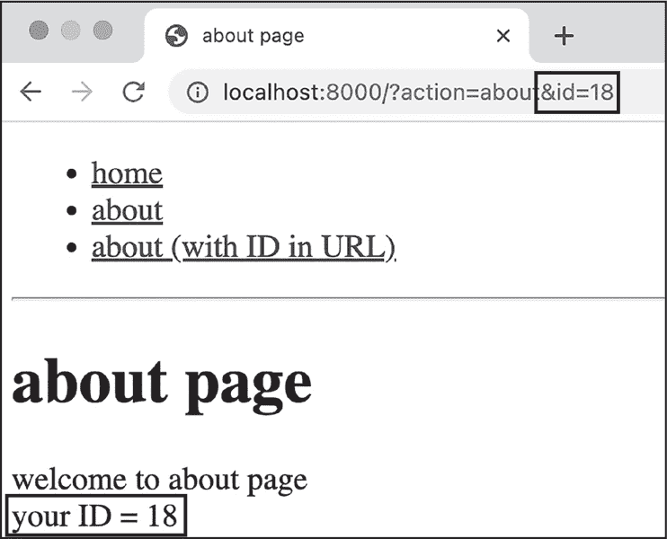

## 第二十六章：26 抽象方法、接口和 traits


在本章中，我们将超越从超类到子类的标准继承机制，探索在类之间共享方法的其他策略。你将会接触到抽象方法、接口和 traits。

正如你将看到的，抽象方法和接口允许你跨多个类共享方法的签名，而无需指定方法的实现细节。实际上，这些机制充当了*契约*：为了使用抽象方法或接口，一个类必须同意提供这些方法的合适实现。同时，traits 是一种绕过继承的方式，可以在不同层次结构的类之间共享完全实现的方法。接口也超越了类层次结构，而抽象方法仍然通过继承在超类和子类之间传递。

抽象方法、接口和 traits 一起可以促进应用程序的更新，而不会破坏任何代码，因为它们确保了某些方法将会在类中存在，以供应用程序的其他部分使用。特别是抽象方法和接口促进了类的可互换性。通过强制方法签名，同时对实现保持中立，它们使得在项目需求变化时（例如需要写入新的文件类型、与新的数据库管理系统通信，或是为日志记录和异常处理指定新的目标）可以轻松替换那些以不同方式实现方法的类。另一方面，traits 有助于避免冗余并促进代码的重用，因为它们避免了你必须在多个不相关的类中声明相同的方法。从这个意义上说，它们有点像工具类，旨在使应用程序中的所有类都能使用某些常见的操作。

在本章涉及的主题中，接口特别是在中型到大型的 PHP 项目中非常常见。即使你自己并不编写许多接口，你可能会使用它们，因为它们是许多第三方库的一个特性，这些库用于核心 Web 应用程序组件，包括数据库通信以及处理 HTTP 请求和响应。

### 从继承到接口

在本节中，我们将逐步构建一个示例类网络，以说明抽象方法和接口的特点与优点。我们将首先回顾子类从超类继承方法的传统过程，然后过渡到使用抽象方法，最后使用接口来标准化不相关类的特性。为了简单起见，这将是一个玩具示例。然而，一旦我们建立了基础，我们将转向接口的更实际和更具实际应用性的场景。

#### 从超类继承完全实现的方法

如我们在第十九章中讨论的，继承使得可以将超类方法的定义传递给一组相关的子类。如果某些子类需要以不同方式实现该方法，它们可以始终用自己的实现来覆盖它，而其他子类则会简单地继承超类的默认实现。

有时，超类可能是抽象的，这意味着它永远不会被实例化。在这种情况下，一个或多个非抽象的子类必须扩展抽象超类，以便创建对象并执行超类的方法。举个例子，图 26-1 展示了一个简单的动物类层次结构，所有这些动物类都能够返回描述它们发出声音的字符串。



图 26-1：一个类层次结构，抽象超类传递一个 getSound()方法

在这个类层次结构的顶部是抽象的 Animal 超类。它的 sound 属性默认值为“喵”，并具有保护（#）可见性，这意味着如果需要，子类可以访问（并覆盖）该属性的值。它的 numLegs 属性是公共的（+），默认值为 4。此外，getSound()方法返回存储在 sound 中的字符串。

在该层次结构的下一层，Cat 子类扩展了 Animal 类，因此继承了 sound 和 numLegs 属性以及 getSound()方法。这意味着 Cat 对象将发出“喵”声。Dog 子类也扩展了 Animal 类，但声明了自己的 sound 属性值为“汪”，覆盖了从超类继承的值。

最后，让我们假设关于鸟类发出的声音存在不同的看法；有时“叽叽喳喳”更受欢迎，有时“啾啾”更常见。为了解决这个问题，Bird 子类声明了 getSound()的自定义实现，覆盖了从超类继承的方法。在运行时，每个 Bird 对象的 getSound()方法将访问一个（虚构的）API *[www.mostPopularBirdSound.com](http://www.mostPopularBirdSound.com)* 来确定最流行的鸟类声音字符串，而忽略其继承的 sound 属性的值。此外，由于鸟类只有两条腿，Bird 类还覆盖了继承的腿数属性。

清单 26-1 显示了 Animal 类的代码。

```
<?php
namespace Mattsmithdev;

abstract class Animal
{
    protected string $sound = "meow";
    public int $numLegs = 4;

 ❶ public function getSound(): string
    {
        return $this->sound;
    }
}
```

清单 26-1：Animal 类

我们声明 Animal 类为抽象类，这样它就无法被实例化，并为其分配了 sound 和 numLegs 属性。我们还提供了 getSound()方法的实现❶，该方法返回 sound 属性的值。对于任何继承该方法的子类实例，调用 getSound()方法时，对象的 sound 属性值将在运行时确定。例如，Cat 对象将返回'meow'，Dog 对象将返回'bark'，而 Bird 对象将覆盖该方法，并返回从*[www.mostPopularBirdSound.com](http://www.mostPopularBirdSound.com)* API 获取的任何字符串。

这个例子告诉我们，一个超类（无论是否抽象）提供了一种默认方法实现的方式，子类可以继承这个实现。需要时，这个实现可以被单独的子类覆盖。

#### 继承抽象方法

*抽象方法*是超类中的一个没有实现的方法。它声明的只是方法的签名：方法的名称、参数和返回类型。任何继承该超类的子类必须提供自己对该抽象方法的实现。实现的具体细节由每个子类自行决定，只要实现符合超类中指定的方法签名。

抽象方法适用于需要展示相同行为但非常不同的类。例如，像动物一样，汽车也会发出声音，它们可能也需要一个返回字符串的 getSound()方法，就像我们的 Animal 类一样。然而，汽车与动物有很大的不同，甚至它们发出声音的方式也大不相同；汽车可能会发出如'putt-putt-putt'、'purr'或'vroom-vroom'等声音，这取决于它们的发动机大小、燃料类型等。因此，汽车的 getSound()方法将与动物的不同，但它们仍然会有相同的签名，因为在这两种情况下，方法最终都返回一个字符串。

让我们通过引入一个新的抽象 SoundMaker 超类来解决这个问题，该超类声明了一个抽象的 getSound()方法。任何从 SoundMaker 继承的子类，如 Animal 和 Car，必须提供适当的 getSound()实现。图 26-2 显示了新的修改后的类层次结构。



图 26-2：通过 SoundMaker 超类共享抽象 getSound()方法

清单 26-2 展示了新的 SoundMaker 类的声明。注意，类没有为 getSound()方法提供实现，只声明了它的签名。

```
<?php
namespace Mattsmithdev;

abstract class SoundMaker
{
    abstract public function getSound(): string;
}
```

清单 26-2：带有抽象方法的 SoundMaker 类

我们将 getSound()方法指定为抽象方法，并仅声明它的签名。由于没有提供实现，方法声明被视为语句，因此必须以分号结束。

非抽象的 Car 子类现在必须为 getSound() 方法提供实现，才能成功地继承自 SoundMaker。如果没有实现，我们将得到一个类似下面的致命错误：

```
PHP Fatal error:  Class Mattsmithdev\Car contains 1 abstract method and must
therefore be declared abstract or implement the remaining methods
```

我们已经在 Animal 类上提供了 getSound() 的实现，因此它可以成功继承自 SoundMaker。Cat 和 Dog 子类继承了 Animal 的方法实现，因此它们也满足了 SoundMaker 类的要求。Bird 类仍然可以用自己的实现覆盖从 Animal 继承来的 getSound() 实现。

为了看到将 getSound() 作为抽象方法的好处，假设我们的应用程序有一个需要知道对象发出声音的功能。该功能可以要求一个 SoundMaker 对象（或它的子类）作为参数，并且知道无论接收到哪个 SoundMaker 的子类，都将有一个可以调用的 getSound() 方法来返回一个字符串。无论是 Animal 对象还是 Car 对象都没有关系；该方法肯定会存在。通过这种方式，抽象方法最大化了类的可互换性，同时仍然允许不同的类拥有非常不同的实现方式。

如果一个类声明了一个或多个抽象方法，那么该类本身也必须是抽象的。这是因为你不能实例化一个包含抽象方法的类，因为该方法没有提供实现。然而，反过来并不一定成立：一个类可以声明为抽象类，但不包含任何抽象方法。例如，你可能有一个由完全实现的静态成员组成的抽象类。

#### 使用接口要求方法实现

*接口* 是一种声明一个或多个方法签名的方式，类应该实现这些方法。然后，类通过声明具有这些指定签名的方法来*实现*接口。接口类似于抽象方法，因为它们都确保一个或多个类应该拥有某些方法，但不指定这些方法应该如何实现。它们都通过保证这些方法签名的一致性来促进类的可互换性。不同之处在于，接口*不是*类，因此独立于任何类层次结构，而抽象方法是作为类的一部分声明的。因此，任何实现抽象方法的类必须属于声明这些方法的类的层次结构。

由于接口独立于类层次结构，因此当你希望在非常不同的类之间共享某种行为，这些类不属于同一个类层次结构时，或者你希望在多个非常不同的类之间共享多种行为时，接口就非常有用。

继续前面章节中的示例，管风琴也能发出声音，像汽车和动物一样。管风琴和汽车也需要定期维护，而动物则不需要。假设 Maintainable 类的子类必须实现一个返回某种 Date 对象的 nextService()方法。服务日期的计算方法在 Car 对象和 PipeOrgan 对象中会有所不同。汽车的服务日期可能基于发动机类型和行驶的里程，而管风琴对象的服务日期可能根据管道的长度和材质来计算。

我们可能会倾向于创建一个新的抽象 Maintainable 类，声明一个抽象的 nextService()方法。Car 和 PipeOrgan 类将从 Maintainable 继承，并提供各自的 nextService()实现，同时也继承自 SoundMaker 类，以及 Animal 类。这将是一个*多重继承*的例子，即一个类能够同时从两个或多个超类继承。图 26-3 中的类图展示了这一方案。



图 26-3：具有多重继承的类层次结构

这种安排可能看起来很吸引人：Car 和 PipeOrgan 类都从两个超类继承，因此像之前一样，它们都可以继承来自抽象 SoundMaker 类的 getSound()方法要求，同时也能继承来自抽象 Maintainable 类的 nextService()方法要求。然而，尽管一些编程语言允许多重继承，PHP 并不允许多重继承，以避免歧义问题。如果一个类从多个超类继承，并且这些超类中有两个或更多声明了相同名称的常量或方法，那么继承类该如何知道使用哪个呢？

我们可以尝试通过将 SoundMaker 和 Maintainable 超类放在同一类层次结构的不同层级来绕过对多重继承的禁止。也就是说，我们可以让 Maintainable 成为 SoundMaker 的子类，而 Car 和 PipeOrgan 成为 Maintainable 的子类，就像在图 26-4 中那样。



图 26-4：一个类层次结构，其中 Maintainable 是 SoundMaker 的子类

初看之下，这似乎是可行的。层次结构中的任何类的对象都必须有一个 getSound()方法，Car 和 PipeOrgan 各自也必须实现一个 nextService()方法。然而，如果我们识别出一些应该有但其他类没有的行为呢？这些行为在提议的层次结构中可能没有意义。另外，如果我们想添加一个不发声的 Maintainable 子类怎么办？例如，烟囱需要定期维护，但它是静音的。

显然，我们创建了一个脆弱且人为的类层次结构。 完全不相关的类，如鸟类、汽车和烟囱，可能被迫成为它们与之无关的类的子类，所有这些都是为了强制继承 getSound() 和 nextService() 方法签名。 解决方案是使用接口来定义一组必需的方法签名，这些方法可以由不在同一层次结构中的类来实现。 这样既避免了多重继承的非法解决方案，又规避了单一类层次结构的要求。

为了演示，我们首先将 SoundMaker 定义为一个接口而不是一个类。 然后我们可以规定我们示例中的类都应该实现 SoundMaker 接口。 这在 图 26-5 中有所说明。

在图表的左下角，SoundMaker 接口声明了 getSound() 方法的签名。 将 SoundMaker 重新定义为接口而不是类之后，我们可以将我们的类分解为单独、更有意义和更健壮的层次结构：我们有抽象的 Animal 类及其子类，以及抽象的 Vehicle 类和其子类 Car 和 Helicopter。 与动物或车辆无关的 PipeOrgan 类单独存在。 实现 SoundMaker 接口的类用接口名称和 *棒棒糖符号* 进行注释。



图 26-5：实现了多个类的 SoundMaker 接口

注意，当抽象类（如 Animal 或 Vehicle）实现一个接口时，并不需要提供所有（或任何）在接口中声明的方法的完整实现。 具体的实现可以留给非抽象的子类来完成。 在这里，Animal 提供了一个 getSound() 的实现（尽管被 Bird 子类覆盖），而 Vehicle 没有。 在后一种情况下，Car 和 Helicopter 子类必须分别提供自己定制的 getSound() 实现，以实现 Vehicle 类通过声明其将实现 SoundMaker 接口而做出的承诺。

##### 声明一个接口

声明接口的代码应该放在与接口同名的 *.php* 文件中，就像类声明一样。 例如，SoundMaker 接口应该在 *SoundMaker.php* 文件中声明。 清单 26-3 展示了其代码。

```
<?php
namespace Mattsmithdev;

interface SoundMaker
{
    public function getSound(): string;
}
```

清单 26-3：SoundMaker 接口

我们通过使用 interface 关键字声明 SoundMaker。它的主体仅包含 getSound() 方法的签名，没有实际的实现。就像声明一个抽象方法一样，getSound() 的签名必须以分号结尾，以表示语句的结束。请注意，我们为 getSound() 提供了公共可见性。虽然显式包括 public 修饰符并非严格必要（因为在接口中声明的所有方法都会自动被视为公共方法），但最佳实践是显式声明，因为其他系统部分可以利用任何实现接口的类的行为。

> 注意

*除了声明方法签名外，接口还可以声明常量。实现该接口的类将继承接口常量，尽管从 PHP 8.1 开始，类可以根据需要覆盖接口常量。*

##### 实现接口

现在让我们看看一个类如何实现一个接口。作为示例，列表 26-4 展示了实现 SoundMaker 接口的 PipeOrgan 类的代码。

```
<?php
namespace Mattsmithdev;

class PipeOrgan implements SoundMaker
{
    public function getSound(): string
    {
        return 'dum, dum, dum-dum';
    }
}
```

列表 26-4：使用 PipeOrgan 类实现 SoundMaker 接口

我们通过使用 implements 关键字声明该类实现了 SoundMaker 接口。由于 PipeOrgan 类实现了 SoundMaker，类有义务提供 getSound() 方法的实现：在这种情况下，它返回字符串 'dum, dum, dum-dum'。该方法与 SoundMaker 接口声明的签名匹配。我们也会在 Animal 和 Vehicle 类中声明 getSound() 方法。每个实现的细节并不重要，只要该方法被命名为 getSound() 且返回一个字符串。

如果一个（非抽象）类没有包含实现接口所需的某个方法定义，那么会发生致命错误。例如，如果 PipeOrgan 类的代码没有声明 getSound() 方法，那么在尝试创建该类的对象时，你会看到如下错误：

```
PHP Fatal error:  Class Mattsmithdev\PipeOrgan contains 1 abstract method and
must therefore be declared abstract or implement the remaining methods
```

请注意，这与子类未能实现其超类声明的抽象方法时的致命错误完全相同。PHP 引擎处理接口方法签名时，就像它们是抽象方法一样；在创建任何对象之前，必须在实现接口的类层次结构中实现这些方法。

##### 使用一个类实现多个接口

接口的一个强大特性是，一个类可以实现多个接口。当一个类实现一个接口时，它承诺提供一组公共方法，这些方法的签名在该接口中声明，且没有理由一个类不能为多个接口提供这些方法。

回到我们的示例，PipeOrgan 类可以实现 Maintainable 接口，承诺声明 `nextService()` 方法的实现，并通过声明 `getSound()` 方法实现 SoundMaker 接口。同样，如果所有车辆都需要维护并发出声音，Vehicle 类也可以实现 Maintainable 和 SoundMaker 两个接口。图 26-6 展示了这些类如何实现多个接口。



图 26-6：实现多个接口的类

图中展示了 Maintainable 接口与 SoundMaker 接口，PipeOrgan 和 Vehicle 类现在有两个“棒棒糖”，表示它们实现了这两个接口。与图 26-4 中展示的人工类层次结构或图 26-3 中的多重继承方案相比，这种类和接口的安排在概念上更加简洁。

要查看如何声明一个类实现多个接口，请参考清单 26-5，其中展示了更新后的 PipeOrgan 类代码。

```
<?php
namespace Mattsmithdev;

class PipeOrgan implements SoundMaker, Maintainable
{
 public function getSound(): string
 {
 return 'dum, dum, dum-dum';
 }

    public function nextService(): \DateTime
    {
        return new \DateTime('2030-01-01');
    }
}
```

清单 26-5：使用 PipeOrgan 类实现多个接口

当一个类实现多个接口时，只需要使用一次 `implements` 关键字，后跟接口名称，并用逗号分隔，如 `implements SoundMaker, Maintainable`。除此之外，实现多个接口只需为所有必需的方法提供定义。在这种情况下，我们添加了 `nextService()` 方法，该方法返回一个 `DateTime` 对象，符合 Maintainable 接口的要求（我们将在第三十一章中讨论如何处理日期）。

我之前提到过，反对多重继承的一个论点是，如果一个类试图从多个父类继承相同的成员，会造成歧义。但对于一个实现多个接口的类来说，这不是问题。无论一个、两个，还是任意数量的接口声明了相同的方法签名，所有这些接口的契约都可以通过类中实现的单个方法来满足。例如，如果因为某些原因 Maintainable 接口声明了 `nextService()` 和 `getSound()` 两个方法，只要 PipeOrgan 类声明了这两个方法的实现，代码仍然能正常工作。只要来自接口的所有方法都在实现这些接口的类中定义，就不会有歧义，PHP 引擎将始终一致、正确、无错误地运行。

##### 比较接口与抽象类

一开始，可能会觉得接口与抽象类是一样的，因为它们都不能用于实例化对象。然而，尽管这两个概念相关，但它们之间存在关键差异，每个概念适用于不同的情况。最重要的一点是，抽象类是一个类，而接口不是；它是一个类必须实现的方法签名的承诺或契约。另一个关键区别是，类只能继承一个抽象类，而可以实现多个接口。

接口不能声明或处理实例级别的成员，因此接口不能拥有实例属性或实现与实例成员交互的方法。事实上，接口根本不能实现方法；它们只指定实例方法的要求。与此不同，抽象类可以是一个完全实现的类，或者是一个部分实现的类，包括实例变量、构造函数以及实现的实例方法和未实现的抽象方法。在后一种情况下，扩展抽象类的类只需要通过完善继承的抽象方法来完成实现。

接口和抽象类在方法可见性方面也有所不同。接口上声明的方法必须是公共的，而抽象类可以声明受保护的方法，这些方法仅供类层次结构内的对象内部使用。此外，虽然在接口上声明构造方法的签名在技术上是可能的，但强烈不推荐这样做；而抽象类可以拥有构造函数。最后需要注意的是，接口可以扩展另一个接口，就像子类扩展父类一样。然而，与类继承不同，接口可以扩展多个接口。

### 接口的现实世界应用

我们的 SoundMaker 和 Maintainable 场景可能是一个简单的例子，但接口在现实世界中也有重要的应用。它们对于标准化类的方法签名特别有用，尤其是那些随着 Web 应用演变其行为可能发生变化的类。将方法签名声明为接口可以确保应用程序仍然有效；即使方法实现的细节发生变化，调用方法的方式也不会改变，因此应用程序的其他代码不会受到影响。

在第二十四章中，我们已经使用了一个实际的、真实世界的接口来讨论日志记录。PSR-3 标准定义了一个 Logger 接口，列出了任何实现该接口的类必须提供的多个方法，如 log()、error() 等。你可以与任何实现了这个接口的类一起工作，并且可以放心地知道这些方法会存在。例如，在第二十四章中，我们使用了 Monolog 库的 Logger 类，该类实现了 Logger 接口，但其他第三方库的类也实现了这个接口。这些类中的任何一个都可以使用，而且你甚至可以在不同的 Logger 实现之间切换，而无需更改使用提供的日志对象的代码。

接口可以帮助的另一个功能是暂时缓存（存储）数据，比如在处理表单提交或 HTTP 请求时缓存数据。在 Web 应用程序中缓存数据有助于避免在控制器对象和方法之间传递大量参数；你只需要在代码的一部分将数据存储到缓存中，然后在另一部分从缓存中检索数据。

缓存有许多方法，比如使用浏览器会话、数据库、JSON 或 XML 文件、PHP 扩展社区库（PECL）语言扩展，或者可能通过 API 连接到其他服务。如果你声明一个通用缓存操作的接口，你可以编写与任何符合接口的缓存系统兼容的代码。这样，你就可以根据项目需求的变化轻松切换缓存系统。例如，在开发一个项目时，你可能使用一种缓存系统，而在实际生产网站上则使用另一种缓存系统。

在本节中，我们将探讨缓存的不同方法，并演示如何通过缓存接口对它们进行标准化。我们将通过一个网页应用程序进行测试，该应用程序设计用于缓存任何传入 HTTP 请求的 ID，并在 About 页面上显示该 ID。

> 注意

*PHP 已经有 PSR-6 和 PSR-16 标准推荐用于缓存接口，但它们对于我们的目的来说过于复杂。我们将创建一个更简单的缓存方法，通过一个更直接的例子来探索接口的好处。*

#### 缓存方法 1：使用数组

首先，让我们实现一个名为 CacheStatic 的缓存类，该类使用静态（类级别）数组来存储和检索以字符串键为索引的值。我们可能会在开发的早期阶段使用这种简单的方法来快速使缓存工作。除了获取和设置值之外，我们还希望该类提供一个 has() 方法，用于返回一个布尔值，指示是否已为给定键存储了某个值。

启动一个新项目，并创建通常的 *composer.json* 文件，声明 *src* 作为 Mattsmithdev 命名空间下类的存放位置。使用 Composer 生成自动加载器，并创建通常的 *public/index.php* 脚本，该脚本读取并执行自动加载器，创建 Application 对象，并调用其 run() 方法。一旦完成，你就可以在 *src/CacheStatic.php* 中声明 CacheStatic 类，如 清单 26-6 所示。

```
<?php
namespace Mattsmithdev;

class CacheStatic
{
  ❶ private static array $dataItems = [];

  ❷ public static function set(string $key, string $value): void
    {
        self::$dataItems[$key] = $value;
    }

  ❸ public static function get(string $key): ?string
    {
        if (self::has($key)) {
            return self::$dataItems[$key];
        }

        return NULL;
    }

  ❹ public static function has(string $key): bool
    {
        return array_key_exists($key, self::$dataItems);
    }
}
```

清单 26-6：CacheStatic 类

我们将私有静态数据项属性初始化为空数组 ❶。这将是我们的缓存。然后我们声明 set() 静态方法，它接受两个字符串参数，一个键和一个值，用于存储在缓存中 ❷。接着，我们声明 get() 静态方法，它接受一个字符串键并返回缓存数组中为该键存储的值 ❸。该方法包括一个测试，如果给定键没有值，则返回 NULL。最后，我们声明静态方法 has() ❹，它返回 true 或 false，用以指示是否有缓存值存储在给定的键中。

接下来，我们将声明 Application 类。它的 run() 方法将缓存 HTTP 请求中的 ID，然后实例化一个 MainController 对象（我们稍后会声明这个类）来响应请求。按照 清单 26-7 中的代码创建文件 *src/Application.php*。

```
<?php
namespace Mattsmithdev;

class Application
{
    public function run()
    {
        $action = filter_input(INPUT_GET, 'action');
      ❶ $id = filter_input(INPUT_GET, 'id');
        if (empty($id)) {
            $id = "(no id provided)";
        }

        // Cache ID from URL
      ❷ CacheStatic::set('id', $id);

        $mainController = new MainController();
      ❸ switch ($action) {
            case 'about':
                $mainController->aboutUs();
                break;

            default:
                $mainController->homepage();
        }
    }
}
```

清单 26-7：Application 类

在像往常一样获取 URL 编码的 action 变量后，我们尝试获取另一个 URL 编码的变量 id，并将其值存储在 $id 变量中 ❶。如果这个查询字符串变量为空，我们将 $id 设置为 '(未提供 id)'。然后，我们使用 CacheStatic 类的 set() 静态方法将 $id 变量中的字符串存储在缓存中，键名为 'id' ❷。如果需要，我们现在可以使用 CacheStatic 的公共静态方法 get('id') 来检索存储的字符串。run() 方法以一个典型的 switch 语句结束，根据 action 变量的值调用 MainController 对象的 homepage() 或 aboutUs() 方法 ❸。

现在我们将声明 MainController 类。按照 清单 26-8 中所示创建 *src/MainController.php*。

```
<?php
namespace Mattsmithdev;

class MainController
{
    public function homepage()
    {
        require_once __DIR__ . '/../templates/homepage.php';
    }

    public function aboutUs()
    {
      ❶ $id = CacheStatic::get('id');
        require_once __DIR__ . '/../templates/aboutUs.php';
    }
}
```

清单 26-8：MainController 类

homepage() 方法简单地输出首页模板。在 aboutUs() 方法中，我们使用 CacheStatic 类的 get() 方法从缓存数组中检索 ID，将结果存储在 $id 变量中 ❶。然后，我们读取并执行 About 页面模板，该模板将能够访问 $id。

清单 26-9 显示了首页模板的内容。将此代码输入到 *templates/homepage.php* 中。

```
<!DOCTYPE html>
<html lang="en">
<head>
    <title>home page</title>
</head>
<body>
<?php
❶ require_once '_nav.php'
?>

<h1>home page</h1>
<p>
    welcome to home page
</p>
</body>
</html>
```

清单 26-9：homepage.php 模板

这个基本的 HTML 首页模板通过输出来自部分模板文件 *templates/_nav.php* ❶ 的导航栏来重用一些代码。清单 26-10 显示了该部分模板的内容。

```
<ul>
    <li>
        <a href="/">
            Home
        </a>
    </li>
    <li>
        <a href="/?action=about">
            About Us
        </a>
    </li>
    <li>
      ❶ <a href="/?action=about&id=<?= rand(1,99) ?>">
            about (with ID in URL)
        </a>
    </li>
</ul>
<hr>
```

清单 26-10：_nav.php 部分模板

导航栏以两个简单的链接开始，其中*/\* 是主页的 URL，*/?action=about* 是关于页面的 URL。我们还提供了一个额外的、更复杂的链接到关于页面 ❶，使用 PHP 的 rand() 函数从 1 到 99 中随机选择一个整数，并将其作为 id 查询字符串变量的值传递。这个值将被缓存，然后显示在关于页面的内容中，以确认缓存是否有效。

清单 26-11 显示了 *templates/aboutUs.php* 中的关于页面模板。

```
<!DOCTYPE html>
<html lang="en">
<head>
    <title>about page</title>
</head>
<body>
<?php
require_once '_nav.php'
?>

<h1>about page</h1>
<p>
    welcome to about page

    <br>
  ❶ your ID = <?= $id ?>
</p>
</body>
</html>
```

清单 26-11：aboutUs.php 模板

至于主页，我们借用了部分的 *_nav.php* 模板，以简化手头的文件。然后，我们将 $id 变量的值嵌入到页面正文中 ❶。图 26-7 显示了生成的网页。



图 26-7：关于页面，包括缓存的 ID 值

注意到 URL 编码的 id 变量的值已被打印到页面。这表明 ID 已成功通过 Application 类中的 run() 方法被缓存，然后通过 MainController 类的 aboutUs() 方法检索，最终由 *aboutUs.php* 模板打印。

#### 缓存方法 2：使用 JSON 文件

假设我们后来决定添加第二种缓存方法，将数据缓存到 JSON 文件中。这个 JSON 方法，例如，会让我们更容易在不同时间将缓存的不同状态记录到一个接受 JSON 数据的日志 API 中。我们来声明一个名为 CacheJson 的新缓存类来实现这种方法。创建 *src/CacheJson.php* 文件，包含 清单 26-12 中的代码。

```
<?php
namespace Mattsmithdev;

class CacheJson
{
    private const CACHE_PATH = __DIR__ . '/../var/cache.json';

  ❶ public function set(string $key, string $value): void
    {
        $dataItems = $this->readJson();
        $dataItems[$key] = $value;
        $this->writeJson($dataItems);
    }

  ❷ public function get(string $key): ?string
    {
        $dataItems = $this->readJson();
 if ($this->has($key)) {
            return $dataItems[$key];
        }

        return NULL;
    }

  ❸ public function has(string $key): bool
    {
        $dataItems = $this->readJson();
        return array_key_exists($key, $dataItems);
    }

    private function readJson(): array
    {
        $jsonString = file_get_contents(self::CACHE_PATH);
        if (!$jsonString) {
            return [];
        }

        $dataItems = json_decode($jsonString, true);
        return $dataItems;
    }

    private function writeJson(array $dataItems): bool
    {
        $jsonString = json_encode($dataItems);
        return file_put_contents(self::CACHE_PATH, $jsonString);
    }
}
```

清单 26-12：CacheJson 类

在 CacheJson 中，我们声明了 public set() ❶、get() ❷ 和 has() ❸ 方法。从外部来看，它们类似于我们 CacheStatic 类中的方法，只不过它们是实例方法，属于类的每个对象，而不是属于整个类的静态方法。内部实现上，这些方法的定义与 CacheStatic 中的不同：它们通过使用私有的 readJson() 和 writeJson() 方法来读取和写入 JSON 文件，而这些方法又使用 第九章 中介绍的内建函数 file_get_contents() 和 file_put_contents()。

然而，这些细节对应用程序的其余部分是隐藏的，因此这些更改对我们的代码的影响是最小的。例如，清单 26-13 显示了我们只需要对 Application 类做出的唯一更改。

```
<?php
namespace Mattsmithdev;

class Application
{
    public function run()
    {
        $action = filter_input(INPUT_GET, 'action');
        $id = filter_input(INPUT_GET, 'id');
 if (empty($id)) {
            $id = "(no id provided)";
        }

$cache = new CacheJson();
        $cache->set('id', $id);

 --snip--
    }
}
```

清单 26-13：更新 Application 类以使用 CacheJson 对象

我们将 CacheStatic::set('id', $id) 替换为两条语句，创建一个 CacheJson 对象并调用其 set() 方法。MainController 类需要做类似的小调整，如 清单 26-14 所示。

```
<?php
namespace Mattsmithdev;

class MainController
{
 public function homepage()
 {
 require_once __DIR__ . '/../templates/homepage.php';
 }

 public function aboutUs()
 {
      ❶$cache = new CacheJson();
 $id = $cache->get('id');
 require_once __DIR__ . '/../templates/aboutUs.php';
 }
}
```

清单 26-14：更新 MainController 类以使用 CacheJson 对象

代替 `$id = CacheStatic::get('id')` 语句，我们创建一个 CacheJson 对象并调用其 get() 方法来检索缓存中 'id' 键下的值 ❶。如果你现在重新测试应用程序，它应该和之前一样工作。唯一的区别是，ID 被缓存到 JSON 文件中，而不是数组中。

#### 缓存方法 3：创建一个 Cacheable 接口

我们已经为应用程序使用了两种缓存方法，未来我们可能还需要使用其他方法。这种情况适合将缓存类的公共操作抽象为一个接口，然后编写实现该接口的类。这样，只要我们的代码能够创建任何实现了该接口的类的对象，我们就可以使用该类的 get()、set() 和 has() 方法，而无需担心缓存对象是哪个类的实例，或者该类是如何执行工作的。

为了进行此更改，我们首先声明一个通用的 Cacheable 接口。除了 get()、set() 和 has() 方法外，我们还规定了一个第四个方法，reset()，该方法完全清空缓存中的所有存储值。创建 *src/Cacheable.php* 并输入 列表 26-15 的内容。

```
<?php
namespace Mattsmithdev;

interface Cacheable
{
    public function reset(): void;
    public function set(string $key, string $value): void;
    public function get(string $key): ?string;
    public function has(string $key): bool;
}
```

列表 26-15：Cacheable 接口

我们声明了 Cacheable 接口，并为任何实现该接口的类必须具有的四个方法定义了签名。这些方法都是公共实例方法，具有适当的类型化参数和返回类型。例如，set() 接收字符串类型的键和值作为缓存内容，并返回 void，而 get() 接收一个字符串类型的键并返回一个字符串或 NULL。

当我们从使用 CacheStatic 切换到 CacheJson 时，我们需要对 Application 和 MainController 类做一些更新。接下来，我们将重构这些类，以便可以在不更改任何内容的情况下切换 Cacheable 接口的实现。我们从 Application 类开始。列表 26-16 展示了对 *src/Application.php* 的更新。

```
<?php
namespace Mattsmithdev;

class Application
{
  ❶ private Cacheable $cache;

  ❷ public function __construct(Cacheable $cache)
    {
        $this->cache = $cache;
        $this->cache->reset();
    }

  ❸ public function getCache(): Cacheable
    {
        return $this->cache;
    }

 public function run()
 {
 $action = filter_input(INPUT_GET, 'action');
 $id = filter_input(INPUT_GET, 'id');
 if (empty($id)) {
 $id = "(no id provided)";
 }

      ❹ $this->cache->set('id', $id);

      ❺ $mainController = new MainController($this);
 switch ($action) {
 case 'about':
 $mainController->aboutUs();
 break;

 default:
 $mainController->homepage();
 }
 }
}
```

列表 26-16：重构 Application 类以使用 Cacheable 接口

我们首先为类添加一个私有缓存属性，该属性的值是指向一个可缓存对象（Cacheable） ❶ 的引用。这是接口的一个强大特性：我们可以将接口名作为变量、方法参数或方法返回值的数据类型，任何实现该接口的类中的对象都可以正常工作。

接下来，我们获取该属性的 Cacheable 对象引用，作为构造方法传递的参数❷。当创建 Application 对象时传递的任何对象，必须是实现了 Cacheable 接口的类。因此，构造函数调用提供的 Cacheable 对象的 reset()方法，因此我们知道在开始处理当前 HTTP 请求时，缓存将是空的。由于缓存属性是私有的，我们声明了一个公共的 getter 方法，以便它可以在 Application 类外部访问❸。

请注意，到目前为止，所有这些新语句都已经写得如此方式，以至于 Application 类不需要知道构造函数提供的参数引用的是哪个 Cacheable 接口的实现。稍后你将看到在 index 脚本中如何创建 Cacheable 对象，因此如果我们选择使用不同的 Cacheable 实现，这里是唯一需要修改的地方。

在 run()方法内部，我们使用 Cacheable 对象预期的 set()方法将$id 变量的值存储到缓存中❹。然后，当我们创建一个 MainController 对象时，我们将$this 作为参数传递❺，这意味着 MainController 对象将有一个指向 Application 对象的引用。通过这种方式，MainController 对象也可以通过 Application 对象的缓存属性访问 Cacheable 对象。

现在让我们更新 MainController 类。清单 26-17 展示了更新后的*src/MainController.php*文件。

```
<?php
namespace Mattsmithdev;

class MainController
{
  ❶ private Application $application;

  ❷ public function __construct(Application $application)
    {
        $this->application = $application;
    }

 public function homepage()
 {
 require_once __DIR__ . '/../templates/homepage.php';
 }

 public function aboutUs()
 {
      ❸ $cache = $this->application->getCache();
 $id = $cache->get('id');
 require_once __DIR__ . '/../templates/aboutUs.php';
 }
}
```

清单 26-17：重构 MainController 类以使用 Cacheable 接口

我们声明了一个私有的应用程序属性❶，其值是作为参数传递给构造方法的 Application 对象的引用❷。然后，在 aboutUs()方法中，我们使用应用程序对象的公共 getCache()方法来获取 Cacheable 对象的引用❸。这样，我们就可以像以前一样调用 get()方法，从缓存中检索存储的 ID，并在页面模板中使用它。

接下来，我们需要更新*public/index.php*脚本，以便创建一个缓存对象并在创建 Application 对象时将其传递给它。如前所述，这部分代码是唯一需要知道我们想要使用哪种 Cacheable 接口实现的地方。按清单 26-18 所示更新 index 脚本。

```
<?php
require_once __DIR__ . '/../vendor/autoload.php';

use Mattsmithdev\Application;
use Mattsmithdev\CacheJson;
use Mattsmithdev\CacheStatic;

$cache1 = new CacheJson();
$cache2 = new CacheStatic();

app = new Application($cache2);
$app->run();
```

清单 26-18：在 index.php 中选择 Cacheable 实现

我们创建了两个对象：$cache1 是一个 CacheJson 对象，$cache2 是一个 CacheStatic 对象。然后，我们在构造 Application 对象时传递这两个变量之一。尝试使用这两个变量的代码，每次应该都能正常工作。

最后的步骤是修改我们的缓存类以实现 Cacheable 接口。清单 26-19 显示了更新后的 CacheStatic 类。为了满足 Cacheable 接口的契约要求，我们需要将 set()、get() 和 has() 方法改为实例方法（而不是静态方法），同时必须添加一个公共的 reset() 实例方法。按照清单中的内容更新 *src/CacheStatic.php*。

```
<?php
namespace Mattsmithdev;

class CacheStatic implements Cacheable
{
 private static array $dataItems = [];

  ❶ public function reset(): void
    {
        self::$dataItems = [];
    }

    public function set(string $key, string $value): void
 {
 self::$dataItems[$key] = $value;
 }

    public function get(string $key): ?string
 {
 if (self::has($key)) {
 return self::$dataItems[$key];
 }

 return NULL;
 }

    public function has(string $key): bool
 {
 return array_key_exists($key, self::$dataItems);
 }
}
```

清单 26-19：修改 CacheStatic 以实现 Cacheable 接口

我们声明该类实现了 Cacheable 接口，然后为必需的 reset() 方法提供实现，将 $dataItems 设置为空数组❶。set()、get() 和 has() 方法的实现与之前相同，唯一的区别是我们将它们从静态方法改为了实例方法。$dataItems 数组本身仍然是静态成员。

清单 26-20 显示了修改后的 CacheJson 类，位于 *src/CacheJson.php*。

```
<?php
namespace Mattsmithdev;

class CacheJson implements Cacheable
{
 private const CACHE_PATH = __DIR__ . '/../var/cache.json';

  ❶ public function reset(): void
    {
        $directory = dirname(self::CACHE_PATH);
        $this->makeDirIfNotExists($directory);
        $this->makeEmptyFile(self::CACHE_PATH);
    }

    private function makeDirIfNotExists(string $directory): bool
    {
        return is_dir($directory) || mkdir($directory);
    }

    private function makeEmptyFile(string $path): bool
    {
        return file_put_contents($path, '');
    }

 public function set(string $key, string $value): void
--snip--
```

清单 26-20：我们重构后的 CacheJson 类，实现了 Cacheable 接口

再次提醒，我们必须为 reset() 方法提供实现❶。它使用私有的 makeDirIfNotExists() 和 makeEmptyFile() 方法（在清单中接下来声明）来确保在调用 reset() 后，空文件和目录存在。其余代码，包括 set()、get() 和 has() 方法，和 清单 26-12 中的一样。

正如这个例子所示，将像缓存这样的有用特性声明为接口意味着你可以创建该特性的不同实现，同时在编写大部分代码（例如 Application 和 MainController 类）时采用通用方式。这使得你可以在不必更新所有代码的情况下切换接口的实现，或者稍后创建新的实现，而不需要因为硬编码引用旧方式而导致应用程序出错。唯一需要改变的代码是实际实例化实现接口的类的代码。我们已经将这段代码方便地放在了索引脚本中，在那里可以轻松更新而不会破坏应用程序。

### 特性

*特性* 是一种提供多个不相关类共享的默认方法实现的方式。此特性不仅提供方法签名（如接口或抽象方法），还提供实际的方法实现。当一个类使用特性时，称为*插入*，因为特性本质上是在类中插入方法，而不需要类自己定义该方法。也就是说，特性可以插入到类中，并且如果需要，类可以通过自己的方法实现覆盖特性中的方法。这在大多数类（但不是所有类）插入特性时，能够使用相同的方法实现时特别有用。

> 注意

*在其他一些编程语言中，特性被称为* mixins*，就像冰淇淋中可以混合的坚果或糖果等额外成分一样。*

特性是一种允许跨类层次复用代码的方式，而不需要使用多重继承，它是一种类似于方法的复制粘贴功能，可以在需要时覆盖这些方法。例如，如果你有多个类实现相同的接口，而这些类中的某些方法版本完全相同，使用特性可以避免代码在类中重复，从而遵循了 DRY（不要重复自己）原则。在这种情况下，你可以将这些方法声明为特性，只需要编写一次代码，然后通过告诉相关类使用该特性，将其添加到所有相关类中。

更广泛地说，当多个类层次中的类需要执行公共操作时，特性可能会派上用场。例如，几个类可能需要`makeDirIfNotExists()`和`makeEmptyFile()`这两个方法的行为，而这两个方法我们之前在`CacheJson`类中声明过。一个解决方案是将这些方法作为某个工具类（例如，`FileUtilities`）的公共成员，这样每个需要该功能的类都可以创建一个`FileUtilities`对象并调用这些方法；或者，我们可以将这些方法声明为工具类的公共静态成员，以避免创建对象。

然而，应用程序可能会随着时间的推移而变化，一些类可能需要主方法实现的特定变体。因此，与其将方法放入工具类中，我们可以将它们声明为特性。这样，这些方法将可供任何类使用，但每个类都可以在需要时用自定义实现替换这些方法，而不会影响代码库的其他部分。

最终，特性（traits）和工具类（utility classes）是相似的概念，因为它们都能为来自不同类层次的类提供相同的完全实现的方法。然而，特性比工具类更为复杂和灵活，因为它们可以根据需要被重写。一个类对特性的依赖可能比对工具类的依赖更加明显，因为特性必须通过`use`语句进行引用，而工具类的方法调用可能隐藏在方法的实现中；从这个角度看，特性使得代码依赖关系更加透明。另一方面，特性可能更难直接测试，因为它们的方法通常是私有的或受保护的，而工具类的方法通常是公共的。

#### 声明特性

声明特性的方法类似于声明类，只不过是使用`trait`关键字而不是`class`关键字。为了演示如何使用特性，接下来我们将`makeDirIfNotExists()`和`makeEmptyFiles()`方法的声明从类中移到`FileSystemTrait`特性中。在前一节的基础上，创建一个新的*src/FileSystemTrait.php*文件，并按 Listing 26-21 所示复制这两个方法的定义。

```
<?php
namespace Mattsmithdev;

trait FileSystemTrait
{
 private function makeDirIfNotExists(string $directory): bool
 {
 return is_dir($directory) || mkdir($directory);
 }

 private function makeEmptyFile(string $path): bool
 {
 return file_put_contents($path, '');
 }
}
```

Listing 26-21：FileSystemTrait 特性

我们使用`trait`关键字声明 FileSystemTrait 为一个 trait。它包含了`makeDirIfNotExists()`和`makeEmptyFile()`的声明。这两个方法的实现与它们在 CacheJson 类中的实现完全相同。

在我们处理这些问题时，接下来让我们从 CacheJson 类中提取两个 JSON 文件方法，`readJson()`和`writeJson()`，并将它们声明为第二个 trait，JsonFileTrait，因为这些方法也定义了多个类可能需要的功能。将方法定义复制到新的*src/JsonFileTrait.php*文件中，并按照 Listing 26-22 中的示例进行更新。

```
<?php
namespace Mattsmithdev;

trait JsonFileTrait
{
 private function readJson(string $path): array
 {
 $jsonString = file_get_contents($path);
 if (!$jsonString) {
 return [];
 }

 $dataItems = json_decode($jsonString, true);
 return $dataItems;
 }

 private function writeJson(string $path, array $dataItems): bool
 {
 $jsonString = json_encode($dataItems);
 return file_put_contents($path, $jsonString);
    }
}
```

Listing 26-22：JsonFileTrait trait

我们声明了 JsonFileTrait trait，包含两个方法，`readJson()`和`writeJson()`。再次说明，这些方法的实现几乎与原来 CacheJson 类中的方法相同，但这次我们使用了一个字符串类型的`$path`参数来表示需要读取或写入的 JSON 文件，而不是硬编码的类常量。这使得这些方法更加通用。

#### 插入 Traits

现在，让我们看看如何通过重构 CacheJson 类来使用这两个 traits。在 Listing 26-23 中，展示了修改后的*src/CacheJson.php*文件。

```
<?php
namespace Mattsmithdev;

class CacheJson implements Cacheable
{
  ❶ use FileSystemTrait, JsonFileTrait;

 private const CACHE_PATH = __DIR__ . '/../var/cache.json';

  ❷ public function reset(): void
 {
 $directory = dirname(self::CACHE_PATH);
 $this->makeDirIfNotExists($directory);
 $this->makeEmptyFile(self::CACHE_PATH);
 }

 public function set(string $key, string $value): void
 {
 $dataItems = $this->readJson(self::CACHE_PATH);
 $dataItems[$key] = $value;
 $this->writeJson(self::CACHE_PATH, $dataItems);
 }

 public function get(string $key): ?string
 {
 $dataItems = $this->readJson(self::CACHE_PATH);
 if($this->has($key)){
 return $dataItems[$key];
 }

 return NULL;
 }

 public function has(string $key): bool
 {
 $dataItems = $this->readJson(self::CACHE_PATH);
 return array_key_exists($key, $dataItems);
 }
}
```

Listing 26-23：更新 CacheJson 类以使用 traits

我们从一个`use`语句开始，语句中包含了一个用逗号分隔的 trait 列表 ❶。在`reset()`方法 ❷中，注意我们如何调用`makeDirIfNotExists()`和`makeEmptyFile()`方法，这些方法现在来自 trait，就像我们之前做的那样。使用这些方法时，我们不需要提及 trait；我们像平常一样直接按名称调用方法。同样，我们也能像之前一样使用`readJson()`和`writeJson()`方法，但现在我们传递了`CACHE_PATH`常量作为参数。

我们现在拥有一个更简单的 CacheJson 类。常用的文件系统和 JSON 文件操作方法已被重构为 traits，这使得 CacheJson 本身更加专注于与缓存相关的任务。同时，traits 上的方法也可以被其他任何类使用。

#### 解决 Trait 冲突

如果一个类使用了两个或多个 traits，可能会在多个 traits 中声明相同的成员。这个潜在问题类似于允许多重继承的语言中会发生的冲突。在这种情况下，如果你尝试调用该方法，将会遇到致命错误，因为 PHP 引擎无法确定应该调用哪个实现。

为了解决歧义并避免错误，使用`insteadof`关键字来指定要使用的方法版本。以下是一个示例：

```
use TraitA, TraitB {
    TraitA::printHello insteadof TraitB;
```

这段代码指定，如果`printHello()`在 TraitA 和 TraitB 中都被声明，那么应该插入 TraitA 中的实现。

### 何时使用什么？

我们在本章中讨论的各种策略有相当大的重叠。在给定情况下决定使用哪种方法，可能是个人偏好或更大团队的偏好。话虽如此，图 26-8 通过总结我们讨论的各种方法的相似性和差异，提供了一些指导。


图 26-8：比较代码重用和类可互换性的策略

对于基本的类层次结构，简单的继承可以实现很多功能，允许子类从具体❸或抽象❹超类继承完全实现的方法。如果许多子类需要对继承的方法进行自定义实现，您可能会将它们声明为超类的抽象方法❺。这样，只有方法的签名会被指定，具体实现则由子类决定。接口是另一种声明方法签名的方式，但在这种情况下，方法可以在类层次结构❻之间共享。

总的来说，继承、抽象方法和接口促进了类的可互换性，同时也减轻了软件系统中组件之间的依赖关系。这大大促进了协作软件开发。通过标准化方法签名，同时允许方法实现的灵活性，接口尤其可以成为软件组件之间以及协作开发者之间的合同，每个开发者负责编码系统的不同部分。只要遵循接口要求，整个团队可以确信系统将按预期运行。这种软件设计方法有时被称为*松耦合*：软件组件之间可破坏依赖关系的数量和形式减少，因此任何一个组件的变化不太可能影响性能或需要重构其他组件。

同时，如果你的目标是减少代码重复，可以使用特征（traits）提供默认方法实现的集合，这些方法实现可以明确地插入到来自不同层次结构的类中❷。对于小型系统，可能带有公共静态方法的工具类可以是提供相同功能给系统不同部分的另一种方式❶。特征提供了更多的灵活性（例如，插入特征的类仍然可以用自己的自定义实现重写该特征中的方法），但工具类中的公共方法更容易暴露，便于彻底测试。

### 摘要

在本章中，我们探讨了几种在类之间共享方法的策略，包括在类层次结构内外的共享。你看到了抽象方法和接口如何强制方法签名，而不提供具体实现。应用程序的其他部分可以安全地调用相关方法，无论实现如何，因为方法签名始终保持一致。你在创建一个可缓存接口（Cacheable）时看到了这一点，该接口允许我们切换缓存方式（使用静态数组与外部 JSON 文件），几乎不会对应用程序的其余部分产生影响。

你还看到了如何使用特性（traits）将完全实现的方法插入到不相关的类中，同时仍然保持在必要时覆盖这些方法的灵活性。我们利用特性让通用的文件系统和 JSON 处理方法可供任何类在我们的缓存项目中使用。这促进了代码的可重用性，并使我们能够声明更简单、功能更聚焦的类。

### 习题

1.   声明一个 Book 类，该类具有以下成员：

一个私有的 string 类型 title 属性，包含 get 和 set 方法

一个私有的 float 类型 price 属性，包含 get 和 set 方法

一个公共的 `getPriceIncludingSalesTax()` 方法，返回一个 float 类型的值，计算方式为价格加上 5% 的销售税

编写一个主脚本，创建一个 Book 对象，并打印其含税和不含税的价格，如下所示：

```
Book "Life of Pi"
  price (excl. tax) = $20.00
  price (incl. tax) = $21.00
```

2.   重构习题 1 中的项目，声明一个名为 SalesTaxable 的接口，要求类实现 `getPriceIncludingSalesTax()` 方法，该方法返回一个 float 类型的值。Book 类应实现 SalesTaxable 接口。

接下来，声明一个 Donut 类，它也实现 SalesTaxable 接口，并具有以下成员：

一个私有的 string 类型 topping 属性，包含 get 和 set 方法

一个私有的 float 类型 price 属性，包含 get 和 set 方法

一个公共的 `getPriceIncludingSalesTax()` 方法，实现 SalesTaxable 接口并返回价格加上 7% 的销售税

最后，编写一个主脚本，创建以下两个对象，并打印它们含税和不含税的价格：

```
Book "Life of Pi"
  price (excl. tax) = $20.00
  price (incl. tax) = $21.00

Donut "strawberry icing"
  price (excl. tax) = $10.00
  price (incl. tax) = $10.70
```

3.   编写一个 TaxFunctions 工具类，声明一个公共静态 `addTaxToPrice()` 方法，接受一个 float 类型的价格和税率，并返回加税后的价格。重构 Book 和 Donut 类中 `getPriceIncludingSalesTax()` 方法的实现，使用这个工具类的方法，以避免代码重复。

4.   将 TaxFunctions 工具类更改为一个特性（trait），声明一个（非静态的）`addTaxToPrice()` 方法。重构 Book 和 Donut 类，插入该特性，并在它们的 `getPriceIncludingSalesTax()` 实现中使用 `addTaxToPrice()` 方法。

5.   将你的项目重构为一个类层次结构，创建一个抽象的 SellableItem 超类，该类声明一个完全实现的`getPriceIncludingSalesTax()`方法，并设置为受保护可见性。将 Book 和 Donut 作为 SellableItem 的子类，并删除接口和特征文件；在这种设计中它们并不需要。有时，对于简单的情况，最简单的解决方案是最合适的。
