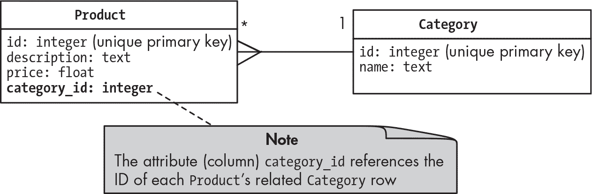
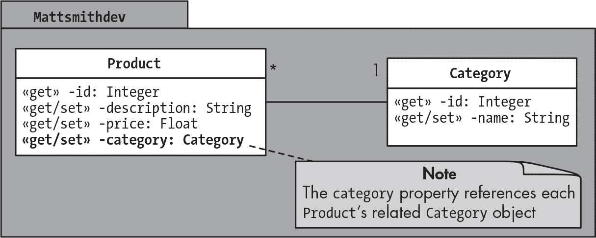
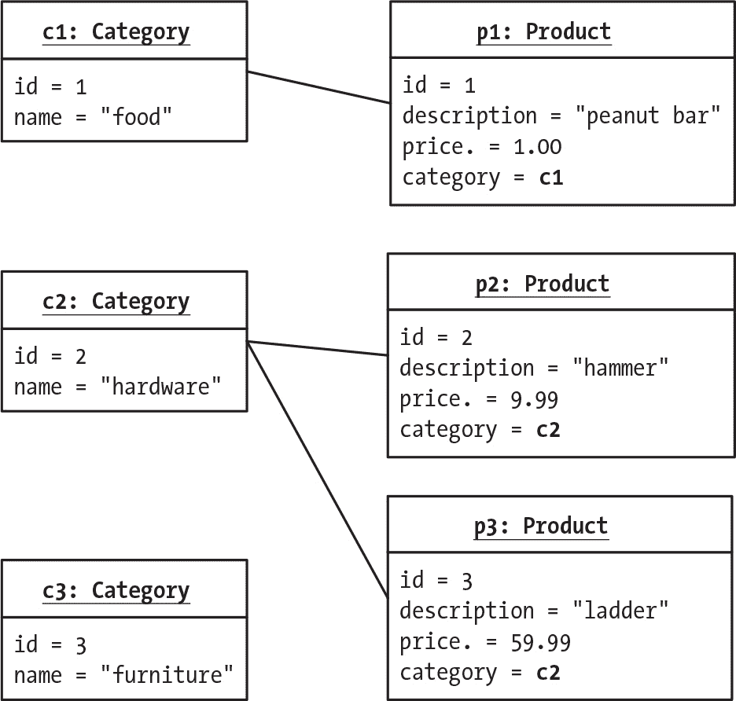
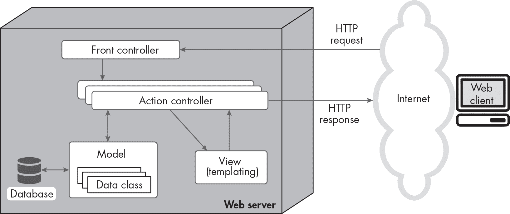

## 第二十七章：27 数据库简介


数据库是计算机系统存储数据的一种方式，使得当代码稍后运行时，数据可以被持久地保存并被记住。我们将在接下来的几章中探讨如何使用 PHP 与数据库进行交互，从本章的数据库基础知识开始。我们将介绍基本的数据库术语，了解数据库的结构，并考虑将 Web 应用程序连接到数据库的动机和好处。

我们还将讨论数据库如何与我们迄今为止讨论的 Web 应用程序架构相结合。你将学习如何将数据库的内容映射到面向对象的类和对象结构中，并且你将看到数据库如何形成早期章节中描述的 MVC 架构模型组件的核心。

> 注意

*本书并不旨在提供关于关系数据库设计的全面指南，这本身就是一个复杂的领域。我们的重点将是通过使用 PHP 与数据库进行交互。有关 SQL 和数据库的更多学习书籍包括*《实用 SQL》（第二版，2022 年），作者 Anthony DeBarros；*《漫画数据库指南》（2009 年），作者 Mana Takahashi；以及*《MySQL 快速教程》（2023 年），作者 Rick Silva，均由 No Starch Press 出版。*

### 关系数据库基础

现代数据库系统大多数是*关系型*的，这意味着它们由一组相互关联的表组成。每个表代表一种实体。例如，客户表可能存储关于电子商务网站客户的信息。

一个表由列和行组成。每列代表实体的一个属性（例如，客户表可能有客户姓名、地址、电话号码等列）。每一行代表实体的一个实例（例如，一个单独的客户）。每一行也叫做*记录*。

数据库表之间的关系通过键来建立；每个*键*是与表中一条记录相关联的唯一标识符。从一个表中引用另一个表的键会在这两个表之间创建一个链接，同时避免数据的重复。继续我们电子商务的例子，我们的客户表中的每个客户可以被赋予一个*主键*，即一个唯一的客户 ID 号码。与此同时，我们可能还会有一个发票表，用于记录交易，每个发票都有一个唯一的 ID 号码。每个发票应与一个客户（发起交易的人）相关联，而每个客户可以与多个发票相关联，因为一个人可以发起多次交易。

我们通过将与每个发票相关联的客户 ID 存储为发票表中的一列来建立这种关系，明确地将每张发票与一个且仅一个客户关联。在发票表的上下文中，客户 ID 被称为*外键*，因为它连接到另一个表中的字段。得益于外键，发票表不需要重复存储客户的姓名、地址和其他信息；我们只需根据给定发票分配的客户 ID，在客户表中查找这些详细信息。这就是关系型数据库的强大之处。

为每一行分配唯一的键还有助于维护数据库的正确性或*完整性*。在进行数据库更改时，这些键充当不同表中数据项之间的链接。系统可以确保有一个与另一个表中引用的键相对应的数据项。可以在数据库中建立规则，防止在尝试创建新数据时，如果它试图链接到不存在的数据项，就会阻止该数据的创建。例如，这可以避免客户为不存在的发票付费，或防止将发票分配给不存在的客户。其他规则可能与数据删除相关，如果我们尝试删除与其他项目关联的项目，则会创建警告或异常。

总的来说，数据库表的结构、表之间的关系以及管理数据完整性的规则被称为该数据库的*关系模式*。复杂的 Web 应用程序通常需要多个并行操作的关系模式。例如，一个模式可能用于存储组织的财务记录，另一个用于人力资源详情，另一个用于库存项目和客户订单。

#### 数据库管理系统

创建、修改、从中检索和存储数据库的软件称为*数据库管理系统（DBMS）*。对于关系型数据库，我们有时更具体地称之为*关系型数据库管理系统（RDBMS）*。在本书中，我们将重点讨论两种 (R)DBMS：MySQL 和 SQLite。这是当今最流行的两个免费开源系统。

一些数据库管理系统（DBMS）作为服务器应用程序运行，需要用户名和密码。它们可以运行在与使用它们的 Web 应用程序相同的计算机系统上，也可以运行在完全独立的互联网服务器上。MySQL 就是一个基于服务器的 DBMS 示例。其他数据库管理系统，如 SQLite，是基于文件的，意味着数据存储在与 Web 应用程序相同计算机上的文件中。像 MySQL 这样的基于服务器的 DBMS 可以与多个数据库模式一起使用，而 SQLite 和大多数其他基于文件的 DBMS 在每个文件中存储单一的数据库模式。例如，一个 SQLite 文件可能存储财务记录数据库，另一个文件可能存储人力资源详情数据库，依此类推。

为了让像 PHP 这样的计算机语言与特定的 DBMS 进行通信，你需要一个*数据库驱动程序*。这个软件组件允许程序通过其标准协议与 DBMS 进行通信。例如，PHP 有 MySQL 驱动程序、SQLite 驱动程序，以及其他数据库管理系统的驱动程序。MySQL 和 SQLite 的 PHP 驱动程序可能已经在你的系统中启用。如果没有，当你尝试运行以下章节中的代码时，会出现驱动程序错误，并且你可能需要在*php.ini*配置文件中进行调整。有关在本地设置这两种数据库系统的说明，请参见附录 B，如果你在 Replit 环境中工作，请参考附录 C。

当你的 PHP 程序需要与 DBMS 交互时，它在运行时使用一个数据库*连接*。这个连接是计算机程序与 DBMS 之间的活跃通信链接。要与基于服务器的数据库系统建立连接，你必须提供主机和端口信息，通常还需要提供适当的用户名和密码认证信息。在某些情况下，可以直接连接到特定的数据库架构（例如，人力资源详情架构）；在其他情况下，会与 DBMS 建立一个通用连接，连接后可以创建新的架构，或选择使用已有的架构。一旦建立了与特定架构的连接，就可以执行所需的操作，其中可能包括创建表和关系、插入或删除数据，或者从架构的表中检索数据。

数据库相对于其他持久存储方法（如文件）的一大优势是，许多 DBMS 设计时就考虑到了多人同时安全使用。因此，将数据库集成到 Web 应用程序中，能够让多人同时与应用程序互动，同时确保系统数据的安全性和完整性。这是基于服务器的 DBMS（如 MySQL）相较于基于文件的 DBMS（如 SQLite）的一个显著优势。虽然 SQLite 允许多个用户同时操作其文件数据库，但当用户进行更改时，它会锁定整个数据库文件。这对于本地机器测试和开发来说没问题，但在面对重流量的真实世界 Web 应用程序时，会导致无法接受的延迟。而像 MySQL 这样的系统可以处理大量并发连接，仅锁定单个表甚至单个数据库行，从而最小化对其他用户的干扰。

基于服务器的数据库管理系统（DBMS）也有可能作为多个实例运行，从而帮助系统处理大量同时在线的用户，支持 web 应用程序及其数据库的多个版本。可以根据需求增加或删除实例，以应对随时间变化的流量负载。这种技术被称为*负载均衡*，许多云服务都自动实现了这一技术。

#### 结构化查询语言

现代大多数关系数据库管理系统（RDBMS）都使用结构化查询语言（SQL）进行操作。SQL 旨在完成与关系数据库交互的三个关键方面：

+   定义相关表格的结构

+   操作存储的数据（创建、更新或删除数据）

+   查询数据（搜索数据库，根据给定的标准进行匹配）

列表 27-1 说明了每种操作的 SQL 语句。

```
CREATE TABLE IF NOT EXISTS product (
    id integer PRIMARY KEY AUTO_INCREMENT,
    description text,
    price float
)

DELETE FROM product WHERE price < 0

SELECT * FROM product WHERE price > 99
```

列表 27-1：SQL 定义、操作和查询语句示例

第一个 SQL 语句创建了一个产品表并定义了其结构。该表中的每个条目将存储产品的 id、描述和价格。每一列都指定了数据类型（例如，价格列为浮动型），id 列被指定为表的主键，这意味着每个表条目应该具有唯一的 id 值。

第二个 SQL 语句演示了如何操作存储在数据库中的数据；该语句删除所有价格为负数的产品表条目。最后，第三个 SQL 语句是数据库查询的示例；它使用 SELECT 请求所有价格大于 99 的产品表条目。

虽然 SQL 不区分大小写，但通常的做法是将 SQL 关键字（如 SELECT、FROM 和 WHERE）写为大写，并将表和列名以及构成语句条件的字符串使用小写字母。遵循这一惯例有助于使 SQL 语句更具可读性。

### 数据库和 Web 应用程序架构

数据库自然适应面向对象的 web 应用程序架构。对象的类可以编写得与存储在数据库表中的数据项紧密映射，数据库及其类通常是 MVC web 应用程序模式中模型（M）组件的首选。

#### 面向对象编程

面向对象编程的类结构可以轻松地映射到关系数据库表。与数据库交互的 web 应用程序的一种常见且直接的结构方式是设计一个与数据库中每个表对应的类。这些*实体类*具有与表的列相对应的属性，类的实例将对应于表中的一条记录（行）。

如果我们需要将数据写入数据库表，我们首先会创建一个包含新数据的适当类的对象，然后使用我们的数据库连接将该对象的数据发送到数据库表。我们甚至可以将数据发送回该对象；例如，如果数据库需要为新记录选择一个新的唯一键，则可以将此值发送回 web 应用程序，并将其存储在相应的对象中以供将来参考。相反，如果我们需要从数据库表中读取整个记录，我们会将检索到的数据读入适当类的新对象，此时应用程序的其他部分可以通过访问该对象来利用数据库数据。

考虑一个实现各种类别产品的 Web 应用程序（及其数据库）。我们可能会有名称为食品、五金和家具的类别，每个产品必须与其中一个类别相关联。图 27-1 显示了数据库的关系模式。这种图表称为 *实体关系（ER）模型*。



图 27-1：展示相关的 Product 和 Category 实体的 ER 图

我们的数据库将有一个 Product 表，包含每个产品的条目，还有一个 Category 表，列出产品可能属于的类别。这些表之间的连接线展示了这些表中的条目如何关联。连接线的 Category 端的“1”表示关系“每个产品都与恰好一个类别相关联。”而 Product 端的鸟脚链接和星号（*）表示关系“每个类别都可以与零个、一个或多个产品相关联。”

Category 表中的每条记录将具有唯一的整数 id 属性（主键）和文本描述。表格 27-1 显示了表中的示例条目。

表格 27-1：类别表的示例行

| id（主键） | name |
| --- | --- |
| 1 | "食品" |
| 2 | "五金" |
| 3 | "家具" |

Product 表中的每条记录也将具有唯一的整数 id 属性作为主键，并具有文本描述和浮动价格。每个产品还将通过 category_id 列与恰好一个类别相关联，该列将存储对 Category 表中某条记录键的引用。同样，这被称为 *外键*。表格 27-2 显示了 Product 表的示例行。

表格 27-2：产品表的示例行

| id（唯一键） | description | price | category_id |
| --- | --- | --- | --- |
| 1 | "花生棒" | 1.00 | 1（食品） |
| 2 | "锤子" | 9.99 | 2（五金） |
| 3 | "梯子" | 59.99 | 2（五金） |

我们可以轻松地将数据库表映射到面向对象的类。图 27-2 显示了 Product 和 Category 的相应类图。请注意，这个 UML 图实际上与 图 27-1 中的 ER 模型是相同的。



图 27-2：相关的 Product 和 Category 类的类图

每个类都包含其对应数据库表的所有列的属性；例如，Product 类具有 id、description、price 和 category 属性。每个 Product 对象将通过其 category 属性与恰好一个 Category 对象相关联，该属性将存储对 Category 对象的引用。请注意，这是我们类结构与数据库结构之间的主要区别。在 Product 数据库表中，category_id 列仅存储与之相关的类别的整数 ID，而在我们的类中，我们可以存储对完整 Category 对象的引用。

图 27-3 显示了当我们从 表 27-1 和 27-2 读取示例数据库行到我们的 Web 应用程序时，将创建的对象。



图 27-3：将产品对象与分类对象连接

我们最终得到了三个产品对象，它们与相应的分类对象相关联。请注意，每个产品对象仅与一个分类对象相关联。相比之下，一个分类对象可以与零个、一个或多个产品对象相关联，因为在某些时候我们可能没有任何产品属于某些分类，也可能只有一个产品，或者更多。

#### 模型-视图-控制器模式

在前面的章节中，我们讨论了 MVC 软件架构，它将操作 Web 应用程序所需的各种任务分配给系统的不同部分。我们主要集中在如何像 Twig 这样的模板库提供 MVC 的视图组件，准备要展示给用户的内容，以及前端控制器和其他专业控制器类如何提供控制器组件，做出如何响应每个用户请求的决策。

到目前为止，我对这种架构中的模型部分，即支撑 Web 应用程序的实际数据，介绍得不多。这正是数据库的作用所在。它以有组织的格式存储数据，并在控制器类的指令下提供或修改数据。与数据库表对应的类也是应用程序模型组件的一部分。图 27-4 说明了数据库在 MVC Web 应用架构中的位置。



图 27-4：MVC 架构，突出显示模型组件

请注意，动作控制器类与（从数据库中读取和修改）*模型类*进行通信。正如你将在接下来的章节中学到的，这些是与数据库进行交互的面向对象类。所有的数据库交互都与应用程序的控制器和视图组件完全分离。这种模块化意味着我们可以更换底层数据库（例如从基于文件的 DBMS 更换到基于服务器的 DBMS），而不需要对前端控制器、动作控制器类或模板做任何修改。

### 总结

在本章中，我们回顾了数据库的概念，特别是基于 SQL 的关系型数据库，并考虑了将数据库添加到 Web 应用程序中的一些优势。我们还探讨了数据库在 Web 应用架构中的作用，包括数据库如何成为 MVC 模式模型组件的核心部分。我们观察到，关系型数据库中的表、列和行与面向对象编程（OOP）中使用的类、属性和实例之间有着密切的映射关系。通过这次介绍，你现在已为本书剩余章节做好准备，在接下来的章节中，你将学习如何使用 PHP 连接、创建、修改和从 MySQL 和 SQLite 关系型数据库中检索数据。

### 练习

1.   阅读 phoenixNAP 文章《什么是数据库？》中的一些数据库历史内容，作者为 Milica Dancuk (*[`phoenixnap.com/kb/what-is-a-database`](https://phoenixnap.com/kb/what-is-a-database)*).

2.   DB Fiddle (*[`www.db-fiddle.com`](https://www.db-fiddle.com)*) 是一个非常棒的在线资源，可以用来练习 SQL 语句和设计数据库。你可以创建并填充表格、查询数据并查看结果。尝试使用 DB Fiddle 来实现本章中讨论的产品和类别数据库表。为每个数据库表插入三行示例数据（参见 表 27-1 和 27-2），然后运行查询以选择每个表中的数据。
