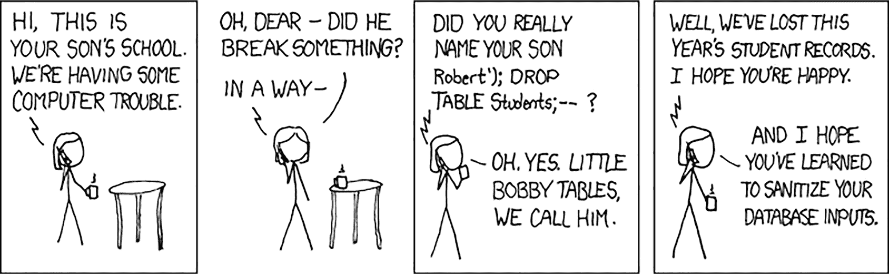
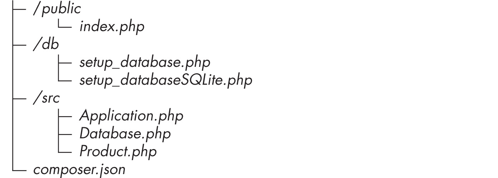
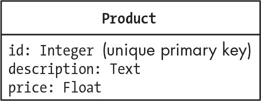
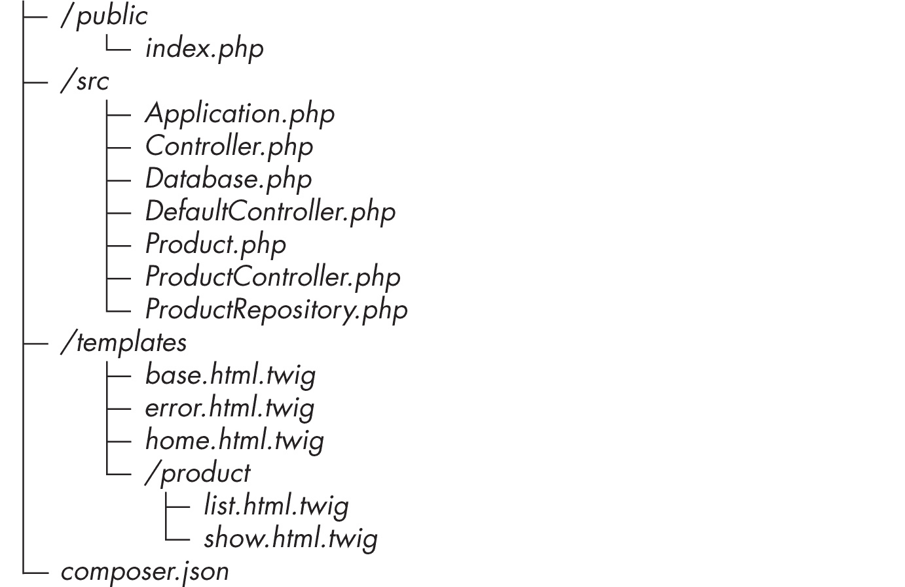
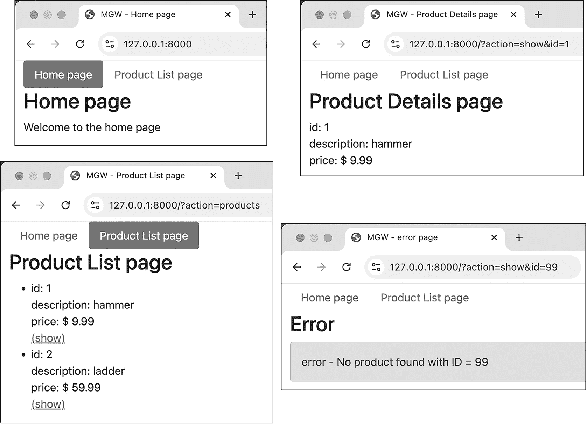
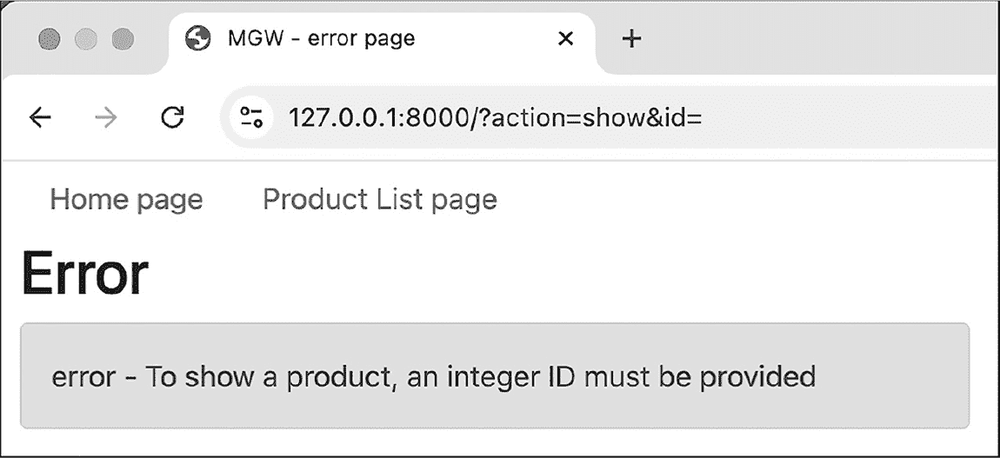

## 第二十八章：28 使用 PDO 库进行数据库编程


将数据库集成到 Web 应用程序中需要编写代码来执行操作，如打开与数据库系统的连接；创建数据库及其表结构；通过插入、删除和更新来操作数据库数据；以及查询和检索符合期望条件的数据。在本章中，您将了解 PHP 数据对象（PDO）库，它使得执行这些数据库操作变得更加简单。我们将使用该库逐步开发一个简单的多页面 Web 应用程序，从数据库中提取信息。

### PDO 库

自 2005 年以来，数据库操作的 PDO 库已成为 PHP 语言的内置功能，并且通过各种驱动程序与许多数据库管理系统（DBMS）兼容，包括 MySQL 和 SQLite，正如我们将在本章中看到的那样。这使得开发灵活的 Web 应用程序变得极为简单，开发者可以在最少修改代码的情况下切换数据库管理系统。在 PDO 出现之前，切换到不同的 DBMS 意味着使用不同的库。

除了提供一种标准（因此是可重用的）方式来在不同的关系型数据库系统上运行 SQL 命令外，PDO 还通过使用*预处理语句*使得编写更安全的数据库通信代码变得更加容易。这些是数据库查询的模板，包括一些占位符，用于在查询执行时将其设置为实际值。基本的模式是将 SQL 语句构建为一个字符串（包括任何占位符），将该字符串传递给 PDO 连接对象以“准备”该语句，传递任何用于填充占位符的值，然后在数据库上执行准备好的语句。

通过预处理语句处理 SQL 代码可以避免 SQL 注入攻击问题，因此本书中我们只会使用预处理语句。在*SQL 注入*中，接收到的用户输入（例如通过 Web 表单或登录字段）被连接到 SQL 查询字符串中，并在数据库上执行。恶意用户可以利用这种常见的 Web 应用程序漏洞，修改原始 SQL 查询或添加一个额外的 SQL 查询，然后也在数据库上执行。Web 漫画 XKCD 以幽默的方式展示了 SQL 注入攻击，见图 28-1。



图 28-1：Randall Munroe 的“Bobby Tables”漫画（[`xkcd.com/327/`](https://xkcd.com/327/)）是一个轻松幽默的例子，展示了 SQL 注入攻击可能造成的损害。

使用 PDO 的另一个好处是它提供了 *对象获取模式*，通过该模式，从数据库查询到的数据会自动打包成 PHP 代码中相应类的对象（*模型类*）。你只需告诉 PDO 哪些类对应哪些数据库表。如果没有这个特性，你将不得不编写代码来处理如何根据查询结果构建对象的细节，这通常需要与多维数组和列标题打交道。

在本章中，我们将探索如何使用 PDO 库的基础知识，同时开发一个面向对象的、数据库驱动的 web 应用程序。

> 注意

*本章仅仅触及了 PDO 库功能的皮毛。想了解更多关于它的功能，我推荐那篇名为“（唯一合适的）PDO 教程”的文章，在线阅读地址为* [`phpdelusions.net/pdo`](https://phpdelusions.net/pdo)*。*

### 一个简单的数据库驱动 web 应用程序

要开始使用 PDO，我们首先将创建一个简单的应用程序，其中有一个页面用来从数据库中检索并显示一些产品的信息。这将展示如何连接数据库、创建表、填充数据，并以面向对象的方式检索这些数据以供应用程序使用。在《一个多页面的数据库驱动 web 应用程序》一节中，位于 第 553 页，我们将扩展应用程序，增加多个页面、组织良好的控制器逻辑和 Twig 模板。

目前，项目将具有以下文件结构：



首先，创建一个新的项目文件夹，并添加通常的 *composer.json* 文件，声明 Mattsmithdev 命名空间的类位于 *src* 文件夹中。然后添加一个 *public* 文件夹，其中包含常见的 *index.php* 脚本，读取自动加载器，创建一个 Application 对象并调用它的 run() 方法。这样，我们就准备好设置数据库了。*db* 文件夹将包含创建 MySQL 和 SQLite 版本数据库的脚本，以支持我们的应用程序。

#### 设置数据库架构

我们的 web 应用程序将能够使用 MySQL 或 SQLite 作为数据库管理系统（DBMS），在本节中，我们将编写 PHP 脚本，使用这两种系统来设置一个新的数据库架构。对于小型本地项目，项目的 *var* 文件夹中的 SQLite 数据库文件通常已经足够。对于大规模、生产就绪的 web 应用程序，MySQL 更为常见，且数据库通常运行在不同的服务器上（或者多个服务器上）。

对于这个简单的例子，我们将把 MySQL 和 SQLite 数据库设置脚本保存在项目的 *db* 文件夹中。然而，在更现实的场景中，数据库结构应该是固定的，数据库也已经设置好了，因此这些脚本通常不会作为应用程序文件夹结构的一部分保留下来。

对于我们的数据库，我们将创建一个由单个名为 product 的表组成的简单架构，并将两条示例记录插入该表中。图 28-2 显示了该表的 ER 模型。



图 28-2：产品表的 ER 模型

如图所示，产品表将包含产品的 id（一个唯一的数字标识符）、描述和价格字段。

##### MySQL

清单 28-1 使用 PDO 来创建 MySQL 数据库架构，定义一个产品表的结构，并将两条示例记录插入到该表中。将这个脚本命名为*create_database.php*并保存在*db*文件夹中。

```
<?php
❶ define('DB_NAME', 'demo1');

❷ $connection = new \PDO(
    'mysql:host=localhost:3306',
    'root',
    'passpass'
);

❸ $sql = 'CREATE DATABASE ' . DB_NAME ;
$stmt0 = $connection->prepare($sql);
$stmt0->execute();

$connection = new \PDO(
  ❹ 'mysql:dbname=' . DB_NAME . ';host=localhost:3306',
    'root',
    'passpass'
);

$sql = 'CREATE TABLE IF NOT EXISTS product ('
  ❺ . 'id integer PRIMARY KEY AUTO_INCREMENT,'
    . 'description text,'
    . 'price float'
    . ')';
$stmt1 = $connection->prepare($sql);
$stmt1->execute();

$sql = "INSERT INTO product (description, price) VALUES ('hammer', 9.99)";
$stmt2 = $connection->prepare($sql);
$stmt2->execute();

$sql = "INSERT INTO product (description, price) VALUES ('ladder', 59.99)";
$stmt3 = $connection->prepare($sql);
$stmt3->execute();
```

清单 28-1：用于创建 MySQL 数据库的脚本

首先，我们定义一个 DB_NAME 常量来保存数据库架构名称'demo1' ❶。将名称放入常量中使得这个脚本易于编辑，并且可以在其他数据库架构上重用——只需更新常量中的名称。

接下来，我们创建一个新的 PDO 对象以建立与数据库的连接，将结果存储在$connection 变量中 ❷。第一个参数是*数据源名称（DSN）*，它是一个标准化的字符串，提供有关数据库连接的信息。DSN 字符串以'mysql:'开头，告诉 PDO 我们想连接到 MySQL 服务器，后面跟着一个或多个由分号分隔的键=值对。现在，我们只需要一个键=值对来指定 MySQL 数据库运行的主机是 localhost 服务器，端口为 3306。我们在这里不包含架构名称，因为我们还没有创建该架构。传递给 PDO 构造函数的第二个和第三个参数提供了用户名'root'和密码'passpass'。将它们替换为您 MySQL 设置的数据库用户名和密码（请参见附录 B）。

接下来，我们构建并执行一个 SQL 语句来创建 DB_NAME 常量中指定的数据库架构 ❸。我们将 SQL 语句作为字符串存储在$sql 变量中，内容为 SQL 关键字'CREATE DATABASE'加上架构名称。我们将该字符串传递给$connection 对象的 prepare()方法，以安全地准备该语句，并将结果（PDO 库的 PDOStatement 类的一个对象）存储在$stmt0 变量中。然后我们执行预处理的语句。在与数据库交互时，我们将反复使用这种准备和执行 SQL 语句的基本模式。在大多数情况下，我们将在语句执行后执行某个操作，例如返回已检索对象的列表，或者确认数据库已按预期更改，并通知用户是否已经更改。

现在我们已经创建了架构，接下来需要在其中创建产品表。首先，我们通过新建一个连接到数据库架构的连接来覆盖$connection，而不是连接到 MySQL 服务器。请注意，这次我们在构造 PDO 对象时在 DSN 字符串中指定了架构名称 ❹。具体来说，我们将 DB_NAME 常量的值作为 dbname 键的值，并用分号（;）将这个键/值对与 DSN 字符串中的其他部分分开。然后我们构建并执行另一个 SQL 语句，创建包含 id、description 和 price 字段的产品表。MySQL 数据库支持自增功能，它会自动生成唯一的数字键并按顺序排列。我们的 SQL 语句利用了这个功能，作为 id 字段主键声明的一部分，因此我们不必担心手动设置产品 ID ❺。

我们通过创建并执行两个 INSERT SQL 语句来为产品表添加两行数据：一把售价 9.99 的'锤子'和一把售价 59.99 的'梯子'。我们没有为每个产品的 id 字段提供值，因为 MySQL 会自动生成它们。

编写完此脚本后，输入 php db/create_database.php 在命令行运行它。这将创建并填充 MySQL 架构。

##### SQLite

现在，让我们将列表 28-1 中的脚本修改一下，以便创建与 SQLite 数据库文件相同的架构。正如你所看到的，过程类似，因为 PDO 库可以像与 MySQL 一样轻松地与 SQLite 一起使用。将列表 28-2 中的内容保存为*create_databaseSQLite.php*，并放入项目的*db*子目录中。SQLite 数据库文件本身将位于*var*子目录中，该目录是在脚本运行时创建的。

```
<?php
define('FILENAME', 'demo1.db');
❶ define('FOLDER_PATH', __DIR__ . '/../var/');

if (!file_exists(FOLDER_PATH)) {
    mkdir(FOLDER_PATH);
}

$connection = new \PDO(
❷'sqlite:' . FOLDER_PATH . FILENAME
);

$sql = 'CREATE TABLE IF NOT EXISTS product ('
❸. 'id integer PRIMARY KEY AUTOINCREMENT,'
 . 'description text,'
 . 'price float'
 . ')';
$stmt1 = $connection->prepare($sql);
$stmt1->execute();

$sql = "INSERT INTO product (description, price) VALUES ('hammer', 9.99)";
$stmt2 = $connection->prepare($sql);-
$stmt2->execute();

$sql = "INSERT INTO product (description, price) VALUES ('ladder', 59.99)";
$stmt3 = $connection->prepare($sql);
$stmt3->execute();
```

列表 28-2：创建 SQLite 数据库的脚本

首先，我们定义数据库文件名（'demo1.db'）和文件夹路径的常量。请记住，路径中的双点（..）表示父目录，因此*/../var*表示*var*应该与运行脚本的目录处于同一级别 ❶。如果该目录不存在，我们会创建它。

然后，我们再次创建一个新的 PDO 对象，传入一个 DSN 字符串作为参数，提供我们希望连接的数据库信息 ❷。这次，DSN 字符串以'sqlite:'开头，告诉 PDO 我们希望连接到 SQLite 服务器，后面跟着完整的文件路径，包括目录路径和文件名，指向所需的数据库。与 MySQL 不同，我们不需要编写并执行创建数据库架构的 SQL 语句；如果需要，SQLite 数据库文件将在建立连接时自动创建。而且，由于 SQLite 只是操作一个文件，因此不需要任何用户名或密码。

一旦 PDO 建立了数据库连接，通常不再关心它正在使用的数据库管理系统（DBMS），因此脚本的其余部分与 清单 28-1 几乎相同：我们创建并执行 SQL 语句来创建产品表并向其中添加两条记录。唯一的区别是 SQLite 使用没有下划线的关键字 AUTOINCREMENT（与 MySQL 的 AUTO_INCREMENT 不同） ❸。

与 MySQL 版本一样，你需要运行此脚本来创建和填充 SQLite 数据库模式。在命令行输入 php db/create_databaseSQLite.php。

#### 编写 PHP 类

现在，我们通过编写一些 PHP 类来组织我们简单 Web 应用程序的逻辑。目前，我们需要三个类。像往常一样，我们将创建一个 Application 类，作为应用程序的前端控制器。我们还将编写一个 Product 类，具有与数据库中产品表字段对应的属性，以便于在数据库与 PHP 代码之间传输数据。最后，我们将设计一个 Database 类，用于封装创建数据库连接的逻辑。这样不仅有助于保持代码整洁和面向对象，而且还使我们能够轻松重构应用程序，在 MySQL 和 SQLite 之间切换，而不会对其他代码产生太大影响。

我们从 Application 类开始。在 *src/Application.php* 中声明此类，如 清单 28-3 所示。

```
<?php
namespace Mattsmithdev;

use Mattsmithdev\Product;

class Application
{
  ❶ private ?\PDO $connection;

    public function __construct()
    {
        $db = new Database();
      ❷ $this->connection = $db->getConnection();
    }

    public function run()
    {
        if (NULL != $this->connection){
          ❸ $products = $this->getProducts();
 print '<pre>';
            var_dump($products);
            print '</pre>';
        } else {
            print '<p>Application::run() - sorry '
                . '- there was a problem with the database connection';
        }
    }

    public function getProducts(): array
    {
        $sql = 'SELECT * FROM product';
        $stmt = $this->connection->prepare($sql);
        $stmt->execute();
      ❹ $stmt->setFetchMode(\PDO::FETCH_CLASS, Product::class);
        $products = $stmt->fetchAll();

        return $products;
    }
}
```

清单 28-3：Application 类

我们首先为类添加一个私有的连接属性 ❶。该属性的数据类型是可空的 ?\PDO，因此它将是指向 PDO 数据库连接对象的引用，或者是 NULL（如果连接失败）。在类的构造方法中，我们创建一个新的 Database 对象，并调用其 getConnection() 方法（我们稍后会定义该类和方法）。

接下来，我们将生成的数据库连接引用存储到 Application 类的连接属性中 ❷。这看起来可能比之前直接连接数据库的方式更为间接，但将建立连接的细节委托给 Database 类，可以让 Application 类无论使用何种 DBMS 都能正常工作。

接下来我们声明应用程序的 run() 方法。在其中，我们测试连接属性以确保它不是 NULL，如果不是，则调用 getProducts() 方法 ❸，该方法返回从数据库检索到的 Product 对象数组。为简便起见，我们将数组打印出来，并在前面加上 HTML <pre> 标签。（我们将在本章后续扩展应用程序时，精细化项目以输出有效的 HTML。）如果连接为 NULL，则打印错误信息。

我们通过声明 getProducts() 方法来结束类的定义。该方法使用连接属性来准备和执行一个 SQL 语句，从数据库的产品表中选择所有行。此查询的原始结果保存在 PDOStatement 对象中，通过 $stmt 变量引用，但我们希望将结果表示为 Product 对象。

这时，PDO 库的对象获取模式派上用场。我们通过调用 $stmt->setFetchMode() ❹ 来设置它，传递 \PDO::FETCH_CLASS 常量作为第一个参数，表示我们希望结果是类的对象。第二个参数 Product::class 告诉 PDO 使用哪个（带命名空间的）类。::class 魔术常量返回完整限定类名字符串（在这个例子中是 'Mattsmithdev\\Product'）。然后，我们调用 $stmt->fetchAll() 来获取结果。由于我们从数据库中选择了多行，这将创建一个 Product 对象的数组，而不仅仅是一个对象。我们通过 $products 变量返回这个数组。

现在我们将创建 Product 模型类。该类的属性必须与产品数据库表的列相对应（即具有相同的名称和数据类型），以便 PDO 能够成功地将查询结果返回为 Product 对象。将 Listing 28-4 的内容保存到 *src/Product.php* 文件中。

```
<?php
namespace Mattsmithdev;

class Product
{
    private int $id;
    private string $description;
    private float $price;
}
```

Listing 28-4：Product 类

这段代码做的就是声明该类的三个私有属性（id、description 和 price），它们的名称和数据类型与产品表中的字段相匹配。这就是 PDO 库需要的所有内容，用以将表中的行作为该类的对象检索出来。由于目前我们的应用程序仅仅使用 var_dump() 来显示一个 Product 对象数组，我们从未需要访问类的私有属性。当我们扩展应用程序时，我们将为 Product 类添加访问器方法，这样我们就可以编写一个更优雅的模板页面，遍历并输出每个对象的属性，以自定义且有效的 HTML 格式展示。

最后，我们声明 Database 类来管理建立并存储 MySQL 数据库连接的过程。创建 *src/Database.php* 文件，内容为 Listing 28-5。

```
<?php
namespace Mattsmithdev;

class Database
{
  ❶ const MYSQL_HOST = 'localhost';
    const MYSQL_PORT = '3306';
    const MYSQL_USER = 'root';
    const MYSQL_PASSWORD = 'passpass';
    const MYSQL_DATABASE = 'demo1';

    const DATA_SOURCE_NAME =  'mysql:dbname=' . self::MYSQL_DATABASE
      ❷ . ';host=' . self::MYSQL_HOST . ':' . self::MYSQL_PORT;

  ❸ private ?\PDO $connection;

    public function getConnection(): ?\PDO
    {
        return $this->connection;
 }

    public function __construct()
    {
      ❹ try {
            $connection = new \PDO(
                self::DATA_SOURCE_NAME,
                self::MYSQL_USER,
                self::MYSQL_PASSWORD
            );
            $this->connection = $connection;
      ❺} catch (\Exception $e) {
            print "Database::__construct() - Exception '
                . '- error trying to create database connection";
        }
    }
}
```

Listing 28-5：Database 类

我们声明类常量，用于存储创建 MySQL 数据库实时连接所需的五个独立数据项 ❶：主机（localhost）、端口（3306）、MySQL 用户名和密码（根据需要填写），以及我们想要操作的数据库架构名称（demo1）。然后，我们将其中一些常量组合成另一个常量，表示 DSN 字符串，该字符串将作为创建 PDO 对象时传递的第一个参数 ❷。

接下来，我们为该类声明一个私有连接属性 ❸，以及一个公有的 getConnection() 方法来返回其值。这个属性的数据类型为可空的 ?\PDO，因此它要么为 NULL，要么为一个 PDO 对象的引用。

在数据库类的构造方法中，我们通过创建一个新的 PDO 对象来尝试连接 MySQL 数据库，使用类常量提供所需的 DSN 字符串、用户名和密码。数据库连接的引用存储在类的 connection 属性中。这些操作被包装在一个 try 语句中❹，因此在此过程中抛出的任何异常都会被捕获❺，并打印出错误信息。因此，每当创建一个新的数据库对象（来自应用程序类中）时，构造方法都会尝试连接数据库。随后调用 getConnection() 方法将返回一个 PDO 连接对象，或者如果创建连接时出现问题，则返回 NULL。

这样，我们就可以准备好运行应用程序并查看结果了。当你访问运行 Web 应用程序的本地主机服务器时，应该能看到类似于 图 28-3 的内容。


图 28-3：显示 $products 数组内容的网页

在这一阶段，网页看起来并不复杂；它仅显示了 $products 数组的 var_dump()。由于我们尚未在应用程序类的 run() 方法中包含任何决策逻辑，因此无论 URL 编码的请求变量如何，都会始终显示这个页面。然而，数组的打印内容表明我们已经成功从产品的 MySQL 数据库表中检索到条目，并将它们映射为我们自定义的 Product 类的对象，这是数据库驱动应用程序开发中的一个重要第一步。

#### 从 MySQL 切换到 SQLite

之前，我们在 MySQL 和 SQLite 中设置了相同的数据库模式；那么，如何重构我们的应用程序以使用 SQLite 模式而不是 MySQL 呢？我们已经设计了应用程序，使得所有数据库管理系统（DBMS）特定的逻辑都被封装在数据库类中，并且我们只在应用程序类的构造方法中引用该类一次（见 清单 28-3）。在这里，我们使用语句 $db = new Database() 来获取新数据库对象的引用，然后调用其 getConnection() 方法来获得一个 PDO 数据库连接。

让我们将此语句替换为创建一个 DatabaseSQLite 类实例的语句，该实例将连接到 SQLite，而不是 MySQL。 清单 28-6 显示了对 *src/Application.php* 的必要更改。

```
--snip--
    public function __construct()
    {
        $db = new DatabaseSQLite();
        $this->connection = $db->getConnection();
    }
--snip--
```

清单 28-6：更新应用程序类以创建 DatabaseSQLite 对象而不是 Database 对象

现在，我们需要声明一个 DatabaseSQLite 类来封装创建和存储实时 SQLite 数据库连接的工作。为了让我们其余的应用程序代码保持原样，它需要一个返回 PDO 连接对象引用的 getConnection() 方法，就像数据库类一样。创建 *src/DatabaseSQLite.php* 文件，并包含 清单 28-7 中的代码。

```
<?php
namespace Mattsmithdev;

class DatabaseSQLite
{
    const DB_DIRECTORY = __DIR__ . '/../var';
    const DB_FILE_PATH = self::DB_DIRECTORY . '/demo1.db';

    const DATA_SOURCE_NAME =  'sqlite:'  . self::DB_FILE_PATH;

    private ?\PDO $connection = NULL;

    public function getConnection(): ?\PDO
    {
        return $this->connection;
    }

    public function __construct()
    {
        try {
            $this->connection = new \PDO(self::DATA_SOURCE_NAME);
        } catch (\Exception $e){
            print 'DatabaseSQLite::__construct() - Exception - '
                . 'error trying to create database connection'
                . PHP_EOL;
        }
    }
}
```

清单 28-7：DatabaseSQLite 类

这个新类遵循与旧 Database 类相同的结构；只有与 SQLite 相关的细节不同。我们首先声明用于创建 SQLite 数据库连接所需的数据常量：包含数据库文件的目录位置（DB_DIRECTORY）；包含目录位置和文件名的完整文件路径（DB_FILE_PATH）；以及 DSN 字符串，包含完整文件路径（DATA_SOURCE_NAME）。然后我们声明一个私有连接属性，数据类型为可为空的 \PDO（?\PDO），并像以前一样提供公共的 getConnection()方法。最后，我们声明一个构造方法，使用 try 和 catch 语句来尝试创建新的 PDO 数据库连接对象，并报告任何错误——这与 Database 类一样。

重新运行网页服务器后，你应该会看到应用程序的功能和之前完全一样，展示了从数据库中获取的$products 数组的内容。唯一不同的是，现在我们使用的是 SQLite 而不是 MySQL。这个切换几乎不需要更新代码，除了声明新的 DatabaseSQLite 类，并修改一行代码以创建一个 DatabaseSQLite 对象，而不是 Database 对象。

### 一个多页面的数据库驱动网页应用程序

现在让我们将这个数据库驱动的网页应用程序扩展为多个页面，包括主页、产品列表页、显示单个产品详情的页面和显示错误消息的页面。我们还将使用 Twig 模板引擎来简化这些页面设计的过程。扩展后的项目将具有以下文件结构：



图 28-4 展示了该网站的四个页面。



图 28-4：扩展后的网页应用程序

页面使用了 Bootstrap 格式化的 HTML，并提供了一个导航栏，链接到主页和产品列表。当点击某个产品旁边的*(show)*链接时，产品的详细信息将在新页面上显示。请注意，点击的产品的 ID 会作为查询字符串的一部分出现在页面的 URL 中（例如，*id=1*显示关于锤子的页面）。如果发生错误，比如缺少 ID 或 ID 与数据库中的行不匹配，错误页面将显示一个适当的错误消息；图 28-4 中的示例显示浏览器地址栏中 ID 为 99，并且有错误消息，表示没有找到具有该 ID 的产品。

由于应用程序将涉及多个操作，我们将创建两个控制器类：ProductController 用于列出所有产品并显示单个项目的详细页面，DefaultController 用于显示主页和错误信息页面。我们将恢复使用 MySQL 和原始的 Database 类来管理数据库连接，但请记住，你始终可以通过改用 DatabaseSQLite 类来切换到 SQLite。由于项目将使用 Twig 模板，请确保在命令行中运行 `composer require twig/twig` 来将 Twig 库添加到项目中。

#### 管理产品信息

让我们开始扩展应用程序，重点关注通过数据库交互管理产品信息的类。首先，我们将为 Product 类添加 getter 和 setter 方法。这是必要的，因为应用程序现在需要单独访问 Product 对象的属性，以比简单的 var_dump() 更优雅的方式显示它们。更新 *src/Product.php*，使其与列表 28-8 的内容一致。

```
<?php
namespace Mattsmithdev;

class Product
{
 private int $id;
 private string $description;
 private float $price;

    public function getId(): int
    {
        return $this->id;
    }

    public function setId(int $id): void
    {
        $this->id = $id;
    }

    public function getDescription(): string
    {
        return $this->description;
    }

    public function setDescription(string $description): void
    {
        $this->description = $description;
    }

    public function getPrice(): float
    {
        return $this->price;
    }

    public function setPrice(float $price): void
    {
        $this->price = $price;
    }
}
```

列表 28-8：具有每个属性的 getter 和 setter 方法的 Product 类

在这里，我们为 Product 类的三个属性：id、description 和 price 添加了简单的 getter 和 setter 方法。这是该类的六个新方法。

我们现在将通过将与从数据库检索产品相关的逻辑放入 ProductRepository 类中，来更好地组织我们的应用程序代码。在数据库驱动的应用程序中，使用这种类（称为*仓库类*）来将访问数据库的逻辑与应用程序中的其他逻辑分离是很常见的。仓库类方法接受并返回对象，处理与数据库的任何交互（通过 Database 类本身帮助建立数据库连接）。应用程序的其余部分则处理这些返回的对象，根本不涉及数据库。

我们的 ProductRepository 类将包括一个方法来检索所有产品，就像我们最初在 Application 类中实现的那样，同时还将新增一个方法，通过给定的 ID 检索单个产品。（通常，仓库类也会有其他数据库操作方法，比如添加、更新或删除条目。我们将在第二十九章中讨论这些操作。）由于这个新类需要与数据库交互，它将负责创建必要的 Database 对象。这些更改将使得主要的 Application 类能够专注于控制器逻辑。

创建新的 ProductRepository 类，在 *src/ProductRepository.php* 中，如列表 28-9 所示。黑色代码是全新的；灰色代码来自 Application 类（请参见列表 28-3）。

```
<?php
namespace Mattsmithdev;

class ProductRepository
{
    private ?\PDO $connection = NULL;

 public function __construct()
 {
 $db = new Database();
 $this->connection = $db->getConnection();
 }

    public function findAll(): array
    {
      ❶ if (NULL == $this->connection) return [];

 $sql = 'SELECT * FROM product';
 $stmt = $this->connection->prepare($sql);
 $stmt->execute();
 $stmt->setFetchMode(\PDO::FETCH_CLASS, Product::class);
 $products = $stmt->fetchAll();

 return $products;
 }

    public function find(int $id): ?Product
    {
        if (NULL == $this->connection) return NULL;

 $sql = 'SELECT * FROM product WHERE id = :id';
        $stmt = $this->connection->prepare($sql);

      ❷ $stmt->bindParam(':id', $id);
        $stmt->execute();

        $stmt->setFetchMode(\PDO::FETCH_CLASS, Product::class);
      ❸ $product = $stmt->fetch();

      ❹ if ($product == false) {
            return NULL;
        }

        return $product;
    }
}
```

列表 28-9：新的 ProductRepository 类

我们声明了一个私有的连接属性，接着是一个构造方法，该方法创建一个新的 Database 对象，并调用其 getConnection() 方法来获取数据库连接。这与原始的 Application 类相同。接下来，我们声明一个 findAll() 方法，其中包含了 Application 类中 getProducts() 方法的逻辑。（由于这已经是 ProductRepository 类中的一个方法，所以我们不需要在方法名中使用 *product* 一词。）该方法以一行额外的代码开始，用于测试数据库连接是否为 NULL，如果是的话，返回一个空数组 ❶。这是必要的，因为 Application 类现在不再能够访问数据库连接。如果连接不为 NULL，方法会从数据库中获取所有产品，并将它们作为一个 Product 对象数组返回，和之前一样。

接下来，我们声明了新的 find() 方法。该方法接受一个整数类型的 $id 参数，用于从数据库表中检索单个 Product 对象。同样，该方法的第一条语句是对数据库连接的 NULL 测试。如果连接为 NULL，方法会立即返回 NULL 并结束执行。如果连接不为 NULL，我们准备一个 SQL 查询字符串 'SELECT * FROM product WHERE id = :id'。其中的 :id 是一个命名的 PDO 占位符，由冒号和一个标识符（id）组成，用来替换 SQL 语句中需要填充的变量值部分。

我们使用 PDO 语句对象的 bindParam() 方法，将占位符与 $id 参数的值绑定 ❷。这一机制使得 PDO 的预处理语句能够防止 SQL 注入攻击。占位符语法强制要求 $id 的值作为要在 id 列中查找的可能值，而变量的值不可能改变查询本身，从而避免了潜在的恶意操作。

该方法使用 PDO 的对象提取模式，将查询结果作为一个 Product 对象（如果数据库中没有匹配的产品 ID，则返回 NULL）。注意，我们是通过调用 $stmt->fetch() ❸ 获取 Product 对象，而不是像在 findAll() 方法中那样使用 $stmt->fetchAll()，因为这次我们只期望得到一个单一的结果。由于 fetch() 方法在失败时返回的是 false（而非 NULL），我们会检查该值，并在没有成功获取对象时返回 NULL ❹。

#### 实现控制器逻辑

接下来，我们将重点关注实现应用程序控制器逻辑的类。首先，我们将从 Application 类中移除与数据库相关的代码（因为这些代码现在已经放入了 ProductRepository），并更新该类，以便它能够接收请求并将其委派给适当的控制器。修改 *src/Application.php* 文件，使其与 Listing 28-10 中的内容一致。

```
<?php
namespace Mattsmithdev;

class Application
{
    private DefaultController $defaultController;
    private ProductController $productController;

    public function __construct()
    {
        $this->defaultController = new DefaultController();
        $this->productController = new ProductController();
    }

    public function run(): void
    {
        $action = filter_input(INPUT_GET, 'action');

        switch ($action)
        {
            case 'products': ❶
                $this->productController->list();
                break;

            case 'show': ❷
                $id = filter_input(INPUT_GET, 'id', FILTER_SANITIZE_NUMBER_INT);
                if (empty($id)) {❸
                    $this->defaultController->
error('error - To show a product, an integer ID must be provided');
                } else {❹
                    $this->productController->show($id);
                }
                break;

            default: ❺
                $this->defaultController->homepage();
        }
    }
}
```

Listing 28-10：更新后的 Application 类，包含简单的前端控制器逻辑

我们声明了两个私有的 defaultController 和 productController 属性，然后使用构造函数将它们填充为 DefaultController 和 ProductController 对象。接着，我们声明了 run() 方法，该方法从传入的 URL 中获取 $action 的值，并将其传递给 switch 语句来决定要做什么。如果值是 'products' ❶，我们调用 ProductController 对象的 list() 方法来显示列出所有产品的页面。

如果 $action 的值是 'show' ❷，我们希望显示一个包含单个产品详情的页面。为此，我们尝试从 URL 中提取一个整数 $id 变量，使用 FILTER_SANITIZE_NUMBER_INT 来移除变量中的非整数字符。如果 $id 最终为空 ❸，我们通过将错误消息字符串传递给 DefaultController 对象的 error() 方法来显示错误页面。如果 $id 的值不为空 ❹，我们将其传递给 ProductController 对象的 show() 方法以显示该产品页面。最后，我们声明了 switch 语句的默认操作 ❺，即通过调用 DefaultController 对象的 homepage() 方法来显示主页。

现在我们将创建一个抽象的 Controller 类，它将成为我们两个控制器类 DefaultController 和 ProductController 的超类。在 *src/Controller.php* 中创建包含 列表 28-11 内容的代码。请注意，这个类与 第 436 页 的列表 22-8 是一样的。

```
<?php
namespace Mattsmithdev;

use Twig\Loader\FilesystemLoader;
use Twig\Environment;

abstract class Controller
{
    const PATH_TO_TEMPLATES = __DIR__ . '/../templates';

    protected Environment $twig;

    public function __construct()
    {
        $loader = new FilesystemLoader(self::PATH_TO_TEMPLATES);
        $this->twig = new Environment($loader);
    }
}
```

列表 28-11：抽象的 Controller 超类，提供一个 twig 属性

我们声明这个类为抽象类，以便它不能被实例化。我们为 Twig 模板目录路径声明了一个类常量。然后我们声明了一个具有受保护可见性的 twig 属性，以便它可以在该类的子类方法中使用。在类的构造函数中，我们创建了两个 Twig 对象：FilesystemLoader 对象和 Environment 对象。后者包含了至关重要的 render() 方法，并存储在 twig 属性中，而前者则帮助 Environment 对象访问模板文件。

在声明了这个 Controller 超类之后，我们现在可以声明将从它继承的子类。我们从 DefaultController 开始，它将负责显示主页和错误页面。在 *src/DefaultController.php* 中声明该类，如 列表 28-12 所示。

```
<?php
namespace Mattsmithdev;

class DefaultController extends Controller
{
  ❶ public function homepage(): void
    {
        $template = 'home.xhtml.twig';
        $args = [];
        print $this->twig->render($template, $args);
    }

  ❷ public function error(string $message): void
    {
        $template = 'error.xhtml.twig';
        $args = [
            'message' => $message
        ];
        print $this->twig->render($template, $args);
    }
}
```

列表 28-12：用于简单页面操作的 DefaultController 类

我们声明这个类继承自 Controller，以便它可以继承超类的 twig 属性。该类的 homepage() 方法 ❶ 调用继承的 twig 属性的 render() 方法来渲染 *home.xhtml.twig* 模板，然后打印出接收到的文本。类似地，error() 方法 ❷ 渲染并打印 *error.xhtml.twig* 模板。对于这个模板，我们传递 $message 参数的值，以便错误页面会显示一个自定义错误信息。

现在我们将创建另一个控制器子类，ProductController，用于显示与产品相关的页面。创建 *src/ProductController.php* 文件，匹配 Listing 28-13 中的代码。

```
<?php
namespace Mattsmithdev;

class ProductController extends Controller
{
    private ProductRepository $productRepository;

    public function __construct()
    {
        parent::__construct();
        $this->productRepository = new ProductRepository();
    }

 ❶ public function list(): void
    {
        $products = $this->productRepository->findAll();

        $template = 'product/list.xhtml.twig';
        $args = [
            'products' => $products
        ];
        print $this->twig->render($template, $args);
    }

  ❷ public function show(int $id): void
    {
        $product = $this->productRepository->find($id);

        if (empty($product)) {
            $defaultController = new DefaultController();
            $defaultController->error(
                'error - No product found with ID = ' . $id);
        } else {
            $template = 'product/show.xhtml.twig';
            $args = [
                'product' => $product
            ];
            print $this->twig->render($template, $args);
        }
    }
}
```

Listing 28-13: ProductController 类

像 DefaultController 一样，这个类声明为扩展 Controller。它的构造方法首先调用父类（Controller）的构造方法，设置继承的 twig 属性。然后，构造方法创建一个新的 ProductRepository 对象，并将其存储在 productRepository 属性中。该类将能够使用此对象从数据库中获取产品信息。

该类的 list() 方法 ❶ 通过调用 ProductRepository 对象的 findAll() 方法获取一个 Product 对象数组。然后它渲染并打印 *list.xhtml.twig* 模板，传递该产品数组，来显示完整的产品列表页面。show() 方法 ❷ 与 list() 类似，但它使用提供的整数 $id 参数从数据库中检索一个单一的 Product 对象（通过 ProductRepository 对象的 find() 方法）。然后，它通过渲染并打印 *show.xhtml.twig* 模板来显示该产品的详细信息。如果该方法中从仓库接收到 NULL，而不是对象，则表明数据库中没有该 ID 的产品，此时将显示错误页面。

#### 设计模板

剩下的工作就是为应用程序的各个页面设计 Twig 模板。所有模板将扩展一个公共的基础模板，该模板定义了每个页面的 HTML 骨架，并包含了 Bootstrap CSS 样式表。我们首先编写这个基础模板。创建 *templates/base.xhtml.twig* 文件，包含 Listing 28-14 中的 Twig 代码。

```
<html lang="en">
<head>
    <title>MGW - </title> ❶
    <meta name="viewport" content="width=device-width">
    <link rel="stylesheet"
          href="https://cdn.jsdelivr.net/npm/bootstrap@5.1.3/dist/css/bootstrap.min.css">
</head>

<body class="container">
<ul class="nav nav-pills"> ❷
    <li class="nav-item">
        <a class="nav-link " href="/">Home page</a>
    </li>
    <li class="nav-item">
        <a class="nav-link "
           href="/?action=products">Product List page</a>
    </li>
</ul>

 ❸

</body></html>
```

Listing 28-14: 顶级 base.xhtml.twig 模板

HTML <head> 元素包含一个 Twig 标题块，可以在其中插入页面标题 ❶。每个单独的页面模板将声明自己的标题，并在该块之前将其附加到 MGW 文本。<head> 元素还包含一个链接，用于从 *[`www.jsdelivr.com`](https://www.jsdelivr.com)* 下载压缩版的 Bootstrap 5 样式表。

在 HTML <body> 中，我们声明一个使用 nav nav-pills CSS 类样式的无序列表，用于表示每个页面顶部的导航栏 ❷。我们希望导航栏包含指向主页和产品列表的链接。我们将每个项声明为使用 nav-item CSS 类样式的列表元素，并将其包含在一个使用 nav-link CSS 类样式的锚点链接元素中。每个锚点链接元素的类声明包括一个空的 Twig 块（分别称为 homeLink 和 productLink），我们可以在页面模板中覆盖它，以添加活动的 CSS 类。通过这种方式，当前页面将在导航栏中高亮显示。基础模板以一个 body Twig 块结束，在这里我们将填充页面特定的内容 ❸。

既然我们已经有了基础的 Twig 模板，接下来我们可以开始声明各个子模板，从主页开始。创建新的 Twig 模板*templates/home.xhtml.twig*，并将 Listing 28-15 中的代码放入其中。

```


Home page

active


    <h1>Home page</h1>
    <p>
        Welcome to the home page
    </p>

```

Listing 28-15：主页的 home.xhtml.twig 模板

我们首先声明该模板继承自基础模板。因此，该文件非常简短，因为我们只需要填写页面特定的内容。我们覆盖标题块，使用文本内容主页，以便该页面的标题为 MGW - 主页。接着，我们覆盖 homeLink 块，使用文本内容 active，使得主页链接在该模板页面显示时呈现为一个有颜色的按钮。最后，我们覆盖主体块，添加一个基础的标题和段落。

现在我们将创建错误页面的 Twig 模板。将 Listing 28-16 中的内容输入到*templates/error.xhtml.twig*中。

```


error page


    <h1>Error</h1>
    <p class="alert alert-danger">
        {{message}}
    </p>

```

Listing 28-16：错误页面的 error.xhtml.twig 模板

首先，我们覆盖标题块，并使用文本内容错误页面，使得该页面的标题为 MGW - 错误页面。然后，我们覆盖主体块，添加一个标题和一个段落。这个段落使用了 alert alert-danger CSS 类，以便使其成为一个间隔适当、粉色的警告信息展示给用户。段落的文本内容是 Twig 的消息变量，该变量通过$arguments 数组从 DefaultController 类的 error()方法传递给模板。Figure 28-5 展示了该错误页面在浏览器中的显示效果。



Figure 28-5：当没有提供整数类型的产品 ID 时显示的错误页面

接下来，我们将在*templates/product/list.xhtml.twig*中创建一个产品列表页面的 Twig 模板。

为了准备其他模型类的模板，我们创建一个名为*product*的*templates*子目录，在这里创建产品类的模板。此外，由于产品类的模板在此文件夹中，我们不需要在模板名称前加上类名。例如，我们可以将这个列表模板命名为*list.xhtml.twig*，而不是*productList.xhtml.twig*，依此类推。

*templates/product/list.xhtml.twig*的代码如 Listing 28-17 所示。

```


Product List page

active


    <h1>Product List page</h1>

    <ul>
      ❶ 
        <li>
            id: {{product.id}}
            <br>
            description: {{  product.description}}
            <br>
          ❷ price: $ {{product.price | number_format(2)}}
            <br>
          ❸ <a href="/?action=show&id={{product.id}}">(show)</a>
        </li>

        
    </ul>

```

Listing 28-17：列出所有产品的 list.xhtml.twig 模板

我们覆盖标题块，使用文本内容产品列表页面，并像在主页中一样，覆盖 productLink 块，使用文本内容 active。然后，在主体块内部，我们使用 Twig 的 for 循环❶来遍历 products 变量中的 Product 对象，将每个对象格式化为无序列表中的一个列表项。（这些 Product 对象通过数组的形式作为 ProductController 类 list()方法的一部分传递给模板。）

我们提取每个对象的每个属性，分别显示在各自的行上，使用 Twig 的双大括号表示法。例如，{{product.id}}访问当前 Product 对象的 id 属性。请注意，我们将产品的价格格式化为包含两位小数 ❷。每个产品的列表项末尾都有一个锚点链接元素，用于显示该产品的详情页面 ❸。我们将产品的 ID 插入链接的 URL 中。这个 ID 将被传递到 ProductRepository 类的 find()方法中，用于从数据库中获取该产品的信息。

最后，我们将在*templates/product/show.xhtml.twig*中创建单独的产品详情页面模板。清单 28-18 展示了具体实现方法。

```


Product Details page


    <h1>Product Details page</h1>

    id: {{product.id}}
    <br>
    description: {{  product.description}}
    <br>
    price: $ {{product.price | number_format(2)}}

```

清单 28-18：显示单个产品详情的 show.xhtml.twig 模板

这个模板比主产品列表页面模板简单，因为只显示了单个 Product 对象的属性，这些属性在主体块内被显示。该对象是从 ProductController 类的 show()方法传递到此模板中的 Twig 产品变量。与产品列表页面模板中的方法一样，我们分别输出对象的每个属性，通过双大括号表示法访问它们。

至此，应用程序已完成。试着启动它并访问四个页面，点击*(show)*链接查看每个产品的产品详情页面。你应该能够看到应用程序能够从数据库中检索所有产品，或者根据相应的整数 ID 仅检索一个产品。你还应该能够通过简单地将 Database 类替换为 SQLiteDatabase 类，在 MySQL 和 SQLite 之间进行切换。### 总结

在本章中，我们探索了 PHP 内置的 PDO 库与数据库交互的基础知识。我们使用该库创建了数据库模式并向表中插入数据。然后，我们从表中检索数据，将查询结果映射到 PHP 模型类的对象中，使用 PDO 的对象获取模式。我们还使用了预处理 SQL 语句，增加了一层防止 SQL 注入攻击的保护。

我们将数据库模式整合到一个组织良好的多页面 Web 应用程序中。管理数据库连接的代码被抽象到合适的类中，无论是 Database 类还是 SQLiteDatabase 类，使得我们可以在 MySQL 和 SQLite 之间无缝切换，作为应用程序的数据库管理系统（DBMS）。从数据库中检索数据并将其转换为 Product 对象的逻辑被封装在 ProductRepository 类中，前端控制器逻辑被放置在 Application 类中，而用于显示简单页面的逻辑则位于 DefaultController 类中。与请求单个或多个产品相关的操作放入 ProductController 类，该类使用 ProductRepository 方法查询数据库。

该架构可以轻松扩展，增加额外的存储库、模型和控制器类，以支持其他数据库表（用户、客户、订单、供应商等）。整个应用程序使用 Twig 模板引擎进行样式设计，并使用一个基础（父）模板来有效地共享所有单独子模板中的公共页面元素。

### 练习

1.   创建一个名为 Book 的新模型类，包含以下属性：

id（整数），自增长的主键

title（字符串）

author（字符串）

price（浮动）

创建一个设置脚本（基于 Listings 28-1 和 28-2），用于创建一个包含书籍表的数据库，并将其映射到 Book 类的属性和类型（对于 SQL 数据类型使用 int、text 和 float）。同时，向数据库表中插入至少两条书籍记录，包含你选择的 title、author 和 price 属性。然后编写一个面向对象的项目（或适应本章中的示例），从数据库中检索并列出所有书籍。该项目应包括以下内容：

一个 Database 类，用于创建与数据库的连接。

一个 *public/index.php* 脚本，它创建一个 Application 对象并调用其 run() 方法。

一个 Application 类，带有 run() 方法，用于获取一组 Book 对象并使用 var_dump() 输出它们。

你的 Book 模型类

2.   如以下所示扩展你在练习 1 中的项目：

a.   为你的 Book 类中的每个属性添加 getter 和 setter 访问器方法。

b.   更改你的 Application 逻辑，以测试 URL 中的 action 变量。默认的 action 应该是使用适当的模板显示首页。如果 action 是 books，应用程序应显示一个包含所有书籍信息的页面，使用适当的模板。
