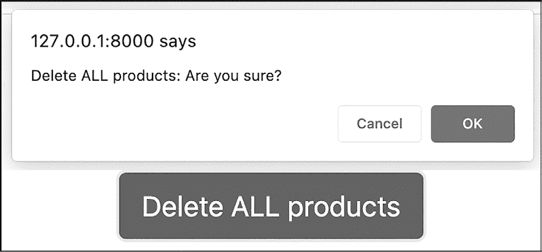
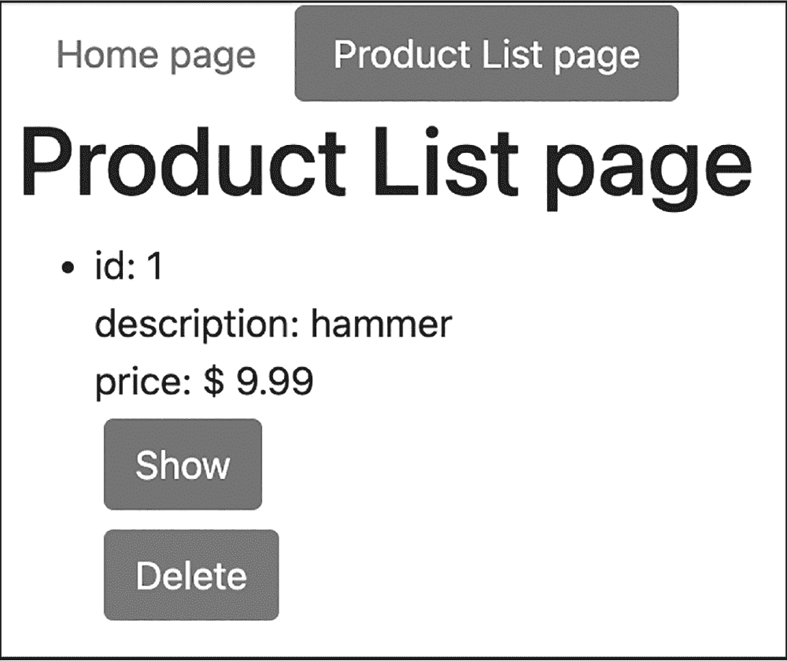
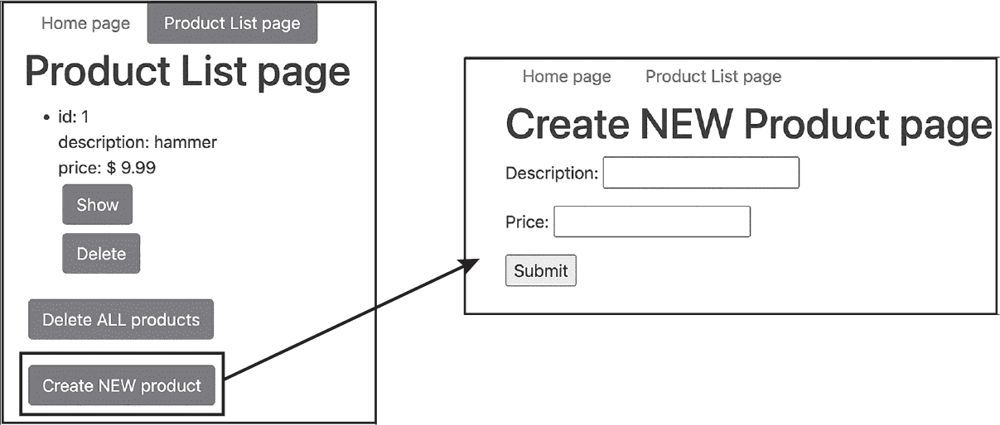
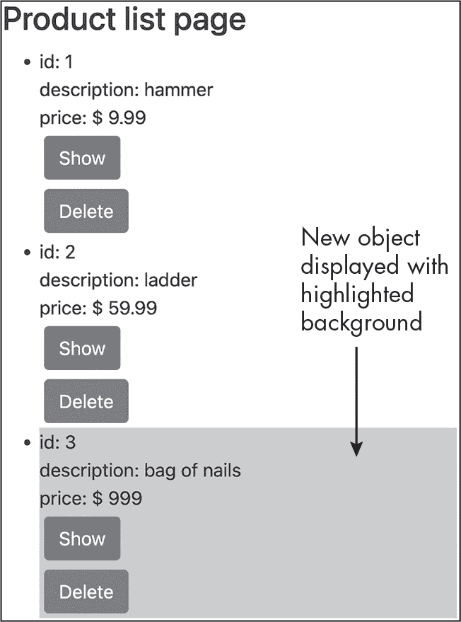
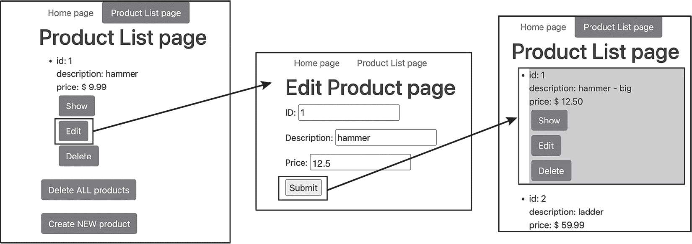

## 第二十九章：29 编程 CRUD 操作


在前一章中，我们开始开发一个基于数据库的 Web 应用程序，重点学习如何从数据库读取数据。然而，读取只是四种主要数据库操作之一，这四种操作统称为 *CRUD*，即 *创建（create）、读取（read）、更新（update）、删除（delete）*。在本章中，我们将研究 CRUD 中的其他操作，同时扩展我们的 Web 应用程序。我们将编写代码，允许用户通过交互式链接和 Web 表单，通过删除、添加或更新条目来更改数据库数据。

几乎所有基于数据库的移动或 Web 应用程序都围绕这四个 CRUD 操作展开。以电子邮件应用程序为例：当你写一封新邮件并发送时，这 *创建* 了一个表示收件人的数据库条目，并且在你自己的系统的已发送邮件箱数据库中也会创建一个条目。通常你会在收件箱中 *读取* 或 *删除* 邮件，或者你可能会草拟一封邮件，稍后再 *更新* 它，然后发送（或删除）它。

当我们开始将剩余的 CRUD 特性添加到 Web 应用程序时，你会注意到一个模式。每个更改都会以 Application 类中的前端控制器开关语句中的新案例开始，并调用 ProductController 类中的新方法。该方法将进一步调用一个新的存储库类方法，实际的数据库交互将在这里进行。最后，我们将更新相应的页面模板，添加新功能所需的用户界面。

### 删除数据

有时我们需要从数据库表中删除数据。例如，一家汽车制造商可能停止生产某个特定型号的汽车。该型号的详细信息可能会被复制到归档数据库表中，然后从汽车模型的主表中删除该型号。要从表中删除数据，我们使用 DELETE SQL 关键字。如果没有提供任何条件，所有记录都会从指定的表中删除。

当删除特定行或符合某些条件的行时，我们需要提供一个 SQL WHERE 子句。例如，要从模型表中删除 ID 为 4 的行，SQL 语句如下：

```
DELETE FROM model WHERE id = 4
```

在本节中，我们将查看删除整个表以及选择性删除表中条目的示例。

#### 从表中删除所有内容

让我们首先为前一章中的 Web 应用程序添加一个功能，从数据库中的产品表删除所有产品。图 29-1 显示了我们将创建的“删除所有产品”链接，以及一个弹出确认对话框。总是一个好主意为用户提供重新考虑和取消破坏性操作（例如永久删除数据）的机会（假设他们确实有删除数据的选项）。



图 29-1：删除所有产品

首先，我们将添加一个新的路由来检测 POST 提交，其中包含 action=deleteAll 变量。更新 Application 类中的 run()方法，使其与列表 29-1 的内容一致。

```
<?php
namespace Mattsmithdev;

class Application
{
--snip--
 public function run(): void
 {
 $action = filter_input(INPUT_GET, 'action');
$isPostSubmission = ($_SERVER['REQUEST_METHOD'] === 'POST');

 switch ($action)
 {
 --snip--
          case 'deleteAll':
                if ($isPostSubmission) {
                    $this->productController->deleteAll();
                } else {
                    $this->defaultController->
                        error('error - not a POST request');
                }
                break;

 default:
 $this->defaultController->homepage();
 }
 }
}
```

列表 29-1：更新后的 Application 类，用于执行 deleteAll 操作

我们添加一个新的$isPostSubmission 变量，如果接收到的请求使用 POST 方法，则该变量为 true。虽然技术上可以编写一个响应 GET 消息并更改服务器状态（例如数据库内容）的 Web 应用程序，但这将违反 HTTP GET 方法的定义。因此，在本章中，对于任何更改数据库的请求（删除、创建或更新），我们将使用 POST 方法和 HTML <form>元素。

接下来，我们在前控制器的 switch 语句中添加一个新的 case，用于处理 URL 中的 action 值为'deleteAll'的情况。当通过 POST 请求接收到该操作时，我们调用 ProductController 对象的 deleteAll()方法。如果$isPostSubmission 为 false，我们将使用 defaultController 返回一个错误消息给用户。

接下来，我们将定义 deleteAll()方法。更新*src/ProductController.php*，使其与列表 29-2 的内容一致。

```
<?php
namespace Mattsmithdev;

class ProductController extends Controller
{
 private ProductRepository $productRepository;

 --snip--

    public function deleteAll(): void
    {
        $this->productRepository->deleteAll();

        $this->list();
    }
}
```

列表 29-2：将 deleteAll()方法添加到 ProductController

我们声明 ProductController 类的 deleteAll()方法，依次调用 ProductRepository 类的 deleteAll()方法（该类负责与数据库的通信）。然后，我们调用 list()方法，使应用程序显示产品列表页面，使用 header()函数和位置 URL /?action=products。因此，用户在所有产品被删除后应该看到一个空的产品列表。

现在我们将 deleteAll()方法添加到 ProductRepository 类。更新*src/ProductRepository.php*，使其与列表 29-3 的内容一致。

```
<?php
namespace Mattsmithdev;

class ProductRepository
{
 private ?\PDO $connection = NULL;
 --snip--

    public function deleteAll(): int
    {
        if (NULL == $this->connection) return 0;

        $sql = 'DELETE FROM product';
        $stmt = $this->connection->prepare($sql);
        $stmt->execute();
      ❶ $numRowsAffected = $stmt->rowCount();

        return $numRowsAffected;
    }
}
```

列表 29-3：将 deleteAll()方法添加到 ProductRepository

我们声明 deleteAll()方法，返回一个整数值，表示从数据库中删除的行数。如果连接为 NULL，则返回 0。否则，我们声明、准备并执行'DELETE FROM product'的 SQL 查询语句，该语句删除产品表中的所有条目。然后，我们调用 PDO 语句对象的 rowCount()方法❶，它返回最近执行的查询所影响的行数。我们在方法的末尾返回该整数值。

最后，我们需要更新产品列表页面的模板，提供一个删除所有产品的链接。更新*templates/product/list.xhtml.twig*，使其与列表 29-4 的内容一致。

```

product list page
active


 <h1>Product list page</h1>
 <ul>
 
 --snip--
 
 </ul>
    <p>
        <form method="POST" action="/?action=deleteAll">
            <button class="btn btn-danger m-1"
            onclick="return confirm('Delete ALL products: Are you sure?');">
            Delete ALL products</button>
        </form>
    </p>

```

列表 29-4：用于列出所有产品的 list.xhtml.twig 模板

在这里，我们在模板的末尾添加一个段落，声明一个包含 Bootstrap 样式按钮的 POST 方法表单，按钮文本为“删除所有产品”。控制器接收的操作（deleteAll）通过表单的 action 属性传递。此按钮包含一个弹出确认消息（通过 JavaScript 的 confirm()函数触发），并在其 onclick 属性中声明，这样用户就能确认或取消请求。

#### 根据 ID 删除单个项目

就像我们可以根据产品 ID 展示特定产品一样，我们也可以使用 ID 指定要从数据库中删除的单个产品。现在让我们添加这个功能。图 29-2 展示了我们将要创建的页面截图：在产品列表页面中，每个产品将有自己显示和删除按钮样式的链接，每个链接都根据产品 ID 触发数据库操作。



图 29-2：每个单独产品的显示和删除按钮

我们首先需要添加一个新的路由 URL 模式，action=delete，其中要删除的产品 ID 通过 POST 表单提交作为变量 id。请根据清单 29-5 更新 Application 类代码。

```
<?php
namespace Mattsmithdev;

class Application
{
--snip--
 public function run(): void
 {
 $action = filter_input(INPUT_GET, 'action');
 $isPostSubmission = ($_SERVER['REQUEST_METHOD'] === 'POST');

 switch ($action)
 {
 --snip--

            case 'delete':
              ❶ $id = filter_input(INPUT_POST, 'id',
                                   FILTER_SANITIZE_NUMBER_INT);
                if ($isPostSubmission && !empty($id)) {
                    $this->productController->delete($id);
                } else {
                    $this->defaultController->error('error - to delete a
                           product an integer id must be provided by a
                           POST request');
                }
                break;

 default:
 $this->defaultController->homepage();
 }
 }
}
```

清单 29-5：更新后的 Application 类，用于处理删除操作

在这里，我们在前端控制器的 switch 语句中添加一个新的 case，用于当 URL 中的 action 值为“delete”时。在这种情况下，我们尝试从请求接收到的 POST 变量中提取一个整数变量 id ❶。如果$isPostSubmission 为 true 并且 ID 不为空，我们将 ID 传递给 ProductController 对象的 delete()方法。否则，我们将适当的错误信息传递给 DefaultController 对象的 error()方法进行显示。

要定义 delete()方法，请根据清单 29-6 更新*src/ProductController.php*。

```
<?php
namespace Mattsmithdev;

class ProductController extends Controller
{
 private ProductRepository $productRepository;

 --snip--

    public function delete(int $id): void
    {
        $this->productRepository->delete($id);

        $this->list();
    }
}
```

清单 29-6：向 ProductController 添加 delete()方法

delete()方法接受一个整数类型的产品 ID，并将其传递给 ProductRepository 对象的 delete()方法。然后，它通过 list()方法使应用程序显示产品列表页面。因此，用户在点击删除链接后，应该看到删除项后的产品列表。

现在我们将在*src/ProductRepository.php*中向 ProductRepository 类添加 delete()方法。清单 29-7 展示了如何操作。

```
<?php
namespace Mattsmithdev;

class ProductRepository
{
 private ?\PDO $connection = NULL;

 --snip--

 public function delete(int $id): bool
    {
        if (NULL == $this->connection) return false;

        $sql = 'DELETE FROM product WHERE id = :id';
        $stmt = $this->connection->prepare($sql);
        $stmt->bindParam(':id', $id);
        $success = $stmt->execute();

        return $success;
    }
}
```

清单 29-7：向 ProductRepository 添加 delete()方法

delete()方法接受一个整数参数（ID），并返回一个布尔值，表示删除操作是否成功。如果连接为 NULL，我们返回 false。否则，我们声明 SQL 查询字符串 'DELETE FROM product WHERE id = :id' 来删除指定 ID 的产品。然后，我们准备语句并将$id 参数绑定到:id 占位符。执行该语句后会返回一个布尔成功值，我们将其存储并返回。

最后，我们需要更新产品列表模板，为每个产品提供样式为按钮的 Show 和 Delete 链接。修改 *templates/product/list.xhtml.twig* 文件，使其与列表 29-8 的内容匹配。

```

product list page
active


 <h1>Product list page</h1>

 <ul>
 
 <li class="mt-5">

 id: {{product.id}}
 <br>
 description: {{product.description}}
 <br>
 price: $ {{product.price | number_format(2)}}
 <br>
            <a href="/?action=show&id={{product.id}}"
❶ class="btn btn-secondary m-1">Show</a>
            <br>
            <form method="POST" action="/?action=delete">
              ❷ <input type="hidden" name="id" value="{{product.id}}">
                <button class="btn btn-danger m-1"
                        onclick="return confirm(
                                'Delete product with ID = {{product.id}}:
                                Are you sure?');"
                >
 Delete</button>
            </form>
        </li>
      ❸ 
            <li>
                (there are no products to display)
            </li>
        
 </ul>

 <p>
 <form method="POST" action="/?action=deleteAll">
--snip--
```

列表 29-8：提供按 ID 删除功能的 list.xhtml.twig 模板

我们将现有的 Show 链接样式修改为次级按钮 ❶。然后我们声明一个 POST 提交表单，action=delete，并设置一个名为 Delete 的按钮，传递 id 作为隐藏变量，用 Twig 的 {{product.id}} 占位符填充产品 ID ❷。与删除所有产品的表单一样，该表单按钮包括一个在 onclick 属性中声明的弹出确认消息，这样用户就可以确认或取消请求。我们还添加了一个 Twig else 块 ❸，如果数据库中没有找到产品，将显示消息（没有产品可显示）。

### 创建新的数据库条目

让我们来关注 CRUD 中的 *C*：通过 SQL INSERT 语句创建新的数据库条目。例如，下面是一个向名为 cat 的表中插入新行的 SQL 语句：

```
INSERT INTO cat (name, gender, age) VALUES ('fluffy', 'female', 4)
```

为名称、性别和年龄列提供了三个值。INSERT SQL 语句要求我们首先列出列名的顺序，然后跟随这些值，插入到相应的列中。

我们在“设置数据库模式”章节中提到过如何创建新的数据库条目，并且介绍了如何在应用程序的数据库中设置两个初始产品，页面 543 中有详细说明。现在，我们将通过向应用程序中添加一个表单来使这个过程更加互动，让用户可以定义新的产品并将其提交到数据库中。图 29-3 展示了我们将创建的表单。



图 29-3：创建新产品的链接及其相关表单

我们将在产品列表页面的底部添加一个按钮链接，用于创建新产品。该链接将启动一个创建新产品页面，包含提交新产品描述和价格的表单字段。

#### 通过 Web 表单添加产品

为了提供创建新产品页面表单功能，我们首先需要向应用程序添加两个新的路由动作，一个用于显示表单（action=create），另一个用于处理表单提交（action=processCreate）。列表 29-9 展示了如何向应用程序类的前端控制器中添加这两个动作的 case。

```
<?php
namespace Mattsmithdev;

class Application
{
--snip--
 public function run(): void
 {
 $action = filter_input(INPUT_GET, 'action');
 $isPostSubmission = ($_SERVER['REQUEST_METHOD'] === 'POST');

 switch ($action)
 {
        --snip--

            case 'create': ❶
                $this->productController->create();
                break;

            case 'processCreate': ❷
                $description = filter_input(INPUT_POST, 'description');
                $price = filter_input(INPUT_POST, 'price', FILTER_SANITIZE_NUMBER_FLOAT,
                                      FILTER_FLAG_ALLOW_FRACTION);

 if ($isPostSubmission && !empty($description) && !empty($price)) {❸
                    $this->productController->processCreate($description, $price);
                } else {
                    $this->defaultController->error(
                    'error - new product needs a description and price (via a POST request)');
                }
                break;

            default:
                $this->defaultController->homepage();
        }
    }
}
```

列表 29-9：将 'create' 和 'processCreate' 路由添加到前端控制器

首先，我们在前端控制器的 switch 语句中为 URL 中 action 值为 'create' 时添加一个新 case ❶。这将调用 ProductController 对象的 create() 方法。

接下来，我们声明 'processCreate' 动作的 case ❷。为此，我们从 POST 提交的变量中获取描述和价格的值。请注意，浮动价格变量使用了两个过滤器；FILTER_FLAG_ALLOW_FRACTION 参数是必需的，以允许小数点字符。

如果 $isPostSubmission 为 true 且 $description 和 $price 都不为空 ❸，则描述和价格将传递给 ProductController 对象的 processCreate() 方法。否则，将使用 DefaultController 对象的 error() 方法显示适当的错误信息。

本示例假设产品数据库表使用自动递增的方式为新添加的行选择一个新的唯一整数 ID，如 第二十八章 所示。如果没有此功能，我们还需要为新产品提供一个 ID，可能需要使用逻辑先查找数据库中当前最大的 ID，然后加 1。

现在我们将把 create() 和 processCreate() 方法添加到 ProductController 类中。更新 *src/ProductController.php* 文件以匹配 列表 29-10。

```
<?php
namespace Mattsmithdev;

class ProductController extends Controller
{
 private ProductRepository $productRepository;

 --snip--

❶public function create(): void
    {
        $template = 'product/create.xhtml.twig';
        $args = [];
        print $this->twig->render($template, $args);
    }

 ❷ public function processCreate(string $description, float $price): void
    {
        $this->productRepository->insert($description, $price);

        $this->list();
    }
}
```

列表 29-10：将 create() 和 processCreate() 方法添加到 ProductController

create() 方法 ❶ 只是渲染 *templates/product/create.xhtml.twig* 模板来显示新产品表单（我们稍后会创建这个模板）。processCreate() 方法 ❷ 接受一个字符串作为新描述和一个浮动值作为新价格，并将它们传递给 ProductRepository 对象的 insert() 方法，以便插入到数据库中。然后，processCreate() 调用 list() 方法来跳转到产品列表页面，以便用户看到更新后的产品列表，其中包括新创建的产品。

如果我们完全按照规范操作，processCreate() 方法将不会调用 list() 方法，而是会强制重定向，向服务器发送新请求以列出所有产品。如果不进行重定向，我们将遇到一个问题：如果用户在提交表单后刷新浏览器页面，表单将被提交第二次。但是，现在添加重定向会让我们在下一部分的工作变得更加复杂，所以我们目前就先调用 list() 方法，等到本章最后再制定一个更好的重定向方案。

要将 insert() 方法添加到 ProductRepository 类中，请更新 *src/ProductRepository.php* 文件，按照 列表 29-11 的示例。

```
<?php
namespace Mattsmithdev;

class ProductRepository
{
 private ?\PDO $connection = NULL;

 --snip--

    public function insert(string $description, float $price): int
    {
        if (NULL == $this->connection) return -1;

        $sql = 'INSERT INTO product (description, price)'
            . ' VALUES (:description, :price)';
        $stmt = $this->connection->prepare($sql);

        $stmt->bindParam(':description', $description);
        $stmt->bindParam(':price', $price);

        $success = $stmt->execute();

 ❶ if ($success) {
            return $this->connection->lastInsertId();
        } else {
            return -1;
        }
    }
}
```

列表 29-11：将 insert() 方法添加到 ProductRepository

新的 insert() 方法接受一个字符串参数（$description）和一个浮动值参数（$price），并返回一个整数——要么是新创建的数据库记录的 ID，要么是 -1，表示没有创建记录。如果数据库连接为 NULL，我们会立即返回 -1。否则，我们声明并准备 SQL 查询字符串 'INSERT INTO product (description, price) VALUES (:description, :price)' 来向产品表中添加一个新条目。

然后，我们将$description 参数绑定到:description 占位符，将$price 参数绑定到:price 占位符，之后执行语句。最后，我们测试执行结果的布尔值$success ❶。如果为真，我们使用 PDO 连接对象的 lastInsertId()方法返回最近插入的数据库条目的 ID，该 ID 应对应于新产品。如果为假，我们返回-1。

现在，让我们修改产品列表页面模板，以包含添加新产品的链接。更新*templates/product/list.xhtml.twig*以匹配清单 29-12 中的内容。

```

product list page
active


 --snip--
 Delete ALL products</button>
 </form>
 </p>

    <p>
        <a href="/?action=create" class="btn btn-secondary m-1">
            Create NEW product
        </a>
    </p>

```

清单 29-12：将新产品链接添加到 list.xhtml.twig 模板

在这里，我们向模板的末尾添加一个段落，其中包含一个 Bootstrap 样式的按钮链接，文本为“创建新产品”。该链接触发 create URL 动作。

现在，让我们添加 Twig 模板以显示创建新产品页面的表单。创建*templates/product/create.xhtml.twig*模板文件，包含清单 29-13 中所示的代码。

```


create product page


    <h1>Create NEW Product page</h1>

  ❶ <form method="POST" action="/?action=processCreate">
        <p>
        Description:
        <input name="description">
        </p>
        <p>
        Price:
        <input name="price" type="number" min="0" step="0.01">
        </p>
        <input type="submit">
    </form>

```

清单 29-13：新产品表单的 create.xhtml.twig 模板

该模板呈现一个 HTML 表单 ❶，其提交动作为 action=processCreate，因此提交的值将传递给前面描述的 ProductController 类中的 processCreate()方法。表单包含两个段落，分别用于描述和价格，然后是一个提交按钮。

#### 突出显示新创建的产品

当某些内容发生变化时，突出显示变化对用户非常有帮助。让我们更新应用程序，以在新产品添加到数据库后，在产品列表中突出显示它。图 29-4 展示了我们想要实现的效果；它显示了我们添加了一个非常昂贵的钉子袋，价格为 999 美元！



图 29-4：显示新创建的产品并突出显示背景

为实现此功能，我们可以利用 ProductRepository 类的 insert()方法返回值，该方法在前面的章节中已声明。这个返回值表示新创建的产品的 ID，因此我们可以向应用程序添加逻辑，以突出显示 ID 与该值匹配的产品。首先，我们需要更新 ProductController 类，如清单 29-14 所示。

```
<?php
namespace Mattsmithdev;

class ProductController extends Controller
{
 private ProductRepository $productRepository;

    public function list(?int $newProductId = NULL): void
 {
 $products = $this->productRepository->findAll();

 $template = 'product/list.xhtml.twig';
 $args = [
 'products' => $products,
          ❶ 'id' => $newProductId
 ]
 print $this->twig->render($template, $args);
 }

 --snip--

 public function processCreate(string $description, float $price): void
 {
        $newProductId =
            $this->productRepository->insert($description, $price);

        $this->list($newProductId);
 }
}
```

清单 29-14：更新 ProductController 类中的 list()和 update()方法

我们更新 list()方法（显示完整的产品列表），使其接受一个可选的$newProductId 参数，默认值为 NULL。我们将此参数传递给 Twig 产品列表模板，以及产品数组 ❶。接下来，我们更新 processCreate()方法，接收从 insert()返回的新产品 ID，并将其传递给 list()方法。

现在我们可以更新产品列表模板，以突出显示与传递给模板的 id 变量匹配的产品。由于产品 ID 从 1 开始并且自动递增，-1 的值永远不会与从数据库中检索到的对象匹配，因此 list()方法的默认$newProductId 参数值-1 将导致没有产品被高亮显示。按照列表 29-15 中的示例，修改*templates/product/list.xhtml.twig*模板。

```

product list page
active


 <h1>Product list page</h1>

 <ul>
 

❶
                
            
                
            

❷<li class="{{highlight}}">

 id: {{product.id}}
 <br>
--snip--


```

列表 29-15：更新 list.xhtml.twig 模板，以在列表中突出显示新增的产品

我们在遍历产品的 Twig 循环中添加了一个 if 语句，该语句检查当前产品的 ID 是否与接收到的 Twig 变量 id ❶匹配。如果匹配，Twig 的高亮变量会被设置为'active'，否则高亮变量会被设置为空字符串。我们将 highlight 的值包含到每个列表项的 CSS 样式类中 ❷，因此每个产品将根据需要被高亮显示或不显示。

最后，我们需要在基础模板中添加一个<style>元素来为活动的 CSS 类设置样式。按照列表 29-16 更新*/templates/product/base.xhtml.twig*。

```
<!doctype html>
<html lang="en">
<head>
 <title>MG- - </title>
 <meta name="viewport" content="width=device-width">
 <link rel="stylesheet"
 href="https://cdn.jsdelivr.net/npm/bootstrap@5.1.3/dist/css/bootstrap.min.css">
    <style>
        li.active {background-color: pink;}
    </style>

</head>

<body class="container">
--snip--
```

列表 29-16：在 base.xhtml.twig Twig 模板中声明<style>元素

在<head>元素中，我们添加了一个 CSS 规则，指定活动的列表项应该有粉色背景。

### 更新数据库条目

最后一项要探索的 CRUD 操作是*U*代表*更新*。这个操作很重要，因为数据库中的数据需要不断更新，以反映现实世界中的变化，比如人的新地址、产品价格的上涨、用户更改订阅状态等。为了修改表中的现有记录，我们可以使用 SQL 的 UPDATE 关键字。例如，下面是一个 SQL 语句，它将 ID 为 1 的猫的年龄改为 5：

```
UPDATE cat SET age = 5 WHERE id = 1
```

让我们为我们的 Web 应用程序添加一个更新现有产品的功能。就像创建新产品一样，我们通过 Web 表单来实现。图 29-5 展示了这个新功能的工作原理。



图 29-5：更新现有产品

我们将在产品列表页面的每个产品上添加一个“编辑”按钮，点击该按钮后，用户将进入编辑产品页面，页面上有表单字段用于修改产品的描述和价格（ID 字段为只读）。这些字段初始时会填入当前的值。一旦提交更改，更新后的产品将在产品列表页面上突出显示。

为了实现这个功能，我们首先需要添加两个新的路由动作，一个用于显示编辑表单（action=edit），一个用于处理表单提交（action=processEdit）。列表 29-17 将这两个新操作添加到了应用程序类的前端控制器中。

```
<?php
namespace Mattsmithdev;

class Application
{
--snip--
 public function run(): void
 {
 $action = filter_input(INPUT_GET, 'action');
 $isPostSubmission = ($_SERVER['REQUEST_METHOD'] === 'POST');

 switch ($action)
 {
        --snip--

            case 'edit': ❶
                $id = filter_input(INPUT_GET, 'id', FILTER_SANITIZE_NUMBER_INT);
                if (empty($id)) {
                    $this->defaultController->error(
                          'error - To edit a product, an integer ID must be provided');
                } else {
                    $this->productController->edit($id);
                }
                break;

            case 'processEdit': ❷
                $id = filter_input(INPUT_POST, 'id', FILTER_SANITIZE_NUMBER_INT);
 $description = filter_input(INPUT_POST, 'description');
                $price = filter_input(INPUT_POST, 'price', FILTER_SANITIZE_NUMBER_FLOAT,
                                      FILTER_FLAG_ALLOW_FRACTION);

                if ($isPostSubmission && !empty($id) && !empty($description)
                                      && !empty($price)) {
                    $this->productController->processEdit($id, $description, $price);
                } else {
                    $this->defaultController->error(
                    'error - Missing data (or not POST method) when trying to update product');
                }
                break;

 default:
 $this->defaultController->homepage();
 }
 }
}
```

列表 29-17：将'edit'和'processEdit'路由添加到前端控制器

我们在前端控制器的 switch 语句中添加一个新的 case，用于处理当 URL 中 action 的值为'edit'❶时的情况。与'show'和'delete'的情况一样，我们尝试从请求中接收到的 URL 编码变量中提取一个整数 id 变量。如果 id 的值为空，我们通过将字符串消息传递给 DefaultController 对象的 error()方法来显示适当的错误消息。如果值不为空，我们将其传递给 ProductController 对象的 edit()方法。

接下来，我们添加'processEdit' case❷，它首先通过 POST 提交的变量检索 id、description 和 price。如果$isPostSubmission 为 true，并且三个变量（id、description 和 price）都不为空，我们将这些值传递给 ProductController 对象的 processEdit()方法。否则，我们再次使用 DefaultController 对象的 error()方法显示适当的错误消息。

现在我们将向 ProductController 类中添加新方法。更新*src/ProductController.php*文件，使其与 Listing 29-18 的内容一致。

```
<?php
namespace Mattsmithdev;

class ProductController extends Controller
{
    private ProductRepository $productRepository;

    --snip--

    public function edit(int $id): void
    {
      ❶ $product = $this->productRepository->find($id);

        $template = 'product/edit.xhtml.twig';
        $args = [
            'product' => $product
        ];
 print $this->twig->render($template, $args);
    }

    public function processEdit(int $id, string $description,
                                float $price): void
    {
      ❷ $this->productRepository->update($id, $description, $price);

        $this->list($id);
    }
}
```

Listing 29-18：向 ProductController 添加 edit()和 processEdit()方法

edit()方法使用提供的整数$id 参数从数据库中检索单个 Product 对象❶。然后它将该对象传递给*/templates/product/edit.xhtml.twig*模板，该模板显示用于编辑产品的表单。processEdit()方法接受一个$id 整数、$description 字符串和$price 浮动值，并将它们传递给 ProductRepository 对象的 update()方法❷。接着，它通过 list()方法使应用程序显示到产品列表页面。与 processCreate()方法类似，我们将更新产品的 ID 传递给 list()，以便该产品会被高亮显示。

Listing 29-19 展示了如何将新的 update()方法添加到 ProductRepository 类中。

```
<?php
namespace Mattsmithdev;

class ProductRepository
{
 private ?\PDO $connection = NULL;

    --snip--

    public function update(int $id, string $description, float $price): bool
    {
        if (NULL == $this->connection) return false;
        $sql = 'UPDATE product SET description = :description, price = :price WHERE id=:id';

        $stmt = $this->connection->prepare($sql);

        $stmt->bindParam(':id', $id);
        $stmt->bindParam(':description', $description);
        $stmt->bindParam(':price', $price);

        $success = $stmt->execute();

        return $success;
    }
}
```

Listing 29-19：将 update()方法添加到 ProductRepository 类中

update()方法接受一个产品的 ID、描述和价格，并返回一个布尔值，表示更新的成功或失败。如果数据库连接为 NULL，则返回 false。否则，我们声明 SQL 查询字符串'UPDATE product SET description = :description, price = :price WHERE id=:id'，使用 WHERE 子句和对象的 ID 来指定要更新的特定数据库行。在准备好语句后，我们将$id、$description 和$price 变量绑定到相应的占位符。

然后我们执行该语句并返回结果布尔值的成功状态。请注意，这里返回的是布尔值，而不是像我们在之前的 insert()方法中那样返回产品 ID。这里的区别在于，调用方法已经知道了相关的产品 ID，因此只需要返回执行数据库更新语句的真/假成功状态即可。

现在我们需要为产品列表页面上的每个产品提供一个编辑按钮。更新 *templates/product/list.xhtml.twig* 文件，如列表 29-20 所示。

```
--snip--

 <h1>Product list page</h1>
    --snip--
 <li class="{{highlight}}">

 id: {{product.id}}
 <br>
 description: {{product.description}}
 <br>
 price: $ {{product.price | number_format(2)}}
 <br>
 <a href="/?action=show&id={{product.id}}"
 class="btn btn-secondary m-1">Show</a>
            <br>
            <a href="/?action=edit&id={{product.id}}"
                class="btn btn-secondary m-1">Edit</a>
            --snip--

```

列表 29-20：向 list.xhtml.twig 模板添加编辑按钮

在当前产品的 Twig 循环中，我们添加了一个使用 Bootstrap 样式的按钮链接，文本为“编辑”。这个编辑操作的链接包含当前产品的 ID。

最后，让我们添加一个 Twig 模板来显示编辑产品详细信息的表单。创建 *templates/product/edit.xhtml.twig* 文件，并包含列表 29-21 中所示的代码。

```


edit product page


    <h1>Edit Product page</h1>

  ❶ <form method="POST" action="/?action=processEdit">
        <p>
            ID:
          ❷ <input name="id" value="{{product.id}}" readonly>
        </p>
        <p>
            Description:
            <input name="description" value="{{product.description}}">
        </p>
        <p>
        Price:
        <input name="price" value="{{product.price}}" type="number"
               min="0" step="0.01">
        </p>
        <input type="submit">
    </form>

```

列表 29-21：用于编辑产品的 edit.xhtml.twig 模板

该模板的主要工作是呈现一个 HTML 表单 ❶，其提交操作为 action=processEdit，因此提交的值将传递给前面描述的 ProductController 类中的 processEdit() 方法。此表单包含三个段落，分别用于 ID、描述和价格，然后是一个提交按钮。ID、描述和价格表单输入框将被填充为 Product 对象中相应属性的值。ID 输入框具有 readonly 属性；因为我们不希望用户编辑此值，它会被显示但不可编辑 ❷。

### 避免通过重定向进行双重表单提交

在我们当前的实现中，我们在处理完表单提交以添加或编辑产品后调用 list() 方法。通过将产品 ID 传递给此方法，我们可以使模板突出显示已创建或更新的产品。然而，如果用户在提交表单后刷新浏览器页面，浏览器将尝试通过重复 HTTP POST 请求再次提交表单数据。我们可以通过使服务器在表单提交后*重定向*到请求产品列表页面来避免这个问题（即发送一个 GET 请求到 URL /?action=products）。如果页面被刷新，GET 请求将重新发送以列出所有产品，而不是 POST 请求。这种技术有时被称为*后提交重定向获取（PRG）模式*。

现在，让我们更新应用程序以使用这种重定向方法。我们不再将产品 ID 作为参数传递给 list() 方法，而是需要将 ID 存储在 $_SESSION 数组中。正如我们在第十四章中讨论的那样，这是一个专门用于存储用户当前浏览器会话数据的数组。首先，我们将更新 list() 方法，并在 *src/ProductController.php* 中添加一个新的会话辅助方法，如列表 29-22 所示。

```
<?php
namespace Mattsmithdev;

class ProductController extends Controller
{
 private ProductRepository $productRepository;

 --snip--

    public function list(): void
 {
 $products = $this->productRepository->findAll();
      ❶ $id = $this->getIdFromSession();

 $template = 'product/list.xhtml.twig';
 $args = [
 'products' => $products,
            'id' => $id
 ];
 print $this->twig->render($template, $args);
 }

    private function getIdFromSession(): ?int
    {
        $id = NULL;
      ❷ if (isset($_SESSION['id'])) {
            $id = $_SESSION['id'];

            // Remove it now that it's been retrieved
            unset($_SESSION['id']);
        }

        return $id;
    }
}
```

列表 29-22：更新 list() 方法并将 getIdFromSession() 添加到 ProductController 类

list()方法不再有任何参数输入。相反，我们尝试使用 getIdFromSession()方法从会话中检索 ID ❶。该方法将$id 变量初始化为 NULL，然后测试$_SESSION 数组是否包含一个键为'id' ❷的变量。如果存在这样的键，则其值被检索并存储在$id 中，然后该数组元素会被删除，以便在检索后不再存储在会话中。该方法返回$id 的值，可能是 NULL 或从会话中检索到的值。

现在，我们可以更新 ProductController 类方法，在将 ID 存储到会话中后使用重定向。按照清单 29-23 所示，更新*src/ProductController.php*中的这些方法。

```
<?php
namespace Mattsmithdev;

class ProductController extends Controller
{
    private ProductRepository $productRepository;

 --snip--

    public function delete(int $id): void
    {
        $this->productRepository->delete($id);

      ❶ $location = '/?action=products';
        header("Location: $location");
    }

    public function deleteAll(): void
    {
        $this->productRepository->deleteAll();

        $location = '/?action=products';
        header("Location: $location");
    }
 --snip--

    public function processCreate(string $description, float $price): void
    {
        $newObjectId =
            $this->productRepository->insert($description, $price);

      ❷ $_SESSION['id'] = $newObjectId;

        $location = '/?action=products';
        header("Location: $location");
    }

    --snip--

    public function processEdit(
        int $id, string $description, float $price): void
    {
        $this->productRepository->update($id, $description, $price);

        // Store ID of product to highlight in the SESSION
      ❸ $_SESSION['id'] = $id;

 $location = '/?action=products';
        header("Location: $location");
    }
}
```

清单 29-23：更新 ProductController 中的 POST 操作方法以使用重定向

删除(delete())和删除所有(deleteAll())方法已更新为使用内置的 header()函数，重定向服务器处理 URL /?action=products 的 GET 请求 ❶。该 action 值将导致我们的 list()方法列出产品。

我们还更新了 processCreate()方法，将新创建的产品的 ID（$newObjectId）存储在会话中，键名为'id' ❷。然后，它将服务器重定向到处理 URL /?action=products 的 GET 请求。同样，我们更新了 processEdit()方法，将编辑过的产品的 ID（$id）存储在会话中，键名为'id' ❸，并以相同的方式重定向到/?action=products。现在，我们已经改进了 Web 应用程序，在处理 POST 表单提交后正确重定向，因此刷新浏览器时不会导致表单数据的重复提交。

由于我们将 ID 存储在会话中，因此我们必须确保每次接收到请求时，前控制器 index 脚本会启动会话。按照清单 29-24 所示，更新*/public/index.php*。

```
<?php
require_once __DIR__ . '/../vendor/autoload.php';

session_start();

use Mattsmithdev\Application;
$app = new Application();
$app->run();
}
```

清单 29-24：更新 index.php 以确保我们的 Web 应用程序会话处于活动状态

我们现在在执行任何操作之前调用 session_start()函数。这确保了我们的 Web 应用程序可以存储和检索来自用户 HTTP 会话的值。

### 总结

在本章中，我们探讨了标准数据库操作的全方位内容：创建、读取、更新和删除条目，统称为*CRUD*。与前一章一样，我们对所有数据库查询都使用了预处理语句，使得绑定参数到这四个操作变得容易，例如通过 ID 删除一行或将新值插入到数据库条目的多个字段中。

我们继续看到，数据库驱动的网页应用程序的架构与非数据库应用程序是多么相似。我们的代码核心围绕一个前端控制器展开，它负责检查从网页客户端接收到的请求，并调用相应的控制器方法。通过将数据库操作封装在一个存储库类中，我们能够保持控制器类的逻辑专注于通过整理数据并渲染适当的 Twig 模板来响应请求。

我们还看到，创建和更新数据库行的表单是如何呈现和处理的，和其他任何网页表单一样，只不过现在数据会传递到存储库方法，用于与数据库进行交互。接着，我们看到如何通过在处理表单提交后使用重定向来改进系统，以避免在浏览器页面刷新时重复表单操作。

### 练习

1.   打开一个你常用的网络应用程序，例如社交媒体应用或电子商务网站。探索作为用户你可以执行的操作，并思考每个操作对应的 CRUD 操作。数据是如何从你使用的网页应用后端数据库中获取并保存的？

2.   为书籍对象创建一个 CRUD 网页应用，具有以下属性：

id（整数），自增长主键

标题（字符串）

作者（字符串）

价格（浮动）

你可以从头开始创建一个新项目，或者重用本章和第二十八章的练习中的类。我建议你按照以下顺序逐步为应用程序添加 CRUD 功能：

a.   列出所有对象。

b.   列出一个对象，给定一个 ID。

c.   删除所有对象。

d.   删除一个对象，给定一个 ID。

e.   创建一个新对象。

f.   编辑一个对象，给定一个 ID。
