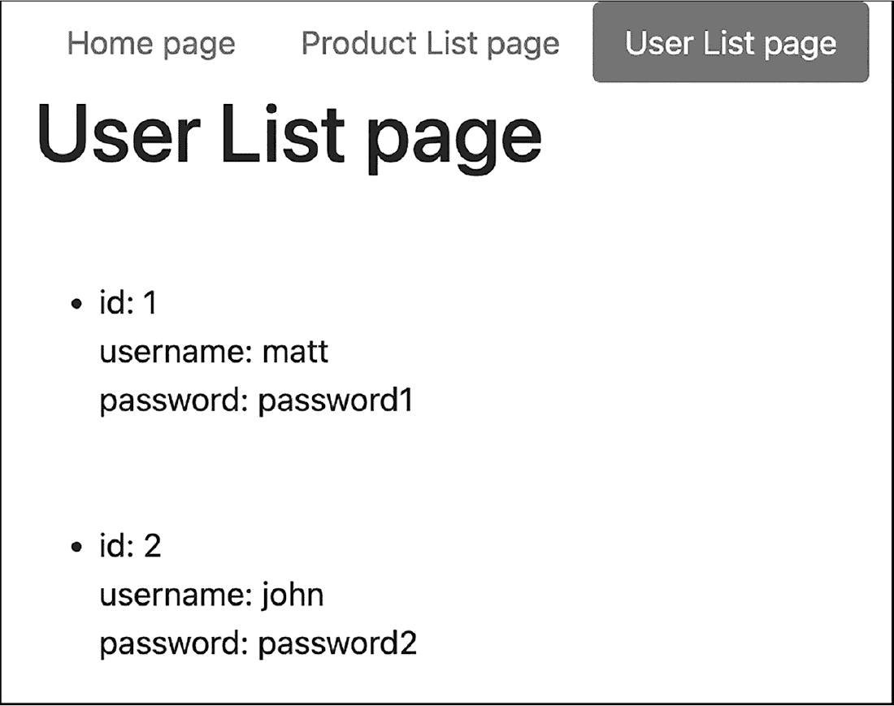
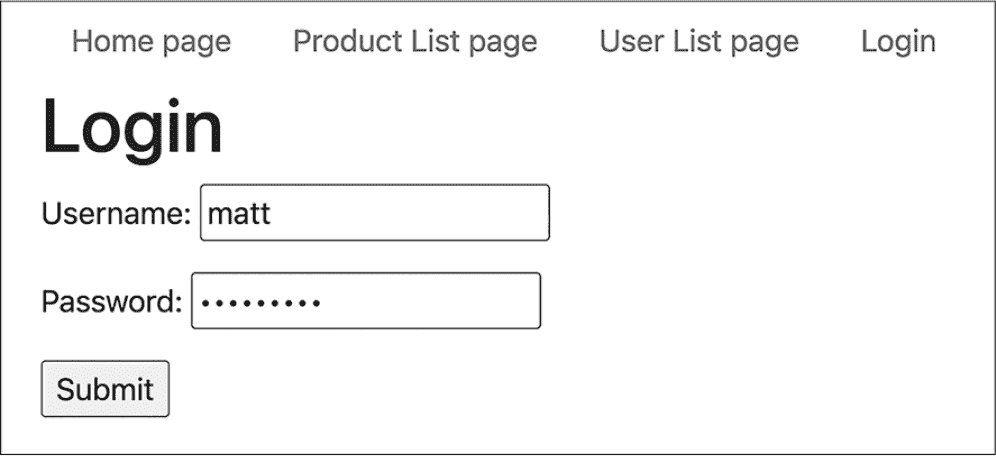

## 第三十章：30 ORM 库与数据库安全


在这一章中，我们将探索使数据库工作更简单、更安全的技术。首先，仓库类中的许多 CRUD 代码会变得乏味且重复，仅在模型类名称和其属性上有所不同。*对象关系映射（ORM）库*解决了这个问题，自动化了低级工作，比如根据应用程序的模型类的命名和结构准备和执行 SQL 查询。你将看到如何使用这样的库，通过几行代码简化或替换我们的仓库类。我们将从向我们的示例网页应用程序添加一个简单的 ORM 库开始，然后在项目中整合专业级的 Doctrine ORM 库。

在安全方面，采用 ORM 库将推动我们从代码中移除任何硬编码的数据库凭证，而是将这些凭证放在一个单独的数据文件中。我们还将探索在网页应用程序中处理登录信息的最佳实践，包括使用*密码哈希*来避免在数据库中存储明文密码。正如你将看到的，PHP 提供了内置的函数，使这个过程变得非常简单。

### 使用 ORM 库简化数据库代码

一种使网页应用程序与数据库进行通信的方法是为每个项目从零开始设计并编写必要的低级代码。这包括连接数据库服务器的代码、创建模式和表格的代码，以及执行四个 CRUD 操作的代码，以便数据库表格能够存储支持应用程序的数据。实现这些代码需要对项目需求进行仔细分析，尤其是哪些数据需要持久化到数据库中。最终的结果是，代码是针对当前应用程序量身定制的，可以根据计算效率来编写，以最大化速度。

在过去的几章中，我们采用了设计和编写定制的、特定应用程序的数据库代码的方法。这对学习如何与数据库交互很有帮助，但也带来了一些缺点。首先，每个新应用程序都需要花时间设计、编写和测试代码。其次，如果应用程序的需求发生变化，网页应用程序的数据库通信代码和数据库结构本身也需要相应地做出调整。最后，任何加入正在进行项目的开发者都必须学习系统设计的所有细节，以便能够与数据库进行交互。

另一种方法是使用 ORM 库来抽象化与数据库通信的底层工作。ORM 库使用应用程序模型类的结构和关联（通常还会有一些附加的元数据）来自动创建和更新相应数据库表的结构。如果应用程序需求的变化导致模型类发生变化（例如新增模型类，或者现有类添加了新属性或关联），那么 ORM 库可以根据新的模型类声明自动更新数据库表结构，并管理基于这些更新后的模型类的数据库查询。

与自定义编写的低级数据库通信代码相比，ORM 库的计算效率可能较低。然而，如果速度不是 Web 应用程序中最重要的特性，它们有几个优点。首先，数据库结构和查询会在模型类更新的同时自动更新，这简化了编码过程。此外，如果项目使用的是一个知名的工业标准 ORM 库，那么加入项目的新开发人员很可能已经熟悉使用 ORM 库处理数据库操作的抽象方式。

在我们深入了解如何使用 ORM 库之前，让我们先看一个例子，说明这种方法与使用自定义代码相比的优势。清单 30-1 展示了前两章开发的 ProductRepository 类的部分内容。

```
<?php
namespace Mattsmithdev;

class ProductRepository
{
    private ?\PDO $connection = NULL;

    public function __construct()
    {
        $db = new Database();
        $this->connection = $db->getConnection();
    }

    public function findAll(): array
    {
        if (NULL == $this->connection) return [];

        $sql = 'SELECT * FROM product';
        $stmt = $this->connection->prepare($sql);
        $stmt->execute();
        $stmt->setFetchMode(\PDO::FETCH_CLASS, 'Mattsmithdev\\Product');
        $products = $stmt->fetchAll();

        return $products;
    }

    public function find(int $id): ?Product
    {
        if (NULL == $this->connection) return NULL;

        $sql = 'SELECT * FROM product WHERE id = :id';
        $stmt = $this->connection->prepare($sql);

        $stmt->bindParam(':id', $id);
        $stmt->execute();

        $stmt->setFetchMode(\PDO::FETCH_CLASS, 'Mattsmithdev\\Product');
        $product = $stmt->fetch();

        return $product;
    }

    --snip--

}
```

清单 30-1：ProductRepository 类的部分内容

我们手动开发了这个类，这意味着我们必须实现一些底层方法，比如构造函数来获取数据库连接，以及 CRUD 方法，如 findAll() 和 find()，以准备和执行 SQL 查询。将这段代码与清单 30-2 进行对比，后者通过 ORM 库的帮助声明了一个等效的 ProductRepository 类。

```
<?php
namespace Mattsmithdev;

use Mattsmithdev\PdoCrudRepo\DatabaseTableRepository;

class ProductRepository extends DatabaseTableRepository
{
}
```

清单 30-2：一个继承自 ORM 库的 ProductRepository 类

对于直接的数据库交互，ORM 库几乎可以为我们完成所有工作。我们不需要在 repository 类中实现自定义方法，而是简单地从 ORM 库的超类（在这种情况下是 DatabaseTableRepository）继承这些方法。超类设计使用*反射*，这是一种检查它与之交互的类和对象的技术，比如 Product 模型类。然后，超类利用找到的信息生成适用于这些类对象的 SQL 查询。

在接下来的章节中，我们将通过使用一个简单的 ORM 库来更详细地探讨这一过程，这是我在 GitHub 上作为开源项目维护的一个库。稍后，我们还将尝试一个工业级的 ORM 库，名为 Doctrine，这是现代 PHP 中最流行的 ORM 库之一。不过现在，先花点时间欣赏一下 ORM 辅助的 ProductRepository 类声明比手动编写版本要简短得多。

#### 将 ORM 库添加到项目中

让我们扩展前几章中的数据库驱动 Web 应用程序，使用我维护的一个简单 ORM 库——pdo-crud-for-free-repositories（* [`github.com/dr-matt-smith/pdo-crud-for-free-repositories`](https://github.com/dr-matt-smith/pdo-crud-for-free-repositories) *）。该库功能有限，但易于使用，是介绍 ORM 库基础知识的好工具。要开始使用，在命令行中输入以下内容以将库添加到项目中：

```
$ **composer require mattsmithdev/pdo-crud-for-free-repositories**
```

这将会在*vendor*文件夹中添加一个*mattsmithdev*文件夹，里面包含库的代码。

在撰写本文时，发布的 pdo-crud-for-free-repositories 版本仅与 MySQL 兼容，因此我们将重点介绍我们的 Web 应用程序的 MySQL 版本，而非 SQLite 版本。

#### 将数据库凭据移至.env 文件

我们使用的 ORM 库要求所有数据库凭据都声明在名为*.env*的文件中，该文件通常被称为*dotenv 文件*，而不是硬编码在我们目前的 Database 类中。Dotenv 文件是人类可读的文本文件，用于定义程序运行所需的名称/值对；其他常见的文件类型包括 XML 和 YAML。这一要求并不是坏事，因为它还增强了应用程序的安全性。

通常，在使用版本控制系统（如 Git）时，我们会排除 dotenv 文件，以便在代码归档或推送到开源项目时，不会包含敏感的数据库凭据。这减少了通过代码发布或分发给未经授权的人所引发的安全漏洞的可能性。这种方法的另一个好处是，可以在多个 dotenv 文件中设置不同的环境，如本地开发、远程开发、测试和实际生产系统。

为了满足该 ORM 库的要求，创建一个名为*.env*的文件，并将其保存在主项目目录中。将列表 30-3 中的内容输入文件中，并根据您计算机上运行的 MySQL 服务器属性修改密码和端口等值。

```
MYSQL_USER=root
MYSQL_PASSWORD=password
MYSQL_HOST=127.0.0.1
MYSQL_PORT=3306
MYSQL_DATABASE=demo1
```

列表 30-3：.env 文件中的数据库凭据

这些 MySQL 属性之前都作为常量定义在我们的 Database 类中。现在，我们可以将 Database 类从项目中删除，因为 ORM 库自带了一个类来管理与数据库的连接，基于 dotenv 文件中的信息。

#### 将产品操作委托给 ORM 库

既然 ORM 库已经可以访问数据库，我们就可以将所有与产品表相关的 CRUD 操作的责任，从 ProductRepository 类转移到 ORM 库中。我们仍然会使用 ProductRepository 类，但正如之前所暗示的那样，我们不再手动填充它的方法来准备和执行 SQL 语句，而是简单地将它声明为 ORM 库类的一个子类。用 Listing 30-4 中显示的代码替换 *src/ProductRepository.php* 文件的内容。

```
<?php
namespace Mattsmithdev;

use Mattsmithdev\PdoCrudRepo\DatabaseTableRepository;

class ProductRepository extends DatabaseTableRepository
{
}
```

Listing 30-4: 极大简化的 ProductRepository 类

使用语句指定我们想要引用 Mattsmithdev\PdoCrudRepo 命名空间中的 DatabaseTableRepository 类。然后我们将 ProductRepository 声明为 DatabaseTableRepository 的子类，类体中不包含任何代码。就这样！我们现在拥有了一个只包含几行代码的有效 ProductRepository 类。它将继承 DatabaseTableRepository 超类中所有的方法，这些方法恰好遵循我们之前使用的命名约定：find()、findAll()、delete()、deleteAll() 等。

那么，DatabaseTableRepository 类是如何知道我们希望它与一个具有 id、description 和 price 字段的产品表配合使用的呢？这就是反射技术发挥作用的地方。DatabaseTableRepository 类使用这种技术来推断如何根据它接触到的类和对象构建适当的 SQL 语句。在这种情况下，反射代码假设 ProductRepository 仓库类管理一个与同一命名空间中的名为 Product 的模型类相对应的数据库方法，并且数据库中相应的产品表具有与 Product 类的属性名称匹配的字段。只要所有的名称一致，ORM 库就能完成它的工作。

为了让反射过程正常工作，DatabaseTableRepository 方法需要接收适当模型类的对象，而不是我们之前在 第二十九章 设计 CRUD 方法时使用的自由浮动变量。为了最终完成对 ORM 库的转换，我们需要重构我们的 ProductController 类，在调用 insert() 和 update() 方法处理新产品和更新产品时，传入 Product 对象。按照 Listing 30-5 中的方式修改 *src/ProductController.php* 文件。

```
<?php
namespace Mattsmithdev;

class ProductController extends Controller
{
 private ProductRepository $productRepository;

    --snip--

 public function processCreate(string $description, float $price): void
 {
        $product = new Product();
        $product->setDescription($description);
        $product->setPrice($price);

      ❶ $newObjectId = $this->productRepository->insert($product);

 $_SESSION['id'] = $newObjectId;

 $location = '/?action=products';
 header("Location: $location");
 }

    --snip--

 public function processEdit(int $id, string $description,
 float $price): void
 {
      ❷ $product = $this->productRepository->find($id);
        $product->setDescription($description);
        $product->setPrice($price);

        $this->productRepository->update($product);

 $_SESSION['id'] = $id;

 $location = '/?action=products';
 header("Location: $location");
 }
}
```

Listing 30-5: 更新后的 src/ProductController.php 类

在修改后的 processCreate()方法中，我们首先创建一个新的 Product 对象，并将其描述和价格属性设置为传入方法的值。然后，我们将这个 Product 对象传递给 ProductRepository 对象的 insert()方法，以将新产品添加到数据库中❶。ORM 库假设每个数据库表都有一个名为 id 的自增主键，因此在创建新数据库行时，不需要为产品 ID 提供值。我们对 processEdit()方法做了类似的修改，使用 id 来获取要更新的 Product 对象的引用❷，设置从表单接收到的其他属性，并将对象引用传递给仓库类的 update()方法。

运行 Web 服务器，你现在应该能看到 Web 应用程序与之前一样工作，但代码大大减少！通过这种方式，使用 ORM 库大大简化了执行标准数据库 CRUD 操作的任务。

> 注意

*在继续之前，先在此时备份你的项目。在《Doctrine ORM 库》一节中（见第 615 页），我们将修改该副本以使用 Doctrine。*

#### 添加新数据库表

现在我们已经将 ORM 库集成到项目中，让我们通过向数据库添加另一个表来扩展我们的 Web 应用程序。由于库处理所有 CRUD 操作，整个过程将比我们在第二十九章中为产品表实现 CRUD 时更高效。当我们在《安全最佳实践》一节（见第 608 页）中讨论安全时，我们将讨论处理密码的最佳实践，因此我们将继续添加一个存储用户名和密码信息的用户表。

除了新的数据库表外，我们还需要一个 User 模型类，一个 UserRepository 仓库类（命名符合 ORM 库的要求），一个 UserController 控制器类，以及一个用于显示所有用户的页面。图 30-1 展示了该页面。当然，这个页面仅用于演示数据库方法是否正常工作；显示用户名和密码列表*并不是*安全 Web 开发的示例。



图 30-1：用户列表页面

我们将从声明 User 模型类开始。将列表 30-6 中的代码添加到*src/User.php*文件，并将其添加到项目中。

```
<?php
namespace Mattsmithdev;

class User
{
    private int $id;
    private string $username;
    private string $password;

    public function getId(): int
    {
        return $this->id;
    }

    public function setId(int $id): void
    {
        $this->id = $id;
    }

    public function getUsername(): string
    {
        return $this->username;
    }

 public function setUsername(string $username): void
    {
        $this->username = $username;
    }

    public function getPassword(): string
    {
        return $this->password;
    }

    public function setPassword(string $password): void
    {
        $this->password = $password;
    }
}
```

列表 30-6：User 类

该类具有一个整数 id 属性（这是 ORM 库的要求），以及用于存储用户名和密码的字符串属性。我们为这些属性声明了标准的 getter 和 setter 方法。

现在我们将在*src/UserRepository.php*中创建 UserRepository 类。与 ProductRepository 一样，我们将让这个类继承 ORM 库的 DatabaseTableRepository 类。列表 30-7 展示了代码。

```
<?php
namespace Mattsmithdev;

use Mattsmithdev\PdoCrudRepo\DatabaseTableRepository;

class UserRepository extends DatabaseTableRepository
{
}
```

列表 30-7：简单的 UserRepository 类

我们不需要为这个仓库类声明任何方法，因为它将继承自 DatabaseTableRepository 类的所有必要的 CRUD 方法。由于 UserRepository 和 User 类的命名，这些 CRUD 方法将知道与数据库中的用户表进行交互。

接下来，让我们创建一个 UserController 类，其中包含一个从数据库中检索所有用户并使用 Twig 模板显示它们的方法。创建*src/UserController.php*并包含清单 30-8 中的代码。

```
<?php
namespace Mattsmithdev;

class UserController extends Controller
{
    private UserRepository $userRepository;

 public function __construct()
    {
        parent::__construct();
        $this->userRepository = new UserRepository();
    }

    public function list(): void
    {
      ❶ $users = $this->userRepository->findAll();

        $template = 'user/list.xhtml.twig';
        $args = [
            'users' => $users,
        ];
        print $this->twig->render($template, $args);
    }
}
```

清单 30-8：UserController 类声明 list()方法

我们将 UserController 声明为 Controller 的子类，以便它继承一个用于渲染模板的 twig 属性。我们声明一个私有的 userRepository 属性，并在构造函数中初始化它（同时必须先调用父类 Controller 的构造函数以设置 twig 属性）。接着，我们声明一个 list()方法，它使用 UserRepository 对象的 findAll()方法（继承自 ORM 库）从数据库中检索所有用户❶。结果作为对象数组返回，我们将其存储为$users。然后，我们将这个数组作为 Twig 变量 users 传递给*templates/user/list.xhtml.twig*模板进行渲染。

现在，我们将在所有其他模板继承的基本 Twig 模板中添加一个指向用户列表页面的导航栏链接。更新*templates/base.xhtml.twig*以匹配清单 30-9 的内容。

```
<!doctype html>
<html lang="en">
--snip--
<body class="container">

<ul class="nav nav-pills">
 <li class="nav-item">
 <a class="nav-link "
 href="/">Home page</a>
 </li>
 <li class="nav-item">
 <a class="nav-link "
 href="/?action=products">Product List page</a>
 </li>
    <li class="nav-item">
        <a class="nav-link "
            href="/?action=users">User List page</a>
    </li>
</ul>



</body></html>
```

清单 30-9：将用户列表链接添加到/templates/base.xhtml.twig

在这里，我们添加了一个导航列表项，文本为用户列表页面。该锚元素的 action 为 users，CSS 类属性声明了一个名为 userLink 的空 Twig 块。与其他导航栏项一样，这个块可以被重写为文本 active，以突出显示该链接。

更新了基本模板后，我们现在可以为用户列表页面创建*templates/user/list.xhtml.twig*子模板。清单 30-10 展示了如何操作。

```


User List page

❶ active


    <h1>User List page</h1>

    <ul>
      ❷ 
        <li class="mt-5">
            id: {{user.id}}
            <br>
            username: {{  user.username}}
            <br>
            password: {{  user.password}}
        </li>
        
    </ul>

```

清单 30-10：list.xhtml.twig 模板

在这个模板中，我们重写了 userLink 块，使其包含文本 active ❶，在导航栏中突出显示用户列表页面链接。在 body 块中，我们使用 Twig 的 for 循环❷遍历用户数组，为每个用户创建一个列表项，显示关联的 ID、用户名和密码。

现在，我们需要为 action=users 路由在我们的前端控制器应用程序类中添加一个案例。更新*src/Application.php*以匹配清单 30-11 的内容。

```
<?php
namespace Mattsmithdev;

class Application
{
 private DefaultController $defaultController;
 private ProductController $productController;
    private UserController $userController;

 public function __construct()
 {
 $this->defaultController = new DefaultController();
 $this->productController = new ProductController();
        $this->userController = new UserController();
 }

 public function run(): void
 {
 $action = filter_input(INPUT_GET, 'action');
 $isPostSubmission = ($_SERVER['REQUEST_METHOD'] === 'POST');

 switch ($action)
 {
 case 'products':
 $this->productController->list();
 break;

            case 'users':
                $this->userController->list();
                break;

            --snip--
}
```

清单 30-11：在 Application 类中添加用户列表的路由

我们声明一个 userController 属性，并在构造函数中将其初始化为一个新的 UserController 对象。然后，在 switch 语句中，我们声明一个当 action 为'users'时的 case，调用 UserController 对象的 list()方法。

现在，我们只需要将用户表添加到数据库模式中，并向表中插入用户行。创建一个新的辅助脚本，*db/setup_users.php*，如清单 30-12 所示。

```
<?php
require_once __DIR__ . '/../vendor/autoload.php';

use Mattsmithdev\User;
use Mattsmithdev\UserRepository;

$userRepository = new UserRepository();

❶ $userRepository->resetTable();

$user1 = new User();
$user1->setUsername('matt');
$user1->setPassword('password1');
$userRepository->insert($user1);

$user2 = new User();
$user2->setUsername('john');
$user2->setPassword('password2');
$userRepository->insert($user2);

$users = $userRepository->findAll();
print '<pre>';
var_dump($users);
print '</pre>';
```

清单 30-12：/db/setup_users.php 中用户表的设置脚本

在我们第一次设置第二十八章中的产品表时，我们需要手动输入并执行每个 SQL 语句，以便向数据库中添加一行新数据。现在，我们可以通过将每一行构建为 User 类的实例，并通过调用 UserRepository 类的 insert()方法（该方法继承自 ORM 库）来将其添加到表中。在这个脚本中，我们为两个用户做了这个操作，分配了他们的用户名和密码。

首先，我们调用 UserRepository 类的 resetTable()方法❶，该方法会删除任何已映射到 User 类的现有表，并根据 User 类的名称和数据类型创建一个新表。通过继承自 ORM 库的 DatabaseTableRepository 类，这又是一个“免费”的方法，自动可用于我们的存储库类。为了确认数据库表已被创建并且两个 User 记录已被插入，脚本最后通过 findAll()方法从数据库中检索所有用户并使用 var_dump()打印它们。

在终端输入 php db/setup_users.php 来运行这个设置脚本。你应该会看到以下输出：

```
$ **php db/setup_users.php**
<pre>array(2) {
  [0]=>  object(Mattsmithdev\User)#8 (3) {
    ["id":"Mattsmithdev\User":private]=> int(1)
    ["username":"Mattsmithdev\User":private]=> string(4) "matt"
    ["password":"Mattsmithdev\User":private]=> string(9) "password1"
  }
  [1]=>  object(Mattsmithdev\User)#9 (3) {
    ["id":"Mattsmithdev\User":private]=> int(2)
    ["username":"Mattsmithdev\User":private]=> string(4) "john"
    ["password":"Mattsmithdev\User":private]=> string(9) "password2"
  }
}
```

终端输出显示了一个包含两个 User 对象的数组，证明用户数据库表已被添加到数据库模式中，并且已插入了两个用户。此时，你也可以重新启动 Web 应用程序并访问用户列表页面。它应该看起来像图 30-1。

通过使用我的 pdo-crud-for-free-repositories 库，我们已经看到如何使用 ORM 库来避免编写底层数据库查询。这减少了每个 Web 应用程序所需的代码量，从而简化了开发过程。我们将继续使用这个库，转而关注应用程序安全性，但稍后我们会回到 ORM 库的话题，看看使用像 Doctrine 这样更复杂的库能带来的额外好处。

### 安全最佳实践

安全性是软件开发中的一个关键部分，无论是在本地开发环境中，还是在将 Web 应用程序部署到实际的公共网站时。如今，用户最常遇到的安全性体现之一便是用户名/密码登录表单。我们将在本节中探讨保护登录信息的最佳实践。

#### 存储哈希密码

你绝不应该在应用程序的数据库中存储明文密码。否则，如果有人获得了数据库的访问权限，所有这些账户都会受到威胁。安全存储数据的一个选择是 *加密*，即以某种方式对数据进行编码，以便在以后能够解码回原始形式。例如，在发送机密消息时，通常会先对其加密，并在接收方收到消息后提供解密方法。然而，对于密码来说，加密并不是最好的解决方案；如果数据库被访问，暴力破解技术可能会允许攻击者最终解密数据（尽管根据他们计算机的速度，可能需要很长时间）。

一种更好的密码存储技术是 *哈希处理*。这是一种不可逆的方式，通过原始数据生成新的数据；无法从哈希版本恢复出明文密码。然而，相同的密码通过相同的哈希算法处理时将始终生成相同的哈希值。因此，当用户登录应用程序时，你可以通过哈希他们输入的密码并与数据库中存储的哈希值进行比较，从而验证密码是否有效。使用这种机制，永远不需要存储原始的明文密码。

让我们通过在用户数据库表中存储哈希值而不是明文密码来提高我们 Web 应用的安全性。方便的是，现代 PHP 提供了一个内置的 `password_hash()` 函数，用于计算字符串的哈希值。我们将修改用户实体类的 `setPassword()` 方法，利用这个函数。请更新 *src/User.php* 文件，使其内容与 Listing 30-13 匹配。

```
<?php
namespace Mattsmithdev;

class User
{
 private int $id;
 private string $username;
 private string $password;

    --snip--

 public function setPassword(string $password): void
 {
        $hashedPassword = password_hash($password, PASSWORD_DEFAULT);
        $this->password = $hashedPassword;
 }
}
```

Listing 30-13: 在用户类中存储哈希密码

修改后的 `setPassword()` 方法接受新用户的明文密码，并将其传递给 `password_hash()` 函数进行哈希处理。`PASSWORD_DEFAULT` 常量意味着该函数将使用安装的 PHP 版本中最强的哈希算法，尽管也有其他常量可以明确选择某种特定的哈希算法。我们将哈希值存储在 `$hashedPassword` 变量中，并将其作为用户对象的密码属性的值。

通过这个更改，任何新创建并传递到数据库的用户对象将包含哈希密码，而不是明文密码。为了验证这一点，在命令行输入 `php db/setup_users.php` 重新运行用户表设置脚本。这将删除并重新创建包含修改后用户类的表。以下是在终端中显示的 `var_dump()` 输出：

```
$ **php db/setup_users.php**
<pre>array(2) {
 [0]=>  object(Mattsmithdev\User)#8 (3) {
 ["id":"Mattsmithdev\User":private]=> int(1)
 ["username":"Mattsmithdev\User":private]=> string(4) "matt"
 ["password":"Mattsmithdev\User":private]=> string(60)
    "$2y$10$k25neEiR.2k8j4gM7Gn6aeiHK8T7ZNgS18QUVsTdm592fGfN23SZG"
 }
 [1]=>  object(Mattsmithdev\User)#9 (3) {
 ["id":"Mattsmithdev\User":private]=> int(2)
 ["username":"Mattsmithdev\User":private]=> string(4) "john"
 ["password":"Mattsmithdev\User":private]=> string(60)
    "$2y$10$telY8TmtAD7a/niym3/W5OvlKIFbu.CYOfrX0u3yRKdPEyD1V6KRi"
 }
}
```

黑色文本行显示每个密码字段中的哈希值。每个哈希值都是一个长字符字符串，与原始密码没有明显的关系。

#### 登录时验证哈希密码

另一个有用的内建 PHP 函数是 password_verify()，它接受一个明文密码，将其哈希化，并与现有的哈希值进行比较，以确定密码是否正确。使用这个函数，我们可以为应用程序实现一个登录页面，用户在其中输入用户名和密码，系统会根据用户数据库表中的记录进行验证。图 30-2 展示了我们将要创建的登录页面。



图 30-2：新的登录页面

我们的应用程序需要两个新路由，一个用于请求显示登录页面（action=login），另一个用于请求处理从登录表单提交的数据（action=processLogin）。首先，我们将为这些路由添加对应的情况到我们的前端控制器 Application 类中。更新 *src/Application.php* 中的 switch 语句以匹配 列表 30-14。

```
<?php
namespace Mattsmithdev;

class Application
{
    --snip--

 public function run(): void
 {
 $action = filter_input(INPUT_GET, 'action');
 $isPostSubmission = ($_SERVER['REQUEST_METHOD'] === 'POST');

 switch ($action)
 {
            case 'login':
                $this->userController->loginForm(); ❶
                break;

            case 'processLogin':
                $username = filter_input(INPUT_POST, 'username');
                $password = filter_input(INPUT_POST, 'password');
                if (empty($username) || empty($password)) {❷
                    $this->defaultController->error(
                        'error - you must enter both a username and a password to login');
                } else {
                    $this->userController->processLogin($username, $password); ❸
                }
                break;
--snip--
}
```

列表 30-14：向应用程序类添加登录路由

对于 'login' 情况，我们调用 UserController 对象的 loginForm() 方法 ❶。对于 'processLogin' 情况，我们首先尝试从 POST 请求中提取 'username' 和 'password' 的值。如果其中任何一个为空 ❷，则通过将字符串消息传递给 DefaultController 对象的 error() 方法，显示相应的错误信息。否则，用户名和密码会传递给 UserController 对象的 processLogin() 方法 ❸。

现在我们需要向 UserController 类添加新方法。更新 *src/UserController.php*，如 列表 30-15 所示。

```
<?php
namespace Mattsmithdev;

class UserController extends Controller
{
--snip--

    public function loginForm(): void
    {
        $template = 'user/login.xhtml.twig';
        $args = [];
        print $this->twig->render($template, $args);
    }

    public function processLogin(string $username, string $password): void
    {
      ❶ $loginSuccess = $this->isValidUsernamePassword($username, $password);
        if ($loginSuccess) {
            print 'success - username and password found in database';
        } else {
            print 'sorry - there was an error with your username/password';
        }
    }

    private function isValidUsernamePassword($username, $password): bool
    {
      ❷ $user = $this->userRepository->findOneByUsername($username);

        // False if no user for username
        if ($user == NULL) {
            return false;
        }

        // See if entered password matches stored (hashed) one
      ❸ return password_verify($password, $user->getPassword());
    }
}
```

列表 30-15：向 UserController 类添加登录方法

对于 loginForm() 方法，我们仅渲染相应的 Twig 模板，该模板不需要任何参数。对于 processLogin() 方法，我们接收 $username 和 $password 变量，并将它们传递给 isValidUsernamePassword() 辅助方法 ❶，该方法返回一个布尔值。如果返回 true，我们显示成功消息；如果返回 false，则显示错误消息。在完整的 Web 应用中，在此阶段，我们会像在 第十六章 中那样将登录成功信息存储到会话中。

isValidUsernamePassword() 辅助函数负责确定数据库中是否存在与接收到的用户名和密码匹配的记录。首先，我们调用 UserRepository 类的方法 findOneByUsername()，它尝试从用户表中检索与提供的用户名匹配的记录（以 User 对象的形式） ❷。如果无法检索到单个用户，findOneByUsername() 会返回 NULL，此时验证方法返回 false。否则，我们调用 PHP 内建的 password_verify() 函数，将提交的密码（$password）和正确的密码哈希（通过 User 对象的 getPassword() 方法访问）传入 ❸。password_verify() 函数会对提供的明文密码进行哈希处理，并返回一个布尔值，指示它是否与提供的哈希值匹配。

现在让我们为 UserRepository 类编写 findOneByUsername()方法。更新*src/UserRepository.php*，使其与清单 30-16 中的代码一致。

```
<?php
namespace Mattsmithdev;

use Mattsmithdev\PdoCrudRepo\DatabaseTableRepository;

class UserRepository extends DatabaseTableRepository
{
    public function findOneByUsername(string $username): ?User
    {
        $users = $this->searchByColumn('username', $username);

        if (count($users) != 1) {
            return NULL;
        }

        return $users[0];
    }
}
```

清单 30-16：将 findOneByUsername()方法添加到 UserRepository 类

新的 findOneByUsername()方法具有可空的?User 返回类型。它使用从 ORM 库继承的 searchByColumn()方法，该方法接受列名（'username'）和一个值（在$username 变量中），并返回一个记录数组，其中数据库表中该列的值与给定值匹配。如果返回的数组的长度不等于 1（无论是为空还是返回了多个记录），findOneByUsername()将返回 NULL。然而，如果单个用户与提交的用户名字符串匹配，则返回相应的 User 对象。

请注意，这个方法中的逻辑本可以成为 UserController 中 isValidUsernamePassword()方法的一部分，但我们需要的是一个通过给定用户名查询用户的操作，这属于模型数据库查询。因此，将其作为我们 UserRepository 类中的自定义方法是合适的，因为所有查询用户数据库表的代码都在这里。值得一提的是，尽管我们依赖 ORM 库中的通用方法，如 find()和 findAll()，但通常仍然需要通过扩展仓库类来支持特定于应用程序的更专业的控制器逻辑。在这种情况下，我们需要按用户名列而不是 ID 来查询，因此继承的 find()方法不适用。ORM 库仍然通过 searchByColumn()方法帮助我们，但我们仍然需要自定义逻辑来验证确实只获取了一个 User 对象。

接下来，我们将在基础模板中的导航栏中添加一个登录页面链接。更新*templates/base.xhtml.twig*，如清单 30-17 所示。

```
<!doctype html>
<html lang="en">
--snip--
<body class="container">

<ul class="nav nav-pills">
 --snip--
    <li class="nav-item">
        <a class="nav-link" href="/?action=login">Login</a>
    </li>
</ul>



</body></html>
```

清单 30-17：将登录链接添加到 base.xhtml.twig 模板

在这里，我们添加了一个导航列表项，文本为“登录”，URL 路由为 action=login。添加后，我们可以在*/templates/user/login.xhtml.twig*中创建登录页面本身的子模板。清单 30-18 显示了代码。

```


login page


    <h1>Login</h1>

    <form method="POST" action="/?action=processLogin">
        <p>
            Username:
            <input name="username">
        </p>
        <p>
            Password:
          ❶ <input name="password" type="password">
        </p>
        <input type="submit">
    </form>

```

清单 30-18：login.xhtml.twig 模板

页面主体包含一个<form>元素，POST 动作为 processLogin。该表单包含用户名和密码字段，以及一个提交按钮。请注意，密码输入框的类型是"password" ❶。设置为此后，浏览器将显示占位符字符，例如点或星号，从而隐藏用户输入的实际字符。

尝试使用用户名 matt 和密码 password1，或使用任何不正确的用户名/密码组合来测试新的登录表单。得益于 PHP 的安全、便捷的 password_verify()函数，您应该会发现表单能够正常工作，即使数据库中存储的是密码哈希，而不是明文密码。

#### 数据库凭证的安全性

另一个重要的 Web 应用程序安全措施是避免暴露数据库凭证。无论你是将这些凭证声明为类常量，还是像我们在本章早些时候所做的那样存放在一个完全独立的文件中（如*.env*），都必须确保它们不出现在任何公开文件中。

开始时，你应该只为凭证拥有一个单独的文件。如果你使用类常量而不是*.env*文件，我建议你创建一个完全独立的类，仅声明常量。然后你可以在数据库类（或任何其他负责建立数据库连接的类）中引用这个类。

接下来，标记包含凭证的文件，以便任何备份或归档系统忽略该文件。例如，如果你使用的是 Git 分布式版本控制系统，你需要在项目的*.gitignore*文件中列出该文件。

### Doctrine ORM 库

开源的 Doctrine 项目是一个维护良好、功能齐全的 PHP ORM 库。它被广泛使用；例如，Symfony 框架使用 Doctrine 进行所有数据库通信。我的小型 ORM 库适用于小型项目和学习基础知识，但对于具有多个相互关联模型类的大型项目，Doctrine 是一个更强大、更复杂的解决方案。它的一些特性包括轻松实现对象与对象之间的引用，这些引用会成为数据库模式中的外键，并且提供低级别的控制，可以更改数据库表和列名，而不仅仅是使用默认的命名约定。

在列表 30-5 之后（在添加 User 模型类之前），你被要求复制你的项目。（如果当时你没有复制项目，不用担心；你可以从书中的代码获取我的 listing30-05，网址为*[`github.com/dr-matt-smith/php-crash-course`](https://github.com/dr-matt-smith/php-crash-course)*。）接下来的部分将展示如何将该项目副本调整为使用 Doctrine，而不是我之前的 pdo-crud-for-free-repositories ORM 库。

#### 移除之前的 ORM 库

首先，让我们从项目中移除之前的 ORM 库功能。请在命令行输入以下内容，将`pdo-crud-for-free-repositories`库从项目的*/vendor*文件夹以及*composer.json*项目依赖文件中移除：

```
$ **composer remove mattsmithdev/pdo-crud-for-free-repositories**
```

我们还需要从 ProductRepository 类声明中移除对旧库的 DatabaseTableRepository 类的引用。列表 30-19 展示了如何更新*src/UserRepository.php*文件。

```
<?php
namespace Mattsmithdev;

class ProductRepository
{
}
```

列表 30-19：ProductRepository 类，未继承自 ORM 库

目前，我们只剩下一个空的类声明，但稍后我们会回到这个类，并将其与 Doctrine 集成。

#### 添加 Doctrine

现在我们将使用 Composer 将 Doctrine ORM 库添加到项目中，并一起添加另外两个必需的库。在命令行中输入以下内容：

```
$ **composer require doctrine/orm**
$ **composer require symfony/cache**
$ **composer require symfony/dotenv**
```

Doctrine 需要缓存来提高性能，推荐使用 symfony/cache。此外，symfony/dotenv 将使我们能够轻松访问项目的*.env*文件中的值。

接下来，我们需要将 Doctrine 与数据库连接起来。在项目的顶层目录中创建一个名为*bootstrap.php*的脚本，包含 Listing 30-20 中的代码。这个脚本是基于 Doctrine 文档页面中的内容编写的，链接地址是*[`www.doctrine-project.org`](https://www.doctrine-project.org)*。

```
<?php
require_once "vendor/autoload.php";

use Doctrine\DBAL\DriverManager;
use Doctrine\ORM\EntityManager;
use Doctrine\ORM\ORMSetup;
use Symfony\Component\Dotenv\Dotenv;

❶ $dotenv = new Dotenv();
$dotenv->load(__DIR__ . '/.env');

// Get Doctrine to create DB connection
$connectionParams = [
    'dbname' => $_ENV['MYSQL_DATABASE'],
    'user' => $_ENV['MYSQL_USER'],
    'password' => $_ENV['MYSQL_PASSWORD'],
    'host' => $_ENV['MYSQL_HOST'],
    'driver' => 'pdo_mysql',
];

$config = ORMSetup::createAttributeMetadataConfiguration(
    paths: [__DIR__.'/src'],
 isDevMode: true,
);
❷ $connection = DriverManager::getConnection($connectionParams, $config);
❸ $entityManager = new EntityManager($connection, $config);
```

Listing 30-20：用于设置 Doctrine 的 bootstrap.php 脚本

我们读取了 Composer 自动加载器，创建了一个 Dotenv 对象来从项目的*.env*文件中加载数据库凭证 ❶，并将这些凭证打包成$connectionParams 数组。然后我们使用这个数组和一些 Doctrine 的静态方法来建立数据库连接 ❷，并创建一个 EntityManager 对象 ❸。EntityManager 类是 Doctrine 工作机制的关键；该类维护 PHP 代码中的模型类对象与其对应的数据库表行之间的联系，这些表行是通过唯一的主键来定义的。

任何其他读取*bootstrap.php*的脚本，现在都可以通过$connection 变量访问数据库连接，并通过$entityManager 变量访问 Doctrine 的实体管理器。

#### 验证 Doctrine 是否工作正常

在继续之前，让我们确保 Doctrine 已经成功地与项目的数据库建立了连接。Listing 30-21 展示了一个简单的脚本，它通过从数据库中检索 Product 对象并以关联数组的形式返回，来测试 Doctrine。将此脚本保存为*public/doctrine1.php*。

```
<?php
require_once __DIR__ . '/../vendor/autoload.php';
require_once __DIR__ . '/../bootstrap.php';

$sql = 'SELECT * FROM product';
$stmt = $connection->executeQuery($sql);
$result = $stmt->fetchAllAssociative();

// Print results
foreach ($result as $row) {
    print "ID: {$row['id']}, Description: {$row['description']}\n";
}
```

Listing 30-21：用于从数据库中检索现有行的 doctrine1.php 脚本

在读取自动加载器和 Doctrine 引导脚本后，我们创建一个 SQL 查询，选择产品数据库表中的所有行，然后通过 Doctrine 的数据库连接（存储在$connection 变量中）执行查询。结果将以嵌套数组的形式返回；每个内部数组将列名映射到特定行中的值。我们遍历这个数组并打印每一行。如果你运行这个*public/doctrine1.php*脚本，你应该会看到如下输出：

```
ID: 1, Description: bag of nails
ID: 2, Description: bucket
```

我们已经成功地从数据库中检索到了两个产品，表明 Doctrine 已经成功运行。

#### 创建数据库表

Doctrine 的一个优势是它能够根据应用程序的 PHP 代码中遇到的类来更新数据库的结构，必要时创建新的表和列。为了了解这一点，让我们将项目切换到一个新的空数据库。然后，我们可以使用 Doctrine 从头开始创建产品表。

首先，打开项目的*.env*文件，并将 MYSQL_DATABASE 键对应的值修改为 demo2。接下来，我们需要编写一个脚本来创建这个新的 demo2 数据库架构。创建*db/create_database.php*并输入 Listing 30-22 的内容。

```
<?php
require_once __DIR__ . '/../vendor/autoload.php';

use Symfony\Component\Dotenv\Dotenv;
use Doctrine\DBAL\DriverManager;

$dotenv = new Dotenv(); ❶
$dotenv->load(__DIR__ . '/../.env');

$connectionParams = [
    'user' => $_ENV['MYSQL_USER'],
    'password' => $_ENV['MYSQL_PASSWORD'],
    'host' => "{$_ENV['MYSQL_HOST']}:{$_ENV['MYSQL_PORT']}",
    'driver' => 'pdo_mysql',
];

try {
    // Get connection
    $connection = DriverManager::getConnection($connectionParams); ❷

    $databaseNames = $connection->createSchemaManager()->listDatabases();
    $databaseExists = array_search($_ENV['MYSQL_DATABASE'], $databaseNames); ❸
    // Drop database if exists already
    if ($databaseExists) {
        $connection->createSchemaManager()->dropDatabase($_ENV['MYSQL_DATABASE']);
    }

    // Create database
    $connection->createSchemaManager()->createDatabase($_ENV['MYSQL_DATABASE']); ❹

    print "succeeded in (re)creating database: {$_ENV['MYSQL_DATABASE']}\n";
} catch (Exception $e) {❺
    print "there was a problem creating the database: $e";
}
```

清单 30-22：创建名为 .env 文件中指定的数据库的 db/create_database.php 脚本

我们使用一个 Dotenv 对象 ❶ 从 *.env* 文件中读取数据库凭证，并创建一个连接参数数组。然后，在 try...catch 块中，我们通过使用 Doctrine 的 DriverManager::getConnection() 方法 ❷ 与 MySQL 数据库服务器建立连接。接着，我们获取所有数据库名称的数组，并在该数组中搜索来自 *.env* 文件的数据库名称，将结果（真或假）存储在 $databaseExists 变量 ❸ 中。

如果数据库存在，我们使用 dropDatabase() 方法将其删除。然后，我们通过使用 createDatabase() 方法 ❹ 重新创建数据库，并打印成功消息。如果捕获到任何异常 ❺，则打印错误消息。运行此脚本后，您应该会得到一个新的、空的数据库架构，名为 demo2。

Doctrine 的基本用法是运行一个命令行脚本，读取 PHP 代码中模型类的元数据（在 Doctrine 的术语中称为 *实体类*），并执行 SQL 语句，在数据库架构中创建相应的结构。命令行脚本通常保存在名为 */bin/doctrine* 的文件中（不带 .php 文件扩展名）。按照 清单 30-23 中所示创建此文件。

```
<?php
require_once __DIR__ . '/../bootstrap.php';

use Doctrine\ORM\Tools\Console\ConsoleRunner;
use Doctrine\ORM\Tools\Console\EntityManagerProvider\SingleManagerProvider;

ConsoleRunner::run(new SingleManagerProvider($entityManager), []);
```

清单 30-23：/bin/doctrine 命令行脚本

该脚本调用了 Doctrine 的 ConsoleRunner 类的 run() 方法。该方法接受命令行中的参数，并使用它们运行在终端中 bin/doctrine 后输入的任何 Doctrine 命令。让我们运行此脚本，尝试更新新的数据库架构。在命令行中输入 php bin/doctrine orm:schema-tool:create。您应该会看到以下输出：

```
$ **php bin/doctrine orm:schema-tool:create**
[OK] No Metadata Classes to process.
```

脚本还没有做任何事情，因为我们还没有添加 Doctrine 所需的元数据，以便知道哪些模型类和属性应映射到哪些数据库表和列。接下来，我们将向 Product 模型类添加元数据，以便 Doctrine 在数据库中创建一个表。正如您所见，每个元数据标签前面都有一个井号（#），并用方括号括起来。按照 清单 30-24 中所示修改 *src/Product.php* 文件。

```
<?php
namespace Mattsmithdev;

use Doctrine\ORM\Mapping as ORM;

❶ #[ORM\Entity]
#[ORM\Table(name: 'product')]
class Product
{
❷#[ORM\Id]
    #[ORM\Column(type: 'integer')]
    #[ORM\GeneratedValue]
 private ?int $id;

#[ORM\Column(type: 'string')]
 private string $description;

#[ORM\Column()]
 private float $price;

    --snip--
}
```

清单 30-24：向 Product 类添加 Doctrine 元数据

为了让元数据更易于阅读，我们首先使用 `use` 语句将 Doctrine\ORM\Mapping 类别名为 ORM。接着，我们向类本身及其每个属性添加元数据。我们将类声明为实体 ❶，表示它应当对应一个数据库表，并指定该表应命名为 product。否则，Doctrine 默认将使用 Product（以大写字母开头）作为表名，与类名匹配。

对于类的 id 属性，Id 标签表示此属性应作为主键使用❷，Column 表示该属性应与数据库表中的一列对应，GeneratedValue 意味着该属性应在数据库系统中自增。对于其余的属性，我们只需要 Column 标签。请注意，我们可以通过 Column 标签指定数据库列的数据类型，也可以让 Doctrine 猜测合适的数据类型。

在添加了这些元数据后，我们可以再次运行 Doctrine 命令行脚本。首先，添加--dump-sql 选项，这将显示 Doctrine*将*执行的 SQL 语句，但不会实际执行：

```
$ **php bin/doctrine orm:schema-tool:create --dump-sql**
CREATE TABLE product (id INT AUTO_INCREMENT NOT NULL, description VARCHAR(255)
NOT NULL, price DOUBLE PRECISION NOT NULL, PRIMARY KEY(id)) DEFAULT CHARACTER
SET utf8 COLLATE `utf8_unicode_ci` ENGINE = InnoDB;
```

这显示了 Doctrine 将发出 SQL 代码来创建一个包含自增整数主键 id、文本描述和浮动价格的产品表。正是我们想要的！现在再次运行命令行脚本，但不带--dump-sql 选项来执行该 SQL：

```
$ **php bin/doctrine orm:schema-tool:create**
! [CAUTION] This operation should not be executed in a production environment!
Creating database schema...
[OK] Database schema created successfully!
```

Doctrine 现在已经在 demo2 数据库模式中创建了产品表。#### 向表中添加记录

现在我们已经使用 Doctrine 将 Product 类映射到产品数据库表中，我们可以创建新的 Product 对象并将其数据存储到数据库中。清单 30-25 显示了用于此操作的*public/doctrine2.php*脚本。将该文件添加到项目中。

```
<?php
require_once __DIR__ . '/../vendor/autoload.php';
require_once __DIR__ . '/../bootstrap.php';

use Mattsmithdev\Product;

❶ $product1 = new Product();
$product1->setDescription("small hammer");
$product1->setPrice(4.50);

$entityManager->persist($product1);
$entityManager->flush();

// Retrieve products from Database
❷ $productRepository = $entityManager->getRepository(Product::class);
$products = $productRepository->findAll();
foreach ($products as $product) {
    print "Product OBJECT = ID: {$product->getId()}, "
        . "Description: {$product->getDescription()}\n";
}
```

清单 30-25：用于插入和检索数据库行的 public/doctrine2.php 脚本

我们创建一个 Product 对象❶并设置它的描述和价格。然后我们使用 Doctrine 的 EntityManager 对象将该产品的数据添加到队列中（persist()方法），并将对象插入到数据库中（flush()方法）。

为了确认此操作已成功，我们使用 EntityManager 创建并获取一个 Doctrine 存储库对象的引用，针对 Product 类❷。这是一个自定义的存储库对象，它将 Product 类与产品数据库表中的记录关联。我们使用这个存储库对象通过对象的 findAll()方法从表中检索所有记录（在此情况下，仅有一条记录）。然后我们遍历结果中的$products 数组并打印每个对象。下面是运行此脚本的输出：

```
Product OBJECT = ID: 1, Description: small hammer
```

该输出确认 Doctrine 已成功将"小锤子"对象添加到产品数据库表中。#### 将 Doctrine 集成到应用程序代码中

现在所有代码都已到位，将 Doctrine ORM 库集成到我们的主 Web 应用程序中，这样我们就可以轻松地映射对象和数据库表行。首先，为了最小化对应用程序代码的更改，我们将添加一个名为 OrmHelper 的辅助类，它管理对 Doctrine EntityManager 实例的访问。清单 30-26 显示了如何在*src/OrmHelper.php*中声明这个类。

```
<?php
namespace Mattsmithdev;

use Doctrine\ORM\EntityManager;

class OrmHelper
{
    private static EntityManager $entityManager;

    public static function getEntityManager(): EntityManager
    {
        return self::$entityManager;
    }

    public static function setEntityManager(
        EntityManager $entityManager): void
    {
        self::$entityManager = $entityManager;
    }
}
```

清单 30-26：OrmHelper 类存储并提供对$entityManager 属性的访问

该类声明了一个私有的静态 entityManager 属性，并提供了公共静态的 getter 和 setter 方法。我们使用静态成员，以便在我们的应用程序代码中的任何地方（在变量被设置之后）检索到对 Doctrine EntityManager 对象的引用，而无需创建对象或在创建应用程序、控制器或存储库类时通过多个构造方法传递对象引用。

注意，setter 方法接受一个 EntityManager 对象的引用，并将其传递给类的 entityManager 属性。我们已经在 *bootstrap.php* 脚本中创建了该引用，因此我们只需要在调用 setter 方法之前读取引导脚本。我们现在通过更新 *public/index.php* 脚本来实现这一点，如 列表 30-27 所示。

```
<?php
require_once __DIR__ . '/../vendor/autoload.php';
❶ require_once __DIR__ . '/../bootstrap.php';

session_start();

use Mattsmithdev\Application;
❷ use Mattsmithdev\OrmHelper;

OrmHelper::setEntityManager($entityManager);

$app = new Application();
$app->run();
```

列表 30-27：更新 index.php 脚本以引导 Doctrine 并存储 EntityManager 对象的引用

我们添加一个 require_once 语句来读取并运行我们的 Doctrine 引导脚本 ❶。我们添加一个 use 语句，以便在代码中引用 OrmHelper 类 ❷。然后，我们通过调用 OrmHelper 类的 setEntityManager() 静态方法，存储对脚本中 EntityManager 对象的引用。这意味着通过公共静态方法 OrmHelper::getEntityManager()，EntityManager 对象现在可以在我们的 Web 应用程序逻辑中的任何地方使用。

最后，我们需要填写我们的 ProductRepository 类，在切换到 Doctrine 时我们将其作为空类声明。我们的 ProductController 类期望 ProductRepository 具有像 find()、findAll()、insert()、delete() 等 CRUD 方法。列表 30-28 展示了如何相应地更新 *src/ProductRepository.php*。

```
<?php
namespace Mattsmithdev;

use Doctrine\ORM\EntityManager;
use Doctrine\ORM\EntityRepository;
use Mattsmithdev\Product;

class ProductRepository extends EntityRepository
{
    private EntityManager $entityManager;

    public function __construct()
    {
      ❶ $this->entityManager = OrmHelper::getEntityManager();
        $entityClass = Product::class;
        $entityMetadata = $this->entityManager->
            getClassMetadata($entityClass);
      ❷ parent::__construct($this->entityManager, $entityMetadata);
    }

    public function insert(Product $product): int
    {
        $this->entityManager->persist($product);
        $this->entityManager->flush();

        return $product->getId();
    }

    public function update(Product $product): void
    {
        $this->entityManager->persist($product);
        $this->entityManager->flush();
 }

 public function delete(int $id): void
    {
        $product = $this->find($id);
        $this->entityManager->remove($product);
        $this->entityManager->flush();
    }

    public function deleteAll(): void
    {
        $products = $this->findAll();
        foreach ($products as $product) {
            $this->entityManager->remove($product);
        }
        $this->entityManager->flush();
    }
}
```

列表 30-28：使用基于 Doctrine 的 CRUD 方法更新 ProductRepository

我们将 ProductRepository 声明为 Doctrine\ORM\EntityRepository 的子类。这意味着它将继承如 find() 和 findAll() 这样的父类方法。该类声明了一个实例变量，一个 EntityManager 对象，在构造函数中通过我们的 OrmHelper 类 ❶ 为其赋值。构造函数中的剩余代码检索关于 Product 类的必要元数据，并将其传递给父类的构造函数，以便将存储库类定制为产品表 ❷。

我们继续为该类声明应用程序期望的剩余 CRUD 方法。对于 insert() 和 update()，我们使用 EntityManager 对象的 persist() 和 flush() 方法来添加或修改数据库记录。delete() 方法使用 EntityManager 对象的 remove() 和 flush() 方法来删除记录。最后，deleteAll() 方法使用继承的 findAll() 方法检索所有对象，然后循环遍历它们以从数据库中删除每个对象。

#### 创建外键关系

这看起来像是我们为集成 Doctrine 做了很多工作，但在功能上几乎没有超出之前的 ORM 库。然而，当我们开始在数据库表之间以及它们对应的模型类之间创建外键关系时，我们就能开始看到 Doctrine ORM 库的真正强大功能。在我们的代码中，我们通过向模型类添加一个属性来建立这种关系，该属性的值是对另一个模型类对象的引用。凭借正确的元数据，Doctrine 可以看到这种关系，并生成所有实现它所需的 SQL。

为了说明问题，首先我们将向项目中添加一个 Category 模型类，以及对应的 category 数据库表。然后我们将修改 Product 模型类，使每个产品都与一个类别相关联。在这个过程中，我们将看到 Doctrine 如何管理这种关联背后的外键关系。列表 30-29 展示了声明新 Category 类的*src/Category.php*脚本。

```
<?php
namespace Mattsmithdev;

use Doctrine\ORM\Mapping as ORM;

#[ORM\Entity]
❶ #[ORM\Table(name: 'category')]
class Category
{
    #[ORM\Id]
    #[ORM\Column(type: 'integer')]
  ❷ #[ORM\GeneratedValue]
    private ?int $id;

    #[ORM\Column(type: 'string')]
    private string $name;

    public function getId(): ?int
    {
        return $this->id;
    }

    public function setId(?int $id): void
    {
        $this->id = $id;
    }

    public function getName(): string
    {
        return $this->name;
    }

    public function setName(string $name): void
    {
        $this->name = $name;
    }
}
```

列表 30-29：Category 模型类，包括 Doctrine ORM 元数据

类名之前的初始元数据表明，这个简单的模型类（或 Doctrine 实体）应对应一个名为 category 的数据库表❶。该类有两个属性：一个唯一的整数 id 和一个字符串 name。与 Product 类一样，我们包含一个标签，指定 id 将由数据库自动生成❷。对于每个属性，我们声明了基本的 getter 和 setter 方法。

现在，让我们向 Product 类添加一个类别属性，以便每个 Product 对象都将与一个 Category 对象相关联。列表 30-30 展示了如何修改*src/Product.php*。

```
<?php
namespace Mattsmithdev;

use Doctrine\ORM\Mapping as ORM;

#[ORM\Entity]
#[ORM\Table(name: 'product')]
class Product
{
 #[ORM\Id]
 #[ORM\Column(type: 'integer')]
 #[ORM\GeneratedValue]
 private ?int $id;

 #[ORM\Column(type: 'string')]
 private string $description;

 #[ORM\Column()]
 private float $price;

❶#[ORM\ManyToOne(targetEntity: Category::class)]
    private Category|NULL $category = NULL;

    public function getCategory(): ?Category
    {
        return $this->category;
    }

    public function setCategory(?Category $category): void
    {
        $this->category = $category;
    }
    --snip--
}
```

列表 30-30：向 Product 类添加类别属性

我们将类别属性声明为 NULL 或 Category 对象的引用，并为其提供公共的 getter 和 setter 方法。属性前面的元数据属性❶告诉 Doctrine，这个数据库字段应保存指向 category 表中某行的外键引用。在这里，ManyToOne 表示外键建立了一个*多对一*关系，即多个产品可以属于同一个类别，targetEntity 设置了关系另一端的模型类（和数据库表）。

由于我们已经更改了 Product 模型类的结构，并且添加了新的 Category 类，我们需要 Doctrine 相应地更新数据库的结构。首先，让我们使用*bin/doctrine*命令行脚本从数据库模式中删除旧的产品表：

```
$ **php bin/doctrine orm:schema-tool:drop --force**
[OK] Database schema dropped successfully!
```

这将删除模式中的*所有*表（在我们的例子中，只有产品表）。现在，我们将再次使用命令行脚本重新创建数据库模式，包含产品表和类别表，以及它们之间的外键关系。和之前一样，我们将首先使用--dump-sql 选项查看 Doctrine 希望执行的 SQL 语句：

```
$ **php bin/doctrine orm:schema-tool:create --dump-sql**
CREATE TABLE category (id INT AUTO_INCREMENT NOT NULL, name VARCHAR(255)
NOT NULL, PRIMARY KEY(id))
--snip--
CREATE TABLE product (id INT AUTO_INCREMENT NOT NULL, category_id INT DEFAULT
NULL, description VARCHAR(255) NOT NULL, price DOUBLE PRECISION NOT NULL,
INDEX IDX_1x (category_id), PRIMARY KEY(id))
--snip--
ALTER TABLE product ADD CONSTRAINT FK_1x FOREIGN KEY (category_id) REFERENCES
category (id);
```

这表明 Doctrine 将生成 SQL 代码来创建类别和产品表，其中产品表有一个 `category_id` 字段，并且该字段通过外键关联到类别数据库行。现实世界的数据库中充满了这样的外键引用，在这里我们看到 Doctrine 在管理这些关系的 SQL 方面表现出色，这样我们就不需要自己处理这些了。

再次运行命令行脚本，不带 --dump-sql 选项，以执行 SQL 语句并创建这些相关的数据库表。为了确保相关表已经成功创建在数据库中，我们将编写一个临时脚本，创建相关的 Product 和 Category 对象，将它们保存到数据库中并进行检索。Listing 30-31 展示了 *public/doctrine3.php* 实现这些操作。将此文件添加到您的项目中。

```
<?php
require_once __DIR__ . '/../vendor/autoload.php';
require_once __DIR__ . '/../bootstrap.php';

use Mattsmithdev\ProductRepository;
use Mattsmithdev\OrmHelper;

OrmHelper::setEntityManager($entityManager);

// -- Create 2 categories ---
$category1 = new \Mattsmithdev\Category();
$category1->setName('HARDWARE');
$entityManager->persist($category1);

$category2 = new \Mattsmithdev\Category();
$category2->setName('APPLIANCES');
$entityManager->persist($category2);

// Push category objects into DB
❶ $entityManager->flush();

// -- Create 2 products ---
$productRepository = new ProductRepository();
$productRepository->deleteAll();

$product1 = new \Mattsmithdev\Product();
$product1->setDescription("small hammer");
$product1->setPrice(4.50);
$product1->setCategory($category1);
$productRepository->insert($product1);

$product2 = new \Mattsmithdev\Product();
$product2->setDescription("fridge");
$product2->setPrice(200);
$product2->setCategory($category2);
$productRepository->insert($product2);

// Retrieve products from Database
❷ $products = $productRepository->findAll();
if (empty($products)) {
    print 'no products found in DB';
} else {
    foreach ($products as $product) {
        print "Product OBJECT = ID: {$product->getId()}, "
            . "Description: {$product->getDescription()} // "
            . "Category = {$product->getCategory()->getName()}\n";

    }
}
```

Listing 30-31：public/doctrine3.php 脚本，用于将相关记录插入数据库

我们创建了两个 Category 对象，分别代表 HARDWARE 和 APPLIANCES，然后通过引导脚本中的 Doctrine EntityManager 对象将它们存储到数据库中。请注意，我们对每个 Category 对象单独调用了 persist() 方法，然后在 ❶ 调用了 flush() 方法；flush() 将批量处理所有已经排队的操作，例如通过 persist() 方法添加的操作。接下来，我们使用 ProductRepository 类创建并插入两个 Product 对象到数据库中，每个类别一个。然后，我们使用 ProductRepository 类的 findAll() 方法 ❷ 从数据库中检索所有产品的数组。如果该数组不为空，我们遍历数组并打印每个产品。以下是运行此脚本时的输出：

```
Product OBJECT = ID: 1, Description: small hammer // Category = HARDWARE
Product OBJECT = ID: 2, Description: fridge // Category = APPLIANCES
```

每个产品都与其关联的类别一起展示。通过在 Product 模型类中加入一点元数据（在类别属性之前添加的 Doctrine ManyToOne 属性），我们已经创建了一个完整的外键声明和存储映射数据库。

总的来说，虽然从我简单的 ORM 库切换到 Doctrine 增加了代码的复杂性，比如需要引导脚本和在模型类中添加元数据标签，但 Doctrine 带来了额外的好处，如更高的灵活性和对外键关系的支持。使用像 Doctrine 这样流行的 ORM 库进行项目开发，还意味着你与之协作的开发人员更有可能已经熟悉其操作，这可以节省代码开发和维护的时间。像 Doctrine 这样的 ORM 库的另一个优点是，它们允许你无缝地从一个数据库管理系统（DBMS）切换到另一个（比如从 MySQL 切换到 PostgreSQL），而无需更改核心的 web 应用程序代码。唯一的缺点可能是初学时学习该库所需要的努力，或者由于额外的抽象层带来的性能下降。但在许多情况下，这些优点将超过任何轻微的性能下降。

### 摘要

在本章中，我们使用了我的 pdo-crud-for-free-repositories 库来探索 ORM 库的基础，看到它们如何通过消除为 CRUD 应用编写大量重复代码的需求来简化与数据库交互的过程。当我们转向 Doctrine ORM 库时，我们看到这个更强大且功能完整的库增加了诸如更大的灵活性和支持模型类及其相应数据库表之间外键关联等优势。

本章还概述了 Web 应用安全中的重要实践。在之前的章节中，我们已经使用了预处理 SQL 语句，这有助于防止 SQL 注入攻击。现在，我们添加了存储和验证哈希密码的功能，这样我们就不需要在数据库中存储明文密码了。我们还强调了将数据库凭据保存在单独的文件中的重要性，这样它们就不会被发布或归档并意外泄露。

### 练习

1. 我创建了一个公开共享的示例项目，帮助探索 pdo-crud-for-free-repositories 库。该项目使用 PHP 模板（不是 Twig）展示了如何使用 ORM 库来处理 Movie 模型类及其关联的 MovieRepository 类。要查看该项目，请执行以下操作：

a. 在命令行中输入以下内容，以基于我发布的项目模板创建一个名为 *demo1* 的新项目：

```
$ **composer create-project mattsmithdev/pdo-repo-project demo1**
```

b. 在创建的 *demo1* 目录中，编辑 *.env* 文件中的 MySQL 凭据，使其与你计算机的设置相匹配。

c. 运行 *db/migrateAndLoadFixtures.php* 中的数据库设置脚本。

d. 启动一个 Web 服务器，访问主页和电影列表页面。

e. 检查 Movie 模型类和 Application 类中的 listMovies() 方法。

2. 使用 pdo-crud-for-free-repositories 库为 Book 对象创建一个 MySQL CRUD Web 应用程序，Book 对象包含以下属性：

id (整数)，自动递增的主键

title (字符串)

author (字符串)

price (浮动)

你可以从零开始创建一个新项目，扩展上一练习中的演示项目，或者修改你在上一章第 2 个练习中的工作。你可能会觉得修改 Listing 30-12 中的数据库模式创建和初始数据脚本有帮助，或者如果你使用的是演示项目，你可以修改 *db/migrateAndLoadFixtures.php* 中的数据库设置脚本。

3. Web 应用安全是一个庞大的话题（是整本书的内容），在这里详尽地讨论是不可能的。通过探索以下资源，了解更多关于 PHP 安全最佳实践的信息：

Paragon Initiative Enterprises PHP 安全指南，* [`paragonie.com/blog/2017/12/2018-guide-building-secure-php-software`](https://paragonie.com/blog/2017/12/2018-guide-building-secure-php-software) *

开放式 Web 应用安全项目，* [`owasp.org`](https://owasp.org) *

PHP The Right Way 的安全章节，由 Josh Lockhart (codeguy)编写，* [`phptherightway.com/#security`](https://phptherightway.com/#security) *
