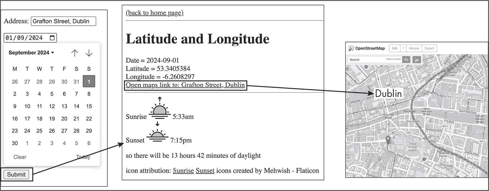

## 第三十一章：31 处理日期和时间


网络应用程序以多种方式使用日期和时间：如维护日历、记录发票创建时间、记录消息发送时间等等。本章将探讨 PHP 内置的日期和时间存储及处理资源，包括处理时区和夏令时等复杂性的方法。我们还将了解如何在 PHP 和像 MySQL 这样的数据库系统之间传递日期时间信息，后者有自己独立的存储方式。

### ISO 8601 标准

各国在日常生活中有不同的日期和时间表示习惯。例如，美国人写 11/2 表示 11 月 2 日，而爱尔兰和英国则写作 2/11 表示该日期。同样，有些国家使用 24 小时制，而有些国家则使用 12 小时制，并加上 AM 和 PM 标识。计算机程序在存储和处理日期与时间时不能容忍这种歧义，因此达成一致的标准非常重要。如今，几乎所有计算机领域的人都使用*ISO 8601*定义的日期时间格式，这一标准最初发布于 1988 年，之后经过了多次更新。

ISO 8601 的两个关键原则是：日期和时间用数字表示，并且它们按从最重要到最不重要的顺序排列。因此，日期从年份开始，然后是月份，再到日期。例如，1968 年 11 月 22 日通常写作 1968-11-22，年份用四位数表示，月份和日期用两位数表示，如果需要，则会加上前导零（例如，3 月应该写作 03 而不是 3）。遵循相同的原则，时间按小时、分钟、秒的顺序书写。例如，上午 9:05:30 就是 9 点 5 分 30 秒。若需要表示秒的小数部分，可以加上小数点和更多数字，所以 09:05:30.01 表示比 09:05:30 多出百分之一秒。该标准使用 24 小时制，因此晚上 11 点会写作 23:00:00。

> 注意

*PHP 的创造者，拉斯穆斯·勒多夫（Rasmus Lerdorf），于 1968 年 11 月 22 日出生。网络上并没有提到他出生的具体时间，因此我为本章的示例编造了 9:05* *AM* *和 30 秒。*

这些示例展示了 ISO 8601 日期和时间格式的*扩展版本*，它在日期字段之间加上了破折号，在时间字段之间加上了冒号，以提高人类可读性。计算机内部可能不会使用这些分隔符，但建议在向人类展示日期或时间时始终使用它们，因为像 1968-11-22 这样的格式比 19681122 更容易为人理解。

在组合日期和时间时，ISO 8601 规范要求日期和时间部分之间使用大写字母 T。因此，1968 年 11 月 22 日上午 9:05:30 应写作 1968-11-22T09:05:30。值得注意的是，原始的 ISO 8601 标准允许在日期和时间之间使用空格而不是 T，因此许多计算机实现也会接受 1968-11-22 09:05:30 作为有效格式。

> 注意

*在大多数编程语言中都有一个概念是* 日期时间*。因此，尽管我们人类把日期和时间看作分开处理，或者可能会说到一个* 日期和时间*，但在计算机编程中，我们通常使用存储日期和时间数据的对象。如果我们只关心日期，在代码中就忽略时间部分，通常将时间部分默认设置为一天的起始时间（*00:00:00*）。如果我们只关心时间，则忽略日期部分，通常将日期部分默认为当前日期。*

可以将时区字符或时区偏移量添加到日期时间字符串的末尾；我们将在“格式化日期时间信息”部分（见 第 634 页）讨论这一操作。ISO 8601 还定义了其他日期和时间组件（例如，周数），但我描述的这些组件涵盖了 99%的日期和时间格式化需求，适用于在 PHP 程序中创建和处理时间数据。

### 创建日期和时间

PHP 中用于处理单独日期和时间的基础类是 DateTimeImmutable。如果你在创建 DateTimeImmutable 对象时没有向构造函数提供参数，则新对象会默认使用创建时刻的当前日期和时间，并根据计算机系统的本地时区设置来确定时间。示例 31-1 展示了如何实例化此类。

```
<?php
$today = new DateTimeImmutable();
var_dump($today);
```

示例 31-1：为当前日期和时间创建一个 DateTimeImmutable 对象

我们创建一个没有任何参数的 DateTimeImmutable 对象，并使用 var_dump() 函数输出它的值。如果你在命令行中执行这个脚本，你应该看到类似下面的输出：

```
object(DateTimeImmutable)#1 (3) {
  ["date"]=>
  string(26) "1968-11-22 09:05:30.000000"
  ["timezone_type"]=>
  int(3)
  ["timezone"]=>
  string(3) "Europe/Dublin"
}
```

`var_dump()` 函数返回对象的内部日期值，以日期时间字符串的形式输出。请注意，这个字符串输出在日期和时间之间使用空格而不是“T”，以便提高人类可读性，并且时间部分使用六个小数位来精确到微秒（百万分之一秒）。对象的其他属性与时区有关（例如，我在爱尔兰都柏林），我们将在“时区”部分（见 第 641 页）详细讨论。

> 注意

*要获取当前日期和时间，你也可以使用* new DateTimeImmutable('now')*。* 'now' *参数如果你需要提供第二个参数，指定不同于默认时区的时间，这时非常有用。*

要创建一个 DateTimeImmutable 对象来存储另一个（非当前的）日期和时间，可以将包含所需日期和时间的字符串传递给构造函数，像这样：

```
$rasmusBirthdate = new DateTimeImmutable('1968-11-22T09:05:30');
```

这将创建一个新的 DateTimeImmutable 对象，表示日期 1968 年 11 月 22 日，时间为 9:05:30。

#### 格式化日期时间信息

DateTimeImmutable 类的 format() 方法使得可以以不同方式调整日期和时间的输出格式。例如，Listing 31-2 展示了如何将日期时间字符串格式化为 ISO 8601 标准。

```
<?php
$now = new DateTimeImmutable();

$atomDateString = $now->format(DateTimeInterface::ATOM);
print 'now (ISO-8601): ' . $atomDateString . PHP_EOL;
```

Listing 31-2：格式化一个 DateTimeImmutable 对象常量

我们实例化 $now 作为一个默认的 DateTimeImmutable 对象，然后调用它的 format() 方法，传入 DateTimeInterface 的 ATOM 常量（DateTimeImmutable 类是此接口的实现）。这个常量表示日期和时间应根据 ISO 8601 标准进行格式化。format() 方法返回一个字符串，我们将其存储在 $atomDateString 中并打印。输出应该类似如下：

```
now (ISO-8601): 1968-11-22T09:05:30 + 00:00
```

注意，输出遵循 ISO 8601 格式，包括日期和时间之间的 T。结尾的 +00:00 与时区有关，我们稍后会讨论。

format() 方法也可以接受一个字符串来指定自定义格式。这允许你创建更易读的日期时间输出。例如，你可以告诉 format() 拼出月份的名称，包含星期几，转换为 12 小时制，给日期数字添加后缀（如 *1st*、*2nd* 或 *23rd*），等等。Listing 31-3 展示了如何实现这一点。

```
<?php
$now = new DateTimeImmutable();

$formattedDateString = $now->
    format('l \t\h\e jS \o\f F Y \a\t i \m\i\n\s \p\a\s\t ga');
print 'now (nice format): ' . $formattedDateString . PHP_EOL;
```

Listing 31-3：自定义日期时间输出字符串格式

这一次，我们向 format() 提供一个字符串，定义日期时间信息的自定义格式。这个字符串使用字母代码，如 l、j 和 S，来代表日期和时间的各个部分。下面是 Listing 31-3 中字母的含义：

l   星期几的全名（如星期一、星期二等）

j   月份的日期，以整数形式表示，不带前导空格（如 1、4、20、31 等）

S   表示月份日期的两字母后缀（*st* 表示 1st，*nd* 表示 2nd，依此类推）

F   月份的全名（如一月、五月等）

Y   四位数的年份（如 2000、2019、2025 等）

i   带前导零的分钟数（00 到 59）

g   12 小时制的小时数，不带前导零（1 到 12）

a   适当的 AM 或 PM 缩写

每个字符的大小写非常重要，因为不同的字符代表不同的值，具体取决于它们是大写还是小写。例如，小写的 d 表示月份的日期（如果需要，前面会有零以确保两位数），而大写的 D 是星期几的三字母缩写（如 Mon、Tue 等）。

> 注意

*PHP 文档提供了所有这些特殊格式字符的完整列表，详见* [`www.php.net/manual/en/datetime.format.php`](https://www.php.net/manual/en/datetime.format.php)*。*

任何希望在格式化字符串中原样包含的文本都需要逐字符转义（在前面加上反斜杠）。因此，示例 31-3 中 format() 方法的字符串参数包含了像 \t\h\e（单词 *the*）和 \o\f（单词 *of*）这样的字符序列。示例 31-3 应输出类似以下内容：

```
now (nice format): Friday the 22nd of November 1968 at 05 mins past 9am
```

你还可以使用字母代码与 createFromFormat() 静态方法，根据格式化字符串创建新的 DateTimeImmutable 对象。参考这个例子：

```
$date = DateTimeImmutable::createFromFormat('j-M-Y', '15-Feb-2009');
```

createFromFormat() 方法接受两个参数。第一个是使用我们讨论过的字母代码构建的格式化字符串。第二个是一个遵循指定格式的字符串，为新的 DateTimeImmutable 对象设置值。

#### 使用 DateTimeImmutable 与 DateTime

我们的重点是 DateTimeImmutable 类，但 PHP 还提供了类似的 DateTime 类。唯一的区别（但至关重要）是，DateTimeImmutable 对象一旦创建，其包含的值不会发生变化，而 DateTime 对象的值可以被更新。一个后果是，可能会更改日期或时间的 DateTimeImmutable 方法将返回一个新的 DateTimeImmutable 对象，而不是修改原始对象的值。

尽可能使用 DateTimeImmutable 而非 DateTime，以避免对象发生意外变化并返回对其自身的引用。要了解原因，请参见 示例 31-4。

```
<?php
$today = new DateTime();
print 'today (before modify) = ' . $today->format('Y-m-d') . PHP_EOL;

$tomorrow = $today->modify('+1 day');
print 'today = ' . $today->format('Y-m-d') . PHP_EOL;
print 'tomorrow = ' . $tomorrow->format('Y-m-d') . PHP_EOL;
```

示例 31-4：创建一个 DateTime 对象并修改它

我们创建了一个新的 DateTime（而不是 DateTimeImmutable）对象，命名为 $today，并打印其值（以年-月-日格式）。然后，我们调用该对象的 modify() 方法将日期向前推一天，并将结果存储在 $tomorrow 变量中。然而，调用 modify() 方法并没有为第二天创建一个新的 DateTime 对象，而是更改了原始的 DateTime 对象并返回了对该对象的引用。为确认这一点，我们打印了 $today 和 $tomorrow。输出结果大致如下：

```
today (before modify) = 1968-11-22
today = 1968-11-23
tomorrow = 1968-11-23
```

最初，$today 的值表示 11 月 22 日。调用 modify() 方法后，$today 和 $tomorrow 都表示 11 月 23 日。两个变量都引用同一个 DateTime 对象，该对象的值被 modify() 方法更改。

虽然在某些情况下，具有可变日期时间信息可能是可取的，但在使用 DateTime 而非 DateTimeImmutable 之前，务必确认这是你想要的。这个例子也展示了不恰当的变量命名如何使代码难以理解和调试。如果我们故意创建了一个可变的 DateTime 对象并对其日期进行更改，那么该对象的命名就不应与特定的日期（如 $today 或 $tomorrow）相关，因为在某些时候，变量的名称将不再准确地反映其值。

为了真正看到这两个 PHP 日期时间类之间的区别，尝试将 示例 31-4 中的类从 DateTime 更改为 DateTimeImmutable，然后再次运行脚本。以下是输出结果：

```
today (before modify) = 1968-11-22
today = 1968-11-22
tomorrow = 1968-11-23
```

这次，$today 的值保持不变，而$tomorrow 则提前一天。这是因为 DateTimeImmutable 对象的 modify()方法创建并返回一个全新的 DateTimeImmutable 对象，修改了值，但原始对象保持不变。因此，$today 和$tomorrow 指代的是两个不同的 DateTimeImmutable 对象，两个变量名都是合理的，因为它们始终正确地指代它们所引用的对象的值。

### 操作日期和时间

PHP 的 DateTimeImmutable 类提供了多个方法，这些方法可以基于现有对象的值创建一个新的 DateTimeImmutable 对象。这些方法使得程序可以对日期和时间信息进行操作。

你已经看到了一个示例，即示例 31-4 中的 modify()方法。这个方法接受一个字符串参数，表示如何相对于当前 DateTimeImmutable 对象的值设置新的日期或时间。例如，字符串“yesterday”和“tomorrow”会返回前一天或次日的午夜（时间为 00:00:00）；“noon”和“midnight”字符串会返回当天的中午（12:00:00）或午夜；“本月的第一天”或“本月的最后一天”会根据需要更改日期，同时保持时间不变。这些修饰符字符串可以组合使用，例如，“明天中午”和“本月的第一天午夜”都是有效的。

其他修饰符字符串使用+或-后跟数量和时间单位，以更精细地控制新的 DateTimeImmutable 对象的值，例如“+1 天”、“-2 小时”或“+30 秒”。这些修饰符也可以组合成更长的字符串，例如“+1 天+30 秒”。示例 31-5 展示了这些修饰符的实际应用。

```
<?php
function showModify(string $modifier): void
{
    print PHP_EOL. $modifier . PHP_EOL;
    $date1 = new DateTimeImmutable();
    $date2 = $date1->modify($modifier);
    print 'date1 = ' . $date1->format(DateTimeInterface::ATOM) . PHP_EOL;
    print 'date2 = ' . $date2->format(DateTimeInterface::ATOM) . PHP_EOL;
}

showModify('first day of this month');
showModify('+1 day');
showModify('+30 seconds');
showModify('-10 seconds');
showModify('+1 month +3 days +1 seconds');
```

示例 31-5：将相对日期时间字符串传递给 modify()方法

为了帮助展示修改前后的日期时间，我们首先声明一个 showModify()函数，它接受一个修饰符字符串作为参数。该函数打印修饰符字符串本身，创建一个当前时间的 DateTimeImmutable 对象，并将该字符串传递给 modify()方法，以创建另一个修改过的 DateTimeImmutable 对象。然后它以 ISO 8601 格式打印两个对象。接着，我们通过一系列 showModify()调用来演示不同的修饰符字符串。输出应该像这样：

```
first day of this month
date1 = 1968-11-22T09:05:30 + 00:00
❶ date2 = 1968-11-01T09:05:30 + 00:00

+1 day
date1 = 1968-11-22T09:05:30 + 00:00
❷ date2 = 1968-11-23T09:05:30 + 00:00

+30 seconds
date1 = 1968-11-22T09:05:30 + 00:00
date2 = 1968-11-22T09:06:00 + 00:00

-10 seconds
date1 = 1968-11-22T09:05:30 + 00:00
date2 = 1968-11-22T09:05:20 + 00:00

+1 month +3 days +1 seconds
date1 = 1968-11-22T09:05:30 + 00:00
date2 = 1968-12-25T09:05:31 + 00:00
```

$date1 的值对于每次函数调用都是相同的，时间为 1968 年 11 月 22 日 9 点 05 分 30 秒。使用“本月的第一天”修饰符时，$date2 的日期部分变为 11 月 1 日，但时间部分保持不变❶。使用“+1 天”时，日期部分移动到 11 月 23 日，但时间部分同样保持不变❷。“+30 秒”和“-10 秒”字符串分别使时间部分前后移动，而不改变日期部分，类似地，“+1 个月+3 天+1 秒”则同时更改日期和时间。

如果你向 modify() 方法提供一个日期，该日期将替换新创建的 DateTimeImmutable 对象中的原始日期，而时间保持不变。例如，将字符串 '2000-12-31' 应用于一个包含 1968-11-22T09:05:30 的对象，将导致创建一个新的对象，日期为 2000-12-31 T09:05:30，时间保持不变，只是日期变为 2000 年 12 月 31 日。同样，提供一个时间会导致一个新的对象，其日期不变，但时间更新为新值。

也就是说，仅修改 DateTimeImmutable 对象的日期或时间组件可以通过使用 setDate() 和 setTime() 方法更轻松地实现。例如，如果 $date1 是一个 DateTimeImmutable 对象，以下两个语句会创建相同的新的对象：

```
$date2 = $date1->modify('2000-12-31');
$date2 = $date1->setDate(2000, 12, 31);
```

请注意，setDate() 方法接受三个独立的整数作为参数，而不是一个字符串。这些整数分别表示期望的年份、月份和日期。类似地，setTime() 方法接受四个整数，表示新的小时、分钟、秒和微秒。后两个默认值为 0。

#### 使用日期时间间隔

DateInterval 类表示一段时间跨度，而不是特定的日期时间。这个类提供了另一种处理日期时间信息以及思考不同日期时间之间关系的有用方法。例如，DateTimeImmutable 类的 add() 和 sub() 方法接受一个 DateInterval 对象，并返回一个新的 DateTimeImmutable 对象，该对象在时间上根据指定的时间间隔向前或向后偏移。清单 31-6 说明了它是如何工作的。

```
<?php
$interval1 = DateInterval::createFromDateString('30 seconds');
$interval2 = DateInterval::createFromDateString('1 day');

$date1 = new DateTimeImmutable();
$date2 = $date1->add($interval1);
$date3 = $date1->sub($interval2);

print '$date1 = ' . $date1->format(DateTimeInterface::ATOM) . PHP_EOL;
print '$date2 = ' . $date2->format(DateTimeInterface::ATOM) . PHP_EOL;
print '$date3 = ' . $date3->format(DateTimeInterface::ATOM) . PHP_EOL;
```

清单 31-6：创建由时间间隔偏移的新的 DateTimeImmutable 对象

首先，我们使用 createFromDateString() 静态方法创建两个 DateInterval 对象。通过此方法，我们可以使用像 '30 seconds' 或 '1 day' 这样的字符串来表示期望的时间间隔。接着，我们创建一个表示当前日期和时间的 DateTimeImmutable 对象，然后调用它的 add() 和 sub() 方法，传入 DateInterval 对象。这会创建两个新的 DateTimeImmutable 对象，根据给定的时间间隔进行偏移。输出中的三个日期时间字符串应该类似于这样：

```
$date1 = 1968-11-22T09:05:30 + 00:00
$date2 = 1968-11-22T09:06:00 + 00:00
$date3 = 1968-11-21T09:05:30 + 00:00
```

请注意，$date2 拥有相同的日期，但其时间是 09:06:00，比 $date1 晚了 30 秒。与此同时，$date3 拥有相同的时间，但日期早了 1 天：是 11 月 21 日，而不是 11 月 22 日。注意，我们可以创建负的 DateInterval 对象，也可以创建正的。例如，我们可以通过使用字符串 '-1 day' 来创建一个 DateInterval。

创建 `DateInterval` 对象的一个更常见方法是使用 `DateTimeImmutable` 类的 `diff()` 方法。给定一个 `DateTimeImmutable` 对象，调用它的 `diff()` 方法并传入另一个 `DateTimeImmutable` 对象，方法会返回一个表示这两个日期时间差异的 `DateInterval` 对象。当用户提供了开始日期和结束日期，并且需要根据这两个日期间的间隔大小进行某些逻辑或计算时，这个方法非常有用。例如，酒店预订网页应用程序可能会根据所选的开始和结束日期之间的天数来计算住宿费用。清单 31-7 展示了这个机制是如何工作的。

```
<?php
$date1 = new DateTimeImmutable('1968-11-22');
$date2 = new DateTimeImmutable('1968-11-16');

$interval = $date1->diff($date2);
print '$interval = ' . $interval->
    format('%m months, %d days, %i minutes, %s seconds');
```

清单 31-7：获取两个 `DateTimeImmutable` 对象之间的间隔

我们创建了两个 `DateTimeImmutable` 对象，`$date1` 和 `$date2`，每个对象仅指定了日期，这两个对象相隔六天。然后我们调用 `$date1` 上的 `diff()` 方法，并将 `$date2` 作为参数传入。这会生成一个 `DateInterval` 对象，保存两个日期之间的差异，我们对其进行格式化并打印。结果如下：

```
$interval = 0 months, 6 days, 0 minutes, 0 seconds
```

如预期的那样，`DateInterval` 对象表示两个日期之间相隔四天。注意，`DateInterval` 类的 `format()` 方法与格式化实际日期的方式不同。它接收一个字符串，使用百分号（%）表示 `DateInterval` 对象中应该插入的值的位置。例如，%d 会被输出字符串中的天数（6）替代。

#### 按规律间隔循环

对于显示一系列日期时间值、更新日历或生成历史报告，通常需要在两个日期之间按规律间隔进行循环。PHP 的 `DatePeriod` 类可以实现这一点。该类的对象可以像数组一样使用 `foreach` 循环进行迭代。每次迭代都会产生一个新的 `DateTimeImmutable` 对象，所有对象在时间上均匀分布。

要创建 `DatePeriod` 对象，必须提供起始和结束日期，以及定义迭代速率的 `DateInterval` 对象。清单 31-8 展示了如何使用此类自动列出一个月的前七天。

```
<?php
$today = new DateTimeImmutable();
print 'today: ' . $today->format('l \t\h\e jS \o\f F Y') . PHP_EOL;
$firstOfMonth = $today->modify('first day of this month');
$oneWeekLater = $firstOfMonth->modify('+1 week');

$interval = DateInterval::createFromDateString("1 day");
❶ $period = new DatePeriod($firstOfMonth, $interval, $oneWeekLater);

print '--- first 7 days of current month ---'. PHP_EOL;
❷ foreach ($period as $date) {
    print $date->format('l \t\h\e jS \o\f F Y') . PHP_EOL;
}
```

清单 31-8：迭代 `DatePeriod` 对象

首先，我们创建并打印当前日期的 `DateTimeImmutable` 对象（`$today`）。然后，我们使用 `modify()` 方法创建两个新的 `DateTimeImmutable` 对象，`$firstOfMonth` 表示当前月的第一天，`$oneWeekLater` 表示一周后的日期。这些将作为迭代的起始和结束点。接着，我们创建一个一天的 `DateInterval` 对象，将它与起始和结束日期一起，用来创建一个 `DatePeriod` 对象 ❶。参数的顺序是起始日期、间隔和结束日期。最后，我们运行一个 `foreach` 循环来迭代 `DatePeriod` 对象 ❷，并为每个日期打印格式化的字符串。输出应如下所示：

```
today: Friday the 22nd of November 1968
--- first 7 days of current month ---
Friday the 1st of November 1968
Saturday the 2nd of November 1968
Sunday the 3rd of November 1968
Monday the 4th of November 1968
Tuesday the 5th of November 1968
Wednesday the 6th of November 1968
Thursday the 7th of November 1968
```

基于 1968 年 11 月 22 日作为开始日期，脚本成功地循环并显示了该月的前七天。

创建 DatePeriod 对象的另一种方式是给定开始日期、时间间隔和重复次数，而不是开始和结束日期。这个第三个参数不计算开始日期本身，因此，要列出一个月的前七天，重复次数应为 6。DatePeriod 构造函数还有一个可选参数，通过传递常量 DatePeriod::EXCLUDE_START_DATE 作为第四个参数来排除开始日期。

> 注意

*目前，* DatePeriod *仅适用于正向的* DateInterval *对象，因此循环必须按时间向前推进。*

### 时区

*时区*是一个地理区域，遵循相同的时间。如今，全球所有时区都相对于*协调世界时（UTC）*来定义。这是国际参考子午线（0°经度）上的时间，经过英国格林威治。例如，UTC +3 和 UTC –2 分别表示比 UTC 提前三小时和滞后两小时。UTC 也被昵称为*Zulu 时间*，*Zulu*是北约音标字母表中字母*Z*的标准代码词。（*Z*代表*零*。）表 31-1 列出了某些示例 UTC 偏移量及其相关的时区。

表 31-1：示例时区

| UTC 偏移量 | 缩写 | 常用名称 |
| --- | --- | --- |
| UTC +0 | GMT | 格林威治标准时间 |
| UTC +1 | BST | 英国夏令时 |
| UTC +1 | IST | 爱尔兰标准时间 |
| UTC +11 | AEDT | 澳大利亚东部夏令时（塔斯马尼亚是我双胞胎兄弟的居住地） |
| UTC –5 | EST | 美国东部标准时间 |
| UTC +2 | CEST | 中欧夏令时 |

你可以在*php.ini*配置文件中设置系统的默认时区。时区本身通过*时区标识符*来表示，这是一个包含区域（如美国、欧洲或太平洋）和位于目标时区的城市的字符串，中间用斜杠分隔。例如，清单 31-9 显示了我已经将我的系统设置为欧洲/都柏林时区。

```
--snip--
[Date]
; Defines the default timezone used by the date functions
; https://php.net/date.timezone
date.timezone = Europe/Dublin
--snip--
```

清单 31-9：一个将默认时区设置为欧洲/都柏林的 php.ini 文件片段

你可以使用 date.timezone 设置 PHP 引擎的时区标识符。要验证系统的时区是否已正确设置，可以使用 date_default_timezone_get()函数。这对于我来说返回的是欧洲/都柏林。

> 注意

*你可以在 PHP 文档中找到接受的完整时区标识符列表，网址是* [`www.php.net/manual/en/timezones.php`](https://www.php.net/manual/en/timezones.php)*。但是，除了* UTC*之外，避免使用“其他”区域列出的任何标识符。这些标识符仅用于向后兼容，未来可能会更改。*

当你在 PHP 脚本中创建一个 DateTimeImmutable 对象时，它默认使用你系统的时区。我更倾向于通过将一个 DateTimeZone 对象作为第二个参数传递给 DateTimeImmutable 构造函数来指定时区。另一种常见的方法是将 UTC 偏移量附加到 ISO 8601 字符串的末尾。例如，向字符串末尾添加 +03:00 表示该日期时间比 UTC 提前三个小时。示例 31-10 展示了这两种方法。

```
<?php
function prettyPrintDatetime(string $name, DateTimeImmutable $date)
{
    print '---------' . $name . '---------' . PHP_EOL;
    print $date->format(DATE_ATOM) . ' ' . $date->getTimezone()->getName(). PHP_EOL . PHP_EOL;
}

$iceCreamDay = '2009-08-02';
$localDatetime = new DateTimeImmutable($iceCreamDay); ❶
$utcDatetime = new DateTimeImmutable($iceCreamDay, new DateTimeZone('UTC')); ❷
$londonDatetime = new DateTimeImmutable($iceCreamDay, new DateTimeZone('Europe/London'));
$parisDatetime = new DateTimeImmutable($iceCreamDay, new DateTimeZone('Europe/Paris'));
$hobartDatetime = new DateTimeImmutable($iceCreamDay, new DateTimeZone('Australia/Hobart'));
$threeHoursAhead = new DateTimeImmutable('2000-01-01T10:00:00 + 03:00'); ❸

print 'local time zone = ' . date_default_timezone_get() . PHP_EOL; ❹
prettyPrintDatetime('local', $localDatetime); ❺
prettyPrintDatetime('UTC', $utcDatetime);
prettyPrintDatetime('London', $londonDatetime);
prettyPrintDatetime('Paris', $parisDatetime);
prettyPrintDatetime('Hobart', $hobartDatetime);
prettyPrintDatetime('+03', $threeHoursAhead);
```

示例 31-10：创建具有不同时区的 DateTimeImmutable 对象

我们声明了一个 prettyPrintDatetime() 函数，用于漂亮地打印出 DateTimeImmutable 对象及其时区，并将作为 $name 参数传递的字符串标签一起打印。时区通过 DateTimeImmutable 对象的 getTimezone() 方法访问，该方法返回一个 DateTimeZone 对象。然后，我们必须调用 DateTimeZone 对象的 getName() 方法，该方法返回时区的名称作为字符串。

接下来，我们声明了一系列不同时区的 DateTimeImmutable 对象，所有对象都指向 2009 年 8 月 2 日（2009-08-02），即美国的第一个国家冰淇淋三明治日。$localDatetime 对象 ❶ 持有根据系统默认时区（对于我来说是欧洲/都柏林，依据我的 *php.ini* 文件）设置的日期。由于我们没有指定时间，时间将默认为午夜。

$utcDatetime 对象 ❷ 通过向 DateTimeImmutable 构造函数传递两个参数来设置为 UTC：$iceCreamDay 用于指定日期，DateTimeZone 对象设置为 'UTC' 用于指定时区。我们使用相同的技术为伦敦、巴黎和霍巴特的时间创建对象。$threeHoursAhead 对象 ❸ 是通过将 UTC 偏移量 +03:00 附加到传递给 DateTimeImmutable 构造函数的日期时间字符串 2000-01-01T10:00:00 来创建的，表示该时间比 UTC 提前三个小时。

我们使用内置函数 date_default_timezone_get() ❹ 打印出计算机系统的时区设置。然后，我们将我们的 DateTimeImmutable 对象逐个传递给 prettyPrintDatetime() 函数 ❺。输出应该类似于下面的内容：

```
❶ local time zone = Europe/Dublin
---------local---------
2009-08-02T00:00:00 + 01:00 Europe/Dublin

---------UTC---------
2009-08-02T00:00:00 + 00:00 UTC

---------London---------
2009-08-02T00:00:00 + 01:00 Europe/London

---------Paris---------
2009-08-02T00:00:00 + 02:00 Europe/Paris

---------Hobart---------
2009-08-02T00:00:00 + 10:00 Australia/Hobart

---------+03---------
❷ 2000-01-01T10:00:00 + 03:00 +03:00
```

第一个打印的数据是系统的时区设置，对于我来说是欧洲/都柏林 ❶。然后，当每个 DateTimeImmutable 对象被打印时，其时区信息通过两种方式出现在输出中：通过日期时间字符串末尾的 UTC 偏移量（例如，伦敦和都柏林是 +01:00，霍巴特是 +10:00），以及我们在 prettyPrintDatetime() 函数中提取的单独时区字符串。然而，请注意，当我们使用类似 +03:00 这样的通用 UTC 偏移量而不是更具体的时区标识符来指定时区时，DateTimeImmutable 对象会记录为这种方式 ❷。这是因为 PHP 不知道应该将该偏移量与哪个区域和城市相关联。例如，+03:00 可能是欧洲/莫斯科、亚洲/利雅得或非洲/摩加迪沙。

### 夏令时

全球约四分之一的国家实行夏令时制度：春季时钟向前拨动一小时（“春季前进”），秋季时钟向后拨动一小时（“秋季后退”）。如果对象的时区标识符所指定的位置观察夏令时，PHP 的 DateTimeImmutable 对象会自动考虑这些变化。

DateTimeImmutable 类的 format()方法有一个特殊值用于识别该对象是否处于夏令时：大写字母 I。调用 format('I')会返回 1（true），如果适用夏令时，或者返回 0（false），如果不适用。清单 31-11 显示了从清单 31-10 更新后的时区脚本，其中扩展了 prettyPrintDatetime()函数，以显示关于夏令时的额外信息。

```
<?php
function prettyPrintDatetime(string $name, DateTimeImmutable $date)
{
 print '---------' . $name . '---------' . PHP_EOL;
  ❶ $isDaylightSaving = $date->format('I');
    if ($isDaylightSaving) {
        $dstString = ' (daylight saving time = TRUE)';
    } else {
        $dstString = ' (daylight saving time = FALSE)';
    }
 print $date->format(DATE_ATOM) . ' ' . $date->getTimezone()->getName()
        . $dstString. PHP_EOL . PHP_EOL;
}

$iceCreamDay = '2009-08-02';
$localDatetime = new DateTimeImmutable($iceCreamDay);
$utcDatetime = new DateTimeImmutable(
 $iceCreamDay, new DateTimeZone('UTC'));
$londonDatetime = new DateTimeImmutable(
 $iceCreamDay, new DateTimeZone('Europe/London'));
--snip--
```

清单 31-11：更新后的 prettyPrintDatetime()函数，输出关于夏令时的消息

我们在传递给 prettyPrintDatetime()函数的 DateTimeImmutable 对象上调用 format('I')，将结果 1 或 0 存储在$isDaylightSaving 变量中❶。然后，我们使用 if...else 语句，根据此变量创建一个关于夏令时的适当的真/假消息。所有的 DateTimeImmutable 对象都已经为国家冰淇淋三明治日创建，这个日期是北半球夏季的一个有用日期，用来演示不同时间区是否适用夏令时。执行此更新脚本时的输出如下：

```
local time zone = Europe/Dublin
---------local---------
2009-08-02T00:00:00 + 01:00 Europe/Dublin (daylight saving time = FALSE)

---------UTC---------
2009-08-02T00:00:00 + 00:00 UTC (daylight saving time = FALSE)

---------London---------
2009-08-02T00:00:00 + 01:00 Europe/London (daylight saving time = TRUE)

---------Paris---------
2009-08-02T00:00:00 + 02:00 Europe/Paris (daylight saving time = TRUE)

---------Hobart---------
2009-08-02T00:00:00 + 10:00 Australia/Hobart (daylight saving time = FALSE)

---------+03---------
2000-01-01T10:00:00 + 03:00 +03:00 (daylight saving time = FALSE)
```

夏令时从不适用于 UTC，因此 UTC 行显示为 FALSE。英国和法国从 3 月底开始实施夏令时，因此伦敦和巴黎都显示为 TRUE。

奇怪的是，尽管爱尔兰的时钟也会向前拨动，但都柏林显示为 FALSE。这似乎是因为爱尔兰共和国的时区在法律上定义为冬季使用 GMT，夏季使用 IST（爱尔兰标准时间）。相比之下，英国和法国在夏令时生效时被定义为*夏季*时间，而不是*标准*时间（伦敦使用 BST，即英国夏令时，巴黎使用 CEST，即中欧夏令时）。因此，尽管欧洲/都柏林和欧洲/伦敦的时区在夏季的 UTC+01:00 偏移是正确的，一个被视为夏令时，另一个则不是，通过 format('I')方法来区分。

许多计算机系统以*纪元*为基准来测量时间，纪元是一个固定的时间点，被视为时间 0。例如，Unix 系统（包括 macOS）使用*time_t*格式，通常称为*Unix 时间*，它表示自 1970 年 1 月 1 日（星期四，00:00:00）以来经过的秒数。表 31-2 显示了几个 Unix 时间戳及其对应的 ISO 8601 日期时间。注意，1970 年之前的时间戳表示为负值。

表 31-2：示例 Unix 时间戳

| 日期 | 时间戳 |
| --- | --- |
| 1969-12-31 23:59:00 | –60 |
| 1970-01-01 00:00:00 | 0 |
| 1970-01-01 00:02:00 | 120 |
| 2009-08-02 00:00:00 | 1249171200 |

PHP 的内置 `time()` 函数返回当前的日期和时间，以 Unix 时间戳的形式表示。虽然现代 PHP 程序员通常使用 `DateTimeImmutable` 对象，但你可能会在旧代码或非面向对象编程的代码中遇到 `time()` 函数。因此，能够处理存储这些 Unix 时间戳的代码是很有用的。如果你有一个 `DateTimeImmutable` 对象，可以通过使用该对象的 `getTimestamp()` 方法获取其对应的 Unix 时间戳。清单 31-12 显示了一个脚本，用于创建对象并打印 表 31-2 中每一行的相应时间戳。

```
<?php
function print_timestamp(string $dateString): void
{
    $date = new DateTimeImmutable($dateString);
    print $date->format('D, F j, Y  g.i:s');
    print ' / timestamp = ' . $date->getTimestamp() . PHP_EOL;
}
print_timestamp('1969-12-31T23:59:00');
print_timestamp('1970-01-01T00:00:00');
print_timestamp('1970-01-01T00:02:00');
print_timestamp('2009-08-02T00:00:00');
```

清单 31-12：将 `DateTimeImmutable` 对象转换为 Unix 时间戳

首先，我们声明一个 `print_timestamp()` 函数，传入一个日期时间字符串，创建一个 `DateTimeImmutable` 对象，并使用 `getTimestamp()` 方法打印出对应的时间戳（以及格式化过的、易于阅读的人类版日期时间）。然后，我们调用这个函数四次，每次处理 表 31-2 中的一行。结果如下：

```
Wed, December 31, 1969  11.59:00 / timestamp = -60
Thu, January 1, 1970  12.00:00 / timestamp = 0
Thu, January 1, 1970  12.02:00 / timestamp = 120
Sun, August 2, 2009  12.00:00 / timestamp = 1249171200
```

`getTimestamp()` 的逆操作是 `setTimeStamp()` 方法，它会创建一个与给定 Unix 时间戳相对应的新 `DateTimeImmutable` 对象，如下所示：

```
$datetime = (new DateTimeImmutable())->setTimeStamp($timestamp);
```

请注意 `(new DateTimeImmutable())` 周围的额外括号。这会创建一个新的默认 `DateTimeImmutable` 对象，我们接着用它来调用 `setTimeStamp()` 方法，传入 `$timestamp` 变量中的相关时间戳。这样就创建了另一个新的 `DateTimeImmutable` 对象，并与该时间戳相对应，我们将其存储在 `$datetime` 变量中。如果没有额外的括号，语句将如下所示，PHP 引擎将无法理解该语法：

```
// This will not work
$datetime = new DateTimeImmutable()->setTimeStamp($timestamp);
```

在处理使用 Unix 时间戳的代码时，我建议重构代码，使用 `setTimeStamp()` 方法创建一个等效的 `DateTimeImmutable` 对象，然后使用该对象处理所有逻辑。之后，你可以使用 `getTimeStamp()` 方法将最终结果转换回时间戳。或者，更好的做法是，将所有代码重构为使用 `DateTimeImmutable` 对象，并完全不涉及时间戳。

> 注意

*Unix 时间戳最初是使用 32 位整数存储的，这是一种短视的方案。能够正确存储在原始 32 位格式中的最后一个时间戳是* +2147483647 *(2**³¹* *– 1)，即 2038 年 1 月 19 日凌晨 3:14 和 7 秒。再往前推进一秒将会导致溢出错误，时间戳为* -2147483648*，即 1901 年 12 月 13 日晚上 8:45 和 52 秒。幸运的是，大多数系统已经升级为使用 64 位存储 Unix 时间戳，这使得溢出错误推迟了 2920 亿年。*

### Web 应用中的日期时间信息

在本节中，我们将构建一个简单的 Web 应用程序，总结我们迄今为止在 PHP 中处理日期时间信息的知识。该应用程序将提供一个表单，供用户输入地址和日期，并显示该日期和地点的日出和日落时间，以及通过 DateInterval 类确定的该天白昼的总时长。

实际上，PHP 有一个内置的 date_sun_info()函数，用于报告给定日期和位置的日出和日落时间（以及其他信息）。然而，该函数需要将位置指定为纬度和经度坐标，而不是街道地址。因此，我们的应用程序还将演示如何从外部 API 获取数据，因为我们将依赖 OpenStreetMap 将地址转换为坐标。我们将使用一个流行的开源 PHP 库 Guzzle 与 OpenStreetMap 进行通信。Guzzle 提供了一个 HTTP 客户端，允许代码发送和接收 HTTP 请求。这使得将 PHP Web 应用程序与外部 Web 服务集成变得非常简单。

图 31-1 展示了我们将要创建的页面的截图。



图 31-1：日出日落 Web 应用程序的截图

主页允许用户提交一个街道地址和日期。这样就会跳转到一个结果页面，显示计算出来的信息。结果页面还会有一个链接，用于在 OpenStreetMap 中查看指定位置。

要开始，请创建一个新的项目，并包括常规的*composer.json*文件和*public/index.php*脚本，该脚本会创建一个 Application 对象并调用其 run()方法。然后在命令行中输入`composer require guzzlehttp/guzzle`，将第三方 Guzzle 库添加到项目中。由于我们正在运行 Composer，并且已经为我们的命名空间创建了*composer.json*文件，Composer 此时还会为我们的命名空间类生成自动加载器。

#### Application 类

现在我们将在*src/Application.php*中声明我们网站的 Application 类。该类将处理请求，通过显示主页或处理来自应用程序网页表单的数据来响应请求。列表 31-13 显示了相关代码。

```
<?php
namespace Mattsmithdev;

class Application
{
    public function run(): void
    {
        $action = filter_input(INPUT_GET, 'action');
        switch ($action) {
            case 'processForm': ❶
 $address = filter_input(INPUT_POST, 'address');
                $date = filter_input(INPUT_POST, 'date');
                if (empty($address) || empty($date)) {❷
                    $this->homepage('you must enter a valid address and a date');
                } else {
                    $this->processForm($date, $address);
                }
                break;

            default: ❸
                $this->homepage();
        }
    }

    private function homepage(string $errorMessage = ''): void ❹
    {
        require_once __DIR__ . '/../templates/homepage.php';
    }

    private function processForm(string $dateString, string $address): void
    {
        try {
            $streetMapper = new StreetMap();
            $latLongArray = $streetMapper->getOpenStreetMapData($address); ❺
            $latitude = $latLongArray['latitude'];
            $longitude = $latLongArray['longitude'];

            $date = new \DateTimeImmutable($dateString);
            $sunData = new SunData($date, $latitude, $longitude); ❻
            $sunrise = $sunData->getSunrise()->format('g:ia');
            $sunset = $sunData->getSunset()->format('g:ia');
            $hoursDaylight = $sunData->getHoursDaylight()->format("%h hours %i minutes"); ❼

            require_once __DIR__ . '/../templates/result.php'; ❽
        }   catch (\Exception) {❾
            print 'sorry - an error occurred trying to retrieve data from Open Street Map';
            print '<br>';
            print '<a href="/">home</a>';
        }
    }
}
```

列表 31-13：声明两个路由的 Application 类

和往常一样，类的 run()方法使用一个 switch 语句来处理传入的请求。首先，我们声明当$action 为'processForm'时的情况❶。对于这种情况，我们尝试从请求的 POST 数据中提取地址和日期变量。如果其中任何一个为空❷，我们调用 homepage()方法，并传入错误信息。否则，我们将地址和日期传递给 processForm()方法。

switch 语句中的唯一其他情况是默认路由 ❸，它仅调用 homepage() 方法且不传入任何参数。homepage() 方法本身 ❹ 使用 require_once 显示 *homepage.php* 模板（我们为了简单起见使用普通的 PHP 文件作为模板，而不是 Twig）。该方法有一个名为 $errorMessage 的参数，默认值为空字符串。这个变量将在模板的作用域内打印出来。

该类的核心是 processForm() 方法，它接受提交的地址和日期字符串，并利用它们获取日出和日落时间，以及白昼的总时长。我们首先需要将地址转换为纬度和经度坐标。为此，我们创建一个新的 StreetMap 对象（稍后我们会查看这个类），并调用它的 getOpenStreetMapData() 方法 ❺，传入 $address 字符串。返回的结果存储在 $latLongArray 变量中，它是一个包含 'latitude' 和 'longitude' 键的数组，保存了必要的坐标，我们将其提取到单独的变量中。

然后，我们使用通过网页表单提交的日期字符串，创建一个相应的 DateTimeImmutable 对象，命名为 $date。接着我们创建一个新的 SunData 对象（另一个我们稍后会查看的类），将 $date、$latitude 和 $longitude 作为参数 ❻ 传入。SunData 对象使用提供的信息来计算日出和日落时间以及白昼时长。我们通过相应的 getter 方法提取这些数据，并通过链式调用 format() 方法将日期时间信息转换为字符串。$sunrise 和 $sunset 变量的格式为 8.35am。$hoursDaylight 变量是一个 DateInterval 对象，格式为 16 小时 39 分钟，使用 %h 表示小时，%i 表示分钟 ❼。在这些变量都有了作用域后，我们显示 *result.php* 模板 ❽。

所有在 processForm() 方法中的活动都嵌套在一个 try 块中。如果出现问题，例如无法连接到 OpenStreetMap，方法末尾的 catch 语句 ❾ 会显示错误信息，并提供一个返回主页的链接。

#### 辅助类

接下来，我们声明应用程序的辅助类，从 StreetMap 开始，它负责与 OpenStreetMap 网络服务器的交互。创建 *src/StreetMap.php* 文件，如 Listing 31-14 所示。

```
<?php
namespace Mattsmithdev;

use GuzzleHttp\Client;

class StreetMap
{
    private Client $client;

    public function __construct()
    {
        $this->client = new Client([
            'timeout' => 10.0,
            'headers' => [
                'User-Agent' => 'matt smith demo',
              ❶ 'Accept'     => 'application/json',
            ],
 'verify' => true,
        ]);
    }

    public function getOpenStreetMapData(
        string $address = 'grafton street, dublin, ireland'
    ): array
    {
        $url = $this->buildQueryString($address);
      ❷ $response = $this->client->request('GET', $url);

        if ($response->getStatusCode() == 200) {
            $responseBody = $response->getBody();
          ❸ $jsonData = json_decode($responseBody, true);
            if (empty($jsonData)) {
                throw new \Exception('no JSON data received');
            }
        } else {
          ❹ throw new \Exception('Invalid status code');
        }

      ❺ return [
            'latitude' => $jsonData[0]['lat'],
            'longitude' => $jsonData[0]['lon'],
        ];
    }

    private function buildQueryString(string $address): string
    {
      ❻ $query = http_build_query([
            'format'         => 'jsonv2',
            'q'              => $address,
            'addressdetails' => 1,
        ]);

        $url = "https://nominatim.openstreetmap.org/search?$query";

        return $url;
    }
}
```

Listing 31-14：用于访问 OpenStreetMap 服务器的 StreetMap 类

首先，使用语句允许我们调用位于 GuzzleHttp 命名空间中的 Guzzle 库的 Client 类。该类将负责处理向外部站点发起 HTTP 请求的细节。然后，我们声明客户端实例变量，并在构造函数中将其初始化为 Client 对象。我们提供了各种 Guzzle Client 参数，如超时设置（等待响应的时间）和发送代理名称（对于这个项目，“matt smith demo”就可以）。我们特别配置 Client 以接受 JSON 数据❶，因为 OpenStreetMap API 返回的数据格式就是 JSON。

接下来，我们声明 getOpenStreetMapData()方法。它接收一个地址（为了测试，我提供了一个默认值），并通过 buildQueryString()方法将其转化为适当的查询字符串。然后，它使用 Client 对象的 request()方法向 OpenStreetMap API 发送请求，并存储收到的响应❷。如果响应代码有效（200），则将接收到的数据解码为$jsonData 数组❸。如果响应代码不是 200 或收到的是空数组，我们会抛出一个异常，提示调用代码从 OpenStreetMap API 获取数据时出现了问题❹。如果代码通过 if...else 语句没有抛出异常，则从接收到的$jsonData 中提取出纬度和经度，并以数组形式返回❺。

最后，我们声明了 buildQueryString()方法。该方法使用 PHP 内置的 http_build_query()函数，将地址和其他细节编码成适用于 Nominatim OpenStreetMap API❻的查询字符串。我们将查询信息作为键/值对的数组提供给 http_build_query()，然后将编码后的查询字符串（保存在变量$query 中）附加到$url 的末尾。

> 注意

*关于 Nominatim OpenStreetMap API 的更多要求，见* [`nominatim.org`](https://nominatim.org)*。Nominatim*（拉丁语意思为“按名称”）是一个开源软件项目，提供 OpenStreetMap 数据的搜索功能。它支持*地理编码*（根据给定的名称和地址获取位置）和*反向地理编码*（根据给定的位置获取地址）。

现在我们将看看 SunData 类，它旨在简化与 PHP 内置的 date_sun_info()函数一起使用的过程。在[src/SunData.php]中声明该类，如列表 31-15 所示。

```
<?php
namespace Mattsmithdev;

class SunData
{
    private \DateTimeImmutable $sunrise;
    private \DateTimeImmutable $sunset;
    private \DateInterval $hoursDaylight;

    public function __construct(\DateTimeImmutable $date, float $latitude, float $longitude)
    {
        $timestamp = $date->getTimestamp(); ❶
        $data = date_sun_info($timestamp, $latitude, $longitude); ❷

        $this->sunrise = $this->dateFromTimestamp($data['sunrise']);
        $this->sunset = $this->dateFromTimestamp($data['sunset']);
        $this->hoursDaylight = $this->sunset->diff($this->sunrise); ❸
    }

    private function dateFromTimestamp(int $timestamp): \DateTimeImmutable
    {
        return (new \DateTimeImmutable())->setTimeStamp($timestamp); ❹
    }

 public function getSunrise(): \DateTimeImmutable
    {
        return $this->sunrise;
    }

    public function getSunset(): \DateTimeImmutable
    {
        return $this->sunset;
    }

    public function getHoursDaylight(): \DateInterval
    {
        return $this->hoursDaylight;
    }
}
```

列表 31-15：用于处理 date_sun_info()函数的 SunData 类

我们为 SunData 类提供了三个实例变量：sunrise 和 sunset 是用于日出和日落时间的 DateTimeImmutable 对象，hoursDaylight 是一个 DateInterval 对象，表示白昼持续时间。SunData 的构造函数接受三个参数：日期（一个 DateTimeImmutable 对象）以及感兴趣位置的纬度和经度。这些是 date_sun_info() 函数所需要的信息，尽管日期必须是 Unix 时间戳格式，因此构造函数开始时调用 getTimeStamp() 方法来进行转换 ❶。

然后我们调用 date_sun_info()，并将结果存储在 $data 变量中，这个结果是一个信息数组 ❷。我们从 $data 数组中提取日出和日落时间，并将它们存储到相应的实例变量中。由于 date_sun_info() 返回的是 Unix 时间戳形式的日期时间信息，我们使用 dateFromTimestamp() 辅助方法将时间戳转换回 DateTimeImmutable 对象。（在这个方法中，请注意，我们必须在创建新的 DateTimeImmutable 对象时，额外加上括号，才能调用它的 setTimeStamp() 方法 ❹。）

对于白昼时长，我们只需计算日落和日出时间的差值 ❸。SunData 类的其余部分由简单的 getter 方法组成，用于返回三个实例变量。

#### 模板

我们现在准备好创建首页（包含网页表单）和结果页的模板。我们将从 *templates/homepage.php* 中的首页模板开始。代码见 列表 31-16。

```
<!doctype html>
<html lang="en">
<head><title>Sun Data</title></head>
<body>
❶ <?php if (!empty($errorMessage)): ?>
    <p style="background-color: pink; padding: 2rem">
        <?= $errorMessage ?>
    </p>
<?php endif; ?>

<form action="/?action=processForm" method="post">
    <p>
        Address:
        <input name="address">
    </p>
    <p>
      ❷ <input name="date" type="date">
    </p>
    <input type="submit">
</form>
</body>
</html>
```

列表 31-16：从用户输入地址和日期的表单

在页面主体中，我们首先使用替代的 if 语句语法显示一个粉色样式的段落，包含错误信息字符串，前提是 $errorMessage 变量不为空 ❶。然后我们创建一个 action 为 processForm 的表单，表单中包含地址和日期字段。对于日期字段，我们使用一个 type 为 date 的 <input> 元素 ❷，大多数网页浏览器将其显示为一个用户友好的日历日期选择器控件，如 图 31-1 所示。

第二个模板用于向用户显示结果。创建 *templates/result.php*，并使用 列表 31-17 中的代码。

```
<!doctype html>
<html lang="en">
<head><title>results</title></head>
<body>
<a href="/">(back to home page)</a> ❶
<hr>

<h1>Latitude and Longitude</h1>
Date = <?= $dateString ?><br>
Latitude = <?= $latitude ?><br>
Longitude = <?= $longitude ?><br>

<a href="http://www.openstreetmap.org/?zoom=17&mlat=<?= $latitude ?>&mlon=<?= $longitude ?>"> ❷
    Open maps link to: <?= $address ?>
</a>

<hr>
Sunrise 
<?= $sunrise ?>
<br>
Sunset 
<?= $sunset ?>
<p>
    so there will be <?= $hoursDaylight ?> of daylight
</p>

<footer> ❸
    icon attribution:
    <a href="https://www.flaticon.com/free-icon/sunrise_3920688" title="sunrise icons">
        Sunrise</a>
    <a href="https://www.flaticon.com/free-icon/sunset_3920799" title="sunset icons">
        Sunset</a>
    icons created by Mehwish - Flaticon
</footer>
</body>
</html>
```

列表 31-17：向用户呈现太阳数据结果的模板

在这个模板中，我们首先提供一个链接，让用户返回首页 ❶。然后我们显示提供的日期以及与提供的地址对应的纬度和经度。

接下来，我们提供一个链接以在 OpenStreetMap 中查看位置，将 $latitude 和 $longitude 变量的值插入到链接中，用于 mlat 和 mlon 查询字段 ❷。然后，我们输出日出、日落和白昼时长的数值，并在日出和日落时间旁边显示相应的图像（*sunrise.png* 和 *sunset.png*，由用户 Mehwish 提供，图像来源于 *[`www.flaticon.com`](https://www.flaticon.com)*）。

这些图片的链接及其出版者的致谢已在页面底部的元素❸中提供。下载这些图片并将它们复制到*public/images*目录中，以完成 Web 应用程序的创建。然后尝试运行 Web 服务器，并使用不同的日期和地址测试应用程序。

这个项目汇集了本章的许多概念，展示了 DateInterval 类的实际应用，并展示了如何在 DateTimeImmutable 对象和 Unix 时间戳之间进行转换。它还说明了开源库的强大功能，本文展示了 Guzzle 如何使发送请求到外部 API 并处理返回的 JSON 数据变得轻松。

### MySQL 日期

在 PHP 中工作时，使用原生的 PHP 日期和时间对象及函数是很有意义的。然而，在数据库中存储时间数据时，最好使用数据库系统的原生格式。这样，数据库查询可以直接在这些字段上执行，而且用其他编程语言编写的应用程序也可以处理存储在数据库中的数据。因此，了解数据库的日期时间格式并学习如何在读写数据库时在 PHP 和相关数据库格式之间进行转换非常重要。在本节中，我们将探讨 MySQL 如何处理日期时间信息，但这些原则适用于任何数据库管理系统（DBMS）。

MySQL 可以存储日期、日期时间和时间戳，但我们这里重点讨论日期时间。MySQL 的基本日期和时间格式与 ISO 8601 相同，日期格式为 YYYY-MM-DD，时间格式为 HH:MM:SS。不过，MySQL 在日期和时间之间使用空格而不是字母 T 作为分隔符，因此 ISO 8601 格式中的 1968-11-22T09:05:30 会在 MySQL 中存储为 1968-11-22 09:05:30。像 PHP 一样，MySQL 可以为时间组件添加小数位，以存储秒的小数部分，精确到微秒（六位小数）。

要指定你希望 MySQL 表中的某个列存储日期时间，请使用 DATETIME 数据类型声明该列。现代 MySQL 系统默认为时间组件的零小数位（即整秒）。要包含秒的小数部分，可以在数据类型后面加上括号并指定所需的小数位数。例如，要存储精确到微秒的日期时间，可以声明 DATETIME(6)类型的列。

MySQL 将日期时间数据存储为 UTC 值。因此，如果 MySQL 服务器设置为非 UTC 的时区，它将把任何日期时间转换为 UTC 进行存储，然后在检索时再从 UTC 转换回来。实际上，常见做法是创建 UTC DateTimeImmutable 对象以存储到数据库中，之后由 Web 应用程序逻辑将检索到的日期时间转换为其他所需的时区。

> 注意

*如果你使用的是* TIMESTAMP *数据类型，需注意 MySQL 会根据你的 MySQL 服务器的时区设置自动将其转换为 UTC。*

为了从 PHP 脚本中将 MySQL datetime 字符串插入到表中，首先使用 DateTimeImmutable 对象，并使用它的 format() 方法，格式字符串为 'Y-m-d H:i:s'（表示整秒）或 'Y-m-d H:i:s.u'（表示带小数秒）。特别注意 d 和 H 之间的空格。同样，当从 MySQL 获取日期时间字符串时，可以使用 DateTimeImmutable 类的 createFromFormat() 静态方法来获取该 MySQL 数据的等效 DateTimeImmutable 对象。

为了演示如何在 DateTimeImmutable 对象和 MySQL DATETIME 字段之间来回转换，我们将创建一个包含 Appointment 实体类的项目，并创建一个相应的预约数据库表来存储预约的名称和日期时间。首先创建一个包含常规 *composer.json* 文件的新项目，并在命令行输入 composer dump-autoload 来生成自动加载器。接着，创建一个名为 date1 的新的 MySQL 数据库架构，并使用 Listing 31-18 中的 SQL 语句在该架构中创建一个预约表。（参见 第 543 页 的“设置数据库架构”部分，回顾如何将此 SQL 语句集成到 PHP 脚本中。）

```
CREATE TABLE IF NOT EXISTS appointment (
    id integer PRIMARY KEY AUTO_INCREMENT,
    title text,
    startdatetime datetime(6)
)
```

Listing 31-18：创建预约 MySQL 数据库表的 SQL 语句

表中有一个自增的 id 字段作为主键，一个 title 字段用于描述预约，以及一个 startdatetime 字段表示预约开始的时间。我们将 startdatetime 字段声明为 datetime(6) 类型，以说明如何处理秒的小数部分，但请注意，MySQL 默认的零小数位对于大多数实际的会议或预约应用程序来说已足够。

现在我们将声明与此表对应的 Appointment 类。将 Listing 31-19 的内容输入到 *src/Appointment.php* 文件中。

```
<?php
namespace Mattsmithdev;

class Appointment
{
    private int $id;
    private string $title;
    private \DateTimeImmutable $startDateTime; ❶

    public function getId(): int
    {
        return $this->id;
    }

    public function setId(int $id): void
    {
        $this->id = $id;
    }

    public function getTitle(): string
    {
        return $this->title;
    }

    public function setTitle(string $title): void
    {
        $this->title = $title;
    }

    public function getStartDateTime(): \DateTimeImmutable
    {
        return $this->startDateTime;
    }

    public function setStartDateTime(\DateTimeImmutable|string $startDateTime): void ❷
    {
        if (is_string($startDateTime)) {
            $startDateTime = \DateTimeImmutable::createFromFormat(
                AppointmentRepository::MYSQL_DATE_FORMAT_STRING, $startDateTime);
        }

        $this->startDateTime = $startDateTime;
    }
}
```

Listing 31-19：Appointment 实体类，包含一个 DateTimeImmutable 属性

Appointment 类具有 id、title 和 startDateTime 属性，以匹配预约表中的列。请注意，startDateTime 属性是一个 DateTimeImmutable 对象 ❶。我们为每个属性提供了适当的 getter 和 setter 方法。这包括一个特殊的 setter 方法，它使用联合类型 DateTimeImmutable|string，允许提供 DateTimeImmutable 对象或字符串作为参数 ❷。

如果接收到的参数是字符串，我们将使用公共常量 MYSQL_DATE_FORMAT_STRING 来帮助格式化，并将其转换为 DateTimeImmutable 对象。（我们将在稍后的 AppointmentRepository 类中声明此常量。）此机制允许同一个 setter 方法既能处理 PHP 的 DateTimeImmutable 对象，也能处理从数据库接收到的 MySQL 日期时间字符串。如果使用像 Doctrine 这样的 ORM 库，就可以避免额外的逻辑，它能无缝地在 PHP 数据类型和其数据库等效物之间进行转换。

接下来，我们将创建一个 AppointmentRepository 类，该类包含将新预约插入到 appointments 表中的方法，并获取所有预约。为了简化，我们将数据库连接和仓库方法结合在这个类中，但请参阅第二十八章以了解如何在单独的数据库类中管理数据库连接的示例。创建*src/AppointmentRepository.php*，并包含列表 31-20 中的代码。

```
<?php
namespace Mattsmithdev;

class AppointmentRepository
{
    public const MYSQL_DATE_FORMAT_STRING = 'Y-m-d H:i:s.u'; ❶

    public const MYSQL_DATABASE = 'date1';
    public const MYSQL_HOST = 'localhost:3306';
    public const MYSQL_USER = 'root';
    public const MYSQL_PASS = 'passpass';

    private ?\PDO $connection = NULL;

    public function __construct()
    {
        try {
            $this->connection = new \PDO('mysql:dbname='
                . self::MYSQL_DATABASE . ';host='
                . self::MYSQL_HOST , self::MYSQL_USER, self::MYSQL_PASS
            ); ❷
        } catch (\Exception) {
            print 'sorry - there was a problem connecting to database ' . self::MYSQL_DATABASE;
        }
    }

    public function insert(Appointment $appointment): int
    {
        if (NULL == $this->connection) return -1;

 $title = $appointment->getTitle();
        $startDateTime = $appointment->getStartDateTime();
        $dateString = $startDateTime->format(self::MYSQL_DATE_FORMAT_STRING); ❸

        // Prepare SQL
        $sql = 'INSERT INTO appointment (title, startdatetime) VALUES (:title,
                                                                       :startdatetime)';
        $stmt = $this->connection->prepare($sql);

        // Bind parameters to statement variables
        $stmt->bindParam(':title', $title);
        $stmt->bindParam(':startdatetime', $dateString);

        // Execute statement
        $success = $stmt->execute();

        if ($success) {
            return $this->connection->lastInsertId();
        } else {
            return -1;
        }
    }

    public function findAll(): array
    {
        $sql = 'SELECT * FROM appointment';
        $stmt = $this->connection->prepare($sql);
        $stmt->execute();
        $objects = $stmt->fetchAll(); ❹

        $appointments = [];
        foreach ($objects as $object) {
            $appointment = new Appointment();
            $appointment->setId($object['id']);
            $appointment->setTitle($object['title']);
            $appointment->setStartDateTime($object['startdatetime']);
            $appointments[] = $appointment;
        }

        return $appointments;
    }
}
```

列表 31-20：用于 MySQL 数据库交互的 AppointmentRepository 类

我们声明一个公共的 MYSQL_DATE_FORMAT_STRING 常量，它包含了必要的格式化字符串，用于确保 MySQL 日期时间与 PHP 的 DateTimeImmutable 对象之间的兼容性❶。接着，我们声明更多常量来保存数据库凭证（请务必填写您自己的值），并定义一个私有的连接属性来保存 PDO 数据库连接对象。在构造函数中，我们创建数据库连接并将其存储在连接属性中❷，同时使用 try...catch 结构来处理可能出现的问题。

然后，我们声明 insert()方法，它接收一个 Appointment 对象并将其 title 和 startDateTime 属性提取到单独的变量中。为了创建 MySQL 日期字符串$dateString，我们将 MYSQL_DATE_FORMAT_STRING 常量传递给 DateTimeImmutable 对象的 format()方法，以获取正确的字符串格式❸。接着，我们准备一个 SQL INSERT 语句，将其填充为适当的值，并执行该语句以向预约表中添加一行数据。

在 findAll()方法中，我们使用 PDO 的 fetchAll()方法从预约表中检索所有条目，返回一个包含键值对的关联数组❹。然后，方法会遍历这个数组，从每个元素创建一个 Appointment 对象，并将其添加到$appointments 数组中，最后返回该数组。

最后，我们将创建一个可以在命令行运行的索引脚本，用于创建几个示例的 Appointment 对象，将它们的数据添加到数据库中，然后从数据库中检索这些条目并返回为 Appointment 对象的数组。创建*public/index.php*，如列表 31-21 所示。

```
<?php
require_once __DIR__ . '/../vendor/autoload.php';

use Mattsmithdev\Appointment;
use Mattsmithdev\AppointmentRepository;

$appointmentRepository = new AppointmentRepository();

$appointment = new Appointment();
$appointment->setTitle('get an ice cream sandwich');
$appointment->setStartDateTime(new DateTimeImmutable('2009-08-02T11:00:00.5'));
$appointmentRepository->insert($appointment);

$appointment2 = new Appointment();
$appointment2->setTitle('celebrate birthday');
$appointment2->setStartDateTime(new DateTimeImmutable('2025-11-22T09:05:30.77'));
$appointmentRepository->insert($appointment2);

$appointments = $appointmentRepository->findAll();
foreach ($appointments as $appointment) {
    var_dump($appointment);
}
```

列表 31-21：在/public/index.php 中测试我们的 MySQL 日期示例的索引脚本

我们需要加载自动加载器并声明 Mattsmithdev 命名空间中的 AppointmentRepository 和 Appointment 类。接着，我们创建一个名为 $appointmentRepository 的 AppointmentRepository 对象，并创建两个示例 Appointment 对象，通过 $appointmentRepository 对象的 insert() 方法将其插入数据库。每个对象都被赋予带有小数秒部分的时间，并使用 ISO 8601 格式指定，包括日期和时间之间的 T 分隔符。然而，这种格式并不重要，因为我们已经编写了 AppointmentRepository 类，其中包含将其转换为 MySQL 日期时间格式的逻辑。最后，我们通过调用 repository 对象的 findAll() 方法来检索所有数据库行作为 Appointment 对象的数组，然后遍历这些对象并将其传递给 var_dump()。

以下是当索引脚本执行时的输出：

```
object(Mattsmithdev\Appointment)#9 (3) {
  ["id":"Mattsmithdev\Appointment":private]=>
  int(1)
  ["title":"Mattsmithdev\Appointment":private]=>
  string(25) "get an ice cream sandwich"
  ["startDateTime":"Mattsmithdev\Appointment":private]=>
  object(DateTimeImmutable)#10 (3) {
    ["date"]=>
    string(26) "2009-08-02 11:00:00.500000"
    ["timezone_type"]=>
    int(3)
    ["timezone"]=>
    string(13) "Europe/Dublin"
  }
}
object(Mattsmithdev\Appointment)#11 (3) {
  ["id":"Mattsmithdev\Appointment":private]=>
  int(2)
  ["title":"Mattsmithdev\Appointment":private]=>
  string(18) "celebrate birthday"
  ["startDateTime":"Mattsmithdev\Appointment":private]=>
  object(DateTimeImmutable)#12 (3) {
    ["date"]=>
    string(26) "2025-11-22 09:05:30.770000"
    ["timezone_type"]=>
    int(3)
    ["timezone"]=>
    string(13) "Europe/Dublin"
  }
}
```

从数据库中检索并输出到控制台的有两个约会。第一个是“去吃冰淇淋三明治”约会，开始时间为 2009-08-02 11:00:00.500000。第二个是“庆祝生日”约会，开始时间为 2025-11-22 09:05:30.770000。两个日期组件都存储到了小数点后六位，精确到秒的分数部分。注意，时区为 Europe/Dublin，这是我 PHP 设置的时区，在创建新的 DateTimeImmutable 对象时默认应用。如果 Web 应用程序需要处理来自不同时区的日期，解决方案之一是将时区与每个日期时间的 UTC 版本一起存储在数据库中，然后在检索时将获取到的日期时间转换回该时区。

### 总结

操作日期和时间通常是开发应用程序中必不可少的一部分，因为日期和时间信息为用户提供了有用的功能（例如，维护日历）并且在记录动作和请求发生的时间方面非常重要。在本章中，我们探讨了与日期和时间相关的最有用的 PHP 类和函数，包括 DateTimeImmutable 和 DateInterval 类。

我们在一个 Web 应用程序中使用这些语言特性，该应用程序报告日出和日落信息，并依赖 Guzzle 库来发起 HTTP 请求访问外部站点。我们还探讨了如何在 PHP 脚本和 MySQL 数据库表之间来回移动日期时间信息，并根据需要转换格式。

### 练习

1.   编写一个脚本来创建（并使用 var_dump）UTC（Zulu 时间）、爱尔兰标准时间和东部标准时间的 DateTimeImmutable 对象，时间为：

2025-01-01 10:00:00

2025-01-02 12:00:00.05

2.   编写一个脚本来创建（并使用 var_dump）2000-01-01 22:00:00 和以下时间之间的 DateInterval 对象：

2000-01-02 22:00:00

2010-05-06 00:00:00

2010-05-06 00:00:30

2020-01-01 22:00:00

3.   开发一个项目，用于创建、存储和检索患者与医生的会面记录。该项目应使用 MySQL 数据库存储记录。将项目围绕一个名为 Consultation 的实体类进行设计，包含以下属性：

患者姓名（字符串）

医生姓名（字符串）

会诊日期和时间（DateTimeImmutable）

持续时间（分钟）（整数）

以下是创建此类记录的数据库表的 SQL 语句：

```
CREATE TABLE IF NOT EXISTS consultation (
    id integer PRIMARY KEY AUTO_INCREMENT,
    patient text,
    doctor text,
    duration integer,
    consultationdatetime datetime
)
```

4.   创建一个新项目，用于查找 1999 年 12 月 31 日，即上一千年的最后一天，纽约和都柏林的日照时间。
