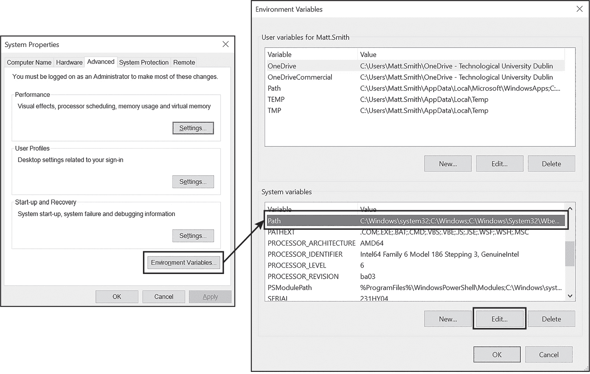
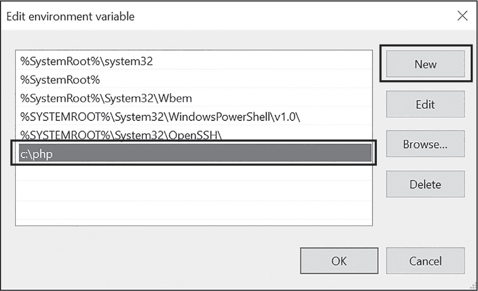

# 第三十二章：安装 PHP


虽然可以在云端进行 PHP 开发，但许多程序员和学生更喜欢在本地计算机上安装 PHP。本附录将介绍如何在 macOS、Linux 和 Windows 操作系统上安装 PHP。

## macOS

在 macOS 上安装 PHP 最简单的方法是使用 Homebrew，这是一款免费的包管理器，能够大大简化软件包的安装和设置。如果你还没有 Homebrew，首先访问 *[`brew.sh`](https://brew.sh)* 按照页面上的说明安装。

安装 Homebrew 后，在命令行中输入以下内容以安装 PHP：

```
$ **brew install php**
```

若要验证是否成功，请输入以下内容：

```
$ **php -v**
```

如果 PHP 安装成功，你应该在输出中看到最新的 PHP 版本号。

你还可以使用 Homebrew 安装 Composer 依赖管理器，相关内容请参见 第二十章：

```
$ **brew install composer**
```

最后一步是检查 PHP 安装正在读取哪个（如果有的话）INI 配置文件。使用以下命令：

```
$ **php --ini**
```

输出应类似于以下内容：

```
Configuration File (php.ini) Path: /opt/homebrew/etc/php/8.x
Loaded Configuration File:         /opt/homebrew/etc/php/8.x/php.ini
--snip--
```

显示的前两行会告诉你 PHP 引擎读取其设置的 INI 文件的路径和文件名。例如，在我的 macOS 计算机上，INI 文件位于 */opt/homebrew/etc/php/8.<x>/php.ini*。

## Linux

许多 Linux 发行版使用高级包装工具（APT）包管理器进行软件安装。在使用 APT 命令行时，建议首先通过以下命令更新和升级任何已安装的包：

```
$ **sudo apt-get update**
$ **sudo apt-get upgrade**
```

然后，你可以按照以下方式安装 PHP：

```
$ **sudo apt-get install php**
$ **sudo apt-get install php-cgi**
```

这应该适用于大多数 Linux 发行版，如 Ubuntu，但你可以在 *[`www.zend.com/blog/installing-php-linux`](https://www.zend.com/blog/installing-php-linux)* 上找到有关在更多发行版上安装 PHP 的详细信息。

若要验证安装是否成功，请输入以下内容：

```
$ **php -v**
```

如果 PHP 安装成功，你应该在输出中看到最新的 PHP 版本号。你还应该使用此命令检查 PHP 安装正在读取哪个（如果有的话）INI 配置文件：

```
$ **php --ini**
```

结果应类似于以下内容：

```
Configuration File (php.ini) Path: /etc/php/8.x/cli
Loaded Configuration File:         /etc/php/8.x/cli/php.ini
--snip--
```

显示的前两行会告诉你 PHP 引擎读取其设置的 INI 文件的路径和文件名。例如，在我的 Ubuntu Linux 计算机上，INI 文件位于 */etc/php/8.<x>/cli/php.ini*。

## Windows

在 Windows 计算机上安装 PHP 最简洁的方法是访问 *[`www.php.net`](https://www.php.net)* 的下载页面，点击 **Windows Downloads** 链接以获取最新版本的 PHP，下载 ZIP 文件。然后将该 ZIP 文件的内容解压到 *c:\php*。

> 注意

*你不必将 PHP 安装到* c:\php*，但我觉得这是最简单的位置。如果你更喜欢将 PHP 安装到其他位置，请记下你选择的安装文件夹路径，以便稍后将其添加到 PATH 环境变量中，具体操作将在后面讨论。*

现在，你需要将 *c:\php* 路径添加到你电脑系统的 PATH 环境变量中。在快速启动搜索框中，输入 **环境**，然后选择 **编辑系统环境变量** 打开系统属性对话框的高级选项卡。接着，点击 **环境变量** 按钮，调出环境变量对话框。在系统变量列表中找到 Path 行，点击 **编辑**，如图 A-1 所示。



图 A-1：访问环境变量对话框中的路径行

在下一个对话框中（见图 A-2），点击**新建**并输入 PHP 的位置 *c:\php*。然后不断点击**确定**保存更改，直到所有对话框关闭。



图 A-2：将 c:\php 路径添加到 PATH 环境变量

为了确保一切正常，打开命令行终端并输入以下内容：

```
> **php -v**
```

如果 PHP 已成功安装，你应该在输出中看到最新的 PHP 版本号。你还应该确保你的安装中有一个 INI 配置文件，方法是通过命令行输入以下内容：

```
> **php --ini**
```

你应该看到类似以下内容的回应：

```
Configuration File (php.ini) Path:
Loaded Configuration File:         c:\php\php.ini
```

这些行会告诉你 PHP 引擎正在读取其设置的 INI 文件的路径和文件名。例如，在我的 Windows 电脑上，INI 文件位于 *c:\php\php.ini*。如果没有列出 INI 文件，请转到 *c:\php* 文件夹并将 *php.ini-development* 文件重命名为 *php.ini*。然后再次运行 `php --ini` 命令，你应该能看到这个文件被列为加载的配置文件。

对于 Windows，你需要确保在 INI 文件中启用了四个常用的扩展。一旦找到该文件，使用文本编辑器打开并搜索 `extension=curl`。然后去掉这四个扩展所在行的行首分号：

```
extension=curl
extension=pdo_mysql
extension=pdo_sqlite
extension=zip
```

这些中的第一个和最后一个（curl 和 zip）将帮助 Composer 工具管理项目的第三方包（见第二十章）。中间的两个（pdo_mysql 和 pdo_sqlite）启用 MySQL 和 SQLite 的 PDO 数据库通信扩展（见第二十八章）。如果你做了任何更改，请在关闭文件前保存更新的文本文件。

## AMP 安装

虽然我建议按照本附录中列出的步骤安装 PHP，但一些开发者更喜欢安装一个完整的 AMP 堆栈，这个堆栈使用一个安装程序将 PHP Web 应用开发的三个常见组件捆绑在一起：一个 Web 服务器（如 Apache HTTP Server）、一个数据库管理系统（如 MySQL）以及 PHP 引擎。常见的 AMP 系统包括以下几种：

+   XAMPP（适用于 Linux、macOS 和 Windows）：*[`www.apachefriends.org`](https://www.apachefriends.org)*

+   WampServer（适用于 Windows）：*[`wampserver.aviatechno.net`](https://wampserver.aviatechno.net)*

+   MAMP（适用于 macOS 和 Windows）：*[`www.mamp.info`](https://www.mamp.info)*

访问这些网站以了解更多关于必要安装过程的信息。
