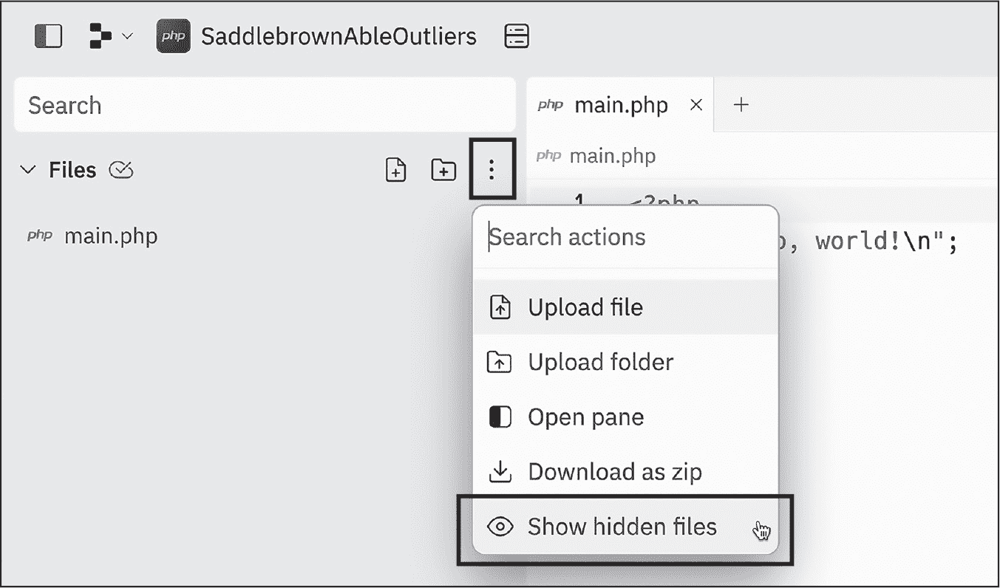
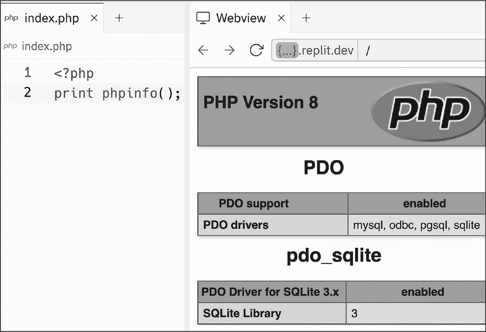

# 第三十四章：C REPLIT 配置


如果你选择使用 Replit 在线编码环境来跟随本书学习，你可以直接使用 Replit 默认的 PHP 设置开始。然而，在你逐步阅读本书的过程中，你可能需要做一些更改，以便让 Replit 支持更复杂的工具，比如 Composer 依赖管理器和数据库管理系统。本附录讨论了如何重新配置你的 Replit 项目。我们将讨论的设置适用于 PHP CLI 和 PHP Web Server 项目。

## 更改 PHP 版本

一个新的 Replit 项目可能默认不会运行最新版本的 PHP。要确认这一点，可以在 Replit 命令行 shell 中输入 php -v。你应该会看到 PHP 版本号的响应。如果这不是最新版本的 PHP，你可以通过编辑项目的隐藏配置文件来更改版本。首先，通过点击左侧文件栏中的三个垂直点小部件并选择 **显示隐藏文件** 来显示隐藏文件（参见 图 C-1）。



图 C-1：显示当前 Replit 项目的隐藏文件

现在，你应该会在文件栏中看到一个新的名为“配置文件”的部分，其中包含两个文件：*.replit* 和 *replit.nix*。选择 *replit.nix* 文件后，你应该会看到其中的内容显示在中间的编辑器栏中。内容应该类似于 列表 C-1。

```
{pkgs}: {
  deps = [
    pkgs.php
  ];
}
```

列表 C-1：replit.nix 配置文件

要更改 PHP 版本，请在 pkgs.php 后添加两个数字，表示你想要的主版本号和次版本号（例如，使用 pkgs.php82 来使用 PHP 版本 8.2.*x*）。然后，如果你稍等片刻后再次在命令行中输入 php -v，你应该会看到列出的新版本号。

这可能需要一些反复尝试，因为 Replit 可能无法使用最新版本的 PHP。例如，在写作时，它无法运行 PHP 8.3，尽管在未来，你应该能够使用 pkgs.php83 来运行 PHP 8.3.*x*，然后使用 pkgs.php84 来运行 PHP 8.4.*x*，依此类推。

> 注意

*与其猜测更改配置设置后重建环境需要多长时间，不如关闭当前的 shell 标签页，然后打开一个新的标签页。在新的标签页中，你将不会看到命令行提示符，直到新环境完全加载完成。*

## 添加 Composer 工具

第二十章介绍了 Composer 命令行工具，用于依赖管理。这个工具在 Replit PHP 项目中默认不可用，但你可以通过编辑 *replit.nix* 配置文件轻松添加它。按照 列表 C-2 中所示的更改进行操作，将 8 后面的 x 替换为适当的 PHP 次版本号，例如 PHP 版本 8.2 对应的 2。

```
{pkgs}: {
 deps = [
 pkgs.php8x
    pkgs.php8xPackages.composer
 ];
}
```

列表 C-2：将 Composer 添加到 replit.nix 配置文件

在 Replit 环境更新后，在命令行中输入 composer。如果一切正常，你应该看到 Composer 工具中所有可用命令的列表。

## 使用 SQLite 数据库系统

第 VI 部分介绍了使用 MySQL 和 SQLite 数据库系统进行数据库编程。如果你正在跟随 Replit 的教程，最直接的选择是使用 SQLite，截至本文写作时，所有 Replit PHP 项目默认都支持 SQLite。你可以通过执行 phpinfo() 函数并检查 PDO 和 pdo_sqlite 条目来验证这一点，如图 C-2 所示。



图 C-2：通过打印 phpinfo() 确认 PDO SQLite 特性

如果将来默认安装的 SQLite 被删除，你可以通过编辑*replit.nix*配置文件，添加这两行额外的代码来将其添加到 Replit 项目中，如列表 C-3 所示。这是我典型的 PHP Web Server 项目的*replit.nix*文件在 SQLite 被添加为默认项之前的样子。

```
{pkgs}: {
 deps = [
 pkgs.php8x
 pkgs.php8xPackages.composer
    pkgs.php8xExtensions.pdo
    pkgs.sqlite
 ];
}
```

列表 C-3：在 replit.nix 文件中启用 SQLite

这些额外的行添加了 PDO 扩展和 SQLite 到项目中。再次提醒，将 x 替换为可用的最新 PHP 小版本号。

## 从 public 目录提供页面

当你在 PHP Web Server 项目中点击 Run 按钮时，Replit 默认会服务项目中的所有文件和文件夹。然而，如第十章所讨论的，出于安全原因，最好为项目创建一个*public*文件夹，并只服务该文件夹的内容。虽然你总是可以通过在终端中输入 `php -S localhost:8000 -t public` 来从*public*文件夹提供服务，但你可能会发现更改 Run 按钮的行为会更方便。为此，打开隐藏的*.replit*配置文件并将第一行更改如下：

```
run = "php -S 0.0.0.0:8000 -t ./public"
```

如果你的*index.php*脚本位于*public*文件夹中，并且你没有进行此更改，点击 Run 按钮将触发 404 Not Found 错误，因为 Replit 会在项目的根目录中查找*index.php*脚本。
