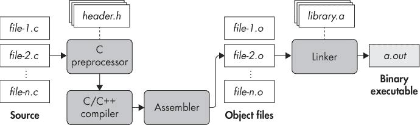
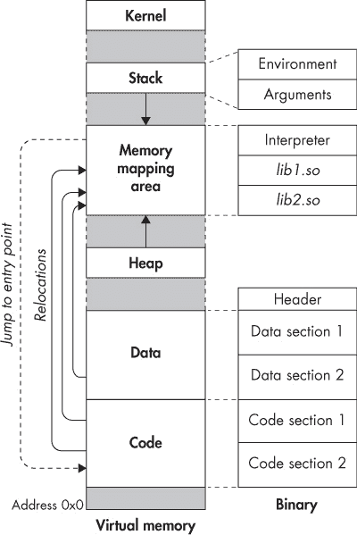

# 第一章：二进制文件的构成

二进制分析就是分析二进制文件。那么，究竟什么是二进制文件呢？本章将介绍二进制格式的基本构成以及二进制文件的生命周期。阅读本章后，你将为接下来的两章 ELF 和 PE 二进制文件的学习做好准备，ELF 和 PE 是 Linux 和 Windows 系统中最广泛使用的二进制格式。

现代计算机使用二进制数字系统进行计算，该系统将所有数字表示为一串一和零。计算机执行的机器代码被称为*二进制代码*。每个程序都由一组二进制代码（机器指令）和数据（变量、常量等）组成。为了跟踪系统中所有不同的程序，你需要一种方法来将每个程序的所有代码和数据存储在一个自包含的文件中。因为这些文件包含可执行的二进制程序，所以它们被称为*二进制可执行文件*，简称*二进制文件*。分析这些二进制文件是本书的目标。

在深入探讨如 ELF 和 PE 这样的二进制格式之前，我们先来看看从源代码生成可执行二进制文件的高层次概述。之后，我将反汇编一个示例二进制文件，以便让你更清楚地了解二进制文件中包含的代码和数据。你将在这里学到的内容，用于在第二章和第三章中探索 ELF 和 PE 二进制文件，并且你将构建自己的二进制加载器，以解析二进制文件并在第四章中进行分析。

### 1.1 C 语言编译过程

二进制文件是通过*编译*生成的，编译是将人类可读的源代码（如 C 或 C++）转换为处理器可以执行的机器代码的过程。^(1) 图 1-1 显示了典型 C 语言编译过程中的各个步骤（C++的编译步骤类似）。编译 C 语言代码涉及四个阶段，其中一个（很不巧的）也叫做*编译*，与完整的编译过程相同。这些阶段是*预处理*、*编译*、*汇编*和*链接*。实际上，现代编译器通常会合并这些阶段中的某些或所有阶段，但为了演示目的，我将分别介绍每个阶段。



*图 1-1：C 语言编译过程*

#### *1.1.1 预处理阶段*

编译过程从你想要编译的一些源文件开始（如图 1-1 中所示，*file-1.c* 到 *file-n.c*）。虽然可以只有一个源文件，但大型程序通常由多个文件组成。这不仅使项目更容易管理，还加速了编译过程，因为如果某个文件发生更改，你只需要重新编译该文件，而不是所有的代码。

C 源文件包含宏（通过`#define`表示）和`#include`指令。你使用`#include`指令来包含源文件所依赖的*头文件*（扩展名为*.h*）。预处理阶段展开源文件中的所有`#define`和`#include`指令，结果就是纯粹的 C 代码，准备好被编译。

让我们通过一个例子来具体说明。这个例子使用了`gcc`编译器，它是许多 Linux 发行版（包括安装在虚拟机上的 Ubuntu 操作系统）的默认编译器。其他编译器，如`clang`或 Visual Studio，的结果也会类似。如在引言中提到的，我将在本书中编译所有代码示例（包括当前示例）为 x86-64 代码，除非另有说明。

假设你想编译一个 C 源文件，如列表 1-1 所示，目的是将无处不在的“Hello, world!”消息打印到屏幕上。

*列表 1-1：* compilation_example.c

```
#include <stdio.h>

#define FORMAT_STRING    "%s"
#define MESSAGE          "Hello, world!\n"

int
main(int argc, char *argv[]) {
  printf(FORMAT_STRING, MESSAGE);
  return 0;
}
```

稍后，你将看到这个文件在编译过程中接下来的变化，但现在我们先来看预处理阶段的输出。默认情况下，`gcc`会自动执行所有编译阶段，所以你需要明确告诉它在预处理之后停止，并显示中间输出。对于`gcc`，这可以通过命令`gcc -E -P`来实现，其中`-E`告诉`gcc`在预处理后停止，`-P`使编译器省略调试信息，以便输出更加简洁。列表 1-2 展示了预处理阶段的输出，已为简洁起见进行编辑。启动虚拟机并跟着操作，查看预处理器的完整输出。

*列表 1-2：C 预处理器输出的“Hello, world!”程序*

```
$ gcc -E -P compilation_example.c

typedef long unsigned int size_t;
typedef unsigned char __u_char;
typedef unsigned short int __u_short;
typedef unsigned int __u_int;
typedef unsigned long int __u_long;

/* ... */

extern int sys_nerr;
extern const char *const sys_errlist[];
extern int fileno (FILE *__stream) __attribute__ ((__nothrow__ , __leaf__)) ;
extern int fileno_unlocked (FILE *__stream) __attribute__ ((__nothrow__ , __leaf__)) ;
extern FILE *popen (const char *__command, const char *__modes) ;
extern int pclose (FILE *__stream);
extern char *ctermid (char *__s) __attribute__ ((__nothrow__ , __leaf__));
extern void flockfile (FILE *__stream) __attribute__ ((__nothrow__ , __leaf__));
extern int ftrylockfile (FILE *__stream) __attribute__ ((__nothrow__ , __leaf__)) ;
extern void funlockfile (FILE *__stream) __attribute__ ((__nothrow__ , __leaf__));

int
main(int argc, char *argv[]) {
  printf(➊"%s", ➋"Hello, world!\n");
  return 0;
}
```

*stdio.h*头文件被完整地包含进来，其中的所有类型定义、全局变量和函数原型都被“复制”到源文件中。由于每个`#include`指令都会发生这种情况，预处理器的输出可能会相当冗长。预处理器还会完全展开你通过`#define`定义的所有宏。在这个例子中，这意味着`printf`的两个参数（`FORMAT_STRING` ➊ 和 `MESSAGE` ➋）都会被评估并替换为它们所代表的常量字符串。

#### *1.1.2 编译阶段*

预处理阶段完成后，源代码就可以进入编译阶段。编译阶段将预处理后的代码翻译成汇编语言。（大多数编译器在此阶段还会进行大量优化，通常可以通过命令行选项如`-O0`至`-O3`在`gcc`中配置为*优化级别*。正如你在第六章中看到的，编译过程中的优化程度对反汇编有着深远的影响。）

为什么编译阶段会生成汇编语言而不是机器代码？这个设计决策在单一语言的上下文中似乎没有意义（以 C 语言为例），但当你考虑到其他所有语言时，它是合理的。一些流行的编译语言包括 C、C++、Objective-C、Common Lisp、Delphi、Go 和 Haskell，仅举几例。为每种语言编写一个直接生成机器代码的编译器将是一个极为繁重且耗时的任务。与其这样，不如生成汇编代码（这已经是一个足够具挑战性的任务），然后有一个专门的汇编器来处理每种语言的汇编到机器代码的最终转换。

所以，编译阶段的输出是汇编语言，形式相对人类可读，符号信息保持完整。如前所述，`gcc` 通常会自动调用所有编译阶段，因此，要查看编译阶段生成的汇编代码，你需要告诉`gcc`在此阶段停止并将汇编文件存储到磁盘。你可以通过使用`-S`标志来实现（*.s* 是汇编文件的常规扩展名）。你还需要传递选项`-masm=intel`给`gcc`，这样它会以 Intel 语法而不是默认的 AT&T 语法生成汇编代码。列表 1-3 展示了编译阶段为示例程序生成的输出。^(2)

*列表 1-3：编译阶段为“Hello, world!”程序生成的汇编代码*

```
  $ gcc -S -masm=intel compilation_example.c
  $ cat compilation_example.s

          .file    "compilation_example.c"
          .intel_syntax noprefix
          .section       .rodata
➊ .LC0:
          .string        "Hello, world!"
          .text
          .globl  main
          .type   main, @function
➋ main:
  .LFB0:
          .cfi_startproc
          push    rbp
          .cfi_def_cfa_offset 16
          .cfi_offset 6, -16
          mov     rbp, rsp
          .cfi_def_cfa_register 6
          sub      rsp, 16
          mov     DWORD PTR [rbp-4], edi
          mov     QWORD PTR [rbp-16], rsi
          mov     edi, ➌OFFSET FLAT:.LC0
          call    puts
          mov     eax, 0
          leave
          .cfi_def_cfa 7, 8
          ret
          .cfi_endproc
.LFE0:
          .size    main, .-main
          .ident   "GCC: (Ubuntu 5.4.0-6ubuntu1~16.04.4) 5.4.0 20160609"
          .section .note.GNU-stack,"",@progbits
```

目前，我不会深入讨论汇编代码。在列表 1-3 中值得注意的是，汇编代码相对容易阅读，因为符号和函数被保留了。例如，常量和变量有符号名称，而不仅仅是地址（即使它只是一个自动生成的名称，如“Hello, world!”字符串的`LC0` ➊），并且有一个明确的标签标记`main`函数 ➋（在这个例子中是唯一的函数）。任何对代码和数据的引用也是符号化的，比如对“Hello, world!”字符串的引用 ➌。在本书后面处理剥离的二进制文件时，你就无法享受到这样的便利了！

#### *1.1.3 汇编阶段*

在汇编阶段，你终于可以生成一些真正的机器代码了！汇编阶段的输入是编译阶段生成的一组汇编语言文件，输出是一组*目标文件*，有时也称为*模块*。目标文件包含的机器指令原则上是可以由处理器执行的。但正如我接下来会解释的，你还需要做一些工作才能得到一个可以运行的二进制可执行文件。通常，每个源文件对应一个汇编文件，每个汇编文件对应一个目标文件。要生成目标文件，你需要给`gcc`传递`-c`标志，如列表 1-4 所示。

*列表 1-4：使用* `*gcc*` 生成目标文件

```
$ gcc -c compilation_example.c
$ file compilation_example.o
compilation_example.o: ELF 64-bit LSB relocatable, x86-64, version 1 (SYSV), not stripped
```

你可以使用`file`工具（这是一个非常方便的工具，我将在第五章中再次提到）来确认生成的文件，*compilation_example.o*，确实是一个目标文件。正如你在清单 1-4 中看到的那样，情况确实如此：该文件显示为`ELF 64-bit LSB 可重定位`文件。

这到底意味着什么呢？`file`输出的第一部分显示该文件符合二进制可执行文件的 ELF 规范（我将在第二章中详细讨论）。更具体地说，它是一个 64 位 ELF 文件（因为你在这个示例中为 x86-64 进行编译），并且它是*LSB*，意味着数字在内存中的顺序是以最不重要的字节为先。但最重要的是，你可以看到该文件是*可重定位的*。

可重定位文件不依赖于被放置在内存中的特定地址；相反，它们可以随意移动而不破坏代码中的任何假设。当你在`file`输出中看到*可重定位*这个术语时，你就知道你正在处理的是目标文件，而不是可执行文件。^(3)

目标文件是相互独立编译的，因此在汇编目标文件时，汇编器无法知道其他目标文件的内存地址。这就是为什么目标文件需要是可重定位的；这样，你可以将它们以任何顺序链接在一起，形成一个完整的二进制可执行文件。如果目标文件不可重定位，这将无法实现。

当你准备好第一次拆解文件时，稍后在本章中你将看到目标文件的内容。

#### *1.1.4 链接阶段*

链接阶段是编译过程的最后阶段。顾名思义，这一阶段将所有目标文件链接成一个单一的二进制可执行文件。在现代系统中，链接阶段有时会加入一个额外的优化过程，称为*链接时优化（LTO）*。^(4)

不出所料，执行链接阶段的程序被称为*链接器*，或*链接编辑器*。它通常与编译器分开，编译器通常实现所有之前的阶段。

如我之前提到的，目标文件是可重定位的，因为它们是独立编译的，防止了编译器假设某个目标会位于特定的基地址。此外，目标文件可能引用其他目标文件或程序外部库中的函数或变量。在链接阶段之前，引用的代码和数据将被放置的地址尚未确定，因此目标文件只包含*重定位符号*，这些符号指定了函数和变量引用应如何最终解析。在链接的上下文中，依赖于重定位符号的引用称为*符号引用*。当目标文件通过绝对地址引用其自身的函数或变量时，该引用也将是符号引用。

链接器的工作是将属于一个程序的所有目标文件合并为一个单一的连贯可执行文件，通常是打算加载到特定内存地址的。现在，所有模块在可执行文件中的安排已知，链接器还可以解决大多数符号引用。对于库的引用，可能完全解决，也可能没有完全解决，这取决于库的类型。

静态库（在 Linux 上通常扩展名为 *.a*，如图 1-1 所示）被合并到二进制可执行文件中，这样对它们的所有引用都可以完全解决。还有动态（共享）库，它们在内存中由所有在系统上运行的程序共享。换句话说，动态库不会被复制到每个使用它的二进制文件中，而是只加载一次到内存中，任何想要使用该库的二进制文件都需要使用这个共享副本。在链接阶段，动态库将驻留的地址尚未确定，因此无法解决对它们的引用。相反，链接器会在最终可执行文件中保留这些库的符号引用，这些引用直到二进制文件实际加载到内存并执行时才会被解决。

大多数编译器，包括 `gcc`，在编译过程结束时会自动调用链接器。因此，要生成一个完整的二进制可执行文件，你可以直接调用 `gcc` 而无需任何特殊选项，如示例 1-5 所示。

*示例 1-5: 使用* `*gcc*` *生成二进制可执行文件*

```
$ gcc compilation_example.c
$ file a.out
a.out: ➊ELF 64-bit LSB executable, x86-64, version 1 (SYSV), ➋dynamically
linked, ➌interpreter /lib64/ld-linux-x86-64.so.2, for GNU/Linux 2.6.32,
BuildID[sha1]=d0e23ea731bce9de65619cadd58b14ecd8c015c7, ➍not stripped
$ ./a.out
Hello, world!
```

默认情况下，可执行文件名为 *a.out*，但是你可以通过向 `gcc` 传递 `-o` 参数并指定输出文件的名称来覆盖该名称。`file` 工具现在告诉你，你正在处理的是一个 `ELF 64-bit LSB 可执行文件` ➊，而不是在汇编阶段末尾看到的可重定位文件。其他重要信息是文件是动态链接的 ➋，这意味着它使用一些未合并到可执行文件中的库，而是与所有在同一系统上运行的程序共享。最后，`file` 输出中的 `interpreter /lib64/ld-linux-x86-64.so.2` ➌ 告诉你，当可执行文件加载到内存并执行时，将使用哪个 *动态链接器* 来解析对动态库的最终依赖关系。当你运行这个二进制文件（使用命令 `./a.out`）时，可以看到它产生了预期的输出（将“Hello, world!”打印到标准输出），这确认你已经生成了一个有效的二进制文件。

那么，这个二进制文件没有被“去除符号” ➍ 是什么意思呢？我接下来会讨论这个问题！

### 1.2 符号与去除符号的二进制文件

高级源代码，如 C 代码，围绕着具有有意义、可读名称的函数和变量展开。当编译一个程序时，编译器会生成*符号*，这些符号用于追踪这些符号名称，并记录每个符号对应的二进制代码和数据。例如，函数符号提供了从符号化的高级函数名称到每个函数的起始地址和大小的映射。这些信息通常由链接器在合并目标文件时使用（例如，解决模块间的函数和变量引用），并且对调试也有帮助。

#### *1.2.1 查看符号信息*

为了让你了解符号信息的样子，列表 1-6 展示了示例二进制文件中的一些符号。

*列表 1-6：*`*a.out*` *二进制文件中的符号，如通过*`*readelf*`*所示*

```
$ ➊readelf --syms a.out

Symbol table '.dynsym' contains 4 entries:
  Num:    Value          Size Type    Bind   Vis      Ndx Name
    0: 0000000000000000     0 NOTYPE  LOCAL  DEFAULT  UND
    1: 0000000000000000     0 FUNC    GLOBAL DEFAULT  UND puts@GLIBC_2.2.5 (2)
    2: 0000000000000000     0 FUNC    GLOBAL DEFAULT  UND __libc_start_main@GLIBC_2.2.5 (2)
    3: 0000000000000000     0 NOTYPE WEAK    DEFAULT  UND __gmon_start__
Symbol table '.symtab' contains 67 entries:
  Num:    Value          Size Type    Bind   Vis      Ndx Name
   ...
   56: 0000000000601030     0 OBJECT  GLOBAL HIDDEN    25 __dso_handle
   57: 00000000004005d0     4 OBJECT  GLOBAL DEFAULT   16 _IO_stdin_used
   58: 0000000000400550   101 FUNC    GLOBAL DEFAULT   14 __libc_csu_init
   59: 0000000000601040     0 NOTYPE  GLOBAL DEFAULT   26 _end
   60: 0000000000400430    42 FUNC    GLOBAL DEFAULT   14 _start
   61: 0000000000601038     0 NOTYPE  GLOBAL DEFAULT   26 __bss_start
   62: 0000000000400526    32 FUNC    GLOBAL DEFAULT   14 ➋main
   63: 0000000000000000     0 NOTYPE  WEAK   DEFAULT  UND _Jv_RegisterClasses
   64: 0000000000601038     0 OBJECT  GLOBAL HIDDEN    25 __TMC_END__
   65: 0000000000000000     0 NOTYPE  WEAK   DEFAULT  UND _ITM_registerTMCloneTable
   66: 00000000004003c8     0 FUNC    GLOBAL DEFAULT   11 _init
```

在列表 1-6 中，我使用`readelf`来显示符号➊。你将会继续使用`readelf`工具，并解释其所有输出内容，具体内容在第五章中讨论。现在，你只需要注意，在许多不熟悉的符号中，存在一个`main`函数的符号➋。你可以看到它指定了`main`在二进制加载到内存时所驻留的地址（`0x400526`）。输出还显示了`main`的代码大小（32 字节），并且表明它是一个函数符号（类型为`FUNC`）。

符号信息可以作为二进制文件的一部分（如你刚刚看到的那样）或以单独的符号文件形式存在，并且有多种不同的格式。链接器只需要基本符号，但为了调试的目的，可能会生成更多的扩展信息。调试符号提供了源代码行和二进制指令之间的完整映射，甚至描述了函数参数、栈帧信息等。对于 ELF 二进制文件，调试符号通常以 DWARF 格式生成^(5)，而 PE 二进制文件通常使用专有的 Microsoft Portable Debugging (PDB) 格式^(6)。DWARF 信息通常嵌入在二进制文件中，而 PDB 以单独的符号文件形式存在。

如你所料，符号信息对于二进制分析非常有用。仅举一个例子，拥有一套明确定义的函数符号可以大大简化反汇编过程，因为你可以将每个函数符号作为反汇编的起点。这使得你不太可能错误地将数据当作代码反汇编（这将导致反汇编输出中出现虚假的指令）。知道二进制文件中哪些部分属于哪个函数，以及函数的名称，也能帮助逆向工程师更容易地对代码进行分块，从而理解代码的功能。即使是基本的链接器符号（与更详细的调试信息相比）在许多二进制分析应用中也已足够有用。

如上所述，你可以使用`readelf`来解析符号，或者像`libbfd`这样的库进行编程解析，后者我将在 Chapter 4 中解释。此外，还有专门用于解析 DWARF 调试符号的库，如`libdwarf`，但在本书中我不会涉及这些。

不幸的是，生产环境中的二进制文件通常不包含大量的调试信息，甚至基本的符号信息也经常会被去除，以减少文件大小并防止逆向工程，特别是在恶意软件或专有软件的情况下。这意味着，作为二进制分析师，你通常需要处理没有任何符号信息的被去除符号的二进制文件的更具挑战性的情况。因此，在本书中，我假设尽可能少的符号信息，并专注于去除符号的二进制文件，除非另有说明。

#### *1.2.2 另一个二进制文件走向黑暗面：去除二进制文件的符号信息*

你可能记得，示例二进制文件还没有被去除符号信息（如 Listing 1-5 中的`file`工具输出所示）。显然，`gcc`的默认行为是不会自动去除新编译二进制文件的符号。如果你在想如何去除带符号的二进制文件，操作其实很简单，只需使用一个名为`strip`的命令，如 Listing 1-7 所示。

*Listing 1-7: 去除可执行文件的符号信息*

```
  $ ➊strip --strip-all a.out
  $ file a.out
  a.out: ELF 64-bit LSB executable, x86-64, version 1 (SYSV), dynamically
  linked, interpreter /lib64/ld-linux-x86-64.so.2, for GNU/Linux 2.6.32,
  BuildID[sha1]=d0e23ea731bce9de65619cadd58b14ecd8c015c7, ➋stripped
  $ readelf --syms a.out

➌ Symbol table '.dynsym' contains 4 entries:
     Num:    Value          Size Type    Bind   Vis     Ndx Name
       0: 0000000000000000     0 NOTYPE  LOCAL  DEFAULT UND
       1: 0000000000000000     0 FUNC    GLOBAL DEFAULT UND puts@GLIBC_2.2.5 (2)
       2: 0000000000000000     0 FUNC    GLOBAL DEFAULT UND __libc_start_main@GLIBC_2.2.5 (2)
       3: 0000000000000000     0 NOTYPE  WEAK   DEFAULT UND __gmon_start__
```

就这样，示例二进制文件已经被去除符号信息 ➊，如`file`输出 ➋所确认。只有少数符号保留在`.dynsym`符号表中 ➌。这些符号用于在二进制文件加载到内存时解析动态依赖（例如动态库的引用），但在反汇编时作用不大。所有其他符号，包括在 Listing 1-6 中看到的`main`函数符号，已经消失。

### 1.3 反汇编二进制文件

现在你已经了解了如何编译一个二进制文件，让我们来看一下在编译阶段汇编生成的目标文件内容。之后，我将反汇编主二进制可执行文件，向你展示它的内容与目标文件的不同之处。通过这种方式，你将更清楚地了解目标文件中包含了什么，以及在链接阶段添加了什么内容。

#### *1.3.1 查看目标文件内部*

目前，我将使用`objdump`工具来展示如何进行反汇编（我将在第六章讨论其他反汇编工具）。这是一个简单且易于使用的反汇编工具，通常包含在大多数 Linux 发行版中，非常适合快速了解二进制文件中包含的代码和数据。清单 1-8 展示了示例目标文件*compilation_example.o*的反汇编版本。

*清单 1-8：反汇编目标文件*

```
$ ➊objdump -sj .rodata compilation_example.o

compilation_example.o:   file format elf64-x86-64

Contents of section .rodata:
 0000 48656c6c 6f2c2077 6f726c64 2100    Hello, world!.

$ ➋objdump -M intel -d compilation_example.o

compilation_example.o:   file format elf64-x86-64

Disassembly of section .text:

0000000000000000 ➌<main>:
   0:  55                     push   rbp
   1:  48 89 e5               mov    rbp,rsp
   4:  48 83 ec 10            sub    rsp,0x10
   8:  89 7d fc               mov    DWORD PTR [rbp-0x4],edi
   b:  48 89 75 f0            mov    QWORD PTR [rbp-0x10],rsi
   f:  bf 00 00 00 00         mov    edi,➍0x0
  14:  e8 00 00 00 00       ➎call   19 <main+0x19>
  19:  b8 00 00 00 00         mov    eax,0x0
  1e:  c9                     leave
  1f:  c3                     ret
```

如果仔细查看清单 1-8，你会看到我调用了两次`objdump`。第一次，在➊处，我让`objdump`显示`.rodata`段的内容。`.rodata`表示“只读数据”，它是二进制文件中存储所有常量的部分，包括“Hello, world!”字符串。我将在第二章中对`.rodata`和其他 ELF 二进制段进行更详细的讨论，该章介绍了 ELF 二进制格式。现在请注意，`.rodata`的内容由字符串的 ASCII 编码组成，显示在输出的左侧。右侧则是这些字节的可读表示。

在➋处对`objdump`的第二次调用反汇编了目标文件中的所有代码，使用了 Intel 语法。正如你所看到的，它仅包含`main`函数的代码➌，因为这是源文件中唯一定义的函数。在大多数情况下，输出与之前编译阶段生成的汇编代码非常接近（略有一些汇编级别的宏）。有趣的是，指向“Hello, world!”字符串的指针（在➍处）被设置为零。随后，应该使用`puts`打印该字符串的调用➎也指向了一个无意义的位置（偏移量 19，在`main`中间）。

为什么应该引用`puts`的调用反而指向了`main`的中间？我之前提到过，目标文件中的数据和代码引用尚未完全解析，因为编译器还不知道文件最终将被加载到哪个基地址。这就是为什么在目标文件中`puts`的调用尚未正确解析的原因。目标文件正在等待链接器填入此引用的正确值。你可以通过请求`readelf`显示目标文件中所有的重定位符号来确认这一点，如清单 1-9 所示。

*清单 1-9：* `*readelf*`显示的重定位符号

```
   $ readelf --relocs compilation_example.o

   Relocation section '.rela.text' at offset 0x210 contains 2 entries:
      Offset             Info         Type            Sym. Value    Sym. Name + Addend
➊ 000000000010      00050000000a R_X86_64_32     0000000000000000    .rodata + 0
➋ 000000000015      000a00000002 R_X86_64_PC32   0000000000000000    puts - 4
   ...
```

➊处的重定位符号告诉链接器，它应该解析字符串的引用，指向它最终在`.rodata`段中的地址。类似地，标记为➋的行告诉链接器如何解析对`puts`的调用。

你可能注意到从`puts`符号中减去了值 4。你现在可以忽略这一点；链接器计算重定位的方式有些复杂，而`readelf`的输出可能令人困惑，所以我这里就不详细讲解重定位的细节，而是集中讲解反汇编二进制文件的整体过程。我将在第二章提供更多关于重定位符号的信息。

在清单 1-9 中的`readelf`输出中，每行最左侧的列（阴影部分）是目标文件中需要填充解析引用的偏移地址。如果你仔细观察，你可能已经注意到，在两种情况下，它等于需要修复的指令的偏移量加 1。例如，在`objdump`的输出中，调用`puts`的代码偏移量是`0x14`，但重定位符号指向的偏移量却是`0x15`。这是因为你只想覆盖指令的*操作数*，而不是*操作码*。恰巧的是，对于需要修复的两条指令，操作码是 1 字节长的，因此，为了指向指令的操作数，重定位符号需要跳过操作码字节。

#### *1.3.2 检查完整的二进制可执行文件*

既然你已经看过目标文件的内部结构，现在是时候反汇编一个完整的二进制文件了。我们先从一个带符号的二进制文件开始，然后再处理去符号化的版本，看看反汇编输出的差异。反汇编目标文件和二进制可执行文件之间有很大的区别，你可以在清单 1-10 中的`objdump`输出中看到这一点。

*清单 1-10：使用* `*objdump*` 反汇编可执行文件*

```
$ objdump -M intel -d a.out

a.out:       file format elf64-x86-64

Disassembly   of section ➊.init:

00000000004003c8 <_init>:
  4003c8:  48 83 ec 08             sub    rsp,0x8
  4003cc:  48 8b 05 25 0c 20 00    mov    rax,QWORD PTR [rip+0x200c25]
  4003d3:  48 85 c0                test   rax,rax
  4003d6:  74 05                   je     4003dd <_init+0x15>
  4003d8:  e8 43 00 00 00          call   400420 <__libc_start_main@plt+0x10>
  4003dd:  48 83 c4 08             add    rsp,0x8
  4003e1:  c3                      ret

Disassembly of section ➋.plt:

00000000004003f0 <puts@plt-0x10>:
  4003f0: ff 35 12 0c 20 00        push   QWORD PTR [rip+0x200c12]
  4003f6: ff 25  14 0c 20 00       jmp    QWORD PTR [rip+0x200c14]
  4003fc: 0f 1f  40 00             nop    DWORD PTR [rax+0x0]

0000000000400400 <puts@plt>:
  400400:  ff 25 12 0c 20 00       jmp    QWORD PTR [rip+0x200c12]
  400406:  68 00 00 00 00          push   0x0
  40040b:  e9 e0 ff ff ff          jmp    4003f0 <_init+0x28>

...

Disassembly of section ➌.text:

0000000000400430 <_start>:

  400430:   31 ed                  xor    ebp,ebp
  400432:   49 89 d1               mov    r9,rdx
  400435:   5e                     pop    rsi
  400436:   48 89 e2               mov    rdx,rsp
  400439:   48 83 e4 f0            and    rsp,0xfffffffffffffff0
  40043d:   50                     push   rax
  40043e:   54                     push   rsp
  40043f:   49 c7 c0 c0 05 40 00   mov    r8,0x4005c0
  400446:   48 c7 c1 50 05 40 00   mov    rcx,0x400550
  40044d:   48 c7 c7 26 05 40 00   mov    rdi,0x400526
  400454:   e8 b7 ff ff ff         call   400410 <__libc_start_main@plt>
  400459:   f4                     hlt
  40045a:   66 0f 1f 44 00 00      nop    WORD PTR [rax+rax*1+0x0]

0000000000400460 <deregister_tm_clones>:
...

0000000000400526 ➍<main>:
  400526:  55                      push   rbp
  400527:  48 89 e5                mov    rbp,rsp
  40052a:  48 83 ec 10             sub    rsp,0x10
  40052e:  89 7d fc                mov    DWORD PTR [rbp-0x4],edi
  400531:  48 89 75 f0             mov    QWORD PTR [rbp-0x10],rsi
  400535:  bf d4 05 40 00          mov    edi,0x4005d4
  40053a:  e8 c1 fe ff ff          call   400400 ➎<puts@plt>
  40053f:  b8 00 00 00 00          mov    eax,0x0
  400544:  c9                      leave
  400545:  c3                      ret
  400546:  66 2e 0f 1f 84 00 00    nop    WORD PTR cs:[rax+rax*1+0x0]
  40054d:  00 00 00

0000000000400550 <__libc_csu_init>:
...

Disassembly of section .fini:

00000000004005c4 <_fini>:
  4005c4:  48 83 ec 08             sub   rsp,0x8
  4005c8:  48 83 c4 08             add   rsp,0x8
  4005cc:  c3                      ret
```

你可以看到，二进制文件的代码比目标文件多得多。它不再仅仅是`main`函数，甚至不仅仅是一个代码段。现在有多个段，名称包括`.init` ➊、`.plt` ➋ 和 `.text` ➌。这些段包含了执行不同功能的代码，如程序初始化或调用共享库的存根。

`.text`段是主要的代码段，包含了`main`函数 ➍。它还包含了其他一些函数，如`_start`，这些函数负责设置命令行参数和为`main`准备运行时环境，并在`main`执行完后进行清理。这些额外的函数是标准函数，在任何由`gcc`生成的 ELF 二进制文件中都存在。

你还可以看到，之前未完成的代码和数据引用现在已经被链接器解析了。例如，调用 `puts` ➎ 现在指向了包含 `puts` 的共享库的正确存根（位于 `.plt` 部分）。(我将在第二章中解释 PLT 存根的工作原理。)

所以，完整的二进制可执行文件包含了比相应的目标文件显著更多的代码（和数据，尽管我没有展示）。但到目前为止，输出的解释并没有更加困难。当二进制文件被去除符号后，情况就不同了，正如清单 1-11 所示，它使用 `objdump` 来反汇编去除了符号的示例二进制文件。

*清单 1-11：使用* `*objdump*` *反汇编一个去除符号的可执行文件*

```
  $ objdump -M intel -d ./a.out.stripped

  ./a.out.stripped:        file format elf64-x86-64

  Disassembly of section ➊.init:

  00000000004003c8 <.init>:
    4003c8:  48 83 ec 08             sub    rsp,0x8
    4003cc:  48 8b 05 25 0c 20 00    mov    rax,QWORD PTR [rip+0x200c25]
    4003d3:  48 85 c0                test   rax,rax
    4003d6:  74 05                   je     4003dd <puts@plt-0x23>
    4003d8:  e8 43 00 00 00          call   400420 <__libc_start_main@plt+0x10>
    4003dd:  48 83 c4 08             add    rsp,0x8
    4003e1:  c3                      ret

  Disassembly of section ➋.plt:
  ...

  Disassembly of section ➌.text:

  0000000000400430   <.text>:
➍  400430: 31 ed                     xor   ebp,ebp
    400432: 49 89    d1               mov   r9,rdx
    400435: 5e                        pop   rsi
    400436: 48 89    e2               mov   rdx,rsp
    400439: 48 83    e4 f0            and   rsp,0xfffffffffffffff0
    40043d: 50                        push  rax
    40043e: 54                        push  rsp
    40043f: 49 c7    c0 c0 05 40 00   mov   r8,0x4005c0
    400446: 48 c7    c1 50 05 40 00   mov   rcx,0x400550
    40044d: 48 c7    c7 26 05 40 00   mov   rdi,0x400526
➎  400454: e8 b7 ff ff ff            call  400410 <__libc_start_main@plt>
    400459: f4                        hlt
    40045a: 66 0f 1f 44 00 00         nop   WORD PTR [rax+rax*1+0x0]
➏  400460: b8 3f 10 60 00            mov   eax,0x60103f
    ...
    400520: 5d                        pop   rbp
    400521: e9   7a ff ff ff          jmp   4004a0 <__libc_start_main@plt+0x90>
➐  400526: 55                        push  rbp
    400527: 48   89   e5              mov   rbp,rsp
    40052a: 48   83   ec   10         sub   rsp,0x10
    40052e: 89   7d   fc              mov   DWORD PTR [rbp-0x4],edi
    400531: 48   89   75   f0         mov   QWORD PTR [rbp-0x10],rsi
    400535: bf   d4   05   40 00      mov   edi,0x4005d4
    40053a: e8   c1   fe   ff ff      call  400400 <puts@plt>
    40053f: b8   00   00   00 00      mov   eax,0x0
    400544: c9                        leave
➑  400545: c3                        ret
    400546: 66   2e 0f 1f 84 00 00    nop   WORD PTR cs:[rax+rax*1+0x0]
    40054d: 00   00 00
    400550: 41   57                   push  r15
    400552: 41   56                   push  r14
    ...

  Disassembly of section .fini:

  00000000004005c4 <.fini>:
    4005c4: 48 83 ec 08               sub   rsp,0x8
    4005c8: 48 83 c4 08               add   rsp,0x8
    4005cc: c3                        ret
```

清单 1-11 的主要结论是，尽管不同的部分仍然可以清晰地区分（标记为 ➊、➋ 和 ➌），但是函数却不再是这样。相反，所有函数都被合并成了一大块代码。`_start` 函数从 ➍ 开始，`deregister_tm_clones` 从 ➏ 开始。`main` 函数从 ➐ 开始，到 ➑ 结束，但在这些情况下，并没有任何特别的标记来表明这些标记位置的指令代表函数的开始。唯一的例外是 `.plt` 部分的函数，它们仍然保留了原来的名称（如你在 ➎ 处调用 `__libc_start_main` 时看到的那样）。除此之外，其他部分的输出你需要自己去理解反汇编结果。

即使在这个简单的例子中，情况已经很混乱了；试想一下，如果要理解一个包含数百个不同函数且所有函数都融合在一起的大型二进制文件该有多困难！这正是为什么在许多二进制分析领域中，准确的自动化函数检测如此重要的原因，我将在第六章中详细讨论这一点。

### 1.4 加载和执行二进制文件

现在你已经了解了编译过程以及二进制文件的内部结构。你也学会了如何使用 `objdump` 静态反汇编二进制文件。如果你一直跟着做，你应该已经有了一个全新的二进制文件保存在你的硬盘上。接下来，你将学习当你加载和执行一个二进制文件时会发生什么，这对我在后续章节中讨论动态分析概念非常有帮助。

尽管具体细节因平台和二进制格式不同而有所变化，但加载和执行二进制文件的过程通常涉及一些基本步骤。图 1-2 展示了在基于 Linux 的平台上如何将加载的 ELF 二进制文件（如刚才编译的文件）在内存中表示出来。从高层次来看，在 Windows 上加载 PE 二进制文件也非常相似。



*图 1-2：在基于 Linux 的系统上加载 ELF 二进制文件*

加载二进制文件是一个复杂的过程，涉及操作系统的大量工作。还需要注意的是，二进制文件在内存中的表示不一定与它在磁盘上的表示一一对应。例如，大量的零初始化数据可能会在磁盘上的二进制文件中被压缩（以节省磁盘空间），但这些零在内存中会被展开。磁盘上的二进制文件某些部分可能在内存中排列的顺序不同，或者根本不加载到内存中。由于这些细节取决于二进制格式，因此我将在第二章（ELF 格式）和第三章（PE 格式）中讨论磁盘上与内存中的二进制表示。现在，我们暂时只做一个关于加载过程的高层概述。

当你决定运行一个二进制文件时，操作系统首先会为程序设置一个新的进程环境，包括一个虚拟地址空间。^(7) 随后，操作系统会将一个*解释器*映射到进程的虚拟内存中。这个解释器是一个用户空间程序，知道如何加载二进制文件并执行必要的重定位操作。在 Linux 中，解释器通常是一个名为 *ld-linux.so* 的共享库。在 Windows 中，解释器功能实现为 *ntdll.dll* 的一部分。加载解释器后，内核将控制权转交给它，解释器开始在用户空间工作。

Linux ELF 二进制文件包含一个名为 `.interp` 的特殊部分，该部分指定了用于加载二进制文件的解释器路径，如你在`readelf`中看到的那样，参见清单 1-12。

*清单 1-12：`*.interp*` 部分的内容*

```
$ readelf -p .interp a.out

String dump of section '.interp':
  [     0] /lib64/ld-linux-x86-64.so.2
```

如前所述，解释器将二进制文件加载到其虚拟地址空间中（即解释器本身被加载的空间）。然后，它解析二进制文件，找出（其中包括）该二进制文件所使用的动态库。解释器将这些动态库映射到虚拟地址空间中（使用`mmap`或等效函数），并在二进制文件的代码段中执行必要的最后时刻重定位操作，以填充动态库引用的正确地址。实际上，解决动态库函数引用的过程通常会被延迟到稍后。换句话说，解释器并不会在加载时立即解析这些引用，而是在首次调用时才会解析它们。这种方法被称为*懒加载绑定*，我将在第二章中详细解释。重定位完成后，解释器查找二进制文件的入口点并将控制权转交给它，开始正常执行二进制文件。

### 1.5 总结

现在你已经熟悉了二进制文件的一般结构和生命周期，是时候深入了解特定的二进制格式了。我们从广泛使用的 ELF 格式开始，它是下一章的主题。

练习

1\. 定位函数

编写一个包含多个函数的 C 程序，并分别将其编译成汇编文件、目标文件和可执行二进制文件。尝试在汇编文件、反汇编的目标文件和可执行文件中定位你写的函数。你能看到 C 代码和汇编代码之间的对应关系吗？最后，剥离可执行文件并再次尝试识别函数。

2\. 节

如你所见，ELF 二进制文件（以及其他类型的二进制文件）被划分为多个节。有些节包含代码，有些节包含数据。你认为为什么会有代码节和数据节的区别？你认为代码节和数据节的加载过程有何不同？当加载一个二进制文件执行时，是否有必要将所有节都复制到内存中？
