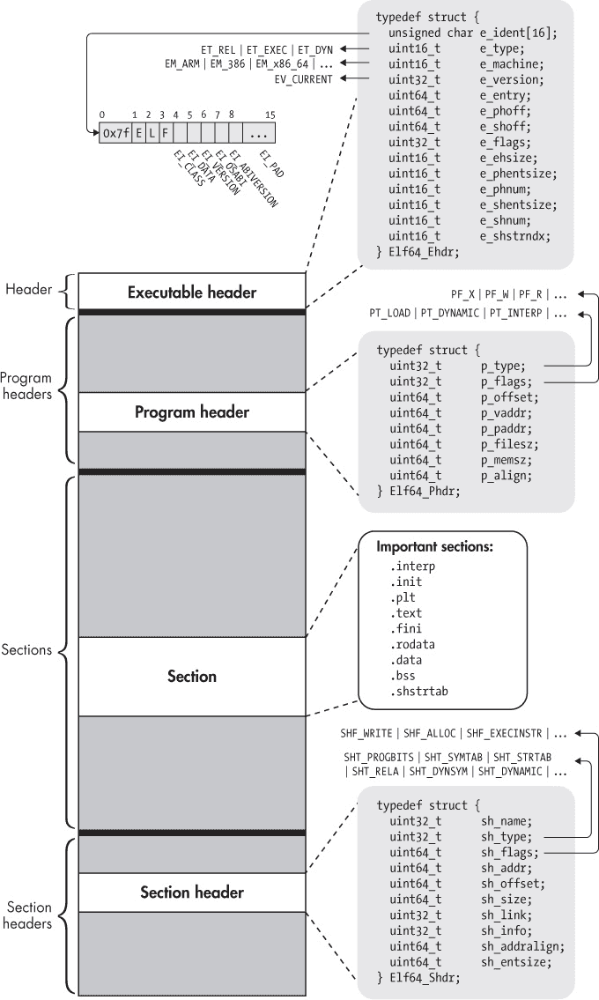
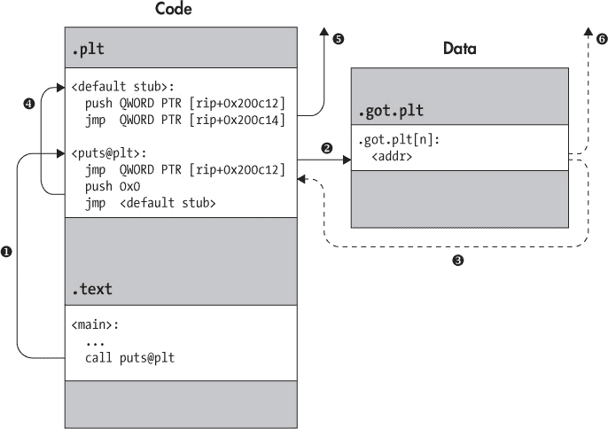

# 第二章：ELF 格式

现在你对二进制文件的外观和工作原理有了一个大致的了解，你可以开始深入研究真正的二进制格式了。在本章中，你将探讨可执行与可链接格式（ELF），这是基于 Linux 的系统上的默认二进制格式，也是你在本书中将要处理的格式。

ELF 用于可执行文件、目标文件、共享库和核心转储。在这里我将专注于 ELF 可执行文件，但相同的概念也适用于其他 ELF 文件类型。由于你在本书中主要处理的是 64 位二进制文件，所以我将围绕 64 位 ELF 文件进行讨论。然而，32 位格式相似，主要的区别在于某些头字段和其他数据结构的大小和顺序。你不应该在将这里讨论的概念推广到 32 位 ELF 二进制文件时遇到任何问题。

图 2-1 展示了一个典型的 64 位 ELF 可执行文件的格式和内容。当你第一次开始详细分析 ELF 二进制文件时，所有涉及的复杂性可能会让人感到不知所措。但从本质上讲，ELF 二进制文件实际上只由四种类型的组件组成：*可执行文件头*、一系列（可选的）*程序头*、若干个*节*，以及一系列（可选的）*节头*，每个节一个头。接下来我会逐一讨论这些组件。



*图 2-1：一眼看出 64 位 ELF 二进制文件*

正如你在 图 2-1 中看到的，标准 ELF 二进制文件首先是可执行文件头，其次是程序头，最后是节和节头。为了使接下来的讨论更容易理解，我将使用稍微不同的顺序，在讨论程序头之前先讨论节和节头。让我们从可执行文件头开始。

### 2.1 可执行文件头

每个 ELF 文件都以一个 *可执行文件头* 开始，它只是一个结构化的字节序列，告诉你它是一个 ELF 文件，是什么类型的 ELF 文件，并且指示在文件中在哪里可以找到其他所有内容。要了解可执行文件头的格式，你可以查找其类型定义（以及其他与 ELF 相关的类型和常量的定义）在 */usr/include/elf.h* 或 ELF 规范中。^(1) 列表 2-1 显示了 64 位 ELF 可执行文件头的类型定义。

*列表 2-1：在* /usr/include/elf.h *中的 ELF64_Ehdr 定义*

```
typedef struct {
  unsigned char e_ident[16];   /* Magic number and other info       */
  uint16_t     e_type;         /* Object file type                  */
  uint16_t     e_machine;      /* Architecture                      */
  uint32_t     e_version;      /* Object file version               */
  uint64_t     e_entry;        /* Entry point virtual address       */
  uint64_t     e_phoff;        /* Program header table file offset  */
  uint64_t     e_shoff;        /* Section header table file offset  */
  uint32_t     e_flags;        /* Processor-specific flags          */
  uint16_t     e_ehsize;       /* ELF header size in bytes          */
  uint16_t     e_phentsize;    /* Program header table entry size   */
  uint16_t     e_phnum;        /* Program header table entry count  */
  uint16_t     e_shentsize;    /* Section header table entry size   */
  uint16_t     e_shnum;        /* Section header table entry count  */
  uint16_t     e_shstrndx;     /* Section header string table index */
} Elf64_Ehdr;
```

可执行文件头在这里表示为一个 C `struct`，叫做 `Elf64_Ehdr`。如果你在 */usr/include/elf.h* 中查找它，你可能会注意到，那里给出的 `struct` 定义包含了像 `Elf64_Half` 和 `Elf64_Word` 这样的类型。这些只是整数类型的 `typedef`，例如 `uint16_t` 和 `uint32_t`。为了简便起见，我已经在 图 2-1 和 列表 2-1 中展开了所有的 `typedef`。

#### *2.1.1 e_ident 数组*

可执行文件头（以及 ELF 文件）从一个 16 字节的数组`e_ident`开始。`e_ident`数组总是以一个 4 字节的“魔术值”开头，用于标识该文件为 ELF 二进制文件。魔术值由十六进制数`0x7f`组成，后跟字母*E*、*L*和*F*的 ASCII 字符代码。将这些字节放在文件的开始位置非常方便，因为它允许诸如`file`工具以及二进制加载器等专用工具迅速识别出这是一个 ELF 文件。

紧跟在魔术值之后的是一些字节，它们提供了关于 ELF 文件类型的更多详细信息。在*elf.h*中，这些字节的索引（`e_ident`数组中的第 4 至第 15 个索引）被符号化地称为`EI_CLASS`、`EI_DATA`、`EI_VERSION`、`EI_OSABI`、`EI_ABIVERSION`和`EI_PAD`，分别对应。图 2-1（Figure 2-1）展示了它们的视觉表示。

`EI_PAD`字段实际上包含多个字节，即`e_ident`中的第 9 至第 15 个索引位置。所有这些字节目前都被指定为填充字节；它们保留供将来可能使用，但目前都设置为零。

`EI_CLASS`字节表示 ELF 规范所称的二进制文件的“类别”。这个词其实是个误称，因为“类别”这个词太过泛化，几乎可以表示任何东西。这个字节实际表示的是二进制文件是针对 32 位架构还是 64 位架构的。在前一种情况下，`EI_CLASS`字节设置为常量`ELFCLASS32`（值为 1），而在后一种情况下，设置为`ELFCLASS64`（值为 2）。

与架构的位宽相关的是架构的*字节序*。换句话说，多字节值（如整数）在内存中的存储顺序是先存储最低有效字节（*小端字节序*）还是先存储最高有效字节（*大端字节序*）？`EI_DATA`字节指示二进制文件的字节序。`ELFDATA2LSB`（值为 1）表示小端字节序，而`ELFDATA2MSB`（值为 2）表示大端字节序。

下一个字节叫做`EI_VERSION`，它表示在创建二进制文件时使用的 ELF 规范的版本。目前，唯一有效的值是`EV_CURRENT`，其定义等于 1。

最后，`EI_OSABI`和`EI_ABIVERSION`字节表示与应用程序二进制接口（ABI）和操作系统（OS）相关的信息，这些信息用于标识二进制文件的编译环境。如果`EI_OSABI`字节被设置为非零值，表示 ELF 文件中使用了某些特定于 ABI 或操作系统的扩展；这可能会改变二进制文件中其他字段的含义，或指示存在非标准部分。零值表示二进制文件是针对 UNIX 系统 V ABI 编译的。`EI_ABIVERSION`字节表示二进制文件目标所使用的`EI_OSABI`字节所指示的 ABI 的具体版本。通常你会看到它被设置为零，因为当使用默认的`EI_OSABI`时，不需要指定版本信息。

你可以通过使用`readelf`查看二进制文件的头部，检查任何 ELF 二进制文件的`e_ident`数组。例如，列表 2-2 显示了第一章中的`compilation_example`二进制文件的输出（在讨论可执行头部的其他字段时，我还会引用此输出）。

*列表 2-2：由* readelf 显示的可执行头部

```
  $ readelf -h a.out
  ELF Header:
➊ Magic:     7f 45 4c 46 02 01 01 00 00 00 00 00 00 00 00 00
➋ Class:                               ELF64
   Data:                                2's complement, little endian
   Version:                             1 (current)
   OS/ABI:                              UNIX - System V
   ABI Version:                         0
➌ Type:                                EXEC (Executable file)
➍ Machine:                             Advanced Micro Devices X86-64
➎ Version:                             0x1
➏ Entry point address:                 0x400430
➐ Start of program headers:            64 (bytes into file)
   Start of section headers:            6632 (bytes into file)
   Flags:                               0x0
➑ Size of this header:                 64 (bytes)
➒ Size of program headers:             56 (bytes)
   Number of program headers:           9
   Size of section headers:             64 (bytes)
   Number of section headers:           31
➓ Section header string table index:   28
```

在列表 2-2 中，`e_ident`数组显示在标记为`Magic`的行上 ➊。它以熟悉的四个魔术字节开始，接着是一个值 2（表示`ELFCLASS64`），然后是 1（`ELFDATA2LSB`），最后是另一个 1（`EV_CURRENT`）。其余字节均为零，因为`EI_OSABI`和`EI_ABIVERSION`字节保持其默认值；填充字节也都设置为零。某些字节中包含的信息在专门的行中被显式地重复，分别标记为`Class`、`Data`、`Version`、`OS/ABI`和`ABI Version` ➋。

#### *2.1.2 e_type, e_machine 和 e_version 字段*

在`e_ident`数组之后，紧跟着一系列多字节整数字段。其中第一个字段是`e_type`，它指定了二进制文件的类型。你最常见的值包括`ET_REL`（表示可重定位目标文件）、`ET_EXEC`（可执行二进制文件）和`ET_DYN`（动态库，也称为共享目标文件）。在示例二进制文件的`readelf`输出中，你可以看到这是一个可执行文件（在列表 2-2 中的`Type: EXEC` ➌）。

接下来是`e_machine`字段，它表示二进制文件的目标架构 ➍。在本书中，通常会将其设置为`EM_X86_64`（正如`readelf`输出中所示），因为你主要将处理 64 位 x86 二进制文件。你可能遇到的其他值包括`EM_386`（32 位 x86）和`EM_ARM`（用于 ARM 二进制文件）。

`e_version`字段的作用与`e_ident`数组中的`EI_VERSION`字节相同；具体来说，它指示创建二进制文件时使用的 ELF 规范版本。由于该字段是 32 位宽的，你可能会认为有许多可能的值，但实际上，唯一的可能值是 1（`EV_CURRENT`），表示该规范的版本为 1 ➎。

#### *2.1.3 e_entry 字段*

`e_entry`字段表示二进制文件的*入口点*；这是执行开始的虚拟地址（详见第 1.4 节）。对于示例二进制文件，执行从地址`0x400430`开始（在列表 2-2 中的`readelf`输出中标记为 ➏）。这是解释器（通常是*ld-linux.so*）在加载二进制文件到虚拟内存后将控制权转交的地方。入口点也是递归反汇编的有用起点，正如我在第六章中将要讨论的。

#### *2.1.4 e_phoff 和 e_shoff 字段*

如 图 2-1 所示，ELF 二进制文件包含程序头表和节头表等数据结构。等我完成对可执行文件头的讨论后，我会重新讲解这些头部类型的含义，不过我现在可以透露的一点是，程序头表和节头表不需要位于二进制文件中的特定偏移量位置。唯一可以假定始终位于 ELF 二进制文件中固定位置的数据结构是可执行文件头，它始终位于文件的开头。

如何知道程序头和节头的位置？为此，可执行文件头包含两个专门的字段，分别为 `e_phoff` 和 `e_shoff`，它们指示程序头表和节头表的文件偏移量。对于示例二进制文件，偏移量分别为 64 字节和 6632 字节（见 清单 2-2 中的 ➐ 两行）。这些偏移量也可以设置为零，表示文件中不包含程序头或节头表。需要特别注意的是，这些字段是 *文件偏移量*，即表示需要读取多少字节才能到达头部。换句话说，与之前讨论的 `e_entry` 字段不同，`e_phoff` 和 `e_shoff` 不是 *虚拟地址*。

#### *2.1.5 e_flags 字段*

`e_flags` 字段为特定架构的标志提供空间，这些标志与二进制文件所编译的架构相关。例如，旨在嵌入式平台上运行的 ARM 二进制文件可以在 `e_flags` 字段中设置 ARM 特定的标志，以指示它们期望嵌入式操作系统提供的接口的额外细节（如文件格式约定、栈组织等）。对于 x86 二进制文件，`e_flags` 通常设置为零，因此不予关注。

#### *2.1.6 e_ehsize 字段*

`e_ehsize` 字段指定可执行文件头的大小（以字节为单位）。对于 64 位 x86 二进制文件，可执行文件头的大小始终为 64 字节，正如你在 `readelf` 输出中看到的那样，而对于 32 位 x86 二进制文件，其大小为 52 字节（见 清单 2-2 中的 ➑）。

#### *2.1.7 e_*entsize 和 e_*num 字段*

如你所知，`e_phoff` 和 `e_shoff` 字段指向程序头和节头表开始的文件偏移量。但是，为了让链接器、加载器（或其他处理 ELF 二进制文件的程序）能够实际遍历这些表格，仍然需要额外的信息。具体来说，它们需要知道每个程序头或节头在表格中的大小，以及每个表格中的头部数量。这些信息由 `e_phentsize` 和 `e_phnum` 字段提供，用于程序头表；由 `e_shentsize` 和 `e_shnum` 字段提供，用于节头表。在 清单 2-2 中的示例二进制文件中，共有 9 个程序头，每个头大小为 56 字节，且有 31 个节头，每个节头大小为 64 字节 ➒。

#### *2.1.8 e_shstrndx 字段*

`e_shstrndx` 字段包含与一个特殊 *字符串表* 节（名为 `.shstrtab`）相关联的头部在节头表中的索引。这个节是一个专用节，包含一个以空字符结尾的 ASCII 字符串表，存储着二进制文件中所有节的名称。ELF 处理工具（如 `readelf`）会使用这个节来正确显示节的名称。我将在本章稍后介绍 `.shstrtab`（以及其他节）。

在 Listing 2-2 中的示例二进制文件中，`.shstrtab` 的节头索引为 28 ➓。你可以使用 `readelf` 查看 `.shstrtab` 节的内容（以十六进制转储的形式），如 Listing 2-3 所示。

*Listing 2-3：* `readelf` 显示的 *`.shstrtab`* 节

```
$ readelf -x .shstrtab a.out

Hex dump of section '.shstrtab':
  0x00000000 002e7379 6d746162 002e7374 72746162 ➊..symtab..strtab
  0x00000010 002e7368 73747274 6162002e 696e7465 ..shstrtab..inte
  0x00000020 7270002e 6e6f7465 2e414249 2d746167 rp..note.ABI-tag
  0x00000030 002e6e6f 74652e67 6e752e62 75696c64 ..note.gnu.build
  0x00000040 2d696400 2e676e75 2e686173 68002e64 -id..gnu.hash..d
  0x00000050 796e7379 6d002e64 796e7374 72002e67 ynsym..dynstr..g
  0x00000060 6e752e76 65727369 6f6e002e 676e752e nu.version..gnu.
  0x00000070 76657273 696f6e5f 72002e72 656c612e version_r..rela.
  0x00000080 64796e00 2e72656c 612e706c 74002e69 dyn..rela.plt..i
  0x00000090 6e697400 2e706c74 2e676f74 002e7465 nit..plt.got..te
  0x000000a0 7874002e 66696e69 002e726f 64617461 xt..fini..rodata
  0x000000b0 002e6568 5f667261 6d655f68 6472002e ..eh_frame_hdr..
  0x000000c0 65685f66 72616d65 002e696e 69745f61 eh_frame..init_a
  0x000000d0 72726179 002e6669 6e695f61 72726179 rray..fini_array
  0x000000e0 002e6a63 72002e64 796e616d 6963002e ..jcr..dynamic..
  0x000000f0 676f742e 706c7400 2e646174 61002e62 got.plt..data..b
  0x00000100 7373002e 636f6d6d 656e7400          ss..comment.
```

你可以在 Listing 2-3 ➊ 的右侧看到字符串表中包含的节名称（如 `.symtab`、`.strtab` 等）。现在你已经熟悉了 ELF 可执行文件头部的格式和内容，接下来让我们继续讨论节头。

### 2.2 节头

ELF 二进制文件中的代码和数据逻辑上被划分为连续的、不重叠的块，称为 *节*。节没有预定的结构；每个节的结构根据其内容不同而不同。实际上，一个节甚至可能没有任何特定的结构；许多时候，节不过是一个没有结构的代码或数据块。每个节都有一个 *节头*，它描述了节的属性并允许你定位属于该节的字节。二进制文件中所有节的节头都包含在 *节头表* 中。

严格来说，节的划分旨在为链接器提供方便的组织方式（当然，节也可以被其他工具解析，比如静态二进制分析工具）。这意味着，并非每个节在设置进程和虚拟内存以执行二进制文件时都是必须的。有些节包含的数据根本不需要执行，例如符号信息或重定位信息。

由于节的目的仅仅是为链接器提供视图，因此节头表是 ELF 格式的一个可选部分。那些不需要链接的 ELF 文件不必包含节头表。如果没有节头表，执行文件头中的 `e_shoff` 字段将被设置为零。

为了加载和执行二进制文件到一个进程中，二进制文件的代码和数据需要以不同的方式组织。因此，ELF 可执行文件指定了另一种逻辑组织方式，称为*段*，它们在执行时使用（与在链接时使用的节不同）。稍后我会在本章中讨论程序头时覆盖段的内容。现在，让我们聚焦于节，但请记住，我在这里讨论的逻辑组织仅在链接时（或当静态分析工具使用时）存在，而不是在运行时。

让我们从讨论节头的格式开始。之后，我们将查看节的内容。清单 2-4 展示了按*/usr/include/elf.h*中规定的格式定义的 ELF 节头。

*清单 2-4：在*/usr/include/elf.h*中定义的 Elf64_Shdr*

```
typedef struct {
  uint32_t  sh_name;       /* Section name (string tbl index)   */
  uint32_t  sh_type;       /* Section type                      */
  uint64_t  sh_flags;      /* Section flags                     */
  uint64_t  sh_addr;       /* Section virtual addr at execution */
  uint64_t  sh_offset;     /* Section file offset               */
  uint64_t  sh_size;       /* Section size in bytes             */
  uint32_t  sh_link;       /* Link to another section           */
  uint32_t  sh_info;       /* Additional section information    */
  uint64_t  sh_addralign;  /* Section alignment                 */
  uint64_t  sh_entsize;    /* Entry size if section holds table */
} Elf64_Shdr;
```

#### *2.2.1 sh_name 字段*

如清单 2-4 所示，节头的第一个字段被称为`sh_name`。如果设置了，它包含指向*字符串表*的索引。如果索引为零，则表示该节没有名称。

在第 2.1 节中，我讨论了一个名为`.shstrtab`的特殊节，它包含一个以`NULL`终止的字符串数组，每个节名称都有一个字符串。描述字符串表的节头索引存储在可执行文件头的`e_shstrndx`字段中。这使得像`readelf`这样的工具能够轻松找到`.shstrtab`节，并通过每个节头的`sh_name`字段（包括`.shstrtab`的头）索引它，以找到描述该节名称的字符串。这使得人工分析人员能够轻松识别每个节的用途。^(2)

#### *2.2.2 sh_type 字段*

每个节都有一个类型，通过一个名为`sh_type`的整数字段来表示，该字段告诉链接器有关节内容结构的信息。图 2-1 展示了我们目的下最重要的节类型。我将逐一讨论每种重要的节类型。

类型为`SHT_PROGBITS`的节包含程序数据，例如机器指令或常量。这些节没有特定的结构供链接器解析。

还有一些特殊的节类型用于符号表（`SHT_SYMTAB`表示静态符号表，`SHT_DYNSYM`表示动态链接器使用的符号表）和字符串表（`SHT_STRTAB`）。符号表以一种定义明确的格式（如果你有兴趣的话，可以查看*elf.h*中的`struct Elf64_Sym`）存储符号，其中描述了特定文件偏移量或地址的符号名称和类型等信息。如果二进制文件被剥离，静态符号表可能不存在。字符串表，如前所述，仅包含一个以`NULL`终止的字符串数组，字符串表的第一个字节按照约定设置为`NULL`。

类型为 `SHT_REL` 或 `SHT_RELA` 的节对于链接器特别重要，因为它们包含了按照明确格式（在 *elf.h* 中的 `struct Elf64_Rel` 和 `struct Elf64_Rela`）定义的重定位条目，链接器可以解析这些条目来执行其他节中的必要重定位。每个重定位条目都告诉链接器在二进制文件中某个位置需要进行重定位，以及应该解析到哪个符号。实际的重定位过程相当复杂，我现在不打算深入讨论。重要的结论是，`SHT_REL` 和 `SHT_RELA` 节用于静态链接。

类型为 `SHT_DYNAMIC` 的节包含了动态链接所需的信息。该信息的格式使用 `struct Elf64_Dyn`，如 *elf.h* 中所指定。

#### *2.2.3 sh_flags 字段*

节标志（在 `sh_flags` 字段中指定）描述了节的附加信息。这里最重要的标志是 `SHF_WRITE`、`SHF_ALLOC` 和 `SHF_EXECINSTR`。

`SHF_WRITE` 表示该节在运行时是可写的。这使得我们可以很容易地区分包含静态数据（如常量）和包含变量的节。`SHF_ALLOC` 标志表示该节的内容在执行二进制文件时会被加载到虚拟内存中（尽管实际加载是通过二进制文件的段视图进行的，而不是节视图）。最后，`SHF_EXECINSTR` 告诉你该节包含可执行指令，这在反汇编二进制文件时非常有用。

#### *2.2.4 sh_addr、sh_offset 和 sh_size 字段*

`sh_addr`、`sh_offset` 和 `sh_size` 字段分别描述了节的虚拟地址、文件偏移量（从文件开始算起的字节数）和节的大小（以字节为单位）。乍一看，像 `sh_addr` 这样描述节虚拟地址的字段可能显得不合适；毕竟，我曾说过节只用于链接，而不是用于创建和执行进程。尽管这仍然成立，但链接器有时需要知道特定的代码和数据在运行时会位于哪些地址，以便进行重定位。`sh_addr` 字段提供了这些信息。那些在进程设置时不打算加载到虚拟内存中的节，其 `sh_addr` 值为零。

#### *2.2.5 sh_link 字段*

有时候，节与节之间存在一些链接器需要知道的关系。例如，`SHT_SYMTAB`、`SHT_DYNSYM` 或 `SHT_DYNAMIC` 都有一个关联的字符串表节，里面包含了相关符号的符号名称。类似地，重定位节（类型为 `SHT_REL` 或 `SHT_RELA`）与一个符号表相关联，该符号表描述了重定位中涉及的符号。`sh_link` 字段通过表示相关节在节头表中的索引，明确了这些关系。

#### *2.2.6 sh_info 字段*

`sh_info` 字段包含有关段的附加信息。附加信息的含义取决于段的类型。例如，对于重定位段，`sh_info` 表示将要应用重定位的段的索引。

#### *2.2.7 sh_addralign 字段*

某些段可能需要以特定方式在内存中对齐，以提高内存访问效率。例如，一个段可能需要加载到某个地址，这个地址是 8 字节或 16 字节的倍数。这些对齐要求在 `sh_addralign` 字段中指定。例如，如果该字段设置为 16，则表示该段的基地址（由链接器选择）必须是 16 的倍数。值 0 和 1 被保留，表示没有特殊的对齐需求。

#### *2.2.8 sh_entsize 字段*

一些段，例如符号表或重定位表，包含一组定义明确的数据结构（例如 `Elf64_Sym` 或 `Elf64_Rela`）。对于这些段，`sh_entsize` 字段表示表中每个条目的字节大小。当该字段未使用时，它的值为零。

### 2.3 段

现在你已经熟悉了段头的结构，接下来让我们看看 ELF 二进制文件中一些具体的段。你在 GNU/Linux 系统上找到的典型 ELF 文件是按一系列标准（或事实上的标准）段组织的。列表 2-5 显示了使用 `readelf` 命令查看示例二进制文件的输出，其中列出了段。

*列表 2-5：示例二进制文件中的段列表*

```
$ readelf --sections --wide a.out
There are 31 section headers, starting at offset 0x19e8:

Section Headers:
  [Nr] Name             Type             Address          Off    Size   ES  Flg Lk Inf Al
  [ 0]                 ➊NULL             0000000000000000 000000 000000 00      0  0  0
  [ 1] .interp          PROGBITS         0000000000400238 000238 00001c 00     A  0  0  1
  [ 2] .note.ABI-tag    NOTE             0000000000400254 000254 000020 00     A  0  0  4
 [ 3] .note.gnu.build-id NOTE           0000000000400274 000274 000024 00     A  0  0  4
  [ 4] .gnu.hash        GNU_HASH        0000000000400298 000298 00001c 00     A  5  0  8
  [ 5] .dynsym          DYNSYM          00000000004002b8 0002b8 000060 18     A  6  1  8
  [ 6] .dynstr          STRTAB          0000000000400318 000318 00003d 00     A  0  0  1
  [ 7] .gnu.version     VERSYM          0000000000400356 000356 000008 02     A  5  0  2
  [ 8] .gnu.version_r   VERNEED         0000000000400360 000360 000020 00     A  6  1  8
  [ 9] .rela.dyn        RELA            0000000000400380 000380 000018 18     A  5  0  8
  [10] .rela.plt        RELA            0000000000400398 000398 000030 18    AI  5 24  8
  [11] .init            PROGBITS        00000000004003c8 0003c8 00001a 00  ➋AX  0  0  4
  [12] .plt             PROGBITS        00000000004003f0 0003f0 000030 10    AX  0  0 16
  [13] .plt.got         PROGBITS        0000000000400420 000420 000008 00    AX  0  0  8
  [14] .text           ➌PROGBITS        0000000000400430 000430 000192 00  ➍AX  0  0 16
  [15] .fini            PROGBITS        00000000004005c4 0005c4 000009 00    AX  0  0  4
  [16] .rodata          PROGBITS        00000000004005d0 0005d0 000011 00     A  0  0  4
  [17] .eh_frame_hdr    PROGBITS        00000000004005e4 0005e4 000034 00     A  0  0  4
  [18] .eh_frame        PROGBITS        0000000000400618 000618 0000f4 00     A  0  0  8
  [19] .init_array      INIT_ARRAY      0000000000600e10 000e10 000008 00    WA  0  0  8
  [20] .fini_array      FINI_ARRAY      0000000000600e18 000e18 000008 00    WA  0  0  8
  [21] .jcr             PROGBITS        0000000000600e20 000e20 000008 00    WA  0  0  8
  [22] .dynamic         DYNAMIC         0000000000600e28 000e28 0001d0 10    WA  6  0  8
  [23] .got             PROGBITS        0000000000600ff8 000ff8 000008 08    WA  0  0  8
  [24] .got.plt         PROGBITS        0000000000601000 001000 000028 08    WA  0  0  8
  [25] .data            PROGBITS        0000000000601028 001028 000010 00    WA  0  0  8
  [26] .bss             NOBITS          0000000000601038 001038 000008 00    WA  0  0  1
  [27] .comment         PROGBITS        0000000000000000 001038 000034 01    MS  0  0  1
  [28] .shstrtab        STRTAB          0000000000000000 0018da 00010c 00        0  0  1
  [29] .symtab          SYMTAB          0000000000000000 001070 000648 18       30 47  8
  [30] .strtab          STRTAB          0000000000000000 0016b8 000222 00        0  0  1
Key to Flags:
  W (write), A (alloc), X (execute), M (merge), S (strings), l (large)
  I (info), L (link order), G (group), T (TLS), E (exclude), x (unknown)
  O (extra OS processing required) o (OS specific), p (processor specific)
```

对于每个段，`readelf` 显示相关的基本信息，包括索引（在段头表中）、段的名称和类型。此外，你还可以看到段的虚拟地址、文件偏移量和字节大小。对于包含表的段（例如符号表和重定位表），还有一列显示每个表条目的大小。最后，`readelf` 还显示每个段的相关标志，以及链接的段的索引（如果有的话）、附加信息（特定于段类型）和对齐要求。

如你所见，输出内容与段头的结构非常接近。每个 ELF 文件的段头表中的第一个条目是由 ELF 标准定义的 `NULL` 条目。该条目的类型为 `SHT_NULL` ➊，且段头的所有字段都被清零。这意味着该段没有名称且没有关联的字节（换句话说，它是一个没有实际段的段头）。接下来，让我们深入了解你在二进制分析过程中可能会遇到的其他一些最有趣的段的内容和目的。^(3)

#### *2.3.1 .init 和 .fini 段*

`.init` 段（在 清单 2-5 中的索引 11）包含执行初始化任务的可执行代码，且需要在二进制文件中的其他代码执行之前运行。你可以通过 `readelf` 中的 `SHF_EXECINSTR` 标志（在 `Flg` 列中以 `X` 表示） ➋ 知道它包含可执行代码。系统在将控制权转交给二进制文件的主入口点之前，会先执行 `.init` 段中的代码。因此，如果你熟悉面向对象编程，可以将此段视为构造函数。`.fini` 段（索引 15）与 `.init` 段类似，只是它在主程序完成后执行，基本上充当了一种析构函数的角色。

#### *2.3.2 .text 段*

`.text` 段（索引 14）是程序主代码所在的地方，因此它将经常成为你进行二进制分析或逆向工程时的主要关注点。如你在 清单 2-5 中的 `readelf` 输出所见，`.text` 段的类型是 `SHT_PROGBITS` ➌，因为它包含用户定义的代码。还要注意该段的标志，表示该段是可执行的但不可写的 ➍。一般来说，可执行的段几乎不应是可写的（反之亦然），因为这将使得攻击者通过利用漏洞直接覆盖代码来修改程序行为变得容易。

除了从程序源代码编译而来的特定应用程序代码之外，使用 `gcc` 编译的典型二进制文件的 `.text` 段包含了许多执行初始化和清理任务的标准函数，如 `_start`、`register_tm_clones` 和 `frame_dummy`。目前，`_start` 函数是这些标准函数中对你最为重要的一个。清单 2-6 展示了原因（不必担心理解清单中的所有汇编代码；接下来我会指出重要部分）。

*清单 2-6：标准* _start *函数的反汇编*

```
  $ objdump -M intel -d a.out
  ...

  Disassembly of section .text:

➊ 0000000000400430 <_start>:
    400430: 31 ed                   xor    ebp,ebp
    400432: 49 89 d1                mov    r9,rdx
    400435: 5e                      pop    rsi
    400436: 48 89 e2                       mov  rdx,rsp
    400439: 48 83 e4 f0                    and  rsp,0xfffffffffffffff0
    40043d: 50                             push rax
    40043e: 54                             push rsp
    40043f: 49 c7 c0 c0 05 40 00    mov    r8,0x4005c0
    400446: 48 c7 c1 50 05 40 00    mov    rcx,0x400550
    40044d: 48 c7 c7 26 05 40 00    mov  ➋rdi,0x400526
    400454: e8 b7 ff ff ff          call   400410 ➌<__libc_start_main@plt>
    400459: f4                      hlt
    40045a: 66 0f 1f 44 00 00       nop    WORD PTR [rax+rax*1+0x0]
  ...

➍ 0000000000400526 <main>:
    400526: 55                             push   rbp
    400527: 48 89 e5                       mov    rbp,rsp
    40052a: 48 83 ec 10                    sub    rsp,0x10
    40052e: 89 7d fc                       mov    DWORD PTR [rbp-0x4],edi
    400531: 48 89 75 f0                    mov    QWORD PTR [rbp-0x10],rsi
    400535: bf d4 05 40 00                 mov    edi,0x4005d4
    40053a: e8 c1 fe ff ff                 call   400400 <puts@plt>
    40053f: b8 00 00 00 00                 mov    eax,0x0
    400544: c9                             leave
    400545: c3                             ret
    400546: 66 2e 0f 1f 84 00 00           nop    WORD PTR cs:[rax+rax*1+0x0]
    40054d: 00 00 00
...
```

当你编写 C 程序时，总会有一个 `main` 函数，这是程序开始的地方。但如果你检查二进制文件的入口点，你会发现它*并不是*指向地址 `0x400526` 处的 `main` ➍。相反，它指向地址 `0x400430`，即 `_start` 的起始位置 ➊。

那么，程序执行是如何最终到达 `main` 的呢？仔细观察，你会发现 `_start` 在地址 `0x40044d` 处有一条指令，将 `main` 的地址移动到 `rdi` 寄存器 ➋，这是 x64 平台上用于传递函数调用参数的寄存器之一。接着，`_start` 调用一个名为 `__libc_start_main` 的函数 ➌。这个函数位于 `.plt` 段，意味着它是共享库的一部分（我将在 2.3.4 节中详细介绍这个内容）。

正如其名称所示，`__libc_start_main` 最终会调用 `main` 的地址，以开始执行用户定义的代码。

#### *2.3.3 .bss、.data 和 .rodata 段*

由于代码节通常是不可写的，变量通常被保存在一个或多个专用的可写节中。常量数据通常也会保存在单独的节中，以便保持二进制文件的整洁，尽管编译器*确实*有时会将常量数据输出到代码节中。（现代版本的`gcc`和`clang`通常不会混合代码和数据，但 Visual Studio 有时会这样做。）正如你在第六章中将看到的，这会使得反汇编变得更加困难，因为并不总是能清楚区分哪些字节是指令，哪些是数据。

`.rodata`节（即“只读数据”）用于存储常量值。由于它存储的是常量值，`.rodata`是不可写的。已初始化变量的默认值存储在`.data`节中，`.data`节*是*可写的，因为变量的值可能会在运行时改变。最后，`.bss`节为未初始化变量保留空间。该名称历史上代表“由符号启动的块”，指的是为（符号）变量保留内存块。

与`.rodata`和`.data`（类型为`SHT_PROGBITS`）不同，`.bss`节的类型是`SHT_NOBITS`。这是因为`.bss`在二进制文件中不占用任何字节，它仅仅是一个指令，用于在为二进制文件设置执行环境时为未初始化的变量分配合适大小的内存块。通常，位于`.bss`中的变量会被初始化为零，并且该节被标记为可写。

#### *2.3.4 延迟绑定与 .plt、.got 和 .got.plt 节*

在第一章中，我们讨论了当二进制文件被加载到进程中执行时，动态链接器会进行最后的重定位。例如，它会解析对位于共享库中的函数的引用，而共享库的加载地址在编译时尚未知道。我还简要提到，实际上，许多重定位通常不会在二进制文件加载时立即执行，而是会推迟到首次引用未解析位置时才执行。这被称为*延迟绑定*。

##### **延迟绑定与 PLT**

延迟绑定确保动态链接器不会在不必要的时候浪费时间进行重定位，它只会在运行时真正需要时才执行这些重定位。在 Linux 中，延迟绑定是动态链接器的默认行为。你可以通过导出名为`LD_BIND_NOW`的环境变量强制链接器立即执行所有重定位^(4)，但通常只有在应用程序要求实时性能保证时才会这样做。

Linux ELF 二进制文件中的懒绑定是通过两个特殊段来实现的，分别是*过程连接表*（` .plt`）和*全局偏移表*（` .got`）。尽管以下讨论主要集中在懒绑定上，GOT 实际上用于的不仅仅是懒绑定。ELF 二进制文件通常包含一个单独的 GOT 段，称为`.got.plt`，用于与`.plt`一起在懒绑定过程中使用。`.got.plt`段与常规的`.got`段类似，你可以认为它们是一样的（实际上，它们在历史上是一样的）。^(5) 图 2-2 展示了懒绑定过程及 PLT 和 GOT 的作用。



*图 2-2：通过 PLT 调用共享库函数*

正如图示和列表 2-5 中`readelf`的输出所示，`.plt`是一个包含可执行代码的代码段，就像`.text`一样，而`.got.plt`是一个数据段。^(6) PLT 完全由格式明确的存根构成，专门用于将来自`.text`段的调用指令导向适当的库位置。为了探讨 PLT 的格式，我们来看一下示例二进制文件中`.plt`段的反汇编，如列表 2-7 所示。（为简洁起见，指令操作码已省略。）

*列表 2-7：* .plt *节的反汇编*

```
  $ objdump -M intel --section .plt -d a.out

  a.out:        file format elf64-x86-64

  Disassembly of section .plt:

➊ 00000000004003f0 <puts@plt-0x10>:
   4003f0: push QWORD PTR [rip+0x200c12] # 601008 <_GLOBAL_OFFSET_TABLE_+0x8>
   4003f6: jmp  QWORD PTR [rip+0x200c14] # 601010 <_GLOBAL_OFFSET_TABLE_+0x10>
 4003fc: nop  DWORD PTR [rax+0x0]

➋ 0000000000400400 <puts@plt>:
   400400: jmp  QWORD PTR [rip+0x200c12] # 601018 <_GLOBAL_OFFSET_TABLE_+0x18>
   400406: push ➌0x0
   40040b: jmp  4003f0 <_init+0x28>

➍ 0000000000400410 <__libc_start_main@plt>:
   400410: jmp  QWORD PTR [rip+0x200c0a] # 601020 <_GLOBAL_OFFSET_TABLE_+0x20>
   400416: push ➎0x1
   40041b: jmp  4003f0 <_init+0x28>
```

PLT 的格式如下：首先是一个默认的存根 ➊，稍后我会讲解。接下来是一系列函数存根 ➋➍，每个库函数一个，所有存根遵循相同的模式。还要注意，对于每个连续的函数存根，压入栈中的值会递增 ➌➎。这个值是一个标识符，稍后我会解释它的作用。现在让我们探讨一下如列表 2-7 所示的 PLT 存根是如何让你调用共享库函数的，如图 2-2 所示，并且这如何有助于懒绑定过程。

### 使用 PLT 动态解析库函数

假设你想要调用`puts`函数，它是著名的`libc`库的一部分。你不能直接调用它（由于上述原因，这是不可能的），但是你可以调用对应的 PLT 存根`puts@plt`（如图 2-2 中的步骤 ➊）。

PLT 存根以一条间接跳转指令开始，该指令跳转到存储在`.got.plt`段中的地址（如图 2-2 中的步骤 ➋）。最初，在懒绑定发生之前，这个地址只是函数存根中下一条指令的地址，这是一条`push`指令。因此，间接跳转只是将控制权转移到它后面的指令（如图 2-2 中的步骤 ➌）！这是一种相当间接的方式来跳转到下一条指令，但这样做是有充分理由的，接下来你会看到为什么。

`push`指令将一个整数（在此情况下为`0x0`）压入栈中。如前所述，这个整数作为对应 PLT 存根的标识符。接下来，下一条指令跳转到所有 PLT 函数存根共享的公共默认存根（图 2-2 中的步骤➍）。默认存根推送另一个标识符（来自 GOT），标识可执行文件本身，然后跳转（再次通过 GOT 间接跳转）到动态链接器（图 2-2 中的步骤➎）。

利用 PLT 存根推送的标识符，动态链接器可以确定它应该解析`puts`的地址，并且应该代表加载到进程中的主可执行文件进行此操作。最后这一点很重要，因为同一个进程中可能还加载了多个库，每个库都有自己的 PLT 和 GOT。动态链接器接着查找`puts`函数所在的地址，并将该函数的地址插入到与`puts@plt`相关联的 GOT 条目中。于是，GOT 条目不再像最初那样指向 PLT 存根，而是现在指向`puts`的实际地址。此时，延迟绑定过程完成。

最终，动态链接器通过将控制转移到`puts`来满足调用`puts`的最初目的。对于任何后续调用`puts@plt`，GOT 条目已经包含了`puts`的适当（修补过的）地址，使得 PLT 存根开始时的跳转直接到`puts`，而无需涉及动态链接器（图中的步骤➏）。

### 为什么使用 GOT？

在这一点上，你可能会想，为什么需要 GOT 呢？例如，直接将解析后的库地址直接修补到 PLT 存根的代码中不是更简单吗？事情不能那样做的主要原因归结为安全性。如果二进制文件的某个地方存在漏洞（对于任何非平凡的二进制文件，肯定会有），攻击者就可以轻松修改二进制文件的代码，如果像`.text`和`.plt`这样的可执行部分是可写的。但由于 GOT 是数据段，并且它是允许被写入的，因此通过 GOT 进行额外的间接访问是合理的。换句话说，这一额外的间接层使得你能够避免创建可写的代码段。虽然攻击者仍可能成功修改 GOT 中的地址，但这种攻击模式远不如能够注入任意代码那样强大。

另一个原因与共享库中的代码共享性有关。如前所述，现代操作系统通过在所有使用共享库的进程之间共享库的代码来节省（物理）内存。这样，操作系统只需加载每个库的单一副本，而不是每个使用该库的进程都加载一份独立副本。然而，尽管每个库只有一个*物理*副本，但同一库可能会为每个进程映射到完全不同的*虚拟*地址。这意味着，不能将为库解析的地址直接打补丁到代码中，因为该地址只在某一个进程的上下文中有效，其他进程则无法使用。相反，将它们打补丁到 GOT 中是可行的，因为每个进程都有自己的私有 GOT 副本。

正如你可能已经猜到的，代码对可重定位数据符号（如从共享库导出的变量和常量）的引用也需要通过 GOT 进行重定向，以避免将数据地址直接打补丁到代码中。不同之处在于，数据引用直接通过 GOT，而没有经过 PLT 的中间步骤。这也澄清了 `.got` 和 `.got.plt` 段之间的区别：`.got` 用于数据项的引用，而 `.got.plt` 专门用于存储通过 PLT 访问的库函数的解析地址。

#### *2.3.5 .rel.* 和 .rela.* 段*

如你在示例二进制文件的 `readelf` 转储中看到的节头所示，有几个段的名称为 `rela.*`。这些段的类型是 `SHT_RELA`，意味着它们包含了链接器用于执行重定位的信息。本质上，所有 `SHT_RELA` 类型的段都是一个重定位项表，每个项都详细描述了一个需要应用重定位的特定地址，以及如何解析该地址需要插入的特定值。清单 2-8 显示了示例二进制文件中重定位段的内容。如你所见，只有动态重定位（由动态链接器执行）仍然存在，因为所有在目标文件中存在的静态重定位已经在静态链接时被解决了。在任何实际的二进制文件中（与这个简单的示例不同），当然会有更多的动态重定位。

*清单 2-8：示例二进制文件中的重定位段*

```
   $ readelf --relocs a.out

   Relocation section '.rela.dyn' at offset 0x380 contains 1 entries:
    Offset       Info           Type           Sym. Value    Sym. Name + Addend
➊ 0000600ff8 000300000006 R_X86_64_GLOB_DAT 0000000000000000 __gmon_start__ + 0

   Relocation section '.rela.plt' at offset 0x398 contains 2 entries:
    Offset       Info           Type           Sym. Value    Sym. Name + Addend
➋ 0000601018 000100000007 R_X86_64_JUMP_SLO 0000000000000000 puts@GLIBC_2.2.5 + 0
➌ 0000601020 000200000007 R_X86_64_JUMP_SLO 0000000000000000 __libc_start_main@GLIBC_2.2.5 + 0
```

这里有两种类型的重定位，分别叫做`R_X86_64_GLOB_DAT`和`R_X86_64_JUMP_SLO`。虽然在实际使用中你可能会遇到更多的类型，但这些是最常见和最重要的几种。所有重定位类型的共同点是它们指定了一个偏移量，用于应用重定位。如何计算在该偏移量插入的值在不同的重定位类型中有所不同，有时甚至相当复杂。你可以在 ELF 规范中找到所有这些细节，然而对于普通的二进制分析任务，你不需要了解它们。

在 Listing 2-8 中显示的第一个重定位，类型为`R_X86_64_GLOB_DAT`，其偏移量位于`.got`节中➊，你可以通过将偏移量与`readelf`输出中显示的`.got`基地址进行比较来判断。通常，这种类型的重定位用于计算数据符号的地址，并将其插入`.got`中的正确偏移位置。

`R_X86_64_JUMP_SLO`条目被称为*跳转槽*➋➌；它们的偏移量位于`.got.plt`节中，表示可以插入库函数地址的槽。如果你回顾一下在 Listing 2-7 中示例二进制的 PLT 转储，你会发现每个跳转槽都被 PLT 存根用于获取其间接跳转目标。跳转槽的地址（通过相对偏移计算得到`rip`寄存器的地址）出现在 Listing 2-7 输出的右侧，紧跟在#符号之后。

#### *2.3.6 .dynamic 节*

`.dynamic`节充当操作系统和动态链接器在加载和设置 ELF 二进制文件执行时的“路线图”。如果你忘记了加载过程是如何工作的，可能需要参考 Section 1.4。

`.dynamic`节包含一个`Elf64_Dyn`结构体的表（如*/usr/include/elf.h*中所指定），也称为*标签*。这些标签有不同的类型，每个类型都有一个相关的值。举个例子，来看一下示例二进制中`.dynamic`的内容，如 Listing 2-9 所示。

*Listing 2-9：.dynamic 节的内容*

```
   $ readelf --dynamic a.out

   Dynamic section at offset 0xe28 contains 24 entries:
     Tag                Type                 Name/Value
➊ 0x0000000000000001  (NEEDED)             Shared library: [libc.so.6]
   0x000000000000000c  (INIT)               0x4003c8
   0x000000000000000d  (FINI)               0x4005c4
   0x0000000000000019  (INIT_ARRAY)         0x600e10
   0x000000000000001b  (INIT_ARRAYSZ)       8 (bytes)
   0x000000000000001a  (FINI_ARRAY)         0x600e18
   0x000000000000001c  (FINI_ARRAYSZ)       8 (bytes)
   0x000000006ffffef5  (GNU_HASH)           0x400298
   0x0000000000000005  (STRTAB)             0x400318
   0x0000000000000006  (SYMTAB)             0x4002b8
   0x000000000000000a  (STRSZ)              61 (bytes)
   0x000000000000000b  (SYMENT)             24 (bytes)
   0x0000000000000015  (DEBUG)              0x0
   0x0000000000000003  (PLTGOT)             0x601000
   0x0000000000000002  (PLTRELSZ)           48 (bytes)
   0x0000000000000014  (PLTREL)             RELA
   0x0000000000000017  (JMPREL)             0x400398
   0x0000000000000007  (RELA)               0x400380
   0x0000000000000008  (RELASZ)             24 (bytes)
   0x0000000000000009  (RELAENT)            24 (bytes)
➋ 0x000000006ffffffe  (VERNEED)            0x400360
➌ 0x000000006fffffff  (VERNEEDNUM)         1
   0x000000006ffffff0  (VERSYM)             0x400356
   0x0000000000000000  (NULL)               0x0
```

如你所见，`.dynamic`节中每个标签的类型显示在第二列输出中。`DT_NEEDED`类型的标签告知动态链接器可执行文件的依赖关系。例如，二进制文件使用来自*libc.so.6*共享库的`puts`函数➊，因此在执行二进制文件时需要加载它。`DT_VERNEED`➋和`DT_VERNEEDNUM`➌标签指定了*版本依赖表*的起始地址和条目数，该表表示可执行文件各个依赖项的预期版本。

除了列出依赖关系之外，`.dynamic` 节还包含指向动态链接器所需的其他重要信息的指针（例如，动态字符串表、动态符号表、`.got.plt` 节，以及通过 `DT_STRTAB`、`DT_SYMTAB`、`DT_PLTGOT` 和 `DT_RELA` 类型标签指向的动态重定位节）。

#### *2.3.7 .init_array 和 .fini_array 节*

`.init_array` 节包含一个指向函数的指针数组，用作构造函数。当二进制文件被初始化时，这些函数会依次被调用，在调用 `main` 之前。前面提到的 `.init` 节包含一个启动函数，该函数执行一些启动可执行文件所需的关键初始化，而 `.init_array` 是一个数据节，可以包含任意数量的函数指针，包括指向你自定义构造函数的指针。在 `gcc` 中，你可以通过 `__attribute__((constructor))` 修饰符将 C 源文件中的函数标记为构造函数。

在示例二进制文件中，`.init_array` 只包含一个条目。它是指向另一个默认初始化函数的指针，名为 `frame_dummy`，如 Listing 2-10 中的 `objdump` 输出所示。

*Listing 2-10: .init_array 节的内容*

```
➊ $ objdump -d --section .init_array a.out

  a.out:      file format elf64-x86-64

  Disassembly of section .init_array:

  0000000000600e10 <__frame_dummy_init_array_entry>:
    600e10:  ➋00 05 40 00 00 00 00 00 ..@.....

➌ $ objdump -d a.out | grep '<frame_dummy>'
  0000000000400500 <frame_dummy>:
```

第一次调用 `objdump` 显示了 `.init_array` 的内容 ➊。正如你所见，输出中有一个单一的函数指针（以阴影显示），其中包含字节 `00 05 40 00 00 00 00 00` ➋。这实际上是小端表示的地址 `0x400500`（通过反转字节顺序并去掉前导零得到）。第二次调用 `objdump` 显示，这确实是 `frame_dummy` 函数的起始地址 ➌。

正如你现在可能已经猜到的，`.fini_array` 类似于 `.init_array`，只是 `.fini_array` 包含的是析构函数的指针，而不是构造函数的指针。`.init_array` 和 `.fini_array` 中包含的指针是容易修改的，这使得它们成为插入钩子（例如添加初始化或清理代码来修改二进制行为）的方便位置。需要注意的是，旧版本的 `gcc` 生成的二进制文件可能包含 `.ctors` 和 `.dtors` 节，而不是 `.init_array` 和 `.fini_array`。

#### *2.3.8 .shstrtab, .symtab, .strtab, .dynsym 和 .dynstr 节*

正如在讨论节头时提到的，`.shstrtab` 节只是一个包含二进制文件中所有节名称的以 `NULL` 结尾的字符串数组。它通过节头进行索引，使得像 `readelf` 这样的工具能够找出节的名称。

`.symtab` 节包含一个符号表，这是一个 `Elf64_Sym` 结构的表，每个结构将一个符号名称与二进制文件中其他地方的代码或数据（如函数或变量）关联起来。实际包含符号名称的字符串位于 `.strtab` 节。这些字符串由 `Elf64_Sym` 结构指向。在实际操作中，您在二进制分析过程中遇到的二进制文件通常已经被剥离，这意味着 `.symtab` 和 `.strtab` 表会被移除。

`.dynsym` 和 `.dynstr` 部分类似于 `.symtab` 和 `.strtab`，不同之处在于它们包含的是动态链接所需的符号和字符串，而不是静态链接所需的。由于这些信息在动态链接过程中是必需的，因此它们不能被剥离。

请注意，静态符号表的节类型是 `SHT_SYMTAB`，而动态符号表的节类型是 `SHT_DYNSYM`。这使得像 `strip` 这样的工具能够轻松识别哪些符号表可以在剥离二进制文件时安全移除，哪些不能。

### 2.4 程序头

*程序头表* 提供了二进制文件的 *段视图*，与节头表提供的 *节视图* 相对。ELF 二进制文件的节视图，我之前已经讨论过，仅用于静态链接。而接下来我将讨论的段视图，则在操作系统和动态链接器加载 ELF 文件到进程中执行时使用，用于定位相关的代码和数据并决定将哪些内容加载到虚拟内存中。

一个 ELF 段包含零个或多个节，本质上将这些节捆绑成一个单独的块。由于段提供了执行视图，因此它们仅在可执行 ELF 文件中需要，而对于不可执行文件（如可重定位对象文件）则不需要。程序头表使用 `struct Elf64_Phdr` 类型的程序头来编码段视图。每个程序头包含列表 2-11 中所示的字段。

*列表 2-11：* `/usr/include/elf.h` 中 *Elf64_Phdr 的定义*

```
typedef struct {
  uint32_t  p_type;   /* Segment type             */
  uint32_t  p_flags;  /* Segment flags            */
  uint64_t  p_offset; /* Segment file offset      */
  uint64_t  p_vaddr;  /* Segment virtual address  */
  uint64_t  p_paddr;  /* Segment physical address */
  uint64_t  p_filesz; /* Segment size in file     */
  uint64_t  p_memsz;  /* Segment size in memory   */
  uint64_t  p_align;  /* Segment alignment        */
} Elf64_Phdr;
```

我将在接下来的几个部分中描述这些字段。列表 2-12 显示了通过 `readelf` 展示的示例二进制文件的程序头表。

*列表 2-12：通过* readelf *显示的典型程序头*

```
 $ readelf --wide --segments a.out

 Elf file type is EXEC (Executable file)
 Entry point 0x400430
 There are 9 program headers, starting at offset 64

 Program Headers:
   Type           Offset   VirtAddr           PhysAddr           FileSiz  MemSiz   Flg Align
   PHDR           0x000040 0x0000000000400040 0x0000000000400040 0x0001f8 0x0001f8 R E 0x8
   INTERP         0x000238 0x0000000000400238 0x0000000000400238 0x00001c 0x00001c R   0x1
       [Requesting program interpreter: /lib64/ld-linux-x86-64.so.2]          
   LOAD           0x000000 0x0000000000400000 0x0000000000400000 0x00070c 0x00070c R E 0x200000
   LOAD           0x000e10 0x0000000000600e10 0x0000000000600e10 0x000228 0x000230 RW  0x200000
   DYNAMIC        0x000e28 0x0000000000600e28 0x0000000000600e28 0x0001d0 0x0001d0 RW  0x8
   NOTE           0x000254 0x0000000000400254 0x0000000000400254 0x000044 0x000044 R   0x4
   GNU_EH_FRAME   0x0005e4 0x00000000004005e4 0x00000000004005e4 0x000034 0x000034 R   0x4
   GNU_STACK      0x000000 0x0000000000000000 0x0000000000000000 0x000000 0x000000 RW  0x10
   GNU_RELRO      0x000e10 0x0000000000600e10 0x0000000000600e10 0x0001f0 0x0001f0 R   0x1

➊ Section to Segment mapping:
   Segment Sections...
    00
    01     .interp
    02     .interp .note.ABI-tag .note.gnu.build-id .gnu.hash .dynsym .dynstr .gnu.version
           .gnu.version_r .rela.dyn .rela.plt .init .plt .plt.got .text .fini .rodata
           .eh_frame_hdr .eh_frame
    03     .init_array .fini_array .jcr .dynamic .got .got.plt .data .bss
    04     .dynamic
    05     .note.ABI-tag .note.gnu.build-id
    06     .eh_frame_hdr
    07
    08     .init_array .fini_array .jcr .dynamic .got
```

请注意 `readelf` 输出底部的节到段映射，它清楚地说明了段实际上只是将多个节捆绑在一起➊。这种特定的节到段映射是大多数 ELF 二进制文件的典型特征。在本节的其余部分，我将讨论列表 2-11 中所示的程序头字段。

#### *2.4.1 p_type 字段*

`p_type` 字段标识段的类型。该字段的重要值包括 `PT_LOAD`、`PT_DYNAMIC` 和 `PT_INTERP`。

`PT_LOAD`类型的段，顾名思义，在设置进程时应该加载到内存中。可加载块的大小和加载地址在其余的程序头中描述。正如你在`readelf`输出中看到的，通常至少有两个`PT_LOAD`段——一个包含不可写的部分，另一个包含可写的数据部分。

`PT_INTERP`段包含`.interp`部分，该部分提供了用于加载二进制文件的解释器名称。相应地，`PT_DYNAMIC`段包含`.dynamic`部分，告诉解释器如何解析并准备二进制文件以供执行。还值得一提的是`PT_PHDR`段，它包含程序头表。

#### *2.4.2 p_flags 字段*

标志指定段的运行时访问权限。共有三种重要的标志：`PF_X`、`PF_W`和`PF_R`。`PF_X`标志表示该段是可执行的，通常设置在代码段上（`readelf`在 Listing 2-12 中的`Flg`列会将其显示为`E`，而非`X`）。`PF_W`标志意味着该段是可写的，通常仅在可写数据段上设置，代码段不会设置此标志。最后，`PF_R`意味着该段是可读的，这通常适用于代码段和数据段。

#### *2.4.3 p_offset、p_vaddr、p_paddr、p_filesz 和 p_memsz 字段*

在 Listing 2-11 中，`p_offset`、`p_vaddr`和`p_filesz`字段类似于节头中的`sh_offset`、`sh_addr`和`sh_size`字段。它们分别指定段开始的文件偏移量、加载到的虚拟地址以及段的文件大小。对于可加载段，`p_vaddr`必须等于`p_offset`，其值模页面大小（通常为 4,096 字节）。

在某些系统中，可以使用`p_paddr`字段指定段在物理内存中的加载地址。在现代操作系统（如 Linux）中，此字段未使用，且值为零，因为它们将所有二进制文件加载到虚拟内存中执行。

初看起来，为什么段的文件大小（`p_filesz`）和内存中的大小（`p_memsz`）需要分别定义，可能不太明显。为了理解这一点，回想一下，有些段只表示需要在内存中分配一些字节，但实际上并不占用二进制文件中的这些字节。例如，`.bss`段包含零初始化的数据。由于该段中的所有数据已知本身就是零，因此不需要在二进制文件中实际包含这些零。然而，当将包含`.bss`的段加载到虚拟内存时，所有`.bss`中的字节*应该*被分配。因此，`p_memsz`有可能大于`p_filesz`。发生这种情况时，加载器在加载二进制文件时会在段的末尾添加额外的字节，并将它们初始化为零。

#### *2.4.4 p_align 字段*

`p_align`字段类似于节头中的`sh_addralign`字段。它表示段所需的内存对齐（以字节为单位）。就像`sh_addralign`一样，值为 0 或 1 表示不需要特定的对齐。如果`p_align`没有设置为 0 或 1，则其值必须是 2 的幂，且`p_vaddr`必须等于`p_offset`，模`p_align`。

### 2.5 总结

在本章中，你了解了 ELF 格式的所有细节。我讲解了可执行文件头部格式、节头和程序头表格的格式，以及节的内容。这是一次相当大的挑战！但这是值得的，因为现在你已经熟悉了 ELF 二进制文件的内部结构，你有了一个很好的基础，能够进一步学习二进制分析。在下一章中，你将详细了解 PE 格式，这是 Windows 系统中使用的二进制格式。如果你只对分析 ELF 二进制文件感兴趣，可以跳过下一章，直接进入第四章。

练习

1\. 手动检查头部

使用类似`xxd`的十六进制查看器以十六进制格式查看 ELF 二进制文件中的字节。例如，你可以使用命令`xxd /bin/ls | head -n 30`来查看*/bin/ls*程序的前 30 行字节。你能识别出表示 ELF 头部的字节吗？试着在`xxd`的输出中找到所有 ELF 头部字段，并看看这些字段的内容是否对你有意义。

2\. 节与段

使用`readelf`查看 ELF 二进制文件中的节和段。节是如何映射到段中的？请制作二进制文件的磁盘表示与内存表示的插图。它们之间有哪些主要差异？

3\. C 和 C++二进制文件

使用`readelf`反汇编两个二进制文件，一个是从 C 源代码编译而成，另一个是从 C++源代码编译而成。它们之间有什么区别？

4\. 延迟绑定

使用`objdump`反汇编 ELF 二进制文件的 PLT 段。PLT 存根使用了哪些 GOT 条目？现在查看这些 GOT 条目的内容（再次使用`objdump`），并分析它们与 PLT 的关系。
