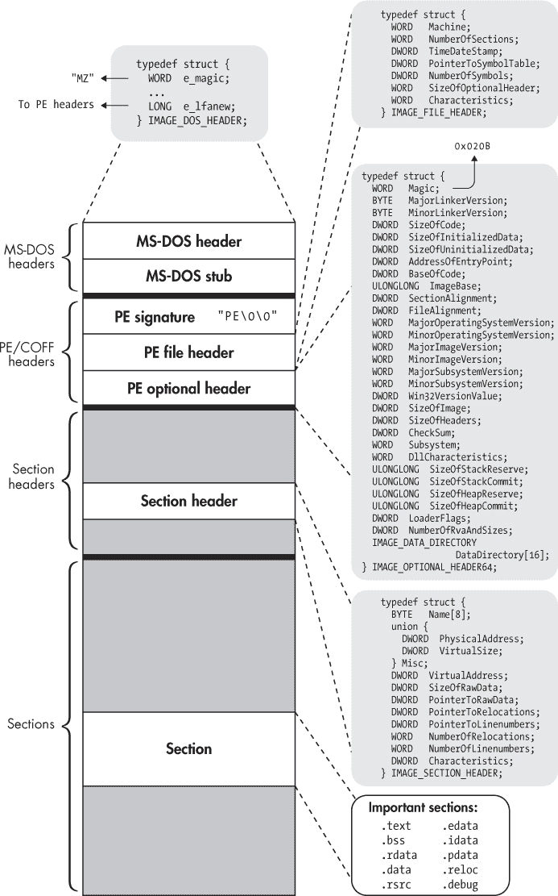

## 3

PE 格式：简要介绍

既然你已经了解了 ELF 格式，让我们简要看看另一个流行的二进制格式：可移植执行格式（PE 格式）。因为 PE 是 Windows 上主要使用的二进制格式，所以熟悉 PE 对于分析常见的 Windows 二进制文件，尤其是在恶意软件分析中，十分有用。

PE 是通用对象文件格式（COFF）的一个修改版本，COFF 在被 ELF 替代之前也曾在基于 Unix 的系统中使用。由于这个历史原因，PE 有时也被称为 PE/COFF。令人困惑的是，64 位版本的 PE 被称为 PE32+。由于 PE32+ 与原始 PE 格式只有很小的差异，我将简单地称其为“PE”。

在接下来的 PE 格式概述中，我将重点介绍它与 ELF 的主要区别，以防你需要在 Windows 平台上工作。与我在 ELF 中所做的详细介绍相比，我不会对 PE 进行过多的细节说明，因为 PE 不是本书的主要焦点。话虽如此，PE（以及大多数其他二进制格式）与 ELF 共享许多相似之处。既然你已经了解了 ELF，你会发现学习新的二进制格式变得更容易了！

我将围绕图 3-1 展开讨论。图中显示的数据结构定义在 *WinNT.h* 中，该文件包含在微软 Windows 软件开发工具包中。

### 3.1 MS-DOS 头部和 MS-DOS 存根

看一下图 3-1，你会看到它与 ELF 格式有很多相似之处，也有一些关键的不同之处。其中一个主要的区别是存在 MS-DOS 头部。没错，就是 MS-DOS，那个 1981 年的老微软操作系统！微软为何要在一个 supposedly 现代的二进制格式中包含这个东西呢？正如你可能猜到的，原因是为了向后兼容。

当 PE 被引入时，曾有一个过渡期，用户同时使用旧式的 MS-DOS 二进制文件和较新的 PE 二进制文件。为了让过渡不那么混乱，每个 PE 文件都以 MS-DOS 头部开始，这样它也可以被当作 MS-DOS 二进制文件解释，至少在某种程度上是如此。MS-DOS 头部的主要功能是描述如何加载和执行紧跟其后的 *MS-DOS 存根*。这个存根通常只是一个小型的 MS-DOS 程序，当用户在 MSDOS 中执行 PE 二进制文件时，它会替代主程序运行。MS-DOS 存根程序通常会打印出类似“该程序无法在 DOS 模式下运行”的字符串，然后退出。然而，原则上，它也可以是该程序的完整 MS-DOS 版本！

MS-DOS 头部以一个魔数值开始，由 ASCII 字符“MZ”组成。^(1) 因此，它有时也被称为 *MZ 头部*。对于本章的目的，MS-DOS 头部中唯一其他重要的字段是最后一个字段，叫做 `e_lfanew`。该字段包含了 PE 二进制文件开始的文件偏移量。因此，当一个支持 PE 的程序加载器打开二进制文件时，它可以读取 MS-DOS 头部，然后跳过它和 MS-DOS 存根，直接跳到 PE 头部的开始位置。

### 3.2 PE 签名、文件头和可选头

你可以将 PE 头部类比为 ELF 的可执行文件头，只是 PE 中的“可执行文件头”被拆分为三个部分：一个 32 位签名，一个 *PE 文件头*，和一个 *PE 可选头*。如果你查看 *WinNT.h*，你会看到有一个名为 `IMAGE_NT_HEADERS64` 的 `struct`，它包含了这三个部分。可以说，`struct IMAGE_NT_HEADERS64` 整体上就是 PE 版本的可执行文件头。然而，在实际使用中，签名、文件头和可选头被视为独立的实体。



*图 3-1：PE32+ 二进制文件一览*

在接下来的几个章节中，我将讨论这些头部组件的每个部分。为了查看所有头部元素的实际应用，我们来看一下 *hello.exe*，这是第一章 中 `compilation_example` 程序的 PE 版本。清单 3-1 显示了 *hello.exe* 中最重要的头部元素和 `DataDirectory` 的转储。我稍后会解释 `DataDirectory` 是什么。

*清单 3-1：PE 头部和* DataDirectory 的示例转储

```
   $ objdump -x hello.exe

   hello.exe:    ➊file format pei-x86-64
   hello.exe
   architecture: i386:x86-64, flags 0x0000012f:
   HAS_RELOC, EXEC_P, HAS_LINENO, HAS_DEBUG, HAS_LOCALS, D_PAGED
   start address 0x0000000140001324

➋ Characteristics 0x22
           executable
           large address aware

   Time/Date               Thu Mar 30 14:27:09 2017
➌ Magic                   020b     (PE32+)
   MajorLinkerVersion      14
   MinorLinkerVersion      10
   SizeOfCode              00000e00
   SizeOfInitializedData   00001c00
   SizeOfUninitializedData 00000000
➍ AddressOfEntryPoint     0000000000001324
➎ BaseOfCode              0000000000001000
➏ ImageBase               0000000140000000
   SectionAlignment        0000000000001000
   FileAlignment           0000000000000200
   MajorOSystemVersion     6
   MinorOSystemVersion     0
   MajorImageVersion       0
   MinorImageVersion       0
   MajorSubsystemVersion   6
   MinorSubsystemVersion   0
   Win32Version            00000000
   SizeOfImage             00007000
   SizeOfHeaders           00000400
   CheckSum                00000000
   Subsystem               00000003     (Windows CUI)
   DllCharacteristics      00008160
   SizeOfStackReserve      0000000000100000
   SizeOfStackCommit       0000000000001000
   SizeOfHeapReserve       0000000000100000
   SizeOfHeapCommit        0000000000001000
   LoaderFlags             00000000
   NumberOfRvaAndSizes     00000010

➐ The Data Directory
   Entry 0 0000000000000000 00000000 Export Directory [.edata]
   Entry 1 0000000000002724 000000a0 Import Directory [parts of .idata]
   Entry 2 0000000000005000 000001e0 Resource Directory [.rsrc]
   Entry 3 0000000000004000 00000168 Exception Directory [.pdata]
   Entry 4 0000000000000000 00000000 Security Directory
   Entry 5 0000000000006000 0000001c Base Relocation Directory [.reloc]
   Entry 6 0000000000002220 00000070 Debug Directory
   Entry 7 0000000000000000 00000000 Description Directory
   Entry 8 0000000000000000 00000000 Special Directory
   Entry 9 0000000000000000 00000000 Thread Storage Directory [.tls]
   Entry a 0000000000002290 000000a0 Load Configuration Directory
   Entry b 0000000000000000 00000000 Bound Import Directory
   Entry c 0000000000002000 00000188 Import Address Table Directory
   Entry d 0000000000000000 00000000 Delay Import Directory
   Entry e 0000000000000000 00000000 CLR Runtime Header
   Entry f 0000000000000000 00000000 Reserved

   ...
```

#### *3.2.1 PE 签名*

PE 签名只是一个包含 ASCII 字符“PE”的字符串，后面跟着两个 `NULL` 字符。它类似于 ELF 可执行文件头中的 `e_ident` 字段中的魔法字节。

#### *3.2.2 PE 文件头*

文件头描述了文件的基本属性。最重要的字段有 `Machine`、`NumberOfSections`、`SizeOfOptionalHeader` 和 `Characteristics`。描述符号表的两个字段已经废弃，PE 文件不再使用嵌入的符号和调试信息。相反，这些符号会作为单独的调试文件的一部分进行选择性地输出。

与 ELF 的`e_machine`类似，`Machine`字段描述了 PE 文件所针对的机器架构。在这种情况下，它是 x86-64（定义为常量`0x8664`）➊。`NumberOfSections`字段仅表示区段头表中的条目数量，`SizeOfOptionalHeader`表示可选头的字节大小，该可选头位于文件头之后。`Characteristics`字段包含描述诸如二进制文件字节序、是否为 DLL、以及是否被剥离等内容的标志。如`objdump`的输出所示，示例二进制文件包含`Characteristics`标志，标识它为一个大地址感知的可执行文件➋。

#### *3.2.3 PE 可选头*

尽管名称上看起来是可选的，PE 可选头对于可执行文件而言实际上并非完全可选（尽管它可能在目标文件中缺失）。事实上，你可能会在任何遇到的 PE 可执行文件中发现 PE 可选头。它包含许多字段，下面我将讲解其中最重要的几个。

首先，有一个 16 位的魔法值，对于 64 位 PE 文件，它被设置为`0x020b`➌。还有几个字段描述了用来创建二进制文件的链接器的主版本号和次版本号，以及运行该二进制文件所需的最小操作系统版本。`ImageBase`字段➏描述了加载二进制文件时的地址（PE 二进制文件设计为加载到特定的虚拟地址）。其他指针字段包含*相对虚拟地址（RVA）*，这些地址旨在与基址相加以推导出虚拟地址。例如，`BaseOfCode`字段➎指定了代码区段的基地址作为 RVA。因此，你可以通过计算`ImageBase+BaseOfCode`来找到代码区段的基虚拟地址。如你所猜测的那样，`AddressOfEntryPoint`字段➍包含了二进制文件的入口点地址，也以 RVA 形式指定。

在可选头中，可能最不直观的字段是`DataDirectory`数组➐。`DataDirectory`包含类型为`IMAGE_DATA_DIRECTORY`的`struct`条目，该结构包含一个 RVA 和一个大小。数组中的每个条目描述了二进制文件中某个重要部分的起始 RVA 和大小；该条目的具体解释取决于它在数组中的索引。最重要的条目是索引为 0 的，它描述了*导出目录*的基 RVA 和大小（基本上是一个导出函数的表）；索引为 1 的条目描述了*导入目录*（一个导入函数的表）；索引为 5 的条目描述了重定位表。当我讨论 PE 区段时，我会进一步讲解导出和导入表。`DataDirectory`基本上为加载器提供了一种快捷方式，使它能够快速查找特定的数据部分，而无需遍历区段头表。

### 3.3 区段头表

在大多数方面，PE 节头表与 ELF 的节头表类似。它是一个 `IMAGE_SECTION_HEADER` 结构体的数组，每个结构体描述一个节，标明其在文件和内存中的大小（`SizeOfRawData` 和 `VirtualSize`）、文件偏移和虚拟地址（`PointerToRawData` 和 `VirtualAddress`）、重定位信息以及任何标志（`Characteristics`）。其中一些标志描述节是否可执行、可读、可写，或这些特性的组合。与 ELF 节头表引用字符串表不同，PE 节头表使用一个简单的字符数组字段（恰当地命名为 `Name`）来指定节的名称。由于该数组只有 8 字节长，PE 节名称的长度限制为 8 个字符。

与 ELF 不同，PE 格式没有明确区分节和段。PE 文件最接近 ELF 执行视图的部分是 `DataDirectory`，它为加载程序提供了快速访问二进制文件中设置执行所需的某些部分的捷径。除此之外，没有单独的程序头表；节头表既用于链接也用于加载。

### 3.4 节

PE 文件中的许多部分可以直接与 ELF 部分进行比较，通常甚至有（几乎）相同的名称。列表 3-2 展示了 *hello.exe* 中各部分的概述。

*列表 3-2：示例 PE 二进制文件中各部分的概述*

```
$ objdump -x hello.exe
...

Sections:
Idx Name       Size        VMA              LMA               File off Algn
  0 .text      00000db8    0000000140001000 0000000140001000  00000400 2**4
               CONTENTS,   ALLOC, LOAD, READONLY, CODE       
  1 .rdata     00000d72    0000000140002000 0000000140002000  00001200 2**4
               CONTENTS,   ALLOC, LOAD, READONLY, DATA       
  2 .data      00000200    0000000140003000 0000000140003000  00002000 2**4
               CONTENTS,   ALLOC, LOAD, DATA                 
  3 .pdata     00000168    0000000140004000 0000000140004000  00002200 2**2
               CONTENTS,   ALLOC, LOAD, READONLY, DATA       
  4 .rsrc      000001e0    0000000140005000 0000000140005000  00002400 2**2
               CONTENTS,   ALLOC, LOAD, READONLY, DATA       
  5 .reloc     0000001c    0000000140006000 0000000140006000  00002600 2**2
               CONTENTS,   ALLOC, LOAD, READONLY, DATA
...
```

如 列表 3-2 中所示，`.text` 部分包含代码，`.rdata` 部分包含只读数据（大致相当于 ELF 中的 `.rodata`），而 `.data` 部分包含可读/可写数据。通常还会有一个 `.bss` 部分用于零初始化数据，尽管在这个简单的示例二进制文件中它缺失了。还有一个 `.reloc` 部分，包含重定位信息。一个需要注意的重要点是，像 Visual Studio 这样的 PE 编译器有时会将只读数据放在 `.text` 部分（与代码混合在一起），而不是放在 `.rdata` 中。这在反汇编时可能会导致问题，因为它可能会误将常量数据解释为指令。

#### *3.4.1 .edata 和 .idata 部分*

在 PE 文件中，最重要的部分是 `.edata` 和 `.idata`，它们在 ELF 中没有直接对应的部分，分别包含导出和导入函数的表格。`DataDirectory` 数组中的导出目录和导入目录条目指向这些部分。`.idata` 部分指定了二进制文件从共享库或 Windows 中的 DLL 导入的符号（函数和数据）。`.edata` 部分列出了二进制文件导出的符号及其地址。因此，为了解析外部符号的引用，加载程序需要将所需的导入与提供所需符号的 DLL 的导出表进行匹配。

实际上，你可能会发现没有单独的`.idata`和.edata 部分。事实上，它们在清单 3-2 中的示例二进制文件中也不存在！当这些部分不存在时，通常会将它们合并到`.rdata`中，但它们的内容和作用仍然保持不变。

当加载器解析依赖关系时，它会将解析后的地址写入*导入地址表（IAT）*中。类似于 ELF 中的全局偏移表，IAT 只是一个已解析指针的表格，每个指针占一个槽位。IAT 也是`.idata`部分的一部分，最初包含指向要导入的符号名称或标识号的指针。动态加载器随后将这些指针替换为指向实际导入函数或变量的指针。对库函数的调用实际上是对该函数的*thunk*的调用，thunk 不过是通过 IAT 槽位进行的间接跳转。清单 3-3 展示了 thunk 在实践中的样子。

*清单 3-3：PE thunk 示例*

```
$ objdump -M intel -d hello.exe
...
140001cd0: ff 25 b2 03 00 00    jmp QWORD PTR [rip+0x3b2]   # ➊0x140002088
140001cd6: ff 25 a4 03 00 00    jmp QWORD PTR [rip+0x3a4]   # ➋0x140002080
140001cdc: ff 25 06 04 00 00    jmp QWORD PTR [rip+0x406]   # ➌0x1400020e8
140001ce2: ff 25 f8 03 00 00    jmp QWORD PTR [rip+0x3f8]   # ➍0x1400020e0
140001ce8: ff 25 ca 03 00 00    jmp QWORD PTR [rip+0x3ca]   # ➎0x1400020b8
...
```

你会经常看到 thunks 被分组在一起，如清单 3-3 所示。请注意，跳转的目标地址从➊到➎都存储在导入目录中，位于`.rdata`部分，该部分从地址`0x140002000`开始。这些是 IAT 中的跳转槽位。

#### *3.4.2 PE 代码段中的填充*

顺便提一下，在反汇编 PE 文件时，你可能会注意到有很多`int3`指令。Visual Studio 将这些指令作为填充指令（而不是`gcc`使用的`nop`指令）以对齐内存中的函数和代码块，使其能够高效访问。^(2) `int3`指令通常由调试器用于设置断点；它会导致程序陷入调试器，或者如果没有调试器的话，则导致程序崩溃。由于填充指令并不打算被执行，所以这对于填充代码来说是没问题的。

### 3.5 小结

如果你已经完成了第二章和本章的内容，我为你的坚持点赞。阅读完本章后，你应该已经了解了 ELF 和 PE 之间的主要相似点和不同点。如果你对在 Windows 平台上分析二进制文件感兴趣，这将对你有所帮助。在下一章，你将动手开始构建第一个真正的二进制分析工具：一个可以加载 ELF 和 PE 二进制文件进行分析的二进制加载库。

习题

1\. 手动头部检查

就像在第二章中分析 ELF 二进制文件时一样，使用像`xxd`这样的十六进制查看器查看 PE 二进制文件中的字节。你可以使用之前相同的命令，`xxd` *program.exe* `| head -n 30`，其中*program.exe*是你的 PE 二进制文件。你能识别表示 PE 头部的字节并理解所有头部字段的含义吗？

### 2\. 磁盘表示与内存表示

使用`readelf`查看 PE 二进制文件的内容。然后绘制该二进制文件在磁盘上的表示与其在内存中的表示之间的对比图。它们之间有什么主要区别？

### 3\. PE 与 ELF

使用`objdump`反汇编一个 ELF 和一个 PE 二进制文件。二进制文件使用不同类型的代码和数据结构吗？你能分别识别出适用于 ELF 编译器和 PE 编译器的一些典型代码或数据模式吗？
