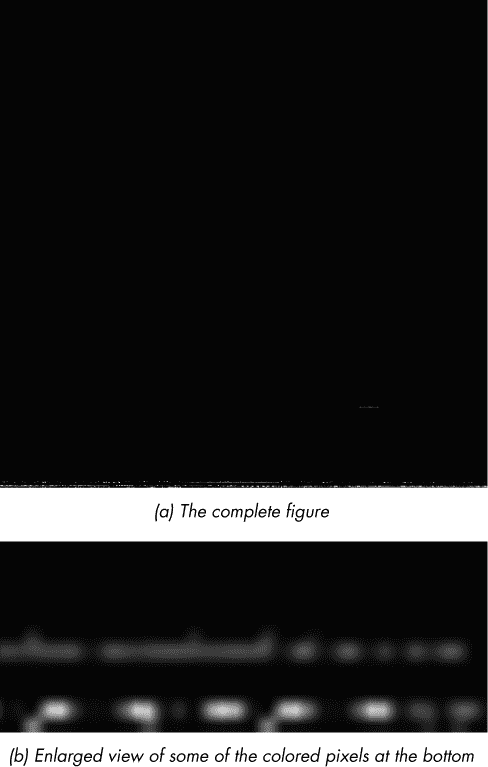
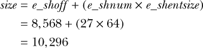

## 5

在 Linux 中进行基础二进制分析

即使在最复杂的二进制分析中，你也可以通过以正确的方式结合一组基本工具来完成令人惊讶的高级任务。这可以节省你自己实现等效功能的数小时工作。在本章中，你将学习在 Linux 上进行二进制分析所需的基本工具。

我不会仅仅列出工具并解释它们的作用，而是通过一个 *Capture the Flag (CTF)* 挑战来演示它们是如何工作的。在计算机安全和黑客攻击中，CTF 挑战通常作为竞赛进行，目标通常是分析或利用给定的二进制文件（或正在运行的进程或服务器），直到你成功捕获隐藏在二进制中的旗标。旗标通常是一个十六进制字符串，你可以用它来证明你完成了挑战，并解锁新的挑战。

在这个 CTF 中，你从一个神秘的文件 *payload* 开始，它位于本章的虚拟机目录中。目标是找出如何从 *payload* 中提取隐藏的旗标。在分析 *payload* 并寻找旗标的过程中，你将学习使用一系列可以在几乎所有基于 Linux 的系统上找到的基础二进制分析工具（大多数工具是 GNU `coreutils` 或 `binutils` 的一部分）。我鼓励你跟随并实践。

你将看到的大多数工具都有许多有用的选项，但在本章中无法全面覆盖所有选项。因此，建议你在虚拟机上使用命令 `man` *tool* 查看每个工具的手册页。本章结束时，你将使用恢复的旗标来解锁新的挑战，之后你可以独立完成它！

### 5.1 使用 file 解决身份危机

因为你没有任何关于 *payload* 内容的提示，所以你完全不知道该如何处理这个文件。当发生这种情况时（例如，在逆向工程或取证场景中），一个好的第一步是弄清楚关于文件类型和内容的所有信息。`file` 工具就是为此设计的；它接受多个文件作为输入，然后告诉你每个文件的类型。你可能还记得在第二章中，我使用 `file` 来确定 ELF 文件的类型。

`file` 的优点在于它不会被文件扩展名所迷惑。相反，它会在文件中搜索其他特征模式，例如 ELF 文件开头的 `0x7f ELF` 魔法字节序列，从而判断文件类型。这在这里非常适用，因为 *payload* 文件没有扩展名。以下是 `file` 告诉你关于 *payload* 的信息：

```
$ file payload
payload: ASCII text
```

正如你所看到的，*payload* 包含 ASCII 文本。要详细检查文本，你可以使用 `head` 工具，它会将文本文件的前几行（默认 10 行）输出到 `stdout`。还有一个类似的工具叫做 `tail`，它显示文件的最后几行。以下是 `head` 工具输出的内容：

```
$ head payload
H4sIAKiT61gAA+xaD3RTVZq/Sf9TSKL8aflnn56ioNJJSiktDpqUlL5o0UpbYEVI0zRtI2naSV5K
YV0HTig21jqojH9mnRV35syZPWd35ZzZ00XHxWBHYJydXf4ckRldZRUxBRzxz2CFQvb77ru3ee81
AZdZZ92z+XrS733fu993v/v/vnt/bqmVfNNkBlq0cCFyy6KFZiUHKi1buMhMLAvMi0oXWSzlZYtA
v2hRWRkRzN94ZEChoOQKCAJp8fdcNt2V3v8fpe9X1y7T63Rjsp7cTlCKGq1UtjL9yPUJGyupIHnw
/zoym2SDnKVIZyVWFR9hrjnPZeky4JcJvwq9LFforSo+i6XjXKfgWaoSWFX8mclExQkRxuww1uOz
Ze3x2U0qfpDFcUyvttMzuxFmN8LSc054er26fJns18D0DaxcnNtZOrsiPVLdh1ILPudey/xda1Xx
MpauTGN3L9hlk69PJsZXsPxS1YvA4uect8N3fN7m8rLv+Frm+7z+UM/8nory+eVlJcHOklIak4ml
rbm7kabn9SiwmKcQuQ/g+3n/OJj/byfuqjv09uKVj8889O6TvxXM+G4qSbRbX1TQCZnWPNQVwG86
/F7+4IkHl1a/eebY91bPemngU8OpI58YNjrWD16u3P3wuzaJ3kh4i6vpuhT6g7rkfs6k0DtS6P8l
hf6NFPocfXL9yRTpS0ny+NtJ8vR3p0hfl8J/bgr9Vyn0b6bQkxTl+ixF+p+m0N+qx743k+wWmlT6
```

这显然不像是人类可读的内容。仔细观察文件中使用的字母表，你会发现它只由字母数字字符和字符 + 与 / 组成，并且按整齐的行排列。当你看到这样的文件时，通常可以安全地假设它是一个*Base64*文件。

Base64 是一种广泛使用的将二进制数据编码为 ASCII 文本的方法。除其他外，它常用于电子邮件和网络上，以确保通过网络传输的二进制数据不会因只能处理文本的服务而被意外损坏。方便的是，Linux 系统自带了一个名为`base64`的工具（通常是 GNU `coreutils`的一部分），可以进行 Base64 编码和解码。默认情况下，`base64`会编码任何传递给它的文件或`stdin`输入。但你可以使用`-d`标志告诉`base64`进行解码。让我们解码*payload*看看会得到什么！

```
$ base64 -d payload > decoded_payload
```

这个命令解码*payload*，然后将解码后的内容存储在一个名为`decoded_payload`的新文件中。现在你已经解码了*payload*，让我们再次使用`file`来检查解码后的文件类型。

```
$ file decoded_payload
decoded_payload: gzip compressed data, last modified: Tue Oct 22 15:46:43 2019, from Unix
```

现在你有了进展！事实证明，在 Base64 编码层背后，神秘的文件实际上只是一个压缩归档文件，使用`gzip`作为外部压缩层。这是介绍`file`的另一个实用功能的好机会：能够窥视压缩文件内部。你可以通过为`file`传递`-z`选项，查看归档中的内容而无需解压。你应该会看到如下内容：

```
$ file -z decoded_payload
decoded_payload: POSIX tar archive (GNU) (gzip compressed data, last modified:
                  Tue Oct 22 19:08:12 2019, from Unix)
```

你可以看到你正在处理多个需要提取的层，因为最外层是一个`gzip`压缩层，而里面是一个`tar`归档文件，通常包含一组文件。为了查看存储在其中的文件，你可以使用`tar`解压并提取`decoded_payload`，像这样：

```
$ tar xvzf decoded_payload
ctf
67b8601
```

如`tar`日志所示，从归档中提取了两个文件：*ctf*和*67b8601*。让我们再次使用`file`，看看你正在处理哪些类型的文件。

```
$ file ctf 
ctf: ELF 64-bit LSB executable, x86-64, version 1 (SYSV), dynamically linked,
interpreter /lib64/ld-linux-x86-64.so.2, for GNU/Linux 2.6.32,
BuildID[sha1]=29aeb60bcee44b50d1db3a56911bd1de93cd2030, stripped
```

第一个文件，*ctf*，是一个动态链接的 64 位精简 ELF 可执行文件。第二个文件，名为*67b8601*，是一个 512 × 512 像素的位图（BMP）文件。你可以通过如下命令使用`file`看到这一点：

```
$  file 67b8601
67b8601: PC bitmap, Windows 3.x format, 512 x 512 x 24
```

这个 BMP 文件展示了一个黑色方块，正如你在图 5-1a 中看到的那样。如果你仔细观察，你应该能看到图底部有一些颜色不规则的像素。图 5-1b 显示了这些像素的放大片段。

在探索这些含义之前，让我们先仔细看一下你刚刚提取的*ctf* ELF 文件。



*图 5-1：提取的 BMP 文件，67b8601*

### 5.2 使用 ldd 探索依赖关系

尽管运行未知的二进制文件并不明智，但由于你在虚拟机中工作，我们还是尝试运行提取的*ctf*二进制文件。当你尝试运行该文件时，你并没有走得太远。

```
$  ./ctf
./ctf: error while loading shared libraries: lib5ae9b7f.so:
       cannot open shared object file: No such file or directory
```

在任何应用程序代码执行之前，动态链接器就抱怨缺少一个名为 *lib5ae9b7f.so* 的库。这听起来不像是你在任何系统上通常会找到的库。在搜索这个库之前，先检查一下 *ctf* 是否还有其他未解决的依赖项是有意义的。

Linux 系统带有一个名为 `ldd` 的程序，你可以用它来查找一个二进制文件依赖的共享对象，以及这些依赖项在你的系统上的位置（如果有的话）。你甚至可以使用 `ldd` 配合 `-v` 参数来查看二进制文件期望的库版本，这在调试时非常有用。正如 `ldd man` 页面中提到的那样，`ldd` 可能会运行该二进制文件来确定其依赖项，因此在运行不信任的二进制文件时不安全，除非你在虚拟机或其他隔离环境中运行它。以下是 *ctf* 二进制文件的 `ldd` 输出：

```
$ ldd ctf
        linux-vdso.so.1 => (0x00007fff6edd4000)
        lib5ae9b7f.so => not found
        libstdc++.so.6 => /usr/lib/x86_64-linux-gnu/libstdc++.so.6 (0x00007f67c2cbe000)
        libgcc_s.so.1 => /lib/x86_64-linux-gnu/libgcc_s.so.1 (0x00007f67c2aa7000)
        libc.so.6 => /lib/x86_64-linux-gnu/libc.so.6 (0x00007f67c26de000)
        libm.so.6 => /lib/x86_64-linux-gnu/libm.so.6 (0x00007f67c23d5000)
        /lib64/ld-linux-x86-64.so.2 (0x0000561e62fe5000)
```

幸运的是，除了之前识别出的缺失库 *lib5ae9b7f.so* 之外，没有其他未解决的依赖项。现在你可以专注于弄清楚这个神秘的库是什么，以及如何获取它来捕获旗帜！

因为从库名来看，很明显你不会在任何标准仓库中找到它，所以它一定存在于你目前为止得到的文件中。回想一下第二章，所有 ELF 二进制文件和库都以魔术序列 `0x7f ELF` 开头。这个字符串对于寻找丢失的库非常有用；只要库没有加密，你应该能够通过这种方式找到 ELF 头。我们来尝试一下简单的 `grep` 查找字符串 `'ELF'`。

```
$ grep 'ELF' *
Binary file 67b8601 matches
Binary file ctf matches
```

正如预期的那样，字符串 `'ELF'` 出现在 *ctf* 中，这并不奇怪，因为你已经知道它是一个 ELF 二进制文件。但你可以看到这个字符串也出现在 *67b8601* 中，乍一看，这似乎是一个无害的位图文件。难道位图的像素数据中隐藏了一个共享库？这倒可以解释你在图 5-1b 中看到的那些奇怪颜色的像素！让我们更详细地检查 *67b8601* 的内容，看看能否找到答案。

快速查找 ASCII 代码

在将原始字节解释为 ASCII 时，你通常需要一个表格，将不同表示形式的字节值映射到 ASCII 符号。你可以使用一个名为 `man ascii` 的特殊手册页来快速访问此类表格。以下是从 `man ascii` 提取的表格片段：

| `Oct` | `Dec` | `Hex` | `字符` | `Oct` | `Dec` | `Hex` | `字符` |
| --- | --- | --- | --- | --- | --- | --- | --- |
| `000` | `0` | `00` | `NUL '\0' (空字符)` | `100` | `64` | `40` | `@` |
| `001` | `1` | `01` | `SOH (标题开始)` | `101` | `65` | `41` | `A` |
| `002` | `2` | `02` | `STX (文本开始)` | `102` | `66` | `42` | `B` |
| `003` | `3` | `03` | `ETX (文本结束)` | `103` | `67` | `43` | `C` |
| `004` | `4` | `04` | `EOT (传输结束)` | `104` | `68` | `44` | `D` |
| `005` | `5` | `05` | `ENQ (查询)` | `105` | `69` | `45` | `E` |
| `006` | `6` | `06` | `ACK (acknowledge)` | `106` | `70` | `46` | `F` |
| `007` | `7` | `07` | `BEL '\a' (bell)` | `107` | `71` | `47` | `G` |
| `...` |  |  |  |  |  |  |  |

如你所见，这是一种快速查找从八进制、十进制和十六进制编码到 ASCII 字符映射的方法。比起在 Google 上查找 ASCII 表，这要快得多！

### 5.3 使用 xxd 查看文件内容

要发现文件中究竟包含什么内容，而又不能依赖于关于文件内容的任何标准假设，你必须在字节级别进行分析。为此，你可以使用任何数字系统来显示屏幕上的位和字节。例如，你可以使用二进制系统，逐个显示所有的 1 和 0。但由于这种方法分析起来非常繁琐，最好使用*十六进制系统*。在十六进制系统中（也称为*基数 16*，简称*hex*），数字从 0 到 9（含普通意义）开始，接着是 *a* 到 *f*（其中 *a* 表示值 10，*f* 表示值 15）。此外，由于一个字节有 256 = 16 × 16 种可能的值，它正好可以用两位十六进制数字表示，这使得它成为一个方便的编码方式，用于紧凑地显示字节。

要以十六进制表示文件的字节，你可以使用*十六进制转储*程序。*十六进制编辑器*是一个也可以编辑文件字节的程序。我将在第七章中详细讲解十六进制编辑，但现在我们先使用一个简单的十六进制转储程序叫做`xxd`，它默认安装在大多数 Linux 系统中。

这是你正在分析的位图文件通过`xxd`命令输出的前 15 行内容：

```
$ xxd 67b8601 | head -n 15
00000000: 424d 3800 0c00 0000 0000 3600 0000 2800 BM8.......6...(.
00000010: 0000 0002 0000 0002 0000 0100 1800 0000 ................
00000020: 0000 0200 0c00 c01e 0000 c01e 0000 0000 ................
00000030: 0000 0000 ➊7f45 4c46 0201 0100 0000 0000 .....ELF........
00000040: 0000 0000 0300 3e00 0100 0000 7009 0000 ......>.....p...
00000050: 0000 0000 4000 0000 0000 0000 7821 0000 ....@.......x!..
00000060: 0000 0000 0000 0000 4000 3800 0700 4000 ........@.8...@.
00000070: 1b00 1a00 0100 0000 0500 0000 0000 0000 ................
00000080: 0000 0000 0000 0000 0000 0000 0000 0000 ................
00000090: 0000 0000 f40e 0000 0000 0000 f40e 0000 ................
000000a0: 0000 0000 0000 2000 0000 0000 0100 0000 ...... .........
000000b0: 0600 0000 f01d 0000 0000 0000 f01d 2000 .............. .
000000c0: 0000 0000 f01d 2000 0000 0000 6802 0000 ...... .....h...
000000d0: 0000 0000 7002 0000 0000 0000 0000 2000 ....p......... .
000000e0: 0000 0000 0200 0000 0600 0000 081e 0000 ................
```

如你所见，第一列输出显示了文件的偏移量，以十六进制格式表示。接下来的八列显示文件中字节的十六进制表示，在输出的最右侧，你可以看到相同字节的 ASCII 表示。

你可以使用 `xxd` 程序的 `-c` 选项来更改每行显示的字节数。例如，`xxd -c 32` 会每行显示 32 个字节。你还可以使用 `-b` 选项显示二进制而不是十六进制，并且可以使用 `-i` 选项输出一个包含字节的 C 风格数组，你可以直接将其包含在 C 或 C++ 源代码中。要仅输出文件中的部分字节，你可以使用 `-s`（寻址）选项指定开始的位置，并可以使用 `-l`（长度）选项指定要转储的字节数。

在位图文件的 `xxd` 输出中，ELF 魔术字节出现在偏移 `0x34` ➊ 处，对应十进制的 52。这告诉你文件中可能的 ELF 库开始的位置。不幸的是，确定它结束的位置并不那么简单，因为 ELF 文件的末尾没有魔术字节作为分界。因此，在尝试提取完整的 ELF 文件之前，先提取 ELF 头部会更容易，因为你知道 64 位 ELF 头部正好包含 64 个字节。然后，你可以检查 ELF 头部，以确定完整文件的大小。

要提取头部，你可以使用 `dd` 从位图文件的偏移 52 处开始，复制 64 字节到一个名为 *elf_header* 的新输出文件中。

```
$ dd skip=52 count=64 if=67b8601 of=elf_header bs=1
64+0 records in
64+0 records out
64 bytes copied, 0.000404841 s, 158 kB/s
```

使用 `dd` 在这里只是偶然的，因此我不会详细解释。不过，`dd` 是一个非常多功能的^(1) 工具，如果你不熟悉它，值得阅读它的手册页。

让我们再次使用 `xxd` 来查看它是否有效。

```
$ xxd elf_header
00000000: ➊7f45 4c46 0201 0100 0000 0000 0000 0000 .ELF............
00000010: 0300 3e00 0100 0000 7009 0000 0000 0000 ..>.....p.......
00000020: 4000 0000 0000 0000 7821 0000 0000 0000 @.......x!......
00000030: 0000 0000 4000 3800 0700 4000 1b00 1a00 ....@.8...@.....
```

看起来像是 ELF 头部！你可以清楚地看到起始处的魔术字节 ➊，并且还可以看到 `e_ident` 数组和其他字段看起来合理（有关这些字段的描述，请参考第二章）。

### 5.4 使用 readelf 解析提取的 ELF

要查看你刚提取的 ELF 头部的详细信息，最好使用 `readelf`，就像你在第二章中做的那样。但如果 ELF 文件损坏，仅包含一个头部，`readelf` 还能工作吗？让我们在清单 5-1 中找出答案！

*清单 5-1：提取的 ELF 头部的* readelf *输出*

```
➊  $ readelf  -h  elf_header
   ELF Header:
     Magic:  7f 45 4c 46 02 01 01 00 00 00 00 00 00 00 00 00
     Class:                            ELF64
     Data:                             2's complement, little endian
     Version:                          1 (current)
     OS/ABI:                           UNIX - System V
     ABI Version:                      0
     Type:                             DYN (Shared object file)
     Machine:                          Advanced Micro Devices X86-64
     Version:                          0x1
     Entry point address:              0x970
     Start of program headers:         64 (bytes into file)
➋   Start of section headers:         8568 (bytes into file)
     Flags:                            0x0
     Size of this header:              64 (bytes)
     Size of program headers:          56 (bytes)
     Number of program headers:        7
➌   Size of section headers:          64 (bytes)
➍   Number of section headers:        27
     Section header string table index: 26
   readelf: Error: Reading 0x6c0 bytes extends past end of file for section headers
   readelf: Error: Reading 0x188 bytes extends past end of file for program headers
```

`-h` 选项 ➊ 告诉 `readelf` 仅打印可执行头部。它仍然抱怨节区头表和程序头表的偏移量指向文件之外，但这没关系。关键是，你现在可以方便地查看提取的 ELF 头部。

那么，如何仅凭可执行头部来计算完整 ELF 的大小呢？在第二章的图 2-1 中，你已经学到 ELF 文件的最后部分通常是节区头表，而节区头表的偏移量是在可执行头部中给出的 ➋。可执行头部还告诉你每个节区头的大小 ➌ 和节区头表中的节区头数量 ➍。这意味着你可以通过以下方式计算出隐藏在位图文件中的完整 ELF 库的大小：



在这个方程式中，*size* 是完整库的大小，*e*_*shoff* 是节区头表的偏移量，*e*_*shnum* 是节区头表中的节区头数量，*e*_*shentsize* 是每个节区头的大小。

现在你已经知道库的大小应该是 10,296 字节，你可以使用 `dd` 完整提取它，方法如下：

```
$ dd skip=52 count=10296 if=67b8601 ➊of=lib5ae9b7f.so bs=1
10296+0 records in
10296+0 records out
10296 bytes (10 kB, 10 KiB) copied, 0.0287996 s, 358 kB/s
```

`dd`命令调用提取的文件*lib5ae9b7f.so* ➊，因为这是*ctf*二进制文件期望的缺失库的名称。运行此命令后，你现在应该拥有一个完全功能的 ELF 共享对象。让我们使用`readelf`来查看是否一切顺利，如清单 5-2 所示。为了简洁起见，我们只打印可执行文件头（`-h`）和符号表（`-s`）。后者应能帮助你了解库所提供的功能。

*清单 5-2：提取的库的*readelf*输出，*lib5ae9b7f.so*

```
    $ readelf -hs lib5ae9b7f.so
    ELF Header:
      Magic:  7f 45 4c 46 02 01 01 00 00 00 00 00 00 00 00 00
      Class:                             ELF64
      Data:                              2's complement, little endian
      Version:                           1 (current)
      OS/ABI:                            UNIX - System V
      ABI Version:                       0
      Type:                              DYN (Shared object file)
      Machine:                           Advanced Micro Devices X86-64
      Version:                           0x1
      Entry point address:               0x970
      Start of program headers:          64 (bytes into file)
      Start of section headers:          8568 (bytes into file)
      Flags:                             0x0
      Size of this header:               64 (bytes)
      Size of program headers:           56 (bytes)
      Number of program headers:         7
      Size of section headers:           64 (bytes)
      Number of section headers:         27
      Section header string table index: 26

    Symbol table '.dynsym' contains 22 entries:
      Num:      Value              Size Type      Bind          Vis       Ndx  Name
        0: 0000000000000000           0 NOTYPE    LOCAL      DEFAULT      UND
        1: 00000000000008c0           0 SECTION   LOCAL      DEFAULT        9
        2: 0000000000000000           0 NOTYPE    WEAK       DEFAULT      UND  __gmon_start__
        3: 0000000000000000           0 NOTYPE    WEAK       DEFAULT      UND  _Jv_RegisterClasses
        4: 0000000000000000           0 FUNC      GLOBAL     DEFAULT      UND  _ZNSt7__cxx1112basic_stri@GL(2)
        5: 0000000000000000           0 FUNC      GLOBAL     DEFAULT      UND  malloc@GLIBC_2.2.5 (3)
        6: 0000000000000000           0 NOTYPE    WEAK       DEFAULT      UND  _ITM_deregisterTMCloneTab
        7: 0000000000000000           0 NOTYPE    WEAK       DEFAULT      UND  _ITM_registerTMCloneTable
        8: 0000000000000000           0 FUNC      WEAK       DEFAULT      UND  __cxa_finalize@GLIBC_2.2.5 (3)
        9: 0000000000000000           0 FUNC      GLOBAL     DEFAULT      UND  __stack_chk_fail@GLIBC_2.4 (4)
       10: 0000000000000000           0 FUNC      GLOBAL     DEFAULT      UND  _ZSt19__throw_logic_error@ (5)
       11: 0000000000000000           0 FUNC      GLOBAL     DEFAULT      UND  memcpy@GLIBC_2.14 (6)
➊     12: 0000000000000bc0          149 FUNC     GLOBAL     DEFAULT        12  _Z11rc4_encryptP11rc4_sta
➋     13: 0000000000000cb0          112 FUNC     GLOBAL     DEFAULT        12  _Z8rc4_initP11rc4_state_t
       14: 0000000000202060           0 NOTYPE    GLOBAL     DEFAULT        24  _end
       15: 0000000000202058           0 NOTYPE    GLOBAL     DEFAULT        23  _edata
➌     16: 0000000000000b40          119 FUNC     GLOBAL     DEFAULT        12  _Z11rc4_encryptP11rc4_sta
➍     17: 0000000000000c60            5 FUNC     GLOBAL     DEFAULT        12  _Z11rc4_decryptP11rc4_sta
       18: 0000000000202058            0 NOTYPE   GLOBAL     DEFAULT        24  __bss_start
       19: 00000000000008c0            0 FUNC     GLOBAL     DEFAULT         9  _init
➎     20: 0000000000000c70           59 FUNC     GLOBAL     DEFAULT        12  _Z11rc4_decryptP11rc4_sta
       21: 0000000000000d20            0 FUNC     GLOBAL     DEFAULT        13  _fini
```

如期望的那样，完整的库似乎已经被正确提取。尽管它被剥离了，但动态符号表确实显示了一些有趣的导出函数（➊到➎）。然而，函数名周围似乎有一些乱码，导致它们难以阅读。让我们看看是否可以解决这个问题。

### 5.5 使用 nm 解析符号

C++允许函数*重载*，这意味着可能有多个同名函数，只要它们具有不同的签名。对于链接器来说，这却是个问题，因为它对 C++一无所知。例如，如果有多个名为`foo`的函数，链接器不知道如何解决对`foo`的引用；它根本不知道使用哪个版本的`foo`。为了消除重复的名称，C++编译器会生成*破坏*的函数名。破坏的函数名本质上是原始函数名和函数参数的编码组合。这样，每个版本的函数都会有一个唯一的名称，链接器就能够轻松区分重载的函数。

对于二进制分析师来说，名称被“破坏”（mangled）的函数名是一种复杂的祝福。一方面，破坏后的函数名更难以阅读，正如你在`readelf`输出中看到的*lib5ae9b7f.so*（见清单 5-2）所示，它是用 C++编写的。另一方面，破坏后的函数名实际上通过揭示函数的预期参数提供了免费的类型信息，这在逆向工程二进制文件时非常有用。

幸运的是，破坏后的函数名带来的好处大于缺点，因为它们相对容易被*还原*。有几个标准工具可以用来还原破坏的函数名。其中最著名的工具之一是`nm`，它可以列出给定二进制文件、目标文件或共享对象的符号。当给定一个二进制文件时，`nm`默认尝试解析静态符号表。

```
$ nm lib5ae9b7f.so
nm: lib5ae9b7f.so: no symbols
```

不幸的是，正如这个例子所示，你不能在*lib5ae9b7f.so*上使用`nm`的默认配置，因为它已经被剥离。你必须显式地要求`nm`解析动态符号表，使用`-D`开关，如清单 5-3 所示。在这个清单中，"`...`"表示我已经截断了一行并将其继续到下一行（破坏的函数名可能非常长）。

*清单 5-3：*nm*输出，*lib5ae9b7f.so*

```
$ nm -D lib5ae9b7f.so
                 w _ITM_deregisterTMCloneTable
                 w _ITM_registerTMCloneTable
                 w _Jv_RegisterClasses
0000000000000c60 T _Z11rc4_decryptP11rc4_state_tPhi
0000000000000c70 T _Z11rc4_decryptP11rc4_state_tRNSt7__cxx1112basic_...
                 ...stringIcSt11char_traitsIcESaIcEEE
0000000000000b40 T _Z11rc4_encryptP11rc4_state_tPhi
0000000000000bc0 T _Z11rc4_encryptP11rc4_state_tRNSt7__cxx1112basic_...
                 ...stringIcSt11char_traitsIcESaIcEEE
0000000000000cb0 T _Z8rc4_initP11rc4_state_tPhi
                 U _ZNSt7__cxx1112basic_stringIcSt11char_traitsIcESaIcEE9_...
                   ...M_createERmm
                 U _ZSt19__throw_logic_errorPKc
0000000000202058 B __bss_start
                 w __cxa_finalize
                 w __gmon_start__
                 U __stack_chk_fail
0000000000202058 D _edata
0000000000202060 B _end
0000000000000d20 T _fini
00000000000008c0 T _init
                 U malloc
                 U memcpy
```

这样看起来好多了，这次你看到了一些符号。但符号名称仍然是混淆的。要去混淆它们，你需要将 `--demangle` 选项传递给 `nm`，如 清单 5-4 所示。

*清单 5-4：* lib5ae9b7f.so 的 *nm* 输出（已去除混淆）

```
$ nm -D --demangle  lib5ae9b7f.so
                 w  _ITM_deregisterTMCloneTable
                 w  _ITM_registerTMCloneTable
                 w  _Jv_RegisterClasses
0000000000000c60 T  ➊rc4_decrypt(rc4_state_t*, unsigned char*, int)
0000000000000c70 T  ➋rc4_decrypt(rc4_state_t*,
                                 std::__cxx11::basic_string<char, std::char_traits<char>,
                                 std::allocator<char> >&)
0000000000000b40 T  ➌rc4_encrypt(rc4_state_t*, unsigned char*, int)
0000000000000bc0 T  ➍rc4_encrypt(rc4_state_t*,
                                 std::__cxx11::basic_string<char, std::char_traits<char>,
                                 std::allocator<char> >&)
0000000000000cb0 T  ➎rc4_init(rc4_state_t*, unsigned char*, int)
                 U  std::__cxx11::basic_string<char, std::char_traits<char>,
                        std::allocator<char> >::_M_create(unsigned long&, unsigned long)
                 U  std::__throw_logic_error(char const*)
0000000000202058 B  __bss_start
                 w  __cxa_finalize
                 w  __gmon_start__
                 U  __stack_chk_fail
0000000000202058 D  _edata
0000000000202060 B  _end
0000000000000d20 T  _fini
00000000000008c0 T  _init
                 U  malloc
                 U  memcpy
```

最终，函数名称变得易于阅读。你可以看到五个有趣的函数，它们似乎是实现了著名的 RC4 加密算法的加密函数。^(2) 有一个名为 `rc4_init` 的函数，它接受一个类型为 `rc4_state_t` 的数据结构作为输入，以及一个无符号字符字符串和一个整数 ➎。第一个参数可能是一个存储加密状态的数据结构，而接下来的两个参数分别可能是表示密钥的字符串和指定密钥长度的整数。你还可以看到几个加密和解密函数，每个函数都接受指向加密状态的指针，并且有参数指定要加密或解密的字符串（包括 C 和 C++ 字符串）（➊ 到 ➍）。

作为去混淆函数名称的另一种方法，你可以使用名为 `c++filt` 的专用工具，它接受混淆过的名称作为输入并输出去混淆后的等效名称。`c++filt` 的优势在于它支持多种混淆格式，并自动检测给定输入的正确混淆格式。以下是使用 `c++filt` 去混淆函数名称 `_Z8rc4_initP11rc4_state_tPhi` 的示例：

```
$ c++filt _Z8rc4_initP11rc4_state_tPhi
rc4_init(rc4_state_t*, unsigned char*, int)
```

现在，让我们简要回顾一下迄今为止的进展。你提取了神秘的有效负载，并找到了一个名为 *ctf* 的二进制文件，它依赖于一个名为 *lib5ae9b7f.so* 的文件。你找到了隐藏在位图文件中的 *lib5ae9b7f.so* 并成功提取出来。你也大致了解了它的功能：它是一个加密库。现在，让我们再次尝试运行 *ctf*，这次不再缺少任何依赖项。

当你运行一个二进制文件时，链接器通过搜索多个标准目录中的共享库来解析二进制文件的依赖项，例如 */lib*。由于你将 *lib5ae9b7f.so* 提取到了一个非标准目录，你需要告诉链接器也去该目录搜索，通过设置一个名为 `LD_LIBRARY_PATH` 的环境变量。让我们将该变量设置为当前工作目录，然后再次尝试启动 *ctf*。

```
$ export LD_LIBRARY_PATH=`pwd`
$ ./ctf
$ echo $?
1
```

成功了！*ctf* 二进制文件看起来仍然没有做任何有用的事情，但它能够运行，并且没有抱怨缺少任何库文件。*ctf* 的退出状态（保存在 `$?` 变量中）是 1，表示发生了错误。现在你已经拥有了所有必需的依赖项，可以继续调查并看看你是否能够让 *ctf* 克服错误，从而达到你要捕捉的标志。

### 5.6 使用 strings 寻找线索

为了弄清楚一个二进制文件的功能以及它期望的输入类型，你可以检查该二进制文件是否包含任何有助于揭示其目的的字符串。例如，如果你看到包含 HTTP 请求或 URL 的字符串，你可以安全地猜测该二进制文件正在执行与 Web 相关的操作。当你处理恶意软件（如 bot）时，如果这些字符串没有被混淆，你可能会找到包含 bot 接受的命令的字符串。你甚至可能会发现一些调试时留下的字符串，程序员忘记删除这些字符串，这种情况在实际的恶意软件中也曾发生过！

你可以使用一个名为`strings`的工具来检查 Linux 上二进制文件（或其他任何文件）中的字符串。`strings`工具接受一个或多个文件作为输入，然后打印出这些文件中找到的所有可打印字符字符串。请注意，`strings`并不会检查所找到的字符串是否真的被设计为可读的，所以当它用于二进制文件时，`strings`的输出可能会包含一些虚假的字符串，这些字符串可能是二进制序列偶然变得可打印的结果。

你可以使用选项来调整`strings`的行为。例如，你可以使用`-d`选项与`strings`一起使用，以仅打印出在二进制文件的数据部分中找到的字符串，而不是打印所有部分。默认情况下，`strings`只打印四个字符或更多的字符串，但你可以使用`-n`选项指定其他最小字符串长度。就我们的目的而言，默认选项就足够了；让我们看看你能在*ctf*二进制文件中使用`strings`找到什么，如列表 5-5 所示。

*列表 5-5：在* ctf *二进制文件中找到的字符字符串*

```
   $ strings ctf
➊ /lib64/ld-linux-x86-64.so.2
   lib5ae9b7f.so
➋ __gmon_start__
   _Jv_RegisterClasses
   _ITM_deregisterTMCloneTable
   _ITM_registerTMCloneTable
   _Z8rc4_initP11rc4_state_tPhi
    ...
➌ DEBUG: argv[1] = %s
➍ checking '%s'
➎ show_me_the_flag
   >CMb
   -v@P
   flag = %s
   guess again!
➏ It's kinda like Louisiana. Or Dagobah. Dagobah - Where Yoda lives!
   ;*3$"
   zPLR
   GCC: (Ubuntu 5.4.0-6ubuntu1~16.04.4) 5.4.0 20160609
➐ .shstrtab
   .interp
   .note.ABI-tag
   .note.gnu.build-id
   .gnu.hash
   .dynsym
   .dynstr
   .gnu.version
   .gnu.version_r
   .rela.dyn
   .rela.plt
   .init
   .plt.got
   .text
   .fini
   .rodata
   .eh_frame_hdr
   .eh_frame
   .gcc_except_table
   .init_array
   .fini_array
   .jcr
   .dynamic
   .got.plt
   .data
   .bss
   .comment
```

在这里，你可以看到一些在大多数 ELF 文件中都会遇到的字符串。例如，程序解释器的名称➊，可以在`.interp`部分找到，以及一些在`.dynstr`部分找到的符号名称➋。在`strings`的输出末尾，你可以看到所有在`.shstrtab`部分找到的节名称➐。但这些字符串在此并没有什么特别有趣的地方。

幸运的是，还有一些更有用的字符串。例如，似乎有一条调试信息，暗示程序期望一个命令行选项➌。还有一些检查，可能是针对输入字符串执行的检查➍。你现在还不知道命令行选项的值应该是什么，但你可以尝试一些其他看起来有趣的字符串，例如`show_me_the_flag`➎，它可能有效。还有一个神秘的字符串➏，它包含一条含义不明的消息。你现在不知道这条消息的意思，但你从对*lib5ae9b7f.so*的调查中知道，二进制文件使用了 RC4 加密。也许这条消息是用作加密密钥？

现在你知道了二进制文件期望一个命令行选项，让我们看看添加一个任意选项是否能让你更接近揭示旗标。为了没有更好的猜测，我们就简单地使用字符串`foobar`，如下所示：

```
$ ./ctf foobar
checking 'foobar'
$ echo $?
1
```

该二进制文件现在做了一些新事情。它告诉你它正在检查你给定的输入字符串。但检查并没有成功，因为检查后，二进制文件仍然以错误代码退出。我们来冒险尝试一下你找到的其他一些看起来有趣的字符串，比如 `show_me_the_flag`，它看起来很有潜力。

```
$ ./ctf show_me_the_flag
checking 'show_me_the_flag'
ok
$ echo $?
1
```

成功了！检查现在似乎已经成功。不幸的是，退出状态仍然是 1，所以肯定还有其他东西缺失。更糟糕的是，`strings` 的结果没有提供更多的线索。我们来更详细地查看 *ctf* 的行为，确定接下来该做什么，从 *ctf* 发出的系统和库调用开始。

### 5.7 使用 strace 和 ltrace 跟踪系统调用和库调用

为了取得进展，我们来调查一下 *ctf* 为什么会退出并返回错误代码，看看 *ctf* 在退出前的行为。你可以通过很多方式来做这件事，其中一种方法是使用两个工具，分别是 `strace` 和 `ltrace`。这些工具分别显示了二进制文件执行的系统调用和库调用。知道一个二进制文件所做的系统和库调用通常可以给你一个关于程序在做什么的高层次理解。

让我们首先使用 `strace` 来调查 *ctf* 的系统调用行为。在某些情况下，你可能希望将 `strace` 附加到一个正在运行的进程。为此，你需要使用 `-p` *pid* 选项，其中 *pid* 是你想附加的进程的进程 ID。然而，在这种情况下，从一开始就用 `strace` 运行 *ctf* 就足够了。列 5-6 显示了 *ctf* 二进制文件的 `strace` 输出（有些部分被“`...`”截断）。

*列 5-6：* ctf *二进制文件执行的系统调用*

```
   $ strace ./ctf show_me_the_flag
➊ execve("./ctf", ["./ctf", "show_me_the_flag"], [/* 73 vars */]) = 0
   brk(NULL)                               = 0x1053000
   access("/etc/ld.so.nohwcap", F_OK)            = -1 ENOENT (No such file or directory)
   mmap(NULL, 8192, PROT_READ|PROT_WRITE, MAP_PRIVATE|MAP_ANONYMOUS, -1, 0) = 0x7f703477e000
   access("/etc/ld.so.preload", R_OK)              = -1 ENOENT (No such file or directory)
➋ open("/ch3/tls/x86_64/lib5ae9b7f.so", O_RDONLY|O_CLOEXEC) = -1 ENOENT (No such file or ...)
   stat("/ch3/tls/x86_64", 0x7ffcc6987ab0) = -1 ENOENT (No such file or directory)
   open("/ch3/tls/lib5ae9b7f.so", O_RDONLY|O_CLOEXEC) = -1 ENOENT (No such file or directory)
   stat("/ch3/tls", 0x7ffcc6987ab0) = -1 ENOENT (No such file or directory)
   open("/ch3/x86_64/lib5ae9b7f.so", O_RDONLY|O_CLOEXEC) = -1 ENOENT (No such file or directory)
   stat("/ch3/x86_64", 0x7ffcc6987ab0) = -1 ENOENT (No such file or directory)
   open("/ch3/lib5ae9b7f.so", O_RDONLY|O_CLOEXEC) = 3
➌ read(3, "\177ELF\2\1\1\0\0\0\0\0\0\0\0\0\3\0>\0\1\0\0\0p\t\0\0\0\0\0\0"..., 832) = 832
   fstat(3, st_mode=S_IFREG|0775, st_size=10296, ...) = 0
   mmap(NULL, 2105440, PROT_READ|PROT_EXEC, MAP_PRIVATE|MAP_DENYWRITE, 3, 0) = 0x7f7034358000
   mprotect(0x7f7034359000, 2097152, PROT_NONE) = 0
   mmap(0x7f7034559000, 8192, PROT_READ|PROT_WRITE, ..., 3, 0x1000) = 0x7f7034559000
   close(3)                                = 0
   open("/ch3/libstdc++.so.6", O_RDONLY|O_CLOEXEC) = -1 ENOENT (No such file or directory)
   open("/etc/ld.so.cache", O_RDONLY|O_CLOEXEC) = 3
   fstat(3, st_mode=S_IFREG|0644, st_size=150611, ...) = 0
   mmap(NULL, 150611, PROT_READ, MAP_PRIVATE, 3, 0) = 0x7f7034759000
   close(3)                                = 0
   access("/etc/ld.so.nohwcap", F_OK)      = -1 ENOENT (No such file or directory)
➍ open("/usr/lib/x86_64-linux-gnu/libstdc++.so.6", O_RDONLY|O_CLOEXEC) = 3
   read(3, "\177ELF\2\1\1\3\0\0\0\0\0\0\0\0\3\0>\0\1\0\0\0 \235\10\0\0\0\0\0"..., 832) = 832
   fstat(3, st_mode=S_IFREG|0644, st_size=1566440, ...) = 0
   mmap(NULL, 3675136, PROT_READ|PROT_EXEC, MAP_PRIVATE|MAP_DENYWRITE, 3, 0) = 0x7f7033fd6000
   mprotect(0x7f7034148000, 2097152, PROT_NONE) = 0
   mmap(0x7f7034348000, 49152, PROT_READ|PROT_WRITE, ..., 3, 0x172000) = 0x7f7034348000
   mmap(0x7f7034354000, 13312, PROT_READ|PROT_WRITE, ..., -1, 0) = 0x7f7034354000
   close(3)                                = 0
   open("/ch3/libgcc_s.so.1", O_RDONLY|O_CLOEXEC) = -1 ENOENT (No such file or directory)
   access("/etc/ld.so.nohwcap", F_OK)      = -1 ENOENT (No such file or directory)
   open("/lib/x86_64-linux-gnu/libgcc_s.so.1", O_RDONLY|O_CLOEXEC) = 3
   read(3, "\177ELF\2\1\1\0\0\0\0\0\0\0\0\0\3\0>\0\1\0\0\0p*\0\0\0\0\0\0"..., 832) = 832
   fstat(3, st_mode=S_IFREG|0644, st_size=89696, ...) = 0
   mmap(NULL, 4096, PROT_READ|PROT_WRITE, MAP_PRIVATE|MAP_ANONYMOUS, -1, 0) = 0x7f7034758000
   mmap(NULL, 2185488, PROT_READ|PROT_EXEC, MAP_PRIVATE|MAP_DENYWRITE, 3, 0) = 0x7f7033dc0000
   mprotect(0x7f7033dd6000, 2093056, PROT_NONE) = 0
   mmap(0x7f7033fd5000, 4096, PROT_READ|PROT_WRITE, ..., 3, 0x15000) = 0x7f7033fd5000
   close(3)                                = 0
   open("/ch3/libc.so.6", O_RDONLY|O_CLOEXEC) = -1 ENOENT (No such file or directory)
   access("/etc/ld.so.nohwcap", F_OK)      = -1 ENOENT (No such file or directory)
   open("/lib/x86_64-linux-gnu/libc.so.6", O_RDONLY|O_CLOEXEC) = 3
   read(3, "\177ELF\2\1\1\3\0\0\0\0\0\0\0\0\3\0>\0\1\0\0\0P\t\2\0\0\0\0\0"..., 832) = 832
   fstat(3, st_mode=S_IFREG|0755, st_size=1864888, ...) = 0
   mmap(NULL, 3967392, PROT_READ|PROT_EXEC, MAP_PRIVATE|MAP_DENYWRITE, 3, 0) = 0x7f70339f7000
   mprotect(0x7f7033bb6000, 2097152, PROT_NONE) = 0
   mmap(0x7f7033db6000, 24576, PROT_READ|PROT_WRITE, ..., 3, 0x1bf000) = 0x7f7033db6000
   mmap(0x7f7033dbc000, 14752, PROT_READ|PROT_WRITE, ..., -1, 0) = 0x7f7033dbc000
   close(3)                                = 0
   open("/ch3/libm.so.6", O_RDONLY|O_CLOEXEC) = -1 ENOENT (No such file or directory)
   access("/etc/ld.so.nohwcap", F_OK)      = -1 ENOENT (No such file or directory)
   open("/lib/x86_64-linux-gnu/libm.so.6", O_RDONLY|O_CLOEXEC) = 3
   read(3, "\177ELF\2\1\1\3\0\0\0\0\0\0\0\0\3\0>\0\1\0\0\0\0V\0\0\0\0\0\0"..., 832) = 832
   fstat(3, st_mode=S_IFREG|0644, st_size=1088952, ...) = 0
   mmap(NULL, 3178744, PROT_READ|PROT_EXEC, MAP_PRIVATE|MAP_DENYWRITE, 3, 0) = 0x7f70336ee000
   mprotect(0x7f70337f6000, 2093056, PROT_NONE) = 0
   mmap(0x7f70339f5000, 8192, PROT_READ|PROT_WRITE, ..., 3, 0x107000) = 0x7f70339f5000
   close(3)                                = 0
   mmap(NULL, 4096, PROT_READ|PROT_WRITE, MAP_PRIVATE|MAP_ANONYMOUS, -1, 0) = 0x7f7034757000
   mmap(NULL, 4096, PROT_READ|PROT_WRITE, MAP_PRIVATE|MAP_ANONYMOUS, -1, 0) = 0x7f7034756000
   mmap(NULL, 8192, PROT_READ|PROT_WRITE, MAP_PRIVATE|MAP_ANONYMOUS, -1, 0) = 0x7f7034754000
   arch_prctl(ARCH_SET_FS, 0x7f7034754740) = 0
   mprotect(0x7f7033db6000, 16384, PROT_READ) = 0
   mprotect(0x7f70339f5000, 4096, PROT_READ) = 0
   mmap(NULL, 4096, PROT_READ|PROT_WRITE, MAP_PRIVATE|MAP_ANONYMOUS, -1, 0) = 0x7f7034753000
   mprotect(0x7f7034348000, 40960, PROT_READ) = 0
   mprotect(0x7f7034559000, 4096, PROT_READ) = 0
   mprotect(0x601000, 4096, PROT_READ)     = 0
   mprotect(0x7f7034780000, 4096, PROT_READ) = 0
   munmap(0x7f7034759000, 150611)          = 0
   brk(NULL)                               = 0x1053000
   brk(0x1085000)                          = 0x1085000
   fstat(1, st_mode=S_IFCHR|0620, st_rdev=makedev(136, 1), ...) = 0
➎ write(1, "checking 'show_me_the_flag'\n", 28checking 'show_me_the_flag'
   ) = 28
➏ write(1, "ok\n", 3ok
   ) = 3
➐ exit_group(1) = ?
   +++ exited with 1 +++
```

当从程序开始追踪时，`strace` 包含了程序解释器用来设置进程的所有系统调用，这使得输出非常冗长。输出中的第一个系统调用是 `execve`，它是由你的 shell 调用来启动程序 ➊。之后，程序解释器接管并开始设置执行环境。这涉及到设置内存区域并使用 `mprotect` 设置正确的内存访问权限。此外，你还可以看到用于查找和加载所需动态库的系统调用。

回想一下，在第 5.5 节中，你设置了 `LD_LIBRARY_PATH` 环境变量，以告诉动态链接器将当前工作目录添加到其搜索路径中。这就是为什么你可以看到动态链接器在当前工作目录中的多个标准子文件夹中搜索 *lib5ae9b7f.so* 库，直到它最终在工作目录的根目录中找到该库 ➋。当找到库时，动态链接器读取它并将其映射到内存中 ➌。对于其他所需的库，如 *libstdc++.so.6* ➍，会重复此设置过程，这也占据了 `strace` 输出的绝大多数内容。

直到最后三个系统调用，你才看到特定应用程序的行为。*ctf* 使用的第一个系统调用是 `write`，它用于打印 `checking 'show_me_the_flag'` 到屏幕 ➎。接着，你看到另一个 `write` 调用，打印字符串 `ok` ➏，最后是调用 `exit_group`，导致程序以状态码 1 退出 ➐。

这些都很有趣，但它们怎么帮助你找出如何从 *ctf* 中提取标志呢？答案是：它们没有帮助！在这个案例中，`strace` 并没有揭示任何有用的信息，但我仍然想给你展示它是如何工作的，因为它可以帮助理解程序的行为。例如，观察程序执行的系统调用，不仅对二进制分析有帮助，也对调试有用。

查看 *ctf* 的系统调用行为没有太大帮助，因此我们来尝试一下库调用。要查看 *ctf* 执行的库调用，可以使用 `ltrace`。因为 `ltrace` 与 `strace` 很相似，所以它支持许多相同的命令行选项，包括 `-p` 用于附加到现有进程。这里，我们使用 `-i` 选项，在每个库调用时打印指令指针（稍后会用到）。我们还将使用 `-C` 自动解混淆 C++ 函数名。让我们从头开始运行 *ctf*，并使用 `ltrace`，如 Listing 5-7 所示。

*Listing 5-7：* ctf *二进制文件的库调用*

```
   $ ltrace -i -C ./ctf show_me_the_flag
➊ [0x400fe9] __libc_start_main (0x400bc0, 2, 0x7ffc22f441e8, 0x4010c0 <unfinished ...>
➋ [0x400c44] __printf_chk (1, 0x401158, 0x7ffc22f4447f, 160checking 'show_me_the_flag') = 28
➌ [0x400c51] strcmp ("show_me_the_flag", "show_me_the_flag") = 0
➍ [0x400cf0] puts ("ok"ok) = 3
➎ [0x400d07] rc4_init (rc4_state_t*, unsigned char*, int)
               (0x7ffc22f43fb0, 0x4011c0, 66, 0x7fe979b0d6e0) = 0
➏ [0x400d14] std::__cxx11::basic_string<char, std::char_traits<char>,
               std::allocator<char> >:: assign (char const*)
               (0x7ffc22f43ef0, 0x40117b, 58, 3) = 0x7ffc22f43ef0
➐ [0x400d29] rc4_decrypt (rc4_state_t*, std::__cxx11::basic_string<char,
               std::char_traits<char>, std::allocator<char> >&)
               (0x7ffc22f43f50, 0x7ffc22f43fb0, 0x7ffc22f43ef0, 0x7e889f91) = 0x7ffc22f43f50
➑ [0x400d36] std::__cxx11::basic_string<char, std::char_traits<char>,
               std::allocator<char> >:: _M_assign (std::__cxx11::basic_string<char,
               std::char_traits<char>, std::allocator<char> > const&)
               (0x7ffc22f43ef0, 0x7ffc22f43f50, 0x7ffc22f43f60, 0) = 0
➒ [0x400d53] getenv ("GUESSME") = nil
   [0xffffffffffffffff] +++ exited (status 1) +++
```

如你所见，`ltrace` 的输出比 `strace` 更加易读，因为它没有被所有的进程设置代码污染。第一个库调用是 `__libc_start_main` ➊，它从 `_start` 函数中调用，用于将控制权转移到程序的 `main` 函数。一旦 `main` 开始执行，它的第一个库调用打印出现在熟悉的 `checking ...` 字符串到屏幕 ➋。实际的检查是一个字符串比较，使用 `strcmp` 实现，验证传给 *ctf* 的参数是否等于 `show_me_the_flag` ➌。如果是这样，`ok` 会被打印到屏幕上 ➍。

到目前为止，这些大多是你之前见过的行为。但现在你看到了一些新内容：RC4 加密算法通过调用 `rc4_init` 初始化，该函数位于你之前提取的库中 ➎。之后，你看到一个 `assign` 操作给一个 C++ 字符串赋值，假设它用加密消息进行了初始化 ➏。然后，使用 `rc4_decrypt` 调用解密该消息 ➐，并将解密后的消息赋值给一个新的 C++ 字符串 ➑。

最后，调用了 `getenv`，这是一个标准库函数，用于查找环境变量 ➒。你可以看到 *ctf* 期望有一个名为 `GUESSME` 的环境变量！这个变量的名字很可能就是之前解密出来的字符串。让我们看看当你为 `GUESSME` 环境变量设置一个虚拟值时，*ctf* 的行为是否会发生变化，如下所示：

```
$ GUESSME='foobar' ./ctf show_me_the_flag
checking 'show_me_the_flag'
ok
guess again!
```

设置`GUESSME`会导致输出一行额外的信息，显示`guess again!`。看起来*ctf*期望`GUESSME`被设置为另一个特定值。也许再执行一次`ltrace`，如列表 5-8 所示，将揭示出期望的值是什么。

*列表 5-8：* ctf *二进制文件在设置* GUESSME *环境变量后的库函数调用*

```
   $ GUESSME='foobar' ltrace -i -C ./ctf show_me_the_flag
   ...
   [0x400d53] getenv ("GUESSME") = "foobar"
➊ [0x400d6e] std::__cxx11::basic_string<char, std::char_traits<char>,
                std::allocator<char> >:: assign (char const*)
                (0x7fffc7af2b00, 0x401183, 5, 3) = 0x7fffc7af2b00
➋ [0x400d88] rc4_decrypt (rc4_state_t*, std::__cxx11::basic_string<char,
                std::char_traits<char>, std::allocator<char> >&)
                (0x7fffc7af2b60, 0x7fffc7af2ba0, 0x7fffc7af2b00, 0x401183) = 0x7fffc7af2b60
   [0x400d9a] std::__cxx11::basic_string<char, std::char_traits<char>,
                std::allocator<char> >:: _M_assign (std::__cxx11::basic_string<char,
                std::char_traits<char>, std::allocator<char> > const&)
                (0x7fffc7af2b00, 0x7fffc7af2b60, 0x7700a0, 0) = 0
   [0x400db4] operator delete (void*)(0x7700a0, 0x7700a0, 21, 0) = 0
➌ [0x400dd7] puts ("guess again!"guess again!) = 13
   [0x400c8d] operator delete (void*)(0x770050, 0x76fc20, 0x7f70f99b3780, 0x7f70f96e46e0) = 0
   [0xffffffffffffffff] +++ exited (status 1) +++
```

在调用`getenv`之后，*ctf*继续执行分配 ➊ 并解密 ➋ 另一个 C++字符串。不幸的是，在解密和`guess again`被打印到屏幕 ➌ 之间，你并没有看到任何关于`GUESSME`期望值的线索。这告诉你，`GUESSME`与其期望值的比较是没有使用任何库函数来实现的。你需要采取另一种方法。

### 5.8 使用 objdump 检查指令级行为

由于你知道`GUESSME`环境变量的值是在没有使用任何知名库函数的情况下进行检查的，接下来的合乎逻辑的步骤是使用`objdump`检查*ctf*的指令级别，看看发生了什么。^(3)

从列表 5-8 中的`ltrace`输出，你知道`guess again`字符串是通过在地址`0x400dd7`调用`puts`打印到屏幕上的。让我们集中在这个地址周围进行`objdump`调查。知道字符串的地址也会有所帮助，这样可以找到加载它的第一条指令。要找到这个地址，你可以使用`objdump -s`查看*ctf*二进制文件的`.rodata`部分，正如列表 5-9 所示。

*列表 5-9：* ctf *的* .rodata *部分内容，使用* objdump *显示*

```
$ objdump -s --section .rodata ctf

ctf:      file format elf64-x86-64

Contents of section .rodata:
 401140  01000200  44454255  473a2061  7267765b    ....DEBUG: argv[
 401150  315d203d  20257300  63686563  6b696e67    1] = %s.checking
 401160  20272573  270a0073  686f775f  6d655f74     '%s'..show_me_t
 401170  68655f66  6c616700  6f6b004f  89df919f    he_flag.ok.O....
 401180  887e009a  5b38babe  27ac0e3e  434d6285    .~..8..'..>CMb.
 401190  55868954  3848a34d  00192d76  40505e3a    U..T8H.M..-v@P^:
 4011a0  00726200  666c6167  203d2025  730a00➊67   .rb.flag = %s..g
 4011b0  75657373  20616761  696e2100  00000000    uess again!.....
 4011c0  49742773  206b696e  6461206c  696b6520    It's kinda like
 4011d0  4c6f7569  7369616e  612e204f  72204461    Louisiana. Or Da
 4011e0  676f6261  682e2044  61676f62  6168202d    gobah. Dagobah -
 4011f0  20576865  72652059  6f646120  6c697665    Where Yoda live
 401200  73210000  00000000                       s!......
```

使用`objdump`检查*ctf*的`.rodata`部分时，你可以看到`guess again`字符串位于地址`0x4011af` ➊。现在让我们来看一下[列表 5-10，它展示了`puts`调用附近的指令，以找出*ctf*期望的`GUESSME`环境变量输入是什么。

*列表 5-10：检查* GUESSME *值的指令*

```
   $ objdump   -d ctf
   ...
➊   400dc0: 0f b6 14 03         movzx      edx,BYTE PTR [rbx+rax*1]
     400dc4: 84 d2               test       dl,dl
➋   400dc6: 74 05               je         400dcd <_Unwind_Resume@plt+0x22d>
➌   400dc8: 3a 14 01            cmp        dl,BYTE PTR [rcx+rax*1]
     400dcb: 74 13               je         400de0 <_Unwind_Resume@plt+0x240>
➍   400dcd: bf af 11 40 00      mov        edi,0x4011af
➎   400dd2: e8 d9 fc ff ff      call       400ab0 <puts@plt>
     400dd7: e9 84 fe ff ff      jmp        400c60 <_Unwind_Resume@plt+0xc0>
     400ddc: 0f 1f 40 00         nop        DWORD PTR [rax+0x0]
➏   400de0: 48 83 c0 01         add        rax,0x1
➐   400de4: 48 83 f8 15         cmp        rax,0x15
➑   400de8: 75 d6               jne        400dc0 <_Unwind_Resume@plt+0x220>
    ...
```

`guess again`字符串是通过地址`0x400dcd` ➍的指令加载的，然后使用`puts` ➎打印出来。这是失败的情况；让我们从这里开始倒推。

失败案例是从一个起始地址为`0x400dc0`的循环中达到的。在每次循环迭代中，它从一个数组（可能是字符串）中加载一个字节到`edx`寄存器 ➊。`rbx`寄存器指向该数组的起始位置，而`rax`则用于索引数组。如果加载的字节是`NULL`，那么位于`0x400dc6`的`je`指令将跳转到失败案例 ➋。这个与`NULL`的比较是为了检查字符串的结尾。如果这里到达了字符串的结尾，那么它就太短，无法匹配。如果字节不是`NULL`，则`je`指令将跳过，进入下一条指令，位于地址`0x400dc8`，该指令将`edx`中的字节与另一个字符串中的字节进行比较，这个字符串基于`rcx`并由`rax`进行索引 ➌。

如果这两个比较的字节匹配，程序将跳转到地址`0x400de0`，在这里它增加字符串索引➏，并检查字符串索引是否等于`0x15`，即字符串的长度➐。如果相等，字符串比较完成；如果不相等，程序将跳转到循环的另一次迭代➑。

从这次分析中，你现在知道基于`rcx`寄存器的字符串被用作基准真值。程序将从`GUESSME`变量中获取的环境字符串与这个基准真值进行比较。这意味着，如果你能够转储这个基准真值字符串，就能找到`GUESSME`的预期值！因为字符串是在运行时解密的，静态时不可用，你需要使用动态分析来恢复它，而不是使用`objdump`。

### 5.9 使用 gdb 转储动态字符串缓冲区

在 GNU/Linux 上，最常用的动态分析工具可能是`gdb`，即 GNU 调试器。顾名思义，`gdb`主要用于调试，但它也可以用于各种动态分析目的。实际上，它是一个功能非常强大的工具，在这一章中无法覆盖它的所有功能。不过，我将介绍一些最常用的`gdb`功能，帮助你恢复`GUESSME`的预期值。查找`gdb`信息的最佳地点不是手册页，而是*[`www.gnu.org/software/gdb/documentation/`](http://www.gnu.org/software/gdb/documentation/)*，在那里你可以找到一份详尽的手册，涵盖了所有支持的`gdb`命令。

像`strace`和`ltrace`一样，`gdb`也具有附加到正在运行的进程的能力。然而，由于*ctf*不是一个长期运行的进程，你可以直接从一开始就用`gdb`运行它。因为`gdb`是一个交互式工具，当你在`gdb`下启动一个二进制文件时，它不会立即执行。在打印启动信息和一些使用说明后，`gdb`会暂停并等待命令。你可以通过命令提示符`(gdb)`知道`gdb`正在等待命令。

列表 5-11 展示了查找`GUESSME`环境变量预期值所需的`gdb`命令序列。我将在讨论该列表时逐一解释这些命令。

*列表 5-11：使用* gdb *查找* GUESSME *的预期值*

```
   $ gdb ./ctf
   GNU gdb (Ubuntu 7.11.1-0ubuntu1~16.04) 7.11.1
   Copyright (C) 2016 Free Software Foundation, Inc.
   License GPLv3+: GNU GPL version 3 or later <http://gnu.org/licenses/gpl.html>
   This is free software: you are free to change and redistribute it.
   There is NO WARRANTY, to the extent permitted by law. Type "show copying"
   and "show warranty" for details.
   This GDB was configured as "x86_64-linux-gnu".
   Type "show configuration" for configuration details.
   For bug reporting instructions, please see:
   <http://www.gnu.org/software/gdb/bugs/>.
   Find the GDB manual and other documentation resources online at:
   <http://www.gnu.org/software/gdb/documentation/>.
   For help, type "help".
   Type "apropos word" to search for commands related to "word"...
   Reading symbols from ./ctf...(no debugging symbols found)...done.
➊ (gdb) b *0x400dc8
   Breakpoint 1 at 0x400dc8
➋ (gdb) set env GUESSME=foobar
➌ (gdb) run show_me_the_flag
   Starting program: /home/binary/code/chapter3/ctf show_me_the_flag
   checking 'show_me_the_flag'
   ok
 ➍ Breakpoint 1, 0x0000000000400dc8 in ?? ()
➎ (gdb) display/i $pc
   1: x/i $pc
   => 0x400dc8:    cmp    (%rcx,%rax,1),%dl
➏ (gdb) info registers rcx
   rcx            0x615050 6377552
➐ (gdb) info registers rax
   rax            0x0      0
➑ (gdb) x/s 0x615050
   0x615050:       "Crackers Don't Matter"
➒ (gdb) quit
```

调试器最基本的功能之一是设置*断点*，它就是一个地址或函数名，调试器将在该位置“中断”执行。每当调试器达到断点时，它会暂停执行并将控制权交还给用户，等待命令。为了转储与`GUESSME`环境变量进行比较的“魔法”字符串，你需要在地址`0x400dc8` ➊（比较发生的地方）设置断点。在`gdb`中，设置断点的命令是`b` **address**（`b`是命令`break`的简写）。如果符号可用（在此情况下不可用），你可以使用函数名在函数入口处设置断点。例如，要在`main`的起始位置设置断点，可以使用命令`b main`。

设置完断点后，在开始执行*ctf*之前，你还需要做一件事。你仍然需要为`GUESSME`环境变量设置一个值，以防止*ctf*提前退出。在`gdb`中，你可以使用命令`set env GUESSME=foobar` ➋来设置`GUESSME`环境变量。现在，你可以通过发出命令`run show_me_the_flag` ➌来开始执行*ctf*。如你所见，你可以将参数传递给`run`命令，它会自动将这些参数传递给你正在分析的二进制文件（在此情况下是*ctf*）。现在，*ctf*开始正常执行，应该会一直执行直到遇到你的断点。

当*ctf*遇到断点时，`gdb`会暂停*ctf*的执行并将控制权交还给你，通知你断点已被触发 ➍。此时，你可以使用命令`display/i $pc`来显示当前程序计数器（`$pc`）处的指令，以确保你在预期的指令处 ➎。正如预期的那样，`gdb`通知你接下来要执行的指令是`cmp (%rcx,%rax,1),%dl`，这确实是你感兴趣的比较指令（以 AT&T 格式显示）。

现在你已经到达了*ctf*执行过程中的那个时刻，`GUESSME`与预期字符串进行比较，你需要找到该字符串的基地址，以便将其转储。要查看`rcx`寄存器中包含的基地址，可以使用命令`info registers rcx`➏。你还可以查看`rax`的内容，确保循环计数器为零，符合预期 ➐。也可以使用命令`info registers`而不指定任何寄存器名称，在这种情况下，`gdb`会显示所有通用寄存器的内容。

你现在知道了你想要转储的字符串的基址；它从地址 `0x615050` 开始。接下来要做的就是在该地址处转储字符串。在 `gdb` 中转储内存的命令是 `x`，它能够以多种粒度和编码方式转储内存。例如，`x/d` 以十进制表示转储一个字节，`x/x` 以十六进制表示转储一个字节，`x/4xw` 转储四个十六进制字（即 4 字节整数）。在这种情况下，最有用的命令是 `x/s`，它会转储一个 C 风格的字符串，直到遇到 `NULL` 字节为止。当你执行命令 `x/s 0x615050` 来转储你感兴趣的字符串时 ➑，你可以看到预期的值 `GUESSME` 是 `Crackers Don't Matter`。接下来，让我们使用 `quit` 命令 ➒ 退出 `gdb` 来尝试它！

```
$ GUESSME="Crackers Don't Matter" ./ctf show_me_the_flag
checking 'show_me_the_flag'
ok
flag = 84b34c124b2ba5ca224af8e33b077e9e
```

如此列表所示，你终于完成了所有必要的步骤，成功地让 *ctf* 给你提供了秘密旗帜！在本章的虚拟机目录中，你会找到一个名为 *oracle* 的程序。现在，按照下面的方式将旗帜传递给 *oracle*：`./oracle 84b34c124b2ba5ca224af8e33b077e9e`。你现在已经解锁了下一个挑战，接下来可以凭借你新学到的技能自己完成它。

### 5.10 小结

在本章中，我向你介绍了所有成为有效二进制分析师所需的基本 Linux 二进制分析工具。尽管这些工具大多数都很简单，但你可以将它们组合起来，迅速实施强大的二进制分析！在下一章中，你将探索一些主要的反汇编工具以及其他更高级的分析技巧。

练习

1\. 新的 CTF 挑战

完成由 *oracle* 程序解锁的新的 CTF 挑战！你可以仅使用本章讨论的工具和在第二章中学到的内容来完成整个挑战。完成挑战后，别忘了将你找到的旗帜交给 oracle 以解锁下一个挑战。
