# 拆解与二进制分析基础

现在你已经了解了二进制文件的结构，并且熟悉了基本的二进制分析工具，接下来是时候开始拆解一些二进制文件了！在本章中，你将学习一些主要的拆解方法和工具的优缺点。我还将讨论一些更高级的分析技巧，用于分析拆解代码的控制流和数据流特性。

请注意，本章并不是反向工程的指南；如果你需要反向工程的指导，我推荐 Chris Eagle 的 *《IDA Pro 书籍》*（No Starch Press，2011）。本章的目标是帮助你熟悉拆解背后的主要算法，了解拆解器能够和不能做什么。这些知识将帮助你更好地理解后续章节中讨论的更高级的技术，因为这些技术本质上依赖于拆解作为核心。整个章节中，我将使用 `objdump` 和 IDA Pro 来进行大部分示例。在一些示例中，我将使用伪代码来简化讨论。附录 C 包含了你可以尝试的其他知名拆解器，如果你想使用除了 IDA Pro 或 `objdump` 之外的拆解工具。

### 6.1 静态拆解

你可以将所有二进制分析分为静态分析、动态分析，或者两者的结合。当人们提到“拆解”时，他们通常指的是 *静态拆解*，它涉及从二进制文件中提取指令，而不需要执行它。与此相对，*动态拆解*，更常见的称呼是 *执行跟踪*，它在二进制文件运行时记录每个已执行的指令。

每个静态拆解器的目标是将二进制文件中的 *所有* 代码转换成一个人类可以阅读或机器可以处理（以便进一步分析）的形式。为了实现这一目标，静态拆解器需要执行以下步骤：

1.  使用二进制加载器（如第四章中实现的加载器）加载二进制文件进行处理。

1.  找到二进制文件中的所有机器指令。

1.  将这些指令拆解成人类或机器可读的形式。

不幸的是，步骤 2 在实际操作中常常非常困难，导致拆解错误。静态拆解有两种主要方法，每种方法都以不同的方式尝试避免拆解错误：*线性拆解*和*递归拆解*。不幸的是，在每种情况下，这两种方法都不是完美的。我们来讨论一下这两种静态拆解技术的权衡。我将在本章稍后部分回到动态拆解的讨论。

图 6-1 展示了线性和递归拆解的基本原理。它还突出了每种方法可能出现的一些拆解错误类型。

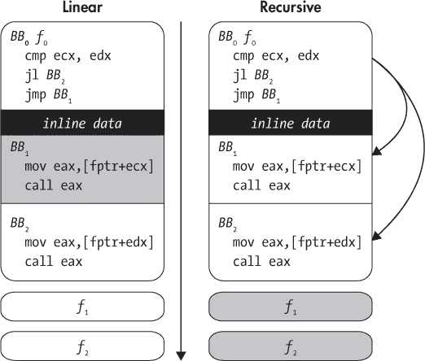

*图 6-1：线性拆解与递归拆解。箭头表示拆解流程，灰色块表示丢失或损坏的代码。*

#### *6.1.1 线性拆解*

让我们从线性反汇编开始，这种方法在概念上是最简单的。它遍历二进制文件中的所有代码段，按顺序解码所有字节，并将它们解析为指令列表。许多简单的反汇编器，包括第一章中的`objdump`，都采用这种方法。

使用线性反汇编的风险在于，并非所有字节都是指令。例如，一些编译器，如 Visual Studio，会将跳转表等数据与代码交织在一起，而没有留下任何关于数据所在位置的提示。如果反汇编器错误地将这些*内联数据*解析为代码，它们可能会遇到无效的操作码。更糟糕的是，这些数据字节可能巧合地对应于有效的操作码，导致反汇编器输出虚假的指令。在像 x86 这样密集的 ISA 上，这种情况尤为可能，因为大多数字节值都代表有效的操作码。

此外，对于具有可变长度操作码的指令集架构（ISA），例如 x86，内联数据甚至可能导致反汇编器与真实指令流不同步。尽管反汇编器通常会自我重新同步，但不同步可能导致内联数据后的前几条真实指令被遗漏，如图 6-2 所示。

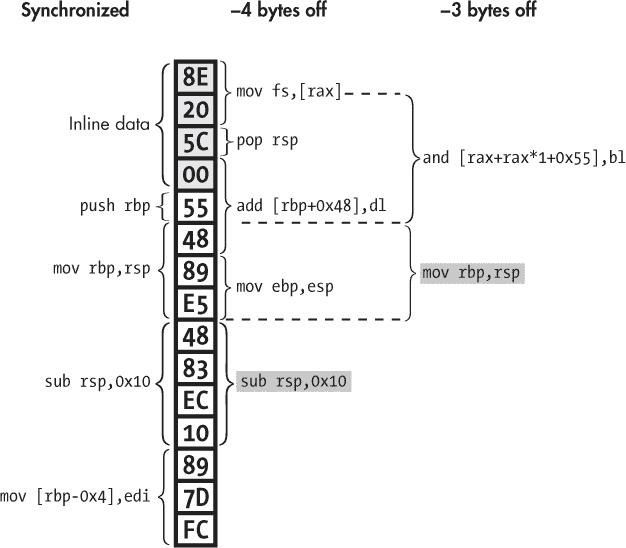

*图 6-2：由于将内联数据误解为代码，导致的反汇编不同步。反汇编重新同步的指令用灰色标示。*

该图示例展示了二进制代码段中的*反汇编不同步*问题。你可以看到一些内联数据字节（`0x8e 0x20 0x5c 0x00`），后面跟着一些指令（`push rbp`、`mov rbp,rsp`等）。正确解码所有字节的结果，假设是通过一个完全同步的反汇编器进行解码，显示在图的左侧，标注为“synchronized”。但是，一个简单的线性反汇编器会将内联数据错误地解释为代码，从而解码出图中显示的“−4 bytes off”字节。正如你所看到的，内联数据被解码为`mov fs,[rax]`指令，接着是`pop rsp`和`add [rbp+0x48],dl`指令。最后这一条指令尤其恶劣，因为它超出了内联数据区域，进入了实际的指令区！这样，`add`指令“吃掉”了一些真正的指令字节，导致反汇编器完全错过了前两条实际指令。如果反汇编器提早 3 个字节开始（“−3 bytes off”），它也会遇到类似的问题，这可能发生在反汇编器尝试跳过内联数据却没能识别出所有内联数据时。

幸运的是，在 x86 架构上，反汇编后的指令流通常会在几条指令后自动重新同步。但是，如果你进行任何自动化分析，或者基于反汇编的代码修改二进制文件，哪怕遗漏了几条指令也可能是个坏消息。正如你在第八章中看到的，恶意程序有时故意包含一些字节，旨在使反汇编器不同步，从而隐藏程序的真实行为。

在实际操作中，像`objdump`这样的线性反汇编器在反汇编使用最近版本编译器（如`gcc`或 LLVM 的`clang`）编译的 ELF 二进制文件时是安全的。这些编译器的 x86 版本通常不会生成内联数据。另一方面，Visual Studio *会*生成内联数据，因此在使用`objdump`查看 PE 二进制文件时，最好留意反汇编错误。在分析其他架构（如 ARM）上的 ELF 二进制文件时也是如此。如果你使用线性反汇编器分析恶意代码，那就完全无法预料了，因为它可能包含比内联数据更复杂的混淆技术！

#### *6.1.2 递归反汇编*

与线性反汇编不同，递归反汇编对控制流非常敏感。它从已知的二进制入口点（如主入口点和导出函数符号）开始，然后递归地跟踪控制流（如跳转和调用）以发现代码。这使得递归反汇编能够绕过几乎所有数据字节，除了极少数的特殊情况。^(1) 这种方法的缺点是，并非所有的控制流都容易跟踪。例如，静态地判断间接跳转或调用的目标往往是困难的，甚至是不可能的。因此，反汇编器可能会遗漏代码块（甚至整个函数，例如图 6-1 中的*f*[1]和*f*[2]），这些代码块可能是间接跳转或调用的目标，除非它使用特殊的（特定于编译器且容易出错的）启发式方法来解析控制流。

递归反汇编是许多逆向工程应用中的事实标准，例如恶意软件分析。IDA Pro（如图 6-3 所示）是最先进且广泛使用的递归反汇编工具之一。IDA Pro 是 *Interactive DisAssembler*（交互式反汇编器）的缩写，旨在交互使用，并提供许多用于代码可视化、代码探索、脚本编写（使用 Python）甚至反编译^(2)的功能，这些功能在简单的工具如`objdump`中是无法实现的。当然，它的价格也不便宜：在撰写时，IDA Starter（IDA Pro 的简化版）的许可证起价为$739，而完整的 IDA Professional 许可证则从$1,409 起。但不用担心——你不需要购买 IDA Pro 来使用本书。本书关注的不是交互式逆向工程，而是基于免费的框架创建你自己的自动化二进制分析工具。

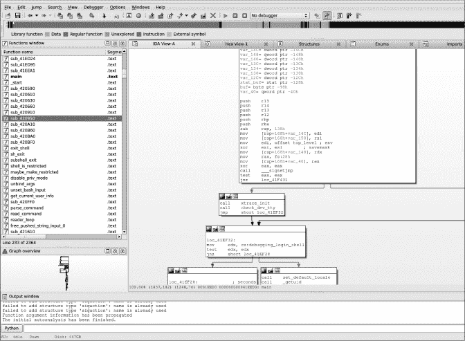

*图 6-3：IDA Pro 的图形视图*

图 6-4 展示了像 IDA Pro 这样的递归反汇编工具在实际应用中面临的一些挑战。具体来说，图中显示了如何将 `opensshd` v7.1p2 版本的一个简单函数通过 `gcc` v5.1.1 从 C 代码编译成 x64 代码。

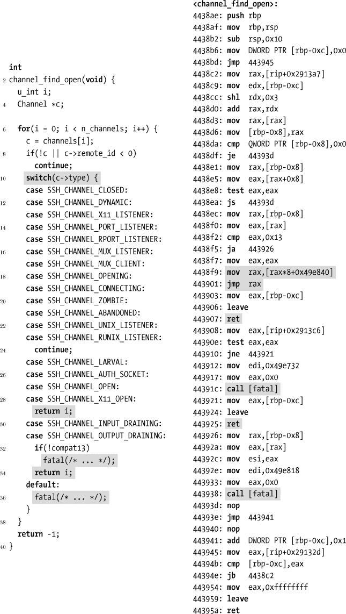

*图 6-4：反汇编后的 switch 语句示例（来自* `opensshd` *v7.1p2，使用* `gcc` *5.1.1 为 x64 编译，源代码经过编辑以简化）。有趣的行被阴影标出。*

如图左侧所示，展示了该函数的 C 语言表示，函数本身没有做什么特别的事情。它使用一个 `for` 循环遍历数组，在每次迭代中应用一个 `switch` 语句来确定如何处理当前的数组元素：跳过不感兴趣的元素，返回满足某些条件的元素的索引，或者如果发生了意外错误则打印错误并退出。尽管 C 语言代码很简单，但该函数的编译版本（图右侧所示）要正确反汇编并不简单。

如图 6-4 所示，switch 语句的 x64 实现基于一个 *跳转表*，这是现代编译器常见的构造。该跳转表实现避免了复杂的条件跳转链。相反，位于地址 `0x4438f9` 的指令利用 switch 输入值计算（存储在 `rax` 寄存器中）一个表的索引，表中存储着对应的 case 块的地址。通过这种方式，只有位于地址 `0x443901` 的单一间接跳转指令，才能将控制流传递到跳转表定义的任何 case 地址。

尽管跳转表高效，但它们使得递归反汇编变得更加困难，因为它们使用了 *间接控制流*。间接跳转指令中缺乏明确的目标地址，这使得反汇编器很难追踪到指令流的走向。因此，间接跳转可能会指向的任何指令都不会被发现，除非反汇编器实现了特定的（依赖于编译器的）启发式方法来发现和解析跳转表。^(3) 对于这个例子来说，这意味着一个没有实现 switch 检测启发式方法的递归反汇编工具根本无法发现地址 `0x443903`–`0x443925` 之间的指令。

情况变得更加复杂，因为 switch 中有多个 `ret` 指令，并且还调用了 `fatal` 函数，该函数抛出错误并且永远不返回。一般来说，不能假设 `ret` 指令或非返回的 `call` 后面一定有指令；实际上，这些指令后面可能跟着的是数据或填充字节，而这些内容并不打算被当作代码解析。然而，相反的假设（即这些指令后面没有更多的代码）可能会导致反汇编器遗漏指令，导致反汇编结果不完整。

这些只是递归反汇编器面临的一些挑战；更复杂的情况还很多，特别是在比示例中更复杂的函数中。正如你所看到的，线性反汇编和递归反汇编都不是完美的。对于良性 x86 ELF 二进制文件，线性反汇编是一个不错的选择，因为它能够提供既完整又准确的反汇编：这类二进制文件通常不包含会让反汇编器出错的内联数据，并且线性方法不会因为无法解析的间接控制流而漏掉代码。另一方面，如果涉及到内联数据或恶意代码，使用递归反汇编器可能是更好的选择，因为它不容易像线性反汇编器那样产生虚假的输出。

在需要确保反汇编正确性的情况下，即使以牺牲完整性为代价，也可以使用*动态反汇编*。让我们来看一下这种方法与刚才讨论的静态反汇编方法有何不同。

### 6.2 动态反汇编

在前面的章节中，你看到了静态反汇编器所面临的挑战，如区分数据和代码、解析间接调用等。动态分析解决了许多这些问题，因为它拥有丰富的运行时信息，例如具体的寄存器和内存内容。当执行到达特定地址时，你可以完全确信那里有一条指令，因此动态反汇编不会遇到静态反汇编中常见的不准确问题。这使得动态反汇编器，也叫做*执行追踪器*或*指令追踪器*，可以在程序执行时直接输出指令（以及可能的内存/寄存器内容）。这种方法的主要缺点是*代码覆盖问题*：即动态反汇编器只能看到它们执行的指令，而不是所有指令。我将在本节后面再讨论代码覆盖问题。首先，让我们来看一个具体的执行追踪示例。

#### *6.2.1 示例：使用 gdb 追踪二进制执行*

令人惊讶的是，Linux 上没有广泛接受的标准工具用于“即刻执行并忘记”追踪（与 Windows 不同，Windows 上有像 OllyDbg 这样优秀的工具^(4)）。使用仅标准工具的最简单方法是通过一些`gdb`命令，如清单 6-1 所示。

*清单 6-1：使用* gdb 进行动态反汇编

```
   $ gdb /bin/ls
   GNU gdb (Ubuntu 7.11.1-0ubuntu1~16.04) 7.11.1
   ...
   Reading symbols from /bin/ls...(no debugging symbols found)...done.
➊ (gdb) info files
   Symbols from "/bin/ls".
   Local exec file:
          `/bin/ls', file type elf64-x86-64.
➋        Entry point: 0x4049a0
          0x0000000000400238 - 0x0000000000400254 is .interp
          0x0000000000400254 - 0x0000000000400274 is .note.ABI-tag
          0x0000000000400274 - 0x0000000000400298 is .note.gnu.build-id
          0x0000000000400298 - 0x0000000000400358 is .gnu.hash
          0x0000000000400358 - 0x0000000000401030 is .dynsym
          0x0000000000401030 - 0x000000000040160c is .dynstr
          0x000000000040160c - 0x000000000040171e is .gnu.version
          0x0000000000401720 - 0x0000000000401790 is .gnu.version_r
          0x0000000000401790 - 0x0000000000401838 is .rela.dyn
          0x0000000000401838 - 0x00000000004022b8 is .rela.plt
          0x00000000004022b8 - 0x00000000004022d2 is .init
          0x00000000004022e0 - 0x00000000004029f0 is .plt
          0x00000000004029f0 - 0x00000000004029f8 is .plt.got
          0x0000000000402a00 - 0x0000000000413c89 is .text
          0x0000000000413c8c - 0x0000000000413c95 is .fini
          0x0000000000413ca0 - 0x000000000041a654 is .rodata
          0x000000000041a654 - 0x000000000041ae60 is .eh_frame_hdr
          0x000000000041ae60 - 0x000000000041dae4 is .eh_frame
          0x000000000061de00 - 0x000000000061de08 is .init_array
          0x000000000061de08 - 0x000000000061de10 is .fini_array
          0x000000000061de10 - 0x000000000061de18 is .jcr
          0x000000000061de18 - 0x000000000061dff8 is .dynamic
          0x000000000061dff8 - 0x000000000061e000 is .got
          0x000000000061e000 - 0x000000000061e398 is .got.plt
          0x000000000061e3a0 - 0x000000000061e600 is .data
          0x000000000061e600 - 0x000000000061f368 is .bss
➌ (gdb) b *0x4049a0
   Breakpoint 1 at 0x4049a0
➍ (gdb) set pagination off
➎ (gdb) set logging on
   Copying output to gdb.txt.
   (gdb) set logging redirect on
   Redirecting output to gdb.txt.
➏ (gdb) run
➐ (gdb) display/i $pc
➑ (gdb) while 1
➑ >si
   >end
   chapter1 chapter2 chapter3 chapter4 chapter5
   chapter6 chapter7 chapter8 chapter9 chapter10
   chapter11 chapter12 chapter13 inc
   (gdb)
```

本例将 */bin/ls* 加载到 `gdb` 中，并生成一个跟踪，记录在列出当前目录内容时执行的所有指令。启动 `gdb` 后，你可以列出加载到 `gdb` 中的文件信息（在本例中，只有可执行文件 */bin/ls*） ➊。这会告诉你该二进制文件的入口点地址 ➋，以便你可以在程序开始运行时设置一个断点来暂停执行 ➌。接着，你禁用分页 ➍ 并配置 `gdb` 将日志记录到文件中，而不是标准输出 ➎。默认情况下，日志文件名为 *gdb.txt*。分页意味着 `gdb` 在输出一定行数后会暂停，允许用户在继续之前阅读屏幕上的所有输出，默认情况下启用。由于你正在将日志记录到文件，因此不希望出现这些暂停，否则你会不得不不断按键才能继续，快速变得很烦人。

设置好一切后，你运行二进制文件 ➏。它会立即暂停，一旦入口点被触及。此时你可以告诉 `gdb` 将这条第一条指令记录到文件中 ➐，然后进入一个 `while` 循环 ➑，不断执行单条指令 ➒（这称为 *单步执行*），直到没有更多的指令可以执行为止。每一条单步执行的指令都会自动以与之前相同的格式打印到日志文件中。执行完成后，你将得到一个包含所有执行指令的日志文件。正如你所料，输出相当冗长；即使是简单运行一个小程序，也会遍历数十万甚至更多的指令，如 清单 6-2 所示。

*清单 6-2：使用* gdb *进行动态反汇编后的输出*

```
➊ $ wc -l gdb.txt
   614390 gdb.txt
➋ $ head -n 20 gdb.txt
   Starting program: /bin/ls
   [Thread debugging using libthread_db enabled]
   Using host libthread_db library "/lib/x86_64-linux-gnu/libthread_db.so.1".

   Breakpoint 1, 0x00000000004049a0 in ?? ()
➌ 1: x/i $pc
   => 0x4049a0:          xor     %ebp,%ebp
   0x00000000004049a2   in ?? ()
   1: x/i $pc
   => 0x4049a2:          mov     %rdx,%r9
   0x00000000004049a5   in ?? ()
   1: x/i $pc
   => 0x4049a5:          pop     %rsi
   0x00000000004049a6   in ?? ()
   1: x/i $pc
   => 0x4049a6:          mov     %rsp,%rdx
   0x00000000004049a9   in ?? ()
   1: x/i $pc
   => 0x4049a9:          and     $0xfffffffffffffff0,%rsp
   0x00000000004049ad   in ?? ()
```

使用 `wc` 来计算日志文件中的行数，你会发现该文件包含 614,390 行，远远超过这里能列出的数量 ➊。为了给你一个输出的概念，你可以使用 `head` 查看日志文件的前 20 行 ➋。实际的执行跟踪从 ➌ 开始。对于每条执行的指令，`gdb` 会打印用于记录该指令的命令，然后是指令本身，最后是指令位置的相关信息（由于二进制文件已被剥离，因此位置未知）。使用 `grep`，你可以过滤掉除显示已执行指令的行外的所有内容，因为它们才是你关心的，从而得到如下所示的输出，详见 清单 6-3。

*清单 6-3：使用* gdb *进行动态反汇编后的过滤输出*

```
$ egrep '^=> 0x[0-9a-f]+:' gdb.txt | head -n 20
=> 0x4049a0:        xor    %ebp,%ebp
=> 0x4049a2:        mov    %rdx,%r9
=> 0x4049a5:        pop    %rsi
=> 0x4049a6:        mov    %rsp,%rdx
=> 0x4049a9:        and    $0xfffffffffffffff0,%rsp
=> 0x4049ad:        push   %rax
=> 0x4049ae:        push   %rsp
=> 0x4049af:        mov    $0x413c50,%r8
=> 0x4049b6:        mov    $0x413be0,%rcx
=> 0x4049bd:        mov    $0x402a00,%rdi
=> 0x4049c4:        callq  0x402640 <__libc_start_main@plt>
=> 0x4022e0:        pushq  0x21bd22(%rip)         # 0x61e008
=> 0x4022e6:        jmpq   *0x21bd24(%rip)        # 0x61e010
=> 0x413be0:        push   %r15
=> 0x413be2:        push   %r14
=> 0x413be4:        mov    %edi,%r15d
=> 0x413be7:        push   %r13
=> 0x413be9:        push   %r12
=> 0x413beb:        lea    0x20a20e(%rip),%r12   # 0x61de00
=> 0x413bf2:        push   %rbp
```

如你所见，这比未经过滤的 `gdb` 日志要更易读。

#### *6.2.2 代码覆盖策略*

所有动态分析的主要缺点（不仅仅是动态反汇编）是代码覆盖率问题：分析只会看到分析过程中实际执行的指令。因此，如果任何关键的信息隐藏在其他指令中，分析将永远无法得知。例如，如果你正在动态分析一个包含逻辑炸弹的程序（例如，在未来某个时间触发恶意行为），你永远不会发现，直到为时已晚。相反，通过静态分析的仔细检查可能会揭示这一点。再举一个例子，在动态测试软件时，如果有一个代码路径很少执行，你无法保证自己是否遗漏了在测试中未覆盖的 bug。

许多恶意软件样本甚至会主动躲避动态分析工具或调试器，如 `gdb`。几乎所有这类工具都会在环境中产生某种可检测的痕迹；即使没有其他表现，分析过程通常会导致执行速度变慢，通常慢到足以被检测到。恶意软件会检测到这些痕迹，并在知道自己正在被分析时隐藏其真实行为。为了在这些样本上启用动态分析，你必须对恶意软件进行逆向工程，然后禁用其反分析检查（例如，通过用修补后的值覆盖那些代码字节）。这些反分析技巧就是为什么，如果可能的话，通常建议至少用静态分析方法来增强你的动态恶意软件分析的原因。

由于找到正确的输入以覆盖每一个可能的程序路径是困难且耗时的，动态反汇编几乎永远无法揭示所有可能的程序行为。你可以使用几种方法来提高动态分析工具的覆盖率，尽管通常这些方法都无法达到静态分析所提供的完整性。让我们来看看一些最常用的方法。

### 测试套件

提高代码覆盖率最简单且最常见的方法之一是使用已知的测试输入运行被分析的二进制文件。软件开发人员通常会手动为他们的程序开发测试套件，设计输入来覆盖尽可能多的程序功能。这类测试套件非常适合动态分析。为了实现良好的代码覆盖率，只需使用每个测试输入对程序进行分析。当然，这种方法的缺点是，并非总能获得现成的测试套件，例如专有软件或恶意软件就可能没有现成的测试套件。

使用测试套件来实现代码覆盖率的具体方式因应用程序而异，这取决于应用程序的测试套件结构。通常，有一个特殊的 Makefile `test` 目标，你可以通过在命令行输入 `make test` 来运行测试套件。在 Makefile 内，`test` 目标通常是像清单 6-4 那样结构化的。

*清单 6-4：Makefile* 测试 *目标* 结构

```
PROGRAM := foo

test: test1 test2 test3 # ...

test1:
        $(PROGRAM) < input > output
        diff correct output

# ...
```

`PROGRAM`变量包含正在测试的应用程序的名称，在本例中为`foo`。`test`目标依赖于多个测试用例（`test1`、`test2`等），每个测试用例在你运行`make test`时都会被调用。每个测试用例包括在某些输入上运行`PROGRAM`、记录输出，然后使用`diff`与正确输出进行比较。

实现这种类型的测试框架有许多不同（且更简洁）的方法，但关键点是你可以通过简单地覆盖`PROGRAM`变量，在每个测试用例上运行动态分析工具。例如，假设你想用`gdb`运行每个`foo`的测试用例。（实际上，你可能不会用`gdb`，而是使用完全自动化的动态分析工具，如何构建这种工具你将在第九章中学习。）你可以按照如下方式进行：

```
make test PROGRAM="gdb foo"
```

本质上，这重新定义了`PROGRAM`，使得你不再只是对每个测试运行`foo`，而是将`foo`*在* *gdb*中运行。这样，`gdb`或你正在使用的任何动态分析工具会在每个测试用例上运行`foo`，允许动态分析覆盖所有测试用例所涵盖的`foo`代码。在没有`PROGRAM`变量可供覆盖的情况下，你需要进行搜索和替换，但思想保持不变。

### 模糊测试

还有一些被称为*模糊测试器*的工具，它们试图自动生成输入，以覆盖给定二进制文件中的新代码路径。著名的模糊测试器包括 AFL、微软的 Project Springfield 和谷歌的 OSS-Fuzz。广义上讲，模糊测试器根据生成输入的方式可分为两类。

1.  基于生成的模糊测试器：这些模糊测试器从头开始生成输入（可能了解预期的输入格式）。

1.  基于变异的模糊测试器：这些模糊测试器通过某种方式变异已知的有效输入来生成新的输入，例如，从现有的测试套件开始。

模糊测试器的成功与性能在很大程度上依赖于可用的信息。例如，如果有源代码信息可用，或者已知程序的预期输入格式，那会非常有帮助。如果这些都不知道（即使知道了），模糊测试可能需要大量的计算时间，且可能无法覆盖被复杂`if`/`else`条件所隐藏的代码路径，而这些条件是模糊测试器无法“猜测”的。模糊测试器通常用于搜索程序中的漏洞，改变输入直到检测到崩溃。

虽然我在本书中不会详细讲解模糊测试，但我鼓励你尝试使用一些免费的工具。每个模糊测试器都有其独特的使用方法。一个很好的实验选择是 AFL，它是免费的，并且有很好的在线文档。^(5) 此外，在第十章中，我将讨论如何使用动态污点分析来增强模糊测试。

### 符号执行

符号执行是一种高级技术，我将在第十二章和第十三章中详细讨论。这是一项广泛的技术，具有多种应用，而不仅仅是代码覆盖。在这里，我只是大致介绍符号执行如何应用于代码覆盖，省略了许多细节，所以如果你暂时跟不上，也不用担心。

通常，当你执行一个应用程序时，你会使用所有变量的具体值。在执行的每个时刻，每个 CPU 寄存器和内存区域都包含某个特定值，并且这些值会随着应用程序的计算过程而不断变化。而符号执行则不同。

简而言之，符号执行允许你用*符号值*而不是*具体值*来执行一个应用程序。你可以将符号值视为数学符号。符号执行本质上是对程序的模拟，其中所有或部分变量（或寄存器和内存状态）都通过这些符号来表示。^(6)为了更清楚地理解这意味着什么，请考虑 Listing 6-5 中显示的伪代码程序。

*Listing 6-5：伪代码示例，用于说明符号执行*

```
➊ x = int(argv[0])
   y = int(argv[1])

➋ z = x + y
➌ if(x < 5)
       foo(x, y, z)
➍ else
       bar(x, y, z)
```

程序从接受两个命令行参数开始，将它们转换为数字，并存储在两个变量`x`和`y`中 ➊。在符号执行的开始，你可能会将`x`变量定义为包含符号值*α*[1]，而`y`可能初始化为*α*[2]。*α*[1]和*α*[2]*都是可以表示任何可能数值的符号。然后，随着模拟的进行，程序实际上会计算这些符号的公式。例如，操作`z = x + y`使得`z`的符号表达式变为*α*[1] + *α*[2] ➋。

与此同时，符号执行还计算了*路径约束*，这只是对符号可能取值的限制，考虑到到目前为止已遍历的分支。例如，如果分支`if(x < 5)`被执行，则符号执行会添加一个路径约束，表示*α*[1] < 5 ➌。这个约束表示，如果执行了`if`分支，那么*α*[1]（`x`中的符号值）必须始终小于 5，否则该分支就不会被执行。对于每个分支，符号执行会相应地扩展路径约束列表。

这一切如何与代码覆盖率相关？关键点是，*给定路径约束列表，你可以检查是否存在任何具体输入能够满足所有这些约束。*有一些特殊的程序，叫做 *约束求解器*，它们可以在给定约束列表的情况下检查是否有办法满足这些约束。例如，如果唯一的约束是 *α*[1] < 5，求解器可能会给出解 *α*[1] = 4 ^ *α*[2] = 0。请注意，路径约束并未提及 *α*[2]，因此它可以取任何值。这意味着，在程序的具体执行开始时，你可以（通过用户输入）将 `x` 的值设置为 4，将 `y` 的值设置为 0，然后执行将走在符号执行中走过的相同分支。如果没有解，求解器会通知你。

现在，为了增加代码覆盖率，你可以更改路径约束，并询问求解器是否有任何方法满足更改后的约束。例如，你可以将约束 *α*[1] < 5 改为 *α*[1] ≥ *α*[5]，并询问求解器是否有解。求解器会告知你一个可能的解，如 *α*[1] = 5 ^ *α*[2] = 0，你可以将这个解作为输入用于程序的具体执行，从而强制该执行走 `else` 分支，进而增加代码覆盖率 ➍。如果求解器告知你没有可能的解，那就意味着无法“翻转”该分支，你应继续通过更改其他路径约束来寻找新路径。

正如你从前面的讨论中可能已经了解到的，符号执行（甚至仅仅是其在代码覆盖率中的应用）是一个复杂的主题。即便具备了“翻转”路径约束的能力，仍然无法覆盖所有程序路径，因为可能的路径数量随着程序中的分支指令数量的增加而呈指数级增长。此外，求解路径约束集合在计算上是非常密集的；如果不小心，符号执行方法很容易变得不可扩展。实际上，应用符号执行时需要非常小心，以确保其可扩展性和有效性。到目前为止，我仅概述了符号执行背后的核心思想，但理想情况下，它已经让你对第十二章和第十三章有所了解。

### 6.3 结构化反汇编代码和数据

到目前为止，我已经向你展示了静态和动态反汇编器如何在二进制文件中找到指令，但反汇编并不止于此。大量没有结构的反汇编指令几乎无法进行分析，因此大多数反汇编器会以某种方式将反汇编的代码结构化，使其更容易分析。在本节中，我将讨论反汇编器恢复的常见代码和数据结构，以及它们如何帮助二进制分析。

#### *6.3.1 结构化代码*

首先，让我们来看看反汇编代码的各种结构方式。广义上讲，我将展示的代码结构可以通过两种方式让代码分析变得更加容易。

+   划分功能区：通过将代码划分为逻辑上连接的块，分析每个块的功能以及代码块之间的关系变得更加容易。

+   显示控制流：我接下来要讨论的一些代码结构不仅显式地表示代码本身，还表示代码块之间的控制转移。这些结构可以以可视化的方式呈现，使得更容易快速看出控制如何在代码中流动，并快速了解代码的功能。

以下代码结构在自动化和手动分析中都非常有用。

### 函数

在大多数高级编程语言（包括 C、C++、Java、Python 等）中，函数是将逻辑上相关的代码块组织在一起的基本构建块。正如任何程序员都知道的那样，结构良好并正确划分为函数的程序，比那些结构不良、充满“意大利面条代码”的程序更容易理解。因此，大多数反汇编工具会尽力恢复原始程序的函数结构，并利用它将反汇编指令按函数分组。这被称为*函数检测*。函数检测不仅使得代码对人工逆向工程师更易于理解，而且对自动化分析也很有帮助。例如，在自动化二进制分析中，你可能希望按函数级别搜索漏洞，或修改代码，使得每个函数的开始和结束处进行特定的安全检查。

对于包含符号信息的二进制文件，函数检测非常简单；符号表指定了函数集合，并列出了它们的名称、起始地址和大小。不幸的是，正如你在第一章中可能记得的那样，许多二进制文件会去除这些信息，这使得函数检测变得更加具有挑战性。源代码级别的函数在二进制级别没有实际意义，因此它们的边界在编译过程中可能会变得模糊。属于某个特定函数的代码甚至可能在二进制文件中不按顺序排列。函数的各个部分可能分散在代码区段中，甚至有些代码块可能会在多个函数之间共享（这称为*重叠代码块*）。实际上，大多数反汇编工具假设函数是连续的，并且代码不会共享，这在许多情况下是成立的，但并非所有情况都如此。如果你分析的是固件或嵌入式系统代码，这种假设尤其不成立。

反汇编器用于函数检测的主要策略是基于*函数签名*，即在函数的开始或结束时常用的指令模式。这一策略在所有知名的递归反汇编器中都有使用，包括 IDA Pro。像`objdump`这样的线性反汇编器通常不进行函数检测，除非有符号可用。

通常，基于签名的函数检测算法从通过反汇编的二进制文件开始，定位由`call`指令直接调用的函数。这些情况对于反汇编器来说比较容易找到；而仅通过间接调用或尾调用的函数则更具挑战性。^(7) 为了找到这些具有挑战性的情况，基于签名的函数检测器会查询已知函数签名的数据库。

函数签名模式包括众所周知的*函数序言*（用于设置函数堆栈帧的指令）和*函数尾声*（用于拆除堆栈帧的指令）。例如，许多 x86 编译器生成的未优化函数的典型模式以序言`push ebp; mov ebp,esp`开始，并以尾声`leave; ret`结束。许多函数检测器扫描二进制文件，寻找这样的签名，并用它们来识别函数的起始和结束位置。

尽管函数是构建反汇编代码的一个重要且有用的方式，但你应该始终警惕错误。在实践中，函数模式会根据平台、编译器和用来创建二进制文件的优化级别而有所不同。经过优化的函数可能完全没有众所周知的函数序言或尾声，因此无法通过基于签名的方法进行识别。因此，函数检测错误相当常见。例如，反汇编器将函数起始地址错误标记 20％或更多，甚至报告一个根本不存在的函数也并不罕见。

最近的研究探索了不同的函数检测方法，这些方法不依赖于签名，而是基于代码的结构。^(8) 尽管这种方法可能比基于签名的方法更准确，但检测错误依然是不可避免的。这一方法已被集成到 Binary Ninja 中，研究原型工具也可以与 IDA Pro 互操作，如果你有兴趣，可以尝试一下。

### 使用.eh_frame 节进行函数检测

一种有趣的替代方法是基于`.eh_frame`部分进行函数检测，这可以完全绕过函数检测问题。`.eh_frame`部分包含与基于 DWARF 的调试功能（如栈展开）相关的信息。这包括标识二进制文件中所有函数的函数边界信息。即使是剥离的二进制文件也会包含这些信息，除非该二进制文件是使用`gcc`的`-fno-asynchronous-unwind-tables`标志编译的。它主要用于 C++异常处理，但也用于其他各种应用，如`backtrace()`以及`gcc`的内建函数，如`__attribute__((__cleanup__(f)))`和`__builtin_return_address(n)`。由于它的多种用途，`.eh_frame`默认存在于所有由`gcc`生成的二进制文件中，不仅仅是使用异常处理的 C++二进制文件，还包括普通的 C 二进制文件。

据我所知，这种方法最早是由 Ryan O’Neill（别名 ElfMaster）描述的。在他的网站上，他提供了将`.eh_frame`部分解析为一组函数地址和大小的代码。^(a)

a. [`www.bitlackeys.org/projects/eh_frame.tgz`](http://www.bitlackeys.org/projects/eh_frame.tgz)

### 控制流图（CFG）

将反汇编的代码拆分为函数是一回事，但有些函数相当庞大，这意味着分析一个函数可能是一个复杂的任务。为了组织每个函数的内部结构，反汇编器和二进制分析框架使用另一种代码结构，称为*控制流图（CFG）*。控制流图对于自动化分析以及手动分析都非常有用。它们还提供了一种便捷的图形化表示代码结构的方式，可以让你一眼就能了解函数的结构。图 6-5 展示了一个通过 IDA Pro 反汇编的函数的 CFG 示例。

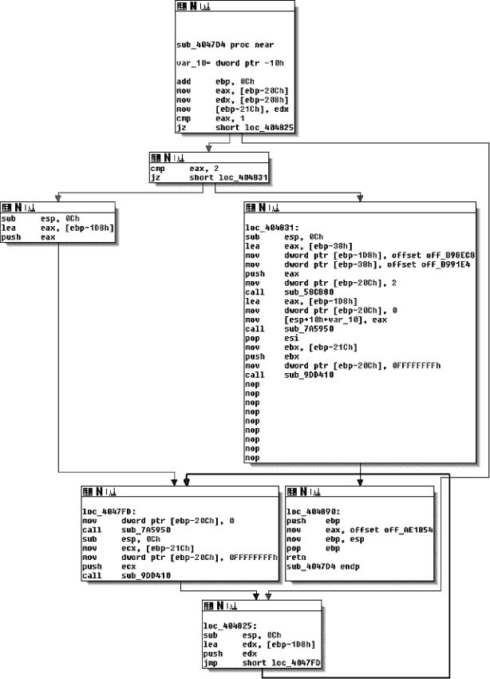

*图 6-5：在 IDA Pro 中看到的 CFG*

如图所示，控制流图（CFG）将函数内的代码表示为一组代码块，称为*基本块*，通过*分支边*连接，这里用箭头表示。基本块是一系列指令，其中第一条指令是唯一的入口点（即任何跳转指令所指向的指令），而最后一条指令是唯一的出口点（即该序列中唯一可能跳转到另一个基本块的指令）。换句话说，你永远不会看到一个基本块有箭头连接到第一条或最后一条以外的指令。

在 CFG 中，从基本块*B*到另一个基本块*C*的边，表示*B*中的最后一条指令可能跳转到*C*的起始位置。如果*B*只有一条出边，那么这意味着它一定会将控制转移到该边的目标。例如，这就是间接跳转或调用指令的情况。另一方面，如果*B*以条件跳转结束，那么它会有两条出边，运行时选择哪条边取决于跳转条件的结果。

调用边不属于 CFG 的一部分，因为它们指向函数外的代码。相反，CFG 仅显示指向函数调用完成后控制将返回的指令的“顺序执行”边。还有一种代码结构，称为*调用图*，它专门用于表示调用指令和函数之间的边。我将在接下来的内容中讨论调用图。

实际上，反汇编工具通常会省略 CFG 中的间接边，因为静态分析时很难解析这些边的潜在目标。反汇编工具有时还会定义一个全局的 CFG，而不是每个函数的 CFG。这样的全局 CFG 被称为*过程间 CFG（ICFG）*，因为它本质上是所有每个函数的 CFG 的并集（*过程*是函数的另一种说法）。ICFG 避免了易出错的函数检测，但没有每个函数 CFG 的封装性优势。

### 调用图

*调用图*与控制流图（CFG）类似，区别在于它显示的是调用位置和函数之间的关系，而不是基本块之间的关系。换句话说，CFG 展示的是函数内部控制流的走向，而调用图则展示哪些函数可能相互调用。与 CFG 一样，调用图通常会省略间接调用边，因为准确判断某个间接调用位置可能会调用哪些函数是不可行的。

图 6-6 的左侧展示了一组函数（标记为*f*[1]到*f*[4]）及它们之间的调用关系。每个函数由若干个基本块（灰色圆圈）和分支边（箭头）组成。对应的调用图位于图的右侧。如图所示，调用图包含了每个函数的节点，并且有边显示函数*f*[1]可以调用*f*[2]*和*f*[3]*，还有一条表示从*f*[3]到*f*[1]*的调用边。尾调用实际上是作为跳转指令实现的，在调用图中显示为常规调用。然而，请注意，从*f*[2]到*f*[4]*的间接调用在调用图中*没有*显示。

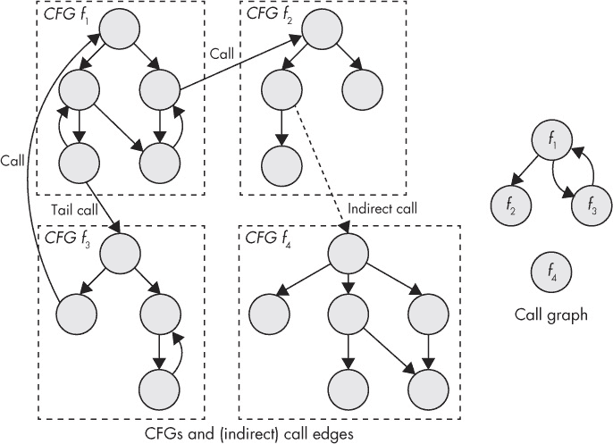

*图 6-6：控制流图（左）和函数间连接（右）以及相应的调用图*

IDA Pro 还可以显示部分调用图，显示你选择的特定函数的潜在调用者。对于手动分析而言，这些通常比完整的调用图更有用，因为完整的调用图通常包含过多的信息。图 6-7 显示了 IDA Pro 中一个部分调用图的示例，揭示了对函数 `sub_404610` 的引用。正如你所看到的，图中显示了函数的调用位置；例如，`sub_404610` 被 `sub_4e1bd0` 调用，而 `sub_4e1bd0` 又被 `sub_4e2fa0` 调用。

此外，IDA Pro 生成的调用图还显示了存储函数地址的指令。例如，在 `.text` 段的地址 `0x4e072c` 处，有一条指令将函数 `sub_4e2fa0` 的地址存储到内存中。这称为“获取函数” `sub_4e2fa0` 的地址。任何在代码中被引用地址的函数都称为 *地址引用函数*。

了解哪些函数的地址被引用是很有用的，因为这表明它们可能会被间接调用，即使你不确切知道是通过哪个调用位置。如果一个函数的地址从未被引用，也没有出现在任何数据段中，你就知道它永远不会被间接调用。^(9) 这对于某些类型的二进制分析或安全应用很有帮助，例如，当你试图通过限制间接调用只允许合法目标来保护二进制文件时。

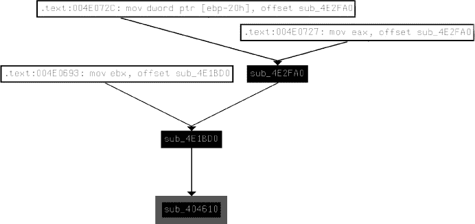

*图 6-7：一个调用图，显示了指向函数* `sub_404610`* 的调用，来自 IDA Pro*

### 面向对象代码

你会发现许多二进制分析工具，包括像 IDA Pro 这样的全功能反汇编器，主要面向用 *过程语言*（如 C）编写的程序。因为这些语言中的代码主要通过使用函数来结构化，二进制分析工具和反汇编器提供了如函数检测等功能，用于恢复程序的函数结构，并通过调用图来检查函数之间的关系。

面向对象语言，如 C++，通过使用 *类* 来构造代码，这些类将逻辑上相关的函数和数据组织在一起。它们通常还提供复杂的异常处理功能，允许任何指令抛出异常，之后会被一个特殊的代码块捕获并处理。不幸的是，当前的二进制分析工具缺乏恢复类层次结构和异常处理结构的能力。

更糟糕的是，C++ 程序通常包含大量的函数指针，因为虚拟方法的实现方式。*虚拟方法* 是允许在派生类中重写的类方法（函数）。在一个经典示例中，你可能会定义一个名为 `Shape` 的类，它有一个名为 `Circle` 的派生类。`Shape` 定义了一个虚拟方法 `area`，用于计算形状的面积，而 `Circle` 则重写了这个方法，提供适用于圆形的实现。

在编译 C++ 程序时，编译器可能不知道指针在运行时会指向一个基类`Shape`对象还是一个派生类`Circle`对象，因此无法静态地确定运行时应该使用哪个`area`方法的实现。为了解决这个问题，编译器会生成一个包含函数指针的表，称为*vtables*，其中包含指向特定类的所有虚函数的指针。Vtables 通常保存在只读内存中，每个多态对象都有一个指向其类型 vtable 的指针（称为*vptr*）。要调用虚方法，编译器会生成代码，在运行时跟踪对象的 vptr，并间接调用 vtable 中的正确条目。不幸的是，所有这些间接调用使得程序的控制流更加难以追踪。

二进制分析工具和反汇编工具不支持面向对象程序意味着，如果你想围绕类层次结构来组织分析，你就只能依靠自己了。在手动反向工程 C**++** 程序时，你通常可以将属于不同类的函数和数据结构拼凑在一起，但这需要大量的工作。为了保持我们对（半）自动化二进制分析技术的关注，我在这里不会详细讨论这个主题。如果你有兴趣学习如何手动反向工程 C++ 代码，我推荐 Eldad Eilam 的书《Reversing: Secrets of Reverse Engineering》（Wiley，2005 年）。

在自动化分析的情况下，你可以（就像大多数二进制分析工具一样）简单地假装类不存在，将面向对象程序与过程化程序一样对待。事实上，这种“解决方案”对于许多分析工作来说足够有效，并且可以让你避免实现特殊的 C++ 支持，除非真的需要。

#### *6.3.2 数据结构化*

正如你所看到的，反汇编工具可以自动识别各种代码结构，以帮助你进行二进制分析。不幸的是，数据结构就不能这么简单了。在精简的二进制文件中自动检测数据结构是一个公认的难题，除了某些研究工作^(10)，反汇编工具通常甚至不尝试处理。

但也有一些例外。例如，如果将数据对象的引用传递给一个著名的函数，如库函数，像 IDA Pro 这样的反汇编工具可以根据库函数的规范自动推断数据类型。图 6-8 展示了一个例子。

在基本块的底部，调用了著名的`send`函数，用于通过网络发送消息。由于 IDA Pro 知道`send`函数的参数，它可以标记参数名称（`flags`、`len`、`buf`、`s`），并推断出用于加载参数的寄存器和内存对象的数据类型。

此外，原始类型有时可以通过它们存储的寄存器或用于操作数据的指令来推断。例如，如果你看到使用浮点寄存器或浮点指令，你就知道相关数据是浮点数。如果你看到`lodsb`（*加载字符串字节*）或`stosb`（*存储字符串字节*）指令，很可能是在操作字符串。

对于复合类型，如`struct`类型或数组，所有的推测都不再适用，你必须依赖自己的分析。为了说明为什么自动识别复合类型困难，看看以下 C 代码如何编译成机器码：

```
ccf->user = pwd->pw_uid;
```

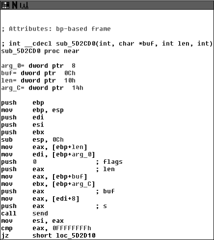

*图 6-8：IDA Pro 根据使用的*`send`*函数自动推断数据类型。*

这是`nginx` v1.8.0 源代码中的一行，其中一个`struct`中的整数字段被赋值到另一个`struct`中的字段。当使用`gcc` v5.1 并在优化级别`-O2`下编译时，生成以下机器码：

```
mov eax,DWORD PTR [rax+0x10]
mov DWORD PTR [rbx+0x60],eax
```

现在让我们看看以下 C 代码，它将一个整数从一个名为`b`的堆分配数组复制到另一个数组`a`中：

```
a[24] = b[4];
```

这是使用`gcc` v5.1 并在优化级别`-O2`下编译的结果：

```
mov eax,DWORD PTR [rsi+0x10]
mov DWORD PTR [rdi+0x60],eax
```

如你所见，代码模式与`struct`赋值完全相同！这表明，没有任何自动化分析方法能够从这样的指令序列中判断它们是表示数组查找、`struct`访问，还是完全不同的操作。像这样的问题使得准确检测复合数据类型变得困难，在一般情况下甚至是不可能的。请记住，这个例子非常简单；想象一下，反向工程一个包含`struct`类型数组或嵌套`struct`的程序，并试图弄清楚哪些指令是对哪个数据结构进行索引！显然，这是一个复杂的任务，需要对代码进行深入分析。鉴于准确识别复杂数据类型的复杂性，你可以理解为什么反汇编工具不会尝试自动检测数据结构。

为了方便手动构造数据，IDA Pro 允许你定义自己的复合类型（你必须通过反向工程代码来推断这些类型），并将它们分配给数据项。Chris Eagle 的*《IDA Pro 书》*（No Starch Press, 2011）是一本非常好的手动反向工程数据结构的资源。

#### *6.3.3 反编译*

正如名称所示，*反编译器*是尝试“逆向编译过程”的工具。它们通常从反汇编代码开始，并将其翻译成更高层次的语言，通常是一种类似 C 的伪代码形式。在逆向大型程序时，反编译器非常有用，因为反编译的代码比大量的汇编指令更易于阅读。但由于反编译过程容易出错，反编译器只能用于手动逆向，无法作为任何自动化分析的可靠基础。尽管在本书中你不会使用反编译，但我们还是来看看清单 6-6，让你对反编译的代码有个大致的了解。

最广泛使用的反编译器是 Hex-Rays，它是 IDA Pro 的一个插件。^(11) 清单 6-6 显示了 Hex-Rays 输出的函数，展示了前面图 6-5 中显示的内容。

*清单 6-6：使用 Hex-Rays 反编译的函数*

```
➊ void **__usercall sub_4047D4<eax>(int a1<ebp>)
   {
➋    int   v1; // eax@1
      int   v2; // ebp@1
      int   v3; // ecx@4
      int   v5; // ST10_4@6
      int   i; // [sp+0h] [bp-10h]@3

➌    v2 = a1 + 12;
      v1 = *(_DWORD *)(v2 - 524);
      *(_DWORD *)(v2 - 540) = *(_DWORD *)(v2 - 520);
➍     if ( v1 == 1 )
         goto LABEL_5;
       if ( v1 != 2 )
       {
➎      for ( i = v2 - 472; ; i = v2 - 472 )
       {
         *(_DWORD *)(v2 - 524) = 0;
➏       sub_7A5950(i);
         v3 = *(_DWORD *)(v2 - 540);
         *(_DWORD *)(v2 - 524) = -1;
         sub_9DD410(v3);
   LABEL_5:
          ;
        }
     }
     *(_DWORD *)(v2 - 472) = &off_B98EC8;
     *(_DWORD *)(v2 - 56) = off_B991E4;
     *(_DWORD *)(v2 - 524) = 2;
     sub_58CB80(v2 - 56);
     *(_DWORD *)(v2 - 524) = 0;
     sub_7A5950(v2 - 472);
     v5 = *(_DWORD *)(v2 - 540);
     *(_DWORD *)(v2 - 524) = -1;
     sub_9DD410(v5);
➐   return &off_AE1854;
   }
```

正如你在清单中看到的，反编译的代码比原始汇编代码更易于阅读。反编译器推测了函数的签名 ➊ 和局部变量 ➋。此外，算术和逻辑运算使用 C 的常规运算符 ➌ 表达，而不是汇编助记符。反编译器还尝试重建控制流结构，例如 `if`/`else` 分支 ➍，循环 ➎ 和函数调用 ➏。还有一个 C 风格的返回语句，使得更容易看到函数的最终结果 ➐。

尽管这些工具非常有用，但请记住，反编译不过是帮助你理解程序正在做什么的工具。反编译的代码与原始的 C 源代码差距很大，可能会显式地失败，并且会受到底层反汇编和反编译过程本身不准确的影响。这就是为什么通常不建议在反编译的基础上进行更高级的分析。

#### *6.3.4 中间表示*

像 x86 和 ARM 这样的指令集包含了许多具有复杂语义的不同指令。例如，在 x86 上，即使是看似简单的指令，如 `add`，也会产生副作用，例如设置 `eflags` 寄存器中的状态标志。指令和副作用的数量庞大，使得自动推理二进制程序变得困难。例如，正如你将在第十章到第十三章中看到的那样，动态污点分析和符号执行引擎必须实现显式的处理程序，以捕捉它们分析的所有指令的数据流语义。准确实现这些处理程序是一个艰巨的任务。

*中间表示（IR）*，也称为*中间语言*，旨在消除这一负担。IR 是一种简单的语言，作为 x86 和 ARM 等低级机器语言的抽象。常见的 IR 包括*逆向工程中间语言（REIL）*和*VEX IR*（用于*valgrind*插桩框架的 IR^(12))。甚至有一个叫做*McSema*的工具，它将二进制文件转换为*LLVM 位代码*（也称为*LLVM IR*）。^(13)

IR 语言的概念是自动将实际的机器代码（如 x86 代码）转换为 IR，这个 IR 捕获了所有机器代码的语义，但更易于分析。作为对比，REIL 只有 17 条不同的指令，而 x86 有数百条指令。此外，像 REIL、VEX 和 LLVM IR 这样的语言明确表达所有操作，没有模糊的指令副作用。

从低级机器代码到 IR 代码的转换步骤仍然是一个繁重的工作，但一旦完成这项工作，就更容易在转换后的代码上实现新的二进制分析。与其为每个二进制分析编写特定的指令处理程序，使用 IR 时，你只需进行一次翻译步骤的实现即可。此外，你还可以为多个 ISA（如 x86、ARM 和 MIPS）编写翻译器，并将它们全部映射到相同的 IR。这样，任何支持该 IR 的二进制分析工具将自动继承 IR 支持的所有 ISA。

将像 x86 这样复杂的指令集转换为像 REIL、VEX 或 LLVM IR 这样简单语言的权衡是，IR 语言远不如原始指令集简洁。这是因为在用有限数量的简单指令表达复杂操作（包括所有副作用）时，必然的结果。这通常对于自动化分析没有问题，但却往往使得中间表示对于人类来说难以阅读。为了让你了解 IR 是什么样子的，可以看看 Listing 6-7，它展示了 x86-64 指令`add rax,rdx`如何转换为 VEX IR。^(14)

*Listing 6-7: 将 x86-64 指令* add rax,rdx *转换为 VEX IR*

```
➊ IRSB {
➋    t0:Ity_I64 t1:Ity_I64 t2:Ity_I64 t3:Ity_I64
➌    00   |   ------ IMark(0x40339f, 3, 0) ------
➍    01   |   t2 = GET:I64(rax)
      02   |   t1 = GET:I64(rdx)
➎    03   |   t0 = Add64(t2,t1)
➏    04   |   PUT(cc_op) = 0x0000000000000004
      05   |   PUT(cc_dep1) = t2
      06   |   PUT(cc_dep2) = t1 
➐    07   |   PUT(rax) = t0
➑    08   |   PUT(pc) = 0x00000000004033a2
      09   |   t3 = GET:I64(pc) 
➒   NEXT: PUT(rip) = t3; Ijk_Boring
   }
```

如你所见，单个`add`指令会生成 10 个 VEX 指令，以及一些元数据。首先，有一些元数据说明这是一个*IR 超级块（IRSB）* ➊，对应于一个机器指令。IRSB 包含四个临时值，分别标记为`t0`–`t3`，类型为`Ity_I64`（64 位整数） ➋。接下来是一个*IMark* ➌，它是元数据，指出了机器指令的地址和长度等信息。

接下来是实际的 IR 指令，用于建模`add`。首先，有两条`GET`指令，它们分别将 64 位值从`rax`和`rdx`取出并存储到临时寄存器`t2`和`t1`中 ➍。请注意，`rax`和`rdx`只是 VEX 状态中用于建模这些寄存器的符号名称——VEX 指令并不会从真实的`rax`或`rdx`寄存器中获取数据，而是从 VEX 的镜像状态中获取这些寄存器的数据。为了执行实际的加法，IR 使用 VEX 的`Add64`指令，将两个 64 位整数`t2`和`t1`相加，并将结果存储到`t0`中 ➎。

在加法操作之后，有一些`PUT`指令，用来建模`add`指令的副作用，例如更新 x86 状态标志 ➏。然后，另一条`PUT`指令将加法结果存储到 VEX 的状态中，表示`rax` ➐。最后，VEX IR 建模了将程序计数器更新到下一个指令 ➑。`Ijk_Boring`（*Jump Kind Boring*） ➒ 是一个控制流提示，表示`add`指令不会以任何有趣的方式影响控制流；由于`add`不是任何形式的跳转指令，控制只是“自然”地流向内存中的下一条指令。相反，分支指令可以使用像`Ijk_Call`或`Ijk_Ret`这样的提示来通知分析发生了调用或返回。

在现有的二进制分析框架上实现工具时，通常不需要处理中间表示（IR）。框架会在内部处理所有与 IR 相关的事务。然而，如果你计划实现自己的二进制分析框架或修改现有框架，了解 IR 还是很有用的。

### 6.4 基本分析方法

你在本章中学习的反汇编技术是二进制分析的基础。许多后续章节中讨论的高级技术，如二进制插桩和符号执行，都基于这些基本的反汇编方法。但在继续讨论这些技术之前，还有一些“标准”分析方法我想要介绍，因为它们具有广泛的应用性。请注意，这些方法并不是独立的二进制分析技术，但你可以将它们作为更高级二进制分析的组成部分来使用。除非另有说明，这些通常作为静态分析来实现，尽管你也可以修改它们以适应动态执行轨迹。

#### *6.4.1 二进制分析属性*

首先，让我们回顾一下任何二进制分析方法可能具备的不同属性。这将有助于分类我将在这里以及后续章节中介绍的不同技术，并帮助你理解它们的权衡。

### 跨过程和过程内分析

回想一下，函数是反汇编器尝试恢复的基本代码结构之一，因为在函数级别分析代码更加直观。使用函数的另一个原因是可扩展性：当应用于完整程序时，某些分析是不可行的。

程序中可能的路径数会随着控制转移（如跳转和调用）的数量呈指数增长。在一个仅有 10 个`if`/`else`分支的程序中，最多有 2¹⁰ = 1,024 条可能的路径。如果程序有一百个这样的分支，最多有 1.27 × 10³⁰条可能路径，而一千个分支则最多有 1.07 × 10³⁰¹条路径！许多程序的分支数远超过这个数量，因此在非平凡的程序中分析每一条可能的路径在计算上是不可行的。

这就是为什么计算量大的二进制分析通常是*内程序*的原因：它们只考虑每次一个函数内部的代码。通常，内程序分析会依次分析每个函数的控制流图（CFG）。这与*跨程序*分析形成对比，后者会将整个程序作为一个整体来考虑，通常通过调用图将所有函数的控制流图连接在一起。

因为大多数函数只包含几十条控制转移指令，所以在函数级别进行复杂分析是计算上可行的。如果你单独分析 10 个函数，每个函数有 1,024 条可能的路径，你将分析总共 10 × 1,024 = 10,240 条路径；这比考虑整个程序时必须分析的 1,024¹⁰ ≈ 1.27 × 10³⁰条路径要好得多。

内程序分析的缺点是它并不完整。例如，如果你的程序包含一个只有在非常特定的函数调用组合下才会触发的 bug，内程序 bug 检测工具就无法找到该 bug。它只会独立地考虑每个函数，并得出没有问题的结论。相比之下，跨程序工具能够找到这个 bug，但可能需要花费太长时间，导致结果已不再有意义。

另一个例子是，考虑编译器如何决定优化清单 6-8 中显示的代码，具体取决于它是使用内程序优化还是跨程序优化。

*清单 6-8：包含死代码的程序*

```
   #include <stdio.h>

   static void
➊ dead(int x)
   {
➋    if(x == 5) {
        printf("Never reached\n");
     }
   }

   int
   main(int argc, char *argv[])
   {
➌   dead(4);
     return 0;
   }
```

在这个例子中，有一个名为`dead`的函数，它接受一个整数参数`x`并不返回任何值➊。在函数内部，有一个分支，只有在`x`等于 5 时才会打印一条信息➋。实际上，`dead`只在一个位置被调用，并且其参数是常量值 4➌。因此，➋处的分支永远不会被执行，也不会打印任何信息。

编译器使用一种优化技术，叫做*死代码消除*，来找出在实际运行中永远无法到达的代码实例，以便它们可以在编译后的二进制文件中省略这些无用的代码。然而，在这种情况下，纯粹的过程内死代码消除会失败，无法消除➋处的无用分支。这是因为当进行`dead`的优化时，它并不知道其他函数中的任何代码，因此不知道`dead`是如何以及在何处被调用的。同样，在优化`main`时，它也无法深入`dead`函数，注意到在➌处传递给`dead`的特定参数导致`dead`什么也不做。

需要进行跨过程分析，才能得出结论：`dead`仅在`main`中被调用，且传入的值为 4，这意味着➋处的分支永远不会被执行。因此，过程内死代码消除将会在编译后的二进制文件中输出整个`dead`函数（及其调用），尽管它没有任何用途，而跨过程分析则会省略整个无用的函数。

### 流敏感性

二进制分析可以是*流敏感*或*流不敏感*的。^(15) 流敏感性意味着分析会考虑指令的执行顺序。为了更清楚地说明这一点，看看下面这个伪代码的示例。

```
x = unsigned_int(argv[0]) #  ➊x ∊ [0,∞]
x = x + 5                 #  ➋x ∊ [5,∞]
x = x + 10                #  ➌x ∊ [15,∞]
```

这段代码从用户输入中获取一个无符号整数，然后对其进行一些计算。假设你对进行一种分析感兴趣，旨在确定每个变量可能的值，这被称为*值集分析*。该分析的无流分析版本会简单地确定`x`可能包含任何值，因为它的值来自用户输入。虽然从程序的角度来看，`x`在某些时刻可能取任何值，但并不是程序中的*所有*点都如此。因此，无流分析提供的信息并不是非常精确，但从计算复杂度的角度来看，该分析相对便宜。

流敏感版本的分析会提供更精确的结果。与无流版本相比，它提供了在程序中*每个点*的`x`可能值集的估计，同时考虑到之前的指令。在➊处，分析得出结论，`x`可以是任何无符号值，因为它是从用户输入中获取的，而且此时还没有任何指令来限制`x`的值。然而，在➋处，你可以细化这个估计：由于`x`增加了 5，你知道从此时开始，`x`的值至少是 5。同样，在➌处的指令之后，你知道`x`的值至少是 15。

当然，现实生活中情况并不像那么简单，你必须处理更复杂的结构，例如分支、循环和（递归）函数调用，而不是简单的直线代码。因此，流敏感分析往往比流不敏感分析更加复杂，并且计算开销更大。

### 上下文敏感性

流敏感分析考虑的是指令的顺序，*上下文敏感性*则考虑函数调用的顺序。上下文敏感性仅对跨过程分析有意义。*上下文不敏感*的跨过程分析会计算一个全局的结果。另一方面，*上下文敏感*的分析会针对通过调用图的每一条可能路径（换句话说，针对函数可能出现在调用栈中的每一种顺序）计算一个单独的结果。请注意，这意味着上下文敏感分析的准确性受限于调用图的准确性。分析的*上下文*是遍历调用图时积累的状态。我将把这个状态表示为一个之前遍历过的函数列表，记作 < *f*[1], *f*[2], . . . , *f*[n] >。

实际上，分析的上下文通常是有限制的，因为非常大的上下文会使得流敏感分析变得计算量过大。例如，分析可能只计算连续五个（或任何任意数量的）函数的上下文结果，而不是计算任意长度路径的完整结果。作为上下文敏感分析优势的一个例子，请看图 6-9。

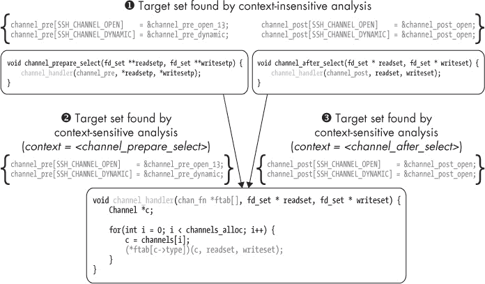

*图 6-9：`opensshd`中上下文敏感与上下文不敏感的间接调用分析*

该图展示了上下文敏感性如何影响`opensshd` v3.5 中间接调用分析的结果。分析的目标是找出`channel_handler`函数中间接调用位置的可能目标（即执行`(*ftab[c->type])(c, readset, writeset);`的那一行）。间接调用位置从一个函数指针表中获取其目标，这个表作为参数`ftab`传递给`channel_handler`。`channel_handler`函数由两个其他函数调用：`channel_prepare_select`和`channel_after_select`。这两个函数各自将自己的函数指针表作为`ftab`参数传递。

在没有上下文敏感分析的情况下，间接调用分析得出的结论是`channel_handler`中的间接调用可能指向`channel_pre`表中的任何函数指针（从`channel_prepare_select`传入）或`channel_post`表中的任何函数指针（从`channel_after_select`传入）。实际上，它得出结论，所有可能的目标集合是程序中任何路径上所有可能集合的并集 ➊。

相比之下，上下文敏感分析为每个可能的前置调用上下文确定一个不同的目标集合。如果`channel_handler`是由`channel_prepare_select`调用的，那么只有在它传递给`channel_handler`的`channel_pre`表中的目标才是有效的➋。另一方面，如果`channel_handler`是从`channel_after_select`调用的，那么只有`channel_post`中的目标是可能的➌。在这个例子中，我只讨论了长度为 1 的上下文，但一般来说，上下文可以是任意长的（只要是通过调用图的最长路径）。

与流敏感性类似，上下文敏感性的优点是提高了精度，而缺点则是更高的计算复杂性。此外，上下文敏感分析必须处理大量的状态信息，用以追踪所有不同的上下文。而且，如果存在递归函数，可能的上下文数量是无限的，因此需要采取特别措施来处理这些情况^(16)。通常，若不通过诸如限制上下文大小等成本与收益的权衡，创建一个可扩展的上下文敏感分析版本可能是不可行的。

#### *6.4.2 控制流分析*

任何二进制分析的目的是找出程序的控制流属性、数据流属性或两者。专注于控制流属性的二进制分析被称为*控制流分析*，而专注于数据流的分析被称为*数据流分析*。这种区分仅仅是基于分析是否专注于控制流或数据流；它并没有说明分析是过程内分析还是跨过程分析，是流敏感还是流不敏感，或者是上下文敏感还是上下文不敏感。让我们先来看一种常见的控制流分析类型，叫做*循环检测*。在下一节中，你将看到一些常见的数据流分析。

### 循环检测

顾名思义，循环检测的目的是在代码中查找循环。在源代码级别，像`while`或`for`这样的关键字可以轻松地帮助你找到循环。在二进制级别，这就更难一些，因为循环通常使用与实现`if`/`else`分支和开关语句相同的（有条件或无条件的）跳转指令来实现。

查找循环的能力有很多用途。例如，从编译器的角度来看，循环很重要，因为程序的大部分执行时间都花费在循环中（一个常被引用的数字是 90%）。这意味着循环是优化的一个重要目标。从安全角度来看，分析循环也很有用，因为像缓冲区溢出这样的漏洞往往发生在循环中。

编译器中使用的循环检测算法采用了不同于直觉的循环定义。这些算法寻找*自然循环*，这些循环具有某些良好的结构属性，使得它们更易于分析和优化。也有一些算法可以检测 CFG 中的任何*循环*，即使这些循环不符合自然循环的严格定义。图 6-10 展示了一个包含自然循环的 CFG 示例，以及一个不是自然循环的循环。

首先，我将向您展示用于检测自然循环的典型算法。之后，您会更清楚为什么并非每个循环都符合该定义。要理解什么是自然循环，您需要了解什么是*支配树*。图 6-10 的右侧展示了一个支配树的示例，它对应于图左侧展示的 CFG。

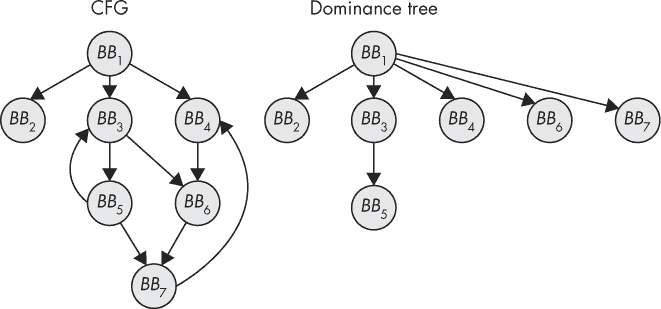

*图 6-10：一个 CFG 及其对应的支配树*

一个基本块*A*被认为是*支配*另一个基本块*B*，如果从控制流图（CFG）的入口点到达*B*的唯一方式是先经过*A*。例如，在图 6-10 中，*BB*[3]支配*BB*[5]，但不支配*BB*[6]，因为*BB*[6]也可以通过*BB*[4]到达。相反，*BB*[6]由*BB*[1]支配，*BB*[1]*是从入口点到*BB*[6]*的所有路径必须经过的最后一个节点。支配树编码了 CFG 中的所有支配关系。

现在，一个自然循环是由一个从基本块*B*到*A*的*回边*诱发的，其中*A*支配*B*。由这个回边产生的循环包含所有由*A*支配的、从中有路径通向*B*的基本块。通常，*B*本身被排除在这个集合之外。直观地说，这一定义意味着自然循环不能在中途被进入，只能在一个明确的*头节点*处进入。这简化了自然循环的分析。

例如，在图 6-10 中，存在一个自然循环，横跨基本块*BB*[3]和*BB*[5]，因为从*BB*[5]到*BB*[3]有回边，且*BB*[3]支配*BB*[5]。在这种情况下，*BB*[3]是循环的头节点，*BB*[5]是“回环”节点，而循环的“主体”（根据定义不包括头节点和回环节点）不包含任何节点。

### 循环检测

您可能已经注意到图中有另一个回边，从*BB*[7]到*BB*[4]。这个回边诱发了一个循环，但*不是*自然循环，因为循环可以在*BB*[6]或*BB*[7]“中途”进入。由于这个原因，*BB*[4]没有支配*BB*[7]，因此该循环不符合自然循环的定义。

要找到像这样的循环，包括任何自然循环，你只需要控制流图（CFG），而不需要支配树。只需从 CFG 的入口节点开始深度优先搜索（DFS），然后保持一个栈，每当 DFS 遍历一个基本块时，就将其推入栈中，并在 DFS 回溯时将其弹出。如果 DFS 遇到一个已经在栈中的基本块，那么你就找到了一个循环。

例如，假设你正在对 图 6-10 中显示的控制流图（CFG）进行 DFS。DFS 从入口点 *BB*[1] 开始。列表 6-9 显示了 DFS 状态的演变以及 DFS 如何在 CFG 中检测到两个循环（为了简洁起见，我没有展示 DFS 在找到两个循环之后的继续过程）。

*列表 6-9：使用 DFS 检测循环*

```
    0:   [BB1]
    1:   [BB1,BB2]
    2:   [BB1]
    3:   [BB1,BB3]
    4:   [BB1,BB3,BB5]
➊   5:   [BB1,BB3,BB5,BB3]                 *cycle found*
    6:   [BB1,BB3,BB5]
    7:   [BB1,BB3,BB5,BB7]
    8:   [BB1,BB3,BB5,BB7,BB4]
    9:   [BB1,BB3,BB5,BB7,BB4,BB6]
➋  10:  [BB1,BB3,BB5,BB7,BB4,BB6,BB7]      *cycle found*
...
```

首先，DFS 探索 *BB*[1] 的最左分支，但在遇到死胡同时迅速回溯。然后进入中间分支，从 *BB*[1] 到 *BB*[3]，继续沿着 *BB*[5] 搜索，在此之后再次遇到 *BB*[3]，从而找到包含 *BB*[3] 和 *BB*[5] 的循环 ➊。接着回溯到 *BB*[5]，继续沿着通往 *BB*[7] 的路径搜索，然后是 *BB*[4]、*BB*[6]，直到最终再次遇到 *BB*[7]，找到第二个循环 ➋。

#### *6.4.3 数据流分析*

现在让我们来看看一些常见的数据流分析技术：到达定义分析、使用-定义链和程序切片。

### 到达定义分析

*到达定义分析* 解答了“哪些数据定义可以到达程序中的这一点？”当我说一个数据定义可以“到达”程序中的某个点时，我的意思是，分配给一个变量（或者在更低级别上，分配给一个寄存器或内存位置）的值可以到达该点，而不会在此过程中被其他赋值覆盖。到达定义分析通常应用于控制流图（CFG）级别，尽管它也可以在过程间使用。

分析首先通过考虑每个基本块生成哪些定义并杀死哪些定义来开始。通常通过计算每个基本块的 *gen* 和 *kill* 集合来表达这一点。图 6-11 显示了基本块的 *gen* 和 *kill* 集合示例。

*BB*[3] 的 *gen* 集合包含语句 6 和 8，因为这些是 *BB*[3] 中的定义，直到基本块结束时仍然有效。语句 7 不再有效，因为 `z` 被语句 8 覆盖。*kill* 集合包含来自 *BB*[1] 和 *BB*[2] 的语句 1、3 和 4，因为这些赋值被 *BB*[3] 中的其他赋值覆盖。

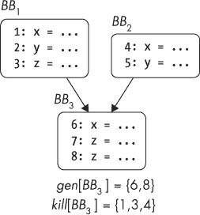

*图 6-11：基本块的* gen *和* kill *集合示例*

计算每个基本块的*gen*和*kill*集合之后，你就得到了一个*局部*解，告诉你每个基本块生成和消除的数据定义。从这些信息中，你可以计算出一个*全局*解，告诉你哪些定义（来自控制流图中的任何地方）可以到达一个基本块的开始，哪些定义在基本块执行完后仍然存活。可以到达基本块*B*的全局定义集合表示为一个集合*out*[*B*]，定义如下：

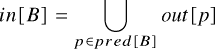

直观地说，这意味着到达*B*的定义集合是所有离开其他前驱基本块的定义集合的并集。离开基本块*B*的定义集合表示为*out*[*B*]，定义如下：

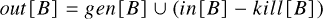

换句话说，离开*B*的定义是*B*自己生成的或从其前驱接收的（作为其*in*集合的一部分）且没有被杀死的定义。注意，*in*集合和*out*集合之间存在相互依赖关系：*in*是通过*out*定义的，反之亦然。这意味着实际上，进行到达定义分析时，仅仅计算每个基本块的*in*和*out*集合一次是不够的。相反，分析必须是迭代的：每次迭代时，它都会计算每个基本块的集合，并继续迭代，直到集合没有再发生变化为止。一旦所有的*in*和*out*集合都达到稳定状态，分析就完成了。

到达定义分析构成了许多数据流分析的基础。这包括*使用-定义分析*，我接下来将讨论这一点。

### 使用-定义链

*使用-定义链*告诉你，在程序中的每个变量使用点，那个变量可能被定义的位置。例如，在图 6-12 中，*B*[2]中`y`的使用-定义链包含语句 2 和语句 7。这是因为在该控制流图（CFG）中的这一点，`y`可能是通过语句 2 的原始赋值或（经过一次循环迭代后）语句 7 获得的。注意，*B*[2]中没有`z`的使用-定义链，因为`z`仅在该基本块中被赋值，而未被使用。

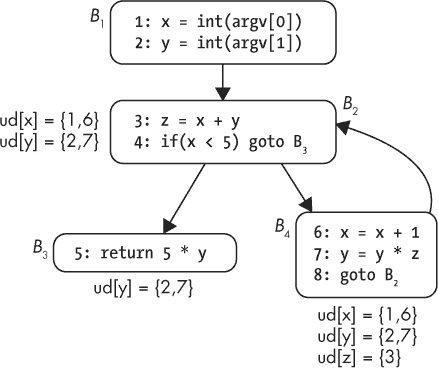

*图 6-12：使用-定义链的示例*

使用-定义链的一个应用场景是反编译：它们使反编译器能够追踪在条件跳转中使用的值被比较的位置。通过这种方式，反编译器可以将`cmp x,5`和`je`（相等时跳转）指令合并为一个更高层次的表达式，如`if(x == 5)`。使用-定义链也用于编译器优化，例如*常量传播*，当某个变量在程序中的某个点唯一的可能值为常量时，替换该变量为常量。它们在许多其他二进制分析场景中也很有用。

乍一看，计算使用-定义链（use-def chain）可能会显得复杂。但在有了控制流图（CFG）的达成定义分析之后，利用*in*集来查找可能到达基本块的该变量的定义，计算基本块中变量的使用-定义链就变得相当简单。除了使用-定义链，还可以计算定义-使用链。与使用-定义链相反，定义-使用链告诉你程序中某个数据定义可能在哪些地方被使用。

### 程序切片

*切片*是一种数据流分析方法，旨在提取在程序某一特定点（称为*切片标准*）对一组选定变量的值有贡献的所有指令（或者，对于基于源代码的分析，是指源代码的所有行）。这在调试时非常有用，尤其是当你想找出哪些代码部分可能是导致 bug 的原因，也适用于逆向工程。计算切片可能非常复杂，它仍然是一个活跃的研究课题，而不是生产就绪的技术。尽管如此，它仍然是一个有趣的技术，值得了解。在这里，我将简单介绍它的基本思想，如果你想深入体验切片，我建议你查看 angr 逆向工程框架，^(17)，它提供了内置的切片功能。你还可以在第十三章中看到如何通过符号执行实现一个实用的切片工具。

切片是通过跟踪控制流和数据流来计算的，以找出哪些代码部分与切片无关，然后删除这些部分。最终的切片是删除所有无关代码后剩下的部分。例如，假设你想知道示例 6-10 中哪些行对第 14 行的`y`值有贡献。

*示例 6-10：使用切片来查找对* y *在第 14 行的贡献行*

```
1:  x = int(argv[0])
2:  y = int(argv[1])
3:
4:  z = x +   y
5:  while(x   <  5) {
6:    x = x   +  1
7:    y = y   +  2
8:    z = z   +  x
9:    z = z   +  y
10:   z = z  *   5
11: }
12:
13: print(x)
14: print(y)
15: print(z)
```

该切片包含代码中阴影灰色的行。请注意，所有对`z`的赋值与切片完全无关，因为它们对`y`的最终值没有影响。`x`的变化是相关的，因为它决定了第 5 行的循环迭代次数，这反过来又影响了`y`的值。如果你只编译切片中包含的行，`print(y)`语句的输出将与完整程序的输出完全相同。

最初，切片是作为静态分析提出的，但现在它通常应用于动态执行跟踪。动态切片的优势在于，它通常比静态切片产生更小（因此更易读）的切片。

你刚才看到的被称为 *反向切片*，因为它是从后向前搜索影响所选切片标准的行。但也有 *正向切片*，它从程序中的某个点开始，向前搜索以确定其他哪些代码部分会受到所选切片标准中的指令和变量的影响。除此之外，它还可以预测代码中的哪些部分会受到所选点上代码更改的影响。  

### 6.5 编译器设置对反汇编的影响  

编译器优化代码以最小化其大小或执行时间。不幸的是，优化后的代码通常比未优化的代码更难以精确反汇编（因此也更难分析）。  

优化后的代码与原始源代码的对应关系较少，这使得它对人类的直观性降低。例如，在优化算术代码时，编译器会尽量避免非常慢的 `mul` 和 `div` 指令，而是通过一系列位移和加法操作来实现乘法和除法。逆向工程时，这些操作可能会很难解读。  

此外，编译器经常将小函数合并到调用它们的较大函数中，以避免 `call` 指令的开销；这种合并被称为 *内联*。因此，你在源代码中看到的并不一定都是二进制文件中存在的函数，至少它们不会作为单独的函数存在。此外，常见的函数优化，例如尾调用和优化的调用约定，会使得函数检测的准确性大大降低。  

在较高的优化级别下，编译器通常会在函数和基本块之间插入填充字节，以便将它们对齐到可以最有效访问的内存地址。将这些填充字节误解释为代码可能会导致反汇编错误，尤其是当这些填充字节不是有效指令时。此外，编译器可能会“展开”循环，以避免跳转到下一次迭代的开销。这会妨碍循环检测算法和反编译器，后者试图在代码中找到类似 `while` 和 `for` 循环的高级结构。  

优化还可能妨碍数据结构检测，而不仅仅是代码发现。例如，优化后的代码可能同时使用相同的基址寄存器来索引不同的数组，这使得很难将它们识别为独立的数据结构。

如今，*链接时优化 (LTO)* 越来越受到欢迎，这意味着传统上在每个模块基础上应用的优化现在可以用于整个程序。这增加了许多优化的优化面，使得效果更加深远。  

在编写和测试自己的二进制分析工具时，务必记住，优化后的二进制文件可能会影响工具的准确性。  

除了之前提到的优化方法之外，二进制文件越来越多地被编译为*位置无关代码（PIC）*，以适应像*地址空间布局随机化（ASLR）*这样的安全功能，这些功能需要能够在不破坏二进制文件的情况下移动代码和数据。^(18) 使用 PIC 编译的二进制文件称为*位置无关可执行文件（PIE）*。与位置依赖的二进制文件相比，PIE 二进制文件不会使用绝对地址来引用代码和数据。相反，它们使用相对于程序计数器的引用。这也意味着一些常见的结构，比如 ELF 二进制文件中的 PLT，在 PIE 二进制文件中与非 PIE 二进制文件中的表现不同。因此，那些没有考虑到 PIC 的二进制分析工具，可能无法正确处理这种二进制文件。

### 6.6 总结

你现在已经了解了反汇编器的内部工作原理，以及理解本书其余部分所需的基本二进制分析技术。现在你已经准备好继续学习一些技术，不仅能够反汇编二进制文件，还能修改它们。让我们从第七章开始，学习基本的二进制修改技术！

练习

1\. 欺骗 objdump

编写一个程序，欺骗`objdump`，使其将数据解读为代码，或者将代码解读为数据。你可能需要使用一些内联反汇编来实现这一点（例如，使用`gcc`的`asm`关键字）。

2\. 欺骗递归反汇编器

编写另一个程序，这次让它欺骗你最喜欢的递归反汇编器的函数检测算法。实现这一点有多种方法。例如，你可以创建一个尾调用函数，或者一个带有多个返回情况的`switch`函数。看看你能让反汇编器困惑到什么程度！

3\. 改进函数检测

为你选择的递归反汇编器编写一个插件，使其能够更好地检测诸如在之前练习中未能检测到的函数。你需要一个可以为其编写插件的递归反汇编器，例如 IDA Pro、Hopper 或 Medusa。
