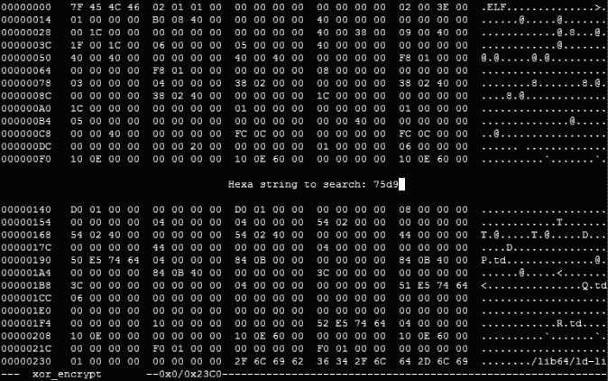
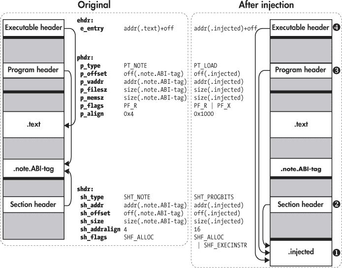

# ELF 的简单代码注入技术

在本章中，你将学习几种将代码注入现有 ELF 二进制文件的技术，这些技术可以让你修改或增强二进制文件的行为。尽管本章讨论的技术对于进行小规模修改非常方便，但它们的灵活性较差。本章将展示这些技术的局限性，以便你理解更全面的代码修改技术的必要性，这些技术你将在第九章中学习到。

### 7.1 使用十六进制编辑进行裸金属二进制修改

修改现有二进制文件最直接的方法是使用*十六进制编辑器*，这是一种以十六进制格式表示二进制文件字节并允许你编辑这些字节的程序。通常，你会先使用反汇编工具识别你想要更改的代码或数据字节，然后再使用十六进制编辑器进行更改。

这种方法的优点在于它简单，只需要基本的工具。缺点是它仅支持就地编辑：你可以更改代码或数据字节，但不能添加任何新的内容。插入新的字节会导致后面的所有字节移到另一个地址，从而破坏对这些字节的引用。由于在链接阶段之后通常会丢弃所需的重定位信息，因此很难（甚至不可能）正确识别和修复所有损坏的引用。如果二进制文件中包含任何填充字节、死代码（如未使用的函数）或未使用的数据，你可以用新内容覆盖这些部分。然而，由于大多数二进制文件中没有很多可以安全覆盖的死字节，这种方法是有限制的。

然而，在某些情况下，十六进制编辑可能是你所需要的一切。例如，恶意软件使用反调试技术来检查它运行的环境是否存在分析软件的痕迹。如果恶意软件怀疑自己正在被分析，它会拒绝运行或攻击分析环境。当你分析一个恶意软件样本并怀疑它包含反调试检查时，你可以使用十六进制编辑禁用这些检查，将检查部分覆盖为`nop`（无操作）指令。有时，你甚至可以通过十六进制编辑器修复程序中的简单错误。为了向你展示一个例子，我将使用名为`hexedit`的十六进制编辑器，它是一个开源编辑器，已在虚拟机上预安装，用于修复一个简单程序中的越界错误。

### 寻找正确的操作码

当你在二进制文件中编辑代码时，你需要知道要插入哪些值，为此，你需要了解机器指令的格式和十六进制编码。网上有很多关于 x86 指令的操作码和操作数格式的有用概览，例如*[`ref.x86asm.net`](http://ref.x86asm.net)*。如果你需要更详细的信息来了解某个 x86 指令如何工作，可以查阅官方的英特尔手册。*^a*

*a*. *[`software.intel.com/sites/default/files/managed/39/c5/325462-sdm-vol-1-2abcd-3abcd.pdf`](https://software.intel.com/sites/default/files/managed/39/c5/325462-sdm-vol-1-2abcd-3abcd.pdf)*

#### *7.1.1 观察越界错误的实际表现*

*越界错误* 通常发生在循环中，当程序员使用了错误的循环条件，导致循环读取或写入少了一个字节或多了一个字节。列表 7-1 中的示例程序加密一个文件，但由于越界错误，不小心将最后一个字节未加密。为了解决这个问题，我将首先使用 `objdump` 反汇编二进制文件并定位到出错的代码。然后我会使用 `hexedit` 编辑该代码并去除越界错误。

*列表 7-1：* xor_encrypt.c

```
   #include  <stdio.h>
   #include  <stdlib.h>
   #include  <string.h>
   #include  <stdarg.h>

   void
   die(char const *fmt, ...)
   {
     va_list args;

     va_start(args, fmt);
     vfprintf(stderr, fmt, args);
     va_end(args);

     exit(1);
   }

   int
   main(int argc, char *argv[])
   {
     FILE *f;
     char *infile, *outfile;
     unsigned char *key, *buf;
     size_t i, j, n;

     if(argc != 4)
       die("Usage: %s <in file> <out file> <key>\n", argv[0]);

     infile  = argv[1];
     outfile = argv[2];
     key     = (unsigned char*)argv[3];

➊   f = fopen(infile, "rb");
     if(!f) die("Failed to open file '%s'\n", infile);

➋   fseek(f, 0, SEEK_END);
     n = ftell(f);
     fseek(f, 0, SEEK_SET);

➌   buf = malloc(n);
     if(!buf) die("Out of memory\n");

➍   if(fread(buf, 1, n, f) != n)
       die("Failed to read file '%s'\n", infile);

➎   fclose(f); j = 0;
➏   for(i = 0; i < n-1; i++) { /* Oops! An off-by-one error! */
       buf[i] ^= key[j];
       j = (j+1) % strlen(key);
     }

➐   f = fopen(outfile, "wb");
    if(!f) die("Failed to open file '%s'\n", outfile);

➑   if(fwrite(buf, 1, n, f) != n)
       die("Failed to write file '%s'\n", outfile);

➒   fclose(f);

     return 0;
  }
```

在解析命令行参数后，程序打开要加密的输入文件 ➊，确定文件大小并将其存储在名为 `n` 的变量中 ➋，分配一个缓冲区 ➌ 用来存储文件，读取整个文件到缓冲区 ➍，然后关闭文件 ➎。如果在过程中出现任何问题，程序会调用 `die` 函数打印适当的错误信息并退出。

错误发生在程序的下一个部分，该部分使用简单的 `xor` 算法加密文件字节。程序进入一个 `for` 循环，遍历包含所有文件字节的缓冲区，并通过与提供的密钥 ➏ 做 `xor` 运算来加密每个字节。注意 `for` 循环的循环条件：循环从 `i = 0` 开始，但仅当 `i < n-1` 时才会继续。这意味着最后一个加密的字节位于缓冲区的索引 `n-2` 处，因此最后一个字节（索引为 `n-1`）未被加密！这就是越界错误，我们将使用十六进制编辑器来修复它。

在加密文件缓冲区后，程序打开一个输出文件 ➐，将加密后的字节写入文件 ➑，最后关闭输出文件 ➒。列表 7-2 显示了程序的示例运行（使用虚拟机中提供的 Makefile 编译），可以看到程序中存在越界错误的实际情况。

*列表 7-2：观察 *xor_encrypt* 程序中的越界错误*

```
➊  $ ./xor_encrypt xor_encrypt.c encrypted foobar
➋  $ xxd xor_encrypt.c | tail
   000003c0: 6420 746f 206f 7065 6e20 6669 6c65 2027  d to open file '
   000003d0: 2573 275c 6e22 2c20 6f75 7466 696c 6529  %s'\n", outfile)
   000003e0: 3b0a 0a20 2069 6628 6677 7269 7465 2862  ;.. if(fwrite(b
   000003f0: 7566 2c20 312c 206e 2c20 6629 2021 3d20  uf, 1, n, f) !=
   00000400: 6e29 0a20 2020 2064 6965 2822 4661 696c  n).    die("Fail
 00000410: 6564 2074 6f20 7772 6974 6520 6669 6c65  ed to write file
   00000420: 2027 2573 275c 6e22 2c20 6f75 7466 696c  '%s'\n", outfil
   00000430: 6529 3b0a 0a20 2066 636c 6f73 6528 6629  e);.. fclose(f)
   00000440: 3b0a 0a20 2072 6574 7572 6e20 303b 0a7d  ;..   return 0;.}
   00000450: 0a➌0a                             ..
➍  $ xxd encrypted | tail
   000003c0: 024f 1b0d 411d 160a 0142 071b 0a0a 4f45  .O..A....B....OE
   000003d0: 4401 4133 0140 4d52 091a 1b04 081e 0346  D.A3.@MR.......F
   000003e0: 5468 6b52 4606 094a 0705 1406 1b07 4910  ThkRF..J......I.
   000003f0: 1309 4342 505e 4601 4342 075b 464e 5242  ..CBP.CB.[FNRB
   00000400: 0f5b 6c4f 4f42 4116 0f0a 4740 2713 0f03  .[lOOBA...G@'...
   00000410: 0a06 4106 094f 1810 0806 034f 090b 0d17  ..A..O.....O....
   00000420: 4648 4a11 462e 084d 4342 0e07 1209 060e  FHJ.F..MCB......
   00000430: 045b 5d65 6542 4114 0503 0011 045a 0046  .[]eeBA......Z.F
   00000440: 5468 6b52 461d 0a16 1400 084f 5f59 6b0f  ThkRF......O_Yk.
   00000450: 6c➎0a                                    l.
```

在这个示例中，我使用 `xor_encrypt` 程序用密钥 `foobar` 加密了它自己的源文件，并将输出写入名为 *encrypted* 的文件 ➊。使用 `xxd` 查看原始源文件的内容 ➋，你会看到它以字节 `0x0a` 结尾 ➌。在加密后的文件中，所有字节都被破坏了 ➍，除了最后一个字节，它与原文件中的字节相同 ➎。这是因为越界错误导致最后一个字节没有被加密。

#### *7.1.2 修复越界错误*

现在让我们看看如何修复二进制文件中的越界错误。在本章的所有示例中，你可以假装没有二进制文件的源代码，尽管实际上你是有的。这是为了模拟现实中你被迫使用二进制修改技术的情况，比如你正在处理专有或恶意程序，或者源代码丢失的程序。

### 查找导致错误的字节

要修复越界错误，你需要更改循环条件，使其多循环一次以加密最后一个字节。因此，你首先需要反汇编二进制文件，找到负责强制执行循环条件的指令。清单 7-3 包含了相关的指令，正如 `objdump` 所显示的那样。

*清单 7-3：显示越界错误的反汇编代码*

```
  $ objdump -M intel -d xor_encrypt
  ...
  4007c2:  49 8d 45 ff             lea         rax,[r13-0x1]
  4007c6:  31 d2                   xor         edx,edx
  4007c8:  48 85 c0                test        rax,rax
  4007cb:  4d 8d 24 06             lea         r12,[r14+rax*1]
  4007cf:  74 2e                   je          4007ff <main+0xdf>
  4007d1:  0f 1f 80 00 00 00 00    nop         DWORD PTR [rax+0x0]
➊ 4007d8: 41 0f b6 04 17           movzx       eax,BYTE PTR [r15+rdx*1]
  4007dd:  48 8d 6a 01             lea         rbp,[rdx+0x1]
  4007e1:  4c 89 ff                mov         rdi,r15
  4007e4:  30 03                   xor         BYTE PTR [rbx],al
  4007e6:  48 83 c3 01            ➋add         rbx,0x1
  4007ea:  e8 a1 fe ff ff          call        400690 <strlen@plt>
  4007ef:  31 d2                   xor         edx,edx
  4007f1:  48 89 c1                mov         rcx,rax
  4007f4:  48 89 e8                mov         rax,rbp
  4007f7:  48 f7 f1                div         rcx
  4007fa:  49 39 dc               ➌cmp         r12,rbx
  4007fd:  75 d9                  ➍jne         4007d8 <main+0xb8>
  4007ff:  48 8b 7c 24 08          mov         rdi,QWORD PTR [rsp+0x8]
  400804:  be 66 0b 40 00          mov         esi,0x400b66
...
```

循环从地址 `0x4007d8` ➊ 开始，循环计数器（`i`）存储在 `rbx` 寄存器中。你可以看到循环计数器在每次循环迭代时都会递增 ➋。你还可以看到一个 `cmp` 指令 ➌，它检查是否需要进行另一轮循环。`cmp` 将 `i`（存储在 `rbx`）与值 `n-1`（存储在 `r12`）进行比较。如果需要进行另一轮循环，`jne` 指令 ➍ 会跳转回循环开始处。如果不需要，它会跳过，执行下一条指令，结束循环。

`jne` 指令表示“如果不相等则跳转”^(1)：当 `i` 不等于 `n-1`（由 `cmp` 指令确定）时，它会跳转回循环的开始处。换句话说，由于 `i` 在每次循环迭代时都会递增，循环将会在 `i < n-1` 时运行。但为了修复越界错误，你希望循环在 `i <= n-1` 时运行，这样就能多循环一次。

### 替换有问题的字节

为了实现这个修复，你可以使用十六进制编辑器替换 `jne` 指令的操作码，将其改为另一种跳转指令。`cmp` 的第一个操作数是 `r12`（包含 `n-1`），后面是 `rbx`（包含 `i`）。因此，你应该使用 `jae`（“如果大于或等于则跳转”）指令，使得循环在 `n-1 >= i` 时继续运行，也就是相当于说 `i <= n-1`。现在你可以使用 `hexedit` 实现这个修复。

要跟着操作，请转到本章的代码文件夹，运行 Makefile，然后在命令行中输入 `hexedit xor_encrypt` 并按 ENTER 以在十六进制编辑器中打开 `xor_encrypt` 二进制文件（这是一个交互式程序）。要查找需要修改的特定字节，你可以搜索来自反汇编器（如 `objdump`）的字节模式。在 Listing 7-3 中，你可以看到需要修改的 `jne` 指令被编码为十六进制字节串 `75d9`，所以你将搜索这个模式。在更大的二进制文件中，你可能需要使用更长的模式，可能包括其他指令的字节，以确保唯一性。要在 `hexedit` 中搜索模式，按 / 键。这将打开一个提示框，如 Figure 7-1 所示，你可以在其中输入搜索模式 `75d9`，然后按 ENTER 开始搜索。



*Figure 7-1：使用* `hexedit` *搜索字节串*

搜索会找到模式并将光标移到模式的第一个字节。参考 x86 操作码参考或英特尔 x86 手册，你可以看到 `jne` 指令被编码为一个操作码字节（`0x75`），后跟一个编码跳转位置偏移量的字节（`0xd9`）。为了这些目的，你只需要将 `jne` 操作码 `0x75` 替换为 `jae` 指令的操作码 `0x73`，而跳转偏移量保持不变。由于光标已经位于你想修改的字节上，编辑所需的只是输入新的字节值 `73`。在你输入时，`hexedit` 会用粗体突出显示修改过的字节值。现在，剩下的就是按 CTRL-X 退出并按 Y 确认更改来保存修改过的二进制文件。你现在已经修复了二进制文件中的越界错误！让我们通过再次使用 `objdump` 来确认这个更改，如 Listing 7-4 所示。

*Listing 7-4：显示修复越界错误补丁的反汇编*

```
$ objdump -M intel -d xor_encrypt.fixed
...
4007c2:  49 8d 45 ff              lea         rax,[r13-0x1]
4007c6:  31 d2                    xor         edx,edx
4007c8:  48 85 c0                 test        rax,rax
4007cb:  4d 8d 24 06              lea         r12,[r14+rax*1]
4007cf:  74 2e                    je          4007ff <main+0xdf>
4007d1:  0f 1f 80 00 00 00 00     nop         DWORD PTR [rax+0x0]
4007d8:  41 0f b6 04 17           movzx       eax,BYTE PTR [r15+rdx*1]
4007dd:  48 8d 6a 01              lea         rbp,[rdx+0x1]
4007e1:  4c 89 ff                 mov         rdi,r15
4007e4:  30 03                    xor         BYTE PTR [rbx],al
4007e6:  48 83 c3 01              add         rbx,0x1
4007ea:  e8 a1 fe ff ff           call        400690 <strlen@plt>
4007ef:  31 d2                    xor         edx,edx
4007f1:  48 89 c1                 mov         rcx,rax
4007f4:  48 89 e8                 mov         rax,rbp
4007f7:  48 f7 f1                 div         rcx
4007fa:  49 39 dc                 cmp         r12,rbx
4007fd:  73 d9                   ➊jae         4007d8 <main+0xb8>
4007ff:  48 8b 7c 24 08           mov         rdi,QWORD PTR [rsp+0x8]
400804:  be 66 0b 40 00           mov         esi,0x400b66
...
```

如你所见，原来的 `jne` 指令现在已被 `jae` ➊ 替换。为了检查修复是否有效，让我们再次运行程序，看它是否加密了最后一个字节。Listing 7-5 显示了结果。

*Listing 7-5：修复后的* xor_encrypt *程序输出*

```
➊ $ ./xor_encrypt xor_encrypt.c encrypted foobar
➋ $ xxd encrypted | tail
  000003c0: 024f 1b0d 411d 160a 0142 071b 0a0a 4f45 .O..A....B....OE
  000003d0: 4401 4133 0140 4d52 091a 1b04 081e 0346 D.A3.@MR.......F
  000003e0: 5468 6b52 4606 094a 0705 1406 1b07 4910 ThkRF..J......I.
  000003f0: 1309 4342 505e 4601 4342 075b 464e 5242 ..CBP.CB.[FNRB
  00000400: 0f5b 6c4f 4f42 4116 0f0a 4740 2713 0f03 .[lOOBA...G@'...
  00000410: 0a06 4106 094f 1810 0806 034f 090b 0d17 ..A..O.....O....
  00000420: 4648 4a11 462e 084d 4342 0e07 1209 060e FHJ.F..MCB......
  00000430: 045b 5d65 6542 4114 0503 0011 045a 0046 .[]eeBA......Z.F
  00000440: 5468 6b52 461d 0a16 1400 084f 5f59 6b0f ThkRF......O_Yk.
  00000450: 6c➌65                                   le
```

和之前一样，你运行 `xor_encrypt` 程序来加密它自己的源代码 ➊。回想一下，在原始源文件中，最后一个字节的值是 `0x0a`（见 Listing 7-2）。使用 `xxd` 检查加密文件 ➋，你可以看到即使是最后一个字节现在也已正确加密 ➌：它现在是 `0x65` 而不是 `0x0a`。

现在你知道如何使用十六进制编辑器编辑二进制文件了！虽然这个例子很简单，但程序对于更复杂的二进制文件和编辑是相同的。

### 7.2 使用 LD_PRELOAD 修改共享库行为

十六进制编辑是一种修改二进制文件的好方法，因为它只需要基础工具，而且由于修改较小，编辑后的二进制文件通常与原始文件相比几乎没有性能或代码/数据大小的开销。然而，正如你在前一节的示例中看到的，十六进制编辑也很繁琐、容易出错并且有局限性，因为你不能添加新的代码或数据。如果你的目标是修改共享库函数的行为，使用 `LD_PRELOAD` 可以更轻松地实现。

`LD_PRELOAD` 是一个环境变量的名称，它会影响动态链接器的行为。它允许你指定一个或多个库，在任何其他库加载之前，包括像 *libc.so* 这样的标准系统库。如果一个预加载的库中包含与稍后加载的库中的某个函数同名的函数，那么运行时将使用第一个函数。这使得你可以用自己实现的版本 *覆盖* 库函数（即使是像 `malloc` 或 `printf` 这样的标准库函数）。这不仅对二进制修改有用，对于那些源代码可用的程序也很有帮助，因为修改库函数的行为可以避免你费力修改源代码中所有调用该库函数的地方。我们来看一个例子，说明 `LD_PRELOAD` 如何有助于修改二进制程序的行为。

#### *7.2.1 堆溢出漏洞*

我将在这个示例中修改的程序是 `heapoverflow`，它包含一个堆溢出漏洞，可以通过 `LD_PRELOAD` 来修复。示例 7-6 显示了程序的源代码。

*示例 7-6:* heapoverflow.c

```
  #include <stdio.h>
  #include <stdlib.h>
  #include <string.h>

  int
  main(int argc, char *argv[])
  {
    char *buf;
    unsigned long len;

    if(argc != 3) {
      printf("Usage: %s <len> <string>\n", argv[0]);
      return 1;
    }

➊   len = strtoul(argv[1], NULL, 0);
    printf("Allocating %lu bytes\n", len);

➋   buf = malloc(len);

     if(buf && len > 0) {
       memset(buf, 0, len);

➌     strcpy(buf, argv[2]);
       printf("%s\n", buf);

➍     free(buf);
    }

    return 0;
  }
```

`heapoverflow` 程序接受两个命令行参数：一个数字和一个字符串。它将给定的数字作为缓冲区的大小 ➊，然后使用 `malloc` ➋ 分配该大小的缓冲区。接下来，它使用 `strcpy` ➌ 将给定的字符串复制到缓冲区中，并将缓冲区的内容打印到屏幕上。最后，它使用 `free` ➍ 释放该缓冲区。

溢出漏洞出现在 `strcpy` 操作中：因为字符串的长度从未检查，所以它可能太大，无法放入缓冲区。如果是这种情况，复制操作将导致堆溢出，可能会破坏堆上的其他数据，并导致崩溃甚至利用程序漏洞。但如果给定的字符串可以适应缓冲区，一切都能正常工作，就像你在 示例 7-7 中看到的那样。

*示例 7-7：* heapoverflow *程序在输入正常时的行为*

```
$ ./heapoverflow 13 'Hello world!'
Allocating 13 bytes
Hello world!
```

在这里，我告诉 `heapoverflow` 分配一个 13 字节的缓冲区，然后将消息“Hello world!”复制进去 ➊。程序分配了请求的缓冲区，将消息复制进去，并按预期将其打印到屏幕上，因为该缓冲区刚好足够大，能够容纳字符串，包括其终止的 `NULL` 字符。让我们检查 Listing 7-8，看看如果提供一个无法适应缓冲区的消息会发生什么。

*Listing 7-8: 输入过长时* heapoverflow *程序崩溃*

```
➊ $ ./heapoverflow 13 `perl -e 'print "A"x100'`
➋ Allocating 13 bytes
➌ AAAAAAAAAAAAAAAAAAAAAAAAAAAAAAAAAAAAAAAAAAAAAAAAAAAAAAAAAAAAAAAAAAAAAAAAAAAAAAAAAAAAAAAAAAAA...
➍ *** Error in `./heapoverflow': free(): invalid next size (fast): 0x0000000000a10420 ***
  ======= Backtrace: =========
  /lib/x86_64-linux-gnu/libc.so.6(+0x777e5)[0x7f19129587e5]
  /lib/x86_64-linux-gnu/libc.so.6(+0x8037a)[0x7f191296137a]
  /lib/x86_64-linux-gnu/libc.so.6(cfree+0x4c)[0x7f191296553c] ./heapoverflow[0x40063e]
  /lib/x86_64-linux-gnu/libc.so.6(__libc_start_main+0xf0)[0x7f1912901830]
  ./heapoverflow[0x400679]
  ======= Memory map: ========
  00400000-00401000 r-xp 00000000 fc:03 37226406          /home/binary/code/chapter7/heapoverflow
  00600000-00601000 r--p 00000000 fc:03 37226406          /home/binary/code/chapter7/heapoverflow
  00601000-00602000 rw-p 00001000 fc:03 37226406          /home/binary/code/chapter7/heapoverflow
  00a10000-00a31000 rw-p 00000000 00:00 0                 [heap]
  7f190c000000-7f190c021000 rw-p 00000000 00:00 0
  7f190c021000-7f1910000000 ---p 00000000 00:00 0
  7f19126cb000-7f19126e1000 r-xp 00000000 fc:01 2101767   /lib/x86_64-linux-gnu/libgcc_s.so.1
  7f19126e1000-7f19128e0000 ---p 00016000 fc:01 2101767   /lib/x86_64-linux-gnu/libgcc_s.so.1
  7f19128e0000-7f19128e1000 rw-p 00015000 fc:01 2101767   /lib/x86_64-linux-gnu/libgcc_s.so.1
  7f19128e1000-7f1912aa1000 r-xp 00000000 fc:01 2097475   /lib/x86_64-linux-gnu/libc-2.23.so
  7f1912aa1000-7f1912ca1000 ---p 001c0000 fc:01 2097475   /lib/x86_64-linux-gnu/libc-2.23.so
  7f1912ca1000-7f1912ca5000 r--p 001c0000 fc:01 2097475   /lib/x86_64-linux-gnu/libc-2.23.so
  7f1912ca5000-7f1912ca7000 rw-p 001c4000 fc:01 2097475   /lib/x86_64-linux-gnu/libc-2.23.so
  7f1912ca7000-7f1912cab000 rw-p 00000000 00:00 0
  7f1912cab000-7f1912cd1000 r-xp 00000000 fc:01 2097343   /lib/x86_64-linux-gnu/ld-2.23.so
  7f1912ea5000-7f1912ea8000 rw-p 00000000 00:00 0
  7f1912ecd000-7f1912ed0000 rw-p 00000000 00:00 0
  7f1912ed0000-7f1912ed1000 r--p 00025000 fc:01 2097343   /lib/x86_64-linux-gnu/ld-2.23.so
  7f1912ed1000-7f1912ed2000 rw-p 00026000 fc:01 2097343   /lib/x86_64-linux-gnu/ld-2.23.so
  7f1912ed2000-7f1912ed3000 rw-p 00000000 00:00 0
  7ffe66fbb000-7ffe66fdc000 rw-p 00000000 00:00 0         [stack]
  7ffe66ff3000-7ffe66ff5000 r--p 00000000 00:00 0         [vvar]
  7ffe66ff5000-7ffe66ff7000 r-xp 00000000 00:00 0         [vdso]
  ffffffffff600000-ffffffffff601000 r-xp 00000000 00:00 0 [vsyscall]
➎ Aborted (core dumped)
```

再次，我告诉程序分配 13 字节，但现在消息太大，无法适应缓冲区：它是一个包含 100 个 *A* 字符的字符串 ➊。程序如前所述分配了 13 字节的缓冲区 ➋，然后将消息复制进去并将其打印到屏幕上 ➌。然而，当调用 `free` 来释放缓冲区时出现问题 ➍：溢出的消息覆盖了堆上的元数据，这些元数据被 `malloc` 和 `free` 用来跟踪堆缓冲区。损坏的堆元数据最终导致程序崩溃 ➎。最坏的情况是，这种溢出可能使攻击者通过精心构造的溢出字符串接管易受攻击的程序。现在，让我们看看如何使用 `LD_PRELOAD` 来检测和防止溢出。

#### *7.2.2 检测堆溢出*

关键思路是实现一个共享库，重写 `malloc` 和 `free` 函数，使其在内部跟踪所有分配的缓冲区的大小，并且重写 `strcpy`，使其在复制任何内容之前自动检查缓冲区是否足够大以容纳字符串。请注意，为了示例的简单性，这个思路过于简化，不应在生产环境中使用。例如，它没有考虑到缓冲区大小可能通过 `realloc` 改变，并且使用了简单的记账方法，最多只能追踪最近 1,024 个分配的缓冲区。然而，它应该足以展示如何使用 `LD_PRELOAD` 来解决现实世界中的问题。Listing 7-9 显示了包含替代 `malloc`/`free`/`strcpy` 实现的库代码 (*heapcheck.c*)。

*Listing 7-9:* heapcheck.c

```
   #include  <stdio.h>
   #include  <stdlib.h>
   #include  <string.h>
   #include  <stdint.h>
➊ #include  <dlfcn.h>

➋ void* (*orig_malloc)(size_t);
   void (*orig_free)(void*);
   char* (*orig_strcpy)(char*, const char*);

➌ typedef struct {
      uintptr_t addr;
      size_t    size;
    } alloc_t;

    #define MAX_ALLOCS 1024

➍ alloc_t allocs[MAX_ALLOCS];
   unsigned alloc_idx = 0;

➎ void*
   malloc(size_t s)
   {
➏   if(!orig_malloc) orig_malloc = dlsym(RTLD_NEXT, "malloc");

➐  void *ptr = orig_malloc(s);
    if(ptr) {
      allocs[alloc_idx].addr = (uintptr_t)ptr;
      allocs[alloc_idx].size = s;
      alloc_idx = (alloc_idx+1) % MAX_ALLOCS;
    }

    return ptr;
   }

➑ void
   free(void *p)
   {
     if(!orig_free) orig_free = dlsym(RTLD_NEXT, "free");

     orig_free(p);
     for(unsigned i = 0; i < MAX_ALLOCS; i++) {
       if(allocs[i].addr == (uintptr_t)p) {
         allocs[i].addr = 0;
         allocs[i].size = 0;
         break;
       }
     }
   }

➒ char*
   strcpy(char *dst, const char *src)
   {
     if(!orig_strcpy) orig_strcpy = dlsym(RTLD_NEXT, "strcpy");

     for(unsigned i = 0; i < MAX_ALLOCS; i++) {
       if(allocs[i].addr == (uintptr_t)dst) {
➓       if(allocs[i].size <= strlen(src)) {
           printf("Bad idea! Aborting strcpy to prevent heap overflow\n");
           exit(1);
          }
          break;
        }
      }

      return orig_strcpy(dst, src);
   }
```

首先，注意到 *dlfcn.h* 头文件 ➊，当你编写供 `LD_PRELOAD` 使用的库时，通常会包含这个头文件，因为它提供了 `dlsym` 函数。你可以使用 `dlsym` 来获取共享库函数的指针。在这种情况下，我将使用它来访问原始的 `malloc`、`free` 和 `strcpy` 函数，以避免完全重新实现它们。有一组全局函数指针，用来跟踪通过 `dlsym` 找到的这些原始函数 ➋。

为了跟踪分配的缓冲区大小，我定义了一个名为 `alloc_t` 的 `struct` 类型，它可以存储缓冲区的地址和大小 ➌。我使用一个全局的圆形数组来存储这些结构，称为 `allocs`，用于跟踪最近的 1,024 次分配 ➍。

现在，让我们来看看修改后的`malloc`函数 ➎。它做的第一件事是检查指向原始（`libc`）版本的`malloc`的指针（我称之为`orig_malloc`）是否已经初始化。如果没有，它会调用`dlsym`来查找这个指针 ➏。

请注意，我在`dlsym`中使用了`RTLD_NEXT`标志，这会导致`dlsym`返回链中下一个版本的`malloc`的指针。当你预加载一个库时，它将位于链的开始。因此，`dlsym`返回指针的*下一个*版本的`malloc`将是原始的`libc`版本，因为`libc`会比你的预加载库晚加载。

接下来，修改后的`malloc`调用`orig_malloc`来执行实际的分配 ➐，然后将分配的缓冲区的地址和大小存储在全局`allocs`数组中。现在这些信息已经存储，`strcpy`以后可以检查是否可以安全地将字符串复制到给定的缓冲区中。

新版本的`free`与新的`malloc`类似。它简单地解析并调用原始的`free`（`orig_free`），然后在`allocs`数组中使已释放缓冲区的元数据无效 ➑。

最后，让我们看一下新的`strcpy` ➒。它首先解析原始的`strcpy`（`orig_strcpy`）。然而，*在*调用之前，它会检查通过在全局`allocs`数组中搜索一个条目来确认复制是否安全，该条目会告诉你目标缓冲区的大小。如果找到元数据，`strcpy`会检查缓冲区是否足够大以容纳字符串 ➓。如果是，它就允许复制。如果不是，它会打印错误消息并终止程序，以防止攻击者利用这个漏洞。请注意，如果没有找到元数据，因为目标缓冲区不是最近 1,024 次分配之一，`strcpy`会允许复制。实际上，你可能希望通过使用更复杂的数据结构来跟踪元数据，避免这种情况，这种结构不限于 1,024 个（或任何硬限制的）分配。

清单 7-10 展示了如何在实践中使用*heapcheck.so*库。

*清单 7-10：使用* heapcheck.so *库来防止堆溢出*

```
   $ ➊LD_PRELOAD=`pwd`/heapcheck.so ./heapoverflow 13 `perl -e 'print "A"x100'`
   Allocating 13 bytes
➋ Bad idea! Aborting strcpy to prevent heap overflow
```

这里需要注意的关键点是在启动`heapoverflow`程序时定义`LD_PRELOAD`环境变量 ➊。这会导致链接器预加载指定的库，*heapcheck.so*，该库包含修改过的`malloc`、`free`和`strcpy`函数。请注意，`LD_PRELOAD`中给出的路径需要是绝对路径。如果使用相对路径，动态链接器将无法找到该库，预加载也将无法进行。

`heapoverflow`程序的参数与清单 7-8 中的相同：一个 13 字节的缓冲区和一个 100 字节的字符串。如你所见，现在堆溢出不再导致崩溃。修改后的`strcpy`成功检测到了不安全的拷贝，打印了错误信息，并安全地中止了程序 ➋，使得攻击者无法利用这个漏洞。

如果仔细查看`heapoverflow`程序的 Makefile，你会注意到我使用了`gcc`的`-fno-builtin`标志来构建程序。对于像`malloc`这样的基本函数，`gcc`有时会使用内建版本，将其静态链接到编译后的程序中。在这种情况下，我使用`-fno-builtin`确保不会发生这种情况，因为静态链接的函数不能通过`LD_PRELOAD`进行覆盖。

### 7.3 注入代码段

到目前为止，你学到的二进制修改技术在适用性上相对有限。十六进制编辑对于小范围的修改很有用，但你无法添加太多（如果有的话）新代码或数据。`LD_PRELOAD`允许你轻松添加新代码，但它只能用于修改库函数调用。在深入探讨第九章中更灵活的二进制修改技术之前，让我们先来了解如何将一个全新的代码段注入到 ELF 二进制文件中；这个相对简单的技巧比前面讨论的那些方法更灵活。

在虚拟机上，有一个完整的工具叫做`elfinject`，它实现了这种代码注入技术。由于`elfinject`的源代码比较长，我在这里不打算详细讲解，但如果你感兴趣，可以在附录 B 中找到关于`elfinject`实现的说明。附录还介绍了`libelf`，这是一个流行的开源库，用于解析 ELF 二进制文件。虽然理解本书剩余部分时不需要了解`libelf`，但在实现你自己的二进制分析工具时，它会非常有用，所以我鼓励你阅读附录 B。

在本节中，我将为你提供一个高层次的概述，解释代码段注入技术的主要步骤。接下来，我将向你展示如何使用虚拟机上提供的`elfinject`工具，将代码段注入到 ELF 二进制文件中。

#### *7.3.1 注入 ELF 段：高层次概述*

图 7-2 展示了将新代码段注入 ELF 所需的主要步骤。图的左侧展示了原始（未修改）ELF 文件，而右侧则展示了添加了新段后的修改文件，新的代码段被称为`.injected`。

要向 ELF 二进制文件添加新段，首先需要注入该段所包含的字节（在图 7-2 中的步骤➊），将其附加到二进制文件的末尾。接着，你需要为注入的段创建一个段头 ➋ 和一个程序头 ➌。

正如你可能记得的第二章，程序头表通常位于可执行文件头之后➍。因此，添加一个额外的程序头会使后面的所有段和头部发生偏移。为了避免复杂的偏移操作，你可以简单地覆盖一个现有的程序头，而不是添加一个新的程序头，如图 7-2 所示。这正是`elfinject`所实现的，你也可以应用相同的头部覆盖技巧，以避免向二进制文件中添加新的段头。^(2)



*图 7-2：将* `.note.ABI-tag` *替换为注入的代码段*

### 覆盖 PT_NOTE 段

如你刚才所见，覆盖现有的段头和程序头比添加全新的更为容易。但你如何知道哪些头部可以安全地覆盖，而不会破坏二进制文件呢？一个你可以始终安全覆盖的程序头是`PT_NOTE`头，它描述了`PT_NOTE`段。

`PT_NOTE`段包含有关二进制文件的辅助信息。例如，它可能会告诉你这是一个 GNU/Linux 二进制文件、该二进制文件期望的内核版本等等。特别是在虚拟机中的`/bin/ls`可执行文件中，`PT_NOTE`段包含了两个部分的信息，分别是`.note.ABI-tag`和`.note.gnu.build-id`。如果这些信息缺失，加载器会默认认为这是一个本地二进制文件，因此可以安全地覆盖`PT_NOTE`头，而不必担心破坏二进制文件。这个技巧通常被恶意软件用来感染二进制文件，但它也可以用于无害的修改。

现在，让我们考虑图 7-2 中步骤➋所需的更改，你需要覆盖其中一个`.note.*`段头，将其转变为新代码段（`.injected`）的头。我将（任意地）选择覆盖`.note.ABI-tag`段的头部。正如你在图 7-2 中看到的，我将`sh_type`从`SHT_NOTE`更改为`SHT_PROGBITS`，以表示该头部现在描述的是代码段。此外，我将`sh_addr`、`sh_offset`和`sh_size`字段更改为描述新`.injected`段的位置和大小，而不是已经过时的`.note.ABI-tag`段。最后，我将段对齐（`sh_addralign`）更改为 16 字节，以确保代码在加载到内存时能够正确对齐，并且我将`SHF_EXECINSTR`标志添加到`sh_flags`字段中，将该段标记为可执行的。

步骤➌的更改类似，不过在这里，我更改的是`PT_NOTE`程序头，而不是段头。同样，我通过将`p_type`设置为`PT_LOAD`来更改头类型，以指示该头现在描述的是一个可加载的段，而不是`PT_NOTE`段。这使得加载器在程序启动时将该段（包括新的`.injected`段）加载到内存中。我还更改了所需的地址、偏移量和大小字段：`p_offset`、`p_vaddr`（以及`p_paddr`，未显示）、`p_filesz`和`p_memsz`。我将`p_flags`设置为标记该段为可读且可执行，而不仅仅是可读，并且修正了对齐（`p_align`）。

虽然图 7-2 中没有显示，但最好也更新字符串表，将旧的`.note.ABI-tag`段的名称更改为像`.injected`这样的名称，以反映新代码段的添加。我在附录 B 中详细讨论了这个步骤。

### 重定向 ELF 入口点

图 7-2 中的步骤➍是可选的。在这个步骤中，我更改了 ELF 可执行文件头中的`e_entry`字段，使其指向新的`.injected`段中的一个地址，而不是指向通常位于`.text`中的原始入口点。只有当你希望`.injected`段中的某些代码在程序开始时运行时，你才需要这样做。否则，你可以保持入口点不变，不过在这种情况下，新的注入代码永远不会执行，除非你通过重定向原始`.text`段中的某些调用到注入代码、将一些注入代码用作构造函数，或者使用其他方法来调用注入的代码。我将在第 7.4 节中讨论更多调用注入代码的方法。

#### *7.3.2 使用 elfinject 注入 ELF 段*

为了更具体地了解`PT_NOTE`注入技术，让我们看看如何使用虚拟机中提供的`elfinject`工具。清单 7-11 展示了如何使用`elfinject`将代码段注入到二进制文件中。

*清单 7-11：* elfinject *使用方法*

```
➊ $ ls hello.bin
   hello.bin
➋ $ ./elfinject
   Usage: ./elfinject <elf> <inject> <name> <addr> <entry>

   Inject the file <inject> into the given <elf>, using
   the given <name> and base <addr>. You can optionally specify
   an offset to a new <entry> point (-1 if none)
➌ $ cp /bin/ls .
➍ $ ./ls

 elfinject elfinject.c hello.s     hello.bin   ls   Makefile
   $ readelf --wide --headers ls
   ...

   Section Headers:
     [Nr] Name              Type            Address          Off    Size   ES  Flg Lk Inf Al
     [ 0]                   NULL            0000000000000000 000000 000000 00       0   0  0
     [ 1] .interp           PROGBITS        0000000000400238 000238 00001c 00    A  0   0  1
     [ 2] ➎.note.ABI-tag     NOTE           0000000000400254 000254 000020 00    A  0   0  4
     [ 3] .note.gnu.build-id NOTE           0000000000400274 000274 000024 00    A  0   0  4
     [ 4] .gnu.hash         GNU_HASH        0000000000400298 000298 0000c0 00    A  5   0  8
     [ 5] .dynsym           DYNSYM          0000000000400358 000358 000cd8 18    A  6   1  8
     [ 6] .dynstr           STRTAB          0000000000401030 001030 0005dc 00    A  0   0  1
     [ 7] .gnu.version      VERSYM          000000000040160c 00160c 000112 02    A  5   0  2
     [ 8] .gnu.version_r    VERNEED         0000000000401720 001720 000070 00    A  6   1  8
     [ 9] .rela.dyn         RELA            0000000000401790 001790 0000a8 18    A  5   0  8
     [10] .rela.plt         RELA            0000000000401838 001838 000a80 18   AI  5  24  8
     [11] .init             PROGBITS        00000000004022b8 0022b8 00001a 00   AX  0   0  4
     [12] .plt              PROGBITS        00000000004022e0 0022e0 000710 10   AX  0   0 16
     [13] .plt.got          PROGBITS        00000000004029f0 0029f0 000008 00   AX  0   0  8
     [14] .text             PROGBITS        0000000000402a00 002a00 011259 00   AX  0   0 16
     [15] .fini             PROGBITS        0000000000413c5c 013c5c 000009 00   AX  0   0  4
     [16] .rodata           PROGBITS        0000000000413c80 013c80 006974 00    A  0   0 32
     [17] .eh_frame_hdr     PROGBITS        000000000041a5f4 01a5f4 000804 00    A  0   0  4
     [18] .eh_frame         PROGBITS        000000000041adf8 01adf8 002c6c 00    A  0   0  8
     [19] .init_array       INIT_ARRAY      000000000061de00 01de00 000008 00   WA  0   0  8
     [20] .fini_array       FINI_ARRAY      000000000061de08 01de08 000008 00   WA  0   0  8
     [21] .jcr              PROGBITS        000000000061de10 01de10 000008 00   WA  0   0  8
     [22] .dynamic          DYNAMIC         000000000061de18 01de18 0001e0 10   WA  6   0  8
     [23] .got              PROGBITS        000000000061dff8 01dff8 000008 08   WA  0   0  8
     [24] .got.plt          PROGBITS        000000000061e000 01e000 000398 08   WA  0   0  8
     [25] .data             PROGBITS        000000000061e3a0 01e3a0 000260 00   WA  0   0 32
     [26] .bss              NOBITS          000000000061e600 01e600 000d68 00   WA  0   0 32
     [27] .gnu_debuglink    PROGBITS        0000000000000000 01e600 000034 00       0   0  1
     [28] .shstrtab         STRTAB          0000000000000000 01e634 000102 00       0   0  1
   Key to Flags:
     W (write), A (alloc), X (execute), M (merge), S (strings), l (large)
     I (info), L (link order), G (group), T (TLS), E (exclude), x (unknown)
     O (extra OS processing required) o (OS specific), p (processor specific)

   Program Headers:
     Type           Offset     VirtAddr             PhysAddr             FileSiz    MemSiz   Flg Align
     PHDR           0x000040   0x0000000000400040   0x0000000000400040   0x0001f8   0x0001f8 R E 0x8
     INTERP         0x000238   0x0000000000400238   0x0000000000400238   0x00001c   0x00001c R   0x1
         [Requesting program   interpreter: /lib64/ld-linux-x86-64.so.2]
     LOAD           0x000000   0x0000000000400000   0x0000000000400000   0x01da64   0x01da64 R E 0x200000
     LOAD           0x01de00   0x000000000061de00   0x000000000061de00   0x000800   0x001568 RW  0x200000
 DYNAMIC        0x01de18   0x000000000061de18   0x000000000061de18   0x0001e0   0x0001e0 RW  0x8
➏   NOTE           0x000254   0x0000000000400254   0x0000000000400254   0x000044   0x000044  R   0x4
     GNU_EH_FRAME   0x01a5f4   0x000000000041a5f4   0x000000000041a5f4   0x000804   0x000804  R   0x4
     GNU_STACK      0x000000   0x0000000000000000   0x0000000000000000   0x000000   0x000000  RW  0x10
     GNU_RELRO      0x01de00   0x000000000061de00   0x000000000061de00   0x000200   0x000200  R   0x1

   Section to Segment mapping:
    Segment Sections...
      00
      01    .interp
      02    .interp .note.ABI-tag .note.gnu.build-id .gnu.hash .dynsym .dynstr .gnu.version
            .gnu.version_r .rela.dyn .rela.plt .init .plt .plt.got .text .fini .rodata
             .eh_frame_hdr .eh_frame
      03    .init_array .fini_array .jcr .dynamic .got .got.plt .data .bss
      04    .dynamic
      05    .note.ABI-tag .note.gnu.build-id
      06    .eh_frame_hdr
      07
      08    .init_array .fini_array .jcr .dynamic .got
➐  $ ./elfinject ls hello.bin ".injected" 0x800000 0
    $ readelf --wide --headers ls
    ...

    Section Headers:
      [Nr] Name              Type             Address          Off    Size   ES Flg Lk Inf Al
      [ 0]                   NULL             0000000000000000 000000 000000 00      0   0   0
      [ 1] .interp           PROGBITS         0000000000400238 000238 00001c 00   A  0   0   1
      [ 2] .init             PROGBITS         00000000004022b8 0022b8 00001a 00  AX  0   0   4
      [ 3] .note.gnu.build-id NOTE             0000000000400274 000274 000024 00   A  0   0   4
      [ 4] .gnu.hash         GNU_HASH         0000000000400298 000298 0000c0 00   A  5   0   8
      [ 5] .dynsym           DYNSYM           0000000000400358 000358 000cd8 18   A  6   1   8
      [ 6] .dynstr           STRTAB           0000000000401030 001030 0005dc 00   A  0   0   1
      [ 7] .gnu.version      VERSYM           000000000040160c 00160c 000112 02   A  5   0   2
      [ 8] .gnu.version_r    VERNEED          0000000000401720 001720 000070 00   A  6   1   8
      [ 9] .rela.dyn         RELA             0000000000401790 001790 0000a8 18   A  5   0   8
      [10] .rela.plt         RELA             0000000000401838 001838 000a80 18  AI  5  24   8
      [11] .plt              PROGBITS         00000000004022e0 0022e0 000710 10  AX  0   0   16
      [12] .plt.got          PROGBITS         00000000004029f0 0029f0 000008 00  AX  0   0   8
      [13] .text             PROGBITS         0000000000402a00 002a00 011259 00  AX  0   0   16
      [14] .fini             PROGBITS         0000000000413c5c 013c5c 000009 00  AX  0   0   4
      [15] .rodata           PROGBITS         0000000000413c80 013c80 006974 00   A  0   0   32
      [16] .eh_frame_hdr     PROGBITS         000000000041a5f4 01a5f4 000804 00   A  0   0   4
      [17] .eh_frame         PROGBITS         000000000041adf8 01adf8 002c6c 00   A  0   0   8
      [18] .jcr              PROGBITS         000000000061de10 01de10 000008 00  WA  0   0   8
      [19] .init_array       INIT_ARRAY       000000000061de00 01de00 000008 00  WA  0   0   8
      [20] .fini_array       FINI_ARRAY       000000000061de08 01de08 000008 00  WA  0   0   8
      [21] .got              PROGBITS         000000000061dff8 01dff8 000008 08  WA  0   0   8
 [22] .dynamic          DYNAMIC          000000000061de18 01de18 0001e0 10  WA  6   0   8
      [23] .got.plt          PROGBITS         000000000061e000 01e000 000398 08  WA  0   0   8
      [24] .data             PROGBITS         000000000061e3a0 01e3a0 000260 00  WA  0   0  32
      [25] .gnu_debuglink    PROGBITS         0000000000000000 01e600 000034 00      0   0   1
      [26] .bss              NOBITS           000000000061e600 01e600 000d68 00  WA  0   0  32
      [27] ➑.injected        PROGBITS         0000000000800e78 01f000 00003f 00  AX  0   0  16
      [28] .shstrtab         STRTAB           0000000000000000 01e634 000102 00      0   0   1
   Key to Flags:
     W (write), A (alloc), X (execute), M (merge), S (strings), l (large)
     I (info), L (link order), G (group), T (TLS), E (exclude), x (unknown)
     O (extra OS processing required) o (OS specific), p (processor specific)

   Program Headers:
   Type           Offset      VirtAddr           PhysAddr           FileSiz    MemSiz     Flg   Align
   PHDR           0x000040    0x0000000000400040 0x0000000000400040 0x0001f8   0x0001f8   R E   0x8
   INTERP         0x000238    0x0000000000400238 0x0000000000400238 0x00001c   0x00001c   R     0x1
       [Requesting program    interpreter: /lib64/ld-linux-x86-64.so.2]
   LOAD           0x000000    0x0000000000400000 0x0000000000400000 0x01da64   0x01da64   R E   0x200000
   LOAD           0x01de00    0x000000000061de00 0x000000000061de00 0x000800   0x001568   RW    0x200000
   DYNAMIC        0x01de18    0x000000000061de18 0x000000000061de18 0x0001e0   0x0001e0   RW    0x8
➒ LOAD            0x01ee78   0x0000000000800e78 0x0000000000800e78 0x00003f   0x00003f   R E   0x1000
   GNU_EH_FRAME   0x01a5f4    0x000000000041a5f4 0x000000000041a5f4 0x000804   0x000804   R     0x4
   GNU_STACK      0x000000    0x0000000000000000 0x0000000000000000 0x000000   0x000000   RW    0x10
   GNU_RELRO      0x01de00    0x000000000061de00 0x000000000061de00 0x000200   0x000200   R     0x1

   Section to Segment mapping:
    Segment Sections...
     00
     01     .interp
     02     .interp .init .note.gnu.build-id .gnu.hash .dynsym .dynstr .gnu.version
            .gnu.version_r .rela.dyn .rela.plt .plt .plt.got .text .fini .rodata
            .eh_frame_hdr .eh_frame
     03     .jcr .init_array .fini_array .got .dynamic .got.plt .data .bss
     04     .dynamic
     05     .injected
     06     .eh_frame_hdr
     07
     08     .jcr .init_array .fini_array .got .dynamic
➓  $ ./ls
   hello world!
   elfinject elfinject.c hello.s hello.bin ls Makefile
```

在本章关于虚拟机的代码文件夹中，你会看到一个名为*hello.bin* ➊的文件，其中包含了你将以原始二进制形式注入的新代码（没有任何 ELF 头）。正如你稍后将看到的，这段代码会打印一个`hello world!`消息，然后将控制权转交给主机二进制文件的原始入口点，继续正常执行二进制文件。如果你有兴趣，你可以在名为*hello.s*的文件中找到注入代码的汇编指令，或者在第 7.4 节中找到。

现在让我们来看一下`elfinject`的用法➋。如你所见，`elfinject`需要五个参数：一个主机二进制文件的路径，一个注入文件的路径，注入部分的名称和地址，以及注入代码的入口点偏移（如果没有入口点，则为−1）。注入文件*hello.bin*被注入到主机二进制文件中，使用给定的名称、地址和入口点。

我在这个示例中使用了`/bin/ls`的副本作为主机二进制文件➌。如你所见，`ls`在注入前正常工作，打印当前目录的文件列表➍。你可以使用`readelf`看到该二进制文件包含一个`.note.ABI-tag`部分➎和一个`PT_NOTE`段➏，这些将在注入时被覆盖。

现在，是时候注入一些代码了。在这个示例中，我使用`elfinject`将*hello.bin*文件注入到`ls`二进制文件中，使用`.injected`作为注入部分的名称，`0x800000`作为加载地址（`elfinject`会将其附加到二进制文件的末尾）➐。我使用`0`作为入口点，因为*hello.bin*的入口点就在其开头。

在`elfinject`成功完成后，`readelf`显示`ls`二进制文件现在包含一个名为`.injected`的代码部分➑，以及一个类型为`PT_LOAD`的新的可执行段➒，该段包含了这个代码部分。此外，`.note.ABI-tag`部分和`PT_NOTE`段已经消失，因为它们被覆盖了。看起来注入成功了！

现在，让我们检查一下注入的代码是否按预期运行。执行修改后的`ls`二进制文件➓，你可以看到该二进制文件现在在启动时运行注入的代码，打印出`hello world!`消息。然后，注入的代码将执行权交给二进制文件的原始入口点，以便恢复正常的行为，即打印目录列表。

### 7.4 调用注入的代码

在上一节中，你学习了如何使用`elfinject`将一个新的代码部分注入到现有的二进制文件中。为了让新的代码执行，你修改了 ELF 入口点，使得加载器将控制权交给二进制文件时，新的代码能够立即运行。但有时，你可能并不希望在二进制文件启动时立即使用注入的代码。有时，你希望出于不同的原因使用注入的代码，比如替换现有函数。

在本节中，我将讨论一些将控制权转交给注入代码的替代技术，而不仅仅是修改 ELF 入口点。我还将回顾一下 ELF 入口点修改技术，这次仅使用十六进制编辑器来更改入口点。这将使你能够将入口点重定向到不仅是通过`elfinject`注入的代码，还包括通过其他方式插入的代码，例如通过覆盖死代码（如填充指令）。请注意，本节讨论的所有技术都适用于任何代码注入方法，而不仅仅是`PT_NOTE`覆盖。

#### *7.4.1 入口点修改*

首先，让我们简要回顾一下 ELF 入口点修改技术。在下面的示例中，我将通过`elfinject`转移控制权到注入的代码部分，但我不会使用`elfinject`更新入口点本身，而是使用十六进制编辑器。这将向你展示如何将此技术泛化到各种方式注入的代码。

清单 7-12 展示了我将注入的代码的汇编指令。它是上一节中使用的“hello world”示例。

*清单 7-12:* hello.s

```
➊ BITS 64

  SECTION .text
  global main

  main:
➋   push   rax                 ; save all clobbered registers
     push   rcx                ; (rcx and r11 destroyed by kernel)
     push   rdx
     push   rsi
     push   rdi
     push   r11

➌    mov rax,1                 ;   sys_write
     mov rdi,1                 ;   stdout
     lea rsi,[rel $+hello-$]   ;   hello
     mov rdx,[rel $+len-$]     ;   len
➍   syscall

➎   pop   r11
     pop   rdi
     pop   rsi
     pop   rdx
     pop   rcx
     pop   rax

➏    push 0x4049a0             ; jump to original entry point
     ret

➐ hello: db "hello world",33,10
➑ len  : dd 13
```

该代码采用 Intel 语法，旨在使用`nasm`汇编器在 64 位模式下进行汇编 ➊。前几条汇编指令通过将`rax`、`rcx`、`rdx`、`rsi`和`rdi`寄存器推入栈中来保存它们 ➋。这些寄存器可能会被内核覆盖，你会希望在注入代码完成后恢复它们的原始值，以免干扰其他代码。

接下来的指令为`sys_write`系统调用设置参数 ➌，该调用将把`hello world!`打印到屏幕上。（你可以在`syscall man`页面找到所有标准 Linux 系统调用号和参数的更多信息。）对于`sys_write`，系统调用号（放在`rax`中）是 1，且有三个参数：要写入的文件描述符（`stdout`为 1）、指向要打印的字符串的指针和字符串的长度。现在，所有参数都已准备好，`syscall`指令 ➍执行实际的系统调用，打印字符串。

在调用`sys_write`系统调用后，代码恢复寄存器到先前保存的状态 ➎。然后，它将原始入口点的地址`0x4049a0`（我通过`readelf`找到的，如你将看到的那样）推送到栈上，并返回到该地址，开始执行原始程序 ➏。

“hello world”字符串 ➐ 在汇编指令后声明，并附带一个包含字符串长度的整数 ➑，它们都用于`sys_write`系统调用。

为了使代码适合注入，你需要将它汇编成一个原始二进制文件，该文件只包含汇编指令和数据的二进制编码。这是因为你不想创建一个包含头部和其他不需要的开销的完整 ELF 二进制文件。要将*hello.s*汇编成原始二进制文件，可以使用`nasm`汇编器的`-f bin`选项，如清单 7-13 所示。本章的*Makefile*包含一个*hello.bin*目标，自动运行此命令。

*清单 7-13：使用 nasm 将*hello.s*汇编成*hello.bin*

```
$ nasm -f bin -o hello.bin hello.s
```

这会创建文件*hello.bin*，其中包含适合注入的原始二进制指令和数据。现在，让我们使用`elfinject`注入此文件，并使用十六进制编辑器重定向 ELF 入口点，使得注入的代码在二进制启动时运行。清单 7-14 展示了如何操作。

*清单 7-14：通过覆盖 ELF 入口点调用注入的代码*

```
➊ $ cp /bin/ls ls.entry
➋ $ ./elfinject ls.entry hello.bin ".injected" 0x800000 -1
   $ readelf -h ./ls.entry
   ELF Header:
     Magic:    7f 45 4c 46 02 01 01 00 00 00 00 00 00 00 00 00
     Class:                              ELF64
     Data:                               2's complement, little endian
     Version:                            1 (current)
     OS/ABI:                             UNIX - System V
     ABI Version:                        0
     Type:                               EXEC (Executable file)
     Machine:                            Advanced Micro Devices X86-64
     Version:                            0x1
     Entry point address:                ➌0x4049a0
     Start of program headers:           64 (bytes into file)
     Start of section headers:           124728 (bytes into file)
     Flags:                              0x0
     Size of this header:                64 (bytes)
     Size of program headers:            56 (bytes)
     Number of program headers:          9
     Size of section headers:            64 (bytes)
     Number of section headers:          29
     Section header string table index:  28
   $ readelf --wide -S code/chapter7/ls.entry
   There are 29 section headers, starting at offset 0x1e738:

   Section Headers:
     [Nr] Name               Type            Address          Off   Size ES Flg Lk Inf Al
     ...
     [27] .injected          PROGBITS        ➍0000000000800e78 01ee78 00003f 00 AX 0 0 16
     ...
➎ $ ./ls.entry
   elfinject elfinject.c hello.s hello.bin ls Makefile
➏ $ hexedit ./ls.entry
   $ readelf -h ./ls.entry
   ELF Header:
     Magic:    7f 45 4c 46 02 01 01 00 00 00 00 00 00 00 00 00
     Class:                              ELF64
     Data:                               2's complement, little endian
     Version:                            1 (current)
     OS/ABI:                             UNIX - System V
     ABI Version:                        0
     Type:                               EXEC (Executable file)
     Machine:                            Advanced Micro Devices X86-64
     Version:                            0x1
     Entry point address:                ➐0x800e78
     Start of program headers:           64 (bytes into file)
     Start of section headers:           124728 (bytes into file)
     Flags:                              0x0
     Size of this header:                64 (bytes)
     Size of program headers:            56 (bytes)
     Number of program headers:          9
     Size of section headers:            64 (bytes)
     Number of section headers:          29
     Section header string table index:  28
➑ $ ./ls.entry
   hello world!
   elfinject elfinject.c hello.s hello.bin ls Makefile
```

首先，将`/bin/ls`二进制文件复制到`ls.entry`中 ➊。这将作为注入程序的宿主二进制文件。然后，你可以使用`elfinject`将刚刚准备好的代码注入二进制文件，加载地址为`0x800000` ➋，正如在第 7.3.2 节中讨论的那样，唯一的关键区别是：将最后一个`elfinject`参数设置为-1，这样`elfinject`就不会修改入口点（因为你将手动覆盖它）。

使用`readelf`，你可以看到二进制文件的原始入口点：`0x4049a0` ➌。注意，这是注入的代码在打印`hello world`信息后跳转到的地址，如清单 7-12 所示。你还可以使用`readelf`看到注入的部分实际上是从地址`0x800e78` ➍开始的，而不是地址`0x800000`。这是因为`elfinject`略微更改了地址，以满足 ELF 格式的对齐要求，正如我在附录 B 中更详细地讨论的那样。这里需要注意的是，`0x800e78`是你要用来覆盖入口点地址的新地址。

因为入口点仍然未被修改，如果现在运行`ls.entry`，它的行为就像正常的`ls`命令，只是没有添加开头的“hello world”信息 ➎。要修改入口点，打开`ls.entry`二进制文件，使用`hexedit` ➏并搜索原始入口点地址。记住，你可以在`hexedit`中使用/键打开搜索对话框，然后输入要搜索的地址。地址是以小端格式存储的，因此你需要搜索字节`a04940`而不是`4049a0`。找到入口点后，用新的入口点地址覆盖它，同样需要反转字节顺序：`780e80`。然后，按 CTRL-X 退出，并按 Y 保存更改。

现在，你可以使用`readelf`看到入口点已更新为`0x800e78` ➐，指向注入代码的起始位置。现在，当你运行`ls.entry`时，它会在显示目录列表之前先打印`hello world` ➑。你已经成功地覆盖了入口点！

#### *7.4.2 劫持构造函数和析构函数*

现在，让我们看一下另一种确保注入的代码在二进制程序生命周期内运行一次的方法，无论是在执行开始时还是结束时。回顾第二章，使用`gcc`编译的 x86 ELF 二进制文件包含名为`.init_array`和`.fini_array`的部分，它们分别包含构造函数和析构函数的指针。通过覆盖其中一个指针，你可以使注入的代码在二进制文件的`main`函数之前或之后被调用，具体取决于你是覆盖构造函数指针还是析构函数指针。

当然，在注入的代码完成后，你需要将控制权转回你劫持的构造函数或析构函数。这需要对注入的代码进行一些小的修改，如清单 7-15 所示。在这个清单中，我假设你将控制权传回一个特定的构造函数，其地址可以通过`objdump`查找。

*清单 7-15:* hello-ctor.s

```
   BITS 64

   SECTION .text
   global main

   main:
     push   rax                 ; save all clobbered registers
     push   rcx                 ; (rcx and r11 destroyed by kernel)
     push   rdx
     push   rsi
     push   rdi
     push   r11

     mov rax,1                  ; sys_write
     mov rdi,1                  ; stdout
     lea rsi,[rel $+hello-$]    ; hello
     mov rdx,[rel $+len-$]      ; len
     syscall

     pop   r11
     pop   rdi
     pop   rsi
     pop   rdx
     pop   rcx
     pop   rax

➊  push 0x404a70               ; jump to original constructor
    ret

   hello: db "hello world",33,10
   len : dd 13
```

清单 7-15 中显示的代码与清单 7-12 中的代码相同，唯一不同的是我插入了劫持的构造函数的地址，以便返回到➊，而不是入口点地址。将代码组装成原始二进制文件的命令与上一节中讨论的相同。清单 7-16 展示了如何将代码注入到二进制文件并劫持构造函数。

*清单 7-16: 通过劫持构造函数调用注入的代码*

```
➊   $ cp /bin/ls ls.ctor
➋   $ ./elfinject ls.ctor hello-ctor.bin ".injected" 0x800000 -1
    $ readelf --wide -S ls.ctor
    There are 29 section headers, starting at offset 0x1e738:
 Section Headers:
    [Nr] Name              Type            Address          Off    Size   ES Flg Lk Inf Al
    [ 0]                   NULL            0000000000000000 000000 000000 00     0   0   0
    [ 1] .interp           PROGBITS        0000000000400238 000238 00001c 00   A 0   0   1
    [ 2] .init             PROGBITS        00000000004022b8 0022b8 00001a 00  AX 0   0   4
    [ 3] .note.gnu.build-id NOTE           0000000000400274 000274 000024 00   A 0   0   4
    [ 4] .gnu.hash         GNU_HASH        0000000000400298 000298 0000c0 00   A 5   0   8
    [ 5] .dynsym           DYNSYM          0000000000400358 000358 000cd8 18   A 6   1   8
    [ 6] .dynstr           STRTAB          0000000000401030 001030 0005dc 00   A 0   0   1
    [ 7] .gnu.version      VERSYM          000000000040160c 00160c 000112 02   A 5   0   2
    [ 8] .gnu.version_r    VERNEED         0000000000401720 001720 000070 00   A 6   1   8
    [ 9] .rela.dyn         RELA            0000000000401790 001790 0000a8 18   A 5   0   8
    [10] .rela.plt         RELA            0000000000401838 001838 000a80 18  AI 5  24   8
    [11] .plt              PROGBITS        00000000004022e0 0022e0 000710 10  AX 0   0   16
    [12] .plt.got          PROGBITS        00000000004029f0 0029f0 000008 00  AX 0   0   8
    [13] .text             PROGBITS        0000000000402a00 002a00 011259 00  AX 0   0   16
    [14] .fini             PROGBITS        0000000000413c5c 013c5c 000009 00  AX 0   0   4
    [15] .rodata           PROGBITS        0000000000413c80 013c80 006974 00   A 0   0   32
    [16] .eh_frame_hdr     PROGBITS        000000000041a5f4 01a5f4 000804 00   A 0   0   4
    [17] .eh_frame         PROGBITS        000000000041adf8 01adf8 002c6c 00   A 0   0   8
    [18] .jcr              PROGBITS        000000000061de10 01de10 000008 00  WA 0   0   8
➌   [19] .init_array       INIT_ARRAY      000000000061de00 01de00 000008 00  WA 0   0   8
    [20] .fini_array       FINI_ARRAY      000000000061de08 01de08 000008 00  WA 0   0   8
    [21] .got              PROGBITS        000000000061dff8 01dff8 000008 08  WA 0   0   8
    [22] .dynamic          DYNAMIC         000000000061de18 01de18 0001e0 10  WA 6   0   8
    [23] .got.plt          PROGBITS        000000000061e000 01e000 000398 08  WA 0   0   8
    [24] .data             PROGBITS        000000000061e3a0 01e3a0 000260 00  WA 0   0   32
    [25] .gnu_debuglink    PROGBITS        0000000000000000 01e600 000034 00     0   0   1
    [26] .bss              NOBITS          000000000061e600 01e600 000d68 00  WA 0   0   32
    [27] .injected         PROGBITS        0000000000800e78 01ee78 00003f 00  AX 0   0   16
    [28] .shstrtab         STRTAB          0000000000000000 01e634 000102 00     0   0   1
  Key to Flags:
    W (write), A (alloc), X (execute), M (merge), S (strings), l (large)
    I (info), L (link order), G (group), T (TLS), E (exclude), x (unknown)
    O (extra OS processing required) o (OS specific), p (processor specific)
  $ objdump ls.ctor -s --section=.init_array

  ls:     file format elf64-x86-64

 Contents of section .init_array:
   61de00 ➍704a4000 00000000                      pJ@.....
➎ $ hexedit ls.ctor
  $ objdump ls.ctor -s --section=.init_array

  ls.ctor:     file format elf64-x86-64
  Contents of section .init_array:
    61de00 ➏780e8000 00000000                                 x.......
➐ $ ./ls.ctor
  hello world!
  elfinject elfinject.c hello.s hello.bin   ls Makefile
```

如之前一样，你首先复制`/bin/ls` ➊，并将新代码注入到副本中 ➋，而不更改入口点。使用`readelf`可以看到`.init_array`段的存在 ➌。^(3) `.fini_array`段也存在，但在这个例子中，我劫持的是构造函数，而不是析构函数。

你可以使用`objdump`查看`.init_array`的内容，里面显示了一个构造函数指针，值为`0x404a70`（以小端格式存储）➍。现在，你可以使用`hexedit`查找这个地址并将其更改为注入代码的入口地址`0x800e78`➎。

完成后，`.init_array`中的唯一指针将指向注入的代码，而不是原始构造函数 ➏。请记住，完成此操作后，注入的代码会将控制权返回到原始构造函数。覆盖构造函数指针后，更新后的`ls`二进制文件首先会显示“hello world”消息，然后像正常一样打印目录列表 ➐。通过这种技术，你可以在不修改入口点的情况下，让代码在二进制文件的启动或终止时运行一次。

#### *7.4.3 劫持 GOT 条目*

到目前为止讨论的两种技术——入口点修改和构造函数/析构函数劫持——都仅允许注入的代码在二进制文件启动时或终止时运行一次。那么，如果你想多次调用注入的函数，比如替换现有的库函数，该怎么办呢？接下来，我将展示如何劫持一个 GOT 条目，将库调用替换为注入的函数。回顾第二章，全局偏移表（GOT）是一个包含指向共享库函数的指针的表，用于动态链接。覆盖这些条目中的一个或多个，基本上可以让你获得与`LD_PRELOAD`技术相同的控制级别，但不需要包含新函数的外部库，从而使得二进制文件保持自包含。此外，GOT 劫持不仅适用于持久的二进制修改，而且在运行时利用二进制文件也非常合适。

GOT 劫持技术需要对注入代码进行轻微修改，如列表 7-17 所示。

*列表 7-17:* hello-got.s

```
   BITS 64

   SECTION .text
   global main

   main:
     push   rax                ; save all clobbered registers
     push   rcx                ; (rcx and r11 destroyed by kernel)
     push   rdx
     push   rsi
     push   rdi
     push   r11

     mov rax,1                 ; sys_write
     mov rdi,1                 ; stdout
     lea rsi,[rel $+hello-$]   ; hello
     mov rdx,[rel $+len-$]     ; len
     syscall

     pop   r11
     pop   rdi
     pop   rsi
     pop   rdx
     pop   rcx
     pop   rax

➊   ret                       ; return

   hello: db "hello world",33,10
   len : dd 13
```

通过 GOT 劫持，你完全替换了一个库函数，因此注入代码完成后无需将控制权转回原始实现。因此，列表 7-17 中没有包含任何硬编码的地址来转移控制。相反，它只是以正常的返回结束 ➊。

让我们来看一下如何在实践中实现 GOT 劫持技术。列表 7-18 展示了一个示例，该示例将`ls`二进制文件中`fwrite_unlocked`库函数的 GOT 条目替换为指向“hello world”函数的指针，如列表 7-17 所示。`fwrite_unlocked`是`ls`用来将所有消息打印到屏幕上的函数。

*列表 7-18: 通过劫持 GOT 条目调用注入代码*

```
➊  $ cp /bin/ls ls.got
➋  $ ./elfinject ls.got hello-got.bin ".injected" 0x800000 -1
   $ objdump -M intel -d ls.got
   ...
➌  0000000000402800 <fwrite_unlocked@plt>:
    402800: ff 25 9a ba 21 00 jmp     QWORD PTR [rip+0x21ba9a] # ➍61e2a0 <_fini@@Base+0x20a644>
    402806: 68 51 00 00 00      push 0x51
    40280b: e9 d0 fa ff ff      jmp   4022e0 <_init@@Base+0x28>
   ...
   $ objdump ls.got -s --section=.got.plt

   ls.got:           file format elf64-x86-64

   Contents of section .got.plt:
   ...
    61e290 e6274000 00000000 f6274000 00000000 .'@......'@.....
    61e2a0 ➎06284000 00000000 16284000 00000000 .(@......(@.....
    61e2b0 26284000 00000000 36284000 00000000 &(@.....6(@.....
   ...
➏  $ hexedit ls.got
   $ objdump ls.got -s --section=.got.plt

   ls.got:           file format elf64-x86-64

   Contents of section .got.plt:
   ...
   61e290 e6274000 00000000 f6274000 00000000 .'@......'@.....
   61e2a0 ➐780e8000 00000000 16284000 00000000 x........(@.....
   61e2b0 26284000 00000000 36284000 00000000 &(@.....6(@.....
   ...
➑ $ ./ls.got
   hello world!
   hello world!
   hello world!
   hello world!
   hello world!
   ...
```

在创建`ls`的全新副本 ➊ 并将代码注入其中 ➋ 后，你可以使用`objdump`查看二进制文件的 PLT 条目（GOT 条目在此处使用），并找到`fwrite_unlocked`的条目 ➌。它从地址`0x402800`开始，使用的 GOT 条目位于地址`0x61e2a0` ➍，该地址在`.got.plt`段中。

使用`objdump`查看`.got.plt`段，你可以看到存储在 GOT 条目中的原始地址 ➎：`402806`（以小端格式编码）。

如第二章所述，这是`fwrite_unlocked`在 PLT 条目中下一条指令的地址，你想用注入代码的地址来覆盖它。因此，下一步是启动`hexedit`，搜索字符串`062840`，并将其替换为注入代码地址`0x800e78` ➏，像往常一样确认更改。你可以通过再次使用`objdump`查看修改后的 GOT 条目 ➐。

在将 GOT 条目修改为指向你的`hello world`函数后，每次`ls`程序调用`fwrite_unlocked`时，都会打印`hello world`➑，并将所有常规的`ls`输出替换为`hello world`字符串的副本。当然，实际情况下，你可能希望将`fwrite_unlocked`替换为一个更有用的函数。

GOT 劫持的一个好处是，它不仅简单直观，而且可以在运行时轻松完成。这是因为与代码段不同，`.got.plt`在运行时是可写的。因此，GOT 劫持不仅是静态二进制修改中的一种流行技术，如我在这里演示的，还广泛应用于旨在改变正在运行的进程行为的漏洞利用中。

#### *7.4.4 劫持 PLT 条目*

下一种调用注入代码的技术是 PLT 劫持，它与 GOT 劫持类似。与 GOT 劫持一样，PLT 劫持允许你插入一个替代已有库函数的代码。唯一的区别在于，你不是修改 PLT 存根使用的 GOT 条目中的函数地址，而是直接修改 PLT 存根本身。由于该技术涉及修改 PLT（它是一个代码段），因此不适用于在运行时修改二进制的行为。Listing 7-19 展示了如何使用 PLT 劫持技术。

*Listing 7-19：通过劫持 PLT 条目调用注入代码*

```
➊ $ cp /bin/ls ls.plt
➋ $ ./elfinject ls.plt hello-got.bin ".injected" 0x800000 -1
   $ objdump -M intel -d ls.plt
   ...
➌ 0000000000402800 <fwrite_unlocked@plt>:
     402800: ➍ff 25 9a ba 21 00    jmp    QWORD PTR [rip+0x21ba9a] # 61e2a0 <_fini@@Base+0x20a644>
     402806: 68 51 00 00 00       push  0x51
     40280b: e9 d0 fa ff ff       jmp   4022e0 <_init@@Base+0x28>
   ...
➎ $ hexedit ls.plt
   $ objdump -M intel -d ls.plt
   ...
➏ 0000000000402800 <fwrite_unlocked@plt>:
     402800: e9 73 e6 3f 00     jmp    800e78 <_end@@Base+0x1e1b10>
     402805: 00 68 51           add    BYTE PTR [rax+0x51],ch
     402808: 00 00              add    BYTE PTR [rax],al
     40280a: 00 e9              add    cl,ch
     40280c: d0 fa              sar    dl,1
     40280e: ff                 (bad)
     40280f: ff                 .byte 0xff
    ...
➐ $ ./ls.plt
   hello world!
   hello world!
   hello world!
   hello world!
   hello world!
   ...
```

如之前所述，首先创建`ls`二进制文件的副本➊，并将新代码注入其中➋。请注意，此示例使用与 GOT 劫持技术相同的代码载荷。如同 GOT 劫持示例一样，你将用“hello world”函数替换`fwrite_unlocked`库调用。

使用`objdump`查看`fwrite_unlocked`的 PLT 条目➌。但这次，你不是关注 PLT 存根使用的 GOT 条目的地址，而是查看 PLT 存根第一条指令的二进制编码。如`objdump`所示，编码为`ff259aba2100` ➍，对应一个相对于`rip`寄存器的间接`jmp`指令。你可以通过用另一个指令覆盖此指令，从而直接跳转到注入的代码，来劫持 PLT 条目。

接下来，使用`hexedit`，搜索与 PLT 存根第一条指令`ff259aba2100`对应的字节序列➎。一旦找到它，将其替换为`e973e63f00`，该编码表示一个直接跳转（`jmp`）到地址`0x800e78`，即注入代码所在的位置。替换字符串的第一个字节`e9`是直接`jmp`的操作码，接下来的 4 个字节是相对于`jmp`指令本身的偏移量，指向注入的代码。

完成修改后，再次使用`objdump`反汇编 PLT，验证修改结果➏。正如你所看到的，`fwrite_unlocked`的 PLT 条目的第一条反汇编指令现在是`jmp 800e78`：直接跳转到注入的代码。之后，反汇编器显示一些伪指令，它们是原始 PLT 条目中没有被覆盖的剩余字节产生的伪指令。由于第一条指令是唯一会被执行的指令，因此这些伪指令并不成问题。

现在，让我们来看一下修改是否生效。当你运行修改后的`ls`二进制文件时，你会看到每次调用`fwrite_unlocked`函数时都会打印“hello world”消息➐，正如预期的那样，产生与 GOT 劫持技术相同的结果。

#### *7.4.5 重定向直接和间接调用*

到目前为止，你已经学会了如何在二进制文件的开始或结束时，或者在调用库函数时运行注入的代码。但当你想使用注入的函数替换非库函数时，劫持 GOT 或 PLT 条目就不起作用。在这种情况下，你可以使用反汇编工具定位你想修改的调用，然后覆盖它们，使用十六进制编辑器将其替换为调用注入函数，而不是原始函数。十六进制编辑过程与修改 PLT 条目相同，因此我不会在这里重复步骤。

当重定向间接调用（与直接调用相对）时，最简单的方法是将间接调用替换为直接调用。然而，这并不总是可行的，因为直接调用的编码可能比间接调用的编码长。在这种情况下，你首先需要找到你想替换的间接调用函数的地址，例如，通过使用`gdb`在间接调用指令上设置断点并检查目标地址。

一旦你知道了要替换的函数的地址，你可以使用`objdump`或十六进制编辑器在二进制文件的`.rodata`段中搜索该地址。如果运气好的话，这可能会显示包含目标地址的函数指针。然后你可以使用十六进制编辑器覆盖这个函数指针，将其设置为注入代码的地址。如果运气不好，函数指针可能会在运行时以某种方式计算出来，这需要更复杂的十六进制编辑来将计算出的目标替换为注入函数的地址。

### 7.5 小结

在本章中，你学习了如何使用几种简单的技术修改 ELF 二进制文件：十六进制编辑、`LD_PRELOAD`和 ELF 段注入。由于这些技术的灵活性较差，它们仅适用于对二进制文件进行小规模修改。本章应该让你意识到，实际上有需求需要更通用、更强大的二进制修改技术。幸运的是，这些技术确实存在，我将在第九章中讨论它们！

练习

1\. 更改日期格式

创建一份 */bin/date* 程序的副本，并使用 `hexedit` 更改默认日期格式字符串。你可能需要使用 `strings` 查找默认的格式字符串。

2\. 限制 ls 的作用范围

使用 `LD_PRELOAD` 技术修改一份 */bin/ls* 的副本，使其仅显示你主目录路径下的目录列表。

3\. 一个 ELF 寄生虫

编写你自己的 ELF 寄生虫，并使用 `elfinject` 将其注入到你选择的程序中。看看你能否让寄生虫分叉出一个子进程并打开后门。如果你能创建一个修改版的 `ps`，使其不在进程列表中显示寄生虫进程，则可以获得额外积分。
