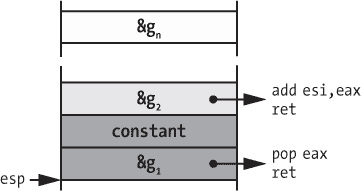

## 8

自定义反汇编

到目前为止，我已经讨论了基本的二进制分析和反汇编技术。但是，这些基本技术并不是为了解决那些打破标准反汇编假设的混淆二进制文件，或者像漏洞扫描这样的特殊分析设计的。有时候，即使是反汇编工具提供的脚本功能也不足以解决这些问题。在这种情况下，你可以构建一个专门的反汇编引擎，量身定制，满足你的需求。

在本章中，你将学习如何使用*Capstone*实现一个自定义反汇编器，*Capstone*是一个反汇编框架，能够让你完全控制整个分析过程。你将首先探索 Capstone API，使用它构建一个自定义的线性反汇编器和递归反汇编器。接着，你将学习如何实现一个更先进的工具，即*返回导向编程（ROP）*小工具扫描器，利用它构建 ROP 利用攻击。

### 8.1 为什么要编写自定义反汇编模块？

大多数著名的反汇编工具，如 IDA Pro，旨在帮助手动逆向工程。这些是强大的反汇编引擎，提供了广泛的图形界面，丰富的选项来可视化反汇编的代码，以及方便的方式来浏览大量汇编指令。当你的目标仅仅是理解一个二进制文件的功能时，通用反汇编工具足够使用，但通用工具缺乏进行高级自动化分析所需的灵活性。虽然许多反汇编工具提供了用于后处理反汇编代码的脚本功能，但它们并不提供调整反汇编过程本身的选项，也不适用于高效批量处理二进制文件。因此，当你希望对多个二进制文件进行专门的自动化分析时，你将需要一个自定义反汇编器。

#### *8.1.1 自定义反汇编的应用案例：混淆代码*

当你需要分析那些打破标准反汇编假设的二进制文件时，比如恶意软件、混淆的或手工制作的二进制文件，或者从内存转储或固件中提取的二进制文件时，自定义反汇编模块就非常有用。此外，自定义反汇编模块还允许你轻松实现专门的二进制分析，如扫描特定的伪迹象，例如指示可能存在漏洞的代码模式。它们还可以作为研究工具，帮助你尝试新的反汇编技术。

作为定制反汇编的第一个具体应用案例，我们来考虑一种特定类型的代码混淆，它使用 *指令重叠*。大多数反汇编工具会为每个二进制文件输出一份单一的反汇编列表，因为它们假设二进制文件中的每个字节至多对应一条指令，每条指令都包含在一个单独的基本块中，而每个基本块都是某个函数的一部分。换句话说，反汇编工具通常假设代码块之间不会互相重叠。指令重叠打破了这个假设，迷惑了反汇编工具，使得重叠的代码更难以进行逆向工程。

指令重叠之所以可行，是因为 x86 平台上的指令长度各不相同。与其他一些平台（如 ARM）不同，并非所有 x86 指令都由相同数量的字节组成。因此，处理器不会强制要求指令在内存中的特定对齐方式，这使得一条指令有可能占用已经被另一条指令占用的代码地址。这意味着，在 x86 上，你可以从某条指令的中间开始反汇编，而反汇编的结果将会是与第一条指令部分（或完全）重叠的 *另一* 条指令。

混淆器乐于滥用指令重叠来迷惑反汇编工具。指令重叠在 x86 上尤其容易实现，因为 x86 指令集极为紧凑，这意味着几乎任何字节序列都对应着某条有效的指令。

列表 8-1 展示了一个指令重叠的示例。你可以在 *overlapping_bb.c* 中找到产生此列表的原始源代码。要反汇编重叠的代码，你可以使用 `objdump` 的 `-start-address=<addr>` 标志，从给定地址开始反汇编。

*列表 8-1：重叠 _bb 的反汇编（1）*

```
   $ objdump -M   intel --start-address=0x4005f6 -d overlapping_bb
   4005f6: push   rbp
   4005f7: mov    rbp,rsp
   4005fa: mov    DWORD PTR [rbp-0x14],edi   ; ➊load i
   4005fd: mov    DWORD PTR [rbp-0x4],0x0    ; ➋j = 0
   400604: mov    eax,DWORD PTR [rbp-0x14]   ; eax = i
   400607: cmp    eax,0x0                    ; cmp i to 0
➌ 40060a: jne    400612 <overlapping+0x1c>   ; if i != 0, goto 0x400612
   400610: xor    eax,0x4                    ; eax = 4 (0 xor 4)
   400613: add    al,0x90                    ; ➍eax = 148 (4 + 144)
   400615: mov    DWORD PTR [rbp-0x4],eax    ; j = eax
   400618: mov    eax,DWORD PTR [rbp-0x4]    ; return j
   40061b: pop    rbp
   40061c: ret
```

列表 8-1 展示了一个简单的函数，它接受一个输入参数，称为 `i` ➊，并有一个局部变量 `j` ➋。经过一些计算后，函数返回 `j`。

仔细观察，你应该会注意到一些奇怪的地方：地址 `40060a` ➌ 处的 `jne` 指令条件跳转到指令 `400610` 开始的 *中间* 部分，而不是继续执行任何列出指令的 *开始*！大多数反汇编工具，如 `objdump` 和 IDA Pro，只会反汇编 列表 8-1 中显示的指令。这意味着通用反汇编工具会错过地址 `400612` 处的重叠指令，因为这些字节已经被 `jne` 指令的 fall-through 跳转所占用。这种指令重叠使得隐藏对程序整体结果有重大影响的代码路径成为可能。例如，考虑以下情况。

在 清单 8-1 中，如果地址 `40060a` 处的跳转没有被执行（`i == 0`），穿透情况到达的指令会计算并返回值 `148` ➍。然而，如果跳转*被*执行（`i != 0`），那么在 清单 8-1 中隐藏的代码路径会被执行。我们来看看 清单 8-2，它展示了这个隐藏的代码路径，看看它是如何返回完全不同的值的。

*清单 8-2：重叠基本块的反汇编（2）*

```
   $ objdump -M intel --start-address=0x4005f6 -d overlapping_bb
   4005f6:  push  rbp
   4005f7:  mov   rbp,rsp
 4005fa:  mov   DWORD PTR [rbp-0x14],edi  ; load i
   4005fd:  mov   DWORD PTR [rbp-0x4],0x0   ; j = 0
   400604:  mov   eax,DWORD PTR [rbp-0x14]  ; eax = i
   400607:  cmp   eax,0x0                   ; cmp i to 0
➊ 40060a:  jne   400612 <overlapping+0x1c> ; if i != 0, goto 0x400612

   # 400610: ; skipped
   # 400611: ; skipped

   $ objdump -M intel --start-address=0x400612 -d overlapping_bb
➋ 400612:  add  al,0x4                      ; ➌eax = i + 4
   400614:  nop
   400615:  mov  DWORD PTR [rbp-0x4],eax    ; j = eax
   400618:  mov  eax,DWORD PTR [rbp-0x4]    ; return j
   40061b:  pop  rbp
   40061c:  ret
```

清单 8-2 显示了如果执行 `jne` 指令 ➊ 的代码路径。在这种情况下，它跳过两个字节（`400610` 和 `400611`），跳转到地址 `0x400612` ➋，这是 `xor` 指令的中间部分，这个指令出现在 `jne` 的穿透情况中。这会导致不同的指令流。特别是，`j` 上进行的算术运算现在不同，导致函数返回 `i + 4` ➌ 而不是 `148`。正如你能想象的那样，这种混淆使得代码难以理解，特别是当这种混淆在多个地方应用时。

通常，你可以通过在不同的偏移量重新启动反汇编来诱使反汇编器揭示隐藏的指令，就像我在前面的清单中使用 `objdump` 的 `-start-address` 标志所做的那样。如 清单 8-2 所示，在地址 `400612` 重新启动反汇编可以揭示隐藏在那里的指令。然而，这样做会导致地址 `400610` 处的指令变得隐藏。某些混淆程序充斥着像这个例子中展示的重叠代码序列，使得代码非常繁琐，且手动调查时十分困难。

清单 8-1 和 8-2 的示例表明，构建一个专门的去混淆工具，可以自动“解开”重叠指令，这可以大大简化逆向工程。特别是如果你经常需要逆向混淆的二进制文件，那么构建去混淆工具的努力在长远来看是值得的。^(1) 本章后续内容中，你将学习如何构建一个递归反汇编器，它能够处理像前面清单所示的重叠基本块。

非混淆二进制文件中的重叠代码

有趣的是，重叠指令不仅发生在故意混淆的代码中，还出现在包含手写汇编的高度优化代码中。诚然，第二种情况更容易处理，而且出现的频率也要低得多。以下清单展示了来自 `glibc` 2.22 的重叠指令。^(*a*)

```
7b05a: cmp          DWORD PTR fs:0x18,0x0
7b063: je           7b066
7b065: lock cmpxchg QWORD PTR [rip+0x3230fa],rcx
```

根据 `cmp` 指令的结果，`je` 指令要么跳转到地址 `7b066`，要么继续执行到地址 `7b065`。唯一的区别是，后者地址对应一个 `lock cmpxchg` 指令，而前者对应一个 `cmpxchg`。换句话说，条件跳转用于在同一指令的锁定和非锁定变种之间进行选择，通过选择性跳过一个 `lock` 前缀字节。

*a*. `glibc` 是 GNU C 库。它几乎在所有在 GNU/Linux 平台上编译的 C 程序中都会使用，因此经过了大量的优化。

#### *8.1.2 编写自定义反汇编器的其他原因*

混淆代码并不是构建自定义反汇编流程的唯一原因。一般来说，定制化在你需要完全控制反汇编过程的任何情况下都非常有用。正如我之前提到的，那些情况通常出现在你分析混淆的或其他特殊的二进制文件时，或者当你需要进行通用反汇编工具不支持的专业分析时。

在本章后面，你将看到一个示例，展示如何使用自定义反汇编来构建 ROP gadget 扫描器，这需要从多个起始偏移量反汇编二进制文件，而大多数反汇编器并不直接支持这种操作。ROP gadget 扫描涉及在二进制文件中查找每一个可能的代码序列，包括未对齐的代码序列，这些序列可以在 ROP 利用中使用。

反过来，有时你可能会想从反汇编中省略某些代码路径，而不是查找每一个可能的代码序列。例如，这在你希望忽略混淆器创建的虚假路径^(2)，或者构建一个混合静态-动态分析并将反汇编集中在你已经动态探索过的特定路径时非常有用。

也有一些情况，构建自定义反汇编工具可能并非出于技术上的必要，而是为了提高效率或降低成本。例如，自动化二进制分析工具通常只需要非常基础的反汇编功能。它们最艰难的部分是自定义分析反汇编后的指令，而这一步并不需要像自动反汇编器那样提供复杂的用户界面或便利功能。在这种情况下，你可以选择使用免费的开源反汇编库来构建自己的自定义工具，而不是依赖那些可能昂贵的商业反汇编器，后者的费用可能高达数千美元。

构建自定义反汇编器的另一个原因是效率。标准反汇编器中的脚本通常需要对代码进行至少两次遍历：一次用于初始的反汇编，另一次用于脚本进行的后处理。此外，这些脚本通常是用高级语言（如 Python）编写的，这导致了相对较差的运行时性能。这意味着，在对许多大型二进制文件进行复杂分析时，构建一个能够原生运行并在一次遍历中完成所有必要分析的工具，往往能大大提高性能。

现在你已经了解了自定义反汇编的有用性，让我们看看如何进行！我将从简要介绍*Capstone*开始，它是构建自定义反汇编工具最流行的库之一。

### 8.2 Capstone 简介

Capstone 是一个反汇编框架，旨在提供一个简单、轻量级的 API，能够透明地处理大多数流行的指令架构，包括 x86/x86-64、ARM、MIPS 等。它为 C/C++和 Python（以及其他语言，虽然我们将像往常一样使用 C/C++）提供了绑定，并支持所有流行平台，包括 Windows、Linux 和 macOS。它也是完全免费的，且开源。

使用 Capstone 构建反汇编工具是一个直接的过程，具有极其多样的可能性。尽管 API 主要围绕几个函数和数据结构构建，但它并没有为了简洁而牺牲可用性。使用 Capstone，你可以轻松地恢复反汇编指令的几乎所有相关细节，包括指令操作码、助记符、类别、指令读取和写入的寄存器等。学习 Capstone 的最好方式是通过实例，因此让我们直接开始。

#### *8.2.1 安装 Capstone*

Capstone v3.0.5 已预安装在本书随附的虚拟机中。如果你想在其他机器上尝试 Capstone，安装过程相当简单。Capstone 网站^(3)提供了适用于 Windows 和 Ubuntu 等操作系统的现成软件包，并且提供了一个源代码档案，供在其他平台上安装 Capstone。

和往常一样，我们将使用 C/C++编写基于 Capstone 的工具，但对于快速实验，你也可以使用 Python 来探索 Capstone。为此，你需要 Capstone 的 Python 绑定。这些绑定也已预安装在虚拟机中，但如果你有`pip` Python 包管理器，在你自己的机器上安装它们也非常简单。确保你已经安装了 Capstone 核心包，然后在命令提示符中输入以下内容来安装 Capstone Python 绑定：

```
pip install capstone
```

一旦你有了 Python 绑定，你就可以启动 Python 解释器并开始自己的反汇编实验，如 Listing 8-3 所示。

*Listing 8-3: 探索 Python Capstone 绑定*

```
   >>> import capstone
➊ >>> help(capstone)
   Help on package capstone:

   NAME
       capstone - # Capstone Python bindings, by Nguyen Anh
                  # Quynnh <aquynh@gmail.com>

   FILE
       /usr/local/lib/python2.7/dist-packages/capstone/__init__.py

   [...]

   CLASSES
       __builtin__.object
           Cs
           CsInsn
       _ctypes.PyCFuncPtr(_ctypes._CData)
           ctypes.CFunctionType
       exceptions.Exception(exceptions.BaseException)
           CsError
    ➋class Cs(__builtin__.object)
        | Methods defined here:
        |
        | __del__(self)
        |      # destructor to be called automatically when
        |      # object is destroyed.
        |
        | __init__(self, arch, mode)
        |
 | disasm(self, code, offset, count=0)
        |     # Disassemble binary & return disassembled
        |     # instructions in CsInsn objects
        [...]
```

这个示例导入了`capstone`包，并使用 Python 内置的`help`命令来探索 Capstone ➊。提供主要功能的类是`capstone.Cs` ➋。最重要的是，它提供了访问 Capstone 的`disasm`函数的功能，该函数将代码缓冲区反汇编并返回反汇编结果。要探索 Capstone 的 Python 绑定提供的其他功能，可以使用 Python 内置的`help`和`dir`命令！在本章的其余部分，我将重点介绍使用 C/C++构建 Capstone 工具，但该 API 与 Capstone 的 Python API 非常相似。

#### *8.2.2 使用 Capstone 进行线性反汇编*

从高层次来看，Capstone 将包含一段代码字节的内存缓冲区作为输入，并输出从这些字节中反汇编的指令。使用 Capstone 的最基本方法是将包含给定二进制`.text`部分的所有代码字节的缓冲区传递给它，然后将这些指令线性地反汇编成可读的形式，或者指令助记符。除了初始化和输出解析代码外，Capstone 只需通过调用`cs_disasm`函数即可实现此用法模式。示例 8-4 中的示例实现了一个类似`objdump`的简单工具。为了将二进制文件加载到 Capstone 可以使用的字节块中，我们将重用第四章中实现的基于`libbfd`的二进制加载器（*loader.h*）。

*示例 8-4:* basic_capstone_linear.cc

```
   #include  <stdio.h>
   #include  <string>
   #include  <capstone/capstone.h>
   #include  "../inc/loader.h"

   int disasm(Binary *bin);

   int
   main(int argc, char *argv[])
   {
     Binary bin;
     std::string fname;

     if(argc < 2) {
       printf("Usage: %s <binary>\n", argv[0]);
       return 1;
     }
 fname.assign(argv[1]);
➊    if(load_binary(fname, &bin, Binary::BIN_TYPE_AUTO) < 0) {
       return 1;
     }

➋    if(disasm(&bin) < 0) {
       return 1;
     }

     unload_binary(&bin);

     return 0;
  }

  int
  disasm(Binary *bin)
  {
    csh dis;
    cs_insn *insns;
    Section *text;
    size_t n;

    text = bin->get_text_section();
    if(!text) {
      fprintf(stderr, "Nothing to disassemble\n");
      return 0;
    }

➌   if(cs_open(CS_ARCH_X86, CS_MODE_64, &dis) != CS_ERR_OK) {
      fprintf(stderr, "Failed to open Capstone\n");
      return -1;
    }

➍   n = cs_disasm(dis, text->bytes, text->size, text->vma, 0, &insns);
    if(n <= 0) {
      fprintf(stderr, "Disassembly error: %s\n",
              cs_strerror(cs_errno(dis)));
      return -1;
    }

➎   for(size_t i = 0; i < n; i++) {
      printf("0x%016jx: ", insns[i].address);
      for(size_t j = 0; j < 16; j++) {
        if(j < insns[i].size) printf("%02x ", insns[i].bytes[j]);
        else printf("   ");
      }
 printf("%-12s %s\n", insns[i].mnemonic, insns[i].op_str);
      }

➏    cs_free(insns, n);
      cs_close(&dis);

      return 0;
   }
```

这就是实现一个简单线性反汇编器所需的全部！注意源代码顶部的一行：`#include <capstone/capstone.h>`。要在 C 程序中使用 Capstone，只需包含这个头文件，并使用`-lcapstone`链接器标志将程序与 Capstone 库链接。所有其他 Capstone 头文件都从*capstone.h*中`#include`，因此你不需要手动`#include`它们。覆盖了这些内容后，我们一起浏览示例 8-4 中的剩余源代码。

### 初始化 Capstone

我们从`main`函数开始，它期望一个命令行参数：要反汇编的二进制文件的名称。`main`函数将此二进制文件的名称传递给`load_binary`函数（在第四章中实现），该函数将二进制文件加载到一个名为`bin`的`Binary`对象中 ➊。然后，`main`将`bin`传递给`disasm`函数 ➋，等待它完成，最后通过卸载二进制文件来进行清理。正如你可能猜到的，所有实际的反汇编工作都在`disasm`函数中完成。

为了反汇编给定二进制文件的`.text`部分，`disasm`首先通过调用`bin->get_text_section()`来获取指向表示`.text`部分的`Section`对象的指针。到目前为止，这部分应该在第四章中已经很熟悉了。现在让我们来看看一些实际的 Capstone 代码！

`disasm` 调用的第一个 Capstone 函数是任何使用 Capstone 的程序中的典型函数。它叫做 `cs_open`，其目的是打开一个正确配置的 Capstone 实例 ➌。在本例中，一个正确配置的实例是指设置为反汇编 `x86-64` 代码的实例。你传递给 `cs_open` 的第一个参数是一个常量 `CS_ARCH_X86`，告诉 Capstone 你想要反汇编 x86 架构的代码。更具体地说，你通过传递 `CS_MODE_64` 作为第二个参数，告诉 Capstone 代码将是 64 位的。最后，第三个参数是一个指向类型为 `csh`（即“Capstone 句柄”）的对象的指针。这个指针被称为 `dis`。在 `cs_open` 成功完成后，这个句柄表示一个完全配置好的 Capstone 实例，你将需要它来调用任何其他 Capstone API 函数。如果初始化成功，`cs_open` 返回 `CS_ERR_OK`。

### 反汇编代码缓冲区

现在你已经拥有了一个 Capstone 句柄和加载的代码段，可以开始反汇编了！这只需要调用一次 `cs_disasm` 函数 ➍。

该调用的第一个参数是 `dis`，也就是你的 Capstone 句柄。接下来，`cs_disasm` 期望一个缓冲区（具体来说是 `const uint8_t*`）来存放待反汇编的代码，一个 `size_t` 整数表示缓冲区中代码字节的数量，以及一个 `uint64_t` 表示缓冲区中第一个字节的虚拟内存地址（VMA）。代码缓冲区及相关值都方便地预加载在代表加载的二进制文件 `.text` 部分的 `Section` 对象中。

`cs_disasm` 的最后两个参数是一个 `size_t`，用于指示要反汇编的指令数（这里是 0，表示尽可能多地反汇编）以及一个指向 Capstone 指令缓冲区（`cs_insn**`）的指针。这个最后的参数需要特别注意，因为 `cs_insn` 类型在基于 Capstone 的应用程序中扮演着核心角色。

### `cs_insn` 结构体

正如你在示例代码中所看到的，`disasm` 函数包含一个类型为 `cs_insn*` 的局部变量，名为 `insns`。`insns` 的地址作为调用 `cs_disasm` 的最后一个参数，见 ➍。在反汇编代码缓冲区时，`cs_disasm` 会构建一个反汇编指令的数组。在反汇编过程结束时，它会将这个数组返回到 `insns` 中，这样你就可以遍历所有的反汇编指令，并以某种特定于应用的方式处理它们。示例代码只是打印了这些指令。每条指令都是一个 `struct` 类型，名为 `cs_insn`，该类型在 *capstone.h* 中定义，如 列表 8-5 所示。

*列表 8-5：* `struct cs_insn` *在* capstone.h *中的定义*

```
typedef struct   cs_insn {
  unsigned int    id;
  uint64_t        address;
  uint16_t        size;
  uint8_t         bytes[16];
  char            mnemonic[32];
  char            op_str[160];
  cs_detail      *detail;
} cs_insn;
```

`id` 字段是一个唯一的（架构特定的）指令类型标识符，可以让你在不进行字符串比较的情况下检查你正在处理的指令类型。例如，你可以实现针对反汇编指令的指令特定处理，正如 Listing 8-6 中所示。

*Listing 8-6: 使用 Capstone 进行指令特定处理*

```
switch(insn->id) {
case X86_INS_NOP:
  /* handle NOP instruction */
  break;
case X86_INS_CALL:
  /* handle call instruction */
  break;
default:
  break;
}
```

在这个例子中，`insn` 是指向 `cs_insn` 对象的指针。请注意，`id` 值在特定架构内是唯一的，而不是跨架构唯一的。可能的值在架构特定的头文件中定义，你将在 Section 8.2.3 中看到。

`cs_insn` 中的 `address`、`size` 和 `bytes` 字段包含指令的地址、字节数和字节内容。`mnemonic` 是一个表示指令的可读字符串（不包含操作数），而 `op_str` 是指令操作数的可读表示。最后，`detail` 是指向一个（主要是架构特定的）数据结构的指针，包含有关反汇编指令的更详细信息，例如它读取和写入哪些寄存器。请注意，只有在你明确启用 Capstone 的详细反汇编模式后，`detail` 指针才会被设置，而本示例中并未启用该模式。在 Section 8.2.4 中，你将看到使用详细反汇编模式的示例。

### 反汇编代码解释与清理

如果一切顺利，`cs_disasm` 应该返回反汇编的指令数量。如果失败，它会返回 0，你必须调用 `cs_errno` 函数来检查错误是什么。这将返回一个 `enum` 类型的 `cs_err` 值。在大多数情况下，你需要打印一个可读的错误信息并退出。为此，Capstone 提供了一个便捷的函数 `cs_strerror`，它将一个 `cs_err` 值转换为描述错误的字符串。

如果没有错误，`disasm` 函数会遍历 `cs_disasm` 返回的所有反汇编指令 ➎（参见 Listing 8-4）。这个循环会为每条指令打印一行，包含之前描述的 `cs_insn` 结构体中的不同字段。最后，在循环完成后，`disasm` 会调用 `cs_free(insns, n)` 来释放 Capstone 为它解析到 `insns` 缓冲区中的每条 `n` 条指令分配的内存 ➏，然后通过调用 `cs_close` 来关闭 Capstone 实例。

现在你应该已经了解了进行基本反汇编和分析任务所需的大部分重要 Capstone 函数和数据结构。如果你愿意，可以尝试编译并运行 `basic_capstone_linear` 示例。它的输出应该是反汇编二进制文件 `.text` 区段中的指令列表，参考 Listing 8-7。

*Listing 8-7: 线性反汇编工具的示例输出*

```
$ ./basic_capstone_linear /bin/ls | head   -n 10
0x402a00: 41 57                  push      r15
0x402a02: 41 56                  push      r14
0x402a04: 41 55                  push      r13
 0x402a06: 41 54                  push      r12
0x402a08: 55                     push      rbp
0x402a09: 53                     push      rbx
0x402a0a: 89 fb                  mov       ebx,   edi
0x402a0c: 48 89 f5               mov       rbp,   rsi
0x402a0f: 48 81 ec 88 03 00 00   sub       rsp,   0x388
0x402a16: 48 8b 3e               mov       rdi,   qword ptr [rsi]
```

在本章的其余部分，你将看到更多使用 Capstone 的详细反汇编示例。更复杂的示例大多归结为解析一些更详细的数据结构。它们并不比你已经看到的示例更加困难。

#### *8.2.3 探索 Capstone C API*

现在你已经了解了一些基本的 Capstone 函数和数据结构，你可能会想知道 Capstone API 的其余部分是否有文档。目前，遗憾的是并没有一份全面的 Capstone API 文档。你手头上最接近的资源是 Capstone 的头文件。幸运的是，这些文件注释清晰且不复杂，因此只需一些基本的指引，你就能快速浏览它们，找到任何给定项目所需的内容。Capstone 的头文件包括所有与 Capstone v3.0.5 一同发布的 C 语言头文件。我在 Listing 8-8 中阴影标出了这些文件中最重要的部分。

*Listing 8-8: Capstone C 头文件*

```
$ ls /usr/include/capstone/
arm.h arm64.h capstone.h    mips.h   platform.h  ppc.h

sparc.h  systemz.h  x86.h  xcore.h
```

如你所见，*capstone.h* 是 Capstone 的主要头文件。它包含了所有 Capstone API 函数的注释定义，以及一些与架构无关的数据结构，如 `cs_insn` 和 `cs_err`。这里也是所有 `enum` 类型（如 `cs_arch`、`cs_mode` 和 `cs_err`）的所有可能值的定义所在。例如，如果你想修改线性反汇编器，使其支持 ARM 代码，你可以参考 *capstone.h* 来查找适当的架构（`CS_ARCH_ARM`）和模式（`CS_MODE_ARM`）参数，然后将它们传递给 `cs_open` 函数。^(4)

依赖架构的数据结构和常量定义在单独的头文件中，例如 x86 和 x86-64 架构的 *x86.h*。这些文件指定了 `cs_insn` 结构体中 `id` 字段的可能值——对于 x86，这些值全部是名为 `x86_insn` 的 `enum` 类型中列出的值。大部分情况下，你需要参考特定架构的头文件，了解通过 `cs_insn` 类型的 `detail` 字段可以访问哪些详细信息。如果启用了详细反汇编模式，该字段指向一个 `cs_detail` 结构体。

`cs_detail` 结构体包含一个依赖架构的 `union`，其中包含提供指令详细信息的不同 `struct` 类型。与 x86 相关的类型叫做 `cs_x86`，定义在 *x86.h* 中。为了说明这一点，接下来我们将构建一个递归反汇编器，使用 Capstone 的详细反汇编模式获取 x86 指令的架构特定信息。

#### *8.2.4 使用 Capstone 的递归反汇编*

在没有详细反汇编的情况下，Capstone 只允许你检查关于指令的基本信息，如地址、原始字节或助记符表示。这对于线性反汇编器来说是足够的，正如你在之前的示例中看到的那样。然而，更高级的二进制分析工具通常需要根据指令属性做出决策，例如指令访问的寄存器、操作数的类型和值、指令类型（算术、控制流等）或控制流指令指向的位置。这类详细信息只有在 Capstone 的详细反汇编模式中才会提供。解析这些信息需要 Capstone 额外的处理，因此详细反汇编的速度比非详细模式慢。因此，你应仅在需要时使用详细模式。递归反汇编就是需要详细反汇编模式的一个场景。递归反汇编是许多二进制分析应用中的一个常见主题，所以我们来更详细地探讨它。

回顾一下第六章，递归反汇编通过从已知的入口点（如二进制文件的主入口点或函数符号）开始，跟随控制流指令来发现代码。与盲目按顺序反汇编所有代码的线性反汇编不同，递归反汇编不容易被诸如与代码交错的数据等情况欺骗。缺点是，如果指令只能通过间接控制流访问，而这些控制流无法静态解析，递归反汇编可能会遗漏这些指令。

### 设置详细反汇编模式

清单 8-9 展示了递归反汇编的基本实现。与大多数递归反汇编器不同，本示例中的反汇编器并不假设字节一次只能属于单条指令，因此支持重叠的代码块。

*清单 8-9:* basic_capstone_recursive.cc

```
   #include   <stdio.h>
   #include   <queue>
   #include   <map>
   #include   <string>
   #include   <capstone/capstone.h>
   #include   "../inc/loader.h"
 int disasm(Binary *bin);
   void print_ins(cs_insn *ins);
   bool is_cs_cflow_group(uint8_t g);
   bool is_cs_cflow_ins(cs_insn *ins);
   bool is_cs_unconditional_cflow_ins(cs_insn *ins);
   uint64_t get_cs_ins_immediate_target(cs_insn *ins);

   int
   main(int argc, char *argv[])
   {
     Binary bin;
     std::string fname;

     if(argc < 2) {
       printf("Usage: %s <binary>\n", argv[0]);
       return 1;
     }

     fname.assign(argv[1]);
     if(load_binary(fname, &bin, Binary::BIN_TYPE_AUTO) < 0) {
       return 1;
     }

     if(disasm(&bin) < 0) {
       return 1;
     }

     unload_binary(&bin);

     return 0;
   }

   int
   disasm(Binary *bin)
   {
     csh dis;
     cs_insn *cs_ins;
     Section *text;
     size_t n;
     const uint8_t *pc;
     uint64_t addr, offset, target;
     std::queue<uint64_t> Q;
     std::map<uint64_t, bool> seen;

     text = bin->get_text_section();
     if(!text) {

     fprintf(stderr, "Nothing to disassemble\n");
     return 0;
   }

   if(cs_open(CS_ARCH_X86, CS_MODE_64, &dis) != CS_ERR_OK) {
     fprintf(stderr, "Failed to open Capstone\n");
     return -1;
   }
➊  cs_option(dis, CS_OPT_DETAIL, CS_OPT_ON);

➋  cs_ins = cs_malloc(dis);
    if(!cs_ins) {
      fprintf(stderr, "Out of memory\n");
      cs_close(&dis);
      return -1;
   }

   addr = bin->entry;
➌  if(text->contains(addr)) Q.push(addr);
    printf("entry point: 0x%016jx\n", addr);

➍  for(auto &sym: bin->symbols) {
      if(sym.type == Symbol::SYM_TYPE_FUNC
         && text->contains(sym.addr)) {
        Q.push(sym.addr);
        printf("function symbol: 0x%016jx\n", sym.addr);
      }
    }

➎  while(!Q.empty()) {
      addr = Q.front();
      Q.pop();
      if(seen[addr]) continue;

      offset = addr - text->vma;
      pc      = text->bytes + offset;
      n       = text->size - offset;
➏    while(cs_disasm_iter(dis, &pc, &n, &addr, cs_ins)) {
        if(cs_ins->id == X86_INS_INVALID || cs_ins->size == 0) {
          break;
        }

        seen[cs_ins->address] = true;
        print_ins(cs_ins);

➐      if(is_cs_cflow_ins(cs_ins)) {
➑        target = get_cs_ins_immediate_target(cs_ins);
 if(target && !seen[target] && text->contains(target)) {
            Q.push(target);
            printf(" -> new target: 0x%016jx\n", target);
          }
➒        if(is_cs_unconditional_cflow_ins(cs_ins)) {
           break;
          }
        } ➓else if(cs_ins->id == X86_INS_HLT) break;
      }
      printf("----------\n");
   }

   cs_free(cs_ins, 1);
   cs_close(&dis);

   return 0;
   }

   void
   print_ins(cs_insn *ins)
   {
     printf("0x%016jx: ", ins->address);
     for(size_t i = 0; i < 16; i++) {
       if(i < ins->size) printf("%02x ", ins->bytes[i]);
       else printf("   ");
     }
     printf("%-12s %s\n", ins->mnemonic, ins->op_str);
   }

   bool
   is_cs_cflow_group(uint8_t g)
   {
     return (g == CS_GRP_JUMP) || (g == CS_GRP_CALL)
            || (g == CS_GRP_RET) || (g == CS_GRP_IRET);
   }

   bool
   is_cs_cflow_ins(cs_insn *ins)
   {
     for(size_t i = 0; i < ins->detail->groups_count; i++) {
       if(is_cs_cflow_group(ins->detail->groups[i])) {
         return true;
       }
     }

     return false;
   }
 bool
   is_cs_unconditional_cflow_ins(cs_insn *ins)
   {
     switch(ins->id) {
     case X86_INS_JMP:
     case X86_INS_LJMP:
     case X86_INS_RET:
     case X86_INS_RETF:
     case X86_INS_RETFQ:
       return true;
     default:
       return false;
     }
   }

   uint64_t
   get_cs_ins_immediate_target(cs_insn *ins)
   {
     cs_x86_op *cs_op;

     for(size_t i = 0; i < ins->detail->groups_count; i++) {
       if(is_cs_cflow_group(ins->detail->groups[i])) {
         for(size_t j = 0; j < ins->detail->x86.op_count; j++) {
           cs_op = &ins->detail->x86.operands[j];
           if(cs_op->type == X86_OP_IMM) {
             return cs_op->imm;
           }
         }
       }
     }

     return 0;
   }
```

正如你在清单 8-9 中看到的，`main`函数与线性反汇编器中的 `main` 函数完全相同。大部分情况下，`disasm`函数开头的初始化代码也很相似。它首先加载`.text`段并获取一个 Capstone 句柄。然而，有一个小而重要的补充 ➊。这行代码通过激活 `CS_OPT_DETAIL` 选项来启用详细反汇编模式。这对于递归反汇编至关重要，因为你需要控制流信息，而这些信息只有在详细反汇编模式中才会提供。

接下来，代码显式地分配了一个指令缓冲区 ➋。虽然在线性反汇编器中并不需要这个缓冲区，但在这里需要它，因为你将使用与之前不同的 Capstone API 函数进行实际反汇编。这个替代的反汇编函数允许你在反汇编每条指令时即时检查它，而无需等待所有其他指令都被反汇编完毕。这是详细反汇编中的常见需求，因为你通常希望在过程中对每条指令的细节进行处理，以便影响反汇编器的控制流。

### 通过入口点进行循环

在 Capstone 初始化之后，递归反汇编器的逻辑开始执行。递归反汇编器是围绕一个队列构建的，这个队列包含反汇编器的起始点。第一步是通过填充队列来启动反汇编过程，填充的内容包括：二进制文件的主入口点➌以及任何已知的函数符号 ➍。之后，代码进入主反汇编循环 ➎。

如前所述，循环是围绕一个地址队列构建的，这些地址用作反汇编的起始点。只要还有更多的起始点需要探索，每次迭代都会从队列中弹出下一个起始点，然后从那里开始跟随控制流，尽可能多地反汇编代码。实质上，这个过程从每个起始点执行线性反汇编，将每个新发现的控制流目标推入队列。新的目标将在循环的后续迭代中被反汇编。每次线性扫描只会在遇到`hlt`指令或无条件跳转时停止，因为这些指令无法保证有有效的跳转目标。这些指令后面可能是数据而不是代码，因此你不希望继续反汇编它们之后的内容。

该循环使用了几个你可能以前没见过的 Capstone 新函数。首先，它使用了一个不同的 API 调用，名为`cs_disasm_iter`，来执行实际的反汇编 ➏。此外，还有一些函数可以检索详细的反汇编信息，例如控制流指令的目标和判断某条指令是否为控制流指令的信息。让我们先讨论一下为什么在这个例子中需要使用`cs_disasm_iter`而不是传统的`cs_disasm`。

### 使用迭代式反汇编进行实时指令解析

顾名思义，`cs_disasm_iter`是`cs_disasm`函数的迭代变体。使用`cs_disasm_iter`时，Capstone 不会一次性反汇编整个代码缓冲区，而是每次只反汇编一条指令。每反汇编完一条指令，`cs_disasm_iter`会返回`true`或`false`。`true`表示指令成功反汇编，而`false`表示没有任何指令被反汇编。你可以轻松创建一个`while`循环，如➏所示，调用`cs_disasm_iter`直到没有剩余的代码可供反汇编。

`cs_disasm_iter`的参数本质上是你在线性反汇编器中看到的那些参数的迭代变体。如同之前一样，第一个参数是你的 Capstone 句柄。第二个参数是指向要反汇编代码的指针。不过，现在它是一个双指针（即`uint8_t**`），而不是`uint8_t*`。这样，`cs_disasm_iter`可以在每次调用时自动更新指针，将其设置为指向刚刚反汇编过的字节之后的位置。由于这种行为类似于程序计数器，因此这个参数叫做`pc`。如你所见，对于队列中的每个起始点，你只需要将`pc`指向`.text`段中的正确位置一次。之后，你可以简单地在循环中调用`cs_disasm_iter`，它会自动处理`pc`的递增。

第三个参数是剩余的字节数，用于反汇编，`cs_disasm_iter`会自动递减该值。在这种情况下，它始终等于`.text`段的大小减去已反汇编的字节数。

还有一个自动递增的参数叫做`addr`，它告诉 Capstone 代码指针`pc`所指向的代码的虚拟内存地址（就像线性反汇编器中的`text->vma`）。最后一个参数是指向`cs_insn`对象的指针，它作为每条反汇编指令的缓冲区。

使用`cs_disasm_iter`代替`cs_disasm`有几个优点。使用它的主要原因是它的迭代行为，允许你在每条指令反汇编后立即检查它，从而让你检查控制流指令并递归跟踪它们。除了有用的迭代行为外，`cs_disasm_iter`还比`cs_disasm`更快、更节省内存，因为它不需要一个大的预分配缓冲区来一次性容纳所有反汇编的指令。

### 解析控制流指令

如你所见，拆解循环使用了多个辅助函数来判断某个特定指令是否为控制流指令，并且如果是，它的目标地址是什么。例如，`is_cs_cflow_ins`函数（在➐处调用）用于判断某个指令是否为任何类型的控制流指令（无论是条件跳转还是无条件跳转）。为此，它检查了 Capstone 提供的详细拆解信息。特别地，Capstone 提供的`ins->detail`结构体包含了一个指令所属的“组”数组（`ins->detail->groups`）。通过这些信息，你可以轻松地根据指令所属的组做出决策。例如，你可以知道某个指令是跳转指令，而不需要显式地检查`ins->id`字段是否与所有可能的跳转指令匹配，如`jmp`、`ja`、`je`、`jnz`等。在`is_cs_cflow_ins`函数中，它会检查指令是否属于跳转、调用、返回或中断返回指令类型（实际检查由另一个辅助函数`is_cs_cflow_group`实现）。如果指令属于这四种类型中的任何一种，它就被认为是控制流指令。

如果一个拆解的指令被识别为控制流指令，那么你需要尽可能解析它的目标地址，并将其添加到队列中（如果之前没有见过该地址），以便稍后对该目标地址处的指令进行拆解。解析控制流目标地址的代码在一个名为`get_cs_insn_immediate_target`的辅助函数中。示例在➑处调用了这个函数。顾名思义，它只能解析“立即”控制流目标：即在控制流指令中硬编码的目标地址。换句话说，它不会尝试解析间接控制流目标，因为这在静态分析中是非常困难的，正如你在第六章中看到的那样。

解析控制流目标是这个例子中架构特定指令处理的第一个实例。解决控制流目标需要检查指令的操作数，并且由于每种指令架构都有自己的一组操作数类型，不能以通用方式解析它们。在这个例子中，你正在操作 x86 代码，因此你需要访问 Capstone 提供的 x86 特定操作数字段数组，作为详细反汇编信息的一部分（`ins->detail->x86.operands`）。该数组包含以`struct`类型`cs_x86_op`表示的操作数。该`struct`包含一个匿名`union`，其中包含所有可能的操作数类型：寄存器（`reg`）、立即数（`imm`）、浮动点数（`fp`）或内存（`mem`）。实际设置的字段取决于操作数类型，类型由`cs_x86_op`中的`type`字段指示。示例反汇编器只解析立即数类型的控制流目标，因此它检查`type X86_OP_IMM`的操作数，并返回它找到的任何立即数目标的值。如果该目标尚未被反汇编，`disasm`函数会将其加入队列。

最后，如果`disasm`遇到`hlt`指令或无条件控制流指令，它会停止反汇编，因为它无法知道这些指令后面是否还有非代码字节。为了检查无条件控制流指令，`disasm`调用另一个辅助函数，叫做`is_cs_unconditional_cflow_ins` ➒。这个函数通过`ins->id`字段显式检查所有相关的指令类型，因为这种类型的指令种类有限。在➓处有一个单独的检查针对`hlt`指令。当反汇编循环结束后，`disasm`函数会清理分配的指令缓冲区并关闭 Capstone 句柄。

### 运行递归反汇编器

刚才探讨的递归反汇编算法是许多自定义反汇编工具的基础，也是像 Hopper 或 IDA Pro 这样的完整反汇编套件的基础。当然，这些工具包含比这个简单示例更多的启发式方法，用于识别函数入口点和其他有用的代码属性，即使没有函数符号也能识别。尝试编译并运行递归反汇编器！它在具有符号信息的二进制文件上效果最好。它的输出旨在让你跟随递归反汇编过程的每一步。例如，列表 8-10 展示了本章开头引入的具有重叠基本块的混淆二进制文件的递归反汇编输出片段。

*列表 8-10：递归反汇编器的示例输出*

```
   $ ./basic_capstone_recursive overlapping_bb
   entry point: 0x400500
   function symbol: 0x400530
   function symbol: 0x400570
   function symbol: 0x4005b0
   function symbol: 0x4005d0
   function symbol: 0x4006f0
   function symbol: 0x400680
   function symbol: 0x400500
 function symbol: 0x40061d
   function symbol: 0x4005f6
   0x400500: 31 ed                    xor    ebp, ebp
   0x400502: 49 89 d1                 mov    r9, rdx
   0x400505: 5e                       pop    rsi
   0x400506: 48 89 e2                 mov    rdx, rsp
   0x400509: 48 83 e4 f0              and    rsp, 0xfffffffffffffff0
   0x40050d: 50                       push   rax
   0x40050e: 54                       push   rsp
   0x40050f: 49 c7 c0 f0 06 40   00   mov    r8, 0x4006f0
   0x400516: 48 c7 c1 80 06 40   00   mov    rcx, 0x400680
   0x40051d: 48 c7 c7 1d 06 40   00   mov    rdi, 0x40061d
   0x400524: e8 87 ff ff ff           call   0x4004b0
   0x400529: f4                       hlt
   ----------
   0x400530: b8 57 10 60 00           mov    eax, 0x601057
   0x400535: 55                       push   rbp
   0x400536: 48 2d 50 10 60 00        sub    rax, 0x601050
   0x40053c: 48 83 f8 0e              cmp    rax, 0xe
   0x400540: 48 89 e5                 mov    rbp, rsp
   0x400543: 76 1b                    jbe    0x400560
     -> ➊new target: 0x400560
   0x400545: b8 00 00 00 00           mov    eax, 0
   0x40054a: 48 85 c0                 test   rax, rax
   0x40054d: 74 11                    je     0x400560
     -> new target: 0x400560
   0x40054f: 5d                       pop    rbp
   0x400550: bf 50 10 60 00           mov    edi, 0x601050
   0x400555: ff e0                    jmp    rax
   ----------
   ...
   0x4005f6: 55                       push   rbp
   0x4005f7: 48 89 e5                 mov    rbp, rsp
   0x4005fa: 89 7d ec                 mov    dword ptr [rbp - 0x14], edi
   0x4005fd: c7 45 fc 00 00 00 00     mov    dword ptr [rbp - 4], 0
   0x400604: 8b 45 ec                 mov    eax, dword ptr [rbp - 0x14]
   0x400607: 83 f8 00                 cmp    eax, 0
   0x40060a: 0f 85 02 00 00 00        jne    0x400612
     -> new target: 0x400612
 ➋  0x400610: 83 f0 04                 xor    eax, 4
   0x400613: 04 90                    add    al, 0x90
   0x400615: 89 45 fc                 mov    dword ptr [rbp - 4], eax
   0x400618: 8b 45 fc                 mov    eax, dword ptr [rbp - 4]
   0x40061b: 5d                       pop    rbp
   0x40061c: c3                       ret
   ----------
   ...
➌  0x400612: 04 04                   add     al, 4
   0x400614: 90                       nop
   0x400615: 89 45 fc                 mov    dword ptr [rbp - 4], eax
   0x400618: 8b 45 fc                 mov    eax, dword ptr [rbp - 4]
   0x40061b: 5d                       pop    rbp
   0x40061c: c3                       ret
   ----------
```

如清单 8-10 所示，反汇编器首先排队处理入口点：首先是二进制文件的主入口点，然后是任何已知的函数符号。接着，它会从队列中的每个地址开始，尽可能安全地反汇编尽可能多的代码（破折号表示反汇编器决定停止并移动到队列中的下一个地址的位置）。在此过程中，反汇编器还会发现新的、以前未知的地址，将它们添加到队列中以便稍后反汇编。例如，地址`0x400543`处的`jbe`指令揭示了新的目标地址`0x400560` ➊。反汇编器成功地找到了在模糊二进制文件中重叠的两个代码块：一个位于地址`0x400610` ➋，另一个嵌入其中，位于地址`0x400612` ➌。

### 8.3 实现 ROP Gadget 扫描器

到目前为止，您看到的所有示例都是知名反汇编技术的自定义实现。然而，Capstone 能做得更多！在本节中，您将看到一种更专业的工具，它的反汇编需求是标准的线性或递归反汇编所无法涵盖的。具体来说，您将了解一种对于现代漏洞编写至关重要的工具：一种扫描工具，它能够找到用于 ROP 攻击的 gadget。首先，让我们来探索一下这意味着什么。

#### *8.3.1 返回导向编程简介*

几乎每篇关于漏洞利用的介绍文章都涵盖了 Aleph One 的经典文章《Smashing the Stack for Fun and Profit》，该文解释了基于栈的缓冲区溢出利用的基础。当这篇文章在 1996 年发布时，漏洞利用相对简单：找到一个漏洞，将恶意的 shellcode 加载到目标应用程序中的缓冲区（通常是栈缓冲区），然后利用该漏洞将控制流重定向到 shellcode。

自那时以来，安全领域发生了很多变化，攻击手段变得更加复杂。针对这类经典漏洞的最广泛防御之一是数据执行防护（DEP），也称为 W⊕X 或 NX。它在 2004 年随着 Windows XP 的推出而引入，能够以一种极其简单的方式防止 shellcode 注入。DEP 强制要求任何内存区域不能同时是可写和可执行的。因此，如果攻击者将 shellcode 注入到缓冲区中，他们将无法执行它。

不幸的是，黑客很快找到了一种绕过 DEP 的方法。新的防御措施阻止了 shellcode 的注入，但无法阻止攻击者利用漏洞将控制流重定向到被利用的二进制文件中或它所使用的库中的*现有代码*。这种弱点首次被利用是在一种称为返回到 libc（ret2libc）的攻击中，其中控制流被重定向到广泛使用的 libc 库中的敏感函数，如`execve`函数，后者可用于启动攻击者选择的新进程。

2007 年，出现了一种称为*面向返回编程（ROP）*的广义版本的 ret2libc 攻击。与将攻击限制于现有函数不同，ROP 允许攻击者通过将目标程序内存空间中短小的现有代码序列连接起来来实现任意的恶意功能。这些短小的代码序列在 ROP 术语中被称为*工具链*。

每个工具链都以返回指令结束，并执行基本操作，例如加法或逻辑比较。^(5) 通过精心选择具有明确定义语义的工具链，攻击者可以创建一个本质上是定制化指令集的程序，其中每个工具链形成一个指令，然后使用这个指令集来构建任意功能，也就是所谓的 ROP 程序，而无需注入任何新代码。工具链可以是主机程序正常指令的一部分，也可以是未对齐的指令序列，就像你在清单 8-1 和 8-2 中看到的混淆代码示例那样。

一个 ROP 程序由一系列精心排列在栈上的工具链地址组成，使得每个工具链结束的返回指令将控制权转移到链中的下一个工具链地址。要启动 ROP 程序，你执行一个初始返回指令（例如，通过攻击触发），该指令跳转到第一个工具链地址。图 8-1 展示了一个 ROP 链的示例。



*图 8-1：一个示例 ROP 链。工具链* g[1] *将常量加载到* `eax`，*然后由* g[2] *将其加到* `esi` *中。*

如你所见，栈指针（`esp`寄存器）最初指向链中第一个工具链 g[1]的地址。当初始返回指令发生时，它将栈中的第一个工具链地址弹出，并将控制权转移到该地址，导致 g[1]执行。工具链 g[1]执行一个`pop`指令，将栈上安排的常量加载到`eax`寄存器，并将`esp`递增以指向工具链 g[2]的地址。接着，g[1]的`ret`指令将控制权转移到 g[2]，g[2]随后将`eax`中的常量加到`esi`寄存器中。工具链 g[2]然后返回给工具链 g[3]，以此类推，直到所有工具链 g[1]、...、g[n]都被执行。

正如你可能从中了解到的，创建 ROP 攻击利用需要攻击者首先选择一个合适的 ROP 工具链。在接下来的部分，我们将实现一个工具，该工具扫描二进制文件以查找可用的 ROP 工具链，并创建这些工具链的概览，以帮助构建 ROP 攻击。

#### *8.3.2 查找 ROP 工具链*

接下来的代码展示了 ROP 工具链查找器的代码。它输出给定二进制文件中可以找到的 ROP 工具链列表。你可以使用这个列表来选择合适的工具链，并将它们组合成针对该二进制文件的攻击。

如前所述，你需要找到以返回指令结尾的小工具。此外，你还需要查找与二进制文件的常规指令流对齐或不对齐的小工具。可用的小工具应具有明确且简单的语义，因此它们的长度应相对有限。在这种情况下，我们（随意地）将小工具的长度限制为五条指令。

为了找到对齐和不对齐的小工具，一种可能的方法是从每个可能的起始字节反汇编二进制文件，看看在哪些字节上你会得到一个可用的小工具。然而，你可以通过先扫描二进制文件以查找返回指令（无论是对齐还是不对齐）的位置，然后从这些位置向后遍历，逐渐构建出越来越长的小工具，从而提高效率。这样，你就不必在每个可能的地址处开始反汇编扫描，只需在接近返回指令的地址开始即可。让我们通过仔细查看列表 8-11 中的小工具查找器代码，来更清楚地了解这到底意味着什么。

*列表 8-11:* capstone_gadget_finder.cc

```
  #include <stdio.h>
  #include <map>
  #include <vector>
  #include <string>
  #include <capstone/capstone.h>
  #include "../inc/loader.h"

  int find_gadgets(Binary *bin);
  int find_gadgets_at_root(Section *text, uint64_t root,
                           std::map<std::string, std::vector<uint64_t> > *gadgets,
                           csh dis);
  bool is_cs_cflow_group(uint8_t g);
  bool is_cs_cflow_ins(cs_insn *ins);
  bool is_cs_ret_ins(cs_insn *ins);
  int
  main(int argc, char *argv[])
  {
    Binary bin;
    std::string fname;

    if(argc < 2) {
      printf("Usage: %s <binary>\n", argv[0]);
      return 1;
    }

    fname.assign(argv[1]);
    if(load_binary(fname, &bin, Binary::BIN_TYPE_AUTO) < 0) {
      return 1;
    }

    if(find_gadgets(&bin) < 0) {
      return 1;
    }

    unload_binary(&bin);

    return 0;
  }

  int
  find_gadgets(Binary *bin)
  {
    csh dis;
    Section *text;
    std::map<std::string, std::vector<uint64_t> > gadgets;

    const uint8_t x86_opc_ret = 0xc3;

    text = bin->get_text_section();
    if(!text) {
      fprintf(stderr, "Nothing to disassemble\n");
      return 0;
    }

    if(cs_open(CS_ARCH_X86, CS_MODE_64, &dis) != CS_ERR_OK) {
      fprintf(stderr, "Failed to open Capstone\n");
      return -1;
    }
    cs_option(dis, CS_OPT_DETAIL, CS_OPT_ON);

    for(size_t i = 0; i < text->size; i++) {
➊   if(text->bytes[i] == x86_opc_ret) {
➋     if(find_gadgets_at_root(text, text->vma+i, &gadgets, dis) < 0) {
         break;
        }
      }
    }

➌   for(auto &kv: gadgets) {
       printf("%s\t[ ", kv.first.c_str());
       for(auto addr: kv.second) {
         printf("0x%jx ", addr);
       }
       printf("]\n");
    }

    cs_close(&dis);

    return 0;
  }

  int
  find_gadgets_at_root(Section *text, uint64_t root,
     std::map<std::string, std::vector<uint64_t> > *gadgets,
     csh dis)
  {
     size_t n, len;
     const uint8_t *pc;
     uint64_t offset, addr;
     std::string gadget_str;
     cs_insn *cs_ins;

     const size_t max_gadget_len    = 5; /* instructions */
     const size_t x86_max_ins_bytes = 15;
     const uint64_t root_offset = max_gadget_len*x86_max_ins_bytes;

     cs_ins = cs_malloc(dis);
     if(!cs_ins) {
       fprintf(stderr, "Out of memory\n");
       return -1;
     }

➍   for(uint64_t a = root-1;
                 a >= root-root_offset && a >= 0;
                 a--) {
       addr   = a;
       offset = addr - text->vma;
       pc     = text->bytes + offset;
       n      = text->size - offset;
       len    = 0;
       gadget_str = "";
➎      while(cs_disasm_iter(dis, &pc, &n, &addr, cs_ins)) {
          if(cs_ins->id == X86_INS_INVALID || cs_ins->size == 0) {
            break;
          } ➏else if(cs_ins->address > root) {
            break;
          } ➐else if(is_cs_cflow_ins(cs_ins) && !is_cs_ret_ins(cs_ins)) {
            break;
          } ➑else if(++len > max_gadget_len) {
            break;
          }

➒         gadget_str += std::string(cs_ins->mnemonic)
                        + " " + std::string(cs_ins->op_str);

➓         if(cs_ins->address == root) {
            (*gadgets)[gadget_str].push_back(a);
            break;
          }

          gadget_str += "; ";
        }
      }

      cs_free(cs_ins, 1);

      return 0;
  }

  bool
  is_cs_cflow_group(uint8_t g)
  {
    return (g == CS_GRP_JUMP) || (g == CS_GRP_CALL)
            || (g == CS_GRP_RET) || (g == CS_GRP_IRET);
  }

  bool
  is_cs_cflow_ins(cs_insn *ins)
  {
    for(size_t i = 0; i < ins->detail->groups_count; i++) {
      if(is_cs_cflow_group(ins->detail->groups[i])) {
        return true;
      }
    }
    return false;
  }

  bool
  is_cs_ret_ins(cs_insn *ins)
  {
    switch(ins->id) {
    case X86_INS_RET:
      return true;
    default:
      return false;
    }
  }
```

列表 8-11 中的小工具查找器并没有引入任何新的 Capstone 概念。`main`函数与线性和递归反汇编器中看到的相同，而辅助函数（`is_cs_cflow_group`、`is_cs_cflow_ins`和`is_cs_ret_ins`）也与之前看到的相似。Capstone 反汇编函数`cs_disasm_iter`也是之前见过的。关于小工具查找器的有趣之处在于，它使用 Capstone 以一种标准线性或递归反汇编器无法做到的方式分析二进制文件。所有的小工具查找功能都在函数`find_gadgets`和`find_gadgets_at_root`中实现，所以我们接下来重点讨论它们。

### 扫描根节点并映射小工具

`find_gadgets`函数是从`main`调用的，它的开始方式非常熟悉。首先，它加载`.text`段，并在详细反汇编模式下初始化 Capstone。初始化完成后，`find_gadgets`会遍历`.text`段中的每个字节，检查该字节是否等于`0xc3`，即 x86 `ret`指令的操作码 ➊。^(6) 从概念上讲，每条这样的指令都是一个潜在的“小工具根”，你可以通过从根节点开始向后搜索来找到一个或多个小工具。你可以将所有以特定`ret`指令结尾的小工具看作一棵以该`ret`指令为根的树。为了找到与特定根节点连接的所有小工具，有一个单独的函数，叫做`find_gadgets_at_root`（在 ➋ 处调用），稍后我会详细讨论。

所有的 gadgets 都会被添加到一个 C++ `map` 数据结构中，该结构将每个独特的 gadget（以 `string` 形式）映射到它可以找到的地址集合。实际的 gadget 添加操作发生在 `find_gadgets_at_root` 函数中。在 gadget 搜索完成后，`find_gadgets` 会打印出所有 gadgets 的映射 ➌，并随后进行清理并返回。

### 在给定根地址查找所有的 gadgets

如前所述，`find_gadgets_at_root` 函数会查找所有最终落在给定根指令上的 gadgets。它首先分配一个指令缓冲区，这是使用 `cs_disasm_iter` 时所需的。接着，它进入一个循环，开始从根指令的前一个字节向后搜索，每次迭代时搜索地址减小，直到距离根地址 15 × 5 字节远 ➍。为什么是 15 × 5？这是因为你想要的 gadget 最多包含五条指令，并且由于 x86 指令的长度永远不会超过 15 字节，所以从任何给定的根指令开始，向后搜索的最大距离是 15 × 5 字节。

对于每个搜索偏移，gadget 查找器会执行一次线性反汇编扫描 ➎。与之前的线性反汇编示例不同，本示例在每次反汇编扫描时使用了 Capstone 的`cs_disasm_iter`函数。原因是，相比一次性反汇编整个缓冲区，gadget 查找器需要在每条指令后检查一系列停止条件。

首先，如果遇到无效指令，它会中止线性扫描，丢弃当前 gadget，并继续搜索下一个地址，从那里重新开始新的线性扫描。检查无效指令是非常重要的，因为在不对齐的偏移处的 gadgets 经常是无效的。

如果 gadegt 查找器遇到一个地址超出根地址的指令，它还会中止反汇编扫描 ➏。你可能会想，为什么反汇编会在没有首先遇到根地址本身的情况下到达根地址以外的指令？为了举例说明，记住你反汇编的一些地址是与正常的指令流不对齐的。这意味着，如果你反汇编一个多字节的不对齐指令，反汇编可能会将根指令作为不对齐指令的操作码或操作数的一部分，因此根指令本身并不会出现在不对齐的指令流中。

最后，如果 gadegt 查找器发现了一个除了返回之外的控制流指令 ➐，它会停止反汇编当前的 gadget。毕竟，gadgets 如果除了最后的返回指令外不包含其他控制流，它们会更容易使用。^(7) gadegt 查找器还会丢弃那些超过最大 gadget 大小的 gadgets ➑。

如果没有任何停止条件成立，则小工具查找器会将新反汇编的指令（`cs_ins`）附加到目前为止构建的包含小工具的字符串中➒。当分析到达根指令时，小工具就完成了，并被附加到小工具的`map`中➓。在考虑完所有可能的根指令附近的起始点后，`find_gadgets_at_root`完成并将控制权交回主`find_gadgets`函数，之后如果还有剩余的根指令，程序会继续处理。

### 运行小工具查找器

小工具查找器的命令行接口与反汇编工具相同。列表 8-12 显示了输出应该是什么样的。

*列表 8-12: ROP 扫描器的示例输出*

```
$ ./capstone_gadget_finder /bin/ls | head -n 10
adc byte ptr [r8], r8b; ret                       [ 0x40b5ac ]
adc byte ptr [rax - 0x77], cl; ret                [ 0x40eb10 ]
adc byte ptr [rax], al; ret                       [ 0x40b5ad ]
adc byte ptr [rbp - 0x14], dh; xor eax, eax; ret  [ 0x412f42 ]
adc byte ptr [rcx + 0x39], cl; ret                [ 0x40eb8c ]
adc eax, 0x5c415d5b; ret                 [ 0x4096d7 0x409747 ]
add al, 0x5b; ret                                 [ 0x41254b ]
add al, 0xf3; ret                                 [ 0x404d8b ]
add al, ch; ret                                   [ 0x406697 ]
add bl, dh; ret ; xor eax, eax; ret               [ 0x40b4cf ]
```

每行输出显示一个小工具字符串，后跟此小工具所在的地址。例如，地址`0x406697`处有一个`add al, ch; ret`的小工具，您可以在 ROP 有效载荷中使用它来将`al`和`ch`寄存器相加。像这样概览可用的小工具有助于在为利用漏洞制作 ROP 有效载荷时选择合适的 ROP 小工具。

### 8.4 总结

现在你应该能够熟练使用 Capstone 来开始构建你自己的自定义反汇编器。本章中的所有示例都包含在本书附带的虚拟机中。玩弄这些示例是掌握 Capstone API 的一个好起点。通过以下练习和挑战来检验你的自定义反汇编技能！

练习

1\. 泛化反汇编器

本章中您看到的所有反汇编工具都配置了 Capstone，仅用于反汇编 x64 代码。你通过将`CS_ARCH_X86`和`CS_MODE_64`作为架构和模式参数传递给`cs_open`来实现这一点。

让我们将这些工具泛化，使其能够通过检查加载的二进制文件中的`arch`和`bits`字段，自动选择适合其他架构的 Capstone 参数。这些字段由加载器提供。要弄清楚应该传递给 Capstone 的架构和模式参数，请记住，*/usr/include/capstone/capstone.h*文件中包含了所有可能的`cs_arch`和`cs_mode`值的列表。

2\. 显式检测重叠块

尽管示例中的递归反汇编器能够处理重叠的基本块，但它在遇到重叠代码时并不会给出任何显式警告。扩展反汇编器以通知用户哪些块是重叠的。

3\. 跨变体小工具查找器

从源代码编译程序时，生成的二进制文件可能会因为编译器版本、编译选项或目标架构等因素而有所不同。此外，防止二进制文件被利用的随机化策略（例如通过改变寄存器分配或打乱代码顺序）使得漏洞利用过程更加复杂。这意味着，在开发漏洞利用工具（例如 ROP 漏洞利用）时，你并不总是能够知道目标上运行的是哪种“变体”的程序。例如，目标服务器是用`gcc`还是`llvm`编译的？它是运行在 32 位还是 64 位架构上？如果猜错了，你的漏洞利用可能会失败。

在这个练习中，你的目标是扩展 ROP gadget 查找器，使其能够接受两个或更多的二进制文件作为输入，这些二进制文件代表同一程序的不同变体。它应当输出一个包含所有变体中都可以使用的 gadget 的 VMA 列表。你的新 gadget 查找器应该能够扫描每个输入的二进制文件来查找 gadgets，但只输出那些所有二进制文件都包含 gadget 的地址，而不仅仅是某些二进制文件包含的地址。对于每个报告的 VMA，这些 gadgets 还应当执行类似的操作。例如，它们将包含 `add` 指令或 `mov` 指令。实现可用的相似性概念将是一个挑战。最终的结果应该是一个跨变体的 gadget 查找器，能够用于开发可以同时在同一程序的多个变体上工作的漏洞利用工具！

为了测试你的 gadget 查找器，你可以通过多次使用不同的编译选项或不同的编译器来编译自己选择的程序，生成该程序的不同变体。
