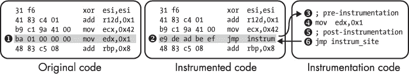
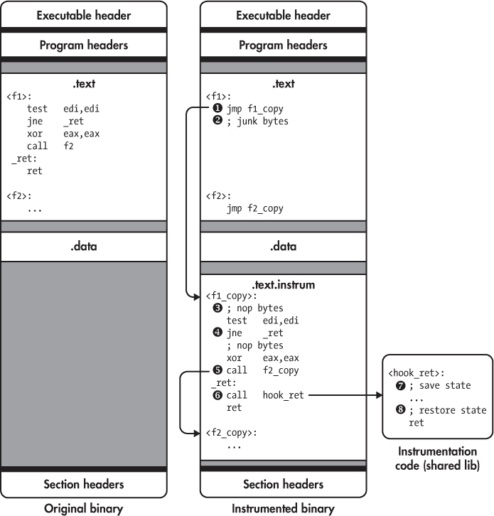
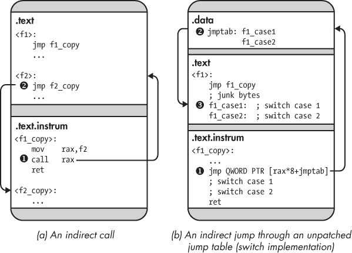
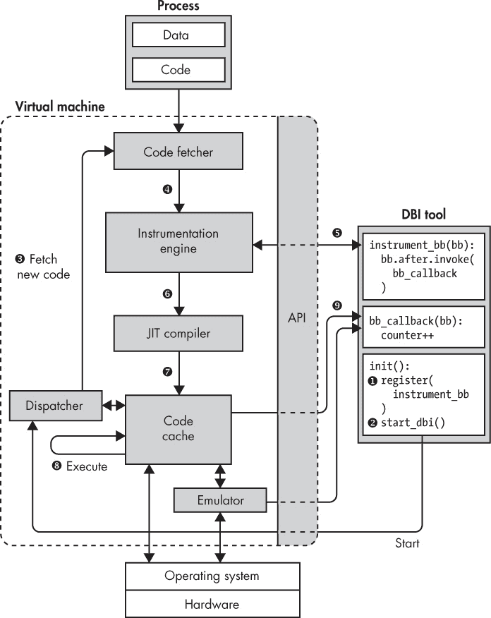
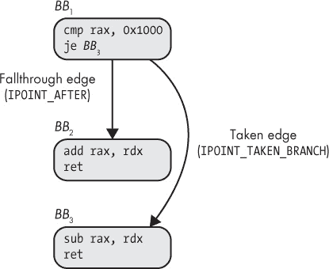
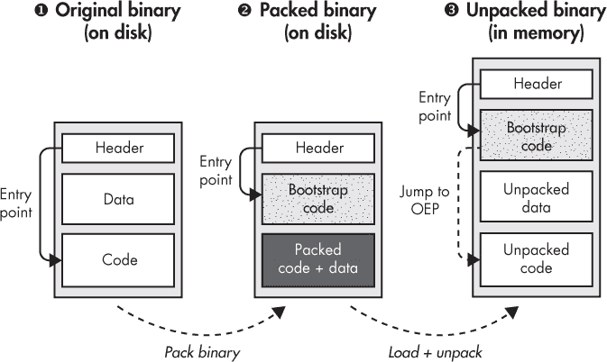
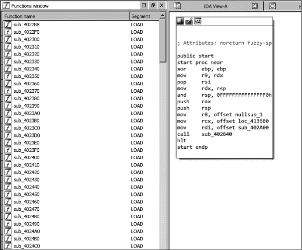

## 9

二进制插桩

在第七章中，你学习了几种修改和增强二进制程序的技术。尽管这些技术相对容易使用，但它们在能够向二进制中插入多少新代码以及能插入到何处方面有所限制。在本章中，你将学习一种叫做*二进制插桩*的技术，它允许你在二进制中的任何位置插入几乎无限量的代码，以观察或修改该二进制的行为。

在简要介绍二进制插桩之后，我将讨论如何实现*静态二进制插桩（SBI）*和*动态二进制插桩（DBI）*，这两种二进制插桩方式具有不同的权衡。最后，你将学习如何使用 Intel 提供的流行 DBI 系统 Pin，构建自己的二进制插桩工具。

### 9.1 什么是二进制插桩？

在现有二进制文件的任何位置插入新代码，以观察或修改该二进制行为的方式，称为*插桩*二进制。你添加新代码的位置称为*插桩点*，而添加的代码则称为*插桩代码*。

例如，假设你想知道一个二进制文件中哪些函数被调用得最频繁，以便集中精力优化这些函数。要找出这个信息，你可以在二进制文件中对所有`call`指令进行插桩，^(1) 添加记录调用目标的插桩代码，使得当你执行插桩后的二进制文件时，它能够生成被调用函数的列表。

尽管这个例子只是观察二进制的行为，你也可以对其进行修改。例如，你可以通过对所有间接控制流转移（如`call rax`和`ret`）进行插桩，添加代码检查控制流目标是否在一组预期目标中，从而提高二进制的安全性，防止控制流劫持攻击。如果目标不在预期范围内，你就中止执行并触发警报。^(2)

#### *9.1.1 二进制插桩 API*

通用的二进制插桩技术，允许你在二进制的每个位置添加新代码，远比你在第七章中看到的简单二进制修改技术更难正确实现。回想一下，你不能简单地将新代码插入到现有的二进制代码段中，因为新代码会将现有代码移动到不同的地址，从而破坏对这些代码的引用。移动代码之后，几乎不可能找到并修补所有现有的引用，因为二进制文件中没有任何信息告诉你这些引用的位置，也没有可靠的方法来区分引用地址和看起来像地址但实际上不是地址的常量。

幸运的是，有一些通用的二进制插装平台可以帮助你处理所有实现的复杂性，并提供相对易于使用的 API，你可以用它们实现二进制插装工具。这些 API 通常允许你在选择的插装点安装回调到插装代码中。

在本章后面，你将看到两个使用 Pin 平台的二进制插装的实际示例。Pin 是一个流行的二进制插装平台，你将使用它实现一个分析器，记录二进制文件执行过程中的统计数据以帮助优化。你还将使用 Pin 实现一个自动解压程序，帮助你去混淆 *打包的二进制文件*。^(3)

你可以区分两类二进制插装平台：静态和动态。我们首先讨论这两类的区别，然后再探讨它们在底层的工作原理。

#### *9.1.2 静态与动态二进制插装*

静态和动态二进制插装通过不同的方法解决了插入和重定位代码的难题。SBI 使用 *二进制重写* 技术永久修改磁盘上的二进制文件。你将在 第 9.2 节 学到 SBI 平台使用的各种二进制重写方法。

另一方面，DBI 完全不修改磁盘上的二进制文件，而是在执行过程中监控二进制文件，并动态插入新的指令流。此方法的优势在于避免了代码重定位问题。插装代码仅被注入到指令流中，而不是内存中二进制代码段中，因此不会破坏引用。然而，权衡是 DBI 的运行时插装更为计算密集，导致插装后的二进制文件比 SBI 慢得多。

表 9-1 总结了 SBI 和 DBI 的主要优缺点，优点用 + 符号表示，缺点用 - 符号表示。

**表 9-1：** 动态与静态二进制插装的权衡

| **动态插装** | **静态插装** |
| --- | --- |
| – 相对较慢（4 倍或更多） | + 相对较快（10% 到 2 倍） |
| --- | --- |
| – 依赖于 DBI 库和工具 | + 独立的二进制文件 |
| --- | --- |
| + 透明地插装库 | – 必须显式插装库 |
| --- | --- |
| + 处理动态生成的代码 | – 不支持动态生成的代码 |
| --- | --- |
| + 可以动态附加/分离 | – 插装整个执行过程 |
| --- | --- |
| + 无需反汇编 | – 易出错的反汇编 |
| --- | --- |
| + 透明，不需要修改二进制文件 | – 易出错的二进制重写 |
| --- | --- |
| + 无需符号 | – 为了最小化错误，最好有符号 |
| --- | --- |

如你所见，DBI 对运行时分析和插桩的需求导致了四倍或更多的性能下降，而 SBI 只会导致 10%到两倍的性能下降。请注意，这些只是大致数字，实际的性能下降可能会根据你的插桩需求和工具的实现质量有所不同。此外，使用 DBI 插桩的二进制文件更难分发：你不仅需要分发二进制文件本身，还需要分发包含插桩代码的 DBI 平台和工具。另一方面，使用 SBI 插桩的二进制文件是独立的，插桩完成后，你可以正常分发它们。

DBI 的一个主要优点是，它比 SBI 更易于使用。因为 DBI 使用运行时插桩，它自动考虑所有执行的指令，无论这些指令是原始二进制文件的一部分还是二进制文件使用的库的一部分。相比之下，使用 SBI 时，你必须显式地插桩并分发二进制文件使用的所有库，除非你愿意让这些库不进行插桩。DBI 在执行的指令流上操作，这意味着它支持 SBI 无法支持的动态生成代码，如 JIT 编译代码或自修改代码。

此外，DBI 平台通常可以像调试器一样动态地附加到和分离进程。这在你想观察长时间运行的进程的部分执行时非常方便。例如，使用 DBI，你可以简单地附加到该进程，收集你需要的信息，然后分离，使进程恢复正常运行。而 SBI 则做不到这一点；你要么插桩整个执行过程，要么根本不插桩。

最后，DBI 比 SBI 更不容易出错。SBI 通过反汇编二进制文件并进行必要的修改来插桩。这意味着反汇编错误很容易导致插桩错误，可能会导致不正确的结果，甚至使二进制文件崩溃。而 DBI 没有这个问题，因为它不需要反汇编；它只是在指令执行时观察指令，因此可以确保看到正确的指令流。^(4) 为了最小化反汇编错误的可能性，许多 SBI 平台需要符号，而 DBI 则没有此要求。^(5)

如我之前提到的，实现 SBI 的二进制重写和 DBI 的运行时插桩有多种方式。在接下来的两个部分中，我们将分别看看实现 SBI 和 DBI 的最流行方式。

### 9.2 静态二进制插桩

静态二进制插装（SBI）通过反汇编二进制文件，然后在需要的地方添加插装代码，并将更新后的二进制文件永久存储在磁盘上。著名的 SBI 平台包括 PEBIL^(6)和 Dyninst^(7)（它同时支持 DBI 和 SBI）。PEBIL 需要符号，而 Dyninst 则不需要。请注意，PEBIL 和 Dyninst 都是研究工具，因此它们的文档不如生产级工具那么完备。

实现 SBI 的主要挑战是找到一种方法来添加插装代码并重写二进制文件，同时不破坏任何现有的代码或数据引用。让我们考虑两种常见的解决方案，我称之为*int 3 方法*和*跳板方法*。请注意，在实际应用中，SBI 引擎可能结合这两种技术的元素，或者采用完全不同的技术。

#### *9.2.1 int 3 方法*

*int 3 方法*得名于 x86 的`int 3`指令，调试器使用它来实现软件断点。为了说明`int 3`的必要性，我们首先考虑一种在一般情况下*不*有效的 SBI 方法。

### 一个简单的 SBI 实现

鉴于修复所有指向已重新定位代码的引用在实际中几乎不可能，显然 SBI 不能将插装代码内联到现有的代码段中。由于现有代码段中没有足够的空间来添加任意数量的新代码，因此 SBI 方法必须将插装代码存储在一个独立的位置，比如一个新的代码段或共享库中，然后在执行到插装点时，某种方式将控制转移到插装代码。为了实现这一点，你可能会想到图 9-1 中所示的解决方案。



*图 9-1：一种非通用的 SBI 方法，它使用* `jmp` *来挂钩插装点*

图 9-1 的最左列展示了一块原始的、未插装的代码。假设你想在指令`mov edx,0x1` ➊前后添加插装代码。为了绕过无法在原地添加新代码的问题，你可以将`mov edx,0x1`替换为一个跳转指令`jmp`，该跳转指令指向你存储在独立代码段或库中的插装代码 ➋。插装代码首先运行你添加的*前置插装*代码 ➌，也就是在原始指令之前执行的代码。接着，它运行原始的`mov edx,0x1`指令 ➍，然后执行*后置插装*代码 ➎。最后，插装代码跳转回插装点后面的指令 ➏，恢复正常执行。

请注意，如果预先或后置的代码更改了寄存器内容，这可能会无意中影响程序的其他部分。因此，SBI 平台在运行这些新增代码之前会保存寄存器的状态，并在之后恢复状态，除非你明确告诉 SBI 平台你*想要*更改寄存器状态。

正如你所看到的，图 9-1 中的方法是一种简单而优雅的方式，可以在任意指令之前或之后运行你选择的任意量的代码。那么这个方法有什么问题呢？问题在于，`jmp` 指令占用多个字节；要跳转到仪器化代码，你通常需要一个 5 字节的 `jmp` 指令，其中包括 1 个操作码字节和一个 32 位的偏移量。

当你对一条短指令进行仪器化时，跳转到仪器化代码的 `jmp` 可能比它所替代的指令要长。例如，图 9-1 左上角的 `xor esi,esi` 指令只有 2 个字节长，因此，如果你用 5 字节的 `jmp` 替换它，`jmp` 会覆盖并破坏下一条指令的一部分。你无法通过将被覆盖的下一条指令作为仪器化代码的一部分来解决这个问题，因为该指令可能是一个分支目标。任何指向该指令的分支都将落入你插入的 `jmp` 的中间，破坏二进制文件。

这又将我们带回到 `int 3` 指令。你可以使用 `int 3` 指令来仪器化那些无法适配多字节跳转的短指令，正如接下来所看到的那样。

### 使用 `int 3` 解决多字节跳转问题

x86 的 `int 3` 指令生成一个软件中断，用户空间程序（如 SBI 库或调试器）可以捕获该中断（在 Linux 上以 `SIGTRAP` 信号的形式由操作系统传递）。关于 `int 3` 的关键细节是，它只有 1 个字节长，因此你可以用它覆盖任何指令，而无需担心覆盖相邻的指令。`int 3` 的操作码是 `0xcc`。

从 SBI 的角度来看，要使用 `int 3` 来仪器化一条指令，你只需将该指令的第一个字节覆盖为 `0xcc`。当发生 `SIGTRAP` 时，你可以使用 Linux 的 `ptrace` API 来查找中断发生的地址，从而告诉你仪器化点的地址。然后，你可以调用该仪器化点的适当仪器化代码，正如你在 图 9-1 中看到的那样。

从纯粹的功能角度来看，`int 3` 是实现 SBI 的理想方式，因为它易于使用且不需要任何代码重定位。不幸的是，像 `int 3` 这样的软件中断较慢，会导致仪器化应用程序产生过多的开销。此外，*int 3 方法*与已经使用 `int 3` 作为断点的程序不兼容。因此，在实际应用中，许多 SBI 平台使用更复杂但更快速的重写方法，如跳板方法。

#### *9.2.2 跳板方法*

与`int 3`方法不同，跳板方法不会直接尝试对原始代码进行插装。相反，它创建了原始代码的副本，仅对这个副本进行插装。其理念是，这样做不会破坏任何代码或数据引用，因为这些引用仍然指向原始、未更改的位置。为了确保二进制文件运行插装后的代码而不是原始代码，跳板方法使用`jmp`指令，称为*跳板*，将原始代码重定向到插装后的副本。每当调用或跳转将控制权转移到原始代码的某个部分时，那个位置的跳板会立即跳转到对应的插装代码。

为了更清楚地理解跳板方法，参考图 9-2 中展示的示例。图中左侧显示的是未插装的二进制文件，右侧则显示了插装后的二进制文件如何变化。



*图 9-2：使用跳板的静态二进制插装*

假设原始的未插装二进制文件包含两个函数，分别是`f1`和`f2`。图 9-2 显示了`f1`包含的代码。`f2`的内容对于这个示例并不重要。

```
<f1>:
  test edi,edi
  jne _ret
  xor eax,eax
  call f2
_ret:
  ret
```

当你使用跳板方法对二进制文件进行插装时，SBI 引擎会创建所有原始函数的副本，将它们放置在一个新的代码段中（在图 9-2 中称为`.text.instrum`），并用`jmp`跳板指令覆盖每个原始函数的第一条指令，指向相应的复制函数。例如，SBI 引擎会按如下方式重写原始的`f1`，将其重定向到`f1_copy`：

```
<f1>:
  jmp f1_copy
  ; junk bytes
```

跳板指令是一个 5 字节的`jmp`，因此它可能部分覆盖并破坏多个指令，导致跳板后面出现“垃圾字节”。然而，这通常不是跳板方法的问题，因为它确保这些损坏的指令永远不会被执行。你将在本节末尾看到一些可能出错的情况。

### 跳板控制流

为了更好地理解通过跳板方法插装的程序控制流，回到图 9-2 右侧显示的插装二进制文件，并假设原始的`f1`函数刚刚被调用。只要`f1`被调用，跳板就会跳转到`f1_copy` ➊，即`f1`的插装版本。跳板后面可能会有一些垃圾字节 ➋，但这些字节不会被执行。

SBI 引擎会在`f1_copy`中的每个可能的插装点插入若干个`nop`指令 ➌。这样，为了插装一条指令，SBI 引擎只需将该插装点的`nop`指令覆盖为跳转`jmp`或调用`call`到一个插装代码块。请注意，`nop`插入和插装操作都是静态完成的，而不是在运行时完成的。在图 9-2 中，所有的`nop`区域除了最后一个区域——位于`ret`指令之前——都没有使用，正如我稍后会解释的那样。

为了在插入新指令后代码发生偏移时仍能保持相对跳转的正确性，SBI 引擎会修补所有相对`jmp`指令的偏移量。此外，SBI 引擎还会将所有 2 字节的相对`jmp`指令（具有 8 位偏移量）替换为相应的 5 字节版本，这些版本具有 32 位的偏移量 ➍。这是必要的，因为当你在`f1_copy`中移动代码时，`jmp`指令与其目标之间的偏移可能会变得过大，无法用 8 位编码。

类似地，SBI 引擎会重写直接调用，如`call f2`，使它们指向插装后的函数，而不是原始函数 ➎。鉴于这种对直接调用的重写，你可能会想知道为什么每个原始函数开头的跳板仍然是必要的。正如我稍后会解释的那样，它们是为了适应间接调用而必需的。

现在假设你已经告诉 SBI 引擎插装每条`ret`指令。为此，SBI 引擎会将为此目的预留的`nop`指令覆盖为跳转`jmp`或调用`call`到你的插装代码 ➏。在图 9-2 的示例中，插装代码是一个名为`hook_ret`的函数，它被放置在共享库中，并通过 SBI 引擎在插装点插入的`call`调用来访问。

`hook_ret`函数首先保存状态 ➐，例如寄存器内容，然后运行你指定的任何插装代码。最后，它恢复保存的状态 ➑，并通过返回到插装点后的指令来恢复正常执行。

现在你已经了解了跳板方法如何重写直接控制流指令，让我们来看一下它是如何处理间接控制流的。

### 处理间接控制流

由于间接控制流指令的目标是动态计算的地址，因此 SBI 引擎无法静态地重定向它们。跳板技术允许间接控制流转移到原始的、未插装的代码，并通过在原始代码中放置跳板来拦截并将控制流重新定向回插装过的代码。图 9-3 展示了跳板方法如何处理两种类型的间接控制流：间接函数调用和用于实现 C/C++ `switch`语句的间接跳转。



*图 9-3：静态插装二进制中的间接控制转移*

图 9-3a 展示了跳板方法如何处理间接调用。SBI 引擎不会改变计算地址的代码，因此间接调用使用的目标地址指向原始函数 ➊。由于每个原始函数的开始处都有一个跳板，控制流会立即返回到该函数的插桩版本 ➋。

对于间接跳转，事情变得更加复杂，正如你在图 9-3b 中看到的那样。为了简化这个例子，假设这是一个作为 C/C++ `switch` 语句一部分的间接跳转。在二进制级别，`switch` 语句通常使用一个*跳转表*来实现，该表包含所有可能的 `switch` 情况的地址。为了跳转到特定的情况，`switch` 会计算出对应的跳转表索引，并使用间接的 `jmp` 跳转到该地址 ➊。

位置无关代码中的跳板

基于跳板方法的 SBI 引擎需要对位置独立可执行文件（PIE 二进制文件）中的间接控制流提供特别支持，这些文件不依赖于任何特定的加载地址。PIE 二进制文件会读取程序计数器的值，并将其作为地址计算的基础。在 32 位 x86 上，PIE 二进制文件通过执行 `call` 指令来读取程序计数器，然后从栈中读取返回地址。例如，`gcc 5.4.0` 会生成以下函数，你可以调用它来读取 `call` 指令之后的指令地址：

```
<__x86.get_pc_thunk.bx>:
  mov ebx,DWORD PTR [esp]
  ret
```

这个函数将返回地址复制到 `ebx` 中，然后返回。在 x64 中，你可以直接读取程序计数器（`rip`）。

PIE（二进制位置独立）可执行文件的危险在于，它们可能在运行插桩代码时读取程序计数器并将其用于地址计算。这很可能导致错误的结果，因为插桩代码的布局与地址计算假设的原始布局不同。为了解决这个问题，SBI 引擎会对读取程序计数器的代码结构进行插桩，使其返回原始代码中程序计数器应有的值。这样，随后的地址计算将像在未插桩的二进制文件中一样，得出原始代码的位置，从而允许 SBI 引擎通过跳板拦截该位置的控制流。

默认情况下，跳转表中存储的地址都指向原始代码 ➋。因此，间接的 `jmp` 最终会跳到原始函数的中间，那里没有跳板，然后继续执行 ➌。为了避免这个问题，SBI 引擎必须要么修补跳转表，修改原始代码地址为新的地址，要么在原始代码中的每个 `switch` 情况处放置一个跳板。

不幸的是，基本的符号信息（与大量 DWARF 信息不同）没有包含`switch`语句的布局信息，这使得很难判断在哪里放置跳板。此外，`switch`语句之间可能没有足够的空间来容纳所有的跳板。修补跳转表也是危险的，因为你有可能错误地改变一些数据，这些数据恰好是一个有效的地址，但并不真正属于跳转表的一部分。

### 跳板方法的可靠性

如你所见，处理`switch`语句时，跳板方法容易出错。类似于那些空间不足以容纳正常跳板的`switch`语句，程序可能（尽管不太可能）包含非常短的函数，它们没有足够的空间放置一个 5 字节的`jmp`，这时 SBI 引擎需要回退到另一种解决方案，比如`int 3`方法。此外，如果二进制文件中包含任何与代码混合的内联数据，跳板可能会不小心覆盖部分数据，导致程序在使用这些数据时出现错误。所有这些假设反汇编本身就是正确的；如果不正确，SBI 引擎所做的任何修改都可能会破坏二进制文件。

不幸的是，目前没有一种既高效又可靠的 SBI 技术，这使得 SBI 在生产二进制文件中使用时存在风险。在许多情况下，DBI 解决方案更为可取，因为它们不容易遭遇 SBI 所面临的错误。尽管 DBI 的速度不如 SBI，但现代 DBI 平台在许多实际应用场景中已经足够高效。本章的其余部分将重点介绍 DBI，特别是一个著名的 DBI 平台——Pin。我们将首先看看 DBI 的实现细节，然后探讨一些实际的例子。

### 9.3 动态二进制插装

因为 DBI 引擎在执行过程中监控二进制文件（或更准确地说，监控进程），并对指令流进行插装，它们不像 SBI 那样需要反汇编或二进制重写，因此它们更不容易出错。

图 9-4 展示了现代 DBI 系统（如 Pin 和 DynamoRIO）的架构。这些系统都基于相同的高级方法，尽管它们在实现细节和优化上有所不同。我将把本章的其余部分集中在图中展示的“纯”DBI 系统，而不是像 Dyninst 这样的混合平台，后者通过使用代码修补技术（如跳板）来支持 SBI 和 DBI。

#### *9.3.1 DBI 系统架构*

DBI 引擎通过监控和控制所有已执行的指令来动态地插桩进程。DBI 引擎暴露了一个 API，允许你编写用户定义的 DBI 工具（通常是由引擎加载的共享库形式），以指定哪些代码需要插桩以及如何插桩。例如，图 9-4 右侧显示的 DBI 工具实现了一个简单的性能分析器（伪代码），该分析器统计执行了多少个基本块。为了实现这一点，它使用 DBI 引擎的 API，在每个基本块的最后一条指令上插桩一个回调函数，以增加计数器。

在 DBI 引擎启动主应用程序进程之前（或者如果你附加到现有进程，则在恢复它之前），它允许 DBI 工具进行初始化。在图 9-4 中，DBI 工具的初始化函数将一个名为`instrument_bb`的函数注册到 DBI 引擎 ➊。这个函数告诉 DBI 引擎如何对每个基本块进行插桩；在这种情况下，它在基本块的最后一条指令后添加了一个回调到`bb_callback`。接下来，初始化函数通知 DBI 引擎它已完成初始化并准备启动应用程序 ➋。



*图 9-4：DBI 系统的架构*

DBI 引擎从不直接运行应用程序进程，而是运行包含所有插桩代码的*代码缓存*中的代码。最初，代码缓存是空的，因此 DBI 引擎从进程中获取一块代码 ➌，并按照 DBI 工具的指示对该代码进行插桩 ➍。请注意，DBI 引擎不一定以基本块粒度获取和插桩代码，正如我将在第 9.4 节中进一步解释的那样。然而，在这个例子中，我假设引擎通过调用`instrument_bb`以基本块粒度插桩代码。

在对代码进行插桩后，DBI 引擎使用即时编译器（JIT） ➏进行编译，JIT 编译器重新优化插桩后的代码，并将编译后的代码存储在代码缓存中 ➐。JIT 编译器还会重写控制流指令，确保 DBI 引擎保持控制，防止控制转移继续在未插桩的应用程序进程中执行。请注意，与大多数编译器不同，DBI 引擎中的 JIT 编译器不会将代码翻译成不同的语言；它是从原生机器码编译到原生机器码。只需在首次执行代码时进行插桩和 JIT 编译。之后，代码会存储在代码缓存中并重用。

插装并 JIT 编译后的代码现在在代码缓存中执行，直到遇到需要获取新代码或在缓存中查找另一个代码块的控制流指令 ➑。像 Pin 和 DynamoRIO 这样的 DBI 引擎通过在可能的情况下重写控制流指令，减少了运行时开销，从而使它们能够直接跳转到代码缓存中的下一个块，而无需经过 DBI 引擎的中介。当不可能这样做时（例如，对于间接调用），重写的指令会将控制权返回给 DBI 引擎，以便它准备并启动下一个代码块。

虽然大多数指令在代码缓存中本地运行，但 DBI 引擎可能会模拟某些指令，而不是直接运行它们。例如，Pin 对像 `execve` 这样的系统调用进行模拟，因为它们需要 DBI 引擎特别处理。

插装后的代码包含回调到 DBI 工具中的函数，这些函数观察或修改代码的行为 ➒。例如，在 图 9-4 中，DBI 工具的 `instrument_bb` 函数在每个基本块的末尾添加一个回调，调用 `bb_callback`，该回调递增 DBI 工具的基本块计数器。DBI 引擎在将控制转移到或从 DBI 工具中的回调函数时，会自动保存和恢复寄存器状态。

现在你已经熟悉了 DBI 引擎的工作原理，让我们来讨论 Pin，这是我在本章示例中使用的 DBI 引擎。

#### *9.3.2 Pin 介绍*

作为最受欢迎的 DBI 平台之一，Intel Pin 是一个积极开发的、免费使用（尽管不是开源的）且文档齐全的工具，它提供了一个相对易用的 API。^(8) 你会在虚拟机的 *~/pin/pin-3.6-97554-g31f0a167d-gcc-linux* 路径下找到预装的 Pin v3.6。Pin 附带了许多示例工具，你可以在主 Pin 目录的 *source/tools* 子目录中找到它们。

### Pin 内部结构

Pin 当前支持包括 x86 和 x64 在内的 Intel CPU 架构，并可用于 Linux、Windows 和 macOS。其架构类似于 图 9-4。Pin 按 *trace* 粒度获取和 JIT 编译代码，*trace* 是一种类似基本块的抽象，可以仅在顶部进入，但可能包含多个退出点，不同于常规的基本块。^(9) Pin 将 trace 定义为一条直线指令序列，直到遇到无条件控制转移或达到预定义的最大长度或条件控制流指令数量时结束。

尽管 Pin 始终按 trace 粒度进行 JIT 编译代码，但它允许你在多种粒度下对代码进行插装，包括指令、基本块、trace、函数和镜像（完整的可执行文件或库）。Pin 的 DBI 引擎和 Pintools 都在用户空间运行，因此你只能使用 Pin 对用户空间进程进行插装。

### 实现 Pintools

你使用 Pin 实现的 DBI 工具被称为*Pintools*，它们是你用 C/C++编写的共享库，利用 Pin API。Pin API 尽可能独立于架构，只有在需要时才使用特定架构的组件。这使得你可以编写跨架构可移植的 Pintools，或者仅需进行最小的修改即可支持另一种架构。

要创建一个 Pintool，你需要编写两种不同类型的函数：*插桩例程*和*分析例程*。插桩例程告诉 Pin 需要添加哪些插桩代码以及代码的位置；这些函数仅在 Pin 首次遇到尚未插桩的特定代码时运行。为了插桩代码，插桩例程安装回调到包含实际插桩代码的分析例程，每次执行插桩的代码序列时都会调用这些回调。

注意，你不应该将 Pin 的*插桩例程*与 SBI 术语中的*插桩代码*混淆。插桩代码是添加到已插桩程序中的新代码，且对应于 Pin 的分析例程，而不是插桩例程。插桩例程会插入到分析例程的回调中。插桩与分析例程之间的区别将在后续的实际示例中变得更加清晰。

由于 Pin 的普及，许多其他二进制分析平台都基于它。例如，在关于动态污点分析和符号执行的第十章到第十三章中，你将再次看到 Pin 的身影。

在本章中，你将看到两个使用 Pin 实现的实际示例：一个分析工具和一个自动解包器。在实现这些工具的过程中，你将了解 Pin 的内部机制，如它所支持的插桩点。我们先从分析工具开始。

### 9.4 使用 Pin 进行分析

分析工具记录程序执行的统计信息，帮助优化该程序。具体来说，它统计执行的指令数量，以及基本块、函数和系统调用被调用的次数。

#### *9.4.1 分析器的数据结构和设置代码*

示例 9-1 展示了分析器代码的第一部分。以下讨论省略了标准的包含文件和未使用 Pin 功能的函数，例如使用函数和打印结果的函数。你可以在 VM 中的*profiler.cpp*源文件中看到这些。我将把分析器 Pintool 称为“Pintool”或“分析器”，而将分析器所插桩的被分析程序称为“应用程序”。

*示例 9-1:* profiler.cpp

```
➊ #include "pin.H"

➋ KNOB<bool> ProfileCalls(KNOB_MODE_WRITEONCE, "pintool", "c", "0", "Profile function calls");
   KNOB<bool> ProfileSyscalls(KNOB_MODE_WRITEONCE, "pintool", "s", "0", "Profile syscalls");

➌ std::map<ADDRINT, std::map<ADDRINT, unsigned long> > cflows;
   std::map<ADDRINT, std::map<ADDRINT, unsigned long> > calls;
   std::map<ADDRINT, unsigned long> syscalls;
   std::map<ADDRINT, std::string> funcnames;

   unsigned long insn_count    = 0;
   unsigned long cflow_count   = 0;
   unsigned long call_count    = 0;
   unsigned long syscall_count = 0;

   int
   main(int argc, char *argv[])
   {
➍   PIN_InitSymbols();
➎   if(PIN_Init(argc,argv)) {
       print_usage();
       return 1;
     }

➏   IMG_AddInstrumentFunction(parse_funcsyms, NULL);
     TRACE_AddInstrumentFunction(instrument_trace, NULL);
     INS_AddInstrumentFunction(instrument_insn, NULL);
➐   if(ProfileSyscalls.Value()) {
       PIN_AddSyscallEntryFunction(log_syscall, NULL);
     }

 ➑   PIN_AddFiniFunction(print_results, NULL);

     /* Never returns */
➒   PIN_StartProgram();

     return 0;
   }
```

每个 Pintool 必须包含*pin.H*来访问 Pin API ➊。^(10)这个单一的头文件提供了完整的 API。

请注意，Pin 从第一条指令开始观察程序，这意味着分析器不仅能看到应用程序代码，还能看到动态加载器和共享库执行的指令。编写任何 Pintool 时都需要牢记这一点。

### 命令行选项和数据结构

Pintool 可以实现特定工具的命令行选项，在 Pin 术语中称为*knobs*。Pin API 包括一个专门的`KNOB`类，用于创建命令行选项。在清单 9-1 中，有两个布尔选项（`KNOB<bool>`） ➋，分别为`ProfileCalls`和`ProfileSyscalls`。这些选项使用模式`KNOB_MODE_WRITEONCE`，因为它们是布尔标志，只会在你提供标志时设置一次。你可以通过传递`-c`标志来启用`ProfileCalls`选项，通过传递`-s`来启用`ProfileSyscalls`。(你将在分析器测试中看到如何传递这些选项。)这两个选项的默认值为 0，即如果不传递标志，它们为假。Pin 还允许你创建其他类型的命令行选项，如`string`或`int`选项。有关这些选项的更多信息，你可以参考 Pin 文档或查看示例工具。

分析器使用多个`std::map`数据结构和计数器来跟踪程序的运行时统计数据 ➌。`cflows`和`calls`数据结构将控制流目标的地址（基本块或函数）映射到另一个映射，该映射又跟踪调用每个目标的控制流指令的地址（跳转、调用等），并计算控制流被触发的频率。`syscall`映射仅跟踪每个系统调用号被调用的频率，`funcnames`将函数地址映射到符号名称（如果已知）。计数器（`insn_count`、`cflow_count`、`call_count`和`syscall_count`）分别跟踪已执行指令的总数、控制流指令、调用次数和系统调用次数。

### 初始化 Pin

与普通的 C/C++程序一样，Pintool 从`main`函数开始。分析器调用的第一个 Pin 函数是`PIN_InitSymbols` ➍，该函数使 Pin 读取应用程序的符号表。为了在 Pintool 中使用符号，Pin 要求你在调用任何其他 Pin API 函数之前先调用`PIN_InitSymbols`。分析器在符号可用时使用它们，以显示每个函数被调用的次数的可读统计信息。

分析器调用的下一个函数是`PIN_Init` ➎，该函数初始化 Pin，必须在调用任何其他 Pin 函数之前调用，除了`PIN_InitSymbols`。如果初始化过程中出现任何问题，它将返回`true`，此时分析器会打印使用说明并退出。`PIN_Init`函数处理 Pin 的命令行选项以及通过你创建的`KNOB`指定的 Pintool 选项。通常，Pintool 无需实现自己的命令行处理代码。

### 注册插桩函数

既然 Pin 已经初始化，现在是时候初始化 Pintool 了。最重要的部分是注册负责对应用程序进行插桩的插桩例程。

分析器注册了三种插桩例程 ➏。其中第一个叫做`parse_funcsyms`，它在图像粒度下进行插桩，而`instrument_trace`和`instrument_insn`则分别在跟踪粒度和指令粒度下进行插桩。要将这些例程注册到 Pin 中，分别调用`IMG_AddInstrumentFunction`、`TRACE_AddInstrumentFunction`和`INS_AddInstrumentFunction`。请注意，你可以根据需要添加任意数量的每种类型的插桩例程。

正如你将很快看到的，三种插桩例程分别以`IMG`、`TRACE`和`INS`对象作为它们的第一个参数，具体取决于它们的类型。此外，它们都将一个`void*`作为第二个参数，这允许你传递一个由你在使用`*_AddInstrumentFunction`注册插桩例程时指定的 Pintool 特定数据结构。分析器没有使用此功能（它为每个`void*`传递`NULL`）。

### 注册系统调用入口函数

Pin 还允许你注册在每个系统调用之前或之后调用的函数，方法与注册插桩回调相同。请注意，你不能仅为某些系统调用指定回调；你只能在回调函数内区分不同的系统调用。

分析器使用`PIN_AddSyscallEntryFunction`注册一个名为`log_syscall`的函数，该函数在每次进入系统调用时被调用 ➐。要注册一个在系统调用退出时触发的回调，使用`PIN_AddSyscallExitFunction`。只有当`ProfileSyscalls.Value()`，即`ProfileSyscalls`开关的值为`true`时，分析器才会注册回调。

### 注册 Fini 函数

分析器注册的最终回调是一个*fini 函数*，当应用程序退出或从其分离 Pin 时 ➑ 会调用该函数。fini 函数接收一个退出状态码（`INT32`）和一个用户定义的`void*`。要注册 fini 函数，使用`PIN_AddFiniFunction`。请注意，某些程序的 fini 函数可能无法可靠地调用，具体取决于程序的退出方式。

分析器注册的 fini 函数负责打印分析结果。由于它不包含任何 Pin 特定的代码，因此我不会在此讨论它，但你可以在测试分析器时看到`print_results`的输出。

### 启动应用程序

每个 Pintool 初始化的最后一步是调用`PIN_StartProgram`，它启动应用程序运行 ➒。之后，无法再注册任何新的回调；Pintool 仅在调用插桩或分析例程时才会重新获得控制权。`PIN_StartProgram`函数永远不会返回，这意味着`main`末尾的`return 0`永远不会被执行。

#### *9.4.2 解析函数符号*

现在你已经知道如何初始化一个 Pintool 并注册仪器化例程和其他回调函数，我们来详细看看刚刚注册的回调函数。首先从 `parse_funcsyms` 开始，如列表 9-2 所示。

*列表 9-2:* profiler.cpp *(续)*

```
   static void
   parse_funcsyms(IMG img, void *v)
   {
➊    if(!IMG_Valid(img)) return;

➋    for(SEC sec = IMG_SecHead(img); SEC_Valid(sec); sec = SEC_Next(sec)) {
➌      for(RTN rtn = SEC_RtnHead(sec); RTN_Valid(rtn); rtn = RTN_Next(rtn)) {
➍        funcnames[RTN_Address(rtn)] = RTN_Name(rtn);
        }
      }
   }
```

回想一下，`parse_funcsyms` 是一种图像粒度的仪器化例程，你可以通过它接收一个 `IMG` 对象作为第一个参数来识别它。图像仪器化例程在加载新图像（可执行文件或共享库）时调用，允许你对整个图像进行仪器化。除此之外，这还允许你遍历图像中的所有函数，并在每个函数之前或之后添加分析例程。需要注意的是，只有当二进制文件包含符号信息时，函数仪器化才可靠，并且在某些优化（如尾调用）下，后函数仪器化无法正常工作。

然而，`parse_funcsyms` 并没有添加任何仪器化代码。相反，它利用了图像仪器化的另一个特性，可以查看图像中所有函数的符号名称。性能分析器会保存这些名称，以便稍后读取并在输出中显示人类可读的函数名称。

在使用 `IMG` 参数之前，`parse_funcsyms` 会调用 `IMG_Valid` 来确保它是一个有效的图像 ➊。如果是有效的，`parse_funcsyms` 会遍历图像中的所有 `SEC` 对象，代表图像中的所有节 ➋。`IMG_SecHead` 返回图像中的第一个节，`SEC_Next` 返回下一个节；该循环会一直继续，直到 `SEC_Valid` 返回 `false`，表示没有剩余的下一个节。

对于每个节，`parse_funcsyms` 会遍历所有函数（由 `RTN` 对象表示，如“routine”），并将每个函数的地址（由 `RTN_Address` 返回）映射到 `funcnames` 映射中的符号名称（由 `RTN_Name` 返回）。如果函数名称未知（例如，二进制文件没有符号表），`RTN_Name` 会返回一个空字符串。

在 `parse_funcsyms` 完成后，`funcnames` 包含所有已知函数地址到符号名称的映射。

#### *9.4.3 基本块的仪器化*

回想一下，性能分析器记录的其中一项内容是程序执行的指令数。为此，性能分析器会对每个基本块进行仪器化，调用一个分析函数，该函数会根据基本块中的指令数量增加指令计数器（`insn_count`）。

### 关于 Pin 中基本块的一些说明

因为 Pin 是动态发现基本块的，所以 Pin 发现的基本块可能与静态分析时发现的不同。例如，Pin 可能最初发现了一个大的基本块，后来又发现一个跳转指令进入该基本块的中间，迫使 Pin 更新决策，将基本块拆分成两个并重新插桩这两个基本块。虽然这对分析器没有影响，因为分析器只关心执行的指令数量，而不关心基本块的形状，但需要牢记这一点，以防某些 Pintool 混淆。

另外请注意，作为一种替代实现，你可以在每条指令上增加 `insn_count`。然而，这比基本块级别的实现要慢得多，因为它需要每条指令调用一次回调函数来增加 `insn_count`。相比之下，基本块级别的实现只需要每个基本块调用一次回调。当编写 Pintool 时，优化分析例程是非常重要的，因为它们会在执行过程中反复被调用，而插桩例程只会在遇到某段代码的第一次时被调用。

### 实现基本块插桩

你不能直接在 Pin API 中对基本块进行插桩。也就是说，没有 `BBL_AddInstrumentFunction`。要对基本块进行插桩，你必须添加一个跟踪级别的插桩例程，然后遍历跟踪中的所有基本块，对每一个进行插桩，如列表 9-3 所示。

*列表 9-3：* profiler.cpp *(续)*

```
   static void
   instrument_trace(TRACE trace, void *v)
   {
➊    IMG img = IMG_FindByAddress(TRACE_Address(trace));
     if(!IMG_Valid(img) || !IMG_IsMainExecutable(img)) return;

➋    for(BBL bb = TRACE_BblHead(trace); BBL_Valid(bb); bb = BBL_Next(bb)) {
➌      instrument_bb(bb);
     }
   }

   static void
   instrument_bb(BBL bb)
   {
➍    BBL_InsertCall(
       bb, ➎IPOINT_ANYWHERE, ➏(AFUNPTR)count_bb_insns,
       ➐IARG_UINT32, BBL_NumIns(bb),
       ➑IARG_END
     );
   }
```

列表中的第一个函数，`instrument_trace`，是分析器先前注册的跟踪级别插桩例程。它的第一个参数是要插桩的 `TRACE`。

首先，`instrument_trace` 使用跟踪的地址调用 `IMG_FindByAddress` 来找到跟踪所在的 `IMG` ➊。接下来，它验证图像是否有效，并调用 `IMG_IsMainExecutable` 检查该跟踪是否属于主应用程序可执行文件。如果不是，`instrument_trace` 将返回，不对该跟踪进行插桩。这样做的理由是，在对应用程序进行分析时，通常只希望统计应用程序内部的代码，而不包括共享库或动态加载器中的代码。

如果跟踪有效且属于主应用程序，`instrument_trace` 会遍历跟踪中的所有基本块（`BBL` 对象）➋。对于每个 `BBL`，它会调用 `instrument_bb` ➌，该函数会对每个 `BBL` 进行实际的插桩。

要对给定的 `BBL` 进行插桩，`instrument_bb` 会调用 `BBL_InsertCall` ➍，这是 Pin 的 API 函数，用于用分析例程回调函数插桩基本块。`BBL_InsertCall` 函数有三个必需的参数：要插桩的基本块（此例中为 `bb`），*插入点*，以及要添加的分析例程的函数指针。

插入点决定了 Pin 在基本块中的哪个位置插入分析回调。在这种情况下，插入点是 `IPOINT_ANYWHERE` ➎，因为在基本块中的哪个位置更新指令计数器并不重要。这使得 Pin 可以优化分析回调的插入位置。表 9-2 展示了所有可能的插入点。这些不仅适用于基本块级的仪器化，还适用于指令级的仪器化及所有其他粒度。

分析例程的名称是 `count_bb_insns` ➏，稍后你将看到它的实现。Pin 提供了一种 `AFUNPTR` 类型，当你将函数指针传递给 Pin API 函数时，应该将其转换为该类型。

表 9-2: Pin 插入点

| **插入点** | **分析回调** | **有效性** |
| --- | --- | --- |
| `IPOINT_BEFORE` | 在仪器化对象之前 | 总是有效 |
| `IPOINT_AFTER` | 在分支或“常规”指令的落空边缘 | 如果 `INS_HasFallthrough` 为 `true` |
| `IPOINT_ANYWHERE` | 在被仪器化对象的任何位置 | 仅适用于 `TRACE` 或 `BBL` |
| `IPOINT_TAKEN_BRANCH` | 在分支的被采纳边缘 | 如果 `INS_IsBranchOrCall` 为 `true` |

在 `BBL_InsertCall` 的必选参数之后，你可以添加可选参数来传递给分析例程。在这种情况下，有一个类型为 `IARG_UINT32` ➐，值为 `BBL_NumIns` 的可选参数。通过这种方式，分析例程（`count_bb_insns`）接收一个 `UINT32` 类型的参数，包含基本块中的指令数量，以便按需增加指令计数器。你将在本例的其余部分和下一个例子中看到其他类型的参数。你可以在 Pin 文档中找到所有可能的参数类型的完整概述。当你传递完所有可选参数后，添加特殊参数 `IARG_END` ➑，告知 Pin 参数列表已经结束。

清单 9-3 中的代码最终结果是，Pin 为主应用程序中每个执行的基本块插入一个回调函数`count_bb_insns`，该回调通过基本块中的指令数量增加分析器的指令计数器。

#### *9.4.4 控制流指令的仪器化*

除了计算应用程序执行了多少指令，分析器还会统计控制流转移的次数，并可以选择性地统计调用次数。它使用清单 9-4 中展示的指令级仪器化例程来插入用于统计控制流转移和调用的分析回调。

*清单 9-4:* profiler.cpp *(续)*

```
   static void
   instrument_insn(INS ins, void *v)
   {
➊   if(!INS_IsBranchOrCall(ins)) return;

     IMG img = IMG_FindByAddress(INS_Address(ins));
     if(!IMG_Valid(img) || !IMG_IsMainExecutable(img)) return;

➋   INS_InsertPredicatedCall(
       ins, ➌IPOINT_TAKEN_BRANCH, (AFUNPTR)count_cflow,
       ➍IARG_INST_PTR, ➎IARG_BRANCH_TARGET_ADDR,
       IARG_END
     );

➏   if(INS_HasFallThrough(ins)) {
       INS_InsertPredicatedCall(
         ins, ➐IPOINT_AFTER, (AFUNPTR)count_cflow,
         IARG_INST_PTR, ➑IARG_FALLTHROUGH_ADDR,
         IARG_END
       );
     }

➒   if(INS_IsCall(ins)) {
       if(ProfileCalls.Value()) {
         INS_InsertCall(
           ins, ➓IPOINT_BEFORE, (AFUNPTR)count_call,
           IARG_INST_PTR, IARG_BRANCH_TARGET_ADDR,
           IARG_END
         );
       }
     }
   }
```

名为 `instrument_insn` 的仪器例程接收一个 `INS` 对象作为其第一个参数，表示要处理的指令。首先，`instrument_insn` 调用 `INS_IsBranchOrCall` 来检查这是否是一个控制流指令 ➊。如果不是，它不会添加任何仪器。确保它处理的是控制流指令后，`instrument_insn` 会检查该指令是否属于主应用程序，就像你在基本块仪器中看到的那样。

### 处理已执行分支

为了记录控制转移和调用，`instrument_insn` 插入了三种不同的分析回调。首先，它使用 `INS_InsertPredicatedCall` ➋ 在指令的已执行分支边缘 ➌ 插入一个回调（见 图 9-5）。插入的分析回调 `count_cflow` 会在分支已执行时增加控制流计数器（`cflow_count`），并记录控制转移的源地址和目标地址。为此，分析例程需要两个参数：回调时的指令指针值（`IARG_INST_PTR`） ➍ 和分支已执行边缘的目标地址（`IARG_BRANCH_TARGET_ADDR`） ➎。

注意，`IARG_INST_PTR` 和 `IARG_BRANCH_TARGET_ADDR` 是特殊的参数类型，其数据类型和值是隐式的。相比之下，对于 清单 9-3 中看到的 `IARG_UINT32` 参数，你必须分别指定类型（`IARG_UINT32`）和值（例如示例中的 `BBL_NumIns`）。

如你在 表 9-2 中看到的那样，已执行的分支边缘是分支或调用指令（`INS_IsBranchOrCall` 必须返回 `true`）的有效仪器插入点。在这种情况下，`instrument_insn` 开始时的检查确保它是一个分支或调用指令。



*图 9-5：分支的“fallthrough”和“taken”边缘的插入点*

注意，`instrument_insn` 使用 `INS_InsertPredicatedCall` 来插入分析回调，而不是 `INS_InsertCall`。一些 x86 指令，例如条件移动（`cmov`）和带有 `rep` 前缀的字符串操作，具有内建的谓词，如果满足某些条件，指令会重复执行。使用 `INS_InsertPredicatedCall` 插入的分析回调只有在条件成立且指令实际执行时才会被调用。相比之下，使用 `INS_InsertCall` 插入的回调即使在不满足重复条件的情况下也会被调用，这可能导致对指令计数的高估。

### 处理 Fallthrough 边缘

你刚刚看到分析器如何对控制流指令的执行路径进行插桩。然而，分析器应该记录控制转移，无论分支方向如何。换句话说，它不仅应该对执行路径进行插桩，还应该对那些有后续路径的控制流指令进行插桩（参见图 9-5）。请注意，某些指令（例如无条件跳转指令）没有后续路径，因此在尝试对指令的后续路径进行插桩之前，必须显式检查`INS_HasFallthrough` ➏。另外需要注意的是，根据 Pin 的定义，非控制流指令如果直接跳到下一条指令，它们也有后续路径。

如果给定的指令确实有后续路径，`instrument_insn`会像对执行路径那样，在该路径上插入一个分析回调到`count_cflow`。唯一的区别是，这个新的回调使用插入点`IPOINT_AFTER` ➐，并将后续地址（`IARG_FALLTHROUGH_ADDR`）作为目标地址进行记录 ➑。

### 插桩调用

最后，分析器保持一个独立的计数器和映射，跟踪被调用的函数，以便你可以看到哪些函数是优化应用程序时最有价值的选择。回想一下，要跟踪被调用的函数，你必须启用分析器的`-c`选项。

为了对调用进行插桩，`instrument_insn`首先使用`INS_IsCall`将调用指令与其他指令区分开来 ➒。如果当前正在插桩的指令确实是一个调用，并且`-c`选项已传递给 Pintool，分析器将在调用指令之前（`IPOINT_BEFORE`）插入一个分析回调 ➓，该回调调用一个名为`count_call`的分析例程，传入调用的源地址（`IARG_INST_PTR`）和目标地址（`IARG_BRANCH_TARGET_ADDR`）。需要注意的是，在这种情况下，使用`INS_InsertCall`而不是`INS_InsertPredicatedCall`是安全的，因为没有带有内置条件的调用指令。

#### *9.4.5 计数指令、控制转移和系统调用*

到目前为止，你已经看到了所有负责初始化 Pintool 并通过回调形式插入所需插桩的代码。你还没有看到的唯一代码是实际的分析例程，这些例程在应用程序运行时负责计数和记录统计信息。清单 9-5 展示了分析器使用的所有分析例程。

*清单 9-5:* profiler.cpp *(续)*

```
   static void
➊ count_bb_insns(UINT32 n)
   {
     insn_count += n;
   }

   static void
➋ count_cflow(➌ADDRINT ip, ADDRINT target)
   {
     cflows[target][ip]++;
     cflow_count++;
   }

   static void
➍ count_call(ADDRINT ip, ADDRINT target)
   {
     calls[target][ip]++;
     call_count++;
   }

   static void
➎ log_syscall(THREADID tid, CONTEXT *ctxt, SYSCALL_STANDARD std, VOID *v)
   {
     syscalls[➏PIN_GetSyscallNumber(ctxt, std)]++;
     syscall_count++;
   }
```

如你所见，分析例程非常简单，只实现了追踪所需统计数据的基本代码。这一点非常重要，因为分析例程在应用程序执行过程中被频繁调用，因此它们对 Pintool 的性能有着重要影响。

第一个分析例程 `count_bb_insns` ➊ 在基本块执行时被调用，它简单地通过基本块中的指令数来增加 `insn_count`。类似地，`count_cflow` ➋ 在控制流指令执行时增加 `cflow_count`。此外，它会记录分支的源地址和目标地址到 `cflows` 映射中，并增加该特定源地址和目标地址组合的计数。在 Pin 中，你使用 `ADDRINT` 整数类型 ➌ 来存储地址。记录调用信息的分析例程 `count_call` ➍ 与 `count_cflow` 类似。

在 清单 9-5 中的最后一个函数 `log_syscall` ➎，不是一个常规的分析例程，而是一个用于系统调用入口事件的回调函数。在 Pin 中，系统调用处理程序接受四个参数：一个 `THREADID`，用于标识发起系统调用的线程；一个 `CONTEXT*`，包含诸如系统调用号、参数和返回值等信息（仅对于系统调用退出处理程序）；一个 `SYSCALL_STANDARD` 参数，标识系统调用的调用约定；最后是现在熟悉的 `void*`，允许你传递一个用户定义的数据结构。

请回忆一下，`log_syscall` 的目的是记录每个系统调用被调用的频率。为此，它调用 `PIN_GetSyscallNumber` 获取当前系统调用的编号 ➏，并在 `syscalls` 映射中记录该系统调用的命中。

现在你已经看到了性能分析器的重要代码，接下来让我们测试一下它！

#### *9.4.6 测试性能分析器*

在这个测试中，你将看到性能分析器的两个使用案例。首先，你将看到如何从一开始对应用程序的整个执行过程进行分析，然后你将学习如何将分析器 Pintool 附加到一个正在运行的应用程序上。

### 从一开始就对应用程序进行性能分析

清单 9-6 展示了如何从一开始就对应用程序进行性能分析。

*清单 9-6: 使用性能分析器 Pintool 对* /bin/true *进行性能分析*

```
➊ $ cd ~/pin/pin-3.6-97554-g31f0a167d-gcc-linux/
➋ $ ./pin -t ~/code/chapter9/profiler/obj-intel64/profiler.so -c -s -- /bin/true
➌ executed 95 instructions

➍ ******* CONTROL TRANSFERS *******
   0x00401000 <- 0x00403f7c:   1 (4.35%)
   0x00401015 <- 0x0040100e:   1 (4.35%)
   0x00401020 <- 0x0040118b:   1 (4.35%)
   0x00401180 <- 0x004013f4:   1 (4.35%)
   0x00401186 <- 0x00401180:   1 (4.35%)
   0x00401335 <- 0x00401333:   1 (4.35%)
   0x00401400 <- 0x0040148d:   1 (4.35%)
   0x00401430 <- 0x00401413:   1 (4.35%)
   0x00401440 <- 0x004014ab:   1 (4.35%)
   0x00401478 <- 0x00401461:   1 (4.35%)
   0x00401489 <- 0x00401487:   1 (4.35%)
   0x00401492 <- 0x00401431:   1 (4.35%)
   0x004014a0 <- 0x00403f99:   1 (4.35%)
   0x004014ab <- 0x004014a9:   1 (4.35%)
   0x00403f81 <- 0x00401019:   1 (4.35%)
   0x00403f86 <- 0x00403f84:   1 (4.35%)
   0x00403f9d <- 0x00401479:   1 (4.35%)
   0x00403fa6 <- 0x00403fa4:   1 (4.35%)
   0x7fa9f58437bf <- 0x00403fb4:   1 (4.35%)
   0x7fa9f5843830 <- 0x00401337:   1 (4.35%)
   0x7faa09235de7 <- 0x0040149a:   1 (4.35%)
   0x7faa09235e05 <- 0x00404004:   1 (4.35%)
   0x7faa0923c870 <- 0x00401026:   1 (4.35%)

➎ ******* FUNCTION CALLS *******
   [_init                         ] 0x00401000 <- 0x00403f7c:   1 (25.00%)
   [__libc_start_main@plt         ] 0x00401180 <- 0x004013f4:   1 (25.00%)
   [                              ] 0x00401400 <- 0x0040148d:   1 (25.00%)
   [                              ] 0x004014a0 <- 0x00403f99:   1 (25.00%)

➏ ******* SYSCALLS *******
     0:   1 (4.00%)
     2:   2 (8.00%)
     3:   2 (8.00%)
     5:   2 (8.00%)
     9:   7 (28.00%)
    10:   4 (16.00%)
    11:   1 (4.00%)
    12:   1 (4.00%)
    21:   3 (12.00%)
   158:   1 (4.00%)
   231:   1 (4.00%)
```

使用 Pin 时，你首先导航到主 Pin 目录 ➊，在那里你会找到一个名为 `pin` 的可执行文件，它启动 Pin 引擎。接下来，你使用你选择的 Pintool 启动应用程序，并在 `pin` 的控制下运行 ➋。

如你所见，`pin` 使用了一种特殊格式的命令行参数。`-t` 选项表示你想要使用的 Pintool 的路径，后面跟着你想传递给 *Pintool* 的任何选项。在这种情况下，使用的选项是 `-c` 和 `-s`，用于启用对调用和系统调用的性能分析。接下来，`--` 表示 Pintool 选项的结束，后面跟着你想要用 Pin 运行的应用程序的名称和选项（此案例为 */bin/true*，没有任何命令行选项）。

当应用程序终止时，Pintool 会调用其 fini 函数打印记录的统计信息，然后在 fini 函数完成后，Pin 会终止自身。分析器打印关于执行指令数量 ➌、已执行的控制转移 ➍、函数调用 ➎和系统调用 ➏的统计信息。因为*/bin/true*是一个极其简单的程序，^(11)它在生命周期内只执行了 95 条指令。

分析器以`target <- source: count`的格式报告控制转移，其中 count 表示该特定分支边缘被执行的次数，以及该分支边缘占所有控制转移的百分比。在这种情况下，所有的控制转移都恰好执行了一次：显然没有出现循环或相同代码的重复执行。除了`_init`和`__libc_start_main`，*/bin/true* 只调用了两个没有已知符号名称的内部函数。使用最多的系统调用是系统调用号 9，即`sys_mmap`。这是因为动态加载器设置了*/bin/true*的地址空间。（与指令和控制转移不同，分析器确实记录了来自加载器或共享库的系统调用。）

现在你已经知道如何从一开始就运行带有 Pintool 的应用程序，让我们来看一下如何将 Pin 附加到一个已经在运行的进程。

### 将分析器附加到正在运行的应用程序

要将 Pin 附加到一个正在运行的进程，你可以像从一开始就为应用程序加装探针一样使用`pin`程序。然而，`pin`的选项略有不同，正如在清单 9-7 中所看到的。

*清单 9-7：将分析器附加到正在运行的* netcat *进程*

```
➊ $ echo 0 | sudo tee /proc/sys/kernel/yama/ptrace_scope
➋ $ nc -l -u 127.0.0.1 9999 &
   [1] ➌3100
➍ $ cd ~/pin/pin-3.6-97554-g31f0a167d-gcc-linux/
➎ $ ./pin -pid 3100 -t /home/binary/code/chapter9/profiler/obj-intel64/profiler.so -c -s
➏ $ echo "Testing the profiler" | nc -u 127.0.0.1 9999
   Testing the profiler
   ˆC
➐ $ fg
   nc -l -u 127.0.0.1 9999
   ˆC
   executed 164 instructions

➑ ******* CONTROL TRANSFERS *******
   0x00401380 <- 0x0040140b:   1 (2.04%)
   0x00401380 <- 0x0040144b:   1 (2.04%)
   0x00401380 <- 0x004014db:   1 (2.04%)
   ...
   0x7f4741177ad0 <- 0x004015e0:   1 (2.04%)
 0x7f474121b0b0 <- 0x004014d0:   1 (2.04%)
   0x7f4741913870 <- 0x00401386:   5 (10.20%)

➒ ******* FUNCTION CALLS *******
   [__read_chk@plt                ] 0x00401400 <- 0x00402dc7:   1 (11.11%)
   [write@plt                     ] 0x00401440 <- 0x00403c06:   1 (11.11%)
   [__poll_chk@plt                ] 0x004014d0 <- 0x00402eba:   2 (22.22%)
   [fileno@plt                    ] 0x004015e0 <- 0x00402d62:   1 (11.11%)
   [fileno@plt                    ] 0x004015e0 <- 0x00402d71:   1 (11.11%)
   [connect@plt                   ] 0x004016a0 <- 0x00401e80:   1 (11.11%)
   [                              ] 0x00402d30 <- 0x00401e90:   1 (11.11%)
   [                              ] 0x00403bb0 <- 0x00402dfc:   1 (11.11%)

➓ ******* SYSCALLS *******
     0:   1 (16.67%)
     1:   1 (16.67%)
     7:   2 (33.33%)
    42:   1 (16.67%)
    45:   1 (16.67%)
```

在某些 Linux 平台上，包括虚拟机中的 Ubuntu 发行版，存在一种安全机制，防止 Pin 附加到运行中的进程。为了允许 Pin 正常附加，你需要暂时禁用该安全机制，如清单 9-7 ➊所示（下次重启时它会自动重新启用）。此外，你还需要一个合适的测试进程来附加 Pin。清单 9-7 启动了一个后台的`netcat`进程，该进程在本地主机的 UDP 端口 9999 上监听 ➋。要附加到一个进程，你需要知道其 PID，可以在启动进程时记录下来 ➌，或者使用`ps`命令查找。

完成这些准备工作后，你现在可以导航到 Pin 文件夹 ➍ 并启动`pin` ➎。`-pid`选项告诉 Pin 附加到具有给定 PID（示例`netcat`进程的 PID 是 3100）的运行中进程，`-t`选项告诉 Pin 像往常一样指定你的 Pintool 路径。

为了促使正在监听的 `netcat` 进程执行一些指令，而不是阻塞等待网络输入，清单 9-7 使用另一个 `netcat` 实例向其发送消息“测试分析器” ➏。然后，它将监听中的 `netcat` 进程带到前台 ➐ 并终止它。当应用程序终止时，分析器会调用其 fini 函数，并打印出可供检查的统计信息，包括控制转移列表 ➑，被调用的函数 ➒ 和系统调用 ➓。你可以看到类似 `connect` 的网络相关函数调用，以及 `netcat` 用于接收测试消息的 `sys_recvfrom` 系统调用（编号 45）。

请注意，一旦你将 Pin 附加到一个正在运行的进程，它将一直保持附加状态，直到该进程终止或者你在 Pintool 内部调用 `PIN_Detach`。这意味着，如果你想对一个永不终止的系统进程进行插桩，你必须在 Pintool 中加入合适的终止条件。

现在让我们来看一个稍微复杂一些的 Pintool：一个能够解压混淆二进制文件的自动解包器！

### 9.5 使用 Pin 进行自动二进制解包

在这个示例中，你将看到如何使用 Pin 构建一个可以自动解包打包二进制文件的 Pintool。但首先，让我们简要讨论一下打包二进制文件是什么，以便你能更好地理解接下来的示例。

#### *9.5.1 可执行打包器简介*

*可执行打包器*，简称 *打包器*，是将二进制文件作为输入， “打包”该二进制文件的代码和数据段到一个压缩或加密的数据区域，生成一个新的 *打包可执行文件* 的程序。最初，打包器主要用于压缩二进制文件，但如今它们常被恶意软件使用，以生成更难以静态分析的二进制文件。图 9-6 展示了打包过程以及打包二进制文件的加载过程。



*图 9-6：创建和运行打包二进制文件*

图 9-6 的左侧展示了一个包含可执行头和代码与数据段的正常二进制文件 ➊。可执行头中的入口点字段指向代码段。

### 创建和执行打包的二进制文件

当你使用打包器处理二进制文件时，它会生成一个新的二进制文件，其中所有原始的代码和数据都被压缩或加密到打包区域 ➋（见 图 9-6）。此外，打包器还插入了一个新的代码段，包含启动代码，并将二进制文件的入口点重定向到启动代码。当你尝试静态反汇编并分析打包程序时，你只能看到打包区域和启动代码，这并不能让你了解该二进制文件在运行时的实际行为。

当你加载并执行打包的二进制文件时，启动代码将原始代码和数据提取到内存中，然后将控制权转移到二进制的*原始入口点（OEP）* ➌。^(12) 你将看到的自动解包 Pintool 的目的是检测启动代码将控制权转移到 OEP 的时刻，然后将解包的代码和数据转储到磁盘，以便你像处理普通二进制文件一样对其进行静态反汇编和逆向工程。

### 解包打包的二进制文件

有许多不同的打包器以自己的方式打包二进制文件。对于一些知名的打包器，如 UPX^(13)和 AsPack,^(14)，有专门的解包工具可以自动从打包的二进制文件中提取出原始二进制文件的近似版本。然而，对于恶意软件中使用的打包器，这通常不可能，因为恶意软件作者经常自定义或从零设计打包器。要解包这种恶意软件，你必须自己构建解包工具，手动解包恶意软件（例如，使用调试器定位跳转到 OEP 并将代码转储到磁盘），或者使用通用解包器，正如你接下来将看到的那样。

通用解包器依赖于一些常见的（但并非万无一失的）运行时模式，这些模式通常是打包器的指示器，用来尝试检测跳转到原始入口点并将包含 OEP 的内存区域（理想情况下还包括其余代码）转储到磁盘。你将看到的自动解包器是一个简单的通用解包器。它假设当你运行一个打包的二进制文件时，启动代码会完全解包原始代码，将其写入内存，并随后将控制权转移到先前写入代码中的 OEP。当解包器检测到控制转移时，它会将目标内存区域转储到磁盘。

现在你已经了解了打包器的工作原理，并且对自动解包器的行为有了高层次的直觉，我们可以开始用 Pin 实现自动解包器。之后，你将学会如何使用它来解包一个 UPX 打包的二进制文件。

#### *9.5.2 解包器的数据结构和设置代码*

让我们先看看解包器的设置代码和它所涉及的数据结构。Listing 9-8 展示了解包器代码的第一部分，省略了标准 C++的包含部分。

*Listing 9-8:* unpacker.cpp

```
   #include "pin.H"

➊ typedef struct mem_access {
     mem_access()                                  : w(false), x(false), val(0) {}
     mem_access(bool ww, bool xx, unsigned char v) : w(ww)   , x(xx)   , val(v) {}
     bool w;
     bool x;
     unsigned char val;
   } mem_access_t;

➋ typedef struct mem_cluster {
     mem_cluster() : base(0), size(0), w(false), x(false) {}
     mem_cluster(ADDRINT b, unsigned long s, bool ww, bool xx)
                   : base(b), size(s), w(ww), x(xx)       {}
     ADDRINT       base;
     unsigned long size;
     bool          w;
     bool          x;
   } mem_cluster_t;

➌ FILE *logfile;
   std::map<ADDRINT, mem_access_t> shadow_mem;
   std::vector<mem_cluster_t> clusters;
   ADDRINT saved_addr;

➍ KNOB<string> KnobLogFile(KNOB_MODE_WRITEONCE, "pintool", "l", "unpacker.log", "log file");

   static void
➎ fini(INT32 code, void *v)
   {
     print_clusters();
     fprintf(logfile, "------- unpacking complete -------\n");
     fclose(logfile);
   }

   int
   main(int argc, char *argv[])
   {
➏   if(PIN_Init(argc, argv) != 0) {
       fprintf(stderr, "PIN_Init failed\n");
       return 1;
     }

➐   logfile = fopen(KnobLogFile.Value().c_str(), "a");
     if(!logfile) {
       fprintf(stderr, "failed to open '%s'\n", KnobLogFile.Value().c_str());
       return 1;
     }
     fprintf(logfile, "------- unpacking binary -------\n");

➑   INS_AddInstrumentFunction(instrument_mem_cflow, NULL);
➒   PIN_AddFiniFunction(fini, NULL);

➓   PIN_StartProgram();

     return 1;
   }
```

解包器通过记录写入或执行的内存字节在`struct`类型`mem_access_t` ➊中跟踪内存活动，该结构记录内存访问类型（写入或执行）以及写入字节的值。在解包过程的后期，当将内存转储到磁盘时，解包器需要对相邻的内存字节进行聚类。它使用第二个`struct`类型`mem_cluster_t` ➋来聚类这些字节，记录内存集群的基地址、大小和访问权限。

有四个全局变量 ➌。首先是一个日志文件，解包器将在其中记录解包进度和已写入的内存区域的详细信息。然后是一个名为`shadow_mem`的全局`std::map`，它是一个“影像内存”，将内存地址映射到`mem_access_t`对象，这些对象详细描述了对每个地址的访问和写入。名为`clusters`的`std::vector`是解包器存储所有找到的解包内存集群的地方，`saved_addr`是一个临时变量，用于在两个分析例程之间存储状态。

请注意，`clusters`可能包含多个解包的内存区域，因为某些二进制文件可能经过了多层打包。换句话说，你可以使用另一个打包工具再次打包已经打包过的二进制文件。当解包器检测到跳转到先前写入的内存区域时，它无法确定这是否是跳转到 OEP（原始入口点），还是仅仅跳转到下一个打包工具的引导代码。因此，解包器会将所有发现的候选区域转储到磁盘上，留给你自己去弄清楚哪个转储文件是最终解包后的二进制文件。

解包器只有一个命令行选项 ➍：一个`string`类型的选项，用于指定日志文件的名称。默认情况下，日志文件名为*unpacker.log*。

正如你即将看到的，解包器注册了一个名为`fini` ➎的 fini 函数，它调用`print_clusters`函数，将解包器找到的所有内存集群的摘要打印到日志文件中。我在这里不会展示该函数的代码，因为它不使用任何 Pin 功能，但你将在我们测试解包器时看到它的输出。

解包器的`main`函数与之前看到的分析器类似。它初始化了 Pin ➏，跳过符号初始化，因为解包器不使用符号。接下来，它打开日志文件 ➐，注册一个名为`instrument_mem_cflow` ➑的指令级监控例程和`fini`函数 ➒，最后启动打包应用程序 ➓。

现在，让我们来看一下`instrument_mem_cflow`如何向打包程序中添加监控工具，以跟踪其内存访问和控制流活动。

#### *9.5.3 内存写入的监控*

列表 9-9 展示了`instrument_mem_cflow`如何对内存写入和控制流指令进行监控。

*列表 9-9:* unpacker.cpp *(续)*

```
   static void
   instrument_mem_cflow(INS ins, void *v)
   {
➊   if(INS_IsMemoryWrite(ins) && INS_hasKnownMemorySize(ins)) {
➋     INS_InsertPredicatedCall(
         ins, IPOINT_BEFORE, (AFUNPTR)queue_memwrite,
➌       IARG_MEMORYWRITE_EA,
         IARG_END
       );
➍     if(INS_HasFallThrough(ins)) {
➎       INS_InsertPredicatedCall(
           ins, IPOINT_AFTER, (AFUNPTR)log_memwrite,
➏         IARG_MEMORYWRITE_SIZE,
           IARG_END
         );
       }
➐     if(INS_IsBranchOrCall(ins)) {
➑       INS_InsertPredicatedCall(
           ins, IPOINT_TAKEN_BRANCH, (AFUNPTR)log_memwrite,
           IARG_MEMORYWRITE_SIZE,
           IARG_END
         );
       }
     }

➒   if(INS_IsIndirectBranchOrCall(ins) && INS_OperandCount(ins) > 0) {
➓     INS_InsertCall(
         ins, IPOINT_BEFORE, (AFUNPTR)check_indirect_ctransfer,
         IARG_INST_PTR, IARG_BRANCH_TARGET_ADDR,
         IARG_END
      );
    }
  }
```

`instrument_mem_cflow` 插入的前三个分析回调（在 ➊ 到 ➑ 之间）用于跟踪内存写操作。它仅为那些 `INS_IsMemoryWrite` 和 `INS_hasKnownMemorySize` 都为真的指令添加这些回调 ➊。第一个回调，`INS_IsMemoryWrite`，告诉你某个指令是否写入内存，而 `INS_hasKnownMemorySize` 告诉你写入的大小（以字节为单位）是否已知。这一点非常重要，因为解包器会将写入的字节记录在 `shadow_mem` 中，只有在已知写入大小时，它才能正确复制相应的字节。由于大小未知的内存写入只会出现在某些特殊用途的指令中，比如 MMX 和 SSE 指令，解包器会直接忽略这些指令。

对于每次内存写入，解包器需要知道写入地址和写入大小，以便记录所有写入的字节。不幸的是，在 Pin 中，写入地址仅在内存写入发生*之前*是已知的（在 `IPOINT_BEFORE`），但直到写入完成后才能复制已写入的字节。这就是为什么 `instrument_mem_cflow` 为每次写入插入多个分析程序的原因。

首先，它在每次内存写入之前，向 `queue_memwrite` 添加一个分析回调 ➋，该回调将写入的有效地址（`IARG_MEMORYWRITE_EA` ➌）保存到全局变量 `saved_addr` 中。然后，对于具有下行分支的内存写入指令 ➍，`instrument_mem_cflow` 对下行分支进行插桩，并回调 `log_memwrite` ➎，该回调会将所有写入的字节记录到 `shadow_mem` 中。`IARG_MEMORYWRITE_SIZE` 参数 ➏ 告诉 `log_memwrite` 需要记录多少字节，从 `queue_memwrite` 在写入前保存的 `saved_addr` 开始。类似地，对于发生在分支或调用中的写入 ➐，解包器会在被取走的分支 ➑ 上添加一个分析回调到 `log_memwrite`，确保无论应用程序在运行时选择哪个分支方向，写入都会被记录。

#### *9.5.4 控制流指令的插桩*

回顾一下，解包器的目标是检测到原始入口点的控制转移，并将解包后的二进制文件转储到磁盘上。为此，`instrument_mem_cflow` 对间接分支和调用 ➒ 进行插桩，并回调 `check_indirect_ctransfer` ➓，该分析程序会检查分支是否指向一个先前可写的内存区域，如果是，它会将该内存区域标记为可能跳转到 OEP，并将目标内存区域转储到磁盘。

请注意，为了优化性能，`instrument_mem_cflow` 只对间接控制转移进行插桩，因为许多加壳程序使用间接分支或调用来跳转到解包后的代码。这对于所有加壳程序来说可能并不准确，您可以轻松地更改 `instrument_mem_cflow` 以对所有控制转移进行插桩，而不仅仅是间接转移，但这样会导致显著的性能损失。

#### *9.5.5 跟踪内存写入*

列表 9-10 展示了负责记录内存写入的分析例程，你在前面的章节中已经看过。

*列表 9-10:* unpacker.cpp *(续)*

```
   static void
➊ queue_memwrite(ADDRINT addr)
   {
     saved_addr = addr;
   }

   static void
➋ log_memwrite(UINT32 size)
   {
➌   ADDRINT addr = saved_addr;
➍   for(ADDRINT i = addr; i < addr+size; i++) {
➎     shadow_mem[i].w = true;
➏     PIN_SafeCopy(&shadow_mem[i].val, (const void*)i, 1);
     }
   }
```

第一个分析例程`queue_memwrite` ➊在每次内存写入之前被调用，并将写入的地址存储在全局变量`saved_addr`中。回想一下，这是必要的，因为 Pin 仅允许你在`IPOINT_BEFORE`时检查写入的地址。

每次内存写入（在 fallthrough 或 taken 边缘上）后，都会回调`log_memwrite` ➋，它将所有写入的字节记录在`shadow_mem`中。它首先通过读取`saved_addr` ➌来获取写入的基地址，然后循环遍历所有写入的地址 ➍。它将每个地址标记为在`shadow_mem`中写入 ➎，并调用`PIN_SafeCopy`将写入字节的值从应用程序内存复制到`shadow_mem`中 ➏。

请注意，解包器必须将所有已写字节复制到自己的内存中，因为当它稍后将解包的内存转储到磁盘时，应用程序可能已经释放了该内存区域的部分内容。复制应用程序内存中的字节时，应该始终使用`PIN_SafeCopy`，因为 Pin 可能会修改某些内存内容。如果直接从应用程序内存读取，你会看到 Pin 写入的内容，这通常不是你想要的。相反，`PIN_SafeCopy`将始终显示由原始应用程序写入的内存状态，并且会安全地处理那些无法访问的内存区域而不会导致段错误。

你可能会注意到，解包器忽略了`PIN _SafeCopy`的返回值，该返回值表示它成功读取的字节数。对于解包器来说，如果从应用程序内存读取失败，它无能为力；解包后的代码将会被损坏。在其他 Pintools 中，你需要检查返回值并优雅地处理错误。

#### *9.5.6 检测原始入口点并转储解包的二进制文件*

解包器的最终目标是检测到跳转到 OEP 并转储解包后的代码。列表 9-11 展示了实现这一目标的分析例程。

*列表 9-11:* unpacker.cpp *(续)*

```
   static void
   check_indirect_ctransfer(ADDRINT ip, ADDRINT target)
   {
➊   mem_cluster_t c;

➋   shadow_mem[target].x = true;
➌   if(shadow_mem[target].w && ➍!in_cluster(target)) {
       /* control transfer to a once-writable memory region, suspected transfer
        * to original entry point of an unpacked binary */
➎     set_cluster(target, &c);
➏     clusters.push_back(c);
       /* dump the new cluster containing the unpacked region to file */
➐     mem_to_file(&c, target);
       /* we don't stop here because there might be multiple unpacking stages */
     }
   }
```

当`check_indirect_ctransfer`检测到怀疑的跳转到 OEP 时，它会构建一个包含 OEP 周围所有连续字节的内存集群➊，并将其转储到磁盘。因为`check_indirect_ctransfer`仅在控制流指令上调用，所以它始终将目标地址标记为可执行的➋。如果目标地址位于一个曾经被写入的内存区域➌内，那么这可能是跳转到 OEP，解包器将在尚未转储该内存区域时继续转储该区域。为了检查该区域是否已被转储过，解包器调用`in_cluster` ➍，该函数检查是否已经存在包含目标地址的内存集群。我这里不讨论`in_cluster`的代码，因为它没有使用任何 Pin 功能。


*图 9-7：控制转移到候选 OEP 后的内存集群构建*

如果目标区域尚未解包，`check_indirect_ctransfer`会调用`set_cluster` ➎，将怀疑的 OEP 周围的内存集群整理成一个连续的块，以便它可以将该块转储到磁盘，并将该块存储到`clusters` ➏中，这是所有已解包区域的全局列表。我不会在这里详细讲解`set_cluster`的代码，但图 9-7 展示了它如何从怀疑的 OEP 开始，在`shadow_mem`中前后搜索，扩展集群，覆盖所有已写入的相邻字节，直到它遇到一个未写入内存位置的“间隙”。

接下来，`check_indirect_ctransfer`通过将刚构建的内存集群转储到磁盘来解包它 ➐。解包器不会假设解包已经成功并退出应用程序，而是继续像之前一样运行，因为可能还有另一层打包需要发现和解包。

#### *9.5.7 测试解包器*

现在让我们通过使用自动解包器来测试它，解包一个用 UPX 打包的可执行文件，UPX 是一个著名的打包工具，您可以通过`apt install upx`在 Ubuntu 上安装。列表 9-12 展示了如何用 UPX 打包一个测试二进制文件（本章的*Makefile*会自动执行此操作）。

*列表 9-12：用 UPX 打包*/bin/ls*

```
➊ $ cp /bin/ls packed
➋ $ upx packed
                           Ultimate Packer for eXecutables
                              Copyright (C) 1996 - 2013
   UPX 3.91         Markus Oberhumer, Laszlo Molnar & John Reiser   Sep 30th 2013

           File size         Ratio      Format      Name
      --------------------   ------   -----------   -----------
➌     126584 ->     57188   45.18%  linux/ElfAMD   packed

   Packed 1 file.
```

在这个例子中，先将*/bin/ls*复制到一个名为*packed*的文件中 ➊，然后用 UPX 打包 ➋。UPX 报告说它已成功打包该二进制文件并将其压缩到原始大小的 45.18% ➌。您可以通过在 IDA Pro 中查看该二进制文件来确认它已被打包，正如图 9-8 所示。正如您所看到的，打包的二进制文件包含的函数数量远少于大多数二进制文件；IDA 只找到了四个函数，因为其他所有函数都被打包。您还可以使用 IDA 查看是否有一个大区域的数据显示着打包的代码和数据（该区域在图中未显示）。


*图 9-8：IDA Pro 中显示的打包二进制文件*

现在，让我们测试解包器从打包的二进制文件中恢复*ls*的原始代码和数据的能力。列表 9-13 展示了如何使用解包器。

*列表 9-13：测试二进制解包器*

```
   $ cd ~/pin/pin-3.6-97554-g31f0a167d-gcc-linux/
➊ $ ./pin -t ~/code/chapter9/unpacker/obj-intel64/unpacker.so -- ~/code/chapter9/packed
➋ doc  extlicense  extras  ia32  intel64  LICENSE  pin  pin.log  README  redist.txt  source
   unpacked.0x400000-0x41da64_entry-0x40000c  unpacked.0x800000-0x80d6d0_entry-0x80d465
   unpacked.0x800000-0x80dd42_entry-0x80d6d0  unpacker.log
➌ $ head unpacker.log
   ------- unpacking binary -------
   extracting unpacked region 0x0000000000800000 (   53.7kB) wx entry 0x000000000080d465
   extracting unpacked region 0x0000000000800000 (   55.3kB) wx entry 0x000000000080d6d0
➍ extracting unpacked region 0x0000000000400000 (  118.6kB) wx entry 0x000000000040000c
   ******* Memory access clusters *******
   0x0000000000400000 (  118.6kB) wx: =======================================================...==
   0x0000000000800000 (   55.3kB) wx: =====================================
   0x000000000061de00 (    4.5kB) w-: ===
   0x00007ffc89084f60 (    3.8kB) w-: ==
   0x00007efc65ac12a0 (    3.3kB) w-: ==
➎ $ file unpacked.0x400000-0x41da64_entry-0x40000c
   unpacked.0x400000-0x41da64_entry-0x40000c: ERROR: ELF 64-bit LSB executable, x86-64,
   version 1 (SYSV), dynamically linked, interpreter /lib64/ld-linux-x86-64.so.2
   error reading (Invalid argument)
```

要使用解包器，您需要调用`pin`，将解包器作为 Pintool，并将打包的二进制文件（*packed*）作为应用程序 ➊。此时，应用程序在解包器的插装下运行，由于它是*/bin/ls*的副本，因此会打印出目录列表 ➋。您可以看到，目录列表中包含多个已解包的文件，每个文件使用的命名方案指示了转储区域的起始和结束地址，以及由插装代码检测到的入口点地址。

日志文件*unpacker.log*详细列出了提取的区域，并列出了所有内存块（包括那些没有解包的）解包器找到的内容 ➌。我们来更详细地看看最大的一份解包文件 ➍，名为*unpacked.0x400000-0x41da64_entry-0x40000c*。^(15) 使用`file`，你可以看出它是一个 ELF 二进制文件 ➎，尽管从某种程度上来说它是一个“损坏”的 ELF 文件，因为 ELF 二进制文件的内存表示与像`file`这样的工具期望的磁盘表示不完全对应。例如，段头表在运行时不可用，因此解包器无法恢复它。尽管如此，我们还是来看看 IDA Pro 和其他工具能否解析解包后的文件。

如图 9-9 所示，IDA Pro 在解包二进制文件中找到了比在打包文件中更多的函数，这很有前景。



*图 9-9：在 IDA Pro 中显示的解包二进制文件*

此外，你可以使用`strings`查看解包后的二进制文件包含许多可读字符串，表明解包成功，如清单 9-14 所示。

*清单 9-14：在解包二进制文件中找到的字符串*

```
➊  $ strings unpacked.0x400000-0x41da64_entry-0x40000c
    ...
➋  Usage: %s [OPTION]... [FILE]...
    List information about the FILEs (the current directory by default).
    Sort entries alphabetically if none of -cftuvSUX nor --sort is specified.
    Mandatory arguments to long options are mandatory for short options too.
      -a, --all                 do not ignore entries starting with .
      -A, --almost-all          do not list implied . and ..
          --author              with -l, print the author of each file
      -b, --escape              print C-style escapes for nongraphic characters
          --block-size=SIZE     scale sizes by SIZE before printing them; e.g.,
                                  '--block-size=M' prints sizes in units of
                                  1,048,576 bytes; see SIZE format below
      -B, --ignore-backups      do not list implied entries ending with ~
      -c                        with -lt: sort by, and show, ctime (time of last
                                  modification of file status information);
                                  with -l: show ctime and sort by name;
                                  otherwise: sort by ctime, newest first
      -C                        list entries by columns
          --color[=WHEN]        colorize the output; WHEN can be 'always' (default
                                  if omitted), 'auto', or 'never'; more info below
      -d, --directory           list directories themselves, not their contents
     ...
```

回想一下第五章，`strings` ➊是一个 Linux 工具，它可以显示在任何文件中找到的可读字符串。对于解包后的二进制文件，`strings` 显示了*/bin/ls*的使用说明 ➋（以及许多其他字符串）。

最后一个完整性检查，让我们使用`objdump`将解包后的代码与*ls*的原始代码进行比较。清单 9-15 显示了原始`main`函数在*/bin/ls*中的一部分，清单 9-16 则显示了解包后的代码。

要反汇编原始二进制文件，你可以正常使用`objdump` ➊，但对于解包后的二进制文件，你需要传递一些特殊选项 ➋，告诉`objdump`将文件当作包含 x86-64 代码的原始二进制文件处理，并反汇编文件的全部内容（使用`-D`而不是通常的`-d`）。这是必要的，因为解包后的二进制文件没有包含`objdump`用来判断代码段位置的段头表。

*清单 9-15：* main *函数在原始* /bin/ls 中的部分反汇编*

```
➊  $ objdump -M intel -d /bin/ls

   402a00: push   r15
   402a02: push   r14
   402a04: push   r13
   402a06: push   r12
   402a08: push   rbp
   402a09: push   rbx
   402a0a: mov    ebx,edi
   402a0c: mov    rbp,rsi
   402a0f: sub    rsp,0x388
   402a16: mov    rdi,QWORD PTR [rsi]
   402a19: mov    rax,QWORD PTR fs:0x28
   402a22: mov    QWORD PTR [rsp+0x378],rax
   402a2a: xor    eax,eax
   402a2c: call   40db00 <__sprintf_...>
   402a31: mov    esi,0x419ac1
   402a36: mov    edi,0x6
   402a3b: call   402840 <setlocale@plt>
```

*清单 9-16：* main *函数在解包二进制文件中的部分反汇编*

```
➋  $ objdump -M intel -b binary -mi386 -Mx86-64 \
     -D unpacked.0x400000-0x41da64_entry-0x40000c
   2a00: push  r15
   2a02: push  r14
   2a04: push  r13
   2a06: push  r12
   2a08: push  rbp
   2a09: push  rbx
   2a0a: mov   ebx,edi
   2a0c: mov   rbp,rsi
   2a0f: sub   rsp,0x388
   2a16: mov   rdi,QWORD PTR [rsi]
   2a19: mov   rax,QWORD PTR fs:0x28
   2a22: mov   QWORD PTR [rsp+0x378],rax
   2a2a: xor   eax,eax
➌  2a2c: call  0xdb00
   2a31: mov   esi,0x419ac1
   2a36: mov   edi,0x6
➍  2a3b: call  0x2840
```

将清单 9-15 和 9-16 并排比较，你会看到代码是相同的，除了在 ➌ 和 ➍ 处的代码地址不同。这是因为`objdump`由于缺少段头表，无法知道解包二进制文件的预期加载地址。请注意，在解包后的二进制文件中，`objdump`也无法自动注解 PLT 存根的调用对应的函数名。幸运的是，像 IDA Pro 这样的反汇编工具允许你手动指定加载地址，因此经过一些配置后，你可以像处理正常二进制文件一样反向工程解包后的二进制文件！

### 9.6 小结

在这一章中，你学习了二进制插桩技术的工作原理，以及如何使用 Pin 对二进制文件进行插桩。现在你应该准备好构建自己的 Pintools，分析和修改运行时的二进制文件。在第十章到第十三章中，你将再次看到 Pin，我将在那时介绍基于 Pin 的污点分析和符号执行平台。

练习

1\. 扩展性能分析器

性能分析器记录所有的系统调用，即使这些调用发生在主应用程序之外。修改性能分析器，检查系统调用的来源，并仅分析来自主应用程序的系统调用。要了解如何做到这一点，你需要查阅在线的 Pin 用户手册。

2\. 调查解包后的文件

当你测试解包器时，它转储了几个文件，其中之一是解包后的*/bin/ls*。调查其他文件的内容以及解包器为什么会转储这些文件。

3\. 扩展解包器

为自动解包器添加一个命令行选项，当启用时，它会对*所有*控制转移进行插桩，而不仅仅是间接控制转移，目的是查找跳转到 OEP 的地方。比较启用和未启用该选项时，解包器的运行时间。一个使用直接控制转移跳转到 OEP 的打包器如何工作？

4\. 转储解密数据

构建一个 Pintool，可以监视一个应用程序，并在该应用程序使用 RC4（或你选择的其他加密算法）解密数据时自动检测并转储数据。你的 Pintool 可以报告假阳性（虚假的未解密数据），但应尽量减少这些情况。
