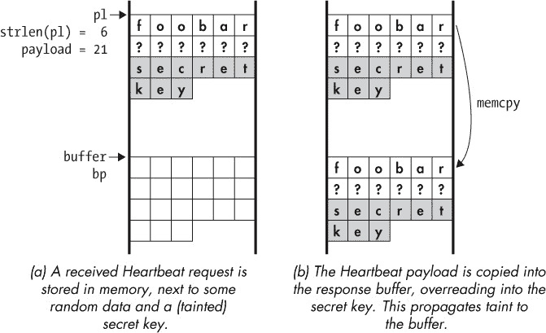
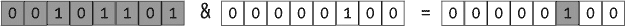
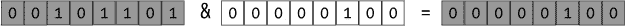
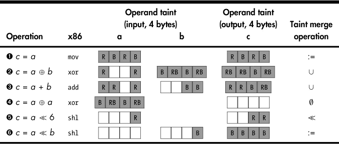
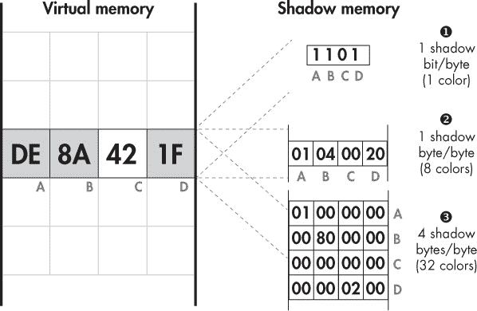

# 第十章：动态污点分析的原理

想象一下，你是一个水文学家，想要追踪一条部分流经地下的河流的流向。你已经知道河流进入地下的地方，但你想找出它是否以及在哪个地方重新浮出水面。解决这个问题的一种方法是使用特殊的染料给河水上色，然后寻找这些染色水的出现地点。

在彩色水重新出现的地方。本章的主题，*动态污点分析（DTA）*，将相同的思路应用于二进制程序。类似于给水流上色并追踪其流向，你可以使用 DTA 给程序内存中的选定数据上色或*标记污点*，然后动态跟踪这些污点字节的数据流，查看它们会影响程序中的哪些位置。

在本章中，你将学习动态污点分析的原理。DTA 是一项复杂的技术，因此熟悉其内部工作原理对构建有效的 DTA 工具至关重要。在第十一章中，我将向你介绍`libdft`，一个开源的 DTA 库，我们将使用它来构建几个实用的 DTA 工具。

### 10.1 什么是 DTA？

动态污点分析（DTA），也称为*数据流追踪（DFT）*，*污点追踪*，或简称*污点分析*，是一种程序分析技术，可以帮助你确定选定的程序状态对其他程序状态部分的影响。例如，你可以*标记污点*任何程序从网络接收到的数据，追踪这些数据，并在它们影响程序计数器时发出警报，因为这种影响可能表明发生了控制流劫持攻击。

在二进制分析的背景下，DTA 通常是在动态二进制插桩平台（如 Pin）之上实现的，我们在第九章中讨论过该平台。为了追踪数据流，DTA 会插桩所有处理数据的指令，无论数据是在寄存器中还是在内存中。实际上，这几乎包括了所有指令，这意味着 DTA 会对插桩的程序带来非常高的性能开销。即使是在优化过的 DTA 实现中，10 倍或更大的性能下降也很常见。例如，在进行 Web 服务器的安全测试时，10 倍的开销可能是可以接受的，但在生产环境中通常是不可接受的。这就是为什么 DTA 通常仅用于程序的离线分析。

你也可以基于静态插桩来构建污点分析系统，而不是基于动态插桩，在编译时插入必要的污点分析逻辑，而不是在运行时。虽然这种方法通常能带来更好的性能，但它也需要源代码。由于我们关注的是二进制分析，本书将坚持使用动态污点分析。

如前所述，DTA 可以让你追踪选定的程序状态对有趣的程序位置的影响。让我们更详细地了解这意味着什么：如何定义有趣的状态或位置，某个状态部分对另一个部分的“影响”到底意味着什么？

### 10.2 三步法中的 DTA：污点源、污点汇和污点传播

从高层来看，污点分析包括三个步骤：定义 *污点源*、定义 *污点汇* 和 *追踪污点传播*。如果你正在开发一个基于 DTA 的工具，前两个步骤（定义污点源和污点汇）由你来完成。第三个步骤（追踪污点传播）通常由现有的 DTA 库来处理，比如 `libdft`，但大多数 DTA 库也提供了让你自定义这一过程的方式。如果你愿意，我们可以逐步了解这三个步骤及其包含的内容。

#### *10.2.1 定义污点源*

*污点源*是你选择有趣数据进行追踪的程序位置。例如，系统调用、函数入口点或单个指令都可以作为污点源，正如你即将看到的那样。你选择追踪哪些数据，取决于你希望通过 DTA 工具实现什么目标。

你可以通过使用 DTA 库提供的 API 调用将数据标记为有趣的数据，从而对其进行污点标记。通常，这些 API 调用会接受一个寄存器或内存地址作为输入，来标记为污点数据。例如，假设你想要追踪从网络中传入的任何数据，以查看它是否表现出可能表明攻击的行为。为此，你需要在与网络相关的系统调用（如 `recv` 或 `recvfrom`）上插入回调函数，每当这些系统调用发生时，动态插桩平台都会调用此回调函数。在该回调函数中，你遍历所有接收到的字节并将其标记为污点数据。在这个例子中，`recv` 和 `recvfrom` 函数就是你的污点源。

类似地，如果你对追踪从文件中读取的数据感兴趣，你可以使用 `read` 等系统调用作为你的污点源。如果你想追踪两个数字相乘的结果，你可以对乘法指令的输出操作数进行污点标记，这些输出操作数就是你的污点源，等等。

#### *10.2.2 定义污点汇*

*污点汇*是你检查程序中是否有可能受到污点数据影响的位置。例如，为了检测控制流劫持攻击，你需要在间接调用、间接跳转和返回指令上插入回调函数，以检查这些指令的目标是否受到污点数据的影响。这些插入回调的指令就是你的污点汇。DTA 库提供了可以用于检查寄存器或内存位置是否被污点数据影响的函数。通常，当在污点汇检测到污点时，你可能需要触发某种响应，比如触发警报。

#### *10.2.3 追踪污点传播*

正如我提到的，要追踪程序中污点数据的流动，你需要对处理数据的所有指令进行插装。插装代码决定了污点如何从指令的输入操作数传播到其输出操作数。例如，如果`mov`指令的输入操作数被标记为污点，那么插装代码也会将输出操作数标记为污点，因为输出显然受输入操作数的影响。通过这种方式，污点数据可能最终从污点源传播到污点汇。

跟踪污点是一个复杂的过程，因为确定输出操作数的哪些部分需要被标记为污点并非总是很简单。污点传播受到*污点策略*的约束，污点策略指定了输入和输出操作数之间的污点关系。正如我在第 10.4 节中所解释的，根据你的需求，你可以使用不同的污点策略。为了避免你为所有指令编写插装代码的麻烦，污点传播通常由专门的 DTA 库（例如`libdft`）来处理。

现在你已经了解了污点跟踪的基本原理，让我们通过一个具体的例子来探讨如何使用 DTA 检测信息泄露。在第十一章中，你将学习如何实现自己的工具来检测这种类型的漏洞！

### 10.3 使用 DTA 检测 Heartbleed 漏洞

为了看看 DTA 如何在实践中派上用场，让我们考虑一下如何使用它来检测 OpenSSL 中的 Heartbleed 漏洞。OpenSSL 是一个广泛用于保护互联网通信的加密库，包括与网站和电子邮件服务器的连接。Heartbleed 漏洞可以被利用来从使用易受攻击版本的 OpenSSL 的系统中泄露信息。这些信息可能包括高度敏感的内容，比如存储在内存中的私钥、用户名/密码等。

#### *10.3.1 Heartbleed 漏洞概述*

Heartbleed 利用了 OpenSSL 实现的 Heartbeat 协议中的经典缓冲区过度读取漏洞（注意，*Heartbeat*是被利用的协议的名称，而*Heartbleed*是该漏洞的名称）。Heartbeat 协议允许设备通过向 SSL 启用的服务器发送*Heartbeat 请求*，该请求包含由发送方指定的任意字符字符串，以检查与服务器的连接是否仍然存活。如果一切正常，服务器会通过回显该字符串的*Heartbeat 响应*消息来做出回应。

除了字符字符串外，Heartbeat 请求还包含一个字段，用于指定该字符串的长度。正是对该长度字段的错误处理导致了 Heartbleed 漏洞的出现。易受攻击版本的 OpenSSL 允许攻击者指定一个远大于实际字符串长度的值，从而导致服务器在将字符串复制到响应中时泄露额外的内存字节。

清单 10-1 展示了导致 Heartbleed 漏洞的 OpenSSL 代码。我们先简要讨论一下它的工作原理，然后再介绍 DTA 如何检测与 Heartbleed 相关的信息泄漏。

*清单 10-1：导致 OpenSSL Heartbleed 漏洞的代码*

```
   /* Allocate memory for the response, size is 1 byte
    * message type, plus 2 bytes payload length, plus
    * payload, plus padding
    */
➊ buffer = OPENSSL_malloc(1 + 2 + payload + padding);
➋ bp = buffer;

   /* Enter response type, length and copy payload */
➌ *bp++ = TLS1_HB_RESPONSE;
➍ s2n(payload, bp);
➎ memcpy(bp, pl, payload);
   bp += payload;

   /* Random padding */
➏ RAND_pseudo_bytes(bp, padding);

➐ r = ssl3_write_bytes(s, TLS1_RT_HEARTBEAT, buffer, 3 + payload + padding);
```

清单 10-1 中的代码是 OpenSSL 函数的一部分，用于在接收到请求后准备心跳响应。清单中三个最重要的变量是`pl`、`payload`和`bp`。变量`pl`是指向心跳请求中负载字符串的指针，该字符串将被复制到响应中。尽管名字让人困惑，`payload`并不是指向负载字符串的指针，而是一个`unsigned int`，指定了该字符串的*长度*。`pl`和`payload`都来自心跳请求消息，因此在 Heartbleed 漏洞的上下文中，它们是*由攻击者控制的*。变量`bp`是指向响应缓冲区的指针，用于复制负载字符串。

首先，清单 10-1 中的代码分配了响应缓冲区➊，并将`bp`设置为该缓冲区的起始位置➋。请注意，缓冲区的大小由攻击者通过`payload`变量控制。响应缓冲区中的第一个字节包含数据包类型：`TLS1_HB_RESPONSE`（心跳响应）➌。接下来的 2 个字节包含负载长度，该长度直接通过`payload`变量（由`S2N`宏处理）从攻击者控制的`payload`变量中复制过来➍。

现在，进入 Heartbleed 漏洞的核心部分：一个`memcpy`，它将`payload`字节从`pl`指针复制到响应缓冲区➎。回想一下，`payload`和存储在`pl`中的字符串都在攻击者的控制之下。因此，通过提供一个较短的字符串和一个较大的`payload`数值，你可以欺骗`memcpy`继续复制过请求字符串，泄漏请求旁边的内存内容。通过这种方式，最多可以泄漏 64KB 的数据。最后，在响应的末尾添加一些随机填充字节➏，包含泄漏信息的响应会通过网络发送到攻击者➐。

#### *10.3.2 通过污染检测 Heartbleed 漏洞*

图 10-1 展示了如何使用 DTA 检测这种信息泄漏，并说明了在遭受 Heartbleed 攻击的系统内存中发生的情况。在这个示例中，你可以假设心跳请求存储在靠近一个秘密密钥的内存位置，并且你已经污染了该密钥，以便追踪它被复制的位置。你还可以假设`send`和`sendto`系统调用是污染接收点，用于检测即将通过网络发送的污染数据。为了简便起见，图中只展示了内存中的相关字符串，而没有显示请求和响应消息的类型和长度字段。

图 10-1a 展示了攻击者精心构造的心跳请求刚刚接收后的情况。请求包含负载字符串`foobar`，它恰好存储在内存中，紧邻一些随机字节（标记为`?`）和一个密钥。变量`pl`指向字符串的起始位置，攻击者已将`payload`设置为 21，使得与负载字符串相邻的 15 个字节会被泄露。^(1) 密钥被标记为污点，以便当它通过网络泄露时可以被检测到，而响应的缓冲区则分配在内存的其他地方。



*图 10-1：Heartbleed 缓冲区过度读取将一个密钥泄漏到响应缓冲区，该缓冲区将通过网络发送。污点化密钥使得在泄漏信息被发送时，能够检测到过度读取。*

接下来，图 10-1b 展示了当易受攻击的`memcpy`被执行时发生的情况。正如预期的那样，`memcpy`首先开始复制负载字符串`foobar`，但由于攻击者将`payload`设置为 21，`memcpy`会继续复制，即使它已经复制完了负载字符串的 6 个字节。`memcpy`会过度读取，首先是读取负载字符串旁边存储的随机数据，然后是密钥。结果，密钥被复制到了响应缓冲区，并即将通过网络发送出去。

如果没有污点分析，游戏就此结束了。包括泄露的密钥在内的响应缓冲区将被发送回攻击者。幸运的是，在这个例子中，你使用 DTA 防止了这种情况的发生。当密钥被复制时，DTA 引擎会注意到它正在复制被污点标记的字节，并将输出字节也标记为污点。在`memcpy`完成并在执行网络`send`之前检查污点字节时，你会发现响应缓冲区的部分内容已经被污点标记，从而检测到 Heartbleed 攻击。

这只是动态污点分析的众多应用之一，其他一些应用我将在第十一章中介绍。正如我之前提到的，你不想在生产服务器上运行这种类型的 DTA，因为它会造成很大的性能下降。然而，我刚刚描述的这种分析与模糊测试结合使用时效果很好，模糊测试是通过向应用程序或库（如 OpenSSL）提供伪随机生成的输入来测试其安全性，例如，当负载字符串和长度字段不匹配的心跳请求。

为了检测漏洞，模糊测试依赖于外部可观察的效果，比如程序崩溃或挂起。然而，并非所有漏洞都会产生这种可见效果，因为信息泄露等漏洞可能在没有崩溃或挂起的情况下悄然发生。你可以使用 DTA 扩展模糊测试中可观察到的漏洞范围，将非崩溃类漏洞（如信息泄露）也包括其中。这种类型的模糊测试本可以在脆弱的 OpenSSL 版本发布之前发现 Heartbleed 漏洞。

这个例子涉及简单的污点传播，其中污点的密钥直接被复制到输出缓冲区。接下来，我将介绍更复杂的数据流中更复杂的污点传播类型。

### 10.4 DTA 设计因素：污点粒度、污点颜色数和污点策略

在上一节中，DTA 仅需要简单的污点传播规则，污点本身也很简单：一字节的内存要么是污点，要么不是。在更复杂的 DTA 系统中，有多个因素决定系统性能与通用性之间的平衡。在本节中，你将学习 DTA 系统的三个最重要的设计维度：*污点粒度*、*污点颜色数*和*污点传播策略*。

请注意，DTA 可用于许多不同的目的，包括漏洞检测、数据外泄防护、自动代码优化、取证等。在这些应用中，"污点"这一概念的意义不同。为了简化以下讨论，当一个值是污点时，我将始终将其理解为“攻击者可以影响该值”。

#### *10.4.1 污点粒度*

*污点粒度*是 DTA 系统追踪污点的最小信息单位。例如，比特粒度系统会追踪寄存器或内存中每个比特是否为污点，而字节粒度系统只会按字节追踪污点信息。如果某个字节中的任意 1 个比特为污点，字节粒度系统将标记整个字节为污点。类似地，字长粒度系统会按内存字长追踪污点信息，以此类推。

为了可视化比特粒度和字节粒度 DTA 系统之间的差异，让我们考虑一个二进制与运算（`&`）操作，操作数为两个字节，其中一个字节是污点。接下来，我将分别展示每个操作数的所有比特，每个比特都会被框住。白色框表示非污点比特，灰色框表示污点比特。首先，来看一下污点如何在比特粒度系统中传播：



正如你所看到的，第一个操作数的所有比特都被污染，而第二个操作数的比特没有任何污染。由于这是按位与（AND）操作，只有当两个输入操作数在相应位置都有 1 时，输出比特才会被设置为 1。换句话说，如果攻击者仅控制第一个输入操作数，那么他们能够影响输出的唯一比特位置就是第二个操作数在该位置上为 1 的那些位置。所有其他输出比特将始终被设置为 0。因此，在这个例子中，只有一个输出比特被污染。它是攻击者可以控制的唯一比特位置，因为第二个操作数只有在该位置设置了 1。实际上，没有污染的第二个操作数充当了第一个操作数污染的“过滤器”。^(2)

现在让我们将其与字节粒度 DTA 系统中的相应操作进行对比。两个输入操作数与之前相同。



由于字节粒度 DTA 系统无法单独考虑每个比特，因此整个输出被标记为污染。系统仅看到一个被污染的输入字节和一个非零的第二个操作数，因此得出结论，攻击者可能会影响输出操作数。

正如你所看到的，DTA 系统的粒度是影响其准确性的重要因素：字节粒度系统可能比比特粒度系统不那么准确，具体取决于输入。另一方面，污染粒度也是 DTA 系统性能的一个主要因素。为了单独跟踪每个比特的污染所需的插装代码是复杂的，这导致了较高的性能开销。尽管字节粒度系统准确性较低，但它们允许更简单的污染传播规则，仅需要简单的插装代码。通常，这意味着字节粒度系统比比特粒度系统要快得多。实际上，大多数 DTA 系统使用字节粒度，以在准确性和速度之间实现合理的折衷。

#### *10.4.2 污染颜色*

在所有迄今为止的例子中，我们都假设一个值要么被污染，要么没有被污染。回到我们的河流类比，使用单一颜色的染料来完成这件事相当简单。但有时你可能希望同时追踪多条流经同一洞穴系统的河流。如果你使用同一种颜色给多条河流染色，那么你就无法准确知道河流是如何连接的，因为染色的水可能来自任何源头。

类似地，在 DTA 系统中，有时你不仅需要知道一个值是否被污染，还需要知道污染*来自哪里*。你可以使用多个*污染颜色*为每个污染源应用不同的颜色，这样当污染到达汇点时，你就可以准确知道哪个源头影响了该汇点。

在一个只有一种污染颜色的字节粒度 DTA 系统中，只需要一个单独的位来跟踪每个字节内存的污染情况。为了支持多于一种颜色，你需要为每个字节存储更多的污染信息。例如，为了支持八种颜色，你需要为每个字节内存存储 1 字节的污染信息。

乍一看，你可能会认为可以在 1 字节的污染信息中存储 255 种不同的颜色，因为一个字节可以存储 255 个不同的非零值。然而，这种方法无法支持不同颜色的混合。没有混合颜色的能力，你将无法在两个污染流一起运行时区分污染流：如果一个值受到两个不同污染源的影响，每个污染源都有自己的颜色，那么你将无法在该值的污染信息中记录两种颜色。

为了支持颜色混合，你需要为每种污染颜色使用一个专用的位。例如，如果你有 1 字节的污染信息，你可以支持颜色 `0x01`、`0x02`、`0x04`、`0x08`、`0x10`、`0x20`、`0x40` 和 `0x80`。然后，如果某个值受到 `0x01` 和 `0x02` 两种颜色的污染，那么该值的组合污染信息就是 `0x03`，这是两种颜色的按位 OR 运算结果。你可以通过实际的颜色来理解不同的污染颜色，以便更容易理解。例如，你可以将 `0x01` 称为“红色”，将 `0x02` 称为“蓝色”，将组合颜色 `0x03` 称为“紫色”。

#### *10.4.3 污染传播策略*

DTA 系统的*污染策略*描述了系统如何传播污染，以及如果多个污染流一起运行时，如何合并污染颜色。表 10-1 展示了在一个字节粒度的 DTA 系统中，污染是如何通过几种不同的操作传播的，使用了两种颜色：“红色”（R）和“蓝色”（B）。所有示例中的操作数均由 4 个字节组成。请注意，其他污染策略也是可能的，特别是对于那些对操作数执行非线性变换的复杂操作。

**表 10-1：** 一个字节粒度 DTA 系统的污染传播示例，使用两种颜色，红色（R）和蓝色（B）



在第一个示例中，变量 *a* 的值被赋给变量 *c* ➊，相当于 x86 `mov` 指令。对于像这样的简单操作，污染传播规则同样很简单：因为输出 *c* 只是 *a* 的副本，所以 *c* 的污染信息是 *a* 污染信息的副本。换句话说，在这种情况下，污染合并运算符是 :=，赋值运算符。

下一个示例是 `xor` 运算，*c* = *a* ⊕ *b* ➋。在这种情况下，简单地将其中一个输入操作数的污点分配给输出是没有意义的，因为输出依赖于两个输入。相反，一个常见的污点策略是对输入操作数的污点进行逐字节联合（∪）。例如，第一个操作数的最高有效字节被标记为红色（R），而第二个操作数的最高有效字节标记为蓝色（B）。因此，输出的最高有效字节的污点是这两者的联合，既有红色也有蓝色（RB）。

第三个示例 ➌ 中也使用了逐字节联合策略进行加法运算。请注意，对于加法运算，有一个特殊情况：两个字节的加法可能会产生溢出位，并将其传递到相邻字节的最低有效位（LSB）。假设攻击者只控制其中一个操作数的最低有效字节。那么，在这种特殊情况下，攻击者可能会导致 1 位溢出到相邻字节，从而使攻击者也能部分影响该字节的值。你可以通过显式检查此特殊情况并在发生溢出时标记相邻字节来在污点策略中考虑此特殊情况。在实际操作中，许多 DTA 系统选择不检查这种特殊情况，以简化和加快污点传播。

示例 ➍ 是 `xor` 运算的特例。对操作数与其自身进行 `xor` 运算（*c* = *a* *a*）始终会产生输出零。在这种情况下，即使攻击者控制了 *a*，他们也无法控制输出 *c*。因此，污点策略是通过将每个输出字节的污点清除为空集（ø）来清除所有输出字节的污点。

接下来是一个常量值的左移操作，*c* = *a* ≪ 6 ➎。由于第二个操作数是常量，即使攻击者部分控制输入 *a*，也无法始终控制所有输出字节。一个合理的策略是，仅将输入的污点传播到输出中那些（部分或完全）由污点输入字节覆盖的字节，实际上是“将污点向左移动”。在这个例子中，由于攻击者只控制 *a* 的低字节，并且该字节左移了 6 位，这意味着低字节的污点会传播到输出的低 *两个* 字节。

在示例 ➏ 中，另一方面，移动的值（*a*）和移动的量（*b*）都是变量。控制 *b* 的攻击者（如示例中的情况）可以影响输出的所有字节。因此，*b* 的污点会被赋给每个输出字节。

DTA 库，如`libdft`，具有预定义的污点策略，免去了你为所有类型的指令实现规则的麻烦。然而，你可以根据具体工具调整规则，对于那些默认策略不完全适合你需求的指令进行修改。例如，如果你正在实现一个检测信息泄露的工具，你可能希望通过禁用污点传播来提高性能，尤其是通过那些改变数据使其无法识别的指令。

#### *10.4.4 污点过度与污点不足*

根据污点策略，DTA 系统可能会出现污点不足、污点过度或两者同时发生的情况。

*污点不足*发生在一个值没有被污点标记，尽管它“应该”被标记，这意味着攻击者可以在不被发现的情况下影响该值。污点不足可能是污点策略的结果，例如系统未处理加法中的溢出位等边缘情况，如前所述。当污点流经不受支持的指令且没有污点传播处理程序时，也可能会发生污点不足。例如，DTA 库如`libdft`通常不内置对 x86 MMX 或 SSE 指令的支持，因此，流经这些指令的污点可能会丢失。控制依赖性也可能导致污点不足，正如你稍后会看到的那样。

与污点不足类似，*污点过度*意味着值最终被污点标记，尽管它“本不该被标记”。这会导致假阳性，例如在没有实际攻击发生的情况下触发警报。像污点不足一样，污点过度也可能是污点策略或控制依赖性处理方式的结果。

虽然 DTA 系统努力最小化污点不足和污点过度，但通常在保持合理性能的同时，完全避免这些问题是不可能的。目前没有任何一个实用的 DTA 库能够完全避免一定程度的污点不足或污点过度。

#### *10.4.5 控制依赖性*

回想一下，污点追踪用于追踪*数据流*。然而，有时数据流可能会受到像分支这样的控制结构的隐式影响，这种情况被称为*隐式流*。你将在第十一章中看到隐式流的实际示例，但现在，先看一下下面这个合成示例：

```
var = 0;
while(cond--) var++;
```

在这里，一个控制循环条件`cond`的攻击者可以确定`var`的值。这就叫做*控制依赖性*。虽然攻击者可以通过`cond`控制`var`，但两者之间没有显式的数据流。因此，只有追踪显式数据流的 DTA 系统将无法捕捉到这种依赖关系，并且即使`cond`被污点标记，`var`也会保持未被标记，从而导致污点不足。

一些研究尝试通过将污点从分支和循环条件传播到因分支或循环而执行的操作来解决这个问题。在这个例子中，这意味着将污点从`cond`传播到`var`。不幸的是，这种方法导致了大量的过度污点化，因为污染的分支条件是常见的，即使没有发生攻击。例如，考虑如下的用户输入清理检查：

```
if(is_safe(user_input)) funcptr = safe_handler;
else                    funcptr = error_handler;
```

假设我们对所有用户输入进行污点标记以检查攻击，并且`user_input`的污点传播到`is_safe`函数的返回值，后者被用作分支条件。假设用户输入清理做得很妥当，那么尽管分支条件被污染，代码依然是完全安全的。

但尝试追踪控制依赖的 DTA 系统无法将这种情况与前面列出的危险情况区分开来。这些系统最终会将`funcptr`（指向用户输入处理程序的函数指针）标记为污点。当稍后调用被污染的`funcptr`时，这可能会触发误报警告。这种泛滥的误报会使系统完全无法使用。

由于用户输入上的分支很常见，而攻击者可利用的隐式流相对较少，因此大多数实际的 DTA 系统并不追踪控制依赖。

#### *10.4.6 影子内存*

到目前为止，我已经展示了污点追踪器如何追踪每个寄存器或内存字节的污点，但我还没有解释它们是如何存储这些污点信息的。为了存储哪些寄存器或内存部分被污染以及污染的颜色，DTA 引擎维护了专用的*影子内存*。影子内存是由 DTA 系统分配的一个虚拟内存区域，用于跟踪其余内存的污点状态。通常，DTA 系统还会分配一个特殊的内存结构，用来追踪 CPU 寄存器的污点信息。

影子内存的结构根据污点粒度以及支持的污点颜色数量的不同而有所区别。图 10-2 展示了不同字节粒度的影子内存布局示例，分别用于追踪每字节内存的 1、8 或 32 种颜色。



*图 10-2：具有字节粒度并且每个字节支持 1、8 或 32 种颜色的影子内存*

图 10-2 的左侧部分展示了一个运行 DTA 的程序的虚拟内存。具体来说，它显示了四个虚拟内存字节的内容，标记为 A、B、C 和 D。这些字节共同存储了示例十六进制值`0xde8a421f`。

### 基于位图的影子内存

图的右侧显示了三种不同类型的阴影内存，以及它们如何对字节 A–D 编码污点信息。第一种类型的阴影内存，如图 10-2 右上方所示，是一个*位图* ➊。它为每个虚拟内存字节存储一个污点信息位，因此只能表示一种颜色：每个内存字节要么是被污染的，要么是未污染的。字节 A–D 被表示为位 `1101`，意味着字节 A、B 和 D 是被污染的，而字节 C 不是。

虽然位图只能表示一种颜色，但它们的优点是所需内存相对较少。例如，在 32 位 x86 系统上，虚拟内存的总大小为 4GB。用于 4GB 虚拟内存的阴影内存位图仅需要 4GB/8 = 512MB 的内存，剩余的 7/8 虚拟内存可以用于正常使用。请注意，这种方法在 64 位系统上无法扩展，因为虚拟内存空间要大得多。

### 多色阴影内存

多色污点引擎和 x64 系统需要更复杂的阴影内存实现。例如，看看图 10-2 中显示的第二种类型的阴影内存 ➋。它支持八种颜色，每个虚拟内存字节使用 1 字节的阴影内存。同样，你可以看到字节 A、B 和 D 被污染（分别为颜色 `0x01`、`0x04` 和 `0x20`），而字节 C 未被污染。请注意，为了存储进程中每个虚拟内存字节的污点信息，一个未优化的八色阴影内存必须和该进程的整个虚拟内存空间一样大！

幸运的是，通常不需要为分配阴影内存的内存区域存储阴影字节，因此可以省略该内存区域的阴影字节。即便如此，如果没有进一步的优化，阴影内存仍然需要占用虚拟内存的一半。通过仅为实际使用的虚拟内存部分（在堆栈或堆中）动态分配阴影内存，且需要一些额外的运行时开销，可以进一步减少这一占用。此外，不能写入的虚拟内存页面永远不会被污染，因此可以安全地将它们映射到同一个“清零”阴影内存页面上。通过这些优化，多色 DTA 变得可管理，尽管它仍然需要大量内存。

最后一种阴影内存类型，如图 10-2 所示，支持 32 种颜色 ➌。字节 A、B 和 D 分别被污染为颜色 `0x01000000`、`0x00800000` 和 `0x00000200`，而字节 C 未被污染。如你所见，这需要每个内存字节 4 字节的阴影内存，这相当于较大的内存开销。

所有这些示例将阴影内存实现为一个简单的位图、字节数组或整数数组。通过使用更复杂的数据结构，可以支持任意数量的颜色。例如，你可以使用 C++风格的`set`为每个内存字节实现阴影内存。然而，这种方法会显著增加 DTA 系统的复杂性和运行时开销。

### 10.5 总结

在本章中，我向你介绍了动态污点分析（DTA），这是一种非常强大的二进制分析技术。DTA 允许你跟踪数据从污点源到污点汇的流动，从而实现从代码优化到漏洞检测的自动化分析。现在你已经了解了 DTA 的基本概念，你可以继续阅读第十一章，在其中你将使用`libdft`构建实用的 DTA 工具。

练习

1\. 设计一个格式字符串漏洞检测器

格式字符串漏洞是 C 类编程语言中一种广为人知的可利用软件缺陷。当存在一个由用户控制的格式字符串的`printf`时，就会发生这种漏洞，例如`printf(user)`而不是正确的`printf("%s", user)`。关于格式字符串漏洞的详细介绍，您可以阅读文章“利用格式字符串漏洞”，该文章可以在* [`julianor.tripod.com/bc/formatstring-1.2.pdf`](http://julianor.tripod.com/bc/formatstring-1.2.pdf) *中找到。

设计一个可以检测来自网络或命令行的格式字符串漏洞的 DTA 工具。污点源和汇应该是什么？你需要什么样的污点传播和粒度？在第十一章的末尾，你将能够实现你的漏洞检测器！
