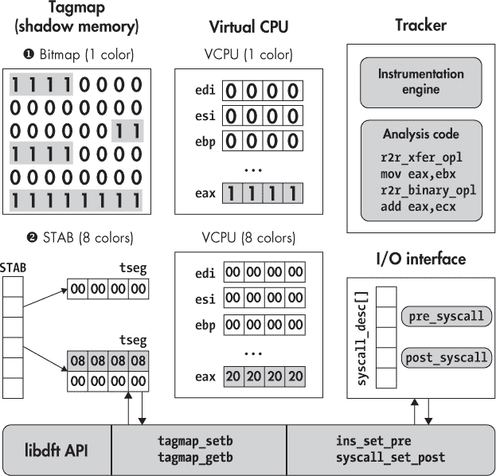

# 第十一章：使用 libdft 进行实用的动态污点分析

在第十章中，你学习了动态污点分析的原理。在本章中，你将学习如何使用流行的开源 DTA 库 `libdft` 来构建你自己的 DTA 工具。我将介绍两个实际的例子：一个是防止远程控制劫持攻击的工具，另一个是自动检测信息泄露的工具。但首先，让我们来看看 `libdft` 的内部结构和 API。

### 11.1 引入 libdft

由于 DTA 是一个正在进行的研究课题，现有的二进制级污点追踪库基本上都是研究工具，不要期望它们有生产级的质量。`libdft` 也不例外，它是在哥伦比亚大学开发的，你将在本章的剩余部分使用它。

`libdft` 是一个基于 Intel Pin 的字节粒度污点追踪系统，它是目前最易于使用的 DTA 库之一。事实上，它是许多安全研究人员的首选工具，因为你可以使用它轻松构建既准确又快速的 DTA 工具。我已经在虚拟机中预安装了 `libdft`，路径是 */home/binary/libdft*。你也可以在 *[`www.cs.columbia.edu/~vpk/research/libdft/`](https://www.cs.columbia.edu/~vpk/research/libdft/)* 下载它。

和写作时所有的二进制级 DTA 库一样，`libdft` 有一些不足之处。最明显的一点是，`libdft` 仅支持 32 位 x86 架构。你仍然可以在 64 位平台上使用它，但只能分析 32 位进程。它还依赖于旧版本的 Pin（版本在 2.11 和 2.14 之间应该是可用的）。另一个限制是，`libdft` 仅支持“常规”的 x86 指令，不支持像 MMX 或 SSE 这样的扩展指令集。这意味着，如果污点数据通过这些指令流动，`libdft` 可能会发生污点缺失。如果你是从源代码构建你分析的程序，请使用 `gcc` 的编译选项 `-mno-{mmx, sse, sse2, sse3}` 来确保二进制文件中不包含 MMX 或 SSE 指令。

尽管存在这些限制，`libdft` 仍然是一个优秀的 DTA 库，你可以使用它来构建可靠的工具。而且，由于它是开源的，因此扩展它以支持 64 位或更多指令集相对容易。为了帮助你最大限度地利用 `libdft`，让我们来看看它最重要的实现细节。

#### *11.1.1 libdft 的内部结构*

由于 `libdft` 基于 Intel Pin，基于 `libdft` 的 DTA 工具实际上就是 Pin 工具，就像你在第九章中看到的那些工具，只不过它们与 `libdft` 链接在一起，后者提供了 DTA 功能。在虚拟机上，我已经安装了一个专用的旧版 Intel Pin（v2.13），你可以与 `libdft` 一起使用。Pin 被 `libdft` 用来对指令进行插桩，加入污点传播逻辑。污点数据本身存储在阴影内存中，可以通过 `libdft` 的 API 进行访问。图 11-1 展示了 `libdft` 最重要的组件概览。

### 阴影内存

如图 11-1 所示，`libdft`有两个变种，每个变种使用不同类型的阴影内存（在`libdft`术语中称为*tagmap*）。首先是基于位图的变种➊，它只支持一个污染颜色，但比另一个变种稍快，且内存开销更小。在从哥伦比亚大学网站下载的`libdft`源代码压缩包中，^(1)该变种位于名为*libdft_linux-i386*的目录中。第二个变种实现了一个八色阴影内存➋，你可以在源代码压缩包中的*libdft-ng_linux-i386*目录下找到它。这个第二个变种是我在虚拟机上预安装的，也是我在这里将要使用的版本。

为了最小化八色阴影内存的内存需求，`libdft`通过一种优化的数据结构实现了它，称为*段转换表（STAB）*。STAB 包含每个内存页面的一个条目。每个条目包含一个*加数*值，这是一个 32 位的偏移量，你可以将它加到虚拟内存地址上，以获取对应阴影字节的地址。



*图 11-1：`libdft`的内部：阴影内存和虚拟 CPU 实现，仪器化和 API*

例如，要读取虚拟地址`0x1000`的阴影内存，你可以在 STAB 中查找对应的加数，结果是`438`。这意味着你将在地址`0x1438`找到包含地址`0x1000`的污染信息的阴影字节。

STAB 提供了一种间接访问机制，使得`libdft`能够根据需要在每次应用程序分配虚拟内存区域时分配阴影内存。阴影内存是按页面大小的块分配的，从而保持最小的内存开销。由于每个分配的内存页面对应着一个阴影页面，所有地址的加数可以使用相同的值。对于包含多个相邻页面的虚拟内存区域，`libdft`确保阴影内存页面也相邻，从而简化阴影内存访问。每个相邻的阴影映射页面块被称为*tagmap 段（tseg）*。作为额外的内存使用优化，`libdft`将所有只读内存页面映射到同一个已清零的阴影页面。

### 虚拟 CPU

为了跟踪 CPU 寄存器的污染状态，`libdft`在内存中保持一个特殊结构，称为*虚拟 CPU*。虚拟 CPU 是一种迷你阴影内存，对于 x86 上的每个 32 位通用 CPU 寄存器（如`edi`、`esi`、`ebp`、`esp`、`ebx`、`edx`、`ecx`和`eax`），虚拟 CPU 为每个寄存器保留 4 个阴影字节。此外，虚拟 CPU 上还有一个特殊的临时寄存器，`libdft`使用它来存储任何未识别寄存器的污染信息。在虚拟机上预安装的`libdft`版本中，我对虚拟 CPU 做了一些修改，使其可以支持 Intel Pin 所支持的所有寄存器。

### 污染追踪引擎

回顾一下，`libdft` 使用 Pin 的 API 来检查二进制中的所有指令，并将这些指令与相关的污点传播函数进行插桩。如果你感兴趣的话，可以在虚拟机中的文件 */home/binary/libdft/libdft-ng_linux-i386/src/libdft_core.c* 找到 `libdft` 的污点传播函数实现，但我在这里不打算详细讲解它们。所有的污点传播函数共同实现了 `libdft` 的污点策略，我将在第 11.1.2 节中描述该策略。

### `libdft` API 和 I/O 接口

最终，`libdft` 的目标是作为构建你自己 DTA 工具的库。为此，`libdft` 提供了一个污点跟踪 API，其中包含了几类函数。对于构建 DTA 工具来说，最重要的两类函数是操作标签映射的函数和添加回调及插桩代码的函数。

标签映射 API 定义在头文件 *tagmap.h* 中。它提供了诸如 `tagmap_setb`（用于将内存字节标记为污点）和 `tagmap_getb`（用于检索内存字节的污点信息）等函数。

添加回调和插桩代码的 API 分布在头文件 *libdft_api.h* 和 *syscall_desc.h* 中。它允许你使用 `syscall_set_pre` 和 `syscall_set_post` 函数注册系统调用事件的回调。为了存储所有这些回调，`libdft` 使用一个专门的数组，名为 `syscall_desc`，用于跟踪你安装的所有系统调用前后处理程序。同样，你可以使用 `ins_set_pre` 和 `ins_set_post` 注册指令回调。你将在本章后面的 DTA 工具部分更详细地了解这些以及其他 `libdft` API 函数。

#### *11.1.2 污点策略*

`libdft` 的污点传播策略定义了以下五类指令。^(2) 每一类指令以不同的方式传播和合并污点。

**ALU** 这些是具有两个或三个操作数的算术和逻辑指令，例如 `add`、`sub`、`and`、`xor`、`div` 和 `imul`。对于这些操作，`libdft` 以与 表 10-1 中的 `add` 和 `xor` 示例相同的方式合并污点——输出的污点是输入操作数污点的并集（∪）。正如 表 10-1 中所示，`libdft` 认为立即数是未污染的，因为攻击者无法影响它们。

**XFER** XFER 类包含所有将值复制到另一个寄存器或内存位置的指令，例如 `mov` 指令。与 表 10-1 中的 `mov` 示例一样，这些指令的处理方式是使用赋值操作 (:=)。对于这些指令，`libdft` 仅仅是将源操作数的污点复制到目标位置。

**CLR** 正如其名，这一类指令总是使它们的输出操作数变得不受污染。换句话说，`libdft` 将输出的污染标记设置为空集（ø）。这一类包括其他类指令的一些特殊情况，例如用自身做异或运算或从自身中减去一个操作数。它还包括像 `cpuid` 这样的指令，攻击者无法控制输出。

**SPECIAL** 这些是需要特殊规则来传播污染的指令，这些规则在其他类别中未涉及。包括但不限于 `xchg` 和 `cmpxchg`（其中两个操作数的污染会交换）以及 `lea`（其中污染源自内存地址的计算）。

**FPU, MMX, SSE** 这一类包含了 `libdft` 当前不支持的指令，如 FPU、MMX 和 SSE 指令。当污染通过这些指令时，`libdft` 无法追踪，因此污染信息不会传播到指令的输出操作数，导致污染不足。

现在你已经熟悉了 `libdft`，让我们用 `libdft` 构建一些 DTA 工具吧！

### 11.2 使用 DTA 检测远程控制劫持

你看到的第一个 DTA 工具旨在检测一些类型的远程控制劫持攻击。具体来说，它检测的是网络接收的数据被用来控制 `execve` 调用的参数的攻击。因此，污染源将是网络接收函数 `recv` 和 `recvfrom`，而 `execve` 系统调用将是污染汇。像往常一样，你可以在虚拟机上找到完整的源代码，位于 *~/code/chapter11* 中。

我尽量将这个示例工具做得尽可能简单，以便让讨论更容易理解。这意味着它必须做一些简化假设，并且不能捕捉所有类型的控制劫持攻击。在一个真正的、功能齐全的 DTA 工具中，你需要定义额外的污染源和污染汇，以防更多类型的攻击。例如，除了通过 `recv` 和 `recvfrom` 接收的数据，你还需要考虑通过 `read` 系统调用从网络读取的数据。此外，为了防止无辜的文件读取被污染，你需要跟踪哪些文件描述符正在通过 `accept` 等网络调用从网络读取数据。

当你理解下面这个示例工具的工作原理时，你应该能够自行改进它。此外，`libdft` 附带了一个更为复杂的示例 DTA 工具，参考了许多这些改进。如果你感兴趣，可以在 *libdft* 目录下的文件 *tools/libdft-dta.c* 中找到它。

许多基于`libdft`的 DTA 工具都会挂钩系统调用，作为污点源和污点汇。在 Linux 中，每个系统调用都有自己独特的*系统调用编号*，`libdft`使用它来索引`syscall_desc`数组。有关可用系统调用及其相关系统调用编号的列表，请参考 x86（32 位）的*/usr/include/x86_64-linux-gnu/asm/unistd_32.h*或 x64 的*/usr/include/asm-generic/unistd.h*。^(3)

现在，让我们来看一下名为`dta-execve`的示例工具。列表 11-1 展示了源代码的第一部分。

*列表 11-1:* dta-execve.cpp

```
    /* some #includes omitted for brevity */

➊  #include "pin.H"

➋  #include "branch_pred.h"
   #include "libdft_api.h"
   #include "syscall_desc.h"
   #include "tagmap.h"

➌  extern syscall_desc_t syscall_desc[SYSCALL_MAX];

   void alert(uintptr_t addr, const char *source, uint8_t tag);
   void check_string_taint(const char *str, const char *source);
   static void post_socketcall_hook(syscall_ctx_t *ctx);
   static void pre_execve_hook(syscall_ctx_t *ctx);

   int
   main(int argc, char **argv)
   {
➍    PIN_InitSymbols();
➎    if(unlikely(PIN_Init(argc, argv))) {
        return 1;
     }

➏    if(unlikely(libdft_init() != 0)) {
➐       libdft_die();
        return 1;
     }

➑    syscall_set_post(&syscall_desc[__NR_socketcall], post_socketcall_hook);
➒    syscall_set_pre (&syscall_desc[__NR_execve], pre_execve_hook);

➒    PIN_StartProgram();

     return 0;
   }
```

在这里，我只展示了与`libdft`相关的 DTA 工具特定的头文件，但如果你感兴趣，可以在虚拟机上的源代码中查看省略的代码。

第一个头文件是*pin.H* ➊，因为所有`libdft`工具实际上都是链接了`libdft`库的 Pin 工具。接下来是几个头文件，它们一起提供对`libdft` API 的访问 ➋。第一个是*branch_pred.h*，包含宏`likely`和`unlikely`，你可以使用它们为编译器提供分支预测的提示，稍后我将解释。接下来，*libdft_api.h*、*syscall_desc.h*和*tagmap.h*分别提供对`libdft`基础 API、系统调用钩子接口和 tagmap（影像内存）的访问。

在包含文件之后，是`syscall_desc`数组的`extern`声明 ➌，这是`libdft`用来跟踪系统调用钩子的结构体。你将需要访问它来挂钩你的污点源和污点汇。`syscall_desc`的实际定义在`libdft`的源文件*syscall_desc.c*中。

现在，让我们来看一下`dta-execve`工具的`main`函数。它首先初始化 Pin 的符号处理 ➍，以防二进制文件中存在符号，然后初始化 Pin 本身 ➎。你在第九章中已经看到了 Pin 初始化的代码，但这次使用了优化的分支来检查`PIN_Init`的返回值，使用`unlikely`宏标记它，告诉编译器`PIN_Init`失败的可能性较小。这一知识可以帮助编译器进行分支预测，从而可能生成稍微更快的代码。

接下来，`main`函数使用`libdft_init`函数 ➏ 初始化`libdft`，并再次优化检查返回值。此初始化允许`libdft`设置重要的数据结构，例如 tagmap。如果初始化失败，`libdft_init`将返回非零值，在这种情况下，你需要调用`libdft_die`来释放`libdft`可能分配的任何资源 ➐。

一旦 Pin 和`libdft`都初始化完成，你可以安装系统调用钩子，这些钩子作为污点源和污点接收点。请记住，当被仪器化的应用程序（即你使用 DTA 工具保护的程序）执行相应的系统调用时，适当的钩子将会被调用。在这里，`dta-execve`安装了两个钩子：一个后处理钩子，名为`post_socketcall_hook`，它在每次执行`socketcall`系统调用后立即运行➑；另一个是前处理钩子，它在执行`execve`系统调用之前运行，名为`pre_execve_hook`➒。`socketcall`系统调用捕获所有与套接字相关的事件（例如`recv`和`recvfrom`事件）在 x86-32 架构的 Linux 上。`socketcall`处理程序（`post_socketcall_hook`）区分了不同类型的套接字事件，接下来我会解释。

为了安装系统调用处理程序，你需要调用`syscall_set_post`（用于后处理钩子）或`syscall_set_pre`（用于前处理钩子）。这两个函数都接受一个指向`libdft`的`syscall_desc`数组条目的指针，用于安装处理程序，以及一个指向要安装的处理程序的函数指针。为了获得适当的`syscall_desc`条目，你需要用你正在钩住的系统调用的系统调用号来索引`syscall_desc`数组。在这个例子中，相关的系统调用号由符号名称`__NR_socketcall`和`__NR_execve`表示，你可以在`/usr/include/i386-linux-gnu/asm/unistd_32.h`中找到这些符号名称（适用于 x86-32）。

最后，你需要调用`PIN_StartProgram`来开始运行仪器化的应用程序➓。回想一下在第九章中提到的，`PIN_StartProgram`永远不会返回，所以`main`函数末尾的`return 0`永远不会被执行。

尽管在这个示例中没有使用，`libdft`确实提供了几乎与系统调用相同的方式来钩住指令，如以下代码所示：

```
➊  extern ins_desc_t ins_desc[XED_ICLASS_LAST];
   /* ... */
➋  ins_set_post(&ins_desc[XED_ICLASS_RET_NEAR], dta_instrument_ret);
```

为了钩住指令，你需要在 DTA 工具中全局声明`extern ins_desc`数组➊（类似于`syscall_desc`），然后使用`ins_set_pre`或`ins_set_post`➋来分别安装指令的前处理或后处理钩子。与系统调用号不同，你使用由 Intel 的 x86 编码/解码库（XED）提供的符号名称来索引`ins_desc`数组，XED 库随 Pin 一起提供。XED 在一个名为`xed_iclass_enum_t`的枚举中定义了这些名称，每个名称表示一种指令类别，如`X86_ICLASS_RET_NEAR`。这些类别的名称对应于指令助记符。你可以在线查看所有指令类别名称的列表，网址是*[`intelxed.github.io/ref-manual/`](https://intelxed.github.io/ref-manual/)*，或者在随 Pin 一起提供的头文件*xed-iclass-enum.h*中找到。

#### *11.2.1 检查污点信息*

在上一节中，你已经看到`dta-execve`工具的`main`函数执行了所有必要的初始化，设置了适当的系统调用钩子，作为污点源和污点接收点，然后启动了应用程序。在这种情况下，污点接收点是一个叫做`pre_execve_hook`的系统调用钩子，它检查是否有任何`execve`参数被污染，表明可能发生了控制劫持攻击。如果是，它会触发警告并通过终止应用程序来阻止攻击。由于污点检查会对每个`execve`参数重复进行，因此我将其实现为一个名为`check_string_taint`的单独函数。

我将首先讨论`check_string_taint`，然后转到第 11.2.3 节中的`pre_execve_hook`代码。列表 11-2 展示了`check_string_taint`函数，以及在检测到攻击时调用的`alert`函数。

*列表 11-2：* dta-execve.cpp *(续)*

```
   void
➊  alert(uintptr_t addr, const char *source, uint8_t tag)
   {
     fprintf(stderr,
       "\n(dta-execve) !!!!!!! ADDRESS 0x%x IS TAINTED (%s, tag=0x%02x), ABORTING !!!!!!!\n",
       addr, source, tag);
     exit(1);
   }
   void
➋  check_string_taint(const char *str, const char *source)
   {
     uint8_t tag;
     uintptr_t start = (uintptr_t)str;
     uintptr_t end   = (uintptr_t)str+strlen(str);

     fprintf(stderr, "(dta-execve) checking taint on bytes 0x%x -- 0x%x (%s)... ",
             start, end, source);

➌   for(uintptr_t addr = start; addr <= end; addr++) {
➍      tag = tagmap_getb(addr);
➎      if(tag != 0) alert(addr, source, tag);
     }

     fprintf(stderr, "OK\n");
   }
```

`alert`函数 ➊ 简单地打印包含污点地址详细信息的警告消息，然后调用`exit`停止应用程序并防止攻击。实际的污点检查逻辑在`check_string_taint` ➋中实现，该函数接受两个字符串作为输入。第一个字符串（`str`）是要检查污点的字符串，而第二个字符串（`source`）是诊断字符串，它传递给并由`alert`打印，指定第一个字符串的来源，可以是`execve`路径、`execve`参数或环境参数。

要检查`str`的污点，`check_string_taint`会遍历`str`的所有字节 ➌。对于每个字节，它通过`libdft`的`tagmap_getb`函数检查污点状态 ➍。如果该字节有污点，则调用`alert`打印错误信息并退出 ➎。

`tagmap_getb`函数接受一个字节的内存地址（以`uintptr_t`形式）作为输入，并返回包含该地址污点颜色的阴影字节。污点颜色（在列表 11-2 中称为`tag`）是一个`uint8_t`类型，因为`libdft`为每个内存字节保留一个阴影字节。如果`tag`为零，则该内存字节无污点。如果不为零，则该字节有污点，`tag`颜色可用于查找污点来源。由于该 DTA 工具只有一个污点源（网络接收），它仅使用单一的污点颜色。

有时你可能希望一次获取多个内存字节的污点标签。为此，`libdft`提供了`tagmap_getw`和`tagmap_getl`函数，它们类似于`tagmap_getb`，但一次返回两个或四个连续的阴影字节，分别以`uint16_t`或`uint32_t`的形式返回。

#### *11.2.2 污点源：接收字节的污点*

现在你知道了如何检查给定内存地址的污点颜色，让我们来讨论如何在第一时间标记字节。清单 11-3 展示了`post_socketcall_hook`的代码，它是每次`socketcall`系统调用后被调用的污点源，标记从网络接收到的字节。  

*清单 11-3:* dta-execve.cpp *(续)*  

```
   static void
   post_socketcall_hook(syscall_ctx_t *ctx)
   {
     int fd;
     void *buf;
     size_t len;

➊   int call            =            (int)ctx->arg[SYSCALL_ARG0];
➋   unsigned long *args = (unsigned long*)ctx->arg[SYSCALL_ARG1];

     switch(call) {
➌   case SYS_RECV:
     case SYS_RECVFROM:
➍      if(unlikely(ctx->ret <= 0)) {
          return;
       }

➎     fd =     (int)args[0];
➏     buf =  (void*)args[1];
➐     len = (size_t)ctx->ret;

       fprintf(stderr, "(dta-execve) recv: %zu bytes from fd %u\n", len, fd);

       for(size_t i = 0; i < len; i++) {
         if(isprint(((char*)buf)[i])) fprintf(stderr, "%c", ((char*)buf)[i]);
         else                         fprintf(stderr, "\\x%02x", ((char*)buf)[i]);
       }
       fprintf(stderr, "\n");

       fprintf(stderr, "(dta-execve) tainting bytes %p -- 0x%x with tag 0x%x\n",
               buf, (uintptr_t)buf+len, 0x01);

➑      tagmap_setn((uintptr_t)buf, len, 0x01);

       break;
     default:
       break;
     }
   }
```

在`libdft`中，像`post_socketcall_hook`这样的系统调用钩子是`void`函数，唯一的输入参数是`syscall_ctx_t*`类型的指针。在清单 11-3 中，我将该输入参数命名为`ctx`，它作为刚刚发生的系统调用的描述符。除了其他内容外，它包含了传递给系统调用的参数以及系统调用的返回值。钩子会检查`ctx`，以确定需要标记哪些字节（如果有的话）。  

`socketcall`系统调用接受两个参数，你可以通过阅读`man socketcall`来验证这一点。第一个是一个名为`call`的`int`类型，它告诉你这是什么类型的`socketcall`，例如，是否是`recv`或`recvfrom`。第二个参数，名为`args`，包含一个`unsigned long*`类型的参数块，用于`socketcall`。`post_socketcall_hook`首先解析`call` ➊和`args` ➋这两个参数，来自系统调用的`ctx`。要从系统调用`ctx`中获取参数，你需要读取其`arg`字段中的相应条目（例如，`ctx->arg[SYSCALL_ARG0]`）并将其转换为正确的类型。  

接下来，`dta-execve`使用`switch`语句来区分不同的`call`类型。如果`call`表示这是一个`SYS_RECV`或`SYS_RECVFROM`事件 ➌，那么`dta-execve`会更仔细地检查它，以找出哪些字节已被接收并需要标记。它会在`default`情况下忽略任何其他事件。  

如果当前事件是接收操作，那么`dta-execve`接下来的操作是通过检查`ctx->ret` ➍来验证`socketcall`的返回值。如果返回值小于或等于零，表示没有接收到字节，因此不会进行标记，系统调用钩子将直接返回。只有在后处理程序中才能检查返回值，因为在前处理程序中，你所挂钩的系统调用尚未发生。

如果接收到字节，那么你需要解析`args`数组以访问`recv`或`recvfrom`参数，并找到接收缓冲区的地址。`args`数组按照与对应的`call`类型的套接字函数相同的顺序排列。对于`recv`和`recvfrom`来说，这意味着`args[0]`包含套接字文件描述符号 ➎，而`args[1]`包含接收缓冲区的地址 ➏。其他参数在这里不需要，因此`post_socketcall_hook`不解析它们。根据接收缓冲区的地址和`socketcall`的返回值（它表示接收到的字节数 ➐），`post_socketcall_hook`现在可以标记所有接收的字节。  

在一些诊断打印接收到的字节后，`post_socketcall_hook`最终通过调用`tagmap_setn` ➑来污染接收到的字节，`tagmap_setn`是一个可以一次污染任意数量字节的`libdft`函数。它的第一个参数是表示内存地址的`uintptr_t`，即将被污染的第一个地址。下一个参数是一个`size_t`，表示要污染的字节数，然后是一个包含污染颜色的`uint8_t`。在这个例子中，我将污染颜色设置为`0x01`。现在，所有接收到的字节都被污染了，因此如果它们影响了`execve`的任何输入，`dta-execve`将会察觉并发出警报。

为了只污染少量固定字节，`libdft`还提供了名为`tagmap_setb`、`tagmap_setw`和`tagmap_setl`的函数，分别污染一个、两个或四个连续字节。这些函数的参数与`tagmap_setn`相同，只是省略了长度参数。

#### *11.2.3 污染汇聚点：检查 execve 参数*

最后，我们来看一下`pre_execve_hook`，它是一个系统调用钩子，在每次`execve`调用之前运行，并确保`execve`的输入未被污染。清单 11-4 展示了`pre_execve_hook`的代码。

*清单 11-4:* dta-execve.cpp *(续)*

```
   static void
   pre_execve_hook(syscall_ctx_t *ctx)
   {
➊   const char *filename = (const char*)ctx->arg[SYSCALL_ARG0];
➋   char * const *args   = (char* const*)ctx->arg[SYSCALL_ARG1];
➌   char * const *envp   = (char* const*)ctx->arg[SYSCALL_ARG2];

     fprintf(stderr, "(dta-execve) execve: %s (@%p)\n", filename, filename);

➍    check_string_taint(filename, "execve command");
➎    while(args && *args) {
        fprintf(stderr, "(dta-execve) arg: %s (@%p)\n", *args, *args);
➏       check_string_taint(*args, "execve argument");
        args++;
     }
➐    while(envp && *envp) {
        fprintf(stderr, "(dta-execve) env: %s (@%p)\n", *envp, *envp);
➑       check_string_taint(*envp, "execve environment parameter");
        envp++;
     }
   }
```

`pre_execve_hook`的第一步是解析来自`ctx`参数的`execve`输入。这些输入包括`execve`即将运行的程序的文件名 ➊，然后是传递给`execve`的参数数组 ➋ 和环境数组 ➌。如果这些输入中的任何一个被污染，`pre_execve_hook`将会发出警报。

为了检查每个输入是否被污染，`pre_execve_hook`使用了我在清单 11-2 中之前描述的`check_string_taint`函数。首先，它使用这个函数来验证`execve`的文件名参数是否未被污染 ➍。随后，它会遍历所有`execve`的参数 ➎，并检查每个参数是否被污染 ➏。最后，`pre_execve_hook`遍历环境数组 ➐，并检查每个环境参数是否未被污染 ➑。如果没有输入被污染，`pre_execve_hook`将正常执行，`execve`系统调用将继续进行且不触发任何警报。另一方面，如果发现任何污染的输入，程序将被中止，并打印错误信息。

这就是`dta-execve`工具中的全部代码！如你所见，`libdft`使得你能够简洁地实现 DTA 工具。在这个例子中，该工具仅由 165 行代码组成，包括所有注释和诊断打印。现在你已经浏览了`dta-execve`的所有代码，让我们测试它检测攻击的能力。

#### *11.2.4 检测控制流劫持尝试*

为了测试`dta-execve`检测网络控制劫持攻击的能力，我将使用一个名为`execve-test-overflow`的测试程序。清单 11-5 展示了其源代码的第一部分，其中包含了`main`函数。为了节省空间，我在测试程序的清单中省略了错误检查代码和不重要的函数。和往常一样，完整的程序可以在虚拟机中找到。

*清单 11-5:* execve-test-overflow.c

```
   int
   main(int argc, char *argv[])
   {
     char buf[4096];
     struct sockaddr_storage addr;

➊   int sockfd = open_socket("localhost", "9999");

     socklen_t addrlen = sizeof(addr);
➋   recvfrom(sockfd, buf, sizeof(buf), 0, (struct sockaddr*)&addr, &addrlen);

➌   int child_fd = exec_cmd(buf);
➍   FILE *fp = fdopen(child_fd, "r");

     while(fgets(buf, sizeof(buf), fp)) {
➎       sendto(sockfd, buf, strlen(buf)+1, 0, (struct sockaddr*)&addr, addrlen);
     }

     return 0;
   }
```

正如你所看到的，`execve-test-overflow`是一个简单的服务器程序，它打开一个网络套接字（使用清单中省略的`open_socket`函数），并在`localhost`上的 9999 端口监听➊。接下来，它从套接字接收一条消息➋，并将该消息传递给一个名为`exec_cmd`的函数➌。正如我在下一个清单中将解释的那样，`exec_cmd`是一个脆弱的函数，它使用`execv`执行命令，并且可以受到攻击者通过向服务器发送恶意消息的影响。当`exec_cmd`完成时，它返回一个文件描述符，服务器使用该描述符读取已执行命令的输出➍。最后，服务器将命令输出写入网络套接字➎。

通常，`exec_cmd`函数会执行一个名为`date`的程序来获取当前的时间和日期，然后服务器会将该输出通过网络回显，并在前面加上之前从套接字接收到的消息。然而，`exec_cmd`存在一个漏洞，允许攻击者执行他们选择的命令，正如清单 11-6 所示。

*清单 11-6:* execve-test-overflow.c *(续)*

```
➊  static struct __attribute__((packed)) {
➋   char prefix[32];
     char datefmt[32];
     char cmd[64];
   } cmd = { "date: ", "\%Y-\%m-\%d \%H:\%M:\%S",
             "/home/binary/code/chapter11/date" };

   int
   exec_cmd(char *buf)
   {
     int pid;
     int p[2];
     char *argv[3];

➌   for(size_t i = 0; i < strlen(buf); i++) { /* Buffer overflow! */
       if(buf[i] == '\n') {
         cmd.prefix[i] = '\0';
         break;
       }
       cmd.prefix[i] = buf[i];
    }

➍   argv[0] = cmd.cmd;
    argv[1] = cmd.datefmt;
    argv[2] = NULL;

➎   pipe(p);
➏   switch(pid = fork()) {
    case -1: /* Error */
      perror("(execve-test) fork failed");
      return -1;
➐   case 0: /* Child */
       printf("(execve-test/child) execv: %s %s\n", argv[0], argv[1]);

➑     close(1);
       dup(p[1]);
       close(p[0]);

       printf("%s", cmd.prefix);
       fflush(stdout);
➒     execv(argv[0], argv);
       perror("(execve-test/child) execv failed");
       kill(getppid(), SIGINT);
       exit(1);
     default: /* Parent */
       close(p[1]);
       return p[0];
     }

     return -1;
  }
```

服务器使用一个全局`struct`，名为`cmd`，来跟踪命令及其相关参数➊。它包含一个用于命令输出的`prefix`（之前从套接字接收到的消息）➋，以及一个日期格式字符串和一个包含`date`命令本身的缓冲区。虽然 Linux 自带默认的`date`工具，但为了测试，我实现了我自己的`date`工具，你可以在*~/code/chapter11/date*中找到它。这是必要的，因为虚拟机上的默认`date`工具是 64 位的，而`libdft`不支持它。

现在让我们来看看`exec_cmd`函数，该函数首先将从网络接收到的消息（存储在`buf`中）复制到`cmd`的`prefix`字段中➌。正如你所看到的，这个复制操作缺乏适当的边界检查，这意味着攻击者可以发送恶意消息，导致`prefix`溢出，从而覆盖`cmd`中相邻的字段，这些字段包含日期格式和命令路径。

接下来，`exec_cmd`将命令和日期格式参数从`cmd`结构体复制到`argv`数组中，以供`execv` ➍使用。然后，它打开一个管道 ➎ 并使用`fork` ➏启动一个子进程 ➐，该子进程将执行命令并将输出报告给父进程。子进程通过管道重定向`stdout` ➑，这样父进程就可以从管道中读取`execv`的输出，并通过套接字转发。最后，子进程调用`execv`，将可能由攻击者控制的命令和参数作为输入 ➒。

现在，让我们运行`execve-test-overflow`，看看攻击者如何利用`prefix`溢出漏洞来劫持控制。我将首先在没有`dta-execve`工具保护的情况下运行它，这样你可以看到攻击的成功。之后，我会启用`dta-execve`，让你看到它如何检测并阻止攻击。

### 无 DTA 的成功控制劫持

清单 11-7 展示了`execve-test-overflow`的正常运行，接着是如何利用缓冲区溢出来执行攻击者选择的命令而不是`date`的示例。我已将一些重复的输出部分替换为“...”，以避免代码行过宽。

*清单 11-7：在* execve-test-overflow 中的控制劫持

```
   $ cd /home/binary/code/chapter11/
➊ $ ./execve-test-overflow &
   [1] 2506
➋ $ nc -u 127.0.0.1 9999
➌ foobar:
   (execve-test/child) execv: /home/binary/code/chapter11/date %Y-%m-%d %H:%M:%S
➍ foobar: 2017-12-06 15:25:08
   ˆC
   [1]+ Done                     ./execve-test-overflow
➎ $ ./execve-test-overflow &
   [1] 2533
➏ $ nc -u 127.0.0.1 9999
➐ AAAAAAAAAAAAAAAAAAAAAAAAAAAAAAAABBBBBBBBBBBBBBBBBBBBBBBBBBBBBBBB/home/binary/code/chapter11/echo
   (execve-test/child) execv: /home/binary/code/chapter11/echo BB...BB/home/binary/.../echo
➑ AA...AABB...BB/home/binary/code/chapter11/echo BB...BB/home/binary/code/chapter11/echo
   ˆC
   [1]+ Done                     ./execve-test-overflow
```

对于正常运行，我将`execve-test-overflow`服务器作为后台进程启动 ➊，然后使用`netcat`（`nc`）连接到服务器 ➋。在`nc`中，我输入字符串“`foobar:` ” ➌ 并将其发送到服务器，服务器将使用它作为输出前缀。服务器运行`date`命令，并将当前日期回显，前缀为“`foobar:` ” ➍。

现在，为了演示缓冲区溢出漏洞，我重新启动服务器 ➎ 并使用`nc` ➏再次连接。此次，我发送的字符串要长得多 ➐，足以溢出全局`cmd`结构中的`prefix`字段。它由 32 个`A`组成，填满 32 字节的`prefix`缓冲区，后面跟着 32 个`B`，溢出到`datefmt`缓冲区并将其填满。字符串的最后一部分溢出到`cmd`缓冲区，并且它是一个程序路径，用来替代`date`执行，即 *~/code/chapter11/echo*。此时，全局`cmd`结构的内容如下：

```
static struct __attribute__((packed)) {
  char prefix[32];  /* AAAAAAAAAAAAAAAAAAAAAAAAAAAAAAAA */
  char datefmt[32]; /* BBBBBBBBBBBBBBBBBBBBBBBBBBBBBBBB */
  char cmd[64];     /* /home/binary/code/chapter11/echo */
} cmd;
```

回想一下，服务器将`cmd`结构的内容复制到`argv`数组中，以供`execv`使用。因此，由于溢出，`execv`运行了`echo`程序，而不是`date`！`datefmt`缓冲区作为命令行参数传递给`echo`，但由于它没有包含终止的`NULL`，`echo`看到的真实命令行参数是`datefmt`与`cmd`缓冲区拼接起来的结果。最后，运行完`echo`后，服务器将输出写回到套接字 ➑，其内容是`prefix`、`datefmt`和`cmd`的拼接作为前缀，后面跟着`echo`命令的输出。

现在你知道如何通过向`execve-test-overflow`程序提供来自网络的恶意输入来诱使它执行一个非预期的命令，让我们看看`dta-execve`工具能否成功阻止这个攻击！

### 使用 DTA 检测劫持尝试

为了测试`dta-execve`是否能阻止上一节中的攻击，我将再次运行相同的攻击。只是这次，`execve-test-overflow`将由`dta-execve`工具保护。列表 11-8 显示了结果。

*列表 11-8：使用* dta-execve *检测控制劫持尝试*

```
   $ cd /home/binary/libdft/pin-2.13-61206-gcc.4.4.7-linux/
➊  $ ./pin.sh -follow_execv -t /home/binary/code/chapter11/dta-execve.so \
              -- /home/binary/code/chapter11/execve-test-overflow &
   [1] 2994
➋  $ nc -u 127.0.0.1 9999
➌  AAAAAAAAAAAAAAAAAAAAAAAAAAAAAAAABBBBBBBBBBBBBBBBBBBBBBBBBBBBBBBB/home/binary/code/chapter11/echo
➍  (dta-execve) recv: 97 bytes from fd 4
    AA...AABB...BB/home/binary/code/chapter11/echo\x0a
➎  (dta-execve) tainting bytes 0xffa231ec -- 0xffa2324d with tag 0x1
➏  (execve-test/child) execv: /home/binary/code/chapter11/echo BB...BB/home/binary/.../echo
➐  (dta-execve) execve: /home/binary/code/chapter11/echo (@0x804b100)
➑  (dta-execve) checking taint on bytes 0x804b100 -- 0x804b120 (execve command)...
➒  (dta-execve) !!!!!!! ADDRESS 0x804b100 IS TAINTED (execve command, tag=0x01), ABORTING !!!!!!!
➓   AA...AABB...BB/home/binary/code/chapter11/echo
    [1]+ Done ./pin.sh -follow_execv ...
```

因为`libdft`是基于 Pin 的，所以你需要使用`dta-execve`作为 Pin 工具➊来保护`execve-test-overflow`，并使用`dta-execve`。如你所见，我已经在 Pin 选项中添加了`-follow_execv`，这样 Pin 就会像父进程一样对`execve-test-overflow`的所有子进程进行插桩。这一点非常重要，因为易受攻击的`execv`是在子进程中调用的。

在启动了保护的`execve-test-overflow`服务器并使用`dta-execve`后，我再次运行`nc`连接到服务器➋。然后，我发送与上一节中相同的利用字符串➌，溢出`prefix`缓冲区并更改`cmd`。请记住，`dta-execve`使用网络接收作为污点源。你可以在列表 11-8 中看到这一点，因为`socketcall`处理程序打印了一个诊断消息，显示它已拦截接收到的消息 ➍。然后，`socketcall`处理程序会将从网络接收到的所有字节标记为污点 ➎。

接下来，服务器的诊断打印告诉你，它即将执行攻击者控制的`echo`命令 ➏。幸运的是，这次`dta-execve`在为时已晚之前拦截了`execv` ➐。它检查所有`execv`参数的污点，从`execv`命令开始 ➑。由于该命令是通过网络传输的缓冲区溢出由攻击者控制的，`dta-execve`注意到该命令被污点标记为颜色`0x01`。它发出警报并停止了即将执行攻击者命令的子进程，从而成功阻止了攻击 ➒。唯一回写给攻击者的服务器输出是他们自己提供的前缀字符串 ➓，因为它是在`execv`之前打印的，而`execv`导致`dta-execve`中止子进程。

### 11.3 绕过 DTA 的隐式流

到目前为止，一切顺利：`dta-execve`成功检测并阻止了上一节中的控制劫持攻击。不幸的是，`dta-execve`并不是万无一失的，因为像`libdft`这样的实际 DTA 系统无法跟踪通过*隐式流*传播的数据。列表 11-9 展示了修改后的`execve-test-overflow`服务器，其中包含一个隐式流，使得`dta-execve`无法检测到攻击。为了简洁起见，列表仅显示与原始服务器不同的代码部分。

*清单 11-9:* execve-test-overflow-implicit.c

```
  int
  exec_cmd(char *buf)
  {
    int pid;
    int p[2];
    char *argv[3];

➊   for(size_t i = 0; i < strlen(buf); i++) {
       if(buf[i] == '\n') {
         cmd.prefix[i] = '\0';
         break;
       }
➋      char c = 0;
➌      while(c < buf[i]) c++;
➍      cmd.prefix[i] = c;
    }

    /* Set up argv and continue with execv */
  }
```

代码中唯一修改的部分是`exec_cmd`函数，它包含一个易受攻击的`for`循环，将接收缓冲区`buf`中的所有字节复制到全局`prefix`缓冲区 ➊。与之前一样，该循环没有边界检查，因此如果`buf`中的消息过长，`prefix`将溢出。然而，现在字节是*隐式*复制的，以至于溢出没有被 DTA 工具检测到！

正如第十章中所解释的那样，隐式流是*控制依赖性*的结果，这意味着数据传播依赖于控制结构，而不是显式的数据操作。在清单 11-9 中，控制结构是一个`while`循环。对于每个字节，修改后的`exec_cmd`函数将`char c`初始化为零 ➋，然后使用`while`循环递增`c`，直到它的值与`buf[i]`相同 ➌，从而有效地将`buf[i]`复制到`c`中，而从未显式地复制任何数据。最后，`c`被复制到`prefix`中 ➍。

最终，这段代码的效果与原版的`execve-test-overflow`相同：`buf`被复制到`prefix`中。然而，关键在于*`buf`*与*`prefix`*之间*没有显式的数据流*，因为从`buf[i]`到`c`的复制是通过`while`循环实现的，避免了显式的数据复制。这引入了`buf[i]`和`c`之间的控制依赖关系（因此，传递性地也在`buf[i]`和`prefix[i]`之间），而`libdft`无法追踪这种依赖关系。

当你通过将`execve-test-overflow`替换为`execve-test-overflow-implicit`来重试清单 11-8 中的攻击时，你会发现尽管`dta-execve`提供了保护，攻击现在仍然会成功！

你可能会注意到，如果你使用 DTA 来防止针对你控制的服务器的攻击，你可以通过编写服务器代码，避免那些会混淆`libdft`的隐式流。虽然在大多数情况下这可能是可行的（尽管不简单），但在恶意软件分析中，你会发现很难绕过隐式流的问题，因为你无法控制恶意软件的代码，而恶意软件可能故意包含隐式流来混淆污点分析。

### 11.4 基于 DTA 的数据外泄检测器

前一个示例工具只需要一个污点颜色，因为字节要么由攻击者控制，要么不由攻击者控制。现在让我们构建一个使用多个污点颜色来检测基于文件的信息泄露的工具，这样当文件发生泄漏时，你就能知道*是哪一个*文件。这个工具的思路与第十章中你看到的针对 Heartbleed 漏洞的污点防御类似，不同之处在于这里的工具使用文件读取而不是内存缓冲区作为污点源。

清单 11-10 展示了这个新工具的第一部分，我将其称为`dta -dataleak`。为了简洁起见，我省略了标准 C 头文件的包含。

*清单 11-10:* dta-dataleak.cpp

```
➊  #include "pin.H"

   #include  "branch_pred.h"
   #include  "libdft_api.h"
   #include  "syscall_desc.h"
   #include  "tagmap.h"

➋  extern syscall_desc_t syscall_desc[SYSCALL_MAX];
➌  static std::map<int, uint8_t> fd2color;
➍  static std::map<uint8_t, std::string> color2fname;

➎  #define MAX_COLOR 0x80

   void alert(uintptr_t addr, uint8_t tag);
   static void post_open_hook(syscall_ctx_t *ctx);
   static void post_read_hook(syscall_ctx_t *ctx);
   static void pre_socketcall_hook(syscall_ctx_t *ctx);

   int
   main(int argc, char **argv)
   {
     PIN_InitSymbols();

     if(unlikely(PIN_Init(argc, argv))) {
       return 1;
     }

     if(unlikely(libdft_init() != 0)) {
       libdft_die();
       return 1;
     }

➏  syscall_set_post(&syscall_desc[__NR_open], post_open_hook);
➐  syscall_set_post(&syscall_desc[__NR_read], post_read_hook);
➑  syscall_set_pre (&syscall_desc[__NR_socketcall], pre_socketcall_hook);

   PIN_StartProgram();

   return 0;
 }
```

与前一个 DTA 工具相同，`dta-dataleak`包含了*pin.H*以及所有相关的`libdft`头文件➊。它还包括现在熟悉的`extern`声明的`syscall_desc`数组➋，用于钩住污点源和污点接收点的系统调用。此外，`dta-dataleak`定义了一些在`dta-execve`中没有的数据结构。

其中第一个，`fd2color`，是一个 C++ `map`，将文件描述符映射到污点颜色➌。第二个也是一个 C++ `map`，名为`color2fname`，它将污点颜色映射到文件名➍。你将在接下来的几个列表中看到为什么需要这些数据结构。

还有一个常量的`#define`，名为`MAX_COLOR` ➎，它是最大可能的污点颜色值`0x80`。

`dta-dataleak`的`main`函数几乎与`dta-execve`的`main`函数完全相同，它初始化了 Pin 和`libdft`，然后启动应用程序。唯一的区别是`dta-dataleak`定义了哪些污点源和污点接收点。它安装了两个后处理钩子，分别是`post_open_hook` ➏和`post_read_hook` ➐，它们分别在`open`和`read`系统调用后运行。`open`钩子跟踪哪些文件描述符被打开，而`read`钩子则是实际的污点源，它会污点化从打开文件中读取的字节，稍后我将解释。

此外，`dta-dataleak`还为`socketcall`系统调用安装了一个预处理钩子，名为`pre_socketcall_hook` ➑。`pre_socketcall_hook`是污点接收点，它拦截即将通过网络发送的任何数据，以确保在发送之前数据没有被污点化。如果任何污点数据即将泄露，`pre_socketcall_hook`会通过一个名为`alert`的函数触发警报，接下来我会解释该函数。

请记住，这个示例工具是简化的。在实际工具中，你可能需要钩住额外的污点源（如`readv`系统调用）和污点接收点（如在套接字上的`write`系统调用）以确保完整性。你还需要实现一些规则，来确定哪些文件可以通过网络泄露，哪些不能，而不是假设所有文件泄露都是恶意的。

现在让我们看一下`alert`函数，它在 Listing 11-11 中展示，当任何污点数据即将通过网络泄露时会调用该函数。由于它与`dta-execve`中的`alert`函数相似，我将在这里简要描述。

*Listing 11-11:* dta-dataleak.cpp *(续)*

```
   void
   alert(uintptr_t addr, uint8_t tag)
   {
➊   fprintf(stderr,
       "\n(dta-dataleak) !!!!!!! ADDRESS 0x%x IS TAINTED (tag=0x%02x), ABORTING !!!!!!!\n",
       addr, tag);

➋   for(unsigned c = 0x01; c <= MAX_COLOR; c <<= 1) {
➌     if(tag & c) {
➍       fprintf(stderr, " tainted by color = 0x%02x (%s)\n", c, color2fname[c].c_str());
      }
    }
➎   exit(1);
  }
```

`alert` 函数通过显示警告信息开始，详细说明哪个地址被污染，以及使用了哪些颜色 ➊。有可能通过网络泄漏的数据受到多个文件的影响，因此被多个颜色污染。因此，`alert` 会遍历所有可能的污染颜色 ➋，并检查哪些颜色存在于导致警告的被污染字节的标签中 ➌。对于标签中启用的每个颜色，`alert` 会打印颜色和相应的文件名 ➍，这些信息是从 `color2fname` 数据结构中读取的。最后，`alert` 调用 `exit` 以停止应用程序并防止数据泄漏 ➎。

接下来，我们来查看 `dta-dataleak` 工具的污染源。

#### *11.4.1 污染源：跟踪已打开文件的污染*

正如我刚刚提到的，`dta-dataleak` 安装了两个系统调用后处理程序：一个用于 `open` 系统调用的钩子，用于跟踪已打开的文件，另一个用于 `read` 系统调用的钩子，用于污染从打开的文件中读取的字节。我们首先来看 `open` 钩子的代码，然后再看 `read` 处理程序。

### 跟踪已打开的文件

清单 11-12 显示了 `post_open_hook` 的代码，这是 `open` 系统调用的后处理函数。

*清单 11-12:* dta-dataleak.cpp *(续)*

```
   static void
   post_open_hook(syscall_ctx_t *ctx)
   {
➊   static uint8_t next_color = 0x01;
     uint8_t color;
➋   int fd            =         (int)ctx->ret;
➌   const char *fname = (const char*)ctx->arg[SYSCALL_ARG0];

➍   if(unlikely((int)ctx->ret < 0)) {
       return;
     }

➎   if(strstr(fname, ".so") || strstr(fname, ".so.")) {
       return;
     }

     fprintf(stderr, "(dta-dataleak) opening %s at fd %u with color 0x%02x\n",
            fname, fd, next_color);

➏    if(!fd2color[fd]) {
        color = next_color;
        fd2color[fd] = color;
➐      if(next_color < MAX_COLOR) next_color <<= 1;
➑    } else {
       /* reuse color of file with same fd that was opened previously */
       color = fd2color[fd];
     }

     /* multiple files may get the same color if the same fd is reused
     * or we run out of colors */
➒   if(color2fname[color].empty()) color2fname[color] = std::string(fname);
➓   else color2fname[color] += " | " + std::string(fname);
  }
```

回顾一下，`dta-dataleak` 的目的是检测泄漏从文件中读取的数据的泄漏尝试。为了让 `dta-dataleak` 能够告诉 *哪个* 文件正在泄漏，它为每个已打开的文件分配一个不同的颜色。`open` 系统调用处理程序 `post_open_hook` 的目的是在文件打开时为每个文件描述符分配一个污染颜色。它还会过滤掉一些不感兴趣的文件，例如共享库。在实际的 DTA 工具中，你可能需要实现更多的过滤器来控制保护哪些文件免受信息泄漏。

为了跟踪下一个可用的污染颜色，`post_open_hook` 使用一个名为 `next_color` 的 `static` 变量，该变量初始化为颜色 `0x01` ➊。接下来，它解析刚刚发生的 `open` 系统调用的系统调用上下文（`ctx`），以获取文件描述符 `fd` ➋ 和刚打开文件的文件名 `fname` ➌。 如果 `open` 失败 ➍ 或者打开的文件是一个不需要跟踪的共享库 ➎，`post_open_hook` 会返回并且不会为该文件分配任何颜色。要确定文件是否是共享库，`post_open_hook` 会检查文件名是否包含表示共享库的文件扩展名，如 *.so*。在实际工具中，你可能需要使用更强大的检查方式，比如打开一个疑似共享库并验证它是否以 ELF 魔术字节开头（参见 第二章）。

如果文件足够重要以分配污染颜色，`post_open_hook` 会区分两种情况：

1.  如果文件描述符尚未分配颜色（换句话说，`fd` 在 `fd2color` 映射中没有条目），则 `post_open_hook` 会将 `next_color` 分配给该文件描述符 ➏，并通过将其左移 1 位来推进 `next_color`。

    请注意，由于`libdft`仅支持八种颜色，如果应用程序打开了过多文件，可能会用完所有颜色。因此，`post_open_hook`仅在`next_color`达到最大颜色`0x80` ➐之前推进颜色的使用。之后，颜色`0x80`将用于所有随后打开的文件。实际上，这意味着颜色`0x80`可能不仅仅对应一个文件，而是对应一个文件列表。因此，当一个带有颜色`0x80`的字节泄露时，你可能无法确切知道该字节来自哪个文件，只知道它来自列表中的某个文件。不幸的是，这是为了通过仅支持八种颜色来保持影子内存小而必须付出的代价。

1.  有时，一个文件描述符会在某个时刻被关闭，然后同样的文件描述符编号会被重用来打开另一个文件。在这种情况下，`fd2color`已经包含了该文件描述符编号的颜色 ➑。为了简化处理，我直接重用已存在的颜色来表示重用的文件描述符，这意味着该颜色现在将对应一个文件列表，而不仅仅是一个文件，正如你用完颜色时的情况一样。

在`post_open_hook`的末尾，`color2fname`映射会更新为刚刚打开文件的文件名 ➒。这样，当数据泄露时，你可以使用泄露数据的污点颜色查找相应文件的名称，正如你在`alert`函数中看到的那样。如果由于某些原因，污点颜色被重用于多个文件，那么该颜色在`color2fname`中的条目将是一个由管道符（|）分隔的文件名列表 ➓。

### 污点文件读取

现在每个打开的文件都与一个污点颜色相关联，让我们来看一下`post_read_hook`函数，该函数会将从文件中读取的字节标记为该文件的颜色。列表 11-13 展示了相关的代码。

*列表 11-13:* dta-dataleak.cpp *(续)*

```
   static void
   post_read_hook(syscall_ctx_t *ctx)
   {
➊    int fd     =    (int)ctx->arg[SYSCALL_ARG0];
➋    void *buf  =  (void*)ctx->arg[SYSCALL_ARG1];
➌    size_t len = (size_t)ctx->ret;
     uint8_t color;

➍    if(unlikely(len <= 0)) {
       return;
     }

     fprintf(stderr, "(dta-dataleak) read: %zu bytes from fd %u\n", len, fd);

➎    color = fd2color[fd];
➏    if(color) {
        fprintf(stderr, "(dta-dataleak) tainting bytes %p -- 0x%x with color 0x%x\n",
               buf, (uintptr_t)buf+len, color);
➐      tagmap_setn((uintptr_t)buf, len, color);
➑    } else {
       fprintf(stderr, "(dta-dataleak) clearing taint on bytes %p -- 0x%x\n",
               buf, (uintptr_t)buf+len);
➒      tagmap_clrn((uintptr_t)buf, len);
     }
   }
```

首先，`post_read_hook`解析系统调用上下文中的相关参数和返回值，以获得正在读取的文件描述符（`fd`） ➊，读取字节的缓冲区（`buf`） ➋，以及读取的字节数（`len`） ➌。如果`len`小于或等于零，则表示没有读取任何字节，因此`post_read_hook`将不做任何污点标记 ➍。

否则，它通过从`fd2color` ➎读取来获取`fd`的污点颜色。如果`fd`有一个关联的污点颜色 ➏，`post_read_hook`使用`tagmap_setn`将所有读取的字节标记为该颜色 ➐。也可能发生`fd`没有关联颜色 ➑，这意味着它指向一个无关紧要的文件，如共享库。在这种情况下，我们通过使用`libdft`函数`tagmap_clrn`来清除`read`系统调用覆盖的地址上的任何污点 ➒。这会清除任何先前被标记的缓冲区的污点，该缓冲区被重新用于读取未被标记的字节。

#### *11.4.2 污点汇聚点：监控网络发送以防止数据外泄*

最后，清单 11-14 展示了 `dta-dataleak` 的污点处理器，即拦截网络发送并检查是否有数据外泄尝试的 `socketcall` 处理程序。它与你在 `dta-execve` 工具中看到的 `socketcall` 处理程序类似，只是它检查的是发送字节的污点，而不是对接收字节应用污点。

*清单 11-14:* dta-dataleak.cpp *(续)*

```
   static void
   pre_socketcall_hook(syscall_ctx_t *ctx)
   {
     int fd;
     void *buf;
     size_t i, len;
     uint8_t tag;
     uintptr_t start, end, addr;

➊   int call            =            (int)ctx->arg[SYSCALL_ARG0];
➋   unsigned long *args = (unsigned long*)ctx->arg[SYSCALL_ARG1];

     switch(call) {
➌    case SYS_SEND:
     case SYS_SENDTO:
➍     fd  =    (int)args[0];
       buf =  (void*)args[1];
       len = (size_t)args[2];

       fprintf(stderr, "(dta-dataleak) send: %zu bytes to fd %u\n", len, fd);

       for(i = 0; i < len; i++) {
         if(isprint(((char*)buf)[i])) fprintf(stderr, "%c", ((char*)buf)[i]);
         else                         fprintf(stderr, "\\x%02x", ((char*)buf)[i]);
       }
       fprintf(stderr, "\n");

       fprintf(stderr, "(dta-dataleak) checking taint on bytes %p -- 0x%x...",
              buf, (uintptr_t)buf+len);

       start = (uintptr_t)buf;
       end   = (uintptr_t)buf+len;
➎     for(addr = start; addr <= end; addr++) {
➏        tag = tagmap_getb(addr);
➐        if(tag != 0) alert(addr, tag);
       }

       fprintf(stderr, "OK\n");
          break;

       default:
          break;
       }
    }
```

首先，`pre_socketcall_hook` 获取 `call` ➊ 和 `args` ➋ 参数用于 `socketcall`。然后，它对 `call` 使用一个 switch，类似于你在 `dta-execve` 的 `socketcall` 处理程序中看到的那个，区别在于这个新的 switch 检查的是 `SYS_SEND` 和 `SYS_SENDTO` ➌，而不是 `SYS_RECV` 和 `SYS_RECVFROM`。如果它拦截到一个发送事件，它会解析发送的参数：套接字文件描述符、发送缓冲区和要发送的字节数 ➍。在进行一些诊断打印后，代码会遍历发送缓冲区中的所有字节 ➎，并通过 `tagmap_getb` 获取每个字节的污点状态 ➏。如果某个字节被污染，`pre_socketcall_hook` 会调用 `alert` 函数来打印警告并停止应用程序 ➐。

这涵盖了 `dta-dataleak` 工具的全部代码。在下一节中，你将看到 `dta-dataleak` 如何检测数据外泄尝试，以及当外泄数据依赖于多个污点源时，污点颜色是如何结合的。

#### *11.4.3 检测数据外泄尝试*

为了演示 `dta-dataleak` 检测数据泄漏的能力，我实现了另一个简单的服务器，名为 `dataleak-test-xor`。为了简化起见，这个服务器“泄漏”被污染的文件到套接字，但 `dta-dataleak` 可以以相同的方式检测通过漏洞泄漏的文件。清单 11-15 显示了该服务器的相关代码。

*清单 11-15:* dataleak-test-xor.c

```
   int
   main(int argc, char *argv[])
   {
     size_t i, j, k;
     FILE *fp[10];
     char buf[4096], *filenames[10];
     struct sockaddr_storage addr;

     srand(time(NULL));

➊   int sockfd = open_socket("localhost", "9999");

     socklen_t addrlen = sizeof(addr);
➋   recvfrom(sockfd, buf, sizeof(buf), 0, (struct sockaddr*)&addr, &addrlen);

➌   size_t fcount = split_filenames(buf, filenames, 10);

➍   for(i = 0; i < fcount; i++) {
       fp[i] = fopen(filenames[i], "r");
     }

➎   i = rand() % fcount;
     do { j = rand() % fcount; } while(j == i);

     memset(buf1, '\0', sizeof(buf1));
     memset(buf2, '\0', sizeof(buf2));

➏   while(fgets(buf1, sizeof(buf1), fp[i]) && fgets(buf2, sizeof(buf2), fp[j])) {
       /* sizeof(buf)-1 ensures that there will be a final NULL character
        * regardless of the XOR-ed values */
       for(k = 0; k < sizeof(buf1)-1 && k < sizeof(buf2)-1; k++) {
➐       buf1[k] ˆ= buf2[k];
       }
➑     sendto(sockfd, buf1, strlen(buf1)+1, 0, (struct sockaddr*)&addr, addrlen);
     }

     return 0;
   }
```

服务器在 `localhost` 9999 端口上打开一个套接字 ➊ 并用它接收一个包含文件名列表的消息 ➋。它使用一个名为 `split_filenames` 的函数将此列表分割成单个文件名，这个函数在清单中省略 ➌。接下来，它打开所有请求的文件 ➍，然后随机选择两个已打开的文件 ➎。请注意，在 `dta-dataleak` 的实际使用场景中，文件会通过漏洞访问，而不是由服务器主动释放。为了演示这个例子，服务器逐行读取两个随机选择的文件的内容 ➏，将每对行（每个文件中的一行）通过 XOR 操作结合起来 ➐。结合这些行会导致 `dta-dataleak` 合并它们的污点颜色，从而演示污点合并的过程。最后，两个 XOR 后的行结果通过网络发送 ➑，提供一个“数据泄漏”，供 `dta-dataleak` 检测。

现在，让我们看看 `dta-dataleak` 是如何检测数据泄漏尝试的，特别是当泄漏数据依赖于多个文件时，污点颜色是如何合并的。清单 11-16 显示了运行 `dataleak-test-xor` 程序时在 `dta-dataleak` 保护下的输出。我已经将重复部分的输出缩略为“`...`”。

*清单 11-16：使用* dta-dataleak 检测数据外泄尝试

```
   $ cd ~/libdft/pin-2.13-61206-gcc.4.4.7-linux/
➊ $./pin.sh -follow_execv -t ~/code/chapter11/dta-dataleak.so \
             -- ~/code/chapter11/dataleak-test-xor &

➋ (dta-dataleak) read: 512 bytes from fd 4
   (dta-dataleak) clearing taint on bytes 0xff8b34d0 -- 0xff8b36d0
   [1] 22713
➌ $ nc -u 127.0.0.1 9999
➍ /home/binary/code/chapter11/dta-execve.cpp .../dta-dataleak.cpp .../date.c .../echo.c
➎ (dta-dataleak) opening /home/binary/code/chapter11/dta-execve.cpp at fd 5 with color 0x01
   (dta-dataleak) opening /home/binary/code/chapter11/dta-dataleak.cpp at fd 6 with color 0x02
   (dta-dataleak) opening /home/binary/code/chapter11/date.c at fd 7 with color 0x04
   (dta-dataleak) opening /home/binary/code/chapter11/echo.c at fd 8 with color 0x08
➏ (dta-dataleak) read: 155 bytes from fd 8
   (dta-dataleak) tainting bytes 0x872a5c0 -- 0x872a65b with color 0x8
➐ (dta-dataleak) read: 3923 bytes from fd 5
   (dta-dataleak) tainting bytes 0x872b5c8 -- 0x872c51b with color 0x1
➑ (dta-dataleak) send: 20 bytes to fd 4
   \x0cCdclude <stdio.h>\x0a\x00
➒ (dta-dataleak) checking taint on bytes 0xff8b19cc -- 0xff8b19e0...
➓ (dta-dataleak) !!!!!!! ADDRESS 0xff8b19cc IS TAINTED (tag=0x09), ABORTING !!!!!!!
     tainted by color = 0x01 (/home/binary/code/chapter11/dta-execve.cpp)
     tainted by color = 0x08 (/home/binary/code/chapter11/echo.c)
   [1]+ Exit 1 ./pin.sh -follow_execv -t ~/code/chapter11/dta-dataleak.so ...
```

这个示例使用 Pin 运行 `dataleak-test-xor` 服务器，使用 `dta-dataleak` 作为 Pin 工具来防止数据泄漏 ➊。立即出现了第一次与 `dataleak-test-xor` 加载过程相关的 `read` 系统调用 ➋。由于这些字节是从共享库中读取的，而共享库没有关联的污点颜色，`dta-dataleak` 会忽略该读取。

接下来，示例启动一个 `netcat` 会话，连接到服务器 ➌，并发送一个文件名列表以便打开 ➍。`dta-dataleak` 工具拦截所有这些文件的 `open` 事件，并为每个文件分配一个污点颜色 ➎。然后，服务器随机选择两个将要泄漏的文件。在本例中，这两个文件分别是文件描述符 8 ➏ 和 5 ➐。

对于这两个文件，`dta-dataleak` 拦截了 `read` 事件，并使用文件的关联污点颜色（分别为 `0x08` 和 `0x01`）标记读取的字节。接着，`dta-dataleak` 拦截了服务器发送文件内容的尝试，这些内容现在已经通过 XOR 运算结合在一起，并通过网络传输 ➑。

它检查服务器即将发送的字节上的污点 ➒，发现这些字节被标签 `0x09` ➓ 污染，因此打印警告并终止程序。标签 `0x09` 是两个污点颜色 `0x01` 和 `0x08` 的组合。从警告中可以看出，这些颜色分别对应于文件 *dta-execve.cpp* 和 *echo.c*。

如您所见，污点分析使得识别信息泄漏变得简单，并且能够准确知道哪些文件被泄漏了。此外，您可以使用合并后的污点颜色来判断哪些污点源对字节的值做出了贡献。即使只有八种污点颜色，仍然有无数种方法可以构建强大的 DTA 工具！

### 11.5 小结

在本章中，您了解了 `libdft` 的内部结构，这是一个流行的开源 DTA 库。您还看到了使用 `libdft` 检测两种常见攻击的实际示例：控制劫持和数据外泄。现在，您应该已经准备好开始构建自己的 DTA 工具了！

练习

1\. 实现格式化字符串漏洞检测器

使用 `libdft` 实现您在上一章中设计的格式化字符串漏洞检测工具。创建一个可利用的程序和一个格式化字符串漏洞来测试您的检测器。同时，创建一个具有隐式流的程序，允许格式化字符串漏洞在您的检测工具下仍然成功。

提示：你不能直接使用`libdft`钩取`printf`，因为它不是系统调用（syscall）。相反，你需要找到其他方法，例如使用指令级钩子（`libdft`的`ins_set_pre`），检查对`printf` PLT 存根的调用。为了本练习的目的，你可以做一些简化假设，例如没有间接调用`printf`，并且 PLT 存根的地址是固定且硬编码的。

如果你在寻找一个关于指令级钩子（instruction-level hooking）的实际示例，可以查看随`libdft`一起提供的*libdft-dta.c*工具！
