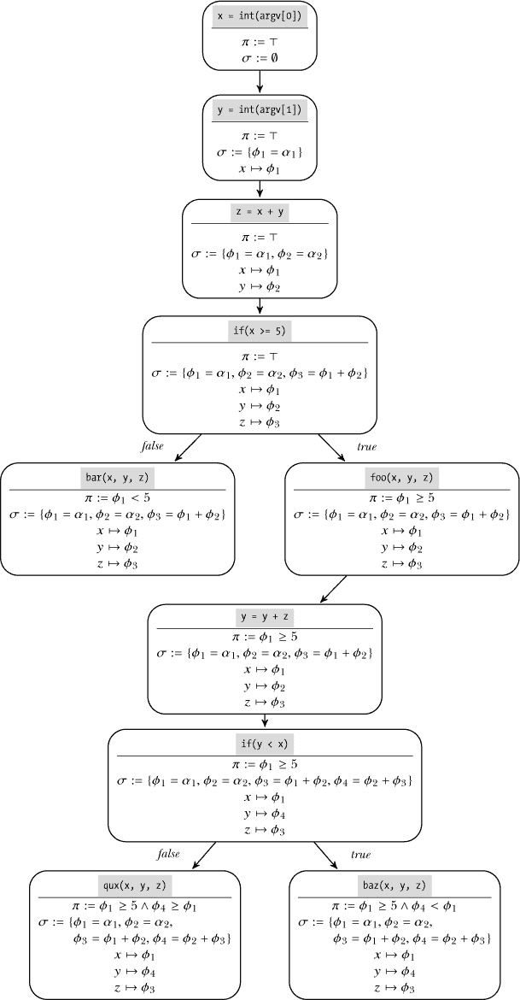
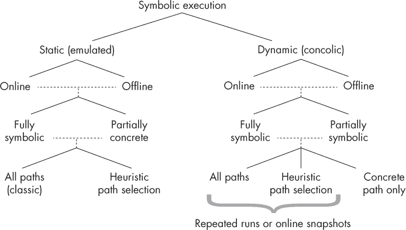

# 符号执行的原理

*符号执行*跟踪程序状态的元数据，就像污点分析一样。但与污点信息不同，污点信息仅让你推测*哪一部分*程序状态影响了另一部分，而符号执行让你推理*程序状态是如何变化的*，以及如何到达不同的程序状态。正如你将看到的，符号执行使得许多其他技术无法实现的强大分析成为可能。

我将以符号执行的基础知识概述开始这一章节。接着，你将深入了解*约束求解*（特别是*SMT 求解*），它是符号执行的一个基本构建块。在第十三章中，你将使用 Triton，一个二进制级别的符号执行库，构建实际工具，展示符号执行的能力。

### 12.1 符号执行概述

符号执行，简称*symbex*，是一种软件分析技术，它通过逻辑公式表达程序状态，你可以自动推理这些公式，以回答关于程序行为的复杂问题。例如，NASA 使用符号执行生成任务关键代码的测试用例，硬件制造商使用它测试用硬件描述语言（如 Verilog 和 VHDL）编写的代码。你也可以使用符号执行通过生成新的输入来自动增加动态分析的*代码覆盖率*，这些输入可以引导程序走向未探索的路径，这对于软件测试和恶意软件分析非常有用。在第十三章中，你将看到使用 symbex 的实际例子，演示如何实现代码覆盖、实现逆向切片，甚至自动生成漏洞的利用代码！

不幸的是，尽管符号执行是一项强大的技术，但由于可扩展性问题，你必须谨慎且有选择地应用它。例如，根据你解决的符号执行问题的类型，复杂度可能会呈指数级增长，甚至导致计算解决方案变得完全无法处理。你将在第 12.1.3 节中学习如何最小化这些可扩展性问题，但首先让我们回顾一下符号执行的基本工作原理。

#### *12.1.1 符号执行与具体执行*

Symbex 使用*符号值*执行（或模拟）应用程序，而不是在正常运行程序时使用的具体值。这意味着变量不会像在正常执行中那样包含特定值，比如`42`或`foobar`。相反，某些或所有变量（在二进制分析的上下文中，是寄存器或内存位置）由一个符号表示，该符号代表变量可能取的任何值。当执行进行时，符号执行会对这些符号计算逻辑公式。这些公式表示在执行过程中对符号执行的操作，并描述符号能够表示的值的范围。

正如我将解释的那样，许多 symbex 引擎保持符号和公式作为元数据 *除了* 具体值之外，而不是替换具体值，这类似于污点分析如何跟踪污点元数据。Symbex 引擎维护的符号值和公式集合称为 *符号状态*。让我们先看看符号状态是如何组织的，然后看一个符号执行过程中符号状态如何变化的具体示例。

##### 符号状态

符号执行操作在符号值上，这些符号值代表任何可能的具体值。我将符号值表示为 *α*[i]，其中 *i* 是整数 (*i* ∈ *N*)。Symbex 引擎在这些符号值上计算两种不同类型的公式：一组 *符号表达式* 和 *路径约束*。此外，它还维护一个变量的映射（或在二进制 symbex 的情况下，寄存器和内存位置）到符号表达式。我将路径约束和所有符号表达式及映射的组合称为 *符号状态*。

**符号表达式** 一个符号表达式 *ϕ*[j]，其中 *j* ∈ *N*，要么对应一个符号值 *α*[i]，要么是某些符号表达式的数学组合，例如 *ϕ*[3] = *ϕ*[1] + *ϕ*[2]。我将用 σ 表示 *符号表达式存储*，它是符号执行中使用的所有符号表达式的集合。正如我之前提到的，二进制级别的 symbex 将所有或部分寄存器和内存位置映射到 σ 中的一个表达式。

**路径约束** 路径约束编码了在执行过程中，由所采取的分支对符号表达式施加的限制。例如，如果符号执行先走分支 `if(x < 5)`，然后又走分支 `if(y >= 4)`，其中 *x* 和 *y* 分别映射到符号表达式 *ϕ*[1] 和 *ϕ*[2]，则路径约束公式变为 *ϕ*[1] < 5 ∧ *ϕ*[2] ≥ 4。我将路径约束表示为符号 *π*。

在符号执行的文献中，路径约束有时被称为 *分支约束*。在本书中，我将使用术语 *分支约束* 来指代由单个分支施加的约束，使用 *路径约束* 来指代沿着程序路径累积的所有分支约束的结合。

##### 符号执行一个示例程序

让我们通过 Listing 12-1 中的伪代码来具体化符号执行的概念。

*Listing 12-1：用伪代码示例说明符号执行*

```
➊ x = int(argv[0])
   y = int(argv[1])

➋ z = x + y
➌ if(x >= 5)
      foo(x, y, z)
      y = y + z
      if(y < x)
          baz(x, y, z)
      else
          qux(x, y, z)
➍ else
      bar(x, y, z)
```

这个伪代码程序从用户输入中获取两个整数，分别为 *x* 和 *y*。本节中探索的示例使用符号执行来查找覆盖代码路径的用户输入，这些路径分别指向 `foo` 和 `bar` 函数。为了实现这一点，你将 *x* 和 *y* 表示为符号值，然后通过符号执行程序来计算路径约束和程序操作对 *x* 和 *y* 施加的符号表达式。最后，你通过求解这些公式来找到具体的值（如果它们存在）以使得 *x* 和 *y* 使程序遍历每个路径。图 12-1 展示了符号状态如何在所有可能的路径中发展。



*图 12-1：示例函数中所有路径的路径约束和符号状态*

列表 12-1 从读取用户输入的 *x* 和 *y* 开始 ➊。正如在 图 12-1 中所看到的，路径约束 *π* 初始时设置为 ┬，即恒真符号。这表示尚未执行任何分支，因此没有施加约束。类似地，符号表达式存储最初为空集。读取 *x* 后，符号执行引擎创建了一个新的符号表达式 *ϕ*[1] = *α*[1]，这对应于一个*无约束*的符号值，可以表示任何具体值，并将 *x* 映射到该表达式。读取 *y* 时，发生类似的效果，将 *y* 映射到 *ϕ*[2] = *α*[2]。接着，操作 *z* = *x* + *y* ➋ 使得符号执行引擎将 *z* 映射到一个新的符号表达式 *ϕ*[3] = *ϕ*[1] + *ϕ*[2]。

假设符号执行引擎首先探索条件 `if(x >= 5)` ➌ 的 `true` 分支。为了实现这一点，引擎将分支约束 *ϕ*[1] ≥ 5 添加到 *π* 中，并继续在分支目标处进行符号执行，这就是调用 `foo`。回想一下，目标是找到能导致程序到达 `foo` 或 `bar` 函数的具体用户输入。因为你现在已经到达了 `foo` 的调用点，所以你可以求解表达式和分支约束，从而找到使得程序到达该 `foo` 调用的具体 *x* 和 *y* 值。

在执行的这一点，*x* 和 *y* 映射到符号表达式 *ϕ*[1] = *α*[1] 和 *ϕ*[2] = *α*[2]，分别，*α*[1] 和 *α*[2] 是唯一的符号值。而且，你只有一个分支约束条件：*ϕ*[1] ≥ 5\. 因此，达到 `foo` 调用的一个可能解决方案是 *α*[1] = 5 ∧ *α*[2] = 0\. 这意味着，如果你正常运行程序（即具体执行），并且用户输入 *x* = 5 和 *y* = 0，你将会到达 `foo` 的调用。请注意，*α*[2] 可以取任何值，因为它没有出现在路径约束中的任何符号表达式里。

像你刚才看到的那种解决方案叫做*模型*。通常，你会通过一个叫做*约束求解器*的特殊程序自动计算模型，该程序能够求解符号值，以满足所有的约束和符号表达式，正如你在第 12.2 节中将要学习的那样。

现在假设你想知道如何到达对 `bar` 的调用。为此，你必须避开 `if(x >= 5)` 分支，改走 `else` 分支 ➍。因此，你将旧的路径约束 *ϕ*[1] ≥ 5 改为 *ϕ*[1] < 5，并请求约束求解器提供一个新的模型。在这种情况下，一个可能的模型是 *α*[1] = 4 ∧ *α*[2] = 0。在某些情况下，求解器可能还会报告没有解决方案，意味着该路径是不可达的。

一般来说，无法覆盖一个复杂程序的所有路径，因为随着分支数量的增加，可能路径的数量呈指数增长。在第 12.1.3 节中，你将学习如何使用启发式方法来决定探索哪些路径。

正如我提到的，符号执行有几个变种，其中一些与刚才讨论的示例略有不同。让我们来看看这些符号执行的其他变种，并探讨它们的权衡。

#### *12.1.2 符号执行的变种和局限性*

像污点分析引擎一样，symbex 引擎通常被设计为一个框架，你可以用它来构建自己的 symbex 工具。许多 symbex 引擎实现了来自多个符号执行变种的方面，并允许你在它们之间进行选择。因此，熟悉这些设计决策的权衡是非常重要的。

图 12-2 展示了 symbex 实现的最重要的设计维度，每个维度在树的每一层中都有体现。

**静态与动态** 该 symbex 实现是基于静态分析还是动态分析？

**在线与离线** symbex 引擎是否并行探索多条路径（*在线*）或不探索（*离线*）？

**符号状态** 程序状态的哪些部分是符号表示的，哪些是具体的？符号内存访问是如何处理的？

**路径覆盖** 符号分析探索了哪些（以及多少）程序路径？



*图 12-2：符号执行设计维度*

让我们讨论一下这些设计决策及其在性能、局限性和完整性方面的权衡。

##### 静态符号执行（SSE）

像大多数软件和二进制分析技术一样，符号执行存在静态和动态两种变体，在可扩展性和完整性方面有不同的权衡。传统上，符号执行是一种静态分析技术，通过模拟程序的一部分，在每个模拟的指令中传播符号状态。这种类型的符号执行也称为*静态符号执行（SSE）*。它要么穷尽所有可能的路径，要么使用启发式方法决定遍历哪些路径。

SSE 的一个优点是，它使您能够分析在您的 CPU 上无法运行的程序。例如，您可以在 x86 机器上分析 ARM 二进制文件。另一个好处是，您可以仅模拟二进制的一部分（例如，单个函数），而不是整个程序。

缺点是，由于可扩展性问题，在每个分支探索两个方向并不总是可能的。虽然您可以使用启发式方法限制探索的分支数量，但提出有效的启发式方法来捕获所有有趣的路径并非易事。

此外，某些应用程序行为的部分内容很难通过 SSE 正确建模，特别是当控制流流出应用程序，进入符号执行引擎无法控制的软件组件时，例如内核或库。这种情况通常发生在程序发出系统调用或库调用、接收信号、尝试读取环境变量等操作时。为了解决这个问题，您可以使用以下解决方案，尽管每个方案都有其自身的缺点：

**效果建模** 一种常见的方法是，SSE 引擎模拟外部交互的效果，例如系统调用和库调用。这些模型是系统或库调用对符号状态产生的效果的“总结”。（请注意，*model*这个词在此处与约束求解器返回的模型无关。）

在性能方面，效果建模是一种相对廉价的解决方案。然而，创建适用于所有可能环境交互的准确模型——包括与网络、文件系统和其他进程的交互——是一项巨大的任务，可能涉及创建模拟的符号文件系统、符号网络栈等。更糟糕的是，如果要模拟不同的操作系统或内核，模型必须重新编写。因此，模型在实际应用中往往是不完整或不准确的。

**直接外部交互** 另外，符号执行引擎可以直接执行外部交互。例如，符号执行引擎可以直接进行系统调用，而不是仅模拟系统调用的效果，并将实际的返回值和副作用并入符号状态。

尽管这种方法简单，但当多个路径并行探索并执行竞争性外部交互时，会导致问题。例如，如果多个路径并行操作同一个物理文件，如果更改冲突，可能会导致一致性问题。

你可以通过为每个探索的路径克隆完整的系统状态来规避这个问题，但这个解决方案会极度消耗内存。此外，由于外部软件组件无法处理符号状态，直接与环境交互意味着需要昂贵地调用约束求解器，以计算合适的具体值，这些值可以传递给你想调用的系统或库函数。

由于静态符号执行存在这些困难，最近的研究探索了基于动态分析的替代符号执行实现。

##### 动态符号执行（并行符号执行）

*动态符号执行 (DSE)* 在应用程序中运行具体输入，并保持符号状态*此外*具体状态，而不是完全替代它。换句话说，这种方法使用具体状态来驱动执行，同时将符号状态作为元数据保持，就像污点分析引擎保持污点信息一样。因此，动态符号执行也被称为*并行符号执行*，即“具体符号执行”（con-crete symbolic execution）。

与传统的静态符号执行不同，后者并行探索多个程序路径，并行符号执行一次仅运行一个路径，这由具体输入决定。为了探索不同的路径，并行符号执行“翻转”路径约束，就像你在列表 12-1 的示例中看到的那样，然后使用约束求解器计算出能够导致另一个分支的具体输入。然后你可以使用这些具体输入开始新的并行符号执行，探索替代路径。

并行符号执行有许多优点。它的可扩展性更强，因为你不需要维护多个并行执行状态。你还可以通过简单地具体执行这些外部交互来解决静态符号执行在外部交互中的问题。这不会导致一致性问题，因为并行符号执行不会并行运行不同的路径。由于并行符号执行仅符号化程序状态中“有趣”的部分，如用户输入，它计算的约束通常涉及的变量比传统的静态符号执行引擎计算的要少，从而使得约束更容易且更快速地求解。

主要的缺点是通过混合执行（concolic execution）实现的代码覆盖率依赖于初始的具体输入。由于混合执行一次只“翻转”少量分支约束，如果这些路径与初始路径之间有许多翻转，那么到达有趣的路径可能需要很长时间。仅对程序的一部分进行符号执行也不那么简单，尽管可以通过在运行时动态启用或禁用符号引擎来实现。

##### 在线 vs 离线符号执行

另一个重要的考虑因素是符号执行引擎是否会并行探索多个路径。并行探索多个程序路径的符号执行引擎被称为*在线*（online），而一次只探索一个路径的引擎被称为*离线*（offline）。例如，经典的静态符号执行是在线的，因为它会在每个分支处分叉出一个新的符号执行实例，并并行探索两个方向。相比之下，混合执行通常是离线的，一次只探索单个具体执行路径。然而，也存在离线符号执行和在线混合执行的实现。

在线符号执行的优势在于它不需要多次执行相同的指令。相比之下，离线实现通常会多次分析相同的代码块，必须从头开始运行整个程序来处理每个程序路径。从这个意义上说，在线符号实现更高效，但同时要并行跟踪所有这些状态可能会消耗大量内存，而离线符号执行则不必担心这个问题。

在线符号执行实现试图通过将相同的程序状态部分合并在一起，从而将内存开销保持在最低限度，仅在它们分歧时才会分开。这种优化被称为*写时复制*（copy on write），因为它在写操作导致状态分歧时会复制合并的状态，为执行写操作的路径创建一个新的私有状态副本。

##### 符号状态

接下来的考虑因素是确定程序状态的哪些部分是符号化的，哪些部分是具体的，以及如何处理符号化的内存访问。许多符号执行和混合执行引擎提供了忽略某些寄存器和内存位置符号状态的选项。通过仅跟踪选定状态的符号信息，同时保持其余状态为具体状态，可以减少状态的大小及路径约束和符号表达式的复杂度。

这种方法在内存使用上更高效，速度也更快，因为约束更容易解决。权衡之处在于，你必须选择哪些状态进行符号化，哪些状态仅保持具体化，这一决策并非总是简单的。如果选择错误，你的符号执行工具可能会报告出乎意料的结果。

另一个关于符号执行引擎如何保持符号状态的重要方面是它们如何表示符号内存访问。像其他变量一样，指针可以是符号的，意味着它们的值不是具体的，而是部分未确定的。当内存加载或存储使用符号地址时，这就引入了一个难题。例如，如果使用符号索引向数组写入一个值，应该如何更新符号状态？我们来讨论几种解决这个问题的方法。

**完全符号内存** 基于完全符号内存的解决方案试图模拟内存加载或存储操作的所有可能结果。实现这一点的一种方法是将状态分叉成多个副本，每个副本反映内存操作的一个可能结果。例如，假设我们正在使用符号索引*ϕ*[i]从数组*a*中读取数据，并且约束条件是*ϕ*[i] < 5。状态分叉方法将把状态分叉成五个副本：一个表示*ϕ*[i] = 0（此时读取*a*[0]），另一个表示*ϕ*[i] = 1，依此类推。

实现相同效果的另一种方法是使用一些约束求解器支持的*if-then-else*表达式。这些表达式类似于编程语言中使用的 if-then-else 条件语句。在这种方法中，相同的数组读取被建模为一个条件约束，如果*ϕ*[i] = *i*，则该约束求值为符号表达式*a*[*i*]。

虽然完全符号内存解决方案能准确地模拟程序行为，但如果任何内存访问使用无界地址，它们会遭遇状态爆炸或极其复杂的约束。这些问题在二进制级符号执行中比源代码级符号执行更为常见，因为在二进制中边界信息并不容易获得。

**地址具体化** 为了避免完全符号内存的状态爆炸，可以用具体地址替换无界符号地址。在混合符号执行中，符号执行引擎可以简单地使用真实的具体地址。在静态符号执行中，符号执行引擎需要使用启发式方法来决定合适的具体地址。这种方法的优点是大大减少了状态空间和约束的复杂性，但缺点是它没有完全捕捉所有可能的程序行为，这可能导致符号执行引擎错过一些可能的结果。

在实践中，许多符号执行引擎会采用这些解决方案的组合。例如，当访问范围被约束限制在足够小的范围内时，它们可能会符号化建模内存访问，同时具体化无界访问。

##### 路径覆盖

最后，你需要了解符号分析所探索的程序路径。经典的符号执行会探索*所有*程序路径，每当遇到分支时就会分叉出一个新的符号状态。由于程序中分支的数量会指数级地增加，路径的数量也会急剧增长，这种方法无法扩展；这就是著名的*路径爆炸问题*。事实上，如果存在无限循环或递归调用，路径的数量可能是无限的。对于复杂程序，你需要一种不同的方法来使符号执行更具实践性。

SSE 的另一种替代方法是使用启发式方法来决定探索哪些路径。例如，在自动化漏洞发现工具中，你可能会集中分析索引数组的循环，因为这些循环相对更可能包含像缓冲区溢出这样的漏洞。

另一种常见的启发式方法是*深度优先搜索（DFS）*，它在转到另一路径之前，首先完整探索一个程序路径，假设深度嵌套的代码比表面上的代码更“有趣”。*广度优先搜索（BFS）*则相反，它并行探索所有路径，但需要更长时间才能达到深度嵌套的代码。使用哪种启发式方法取决于你的符号执行工具的目标，找到合适的启发式方法可能是一个重大挑战。

并发执行每次只探索一条路径，路径由具体输入驱动。但你也可以将其与启发式路径探索方法或甚至是探索所有路径的方法结合使用。对于并发执行，探索多条路径的最简单方法是反复运行应用程序，每次使用通过“翻转”上次运行中的分支约束发现的新输入。一个更复杂的方法是拍摄程序状态的快照，这样在完成一个路径的探索后，你可以恢复到先前的快照并从那里探索另一条路径。

总结来说，符号执行有许多参数可以调整，以平衡分析的性能和局限性。最佳配置将取决于你的目标，不同的符号执行引擎会做出不同的配置选择。

例如，Triton（你将在第十三章中再次看到）和 angr^(1)是支持应用层 SSE 和并发执行的二进制级符号执行引擎。S2E^(2)也在二进制上运行，但采用基于系统虚拟机的方法，不仅可以对应用程序，还可以对虚拟机中的内核、库和驱动程序应用符号执行。相比之下，KLEE^(3)对 LLVM 位码进行经典的在线 SSE，而不是直接对二进制进行，支持多种搜索启发式方法来优化路径覆盖率。还有更高级别的符号执行引擎，直接在 C、Java 或 Python 代码上运行。

既然你已经熟悉了各种符号执行技术的工作原理，那么我们来讨论一些常见的优化方法，这些方法可以帮助你提高符号执行工具的可扩展性。

#### *12.1.3 提高符号执行的可扩展性*

如你所见，符号执行受到性能和内存开销两个主要因素的影响，这些因素削弱了其可扩展性。这些因素包括覆盖所有可能程序路径的不可行性，以及求解覆盖数百甚至数千个符号变量的巨大约束的计算复杂性。

你已经看到了一些减少路径爆炸问题影响的方法，例如通过启发式选择要执行的路径、合并符号状态以减少内存使用，以及使用程序快照来避免对相同指令的重复分析。接下来，我将讨论几种最小化约束求解成本的方法。

##### 简化约束条件

由于约束求解是符号执行中计算开销最大的一部分，因此尽量简化约束条件，并将约束求解器的使用保持在最低限度是有意义的。首先，我们来看一些简化路径约束和符号表达式的方法。通过简化这些公式，你可以减少约束求解器的任务复杂度，从而加速符号执行。当然，诀窍是做到这一点时不会显著影响分析的准确性。

**限制符号变量的数量** 简化约束的一个明显方法是减少符号变量的数量，并使程序的其他状态保持具体化。然而，你不能随便将状态具体化，因为如果你具体化了错误的状态，你的符号执行工具可能会错过解决你正在尝试解决的问题的潜在方案。

例如，如果你使用符号执行来查找可以利用程序的网络输入，但你将所有网络输入具体化，那么你的工具只会考虑那些具体的输入，因此无法找到漏洞。另一方面，如果你将从网络接收到的每一个字节都符号化，那么约束条件和符号表达式可能会变得过于复杂，无法在合理的时间内解决。关键是只符号化那些有可能在漏洞利用中起作用的输入部分。

对于符号执行工具来说，一种实现这一点的方法是使用预处理步骤，通过污点分析和模糊测试来查找会导致危险后果的输入，比如损坏的返回地址，然后使用符号执行来查找是否有输入会破坏该返回地址，使其允许攻击利用。通过这种方式，你可以使用像 DTA 和模糊测试这样的相对便宜的技术来判断*是否*存在潜在的漏洞，并仅在可能的漏洞程序路径中使用符号执行来找出*如何*在实践中利用这个漏洞。这种方法不仅可以让你将符号执行集中在最有潜力的路径上，还可以通过只对污点分析显示相关的输入进行符号化，从而减少约束的复杂性。

**限制符号操作的数量** 另一种简化约束的方法是仅符号执行那些相关的指令。例如，如果你正在尝试通过`rax`寄存器利用间接调用，那么你只关心那些对`rax`值有贡献的指令。因此，你可以首先计算一个向后切片，找出贡献给`rax`的指令，然后符号模拟切片中的指令。或者，一些符号执行引擎（包括我在第十三章中使用的 Triton）提供了仅符号执行操作符号数据或符号化表达式的指令的可能性。

**简化符号内存** 正如我之前解释的那样，如果存在任何不受限的符号内存访问，完整的符号内存可能会导致状态数或约束大小的爆炸。你可以通过将其具体化来减少此类内存访问对约束复杂度的影响。或者，像 Triton 这样的符号执行引擎允许你对内存访问做出简化假设，例如它们只能访问按字对齐的地址。

##### 避免约束求解器

避免使用约束求解器是绕过约束求解复杂性最有效的方法。虽然这听起来可能像是一个无用的说法，但实际上有一些方法可以在你的符号执行工具中限制对约束求解的需求。

首先，你可以使用我讨论的预处理步骤来查找潜在的有趣路径和输入，并使用符号执行来探索这些路径，并找出这些输入影响的指令。这可以帮助你避免对无趣路径或指令进行不必要的约束求解器调用。符号执行引擎和约束求解器也可能缓存之前评估过的（子）公式的结果，从而避免再次求解相同的公式。

因为约束求解是符号执行的关键部分，让我们更详细地探讨它是如何工作的。

### 12.2 使用 Z3 求解约束

符号执行通过符号公式描述程序的操作，并使用约束求解器自动求解这些公式并回答关于程序的问题。为了理解符号执行及其局限性，您需要熟悉约束求解的过程。

在本节中，我将解释使用一种名为*Z3*的流行约束求解器进行约束求解的最重要方面。Z3 由微软研究院开发，并且可以在* [`github.com/Z3Prover/z3/`](https://github.com/Z3Prover/z3/)* 上免费获得。

Z3 是一种所谓的*满足性模理论（SMT）*求解器，这意味着它专门用于解决关于特定数学理论（如整数算术理论）公式的满足性问题。^(4) 这与纯粹的*布尔满足性（SAT）*问题的求解器有所不同，后者没有内建的理论特定操作知识，如整数操作（例如+或<）。Z3 内建了如何求解涉及整数操作和*位向量*（二进制数据表示）等操作的公式的知识。这种特定领域的知识在解决由符号执行产生的公式时非常有用，因为这些公式正是涉及这些操作。

请注意，像 Z3 这样的约束求解器与符号执行引擎是分开的程序，其目的不仅仅限于符号执行。一些符号执行引擎甚至允许你根据个人喜好插入多个不同的约束求解器。Z3 是一个受欢迎的选择，因为它的特性非常适合符号执行，并且提供了易于使用的 C/C++和 Python 等语言的 API。它还附带一个命令行工具，你可以使用它来求解公式，稍后你将看到这一点。

同时也需要认识到，Z3 并不是一种万能的灵丹妙药。尽管 Z3 和其他类似的求解器在解决某些可判定公式类别时非常有用，但它们可能无法解决这些类别之外的公式。即便是支持的公式类别中的公式，也可能需要较长时间来解决，尤其是当公式包含大量变量时。这就是为什么将约束保持尽可能简单非常重要的原因。

我将在这里仅介绍 Z3 的最重要特性，但如果您有兴趣，可以查阅网上更为全面的教程。^(5)

#### *12.2.1 证明指令的可达性*

让我们首先使用 Z3 命令行工具，该工具已经预安装在虚拟机上，来表示并求解一组简单的公式。使用`z3 -in`命令启动命令行工具以从标准输入读取，或者使用`z3` *file*来从脚本文件读取。

Z3 的输入格式是*SMT-LIB 2.0*的扩展，这是一个用于 SMT 求解器的语言标准。在接下来的示例中，你将学习 Z3 语言支持的最重要命令；这些命令将帮助你调试你的 symbex 工具，因为你可以使用它们来理解你的 symbex 工具传递给约束求解器的输入。有关特定命令的更多详细信息，输入`(help)`到`z3`工具中。

在内部，Z3 维护了你提供的公式和声明的*堆栈*。在 Z3 术语中，公式称为*断言*。Z3 允许你检查你提供的断言集是否是*可满足的*，这意味着有一种方法可以使所有断言同时成立。

让我们通过回到示例 12-1 中的伪代码来澄清这一点。以下示例将使用 Z3 证明对函数`baz`的调用是可达的。示例 12-2 重复了示例代码，并标记了对`baz`的调用 ➊。

*示例 12-2：伪代码示例，演示约束求解*

```
x = int(argv[0])
y = int(argv[1])

z = x + y
if(x >= 5)
    foo(x, y, z)
    y = y + z
    if(y < x)
        ➊baz(x, y, z)
    else
         qux(x, y, z)
else
    bar(x, y, z)
```

示例 12-3 展示了如何模拟符号表达式和路径约束，类似于 symbex 引擎的做法，以证明`baz`是可达的。为了简化，我假设对`foo`的调用没有副作用，因此在模拟通往`baz`的路径时可以忽略`foo`中的内容。

*示例 12-3：使用 Z3 证明* baz *是可达的*

```
   $ z3 -in
➊ (declare-const x Int)
   (declare-const y Int)
   (declare-const z Int)
➋ (declare-const y2 Int)
➌ (assert (= z (+ x y)))
➍ (assert (>= x   5))
➎ (assert (= y2   (+ y z)))
➏ (assert (< y2   x))
➐ (check-sat)
   sat
➑ (get-model)
   (model
     (define-fun y () Int
       (- 1))
     (define-fun x () Int
       5)
     (define-fun y2 () Int
       3)
     (define-fun z () Int
       4)
   )
```

在示例 12-3 中，有两点立即引人注目：所有命令都被括号括起来，且所有操作都采用波兰表示法，先是操作符，后是操作数（+ *x* *y* 而不是 *x* + *y*）。

##### 声明变量

示例 12-3 首先声明了路径上出现的变量（`x`、`y`和`z`）到`baz` ➊。从 Z3 的角度来看，这些被模拟为*常量*而非变量。要声明常量，你需要使用`declare-const`命令，指定常量的名称和类型。在这种情况下，所有常量的类型都是`Int`。

将`x`、`y`和`z`建模为常量的原因是执行程序路径和在 Z3 中建模程序路径之间存在根本的区别。当你执行程序时，所有操作都是逐个执行的，但在 Z3 中建模程序路径时，你将这些相同的操作表示为一个方程组，要求同时求解。当 Z3 求解这些公式时，它会为`x`、`y`和`z`分配具体值，实际上是找到合适的常量来满足这些公式。

除了`Int`，Z3 还支持其他常见数据类型，如`Real`（浮动点数）和`Bool`，以及更复杂的类型，如`Array`。

`Int`和`Real`都支持任意精度，这与机器代码操作的固定宽度数字不同。因此，Z3 还提供了特殊的位向量类型，我将在第 12.2.5 节中讲解。

##### 静态单一赋值形式（Static Single Assignment Form）

Z3 以不考虑程序路径操作顺序的方式同步求解所有公式，这一点有着另一个重要的含义。假设在同一程序路径中，某个变量，比如*y*，被多次赋值，一次为*y* = 5，之后再为*y* = 10。当求解时，Z3 会看到两个冲突的约束，声明*y*必须同时等于 5 和 10，这显然是不可能的。

许多符号执行引擎通过以*静态单一赋值（SSA）*形式发出符号表达式来解决这个问题，这要求每个变量只能被赋值一次。这意味着在*y*的第二次赋值时，它会被拆分为两个版本，*y*[1]和*y*[2]，从而消除了任何歧义，并解决了 Z3 视角中的相互矛盾的约束条件。这正是为什么在列表 12-3 中会额外声明一个名为`y2`的常量 ➋：在列表 12-2 中，变量`y`在到达`baz`的路径上被赋值两次，因此必须通过 SSA 技巧将其拆分。你还可以在图 12-1 中观察到这一点，那里可以看到`y`被映射到一个新的符号表达式*ϕ*[4]，表示`y`的新版本。

##### 添加约束条件

在声明所有常量之后，可以使用`assert`命令将约束公式（断言）添加到 Z3 的公式堆栈中。如我所提到的，您需要使用波兰表示法来表达公式，其中操作符位于操作数之前。Z3 支持常见的数学运算符，如+、−、=、<等，并且具有其通常的含义。正如你在后面的例子中看到的，Z3 还支持逻辑运算符和处理位向量的运算符。

列表 12-3 中的第一个断言是关于`z`的符号表达式，声明它必须等于`x + y` ➌，模拟列表 12-2 中的伪代码程序`z = x + y`。接下来，有一个断言添加了分支约束`x >= 5` ➍（用于模拟分支`if(x >= 5)`），然后是一个符号表达式`y2 = y + z` ➎。请注意，`y2`依赖于从用户输入分配的原始`y`，这清楚地显示了需要使用 SSA 形式来消除断言的歧义并防止循环依赖。最后的断言添加了第二个分支约束`y2 < x` ➏。注意，我省略了对`foo`的调用建模，因为它没有副作用，因此不会影响`baz`的可达性。

##### 检查可满足性并获取模型

在添加了所有建模`baz`路径所需的断言后，可以使用 Z3 的`check-sat`命令➐检查断言堆栈的可满足性。在这种情况下，`check-sat`打印`sat`，表示断言系统是可满足的。这告诉你，`baz`可以沿着建模的程序路径到达。如果断言系统不可满足，`check-sat`则会打印`unsat`。

一旦你知道断言是可满足的，你可以向 Z3 请求一个*模型*：一个满足所有断言的常量的具体赋值。要请求一个模型，你使用命令`get-model` ➑。返回的模型通过*函数*（使用命令`define-fun`定义）来表达每个常量的赋值，这些函数返回一个常量值。这是因为在 Z3 中，常量实际上就是不带参数的函数，命令`declare-const`只是语法糖，而`get-model`会省略它。例如，模型中列表 12-3 的这一行`define-fun y () Int (-1)`定义了一个名为`y`的函数，它不带参数，并返回一个值为`-1`的`Int`。这意味着，在这个模型中，常量`y`的值是`-1`。

如你所见，在列表 12-3 的情况下，Z3 找到了`x = 5`，`y = -1`，`z = 4`（因为`z = x + y = 5 - 1`），和`y2 = 3`（因为`y2 = y + z = -1 + 4`）的解。这意味着，如果你在列表 12-2 中的伪代码程序中使用输入值`x = 5`和`y = -1`，你将到达对`baz`的调用。请注意，通常有多个可能的模型，`get-model`返回的具体模型是随机选择的。

#### *12.2.2 证明指令的不可达性*

请注意，在列表 12-3 的模型中，赋给`y`的值是负数。实际上，如果`x`和`y`是有符号的，`baz`是可以到达的，但如果它们是无符号的，则不能到达。让我们来证明这一点，这样你就可以看到一个不可满足的断言系统示例。列表 12-4 再次模拟了通往`baz`的路径，这次增加了限制条件：`x`和`y`必须都为非负值。

*列表 12-4：证明如果输入是无符号的，baz* 是不可到达的 *

```
   $ z3 -in
   (declare-const x Int)
   (declare-const y Int)
   (declare-const z Int)
   (declare-const y2 Int)
➊ (assert (>= x 0))
➋ (assert (>= y 0))
   (assert (= z (+ x y)))
   (assert (>= x 5))
   (assert (= y2 (+ y z)))
   (assert (< y2 x))
➌ (check-sat)
   unsat
```

如你所见，列表 12-4 与列表 12-3 完全相同，唯一的区别是添加了断言`x >= 0` ➊和`y >= 0` ➋。这次，`check-sat`返回`unsat` ➌，证明了如果`x`和`y`是无符号的，`baz`是无法到达的。对于一个不可满足的问题，你无法得到模型，因为不存在这样的模型。

#### *12.2.3 证明公式的有效性*

你还可以使用 Z3 证明一组断言不仅是可满足的，而且是*有效的*，这意味着无论你将什么具体值代入，它始终为真。证明一个公式或一组公式是有效的，相当于证明其否定是不可满足的，你已经知道如何使用 Z3 做到这一点。如果否定是可满足的，那就意味着这组公式不是有效的，你可以向 Z3 请求一个模型作为反例。

让我们用这个思路来证明*双向引理*的有效性，这是命题逻辑中一个著名的有效公式。这也让你可以看到 Z3 的命题逻辑操作符的实际应用，以及 Z3 的布尔数据类型`Bool`。

双向引理声明为 ((*p* → *q*) ∧ (*r* → *s*) ∧ (*p* ∨ ¬ *s*)) ├ (*q* ∨ ¬ *r*)。示例 12-5 在 Z3 中建模该引理并证明其有效性。

*示例 12-5：使用 Z3 证明双向引理*

```
   $ z3 -in
➊ (declare-const p Bool)
   (declare-const q Bool)
   (declare-const r Bool)
   (declare-const s Bool)
➋ (assert (=> (and (and (=> p q) (=> r s)) (or p (not s))) (or q (not r))))
➌ (check-sat)
   sat
➍ (get-model)
   (model
     (define-fun r () Bool
      true)
   )
➎ (reset)
➏ (declare-const p Bool)
   (declare-const q Bool)
   (declare-const r Bool)
   (declare-const s Bool)
➐ (assert (not (=> (and (and (=> p q) (=> r s)) (or p (not s))) (or q (not r)))))
➑ (check-sat)
   unsat
```

示例 12-5 声明了四个名为 `p`、`q`、`r` 和 `s` 的 `Bool` 常量 ➊，每个常量对应双向引理中的一个变量。然后，它使用 Z3 的逻辑运算符断言双向引理 ➋。正如你所看到的，Z3 支持所有常见的逻辑运算符，包括 `and` (∧)、`or` (∨)、`xor` (⊕)、`not` (¬)，以及逻辑蕴含运算符 `=>` (→)。Z3 使用等号符号 (`=`) 来表示双向蕴含 (↔)。此外，Z3 还支持一个名为 `ite` 的 *if-then-else* 运算符，其语法为 `ite` *条件 值-为-真 值-为-假*。我在示例中将“蕴含”符号 ⊢ 表示为蕴含 (`=>`) 运算符。

首先，让我们证明双向引理是可满足的。你可以轻松地通过 `check-sat` ➌ 来确认这一点，并使用 `get-model` 获取一个模型 ➍。在这个例子中，模型只将 `true` 赋给 `r`，因为这足以使断言为真，而不管 `p`、`q` 和 `s` 的值是什么。这告诉你双向引理是可满足的，但并不能证明它是有效的。

为了证明引理是有效的，你需要重置 Z3 的断言栈 ➎，声明与之前相同的常量 ➏，然后断言双向引理的否定 ➐。通过使用 `check-sat`，你可以确认引理的否定是不可满足的 ➑，从而证明双向引理是有效的。

除了命题逻辑外，Z3 还可以解决 *有效命题* 公式，它是谓词逻辑中的一个可判定子集。在这里我不会详细讨论有效命题公式，因为在本书的符号执行目的中，你不需要使用谓词逻辑。

#### *12.2.4 简化表达式*

Z3 也可以简化表达式，如在示例 12-6 中所示。

*示例 12-6：使用 Z3 简化公式*

```
   $ z3 -in
➊ (declare-const x Int)
   (declare-const y Int)
➋ (simplify (+ (* 3 x) (* 2 y) 5 x y))
   (+ 5 (* 4 x) (* 3 y))
```

这个例子声明了两个整数，分别为 `x` 和 `y` ➊，然后调用 Z3 的 `simplify` 命令来简化公式 `3x + 2y + 5 + x + y` ➋。Z3 将其简化为 `5 + 4x + 3y`。请注意，在这个例子中，我利用了 Z3 的能力，使其能够对 + 运算符使用两个以上的操作数，并一次性将它们相加。在像这样的简单示例中，Z3 的 `simplify` 命令效果很好，但在更复杂的情况下，可能效果不佳。Z3 的简化主要是为了使像符号执行引擎这样的程序能够自动处理公式，而不是为了提高人类的可读性。

#### *12.2.5 使用位向量建模机器码的约束*

到目前为止，所有示例都使用了 Z3 的任意精度 `Int` 数据类型。如果你使用任意精度数据类型来建模二进制数，结果可能并不能准确反映现实情况，因为二进制操作是在固定宽度的整数上进行的，这些整数的精度有限。这就是为什么 Z3 还提供了 *位向量*，它们是固定宽度的整数，特别适合用于符号执行。

要操作位向量，你需要使用专门的运算符，如 `bvadd`、`bvsub` 和 `bvmul`，而不是通常的整数运算符如 +、− 和 ×。表 12-1 显示了最常见的位向量运算符的概览。如果你检查像 Triton 这样的符号执行引擎传递给约束求解器的约束和符号表达式，你会看到很多这些运算符。此外，了解这些运算符在构建你自己的符号执行工具时非常有用，正如你将在第十三章中学习的那样。让我们讨论如何在实践中使用表 12-1 中列出的运算符。

Z3 允许你创建任意位宽的位向量。你可以通过多种方式实现这一点，如表 12-1 的第一部分 ➊ 所示。首先，你可以使用符号 `#b1101` 创建一个 4 位宽的位向量常量，包含位值 `1101`。类似地，符号 `#xda` 创建一个 8 位宽的位向量，包含值 `0xda`。

正如你所看到的，对于二进制或十六进制常量，Z3 会自动推断出位向量需要的最小大小。为了声明十进制常量，你需要明确声明位向量的值和位宽。例如，符号 `(_ bv10 32)` 创建了一个 32 位宽的位向量，包含值 10。你还可以使用符号 `(declare-const x (_ BitVec 32))` 声明一个未确定值的位向量常量，其中 `x` 是常量的名称，`32` 是它的位宽。

**表 12-1：** 常见 Z3 位向量运算符

| **操作** | **描述** | **示例** |
| --- | --- | --- |
| ➊ **位向量创建** |
| `#b<value>` | 二进制位向量常量 | `#b1101        ; 1101` |
| `#x<value>` | 十六进制位向量常量 | `#xda           ; 0xda` |
| `(_ bv<value> <width>)` | 十进制位向量常量 | `(_ bv10 32) ; 10 (32 位宽)` |
| `(_ BitVec <width>)` | `<width>` 位位向量类型 | `(declare-const x (_ BitVec 32))` |
| ➋ **算术运算符** |
| `bvadd` | 加法 | `(bvadd x #x10)          ; x + 0x10` |
| `bvsub` | 减法 | `(bvsub #x20 y)          ; 0x20 - y` |
| `bvmul` | 乘法 | `(bvmul #x2 #x3)         ; 6` |
| `bvsdiv` | 有符号除法 | `(bvsdiv x y)            ; x/y` |
| `bvudiv` | 无符号除法 | `(bvudiv y x)            ; y/x` |
| `bvsmod` | 有符号模运算 | `(bvsmod x y)            ; x % y` |
| `bvneg` | 二补码 | `(bvneg #b1101)          ; 0011` |
| `bvshl` | 左移 | `(bvshl #b0011 #x1)      ; 0110` |
| `bvlshr` | 逻辑（无符号）右移 | `(bvlshr #b1000 #x1)     ; 0100` |
| `bvashr` | 算术（带符号）右移 | `(bvashr #b1000 #x1)     ; 1100` |
| ➌ **按位操作符** |
| `bvor` | 按位 OR | `(bvor #x1 #x2)              ; 3` |
| `bvand` | 按位 AND | `(bvand #xffff #x0001)       ; 1` |
| `bvxor` | 按位 XOR | `(bvxor #x3 #x5)             ; 6` |
| `bvnot` | 按位取反（补码） | `(bvnot x);                  ∼x` |
| ➍ **比较操作符** |
| `=` | 相等 | `(= x y)           ; x == y` |
| `bvult` | 无符号小于 | `(bvult x #x1a) ; x < 0x1a` |
| `bvslt` | 带符号小于 | `(bvslt x #x1a) ; x < 0x1a` |
| `bvugt` | 无符号大于 | `(bvugt x y)       ; x > y` |
| `bvsgt` | 带符号大于 | `(bvsgt x y)       ; x > y` |
| `bvule` | 无符号小于或等于 | `(bvule x #x55) ; x <= 0x55` |
| `bvsle` | 带符号小于或等于 | `(bvsle x #x55) ; x <= 0x55` |
| `bvuge` | 无符号大于或等于 | `(bvuge x y)       ; x >= y` |
| `bvsge` | 带符号大于或等于 | `(bvsge x y)       ; x >= y` |
| ➎ **按位向量连接与提取** |
| `concat` | 连接按位向量 | `(concat #x4 #x8)       ; 0x48` |
| `(_ extract <hi> <lo>)` | 提取从 <lo> 到 <hi> 的位 | `((_ extract 3 0) #x48) ; 0x8` |

Z3 还支持算术按位向量操作符，镜像了 C/C++ 等语言和 x86 等指令集所支持的所有基本操作 ➋。例如，Z3 命令 `(assert (= y (bvadd x #x10)))` 表示按位向量 `y` 必须等于按位向量 `x + 0x10`。对于许多操作，Z3 提供了带符号和无符号的变体。例如，`(bvsdiv x y)` 执行带符号除法 `x/y`，而 `(bvudiv x y)` 执行无符号除法。还要注意，Z3 要求算术按位向量操作中的两个操作数具有相同的位宽。

在 表 12-1 的“示例”列中，我列出了所有 Z3 常见按位向量操作的示例。分号后是注释，显示了 Z3 操作的 C/C++ 等效或算术结果。

除了算术操作符，Z3 还实现了常见的按位操作符，如 OR（相当于 C 的 `|`）、AND（`&`）、XOR（`^`）和 NOT（`~`） ➌。它还实现了比较操作符，如 `=` 用于检查按位向量的相等性，`bvult` 用于执行无符号“小于”比较，等等 ➍。支持的比较操作符与 x86 的条件跳转指令非常相似，特别是在与 Z3 的 `ite` 操作符结合使用时非常有用。例如，`(ite (bvsge x y) 22 44)` 如果 `x >= y`，结果为 `22`，否则为 `44`。

你还可以连接两个按位向量或提取一个按位向量的一部分 ➎。这在你需要使两个按位向量的大小一致以进行某些操作，或者你只关心按位向量的一部分时非常有用。

现在你已经熟悉了 Z3 的按位向量操作符，让我们来看一个实际示例，展示如何使用这些操作符。

#### *12.2.6 解决一个不透明的按位向量谓词*

让我们使用 Z3 来解决一个不透明谓词，看看如何在实践中使用位向量操作。不透明谓词是总是被评估为真或假的分支条件，但对逆向工程师来说并不明显。它们作为代码混淆手段，使逆向工程师更难理解代码，例如通过插入在实践中从未被执行的死代码。

在某些情况下，你可以使用像 Z3 这样的约束求解器来证明某个分支是透明地为真或假的。例如，考虑一个透明为假的分支，它利用了∀*x* ∈ ℤ，2 | (*x* + *x*²)这一事实。换句话说，对于任何整数*x*，*x* + *x*²的结果对 2 取模为零。你可以利用这一点构造一个分支`if((x + x*x) % 2 != 0)`，无论`x`的值为何，它都永远不会被执行，而这一点并不立刻显现出来。然后，你可以在分支的“执行”路径中插入混淆的虚假代码，误导逆向工程师。

Listing 12-7 展示了如何在 Z3 中建模这个分支并证明它永远不会被执行。

*Listing 12-7: 使用 Z3 解决不透明谓词*

```
   $ z3 -in
➊ (declare-const x (_ BitVec 64))
➋ (assert (not (= (bvsmod (bvadd (bvmul x x) x) (_ bv2 64)) (_ bv0 64))))
➌ (check-sat)
   unsat
```

首先，你声明一个 64 位的位向量`x` ➊用于分支条件。然后你断言分支条件本身 ➋，最后你通过`check-sat` ➌来检查它的可满足性。因为`check-sat`返回`unsat`，你知道这个分支条件永远不可能为真，因此在进行逆向工程时，你可以安全地忽略分支内部的任何代码。

如你所见，手动建模并证明像这样的简单不透明谓词是非常繁琐的。但是，通过符号执行，你可以自动解决像这样的难题。

### 12.3 小结

在本章中，你学习了符号执行和约束求解的原理。符号执行是一项强大的技术，但由于其不可扩展性，应谨慎使用。因此，有几种优化符号执行工具的方法，其中大多数依赖于最小化需要分析的代码量以及约束求解器的负载。在第十三章中，你将通过使用 Triton 构建实用的符号执行工具，了解如何在实践中使用符号执行。

习题

1\. 跟踪符号状态

考虑以下代码：

```
x = int(argv[0])
y = int(argv[1])

z = x*x
w = y*y
if(z <= 1)
  if( ((z + w) % 7 == 0) && (x % 7 != 0) )
     foo(z, w)
else
  if((2**z - 1) % z != 0)
     bar(x, y, z)

  else
    z = z + w
    baz(z, y, x)
z = z*z
qux(x, y, z)
```

创建一棵树状图，展示每条路径上符号状态如何变化（类似于图 12-1）。语句`2**z`代表 2^z。

请注意，代码中的最后两条语句在每条代码路径的末尾都会执行，无论哪些分支被执行。然而，这些最后语句中`z`的值取决于之前执行的是哪条路径。为了在树状图中捕捉到这一行为，你有以下两种选择：

1\. 为你图中的每条路径创建前两条语句的私有副本。

2\. 在这些最后的语句处将所有路径合并，并使用一个条件的*if-then-else*表达式来建模`z`的符号值，该表达式依赖于执行的路径。

2\. 证明可达性

使用 Z3 确定在之前练习中的列表中，哪些对 `foo`、`bar` 和 `baz` 的调用是可达的。使用位向量建模相关的操作和分支。

3\. 查找不透明谓词

使用 Z3 检查之前列表中的任何条件语句是否为不透明谓词。如果是，它们是永远为真还是永远为假？哪些代码是不可达的，因此可以安全地从列表中删除？
