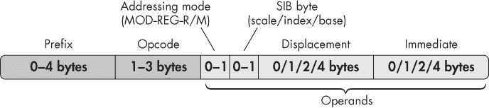
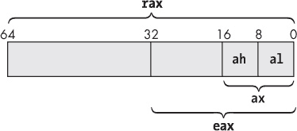
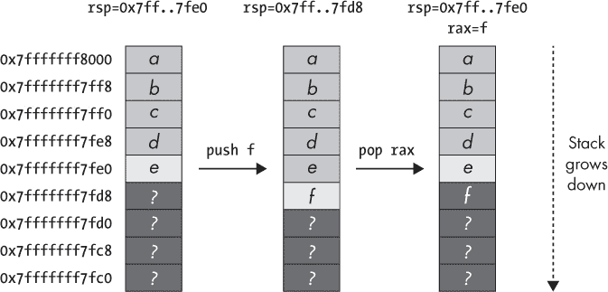
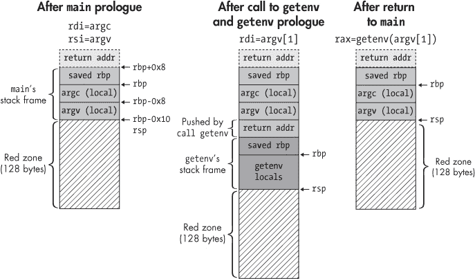

## A

X86 汇编速成课程

因为汇编语言是你在二进制文件中找到的机器指令的标准表示方式，许多二进制分析都是基于反汇编的。因此，熟悉 x86 汇编语言的基础知识对最大化地利用本书非常重要。本附录将介绍你需要了解的基础知识，以便跟上内容。

本附录的目的不是教你如何编写汇编程序（有专门的书籍讲解这个主题），而是展示你理解反汇编程序所需了解的基本内容。你将了解汇编程序和 x86 指令的结构以及它们在运行时的行为。此外，你还将看到 C/C++程序中常见的代码结构如何在汇编级别表现。我只会涵盖基本的 64 位用户模式 x86 指令，不包括浮点指令或扩展指令集，如 SSE 或 MMX。为了简洁起见，我将把 x86 的 64 位变种（x86-64 或 x64）简称为 x86，因为这是本书的重点。

### A.1 汇编程序的布局

清单 A-1 显示了一个简单的 C 程序，而 清单 A-2 显示了由`gcc` 5.4.0 生成的相应汇编程序。（第一章 解释了编译器如何将 C 程序转换为汇编列表，并最终转化为二进制文件。）

当你反汇编一个二进制文件时，反汇编器本质上会尝试将其翻译回一个准确的汇编列表，尽可能接近编译器生成的汇编代码。现在，让我们先看看汇编程序的*布局*，暂时不深入讨论汇编指令。

*清单 A-1：C 语言中的“Hello, world!”*

```
  #include <stdio.h>

  int
➊ main(int argc, char *argv[])
  {
     ➋printf(➌"Hello, world!\n");

     return 0;
  }
```

*清单 A-2：由* gcc 生成的汇编

```
      .file "hello.c"
      .intel_syntax noprefix
➍    .section .rodata
  .LC0:
➎    .string "Hello, world!"
➏    .text
     .globl  main
     .type   main, @function
➐ main
      push    rbp
      mov     rbp, rsp
      sub     rsp, 16
      mov     DWORD PTR [rbp-4], edi
      mov     QWORD PTR [rbp-16], rsi
➑    mov     edi, OFFSET FLAT:.LC0
➒    call    puts
      mov     eax, 0
      leave
      ret
      .size    main, .-main
      .ident  "GCC: (Ubuntu 5.4.0-6ubuntu1~16.04.9)"
      .section .note.GNU-stack,"",@progbits
```

清单 A-1 由一个 `main` 函数 ➊ 组成，该函数调用 `printf` ➋ 打印常量 `"Hello, world!"` 字符串 ➌。从高层次来看，相应的汇编程序包含四种类型的组件：指令、指令、标签和注释。

#### *A.1.1 汇编指令、指令、标签和注释*

表 A-1 显示了每种组件类型的示例。请注意，每种组件的确切语法因汇编器或反汇编器而异。对于本书而言，你无需对任何汇编器的语法特性非常熟悉；你只需要学会阅读和分析反汇编代码，而不是编写自己的汇编代码。在这里，我将使用由`gcc`和`-masm=intel`选项生成的汇编语法。

**表 A-1：** 汇编程序的组成部分

| **类型** | **示例** | **含义** |
| --- | --- | --- |
| 指令 | `mov eax, 0` | 将零存入 `eax` |
| 指令 | `.section .text` | 将以下内容放入 `.text` 区段 |
| 指令 | `.string "foobar"` | 定义一个包含 `"foobar"` 的 ASCII 字符串 |
| 指令 | `.long 0x12345678` | 定义一个值为`0x12345678`的双字 |
| 标签 | `foo: .string "foobar"` | 定义一个符号名为`foo`的`"foobar"`字符串 |
| 注释 | `# this is a comment` | 一条可读的注释 |

*指令*是 CPU 执行的实际操作。*指令*是告诉汇编器生成特定数据、将指令或数据放入特定区域等命令。最后，*标签*是可以用来引用汇编程序中指令或数据的符号名称，*注释*是供文档使用的可读字符串。在程序汇编并链接成二进制文件后，所有符号名称都会被地址替代。

示例 A-2 中的汇编程序指示汇编器将`"Hello, world!"`字符串放入`.rodata`段 ➍➎，该段专门用于存储常量数据。指令`.section`告诉汇编器将以下内容放入哪个段，而`.string`是一个指令，用于定义 ASCII 字符串。还有一些用于定义其他类型数据的指令，例如`.byte`（定义一个字节），`.word`（一个 2 字节字），`.long`（一个 4 字节双字），以及`.quad`（一个 8 字节四字）。

`main`函数被放置在`.text`段 ➏➐，该段专门用于存储代码。`.text`指令是`.section .text`的简写，而`main:`为`main`函数引入了一个符号标签。

标签后面跟着的是`main`包含的实际指令。这些指令可以通过符号引用之前声明的数据，例如`.LC0` ➑（`gcc`为`"Hello, world!"`字符串选择的符号名称）。因为程序打印一个常量字符串（没有可变参数），`gcc`将`printf`调用替换为`puts` ➒调用，这是一个更简单的函数，用来将指定的字符串输出到屏幕上。

#### *A.1.2 代码与数据的分离*

在示例 A-2 中，你可以观察到一个关键点，即编译器通常将代码和数据分开到不同的段中。这在你反汇编或分析二进制文件时很方便，因为你知道程序中的哪些字节是代码，哪些是数据。然而，x86 架构本身并没有限制你将代码和数据混合在同一段中，实际上，有些编译器或手写汇编程序就是这样做的。

#### *A.1.3 AT&T 与 Intel 语法*

如前所述，不同的汇编器使用不同的语法来表示汇编程序。除此之外，x86 机器指令有两种不同的语法格式：*Intel 语法*和*AT&T 语法*。

AT&T 语法在每个寄存器名称前面显式添加 `%` 符号，在每个常量前面添加 `$` 符号，而 Intel 语法则省略这些符号。在本书中，我使用 Intel 语法，因为它较为简洁。AT&T 和 Intel 语法的最重要区别在于它们的操作数顺序完全相反。在 AT&T 语法中，源操作数在目标操作数之前，因此将常量移动到 `edi` 寄存器的写法如下：

```
mov    $0x6,%edi
```

相比之下，Intel 语法将相同的指令表示如下，目标操作数在前：

```
mov    edi,0x6
```

牢记操作数的顺序非常重要，因为在深入进行二进制分析时，你可能会遇到两种语法风格。

### A.2 x86 指令的结构

现在你对汇编程序的结构有了一定的了解，让我们来看看汇编指令的格式。你还将看到汇编所表示的机器级指令的结构。

#### *A.2.1 x86 指令的汇编级表示*

在汇编级别，x86 指令通常采用 `助记符 目标操作数, 源操作数` 的形式。助记符是机器指令的可读表示，源操作数和目标操作数是指令的操作数。例如，汇编指令 `mov rbx, rax` 将 `rax` 寄存器中的值复制到 `rbx` 中。请注意，并非所有指令都有恰好两个操作数；有些指令甚至没有操作数，如你接下来将看到的那样。

如前所述，助记符是 CPU 理解的机器指令的高级表示。让我们简要了解一下 x86 指令在机器级别的结构。这在某些二进制分析场景中非常有用，比如当你修改现有的二进制文件时。

#### *A.2.2 x86 指令的机器级结构*

x86 ISA 使用可变长度的指令；有些 x86 指令只有 1 个字节，但也有多字节指令，最长可达 15 字节。此外，指令可以从任何内存地址开始。这意味着 CPU 不强制要求特定的代码对齐，尽管编译器通常会对代码进行对齐，以优化从内存中获取指令的性能。图 A-1 显示了 x86 指令的机器级结构。



*图 A-1：x86 指令的结构*

一条 x86 指令由可选的前缀、一个操作码和零个或多个操作数组成。请注意，除了操作码外，其他部分都是可选的。

操作码是指令类型的主要标识符。例如，操作码 `0x90` 编码的是 `nop` 指令，它什么都不做，而操作码 `0x00`–`0x05` 编码的是各种类型的 `add` 指令。前缀可以修改指令的行为，例如，导致指令重复执行多次或访问不同的内存段。最后，操作数是指令所操作的数据。

*寻址模式*字节，也称为*MOD-R/M*或*MOD-REGR/M*字节，包含关于指令操作数类型的元数据。*SIB（比例/索引/基址）*字节和*位移*用于编码内存操作数，*立即数*字段可以包含立即数操作数（常量数值）。稍后你将更详细地了解这些字段的含义。

除了图 A-1 中显示的*显式操作数*外，一些指令还具有*隐式操作数*。这些操作数并没有在指令中明确编码，但它们是操作码固有的。例如，操作码`0x05`（`add`指令）的目标操作数总是`rax`，只有源操作数是可变的，需要明确编码。另一个例子是，`push`指令隐式地更新`rsp`（栈指针寄存器）。

在 x86 中，指令可以有三种不同类型的操作数：寄存器操作数、内存操作数和立即数。我们来看一下每种有效的操作数类型。

#### *A.2.3 寄存器操作数*

*寄存器*是位于 CPU 本身的小型、快速访问的存储单元。有些寄存器具有特殊功能，例如跟踪当前执行地址的指令指针，或跟踪栈顶的栈指针。其他寄存器则是用于存储 CPU 执行的程序中变量的通用存储单元。

##### 通用寄存器

在 x86 架构所基于的原始 8086 指令集上，寄存器是 16 位宽的。32 位的 x86 指令集扩展了这些寄存器至 32 位，x86-64 进一步扩展至 64 位。为了保持向后兼容性，较新指令集中的寄存器是较旧寄存器的超集。

要在汇编中指定一个寄存器操作数，你需要使用寄存器的名称。例如，`mov rax,64` 将值 64 移动到`rax`寄存器中。图 A-2 展示了 64 位的`rax`寄存器如何细分成传统的 32 位和 16 位寄存器。`rax`的低 32 位组成一个名为`eax`的寄存器，而其低 16 位则组成原始的 8086 寄存器`ax`。你可以通过寄存器名`al`访问`ax`的低字节，通过`ah`访问高字节。



*图 A-2：x86-64* `rax` *寄存器的细分*

其他寄存器有类似的命名规则。表 A-2 展示了 x86-64 上可用的通用寄存器名称，以及可用的传统“子寄存器”。`r8`–`r15`寄存器是 x86-64 中新增的，在早期的 x86 变种中不可用。请注意，如果你设置了一个 32 位的子寄存器，如`eax`，这会自动将父寄存器（在这种情况下是`rax`）中的其他位清零；而设置较小的子寄存器，如`ax`、`al`和`ah`，则保留其他位。

**表 A-2：** x86 通用寄存器

| **描述** | **64 位** | **低 32 位** | **低 16 位** | **低字节** | **第二字节** |
| --- | --- | --- | --- | --- | --- |
| 累加器 | `rax` | `eax` | `ax` | `al` | `ah` |
| 基址 | `rbx` | `ebx` | `bx` | `bl` | `bh` |
| 计数器 | `rcx` | `ecx` | `cx` | `cl` | `ch` |
| 数据 | `rdx` | `edx` | `dx` | `dl` | `dh` |  |
| 堆栈 | `pointer` | `rsp` | `esp` | `sp` | `spl` |  |
| 基址 | `pointer` | `rbp` | `ebp` | `bp` | `bpl` |  |
| 源索引 | `rsi` | `esi` | `si` | `sil` |  |
| 目标索引 | `rdi` | `edi` | `di` | `dil` |  |
| x86-64 通用寄存器 | `r8–r15` | `r8d–r15d` | `r8w–r15w` | `r8l–r15l` |  |

不要过分关注大多数寄存器的描述列。这些描述源自 8086 指令集，但如今，大多数在表 A-2 中显示的寄存器是可以互换使用的。正如你在第 A.4.1 节中看到的那样，栈指针（`rsp`）和基指针（`rbp`）被认为是特殊的，因为它们用于跟踪栈的布局，尽管原则上你可以将它们用作通用寄存器。

##### 其他寄存器

除了表 A-2 中显示的寄存器，x86 CPU 还包含一些非通用寄存器。最重要的两个是 `rip`（在 32 位 x86 上称为 `eip`，在 8086 上称为 `ip`）和 `rflags`（在较旧的指令集架构中称为 `eflags` 或 `flags`）。指令指针总是指向下一条指令的地址，并由 CPU 自动设置；你不能手动写入它。在 x86-64 上，你可以读取指令指针的值，但在 32 位 x86 上，甚至连这一点都做不到。状态标志寄存器用于比较和条件跳转，跟踪诸如上次操作是否结果为零、是否溢出等信息。

x86 指令集架构还有*段寄存器*，如 `cs`、`ds`、`ss`、`es`、`fs` 和 `gs`，你可以使用它们将内存分割成不同的段。段式管理大多已经不再使用，x86-64 也大部分放弃了对其的支持，所以我在这里不会详细介绍段式管理。如果你有兴趣了解更多，可以参考一本专门讲解 x86 汇编的书籍。

还有一些*控制寄存器*，如 `cr0`–`cr10`，内核用它们来控制 CPU 的行为，例如切换保护模式和实模式。此外，寄存器 `dr0`–`dr7` 是*调试寄存器*，提供硬件支持调试功能，如断点。在 x86 上，控制和调试寄存器无法从用户模式访问；只有内核可以访问它们。因此，我在本附录中不会进一步讲解这些寄存器。

还有各种*特定模型寄存器（MSRs）*和在扩展指令集（如 SSE 和 MMX）中使用的寄存器，这些寄存器并非所有 x86 CPU 都有。你可以使用`cpuid`指令来查找 CPU 支持哪些特性，并使用`rdmsr`和`wrmsr`指令来读取或写入特定模型寄存器。由于许多这些特殊寄存器仅在内核中可用，因此你在本书中不需要处理它们。

#### *A.2.4 内存操作数*

*内存操作数*指定 CPU 应从中获取一个或多个字节的内存地址。x86 ISA 每条指令仅支持一个显式内存操作数。也就是说，你不能在一条指令中直接将字节从一个内存位置复制到另一个位置。要做到这一点，你必须使用寄存器作为中介存储。

在 x86 中，你通过`[`*基址* `+` *索引*`*`*比例* `+` *位移*`]`来指定内存操作数，其中*基址*和*索引*是 64 位寄存器，*比例*是一个整数，值为 1、2、4 或 8，*位移*是 32 位常数或符号。所有这些组件都是可选的。CPU 计算内存操作数表达式的结果，得到最终的内存地址。基址、索引和比例被编码在指令的 SIB 字节中，而位移则被编码在同名字段中。比例默认值为 1，位移默认值为 0。

这种内存操作数格式足够灵活，可以以简单直接的方式支持许多常见的代码范式。例如，你可以使用类似`mov eax, DWORD PTR [rax*4 + arr]`的指令来访问数组元素，其中`arr`是包含数组起始地址的位移量，`rax`包含你要访问的元素的索引，每个数组元素占 4 个字节。这里，`DWORD PTR`告诉汇编器你想从内存中获取 4 个字节（一个双字或 DWORD）。类似地，访问`struct`中字段的一种方式是将`struct`的起始地址存储在基址寄存器中，并添加你想访问字段的位移量。

在 x86-64 上，你可以使用`rip`（指令指针）作为内存操作数中的基址，尽管在这种情况下你不能使用索引寄存器。编译器常常利用这一点来实现位置无关代码和数据访问等功能，因此你会在 x86-64 二进制文件中看到大量`rip`相对寻址。

#### *A.2.5 立即数*

*立即数*是指令中硬编码的常数整数操作数。例如，在指令`add rax, 42`中，值 42 就是一个立即数。

在 x86 中，立即数以小端格式编码；多字节整数的最低有效字节首先出现在内存中。换句话说，如果你编写类似`mov ecx, 0x10203040`的汇编指令，相应的机器级指令会以字节反转的形式编码立即数，变成`0x40302010`。

为了编码有符号整数，x86 使用二进制补码表示法，这种方法通过获取该值的正值，然后翻转所有位并加 1，同时忽略溢出，来表示负数。例如，要编码值为 −1 的 4 字节整数，首先取整数`0x00000001`（十六进制表示 1），翻转所有位得到`0xfffffffe`，然后加 1 得到最终的二进制补码表示`0xffffffff`。当你在反汇编代码时看到一个立即数或内存值以大量`0xff`字节开头时，通常说明它是一个负值。

现在你已经了解了 x86 指令的基本格式和工作原理，接下来让我们看看一些常见指令的语义，这些指令你将在本书以及自己的二进制分析项目中遇到。

### A.3 常见的 x86 指令

表 A-3 描述了常见的 x86 指令。要了解表中未列出的指令，可以在在线参考资料中查找，例如*[`ref.x86asm.net/`](http://ref.x86asm.net/)*，或在 Intel 手册中查找*[`software.intel.com/en-us/articles/intel-sdm/`](https://software.intel.com/en-us/articles/intel-sdm/)*。表中列出的指令大部分是自解释的，但其中有一些需要更详细的讨论。

**表 A-3：** 常见的 x86 指令

| **指令** | **描述** |
| --- | --- |
| **数据传输** |
| ➊ `mov dst, src` | *dst = src* |
|   `xchg dst1, dst2` | 交换*dst1*和*dst2* |
| ➋ `push src` | 将*src*压入堆栈并递减`rsp` |
|   `pop dst` | 从堆栈中弹出值到*dst*并递增`rsp` |
| **算术操作** |
|   `add dst, src` | *dst += src* |
|   `sub dst, src` | *dst -= src* |
|   `inc dst` | *dst += 1* |
|   `dec dst` | *dst -= 1* |
|   `neg dst` | *dst = –dst* |
| ➌ `cmp src1, src2` | 根据*src1 – src2*设置状态标志 |
| **逻辑/按位操作** |
|   `and dst, src` | *dst &= src* |
|   `or dst, src` | *dst | = src* |
|   `xor dst, src` | *dst ^= src* |
|   `not dst` | *dst = ~dst* |
| ➍ `test src1, src2` | 根据*src1 & src2*设置状态标志 |
| **无条件跳转** |
|   `jmp addr` | 跳转到地址 |
|   `call addr` | 将返回地址压入堆栈，然后调用位于地址的函数 |
|   `ret` | 从堆栈中弹出返回地址并返回到该地址 |
| ➎ `syscall` | 进入内核执行系统调用 |

| **条件跳转（基于状态标志）** `jcc addr` 仅在条件*cc*成立时跳转到地址，否则继续执行 |

`jncc` 反转条件，如果条件不成立则跳转 |

| ➏ `je addr`/`jz addr` | 如果零标志被设置则跳转（例如，操作数在上次`cmp`中相等） |
| --- | --- |
|   `ja addr` | 如果*dst > src*（“大于”）在上次比较中（无符号）则跳转 |
|   `jb addr` | 如果*dst < src*（“小于”）在上次比较中（无符号）则跳转 |
|   `jg addr` | 如果*dst > src*（“大于”）在上次比较中（有符号）则跳转 |
|   `jl addr` | 如果上次比较结果为 *dst < src*（“小于”）则跳转（有符号） |
|   `jge addr` | 如果上次比较结果为 *dst >= src*（有符号）则跳转 |
|   `jle addr` | 如果上次比较结果为 *dst <= src*（有符号）则跳转 |
|   `js addr` | 如果上次比较设置了符号位（表示结果为负）则跳转 |
| **其他杂项** |
| ➐ `lea dst, src` | 将内存地址加载到 *dst* 中（*dst = &src*，其中 *src* 必须在内存中）`nop` 不执行任何操作（例如用于代码填充） |

首先，值得注意的是，`mov` ➊ 有些名不副实，因为它并不真正 *移动* 源操作数到目标位置。实际上，它是复制源操作数，源操作数保持不变。`push` 和 `pop` 指令 ➋ 在堆栈管理和函数调用中具有特殊意义，稍后你将会看到。

#### *A.3.1 比较操作数并设置状态标志*

`cmp` 指令 ➌ 在实现条件跳转时非常重要。它将第二个操作数从第一个操作数中减去，但并不会将操作结果存储到某个地方，而是根据结果在 `rflags` 寄存器中设置状态标志。随后的条件跳转会检查这些状态标志，以决定是否进行跳转。重要的标志包括 *零标志（ZF）*、*符号标志（SF）* 和 *溢出标志（OF）*，分别表示比较结果为零、负数或溢出。

`test` 指令 ➍ 与 `cmp` 类似，但它通过操作数的按位与（bitwise AND）来设置状态标志，而不是通过减法操作。值得注意的是，除了 `cmp` 和 `test` 之外，还有一些其他指令也会设置状态标志。Intel 手册或在线指令参考文档会显示每条指令设置的具体标志。

#### *A.3.2 实现系统调用*

要执行系统调用，你需要使用 `syscall` 指令 ➎。在使用之前，你必须按照操作系统的要求准备好系统调用，选择系统调用编号并设置操作数。例如，要在 Linux 上执行 `read` 系统调用，你需要将值 0（`read` 的系统调用编号）加载到 `rax` 中；然后将文件描述符、缓冲区地址和要读取的字节数分别加载到 `rdi`、`rsi` 和 `rdx` 中；最后执行 `syscall` 指令。

要了解如何在 Linux 上配置系统调用，请参考 `man syscalls` 或像 *[`filippo.io/linux-syscall-table/`](https://filippo.io/linux-syscall-table/)* 这样的在线参考资料。请注意，在 32 位 x86 系统上，你使用 `sysenter` 或 `int 0x80` 来进行系统调用（这会触发中断向量 `0x80` 的软件中断），而不是使用 `syscall`。此外，不同操作系统的系统调用约定可能有所不同，Linux 以外的操作系统也可能有所不同。

#### *A.3.3 实现条件跳转*

条件跳转指令 ➏ 通过与先前设置状态标志的指令（如`cmp`或`test`）配合工作来实现分支。如果给定的条件成立，它们会跳转到指定的地址或标签；如果条件不成立，则会跳转到下一条指令。例如，若要在`rax < rbx`（使用无符号比较）的情况下跳转到名为*label*的程序位置，你通常会使用如下的指令序列：

```
cmp rax, rbx
jb label
```

同样，如果`rax`不为零，要跳转到*label*，可以使用以下代码：

```
test rax, rax
jnz label
```

#### *A.3.4 加载内存地址*

最后，`lea`指令 ➐ (*加载有效地址*) 计算内存操作数（格式为`[base + index*scale + displacement]`）产生的地址，并将其存储在一个寄存器中，但不会解引用该地址。这等同于 C/C++中的地址运算符（`&`）。例如，`lea r12, [rip+0x2000]`将表达式`rip+0x2000`产生的地址加载到`r12`寄存器中。

既然你已经熟悉了最重要的 x86 指令，让我们来看一下这些指令如何结合在一起，实现常见的 C/C**++**代码结构。

### A.4 汇编中的常见代码结构

像`gcc`、`clang`和 Visual Studio 等编译器，会生成一些常见的代码模式，用于实现像函数调用、`if`/`else`分支和循环这样的结构。你也会在手写的汇编代码中看到这些相同的代码模式。熟悉这些代码结构非常有帮助，这样你可以快速理解一段汇编或反汇编代码在做什么。让我们来看一下`gcc 5.4.0`生成的代码模式。其他编译器使用类似的模式。

你首先看到的代码结构是函数调用。但在你理解函数调用是如何在汇编层面实现之前，你需要了解*栈*在 x86 上的工作原理。

#### *A.4.1 栈*

栈是一个保留的内存区域，用于存储与函数调用相关的数据，如返回地址、函数参数和局部变量。在大多数操作系统中，每个线程都有自己的栈。

栈之所以得名，是因为它的访问方式。你不是在栈的任意位置写入值，而是以*后进先出 (LIFO)* 的顺序进行操作。也就是说，你可以通过*压栈*将值写入栈顶，并通过*弹栈*从栈顶移除值。这与函数调用非常吻合，因为它与函数的调用和返回方式一致：你最后调用的函数首先返回。图 A-3 展示了栈的访问模式。

在图 A-3 中，栈从地址`0x7fffffff8000`^(1)开始，最初包含五个值：*a*–*e*。栈的其余部分包含未初始化的内存（标记为“?”）。在 x86 架构下，栈是向低地址方向增长的，这意味着新压入的值会位于比旧值更低的地址。栈指针寄存器（`rsp`）始终指向栈顶，也就是最近压入的值的位置。最初，这个位置是位于地址`0x7fffffff7fe0`的 *e*。



*图 A-3：将值* f *压入栈中，然后弹入* `rax`*

现在，当你压入一个新值 *f* 时，它会位于栈顶，`rsp` 会被递减以指向该位置。x86 架构上有专门的`push`和`pop`指令，用来在栈上插入或移除一个值，并自动更新`rsp`。类似地，x86 的`call`指令会自动将返回地址压入栈中，而`ret`指令则会弹出返回地址并跳转到该地址。

当你执行`pop`指令时，它会将栈顶的值复制到`pop`操作数中，然后递增`rsp`以反映新的栈顶。例如，图 A-3 中的`pop rax`指令会把 *f* 从栈中复制到`rax`寄存器中，并更新`rsp`指向 *e*，即新的栈顶。在弹出任何值之前，你可以先将任意数量的值压入栈中。当然，这取决于为栈分配的可用内存。

请注意，从栈中弹出一个值并不会清除它；它仅仅是复制该值并更新`rsp`。在`pop`操作之后，*f* 技术上仍然存在于内存中，直到被后续的`push`操作覆盖。如果你将敏感信息放到栈上，必须意识到除非你显式地清理它，否则它可能在后续仍然可以访问到。

现在你了解了栈的工作原理，让我们来看一下函数调用如何利用栈来存储它们的参数、返回地址和局部变量。

#### *A.4.2 函数调用和函数帧*

列表 A-3 展示了一个简单的 C 程序，包含两个函数调用，为了简洁起见省略了错误检查代码。首先，它调用`getenv`来获取`argv[1]`中指定的环境变量的值。然后，它使用`printf`打印这个值。

列表 A-4 展示了相应的汇编代码，该代码通过使用`gcc 5.4.0`编译 C 程序并使用`objdump`反汇编得到。请注意，对于这个示例，我使用了`gcc`的默认选项进行编译，如果启用优化或使用其他编译器，输出可能会有所不同。

*列表 A-3：C 语言中的函数调用*

```
#include <stdio.h>
#include <stdlib.h>

int
main(int argc, char *argv[])
{
  printf("%s=%s\n",
         argv[1], getenv(argv[1]));

  return 0;
}
```

*列表 A-4：汇编中的函数调用*

```
   Contents of section .rodata:
    400630 01000200 ➊25733d25 730a00 ....%s=%s..

   Contents of section .text:
   0000000000400566 <main>:
➋   400566:  push    rbp
     400567:  mov     rbp,rsp
➌   40056a:  sub     rsp,0x10
➍   40056e:  mov     DWORD PTR [rbp-0x4],edi
     400571:  mov     QWORD PTR [rbp-0x10],rsi
     400575:  mov     rax,QWORD PTR [rbp-0x10]
     400579:  add     rax,0x8
     40057d:  mov     rax,QWORD PTR [rax]
➎   400580:  mov     rdi,rax
➏   400583:  call    400430 <getenv@plt>
➐   400588:  mov     rdx,rax
     40058b:  mov     rax,QWORD PTR [rbp-0x10]
     40058f:  add     rax,0x8
     400593:  mov     rax,QWORD PTR [rax]
➑   400596:  mov     rsi,rax
     400599:  mov     edi,0x400634
     40059e:  mov     eax,0x0
➒   4005a3:  call    400440 <printf@plt>
➓   4005a8:  mov     eax,0x0
     4005ad:  leave
     4005ae:  ret
```

编译器将`printf`调用中使用的字符串常量`%s=%s`与代码分开存储，存储在`.rodata`（只读数据）区➊，地址为`0x400634`。你将在代码的后续部分看到这个地址作为`printf`参数使用。

原则上，x86 Linux 程序中的每个函数都有自己的*函数框架*（也叫*栈框架*），它被`rbp`（基指针）指向该函数框架的基址，`rsp`指向栈顶。函数框架用于存储函数的栈数据。请注意，在某些优化下，编译器可能会省略基指针（使得所有栈访问相对于`rsp`进行），并将`rbp`作为一个额外的通用寄存器使用。然而，以下示例假设所有函数都使用完整的函数框架。

图 A-4 显示了当你运行清单 A-4 中展示的程序时，为`main`和`getenv`创建的函数框架。为了理解这一点，让我们一起查看汇编清单，看看它如何生成图中所示的函数框架。



*图 A-4：Linux 系统上 x86 函数框架示例*

如第二章所述，`main`并不是典型 Linux 程序中首先运行的函数。现在，你只需要知道的是，`main`是通过一个`call`指令被调用的，该指令将返回地址放在栈上，`main`完成时会返回到这个地址（如图 A-4 左上角所示）。

##### 函数序言、局部变量和读取参数

`main`做的第一件事是执行一个*序言*，设置它的函数框架。这个序言首先将`rbp`寄存器的内容保存在栈上，然后将`rsp`的值复制到`rbp`中➋（参见清单 A-4）。这样做的效果是保存了上一个函数框架的起始地址，并在栈顶创建了一个新的函数框架。由于`push rbp; mov rbp,rsp`指令序列非常常见，x86 有一条叫做`enter`的简写指令（在清单 A-4 中没有使用），它实现了相同的功能。

在 x86-64 Linux 中，`rbx`寄存器和`r12`–`r15`寄存器保证不会被你调用的任何函数污染。这意味着，如果一个函数确实污染了这些寄存器，它必须在返回之前恢复它们的原始值。通常，函数通过将需要保存的寄存器压入栈中（紧接着保存的基指针），并在返回之前将它们弹出栈来实现这一点。在清单 A-4 中，`main`没有这样做，因为它没有使用这些寄存器。

在设置好基本的函数框架后，`main` 将 `rsp` 减少 `0x10` 字节，以在栈上为两个 8 字节的局部变量预留空间 ➌。尽管程序的 C 版本没有显式地为局部变量分配空间，`gcc` 会自动生成它们，用作 `argc` 和 `argv` 的临时存储。在 x86-64 Linux 系统上，传递给函数的前六个参数分别通过 `rdi`、`rsi`、`rdx`、`rcx`、`r8` 和 `r9` 寄存器传递。^(2) 如果有超过六个参数，或者某些参数无法放入 64 位寄存器，剩余的参数将以相反的顺序（与它们在参数列表中的顺序相反）被压入栈中，具体如下：

```
mov rdi, param1
mov rsi, param2
mov rdx, param3
mov rcx, param4
mov r8, param5
mov r9, param6
push param9
push param8
push param7
```

请注意，一些流行的 32 位 x86 调用约定（如 cdecl）将所有参数按相反顺序（不使用寄存器）压入栈中，而其他调用约定（如 fastcall）则将某些参数通过寄存器传递。

在栈上预留空间后，`main` 将 `argc`（存储在 `rdi` 中）复制到其中一个局部变量，将 `argv`（存储在 `rsi` 中）复制到另一个局部变量 ➍。Figure A-4 的左侧展示了 `main` 完成序言后栈的布局。

##### 红区

你可能会注意到在 Figure A-4 中栈顶部的 128 字节“红区”。在 x86-64 上，函数可以将红区用作临时空间，并保证操作系统不会修改它（例如，如果信号处理程序需要设置一个新的函数框架）。随后调用的函数会覆盖红区的一部分作为它们自己的函数框架，因此红区最适用于所谓的 *叶函数*，即不调用其他任何函数的函数。只要叶函数使用的栈空间不超过 128 字节，红区就能免去这些函数显式设置函数框架的需要，从而减少执行时间。在 32 位 x86 上，没有红区的概念。

##### 准备参数并调用函数

在函数序言之后，`main` 通过首先加载 `argv[0]` 的地址，然后加上 8 字节（指针大小），并解引用得到 `argv[1]`，将其加载到 `rax` 中。它将这个指针复制到 `rdi` 中，作为 `getenv` 的参数 ➎，然后调用 `getenv` ➏（见 Listing A-4）。`call` 指令会自动将返回地址（即 `call` 指令后面那条指令的地址）压入栈中，`getenv` 在返回时会使用这个地址。由于 `getenv` 是库函数，这里不再详细讨论它的代码。我们可以简单假设，它通过保存 `rbp`、可能保存某些寄存器以及为局部变量预留空间来设置一个标准的函数框架。Figure A-4 的中间部分展示了 `getenv` 被调用并完成序言后的栈布局，假设它没有压入任何寄存器来保存。

在 `getenv` 完成后，它将返回值保存在 `rax` 中（这是指定用于此目的的标准寄存器），然后通过增加 `rsp` 清理栈上的局部变量。接着，它从栈中弹出保存的基指针到 `rbp`，恢复 `main` 的函数帧。此时，栈顶是保存的返回地址，在本例中是 `main` 中的 `0x400588`。最后，`getenv` 执行 `ret` 指令，从栈中弹出返回地址并跳转到该地址，将控制权交回给 `main`。图 A-4 右侧显示的是 `getenv` 返回后栈的布局。

##### 读取返回值

`main` 函数将返回值（指向请求的环境字符串的指针）复制到 `rdx` 中，作为 `printf` 调用的第三个参数 ➐。接下来，`main` 以与之前相同的方式再次加载 `argv[1]`，并将其存储在 `rsi` 中，作为 `printf` 的第二个参数 ➑。第一个参数（在 `rdi` 中）是格式字符串 `%s=%s` 在 `.rodata` 部分的地址 `0x400634`，这在前面你已经看过了。

注意，与调用 `getenv` 不同，`main` 在调用 `printf` 之前将 `rax` 设置为零。这是因为 `printf` 是一个变参函数，它假定 `rax` 指定了通过向量寄存器传递的浮点参数的数量（在本例中没有浮点参数）。在准备好参数后，`main` 调用 `printf` ➒，将 `printf` 的返回地址压入栈中。

##### 从函数返回

在 `printf` 完成后，`main` 通过将 `rax` 寄存器清零 ➓ 来准备自己的返回值（退出状态）。然后，它执行 `leave` 指令，这是 x86 的简写指令，等同于 `mov rsp,rbp; pop rbp`。这是一个标准的函数尾声，它执行与函数开头相反的操作。它通过将 `rsp` 指向帧基址（即保存的 `rbp` 所在位置）并恢复前一个帧的 `rbp` 来清理函数帧。最后，`main` 执行 `ret` 指令，从栈顶弹出保存的返回地址并跳转到该地址，结束 `main` 函数并将控制权交回给调用 `main` 的函数。

#### *A.4.3 条件分支*

接下来，让我们看一下另一个重要的构造：条件分支。清单 A-5 展示了一个包含 `if`/`else` 分支的 C 程序，如果 `argc` 大于 5，则打印消息 `argc > 5`，否则打印消息 `argc <= 5`。清单 A-6 展示了由 `gcc 5.4.0` 使用默认选项编译生成的对应汇编级别实现，经过 `objdump` 从二进制文件恢复。

*清单 A-5：C 语言中的条件分支*

```
#include <stdio.h>

int
main(int argc, char *argv[])
{
  if(argc > 5) {
    printf("argc > 5\n");
  } else {
    printf("argc <= 5\n");
  }

  return 0;
}
```

*清单 A-6：汇编中的条件分支*

```
  Contents of section .rodata:
   4005e0 01000200 ➊61726763 ....argc
   4005e8 203e2035 00➋617267  > 5.arg
   4005f0 63203c3d 203500    c <= 5.

  Contents of section .text:
  0000000000400526 <main>:
    400526:  push   rbp
    400527:  mov    rbp,rsp
    40052a:  sub    rsp,0x10
    40052e:  mov    DWORD PTR [rbp-0x4],edi
    400531:  mov    QWORD PTR [rbp-0x10],rsi
➌  400535:  cmp     DWORD PTR [rbp-0x4],0x5
➍  400539:  jle     400547 <main+0x21>
    40053b:  mov    edi,0x4005e4
    400540:  call   400400 <puts@plt>
➎  400545:  jmp     400551 <main+0x2b>
    400547:  mov    edi,0x4005ed
    40054c:  call   400400 <puts@plt>
    400551:  mov    eax,0x0
    400556:  leave
    400557:  ret
```

就像你在 A.4.2 节 中看到的，编译器将 `printf` 的格式字符串存储在 `.rodata` 部分 ➊➋，与代码分开存放，代码则在 `.text` 部分。`main` 函数从函数前言开始，并将 `argc` 和 `argv` 复制到局部变量中。

条件分支的实现从地址 ➌ 处的`cmp`指令开始，它将包含`argc`的局部变量与立即数`0x5`进行比较。接下来是一个`jle`指令，如果`argc`小于或等于`0x5`，则跳转到地址`0x400547` ➍（`else`分支）。在该地址，会调用`puts`来打印字符串`argc <= 5`，然后是`main`的尾部和`ret`指令。

如果`argc`大于`0x5`，则不会执行`jle`，而是继续执行地址`0x40053b`处的下一条指令序列（`if`分支）。它调用`puts`来打印字符串`argc > 5`，然后跳转到`main`的尾部，在地址`0x400551` ➎。请注意，这最后的`jmp`指令是必要的，用于跳过位于地址`0x400547`处的`else`分支代码。

#### *A.4.4 循环*

在汇编层面，你可以将循环看作条件分支的特例。就像常规的分支一样，循环是通过`cmp`/`test`指令和条件跳转指令实现的。列表 A-7 展示了一个在 C 语言中使用的`while`循环，它遍历所有给定的命令行参数，并以相反的顺序打印它们。列表 A-8 展示了一个相应的汇编程序。

*列表 A-7：C 语言中的* while *循环*

```
#include <stdio.h>

int                    
main(int argc, char *argv[])
{                          
  while(argc > 0) {
    printf("%s\n",    
           argv[(unsigned)--argc]);
  }                                

  return 0;                  
}                              
```

*列表 A-8：汇编语言中的* while *循环*

```
   0000000000400526 <main>:
     400526:  push   rbp
     400527:  mov    rbp,rsp
     40052a:  sub    rsp,0x10
     40052e:  mov    DWORD PTR [rbp-0x4],edi
     400531:  mov    QWORD PTR [rbp-0x10],rsi
➊   400535:  jmp    40055a <main+0x34>
     400537:  sub    DWORD PTR [rbp-0x4],0x1
     40053b:  mov    eax,DWORD PTR [rbp-0x4]
     40053e:  mov    eax,eax
     400540:  lea    rdx,[rax*8+0x0]
     400548:  mov    rax,QWORD PTR [rbp-0x10]
     40054c:  add    rax,rdx
     40054f:  mov    rax,QWORD PTR [rax]
     400552:  mov    rdi,rax
     400555:  call   400400 <puts@plt>
➋   40055a:  cmp    DWORD PTR [rbp-0x4],0x0
➌   40055e:  jg     400537 <main+0x11>
     400560:  mov    eax,0x0
     400565:  leave
     400566:  ret
```

在这种情况下，编译器选择将检查循环条件的代码放在循环的末尾。因此，循环通过跳转到地址`0x40055a`开始，在那里检查循环条件 ➊。

这个检查是通过`cmp`指令实现的，它将`argc`与零进行比较 ➋。如果`argc`大于零，代码会跳转到地址`0x400537`，循环体从那里开始 ➌。循环体会递减`argc`，打印`argv`中的下一个字符串，然后再次进入循环条件检查。

循环继续，直到`argc`为零，此时循环条件检查中的`jg`指令会跳转到`main`的尾部，在那里`main`清理其栈帧并返回。
