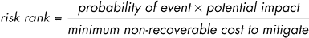

# 1

疯狂中的方法

我们似乎天生就倾向于以特定的方式思考风险：我们本能地关注那些不寻常或紧急的危险，而对那些发展较慢或以更熟悉的方式呈现的危害则关注较少。

举个例子，美国的公共话语——以及我们个人的焦虑——往往集中在恐怖主义威胁上。关于这一特定风险的数据相对模糊，但根据大多数估算，每年在美国发生的恐怖主义事件中，死亡人数通常不到 50 人。^(1) 相比之下，美国每年大约有 65,000 人死于非故意中毒，约 40,000 人死于摔倒，约 3,500 人死于溺水。^(2) 从这个角度看，梯子、游泳池和非处方止痛药比武装极端分子更为隐蔽的威胁，但我们很少考虑这些风险。

对极端的强调常被批评为一种有害的谬误；例如，在 2007 年为*Wired*杂志撰写的文章中，著名的安全与隐私评论员布鲁斯·施奈尔（Bruce Schneier）将人类糟糕的风险管理习惯归咎于我们原始本能——据说由一个名为杏仁体的小脑结构所控制——与理性思维之间存在的固有紧张关系。^(3) 但我对此并不信服。

更有目的性的解释是，梯子和游泳池等日常风险与我们相伴已久，并几乎肯定代表了安全、自由与效用之间长期达成的隐性权衡；反复探讨这个话题几乎没有什么实际意义。相比之下，我们仍然需要在面对不熟悉的威胁时立即且强烈地作出反应，因为有时采取冷静的反应代价太高。简单来说，帐篷里的熊需要我们采取行动，而不是等到下一次“帐篷里熊问题委员会”的会议上投票决定应对措施。从这个意义上讲，我怀疑我们对风险的思考方式，远非认知缺陷或进化死胡同，反而可能是一种被低估但极为理性的优化，它减轻了生存的认知负担——并让我们能够在复杂的社会中正常运作。

无论这种启发法在日常生活中的效用如何，它有一个不可否认的失败模式：当我们被要求分析非常遥远的威胁时，追求新奇的心态加上缺乏个人经验会促使我们关注那些更具戏剧性、充满动作的小说情节、我们观看的电影和玩的视频游戏。在应急准备的背景下，这可能会让我们过度关注一些不仅罕见，甚至可能根本不真实的情景。

因此，为了帮助制定一个连贯且具有成本效益的应急策略，本书的第一部分概述了一些分析工具，用于绘制未知领域——然后是强有力地优先考虑问题。

## 降低复杂度的方法

任何关于未来的好故事都必须通过一系列合理的因果事件与现在建立联系。关于巨额财富的白日梦必须从中彩票或做出其他偶然的投注开始；关于财务破产的噩梦必须从一场痛苦的离婚或商业纠纷开始。无论是什么情景，我们对了解原因的渴望如此强烈，以至于任何缺少这一要素的故事几乎无法引起共鸣。即使是在时间旅行的虚构作品中，如果正常的因果关系崩溃，作者也必须用一套新的规则来替代，以便我们能在其中跟随下去。

然而，对于故事讲述有效的东西，在全面评估风险时可能成为障碍。例如，失业或被债务缠身的方式有无数种；尝试列举所有可能的情况是一项艰巨且令人沮丧的任务。因此，我发现专注于结果，而不是事件的原因，更为有用。大多数情况下，如何陷入财务困境并不重要。可以肯定的是，这是一种相当常见的情况，而且你的基本需求几乎总是相同的：确保有饭吃，支付账单。

这种以结果为中心的方法不仅减少了思维上的混乱，还帮助制定了即使情景细节发生意外变化也能有效的解决方案。通过讨好一个让人难以忍受的老板来减轻裁员风险是一种狭隘且不确定的策略。相比之下，建立一个强健的备用基金可以缓解一系列困境——从失业、紧急牙科费用，到因自然灾害或厨房火灾而不得不在酒店住上几晚。

使用这种风险映射方法，主要任务是列出所有值得关注的结果，而不必过于担心它们如何发生。不幸的是，虽然一些可能性可能是显而易见的，但借用美国前国防部长唐纳德·拉姆斯费尔德的话来说，也有未知的未知——也就是说，那些对应急计划可能具有重大意义，但没有具体提示时不会立即浮现的情况。

构建一个强健的未知未知分类法，避免陷入冗长的假设情境中，最好的方法可能是批判性地审视你的日常生活，针对每个外部依赖进行压力测试，问自己：“如果我无法像平常一样完成这个任务，会发生什么？”再次强调，具体原因并不重要；例如，你可能因为停电、身份盗窃或银行 IT 问题而无法使用信用卡支付食物费用。不管原因如何，结果是一样的，解决方法很简单：随身携带几天的现金。

## 风险量化模型

所有可能的担忧结果列出一个清单，可能本身就会让人不堪重负，而试图预防所有困难的费用则没有实际的边界。为了让这些可怕的假设情境有个清晰的对比，帮助构建一个评估和优先排序风险的模型是很有帮助的。风险管理的最基本概念是同时考察事件的潜在影响和该结果发生的概率。按照这一标准，绊脚趾和僵尸爆发同样无趣。前者影响不大，后者几乎没有发生的几率。

由于你的资源有限，另一个值得思考的维度是减轻某个担忧的最小成本——无论是时间、精力还是金钱。举个例子：在美国，每年发生超过一百万起入室盗窃案件，平均损失相当可观——稍微超过$2,500。^(4) 对许多人来说，入室盗窃符合之前提到的两变量测试；它是一个合理的情境，且对个人生活有重大影响。然而，大多数入室盗窃发生在住户不在家时，因此唯一可靠的解决方案可能就是安装窗户防护栏、加固门以及报警系统。这一系列措施可能需要花费$10,000，并且可能还需要与当地的业主协会（HOA）发生冲突。鉴于如此高的减轻成本，也许放任这一风险不做处理是合理的。

请注意我对减轻成本的*最小*强调：记住那句老话——一分预防胜过一磅治疗。例如，车祸是一个重大风险，尤其是对于年轻男性来说。最直接的解决方案可能不是将一个昂贵的创伤包放在车后备箱里，而是支付一定费用参加防御性驾驶课程——并确保这堂课能记住。

在统计支出时，也需要区分可恢复的成本和不可恢复的成本。如果你突然需要现金来支付新屋顶或突如其来的牙科费用，那么花在窗户防护栏上的钱是无法收回的。相反，维护一个应急基金几乎没有任何惩罚，因为这笔钱几乎总能重新分配来解决其他问题。

简而言之：在优先处理哪些结果时，最好集中关注那些可能发生、潜在具有毁灭性，并且可以通过相对简单的方式预防或控制的情境，如下所示的风险排名伪公式：

当然，在实践中，这些变量并不总是能准确量化。自由时间、精神能量和现金的支出之间没有固定的转换率；某些预测的概率是无法知晓的，或者存在激烈争论；某些类型事件的最坏影响没有明确的上限。换句话说，这个风险排名公式不应被视为圣经——但它是一个很好的粗略优先排序起点，并帮助我们决定在哪些地方划定界限。

## 朋党信仰的挑战

每当尝试推理未来时，重要的是将我们自己的假设和信念进行验证。我喜欢的一个寓言完美地说明了盲目坚持我们信仰的陷阱。

它是这样讲的：想象一家想在一个由腐败市长管理的小镇上开设办事处的公司。市长向公司的高管们提出了一个简单的交易：雇用我的朋友，我就确保你们所有关于许可证、检查和其他行政障碍的问题消失。高管们迫切想进入这个市场，决定做出必要的决定。因此，他们尽管这位朋友完全没有资格和能力，还是雇佣了他。

但问题在于，其他那些没有参与这一勾结的员工和经理们认为，继续雇用这个朋党员工是公司人力资源流程不合格的证明。他们很快联合起来，制定了新的、更严格的招聘和绩效管理标准——然而不知为何，他们所有的努力只是让每个人的生活变得更糟，*除了*那位朋党员工。他们忽略了一个显而易见的事实：这位员工的存在是有理可循的——只是这个理由并不是他们所期望的。

在 2016 年的一篇文章中，作者凯文·辛勒用企业生活的隐喻引入了他所称的*朋党信仰*概念。^(5)他指出，就像我们故事中的那些误入歧途的直线经理一样，人们本能地通过一个单维的尺度来判断信仰，基本上将信仰分为对与错，并期望任何被证明为错误的信念立即消失在认知的烟雾中。然而在辛勒看来，并没有生物学上的必要要求我们只持有真实的观点；他认为，我们的信仰体系更加功利，其他维度使得信念是可取的（并且真诚的），即使它们不能通过科学审查。

当然，一些信念是出于简单的原因而被持有的：因为它们的预测能力帮助我们在日常生活中做出明智的决策。一个很好的例子是对重力的工作理解。它的全部目的就是预测物体掉落时会发生什么，因此我们乐于定期测试我们的假设，并在发现任何不对劲的地方时修正它们——例如，如果我们发现某些物品比我们预期的更容易损坏。归根结底，因为数据与理论之间的任何差异都会适得其反，我们觉得没有必要坚持己见。

但第二类信念——Simler 的亲信信念——也存在，并且服务于一个非常不同的目的：帮助人们在社区内茁壮成长。这些信念并不总是关于顺从。在某些环境中，一个人可能因为采取具有挑衅性和对立立场而获得奖励，从而建立独立思考者的声誉。但自我强化的群体思维无疑是一个常见主题。例如，人们可能会有强烈的社会动机，认为他们的雇主或政党比其他人的更有美德，并将自己群体中的任何道德失误解释为孤立的、诚实的错误，而不给对方同样的宽容。

将这些信念标记为*亲信*的目的是并不是为了断言其基本信念是错误的；而是说，它的主要功能并不是帮助我们应对即时的决策。实际上，亲信信念通常处理我们几乎无法控制的议题，如公司治理或国际政策。无论话题是什么，怀疑某个信念的明显特征是，个人层面上，怀疑它所带来的社会后果显得远比客观错误的后果要严重。

亲信信念使得当它们与我们对世界的看法一致时，很容易被即将到来的灾难性故事所吸引。一个有教育意义的故事是“人口炸弹”这一预言，它由斯坦福大学的生物学家保罗·厄尔里奇（Paul R. Ehrlich）在 1960 年代提出。这个预言有其坚实的科学基础；通过从当时的数据和动物模型中推断，厄尔里奇得出结论，世界人口将继续呈指数增长。然后，他查看了农业产能的最佳估计以及可耕地的统计数据。在结合这些数据后，他注意到我们注定会在几年内超过世界的粮食生产能力。他必须发出警告：如果不立即采取政府干预限制生育，我们物种的未来只会是饥荒、疾病和战争。

厄尔利希优雅且直觉的预测在科学家、政策制定者和当时的名人中获得了极大的支持。之所以如此，不仅仅因为它具备科学价值，还因为它提供了一些每个人都能认同的内容。许多政治家设想通过广泛扩展他们的权力来推动建设一个更好、更和谐的社会。科学家们为有机会被认真对待并获得一席之地而欢呼，梦想着由专家主导的精英主义社会。对于环保主义者而言，人口爆炸论中的反进步色彩恰好与他们的信仰相契合，并促进了他们的事业。简而言之，厄尔利希的理论很快就具备了裙带信仰的所有特征：这种预测的支持者比起验证、纠正或反驳任何论点，更加专注于维持这一观念，并推动相关的政策措施。

但在该运动的更激进观点真正付诸实践之前，一些奇怪的事情开始发生。世界大部分地区的生育率开始逐渐下降，似乎是对改善的生活条件、降低的婴儿死亡率以及避孕药的发明作出的反应。^(6) 同样令人困惑的是，农业生产的效率大幅提高，使得食品变得比以往任何时候都更便宜、更丰富——至少部分得益于收割机、大规模灌溉系统、现代杀虫剂和化肥，以及抗虫作物等技术的进步。

这些新数据对人口爆炸论的支持者并没有产生任何影响。预测是正确的；只是日期可能稍微有些偏差。末日被推迟到 1980 年代末，然后是 1990 年代，再到 2000 年代，这一预言至今依然有一个小规模但忠实的追随者，成为一种不死的存在，完全无法证伪，永远悬而未决。

与此同时，我们确实从一个拥抱厄尔利希行动号召的专制国家学到了一些东西：中国由此产生的人道主义灾难的规模和恐怖正慢慢浮出水面。在 2019 年由亚马逊影业制作的纪录片《*一胎化国家*》中，两个出生在中国的电影制作人深入探讨了 1979 年至 2015 年间中国共产党所推动的强制绝育、堕胎和大规模婴儿杀害现象。

人口爆炸论的故事在保罗·萨宾（Paul Sabin）所著的《*赌注*》一书中被详细叙述。萨宾是耶鲁大学的历史学家（耶鲁大学出版社，2013 年）。我提到这本书并不是为了以间接的方式否定当代的环保忧虑，而是为了提供一个重要的案例，说明我们多么容易将可能性误认作确定性，陷入一个运动中以至于失去评估新证据的能力，并对那些与自己政治观点不一致的解决方案视而不见。

我们的流行文化充斥着末日预言，这些预言从最坏的假设出发，给我们物种的适应与克服能力定下了非常悲观的基调。今天的主流预言涉及尖端的粒子物理学、连锁反应式的环境崩溃、类神的黑客、巨大的政府阴谋以及藏匿在流行歌曲中的秘密信息。我们不能完全排除这些可能性——但当有疑问时，最好还是简化思考。历史数据表明，担心从梯子上摔下来或被车撞的风险，比我们在电影中看到或在互联网上读到的那些令人着迷的情节更有现实意义。
