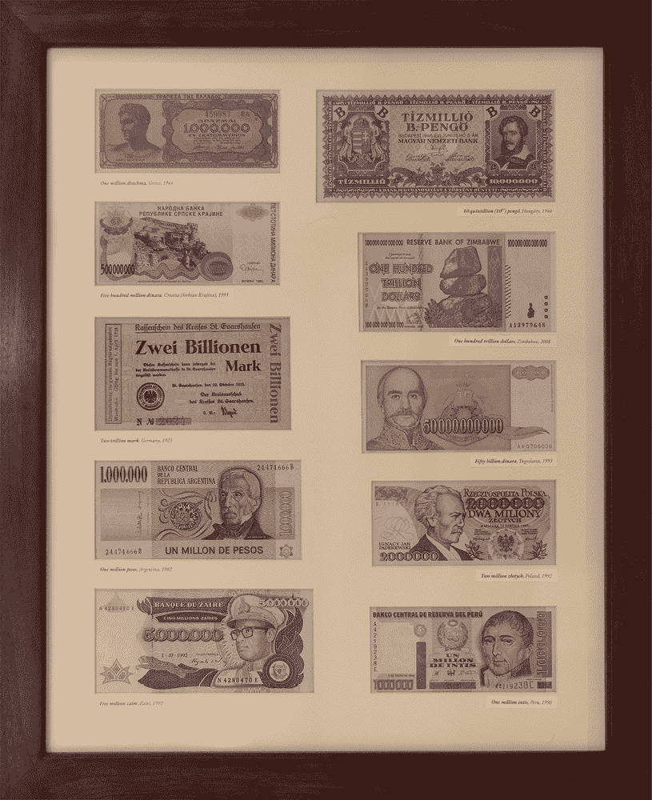

# 第三章：探索大规模风险

在前一章中，我们探讨了各种小规模事件，这些事件可能会扰乱一个家庭的生活，而不会影响到隔壁邻居。应对这些私人困境的方式是任何坚实准备计划的基础；但同时，也应考虑周期性、区域性的灾难，这些灾难足以让整个社区议论纷纷。

从经济衰退到地震，再到一生中仅遇一次的暴风雪或热浪，它们的共同特征是发生频率足够低，让一两代人能够在没有亲身经历过这些事件的情况下成长。与此同时，这些灾难并非遥不可及：以 20 到 100 年的周期发生，它们足够常见，值得在评估个人风险时引起关注。

表面上看，大规模灾难的后果与我们之前讨论的并没有太大不同：应对经济衰退的工具包类似于与复仇心强的老板发生争执后可能需要的应急措施。但大规模灾难的庞大规模足以让一些最简单的计划脱轨。例如，城市范围的停水无法通过去当地超市买一箱 12 瓶的 Aquafina 水来解决，因为成千上万的其他居民会抢先一步。大规模事件的恢复过程也可能会延长。在健康的经济环境中，找到一份新工作通常不需要超过三个月，但在经济衰退期间，求职过程可能会拖得更长。

## 自然灾害

无论是洪水、暴风雨、野火、地震、山泥倾泻、严冬，还是干旱，地球上的任何角落都无法避免偶尔被自然力量带来的史诗般灾难。世界的某些地区因特定的灾难而闻名：如果你在夏威夷，你需要留意火山爆发；如果你在加利福尼亚，地震的阴影应该让你夜不能寐。但往往是那些看似不太可能或被遗忘的事件最具冲击力。毕竟，没有人在想洛杉矶可能会下大雪，或者阿拉斯加可能会出现炙热的热浪，尽管这两者都有较为近期的先例。

作为一个许多科技人士都熟悉的现实例子，在地震频发的加利福尼亚，由于几十年来森林管理不善、城市蔓延以及多年干旱的共同作用，自 2015 年以来一系列前所未有且致命的大火爆发，摧毁了数万座房屋，迫使数十万人流离失所。特别臭名昭著的一场火灾发生在布特县，短短三周内就烧毁了 18,000 座建筑物。^(1) 而在欧洲，通常被认为气候温和且无聊的地区，2003 年的一次异常热浪导致超过 30,000 人死亡，^(2) 其中大部分发生在法国和西班牙等高度发达且富裕的国家。

当灾难发生时，政治家们不可避免地会将灾难的责任推卸，或利用这一事件推进与之间接相关的目标。现在，最常见的借口是气候变化——这是一个真实的现象，确实让一些地区越来越容易遭遇极端天气，但几乎总是被用来作为对当前新闻中任何恶劣天气事件的误导性解释。极端天气有许多先例。例如 1888 年的暴风雪曾在东北部堆积起 50 英尺的雪堆，^(3) 或者是 1930 年代大部分时间里横扫德克萨斯到内布拉斯加州的末日尘暴和热浪，^(4) 又或者是 20 世纪上半叶洛杉矶的降雪和阿拉斯加福特尤肯的百度热浪。下一次灾难发生时，我们会措手不及——但如果我们眼光短浅，不能将气候变化作为唯一的罪魁祸首。

考虑到这一点，即使你住在一个通常与地震或龙卷风无关的地方，绘制潜在自然灾害的地图并思考相关问题仍然是一个明智的计划。对于气候，你应该能够找到至少 100 年的气象记录，这使得查找该地区温度、风力和降水的极端值变得非常容易。大多数关于地方的维基百科文章中都会有简短的气候部分，当该部分存在时，它是一个可靠的起点。

其他自然灾害的记录可能更加零散。维基百科有时是一个很好的研究线索来源，但在本地报纸的数字化档案中进行关键词搜索往往能获得更深入的见解。在美国，访问你所在县的官方网站并查找区域风险评估也很有帮助；许多地方政府在 9/11 袭击后编写了此类文件。尽管这些工作在随后的几年里并没有转化为有意义的行动，但如果这些文件是公开的，它们可以为自然灾害和人为威胁提供很好的综合分析。

美国联邦政府也提供了有用的资源。例如，联邦应急管理局（FEMA）为大部分地区提供街道分辨率的洪水风险地图。你可以在[`msc.fema.gov/portal/home`](https://msc.fema.gov/portal/home)找到这些地图。同样，美国地质调查局（USGS）为一些大都市区提供了相当详细的地震断层、地震概率和土壤不稳定性风险地图。你可以在[`www.usgs.gov/natural-hazards/earthquake-hazards/seismic-hazard-maps-and-site-specific-data/`](https://www.usgs.gov/natural-hazards/earthquake-hazards/seismic-hazard-maps-and-site-specific-data/)上查看这些资源。

研究可能需要耗费大量心力，一些网站尝试将这些信息压缩成整齐的、用颜色编码的州级“风险等级”，并将其叠加在地图上。然而，尽管它们在美学上很有吸引力，我还是要警告不要过于依赖这些信息。映射的数据集是零散的，地图上不同色阶之间的阈值可能会夸大结果。比如，年风险为 9%与 10%的重大地震几乎没有实质性的区别，但在颜色编码的地图上，这可能是绿色和红色之间的差异。

最后，由于涉及的力量巨大，试图理解自然灾害可能会让人觉得是一个不切实际的追求。但并非如此！如果一个大裂缝突然出现在你脚下，你确实无能为力，但自然灾害的破坏性影响远远超出它的震中——而在这个“混乱区”，范围可能达到几十或几百英里，生存依然是一个可行的任务。简单的措施——比如随时备有额外的食物和水、准备一把链锯清理倒下的树枝，或者储备一块防水布保护受损的屋顶——都能大有帮助。

## 工业事故

无论是在乡村还是城市地区，重工业总是离得不远。无论是化工厂的火灾，还是上游矿山尾矿坝的坍塌，许多相当常见的工业事故类型可能迫使整个城镇停用自来水或躲进室内避难——有时可能需要几天时间。

偶尔，这些事故的破坏潜力可能与自然力量相抗衡。切尔诺贝利和福岛的核泄漏事件常被认为是最严重的灾难，但与传统工业的灾难记录相比，它们实际上显得微不足道。1984 年印度博帕尔的灾难，涉及一化肥制造厂释放了易挥发的异氰酸盐，造成超过 50 万人受重伤，死亡人数达到 2 万左右。^(5) 1975 年中国的板桥大坝溃坝事件可能导致超过 20 万人死亡——一些人死于洪水，更多的人死于随之而来的饥荒和瘟疫，当数百万房屋被冲毁时。^(6) 涉及硝酸盐储存的事故也臭名昭著。1947 年，德克萨斯州城市港口发生的船只爆炸摧毁了几英里的建筑，并造成了数千人受伤，^(7) 而 2020 年贝鲁特发生的类似爆炸则导致约 30 万人流离失所，5000 人受伤，且超过 200 人死亡。^(8)

当然，像自然灾害一样，准备计划的目的并不是设计一种不太可能的策略来躲避附近爆炸的火球。它的目的是为我们提供工具，在事件的震中周围那个更大范围的干扰区域内安全避难，或者在必要时迅速从该区域撤离。然而，可能让人头疼的是弄清楚震中可能在哪儿。

政府认为许多重工业是恐怖分子的理想软目标，因此官员们对在地图上标出这些地点心存犹豫。这些设施的标识往往很少；尽管如此，通过谷歌地图进行长时间的放大和扫描，通常可以找到一些显眼的建筑物，比如大到可以容纳整栋楼的储罐、高耸的烟囱或矩形的废水池。一旦发现潜在位置，稍作进一步的在线调查——或者轻松合法地开车经过——通常可以解答所有疑虑。

## 社会动荡与战争

社会动荡是“预备者”文化中最模糊的一部分。许多生存主义者对即将出现在他们家门口的掠夺者感到惶恐不安，尤其是在超市货架空空如也的时候。有一句话通常归因于美国记者阿尔弗雷德·亨利·刘易斯，他生活在世纪之交：“人类和无政府状态之间只有九顿饭的距离。”另一个常被生存主义作者引用的名言，取自荷兰灵长类动物学家弗朗斯·德·瓦尔的作品，虽被断章取义，却提出：“我们所拥有的只是一个薄薄的外壳，掩盖了我们自私且野蛮的天性”——而这个外壳可以轻易剥落。

我相信这些格言对我们物种描绘了一个独特的悲观视角，更多根植于个人的焦虑，而非坚实的历史先例。从爱尔兰马铃薯饥荒到战火纷飞的欧洲生还故事，我们有充足的证据表明，即使在最黑暗的时刻，大多数人宁愿忍受痛苦和默默饥饿，也不愿伤害一个没有对自己造成任何伤害的陌生人。

如果*真*有值得恐惧的理由，那也不是世界容易陷入像《人类清除计划》和《疯狂麦克斯》那样的可怕境地，在那里，邻居互相追捕取乐。真正的原因是，当人们愤怒和绝望时，他们需要找一个替罪羊并发泄怒火。从历史上看，这个目标可能是邻国、某个种族或宗教少数群体、神职人员或富人。不管是什么标准，这一群体立即被剥夺了他们的无辜，将邻居变成了加害者，变成了亚人——变成了敌人。这个场景在历史上反复上演：1790 年代的法国，布尔什维克革命期间及其后的俄罗斯，希特勒的德国，毛泽东的中国，珍珠港事件后的美国。每一次，最终都会导致外群体成员遭受无差别的谋杀、监禁或征用。

或许所有这些残酷已经成为过去。今天的世界在很多方面更为繁荣和平。可是，我依然记得 1990 年代初期，苏联解体后，著名政治学家弗朗西斯·福山曾宣称“历史的终结”。他解释道，我们已达到“人类意识形态演变的终点，西方自由民主成为人类政府的最终形式。”福山的预测在当时是一个时髦的思想；而在 20 多年后的今天，几乎没有人还认同他的观点。

如果不是迫害，那么骚乱仍然是世界许多城市和郊区一个明显且真实的风险。当愤怒的暴民走上街头时，他们很少会针对住宅区，但大规模纵火和暴力犯罪并非罕见，有时会持续数天或数周。

1992 年的洛杉矶骚乱当然值得一提。这场由洛杉矶警察局的警员暴力殴打罗德尼·金事件引发的震惊暴乱，导致约 2,000 人受伤，约 4,500 座建筑被洗劫，约 1,000 座建筑被纵火；^(9)骚乱的创伤在接下来的多年里深深烙印在这座城市上。欧洲也并不陌生于骚乱。法国的十年社会动荡，大约始于 2005 年，并逐渐演变成一种类似年度传统的现象，涉及一系列规模较小但持续时间较长的城市冲突，其中超过 13,000 辆汽车被纵火，数百座建筑遭到损坏或摧毁。^(10)

就像工业和自然灾害一样，准备应对动荡最好不是专注于与暴徒对抗。从自保的角度来看，最好的策略就是保持原地不动。因此，在一个因骚乱而动荡不安，或处于宵禁或戒严状态的城市里，拥有足够的物资以避免频繁购物总是有帮助的。拥有一个计划，能在局势改善之前撤离到安全的地方，也是一种不错的备用方案。

## 经济危机

经济状况对我们生活的许多方面产生深远影响，超越了纯粹的金融层面——从我们的健康，到关系质量，再到追求梦想的能力。因此，令人惊讶的是，我们通常满足于对许多经济运作的基本概念给出幼稚园水平的解释——比如货币的性质和政府用来控制货币供应的机制（我们将在第七章稍微讨论这些话题）。事实上，我们甚至很少考虑更简单的任务，即研究过去的经济模式，以理解未来可能发生的情况。

举个例子，我们都知道 1930 年代的大萧条，但我们讲述的故事是政治性的，而非货币政策。对进步主义者来说，这是市场失败和在新政计划指导下集体行动力量的故事。而对保守主义者来说，则是一个由官僚策划的崩溃故事，最终以*Wickard v. Filburn*一案告终，这是一宗具有里程碑意义的最高法院案件，极大地扩大了联邦政府的权力范围。但两方都很少讨论当时货币供应的动态，或者多家大型银行在崩溃前夕破产时的资产负债表内容。

2007-2009 年的住房危机是另一个广为人知的例子，欧洲的同类危机也同样记忆犹新——这场主权债务危机伴随着银行倒闭和欧元区内小规模的存款没收（委婉地称为*bail-ins*）。^(11)但对其成因的分析同样完全服从于政治叙事。它常被作为对放松管制的警示，或者是对政府资助住房贷款所带来意外后果的警告。相反，关于错误估算抵押贷款支持证券风险的模型的起源和持续应用，只给出了模糊的解释。这个故事对于北美的抵押贷款情况如何导致在希腊和冰岛这些地方发生严重的银行危机同样没有清晰的解释。

同样不为人知的是，在这两次大衰退之间，美国发生了许多其他经济危机，通常相隔不超过 10 年。例如，1980 年代的储蓄与贷款危机——一次深刻的恐慌，最终导致超过 1000 家金融机构倒闭，并伴随着政府强制实施的“银行假日”，这是一个透明的骗局，旨在防止人们提取存款。^(12) 又比如 1979 年，当时糟糕的国内政策，再加上伊朗的伊斯兰革命，使美国陷入了另一种灾难，导致全国范围内的燃料短缺，数百万汽车被困在路上，经济也因此停滞了好几个月。^(13) 历史教给我们，这些起伏是相当规律的。毫无准备地进入下一个十年，而不考虑未来可能会遇到麻烦，是非常不明智的。

我们的货币系统也是相当不稳定的，即使我们使用的语言往往暗示着相反（总是房价或汽油价格在波动，而不是我们手中的现金购买力）。我在一个经历过极度通货膨胀时期的国家度过了我的童年，因此我一直在问自己，这种经历有多独特——当我决定进行研究时，我震惊于关于这种基本且不稳定事件的普遍性的信息竟然如此匮乏。

许多在历史课上有所了解的人都知道魏玛共和国在二战前的超高通货膨胀现象。也有些人记得 2000 年代津巴布韦的万亿纸币，有时作为恶搞礼物送人。但即使是一篇关于这个话题的学术文章，也很难超越这些例子——可能会提到战后匈牙利或现代委内瑞拉等。

我花了不少时间追踪到一篇由自由主义卡托研究所的研究人员撰写并于 2012 年发布的晦涩草稿论文。^(14) 论文的大部分内容，作者们都哀叹收集完成研究所需数据的困难，即便这些数据与发达国家最近发生的事件有关；例如，在某一段落中，他们写道：

> 我们几个月来查阅了国际货币基金组织（IMF）、世界银行、美国政府、波斯尼亚和黑塞哥维那中央银行以及波黑联邦统计局（FZS）的报告，但仍然无法找到每月的数据。我们还咨询了来自地方和国际机构的众多官员，但根据所有人的说法，这些信息已经在战争中消失了。

最终，论文揭示了不下 56 个记录在案的恶性通货膨胀事件，其中几乎所有都发生在过去 100 年内。受到他们研究的启发，我制作了一份展示一些与他们工作中提到的国家相关的货币文物的视觉导览——并且还展示了几个其他例子（见图 3-1；更多示例请访问[`lcamtuf.coredump.cx/hyper/`](https://lcamtuf.coredump.cx/hyper/)）。

我不认为美国发生恶性通货膨胀的可能性特别大。我们的经济有很多方面使得这种情况成为一个相对遥远的忧虑，其中包括我们的外债是以本国货币计价的这一事实。但更广泛的观点是，经济危机——包括货币崩溃——发生的频率远远超过我们想象的。理解这一现实比试图预测下一次崩盘更为重要。许多互联网侦探坚信危机即将来临，花费大量时间搜集各种被挑选出来的模糊“警告信号”。然而，他们预测的过去两次衰退的二十个信号，其中大部分并没有发生；效仿他们的做法是一种愚蠢的行为。确定性并不是一个有用的目标，足够做的是对我们的赌注进行对冲。

图 3-1：作者的部分恶性通货膨胀纸币收藏。从左到右、从上到下依次为：100 万德拉克马纸币（希腊，1944）；10 万亿彭戈（匈牙利，1946）；5 亿克拉伊纳第纳尔（克罗地亚，1993）；100 万亿津巴布韦元（津巴布韦，2008）；2 万亿马克（德国，1923）；500 亿南斯拉夫第纳尔（南斯拉夫，1993）；100 万阿根廷比索（阿根廷，1982）；200 万兹罗提（后苏联波兰，1992）；500 万扎伊尔（扎伊尔，1992）；100 万因蒂（秘鲁，1990）。

# 大流行

本书的远古祖先是一篇我在 2015 年发布的在线指南。当时，我提到，尽管高度发达的世界已经很久没有经历过一次致命的传染性呼吸道疾病爆发，但轻视这种风险为时过早。1918 年，一种不寻常的流感病毒导致全球 50 到 7500 万人死亡。^(15) 数年后，一种神秘的嗜睡病被称为*麻痹性脑炎*——可能也是由病毒引起——使超过一百万人陷入病痛，之后却神秘消失了。^(16) 我认为，尽管卫生、环境和医学科学有所进步，我们仍生活在一个高人口密度和航空旅行的时代，而且我们对病毒感染的治疗能力依然处于起步阶段；因此，我认为，如果再次发生类似疫情，我们并不一定做好了充分的准备。

从这个角度来看，我认为 2020 年席卷全球的 COVID-19 大流行是一种可怕的祝福。尽管它造成了无法计数的痛苦和痛苦，但它也提醒我们对传染病的脆弱性，而且远没有过去的瘟疫那么致命。当我们在几个月内开发出新型疫苗的能力被证明是错误时，我也感到高兴。在某种意义上，这可能是一种相对温和的警钟，使我们免受更糟糕的命运。

但从 COVID-19 中还有一个教训：没有什么是非黑即白的，在事后才能明显看出正确的行动路线。在大流行的早期，有关中国一种致命疾病的夸大传言在互联网上四处流传，卫生当局像往常一样不屑一顾，并急于驳斥这些荒谬的说法。二月份，现任纽约市卫生专员奥克西里斯·巴尔博特（Oxiris Barbot）在其官方账号上发推文：

> 今天，我们的城市正在庆祝位于唐人街的 #LunarNewYear 游行，这是我们城市具有丰富历史的美丽文化传统。我想提醒大家享受游行，不要因为关于 #coronavirus 的误传而改变任何计划。^(17)

许多知名评论员听取了专家意见并参与了争论。在一条现已删除的推文中，《Vox 杂志》为其读者提供了一个简短的解释：“这会是一场致命的大流行吗？”—然后自信地回答“不会”。^(18) 还有几位评论家认为关于冠状病毒的传言可能根源于排外主义或其他群体的恶习。

一个月内，情况完全 180 度逆转，许多进步政客开始承认这种新疾病的现实性—而他们的政治对手，也许是为了反对笨拙的卫生法令，也许只是简单地出于反对意见的义务，开始暗示也许不仅仅是政策错误，而是这种疾病本身可能是某种骗局。

抛开政治列车失事不谈，截至本文写作时，我们对应对这一新威胁的最佳方式仍不完全清楚，这已超过美国境内首例确诊病例一年以上。德克萨斯州和加利福尼亚州，美国两个人口最多的州，采取了截然不同的封锁措施，但在 2020 年和 2021 年首个几个月的人均病例数上几乎持平。但是，不要让反封锁活动人士高兴，这两个州的经济损失似乎也几乎相同。^(19)

这并不是为了偏袒任何一方，或者在政治光谱上制造某种等同感。它是为了说明，在战争迷雾中做出明智决策的巨大困难。在传染病方面，情况也并没有帮助，疫情恐慌很常见，而最坏的预测通常并不会成为现实。在 COVID-19 之前，我们曾担心过埃博拉、寨卡、北方河流病毒、猪流感、禽流感、SARS、MERS 等疾病。应对这种危险疾病的计划可能依赖于尽早采取果断行动，但也必须考虑到，90%的早期警告可能只是虚惊一场。

## 恐怖主义

几乎可以说，恐怖袭击的执行者通常是缺乏直接实现目标手段的个人或小团体——例如，缺乏足够的人员发动政变。因此，他们选择了替代性的袭击：一种破坏性行为，本身并不能取得太多成效，但却能动摇现状。

常有人说恐怖主义的目标是制造恐惧，但我认为动机有所不同：是把一些选项排除在外。当人们觉得自己无法照常生活时，他们就被迫选择立场——并可能会拿起武器。恐怖分子的梦想是，在这个新兴的两极化社会中，足够多的人会支持他们的事业。

许多评论员将恐怖主义的恐惧视为不理性，从某种短视的角度看，他们可能是对的。尽管在某些地区这一计算并不成立，但在美国或欧洲，死于恐怖分子的可能性与被闪电击中的几率差不多。同样，我觉得专家们的看法没有抓住关键。在我提出的两步计划中，第一个目标是社会经济破坏——在这方面，恐怖分子通常是成功的。只有第二个目标通常会失败：激进化足够多的人加入他们的斗争。

在美国，9 月 11 日的事件——地球历史上最致命的恐怖袭击——是我这一代人记忆中的一道深刻创伤。但与欧洲类似，美国也承受着其他令人心碎的恐怖行动带来的许多创伤。1963 年约翰·F·肯尼迪的遇刺事件和 1981 年罗纳德·里根的枪击案重塑了总统职位的本质——并可能巩固了对该国枪支法律大规模扩展的支持，这些扩展分别于 1968 年、1986 年和 1991 年实施。1995 年毁灭性的俄克拉荷马城爆炸案，本身据称是对韦科和鲁比山惨烈对峙事件处理不当的报复，催生了极端民兵运动，并加剧了许多执法机构的长期围城心态。由天才波兰裔美国数学家泰德·卡钦斯基执行的长达数十年的炸弹袭击行动，凭借其末日主义与环保信念的混合，在 1990 年代深刻地恐吓了全国的各大机构——最终，这也挽救了饱受丑闻困扰的联邦调查局的声誉。

还有许多其他事件——2000 年代的炭疽信、1996 年肆无忌惮的奥林匹克公园爆炸案、堕胎诊所医生被杀害以及极端动物保护活动家的行为、气象员、2013 年加州电力站的神秘袭击（^(20)）等等——这些几乎被历史遗忘，但应作为提醒，恐怖主义始终是一个迫在眉睫且深刻的威胁。我们不必屈服于焦虑，但应记住，作恶者总会找到挑起纷争的方式。
