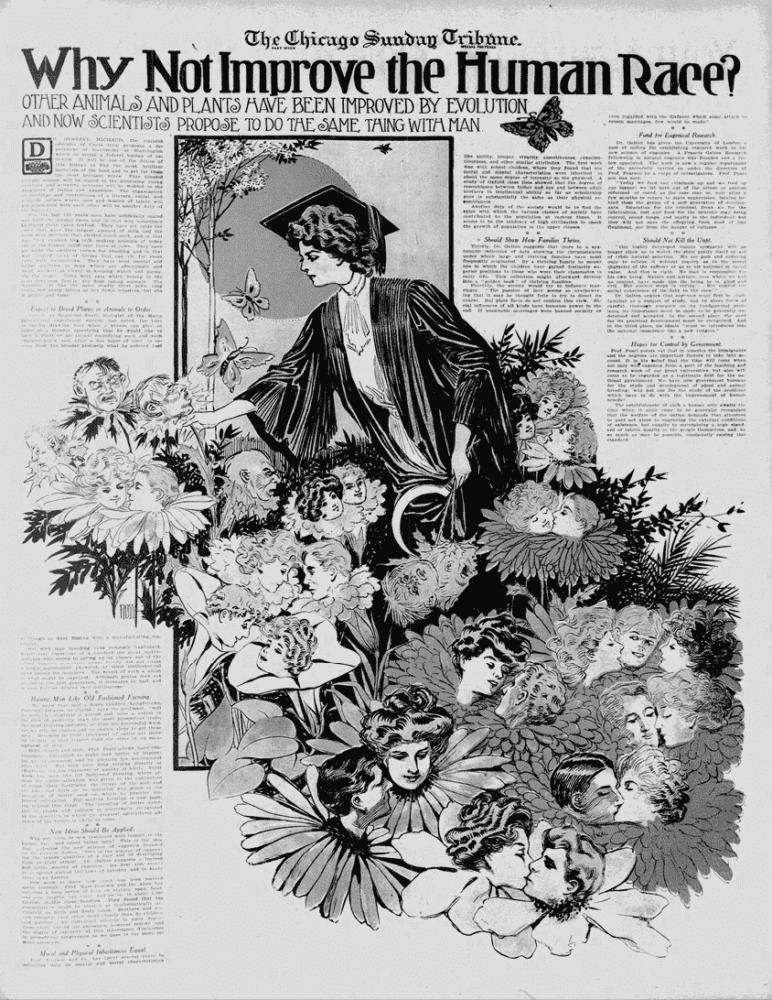

# 4

哎呀，僵尸！

许多我们珍视的科幻作品预设某一天——或许很快——一场突如其来的全球性灾难将打乱文明世界的工业支柱，撕裂社会结构，留下零星的幸存者，他们不得不在我们城市和乡镇的余烬中自生自灭。

这种文学主题比人们想象的要古老得多；当然，末日预言在许多古代宗教文本中占据中心地位，但它们在明显非形而上学的背景中也有着出人意料的丰富历史。公元二世纪左右，卢修斯·萨摩萨塔的讽刺性希腊小说*《真实故事》*描写了好战的外星人，他们致力于进行星际征服（他们渴望征服金星，实在是匪夷所思）。在一个类似的时代错位中，E·M·福斯特于 1909 年发表的故事《机器停止》则严厉警告人工智能和先进技术的危险——在那里，温顺的人类在他们被破坏的星球表面下的隧道中徘徊，主要通过视频聊天与彼此互动。

自然，末日题材更多的是跟随潮流，而非引领潮流，它不断重塑自己，以便迎合当代的恐惧和文化趋势。核战争的后果直到 1945 年后才成为末日后小说的核心主题，而关于环境崩溃的永恒主题，也在保罗·R·厄尔里奇的《人口炸弹》一书发布时，迅速从自然危机转向人为灾难。模仿也是常见的：乔治·A·罗梅罗的食人僵尸——最初是超自然起源，后来被重新想象为一种类似狂犬病的疾病的产物——在 21 世纪初席卷了文学界，从低俗喜剧到马克斯·布鲁克斯的宏大小说*《世界大战 Z》*（不要与同名的松散改编电影混淆）中的精彩社会评论应有尽有。

每当科学、宗教和政治与我们内心的焦虑交织时，末日先知便从原始的“混沌汤”中浮现：这些富有魅力的领袖不仅相信不幸会降临人类，而且确信末日即将来临。从古代宗教文献到现代 TED 演讲，他们的预言形式不断变化，但事实却始终如一：历代以来，成千上万的末日预言都未曾成真。或许，随着时间推移，其中某些预言会应验；但直到那时，信奉这些预言只会带来无尽的痛苦。

诚然，一些末日预言家利用耀眼且令人信服的科学——但就像宗教一样，科学也不能免于被扭曲为服务于明显非科学的原因和信仰。想想冷战高峰时期对原子弹的看法：一种预言，称持久的核冬天会摧毁地球上大多数生命，留下一个贫瘠的辐射荒原，这片荒原将在人类的千年间依然无法居住。这个末日景象之所以被广泛接受，并非因为它科学可靠，而是因为它服务于重要的利益。对于军事高层来说，它增强了核威慑战略，激起了流氓国家的恐惧；而对于西方的反战和亲苏联活动人士来说，它帮助动员了大众反对政府中的反共强硬派，将他们描绘成那些如果能阻止苏联进入古巴或阿富汗，毫不犹豫就炸毁地球的疯子。

只是，预测几乎肯定是不真实的：一次完全的热核战争将是一场不可言喻的悲剧，会造成数千万人的死亡，但大部分人口将会幸存下来，幸存者可能会面临一个相对宜居的世界。核冬天假说——由随之而来的火灾风暴产生的烟雾引发的全球气候变冷事件——是预测中最具稳健性的部分，但其规模和影响仍然不清晰。^(1) 另一方面，关于辐射的恐惧似乎被过度夸大了。世界上约有 4,000 枚部署的核弹头，这为大规模交换的范围设定了一个直接的上限；^(2) 这个数字惊人，但也不远于美国、俄罗斯和世界其他国家之前进行的约 500 次大气核试验和 1,500 次地下核试验。^(3) 这些试验对当地人口造成了一些不利影响，但对生态系统的影响却少得可怜。在内华达州，你可以参加公开的 1,280 英尺深的赛丹陨石坑参观，这是由一次核试验留下的痕迹。孕妇被劝阻预订此行，但仅仅是因为高温和漫长的巴士车程。

从长崎和广岛的观察结果表明，原子弹的持续影响远不如核灾难的后果明显。尽管最初的死亡人数和中期白血病死亡率的激增，但两座日本城市的生活依然继续，幸存者无需重新安置，而且对于袭击后怀孕的孩子们，没有明显的健康后果。^(4) 与此同时，位于乌克兰的切尔诺贝利核电站周围的区域仍然对人类封锁，且存在相当高的辐射热区。

结果的差异容易解释。一颗原子弹使用相对较少的裂变材料——几十到几百磅——其目标很简单：尽可能快速且完全地燃烧这些燃料，释放出大量的热能。相比之下，切尔诺贝利的灾难涉及几乎 200 吨与石墨、混凝土和其他废料混合的铀的不受控火灾，几周内将未燃烧的燃料和裂变产物的浓厚云团喷射到空中。

然而，10,000 年后的核战争废墟这一俗套却自成一派，持续出现在书籍、电影和视频游戏中。它最终也产生了实际影响。好的一面是，它可能在一定程度上遏制了核扩散，但坏的一面是，它使得政府和个人不愿采取合理的策略，如果最坏的情况发生，这些策略本可以保护我们免受伤害，因为最坏的情况被认为是无法挽回的灾难。在这些牺牲品中：曾经教给学童的经常遭到嘲笑的“趴下并遮掩”建议^(5)，全国范围内库存充足的民防避难所系统，以及政府推动并支持的家庭级应急准备文化。

就像核战争的描绘一样，许多流行的末日预言都是基于荒谬或夸大的科学，经常被用来推动某个预设的目标。这个领域的其他主张则集中在一些在宇宙时间尺度上相当可能发生的事件上，但在我们一生的时间跨度内极为不可能；在这一类别中，陨石和超级火山尤为突出。还有一些预言——比如对恶意人工智能的恐惧——则是完全不可知的，缺乏任何可量化的风险或历史先例。

话虽如此，每一次夸张背后都包含着一粒可能提醒我们考虑不那么极端但更可能发生的结果的真理，这些结果值得在冷静的应急响应计划中加以考虑。考虑到这一点，让我们试着解开一些最流行的情景，这些情景常常让末日论者夜不能寐。

## 独特的致命疾病

致命的微生物是现代末日小说的主打。从斯蒂芬·金的经典小说《末日逼近》到广受好评的英国僵尸片《28 天毁灭倒计时》，这一类型的作品以将对疾病的理性恐惧推向逻辑极限为荣：一种不仅仅杀死大量人类，而且实际上终结世界的瘟疫。

由新病原体引发的末日灾难的风险在合理范围内，但根据实证数据，我们知道这种可能性并不高。记录中最严重的大流行——黑死病，甚至都没有接近这一点。它在 14 世纪席卷全球，杀死了欧洲人口的 30%到 60%，^(6)但它并没有严重威胁到人类的统治。事实上，它对当时的社会秩序几乎没有影响。从短期来看，它给受影响的家庭带来了巨大的困苦，但从长期来看，一些学者认为幸存者在多个方面受益。例如，资源的丰盈和劳动力的短缺提升了农民阶级的地位，导致工资上升、与封建领主的谈判地位更强，且（尽管微薄）民事自由得到了扩展。^(7)

作为一个更为漫长的流行病案例，不妨看看天花，这种疾病从古代到 20 世纪一直困扰人类。它经历了无数次的波动，每次爆发时，约 30%的感染者会死于此病；在被根除前的最后一个世纪，天花病毒的死亡人数估计达到 5 亿人。^(8)然而，人类社会再次证明了它能够在面对这种可怕且不懈的逆境时继续运作，甚至在壮丽的方式上取得进展。

黑死病和天花并不能确定大流行最严重的上限，但它们代表了跨越 2000 年的观察数据集中的极端情况。另一个反对世界末日瘟疫预言的实证论点来自对当代高致命性疾病如埃博拉的分析：本质上，如果病原体在短时间内杀死太多宿主，它就无法传播得很远。推测这是因为有效的传播依赖于无症状或仅有轻微症状的携带者，他们不会尝试自我隔离。像朊病毒病或艾滋病这类有长时间潜伏期的疾病，虽然带来独特的关注，但也为我们提供了充足的反应时间。^(*)

最终，虽然第三章讨论了一个高度致病且致命的疾病可能再次席卷全球，但以文明终结的超级病菌的概念似乎并不根植于我们目前所知的事实中。我们也没有明确的证据表明任何现已灭绝的哺乳动物曾被古代病原体消灭，除了圣诞岛上一群被怀疑的孤立老鼠种群^(9)——但可以肯定地说，岛上老鼠对卫生、清洁和传染病的理解远落后于我们。

## 气候变化失控

气候变化是一个极为复杂的话题。毫无疑问，这一现象是真实存在的，但关于它最终的影响和规模存在深刻的不确定性。考虑到这种模糊性，各国采取多管齐下的策略似乎是明智的，无论发生什么情况都能带来回报：投资于丰富的清洁能源，研究温室气体封存技术，并尽量减少世界最脆弱地区发生人道主义危机的可能性和严重性。可惜的是，这场辩论被一系列反生产力的反进步情绪、荒谬的阴谋论以及关于人类整体——或某些特定国家——应为此事负责的程度的无谓争论所拖延。

鉴于未来充满不确定性，一些活动人士通过做出最极端的预测来加强他们的论点：一种灾难性的正反馈循环，在人类活动初步推动下失控，直到地球字面意义上被烧毁。一个提议的末日机制涉及释放目前储存在冰中的大量甲烷（*水合物炮假说*）。另一个流行的理论涉及大气湿度的急剧增加，导致热量被困住，更多的水蒸发，并最终创造出类似桑拿的环境（*湿温室效应*）。尽管如此，尽管经过数十年的严肃研究，但没有任何可信的模型能够证实这些预测——至少在任何与个人应急准备相关的时间尺度上是如此。^(10)

我们知道的是，地球的气候可以发生深刻的变化，尽管这些变化不一定那么可怕，而且它们可能发生在大多数人预期的时间尺度内。一个相对较新且有充分文献记载的例子是“小冰期”，这段时期在 16 世纪带来了严寒的冬天和欧洲许多地方的广泛歉收。^(11)完全有可能是人类活动或自然原因——比如火山活动突然增加，减少了到达地面的阳光——在未来几十年内也可能引发类似或更严重的天气现象。

如果是这样，随之而来的天气模式逐渐变化可能不会摧毁高度发达的世界。特别是，欧洲和北美拥有广泛的技术和金融资源，以及跨越多种气候带的广阔肥沃土地。在这种情况下，一些地方性的人口可能会遭遇困难，经济影响可能波及更多的数百万人——但归根结底，富裕国家拥有应对这一切的所有手段。

气候变化的真正危险在别处：数十亿人生活在世界上一些最贫困的国家，通常处于干旱或半干旱的气候中，这些地区不太可能从目前观察到的天气趋势中受益。这些人群可能没有其他地方可以种植作物，无法从邻近州购买粮食，也没有基础设施将物资运送给需要的家庭；如果这些地区的自给农业遭遇重大打击，可能会迅速引发前所未有的人道主义危机。由此产生的饥荒、武装冲突和大规模迁徙可能会对全球产生溢出效应，使整个星球变得更加动荡且不那么自由。

对这一结果的恐惧或许是支持富国向发展中国家提供外援的最强烈自私论点；它也是反对气候政策、遏制发展中国家工业进步和经济增长的有力论据。就个人计划而言，我认为灵活性是关键。预测三十年后可能发生的代理战争是困难的，很难判断怀俄明州哪个地方将经历更加温和的冬季和更多的降雨，但建立一个财务安全网和强大的社会网络是保持适应能力的最可靠方式之一。

## 其他行星规模的自然灾难

自然灾难的故事与口头传统本身一样古老；我们许多最古老的神话讲述了洪水、干旱、地震和蝗虫，这些灾难曾困扰早期人类，摧毁村庄，或使整个帝国跪倒。到了 1960 年代，这一古老的类型扩展到包括此前无法想象的、由人类引发的环境危机预言——无论是人口过剩、污染，还是资源枯竭。直到今天，无论是在《世界末日》（*Armageddon*）中的小行星、《人类之子》（*Children of Men*）中的不孕症、《瓦力》（*WALL-E*）中的卡通式消费主义，还是《星际穿越》（*Interstellar*）中的作物枯萎，全球灾难的概念一直是我们物种最持久的焦虑之一。

与本章讨论的其他一些话题相比，关于生态系统崩溃的许多担忧根植于合理的科学和扎实的历史前例。例如，大规模的火山活动被认为与二叠纪灭绝事件有关，这次事件约 2.5 亿年前消灭了 70%的脊椎动物生命^12，而一个仍在活跃的超级火山——黄石大火山——被认为有能力将美国大部分地区覆盖上 10 英尺的火山灰^13。同样，许多人普遍认为，一颗大型小行星或彗星的撞击是导致白垩纪-古近纪灭绝事件的罪魁祸首，这次事件导致恐龙灭绝^14，而我们月球那布满坑洞的面庞提醒我们，这种宇宙事件在我们身边有时会以某种规律发生。

也就是说，尽管行星灾难的可能性不能被排除，但所有可用证据表明，灭绝类型事件的发生频率极低：如果某个灾难在未来百万年内有 50%的发生概率，那么它发生在今天出生的任何人一生中的几率不到 0.01%。从这个角度看，尽管超级火山或宇宙碰撞可能是最深刻的生存威胁，但它们也是相对遥远的担忧——并且它们逃避了大多数有意义的建模或减缓其可能造成的影响的尝试。

更为常见的是相同事件的小规模、区域性变化。1985 年，哥伦比亚阿尔梅罗附近发生火山爆发，导致超过 2 万人丧生。^(15) 几年前，圣海伦斯山爆发，将几州覆盖在火山灰中，并在东华盛顿的居民区内展开了大规模的清理工作。1908 年，一次被称为通古斯事件的大规模爆炸——普遍认为是由一颗大流星在大气中爆炸引起——摧毁了西伯利亚泰加的一个偏远区域，范围约 20 英里。然而，尽管这些事件令人恐惧，它们并不意味着末日的来临。在它们的影响和可能的应对措施方面，它们与地震、飓风以及第三章中讨论的其他常见自然灾害完全契合。

除了本节前面提到的自然灾害经典范畴外，科学界的声音还警告我们面临一系列更新颖的行星风险。第一波此类预测集中在厄尔里奇的**人口增长**担忧（见第一章），以及 1956 年 M·金·哈伯特提出的“石油峰值”假说——这一假说错误地预测了全球石油生产能力将在 1970 年代某个时刻开始不可逆地下降，并被解读为预示着一个黑暗且能源匮乏的世界。^(16) 今天，也许最时髦的崩溃理论关注的是传粉昆虫种群的下降现象，这可能对农业作物造成严重后果。这些担忧不容忽视，但需要一种特殊的悲观主义才能认为我们无法应对这种风险。

## 异常物理学与其他空间现象

迄今为止，我们对世界末日预测的回顾围绕着一系列熟悉且直观的话题：恶劣天气、火山、疾病。但平行宇宙中的科幻情节和准科学预测提出了更多不寻常的概念——磁极逆转、太阳耀斑、伽马射线暴、微型黑洞和真空亚稳态事件。

好消息是，几乎所有这样的情景都位于一个从极不可能到明显荒谬的光谱之间。例如，尽管地球的地磁极确实似乎每五十万年左右就会反转一次，但这是一个非常缓慢的过程——而且尽管最初有一些怀疑，但似乎并没有与灭绝或对地球生命的其他显著后果相关联。^(17)或者，考虑一下虚空衰变理论，即我们熟悉的真空并不是最低能量状态，且一个足够高能的事件可能会导致宇宙崩塌，从而深刻地重塑宇宙。这是一个具有挑战性的概念，但宇宙已经存活了超过 130 亿年，没有经历这种命运，这表明即使这个理论是正确的，我们今天也不需要太过担忧。

在所有流行的宇宙威胁中，有一种类型的太空天气事件是完全可能发生的：大规模的*日冕物质抛射（CME）*。CME 是一个周期性现象，太阳会喷射出带电的等离子体团块，朝地球抛射。大多数时候，效果几乎不可察觉，表现为极光的频繁出现和强度增强，以及无线电波传播的瞬时变化。然而，原则上，抛射事件可能强大到足以在我们星球表面产生显著的电磁场梯度，从而在电缆中感应出杂散电压和电流。

日全食事件（CME）的历史记录较为稀少，部分原因是电力的使用是一个相对较新的现象，但有一场 1859 年的太阳风暴确实对全球的电报系统造成了严重破坏。普遍预期，未来可能会发生另一场严重的 CME——不同的研究小组估计其发生的概率为每十年 1%到 10%。^(18)如果真的发生，损害可能比 150 年前要严重得多；不过，尽管影响可能非常严重，但也容易被过度夸大。在小说和生存主义传说中，CME 常常被描绘成毁灭文明的事件，摧毁所有电气或电子设备——从个人电脑到汽车，再到市政水泵。其实并非如此：感应电压梯度将与导体的长度成比例，对于小型设备影响相对微小。最严重的危险是对电力网的影响，因为电力网的部分区域可延伸数百或数千英里。也有可能对任何当时插入插座的设备造成二次损坏，尽管普通的保险丝和浪涌保护器应该能保护许多设备免受不可逆的损害。

幸运的是，日冕物质抛射的威胁已经被电网运营商充分了解，并且许多国家正在进行投资以管理这种风险。值得注意的是，这些被抛射的粒子需要几天时间才能到达地球，而太阳活动是全天候监控的。从理论上讲，这应该给我们充足的时间来准备——包括提前停电一两天。总的来说，日冕物质抛射可能会在全球范围内造成重大损害和干扰，但有充分的理由相信我们能够恢复过来。

## 极权政权的无阻崛起

自 20 世纪下半叶以来，西方科幻小说中或许最具代表性的主题就是集体主义社会的崛起，在这种社会中，所有的独立思想和自我表达都会受到惩罚或压制。这类作品大致可以分为两类。在第一类中，社会由残忍的政权统治，这些政权压迫人民（如《V 字仇杀队》、*饥饿游戏*、*使女的故事*），作者们大量借鉴了纳粹德国的影像、修辞和举止。另一类或许更具挑衅性和多样性，想象着市民们愿意放弃对自己生活的控制，以换取安全和繁荣的承诺（如*Gattaca*、*拆弹部队*、*少数派报告*）——结果却发现这种交易带来了可怕的后果。

一方面，我们可以希望社会对反乌托邦小说的关注正是它能够保持极权主义冲动的方式。另一方面，我认为没有什么本能比告诉别人如何生活以及他们为工作所应得的回报更强烈了。在繁荣时期，这种本能可以相对容易地受到控制，但在困境和混乱时期，强人往往会茁壮成长——一旦自由被放弃，几乎永远不会自愿归还。

除了令人反感的思想和种族灭绝的政治运动所具有的诱人力量外，它们的出现也极其难以预见——除非从历史书作者的角度来看。简而言之，优生学运动曾得到科学界的广泛支持，并在全球范围内实施，直到在纳粹德国被推向其逻辑的结论（在一些地方，这一思想的影响甚至持续得比那还久）。例如，在 1908 年，*《芝加哥星期天论坛报》*刊登了一篇整版文章，标题为“为什么不改善人类种族？”页面中间的插图展示了美丽的年轻情侣，像盛开的花朵一样，而其中四个面容扭曲的青少年则被描绘成刺人的灌木丛。一个穿着学术袍、戴着学位帽的高大女性伸出手，手中拿着镰刀和两颗 severed 头颅（见图 4-1）。

也许如果没有第三帝国的疯狂，优生学今天会作为一个受人尊敬的科学研究领域，并成为公共政策的推动力。也许我们险些逃入了*Gattaca*的世界，在那里，常规的基因测试会决定我们的就业前景、是否有生育孩子的权利，以及我们在社会中的地位——在那里，文学会警示我们，警告我们避免那些通过努力推行这种政策所幸免的恐怖。

人类和思想在当下判断起来可能非常困难。举个例子：在 1922 年，《纽约时报》的一位记者宣称，一位名叫阿道夫·希特勒的德国政治新星，看起来是个无害的煽动者：

> 几个可靠、见多识广的来源确认，希特勒的反犹太主义并不像听起来那么真实或暴力，他只是利用反犹太的宣传作为诱饵，吸引大量追随者并激起他们的情绪、热情，保持他们在队伍中，直到他的组织完善且足够强大，可以有效地用于政治目的。

事后看来，当然，我们知道得更清楚了，但现代对这一臭名昭著的名言的批评者，未必能够提供一个可靠的分析框架来区分暴君和煽动者。大多数民粹主义者并不会变成嗜血的疯狂人物，而且大多数情况下，政治姿态不过如此。知道一个政治家是仅仅令人不快，还是末日的先兆，真的很难——以至于将政治对手与希特勒相提并论，已经成为了网络笑话的笑柄。

图 4-1：来自*芝加哥* *周日* *论坛报*，1908 年 1 月 26 日

我对人类未来持谨慎的乐观态度，但我对我们是否能记住历史的教训没有信心，因为历史的记载正在被重写和反复讲述，而过去的惨剧逐渐被抽象化，浓缩成一两句话。从这个角度来看，我最大的恐惧是我们无法犯足够多的小错误，来不断提醒自己什么是对，什么是错，最终导致我们在更宏大的范围内重蹈一些最严重的错误。我无法量化这种风险——但我希望它离我们还很远。

## 全球热核战争

大规模核冲突的恐怖难以过分夸大——然而，正如本章前面所提到的，我们依然不断找出方法来做这件事。出于高尚但带有政治色彩的原因，我们让评论员和科幻作家创造了荒芜的放射性废土、阴暗的天空和死寂的海洋的画面：这是一个末日后的地狱景象，在这里，最好的希望就是迅速而仁慈的死亡。

要了解核战争的真正危险，最好是忘掉一切，拿起一本看起来有些傻乎乎但极为精彩的手册——*核战争生存技能*。这本书由克雷森·凯尔尼（Cresson Kearny）于 1979 年编写，他是一位研究员和狂热的生存专家，在田纳西州的橡树岭国家实验室工作，并与美国核计划的奠基人有过接触。它被作为一种民防手册，提供了临时避难所的建造计划、辐射计量仪的使用方法以及水净化技术，但它也是关于核弹机制及其对人类和动物生命影响的宝贵信息宝库。这本书至今仍在印刷，并且也可以在公共领域中获取：[`archive.org/details/NuclearWarSurvivalSkills_201405/.`](https://archive.org/details/NuclearWarSurvivalSkills_201405/.)

也许凯尔尼最重要的观察是，原子弹并不是设计来传播辐射的——事实上，这种情况只是有限程度地发生。在它最常见的工作模式下，炸弹在目标上空高处引爆，其大部分破坏力来源于释放出大量的热能，正如之前所提到的，伴随着扩展气体引发的毁灭性二次冲击波。辐射热的爆发可以瞬间造成致命的烧伤，并点燃木质结构，而冲击波则摧毁建筑物并连根拔起树木。这一机制解释了为什么那些站在坚固墙壁阴影下或跪在沟渠里的人能够在广岛和长崎的轰炸中幸存下来，而附近的其他人却在爆炸中丧生。这一现象也凸显了为什么上世纪 50 年代广为流行的“趴下并掩护”口号是一个相当有效的生存建议——即使政府从未能让人们信服。

当然，炸弹释放的辐射也是潜在致命的，但对于许多幸存者来说，它是一个可管理且短暂的威胁。尽管人们可以在爆炸震中附近的较小区域内瞬间受到致命剂量的辐射，但这个区域深嵌于炸弹释放的熊熊烈火中。一个更广泛但更潜伏的威胁是核反应的副产品，这些副产品被散布到空气中，并在数小时或数天的时间里慢慢落到地面——可能是爆炸区域，也可能是数十英里之外。辐射尘埃的强烈放射性是一个主要问题，但也可以说是某种意义上的福音：由于衰变速率高，辐射在两天内减少了百倍，而且在几周内，外出变得相对安全。幸存者最终会面临更高的癌症及其他疾病的发生率，但采取基本的预防措施后，他们可以在不久之后开始重建。

鉴于大多数人可以在核打击中幸存，全球各国政府继续维持庞大的核武库，却放弃了为普通民众提供基本应急准备教育，这实在令人惭愧——尤其是在为成千上万位掌权的民选官员和职业官僚制定豪华避难设施和核末日计划时，根本没有节省开支。其原因既复杂又令人沮丧；如果你想了解更多，可以看看 Garrett M. Graff 所著的 2017 年畅销非小说书《*Raven Rock*》。

## 核电磁脉冲

在美国核计划的早期，发现如果在极高的高度引爆核爆炸，随之产生的伽马辐射会将上层大气中的电子击出，形成一层带电等离子体，并将大量电子以相对论速度向地面抛射。这种电荷分离在爆炸阴影下几百或几千英里的土地上产生了意外高的电压梯度，可能以与前面章节讨论的 CME 现象大致相似的方式干扰电子设备、通讯和电力网络。

不幸的是，关于这一效应（称为*核电磁脉冲*，或 EMP）缺乏可靠的信息。政府似乎进行的测试很少，而且许多数据仍然是机密的。已知的事实是，初始脉冲比太阳风暴情况下的脉冲更为突如其来，这可能使传统的浪涌保护器和其他自动安全设备的效果降低。除此之外，也许最具说服力的分析来自一个政府委员会，该委员会在 2000 年代中期成立，研究这一威胁。该委员会并未描绘特别悲观的前景，但也没有否定这一威胁，指出“鉴于存在大量未知因素，以及系统庞大复杂且相应的脆弱性和弹性，因此无法精确预测恢复最低电力服务的时间。”^(19) 换句话说，我们不知道我们不知道的事情。

除了讨论对电网的影响外，委员会还考虑了对车辆的风险，进行了一系列以非核电磁脉冲在汽车附近释放的小型实验。报告继续写道：

> 汽车在发动机关闭和发动机开启的条件下都经历了 EMP 环境的测试。在没有启动的汽车中，未观察到任何影响。对正在行驶的汽车观察到的最严重影响是，三辆车的电动机在大约 30 kV/m 或更高的电场强度下停转。在实际的 EMP 暴露中，这些车辆会滑行停止，驾驶员需要重新启动它们。某辆汽车的仪表盘电子设备受损，需要维修。其他影响相对较小。25 辆汽车出现了可以被认为仅为麻烦的小故障（例如，仪表盘灯光闪烁），并不需要驾驶员干预修正。37 辆测试的汽车中，有 8 辆没有出现任何异常反应。^(20)

由于测试必须局限于非核 EMP 脉冲，并且由于设置的其他实际限制，这些温和的结果远不能得出结论；EMP 末日论的支持者和反对者都引用这项研究来证明自己的立场。

也许对 EMP 威胁最务实的批评就是考虑到攻击的地缘政治后果。对一个拥有核能力的国家使用 EMP 武器几乎肯定会招致迅速而毁灭性的报复，这将使得“常规”核弹头在 1945 年后首次被提上桌面。从这个角度来看，它可能不是一个特别诱人的工具来进行由流氓国家发动的突然袭击——除非数百枚指向地面目标的洲际弹道导弹（ICBM）正紧随其后。在这种情况下，EMP 反而不会是最突出的关注点。

尽管如此，由于核电磁脉冲的效应与日冕物质抛射相似，且与由风暴或闪电引起的停电和电涌也有很多相似之处，这一威胁在某种程度上是可以通过采取合理的应对措施来解决的，而无需过度担忧末日的情绪。从备用电源到紧急食品供应等简单措施，都可以大大缓解这一威胁。

## 鬼魂、大脚怪和即将来临的机器人末日

对黑暗中潜伏怪物的恐惧来自于一个时代，那时我们的祖先既是掠食者，也是猎物。超自然敌人如《雾中岛》里的恐惧或《侏罗纪公园》里的复活野兽可能不值得严肃审视，但至少有一种现代怪物——人类创造的流氓人工智能（AI）——让许多未来学家夜不能寐。

最基本的 AI 末日场景本质上就是*终结者*系列电影的情节（或许没有时间旅行的胡闹）：我们开发出超级智能的机器，它们反抗其创造者并消灭全人类。当然，我们会在构建任何危险的 AI 时设置安全保障和限制，但如果它的智能远超我们的话，也许它不会觉得绕过人类设置的限制或诱使我们以某种意外的方式改变它们有多难。

如果不能完全排除一个明显邪恶的人工智能（AI）存在的可能性，那么至少这种观点显得极为缺乏想象力和过于简化。更引人注目的威胁是，机器并不把人类视为对手，而是简单地误解或忽视我们的欲望和目标。一个例子就是广为人知的回形针最大化器寓言：这是一个假设的自我驱动 AI，设计目的是不断提升回形针生产线的效率。AI 扩展并改进操作，开发新的组装方法和资源提取与回收程序，直到它将整个星球和其中的许多生物都转化成回形针。这个故事的要点很简单：AI 不需要讨厌你或爱你；只要你是由它有不同用途的原子组成，便足矣。

有人或许会认为，人工通用智能（AGI）的发展——如果你愿意称之为一个完整的“罐中大脑”——将是奇点的到来，是我们物种发展中的一个时刻，其变化如此巨大且突然而无法再进行有意义的推测，无法推断其背后的未来。物种灭绝是一个明确的可能性，但我们也可以想象更多其他、更乐观的结果——并且无法真正衡量其风险。

与其猜测后果，或许一个更好的问题是，我们离开发这种类型的通用人工智能（AGI）还有多远。在这个话题上，AI 研究的历史为我们提供了一个警示故事：在 20 世纪 50 年代和 60 年代，人工神经网络的初期热潮和一些惊人的早期成功之后，整个领域进入了一个长期的“AI 寒冬”，充斥着破灭的承诺和不断的失望。资金逐渐枯竭，几乎没有学者愿意为自己与这一学科的关系感到自豪。直到 2000 年代末期，得益于计算资源的极大提升、神经网络架构和深度学习算法的重大改进，AI 研究才得以复兴。但当时的研究重点是低调且务实的目标：构建为执行高度专业化任务量身定制的系统，比如语音识别、图像分类或文本翻译。这些架构尽管取得了相当成功，但仍需要迈出几大步才能接近 AGI。更值得注意的是，当前任何严肃的企业或学术研究都没有把构建一个数字化的“罐中大脑”作为立刻的目标。

最终，我认为很难对 AGI 的时间线或危险发表有意义的看法；这项技术可能在十年内问世，也可能需要再等一两个世纪。无论前方是什么，我们作为个体几乎无力改变潮流。在这方面，我想到了《安宁祈祷文》——一段由赖因霍尔德·尼布尔在 1930 年代所写的流行文字，通常被改编为以下内容：

> 赐我安宁，接受无法改变的事情，
> 
> 改变我能改变的事情的勇气，
> 
> 以及智慧，分辨何为不同。

## 外星生命的灾难

我们这场欢乐的末世之旅的最终话题是怪物类型的流行变化：外星入侵者的威胁。这是一个在疯狂的阴谋论、B 级科幻电影和理性科学探讨之间的不可知、无法确定是否认真的场景。

在某种程度上，外星生命的缺失是*奇怪的*。似乎很难相信，生命仅在或许 10²⁴个星球中的一个上进化。一个可能的反驳是，宇宙浩瀚，严苛的约束条件限制了它的可跨越性；因此我们可能并不孤单，但我们可能距离那些成千上万、甚至百万的外太空文明太远了。但批评者认为，难道至少不会有某种生命形式发展出殖民附近星球的能力，然后逐步扩展到其他星系吗？人类似乎正处于征服其他行星的边缘，而我们的世界也仅有四十多亿年的历史；而宇宙远比这要古老。

一种令人沮丧的假设解释了这一困境：即存在着“大过滤器”，某种演化瓶颈，阻止大多数生物在灭绝之前进化到能够进行星际旅行的程度。如果这样的瓶颈存在，那么我们最大的希望是它已经在我们身后，而不是前方等待着我们。

但或许我们的问题恰恰是源于那种傲慢的假设——即其他生命形式会对人类可理解或可感知，更不用说它们会对我们一样的星际探索感兴趣。外星生命很可能以不同的物质形态存在（比如星际等离子体？），或者它们的活动时间尺度太慢，无法被我们观察和分析。事实上，这样的存在比那些愤怒的、手持射线枪、面色发绿且眼睛像昆虫的类人型生物更为可能。

正如一些读者可能会惊恐地意识到的那样，我难以完全否定外星生命的存在；但我发现比起拒绝人类型入侵者试图将我们的星球占为己有的恐惧，我更容易接受这一点。如果这些访客*真的*出现在我们门前，也许我们应该果断开火，并祈祷最好的结果；如果我们的物种历史能提供什么启示的话，那就是与更先进文明的接触通常不会对较为原始的部落带来好结果。

## 展望末日之后

有时候，我觉得自己像是预备社区的一个失望人物：我对生活持有一种毫不掩饰的乐观态度。我认为未来将充满各种狂野的时刻，带来一定程度的悲剧和无意义的痛苦，但我也相信我们的孩子们可能会继承一个更加繁荣与和谐的世界。正如任何财务顾问都会警告你的，过去的结果不能保证未来的回报——但对我来说，我们在地球上的前 30 万年还是给了我一些信心。

这并不是说我们应该屈服于一厢情愿的幻想；而是我同样对习惯性的悲观主义保持警惕。许多著名的末日预言者从对人类的失望和幻灭出发，然后从这个立场倒推，设计出末日来临的预言。并不是说他们*一定*错了，但实际上，由于他们所遵循的方法单一，他们几乎总是得出错误的结论。

如果我们屈服于末日恐惧，生存于文明崩溃后的公式就很简单：远离他人，学会自给自足。很明显，如果失去了工业支撑，我们大多数的城市和郊区根本无法支持现有人口密度的一小部分——而一旦发生全面崩溃，留下来的人只会面临苦难。但随之而来的是，提前撤离文明反而会大大增加你对更多平凡灾难的脆弱性。例如，农田容易受到野火和洪水的威胁，而对于许多职业来说，乡村环境提供的职业机会和薪资都很有限。

我的建议很简单：如果农业是你喜爱的生活方式，买一块乡间地皮——但请记住，是因为你热爱这种生活，而不是因为害怕即将到来的末日。相反，如果这不是你理想中的生活方式，可能最好的做法是关注更为实际的风险——不要让小行星或太空僵尸让你整夜失眠。
