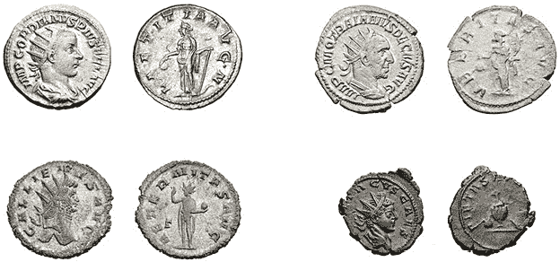

# 第七章：保护你的储蓄

对大多数人来说，储蓄是件大事。它们来之不易，能够彻底改变生活。因此，建立一个安全网后却眼看着它溜走，是令人痛心的。然而，许多人最终都会经历这样的困境。

每年，数十亿美元因为盗窃、法院争议、糟糕的投资或政府政策失误而损失。财富，即使是可观的，也比我们想象的更加短暂。在一项研究中，约 70%的富裕家庭在两代人内就已挥霍一空——到第三代时，这个数字达到了 90%。^(1) 换句话说，单纯拥有金钱并不能替代拥有一个保全财富的计划。

在建立应急基金的早期阶段，担心复杂的金融风险可能过于草率：保持现金储备的流动性，并持续以稳定的速度储蓄，远比捣鼓复杂的风险管理策略更为重要。但一旦你的积蓄超过了应对短期困难所需的金额，并且随着通货膨胀开始侵蚀储蓄的价值时，为保护你多年来辛勤工作和财务纪律所积累的财富，制定一个长期策略是明智的选择。

可惜，如果说关于预备者社区有什么安全的概括，那就是这个领域充斥着误解、政治色彩的阴谋论和显然危险的财富管理建议。现代金融的世界被描绘成一个对小人物充满敌意的残酷游戏，也被视为由破产政府操控的虚无主义闹剧，诸如*现代货币理论*、*部分准备金银行*、或*救助计划*等术语被加入其中，起到戏剧化的效果。

为了在这片危险的领域中找到出路，我觉得退一步思考钱是如何产生的、它的目的是什么、以及今天它的价值由什么决定，十分有用。回答这些问题比我们预期的要复杂——而这些问题对于解读许多关于银行、金融市场或政府据说在阴谋剥夺我们辛苦赚来的现金的流行文化陈词滥调至关重要。

## 货币的历史

几乎所有经济学教材都以相似的方式解释货币的出现。这个故事从一个农夫和一位鞋匠的寓言开始；鞋匠需要喂养他的家人，而农夫想保暖自己的双脚，于是他们在互利的基础上交换了各自的劳动成果。通过这种方式，我们的两位石器时代企业家发明了原始的贸易。

然而，故事继续说，这种物物交换制度有一个缺陷。它依赖于拥有紧密匹配需求的人的及时相遇。这个先决条件——被称为*需求的巧合*——并非总能轻易满足。有时农民想要一个炊具，陶工想要一把刀，铁匠想要一条裤子，裁缝想要一些猪肉。据说，这种多方交换的不可简化的复杂性严重阻碍了早期的经济活动。

为了解决这个问题，课本继续讲述，我们的祖先最终想出了一个巧妙的主意：使用可取的、耐用的、紧凑的物品作为中介价值存储，从而有效地抽象化了许多交易的多步骤过程。农民会用猪肉换一块闪亮的石头，然后将这块石头带到鞋匠那里交换鞋子；鞋匠之后再将他的石头换成其他商品或服务，而农民无需参与任何交易。

这个精妙的构思显然引出了另一个问题。没有两块闪亮的石头是完全相同的，随着时间的推移，一些不道德的行为者学会了制造假冒或掺假的石头，以获取不正当的商品。于是，民众被告知，便寻求统治者的帮助，要求他们将金属铸造成统一标记且独特的硬币，分发到全国，并对任何欺诈行为进行严厉惩罚（处决伪造者是常见的惩罚方式）。

这个解释相当有说服力，但却存在一个致命的缺陷：它几乎肯定不是真的。在 1985 年关于物物交换的论文中，剑桥大学的著名人类学家卡罗琳·汉弗莱直言不讳地指出了以下几点：

> 纯粹的物物交换经济的例子从未被描述过，更不用说它如何演变成货币；所有现有的民族志资料表明，根本没有这样的经济体系。*^(2)*

物物交换的寓言最早起源于哪里尚不清楚。最合理的解释是，它是早期哲学家试图理解货币体系时的发明。从亚里士多德到亚当·斯密，思想家们形成理论的时期，政府发行的货币已经普遍存在，因此他们从已观察到的现实出发，倒推并编造了一个关于人类史前的可信故事。他们的推测没有丝毫证据，最终变成了被接受的“真理”。^(3)

经更深入的审视，我们会发现“猪换鞋”的货币故事还有其他问题。首先，要使硬币发挥作用，你需要一个*价格体系*——对猪值多少鞋子、多少猪换一匹马等内容有广泛共享且稳定的理解。没有这样的模型，就无法确定硬币能安全且公平地替代哪些种类和数量的商品。但是，如果存在一种方式可以关联常见贸易中各种物品的价值，那么这个价格体系将允许金融契约和初步的银行业务在*没有*硬币的情况下进行。或许可以在社区内达成并跟踪诸如一斗谷物等习惯单位衡量的债务和账户余额。事实上，这类金融账簿早在古代就已存在，至少可以追溯到公元前 3000 年的美索不达米亚——而且很可能出现得比这还要早。^(4)

在一本名为*《债务：前 5000 年》*（梅尔维尔出版社，2011 年）的畅销书中，作者大卫·格雷伯提出了一个观点，即基于账簿的债务义务是早期贸易体系的自然基础，而硬币则是在后来出现的，并且服务于更狭窄的需求。格雷伯的理论得到了比以物易物寓言更有力的证据支持——并且它对我们今天对金钱的理解也具有重要意义。

### 作为货币的债务

正如格雷伯所说，早期社会从未在追踪谁欠谁什么方面遇到困难。在文字出现之前很久，我们的石器时代祖先就有通过在棍子或动物骨头上刻痕来记录商品的习惯，而到了早期青铜时代，已经开始使用楔形文字在粘土板上进行相当复杂的记账。所有这些都比已知最早的硬币——公元前 600 年左右在吕底亚王国铸造的硬币——要早 2000 多年。

当然，在小而紧密的社区中，债务可能总是以相当非正式和近似的方式处理，这类似于我们现代对邻居、家庭成员、同事或朋友之间商品和服务交换的态度。在这种环境下，相互之间松散跟踪的债务更多的是作为社会粘合剂，而不是一种行为规范的金融工具，而坚持立即结算交易——例如，要求你的晚宴客人为餐费还款，或者向帮助你搬家的朋友提供现金——可能会被视为一种轻蔑。

但在更大的社会中，交易往往较为不个人化，账目核对的任务似乎变得更为精确，从古至今一直由值得信任的第三方来处理。例如，古美索不达米亚的楔形文字账本就保存在神庙中，且很可能由祭司负责维护。无论如何实施，债务账本自然促成了任何稳定、法治社会内广泛的经济活动。债务可以用一种或另一种商品随时间偿还、转移、重新谈判或宽恕，所有这些都不需要即时结算交易。

如果我们接受早期经济的债务模型，那么第一种货币几乎肯定是由于希望在某个特定的计量单位上结算的需求而出现的。例如，如果前面提到的谷仓中所装的谷物恰好是某个地区最熟悉且最稳定的商品，那么用这种谷物的数量作为参考点来跟踪所有账户余额，并报价所有商品和服务，会更为简便。与经典的以物易物模型不同，这种计量单位不需要特别耐用、受欢迎或易于携带；它仅仅是一个记账工具。事实上，历史上曾经出现过许多不寻常且易损的货币——从早期欧洲定居者在北美使用的完成的海狸皮（“做好的海狸”）^(5)，到许多现代监狱环境中以香烟为单位的经济体^(6)。

### 硬币时代

考虑到似乎有数千年的时间从较为复杂的经济体系的发展到硬币的出现，似乎与传统观念相反，实物交换媒介在小部落的本地经济活动中并非紧急需求。相反，随着人类聚落规模的扩大、与邻居的融合以及偶尔的战争，硬币的出现可以通过扩大贸易网络的视角更为合乎逻辑地解释。当与来自远方、不熟悉或可能敌对的买家交易时，债务账本的概念并不总是能够奏效。对方可能不愿履行其义务，甚至可能得以逃避。

在这种情况下，使用易于携带、具有实质内在价值并且几乎具有普遍吸引力的实物代币进行即时交易是有明显优势的。在过去 2500 年中，大部分时间里，这一角色通常由*商品货币*来承担：由贵金属或半贵金属（主要是银和黄金）铸造的圆形硬币。最初，这些硬币与传统的农业账户单位并存，并服务于特定的用途，但随着辽阔的大陆帝国的出现，人们逐渐将金属视为衡量财富或清偿债务的主要方式。当然，账簿和契约仍然是全球经济活动的基础——但这些账目现在是以硬币而非谷物为单位的。

更加令人费解的是，为什么各国政府不仅仅参与了硬币的发行，还以一种在大多数其他行业中没有见过的方式垄断了其供应。为什么私人实体不能像生产其他重要商品（从食品到药品再到住房）那样生产标准化的硬币呢？

传统观点认为，政府在其臣民的要求下承担了这一角色，因为人们发现私人发行的货币体系过于复杂或充斥着欺诈。然而，著名的异端经济学家穆雷·罗斯巴德（Murray Rothbard）认为，这种解释从未经得起推敲。他在 1963 年发表的文章《政府对我们的货币做了什么？》中的相关段落值得引用：

> 今天私人铸币的概念显得如此陌生，值得仔细探讨……是什么阻止了私人铸币厂铸造硬币并保证其重量和纯度呢？私人铸币厂至少能像政府铸币厂一样保证硬币的质量……
> 
> 反对私人铸币的人认为，欺诈行为会泛滥……但是，如果政府无法……在自由市场中发现偶尔的恶棍，为什么当政府完全控制货币时，我们又能信任政府呢？
> 
> . . . 所有现代商业都建立在标准保障的基础上。药店出售的是一瓶八盎司的药水；肉类包装商出售的是一磅牛肉。买家期望这些保证是准确的，事实也确实如此。再想想成千上万种必须符合非常严格标准和规格的专业工业产品。购买半英寸螺栓的人必须得到半英寸的螺栓，而不是 3/8 英寸的螺栓。然而，商业并没有崩溃。很少有人建议政府必须将机床工业国有化，作为其抵制欺诈、捍卫标准的任务的一部分。

对于罗斯巴德而言，即使政府在发行货币方面的介入可能起初有一些崇高的根源，它很快就变成了一个为了自身利益的行为，这种行为需要消除大多数替代方案。因为没有任何政府能抵挡通过贬值货币来进行战争、养活贫民或为统治阶级建造宫殿的诱惑——几个世纪以来，他们主要是通过减小硬币的尺寸或用较低纯度的合金铸造硬币来实现这一点（见图 7-1）。

这样做使得相同数量的贵金属能够转化为更多的实物货币，政府可以用来偿还债务，同时希望民众不会注意到——或者他们会因为过于习惯现状而不采取任何有意义的行动。但要实施这种粗略的货币手段，官员们需要防止其他人提供私人铸币，这样私人铸币就有可能随着时间的推移，逐渐建立起作为更安全或更有价值资产的声誉。

图 7-1：罗马帝国银安托尼乌斯金币的衰退，硬币的银含量逐渐降低，质量也变差（从左到右，从上到下）。图片由 Rasiel Suarez 提供，来源于 Wikipedia。

有些人不同意罗斯巴德的观点。一种常见的反驳是引用所谓的*格雷沙姆法则*，这是一种观察，认为劣币驱逐良币。换句话说，如果两种类型的硬币被赋予相同的地位，但其中一种内在价值更高——例如，由更精良的金属铸造——那么更好的硬币将逐渐从流通中消失。对于罗斯巴德的批评者来说，这是证明政府不需要打击私人铸币，它自然会失去吸引力的证据。

但这个反驳似乎没有道理。首先，在格雷沙姆的模型中，精良硬币的“消失”恰恰是因为它作为价值储存的吸引力，使其被收藏而不是花费。其次，劣币不一定会长期保持相同的地位。随着对政府财政政策信心的下降，商人完全有可能拒绝接受政府发行的货币，要求更稳定的替代货币。我们知道，这在 20 世纪许多失败国家中是现实——尤其是在苏联集团国家，那里各种“奢侈品”必须用德国马克、美元等货币购买（政府则追捕“货币投机者”，并偶尔将他们关押起来）。

对罗斯巴德（Rothbard）强烈反对政府的观点，更有效的批评是，贬值通常并非出于任何邪恶的动机。与其说政府官员试图压迫农民并让统治阶级更富有，不如说他们更多是在应对自然灾害和其他迫切的社会需求时采取了这一做法；可以合理推测，如果不采取这种政策，我们的祖先可能会面临更糟糕的局面。金属的供应量也在波动，使得货币的价值以不可预测的方式波动。而且，由于货币逐渐成为国内贸易中一个熟悉且有些抽象的计量单位，硬币的实际熔化价值不再那么重要；因此，篡改货币的行为可能不像犯罪，更像是一种聪明的生活窍门。

与此同时，在硬币不断贬值的过程中，私人金融领域出现了另一个有趣的发展：纸币的发明，这些纸币由银行或其他可信的机构发行，作为存款的凭证，持有人可以随时凭借这些纸币取回存款。标准化的纸币比装满金属的袋子要易于携带得多，渐渐地它们在 10 世纪左右成为贸易中的常见元素。

政府注意到，人们似乎乐意用本身没有任何内在价值的纸或布互相支付，于是他们将这一理念应用到了国家发行的硬币上。于是，*代表性货币*的时代开始了——纸币和由便宜金属铸造的硬币都伴随着一个简单的承诺：发行者承诺可以随时以预定数量的银或金兑换这些货币。

当然，沿袭了几个世纪的贬值做法，承诺本身有些虚幻。并没有足够的实物金属储备来同时兑现所有的兑换请求。不过，只要人们对领导者有信心，并且对贵金属的需求保持在合理范围内，这种货币的基本机制在国内和国际贸易中仍然保持不变。唯一显而易见的新风险是，在发行国家发生金融崩溃或军事失败的情况下，货币将变得一文不值——不过，这种情况并没有让大多数公民夜不能寐。

### 存款准备金制度与法定货币

与政府进行的所有金融舞弊相比，商业银行在许多千年里依然是一项相当乏味的事务。它主要是进行账目核对和存款保管的工作。或许令人惊讶的是，早期的银行在我们现在称之为*消费贷款*的领域几乎没有扮演重要角色；相反，绝大多数个人贷款发生在彼此熟识的人之间。这部分是因为世界各地许多宗教教义和法律系统禁止*高利贷*——即对贷款收取利息，视为一种剥削和不道德的行为。当然，这些规则时不时会被绕过，尤其是在商业贷款方面，但广泛的禁令仍然限制了银行在农民和贵族生活中的影响力。

在欧洲，高利贷直到 16 世纪才被视为禁忌。导致这一转变的原因尚不明确。一些学者认为，宗教改革运动在这个问题上与天主教会有所分歧，而另一些学者则认为，基督教的两个派别对这一做法的态度同样批评，但内部的斗争削弱了宗教权威，使得世俗规范发生了变化。

很明显，从 17 世纪开始，许多欧洲国家见证了营利性贷款的爆炸式增长以及*部分准备金银行*的出现。这些私人企业遵循着一个简单的模式：它们接受人们的硬币保管，承诺对每一笔存款支付额外的奖励。为了履行这些承诺并实现盈利，银行随后利用集中存款向其他人发放高利贷。借鉴政府关于代表性货币的策略，金融家们发现，在正常情况下，且当运营规模足够大时，他们只需要拥有非常少量的硬币储备——远低于所有存款金额的 10%——就能满足客户通常的取款需求。其余部分可以用于贷款。

部分准备金银行的一个奇特后果是，它能够凭空创造新货币，而且无需政府的任何帮助。存入银行的一先令似乎随时可以供存款人转账或取款，但它同样出现在借款人手中，这个借款人是从银行借走这笔钱的人。说实话，那位借款人甚至可以将他们的先令存入另一个银行，再次贷款——最终看起来似乎是三先令代替了一先令。

当然，在任何物理意义上都没有创造新的货币。这些存款直到借款人偿还后才会回归。银行所做的只是进行了一些创造性的会计操作——如果在其他企业中尝试，可能会因此入狱。如果太多存款人要求提取存款，或太多贷款违约，银行系统就会崩溃。财富将在一阵会计烟雾中蒸发，而随着大量资金——通常是在存款人一方——的消失，整个国家的财富也会缩水。

许多阴谋论者视部分准备金银行制度为原罪，认为这是抢夺民众财富的一系列恶行中的第一步。但这种说法似乎有些牵强。银行与普通人一样，也有利益推动这个系统顺利运作。支持这种安排的经济学观点也存在。首先，部分准备金银行制度释放了那些本可能被紧张储户无所作为地囤积起来的资金，并且无需说服每一位存款人冒险为社会的更好未来做出贡献。但其弊端同样显而易见。该模式让贷款变得不再那么个人化，取而代之的是一种普遍的现实：每个人似乎都欠银行钱。更直接地说，银行——由于缺乏政府的军队、警察和税收权力——比起国家层级的政府更容易陷入危机和崩溃。

在 20 世纪初，世界频繁遭遇到这个问题，经历了一系列的银行挤兑和经济萎缩，迫使政府采取行动。在那个阶段，禁止部分准备金银行制度已不再是政治上或经济上可行的选择。一种更简单的替代方案是放弃黄金，转而使用*法定货币*——一种抽象的货币，完全摒弃了任何与实物商品挂钩的虚假设定，无论这种联系多么薄弱。

在法定货币时代，一种新的经济学派认为货币当局的作用不是将货币价值与某种已知商品挂钩，而是自由地操控其供应量和流动，以平滑经济波动或刺激增长。例如，一家陷入困境的银行可以通过新创造的货币得到扶持，也许是以政府以一个没人愿意支付的价格购买该破产金融机构的债务的名义。相反，一个基础设施项目或社会计划可以通过吸引银行购买政府债券，使用存款人的资金来为其融资，从而有效地实现私人财富向政府金库的隐秘转移，承诺通过未来数十年内征收的税收来偿还。由于货币供应理论上是无限的，政府的巨额债务不再引起过多的关注。

但当然，财政不负责任的行为可能会付出代价。法定货币的明显危险在于，从长远来看，它的价值完全取决于人们是否愿意接受一张纸作为交换他们努力的代价。这种愿意接受的态度反过来又仅仅取决于他们是否相信这张纸将在一周、一个月或一年后仍然能购买到他们所需要的东西。特别是在越来越多的经济活动依赖于政府债务和对未来现金流增长的预期时，可以推断，单纯的信心危机可能会使一种货币在一夜之间几乎变得毫无价值。

确实，正如第三章中所讨论的那样，在过去的一百年里，这类事件几乎是定期发生的。它们几乎总是可以追溯到同一个根本原因：政府长期超支，然后遭遇突如其来的挫折——衰退、冲突或禁运——这些事件使消费者惊慌失措，触发了更多的政府开支，并最终导致财政灾难的恶性循环。

对于美国来说，转向法定货币是在相对较晚的时候发生的，发生在 1971 年。为了阻止美元贬值，尼克松政府采取了一个巧妙的伎俩：它命令冻结工资和物价，在此举之后的 90 天内实行冻结。这一措施完全是心理上的。人们继续过着他们的生活，照常支付鸡蛋或牛奶的费用，等到冻结结束时，他们已经习惯了“新”的、自由浮动的美元与旧的、类似黄金支持的美元差不多值同样的价值。强劲的经济和有利的地缘政治起到了辅助作用，至今，美国与法定货币的冒险经历可以说是相当平稳——或许唯一的例外就是黄金的价格本身在 1971 年从每盎司 35 美元飙升至 1980 年的 850 美元（或者从 210 美元涨到今天的 2500 美元）。

好吧，有一件事发生了变化。现在监管机构有了更好的位置，可以自由地干预货币政策，他们采取了一种故意增加货币供应量的政策，其增长率略微超过了经济活动的自然增长。他们这么做是为了保持小幅、稳定的通货膨胀，^(*) 认为这可以阻止人们囤积现金，迫使他们将储蓄再投资，以促进社会的改善（这一理由与支持部分准备金银行制度的理由也有很大的相似之处）。

一些批评者指出，这样的政策实际上充当了一个看不见的税收，因此更容易为政治上接受，它恰好符合政府更加自利的利益。无论如何，意图并不重要。最终的结论是，在美国和大多数其他发达国家里，任何存在床垫下的货币的购买力每年都会以 2%到 10%的速度下降——在经济不确定时期，这一降幅可能还会更大。

### 加密货币

货币的历史或许悠久且复杂，但大众对于金融体系和货币政策的看法往往缺乏细致的分析——且很少能发表在报刊上。具体的批评各不相同：对于格雷伯来说，他的书籍大量讨论了他理想化的“日常共产主义”观念，金融的堕落起源于银行系统和它所支持的阶级主义、新封建的权力结构。对于罗斯巴德这位自由市场绝对主义者来说，所有问题的根源和终结都在于政府那种无法满足的欲望——想要超越自身的经济能力生活，并控制我们生活的方方面面；银行系统仅在其与政府的勾结和从这一过度中获利的程度上才是同谋。但所有意识形态的拥护者似乎都同意一件事：这个系统，不论它曾经做过什么好事，已经腐烂至极。

几十年来，那些担心法定货币即将崩溃的个人纷纷涌向那些在深夜电视广告和边缘广播节目中煽动恐慌的奸商们。这些购买黄金和白银硬币的人很快成了金融顾问们笑谈的对象，后者将这种行为比作是在与文明及人类进步本身作对。尽管有诸多批评，囤积贵金属的欲望证明是一种相当无害的爱好。在法定货币的时代，黄金和白银的价格波动较大，但从长远来看，这些金属依然是具有持久吸引力的资产。在某些年代，它们的表现不如股市，但在其他年代，它们却超越了股市。对于生活在美国的人来说，这些金属并不是最赚钱的投资，但也并不特别糟糕——尤其是如果我们考虑到它们为买家提供了一些心安。

最近，一项全新的发明挑战了贵金属作为那些不信任银行和政府的个人，或试图快速赚钱的投机者首选投资工具的地位。在过去的十年左右，比特币和其他虚拟加密货币从无到有，迅速达到了超过 1 万亿美元的理论市值——约为黄金市值的十分之一。

尽管各种加密货币的机制在重要方面有所不同，但比特币的例子具有启发性。它是一种全球去中心化的货币，没有可回收的内在价值，没有中央权威来发行货币或设定汇率，也没有其他机制将其与物理世界相连接。直到一个以中本聪为化名的神秘人物发表了一篇技术论文^7，这种属性的并列似乎是荒谬的，因此也没有引起严肃的讨论。但凭借他的发明，中本聪显然做到了看似不可能的事情——而且通过使用几种巧妙的计算机技巧实现了这一点。

首先，他的设计允许任何人在家中私下创建新的（虚拟）货币，但只有通过解决计算难题才能实现，这些难题随着时间推移而变得更加困难。这为早期采用者提供了“挖矿”比特币的激励，因为这样做只需要投入少量的时间和金钱，但随着难题难度的增加，重新出售这些代币有可能获得可观的回报（当然，前提是公众对这项技术的兴趣能够长期保持）。

接下来，比特币协议通过使用加密技术确定了币的所有权。只有授权的币持有者知道转移资产所需的秘密密钥，但世界上的任何人都可以验证一笔交易是否已发生。最后，中本聪的货币采用了去中心化的、基于互联网的账本——即*区块链*——以防篡改的方式记录币的所有权链，并排除了币的拥有者重复花费同一币的可能性。只要大多数市场参与者本着诚信行事，区块链的完整性就能得到保证，而无需任何中央权威来追踪交易和账户。

共识驱动的区块链被广泛认为是比特币最具革命性的特点，它有助于塑造比特币作为一种反叛金融工具的形象，赋予普通民众重新掌控金融系统的能力。然而，分布式账本的实际重要性随着时间的推移而减少。随着非技术投资者的涌入，大多数流行的加密货币用户选择了基于云的集中式服务来存储和操作他们的数字钱包余额，而不是试图在自己电脑上调试加密技术。这一新兴生态系统由少数大型企业运营，其中一些企业拥有成千上万的员工，市值以数十亿美元计。从这个角度来看，它与传统银行系统并没有太大区别——或许只是监管监督程度较低，且当问题发生时，客户的救济途径有限。

比特币及其一些克隆币的一个显著特点是，随着“挖矿”操作的计算复杂度增加，以及一些已挖出的代币丢失，币的稀缺性不断增加。在过去的几年中，这一限制导致比特币的价格增长了超过一百倍。早期的增长创造了一个正反馈循环，新投资者被惊人的回报所吸引，并希望通过加大对该货币的投资来获得更高的回报。这场投机性的淘金热可能是不可持续的——尤其考虑到比特币在真实交易中的使用极为有限，且未来此类用途受到一系列设计缺陷的制约，这些缺陷导致处理时间长、交易费用高昂。

当然，这样的声明很便宜。最终，要真正知道比特币及其类似物是否会长期存在，或者它们的“正确”估值是什么（假设存在任何理性的上限），确实很困难。这并不是说这些工具的崩溃即将来临。从某种意义上说，代表浪费电力的数学证明的硬币，与印有已故总统头像的货币没有本质上的优劣。未来可能有一个我们都在使用比特币、狗狗币，或某些实验性“稳定币”的时代，这些稳定币旨在与实物商品的价值挂钩。但在那一天到来之前，对于新技术的热情大概不能替代对风险的原则性管理。

## 重新审视流动性和资本的风险

这段长时间穿越货币历史的旅程有一个重要的目的。它为更加扎实地回顾个人储蓄面临的最常见威胁，以及对互联网上流传的民间金融解决方案（从金链到区块链，及其间的所有事物）进行批判性审视，打下了基础。对以物易物历史的深入理解有助于我们判断，在货币崩溃时，子弹和豆子是否是最好的生存方式。理解通货膨胀的成因和目标，可以帮助我们更容易地找出比银子或黄金更能忠实跟踪通胀的工具；而对货币创造过程的认识，则使我们更容易理解为何银行会失败。

当然，国家货币政策和中央银行的举措不一定是影响你应急基金安全性的最重要因素。许多储户遇到的挫折，往往是由更平凡且私人化的原因造成的。但为了量化和比较可能剥夺你储蓄的常见灾难的概率和后果，并制定多样化且具有未来适应性的应对策略，保持宏观视角依然是值得的。

### 丧失访问银行账户

也许最常见的金融困境是无法访问自己的银行账户。这可能由于多种原因发生，其中许多是反高潮式且暂时的：例如，一次停电或一辆失控的挖掘机撕裂了光纤电缆，导致全城的 ATM 和销售终端暂停工作几天。或者，如果银行认为你的卡出现了异常活动或涉及安全漏洞，它可能会毫不客气地将你切断，直到你联系银行并更换卡片；这个过程通常比较无痛，但当你站在结账排队时，推着满满一车购物车时，这就会变得有点麻烦。

你的存款所在金融机构的倒闭是另一个看似不可思议但却真实存在的风险。银行倒闭并不罕见，它们发生的原因和过去一样：未能维持足够的储备来应对需求。在美国的一个好年份里，约有两到八家银行破产，但在 2009 到 2012 年的房地产危机之后，超过 400 家银行最终关闭了。^(8) 当时，在一项极不受欢迎但可能必要的举措下，美国当局介入，用大规模的现金注入来支撑剩余银行的资产负债表。这一举措避免了可能会让数百万客户存款化为乌有的灾难性多米诺效应。但即便有救助措施，部分人还是在倒闭的银行被竞争对手吞并或彻底清算时经历了暂时的问题。

多亏了灵活的货币供应所带来的救助，那一波银行倒闭事件对于美国绝大多数储户来说最终并未造成太大影响。但假设监管者总能拥有相同的工具并能有效利用它们，这是不明智的。举个例子，欧盟处理那次危机的方式就差得多。各个成员国缺乏对共同货币的必要控制，而当布鲁塞尔和法兰克福的官僚们争论不休时，塞浦路斯和希腊的银行却关闭了好几个星期。^(9) 虽然僵局最终得到解决，但长期的“银行假期”却在最糟糕的时刻困扰了无数人。延误的原因很复杂，但对于大多数客户来说，解决方案本可以很简单——只需手头保持几周的现金储备即可。

### 不利判决

如果有一种财务风险与宏观经济学完全无关，那就是人身伤害诉讼、激烈的离婚案件、商业纠纷以及生活中突然出现的所有与法庭相关的难题。

对大多数人来说，这类事件通常只是懒散编写的肥皂剧或名人八卦专栏中的内容——直到它们发生在自己身边。统计数据描绘了一幅令人警醒的画面。例如，在美国，每年有超过 700,000 起离婚申请被提交，^(10)其中很多以友好方式结束，但也有相当一部分演变成了激烈的法庭斗争。在人身伤害方面，尽管最近有所下降，但每年仍然估计有大约 750,000 起侵权诉讼被提交——这些案件主要涉及车辆碰撞，也包括狗咬伤、私人财产上的滑倒事故以及其他常见的意外事故，这些事故无论是富人还是穷人都可能遭遇。^(11)

对于那些陷入民事纠纷的人来说，应该以怜悯和智慧取代愤怒和怨恨。在离婚或子女抚养案件中，没有真正的赢家或输家，而且在车祸中严重伤害对方之后也没有获胜的喜悦。与此同时，必须承认，某些诉讼是出于恶意提起的——即使是最正直的被告有时也可能不走运，选择了一位糟糕的律师，或在能够提供坚实辩护之前就用尽了所有的钱。计划如何在受到这样的打击后重新站稳脚跟并不是一个不道德的思考方向。

然而，制定应对这种情况的策略可能会很棘手。首先，试图隐藏资产的人通常只会面对痛苦。尽管如此，一些合法的策略可以减少损害。例如，选择适当的责任保险政策可以在许多类型的人身伤害索赔中提供一定保护，而注册公司可以帮助分开个人财务与家庭业务活动，通常无需雇佣会计师或处理过多的文书工作。在最坏的情况下，即使在适度的规模上进行慷慨的慈善捐赠，也可以在亲朋好友需要帮助时开辟一些途径，如果情况发生逆转。

### 逐渐上涨的通货膨胀

通货膨胀是一种特殊的现象。与死亡和税收一样，它不仅仅是可能性，几乎是确定性。正如前面讨论的那样，监管机构确保通货膨胀率不会过低；政府过度支出时也会偶尔出现一些尖峰。

过去几十年来，美国的消费物价年度变动率在 2%到 6%之间波动，偶有几次达到 10%到 13%之间的高峰。^(12) 全球许多其他稳定经济体也遵循类似的模式，为未来提供了一个相当一致的基准。^(*) 在这一范围的低端，通货膨胀将会在大约 30 年内使你的现金储蓄贬值一半，虽然速度缓慢，但已足以影响你的退休计划。而高端则意味着更大的痛苦：以 6%计算，贬值时间缩短至约 10 年；而在 13%的领域，仅需不到五年的时间。

尽管这些情景都不会临近财务紧急情况，但在现有储蓄损失开始与你存入的雨天基金的贡献相媲美之前，着手应对通货膨胀成本是明智之举。采取行动的确切时机取决于你的储蓄率和最新的通货膨胀数据，但对于大多数人来说，这可能与已经储蓄以支付一年生活成本的时间相一致。

不幸的是，通货膨胀的必然性也使它成为一个独特且具有挑战性的敌人。如果保险公司赔付金额少于这类政策的预期赔付金额，那么没有理智的人会愿意为日常的通货膨胀损失提供保险。使这种交易得以实现的一种方法是交换风险，而不仅仅是现金。

如果你希望别人付你 10 美元来帮助你抵消 99%可能发生的情况（例如通货膨胀），他们可能会愿意拿出这笔钱，如果你承诺在一个 1%可能发生的情况发生时给他们 1000 美元——比如说，如果他们的生意在来年破产。这是一个互利的交易。你们俩都在为自己担忧的事情购买保险，而没有人试图耍花招。

股市是进行这种复杂交易的一个流行且常被不公正抨击的渠道（另外，股市也是做出极其糟糕的金融决策的工具）。从最基本的角度来看，交易是简单的：你投资一些资金于一家预期账面价值能够跟上或超过通货膨胀的公司，并理解如果公司倒闭，你可能会失去你的投资。

另一种抵消通货膨胀的方法是将你的一大部分储蓄转换为那些不会因货币贬值而失去价值的资产，例如收藏品、不动产或白银和黄金。然而，这些持有的资产各自也有风险。收藏品可能会受损或被盗，贵金属可能因工业需求变化而贬值，而不动产则容易受到区划委员会的变化影响。换句话说，不管是否明确，你仍然是在交换风险。

### 恶性通货膨胀

从某种意义上说，恶性通货膨胀仍然只是通货膨胀。不同之处仅在于变化的速度，物价在几周或几个月内翻倍。不过，仍然有两个理由需要稍微不同的方式来应对这种情况——一个对我们有利，另一个则不然。

准备充足的人能够受益的因素是，恶性通货膨胀是不正常且出乎意料的。这是政府可能会倾向于接近但绝不想越过的底线。因此，至少从原则上讲，是可以通过低成本来为这种风险投保的。例如，你可以购买一个*商品期货期权*，这是一种标准化的金融工具，实际上赋予你以远高于今天市场价的价格从供应商那里购买商品的权利，比如玉米。在正常情况下，这个合约几乎没有价值，并且可以以极低的价格购买，因为行使它并成为一箱过高定价的谷物的拥有者是毫无意义的。但如果货币崩溃导致玉米价格暴涨，这个工具就会使你有权以现在的深度折扣价购买玉米——然后立即以更高的价格转卖。（事实上，你不需要接收一车玉米，因为期货期权本身和相关的交货合同都可以转让，且对那些实际经营食品加工公司的公司来说，这将具有很大价值。）

另一方面，恶性通货膨胀的情景并非在真空中展开，几乎从来都不是一项有条理的货币政策的故意产物。相反，它们往往发生在政府动荡、军事政变、内战或严重经济衰退的背景下。这种现实带来了许多其他的危险，其中许多是非货币性的：财产没收、食品配给以及政治敌人的迫害，仅举几例。换句话说，任何声称应对恶性通货膨胀的准备策略，必须远远超出玉米合约和黄金条的范畴。

恶性通货膨胀环境也是一种典型的*长期紧急状态*的例子：这是一场可能突然发生的灾难，但其持续的影响会拖延多年。这可能将除最极端的应急准备策略之外的所有策略推到崩溃的边缘，突显出适应能力比即使是最令人印象深刻的罐头食品储备还要重要。

### 财富没收

由恶性通货膨胀引发的混乱为下一个话题提供了一个方便的过渡：在动荡时期，可能会对少数群体征收的没收性税收或其他经济制裁——几乎总是针对少数群体——以修复公共财政或作为对这些群体所谓罪行的报复。

在这个背景下，我使用“少数群体”一词并不是指弱势群体，而是指社会中任何一个没有在政治上掌握多数话语权的差异化群体。这可以是极度贫困的人，也可以是极度富有的人；它可能是算命师或喜欢听爵士乐的人。重点很简单：因为税收不受欢迎，民主制度和独裁政权中的领导者都尽力避免采取不加区分的、明确的税率上涨来应对预算赤字。当新印钞的做法太过冒险时，另一种解决方案就是分而治之：利用民众情绪挑选出一个可以被归咎于困境和不公的人群——有时是有理由的，有时则没有——然后让他们为此付出代价。

有趣的是，这个过程几乎可以无限循环。过去的受害者往往会联合起来，针对新的目标进行报复，以期达到公平的局面。一个手风琴手可能不高兴要交手风琴税，但让他真正愤怒的是，隔壁的低音号女士却没有交同样的税。

当然，少数民族或宗教少数群体有时也成为政府征税或征用的目标。德国的《消除犹太人经济生活法令》只是经济迫害的众多例子之一，它为种族灭绝的发生铺平了道路。（^(13)）在美国，二战期间日裔美国人的强制迁徙也同样臭名昭著。尽管这一政策表面上并未以此为目标，但它导致了成千上万的家庭失去了他们的家园和生意，仅仅因为在他们被安置在集中营期间，没有其他人能照看他们的生计。（^(14)）政府在 45 年后对幸存者进行“赔偿”，发放了一张相当微薄的 2 万美元支票，以弥补他们本应拥有的生活。

我不知道下一轮经济迫害何时会发生，也不知道会针对谁，但我相信这是一个值得时刻警惕的风险。从本能上来说，尽管在世界某些地方，种族或宗教分歧在经济政策中仍然存在，但它们似乎不太可能成为高度发达国家新征收没收性税收的基础。

另一方面，阶级紧张局势以一种让我想起旧时民粹主义革命的方式愈演愈烈。例如，2007 年金融危机和占领华尔街运动就是一个转折点，它们将高收入者塑造成了那些因政府救助而使经济崩溃并且趁机发财的恶棍——这一说法不仅在地方社会主义俱乐部的传单中反复出现，也出现在主流政治中。法国经济学家托马斯·皮凯蒂（Thomas Piketty）在其开创性著作《二十一世纪资本论》（Belknap Press，2014 年）中所提出的论点，已经说服了数百万人认为，对高收入者大幅增税不仅是正确的，而且是解决西方日益加剧的不平等现象的绝对必要措施。

对富人重新燃起的反感情绪使得监管机构在塞浦路斯债务危机期间更容易没收外资存款，并让美国重新把财富税提上议程。为了让选民能够接受这样的提案，我们的代表通常会勾画出亿万富翁的形象——一群隐士般的老年男人，身边围绕着管家和镶金的吊灯，整个政治体系都掌控在他们手中（当然，除了那个正在发表演讲的政治家）。这个叙事的问题并不是亿万富翁一定是令人喜爱且多元化的一群人，也不是他们不能撒些钱，或者他们的处境可以与少数族裔的困境相提并论。撇开道德问题不谈，问题简单地在于，亿万富翁寥寥无几，他们的财富——尽管可观——大多是一些难以合理征税的资产，比如对大型公司的控股权。

实际上，对亿万富翁的指责几乎可以肯定只是作秀，至少对于那些不准备重新启用断头台的人来说是如此。如果想通过对富人征税来产生可观且持续的收入，政策需要针对一个更广泛的群体，或许是社会中排名前 5 到 10%的那部分人。但在一个大部分家庭净资产为负（通常是由于银行债务）^(15)，且约一半的纳税人没有达到需要缴纳任何联邦所得税的门槛的国家^(16)，即使没有七位数的收入，依然可能进入顶层群体。这个群体主要由那些在理想领域做全职工作的有薪专业人士组成。

当然，对富裕阶层的批评并不是迫害，也不是所有的税收增加都是不公正的。在这里需要思考的情境并不是加州或纽约的高收入者的有效税率可能从 52%升至 54%，或者对六位数或七位数存款余额征收 1%的重复附加税。问题在于，战线已经划定，阶级不平等已成为我们时代最具影响力的辩论之一，而且这种分裂在继续扩大，既根植于情感，也根植于事实。尤其在年轻一代眼中，许多高薪职业人士——如土木工程师、医生、IT 从业者、财务顾问等等——越来越不被视为美国梦的象征，反而被视为压迫其他人的制度的设计者。在这样的世界里，或许更激进的财富再分配政策最终也可能成功。

### （货币）僵尸 apocalypse

最后提到的一个风险——虽然只是简单提及——是现代金融的完全崩溃和全球贸易的解体。这种灾难是预备社区中的一个常年最爱，尽管带来这种灾难的机制从未被详细解释过。通常能得到的不过是关于日冕物质抛射或核电磁脉冲（见第四章）的简单提及。

在没有明确解释的情况下，焦点严格集中在结果上：一个部落式的世界，幸存的小团体偶尔进行商品交换。经过必要的铺垫后，讨论不可避免地转向正确的交易物品，以便占得上风。香烟会是理想的交易物吗？小瓶酒？弹药？罐装豆类？盐？还是香皂？

即使我们接受了基本前提，囤积大量弹药或盐的想法也源于对货币和贸易历史的误解。直接以物易物不太可能成为末日后商业的基石。更有可能出现的是共同的账本制度，但基于账本的市场是有地域限制的——而且，如何在不严重压低商品价值的情况下将香皂或盐分发到邻里也是有限制的。从根本上说，这种方法违反了第一章中列出的风险管理原则；如果末日没有到来，存放一堆陈旧香皂几乎不可能在不遭受重大损失的情况下出售。

可以说，这种准备提供了一个吸引人的成本效益比。千条香皂的价格可能只需几百块钱，但在未来一个严重缺乏卫生用品的世界里，这可能为具有远见的企业家带来一生的财富。当然，这忽略了概率问题：像这样的无数不太可能的未来都有可能存在，包括一个急需咖啡或铅笔，却对身体气味无动于衷的世界。预测正确的结果是困难的，即使有一个满是各种家庭用品的仓库，最有可能的情况是其中的任何一样都永远不会值其黄金的重量。

至于最有可能的末日后货币，除非它在之前严重贬值，否则我怀疑继续使用已经不存在的政府纸币将是合乎逻辑的选择。正如尼克松时代所展示的那样，习惯的力量是非常强大的。熟悉的物价体系的好处也是不可小觑的。简而言之，没有特别的理由抛弃纸币；如果有什么理由的话，“他们不再印了”会是一个相当有力的卖点。

## 降低风险的方法

金融系统充满了刺激、混乱和恐惧感。但正如我们迄今为止的讨论所表明的，它们是涌现的和混乱的现象，而不是一个阴险的计划，旨在从穷人那里剥夺财富并转移到富人手中。当使用得当时，这样的系统可以对你有利，无论你的储蓄规模大小如何。考虑到这一点，现在我们已经勾画出了挑战的分类，让我们深入探讨一些投资策略，这些策略可以帮助保护你的储蓄。

如果你去找一个财务顾问并问他们如何处理你的储蓄，他们的第一个问题将是关于你的投资目标——他们可能会期望听到你想提前退休、送孩子去一所高档大学，或者想通过自动驾驶汽车赚大钱。但他们的第一个*真正*的问题将是关于你的风险承受能力。如果你厌恶风险，他们会将你的账户大部分资金投入现金或政府债券；但如果你告诉他们你想快速致富，他们会建议将大部分资金投资于历史上波动较大的股票，暗示这样可能会带来更高的回报。^(*)

为了保护紧急储备基金，我认为这种思维是有缺陷的；风险有许多维度。现金，尽管被认为几乎没有风险，实际上并非如此。它几乎肯定会因为逐渐的通货膨胀而消耗掉所有未加管理的资金，此外还存在小但不可忽视的超通货膨胀事件或存款丧失的风险。房地产也有风险，不过是另一种类型的风险。除了像 2007 年房地产市场崩盘这样的重大事件外，如果你的邻居在后院开设一个养猪场，你的房产也可能会大幅贬值。每项资产都有一组“风险向量”与之相关，这些风险指向不同的方向，处于一个多维空间中。末日投资组合的主要目标是平衡这些力量，以确保没有单一事件能够摧毁我们大部分的储蓄。当然，在艰难时期，一些损失可能是不可避免的——但在经济衰退期间经历 30%的跌幅与彻底破产之间存在根本区别。

相反，你绝不应通过做出极其冒险的投资来增长你的紧急储蓄。这样做有其时机和场合——股市确实为投机者提供了合理的机会——但投机性投资应该限于你不怕失去的剩余资金，理想情况下将这些资金保存在一个单独的账户中。对于紧急储备基金，唯一需要获得的“收益”是跟上用来衡量储蓄规模的货币的持续贬值。如果运气好，你能赚更多，那只是一个幸运的意外。

### 现金

一些储户，尤其是 1970 年代及之前出生的人，将现金视为实现财务独立的终极工具：它是无法被政府没收或银行挪用的资产。这种思维在 20 世纪的大部分时间里是有道理的，但在今天已经站不住脚了。政府当局已经找到了新的方法，通过以可疑价格购买不良债务来支撑公共财政并保持银行的运转——如果这些工具出现故障，导致政府承担责任，藏在床垫下的现金购买力也必定会受到严重影响。换句话说，存款和纸币的风险特征已不再像过去那样不同。

这并不是说持有现金就没有意义。它在帮助我们度过暂时的困难方面仍然表现优异，比如停电、临时银行关闭等。从这个角度看，保持足够的现金来应对大约两到四周的基本开销是明智的选择。另一方面，把储蓄增加到超过这个数额可能回报递减，尤其是考虑到现金在入室盗窃中常常被偷走，并可能在火灾或洪水中被毁坏。一个好的经验法则是，只保留你不怕丢失的现金。

现金的另一个常被忽视的用途是旅行。能在无计划的情况下支付住宿费用或购买新的返程机票，这种能力是值得珍惜的，特别是当你经常出差或访问不熟悉的地方时。当然，任何这种资金都应保存在防扒手和防抢劫的地方；游客往往是容易成为目标的人。

现金也是一种宝贵的隐私工具。它是少数几种可以轻松存储或使用而不留下大量纸质痕迹的资产之一。在每一笔电子交易都被用来挖掘行为洞察并长期存储在面向互联网的服务器上的时代，现金让你可以选择不参与这种持续的监控。当然，各种有价值的实物资产也能起到同样的作用，但没有哪一种像现金那样被广泛接受。

可惜的是，由于现金在逃避税收和法院判决中的作用，许多政府宁愿让这种过时的支付工具消失。在美国，许多大面额纸币，比如 1000 美元的钞票，实际上已经被从流通中移除，可能再也不会回来。任何超过 10,000 美元的商业现金交易也需要在 8300 表格上向国税局报告。同时，在欧洲一些地方，使用纸币进行超过€1,000 的交易已被明文禁止。^(17) 随着全球无银行账户人群比例的迅速缩小，一些经济学家和政策制定者公开讨论未来的无现金社会，届时任何交易都无法逃脱政府的监督。

### 多样化银行存款

虽然并非完全没有风险，存款在银行仍然是一个非常有价值的工具。它提供即时且便利的流动性，并且在大约九成的经济危机中，能很好地保持其价值。同样重要的是，它提供了一个重要的缓冲区，以保护其他更加波动的资产。例如，在一次普通的经济衰退中，股票或收藏品的价格可能会暂时下跌，而如果为了支付房租，不得不以亏本价卖出这些资产，那将是非常不幸的。

在金钱方面，通货膨胀无疑是最严重的困扰。过去，银行存款提供足够的利息来抵消损失。但如今，银行充裕的流动性以及对风险较大的投资的新限制，使得银行并不特别需要你的存款，提供几乎为零的名义回报（或者考虑到通货膨胀后的负回报）。因此，存放在银行的最大金额大概是你可以定期补充损失而不费吹灰之力的金额。举个例子，假设你已经存下了一年生活费用，并且每年将税后收入的 10%存入银行。在这种情况下，如果通货膨胀率为 2.5%而银行利率约为 0%，那么大约四分之一的新存款将用于补充原有资金的购买力。别眨眼：如果你存下了两年的生活费用，并且通货膨胀上升至 5%，那么你所有的持续存款将实际上变得毫无意义。

不管你在储蓄账户里的余额是多少，一个有用的小技巧是将资金分散到至少两家风险不同的金融机构：可能是一个地方信用合作社和一家大型全国性银行。这种多元化实际上增加了其中一家机构破产或遭遇暂时性技术问题的风险，但大大降低了你一次性失去所有资金的可能性。而且在那些银行存款有保险的地方（例如在美国，联邦存款保险公司（FDIC）的保险限额为每个存款人每家银行$250,000），即使其中一家银行最终倒闭，你的资金应该还是能够得到保障——所以这是一笔相当划算的交易。

这种多银行设置有一个陷阱，名为*转交*：一个晦涩、带有自利性质的规则，要求被遗弃的财产转交给国家。在美国的大多数地区，如果银行账户在三到五年之间没有任何合格活动，则该账户被视为遗弃。当然，像他们的客户一样，银行也讨厌转交规则，所以他们通常会尽力在时间结束前找到客户。但如果他们有错误的地址或过时的电话号码，或者你恰好在医院或长期旅行中，通知可能会被错过。最好不要冒险。设置一个日历提醒，定期登录“备份”账户或进行一些小额消费，应该足够了。

### 债券

*债券*是可转让的债务工具。它们由希望为其运营融资的组织发行——例如一个城市希望建设一座新桥，或是一家公司计划升级生产线。每一份这样的债务工具都赋予购买者在某个未来日期收回债券的原始购买价格加利息的权利。利息支付通常按债券的生命周期设定时间表进行，而本金则在工具到期（*到期*）时一次性偿还。

广义来说，为了使购买债券变得值得，承诺给购买者的利息必须高于债券生命周期内预期的通货膨胀率；否则，买家将以亏损的方式借出现金。^(*) 理论上，这使得债券成为对抗通货膨胀风险的绝佳工具。实际上，这个理论更为完善：某些类型的债券，例如美国国债通胀保护证券（TIPS），提供与消费者物价指数变化成比例的回报，从而无需猜测通货膨胀会如何变化。但这仅仅是理论。在现实中，在今天的市场上，债券的收益可能非常微薄。

为了理解这个问题，划分债券市场为两大类会很有帮助：第一类是由国家政府发行的债券——例如美国财政部发行的债券。在那些有自主货币政策的国家，这些债券被视为非常低风险，因为政府可以制造货币来履行其债务，而违约的决定需要由政治动机驱动，而非经济需求。但在当前的经济环境中，这些债券的回报几乎为零，有效利率有时甚至低于零。微薄的回报、可能需要较长时间才能实现的全额利润以及存在的残余（虽然不太可能）货币政策风险，都共同作用使得国债成为一个相当不具说服力的投资选择。

一个更有趣的负债类别是由国家、地方政府和企业发行的债券。这些“次级”债券通常提供更高的回报，以换取更大的违约风险。话虽如此，股票市场——即将讨论的内容——相对更加多样化，并且提供了类似的长期风险回报，只要你能忍受一些中间的价格波动。此外，债券与利率有着相当复杂的二阶动态，而利率是由监管机构设定的，用以实施通货膨胀政策目标。不深入探讨，这意味着它们可能会以相当不理想的方式表现出来，比如债券估值在消费者物价上涨时下降。

### 简单货币对冲

在讨论了易受通货膨胀和货币危机影响的资产类别后，我们现在可以转向那些有助于抵消风险的工具。也许最直接的选择就是简单的货币头寸，预计当我们的其他储蓄的购买力下降时，这些货币头寸会保持价值或升值。

到目前为止，最为熟悉且最纯粹的例子就是贷款。在金融术语中，贷款相当于对你本国货币采取空头头寸。如果你用贷款购买房产，而货币随后严重贬值，你可以用现在毫无价值的钱偿还贷款本金，而你则成为那些深度折扣房地产的幸运拥有者。

当然，贷款在家庭财务中也带来了自身的一系列风险。分期付款通常不可协商，而且金额相当庞大，在遭遇更可能发生的危机时，比如失业，可能会影响你的财务前景。因此，尽管在恶性通货膨胀环境下，抵押贷款或其他债务实际上可能对你有利（忽略随之而来的普遍困苦和经济混乱），但单纯作为财务预备计划的一部分去累积额外债务并不是一个特别好的主意。

另一种副作用较少的对冲策略是将一部分资金兑换成预计比当地政府发行的货币更稳定的外币。例如，一位担心经济形势的墨西哥人，可能会倾向于将一些比索兑换成美元。但这种策略也存在问题：它以对一种法定货币的暴露换取对另一种法定货币的暴露，且这种交换是对称的。因为为了达到较好的对冲效果，必须将大量资金转移到另一种货币中；如果仅仅是在家里藏几张 20 美元的钞票，是无法抵消银行中 100 万比索的风险的。最终，对于发展中国家的公民，或是遭遇政治动荡的国家来说，美元、欧元或日元可能是一个不错的选择。但如果你身处高度发达且稳定的经济体，很难找到一种货币能够比本国货币更安全，特别是在所有货币之间如此紧密相互联系的情况下。

或许一个更好的问题是，如果欧元或美元遭遇耻辱性的急剧下跌，全球资本会 flock 到哪个货币并使其保持稳定？在全球秩序发生重大动荡时，这可能最终会是某些发展中国家的货币，但在更常见的情况下，也许瑞士法郎能够利用其作为货币避风港的声誉。该国拥有相当稳健的公共财政，并且有着应对风暴的悠久历史。另一方面，瑞士的部分声誉曾依赖于其保持大量黄金储备，以便将法郎与这一闪亮商品半挂钩；这一要求在 1999 年的公投中被废除。^(18)

### 股票

在基本的货币策略讨论结束后，议程上的下一个话题是股市——一种以公司部分所有权为主要交易内容的奇特市场。一个企业可以选择将其所有权分成大量标准化单位，然后在公开交易所上出售。对于公司而言，收益是通过出售此前只能销售给少数亿万富翁的东西，获得大量廉价现金。对于买家来说，好处是获得一部分基础业务——即股权——通常使他们有权在关键事务上投票，并收取股息。股票的估值也建立在这样一个事实基础上：它提供了对公司资产的相对索赔，如果企业决定清算，股东将有权获得公平的赔付，或者如果企业被收购或转为私人公司。由此可见，随着企业的增长，股票的估值也随之上升。

股票市场有着一种奇特的声誉。在政治演讲中，它常常被描绘成一个“赌场”，一个零和博弈，在这个博弈中，小人物总是处于劣势。实际上，它是一个既极具吸引力又容易接触的工具，允许投资者进行有原则且公平的风险投资，通常能让交易的双方都能顺利实现他们的目标。话虽如此，它也允许人们在追逐极具投机性的利润时破产，尤其是在生物技术、机器学习、自动驾驶汽车、加密货币挖矿或休闲大麻等新兴行业中。在某些情况下，市场还充当着不良财务结果的渠道，而受害者对此没有发言权。例如，许多养老金基金和雇主资助的退休计划并不会给参与者太多的投资选择权，但当基金经理选中的股票走下坡路时，客户却不得不承担损失。

尽管如此，抛开这些生死存亡的质疑不谈，在应急资金管理的背景下，最重要的一点是，股市赋予了投资者对真实事物的权益。大多数企业的价值并非来自它们存放在保险库里的现金，而是来自它们所拥有的建筑物、设备和知识产权。^(*)由此可见，通货膨胀对其的直接伤害有限。如果美元的购买力下降了 5%，股票应该也会相应上涨。

当然，事情往往不像看起来那么简单。首先，意外的高通胀可能会伤害那些需要保持大量运营资本或者借钱给他人的公司。深度的经济收缩也可能对企业造成无法弥补的损害，因为它会剥夺企业的客户和市场。但最重要的是，企业的估值往往不仅仅取决于其资产和负债的快照。投资者还会考虑其增长预期。一家收入下滑、债务增加的濒临倒闭的公司，尽管其账面价值与快速增长的竞争对手相当，却要少得多吸引力。

实际上，许多稳定且已建立的企业，如工业品制造商，通常会在其基本价值附近交易。而在另一端，快速增长的科技股的溢价——如亚马逊、苹果、谷歌、特斯拉等——可能会高得离谱，实际上是投资者预期在未来多年内会有惊人的回报。这种估值的危险在于，任何让投资者恐慌的事件都可能引发一次突然的抛售，直到股价回归现实。因此，如果目标是保值而非追求财富，那么坚持投资那些估值合理的公司显然更加可取。或许识别这类企业的最佳手册就是本杰明·格雷厄姆的《聪明的投资者》，这本经典著作最早出版于 1949 年，至今仍在不断再版。

新手投资者面临的永恒问题是如何判断市场是“过高”还是“过低”；当然，你会希望在估值过高时等待，而在价格下跌时加码。我的最佳答案是，这种沉思相当没有意义。那些看起来被高估的公司和那些以便宜价格交易的企业始终存在。被高估的企业与合理估值的企业之间的比例会定期发生变化，从而导致关于市场健康状况的各种宣判，但这只是分散注意力。如果你投资于稳定且估值合理的企业，那么无论某个网络安全初创公司是否以其收入的 100 倍价格交易，都不重要。然而，的确，在一个泡沫市场中，寻找好的投资需要更多的努力；仅仅扔飞镖是不够的。

这将我们间接地引入了*指数基金*的话题。这些被动管理的投资工具是先锋集团创始人约翰·C·博格尔的创意。博格尔观察到，大多数经纪客户——实际上大多数专业基金经理——似乎都无法战胜指数的回报（例如道琼斯、标准普尔 500 或类似的按市值加权的多个股票价格总和）。他认为，投资者最聪明的做法是将钱投入到包含这种股权组合的投资基金，由他的公司以极低的费用进行管理。

人们开始关注——如今，几乎一半的股市资金流入了指数基金。^(19) 这一现象的规模之大引起了广泛关注。一些人认为，当如此大量的资金在股市中进出，而没有考虑到单个企业的健康状况时，它有可能会催生“僵尸公司”，并引发下一次市场崩盘。^(20) 然而，这一理论存在争议。批评者反驳道，市场是有效的，指数基金的普及只是为其他投资者提供了机会，让他们对被高估的指数成分进行对冲，并将其拉低。

与此同时，我对指数基金的担忧要简单得多。我担心它们重新引发了一个难解的问题，即“市场”是否被高估或低估。对于由数百家公司组成的合成指数，包括大量国际金融巨头，几乎不可能合理判断其正确的价格。我发现，分析十二家精心挑选的企业的财务状况——例如，一家货运铁路公司、一家墓地运营商、一家造纸厂和一家混凝土工厂——要容易得多。

我想起了格雷厄姆书中的市场先生寓言：他描述了一个每天敲你家门并总是提供交易同一物品的绅士，但在每次访问时都会报不同的价格。星期一，他以$100 买卖；第二天，他想要$200；星期三，他只能凑出$10。精明的投资者知道物品的价值。她在市场先生报出优惠价格的日子购买，而在他报出过高价格的日子卖出。但许多投资者恰恰相反。不知道物品价值的情况下，他们在星期二以$200 购买，受到上涨趋势的鼓舞，然后在星期三恐慌抛售，被价格下跌所震惊。这个寓言的要点是，我们选择时的信心很重要，也许比总是正确更重要。对我来说，一只指数基金在一夜之间贬值 50%将是一件非常难以承受的事情；对于那些对市场效率有坚定信念的投资者来说，也许会少些顾虑。

### 股票期权和商品期货期权

*期权*是一种标准化的有偿合同，赋予购买者在特定价格和日期前向合同承销商购买或出售标的资产的权利，而非义务。这个概念有点抽象，所以举个例子，让我们假设我对制造 Mr. Potato Head 的公司 Hasbro 非常看好。该公司的一股目前的交易价格约为$100，但我认为随着新推出的动画化、Wi-Fi 功能的 Mr. Potato Head Ultra 产品线的推出，股票在一年内很容易达到$1,000。

当我向我的交易伙伴提到我的情绪时，他们不相信。一个人跳起来大声说：“我拥有这支股票，但是如果它涨到$500，我就吃帽子！”于是，我们达成协议：在接下来的一年内的任何时间，我可以出现在她的门前，要求她的 100 股 Hasbro 股份——而且她必须以每股$500 的价格交出，不多一分钱。为了她在合同上签字，我支付给她$100 现金。

我的交易伙伴刚刚快速赚了$100，她可以立即利用这笔钱。合同几乎肯定会无效，因为如果股票在开放市场上交易价格低于$500，理智的人是不会出现购买的。但是如果股价暴涨，我前来收购，她仍然不会亏损；她能收到$50,000 来支付当我们达成交易时正在交易$10,000 的 100 股。她放弃的只是如果股票继续上涨超过$500 标记将带来进一步利润的机会。

对我来说，这也是一笔相当不错的交易。如果我的投资理论正确，股票价格达到$1,000，我可以拜访我的朋友，以$50,000 的价格购买她的股票，并立即在公开市场以$100,000 转售——这样一来我就净赚$50,000。如果我对动画化的土豆头先生的乐观预期错了，那我所损失的仅仅是第一天交出的$100。这笔交易的风险-收益比极为出色。^(*)

你也可以使用类似的合同来押注价格下跌。唯一需要改变的是，合同的承销商必须承诺在某个特定价格买入股票，而不是卖给我——而为了安全起见，他们需要准备现金，而非股票。在实际操作中，可以在不同的价格点进行多种这种方向性押注，无论是否伴随股权头寸，从而创建各种复杂的收益结构。

当期权被滥用时，可能会迅速将你的经纪账户清空——在某些情况下，甚至让你背负更多的责任。尽管如此，这种结果几乎从不是什么偶然事件。它们是期权赋予用户对交易风险-收益曲线极大控制的后果，这种控制促使一些人追逐财富，结果在市场发生意外波动时失去一切。若使用得当，期权有着众多有益的用途——包括作为对冲股票投资、货币持仓等风险的一种方式。

在所有期权的用途中，作为应急准备的一部分，它们作为保险政策的潜力或许最为引人注目。例如，如果你的投资组合或职业前景依赖于科技行业的前景，并且市场对科技持乐观态度，你可能能找到几只红火的股票，并采用期权策略（*看跌期权*或*借记看跌价差*），这些期权如果股价保持稳定或上涨则会变得毫无价值，但如果该行业遭遇大幅下跌，可能会带来 100 倍或更多的回报。一个仅需支付你年收入或投资组合价值 1%的政策，并且能在你生计领域遭遇灾难性损失时提供广泛的保护，这无疑是一个相当不错的交易。

你持有的任何股票都可以采用类似的对冲策略，这被称为*保护性看跌期权*或*联袂看跌期权*。该策略限制了投资的下行风险，但不限制上行空间。其实施方式是购买一份合同，保证有权以设定的最低价格卖出股票。如果股票价格暴跌至该价格以下，你将有一个保障的方式来弥补部分损失；但如果股票价值继续上涨，你的损失仅限于期权的成本。根据市场情绪，这个策略可能不会花费太多，尤其是对于那些波动性较小的股票。

正如本章前面所提到的，除了非常活跃的股票期权市场，散户投资者还可以交易商品期货期权，如谷物、牛肉或铜，甚至各种外汇。这类交易的机制与股票期权非常相似。例如，如果你想为美元的突然贬值购买保险，并认为瑞士法郎将表现得更好，你可以购买一种工具，实际上给予你以当前价值远低于其实际价值的价格购买瑞士法郎的权利。像其他情况一样，这个期权可能会到期一文不值——但由于合约便宜，它可以在价格发生剧烈变化时提供巨大的回报。

再次强调，所有此类期权策略的关键在于，它们不应涉及空想或激进的押注。我们购买保险是为了应对那些不太可能发生但我们希望尽量避免的事情。其他期权策略虽然尝试起来令人兴奋，但在没有掌握之前，这类活动应该远离我们未来可能需要的资产。

### 贵金属

与债券或期权相比，贵金属很简单。你要么拥有黄金硬币，要么没有。更难以明确的是，这类商品在一个准备充分的个人平衡投资组合中应扮演的角色。

一个流行的观点是，黄金和白银可能成为后末日世界中首选的货币，在那个世界里，所有纸币都不再具有价值。但这似乎不太可能。虽然这些金属在几千年里担任过这种角色，但在当今社会，几乎没有人知道一枚银币的价值，或者如何辨别它是否真实。而且，私人持有的这类硬币相对较少，且它们的分布并没有任何实用性。在你的邻里中，可能有一个人把 1000 枚银鹰硬币藏在地板下，而其他 50 户人家则一个也没有。试图构建一个以银或金为基础的经济体系可能会成功，但绝非易事。

更平实地说，贵金属常常被支持者宣传为完美的通胀对冲工具，但实际上，这种商品很少表现出这种特性。当然，在货币崩溃时，黄金的价值要比纸币保持得好得多，但在正常情况下，其价格波动巨大，原因难以捉摸，比如投机者的心血来潮，或者远方国家采矿的地缘政治。当你的对冲工具的价格因与通胀无关的原因波动 50％时，它的不确定波动性需要被考虑进去——而且必须由该工具的潜在收益来弥补。

在谈到优点时，贵金属独特的一项好处是，与大多数其他可以手持的资产相比，它们的流动性相当强。任何标准的金条或金币都可以迅速出售，换取现金，价格接近现货价格。另一个不容忽视的优点是，类似于纸币，贵金属是私密的。尽管美国对于大宗交易有一些报告要求，但这些要求目前只适用于某些特定形式的金属，例如 32 盎司以上的金条和 1 盎司的墨西哥盎司金币。至于你院子里埋的传说中的黄金，那完全是你和树上观察的松鼠之间的秘密。最后，黄金条块的体积小且价值高也是一个值得注意的特点。逃离压迫政权的个人可以将数万美元的积蓄装进口袋，并在世界任何地方变现这些金属。

近年来，加密货币的支持者有时会对贵金属进行间接的批评，试图提升他们所青睐的工具。他们指责像比特币一样，黄金和白银没有内在价值，所有的价值都来源于人们对某种金属应当值多少钱的*信仰*。这是个荒谬的论点。*内在价值*并不意味着某种工具必须在位于 Omicron Persei 8 星球的爬行动物那里值一样多；它只是指其价格来自于资产本身的固有特性。在地球上，黄金和白银都相对稀有且难以提取，它们有着重要的工业用途，并且在珠宝中有着持久的非货币性吸引力。

当然，这并不能解释价格波动的全部原因：例如，在 21 世纪初，经过通货膨胀调整后的黄金价格跌入 400 到 600 美元区间，当时包括瑞士在内的许多政府开始抛售其庞大的黄金储备。随后，黄金价格曾短暂攀升至 2000 美元，然后在房贷危机之后回落至 1200 美元左右，因为许多投资者纷纷逃离金融体系，转而投资实物商品。新冠疫情——或者更确切地说，随之而来的大规模刺激计划——引发了另一次价格飙升。只要经济焦虑持续，贵金属的估值可能会维持现状或继续上升。如果形势发生变化，我猜测价格可能会接近 1000 美元左右。

金属的一大挑战是物理损失的风险。尽管这些资产比纸币更能抵御火灾或洪水，但它们依然是盗窃的吸引目标。因此，在家里存放大量黄金或白银是一个风险很大的选择。银行保险箱是一个负担得起且安全的选择，尽管在危机时期，银行关闭或其他政府强加的限制可能使得取回这些资产变得困难。这在希腊主权债务危机期间就发生过。^(21)

专门的存储机构可能不太容易受到此类扰乱的影响，但它们收取更高的费用，并且也并非完全没有风险。例如，在 2021 年的一起事件中，联邦调查局仅通过辩称该公司大量客户为犯罪分子，就没收了这家公司在比佛利山庄的所有库存。遵纪守法的客户卷入此事后，面临着艰难的挑战来找回他们的存款。^(22)

### 房地产

向任何房地产经纪人询问投资建议时，他们都会建议你购买土地：毕竟，他们再也不会创造出新的土地了！这句话本身并没有太大意义，但在那些人口持续增长的国家或地区——包括美国的大部分地区——一块第二住房或空置地可能成为抗通胀的资产，并有可能在长期内升值。

一个玩世不恭的投资者还会指出，新住房供应受到强大力量的人为限制，包括越来越严格的分区法、可疑的环保政策，以及由地方官僚和那些希望他们的安静小路永远停留在过去的房主组成的非法联盟推动的繁琐建筑法规。住房困境的另一个原因是无效的政府政策，这些政策试图通过补贴贷款来使住房更具可负担性，但没有足够扩展新房供应。^(*)

撇开剥削这些趋势的道德问题不谈，实际问题是，由于房地产价格过高，即便是相当富裕的买家也负担不起多元化投资，这使得大多数有抱负的房地产大亨只能依赖一块单一的投资地。在这种情况下，你的财富与单一区域的经济前景紧密相连，与你所在地区的规划和许可部门的决定息息相关，同时也与邻居的行动息息相关——正如前面提到的那样——他们总是可以选择在后院开设养猪场或养狗场。

租赁物业也是一个麻烦的事情。无论对与错，作为一个社会阶层，房东常常受到鄙视，尤其是在美国及海外一些最具吸引力和进步性的住房市场。在这些地方，他们经常被描绘成为了剥削弱势群体而不择手段的暴发户，并且在试图驱逐那些无意支付租金并在戏弄房东的死皮赖脸租户时，面临几乎无法克服的困难。尽管考虑到市场的庞大，真正的恐怖故事相对较少见，但令人沮丧的租户关系却时有发生，按经验估计，或许占所有案例的 1%到 5%。

如果房东没有仔细筛选租客，问题的发生几率也会大幅上升。新房产上市时，房东可能会遇到一些历史上有不良行为或欺诈记录的人，他们被其他人拒绝过。决定接纳谁、拒绝谁，以及如何界定一个不断制造麻烦的租户家庭，从来都不是一项容易的任务。

总的来说，只有当单一房产的成本不再占据你财富的大部分时，房地产才成为一种具有明确风险特征的投资——但对于大多数人来说，这并不是一个现实的财务目标，除非你决定冒险投资你个人熟悉的、正在崛起的乡村地区。另一种一些投资者追求的解决方案是选择名为*房地产投资信托基金（REITs）*的投资工具，通过资金池进行更多样化的投资。但是，如果你走这条路，你对基金的购买内容和原因没有太多了解或控制；就像指数基金一样，便利性是有代价的。

对于中等收入的人来说，最安全的方式可能是购买一块乡村土地作为娱乐用途，可能会在那儿建一个小木屋或和家人一起露营。这样，价格通常更为可控——在很多地方，五位数的价格就能搞定——而且你可以从中获得相对无愧且无戏剧性的享受。

在购买乡村土地时，有许多事项需要留意，全面讨论这些问题超出了本书的范围。一位熟悉当地市场的优秀房地产经纪人绝对物有所值。话虽如此，一些关键问题可能包括水权和打井的实际可行性；道路通行问题以及是否需要与邻近土地的通行权；污水处理系统的安装难易度；地块的坡度和排水模式；与现有电力线路的距离；土地规划规则；以及可能附加在地契上的任何契约和限制。

### 实物收藏品

历史收藏品是经过时间考验的价值储存方式。一方面，像其他类型的实物资产一样，它们的价格应当跟随通货膨胀波动——但在大多数情况下，它们的估值往往增长得比通货膨胀更快。这是由于供给减少（发现的文物往往少于被意外破坏的文物）以及全球日益富裕的人口，他们几乎普遍对过往时代的文物抱有崇敬之情。

也许收藏家面临的最重大问题是如何估计未来的兴趣。你可以开始收藏糖果包装纸或过时的智能手机，但并不能保证它们会在 30 年后成为 21 世纪初的珍贵遗物。如果你在五年后急需套现，甚至很难找到一个真正的买家。

这种投机性质的活动仍然可以是一个有趣的爱好，但如果目的是为了保值，通常还是最好在那些成熟且流动性好的市场中运作——例如艺术品、珠宝、古董家具、废弃硬币和纸币、邮票或军事纪念品。权衡之下，便宜的东西更难找到，你需要足够了解这个领域以避免骗局。艺术伪造是一个众所周知的现象，但更多的小众市场也存在陷阱。例如，成千上万的收藏者曾因一些虚假的、带有个人徽标的餐具、衣物或武器被骗，声称这些物品曾属于乔治·华盛顿、阿道夫·希特勒等历史人物。

最后，除了关于盗窃的常规警告外，还需要注意的是，一些收藏品是脆弱的或容易受到环境因素的影响。例如，在有小孩的家庭中拥有一幅昂贵的画作，我会感到非常紧张。保险政策可以提供帮助，但它们通常并不便宜。

### 加密货币和 NFTs

传统资产类别之所以被视为投资者的基准，是有原因的：它们比大多数替代品更容易获取、更安全、更便宜且更可靠。但市场上不乏更多异国情调的选择，其中至少有两个值得一提。

第一个是加密货币。我们之前讨论过它们的机制，但悬而未决的问题是它们是否适合多元化的投资组合。尽管一些财务顾问开始改变他们的看法，但对我来说，答案依然是否定的。这并不是说加密货币没有价值或注定会崩溃，而是它们的风险特征很难进行合理评估，而且具体产品的长期生存力远不如许多其他具备良好抗通胀特性的金融工具。最终，原则性投资组合管理更多的是在问：“如果我错了怎么办？”而不是在幻想你的投资成功后所带来的光辉未来。从这个角度来看，错过比特币的成本是适度的，而大规模投资比特币的风险则可能高得令人无法接受。

另一个最近引起媒体关注的金融创新是*非同质化代币 (NFTs)*：这些是通过区块链记录的短小实体，拥有经过加密验证的所有权链条。从大多数方面来看，它们的运作方式与加密货币相似，但它们的设计初衷并不是为了充当加密货币的角色。相反，每个代币都通过其独特的 ID 与其他代币区分开来。

NFT 的生态系统不仅涉及代币本身，还包括第三方提供商，他们将这些 ID 与描述唯一物理或数字资产的元数据相关联，而 NFT 本应赋予某种权利。然而，这种权利的定义模糊不清：仅仅因为 ID 与描述一幅莫奈画作的元数据相关联，并不意味着代币持有者真正拥有这幅画或任何衍生权利。事实上，独特性的承诺也是可疑的。任何人都可以为另一个 NFT 创建一个相似的元数据对象，从而有效地引用相同的作品。

也许 NFT 会发展出一些明确的法律地位，或者它们会作为一种抽象的纪念品在收藏家社区中获得清晰的立足点。直到那时，如果你有选择购买莫奈画作和莫奈主题 NFT 的机会，我建议你选择真实的画作。

### 保险政策与资产分离

有些问题无法也不应该通过在现金和股票之间来回转换，或通过构建复杂的期权策略来解决。正如本章前面所提到的，有一个显著的例子是，如果仅仅通过资产管理的视角来看待问题，保护储蓄免受可能摧毁个人财富的伤害索赔，将是有害的。

小车碰擦几乎是不可避免的，并且占据了这类诉讼的相当大一部分，因此开车的读者可能需要检查一下自己的保险保障。在美国一些州，身体伤害或财产损害的法律最低保障金额可能只有$15,000 或$20,000。这是一个相对较少的金额。如果你造成的事故的受害者认为追索你的遗产能够获得更多赔偿，他们可能不愿意与你的保险公司和解。将保障额度提高到$50,000 或$100,000 的费用可能非常低。结合第六章讨论的免赔额调整，你依然可能获得更好的保障。

尽管相对不那么紧迫，还是建议向保险公司咨询一下便宜的伞式保险。这些保险为一系列其他民事责任问题提供广泛的保障：例如狗咬人、家门前摔倒等。该保险通常覆盖所有家庭成员，并且保额通常相当可观，而费用却仅占大多数人购买房屋或汽车保险费用的一小部分。因此，尤其是对于那些有较多储蓄的人来说，这可能是一个明智的选择。

另一种可以减轻不利判决痛苦的方法是资产的法律分离。例如，如果你拥有一处出租物业，将其设立为一个小企业可能会限制任何针对该企业的索赔，确保它们只针对公司资产，而不会危及你的个人资金。这种保护可以双向发挥作用：对企业所有者之一的个人索赔可能不会对企业造成影响（尽管任何对有问题的所有者的付款将会受到扣押）。

保持法律分离的挑战在于企业必须以正确的方式运营。它需要有明显的合法目的，且所有者需要保持个人与企业财务的严格分离。如果法庭察觉到任何不当行为，它会简单地认为这个实体是一个幌子。正确的法律结构也需要进行调查。对于美国本土的家族企业来说，通常的选择是有限责任公司（LLC），因为其税务简单且文件要求最少，但不同州的约束和保护措施各有不同。内华达州或怀俄明州等州提供最强的分离性和最低的监管负担，因此许多小型企业选择在那里注册成立公司，无论创始人住在哪里。

对抗灾难性损失的最终防线可能是深思熟虑的慈善行为。如前所述，你可以利用一些资产帮助值得信赖的朋友、亲戚和同事。如果你足够常这样做，可能至少有一些人在你遇到困难时会予以回报。记住：这不是关于你花了多少钱，而是关于如何让每一笔交易都具有意义。

## 投资组合设计策略

在讨论了风险和资产类别之后，保护财富的最终阶段是构建一个稳健的、多元化的投资组合，以经得起时间的考验。解决这一问题的正确方法取决于许多因素，包括你雨天基金的规模、当前的市场条件，以及你对上述每个资产类别的熟悉程度（并要注意格雷厄姆书中的“先生市场”寓言）。

在正常的通货膨胀环境下，一个稳妥的起点可能是将三到四个月的储蓄保留为现金或存在银行中，然后将剩余的部分投入一个多样化的投资组合，涵盖大约 10 到 20 只价值股，但只有当股票的比重占到应急基金总额的 50%时才可以。在这种配置下，股票投资的收益有可能抵消通货膨胀的影响；而股票的多样化能够将任何单一公司破产的影响限制在末日基金价值的 2.5%到 5%之间。与此同时，一场暂时性的大型股市崩盘，如果抹去了 40%到 50%的股东价值，也只会对你的储蓄产生 20%到 25%的容忍度影响。

对于剩下的部分该如何处理则存在争议。房地产可以是更富裕或更勤奋的人的选择。对于其他人来说，收藏品、贵金属或更复杂的股市操作都是可以考虑的选项。最后，约 1%的资金可以用于购买“末日对冲”——股票或期货期权——用于防范货币崩溃或深刻的经济衰退，这类衰退可能导致公共公司的基本面在未来多年内持续虚弱。

在构建投资组合时，避不开税收问题。不同国家对不同类别的资产征税的方式差异很大，有时还会为特定目的（如退休）提供税收优惠的投资工具。忽视这些问题可能会导致未来产生意外且不必要的税务负担。

关于税收法规的详细讨论超出了本书的范围，但为了简单提及几个关键点：在美国，持有超过一年的股票（但不包括期权或期货合约）目前享有相对优惠的税收待遇，长期联邦资本利得税最高为 20%（尽管像加利福尼亚州这样的州还会在此基础上加收不少税）。至关重要的是，税款直到资产出售时才需要支付，而且税额取决于卖方在某一年所在的税档。这有两个实际意义：首先，长期持有比一年中频繁进出仓位要好得多；其次，如果你根据其他收入的起伏来协调销售，你对税收有一定的控制权。

当高额税单让出售股票变得不划算，而你又需要现金时，或许可以从你的经纪人那里获得所谓的*保证金贷款*：经纪人以你的股票为抵押，提前给你现金，并允许你按自己的节奏偿还，没有每月账单需要支付。利率因地区而异，但如果多方比较，通常会非常低——更接近抵押贷款而非信用卡（截至目前，最佳利率大约为 2%）。保证金贷款存在一定风险，如果你的抵押品价值大幅下降，经纪人可能会出售股票，但如果谨慎使用，这笔贷款是一个相当不错的选择。

遗憾的是，如果你出售股票，政府在计算资本利得时并没有考虑到通货膨胀。这意味着，如果你持有通用汽车的股票 10 年，而公司业务停滞不前，但仅由于通货膨胀导致其股票相对于美元“增值”了 20%，你仍然需要对这 20%的名义（但虚幻的）收益缴税。

许多其他资产——如贵金属、房地产或艺术品——的税务处理方式也相似，尽管你赚取的利润可能会面临更高的税率，对于大多数收藏品，你还需要支付州销售税。当然，政府对你存放在仓库里并以现金出售的毕加索画作的了解有限。但正如谚语所说，三个人才能守住一个秘密，前提是其中两个已经死了。换句话说，如果你的计划是通过与众多商业伙伴保密来避税，那么你可能还需要了解一下监狱俚语。

最后一个与税务相关的观察是，一些用于商业目的的资产——包括出租物业——可以根据磨损逐渐折旧，从而抵消企业在其他方面创造的收入。另一方面，房地产是少数几类直接征收财富税的资产之一。正如大多数房主所知，州政府会每年寄来一份沉重的税单，来收取你拥有房产的特权税，哪怕那只是一个位于森林中的偏远小屋。
