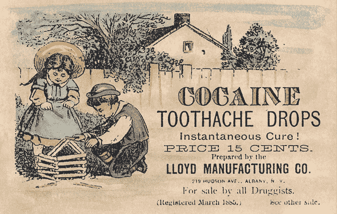

# 保持活力

在第二章中，我们考虑了因跌倒、烧伤、意外中毒以及其他看似平常的小事故而导致严重伤害的惊人高概率，这些事故通常发生在家中。现在，在处理了其他一些应急准备话题后，是时候更详细地回到这个话题，看看是否能在不削减生活乐趣的情况下减少这些风险。

当然，考虑到每天充斥着关于“致命婴儿床”、脑食菌和充满工业毒素的狗玩具等令人沮丧的头条新闻，再去激起模糊的存在焦虑没有任何益处。我们需要一种方式来穿越 24 小时新闻的噪音，集中注意力在真正的日常风险上——以及那些能够产生实际改变的行动。为了让问题更易处理，也许最有价值的启发式方法是审视我们自己的行为，而不是担心命运的捉弄或他人不可避免的错误。我们或许无法躲避偶尔掉落的钢琴，也无法消除所有的分心驾驶者，但我们肯定可以在走在人行道上或开车时放下*自己的*手机。

另一个有用的筛选标准是根据习惯的效用来分类。一些冒险行为，比如过马路，可能是完全不可避免的，因此不值得过多考虑。其他危险的行为，比如休闲潜水或参加“戴通纳 500”，可能在我们的控制范围内，但回报相当值得，能带来真正的快乐，或者未来提供财富的机会。但是，一些风险完全没有生产性，既没有实际需求，也没有任何有意义的回报。一个明显的例子就是爬上不稳的办公椅，而不是去另一个房间取一个结实的凳子。节省的时间和精力没有实际意义，而可避免的跌倒——通常发生在很低的高度和熟悉的环境中——每年因造成的伤害数量，往往与车祸相媲美。^(1)

拥有这两项行为评估技巧——专注于自己，并考虑风险与回报——让我们来看一下如何在不牺牲生活中的自发性和冒险精神的同时，消除常见的危险。

## 防御性驾驶

开车被广泛认为是一项危险的活动；然而，鲜为人知的是，我们自己的驾驶习惯在很大程度上加剧了这一问题。1981 年，斯德哥尔摩大学的奥拉·斯文森（Ola Svenson）发表了一项开创性的研究，显示超过 80%的驾驶者认为自己比大多数人开得更好——这在数学上是不可能的。^(2) 就像许多在心理学中经常引用的研究一样，样本量很小，表述也不精确，但在随后的几年里，由保险公司进行的研究广泛证实了这一结果：我们大多数人似乎认为别人开得更差，应该为事故负责。

也许这种现象的原因是，当我们坐上驾驶座时，我们能看到陌生人犯下的数百个小错误，但我们几乎从不知道是什么原因导致他们的笨拙；而技能差是最容易想到的解释。相反，当我们犯错时，总有某种不可抗力来为此辩解：突如其来的分心、一天的工作压力、赶着去不能错过的约会。换句话说，不是缺乏技能，而是环境因素让我们失误。

当然，这种普遍存在的优越感是虚幻的：仅在美国，每年就有 600 万次碰撞、300 万人受伤，约 38,000 人死亡，^(3) 交通事故并不是不熟练的少数人的问题。更重要的是，美国超过一半的致命车祸只涉及一辆车，这意味着没有其他人需要承担责任。在这种情况下，驾驶者往往只是没有掌握转弯技巧，撞上了树或掉进了沟里。

几乎所有的车祸都是可以预防的——通常是通过大家已经理解的方式，只是这些方法可能被社会习俗或政治因素所模糊。超速就是一个完美的例子。在许多情况下，适度的超速并不是特别危险，而过于热衷的限速执法常被广泛认为是个伪装，旨在填充市政预算并为当地警察提供娱乐。然而，在夏季熟悉的高速公路上可以安全驾驶的行为，在寒冷冬季的蜿蜒乡村道路上却可能是致命的。

至于超速的回报，它往往微乎其微。在高速公路上，以超过限速 10 英里/小时的速度行驶，需要一个小时才能弥补在加油站或红绿灯处等待几分钟的时间。这并不是说超速永远不能辩解。在良好的天气条件下，跟随交通流动通常是最安全的选择，而且在许多地区，这样的速度通常比路边的标志所示速度要快。但在狭窄的城市道路上或者不可预测的乡村道路上猛踩油门，或是在恶劣天气导致能见度差或牵引力差时进行激烈驾驶，都是采取不必要风险的典型例子。

说到恶劣天气，冬季驾驶本身就是一项极其危险的任务。部分原因是熟悉感削弱了风险意识：城市和郊区街道在大部分季节都很好，但只需一个温暖的白天，随后是一个寒冷的夜晚，交通量不大，就足以形成滑冰层。每当路面看起来有丝毫可疑时，都应该格外小心。可以通过在平坦或上坡的路段刹车来测试牵引力，前提是附近没有其他交通，也没有明显的其他危险。随着时间的推移，这种实验可以让你更好地了解哪些条件最具风险。在任何转弯之前提前减速也很重要，特别是下坡或通过高架桥时。直线滑行通常不会带来灾难，但如果前轮转向时失去牵引力，可能会导致车辆剧烈旋转。

关于不涉及滑出道路的情况，交叉路口的事故占据了很多痛苦和灾难的原因。^(4) 只需要一个司机错过停车标志或加速通过“长黄灯”，就能将许多其他人置于危险之中。因此，在接近交叉路口时，保持高度怀疑的态度是一个好习惯，在能见度差或其他驾驶员意图不明时，仔细观察道路并轻轻减速。

变道是另一个令人惊讶的危险行为，通常做得太快且不够小心。在高速行驶时，如果你的盲区内夹住了另一辆车，可能会导致你的车打转。由于错误是不可避免的，缓慢地进行变道，以便其他驾驶员有时间对你的错误作出反应，总是一个明智的选择。能见度也很重要：除了始终回头观察，侧视镜的正确调整至关重要，但却经常被忽视。许多新手司机认为他们需要看到车身的侧面，认为这对平行停车和类似的难题有帮助。但实际上，你总是可以通过转动头部来获得正确的视角；对于正常驾驶，侧视镜应该调整到尽量减少盲区。

尾随是另一个不良习惯，尤其在习惯了拥堵城市街道的城市驾驶者中更为常见，在那里一些不太讲究的个体有时会看到空隙就插队。在城市道路上，保持前方空间可能是一个可以容忍的风险，但在高速行驶时，这就是一种愚蠢的行为。并不是说高速追尾碰撞只是更致命，而是如果路上有动物或杂物，前方的车辆可能会突然避让，但你直到太晚才看到危险。一个好的经验法则是，保持与前车至少 2 到 3 秒的间隔，天气不好时则需要更长的时间。

最后，手机在驾驶时是一个特殊的隐患。研究反复表明，从事电话交谈的司机和酒后驾驶的人一样危险，^(5)表现为反应迟缓并做出不良决策。关键是，无论是使用手持手机还是免提设备，效果几乎相同。影响似乎来自于认知负担——试图维持与一个不了解路况的人进行对话，而不是由于手上占用了一个物体。从这个角度来看，要求使用免提设备的法律似乎没有什么意义；最好完全避免在车内打电话或发短信。如果真的紧急，可以随时停车。否则，或许可以等一小时左右。

## 高空作业

很少有人认为更换灯泡或挂圣诞灯是特别危险的活动。然而，正如本章前面所提到的，跌倒在导致严重伤害和死亡的原因中与车祸并驾齐驱。

致命的跌倒主要与老年人相关。50 岁以后，骨密度趋于下降，到退休年龄时，即使是看似无害的跌倒也可能导致严重伤害。^(6) 其中最为显著的是髋部骨折，这使得许多幸存者不得不进入临终关怀。^(7) 尽管如此，把跌倒相关的伤害仅仅视为老年人的问题是一种错误的看法。非致命性的跌倒始终排名几乎所有年龄段中可预防住院的主要原因。^(8)

与你预期的相反，危险通常并不来自于与地面的距离；涉及较大高度的跌倒伤害相对较少。举个例子，每年在美国，约有 160,000 起涉及梯子的住院病例，其中大部分发生在不到 10 英尺的高度。当然，跳下椅子或踏步梯对于身强力壮的人来说几乎没有风险，但许多此类事故的特点是，它们不允许我们稳稳地着陆。横向跌倒，可能撞到栏杆、人行道、或家里的家具，很容易导致可怕的复合性骨折或严重的颈部或头部伤害，通常会给受害者带来终生的后遗症。

这并不是说我们需要时刻担心脚离地的危险；只是我们应该认识到高空作业本身就是一项危险活动，并据此进行规划。避免爬上不稳的家具，比如办公椅或摇晃的橱柜，确实有帮助。同样，使用梯子时，要确保梯子完全稳定并且设置在合适的角度。如果无法做到这一点，可以使用绳索或带子将梯子固定住，或者请其他人帮忙。穿着合适的鞋子和耐用的工作手套，以防止滑倒，也是明智的做法。

除了梯子，单户住宅的屋顶也享有特殊的恶名。做屋顶工人是美国最危险的职业之一，远远超过消防员和警察。^(9) 尽管如此，许多房主还是难免会想爬上屋顶——清理水槽、做小修理或拿回丢失的玩具。这个主意不太好！由于典型屋顶的坡度，如果开始滑回去，很难找到抓握点；如果失去平衡，也同样难以重新站稳。实际上，任何一个失足都可能导致几乎可以确定的摔落。尽量避免爬屋顶，但如果必须这样做，可以考虑使用一条横跨屋顶并固定在另一侧的绳子和一个便宜的安全带。你还可以穿上专为屋顶工作设计的带钉鞋和护膝。

## 药柜中的敌人

中毒是导致非故意伤害和死亡的三大最重要原因中的最后一项——也许令人惊讶的是，它们很少涉及变质或受污染的食物。对于儿童来说，一些事故是由于不小心摄入家庭化学品或物品（如手表电池）所致；但对于所有年龄段的人群，处方药占据了大部分的痛苦。

在过去的几十年里，鸦片类药物的危害已经超越了所有其他药物的影响——这与这些物质广泛的治疗应用以及随着时间推移逐渐形成的耐药性和生理依赖性有关。根据国家药物使用与健康调查，2015 年约有三分之一的美国人曾获得鸦片类药物的处方。^(10) 虽然大多数使用者未遭遇严重后果，但调查估计，每年约有 1000 万人在美国因滥用鸦片类药物而陷入困境。滥用常常以悲剧告终；这种类型的药物占据了约三分之二的所有药物过量死亡。^(11)

许多因素使人们容易成瘾——贫困、失业、压力、使用其他非法药物的历史^(12)——但并不是处于这些脆弱群体之外就能保证安全。最终，鸦片类药物成瘾的流行不一定是避免使用某种药物的理由，尤其是在这种药物能帮助缓解严重疼痛时，但它应该促使我们对这种药物保持尊重，并在可能的情况下寻找较为安全的替代方案。同样重要的是要认识到，鸦片类药物的戒断可能会对即便是负责任使用这种药物的人造成令人痛苦的副作用，这使得医生和患者很难判断是否仍然需要开具处方，或者是否可以安全地逐渐减少使用。

许多其他处方药也具有滥用和伤害的潜力，包括一些抗抑郁药、镇静剂、注意力缺陷多动症药物等。或许不太为人所知的是，非精神活性非处方药也可能相当危险。在这种情况下，扑热息痛尤其值得注意。这种流行的止痛药具有相对狭窄的治疗指数，也就是说，帮助剂量和有害剂量之间的差距很小。扑热息痛在儿童服用 3 至 5 克和成人服用 7 至 10 克的剂量下，可能会引发严重的肝损伤。考虑到普通药片的含量在 500 到 650 毫克之间，这看起来似乎不多，但由于许多“感冒和流感”药片、糖浆和粉末也含有扑热息痛，因此在尝试组合多种产品来应对特别严重的流感时，意外过量是可能发生的。总的来说，扑热息痛的过量每年导致美国约 50,000 人次急诊就诊和 500 人死亡。^(13) 其他同样有效的止痛药，如布洛芬、萘普生，甚至是备受诟病的阿司匹林，^(*) 对大多数人来说，似乎具有更好的安全边际。

这并不意味着我们应该将药箱里的所有药物丢弃，并且忍受每次发烧或剧烈头痛的折磨。但了解我们服用的药物并避免过度依赖风险是值得的。

## 酒精与娱乐性毒品

历史上，社会对药物的态度一直在极端之间摇摆不定。在美国，这种对比尤为鲜明。在 19 世纪，几乎所有主要城市都有鸦片馆，庸医推销含有海洛因的药物，而可卡因则可以直接从 Sears 和 Roebuck 目录中订购。图 9-1 展示了其中一种面向儿童的产品广告。

不断增长的毒瘾流行最终引发了公众的强烈反应和联邦政府的严厉打压：1909 年的《烟草鸦片排除法》和 1914 年的《哈里森麻醉品税法》。禁酒运动也从这场危机中大获裨益，帮助推动了 1919 年通过第 18 修正案——禁止制造、销售和运输酒精饮品的法律。^(14)

图 9-1：一张 1885 年左右的可卡因儿童牙痛药广告卡片

在随后的几十年里，禁酒失败彻底消耗了反毒活动家的社会资本，为 1960 年代以毒品、性与音乐为驱动力的嬉皮士运动铺平了道路。该运动反过来引发了一场道德恐慌，促成了尼克松时代的禁毒战争，之后在里根政府时期，由于可卡因滥用和城市犯罪激增，该运动得到了进一步扩展。

今天，毒品政策的钟摆又一次向自由化倾斜。在短短几年内，大多数州都要么合法化了大麻，要么取消了相关的刑事处罚。合法化其他致幻物质的倡议也在逐渐增多，其中俄勒冈州在 2020 年率先合法化了迷幻蘑菇。很难知道这个国家是否正在达到稳定的平衡，还是未来的世代将再次决定，毒品使用所带来的社会问题超过其好处。但如果不深入探讨这些政策的长期利弊，有一点是明确的：判断力受损仍然是判断力受损，而任何让人精神恍惚的物质都会本能地增加我们闯入麻烦或受伤的几率。

今天，酒精仍然是一个独特的威胁。理论上，大多数人都知道绝不能酒后驾驶，但遵守这一原则的情况时好时坏。酒驾约占美国所有交通死亡事故的三分之一，每年大约有一百万人因酒驾被逮捕——显然还有更多的人没有遇到交通检查^(15)。但所选的毒品并不重要。即便是相对安全的大麻，甚至当使用者决定呆在家里看《Sabrina Teenage Witch》（《女巫萨布丽娜》）而不是在城里乱开车时，受伤的风险仍然高于之前。醉酒时，人们更容易忘记炉子里的食物，点燃蜡烛并放错地方，或者对突发的紧急情况作出不当反应。

毒品和酒精使用的另一个危险不那么显而易见。即使没有生理上的成瘾，当某些物质成为日常放松、缓解压力和娱乐的一种方式时，它们也容易让人成瘾。到那时，人们可能很难清楚地思考这些行为对职业、爱好或人际关系的影响。

我并不是要宣扬偶尔喝一杯酒的危险。大多数饮酒者不会变成酒鬼，大多数止痛药使用者不会上瘾，大多数吸食大麻的人也不会变成“大麻成瘾者”。但物质依赖是一种隐秘且难以预测的敌人。避免这种风险的最稳妥方法就是减少使用。其实不依赖化学物质，我们就能轻松地变得有趣、与朋友建立联系，或是玩得开心——因此，娱乐性药物也可以被看作是另一种无益的风险。

## 工作坊和电动工具安全

木工和 DIY 家装是美国最受欢迎的爱好之一。尽管可靠的统计数据难以获取，但根据一项行业调查，大约有 1700 万美国家庭从事某种形式的木工艺术^(16)。与更为田园化的爱好，如剪贴簿制作和缝纫相比，车库里的娱乐活动往往涉及大型电动工具，并且存在显著的风险。

进行安全工作坊管理的任务可能会因为信息过载而变得困难。我们生活在一个锤子和马桶吸盘都带有警告标签的时代，而每个烤面包机的说明书也会花几页纸告诉我们不要咬电线，并提醒我们吐出的烤面包可能很热。翻过安全说明书已成为一种自然的本能——即使是最勤奋的读者，也可能很难区分真正的危险和那些合规官员为避免消费者可能起诉公司而过度保护的内容。

值得庆幸的是，关于车间伤害的统计数据在这个国家得到了相当好的跟踪。它们也描绘出了一个清晰的图景：在常见的车库工具中，台锯无疑是最危险的，约占每年 40,000 次住院治疗和 4,000 次截肢事件的来源。^17 这些伤害通常从材料卡住旋转锯片的后部并剧烈移动开始。被弹出的工件本身就可能造成伤害，但一个更严重的问题是，操作员的手突然只推到空气中，可能会在没有反应时间的情况下与锯片接触。下意识地抓住滑脱的工件可能会使情况变得更糟。幸运的是，解决台锯问题的基本方法很简单：始终使用推动棒或滑架，将双手远离危险区域，不与加工件直接接触。

另一个常见的车库工具，也因导致严重伤害而闻名的，是角磨机。角磨机的脆性砂轮以极高的速度旋转，过度使用时可能会破裂——有时甚至没有任何明显的原因。这种破裂会将锋利且迅速移动的碎片飞向操作员的面部或附近的人。面罩，或者至少是防冲击安全眼镜，是必备的。保持砂轮平面远离身体，并正确安置防护罩也有助于防止伤害。

许多其他的电动工具也值得深深敬畏；例如，平刨机、接合机、斜切锯、路由器和车床，每年因其导致数以万计的人员伤残而广为人知。类似地，许多可怕的伤害和死亡事件也与户外设备有关，如割草机、吹雪机、木材粉碎机和链锯。当操作这些设备时，务必遵循所有适用的安全提示。如果说明书过于晦涩难懂，可以在互联网上查找可靠的教程和事故报告。也许最普遍的安全原则可以借鉴自枪械世界：当使用那些可能在转瞬之间造成伤害的工具时，务必确保至少需要两件事情同时发生，才能造成任何严重伤害。

除了手指和双臂，听力和视力也值得保护。显而易见，佩戴眼镜在使用任何腐蚀性化学品时应该成为一种习惯，在进行任何可能飞溅碎片或工具损坏的机械操作时也应如此。听力保护则更难推广，因为伤害通常是渐进的，并且没有痛感。许多人直到开始有问题理解周围人的话时，才意识到听力的损害程度。耳罩是任何电动工具使用时的好选择，尤其是在使用那些超响的工具时：台锯、电锯、刨床、钉枪等。

## 住宅防火

懒惰编剧的标志之一就是每个虚构的房屋火灾都必须夺去一条生命，或者让不幸的受害者在最后一刻被救出。事实上，家庭火灾很常见，但致命火灾相对较少。每年死亡人数大约为 2,500 人，^(18)其中许多案件涉及非常年幼的孩子、醉酒的人和虚弱的老年人。严重烧伤和吸入烟雾的伤害更为普遍，但与本章其他讨论的原因相比，依然算得上微不足道。尽管如此，火灾依然是一个值得关注的话题：即使所有居民都幸免于身体伤害，失去家园的心理创伤也可能需要很长时间才能愈合——而灾难发生的几率实际上是我们可以控制的。

如本书前文所示，大部分家庭火灾发生在厨房，那里经常会有食物无人看管在烤箱里，或者易燃物品可能被放置在炉灶旁边或周围。保持厨房整洁，不在热源附近存放塑料或纸板是一个好习惯；同样，设置一个响亮的闹钟以帮助掌握烘焙或慢炖食物时的时间也是一个好习惯。

工作中的火警报警器和合理大小的灭火器是明智的投资。对于误报警报，可以通过更换为光电传感器或仅仅将传感器移到远离厨房的位置来处理。与孩子们谈论逃生路线是另一种低成本的风险管理策略。孩子们比成年人更脆弱，在遭遇创伤经历时也更难进行推理；他们应该知道，如果他们撕下窗户纱窗逃出房间，我们不会生他们的气。

此外，审视你的日常习惯和环境，检查是否有其他容易引发火灾的地方也是明智的做法。空间加热器就是一个臭名昭著的罪魁祸首，特别是当它们放置在不平整或杂乱的表面上时。疏于维护的电器也是如此，比如通风口被堆积多年的棉絮堵塞的干衣机，或者损坏或过载的插座和延长线。最后，蜡烛、香烟和可吸食的毒品虽然只占所有火灾的相对较小比例，却造成了不成比例的死亡，尤其是在使用者睡着的时候。

除了房屋内部的威胁，农村房产所有者应考虑在自家庭院周围建立一个防御空间。通常的建议是在房屋周围保持一个约 30 英尺的区域，避免有易燃物质，如松树、干草、树叶和灌木；然后在大约 100 英尺的范围内，适度稀疏植物，清除所有易燃杂物。这些措施可以大大减少火焰的强度，从而提高房屋在烟雾散去后仍能屹立的几率。

## 家庭内外的其他危险

许多其他伤害在急诊室统计中占有重要位置，但未被列为本书的重点讨论内容。有些伤害实在不够严重，值得过度担忧：例如，在厨房里，割伤经常发生，有时需要缝合甚至神经修复——但除了音乐会钢琴家或其他少数需要顶级精细运动技能的职业外，从长远来看，这些伤害并不重要。

还有一些潜伏在家中的危险是严重的，但很难控制。例如，窒息是婴幼儿和老年人的主要风险，但有效的减轻措施——除了学习海姆立克急救法——是很难找到的。同样，窒息和溺水是婴儿和幼儿常见的死亡原因；后者可以通过让幼儿远离后院游泳池并教他们游泳来部分管理，但许多其他干预措施效果有限。例如，消费者类型的婴儿氧气监测器可能是伪科学，是浪费你辛苦赚来的钱。^(19)

当然，提供一个涵盖所有可能与每种生活方式相关的危险的全面汇编是很难的。每个人面临的危险都是独特的，从摩托车骑士到狂热的跳伞者，再到毒蛇爱好者。本文中列举的例子指向一些最常见的危害以及最普遍的应对风险的方法。然而，和往常一样，这些只是帮助制定个性化行动计划的垫脚石。
