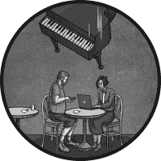

# 18

燃料与电力

能源对我们的生活很重要，但与水、食物和卫生相比，它并不是那么紧急。在短期内，我们通常可以在没有电力、汽油或天然气的情况下过得相当好。虽然我们可以避免因临时停电或燃料危机带来的偶尔不便，但通常并不需要制定过于复杂的应对计划。让家电在一周的停电中持续运转的花费，远远高于偶尔丢掉一两次坏掉的冰箱食物的成本。

当然，在某些情况下，这种说法并不成立。即便是充满精美鱼子酱的冰箱，另一个更严肃的例子是那些依赖必须始终插电使用的救命医疗设备的家庭，或者那些需要保存日常使用的易腐药品的家庭。但在一般情况下，整个房屋的发电机或离网储能的回报是无法满足需求的，这使得追求能源独立成为富人的有趣爱好，而对于普通家庭来说却是一项不明智的开支。

随着电池和太阳能板价格每年下降，这种情况最终会发生变化。在此之前，我们可以看看一些更具成本效益的方法，来应对在家中遭遇能源需求中断时的困境。

## 保持照明

在停电期间，照明往往是最迫切的需求。我们习惯了在日落后很晚才睡觉，很难一下子改变这种习惯。同样重要的是，即使在白天，许多家庭的某些地方，如浴室、衣橱、阁楼或地下室，缺乏足够的自然光。

一些家庭仍然采用传统的方法，储备蜡烛以备紧急使用，但在当今时代，这无疑是一种不必要的火灾风险。电池驱动的手电筒是更实用的选择；碱性电池以每个大约 20 美分的价格批量购买，可以储存 5 到 10 年，且一对 AA 电池可以轻松提供 100 小时的照明。现代手电筒没有脆弱的灯泡容易烧坏或破碎，因此比过去的技术更耐用。

在购买紧急情况用的手电筒时，重要的是要注意，更多的流明并不自动意味着更好的选择。在大多数情况下，没必要拥有那种刺眼的光束，照亮整个天空，并且一天消耗一箱电池。在室内，10 到 20 流明的光亮就足够用于大多数家庭工作。在户外，约 200 流明足以用来巡视后院或进行夜间徒步旅行。只有较大的乡村物业的业主，才可能从 1000 流明或更多的光亮中获益——而且这仅仅是用于调查数百码外的动静。

还需要注意的是，传统的手持设备形式并不总是最佳选择。携带手电筒会占用一只手，妨碍许多家庭琐事的操作。对于阅读、用餐或做饭来说，可以放在桌上或柜台上的全向性灯笼更为方便。头灯也非常好用，但它们有个缺点，就是会让站在你面前的人眼睛受伤——因此，尽管用户非常喜欢它们，但它们可能并不会得到其他家庭成员或朋友的认可。

手电筒和其他电子设备的备用电池应存放在阴凉、干燥的地方，以延长其保质期。最好将碱性电池从任何不需要随时启动的电子设备中取出，因为无论制造商如何承诺，电池有时会发生腐蚀性泄漏，泄漏出的氢氧化钾会损坏设备中的金属接触点和印刷电路板。如果设备必须与电池一起存放，最好使用稍微贵一些但不易漏液的锂电池。这些电池有多种专用尺寸，比如 18650 或 CR123，也有适配碱性 AA、AAA 和 9V 电池的型号（可以寻找 Energizer Ultimate 品牌）。另一种选择是定期检查并更换已安装的电池，因为电池老化时泄漏的可能性增加。在这种模式下，最好在设备中存放电池一年后就将其丢弃。

## 为小型电子设备供电

在停电期间，能够与朋友或亲戚联系、关注当地头条新闻，并从电力公司获得及时更新是非常重要的。在第二十二章中，我们将探讨如果传统的通信网络失败该怎么办，但在大多数情况下，保持与外界联系的障碍并没有那么严重。最近的手机信号塔或电信办公室可能有备用电源，或者可能本来就不在停电范围内。在这种情况下，只要有办法给手机或笔记本电脑充电，或者有办法为路由器供电，可能就是你所需要的，足以让你上网查看每天必看的搞笑猫视频和在 Twitter 或 Facebook 上彼此争执的人。

正如预期的那样，许多发电解决方案都被推销给生存主义者。从手摇发电机到可折叠太阳能电池板，这些产品的可靠性和性能通常较差。与其在这些花哨的产品上花钱，不如对于那些拥有车辆的人，最直接的选择是通过汽车的配件插座为任何电池供电的设备充电。这个方法效率不是特别高，但在大多数情况下，它完全足够：仅仅是汽车的电池就能保持典型手机充电好几周。根据油箱中的燃油量，启动引擎还可以显著延长电池的使用时间。

当然，快速充电是一回事，但为了给路由器供电而让汽车空转数天则显得非常浪费。对于需要持续插电的设备，一个受欢迎的替代方案是锂离子电力站，这些电力站通常由中国制造，并且在美国市场上以至少十几个短命品牌的形式销售。但这项技术也有一个陷阱：价格实惠的设备通常电量非常少——大约 200 瓦时，勉强足以让一台典型的笔记本电脑工作一个下午，或者让微波炉工作大约 10 分钟左右。

高容量设备更好，但价格可能超过 1000 美元，因此对于热衷 DIY 的人来说，一个更经济的选择是购买一块普通的汽车电池，将其充满电，并在需要时与一个基本的 120V 逆变器配合使用。这样的设备应该可以提供大约 800 瓦时的电量，价格不到 200 美元；而且还可以通过增加更多电池轻松扩展。唯一的缺点是铅酸汽车电池非常重，因此不适合随时携带。

然而，无论是碱性电池、铅酸电池还是锂离子电池，在家中随意存放电池总是有限度的。对于更为重要或长期的需求，一台小型汽油发电机是最佳选择；这种发电机每加仑汽油可以提供大约 5000 到 6000 瓦时的电量。与电力站一样，市场上有无数的选择，但由于发电机是一种相对复杂且稍有危险的设备，最好还是选择知名品牌。Honda EU2200i 和 Yamaha EF2000iS 被认为是最顶级的选择。Champion、Westinghouse 和 Generac 等品牌的便宜发电机也因其质量保证而享有良好声誉。

如果你决定购买一台便携式发电机，那么燃料存储值得好好考虑。在大多数情况下，保持大约 10 到 15 加仑的燃料是合理的最大值，这样既不太可能引起当局的愤怒，也不会在泄漏时造成严重问题。但即使是这种适度的数量，你也应该小心避免造成不必要的火灾风险。汽油蒸汽较重，能传播较远的距离，因此燃料需要存放在合适的容器中，放在空气流通良好的地方，远离任何火源——包括热水器、洗衣机、干衣机以及其他常见于车库附近的家电设备。如果可能的话，最好考虑将燃料存储在后院的小棚子或其他独立建筑中；合适的金属罐比便宜的塑料桶更为理想。

汽油确实会随着时间的推移而变质，但这种变质主要发生在与氧气和水分接触时。因此，在每次使用后按照制造商的指示排空发电机非常重要（这也是为什么一些小型燃油草坪工具，如除草机，在存放几个月后拿出来时通常不太可靠）。

另一方面，正确封闭、满满装的汽油容器储存的汽油，通常比城市传闻中说的要保持得更久。为了避免湿气带来的问题，最好在可以加注无乙醇汽油的地方使用这种汽油。可以通过使用燃料稳定剂如 STA-BIL 或 PRI-G 来限制氧化。在采取这些预防措施后，燃料可以轻松储存一年或更长时间——尽管偶尔轮换燃料仍然明智，最简单的方式就是将其加到你车的油箱里。最好在油箱未完全空的情况下进行；将其与新鲜汽油混合可以最小化上路时出现任何问题的可能性，尽管这种情况极不可能发生。

## 保持温暖

当停电时，你通常的供暖方式可能会停止工作。听起来可能比实际情况要糟糕。寒冷的天气对困在户外的人来说可能是严重的危险，但在你家里的安全环境下，因失去供暖而遭受严重伤害的可能性相当小——前提是你手头有足够的食物和衣物。即使在极端情况下，用一些保温材料遮盖窗户，然后集中待在一个房间里通常就足够了。保暖内衣、暖帽和一些额外的毯子可能是冬季准备中最重要的物品。

另一方面，面对寒冷并不是停用公共设施时唯一的关注点。如果房子内部的温度长时间降到冰点以下，水管中的水可能会结冰并导致管道破裂。一个简单的解决办法是让水龙头稍微打开，允许来自主管道的稍微温暖的水持续流经管道。即使液体最终冻结，缓慢的水流也可能减轻部分压力并打乱结晶的形成。在独立住宅中，也可以预先关闭水源并通过打开一个低处的水龙头来排空系统，尽管失去自来水通常不是一个好选择。

某些类型的闭路供暖系统中使用的水可能会带来一些麻烦。为了避免麻烦，一些房主选择在他们的水暖系统或间接热水器中加入抑制剂甘油。甘油会降低混合液的冰点，使其在某些情况下，尤其是在户外气温经常降到 10°F 以下的地区，成为一项值得的举措。长时间停电时排空系统也许是最后的选择——尽管这样会使供暖系统停用，直到重新加满水并适当排气为止。

由于零下温度对室内管道的风险，最好有备用的加热来源。某些房屋，特别是寒冷地区的房屋，可能配备了两种或更多独立的加热设备，比如燃气壁炉和电加热板。对于没有足够备用加热设备的家庭，可以使用价格便宜的室内安全设备，如液化石油气供能的 Mr. Heater 来填补这一空白。这些加热器可以使用一次性 1 磅的露营气瓶，也可以通过合适的软管使用标准的 15 到 20 磅液化石油气罐（尽管将这样的气瓶带入室内应是最后的选择）。当然，任何便携式加热器都需要非常小心使用，并远离易燃物品。添加一个电池供电的一氧化碳检测器也是明智的选择。

## 保持凉爽

停电期间失去空调看似是一个不太严重的问题，但令人惊讶的是，热浪造成的死亡人数远高于寒冷天气。这是因为在大多数情况下，管理中暑比保持温暖要困难。中暑的警告信号也不那么明显。为了避免在异常炎热的日子里出问题，应该密切关注水分补充。正如第十五章所提到的，每天可能需要多达四到八夸脱的水来弥补由于出汗造成的水分流失，而我们并不总是有强烈的饮水欲望。减少食量也有益，因为这样能减缓新陈代谢，给我们的身体更多的空间来调节体温。

当我们感到炎热时，通常喜欢站在轻微的微风中或风扇前。较少被理解的是，在这种情况下，主要的降温机制不是空气的流动，而是我们皮肤上汗水的蒸发。水蒸发需要惊人的能量，这一过程可以使表面温度下降 20°F 或更多。因此，携带一个装满水的喷雾瓶来喷洒皮肤、头发或衣物，可以在保持凉爽方面起到很大作用。

当湿度足够低时，同样的原理使得*沼泽冷却器*能够发挥作用：一种简单的电气设备，主要由风扇和水湿垫组成。与真正的空调相比，沼泽冷却器所需的电力很少，且可以通过小型发电机或较大的移动电源轻松操作。但需要注意的是，它们只有在湿度低于 40%左右时才有效；在湿润气候中，它们几乎不起作用，甚至可能使情况更糟。

## 做饭

在停电时，你的炉灶可能成为另一个牺牲品——但在许多情况下，放弃它可能是明智的选择。做饭是任何应急计划中的一个有益补充，但只有当它带来快乐和简便时才有意义，而不是成为额外的束缚。换句话说，你的生存计划不应该依赖于做意大利面或慢炖牛排的能力，而是可以将这些活动作为点亮单调而充满压力的一天的方式。

鉴于此，在停电期间，最简单的烹饪方式是拥有一种备用方案，使用与常规炉灶不同的能源。对于燃气灶的用户，解决方案可能是便携式电热板；而对于电磁炉用户，答案可能是一个使用丙烷或丁烷的露营炉。

与发电类似，许多其他替代方案也被生存主义者推广，但追求新奇通常没有太大意义。例如，Sterno 罐的能量密度远低于丙烷，而便携式木炭炉在室内使用显然不安全——部分原因是它们产生的烟雾和一氧化碳量。

对于许多家庭来说，在户外烹饪是另一种选择，但在决定这一计划之前，需要仔细评估其弊端。一方面，停电通常伴随着不利天气，因此应该对太阳能烤箱的效用提出质疑——同样，暴风雨中摆弄烤架也可能是个问题。烤架或露营炉的效率也低得多，因此需要存储更多的燃料，才能达到与露营炉相同的效果。在乡村地区，柴火可能很丰富，尽管收集起来可能比较费力；而在典型的郊区，试图砍伐公共树木可能会让你进监狱，因此，现实地评估可用的燃料来源至关重要。

## 出行

并不需要全球燃料危机加剧，才会导致加油站关闭。简单的停电就足以停止油泵，且没有实际的办法将汽油从地下储油罐转移出去。唉，当谈到交通问题时，并没有快速解决的办法。尤其是在美国的大部分偏远地区，几乎没有替代驾车的方式——而且如前所述，建立大规模的燃料储备会带来显著的法律和环境风险。拥有一辆离网的太阳能电动汽车是许多预备者的梦想，且这种梦想对于富裕家庭来说越来越有可能实现——但以高达五位数的价格标签来看，对大多数人来说，仍然很难接受。

对于汽油动力车辆的车主来说，在危机中保持流动性的最实际方法是养成始终保持油箱至少半满的习惯。尽管这会使加油站访问的频率翻倍，但这只是一个小障碍——尤其是在油量减少时，加油的时间会变得更短。这些备用燃料的续航范围可以安全地纳入任何撤离计划。

当开车不可行时——无论是因为你没有车，还是在规划一个燃料可能耗尽或道路可能无法通行的时刻——自行车可能是一个值得且经济的准备，至少在天气良好的日子里。滑板车或电动滑板车也可以使用，前提是你生活在一个没有太多丘陵且道路保养良好的地方。如果你选择步行出行，沙滩车可以让你更容易携带任何笨重物品。然而，在大多数情况下，最好假设在重大灾难或燃料危机中，你无法远行或移动太远——并相应地做好规划。

## 超越短期停电的思考

本章提出的方法在那些相对短暂且局部的情况中是合理的。实际上，我们正在制定一个为期一周的区域性停电的应对方案，而不是应对可能导致整个电网瘫痪几个月的太阳耀斑。这种偏向不仅仅是对概率的反映；它源于这样一种观察：在更为深刻的大灾难中，能源问题不再仅仅是日常任务，比如保持灯光亮起或重新加热餐食。

在一个长期且全球性的危机中，工业生产、市政公用设施和食品分配的广泛中断将使其他更基本的需求——如食物和水——成为战略的重中之重。这些需求无法通过太阳能板或用遮篷覆盖的油桶来解决。相反，你必须回归基础，依赖本书其他部分所讨论的物资和策略。
