## **1**

**存储介质概述**


本章提供了 PC 总线系统、常见大容量存储介质、物理连接器和接口的概述，并介绍了用于与附加存储设备通信的低级协议命令。它还为理解本书其余部分中描述的存储介质的取证获取提供了背景。

一般来说，大容量存储技术分为三大类：磁性介质、非易失性存储器（闪存）和光学介质。存储介质可以集成到设备中，也可以是可拆卸的。设备还包含与介质接口所需的驱动电子组件。系统通过内部或外部总线或接口访问存储设备。

本章首先概述这三种存储技术，并简要介绍与数字取证相关的关键点。最后两节描述了这些存储设备如何连接并与 Linux 系统进行通信，我还讨论了对取证审查员特别感兴趣的项目。

本章主要关注现代 PC 架构和组件。曾经流行的老旧技术可能会提到，但不会深入讨论。我还将本概述限制在小型服务器环境和个人（员工、家庭用户等）使用的计算机设备上，而不会涉及大型企业技术。大型企业环境中的存储技术通常不适合传统磁盘介质的取证成像；在某些情况下，由于存储空间的庞大，传统的获取方法不可行，而企业级的关键系统通常无法像小型 PC 系统那样下线。

### **磁性存储介质**

磁性介质是三种基本存储技术中最古老的一种（之前是纸带和打孔卡片），并且目前在容量上处于领先地位。当前使用的两种主要磁性存储介质类型是硬盘和磁带；这两者都为在线存储和离线归档存储提供了高容量和高可靠性。

**注意**

*磁盘和固态硬盘（SSD）之间的容量竞争正在加剧。在本书编写过程中，宣布发布了一款 16TB 的 SSD，并且一旦发布，它可能成为全球容量最大的磁盘。*

#### ***硬盘***

硬盘一贯提供比其他介质（如 SSD 或光盘）更高的容量。截至目前，10TB 硬盘已经在消费者市场上有售，并且预计会有更大容量的硬盘发布。

硬盘由涂有磁性材料的旋转盘片构成，如图 1-1 所示。多个盘片堆叠在主轴上，读写磁头通过一个可移动的臂（*执行器*）从磁性表面读取/写入编码数据。目前，常见的硬盘外形尺寸包括 3.5 英寸、2.5 英寸和 1.8 英寸。由于硬盘是机械设备，它们对震动、跌落、灰尘、湿气和其他环境因素非常敏感。典型的硬盘故障包括划伤的盘片表面、卡住或损坏的磁头、电机故障和电子电路故障。

硬盘的真实物理几何结构（磁头、盘片、磁道、每个磁道的扇区）对计算机进行了抽象，并通过逻辑块地址（LBA）作为一系列扇区进行访问。扇区是用于读写数据的最小可寻址磁盘单元。历史上，标准的物理硬盘扇区大小为 512 字节；然而，现代硬盘已转向 4K 扇区大小。大多数当前的硬盘仍提供 512 字节的扇区大小仿真，但具有原生 4K 扇区大小（称为 4Kn 硬盘）的驱动器已经上市。使用 4Kn 硬盘具有性能优势，未来它们可能会取代传统的 512 字节仿真硬盘。有关 4Kn 硬盘驱动器的更多细节，请参阅“高级格式 4Kn”，见第 41 页。

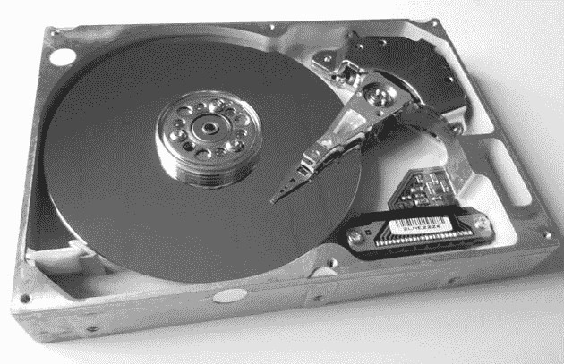

*图 1-1：磁性硬盘*

传统的计算机取证起源于需要分析硬盘，而硬盘至今仍然是重要的证据来源。特别是，当操作系统“删除”文件时，它只是取消了对磁盘上数据块的引用（与固态硬盘不同，固态硬盘使用 TRIM 命令清除未分配的块）。这些数据块并不会从磁性盘片中删除，而是保留在磁盘上，取证工具可以恢复它们（直到它们被覆盖）。

#### ***磁带***

磁带在家庭用户市场中的使用几乎已经消失，但小型企业和企业环境仍然使用磁带进行备份和归档。如图 1-2 所示，磁带是早期数字存储形式之一，并且有着成熟技术的声誉，可靠用于长期离线存储。与磁盘、固态硬盘/闪存或光盘不同，磁带只能按顺序读取或写入数据。在磁带上随机访问不同的块，需要用户将磁带倒带或快进到所需的位置才能进行读取或写入。这种缺乏随机块访问的特性使得磁带无法作为常规文件系统使用。数据以磁带文件的序列存储在磁带上；每个文件通常是一个包含文件系统或文件和目录组的归档文件（使用诸如 TAR、DUMP 等归档格式）。磁带驱动器使用 SCSI 磁带命令来控制读写数据、定位或倒带磁带，并弹出磁带。

**注意**

*更新的线性磁带开放（LTO）驱动器可以通过线性磁带文件系统（LTFS）模拟常规文件系统，但这仍然不是随机访问，文件依然是按顺序读取和写入的。*

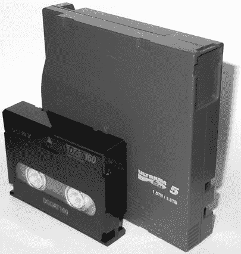

*图 1-2：磁带*

以下是 Fibre Channel LTO5 磁带驱动器和 USB DAT160 磁带驱动器的示例；它们都连接到 Linux 系统上。磁带驱动器的 dmesg 输出如下所示：

```
[   11.290176] scsi 1:0:0:0: Sequential-Access TANDBERG LTO-5 HH
    Y629 PQ: 0 ANSI: 6
[   11.293554] scsi 1:0:0:0: Attached scsi generic sg5 type 1
[   11.345030] st: Version 20101219, fixed bufsize 32768, s/g segs 256
[   11.361189] st 1:0:0:0: Attached scsi tape st0
...
[ 3263.575014] usb 1-8: new high-speed USB device number 14 using xhci_hcd
[ 3263.703245] usb 1-8: New USB device found, idVendor=03f0, idProduct=0225
[ 3263.703250] usb 1-8: New USB device strings: Mfr=1, Product=2, SerialNumber=3
[ 3263.703253] usb 1-8: Product: DAT160 USB Tape
[ 3263.703255] usb 1-8: Manufacturer: Hewlett Packard
[ 3263.703257] usb 1-8: SerialNumber: 48553101234E4648
[ 3263.704156] usb-storage 1-8:1.0: USB Mass Storage device detected
[ 3263.704295] scsi host12: usb-storage 1-8:1.0
[ 3264.713397] scsi 12:0:0:0: Sequential-Access HP       DAT160
    WU8A PQ: 0 ANSI: 3
[ 3264.722279] st 12:0:0:0: Attached scsi tape st1
```

一旦磁带归档文件被写入，*数据结束（EOD）*标记也会写入磁带。这通知驱动器磁带数据已经结束，防止驱动器继续读取。 然而，从取证的角度来看，EOD 标记之后的任何数据都值得关注，因为它可能包含先前磁带写入的数据。没有通用的 SCSI 命令可以获取 EOD 标记之后的数据。需要专用的磁带驱动器和设备来完成此任务。

#### ***传统磁存储***

许多传统的磁性存储类型，尤其是在可移动介质中，仍然存在。软盘经历了多个世代的发展后最终被淘汰。一些专有存储产品，如 Jaz、Zip、Syquest 等，在 80 年代和 90 年代曾在市场上广受欢迎。许多种类的磁带已不再使用，例如 4mm DAT、8mm Exabyte 和 QIC。这些存储类型的取证获取超出了本书的讨论范围。然而，如果有功能正常的硬件和接口，您可以使用本书中描述的相同技术获取这些较旧设备上的数据。如果 Linux 内核能够识别基于扇区的介质并将其作为块设备提供，您就可以进行获取。如果 Linux 内核识别磁带驱动器为 SCSI 磁带设备，您可以使用标准 SCSI 磁带命令进行访问。对于专有存储，可能会有内核驱动或用户空间工具，这些工具可以为您提供访问传统存储产品的能力。

### **非易失性内存**

非易失性内存，通常使用 NAND 闪存技术，正在逐渐普及，并开始在不需要非常大容量的情况下替代磁性硬盘。（*NAND*指的是作为逻辑 NAND 门工作的晶体管。）这种类型的内存给取证调查员带来了新的挑战，因为它不具备与磁盘相同的低级特性。^(1)

SSD 和闪存媒体通常基于 NAND 存储，并且没有活动部件。数据存储在一组内存单元中，抽象层*闪存翻译层（FTL）*使得硬盘的行为像硬盘一样，表现为一系列线性的扇区。由于非易失性存储磁盘是通过电路实现的，而不是机械的，因此它们无声、功耗低，并且不像硬盘那样容易受到物理损坏。在性能方面，它们可以更快地随机访问和写入数据，因为没有物理磁头在硬盘上寻找位置。（这也意味着碎片整理文件系统并没有性能上的优势。）SSD/闪存驱动器中的内存寿命不如硬盘中的磁性盘片。采用一些方法，如磨损均衡和过度配置，用于延长 SSD 媒体的使用寿命。*磨损均衡*指的是将读取和写入操作均匀分布到整个硬盘的机制，确保在硬盘的使用寿命内块得到均匀使用。随着块的老化或无法写入，它们会被 FTL 移除，并由一池保留（过度配置）块替换。这些“退役”块可以通过移除（拆焊）物理芯片并读取内存来进行读取。一些专业的取证实验室会执行这一过程，有时称为*芯片取出*，用于各种基于闪存的存储设备。制造过程中对块的过度配置可以占用闪存磁盘的 10%到 25%（用户无法访问）。目前，有一个开源的 SSD 固件项目，对于学习和研究 SSD 技术非常有用。你可以在* [`www.openssd-project.org/wiki/The_OpenSSD_Project`](http://www.openssd-project.org/wiki/The_OpenSSD_Project) *上找到更多信息。

#### ***固态硬盘（SSD）***

如图 1-3 所示，SSD 被设计为常规 SATA 磁盘的直接替代品。（*SATA*，或称为*串行 ATA 连接*，是磁盘的标准接口。）SSD 具有标准的 SATA 接口和自监控、分析与报告技术（SMART）功能，并使用常规的 ATA 命令（带有一些扩展）。即使是常见消费级 SSD 的物理形态，也与磁性硬盘相同。较新的 SSD 给数字取证检查员带来了几个挑战，部分原因在于可能从磁盘上的未分配扇区恢复数据，部分原因则是无法访问过度配置的区域。支持 ATA TRIM 命令的 SSD 设备和操作系统可能会在下次使用前擦除未分配的磁盘块（SSD 块必须在写入或修改之前被擦除）。这减少了从未分配块中恢复数据的可能性，而这些未分配块通常是磁性硬盘上宝贵的证据来源。

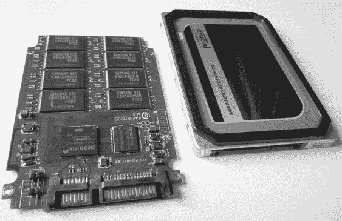

*图 1-3: 固态硬盘（SSD）*

你可以使用`hdparm`命令来确定 SSD 支持的 TRIM 功能。例如：

```
# hdparm -I /dev/sda
...
Commands/features:
        Enabled Supported:
...
        * Data Set Management TRIM supported (limit 1 block)
        * Deterministic read data after TRIM
...
```

现代一代 SSD，基于名为 SATA Express 和 NVM Express 的新标准，直接与 PCI Express 总线接口。

#### ***USB 闪存驱动器***

小型便携式 USB 闪存驱动器，如图 1-4 所示，有许多名称：U 盘、USB 闪存棒、闪存狗条，或者仅称为 USB 闪存驱动器。闪存驱动器最初成为软盘的替代品，并且由于其低价和大容量，现在正在取代 CD 和 DVD。

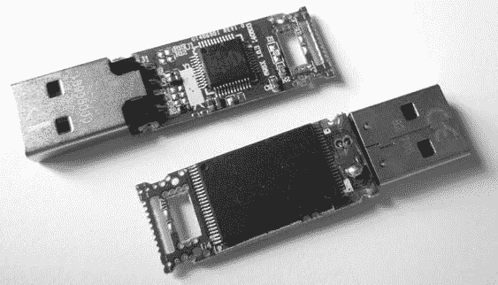

*图 1-4：USB 闪存驱动器*

但 USB 闪存驱动器的小尺寸和大容量使其成为信息安全的风险。因此，大多数供应商提供涉及加密的安全解决方案。最常见的加密是基于软件的，并且是可选的。驱动器的所有者必须明确安装供应商提供的加密软件（或者使用替代软件，如 BitLocker 或 TrueCrypt）。一些 USB 闪存驱动器提供强制性的基于硬件的加密系统。然而，软件加密的附加工作和复杂性，以及硬件加密显著更高的成本，阻碍了其广泛使用。未加密的普通 USB 设备仍然是最常用的。

#### ***可移动存储卡***

移动设备的流行，如手机、平板电脑、相机等，创造了一个可移动存储卡的市场，你可以在它们满了或复制到 PC 或其他设备时交换这些卡。图 1-5 展示了各种存储卡。这些通常是基于闪存的，当它们放入读卡器时，呈现出类似硬盘的线性扇区序列。

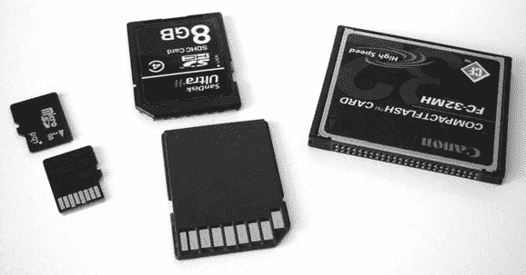

*图 1-5：闪存卡*

最常见的存储卡是安全数字（SD）标准，它有多种外形和速度。CompactFlash（CF）卡在高端摄影设备中很受欢迎，本质上是 PATA/IDE 接口，并具有更小的外形。你可以使用 PATA/IDE 接口适配器访问它。通过 USB 连接的卡读卡器可以访问这两种类型的存储卡（见图 1-6）。

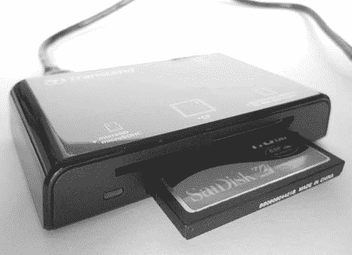

*图 1-6：USB 读卡器*

**注意**

并行 ATA（PATA）*和*集成驱动电子（IDE）*是定义驱动器与计算机系统之间并行接口的旧标准。*

#### ***传统非易失性存储***

随着市场对其最大容量或专有接口失去兴趣，许多传统内存卡已变得过时。一些例子包括索尼记忆棒、松下 P2 卡、SmartMedia 卡和其他 PCMCIA/PC 卡介质。通常，这些内存卡会作为块设备连接到 Linux 系统，具有线性顺序的扇区，你可以使用与其他内存卡相同的技术对其进行映像（如果有物理读卡器）。

### **光学存储介质**

当前常用的光盘存储介质包括 CD-ROM、DVD-ROM 和蓝光光盘。不同类型的光学媒介在物理和化学性质上有所不同。它们的可见差异在图 1-7 中展示。

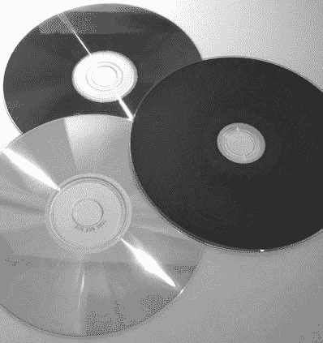

*图 1-7：从上到下：DVD-ROM、蓝光、CD-ROM*

光盘通常有只读、一次写入或可读写类型。专业制作的光盘是通过压模制作，而不是通过刻录。尽管它们正在慢慢变得过时，可写光盘仍然是数字证据的常见来源。许多法医实验室仍然使用它们来传输和存储压缩的法医图像。

一张光盘包含一个单一的螺旋轨道，轨道上有一系列*凹坑*和*高地*，这些可以被激光读取并解读为数据位。数据通过激光在表面烧录点，影响反射率，从而使烧录的区域被解读为数据位。这些位序列被分为扇区，经过编码和错误校正后，包含 2048 字节的用户可访问数据。

光盘与磁带有一个相似之处：数据是以单一的线性字节串写入的——文件不会被碎片化。与磁带不同，光盘可以轻松跳转到磁盘的随机位置，这使得将光盘挂载为只读文件系统成为可能。然而，写入光盘仍然是繁琐的，并且像磁带一样，必须按字节的顺序顺序进行写入。

#### ***紧凑光盘***

作为三种光盘中最古老的一种，CD-ROM/CDR 光盘曾是家庭用户备份、个人档案存储和信息交换最流行的光学媒介。但随着方便且大容量的 USB 闪存驱动器的使用日益普及，光盘在存储上的使用逐渐减少。

一系列标准被称为*彩虹书*，描述了各种 CD 规格，存在许多常见的 CD 标准。（有关更多信息，请参阅飞利浦知识产权页面 *[`www.ip.philips.com/licensing/program/16/`](http://www.ip.philips.com/licensing/program/16/)*）

• 音乐 CD，或称紧凑光盘-数字音频（CD-DA），按照*红皮书*和 IEC 60908 标准进行规范。此格式中的数据被划分为多个音频轨道。

• 数据 CD，或称紧凑光盘-只读存储（CD-ROM），在*黄皮书*、ISO/IEC 10149 和 ECMA 130 标准中有规定 (*[`www.ecma-international.org/publications/files/ECMA-ST/Ecma-130.pdf`](http://www.ecma-international.org/publications/files/ECMA-ST/Ecma-130.pdf)*).

• 可写光盘，或称紧凑光盘-可记录/可重写（CD-R/CD-RW），属于*橙皮书*标准，允许数据写入（CD-R）或重写（CD-RW）到光盘。

• 不太常见的标准包括 Photo-CD、视频 CD（VCD）以及其他不太常见的变种、扩展和常见标准的增强版。

每张 CD 都有一条线性的比特流（坑和陆地），这些比特流被抽象为一个线性扇区序列。进一步抽象，这些扇区之上是*会话*，其中包含会话的引导区和目录表（TOC）。可以存在多会话 CD，每个会话都有自己的 TOC。

数据 CD 可以在一个会话中拥有文件系统，其中包含文件和目录结构。一些 CD-ROM 文件系统的示例包括：

**High Sierra** 最初的 PC 标准（8.3，全部大写）

**ISO9660** 更新版 High Sierra，用于跨平台

**Joliet** ISO9660 扩展；微软为 Win95 及更高版本提供

**HFS** Macintosh

**Rock Ridge** 为 POSIX 设计的 ISO9660 扩展

**El Torito** 可引导光盘标准

从法医学角度来看，整个 CD 上的用户数据都可以被读取。没有类似于磁带上的 EOD 或硬盘上的 DCO/HPA（用户不可访问区域）的等价物。但有些文件系统特定的伪像可能需要特殊分析才能解读。

法医学写保护器是专为防止篡改和污染驱动器上发现的证据而设计的硬件，对于 CD-ROM 而言是不必要的，因为其默认的只读属性。操作系统不会通过将 CD 放入 CD 驱动器并访问它来更新时间戳或修改 CD 上的数据。

CD 确实有一些独特的标识符，在法医学背景下非常有用。*源唯一标识符（SID）* 被印刻在光盘上，包含有关生产该光盘的光盘生产设施的信息。该代码以*IFPI* 开头，并被物理印刻在光盘的内圈区域（人眼可轻松读取）。*记录器标识码（RID）* 被写入光盘的系统扇区，并将烧录的 CD 与创建它的驱动器关联。没有专门硬件，RID 不容易访问。

其他物理属性，如表明盗版和伪造副本的特征，不在本书的范围内，但你可以访问国际唱片制品协会（IFPI）提供的指南，网址是* [`www.ifpi.org/content/library/manual-of-guidance-chap3-english.pdf`](http://www.ifpi.org/content/library/manual-of-guidance-chap3-english.pdf)*。

#### ***数字多功能光盘***

DVD 与 CD 在物理属性上有所不同，但在逻辑上类似。DVD 有一个单一的螺旋轨道，将比特分割成 2048 字节的扇区。

DVD 可以是单面或双面，也可以是单层或双层。增加一个面或一层会有效地将数据容量翻倍。它们与 CD 有相似的标准，但有所扩展，详见：[`www.ecma-international.org/publications/files/ECMA-ST/ECMA-382.pdf`](http://www.ecma-international.org/publications/files/ECMA-ST/ECMA-382.pdf)*。DVD-Video、DVD-ROM、DVD-R 和 DVD-RW 对应于 CD 的相应格式，但还新增了 DVD-RAM 标准。同时，DVD+R 和 DVD+RW 也有一套替代标准，它们的容量与 DVD-R 和 DVD-RW 相同，但“+”和“-”格式不兼容（尽管大多数现代驱动器可以读取两者）。

DVD 驱动器最常用的文件系统是通用磁盘格式（UDF），它被设计为 ISO9660 的包写替代方案。

#### ***蓝光光盘***

蓝光光盘（BD）采用新的物理制造工艺，进一步提高了光盘的数据容量。BD 与 CD 和 DVD 相似，依然使用螺旋数据轨道，并将数据分割为 2048 字节的扇区。

它的标准与 CD 和 DVD 有相似之处，包括 BD-ROM（只读）、BD-R（可录制）、BD-RE（可重写）、BD-XL（双倍容量可重写）。

DVD 和 BD 通过加密技术实现内容保护，这在进行取证调查时可能会导致获取受保护光盘时出现困难。虽然存在解密 DRM 保护内容的工具和方法，但这些内容超出了本书的讨论范围。

#### ***传统光学存储***

存在一些传统的光学驱动器，尤其是基于卡带的只写多次读取（WORM）驱动器。传统光学驱动器在企业环境中使用较为广泛，通常使用 SCSI 接口，且可以作为线性扇区序列访问。如果驱动器和兼容的控制卡仍然可用，并且 Linux 内核识别该介质，你可以像处理其他光盘一样读取和分析该介质。

### **接口和物理连接器**

在本节中，我将从取证检查员的角度概述常见的驱动器接口。一个在设备齐全的取证实验室工作的取证检查员，可以通过多种设备接口获取和分析存储介质。

计算机领域（尤其是存储接口）的一个普遍趋势是，从并行和共享总线转向串行点对点连接。PATA/IDE，曾是一个流行的并行接口，两个硬盘共享一根电缆，现已被 SATA 取代，SATA 将一个硬盘连接在串行电缆上。SCSI 曾是一个并行共享总线，支持多个硬盘，现在已经被 SAS 替代，每个硬盘都有独立的串行连接器。最初的 PCI 总线是并行的，多个接口卡共享同一个总线，但它已被 PCI Express 取代，后者是一个串行总线，每个接口都有专用通道（还用于连接 SATA Express 和 NVM Express 驱动器）。并行打印机接口已被 USB 取代（USB 是一个串行协议，但使用共享总线）。随着传输速度的提高，管理并行电信号的时序变得越来越困难。通过专用串行线路进行数据的序列化/反序列化使得传输速度比管理多个并行数据线路的协调更快。

#### ***串行 ATA***

当前最流行的内部存储介质接口是 SATA。在 PC 内部，大多数硬盘、SSD 和光驱都连接到主板或附加主机总线适配器上的 SATA 接口。SATA 的串行架构已取代了并行 ATA（PATA 或 IDE），后者曾是主流的消费级硬盘接口。

SATA 标准由串行 ATA 国际组织管理（*[`www.sata-io.org/`](http://www.sata-io.org/)*）。当前是 3 版，SATA 提供最高 6Gbps 的速度（1 版和 2 版的速度分别为 1.5Gbps 和 3.0Gbps）。除了内部接口外，还有一个外部接口（eSATA），允许你直接连接外部 SATA 硬盘。图 1-8 展示了 SATA 接口。

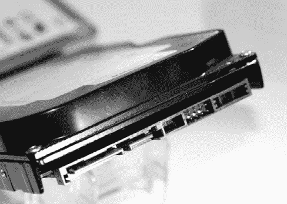

*图 1-8：SATA 硬盘接口*

更小的表单因子，迷你 SATA（mSATA），是为小型便携设备设计的。mSATA，如图 1-9 所示，允许小型 SSD SATA 驱动器直接连接到主板，无需单独的 SATA 电缆。

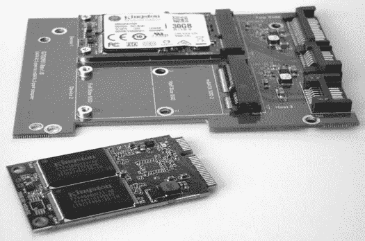

*图 1-9：mSATA 硬盘接口*

主板通常允许你以高级主机控制器接口（AHCI）模式或 IDE 模式安装 SATA 硬盘。AHCI 在此定义了一个标准的 SATA 适配器接口：*[`www.intel.com/content/dam/www/public/us/en/documents/technical-specifications/serial-ata-ahci-spec-rev1-3-1.pdf`](http://www.intel.com/content/dam/www/public/us/en/documents/technical-specifications/serial-ata-ahci-spec-rev1-3-1.pdf)*。IDE 模式为不支持 AHCI 标准的旧操作系统（例如旧版 Windows XP）提供传统的磁盘接口。你使用的模式不会影响取证图像的加密哈希值。你可以在 IDE 模式下将硬盘从目标 PC 中取出，在 AHCI 模式下连接到检查机，并在不丢失数据或修改数据的情况下进行采集。

另一种接口是 micro SATA（不要与 mSATA 混淆），如图 1-10 所示。它是为 1.8 英寸磁盘驱动器和瘦型 CD/DVD 播放器设计的，但如今使用较少。你可以将常规 SATA 写保护器与各种适配器结合使用，以获取 mSATA 和 micro SATA 驱动器。

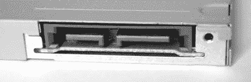

*图 1-10：Micro SATA 磁盘接口*

一种越来越流行的更先进的外形因子是 M.2 接口，如图 4-4 所示。M.2 接口随着 SATA 3.2 规格的推出而出现，提供了两种标准于一个接口中。M.2 卡可以使用 AHCI/SATA 或 NVMHCI/NVME 接口，具体取决于兼容性要求。在使用 M.2 卡时，请务必确认卡使用的是哪种接口（截至目前，市场上大多数 M.2 卡使用 ACHI/SATA 模式）。

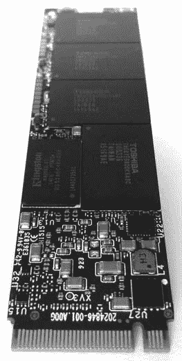

*图 1-11：M.2 磁盘接口*

SATA Express 磁盘接口，如图 1-12 所示，消除了 SATA 协议栈的多个层次，使存储（主要是 SSD）能够直接连接到 PCI Express 总线。这些驱动器继续使用 AHCI 标准，并且与 NVME 不同。

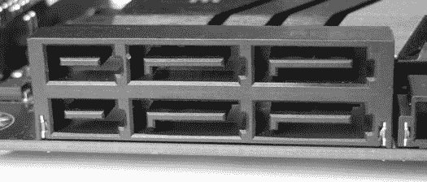

*图 1-12：SATA Express 磁盘接口*

SATA 3.2 规格支持两个 PCI Express 通道，提供 16Gbps 的 SATA Express 速度。存在用于 PCI 和 M.2 基础的 SATA Express 驱动器的写保护器。

#### ***串行附加 SCSI 和光纤通道***

并行 SCSI 接口在消费市场和企业市场中已基本消失。SATA 已在消费市场中取而代之，而*串行附加 SCSI（SAS）*和*光纤通道（FC）*则在企业市场中取代了它。SAS 接口的物理连接器，如图 1-13 所示，允许 SAS 和 SATA 磁盘连接并在 SAS 背板上访问。SAS 磁盘驱动器的物理连接器与 SATA 磁盘的连接器略有不同，并且提供各种扇出连接器以将多个磁盘连接到主机总线适配器。当前 SAS-3 磁盘的速度为 12Gbps，是 SATA-3 的两倍。SAS-4 将提供 22.5Gbps 的速度。

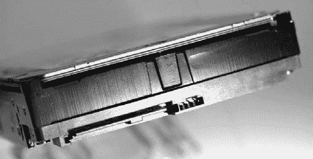

*图 1-13：SAS 磁盘接口*

一个 Mini-SAS HD 4i 插座连接器如图 1-14 所示。

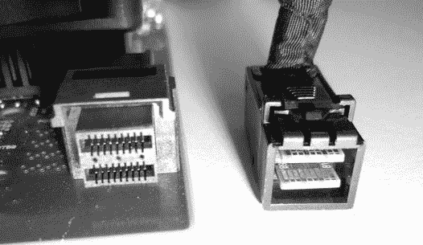

*图 1-14：SFF-8632/Mini-SAS HD 接口*

SAS 标准由国际信息技术标准委员会（INCITS）的 T10 技术委员会维护。目前的标准文档是《串行附加 SCSI-3（SAS-3）INCITS 519-2014》。更多信息，包括即将发布的标准草案，可在*[`t10.org/`](http://t10.org/)*网站获取。

SAS 驱动器不能连接到 SATA 主机总线适配器，成像 SAS 磁盘需要使用单独的 SAS 写保护器。

光纤通道接口通常用于连接企业存储阵列。图 1-15 展示了铜基和光纤基的光纤通道连接器。

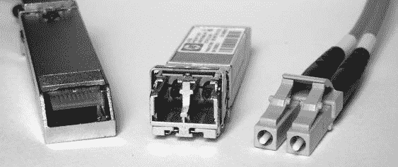

*图 1-15：光纤通道接口*

带有集成光纤通道接口的硬盘正逐渐成为过时的技术，已被 SAS 驱动器大量取代。截至目前，市场上尚未有用于光纤通道磁盘接口的硬件写保护器。

#### ***非易失性存储器快车***

*非易失性存储器快车（NVME）* 是从零开始设计的，作为替代基于 AHCI 的 SATA 驱动器接口。它旨在直接连接到 PCI Express 总线，从而消除了对 AHCI/SATA 主机总线适配器的需求，省去了与 SATA 物理接口和协议层相关的复杂性。NVME 架构特别专注于 SSD 存储，并创建了一个更简单、更高效的命令集。NVME 设备可以直接插入主板的 PCIE 插槽，使用 M.2 接口的 PCIE NVMe 模式，或通过 U.2（SFF-8639）接口连接。

物理接口直接连接到 PCIE 总线，如 图 1-16 所示。

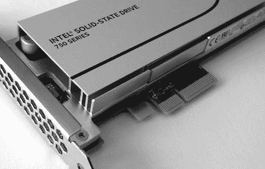

*图 1-16：带有 PCIE 接口的 NVME SSD*

也有 M.2 或下一代外形因素（NGFF）版本可供选择。这些通常直接插入主板的 M.2 插槽，或者通过使用 PCIE 插槽适配卡，两者都支持 NVME 模式（而非 AHCI/SATA 模式）。目前，大多数 M.2 SSD 硬盘是 AHCI/SATA 模式，而非 NVME，但由于 NVME 的性能优势，未来这种情况可能会发生变化。图 1-17 展示了一款 NVME M.2 硬盘。

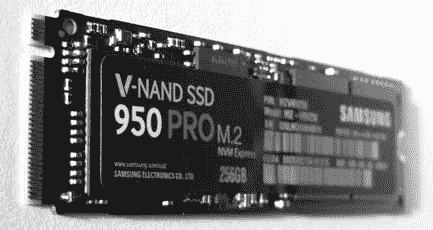

*图 1-17：带有 M.2 接口的 NVME SSD*

NVME U.2 接口（见 图 1-18）允许传统 2.5 英寸物理外形的硬盘通过电缆或背板连接。U.2（SFF-8639）接口和电缆（机械上类似于 SAS，但有额外的针脚用于 PCIE 通道）将硬盘外壳连接到 M.2 适配器上的 mini-SAS HD 插头，而该适配器则连接到主板上。

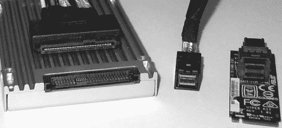

*图 1-18：带有 U.2 接口的 2.5 英寸 SSD、U.2 到 mini-SAS HD 电缆和用于主板的 mini-SAS HD 到 M.2 适配器*

NVME 磁盘无法通过典型的 SCSI 或 SATA 命令工具查看，因为它们不使用 SCSI 或 SATA 命令。设计用于与 ATA 或 SCSI 磁盘接口交互的 Linux 工具通常无法与 NVME 磁盘兼容，且需要额外的支持以确保兼容性。NVME 磁盘的设备名称不是我们熟悉的 */dev/sd** 文件，而是 */dev/nvme*n**。NVME 设备通过一个附加的 `namespace` 编号来创建。该命名空间（以 *n* 表示）是 NVME 硬盘上操作系统以下的空间分配层级。*/dev/nvme*n** 磁盘设备是块设备，在应用到 Linux 设备文件时应能正常工作。例如，以下是 Sleuth Kit `mmls` 命令在 NVME 磁盘上执行的示例：

```
# mmls /dev/nvme0n1
DOS Partition Table
Offset Sector: 0
Units are in 512-byte sectors

     Slot    Start        End          Length       Description
00:  Meta    0000000000   0000000000   0000000001   Primary Table (#0)
01:  -----   0000000000   0000002047   0000002048   Unallocated
02:  00:00   0000002048   0781422767   0781420720   Linux (0x83)
#
```

截至目前，NVME 的使用相对较新，Tableau 刚刚创建了首个支持 NVME 的 PCI Express 法医硬件写保护器。由于在 PCIE 总线上拦截 NVME 命令的难度，使得写保护器的价格昂贵且实现复杂。有关更多信息，请参阅我的论文《NVM Express 驱动器与数字法医学》，该论文详细讨论了这一挑战。^(2)

#### ***通用串行总线***

USB 被创建的目的是整合并取代老旧的外部外围接口，如 RS-232、并行打印机接口、PS/2 键盘和鼠标以及其他专有的 PC 接口。它的设计考虑了多用途的功能支持，如磁盘、键盘、鼠标、声音、网络连接、打印机和扫描仪，以及连接的小型设备（如手机等）。越来越多的物联网（IoT）设备可以通过 USB 连接到 PC，并且可能包含作为法医证据的有用数据。由于本书的重点是对大容量存储设备的法医采集，因此我将把讨论限定于 USB 大容量存储设备。

闪存驱动器、光驱、一些磁带驱动器，甚至磁性硬盘（参见 图 1-19）可能会将 USB 接口直接集成到驱动器电子组件中。USB 大容量存储类的最常见应用是消费者使用的 USB 闪存盘或拇指盘，以及外置硬盘盒。

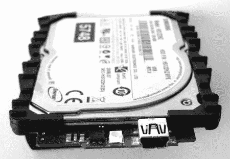

*图 1-19：集成 USB 接口的 1.8 英寸磁性硬盘*

原始的 USB 协议用于大容量存储设备类别，称为 Bulk-Only Transport (BOT)。BOT 是当前最常见的 USB 传输协议；然而，随着磁盘速度的提高以及 USB3 的到来，BOT 协议正成为瓶颈，可能会被 USB 附加 SCSI 协议（UASP）所取代。类似于 SATA 的 AHCI，USB 也为主机控制器接口定义了标准。可扩展主机控制器接口（xHCI）取代了多个较老的 USB 标准（特别是 OHCI、UHCI 和 EHCI）。其规范可以在 *[`www.intel.com/content/dam/www/public/us/en/documents/technical-specifications/extensible-host-controler-interface-usb-xhci.pdf`](http://www.intel.com/content/dam/www/public/us/en/documents/technical-specifications/extensible-host-controler-interface-usb-xhci.pdf)* 上找到。

最新的 USB 3.1 接口是 Type C，如 图 1-20 所示。Type C 接口具有多功能性，可用于 USB 3.1 设备和 Thunderbolt 3 设备，并可用作电源供应。物理插头是可逆的，这意味着在插入系统时，它没有上或下之分。

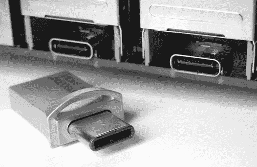

*图 1-20：USB Type C 接口*

外部 USB 磁盘外壳通常包含一个或多个 SATA 驱动器。如果可行，你应当拆卸 SATA 磁盘以直接访问 ATA 接口。这可以让你直接查询驱动器接口，并且在某些情况下可能带来性能优势（例如，包含 SATA 磁盘的 USB 2.0 外壳）。

专门为成像 USB 设备设计的法医写入阻止器已经存在，可以用于具有集成 USB 接口的驱动器（无论是闪存驱动器还是其他驱动器）。

#### ***Thunderbolt***

Thunderbolt 是由 Apple 和 Intel 联合开发的高速外部接口，用于通过单一接口连接磁盘、视频显示器和 PCI Express 设备（参见 图 1-21）。其代号为 Light Peak，最初计划作为光纤连接。物理接口在 Thunderbolt 1 和 Thunderbolt 2 中使用 Mini DisplayPort，而在 Thunderbolt 3 中则过渡为 USB Type C 电缆和连接器。Apple 在 Thunderbolt 的普及上发挥了重要作用（尤其是在 Apple 用户中），通过 Apple 硬件进行推广。Thunderbolt 3 接口将 PCI Express、DisplayPort 和 USB3 集成到单一接口中。Thunderbolt 1、2 和 3 分别提供 10、20 和 40Gbps 的传输速度。

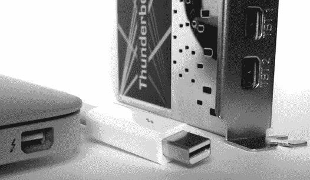

*图 1-21：Thunderbolt 接口*

对于苹果计算机系统，你可以使用*目标磁盘模式（TDM）*与 Thunderbolt 一起使用（如同 FireWire 一样），使系统表现为连接的另一个系统的外部磁盘机箱。TDM 指示苹果固件将内部磁盘作为块设备提供，可以像外部 SCSI 驱动器一样访问（在使用取证工具时非常有用）。我将在第 137 页的《苹果目标磁盘模式》中演示如何使用 TDM 进行苹果计算机的取证采集。

Thunderbolt 外部磁盘通常包含一个或多个 SATA 驱动器。在大型 Thunderbolt RAID 机箱中，该接口可能使用 SAS 控制器与多个 SATA 或 SAS 磁盘配合使用。

连接 Thunderbolt 接口的外部磁盘的 Linux dmesg 输出如下所示：

```
[   53.408619] thunderbolt 0000:05:00.0: 0:1: hotplug: scanning
[   53.408792] thunderbolt 0000:05:00.0: 0:1: is connected, link is up (state: 2)
[   53.408969] thunderbolt 0000:05:00.0: initializing Switch at 0x1 (depth: 1,
    up port: 1)
...
[   53.601118] thunderbolt 0000:05:00.0: 1: hotplug: activating pcie devices
[   53.601646] thunderbolt 0000:05:00.0: 0:6 <-> 1:2 (PCI): activating
...
[   53.602444] thunderbolt 0000:05:00.0: path activation complete
[   53.602679] pciehp 0000:04:03.0:pcie24: Card present on Slot(3-1)
[   53.609205] pciehp 0000:04:03.0:pcie24: slot(3-1): Link Up event
...
[   56.375626] ata7: SATA link up 6.0 Gbps (SStatus 133 SControl 300)
[   56.382070] ata7.00: ATA-8: ST1000LM024 HN-M101MBB, 2BA30003, max UDMA/133
[   56.382074] ata7.00: 1953525168 sectors, multi 0: LBA48 NCQ (depth 31/32), AA
[   56.388597] ata7.00: configured for UDMA/133
[   56.388820] scsi 7:0:0:0: Direct-Access     ATA      ST1000LM024 HN-M 0003 PQ: 0
    ANSI: 5
[   56.389341] sd 7:0:0:0: Attached scsi generic sg2 type 0
[   56.389342] sd 7:0:0:0: [sdc] 1953525168 512-byte logical blocks:
    (1.00 TB/931 GiB)
[   56.389345] sd 7:0:0:0: [sdc] 4096-byte physical blocks
[   56.389408] sd 7:0:0:0: [sdc] Write Protect is off
[   56.389413] sd 7:0:0:0: [sdc] Mode Sense: 00 3a 00 00
[   56.389449] sd 7:0:0:0: [sdc] Write cache: enabled, read cache: enabled, doesn't
    support DPO or FUA
[   56.403702]  sdc: [mac] sdc1 sdc2
[   56.404166] sd 7:0:0:0: [sdc] Attached SCSI disk
```

在撰写本文时，Linux 内核支持苹果计算机上的 Thunderbolt 接口。PC 主板的附加卡，如 ASUS ThunderboltEX II，不支持设备热插拔。但是，启动 PC 时将 Thunderbolt 磁盘连接上，可以让 PC 的 BIOS/固件在操作系统加载之前初始化 Thunderbolt 适配器，使外部磁盘对内核可见。

截至本文撰写时，市面上没有用于 Thunderbolt 接口的写保护器。此外，目前没有直接集成 Thunderbolt 接口的磁盘（仅有机箱）。

#### ***遗留接口***

本节不讨论计算机磁盘接口的悠久历史；而是简要介绍了最近已过时的 IDE、并行 SCSI 和 FireWire 技术。这些接口在取证调查中可能仍然具有相关性，因为可能会发现或查获作为证据的旧硬件。

IDE 接口（参见图 1-22）和增强版（EIDE）通常用于 3.5 英寸磁盘，在被 SATA 取代之前是流行的接口。

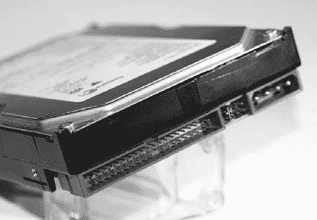

*图 1-22：IDE 磁盘接口*

迷你 IDE 接口（参见图 1-23）是为 2.5 英寸磁盘开发的，用于笔记本电脑，直到被 SATA 取代。

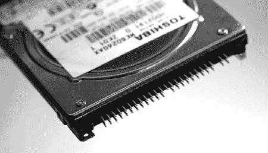

*图 1-23：迷你 IDE 磁盘接口*

微型 IDE ZIF 接口（参见图 1-24）是为 1.8 英寸硬盘在超便携笔记本和其他小型电子设备中开发的，直到被 mSATA 和 M.2 接口取代。

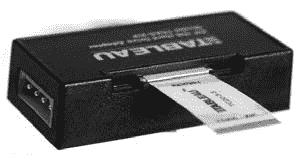

*图 1-24：微型 IDE ZIF 接口*

FireWire，或称 IEEE1394 接口（参见图 1-25），由苹果公司开发，旨在提供高速外部总线，连接视频设备和磁盘驱动器。该接口目前已主要被 Thunderbolt 和 USB3 取代。

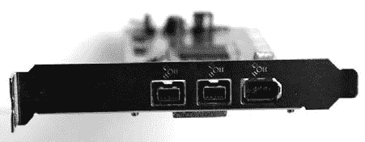

*图 1-25：Firewire 接口*

并行 SCSI 接口（参见图 1-26）在消费市场上基本消失，主要被 SATA（或在企业市场上被 SAS）取代。

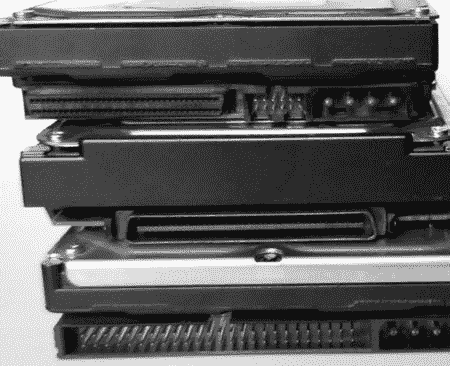

*图 1-26：SCSI 接口*

用于 IDE、SCSI 和 FireWire 的取证写入阻止器很常见，并且也适用于 mini IDE、micro IDE ZIF 以及各种 SCSI 接口适配器的适配器。

### **命令、协议和桥接**

存储设备与计算机系统之间的通信在概念上与局域网/广域网分层网络有些相似。^(3) 存储设备与计算机系统之间的通信可以类似地组织成几个抽象层。物理层由电缆、导线和电气信号组成。其上是链路层，数字比特和字节通过帧或链路层数据包有序地传输。在链路层之上，协议和命令在发送方和接收方之间交换，以请求和接收数据。在前面的部分中，我描述了物理连接和磁盘接口。这里，我将描述 ATA、SCSI 和 NVME 的更高层命令集。图 1-27 更好地展示了不同的抽象层。

#### ***ATA 命令***

当前的高级技术附件（ATA）命令最初是由美国国家标准学会（ANSI）标准演变而来的，该标准定义了磁盘驱动器的 AT 附件接口。^(4) 原始标准描述了物理接口（电缆、引脚等）、电气信号和可以发出的逻辑命令。当前的标准^(5) 描述了驱动器可能具备的功能集以及用于控制每个驱动器的 ATA 命令。ATA 包装接口（ATAPI）将一个数据包命令功能集添加到 ATA 标准中，允许额外的命令，这些命令并不特定于磁盘驱动器功能（例如，弹出媒体、封装 SCSI 命令等）。

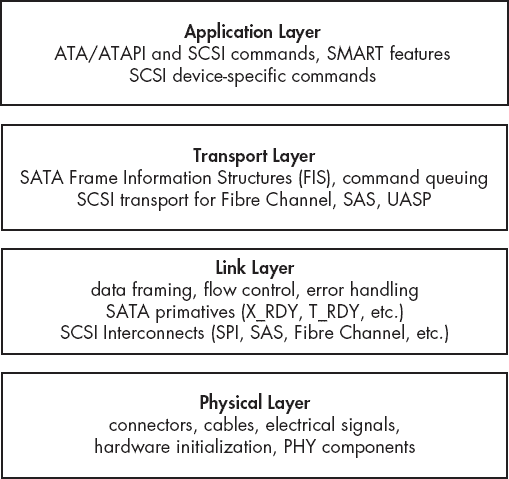

*图 1-27：应用于磁盘接口的抽象层*

ATA 命令集（ACS）定义了一组命令和参数，这些命令和参数可以加载到 ATA 寄存器中，并发送到驱动器执行。一些常见的 ATA 命令列在 表 1-1 中。

**表 1-1：** 常见的 ATA 命令

| **命令** | **命令代码** |
| --- | --- |
| 设备重置 | 08h |
| 读取扇区 | 20h |
| 写入扇区 | 30h |
| 寻址 | 70h |
| 下载微码 | 92h |
| 媒体弹出 | EDh |
| 安全解锁 | F2h |

一些 ATA 和 ATAPI 命令可以使用 hdparm 和 smartctls 工具发布。T13 (*[`t13.org/`](http://t13.org/)*) 发布了定义完整命令集的标准。你可以在 *[`sata-io.org/`](http://sata-io.org/)* 上找到更多资源。

理解 ATA/ATAPI 命令的基本操作为你提供了必要的背景知识，帮助你理解 SATA 和 IDE 取证写阻断器的工作原理（防止 ATA/ATAPI 命令修改磁盘）。了解这些命令的操作方式也能提升你对取证检查员如何查询磁盘属性并最终进行成功取证采集的理解。

#### ***SCSI 命令***

从主机总线适配器到磁盘的 SCSI 命令遵循客户端/服务器模型。主机总线适配器（HBA）是客户端或*发起者*，而磁盘是服务器或*目标*。发起者向目标发送命令（可能还附带数据），目标则返回响应（可能还附带数据）。SCSI 最初是为多种设备设计的，包括扫描仪、磁带、打印机等，而不仅仅是硬盘。因此，SCSI 具有丰富的命令集。命令通过*命令描述符块（CDB）*从发起者（HBA）发送到目标（磁盘）。CDB 是一个包含命令及其参数的数据块。目标接收 CDB，执行请求并返回响应。这个过程有些类似于基于 UDP 的请求/响应机制，在 TCP/IP 客户端/服务器架构中使用。

SCSI 命令用于从磁盘读写数据块、控制硬件（如弹出 CD 或更换磁带）、报告状态和诊断信息等。这些命令通常对终端用户隐藏，但有多种实用工具可以从用户空间发出 SCSI 命令。甚至可以使用`sg3_utils`软件包中的工具，从 Linux 命令行提交任意命令。例如，以下命令会提交一个低级的 SCSI 命令，读取 SCSI 磁盘的第一个扇区：

```
# sg_raw -r 512 /dev/sda 08 00 00 00 01 00
SCSI Status: Good

Received 512 bytes of data:
 00     00 00 00 00 00 00 00 00  00 00 00 00 00 00 00 00    ................
 10     00 00 00 00 00 00 00 00  00 00 00 00 00 00 00 00    ................
...
 1a0    00 00 00 00 00 00 00 00  00 00 00 00 00 00 00 00    ................
 1b0    00 00 00 00 00 00 00 00  00 00 00 00 00 00 00 00    ................
 1c0    02 00 ee ff ff ff 01 00  00 00 ff ff ff ff 00 00    ................
 1d0    00 00 00 00 00 00 00 00  00 00 00 00 00 00 00 00    ................
 1e0    00 00 00 00 00 00 00 00  00 00 00 00 00 00 00 00    ................
 1f0    00 00 00 00 00 00 00 00  00 00 00 00 00 00 55 aa    ..............U.
```

在此示例中，`sg_raw`接收到一个 CDB 命令，向*/dev/sda*（一块 SAS 磁盘）发送命令。第一个字节`0x08`指定了 6 字节长的 SCSI `READ`命令。随后的零指定了 LUN 和起始扇区。`0x01`指定了要读取的扇区数，`-r 512`告诉`sg_raw`显示多少字节。这个示例也应该适用于 SAS、SATA 和 USB 连接的磁盘。

SCSI 和 SAS 命令的技术标准由 INCITS（国际信息技术标准委员会）下属的技术委员会 T10 维护。你可以在* [`t10.org/`](http://t10.org/)*找到这些标准。关于 SCSI 编程的书籍有助于更好地理解 SCSI 命令协议。

理解 SAS/SCSI 命令的基本操作与本书相关。它为你提供了理解 SAS/SCSI 取证写阻断器如何工作的背景知识（防止 SAS/SCSI 命令修改磁盘）。了解 SAS/SCSI 命令的操作方式提高了你对取证检查员如何查询磁盘属性并最终执行取证采集的理解。

SCSI 命令还用于控制磁带和光学设备。

#### ***NVME 命令***

NVME 命令集是从零开始创建的，没有为现有的 SCSI 或 ATA 命令集提供向后兼容性。它的设计目的是直接支持连接到 PCI Express 总线的 SSD 介质，并利用多 CPU 并行化以及即时的 SSD 寻址时间（没有磁头移动的延迟开销）。标准的开发者还认识到，通过将驱动器直接连接到 PCIE 总线，ATA 或 SCSI 中的许多协议开销可以被消除。于是，创建了一个新的最小命令集，摆脱了传统命令或向后兼容性的要求。NVME 驱动器的性能和效率相比 SATA 或 SAS 有了显著提升。一个广泛的命令排队系统支持最多 64k 个队列，每个队列可以容纳 64k 个命令（相比之下，SATA 只有 32 个队列，每个队列只有一个命令）。

可以参考*SCSI*和*NVME*命令之间的翻译参考资料，地址为*[`nvmexpress.org/`](http://nvmexpress.org/)*。表 1-2 展示了更常见的示例。

**表 1-2：** SCSI 和 NVME 命令比较

| **SCSI** | **NVME** |
| --- | --- |
| COMPARE AND WRITE | 比较和写入 |
| READ | 读取 |
| WRITE | 写入 |
| WRITE BUFFER | 固件镜像下载，固件镜像激活 |
| INQUIRY | 识别 |
| READ CAPACITY | 识别 |
| REPORT LUNS | 识别 |
| MODE SENSE | 识别，获取功能 |
| LOG SENSE | 获取功能，获取日志页 |
| SYNCHRONIZE CACHE | 刷新 |
| FORMAT UNIT | 格式化 NVM |

磁盘设备可以通过各种总线系统和桥接器连接到 PC 系统。通过将驱动器尽可能靠近 CPU 和内存，可以提高性能。目前，驱动器可以通过使用 NVME 接口的 PCI Express 3.0 总线专用通道与 CPU 和内存连接（RAM 磁盘更快、更高效，但它们由操作系统创建，并非非易失性存储介质设备）。NVME 设备可以直接连接到 CPU，而不需要使用南桥芯片组或任何传统的磁盘协议开销，如 ATA 或 SCSI。

#### ***桥接、隧道化和透传***

ATA 和 SCSI 是与存储介质交互的两种最常见的协议。这些命令可以通过多种物理层总线或传输层发送，甚至可以通过其他协议隧道化或封装。这些复杂性对用户是透明的，附加设备可以通过 Linux 内核提供的标准块设备进行访问。

为了说明，考虑一个 SATA 硬盘插入一个独立的 USB 对接站，而这个对接站又插入到 PC 中安装的 USB3 PCI Express 卡的外部端口。硬盘接口和对接站之间的通信是较低层次的 SATA 协议，使用 SATA 帧信息结构（FIS）数据包。对接站和 USB3 卡之间的通信是较低层次的 USB 协议，使用 BOT 或 USAP。USB3 卡和 PC 之间的通信是较低层次的 PCI Express 协议，使用 PCIE 事务层数据包（TLP）和数据链路层数据包（DLLP）。最后，硬盘通过这些桥接层使用 SCSI 命令协议进行访问。在这个示例中，使用了多个物理和链路层来连接硬盘。对用户来说，硬盘看起来是直接可访问的，较低层次的协议层被隐藏或抽象化。

**注意**

*FIS 是 SATA 协议的一部分。PCI Express 有自己的一套协议，包括 TLP 和 DLLP。*

对于每种不同的物理总线，称为*PHY*（物理层）的设备促进了连接到总线的设备之间的通信（总线上的 PHY 工作方式有点像两个调制解调器通过 WAN 电缆进行通信）。PHY 将数字的 1 和 0 转换为该总线所期望的符合电气信号要求的信号。在 PHY 处理完物理层之后，链路层协议管理在总线上来回传输的比特/字节流。这个链路层将数据流组织成帧或离散的数据包，供上层处理。

存在 USB、PCIE、Thunderbolt、SAS、SATA、光纤通道等的物理层和链路层描述。通常，存在一些标准，允许通用操作系统驱动程序以与硬件无关的方式使用设备中的物理硬件。例如，USB 适配器由 xHCI 标准定义，SATA 适配器由 AHCI 标准定义，NVME 设备由 NVMHCI 标准定义（现在简称为 NVME 标准）等等。符合这些标准允许硬件在不需要额外专有驱动程序的情况下得到支持。

尽管 ATA/ATAPI 和 SCSI 是不同的命令集，但它们都支持某种程度的隧道传输和相互通过对方的命令。ATA 使用 ATAPI 接口封装 SCSI 命令，与诸如光驱、磁带驱动器以及其他理解 SCSI 命令（如弹出介质及 ATA 协议中没有的其他命令）的设备进行通信。SCSI 支持 ATA 通行，这允许 ATA 命令通过 SCSI 协议发送。SAT（SCSI-ATA 转换）在 SCSI 和 ATA 命令之间创建了双向转换，其中命令与存储介质交互。这种转换作为 Linux 内核 API 在 libata 库中实现。（libata 库，有时拼写为*libATA*，提供了与 ATA 控制器和设备接口的许多功能。）

桥接设备在法医采集中发挥着重要作用，因为它们是实现硬件写入阻止器的基础。硬件写入阻止器通常是一个能够拦截发送到磁盘的 ATA 或 SCSI 命令的桥接设备，防止这些命令修改磁盘上的扇区。

### **专题**

本节涉及与大容量存储和数字取证相关的多个专题。某些领域，例如 UASP 和 SSHD，简要讨论了它们与数字取证的相关性。其他领域，如 DCO、HPA 和 NVME 驱动器，在这里介绍，并在本书后续部分进行更详细的讨论。

#### ***DCO 和 HPA 驱动器区域***

随着 ATA/ATAPI 标准的演进，某些特性被创建以便惠及系统供应商。*主机保护区（HPA）*是在 ATA/ATAPI-4 标准中引入的，它允许系统供应商为操作系统外部使用保留磁盘的部分空间。例如，HPA 可以用于存储持久数据、系统恢复数据、休眠数据等。对这些数据的访问由系统固件控制，而非安装的操作系统。*设备配置覆盖（DCO）*特性是在 ATA/ATAPI-6 标准中引入的，它提供了控制报告的磁盘特性和容量的能力。这使得系统供应商能够从多个制造商处运输磁盘，同时在各磁盘间保持相同数量的用户可访问扇区和特性。这促进了支持和驱动器更换的简化。HPA 和 DCO 可以共存；然而，DCO 必须首先创建，然后是 HPA。

HPA 和 DCO 已被犯罪分子和恶意行为者滥用，用于隐藏非法文件和恶意代码。我在《启用对隐藏扇区的访问》中描述了如何检测和删除 HPA 和 DCO，揭示隐藏在普通用户视野中的扇区，具体见第 118 页。关于 HPA 和 DCO 在法医领域的更详细描述，请参阅论文《隐藏磁盘区域：HPA 和 DCO》。^(6) 关于国家级利用 HPA 的更多信息，可以参考* [`www.schneier.com/blog/archives/2014/02/swap_nsa_exploi.html`](https://www.schneier.com/blog/archives/2014/02/swap_nsa_exploi.html) *和* [`leaksource.files.wordpress.com/2013/12/nsa-ant-swap.jpg`](https://leaksource.files.wordpress.com/2013/12/nsa-ant-swap.jpg) *。

#### ***驱动器服务与维护区域***

硬盘的某些维护区域通常无法使用标准 Linux 工具访问。这些区域包含坏道列表和厂商服务扇区（有时称为负扇区）。要访问这些区域，你需要专门的磁盘诊断软件和硬件。我在“驱动器服务区域访问”中提供了一个访问磁盘服务区域的示例，并在第 122 页提供了一些额外的资源。不要将磁盘的服务区域与 HPA 或 DCO 混淆。你可以使用标准的 ATA 命令和方法轻松访问 HPA 和 DCO 区域，但无法访问磁盘的服务区域。

#### ***USB 附加 SCSI 协议***

USB 提供了两种访问大容量存储设备的模式：更常见的 BOT 模式和更新的 UASP 模式。随着 USB3 和 USB3.1 速度的提升，开发了一种新的、更高效的 USB 大容量存储协议，称为*USB 附加 SCSI 协议（UASP）*。这个新协议也被称为*UAS*，并且有时会使用 USB3 Boost、USB3 Turbo 或 USB3 Extreme 等产品营销别名。你可以在* [`usb.org/`](http://usb.org/)* 和 *[`t10.org/`](http://t10.org/)* 找到更多信息，这些组织共同开发了这个标准。UASP 通过提供命令排队和异步处理，并且改善任务和命令控制能力，来提高性能。

附加 UASP 支持的 USB 磁盘的 dmesg 输出使用`uas`协议进行操作：

```
[15655.838498] usb 2-6.2: new SuperSpeed USB device number 6 using xhci_hcd
...
[15655.952172] scsi host14: uas
...
[15666.978291] sd 14:0:0:0: [sdk] 3907029168 512-byte logical blocks:
    (2.00 TB/1.81 TiB)
...
[15667.033750] sd 14:0:0:0: [sdk] Attached SCSI disk
```

相比之下，使用传统 BOT USB 接口连接的相同磁盘会加载`usb-storage`协议进行操作：

```
[15767.853288] usb 2-6.2: new SuperSpeed USB device number 7 using xhci_hcd
...
[15767.918079] usb-storage 2-6.2:1.0: USB Mass Storage device detected
[15767.918195] usb-storage 2-6.2:1.0: Quirks match for vid 174c pid 55aa: 400000
[15767.918222] scsi host15: usb-storage 2-6.2:1.0
...
[15777.728944] sd 15:0:0:0: [sdk] 3907029168 512-byte logical blocks:
    (2.00 TB/1.81 TiB)
...
[15777.820171] sd 15:0:0:0: [sdk] Attached SCSI disk
```

从取证的角度来看，需要注意的是，所使用的传输协议不会影响 USB 磁盘的内容，也不会影响取证镜像的加密哈希值。实际上，使用基于 UAS 的写保护器在性能上是有优势的（例如，Tableau 的 USB3 写保护器使用的是 UAS）。

**注意**

*一句建议：当你使用 USB3 的更高速度时，USB 电缆的质量就变得非常重要。较长且质量较差的 USB3 电缆可能会在数据采集过程中产生读取错误。对于那些在专业取证实验室工作的人来说，值得投资购买短小且高质量的 USB3 电缆。*

#### ***高级格式 4Kn***

随着磁盘容量的增加，业界发现通过将磁盘从 512 字节扇区切换到 4096 字节扇区，可以提高磁盘效率。国际磁盘驱动设备与材料协会（IDEMA）为 4096 字节物理扇区制定了高级格式标准（见 *[`www.idema.org/?page_id=2369`](http://www.idema.org/?page_id=2369)*）。自 2009 年以来，硬盘制造商承诺使用 IDEMA 的高级格式标准生产 4K 扇区磁盘。即使是使用 4K 物理扇区的磁盘，今天的大多数磁盘仍然模拟 512 字节扇区，这些磁盘被称为*高级格式 512e*磁盘。那些为主机系统和操作系统提供原生 4K 大小扇区的磁盘被称为*高级格式 4Kn*磁盘。高级格式 4Kn 磁盘在低端市场仍然稀有，但在企业环境中使用广泛。对于更大容量的企业磁盘，大多数企业磁盘制造商提供两种型号：512e 和 4Kn。图 1-28 展示了 4Kn 磁盘的官方标志。

您可以在 YouTube 上找到关于高级格式和 4K 扇区的良好概述，网址为 *[`www.youtube.com/watch?v=TmH3iRLhZ-A/`](https://www.youtube.com/watch?v=TmH3iRLhZ-A/)*。

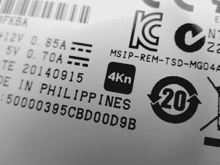

*图 1-28：高级格式 4Kn 标志*

当 Linux 内核检测到附加的磁盘时，它会显示扇区数量和逻辑扇区大小（在某些情况下，它还可能明确显示物理大小）。以下部分 dmesg 输出显示了两个相同大小的磁盘，一个是高级格式 512e，另一个是 4Kn。将 512 字节扇区的数量除以 8，或者将 4K 扇区的数量乘以 8，可以显示这两个磁盘容量相同，但扇区数不同。

```
...
[   13.605000] scsi 1:0:1:0: Direct-Access     TOSHIBA  MG03SCA300       0108 PQ: 0
    ANSI: 5
...
[   16.621880] sd 1:0:1:0: [sdb] 5860533168 512-byte logical blocks: (3.00 TB/2.73
    TiB)
...
[   14.355068] scsi 1:0:2:0: Direct-Access     ATA      TOSHIBA MG04ACA3 FP2A PQ: 0
    ANSI: 6
...
[   16.608179] sd 1:0:2:0: [sdc] 732566646 4096-byte logical blocks: (3.00 TB/2.73
    TiB)
```

在 Linux 系统上，您可以使用*/sys*伪文件系统来查找磁盘的逻辑和物理扇区大小。例如，您可以按如下方式确定附加磁盘*/dev/sda*的物理和逻辑扇区大小：

```
# dmesg
...
[   16.606585] sd 1:0:0:0: [sda] 7814037168 512-byte logical blocks: (4.00 TB/3.64
    TiB)
...
# cat /sys/block/sda/queue/logical_block_size
512
# cat /sys/block/sda/queue/physical_block_size
4096
# blockdev --getpbsz /dev/sda
4096
# blockdev --getss /dev/sda
512
```

这两种方法展示了从*/sys*伪文件系统读取（您也可以作为非根用户执行此操作）并使用`blockdev`命令。

一些 SSD 允许您使用固件工具选择物理扇区大小。例如，一些最新的英特尔 SSD 可以使用英特尔提供的命令行工具在 512 和 4096 之间切换扇区大小（* [`downloadcenter.intel.com/download/23931/`](https://downloadcenter.intel.com/download/23931/)*）。

4K 磁盘的几个方面对数字取证社区具有重要意义，并将在本节剩余部分进行讨论。一些早期的西部数据高级格式 512e 磁盘有一个跳线设置（跳线 7 和 8），用于内部偏移扇区，使默认的 XP 分区的起始位置与 4K 扇区的起始位置对齐。这个跳线设置重新对齐磁盘极大提高了性能。更改这样的扇区对齐跳线会影响取证获取哈希值，并可能影响磁盘的分析。在进行取证成像或验证磁盘时，必须使用与磁盘首次扣押时相同的跳线设置。

使用 4Kn 磁盘将影响*剩余空间*的值。RAM 剩余空间或内存剩余空间是文件最后一个扇区中未使用的部分（不要与*文件剩余空间*混淆，后者是文件系统中文件最后一个块中未使用的部分）。当你使用 4Kn 磁盘且文件系统使用 4K 块时，RAM 剩余空间和文件剩余空间是相同的。操作系统在写入之前会用零填充 4K 扇区的未使用部分，这样就消除了文件系统中 4K 块上的文件剩余空间中可能存在有用数据的可能性。

假设扇区大小为 512 字节的取证软件可能会失败，或者更糟糕的是，产生不正确的结果。当使用 4Kn 磁盘时，重要的是确认取证软件是否识别并使用 4Kn 扇区。Sleuth Kit 默认使用 512 字节扇区，必须明确告知它使用 4K 扇区来处理 4Kn 磁盘。以下示例展示了 `mmls` 默认情况下产生不正确结果，而在指定正确扇区大小时产生正确结果。

```
# mmls /dev/sde
DOS Partition Table
Offset Sector: 0
Units are in 512-byte sectors

     Slot    Start        End          Length       Description
00:  Meta    0000000000   0000000000   0000000001   Primary Table (#0)
01:  -----   0000000000   0000000255   0000000256   Unallocated
02:  00:00   0000000256   0732566645   0732566390   Linux (0x83)
03:  -----   0732566646   5860533167   5127966522   Unallocated
...
# mmls -b 4096 /dev/sde
DOS Partition Table
Offset Sector: 0
Units are in 4096-byte sectors

     Slot    Start        End          Length       Description
00:  Meta    0000000000   0000000000   0000000001   Primary Table (#0)
01:  -----   0000000000   0000000255   0000000256   Unallocated
02:  00:00   0000000256   0732566645   0732566390   Linux (0x83)
#
```

在使用 `-b` 标志指定 4096 字节扇区大小后，Linux 分区的扇区被表示为 4K 单位，磁盘末尾没有未分配区域。成功获取原生 4K 扇区磁盘的示例如“dcfldd 和 dc3dd 工具”中第 144 页所示。

高级格式 4Kn 磁盘的使用仍然不常见。目前尚不清楚 4Kn 扇区磁盘会如何影响现有的取证获取和分析软件，特别是那些基本假设扇区大小为 512 字节的取证工具。这是数字取证领域需要进一步研究的一个方向。

#### ***NVME 命名空间***

NVME 规范引入了*命名空间*的概念，允许在较低层次上对磁盘进行分区，抽象化地与普通操作系统分离。对于具有多个命名空间的磁盘进行取证成像时，必须分别对每个命名空间进行处理。你可以通过几种方式确定命名空间的数量。

通过使用 nvme-cli 工具发送识别控制器 `admin` 命令，你可以检查支持和使用的命名空间数量。以下示例显示了有关命名空间支持的各种信息：

```
# nvme id-ctrl /dev/nvme1 -H
NVME Identify Controller:
vid     : 0x144d
ssvid   : 0x144d
sn      : S2GLNCAGA04891H
mn      : Samsung SSD 950 PRO 256GB
fr      : 1B0QBXX7
...
oacs    : 0x7
  [3:3] : 0     NS Management and Attachment Not Supported
...
  [0:0] : 0x1   SMART/Health Log Page per NS Supported
...
nn      : 1
...
```

在这里，可选的管理员命令支持（OACS）表示该特定硬盘不支持命名空间管理。命名空间数量字段（`nn`）显示控制器上的命名空间数量——该设备上只有一个。

你也可以使用 nvme-cli 检查命名空间的大小，并将其与制造商的规格进行比较，如下所示：

```
# nvme id-ns  /dev/nvme0n1
NVME Identify Namespace 1:
nsze    : 0x2e9390b0
ncap    : 0x2e9390b0
nuse    : 0x2e9390b0
...
```

这里，`nsze` 指的是命名空间大小，`ncap` 是命名空间容量，`nuse` 是命名空间使用情况。如果这些值与厂商文档中的硬盘大小匹配，则确认正在使用单一命名空间。

检查是否存在多个命名空间设备的第三种方法是简单列出操作系统检测到的设备（*/dev/nvme0n2**、*/dev/nvme0n3** 等）。

截至目前，尚未有支持多命名空间的消费级硬盘可供测试。本节中的信息来源于 NVME 规范和工具文档。

#### ***固态混合硬盘***

开发了一种固态与传统磁盘的混合型硬盘，以提供更大的磁盘容量，且性能可与 SSD 相媲美，且价格更为实惠。

这些混合硬盘，被称为*固态混合硬盘（SSHDs）*，提供额外的固态缓存，缓存经常使用的扇区。SSHDs 可以完全独立于操作系统运行，或者接受操作系统的“提示”，帮助决定哪些块需要缓存。

从 SATA 3.2 起，新增了一项混合信息功能，允许主机通过 ATA 命令与混合硬盘通信缓存信息。

迄今为止，关于 SSHDs 的取证研究较少，对于数据采集的影响尚不明确。SSHDs 包含一个小型的 SSD 硬盘，必须进行磨损平衡。一个不支持 TRIM 命令的混合硬盘不太可能删除未分配文件系统块中的数据。

这里描述的混合系统内建于单个硬盘的电子元件中。也可以拥有一个由两个独立硬盘组成的混合系统：一个较小的 SSD 和一个较大的磁性硬盘。通过操作系统驱动程序或像英特尔的智能响应技术这样的专有系统，可以实现等效的混合缓存功能。

### **总结思考**

在本章中，我回顾了各种类型的存储介质——磁介质、非易失性介质和光学介质——并考察了不同的硬盘类型。我描述了将存储设备连接到检查主机系统的内部和外部接口。还解释了访问硬盘的协议，并涵盖了一些不太常见的专业主题。我从取证检查员的角度呈现了本章内容。你现在应该已建立起坚实的基础，以理解下一章关于使用 Linux 作为取证采集平台的内容。
