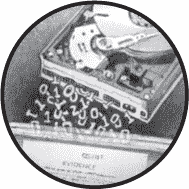

## **2**

**LINUX 作为法医采集平台**



本章描述了 Linux 作为执行数字法医采集的平台，并讨论了其各种优缺点。我还将探讨 Linux 和开源软件在数字法医界的接受度，最后一节将概述你需要理解的 Linux 基础知识，以便理解本书后续章节的内容。

本书中展示的示例主要使用的是 Ubuntu Linux Server 16.04 LTS 版本（支持至 2021 年 4 月），搭载的是 Bourne Again Shell（Bash）版本 4.3.*x*。这些示例也应该适用于其他 Linux 发行版以及其他操作系统，如 OS X 或 Windows，只要你使用相同或更新版本的工具，并调整设备名称。本书中，*命令行*、*Shell* 和 *Bash* 这几个词会互换使用。

### **Linux 和开源软件在法医领域的应用**

像 Linux 这样的*开源软件（OSS）*的日益普及使其成为执行数字取证的重要平台。许多研究人员已经讨论了使用开源软件来满足 Daubert 标准对证据可靠性的要求。^(1) Sleuth Kit 的作者 Brian Carrier 探讨了使用开源法医工具的法律论点，并建议部分法医软件（但不一定是全部）应该开源。^(2)

在法医学领域使用开源软件（OSS）的主要优势是透明性。与专有的商业软件不同，源代码可以被审查并公开验证。此外，学术研究人员可以研究它，并在社区中他人的工作基础上进行构建。开源法医学软件应用已经成为法医学研究的工具和基础构件。使用开源软件也有其缺点，以及一些情况下它的使用没有意义。特别是，开源社区的开放性在某些情况下可能与正在进行的法医调查的保密性相冲突。以下章节将讨论 Linux 和开源软件的优缺点。

#### ***Linux 和开源软件在法医学实验室中的优势***

开源软件（OSS）的公开可用性意味着它对每个人都可访问。它不局限于那些购买了许可证或签署了保密协议的人。开源软件可以被任何有兴趣的人自由下载、使用、检查和修改，且不涉及任何许可费用或使用成本。

访问源代码使你能够自定义并促进与其他软件、硬件和法医学实验室流程的集成。这种源代码级的访问增加了自动化和脚本化工作负载的可能性。自动化减少了所需的人类互动，从而降低了人为错误的风险，并释放了这些人力资源，使其可以用于其他地方。

在案件工作量大的实验室中，自动化至关重要，有助于优化和简化流程。因为可以自由修改源代码，开源软件可以根据特定法医实验室的要求进行定制。特别是命令行软件可以让你通过 Shell 脚本将多个任务和工作链接在一起，完成端到端的流程。

开源软件的支持有几个优势。即兴的社区支持可能非常优秀，邮件列表和聊天论坛可以在几分钟内回答求助请求。在某些情况下，补丁、错误修复和功能请求可以迅速实现。

Linux 和开源软件非常适合学术法医实验室环境，因为它们使用开放的、已发布的标准，而不是封闭或专有的标准。开源软件开发社区与竞争性团体是*合作*而非对抗的。学习他人、复制他人的代码和想法（并给予适当的归属），以及在他人工作的基础上构建是被鼓励的，也是学习和获取知识的基础。

开源软件（OSS）提供的供应商独立性避免了供应商产品锁定，并促进了技术和组织之间的互操作性和兼容性。这使得软件随着时间的推移更易于更换，因为可以用新的或替代的技术替换单个组件，而不会影响整体系统和流程。

#### ***Linux 和开源软件在法医实验室中的缺点***

Linux 和开源软件的缺点为支持封闭专有软件提供了论据。商业工具的实现通常在这一领域提供了好处和优势。

开源社区支持模型不能保证可靠、准确或可信。社区提供的答案质量差异很大；有些答案非常好，而有些可能是错误的，甚至是危险的。通常不存在正式的支持组织来提供帮助。在需要保证 24/7 支持的情况下，商业提供商具有优势。

开源世界中的支持与软件一样透明，所有人都可以看到。然而，在法医实验室环境中，案件和调查可能是敏感的或保密的。向公众寻求支持可能会暴露或妥协正在进行中的调查的细节。因此，信息安全和隐私在开源支持模型中是一个问题。

与专有技术的互操作性给开源接口和 API 带来困难。未公开的专有技术通常会被反向工程，而不是授权。反向工程工作通常不完整，存在错误实现某一技术的风险，并且可能需要很长时间来完成。

免费开源软件（Free OSS）通常是志愿者开发的项目，软件可能处于持续开发的状态。一些项目可能被放弃或因疏忽而死亡。其他项目可能会经历代码的*分叉*，即一些开发者决定复制现有代码库并将其朝着与原开发者不同的方向发展。

免费开源软件可能存在一些粗糙之处。它可能存在漏洞，或者难以学习和使用。它的文档可能很差（源代码可能是唯一的文档）。与商业软件不同，通常不会提供培训来辅导使用该软件产品。学习 Unix/Linux 需要时间和精力，特别是命令行不像全图形界面那样直观。许多人在刚进入自由开源的世界时，会遇到一个学习曲线问题，这不仅是软件的学习曲线，还有周围社区的整体态度和思维方式。

在法医社区中，商业软件供应商提供了一定程度的可防御性和保证，确保其软件能够正常运行。一些法医公司甚至提供法庭作证服务，以辩护其软件产品提供的结果。而在自由开源社区中，没有人对生产的软件负责，也没有人会为其承担责任。它是“按原样提供”的，“使用风险自负”。

显然，开源软件并不适用于所有情况，这一点在本书中并未暗示。在许多示例中，开源软件更多是用于教育目的，展示事物的运作方式，而不是作为专业商业法医软件的可行替代方案。

### **Linux 内核与存储设备**

传统的 Unix 系统（Linux 继承了其哲学）是以一种“万物皆文件”的方式设计的。每个文件都有一个特定的类型，包括常规文件、目录、块设备、字符设备、命名管道、硬链接和软/符号链接（类似于 Windows 中的 LNK 文件）。在检查工作站上，法医调查人员关心的文件是附加的受试磁盘的块设备文件，这些磁盘可能包含法医证据。本节将描述 Linux 设备，特别是存储介质的块设备。

#### ***内核设备检测***

Unix 和 Linux 系统有一个特殊的目录，叫做*/dev*，用于存储与内核理解的设备相对应的特殊文件。最初的 Unix 和 Linux 系统需要手动在*/dev*目录下创建设备文件（使用`mknod`命令），或者使用脚本（`MAKEDEV`）在启动时或需要时创建设备。随着即插即用硬件的出现，需要一种更动态的方法，于是`devfs`应运而生，能够自动检测新硬件并创建设备文件。为了更好地与用户空间的脚本和程序交互，`udev`应运而生，取代了`devfs`。今天，`udev`已经并入`systemd`，并运行一个名为`systemd-udevd`的守护进程。

当新设备连接到（或从）主机时，硬件中断会通知内核硬件发生了变化。内核通知`udev`系统，`udev`会创建具有适当权限的设备，执行设置（或移除）脚本和程序，并向其他守护进程发送消息（例如通过`dbus`）。

要观察`udev`的工作情况，可以使用`udevadm`工具的监视模式：

```
# udevadm monitor
monitor will print the received events for:
UDEV - the event that udev sends out after rule processing
KERNEL - the kernel uevent

KERNEL[7661.685727] add      /devices/pci0000:00/0000:00:14.0/usb1/1-14 (usb)
KERNEL[7661.686030] add      /devices/pci0000:00/0000:00:14.0/usb1/1-14/1-14:1.0
    (usb)
KERNEL[7661.686236] add      /devices/pci0000:00/0000:00:14.0/usb1/1-14/1-14:1.0/
    host9 (scsi)
KERNEL[7661.686286] add      /devices/pci0000:00/0000:00:14.0/usb1/1-14/1-14:1.0/
    host9/scsi_host/host9 (scsi_host)
...
KERNEL[7671.797640] add      /devices/pci0000:00/0000:00:14.0/usb1/1-14/1-14:1.0/
    host9/target9:0:0/9:0:0:0/block/sdf (block)
KERNEL[7671.797721] add      /devices/pci0000:00/0000:00:14.0/usb1/1-14/1-14:1.0/
    host9/target9:0:0/9:0:0:0/block/sdf/sdf1 (block)
...
```

这里一块硬盘已经插入到 USB 端口，`udev`管理了所有相关设备文件和链接的设置。

`udevadm`命令也可以用来列出已连接设备的相关文件和路径。例如：

```
# udevadm info /dev/sdf
P: /devices/pci0000:00/0000:00:14.0/usb1/1-14/1-14:1.0/host9/target9:0:0/9:0:0:0/
    block/sdf
N: sdf
S: disk/by-id/ata-ST2000DL003-9VT166_5YD83QVW
S: disk/by-id/wwn-0x5000c50048d79a82
S: disk/by-path/pci-0000:00:14.0-usb-0:14:1.0-scsi-0:0:0:0
E: DEVLINKS=/dev/disk/by-path/pci-0000:00:14.0-usb-0:14:1.0-scsi-0:0:0:0 /dev/disk/
    by-id/wwn-0x5000c50048d79a82 /dev/disk/by-id/ata-ST2000DL003-9VT166_5YD83QVW
E: DEVNAME=/dev/sdf
E: DEVPATH=/devices/pci0000:00/0000:00:14.0/usb1/1-14/1-14:1.0/host9/target9:0:0/
    9:0:0:0/block/sdf
E: DEVTYPE=disk
E: ID_ATA=1
...
```

理解 Linux 设备树在进行取证采集和分析时非常重要。了解哪些设备是本地调查员的计算机设备，哪些设备是嫌疑人的硬盘，哪个设备是写保护器等等，对于执行取证命令并从设备收集信息至关重要。

#### ***/dev 中的存储设备***

当硬盘被内核检测到时，它们会作为块设备出现在*/dev*目录下。原始磁盘设备文件有特定的命名约定：*sd*用于 SCSI 和 SATA，*hd*用于 IDE，*md*用于 RAID 阵列，*nvme*n*用于 NVME 驱动，其他名称则用于较少见或专有的磁盘设备驱动程序。

内核发现的各个分区通过编号的原始设备表示（例如，*hda1*，*hda2*，*sda1*，*sda2*，等等）。分区块设备表示整个分区作为一系列连续的磁盘扇区。一个分区通常包含一个文件系统，内核可以挂载它，并将其作为目录树的正常部分提供给用户。大多数取证工具可以（并且应该）在不挂载文件系统的情况下检查原始设备和分区设备。

#### ***其他特殊设备***

本书中的几个其他设备也很有用。位桶*/dev/null*会丢弃写入其中的任何数据。访问*/dev/zero*时，会提供一连串的零值。随机数生成器*/dev/random*在访问时提供一串随机数据。磁带驱动器通常以*/dev/st*开头，你可以通过*/dev/cdrom*或*/dev/dvd*（这些通常是指向*/dev/sr*的符号链接）访问其他外部存储设备。在某些情况下，设备通过通用的 SCSI 设备驱动程序接口*/dev/sg*进行访问。

其他特殊的伪设备包括*/dev/loop*和*/dev/mapper/*设备。这些设备将在本书中详细讨论。

### **Linux 内核与文件系统**

文件系统将存储组织成目录（文件夹）和文件的层次结构。它们在块设备之上提供了一层抽象。

#### ***内核文件系统支持***

Linux 内核支持大量的文件系统（详细列表见 *[`en.wikipedia.org/wiki/Category:Linux_kernel-supported_file_systems`](https://en.wikipedia.org/wiki/Category:Linux_kernel-supported_file_systems)*），在进行一些取证任务时非常有用。然而，在执行取证获取时，文件系统的支持并不是必需的，因为成像过程是作用于文件系统和分区方案下的块设备。

为了提供一致的接口以支持不同类型的文件系统，Linux 内核实现了一个虚拟文件系统（VFS）抽象层。这允许挂载常规存储介质文件系统（EXT*、NTFS、FAT 等）、基于网络的文件系统（nfs、sambafs/smbfs 等）、基于 FUSE 的用户空间文件系统、可堆叠文件系统（encryptfs、unionfs 等）以及其他特殊伪文件系统（sysfs、proc 等）。

如图 2-1 所示，Linux 存储栈图有助于你理解 Linux 内核中文件系统、设备、设备驱动程序和硬件设备之间的关系。


*图 2-1：Linux 存储栈图（[`www.thomas-krenn.com/en/wiki/Linux_Storage_Stack_Diagram`](https://www.thomas-krenn.com/en/wiki/Linux_Storage_Stack_Diagram)，根据 CC 署名-相同方式共享 3.0 未加版使用）*

#### ***在 Linux 中挂载文件系统***

一个常被误解的概念是附加磁盘设备与挂载磁盘设备之间的区别。设备不需要挂载就可以进行获取，甚至可以使用取证分析工具访问它。直接操作块设备的取证工具将能够在不通过操作系统挂载的情况下访问附加的磁盘。

存储在 Unix 和 Linux 的磁盘设备上的文件系统需要显式挂载，才能作为常规目录结构访问。*挂载*文件系统意味着它可以通过标准文件访问工具（文件管理器、应用程序等）进行使用，类似于 DOS/Windows 中的驱动器字母。Linux 不使用驱动器字母；挂载的磁盘成为本地文件系统的一部分，并附加到文件系统树的任何选定部分。这被称为文件系统的*挂载点*。例如，以下命令使用（*/mnt*）作为挂载点将 USB 闪存驱动器挂载到调查人员系统上：

```
# mount /dev/sdb1 /mnt
```

要在 Linux 中物理移除挂载的磁盘，首先卸载文件系统以防止文件系统损坏。你可以使用`umount`命令（是`umount`，不是`unmount`）配合设备名称或挂载点。这两个命令执行相同的操作来卸载磁盘文件系统：

```
# umount /dev/sdb1
# umount /mnt
```

文件系统卸载后，原始磁盘仍然对内核可见，并且可以通过块设备工具访问，即使文件系统没有挂载。未挂载的磁盘可以安全地从调查人员的获取系统中物理分离。

不要在没有写保护器的情况下连接或挂载可疑驱动器。这样做存在修改、损坏和销毁数字证据的高风险。现代操作系统会在访问文件和目录时更新最后访问的时间戳。任何用户空间的守护进程（搜索索引器、缩略图生成器等）可能会写入磁盘并覆盖证据，文件系统可能会尝试修复，日志文件系统可能会写出日志数据，其他人为事故也可能发生。在使用写保护器时，你可以挂载文件系统，它将像常规文件系统一样可访问，但处于只读状态，从而确保数字证据得到保护。

#### ***使用取证工具访问文件系统***

当你使用取证工具，例如 Sleuth Kit、dcfldd、foremost 等时，可以通过使用正确的块设备来访问文件系统（无需挂载），该块设备代表文件系统所在的分区。在大多数情况下，这将是一个带编号的设备，如 */dev/sda1*、*/dev/sda2* 或 */dev/sdb1* 等，由 Linux 内核检测到。

如果 Linux 内核未能检测到文件系统，你可能需要显式指定它。以下原因可能导致文件系统无法正确检测：

• 主机系统不支持该文件系统（缺少内核模块或不支持的文件系统）。

• 分区表损坏或丢失。

• 分区已被删除。

• 磁盘上的文件系统偏移量未知。

• 需要使文件系统可访问（解锁设备、解密分区等）。

在本书的后续章节中，我将解释使用循环设备访问未被 Linux 内核或各种取证工具自动检测到的分区和文件系统的技巧。

### **Linux 发行版和 Shell**

当你创建一个调查工作站来执行数字取证获取或分析工作时，理解 Linux 系统的基本构造或组成是很有帮助的。

#### ***Linux 发行版***

*Linux* 这一术语从技术上讲仅指 *内核*，即实际的操作系统。^4  图形界面、工具和实用程序，甚至命令行 Shell 都不是 Linux，而是 Linux *发行版* 的一部分。发行版是一个功能包，通常包含 Linux 内核、安装程序和软件包管理器（通常是特定于该发行版的），以及各种附加程序和实用工具（包括标准应用程序，如办公套件、网页浏览器或电子邮件/聊天客户端）。只有一个官方的 Linux 内核，但有许多 Linux 发行版——例如，Red Hat、SUSE、Arch 和 Debian 等。还有许多衍生发行版。例如，Ubuntu 是基于 Debian 的衍生版，CentOS 基于 Red Hat，Manjaro 基于 Arch。要查看发行版的完整列表（以及其他非 Linux 的开源操作系统），请访问 *[`distrowatch.com/`](http://distrowatch.com/)*。

组成各种 Linux 发行版图形界面的多个组件是很有用的理解对象。X11 窗口系统是一个显示服务器，它与图形硬件交互并提供 X11 图形原语的接口（Wayland 是 X11 的一个较新的替代方案）。窗口管理器控制系统上窗口的移动、大小调整、位置等管理工作。常见的窗口管理器包括 Compiz、Mutter 和 OpenBox，且可以在没有桌面环境的情况下使用它们。桌面环境提供了发行版的外观和感觉，并且运行在窗口管理器之上。流行的桌面环境有 Gnome、KDE、Xfce 和 Mate。你为法证调查员工作站选择的图形环境可以基于个人偏好，它不会影响你收集或分析的证据。本书中的示例是在没有图形用户界面的系统（Ubuntu Server 版本）上进行的。

#### ***Shell***

Shell 是一个命令提示符，供人类和/或机器用来提交命令以指令和控制操作系统。Shell 启动或停止程序、安装软件、关闭系统并执行其他任务。可以说，命令行 Shell 提供的功能和可能性比图形环境更为强大。

本书中的示例使用的是命令行环境。可能存在一些命令行工具的图形界面替代品或图形前端，但这些内容本书中没有涉及。

当前最常用的 Shell 是 Bash，它是大多数 Linux 发行版的默认 Shell。本书中的示例使用的是 Bash，但也可能适用于其他 Shell（如 zsh、csh 等）。

#### ***命令执行***

Shell 只是系统上运行的另一个程序。人类用户通过输入命令与其交互，机器则通过执行 Shell 脚本与其交互。

当用户输入命令时，他们通常将其键入提示符，然后按下 ENTER 或 RETURN。根据程序的运行和 shell 的配置，可能会有输出，也可能没有输出。

#### ***管道与重定向***

Unix/Linux 命令行的一个有用功能是能够通过管道和重定向将数据流传递给程序和文件。这与图形环境中的拖放和复制/粘贴有些相似，但具有更大的灵活性。

程序可以从其他程序的输出或文件系统上的文件接收数据。程序也可以将数据输出到另一个程序的输入或发送到文件系统中的文件。

以下示例演示了 *tool.sh* 将输出重定向到 *file.txt*，从 *file.txt* 接收输入，并将 *tool.sh* 的输出通过管道传输到 *othertool.sh* 的输入：

```
$ tool.sh > file.txt
$ tool.sh < file.txt
$ tool.sh | othertool.sh
```

这种管道和重定向机制不仅限于单个命令或文件，可以通过多个程序按顺序链接起来：

```
$ tool.sh < file.txt | othertool.sh | lasttool.sh > lastfile.txt
```

本书中广泛使用了管道和重定向。它们使你可以通过一行命令完成多个任务，并促进了脚本编写和自动化，消除了对人工交互的需求。本书中的示例使用管道和重定向来获取存储介质的镜像，在取证程序之间移动数据，并将相关的证据保存到文件中。

### **结束语**

在本章中，我讨论了将 Linux 作为一个可行的平台来执行取证采集任务，并覆盖了其优缺点。我回顾了 Linux 发行版以及 Linux 内核的工作原理。我展示了设备和文件系统的概念，以及从取证审查员的角度来看使用 shell、管道和重定向。现在你已经具备了理解本书其余部分示例所需的 Linux 知识。
