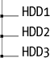
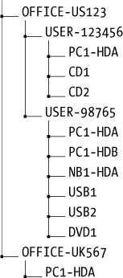
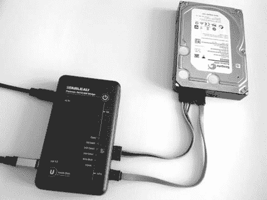
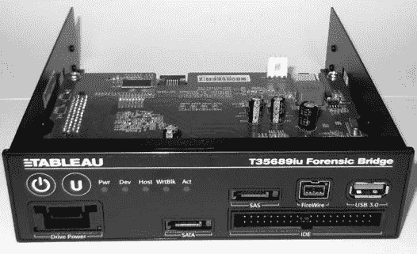
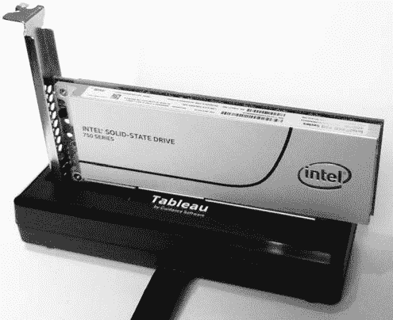
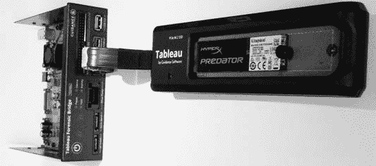
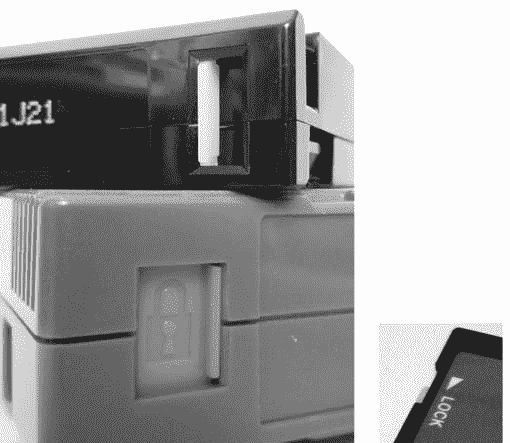

## **4**

**计划与准备**


本章描述了在对磁盘或存储介质进行成像之前的准备步骤。这些步骤包括设置调查员活动的审计跟踪、保存报告输出以及决定命名规范。此外，我还描述了与法医采集存储介质相关的各种后勤挑战，以及如何建立一个受保护的写阻环境。

法医准备的主题与本章中的某些部分有所重叠。然而，法医准备是一个更广泛的话题，包括一般的规划、预算、实验室基础设施、员工培训、硬件和软件采购等。如果将前述需求视为“宏观”法医准备，可以将本章中的信息视为“微观”法医准备。焦点较窄，涵盖了设置法医检查员工作站环境、分析磁盘或存储介质所需的工具和各项任务。

值得注意的是，私人部门组织（例如企业法医实验室）的法医准备与某些公共部门组织（如执法机关）的法医准备有所不同。私人部门组织，尤其是大型企业 IT 环境，可以决定其 IT 基础设施的构建和运行方式。可以将法医准备嵌入到这种受控的 IT 基础设施中，在调查或事件发生时为法医检查员提供优势。本章重点讨论的是私人和公共部门共有的法医准备任务。

### **保持审计跟踪**

审计跟踪或日志维护了操作、事件和任务的历史记录。它可以有不同的详细程度，并可以是手动的或自动的。本节介绍了几种手动跟踪任务的命令行方法以及自动记录命令行活动的方式。

#### ***任务管理***

在法医检查过程中，保持一个高层次的待办和已完成活动日志是很有益的。待办任务会转变为已完成任务，而已完成的任务构成了检查的历史记录。在工作过程中，你常常会想到一些未来需要处理的任务，或者已经完成并应记录的任务。随着检查时间的延长（可能需要很多小时、天数甚至更长时间）或涉及多名检查员时，快速记录和更全面的任务清单变得愈加重要。

在考试过程中，维护待办任务和已完成任务的列表对于多种原因都很重要：

• 有助于确保没有遗漏任何事情

• 避免重复已完成的工作

• 提高团队协作和协调性

• 展示符合政策和程序的情况

• 便于账务处理，包括计费

• 帮助生成文档和报告（正式的事件报告或取证报告）

• 允许事后审查，以识别经验教训并支持过程优化

• 帮助维护已完成活动的长期历史记录

• 支持新团队成员的学习和教育

• 作为记住复杂程序的指南

• 提供故障排除信息并获得支持

• 维护外部和第三方检查员的工作记录

许多商业任务管理器和调查管理工具可供使用，但本节重点介绍可以通过命令行完成的简单任务管理。使用命令行可以快速跟踪任务和活动，而无需离开终端去访问其他图形或基于 Web 的应用程序。

有许多开源命令行任务管理器可供使用，可用于管理取证检查员的活动。最重要的标准包括可靠的任务记录和详细的时间戳（不仅仅是日期）。

##### **Taskwarrior**

Taskwarrior 是一款流行的任务管理器，具有许多功能，能够快速高效地管理大量任务列表。你可以在 *[`taskwarrior.org/`](http://taskwarrior.org/)* 查找更多关于 Taskwarrior 的信息。以下示例展示了 Taskwarrior 命令在取证实验室环境中的实际应用。

添加多个待办任务：

```
$ task add acquire PC disk and transfer to evidence safe due:friday
Created task 1.
$ task add have a meeting with investigation team to plan analysis
Created task 2.
```

列出当前任务列表（`task info` 将显示时间和更详细的信息）：

```
$ task list

ID Due        Age Description
 1 2015-06-05 1m  acquire PC disk and transfer to evidence safe
 2            3s  have a meeting with investigation team to plan analysis

2 tasks
```

完成任务列表中的任务：

```
$ task 2 done
Completed task 2 'have a meeting with investigation team to plan analysis'.
Completed 1 task.
```

记录已完成任务，但不将其放入任务列表：

```
$ task log requested history of PC use at the firm
Logged task.
```

Taskwarrior 对于管理大量任务非常有用。它提供报告、搜索、排序和各种自定义细节级别。Taskwarrior 为每个任务维护时间戳和唯一标识符（UUID），管理待办任务的优先级，并保持已完成任务的历史记录。创建用户定义属性的能力使其可定制，适用于特定的设置，例如取证实验室或检查过程。

##### **Todo.txt**

你还可以通过编辑简单的文本文件来维护已完成的任务和待办事项列表。一个例子是 Gina Trapani 提出的 *todo.txt* 文件格式（更多信息请见 *[`todotxt.com/`](http://todotxt.com/)*）。*todo.txt* 系统定义了一个任务创建和完成日期、优先级、项目和上下文的文件格式。它还提供了一个 Shell 脚本来管理 *todo.txt* 文件。虽然 `todo.sh` 脚本执行了所有必要的操作来管理 *todo.txt* 任务列表，但文件格式可以通过常规文本编辑器进行管理。符号表示优先级（`(A)`、`(B)` 等）、上下文关键字以 `@` 表示、项目关键字以 `+` 表示。已完成的任务前缀为 `x`。以下是一个 *todo.txt* 文件示例：

```
(A) Sign chain of custody forms @reception
(B) Start forensic acquisition +Disk_A @imagingstation
Discuss analysis approach with investigation team @meetingroom
x 2015-05-30 08:45 upgrade ram in imaging PC @imagingstation
```

*todo.txt* 应用程序不使用时间戳，仅使用日期。如果你使用这个系统，必须手动为已完成的任务添加时间。

##### **Shell Alias**

您还可以在不使用任务管理软件的情况下维护一个检查员活动日志，记录已完成的任务。例如，以下是一个简单的 shell 别名，它将简短描述重定向到带有时间戳的文件中：

```
$ alias log="echo $2 \`date +%FT%R\` >> ~/examiner.log"
```

您可以根据需要自定义日志文件名和日期格式。快速记录活动或查看过去的活动只需要一条简单的命令，您可以在检查过程中随时输入。当发生重要或值得注意的事情时，输入`log`，后面跟上对所采取行动的简短描述。例如：

```
$ log removed hdd from PC and attached to examiner machine
...
$ log started forensic acquisition of the disk
...
$ log acquisition completed, disk sealed in evidence bag
...
$ cat ~/examiner.log
2015-05-30T09:14 informed that seized PC was enroute to forensic lab
2015-05-30T10:25 PC arrived, chain of custody forms signed
2015-05-30T10:47 removed hdd from PC and attached to examiner machine
2015-05-30T10:55 started forensic acquisition of the disk
2015-05-30T15:17 acquisition completed, disk sealed in evidence bag
2015-05-30T16:09 disk transferred to evidence safe for storage
```

用于管理任务的简单系统对大部分时间在命令行上工作的工作人员非常有用。它们对于通过安全外壳（ssh）远程工作时也很有优势。

#### ***Shell 历史***

本节讨论如何设置自动记录检查员在命令行上输入的 shell 命令。理想情况下，这种命令日志记录不应增加复杂性或干扰正在进行的取证工作。通过使用各种工具，您可以通过自动化后台进程记录检查员的命令行活动。这种方法在取证调查过程中对检查员完全透明。

Unix/Linux shell 最初并没有考虑日志记录或审计追踪。在过去，曾经创建过补丁来增强历史机制，黑客也尝试在 shell 使用时捕获命令，而商业产品则进行了各种企业级日志记录。开发一个强大的审计和合规系统来记录所有命令的时间戳，包括 shell 内建命令以及执行的程序和管道，超出了本书的范围。

可以配置 Bash shell 历史以满足以下基本要求：

• 记录检查员输入的命令

• 为每个输入的命令记录时间戳

• 记录所有命令，包括重复命令、注释和空格前缀的命令

• 避免截断或覆盖历史文件

• 在同一系统上使用多个终端窗口时避免冲突

• 包括 root 和非 root 命令历史

使用基本的 Bash shell 历史作为审计追踪是初级的。重要信息，如命令完成时间、命令执行的工作目录和返回码，并没有被记录。Bash 历史也不是一个防篡改的系统：检查员可以轻松修改或删除历史记录。创建一个安全且防篡改的审计环境并限制访问超出了本书的范围。

一些 shell，如 zsh，具有额外的历史记录功能，允许记录经过的时间。其他改进 shell 日志记录的提议解决方案包括使用 `PS1`、`PROMPT_COMMAND`、`trap` 和 `DEBUG`，以及 `key` 绑定来在执行命令之前修改它。使用 `sudo` 日志记录；`auditd` 日志记录；或特殊脚本，如 `preexec.sh`，也可以增加命令行日志记录。一个有用的教程 *[`www.pointsoftware.ch/en/howto-bash-audit-command-logger/`](http://www.pointsoftware.ch/en/howto-bash-audit-command-logger/)* 详细讨论了这个问题并提出了解决方案。命令行审计跟踪应根据特定的实验室政策或期望进行定制。

对于基本的 shell 命令日志记录，可以配置内置的 shell 历史记录功能来记录命令行活动。Bash 提供了一些有用的功能，包括启用命令输入时间戳的功能。你可以将以下命令添加到 Linux 启动脚本（如 `.bashrc` 等）中，以启用之前列表中概述的基本要求：

```
set -o history
shopt -s histappend
export HISTCONTROL=
export HISTIGNORE=
export HISTFILE=~/.bash_history
export HISTFILESIZE=-1
export HISTSIZE=-1
export HISTTIMEFORMAT="%F-%R "
```

这些命令确保历史记录已启用并处于附加模式（而不是在每次新登录时覆盖）。两个变量 `HISTCONTROL` 和 `HISTIGNORE` 控制哪些命令会保存到历史文件中。一个常见的默认设置是忽略重复的命令和以空格开头的命令。为了确保完整记录所有命令，`HISTCONTROL` 和 `HISTIGNORE` 变量明确设置为 null。`HISTFILE` 变量明确设置，确保 shell 退出时内存中的命令历史被保存。`HISTFILESIZE` 和 `HISTSIZE` 设置为 `-1`，以确保历史记录不会被截断或覆盖。`HISTTIMEFORMAT` 变量启用将时间戳写入历史文件，并允许你设置时间格式。该格式可以包括地区设置，并应包括时间戳，而不仅仅是日期。

在考试结束时，历史记录可以保存到文本文件中，并包含在考试的支持数据文件中。然后可以通过以下命令重置历史记录并为下次考试做好准备：

```
$ history > examiner_bash_history.txt
$ history -c; history -w
```

在多个 shell 实例之间同步历史记录可能比较棘手，因为每个 shell 都将历史记录保存在内存中，并仅在退出时将其写入历史文件。设置变量 `PROMPT_COMMAND='history -a; history -r'` 将在每次显示命令提示符时，向 Bash 历史文件写入（附加）并读取新命令。

一个正在积极开发的命令日志记录器是 Snoopy：它提供了许多功能，包括将命令记录到 syslog。Snoopy 是一个预加载的库，作为 `execv()` 和 `execve()` 系统调用的包装器。它对用户是透明的，你可以通过将 Snoopy 库添加到 */etc/ld.so.preload* 并编辑 */etc/snoopy.ini* 文件来启用和配置它。例如，假设在 Bash 命令提示符中输入以下一系列命令：

```
# fls -p -r /dev/sda1 | grep -i "\.doc$" |wc -l
10
```

这些命令会单独记录到 syslog 中，并附带各种细节：

```
Jun  5 10:47:05 lab-pc snoopy[1521]: [uid:0 sid:1256 tty:(none) cwd:/ filename:
    /bin/grep]: grep -i \.doc$
Jun  5 10:47:05 lab-pc snoopy[1522]: [uid:0 sid:1256 tty:(none) cwd:/ filename:
    /usr/bin/wc]: wc -l
Jun  5 10:47:05 lab-pc snoopy[1520]: [uid:0 sid:1256 tty:/dev/pts/0 cwd:/ filename:
    /usr/bin/fls]: fls -p -r /dev/sda1
```

你可以在 *[`github.com/a2o/snoopy/`](https://github.com/a2o/snoopy/)* 找到更多信息和 Snoopy 的最新版本。

#### ***终端记录器***

在某些情况下，展示终端中的工作过程可能很有用，包括命令输出（`stdout`）、错误信息（`stderr`）以及终端会话中可见的其他消息或活动。有多个工具可以捕获会话活动，甚至提供会话回放功能。

最著名的工具是`script`。在这个示例中，`script`启动后将输出追加到文件中，并附上用于回放的时间数据。在运行`script`之后，你可以执行任何正常的 shell 命令，它们将被保存以供后续查看。

```
$ script -a -tscript.timing script.output
Script started, file is script.output
```

当录制的会话结束时，输入`exit`或按 CTRL-D。你可以使用`scriptreplay`命令查看录制的内容，如下所示：

```
$ scriptreplay -m1 -tscript.timing script.output
...[session plays back here]...
```

使这种方法具有挑战性的一些常见问题是处理控制字符和诸如终端调整大小等事件。其他 TTY 记录器和嗅探器，如 ttyrec 和 termrec，也提供类似的功能和特性。

终端复用器，如 tmux 和 GNU screen，也提供一些级别的日志记录，这在某些情况下可能非常有用。使用 screen 时，你可以为分离会话设置日志记录（CTRL-A，然后按 H）。tmux 终端复用器现在通过使用`pipe-pane`选项支持日志记录，如下所示：

```
$ tmux pipe-pane -o -t session_index:window_index.pane_index 'cat >> ~/output
    .window_index-pane_index.txt'
```

#### ***Linux 审计***

专业实验室可能希望实施更为强大的日志记录或审计追踪，以满足更严格的组织政策或监管要求。一种实现方法是通过`auditd`，这是一个 Linux 审计包。通常，这涉及运行`auditd`守护进程，并将*pam_tty_audit.so*配置为 pam 模块。你可以使用`aureport`命令查看审计追踪活动。

使用`auditd`提供了几个安全优势，尤其是在与精细化访问控制（如`sudo`）一起使用时。审计追踪，特别是那些记录到中央日志主机的追踪，可以变得相对不易篡改，从而确保在记录检查工作时增加完整性。

综合审计追踪可以记录所有 TTY 活动（包括按键），还可以监控文件访问以及系统上的许多其他事件。设置审计和审计报告可能是一个复杂的过程，超出了本书的范围。

你会在各种地方找到有关其他解决方案和黑客技巧的讨论，包括 *[`www.pointsoftware.ch/en/howto-bash-audit-command-logger/`](http://www.pointsoftware.ch/en/howto-bash-audit-command-logger/)* 和 *[`whmcr.com/2011/10/14/auditd-logging-all-commands/`](http://whmcr.com/2011/10/14/auditd-logging-all-commands/)*。

从 Bash 4.1 版本开始，新增了将命令历史记录日志写入 syslog 的功能（可能需要重新编译才能启用）。

### **整理收集到的证据和命令输出**

在命令行进行法医检查时，通常会将各种工具和实用程序的命令输出保存到文件中，以供以后参考和报告。你可以通过将命令的输出重定向到文本文件来实现这一点。这些文件可以与收集到的其余检查数据一起保存。在收集和保存大量证据数据的过程中，保持文件和目录结构的组织性和可理解性非常重要。本节讨论了实现这一目标的各种策略。

#### ***文件和目录的命名规范***

为了减少在检查过程中收集到的所有文件、目录、挂载点、图像和其他保存数据之间的混淆，最好遵循命名规范。命名应具有足够的描述性，以便直观理解，但避免冗余的措辞和文件扩展名。最重要的是，命名规范应该在整个调查或事件中保持一致，并且在多个事件之间保持一致。

某些独特的标识符与系统、存储介质设备和可移动媒体相关联。这些标识符在决定命名规范时可能非常有用：

• 个人计算机的公司资产标签或库存编号

• 磁盘驱动器的制造商序列号

• 磁盘驱动器的 64 位全球唯一名称（WWN）

• 文件系统和 RAID 的块设备 UUID

• 磁盘驱动器图像的法医哈希值

• 网络接口卡（NIC）的 48 位 MAC 地址

• 法医实验室证据编号（可能是磁盘上的贴纸或标签）

• 法医实验室证据袋编号（包含磁盘的证据袋）

在合理的情况下，所有编号应从 1 开始，而非 0。程序员和工程师通常习惯从 0 开始，但阅读和审查检查报告的人可能没有技术背景（如律师、法官、经理等），他们通常期望编号从 1 开始。

原始图像文件在本书中使用**.raw**扩展名。常用的**.dd**扩展名意味着使用了 dd 工具，但实际情况可能并非如此。**.raw**扩展名准确描述了文件的性质，而不与特定工具关联。

理想情况下，原始图像的文件名应将法医图像与物理对象的唯一属性联系起来。如果使用法医格式，这些唯一的信息可以作为元数据嵌入到法医图像文件中。这使你能够将单一的物理磁盘与图像关联，并将单一的图像与物理磁盘关联。这样，磁盘和图像就可以在没有对周围上下文（如目录名称、证据架等）的依赖下保持关联。这建立了物理世界和数字世界之间的证据链。

如果有大量磁盘正在分析，可能在镜像文件名中包括序列号。你可以在文件名中包含不同级别的细节。尽管文件名 *server12-slot3-seagate-3.5in-disk-500gb -SN12345ACBDEE.raw* 非常具有描述性，但它可能过于详细且不便于处理。对于许多基本事件，一个实用的命名规范可以仅仅使用存储介质类型加上一个数字，例如 *disk1*、*tape1*、*ssd1*、*stick1*、*card1*、*cdrom1*、*dvd1*、*bluray1*、*floppy1* 等。在某些情况下，使用磁盘的简短描述和序列号可能是最合适的方式，例如 *crucial-ssd-15030E69A241.raw*。通常，创建易于在对话中讨论的镜像名称很有帮助，例如，“我们在 disk1 上找到了文件。”对话中使用的术语、原始检查输出和最终报告应具有一致的命名法。

当你从磁盘镜像、归档文件或其他复合镜像中提取文件时，在文件名中添加一个下划线，表示文件已被提取。这样可以防止你或其他人在不小心打开恶意软件、带有跟踪漏洞的 HTML 页面、Office 文档中的宏，或其他可能在打开时执行的可执行文件和脚本时遭遇问题。以下是一些示例：

```
$ icat image.raw 68 > photo.jpg_
$ icat image.raw 34 > customerlist.xls_
$ icat image.raw 267 > super-updater57.exe_
```

如果提取的文件已经以下划线结尾，请再添加一个下划线。附加的下划线可以清楚地表明该文件已作为证据从嫌疑驱动器中提取。

当你分析提取的文件、保存工具输出或做手动笔记时，创建一个文本文件，使用原始文件名并在其后附加 *_.txt*。例如：

```
$ exif photo.jpg_ > photo.jpg_.txt
$ vi customerlist.xls_.txt
$ objdump -x super-updater57.exe_ > super-updater57.exe_.txt
```

*_.txt* 扩展名表示文本文件包含关于提取文件的笔记、工具输出和取证分析结果。文件名与原始从镜像中提取的文件相关联。文本文件可能包含书签和检查员注释，可以进行搜索。除非清楚地知道提取文件的来源（例如，哪个磁盘、分区等），否则最好有这样的相应文本文件；它们还可以指示为何选择该文件进行提取。

文件扩展名应始终指示内容的格式。例如：

• **.txt* 可以使用文本编辑器打开并阅读。

• **.raw* 是一个原始数据转储（磁盘、内存等）。

• **.pcap* 是捕获的网络流量。

• **.db* 是一个数据库（可能是 Sleuth Kit 文件列表）。

• **.sfs* 是一个 SquashFS 证据容器。

• **.e01* 和 **.aff* 是取证格式。

每个案件、事件或调查都会有一个相关的物理存储介质。存储介质将有相应的法医镜像和来自各种程序的关联输出（如 hdparm、smartctl 等）。每个法医镜像将有来自各种程序的关联输出（如 mmls、fls 等），每个提取的文件可能会有来自各种程序的关联输出（如 exif、objdump 等）。命名约定有助于保持一切井井有条，并随着调查数据的增长，使组织系统能够扩展。

应该在文件名和目录名中嵌入多少信息？什么时候更合理地使用一个包含额外信息的描述文本文件？如何将相应的文件与图像关联？请考虑以下两个表示相同事件的示例。

一个将信息嵌入文件名中的示例如下所示：

```
case42.txt
image6.case42.raw
image6.case42.raw.txt
mmls.image6.case42.txt
fls.part1.image6.case42.txt
```

将相同信息嵌入到目录结构中的示例如下所示：

```
./case42/case.txt
./case42/image6/image.raw
./case42/image6/image.raw.txt
./case42/image6/mmls.txt
./case42/image6/part1/fls.txt
```

对于手动书写的笔记、进一步的描述、警告、问题以及其他在特定上下文中的随意评论，将这些信息存储在工作目录中的简单*notes.txt*或*readme.txt*文件中可能是有用的。它们可以为你或其他检查员提供提醒、提示或警告，以供日后阅读。

当你记录可能存在风险的网页网址时，替换*http*为*hxxp*，以防止其他人意外点击它们。这些链接可能会将用户带到恶意软件、嫌疑人监控的个人网站、带有跟踪代码的网站，或其他在不了解后果的情况下不应访问的内容。

#### ***可扩展的检查目录结构***

每个事件、案件或调查应该有一个唯一的目录（例如，*case42*）。所有收集到的证据、图像和分析工作应该包含在该根目录下的一个层次结构中。随着调查的规模扩大，一个良好规划的目录结构可以随之扩展。当多个法医检查员在同一事件上工作并共享目录结构时，拥有一个单一的目录也很实用。如果事件变得更加复杂，准备好重新组织目录结构。如果需要为单独分析提取大量文件，考虑创建一个*export*目录（类似于 EnCase）。

考试常常会扩大规模，一次从单个可疑磁盘开始的法医检查可能会扩展为涉及多个 PC 和许多磁盘的大规模检查。例如，假设有人报告某台 PC 或员工的行为异常或可疑。一个磁盘被扣押进行检查。初步检查结果发现还涉及一个 USB 闪存驱动器。该设备被发现并检查，随后发现第二台 PC 与事件相关联。该 PC 有两块内部硬盘和 DVD 刻录机。进一步搜索发现，一盒充满数据的 DVD 被藏在一个衣橱里。随后发现，另一个建筑里的外部 USB 硬盘和备用笔记本电脑也与此事件相关。收集的证据从一个硬盘增加到 16 个存储介质。这种假设的事件在大型组织中并不罕见。在准备检查时，应预期扩大检查范围。命名约定应设计得足够灵活，以适应调查规模的扩展。

一些 PC 由多人使用，有些人使用多台 PC。笔记本电脑不一定绑定于某个固定位置。可移动存储介质可以共享并连接到多台 PC 和笔记本电脑。随着时间的推移，PC 硬件会发生变化，办公室可能会变动，部门会有员工流动，组织重组也可能发生。务必设计文件和目录名称，以适应这些变化。

随着检查的进行，输出文件的数量将增加，因为更多的收集数据被分析并生成输出。一个好的做法是创建一个目录结构来区分文件并组织检查的输出。与文件名一样，目录名应指示内容，同时避免泄露机密信息。为每个分析的磁盘或镜像创建单独的目录可以隔离文件，并使调查过程得以扩展。

最小的检查通常由一个磁盘组成。稍大的检查可能由一个包含多个磁盘的 PC 组成；考虑以下示例目录结构：



另一个例子，考虑检查一个完整的工作场所，该工作场所包含一台桌面 PC（可能有多个磁盘）、一台笔记本、几个 USB 驱动器、多个 CD-ROM 和 DVD，以及一个外部磁盘包。一个便捷的目录结构将每个存储介质组织起来，其中存储了命令输出文件，从而使检查可以轻松扩展。再考虑一个更大的调查，涉及多个工作场所，分布在多个办公楼，跨越多个国家。在大型全球组织中，这种调查是可能发生的；因此，拥有一个经过深思熟虑的命名约定将有助于保持检查过程的有序进行。

依赖目录结构将不同磁盘、PC、用户和位置的命令输出分开是很有利的。这样，您就不必将这些信息嵌入输出文件名中。例如：



在这个例子中，两个办公室位置分别是美国的 US123 和英国的 UK567。美国办公室按用户工作区进行划分，每个正在检查的存储介质都有一个目录。而英国办公室的 PC 并未与任何特定用户关联（可能位于会议室），这在目录结构中有所体现。

在目录结构中，不必使用员工标识符来标识存储介质，而可以使用组织的 IT 库存编号。这个唯一标识符通常会有额外的信息与之关联（如购买日期、部门、办公室位置、用户详细信息、安装的软件、使用历史等）。出于保密原因，可能需要从文件名和目录结构中省略某些信息。例如，疑似或目标人物的名字不应嵌入文件名中。相反，您应使用标识符、首字母缩写或员工编号。调查的代号也可以使用。这样可以提供最低限度的保护，以防信息丢失、被盗或在之后被访问。

#### ***保存命令输出并进行重定向***

在创建用于存储各种检查项分析结果的目录结构后，典型的 Shell 命令输出将像这样从 stdout 重定向到文件：

```
# fls /dev/sda1 > fls-part1.txt
# fls /dev/sda2 > fls-part2.txt
```

若要包含常规输出和错误消息，您需要将 stdout 和 stderr 文件描述符重定向到文件。Bash 的较新版本通过在重定向中添加一个和符号提供了一种易于记忆的方法（这在管道到另一个程序时也适用）：

```
# fls /dev/sda &> fls-part1.txt
```

其他 Shell 和较早的 Bash 版本可能需要使用`2>&1`符号来合并 stderr 和 stdin。例如：

```
# fls /dev/sda > fls-part1.txt 2>&1
```

当一个文本文件已经存在，并且您需要向其中添加额外的信息时，您可以使用`>>`符号指定附加操作。例如：

```
# grep clientnames.xls fls-part1.txt >> notes.txt
```

在这里，所有已知文件名的实例都会被添加到*notes.txt*文件的末尾。^(1) 如果*notes.txt*文件不存在，将会被创建。

许多在命令行上执行的法医任务是耗时的，可能需要几个小时才能完成（例如磁盘映像、对非常大的文件执行操作等）。显示命令执行持续时间的时间戳会很有用。`time`命令提供了这一功能。`time`命令有两种常见实现：一种是 shell 内建的，功能简单；另一种是 GNU 工具，功能更强大。shell 内建的 `time` 版本的主要优点是它会计时整个命令管道，而 GNU `time` 只会计时管道中的第一个命令。

这是使用`time`命令运行磁盘映像程序的一个示例：

```
# time dcfldd if=/dev/sdc of=./ssd-image.raw
3907328 blocks (122104Mb) written.
3907338+1 records in
3907338+1 records out

real    28m5.176s
user    0m11.652s
sys     2m23.652s
```

zsh shell 可以将命令执行的经过时间记录为历史文件的一部分。当前在 Bash 中并没有这个功能。

另一个在某些情况下有用的命令是时间戳输出命令`ts`。任何传递到`ts`的输出都将在每行输出中附加时间戳。

```
# (ls -l image.raw; cp -v image.raw /exam/image.raw; md5sum /exam/image.raw) |ts
May 15 07:45:28 -rw-r----- 1 root root 7918845952 May 15 07:40 image.raw
May 15 07:45:40 'image.raw' -> '/exam/image.raw'
May 15 07:45:53 4f12fa07601d02e7ae78c2d687403c7c  /exam/image.raw
```

在这个示例中，执行了三个命令（用括号分组）并将命令输出发送到`ts`，从而创建了时间轴。

### **评估采集基础设施的后勤需求**

在执行存储介质的法医采集时，后勤问题非常重要。管理大型的法医映像文件并不是一项简单的任务，因此需要提前进行规划和思考。需要考虑磁盘容量、时间持续性、性能和环境因素等问题。

#### ***映像大小和磁盘空间需求***

存储介质的法医映像比 PC 通常处理的小文件要大几个数量级。管理这种大小的磁盘映像文件需要额外的思考和计划。你还需要考虑准备检查系统时的一些后勤因素。仔细的准备和规划将为你节省时间和精力，同时帮助你避免可能破坏过程的问题。

在创建磁盘的法医映像时（数百 GB 或 TB 级别），复制的不是文件，而是单个磁盘扇区。如果一块 1TB 的磁盘上只有一个 20K 的 Microsoft Word 文档，那么即使未压缩，法医映像的大小仍将是 1TB。截止到本文撰写时，10TB 的磁盘已经上市，这使得执行法医采集的挑战增加。

在管理磁盘映像时，检查者的时间和检查主机的磁盘容量是需要考虑的主要后勤因素。在开始对目标磁盘或存储介质进行法医采集之前，你需要提出一系列问题：

• 附加存储是否可以*原地*分析，而不需要创建法医映像？

• 目标磁盘的大小是多少？

• 检查者机器上可用的空间是多少？

• 图像压缩的潜力如何？

• 法医工具在处理和临时文件时需要多大的空间？

• 估计需要提取多少文件以供进一步分析？

• 检查员主机上有多少内存和交换空间可用？

• 是否有可能向同一案件或事件中添加更多目标磁盘？

• 是否有期望单独提取所有空闲或未分配的磁盘空间？

• 是否有计划提取单独的分区（可能包括交换分区）？

• 是否有可能将一种取证格式转换为另一种格式？

• 是否需要为将磁盘镜像准备转移到另一个位置？

• 目标磁盘是否包含虚拟机镜像，需要单独提取和分析？

• 目标磁盘是否包含大量的压缩文件和归档文件？

• 目标磁盘是否使用全盘加密？

• 是否需要将镜像刻录到另一个磁盘或 DVD 以用于存储或运输？

• 是否需要从损坏或部分覆盖的文件系统中恢复文件？

• 检查主机的备份是如何执行的？

在某些情况下，可能不需要对磁盘进行镜像。当进行某些初步筛查或快速搜索时，将磁盘连接到检查主机并操作实时的目标磁盘可能就足够了。根据筛查或搜索的结果，你可以决定是否进行取证镜像。在企业环境中，这种方法可能意味着员工的停机时间，因为他们必须等待被扣押的磁盘被审查或分析。企业环境通常有标准的终端用户 PC 配置，设计时不包含本地用户数据（所有数据都保存在服务器或云端）。简单地用新磁盘替换原磁盘可能是更经济的选择，尤其是在考虑到员工停机时间和现场镜像磁盘所需的时间成本时。

#### ***文件压缩***

使用压缩解决了取证检查员面临的许多容量挑战。你可以使用压缩的取证格式来存储获得的镜像，但其有效性取决于多个因素。

你选择的压缩算法将对压缩目标磁盘所需的大小和时间产生一定影响。较好的压缩比会需要更多的时间来压缩（以及随后的解压缩）。

一个相对较新的 PC 磁盘，如果包含大量未触及的磁盘扇区（原厂清零内容），会比一个包含大量残留数据（未分配扇区中的数据）的旧磁盘压缩效果更好。

包含大量压缩文件（**.mp3**、**.avi**等）的磁盘将不会进一步压缩，因此，取证镜像工具将从额外的压缩中受益较少。

加密的目标磁盘或包含大量加密文件的磁盘由于数据的熵值较高，其压缩效果不如未加密内容。

#### ***稀疏文件***

稀疏文件值得一提，因为它们有一些优势；然而，在计算磁盘容量时，它们也可能会带来问题。一些文件系统使用元数据来表示文件中一串零，而不是将所有零写入磁盘。稀疏文件包含“空洞”，其中已知存在一串零。举例来说，一个新磁盘包含大多数为零的扇区，通过 GNU dd 获取，^(2) 首先作为常规原始文件，然后作为稀疏文件。

```
# dd if=/dev/sde of=image.raw
15466496+0 records in
15466496+0 records out
7918845952 bytes (7.9 GB, 7.4 GiB) copied, 112.315 s, 70.5 MB/s

# dd if=/dev/sde of=sparse-image.raw conv=sparse
15466496+0 records in
15466496+0 records out
7918845952 bytes (7.9 GB, 7.4 GiB) copied, 106.622 s, 74.3 MB/s
```

GNU `dd` 命令提供了一个 `conv=sparse` 标志，用于创建稀疏目标文件。在这些 dd 示例中，你可以看到传输的块数对于正常文件和稀疏文件是相同的。在以下输出中，文件大小和 MD5 哈希也完全相同。然而，注意到文件系统中使用的块大小有很大不同（7733252 块与 2600 块）：

```
# ls -ls image.raw sparse-image.raw
7733252 -rw-r----- 1 root root 7918845952 May 15 08:28 image.raw
   2600 -rw-r----- 1 root root 7918845952 May 15 08:30 sparse-image.raw

# md5sum image.raw sparse-image.raw
325383b1b51754def26c2c29bcd049ae  image.raw
325383b1b51754def26c2c29bcd049ae  sparse-image.raw
```

尽管稀疏文件需要的空间少得多，但仍然报告完整的字节大小作为文件大小。这可能会在计算实际可用磁盘容量时造成混淆。稀疏文件通常用于虚拟机镜像，在提取进行分析时可能成为一个问题。

你也可以使用稀疏文件作为压缩镜像文件的方法，但建议和推荐使用压缩的法医格式或 SquashFS 容器。并非所有程序和工具都能正确处理稀疏文件，而且这些文件在不同文件系统和平台之间移动时可能会变得有问题。一些程序甚至在读取稀疏文件时可能会扩展它们。

#### ***报告的文件和镜像大小***

报告数据大小是一个重要的概念。当你使用法医工具时，大小可以指字节、磁盘扇区、文件系统块或其他计量单位。字节的表示法可以带上倍数前缀（例如千字节、兆字节、吉字节、太字节等），而倍数可以是 1000 或 1024 的倍数。磁盘扇区可能表示 512 字节或 4096 字节的扇区大小。文件系统块大小取决于文件系统类型和创建时使用的参数。当你在法医环境中记录大小时，务必始终附上描述性单位。

许多 Linux 工具支持 `-h` 标志以人类可读的形式报告文件大小。例如，你可以使用 `ls -lh`、`df -h` 和 `du -h` 更轻松地查看文件和分区的大小。下面是一个带有多个文件大小的 `ls` 输出示例：

```
# ls -l
total 4
-rw-r----- 1 root root 2621440000 Jan 29 14:44 big.file
-rw-r----- 1 root root  104857600 Jan 29 14:41 medium.file
-rw-r----- 1 root root      51200 Jan 29 14:42 small.file
-rw-r----- 1 root root         56 Jan 29 14:44 tiny.file
# ls -lh
total 4.0K
-rw-r----- 1 root root 2.5G Jan 29 14:44 big.file
-rw-r----- 1 root root 100M Jan 29 14:41 medium.file
-rw-r----- 1 root root  50K Jan 29 14:42 small.file
-rw-r----- 1 root root   56 Jan 29 14:44 tiny.file
```

第二条命令输出中的大小要更易读和理解。

#### ***移动和复制法医镜像***

将法医磁盘镜像从一个地方移动或复制到另一个地方需要规划和预见性。不要将镜像文件与典型的终端用户文件看作相同的（尽管从技术上讲它们是相同的）。

采集、复制和移动大型磁盘镜像可能需要许多小时甚至几天，具体取决于源磁盘的大小、速度以及其他性能因素。考虑以下典型文件和磁盘镜像的大小，以及将文件从一个磁盘复制到另一个磁盘所需的平均时间：^(3)

• 5KB 简单 ASCII 文本电子邮件：不到 1 秒

• 5MB 典型 MP3 音乐文件：不到 1 秒

• 650MB CD ISO 镜像：大约 5 秒

• 5–6GB 典型 DVD 或 iTunes 电影下载：大约 1 分钟

• 64GB 典型手机镜像：大约 10 分钟

• 250GB 典型笔记本磁盘镜像：30-40 分钟

• 1TB 典型桌面 PC 镜像：超过 2 小时

• 2TB 典型外部 USB 磁盘镜像：超过 4 小时

• 8TB 内部磁盘镜像：超过 16 小时

一旦复制或移动过程开始，打断它可能会导致数据处于不完整状态，或需要额外的时间恢复到原始状态。复制或移动操作可能会创建临时文件，或导致镜像暂时存在两个副本。

通常，提前仔细考虑复制和移动大数据集，并且一旦开始，避免中断过程。

#### ***估算任务完成时间***

取证采集过程需要时间完成。在此过程中，人员和其他进程可能会等待。因此，计算并估算各种过程的完成时间非常重要。同时，确定是否需要将估算的完成时间报告给其他方，如管理层、法律团队、执法部门或其他调查人员。管理完成所需时间的期望非常重要。

需要考虑的一些重要问题包括：

• 是否可以在无人值守的情况下让采集过程安全地运行一整晚？

• 采集过程中检查员机器是否无法使用（因性能原因或其他原因）？

• 在获取取证镜像时，是否可以进行其他检查工作？

• 什么时候可以并行完成多个任务？

• 是否有某些任务或过程只能按顺序执行？

• 是否有任务会阻塞其他任务，直到它们完成？

• 工作负载是否可以在多个检查员之间共享、委派或分配？

你可以根据以往的工作和过程来估算采集的完成时间。你应该知道大致的初始设置时间，包括完成文书工作、创建必要的目录结构、记录硬件、将嫌疑驱动器连接到检查主机、决定采集方法等因素。这将为你提供预采集阶段的时间估算。

你可以根据通过系统中最慢组件（瓶颈）传输的数据量（已知）来估算存储介质采集时间。

#### ***性能与瓶颈***

为了提高取证采集的效率，你可以优化检查主机并评估瓶颈。

性能瓶颈总是存在的；这就是系统中最慢的组件，其他所有组件都必须等待它。在取证环境中，瓶颈应该理想地是目标磁盘。它是证据源，也是唯一一个你不能（或不应该）修改的性能变量。

你可以通过阅读厂商规格、使用各种工具查询系统，或运行各种基准测试和测量测试来评估系统各个组件的性能。

检查各种组件速度的有用工具包括 dmidecode、lshw、hdparm 和 lsusb。这里展示了几个命令行示例。

要检查 CPU 家族和型号、当前和最大速度、核心数和线程数，以及其他标志和特性，请使用以下命令：

```
# dmidecode -t processor
```

这是一个查看 CPU 缓存（L1、L2 和 L3）的命令：

```
# dmidecode -t cache
```

要查看内存，包括使用的插槽、大小、数据宽度、速度和其他细节，请使用以下命令：

```
# dmidecode -t memory
```

这是一个查看 PCI 插槽数量、使用情况、标识和类型的命令：

```
# dmidecode -t slot
```

查看存储接口、类型（SATA、NVME、SCSI 等）和速度的命令：

```
# lshw -class storage
```

要查看附加磁盘的速度、接口、缓存、转速和其他信息（以设备 */dev/sda* 为例），请使用以下命令：

```
# hdparm -I /dev/sda
```

要查看外部 USB 接口的速度（以及可能附加的写保护器），请使用以下命令：

```
# lsusb -v
```

**注意**

*获取这些信息有许多不同的方法和命令。这里展示的命令仅提供了一种获取所需性能信息的示例。提供一个包含所有可能工具和技术的详尽清单超出了本书的范围。*

阅读厂商文档并查询系统将帮助你识别各种组件的速度。为了获得准确的测量，最好使用硬件基准测试和软件性能分析工具。一些基准测试工具包括 mbw（用于内存）和 bonnie++（用于磁盘 I/O）。

操作系统的健康和调整也是一个性能因素。监控检查硬件的日志（syslog、dmesg）可以揭示错误信息、配置错误和其他低效指标。监控检查机器实时状态的性能和负载的工具包括 htop、iostat、vmstat、free 或 nmon。

你还可以通过确保后台运行的进程最小化（包括通过 cron 安排的进程）、调整内核（`sysctl -a`）、调整检查主机的文件系统（`tunefs`）以及管理磁盘交换和缓存来优化操作系统。此外，确保检查器操作系统运行在原生硬件上，而不是作为虚拟机。

当你在寻找瓶颈或优化时，帮助你想象数据从目标磁盘流向检查主机的磁盘是有用的。在采集过程中，数据会通过以下硬件接口和组件流动：

• 被检查磁盘的盘片/介质（转速？延迟？）

• 被检查磁盘接口（SATA-X？）

• 写保护器逻辑（增加的延迟？）

• 写保护器检查主机接口（USB3 与 UASP？）

• 被检查主机接口（USB3 与其他设备共享总线？桥接？）

• PCI 总线（PCI Express？速度？）

• CPU/内存和操作系统内核（速度？DMA？数据宽度？）

这些组件将被遍历两次，一次是在被检查磁盘和被检查主机之间，另一次是在主机和被检查磁盘之间，后者用于保存采集的图像。

确保被检查磁盘和 CPU/内存之间的数据流与 CPU/内存和目标磁盘之间的数据流不使用相同的路径。例如，如果一个现场成像系统有一个写保护器和一个外部磁盘用于保存采集的图像，并且它们都连接到本地 USB 端口，它们可能共享一个总线。因此，可用带宽将被两个磁盘共享，从而导致性能不佳。

对于网络性能调优，底层网络的速度成为一个主要因素，性能增强包括使用巨型以太网帧和通过高性能网络接口卡进行 TCP 校验和卸载。评估各种程序何时访问网络以及访问的原因（自动更新、网络备份等）也是有益的。

总结来说，要为你打算执行的采集操作制定一个整体计划或策略。确保已经建立了经过充分测试的流程和基础设施。确保已经进行了正确的容量规划和优化。能够在操作进行时监控活动。

与法医检查主机相关的最常见总线速度（以字节/秒计）列在表 4-1 中以供比较。你可以在*[`en.wikipedia.org/wiki/List_of_device_bit_rates`](https://en.wikipedia.org/wiki/List_of_device_bit_rates)*上找到各种接口和总线的比特率的良好参考。

**表 4-1：** 常见总线/接口速度

| **总线/接口** | **速度** |
| --- | --- |
| 内部总线 |  |
| PCI Express 3.0 x16 | 15750 MB/s |
| PCI Express 3.0 x8 | 7880 MB/s |
| PCI Express 3.0 x4 | 3934 MB/s |
| PCI 64 位/133MHz | 1067 MB/s |
| 存储驱动器 |  |
| SAS4 | 2400 MB/s |
| SAS3 | 1200 MB/s |
| SATA3 | 600 MB/s |
| SATA2 | 300 MB/s |
| SATA1 | 150 MB/s |
| 外部接口 |  |
| Thunderbolt3 | 5000 MB/s |
| Thunderbolt2 | 2500 MB/s |
| USB3.1 | 1250 MB/s |
| USB3.0 | 625 MB/s |
| GB 以太网 | 125 MB/s |
| FW800 | 98 MB/s |
| USB2 | 60 MB/s |

#### ***热量和环境因素***

在进行取证磁盘获取时，每个可访问的扇区都被读取，且读取过程持续且不中断，通常会持续几个小时。因此，磁盘的工作温度可能会上升并引发问题。当磁盘过热时，故障风险增加，尤其是对于较旧的磁盘。Google 的研究人员发布了一篇关于硬盘故障的有益论文，地址为 *[`research.google.com/archive/disk_failures.pdf`](http://research.google.com/archive/disk_failures.pdf)*。

为了减少读取错误、坏块或硬盘故障的风险，在获取磁盘时监控磁盘温度是值得的。大多数磁盘供应商都会发布其驱动器的正常工作温度，包括最大可接受的工作温度。

你还可以使用多个工具手动查询硬盘的温度。一个简单的工具是`hddtemp`，它通过查询 SMART 接口来获取硬盘的温度，如下所示：

```
# hddtemp /dev/sdb
/dev/sdb: SAMSUNG HD160JJ: 46C
```

`hddtemp`工具可以作为守护进程运行，并定期记录到 syslog 中，你可以监控它以便检测某些阈值。

要获得有关磁盘温度的更详细输出，并在某些情况下获取温度历史记录，可以使用`smartctl`工具。以下是一个示例：

```
# smartctl -x /dev/sdb
...
Vendor Specific SMART Attributes with Thresholds:
ID# ATTRIBUTE_NAME          FLAGS    VALUE WORST THRESH FAIL RAW_VALUE
...
190 Airflow_Temperature_Cel -O---K   100   055   000    -    46
194 Temperature_Celsius     -O---K   100   055   000    -    46
...
Current Temperature:                 46 Celsius
Power Cycle Max Temperature:         46 Celsius
Lifetime    Max Temperature:         55 Celsius

SCT Temperature History Version:     2
Temperature Sampling Period:         1 minute
Temperature Logging Interval:        1 minute
Min/Max recommended Temperature:     10/55 Celsius
Min/Max Temperature Limit:            5/60 Celsius
Temperature History Size (Index):    128 (55)

Index    Estimated Time   Temperature Celsius
  56    2015-06-07 19:56    50  *******************************
...
  62    2015-06-07 20:02    55  ************************************
  63    2015-06-07 20:03    55  ************************************
  64    2015-06-07 20:04    51  ********************************
...
  55    2015-06-07 22:03    46  ***************************
```

如果磁盘在磁盘获取过程中开始过热，请采取措施降低温度。作为一个立即的步骤，可以暂时挂起获取过程，待磁盘降温后再继续。根据你使用的获取方法，这可能只是通过按 CTRL-Z 或输入`kill -SIGTSTP`后跟进程 ID 来向 Linux 进程发送一个信号。当温度降至可接受水平时，可以从挂起的地方恢复获取过程。

以这种方式挂起和恢复进程不会影响获取过程的取证有效性。进程被挂起时，其操作状态保持完整（当前扇区、目标文件、环境变量等）。通过按 CTRL-Z 在 Shell 中挂起并恢复成像过程的示例如下：

```
# dcfldd if=/dev/sdb of=./image.raw
39424 blocks (1232Mb) written.^Z
[1]+  Stopped                 dcfldd if=/dev/sdb of=./image.raw
# fg
dcfldd if=/dev/sdb of=./image.raw
53760 blocks (1680Mb) written.
...
```

这里，执行的`dcfldd`命令通过按下键盘上的 CTRL-Z 被挂起。通过使用`fg`命令（前台）可以恢复该进程。也可以使用`kill -SIGCONT`命令来恢复该进程。有关作业控制和信号的更多信息，请参阅 Bash 文档和 SIGNAL(7)手册页。

使用像 Nagios、Icinga 或其他基础设施监控系统这样的工具，你可以自动化温度监控和报警。这些系统监控各种环境变量，并在接近或超过临界阈值时提供警报。

许多取证实验室在成像时使用散热器或硬盘冷却器，以减少被处理磁盘过热的问题。特别是在进行长时间的获取会话时，建议这样做，尤其是当你使用较旧的硬盘时。

如果你尝试使用某些电源管理技术来降低温度，它们将无太大作用。这些方法通过在一段时间空闲后关闭硬盘来工作；然而，在持续的成像操作过程中，几乎没有空闲时间。

### **建立法医写保护**

数字证据收集的基本组成部分是对存储介质进行法医上可靠的获取。你可以通过确保在将磁盘连接到法医获取主机之前，已经有写保护机制到位，来实现这一部分目标^(4)。

当你将磁盘连接到运行现代操作系统的计算机时，自动化进程显著增加了数据修改的风险（因此也增加了证据销毁的风险）。自动挂载分区、生成缩略图以便在图形文件管理器中显示、为本地搜索数据库建立索引、使用杀毒软件扫描等尝试都会使连接的磁盘面临修改的风险。时间戳可能会被更新，破坏潜在证据。未分配区域中的删除文件可能被覆盖，也会破坏证据。发现的恶意软件或病毒（这正是调查员可能正在寻找的证据）可能会被清除。日志文件系统可能会将队列中的变更写入磁盘。也可能会尝试修复损坏的文件系统或组装/同步 RAID 组件。

除了自动化潜在的证据销毁，人的错误也是另一个显著的风险。人们可能会不小心复制或删除文件；浏览文件系统（并更新最后访问时间戳）；或错误选择了设备，从而导致破坏性操作。

写保护器的设计目的是防止存储介质上的数据被修改。要求在法医实验室的标准流程和程序中使用写保护器，展示了应有的谨慎态度。这符合行业最佳实践，用于在数字取证环境中处理存储介质作为证据。写保护器确保了将存储介质以只读方式连接到检查员的工作站。

NIST 计算机取证工具测试（CFTT）提供了写保护器的正式要求。《硬件写保护（HWB）设备规范，第 2.0 版》可以在 *[`www.cftt.nist.gov/hardware_write_block.htm`](http://www.cftt.nist.gov/hardware_write_block.htm)* 上找到。该规范标识了以下顶级工具要求：

• HWB 设备不得向受保护的存储设备发送任何修改存储设备数据的命令。

• HWB 设备应返回读取操作请求的数据。

• HWB 设备应无修改地返回请求磁盘访问的重要信息。

• 存储设备向 HWB 设备报告的任何错误条件应报告给主机。

市面上同时有硬件和软件写入阻止器，作为独立硬件、可安装的软件包或可引导的取证 CD。在某些情况下，媒体可能具有内建的只读功能。

#### ***硬件写入阻止器***

首选的写入阻止方法是使用位于受检磁盘和检查员工作站之间的硬件设备。硬件写入阻止器会拦截发送到磁盘的可能修改数据的驱动命令。下图展示了一个保护 SATA 驱动器的便携式写入阻止设备（由 Guidance Software 提供的 Tableau），见图 4-1。



*图 4-1：便携式 SATA 写入阻止器*

硬件写入阻止器通常具有一个开关或 LED 指示灯，表明写入阻止功能是否在工作。一个多功能写入阻止设备的照片，设计用于直接安装到检查员工作站（由 Guidance Software 提供的 Tableau），见图 4-2。它可以保护 SATA、SAS、IDE、FireWire 和 USB 驱动器。



*图 4-2：多功能驱动器舱位写入阻止器*

写入阻止器可以向采集主机系统提供状态信息。例如，tableau-parm 工具（*[`github.com/ecbftw/tableau-parm/`](https://github.com/ecbftw/tableau-parm/)*）可以查询 Tableau 硬件写入阻止器的信息。您可以使用这个开源工具来验证通过 Tableau 写入阻止器连接的磁盘的写入阻止状态。例如：

```
$ sudo tableau-parm /dev/sdg
WARN: Requested 255 bytes but got 152 bytes)
## Bridge Information ##
chan_index: 0x00
chan_type: SATA
writes_permitted: FALSE
declare_write_blocked: TRUE
declare_write_errors: TRUE
bridge_serial: 000ECC550035F055
bridge_vendor: Tableau
bridge_model: T35u-R2
firmware_date: May 23 2014
firmware_time: 09:43:37

## Drive Information ##
drive_vendor: %00%00%00%00%00%00%00%00
drive_model: INTEL SSDSA2CW300G3
drive_serial: CVPR124600ET300EGN
drive_revision: 4PC10302

## Drive HPA/DCO/Security Information ##
security_in_use: FALSE
security_support: TRUE
hpa_in_use: FALSE
hpa_support: TRUE
dco_in_use: FALSE
dco_support: TRUE
drive_capacity: 586072368
hpa_capacity: 586072368
dco_capacity: 586072368
```

根据 Tableau 的文档，`drive_vendor`字段对于某些驱动器可能没有任何信息。^(5)

在本书编辑的最后阶段，第一批 PCI Express 写入阻止器出现在市场上。以下示例来自 Tableau。使用 PCI Express 写入阻止器连接 NVME 驱动器时，产生以下 dmesg 输出：

```
[194238.882053] usb 2-6: new SuperSpeed USB device number 5 using xhci_hcd
[194238.898642] usb 2-6: New USB device found, idVendor=13d7, idProduct=001e
[194238.898650] usb 2-6: New USB device strings: Mfr=1, Product=2, SerialNumber=3
[194238.898654] usb 2-6: Product: T356789u
[194238.898658] usb 2-6: Manufacturer: Tableau
[194238.898662] usb 2-6: SerialNumber: 0xecc3500671076
[194238.899830] usb-storage 2-6:1.0: USB Mass Storage device detected
[194238.901608] scsi host7: usb-storage 2-6:1.0
[194239.902816] scsi 7:0:0:0: Direct-Access     NVMe     INTEL SSDPEDMW40 0174
    PQ: 0 ANSI: 6
[194239.903611] sd 7:0:0:0: Attached scsi generic sg2 type 0
[194240.013810] sd 7:0:0:0: [sdc] 781422768 512-byte logical blocks: (400 GB/
    373 GiB)
[194240.123456] sd 7:0:0:0: [sdc] Write Protect is on
[194240.123466] sd 7:0:0:0: [sdc] Mode Sense: 17 00 80 00
[194240.233497] sd 7:0:0:0: [sdc] Write cache: disabled, read cache: enabled,
    doesn't support DPO or FUA
[194240.454298]  sdc: sdc1
[194240.673411] sd 7:0:0:0: [sdc] Attached SCSI disk
```

写入阻止器作为一个 USB3 桥接器工作，使得 NVME 驱动器可以作为 SCSI 设备使用。这个特定的写入阻止器支持使用 AHCI 和 NVME 标准的 PCI Express 驱动器。支持的硬件接口包括常规的 PCI Express 插槽（图 4-3）和 M.2（图 4-4）。可以使用标准的从 mini-SAS 到 PCI Express 或 M.2 的适配器来连接 U.2（SFF-8639）NVME 驱动器。支持 NVME 的 PCI 写入阻止器也可以通过 Wiebetech 获得。

基于硬件的写入阻止器的主要优势是其操作系统独立性。它们在采集主机之外独立透明地运行，消除了维护驱动程序或操作系统兼容性的需求。这使得它们在 Linux 采集环境中使用时非常理想。



*图 4-3：PCI Express 插槽驱动器的写入阻止器底座*



*图 4-4：多功能写入阻止器和 PCI Express M.2 驱动器的底座*

特别感谢瑞士的 Arina AG 提供了本书中用于测试目的的写保护设备。

#### ***软件写保护器***

软件写保护器有着相对有争议的历史。随着现代操作系统的发展，它们变得越来越难以开发和维护。操作系统厂商的系统更新、审查员的配置调整以及额外安装的软件都可能导致禁用、覆盖、绕过或使得软件实现的写保护功能失效。

软件写保护器的实现比较困难。仅仅将磁盘挂载为只读（`mount -o ro`）*不能*保证磁盘不会被修改。此处的*只读*属性指的是文件系统，而不是磁盘设备。在各种情况下，内核仍然可能会写入磁盘。软件写保护必须在内核中实现，位于虚拟文件系统层以下，甚至在实现特定驱动接口的其他设备驱动程序（例如 AHCI）以下。Linux 下已经使用了几种低级别的软件写保护方法，但成功的案例有限。

工具如 hdparm 和 blockdev 可以通过设置内核标志将磁盘设置为只读。例如：

```
# hdparm -r1 /dev/sdk

/dev/sdk:
 setting readonly to 1 (on)
 readonly      =  1 (on)
```

可以像这样使用 blockdev 设置相同的标志：

```
# blockdev --setro /dev/sdk
```

设置内核标志的方法依赖于正确配置 udev，以便在其他进程有机会修改新附加的驱动器之前将其设置为只读。

也有一个内核补丁专门实现了取证写保护功能。你可以在*[`github.com/msuhanov/Linux-write-blocker/`](https://github.com/msuhanov/Linux-write-blocker/)*上找到更多信息。几种取证启动 CD 使用了 Maxim Suhanov 的写保护内核补丁。以下辅助脚本管理 DEFT Linux 取证启动 CD 上的软件写保护：

```
% cat /usr/sbin/wrtblk
#!/bin/sh

# Mark a specified block device as read-only
[ $# -eq 1 ] || exit
[ ! -z "$1" ] || exit
bdev="$1"
[ -b "/dev/$bdev" ] || exit
[ ! -z $bdev##loop*$ ] || exit
blockdev --setro "/dev/$bdev" || logger "wrtblk: blockdev --setro /dev/$bdev
    failed!"

# Mark a parent block device as read-only
syspath=$(echo /sys/block/*/"$bdev")
[ "$syspath" = "/sys/block/*/$bdev" ] && exit
dir=$syspath%/*$
parent=$dir##*/$
[ -b "/dev/$parent" ] || exit
blockdev --setro "/dev/$parent" || logger "wrtblk: blockdev --setro /dev/$parent
    failed!"
```

补丁在内核中实现，并通过辅助脚本来开启（和关闭）。辅助脚本简单地使用`blockdev`命令将设备标记为只读。

NIST CFTT 已经进行过软件写保护工具测试，相关信息可以在*[`www.cftt.nist.gov/software_write_block.htm`](http://www.cftt.nist.gov/software_write_block.htm)*上找到。

硬件写保护器仍然是保护存储介质在取证过程中最安全和推荐的方法。

#### ***Linux 取证启动 CD***

现场进行事件响应和分类的需求促使了可启动的 Linux 光盘的发展，这些光盘包含执行此类任务所需的软件。这些光盘可以启动目标 PC 并使用各种取证工具访问本地连接的存储设备。取证启动光盘旨在写保护已发现的存储设备，以防其需要进行取证影像制作。你可以通过使用命令（如前面示例中展示的 `wrtblk`）使附加磁盘可写，这在你连接外部目标磁盘时获取影像非常有用。取证启动光盘还具有网络功能，支持远程分析和获取数据。

取证启动光盘在以下情况下非常有用：

• 在不拆开 PC 的情况下进行检查，以免移除磁盘。

• 没有写保护器可用。

• 在分类过程中需要快速检查 PC 以获取某个证据，然后决定是否进行影像制作。

• 需要基于 Linux 的工具（如 Sleuth Kit、Foremost 等），但这些工具未提供其他方式获取。

• 取证技术人员需要通过 ssh 远程执行工作。

目前维护的几种流行的取证启动光盘包括：

• Kali Linux（前身为 BackTrack），基于 Debian 系统： *[`www.kali.org/`](https://www.kali.org/)*

• Digital Evidence & Forensics Toolkit (DEFT)，基于 Ubuntu Linux： *[`www.deftlinux.net/`](http://www.deftlinux.net/)*

• Pentoo，基于 Gentoo Linux 的取证 CD： *[`pentoo.ch/`](http://pentoo.ch/)*

• C.A.I.N.E，基于 Ubuntu Linux 的计算机取证 Linux Live 发行版： *[`www.caine-live.net/`](http://www.caine-live.net/)*

取证启动光盘需要大量的维护和测试。过去曾有许多其他取证启动光盘可用。由于取证启动光盘的不断变化，务必研究并使用最新的功能完备且得到维护的版本。

#### ***具有物理只读模式的介质***

一些存储介质具有写保护机制，在取证环境中非常有用。例如，大多数磁带都有一个滑动开关或标签，指示磁带驱动器将其视为只读，如 图 4-5 左侧所示。在 LTO-5 磁带（左下角）上，闭合标签表示它是写保护的；在 DAT160 磁带（左上角）上，打开标签表示它是写保护的。

SD 存储卡有一个 *锁定* 开关，可以写保护存储卡，如 图 4-5 右侧所示。



*图 4-5：磁带和 SD 卡上的写保护标签*

较旧的 USB 闪存驱动器可能具有写保护开关。一些非常古老的 IDE 硬盘有一个跳线，可以设置使驱动器电子设备将驱动器视为只读。

CD-ROM、DVD 和 Blu-ray 光盘不需要写入阻断器，因为它们默认是只读的。访问可重写光盘的简单操作不会修改光盘上的时间戳或其他数据；对这些光盘的更改必须明确地刻录到光盘上。

### **结束语**

在本章中，你学习了如何设置基本的审计、活动日志记录和任务管理。我涵盖了命名约定和可扩展目录结构等主题，还讨论了图像大小、驱动器容量规划以及性能和环境问题等各种挑战。最后，本章讨论了法医写入阻断的关键组件。你现在已经准备好将目标驱动器连接到采集主机，准备执行法医采集过程。
