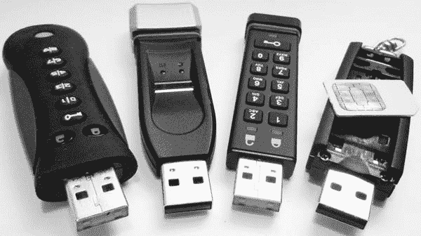
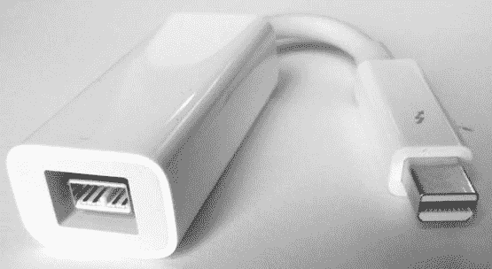

## **5**

**将目标存储介质连接到采集主机**


本章讨论将目标存储介质物理连接到检查主机，识别系统中的目标设备，以及查询设备固件以获取信息。你还将学习移除 HPA 和 DCO、解锁 ATA 密码以及解密自加密驱动器的方法。本章最后会介绍一些特殊的存储话题。让我们从检查目标 PC 硬件开始。

### **检查目标 PC 硬件**

当 PC 或笔记本电脑在现场被没收或交付到取证实验室进行检查时，除了内部磁盘外，还可以检查其他硬件。检查内容应包括完整的 PC 硬件配置审查、BIOS 设置、硬件时钟等。

**注意**

*本书的范围涵盖了“死”磁盘获取，即已经关闭电源的驱动器和 PC。根据组织的不同，现场到达犯罪或事件现场时可能会有一个分诊过程，处理正在运行的机器。这个分诊过程可能包括拍摄屏幕照片、使用鼠标振动器防止密码保护的屏幕保护程序启动，或者运行内存转储工具。对于现场运行的 PC 的首次响应分诊，超出了本书的范围。*

#### ***物理 PC 检查和磁盘移除***

在拔掉任何驱动器电缆或卸下任何驱动器之前，拍摄目标 PC 的照片，记录硬件配置、其中包含的磁盘数量，以及磁盘如何连接到主板。

小心移除驱动器，尤其是如果它们位于多年未打开的旧 PC 中。每个驱动器的顶部可以拍照，记录标签上的序列号和其他信息。对于每个磁盘，记下电缆在主板上的位置。如果主板有多个 SATA 端口，记录每个磁盘使用的端口。

打开光驱托盘，确认里面没有光盘。大多数光驱都有一个针孔，可以在不开机的情况下手动释放驱动器门。

检查 PCI 插槽，查看是否有 PCI SATA Express 驱动器或 PCI NVME 驱动器。如果主板上有 M.2 或 mSATA 插槽，请检查是否有 SSD 电路板。

#### ***目标 PC 硬件审查***

从目标 PC 外壳中移除所有驱动器后，打开目标主板电源，记录 BIOS 配置、时钟、启动顺序、可能的 BIOS 日志、版本等信息。

如果需要进一步了解目标 PC，请使用包含各种硬件分析工具（如 lshw、dmidecode、biosdecode、lspic 等）的取证启动 CD 进行检查。

你可能能够通过使用特定厂商的工具来获取一些厂商特定的信息，例如，使用 vpddecode 获取 IBM 和 Lenovo 硬件信息，或获取 Compaq 硬件的所有权标签。

还应检查并记录任何额外的硬件组件，如内存模块或 PCI 卡。

### **将目标磁盘连接到采集主机**

在将目标驱动器物理连接到检验工作站后（使用写保护机制），你需要识别与目标驱动器相关联的正确块设备。为了可靠地识别采集主机上的目标驱动器，列出存储介质设备，确认与物理驱动器关联的唯一标识符，并确定相应的设备文件（位于 */dev* 中）。本节将更详细地探讨这些步骤。

#### ***查看采集主机硬件***

了解检验主机的硬件配置对于性能调优、容量规划、维持平台稳定性、故障排除、隔离故障以及减少人为错误的风险非常有用。在本节中，你将看到一些工具的示例，帮助你列出和查看计算机硬件。

使用 lshw 工具，你可以生成一个关于检验工作站硬件的快速概览：

```
# lshw -businfo
```

总线信息描述了设备的具体地址，如 pci@domain:bus:slot.function、scsi@host.channel.target.lun 和 usb@bus:device。

你也可以使用 lshw 特别查找连接的设备类型。例如：

```
# lshw -businfo -class storage
Bus info          Device     Class          Description
=======================================================
...
usb@2:5.2         scsi22     storage        Forensic SATA/IDE Bridge
...
# lshw -businfo -class disk
Bus info          Device     Class          Description
=======================================================
...
scsi@22:0.0.0     /dev/sdp   disk           120GB SSD 850
...
```

请注意，`scsi22` 链接到 `scsi@22:.0.0.0`，该链接指向 */dev/sdp*。附加物理驱动器的 Linux 设备文件的识别将在后续章节中进一步讨论。

如果目标驱动器已外部连接，它很可能是通过 USB、Thunderbolt、FireWire 或 eSATA 连接的（在少数情况下，可能是通过光纤通道）。

如果驱动器已内部连接，它很可能是通过 SATA 电缆、PCI Express 插槽、M.2 接口或 SAS 电缆连接的（也可能是通过遗留接口，如并行 SCSI 或 IDE）。

你可以使用 lspci 工具列出连接到 PCI 总线的设备（包括并行 PCI 和 PCI Express）：

```
# lspci
```

PCI 总线通过类别对设备进行分类（有关 PCI ID 和设备类别的更多信息，请参见 *[`pci-ids.ucw.cz/`](http://pci-ids.ucw.cz/)*）。匹配 *大容量存储控制器* 类别（类别 ID 01）的设备很重要，因为它们管理连接的存储介质。

更新版的 lspci（从 pciutils 版本 3.30 起）可以按设备类别列出 PCI 总线，这对于隔离特定硬件很有帮助。以下命令列出所有 SATA 大容量存储控制器（类别 ID 01，子类 ID 06）设备：

```
# lspci -d ::0106
```

此命令列出系统上的所有 SCSI、IDE、RAID、ATA、SATA、SAS 和 NVME 大容量存储控制器设备：

```
# for i in 00 01 04 05 06 07 08; do lspci -d ::01$i; done
```

另一个可以管理连接存储介质的 PCI 类别是 *串行总线控制器* 类别（类别 ID 0C）。以下命令列出所有 USB 串行总线控制器类（类别 ID 0C，子类 ID 03）的设备：

```
# lspci -d ::0C03
```

此命令列出检验主机上的所有 FireWire、USB 和光纤通道串行总线控制器：

```
# for i in 00 03 04; do lspci -d ::0C$i; done
```

如果主题驱动器是通过 USB 连接的，它不会出现在 PCI 总线上。你可以使用 lsusb 单独列出 USB 设备。如果没有选项，该命令会生成一个所有连接的 USB 设备的列表：

```
# lsusb
...
Bus 001 Device 005: ID 0951:1665 Kingston Technology
Bus 001 Device 002: ID 8087:0024 Intel Corp. Integrated Rate Matching Hub
Bus 001 Device 001: ID 1d6b:0002 Linux Foundation 2.0 root hub
```

这里，一个 USB 闪存驱动器连接到 USB 总线 1，并被分配了一个 USB 设备 ID 为 5。运行 `lsusb -v` 会提供关于 USB 设备的更详细输出。^(1)

上述工具和示例提供了一个关于存储介质控制器和连接到考官工作站的硬件的概述。lshw(1)、lspci(8) 和 lsusb(8) 的手册页面解释了更多参数和特性，你可以使用它们来查看硬件的更详细信息。

#### ***识别主题驱动器***

了解考官工作站的硬件，尤其是可用的总线系统和控制器，将帮助你确定主题磁盘的连接位置。下一步是通过一些独特的信息，如序列号、唯一型号或其他独特属性，确认主题驱动器的身份。

你可以使用多种方法来识别主题设备。如果主题磁盘是通过 USB 总线连接的，并且在 lsusb 工具中列出，你可以通过指定主题磁盘的 `vendor`:productID 来获取更多信息，如下所示：

```
# lsusb -vd 0781:5583

Bus 004 Device 002: ID 0781:5583 SanDisk Corp.
...
  idVendor           0x0781 SanDisk Corp.
  idProduct          0x5583
  bcdDevice            1.00
  iManufacturer           1 SanDisk
  iProduct                2 Ultra Fit
  iSerial                 3 4C530001200627113025
...
    wSpeedsSupported   0x000e
      Device can operate at Full Speed (12Mbps)
      Device can operate at High Speed (480Mbps)
      Device can operate at SuperSpeed (5Gbps)
...
```

从这个输出中，你可以使用设备的唯一信息（如序列号等）来确认连接设备是否为主题驱动器。如果序列号或其他唯一属性与物理连接的驱动器匹配，那么你就确认了正确的设备。

几乎所有驱动器都可以通过 SCSI 命令访问（直接连接的 NVME 驱动器是一个显著的例外）。要查询连接的存储设备，你可以使用 lsscsi 工具。它支持多种传输层协议，包括 SATA、USB、SAS、FireWire、ATA、SCSI、Fibre Channel 等等。lsscsi 还可以用来将内核设备路径与 */dev* 中的设备文件关联起来：

```
# lsscsi -v
...
[6:0:0:0]    disk    ATA      INTEL SSDSA2CW30 0302  /dev/sda
  dir: /sys/bus/scsi/devices/6:0:0:0  [/sys/devices/pci0000:00/0000:00:1f.2/ata7/
    host6/target6:0:0/6:0:0:0]
...
```

当设备从主机系统连接或断开时，内核会输出一条信息性消息。这是内核的*环形缓冲区*，可以通过 dmesg 工具查看。使用 `dmesg` 并加上 `-T` 参数可以打印出人类可读的时间戳，这在你确定某设备在已知时间被添加时非常有用：

```
# dmesg -T
...
[Sun May 15 13:44:45 2016] usb 2-1: new SuperSpeed USB device number 9 using
    xhci_hcd
[Sun May 15 13:44:45 2016] usb 2-1: New USB device found, idVendor=0781,
    idProduct=5583
[Sun May 15 13:44:45 2016] usb 2-1: New USB device strings: Mfr=1, Product=2,
    SerialNumber=3
[Sun May 15 13:44:45 2016] usb 2-1: Product: Ultra Fit
[Sun May 15 13:44:45 2016] usb 2-1: Manufacturer: SanDisk
[Sun May 15 13:44:45 2016] usb 2-1: SerialNumber: 4C530001141203113173
[Sun May 15 13:44:45 2016] usb-storage 2-1:1.0: USB Mass Storage device detected
[Sun May 15 13:44:45 2016] scsi host24: usb-storage 2-1:1.0
[Sun May 15 13:44:46 2016] scsi 24:0:0:0: Direct-Access     SanDisk  Ultra Fit
    1.00 PQ: 0 ANSI: 6
[Sun May 15 13:44:46 2016] sd 24:0:0:0: Attached scsi generic sg5 type 0
[Sun May 15 13:44:46 2016] sd 24:0:0:0: [sdf] 30375936 512-byte logical blocks:
    (15.6 GB/14.5 GiB)
[Sun May 15 13:44:46 2016] sd 24:0:0:0: [sdf] Write Protect is off
[Sun May 15 13:44:46 2016] sd 24:0:0:0: [sdf] Mode Sense: 43 00 00 00
[Sun May 15 13:44:46 2016] sd 24:0:0:0: [sdf] Write cache: disabled, read cache:
    enabled, doesn't support DPO or FUA
[Sun May 15 13:44:46 2016]  sdf: sdf1
[Sun May 15 13:44:46 2016] sd 24:0:0:0: [sdf] Attached SCSI removable disk
```

你可以使用这些输出信息来识别附加的物理设备，将 USB 设备与 SCSI 主机 ID 和块设备名称关联。在这个示例中，`usb 2-1:`指的是总线 2 和物理端口 1（插口）。该 USB 驱动器被分配了`设备号 9`，并使用*xhci_hcd 驱动程序*（支持 USB3）。显示了供应商和产品 ID 字符串，`idVendor=0781`，`idProduct=5583`，后面跟着制造商、产品和序列号的信息字符串（这些可能与`idVendor`和`idProduct`不同）。Bulk-Only Transport `usb-storage`驱动程序检测到该设备（对于 UASP 设备不需要），并且`scsi host24:`表示设备已分配了 SCSI 主机编号，并对应 SCSI 地址`24:0:0:0:`。创建了两个设备，`sg5`（通用 SCSI）和`sdf`（块设备），它们分别对应*/dev/sg5*和*/dev/sdf*。查询了有关（现已建立的）SCSI 设备的一些信息，并检测到分区表（`sdf1`）。

一个更简单的命令来列出所有附加的存储设备，包括描述信息和设备路径，是`lsblk`命令。较新版本的 lsblk 提供了有关供应商、型号、版本、序列号以及*WWN*（*世界唯一名称*；*[`en.wikipedia.org/wiki/World_Wide_Name`](https://en.wikipedia.org/wiki/World_Wide_Name)*)编号的输出选项。此外，lsblk 还提供了有用的技术细节，例如设备名称、大小、物理和逻辑扇区大小、传输方式（USB、SATA、SAS 等）、SCSI 地址等：

```
# lsblk -pd -o TRAN,NAME,SERIAL,VENDOR,MODEL,REV,WWN,SIZE,HCTL,SUBSYSTEMS,HCTL
```

此处展示的大多数工具只是从 Linux 的*/proc*目录中读取不同的文件和目录。你可以在*/proc*树中找到关于附加硬盘和其他内核结构的更多信息。有关 proc 文件系统的更多信息，请查阅 proc(5)手册页。

### **查询目标磁盘信息**

在将目标硬盘连接到检查工作站并准确识别要操作的正确 Linux 设备后，你可以收集有关该设备的更多元信息。你可以直接查询该设备，获取有关硬盘、固件、SMART 数据和其他配置信息。

有多种工具可用于查询存储在硬盘中的信息。通常，你使用较低级别的 ATA 或 SCSI 接口命令来访问这些固件信息，这些命令直接与硬盘电子设备交互。

#### ***文档设备识别详细信息***

此时，你应该已获得关于连接到检查主机的硬盘的一些详细信息和技术标识符，包括以下内容：

• 供应商、品牌和型号

• 序列号或 WWN

• Linux 设备名称

• PCI `domain`:bus:slot.function

• PCI `vendorID`:deviceID

• USB `bus`:device

• USB `vendorID`:productID

• SCSI `host`:channel:target:lun

你可以通过将各种工具命令输出重定向到文本文件来保存这些信息以备报告使用。

记录使用写保护器的证据。如果你使用的是硬件写保护器，如 Tableau，查询并保存结果：

```
# tableau-parm /dev/sdc > write-blocked.txt
```

此处*/dev/sdc*应替换为目标驱动器的相关设备。

如果你使用的是软件写保护器，如 wrtblk，可以查询`blockdev`以获取设备当前状态的报告（包括只读标志）：

```
# blockdev --report /dev/sda > wrtblk.txt
```

此处*/dev/sda*应替换为目标驱动器的相关设备。

如果目标驱动器通过 USB 连接，可以通过`bus`:device（使用`-s`）或`vendor`:product（使用`-d`）来指定。以下两个命令将生成并保存相同的详细输出：

```
# lsusb -v -s 2:2 > lsusb.txt
# lsusb -v -d 13fe:5200 > lsusb.txt
```

此处`2:2`和`13fe:5200`应替换为你的获取主机上目标驱动器的相关值。

`lsblk`命令可以指定 Linux 设备，`-O`标志将输出所有可用的列：

```
# lsblk -O /dev/sda > lsblk.txt
```

此处*/dev/sda*应替换为你的获取主机上目标驱动器的相关设备。

`lsscsi`命令也可以保存连接驱动器的某种视角，并指定要使用的 SCSI 地址：

```
# lsscsi -vtg -L 16:0:0:0 > lsscsi.txt
```

此处`16:0:0:0`应替换为你的获取主机上目标驱动器的相关 SCSI 地址。

如果需要，也可以将相关的 dmesg 输出复制到文本文件中。

本节展示的示例说明了如何保存特定目标驱动器的命令输出。为了简洁，后续章节有时不会包括保存数据到文件的示例，而是专注于命令的构造。

#### ***使用 hdparm 查询磁盘功能和特性***

之前讨论的许多工具（如 lsusb、lspci、lsblk 等）已经查询了 Linux 系统和内核结构中的信息。然而，也可以直接查询驱动器以获取额外的信息。hdparm 工具对于向大多数连接到 Linux 系统的驱动器发送命令非常有用。

hdparm 工具通过向操作系统磁盘驱动程序发送请求（使用 ioctl）来检索有关磁盘的信息。从取证的角度来看，可能有一些项目值得关注或记录：

• 驱动器几何信息（物理和逻辑）

• 磁盘支持的标准、特性和功能

• 与驱动器配置相关的状态和标志

• DCO 和 HPA 信息

• 安全信息

• 厂商信息，如品牌、型号和序列号

• WWN 设备标识符（如果存在）

• 安全擦除所需的时间（对于大多数磁盘来说，大约是获取时间）

有关 hdparm 功能的详细信息，请参阅 hdparm(8)手册页面。

以下示例展示了如何使用 hdparm 工具，通过`-I`标志和原始磁盘设备一起获取磁盘概述。列表中注释了与取证调查人员相关的内容。

输出开始时会记录关于硬盘的信息，包括制造商、型号、序列号以及它符合的标准。输出中还包括各种硬盘参数，如物理和逻辑扇区大小、扇区数量、外形尺寸以及其他物理特性。

```
# hdparm -I /dev/sda

/dev/sda:

ATA device, with non-removable media
        Model Number:       WDC WD20EZRX-00D8PB0
        Serial Number:      WD-WCC4NDA2N98P
        Firmware Revision:  80.00A80
        Transport:          Serial, SATA 1.0a, SATA II Extensions, SATA Rev 2.5,
    SATA Rev 2.6, SATA Rev 3.0
Standards:
        Supported: 9 8 7 6 5
        Likely used: 9
Configuration:
        Logical         max     current
        cylinders       16383   16383
        heads           16      16
        sectors/track   63      63
        --
        CHS current addressable sectors:   16514064
        LBA    user addressable sectors:  268435455
        LBA48  user addressable sectors: 3907029168
        Logical Sector size:                    512 bytes
        Physical Sector size:                  4096 bytes
        device size with M = 1024*1024:     1907729 MBytes
        device size with M = 1000*1000:     2000398 MBytes (2000 GB)
        cache/buffer size  = unknown
        Nominal Media Rotation Rate: 5400
Capabilities:
        LBA, IORDY(can be disabled)
        Queue depth: 32
        Standby timer values: spec'd by Standard, with device specific minimum
        R/W multiple sector transfer: Max = 16  Current = 16
        DMA: mdma0 mdma1 mdma2 udma0 udma1 udma2 udma3 udma4 udma5 *udma6
             Cycle time: min=120ns recommended=120ns
        PIO: pio0 pio1 pio2 pio3 pio4
             Cycle time: no flow control=120ns  IORDY flow control=120ns
...
```

输出的下一部分描述了硬盘上可用的功能，星号（`[*]`）表示某个功能是否当前启用。（为了理解厂商特定的功能，你可能需要额外的专有文档。）当你准备进行法证采集时，这非常有用，因为它表明了安全功能集以及其他功能（如 DCO（`设备配置覆盖功能集`））的状态。

```
...
Commands/features:
        Enabled Supported:
           *    SMART feature set
                Security Mode feature set
           *    Power Management feature set
           *    Write cache
           *    Look-ahead
           *    Host Protected Area feature set
           *    WRITE_BUFFER command
           *    READ_BUFFER command
           *    NOP cmd
           *    DOWNLOAD_MICROCODE
                Power-Up In Standby feature set
           *    SET_FEATURES required to spinup after power up
                SET_MAX security extension
           *    48-bit Address feature set
           *    Device Configuration Overlay feature set
           *    Mandatory FLUSH_CACHE
           *    FLUSH_CACHE_EXT
           *    SMART error logging
           *    SMART self-test
           *    General Purpose Logging feature set
           *    64-bit World wide name
           *    WRITE_UNCORRECTABLE_EXT command
           *    {READ,WRITE}_DMA_EXT_GPL commands
           *    Segmented DOWNLOAD_MICROCODE
           *    Gen1 signaling speed (1.5Gb/s)
           *    Gen2 signaling speed (3.0Gb/s)
           *    Gen3 signaling speed (6.0Gb/s)
           *    Native Command Queueing (NCQ)
           *    Host-initiated interface power management
           *    Phy event counters
           *    NCQ priority information
           *    READ_LOG_DMA_EXT equivalent to READ_LOG_EXT
           *    DMA Setup Auto-Activate optimization
                Device-initiated interface power management
           *    Software settings preservation
           *    SMART Command Transport (SCT) feature set
           *    SCT Write Same (AC2)
           *    SCT Features Control (AC4)
           *    SCT Data Tables (AC5)
                unknown 206[12] (vendor specific)
                unknown 206[13] (vendor specific)
                unknown 206[14] (vendor specific)
...
```

hdparm 输出的下一部分提供了有关当前活动的安全功能的更多细节，当你确定硬盘是否被锁定或加密时，这些信息非常重要。安全擦除所需的时间也是对获取过程可能需要的时间的粗略估算（如果目标硬盘是性能瓶颈的话）。

```
...
Security:
        Master password revision code = 65534
                supported
        not     enabled
        not     locked
        not     frozen
        not     expired: security count
                supported: enhanced erase
        324min for SECURITY ERASE UNIT. 324min for ENHANCED SECURITY ERASE UNIT.
...
```

hdparm 输出的最后一部分再次显示了 WWN，但这次它被分解成 NAA（描述 WWN 其余部分的部分）、IEEE OUI 分配的厂商 ID 和 WWN 其余部分（它是唯一的，针对特定硬盘）。

```
...
Logical Unit WWN Device Identifier: 50014ee25fcfe40c
        NAA             : 5
        IEEE OUI        : 0014ee
        Unique ID       : 25fcfe40c
Checksum: correct
```

hdparm 输出包含了许多法证调查员感兴趣的项目，既可以作为文档记录，也可以作为进一步分析的信息。如果需要将 `hdparm -I` 的完整输出包含在法证报告中，可以将其重定向到文本文件中。

查询 SCSI 硬盘的类似工具是 sdparm，你可以使用它来访问 SCSI 模式页面。运行 `sdparm` 并加上标志 `-a -l` 会获取磁盘参数的详细列表。使用 `sdparm -i` 的更简洁查询可以提取重要产品数据（VPD），提供有关 SCSI 和 SAS 硬盘的唯一识别信息，如制造商、型号和序列号。

#### ***使用 smartctl 提取 SMART 数据***

SMART 是在 1990 年代初期开发的，用于帮助监控硬盘并预测故障。它在 1995 年被加入到 SCSI-3 标准中（SCSI-3 标准：X3T10/94-190 Rev 4），并在 1997 年加入到 ATA-3 标准中（ATA-3 标准：X3.298-1997）。由于磁盘硬件的某些细节可能在法证调查中具有价值，在本节中，你将学习几种提取磁盘硬件 SMART 信息的技术。

`smartctl` 命令是 smartmontools 包的一部分，提供对几乎所有现代硬盘内置的 SMART 接口的访问。`smartctl` 命令查询连接的 ATA、SATA、SAS 和 SCSI 硬件。

SMART 提供了关于磁盘的一些变量和统计信息，其中一些可能对法证调查员很有帮助。例如：

• 磁盘错误和磁盘整体健康状态的统计信息

• 磁盘开机的次数

• 磁盘运行的小时数

• 读取和写入的字节数（通常以千兆字节为单位表示）

• 各种 SMART 日志（温度历史等）^(2)

以下示例显示了从驱动器请求的 SMART 数据。列表中附有与取证调查员相关的注释。

`-x`标志指示 smartctl 打印所有可用的信息。输出的第一个块是信息部分，提供有关驱动器的唯一标识信息。您也可以使用其他工具，如 hdparm，检索大部分这些信息，如之前的示例所示。

```
# smartctl -x /dev/sda
smartctl 6.4 2014-10-07 r4002 [x86_64-linux-4.2.0-22-generic] (local build)
Copyright (C) 2002-14, Bruce Allen, Christian Franke, www.smartmontools.org

=== START OF INFORMATION SECTION ===
Model Family:     Western Digital Green
Device Model:     WDC WD20EZRX-00D8PB0
Serial Number:    WD-WCC4NDA2N98P
LU WWN Device Id: 5 0014ee 25fcfe40c
Firmware Version: 80.00A80
User Capacity:    2,000,398,934,016 bytes [2.00 TB]
Sector Sizes:     512 bytes logical, 4096 bytes physical
Rotation Rate:    5400 rpm
Device is:        In smartctl database [for details use: -P show]
ATA Version is:   ACS-2 (minor revision not indicated)
SATA Version is:  SATA 3.0, 6.0 Gb/s (current: 6.0 Gb/s)
Local Time is:    Thu Jan 7 12:33:43 2016 CET
SMART support is: Available - device has SMART capability.
SMART support is: Enabled
AAM feature is:   Unavailable
APM feature is:   Unavailable
Rd look-ahead is: Enabled
Write cache is:   Enabled
ATA Security is:  Disabled, NOT FROZEN [SEC1]
Wt Cache Reorder: Enabled
...
```

以下 SMART 数据部分显示了驱动器的健康状况和自检结果。不健康的驱动器是潜在采集问题的早期警告。接下来列出了其他 SMART 功能。

```
...
=== START OF READ SMART DATA SECTION ===
SMART overall-health self-assessment test result: PASSED

General SMART Values:
Offline data collection status:  (0x82) Offline data collection activity
                                        was completed without error.
                                        Auto Offline Data Collection: Enabled.
Self-test execution status:      (   0) The previous self-test routine completed
                                        without error or no self-test has ever
                                        been run.
Total time to complete Offline
data collection:                (30480) seconds.
Offline data collection
capabilities:                    (0x7b) SMART execute Offline immediate.
                                        Auto Offline data collection on/off support.
                                        Suspend Offline collection upon new
                                        command.
                                        Offline surface scan supported.
                                        Self-test supported.
                                        Conveyance Self-test supported.
                                        Selective Self-test supported.
SMART capabilities:            (0x0003) Saves SMART data before entering
                                        power-saving mode.
                                        Supports SMART auto save timer.
Error logging capability:        (0x01) Error logging supported.
                                        General Purpose Logging supported.
Short self-test routine
recommended polling time:        (   2) minutes.
Extended self-test routine
recommended polling time:        ( 307) minutes.
Conveyance self-test routine
recommended polling time:        (   5) minutes.
SCT capabilities:              (0x7035) SCT Status supported.
                                        SCT Feature Control supported.
                                        SCT Data Table supported.
...
```

下一部分提供了关于驱动器的更多统计信息。这里可能与取证相关的统计数据包括驱动器使用历史；例如，驱动器通电的累计小时数（`Power_On_Hours`）和驱动器启动的次数（`Power_Cycle_Count`）。这两个属性可能与取自的 PC 相关联。读取和写入的总逻辑块地址（LBAs）指示了驱动器过去的使用量。

```
...
SMART Attributes Data Structure revision number: 16
Vendor Specific SMART Attributes with Thresholds:
ID# ATTRIBUTE_NAME          FLAGS    VALUE WORST THRESH FAIL RAW_VALUE
  1 Raw_Read_Error_Rate     POSR-K   200   200   051    -    0
  3 Spin_Up_Time            POS--K   181   180   021    -    5908
  4 Start_Stop_Count        -O--CK   100   100   000    -    61
  5 Reallocated_Sector_Ct   PO--CK   200   200   140    -    0
  7 Seek_Error_Rate         -OSR-K   200   200   000    -    0
  9 Power_On_Hours          -O--CK   099   099   000    -    989
 10 Spin_Retry_Count        -O--CK   100   253   000    -    0
 11 Calibration_Retry_Count -O--CK   100   253   000    -    0
 12 Power_Cycle_Count       -O--CK   100   100   000    -    59
192 Power-Off_Retract_Count -O--CK   200   200   000    -    33
193 Load_Cycle_Count        -O--CK   199   199   000    -    3721
194 Temperature_Celsius     -O---K   119   110   000    -    31
196 Reallocated_Event_Count -O--CK   200   200   000    -    0
197 Current_Pending_Sector  -O--CK   200   200   000    -    4
198 Offline_Uncorrectable   ----CK   200   200   000    -    4
199 UDMA_CRC_Error_Count    -O--CK   200   200   000    -    0
200 Multi_Zone_Error_Rate   ---R--   200   200   000    -    4
                            ||||||_ K auto-keep
                            |||||__ C event count
                            ||||___ R error rate
                            |||____ S speed/performance
                            ||_____ O updated online
                            |______ P prefailure warning
...
```

下一部分是日志目录，描述了驱动器上的 SMART 日志。这些日志包含在`smartctl -x`输出中，重复的条目会被移除（“跳过”）。这些日志中的一些可能在取证调查中具有重要性。

```
...
General Purpose Log Directory Version 1
SMART           Log Directory Version 1 [multi-sector log support]
Address    Access  R/W   Size  Description
0x00       GPL,SL  R/O      1  Log Directory
0x01           SL  R/O      1  Summary SMART error log
0x02           SL  R/O      5  Comprehensive SMART error log
0x03       GPL     R/O      6  Ext. Comprehensive SMART error log
0x06           SL  R/O      1  SMART self-test log
0x07       GPL     R/O      1  Extended self-test log
0x09           SL  R/W      1  Selective self-test log
0x10       GPL     R/O      1  SATA NCQ Queued Error log
0x11       GPL     R/O      1  SATA Phy Event Counters log
0x80-0x9f  GPL,SL  R/W     16  Host vendor specific log
0xa0-0xa7  GPL,SL  VS      16  Device vendor specific log
0xa8-0xb7  GPL,SL  VS       1  Device vendor specific log
0xbd       GPL,SL  VS       1  Device vendor specific log
0xc0       GPL,SL  VS       1  Device vendor specific log
0xc1       GPL     VS      93  Device vendor specific log
0xe0       GPL,SL  R/W      1  SCT Command/Status
0xe1       GPL,SL  R/W      1  SCT Data Transfer
...
```

下一部分的日志信息显示了自检结果。自检失败是采集可能存在问题的早期警告。

```
...
SMART Extended Comprehensive Error Log Version: 1 (6 sectors)
No Errors Logged

SMART Extended Self-test Log Version: 1 (1 sectors)
Num  Test_Description  Status                 Remaining LifeTime(hours)  LBA_of...
# 1  Short offline     Completed without error      00%        0         -

SMART Selective self-test log data structure revision number 1
 SPAN  MIN_LBA  MAX_LBA  CURRENT_TEST_STATUS
    1        0        0  Not_testing
    2        0        0  Not_testing
    3        0        0  Not_testing
    4        0        0  Not_testing
    5        0        0  Not_testing
Selective self-test flags (0x0):
  After scanning selected spans, do NOT read-scan remainder of disk.
If Selective self-test is pending on power-up, resume after 0 minute delay.

SCT Status Version:                  3
SCT Version (vendor specific):       258 (0x0102)
SCT Support Level:                   1
Device State:                        Active (0)
...
```

下一输出块描述了驱动器的温度统计信息。在采集过程中，监控这些信息可能会很有用。为了调查目的，可能对驱动器在其生命周期内达到的最小和最大温度感兴趣，特别是如果它们与与嫌疑人 PC 相关的环境因素相关联的话。供应商特定的 SMART 数据不属于通用 SMART 标准的一部分，您可能需要额外的专有文档来理解它。

```
...
Current Temperature:                    31 Celsius
Power Cycle Min/Max Temperature:     22/31 Celsius
Lifetime    Min/Max Temperature:     20/41 Celsius
Under/Over Temperature Limit Count:   0/0
Vendor specific:
01 00 00 00 00 00 00 00 00 00 00 00 00 00 00 00
00 00 00 00 00 00 00 00 00 00 00 00 00 00 00 00
...
```

一些支持 SMART 的驱动器会保持温度历史日志。您可以通过将间隔乘以历史大小来计算历史数据。在这个例子中，478 分钟大约是 8 小时的温度数据。有些磁盘的温度记录间隔设置得更长（一个小时或更长）。温度记录间隔对于调查可能非常有用：如果在犯罪发生后立即扣押磁盘，已知的温度变化可能与磁盘的温度记录相关联。

```
...
SCT Temperature History Version:     2
Temperature Sampling Period:         1 minute
Temperature Logging Interval:        1 minute
Min/Max recommended Temperature:      0/60 Celsius
Min/Max Temperature Limit:           -41/85 Celsius
Temperature History Size (Index):    478 (175)

Index    Estimated Time   Temperature Celsius
 176    2016-01-07 05:00     ?  -
 ...    ..(300 skipped).    ..  -
 477    2016-01-07 10:01     ?  -
   0    2016-01-07 10:02    29  **********
   1    2016-01-07 10:03    30  ***********
 ...    ..( 68 skipped).    ..  ***********
  70    2016-01-07 11:12    30  ***********
  71    2016-01-07 11:13    31  ************
 ...    ..(103 skipped).    ..  ************
 175    2016-01-07 12:57    31  ************
...
```

本示例的输出的最后一部分显示了物理错误的统计数据。将这些统计数据与采集过程中的或采集结束时的值进行比较，可能有助于确保在过程中没有出现物理错误。

```
...
SCT Error Recovery Control command not supported

Device Statistics (GP/SMART Log 0x04) not supported

SATA Phy Event Counters (GP Log 0x11)
ID      Size     Value  Description
0x0001  2            0  Command failed due to ICRC error
0x0002  2            0  R_ERR response for data FIS
0x0003  2            0  R_ERR response for device-to-host data FIS
0x0004  2            0  R_ERR response for host-to-device data FIS
0x0005  2            0  R_ERR response for non-data FIS
0x0006  2            0  R_ERR response for device-to-host non-data FIS
0x0007  2            0  R_ERR response for host-to-device non-data FIS
0x0008  2            0  Device-to-host non-data FIS retries
0x0009  2            6  Transition from drive PhyRdy to drive PhyNRdy
0x000a  2            6  Device-to-host register FISes sent due to a COMRESET
0x000b  2            0  CRC errors within host-to-device FIS
0x000f  2            0  R_ERR response for host-to-device data FIS, CRC
0x0012  2            0  R_ERR response for host-to-device non-data FIS, CRC
0x8000  4        14532  Vendor specific
```

根据驱动器厂商的不同，可能还会有其他 SMART 日志。有关更多关于附加标志和查询的信息，请查阅 smartctl(8)手册页面，以了解可以发送到附加目标驱动器的命令。

### **启用对隐藏扇区的访问**

取证文献通常将处理 HPA 和 DCO 作为成像过程的一部分。事实上，一些成像软件在获取时就具备检测和移除这些隐藏区域的能力。本书将 HPA/DCO 的检测和移除定位为准备过程的一部分，而非实际的成像过程。一旦这些隐藏区域变得可访问，就没有特别的技术来成像它们。它们只是被驱动器配置参数保护的磁盘扇区。将它们提供给后续成像过程是一个简单的准备步骤。移除 HPA 或 DCO 会修改驱动器的配置，但不会修改其内容。^(3)

本节还涉及磁盘上的驱动器维护扇区和服务区域，但这个话题仅简要提及，因为这些区域无法通过常见的开源工具轻松访问。

#### ***移除 DCO***

DCO 的开发旨在使 PC 系统制造商能够使不同的驱动器型号看起来具有相同的功能。使用 DCO，可以禁用某些功能，并将驱动器的容量（可用扇区的数量）减少，以符合厂商的要求。在分析可疑驱动器时，识别并移除 DCO 是标准的取证实践。

DCO 是一个通用的配置覆盖层，可以覆盖多个功能。它不仅仅指驱动器上的扇区数量。

两个 hdparm 命令可以确定是否存在 DCO，并提供可用的实际扇区数量。第一个命令用于确定驱动器是否启用了 DCO 功能集。在这个例子中，报告的磁盘当前大小为 474GB 或 926773168 个扇区（512 字节扇区大小），并且`Device Configuration Overlay feature set`旁边的星号（`[*]`）表示该功能已启用：

```
# hdparm -I /dev/sdl

/dev/sdl:
ATA device, with non-removable media
       Model Number:        WDC WD5003AZEX-00MK2A0
...
       LBA48  user addressable sectors:  926773168
       Logical  Sector size:                   512 bytes
       Physical Sector size:                  4096 bytes
       device size with M = 1024*1024:      452525 MBytes
       device size with M = 1000*1000:      474507 MBytes (474 GB)
...
          * Device Configuration Overlay feature set
...
```

第二个命令专门查询由 DCO 修改的功能：

```
# hdparm --dco-identify /dev/sdl

/dev/sdl:
DCO Revision: 0x0002
The following features can be selectively disabled via DCO:
        Transfer modes:
                 udma0 udma1 udma2 udma3 udma4 udma5 udma6
        Real max sectors: 976773168
        ATA command/feature sets:
                 security HPA
        SATA command/feature sets:
                 NCQ interface_power_management SSP
```

在这个例子中，“Real max sectors”是 976773168，比报告的大小少了 25GB，这表明存在 DCO。报告的 474GB 大小与物理驱动器上的 500GB 标签不匹配。你可以通过检查驱动器型号与厂商的产品文档来确认预期的扇区数量。

确认使用 hdparm 存在 DCO 后，可以使用相同的命令将其移除。首先，运行`hdparm`以确保驱动器配置未被锁定或冻结：

```
# hdparm -I /dev/sdl

/dev/sdl:

ATA device, with non-removable media
        Model Number:       WDC WD5003AZEX-00MK2A0
...
Security:
...
        not   locked
        not   frozen
...
```

一些 BIOS 或操作系统会在启动时发出 ATA 命令冻结 DCO 配置，以防止恶意更改。在这种情况下，启动后热插拔驱动器电源线应使驱动器以未冻结的状态启动。^(4) 许多 USB 桥接器会自动使附加的磁盘在未冻结的状态下启动。如果驱动器被锁定，请参阅“识别和解锁 ATA 密码保护磁盘”第 126 页中的内容。

一旦驱动器准备好，你可以发送适当的 ATA 命令来重置 DCO，使额外的隐藏扇区可用。

仅仅运行带有`--dco-restore`选项的`hdparm`命令不会做任何事情，只会生成一个警告信息：

```
# hdparm --dco-restore /dev/sdl

/dev/sdl:
Use of --dco-restore is VERY DANGEROUS.
You are trying to deliberately reset your drive configuration back to the factory
    defaults.
This may change the apparent capacity and feature set of the drive, making all data
    on it inaccessible.
You could lose *everything*.
Please supply the --yes-i-know-what-i-am-doing flag if you really want this.
Program aborted.
```

按照说明并包含`--yes-i-know-what-i-am-doing`标志，你可以按照以下步骤移除 DCO：

```
# hdparm --yes-i-know-what-i-am-doing --dco-restore /dev/sdl

/dev/sdl:
issuing DCO restore command
```

现在，当你再次运行`hdparm -I`命令时，所有扇区将被显示。

```
# hdparm -I /dev/sdl

/dev/sdl:

ATA device, with non-removable media
        Model Number:       WDC WD5003AZEX-00MK2A0
...
        LBA48  user addressable sectors:  976773168
        Logical  Sector size:                   512 bytes
        Physical Sector size:                  4096 bytes
        device size with M = 1024*1024:      476940 MBytes
        device size with M = 1000*1000:      500107 MBytes (500 GB)
...
```

现在你可以获取驱动器或使用取证工具对其进行分析。需要注意的是 DCO 隐藏区域的确切扇区偏移量，这在你只想提取 DCO 扇区进行单独分析时会非常有用。

使用`hdparm`移除 DCO 可能会有些棘手。如果特定驱动器在执行移除命令时出现问题，请查阅 hdparm(8)手册页面。

tableau-parm 工具有一个`-r`标志，应该能从驱动器中移除 DCO（并可能移除 HPA）。

#### ***移除 HPA***

HPA 是为了让 PC 系统制造商能够以通常客户无法访问的方式存储数据而开发的。HPA 的使用示例包括诊断工具、恢复分区等。这些特殊区域通常在启动时通过 BIOS 热键激活。

你可以使用一个简单的`hdparm`命令来检测 HPA 的存在：

```
# hdparm -N /dev/sdl

/dev/sdl:
 max sectors   = 879095852/976773168, HPA is enabled
```

这里`HPA 已启用`表示存在 HPA。`最大扇区数`提供了可见的扇区数，后跟实际扇区数。在此示例中，减去这两个扇区数可以揭示出 50GB 的差异，这就是主机保护区。

你可以使用相同的命令临时移除 HPA（与 DCO 移除类似，出现警告信息，你需要使用`--yes-i-know-what-i_am_doing`标志）：

```
# hdparm --yes-i-know-what-i-am-doing -N 976773168 /dev/sdl

/dev/sdl:
 setting max visible sectors to 976773168 (temporary)
 max sectors   = 976773168/976773168, HPA is disabled
```

该命令的结果只是暂时的；下次你重新启动驱动器时，原来的 HPA 将会恢复。要使该更改永久生效，可以按如下方式将`p`添加到扇区计数数字中：

```
# hdparm --yes-i-know-what-i-am-doing -N p976773168 /dev/sdl

/dev/sdl:
 setting max visible sectors to 976773168 (permanent)
 max sectors   = 976773168/976773168, HPA is disabled
```

HPA 现在已被移除，你可以获取驱动器或使用取证工具对其进行分析。需要注意的是 HPA 隐藏区域的确切扇区偏移量，这在你只想提取 HPA 扇区进行单独分析时会非常有用。

使用 hdparm 移除 HPA 可能会有些棘手。如果特定驱动器在执行移除命令时出现问题，请查阅 hdparm(8)手册页面。

之前，Sleuth Kit 取证套件有两个实用工具用于检测并临时移除 HPA：disk_stat 和 disk_sreset。这些工具在 2009 年被移除，因为其他工具，如 hdparm，已包含相同的功能。

#### ***驱动器服务区域访问***

硬盘驱动器需要存储如 SMART 日志、ATA 密码、不良扇区列表、固件和其他持久信息等数据。这些信息通常存储在磁盘盘片的保留区域，用户无法访问，这些区域被称为*系统区域*（也叫*服务区域*、*负扇区*或*维护扇区*）。访问这些区域是通过厂商专有命令完成的，这些命令通常不对外公开。

目前并没有统一的系统方法来访问磁盘的系统区域。每个磁盘制造商实现系统区域的方式不同，且没有行业标准，公开的工具也很少。存在一些专业的商业工具，如 Ace Laboratory 的 PC-3000 (*[`www.acelaboratory.com/catalog/`](http://www.acelaboratory.com/catalog/)* ) 或 Atola Insight Forensic (*[`www.atola.com/products/insight/supported-drives.html`](http://www.atola.com/products/insight/supported-drives.html)* )，这些工具可以访问许多磁盘的服务区域。^(5, 6)

在某些情况下，可以绕过标准的 SATA、USB 或 SAS 接口，通过驱动器电子组件内置的调试或诊断端口访问存储介质。这些接口可能使用串行 RS-232/TTL、JTAG 进行芯片访问，^(7)或通过常规驱动器接口使用未公开的厂商专有命令。以这种方式访问介质在不同厂商之间，甚至在同一厂商的不同驱动器之间并不统一。

为了说明，以下示例展示了如何通过串行接口读取 Seagate Barracuda ST500DM002 驱动器的信息。该驱动器在 SATA 数据插头旁边有一个串口，可以通过 USB 3V TTL 电缆进行访问。在此示例中，使用标准的串行终端仿真软件，如 Linux 的`cu`（连接 UNIX）命令。

图 5-1 展示了连接到驱动器背面针脚块的 USB 电缆照片。


*图 5-1：通过串口访问磁盘固件*

**注意**

***警告：** 在没有专业培训或工具的情况下，不应使用此方法。存在对磁盘造成无法修复的物理损坏的风险。*

连接终端并打开驱动器电源后，会显示启动信息。按下 CTRL-Z 进入诊断模式，驱动器固件会显示命令提示符（类似于 UNIX 终端或模拟调制解调器）。

```
$ cu -s 38400 -l /dev/ttyUSB0
Connected.

Boot 0x10M
 Spin Up[0x00000000][0x0000B67C][0x0000BA10]
 Trans.

Rst 0x10M
 MC Internal LPC Process
 Spin Up
(P) SATA Reset

ASCII Diag mode

F3 T>
```

从这个诊断界面可以获取有关磁盘的详细底层信息。在以下示例中，Level 2 `x` 命令揭示了用户和系统区域的内部物理驱动器几何结构和分区：

```
F3 2>x

User Partition

 LBAs 000000000000-0000075D672E
 PBAs 000000000000-0000076F8EDD
 HdSkew 006E, CylSkew 002D
 ZonesPerHd 11

 Head 0, PhyCyls 000000-040001, LogCyls 000000-03F19C

     Physical      Logical       Sec   Sym   Sym      Data
  Zn Cylinders     Cylinders     Track Wedge Track    Rate
  00 000000-0003FB 000000-0003FB 010F  0D77  000F4D40 1263.750
  01 0003FC-005A41 0003FC-005A41 0130  0F1A  00112A40 1417.500
...

 Head 1, PhyCyls 000000-039877, LogCyls 000000-038B61

     Physical      Logical       Sec   Sym   Sym      Data
  Zn Cylinders     Cylinders     Track Wedge Track    Rate
  00 000000-00035B 000000-00035B 0130  0F16  001124A0 1415.625
  01 00035C-004E72 00035C-004E72 0145  1025  00125E80 1516.875
...
System Partition

 LBAs 000000000000-0000000972CF
 PBAs 000000000000-00000009811F
 HdSkew 006E, CylSkew 0018
 ZonesPerHd 02

 Head 0, PhyCyls 040002-040155, LogCyls 000000-000152

     Physical      Logical       Sec   Sym   Sym      Data
  Zn Cylinders     Cylinders     Track Wedge Track    Rate
  00 040002-0400AB 000000-0000A9 0394  063D  00072AE0  592.500
  01 0400AC-040155 0000AA-000152 0394  063D  00072AE0  592.500

 Head 1, PhyCyls 039878-0399CB, LogCyls 000000-000152

     Physical      Logical       Sec   Sym   Sym      Data
  Zn Cylinders     Cylinders     Track Wedge Track    Rate
  00 039878-039921 000000-0000A9 0394  063D  00072AE0  592.500
  01 039922-0399CB 0000AA-000152 0394  063D  00072AE0  592.500
```

诊断接口，例如此接口，可以提供访问系统区域中的磁盘扇区以及其他通常无法访问的信息。

存在一些在线论坛讨论低级磁盘访问和恢复技术，例如 HDDGURU (*[`forum.hddguru.com/index.php`](http://forum.hddguru.com/index.php)*) 和 The HDD Oracle (*[`www.hddoracle.com/index.php`](http://www.hddoracle.com/index.php)*).

访问 SSD 或闪存存储介质底层区域的方法包括物理拆卸（去焊）内存芯片，有时被称为*chip-off*。然后可以提取这些芯片的内存内容，并将其重构为可读的数据块。

一些设备（如物联网设备、移动设备等）可能具有 JTAG 接口，可以访问内存内容。JTAG 是一个文档齐全的标准，并且可以在取证环境中应用来提取数据（参见 *[`www.evidencemagazine.com/index.php?option=com_content&task=view&id=922`](http://www.evidencemagazine.com/index.php?option=com_content&task=view&id=922)*）。

详细讲解这些技术已经超出了本书的范围。我提到 JTAG 接口和串行访问磁盘是为了说明这些技术在取证行业中是存在的。

### **ATA 密码安全和自加密驱动器**

本节内容涵盖了磁盘厂商实施的标准安全功能。这些功能包括驱动器锁定、密码保护、自加密驱动器和其他安全机制。尽管这里讨论的一些功能并未广泛使用，但在专业的取证实验室环境中了解它们仍然很重要。

本书未详细描述密码恢复技术。示例展示了如何将密码保护的媒体连接到采集主机以准备镜像。假设密码已经是已知的。

获取密码的方法超出了本书的范围，但恢复技术可能包括以下几种：

• 暴力破解，反复尝试多个密码直到找到正确的密码。

• 找到隐藏或存储在可访问位置的密码。

• 了解不同账户或设备之间的密码复用。从一个地方恢复密码即可访问所有账户。

• 根据不同司法管辖区的规定，可能会依法强制要求提供密码。

• 密码可能由友好或合作的所有者（可能是受害人）或合作的同伙提供。

• 企业 IT 环境中可能已设置密钥托管或备份。

#### ***识别并解锁 ATA 密码保护的磁盘***

ATA/ATAPI 命令 (*[`www.t13.org/`](http://www.t13.org/)*) 指定了一组安全功能，使用密码限制对磁盘的访问。当启用此功能时，固件将阻止执行某些 ATA 命令，包括访问内容，直到提供所需的密码。这仅仅是一种访问控制功能，并不使用加密来保护磁盘上的数据。

hdparm 工具可以确定磁盘是否启用了安全功能。例如：

```
# hdparm -I /dev/sda
...
Commands/features:
        Enabled Supported:
...
           *    Security Mode feature set
...
Security:
        Master password revision code = 1
                supported
                enabled
                locked
        not     frozen
        not     expired: security count
                supported: enhanced erase
        Security level high
        60min for SECURITY ERASE UNIT. 60min for ENHANCED SECURITY ERASE UNIT.
...
```

`Commands/features:` 信息表明 `Security Mode feature set` 存在并已启用，而 `Security:` 信息也确认该功能已被支持并启用。

如果 `Security:` 显示为 `enabled`，则表示已设置用户密码，并且磁盘将在启动时被锁定。如果磁盘被锁定，如前所述，磁盘的访问将被阻止，直到输入正确密码。操作系统在尝试访问磁盘时可能会生成设备错误或命令失败错误。T13 标准概述了磁盘被锁定时允许哪些命令。即使磁盘被锁定，仍然可以访问一些命令，包括查询 SMART 信息。

可以设置两个密码：用户密码和管理员密码。如果设置了用户密码，安全功能将启用（如前所述）。仅设置管理员密码不会启用安全功能。

如果从未设置过管理员密码（它可能仍然使用出厂默认密码），则 `Master password revision code` 将设置为 65534。第一次设置管理员密码时，此值设置为 1，并且每次重新设置管理员密码时都会递增。

两个安全级别控制密码的正确行为。`Security level` 指的是 T13 标准中的 `MASTER PASSWORD CAPABILITY` 位，安全级别可以是“高”或“最大”。如果安全级别设置为高，用户或管理员密码都可以解锁磁盘。如果安全级别设置为最大，管理员密码将允许执行安全擦除命令，但只有用户密码可以解锁磁盘。

一些 PC 可能在启动后发出安全冻结命令，以防止进一步发送安全命令，即使提供了正确的密码（防止恶意密码设置攻击）。hdparm 的安全输出将指示磁盘是否被冻结。许多 USB 桥接器会自动以未冻结状态启动连接的磁盘，但如果您仍然遇到困难，可以尝试以下几种方法：

• 检查 BIOS 设置以启用/禁用冻结命令

• 使用防止发出冻结命令的取证启动 CD

• 将磁盘连接到单独的控制卡（非主板集成）

• 热插拔磁盘到系统中（如果支持）

• 使用不发出冻结命令的主板

如果您知道用户密码，并且磁盘安全未被冻结，您可以按以下方式解锁磁盘：

```
# hdparm --security-unlock "mysecret99" /dev/sdb
security_password="mysecret99"

/dev/sdb:
 Issuing SECURITY_UNLOCK command, password="mysecret99", user=user
```

默认情况下，用户密码通过 hdparm 提供，主密码需要通过额外的命令行参数明确指定。如果您知道主密码并且安全级别设置为高，则可以使用主密码解锁硬盘，如下所示：

```
# hdparm --user-master m --security-unlock "companysecret22" /dev/sdb
security_password="companysecret22"

/dev/sdb:
 Issuing SECURITY_UNLOCK command, password="companysecret22", user=master
```

如果不知道任何密码，则无法使用常规工具访问硬盘。密码信息存储在硬盘的服务/系统区域，通常没有特殊硬件或工具是无法访问的。然而，仍然有若干其他选项可用，下面将进行讨论。

主密码可能被设置为出厂默认密码，并可以用于访问硬盘（如果安全级别设置为高而非最高）。您可以轻松地在互联网上找到出厂默认主密码的列表。

使用暴力破解来识别主密码或用户密码是低效的，因为在五次失败尝试后，硬盘必须重置。然而，如果您有一个小的可能密码集，多次尝试就变得可行，并且可能会有幸运的成功。

专业的数据恢复公司提供服务和硬件工具，可以从硬盘的服务区域恢复或重置 ATA 安全功能集密码。并非所有硬盘都能成功恢复，但数据恢复公司通常会列出他们支持的硬盘型号。在某些情况下，您可能需要将硬盘寄送到公司的实验室，这可能涉及到所有权链的问题。有关更多信息，请参见“驱动器服务区域访问”，见第 122 页。

硬盘厂商可能能够提供帮助以禁用或重置 ATA 密码。这将取决于硬盘厂商的合作、证明硬盘及其内容所有权的能力、请求方的权限以及数据恢复的动机。

可能存在硬件和固件破解方法以及研究人员发布的其他方法，可以为某些硬盘型号提供访问权限。安全研究社区定期发现创新的方式来访问和修改难以接触到的地方的数据。

#### ***识别和解锁 Opal 自加密驱动器***

*自加密硬盘（SEDs）* 是一种全盘加密（FDE）的形式。与软件基础的 FDE（如 TrueCrypt、FileVault、LUKS 等）不同，后者由操作系统管理加密，而 SEDs 则将加密功能直接集成到硬盘的电子和固件中。SEDs 与操作系统无关，基于厂商独立的标准。负责定义该标准的国际机构是可信计算集团（TCG；*[`www.trustedcomputinggroup.org/`](http://www.trustedcomputinggroup.org/)*）。该标准是 TCG 存储安全子系统类：Opal，规范版本 2.00。

本节介绍具有 Opal 加密的驱动器，并描述如何使用适当的密钥解锁驱动器。加密密钥的恢复不在本书范围内。这里显示的示例假定密钥是已知的。

对驱动器进行物理检查可以判断它是否为 Opal SED。驱动器标签上打印的*物理安全 ID（PSID）*字符串如图 5-2 所示。该字符串用于 Opal RevertSP 功能，它会安全地生成一个新密钥，销毁所有数据并将驱动器重置为原始工厂状态。PSID 不能从驱动器中查询，如果存在二维码，必须通过物理读取或扫描。PSID 字符串的存在并不意味着驱动器已被锁定且设置了密码；它仅表示该驱动器支持 Opal 全盘加密。


*图 5-2：Opal SED PSID*

全盘加密存在一个鸡和蛋的问题。如果整个驱动器被加密，包括引导扇区，那么系统如何执行主引导记录（MBR）并要求输入密码或其他安全凭证？解决方案是实现一个*影像 MBR*并将其存储在磁盘的系统区域（与 SMART 数据、坏道列表等存储的地方相同）。当 Opal 磁盘处于锁定状态时，只有影像 MBR 对主机可见。它是一组未加密的扇区（可以很大——例如 150MB），作为普通 MBR 执行（主机完全不知道它正在使用影像 MBR）。这个替代启动区域可以执行代码来请求密码、访问受信任的平台模块（TPM）芯片或智能卡，或获取其他凭证。一旦磁盘解锁，正确的 MBR 就会变得可见，并且可以开始正常的启动过程。

创建了一个开源命令行工具来管理 Linux 下的 Opal SED 加密。最初称为 msed，它可以在*[`github.com/r0m30/msed/`](https://github.com/r0m30/msed/)*找到，但该工具最近更名为 sedutil-cli 并移至*[`github.com/Drive-Trust-Alliance/sedutil/`](https://github.com/Drive-Trust-Alliance/sedutil/)*。该工具仍在开发中，可能无法在所有驱动器上工作。请仔细按照说明操作，并确保内核中启用了`libata.allow_tpm`。

以下命令扫描本地系统中的所有 Opal 兼容 SED 驱动器。在四个连接的驱动器中，检测到一个磁盘为 Opal 版本 2：

```
# sedutil-cli --scan

Scanning for Opal compliant disks
/dev/sda  2  Crucial_CT250MX200SSD1                 MU01
/dev/sdb No  WDC WD20EZRX-00D8PB0                   80.00A80
/dev/sdc No  INTEL SSDSA2CW300G3                    4PC10302
/dev/sdd No  Kingston SHPM2280P2H/240G              OC34L5TA
No more disks present ending scan
```

你可以查询驱动器以查找有关 Opal 状态的信息，包括磁盘是否加密、锁定或是否有影像 MBR（这三种情况在本示例中都有显示）：

```
# sedutil-cli --query /dev/sda

/dev/sda ATA Crucial_CT250MX200SSD1                  MU01             15030E69A241
...
Locking function (0x0002)
   Locked = Y, LockingEnabled = Y, LockingSupported = Y, MBRDone = N,
   MBREnabled = Y, MediaEncrypt = Y
...
```

可以发出两个命令：一个用于禁用锁定，另一个则告知磁盘不需要影像 MBR（MBR 为“完成”）。在本示例中，*xxmonkey*是密码：

```
# sedutil-cli --disableLockingRange 0 xxmonkey /dev/sda
- 16:33:34.480 INFO: LockingRange0 disabled
# sedutil-cli --setMBRDone on xxmonkey /dev/sda
- 16:33:54.341 INFO: MBRDone set on
```

此时，内核消息（dmesg）可能显示可用设备的变化。此示例中的状态现在显示如下：

```
# sedutil-cli --query /dev/sda

/dev/sda ATA Crucial_CT250MX200SSD1                   MU01             15030E69A241
...
Locking function (0x0002)
    Locked = N, LockingEnabled = Y, LockingSupported = Y, MBRDone = Y,
    MBREnabled = Y, MediaEncrypt = Y
...
```

驱动器不再被锁定，影子 MBR 不再可见。正确的 MBR 和解密后的磁盘其他部分可用，并且可以通过常规的取证工具访问。现在，Linux 安装的分区表变得可见，如此示例所示：

```
# mmls /dev/sda
DOS Partition Table
Offset Sector: 0
Units are in 512-byte sectors

     Slot    Start        End          Length       Description
00:  Meta    0000000000   0000000000   0000000001   Primary Table (#0)
01:  -----   0000000000   0000002047   0000002048   Unallocated
02:  00:00   0000002048   0471887871   0471885824   Linux (0x83)
03:  -----   0471887872   0471889919   0000002048   Unallocated
04:  Meta    0471889918   0488396799   0016506882   DOS Extended (0x05)
05:  Meta    0471889918   0471889918   0000000001   Extended Table (#1)
06:  01:00   0471889920   0488396799   0016506880   Linux Swap / Solaris x86 (0x82)
07:  -----   0488396800   0488397167   0000000368   Unallocated
```

一个没有启用影子 MBR 的锁定驱动器会在内核的 dmesg 输出中产生多个错误消息。

本节中描述的简单示例仅用于说明目的。一些 Opal 磁盘在使用该工具时可能会有不同的表现。在实际场景中，密钥可能不是简单的密码，而是与 TPM 或其他企业安全机制绑定。如果在这种情况下输入错误的命令，磁盘上的数据可能会被不可逆转地销毁（如果密钥被销毁，瞬间就会丧失）。

从取证的角度来看，镜像影子 MBR 以供分析可能是有用的。它可能包含在磁盘加密设置时产生的有趣文物。也可以设想，数据可能隐藏在 Opal 兼容驱动器的影子 MBR 区域中。

#### ***加密闪存驱动器***

被销售为“安全”设备的 USB 闪存驱动器通常附带供应商提供的专有软件加密解决方案。一些驱动器提供操作系统独立的加密，并通过键盘、指纹识别器或智能卡进行身份验证（见图 5-3）。



*图 5-3：加密 USB 闪存驱动器*

专有解决方案可能没有兼容的工具来管理访问权限，这使得使用 Linux 获取解密数据变得困难。带有内部认证机制的设备在认证后应显示为普通的 USB 存储设备。

被锁定的安全闪存驱动器在连接到主机时可能表现不同。有些不会提供任何已插入主机的提示。有些会表现为没有介质的可移动存储设备（如存储卡读取器）。有些会表现为 CD-ROM，并提供软件运行或安装，以管理驱动器。

更大的硬件加密外部驱动器也存在，可能需要一个 PIN 码来解锁。此类驱动器的示例在第七章中有所描述（见图 7-1 于第 216 页）。

### **附加可移动存储介质**

本节讨论了使用可移动存储介质的设备的连接。可移动介质最常见的例子是光盘、存储卡和磁带。以某种方式，将可移动存储介质连接到采集主机的过程分为两步。首先是设备电子组件的连接，然后在另一步中插入可移动介质。让我们从讨论光盘驱动器开始。

#### ***光盘驱动器***

光盘驱动器通常通过 SATA 连接内部或通过 USB 连接外部。驱动器出现在 Linux 设备树中，但没有介质。在空驱动器上运行取证命令会产生明显的结果，如下所示：

```
# mmls /dev/cdrom
Error opening image file (raw_open: file "/dev/cdrom" - No medium found)
```

两个有用的命令提供有关附加驱动器和插入光盘的信息。`cd-drive`命令提供关于附加光盘驱动器（内部或外部）的详细信息，包括各种功能、支持的媒体等：

```
# cd-drive
cd-drive version 0.83 x86_64-pc-linux-gnu
...
CD-ROM drive supports MMC 3

                       Drive: /dev/cdrom
Vendor                      : ASUS
Model                       : BW-16D1HT
Revision                    : 1.01
Profile List Feature
        Blu Ray BD-RE
        Blu Ray BD-R random recording
        Blu Ray BD-R sequential recording
        Blu Ray BD-ROM
        DVD+R Double Layer - DVD Recordable Double Layer
        DVD+R - DVD Recordable
        DVD+RW - DVD Rewritable
        DVD-R - Double-layer Jump Recording
        DVD-R - Double-Layer Sequential Recording
        Re-recordable DVD using Sequential Recording
        Re-recordable DVD using Restricted Overwrite
        Re-writable DVD
        Re-recordable DVD using Sequential recording
        Read only DVD
        CD-RW Re-writable Compact Disc capable
        Write once Compact Disc capable
        Read only Compact Disc capable
...
Removable Medium Feature
        Tray type loading mechanism
        can eject the medium or magazine via the normal START/STOP command
        can be locked into the Logical Unit
...
```

当你将光盘插入驱动器时，可以使用`cd-info`命令获取关于媒体的信息。结果包括模式、格式以及出版商的信息：

```
# cd-info
cd-info version 0.83 x86_64-pc-linux-gnu
Disc mode is listed as: CD-DA
CD-ROM Track List (1 - 1)
  #: MSF       LSN    Type   Green? Copy? Channels Premphasis?
  1: 00:02:00  000000 data   false  no
170: 39:42:20  178520 leadout (400 MB raw, 400 MB formatted)
Media Catalog Number (MCN): 0000000000000
TRACK  1 ISRC: 000000000000
Last CD Session LSN: 0
audio status: invalid
__________________________________
CD Analysis Report
CD-ROM with ISO 9660 filesystem
ISO 9660: 154301 blocks, label `SOLARIS_2_5_1_SPARC '
Application: NOT SPECIFIED
Preparer   : SOLARIS_PRODUCT_ENGINEERING
Publisher  : SUNSOFT_INC
System     : SUNSOFT_INC
Volume     : SOLARIS_2_5_1_SPARC
Volume Set : SOLARIS_2_5_1_SERIES
```

你可以使用`eject` shell 命令弹出光盘媒体。

在光盘驱动器上使用写保护器是不必要的。仅仅通过访问光盘上的文件并不会更新时间戳。修改光盘需要明确的刻录指令，从而降低了意外修改的风险。

#### ***磁带驱动器***

你可以使用 lshw 工具和磁带类来确定附加的磁带驱动器列表。输出提供关于驱动器供应商、序列号和设备信息的详细信息。

在这个例子中，发现了两个磁带驱动器（LTO 和 DAT）：

```
# lshw -class tape
  *-tape
       description: SCSI Tape
       product: LTO-5 HH
       vendor: TANDBERG
       physical id: 0.0.0
       bus info: scsi@13:0.0.0
       logical name: /dev/nst0
       version: Y629
       serial: HU1246T99F
       capabilities: removable
       configuration: ansiversion=6
  *-tape
       description: SCSI Tape
       product: DAT160
       vendor: HP
       physical id: 0.0.0
       bus info: scsi@15:0.0.0
       logical name: /dev/nst1
       version: WU8A
       serial: HU10123NFH
       capabilities: removable
       configuration: ansiversion=3
```

磁带驱动器通常是 SCSI 设备，你可以使用标准 SCSI 命令查询。控制磁带的标准工具是 mt，它提供关于驱动器状态的信息，控制磁带位置，并弹出媒体。mt 工具可以提供有关磁带的基本信息，但 tapeinfo 工具更为全面。在这个例子中，mt 和 tapeinfo 工具查询加载磁带的 LTO 磁带驱动器的状态：

```
# mt -f /dev/nst0 status
SCSI 2 tape drive:
File number=1, block number=0, partition=0.
Tape block size 0 bytes. Density code 0x58 (no translation).
Soft error count since last status=0
General status bits on (81010000):
 EOF ONLINE IM_REP_EN

# tapeinfo -f /dev/nst0
Product Type: Tape Drive
Vendor ID: 'TANDBERG'
Product ID: 'LTO-5 HH         '
Revision: 'Y629'
Attached Changer API: No
SerialNumber: 'HU1246T99F'
MinBlock: 1
MaxBlock: 16777215
SCSI ID: 0
SCSI LUN: 0
Ready: yes
BufferedMode: yes
Medium Type: Not Loaded
Density Code: 0x58
BlockSize: 0
DataCompEnabled: yes
DataCompCapable: yes
DataDeCompEnabled: yes
CompType: 0x1
DeCompType: 0x1
Block Position: 166723430
Partition 0 Remaining Kbytes: 1459056
Partition 0 Size in Kbytes: 1459056
ActivePartition: 0
EarlyWarningSize: 0
NumPartitions: 0
MaxPartitions: 1
```

磁带头位于磁带上的第二个文件位置（文件 1 位于文件 0 之后）。块偏移和文件偏移在法医收集磁带上的单个文件时非常有用。

使用 mt 命令，你可以倒带磁带并将其下线（弹出它们）：

```
# mt -f /dev/nst0 status
```

当磁带设备连接到 Linux 系统时，会创建多个相应的设备。

```
# ls -1 /dev/*st0*
/dev/nst0
/dev/nst0a
/dev/nst0l
/dev/nst0m
/dev/st0
/dev/st0a
/dev/st0l
/dev/st0m
```

`st*`设备在每个命令之后会自动倒带磁带（这并非总是所需的），而`nst*`设备则是非倒带设备。`a`、`l`和`m`字符代表相同的设备，只是具有不同的特性（如块大小、压缩）。在进行法医收集时，应该使用`nst[*]`设备（没有附加的`a`、`l`或`m`字符）。

#### ***内存卡***

内存卡通常通过带有多个插槽的 USB 适配器连接到主机，以支持不同类型的内存卡。连接后，适配器为每个插槽创建一个可移动的 SCSI 设备（即使插槽为空）。这种行为可以通过以下的 dmesg 输出观察到。

```
[ 2175.331711] usb 1-7: new high-speed USB device number 10 using xhci_hcd
[ 2175.461244] usb 1-7: New USB device found, idVendor=058f, idProduct=6362
[ 2175.461249] usb 1-7: New USB device strings: Mfr=1, Product=2, SerialNumber=3
[ 2175.461252] usb 1-7: Manufacturer: Generic
[ 2175.461938] usb-storage 1-7:1.0: USB Mass Storage device detected
[ 2175.462143] scsi host15: usb-storage 1-7:1.0
[ 2176.458662] scsi 15:0:0:0: Direct-Access     Generic  USB SD Reader    1.00
    PQ: 0 ANSI: 0
[ 2176.459179] scsi 15:0:0:1: Direct-Access     Generic  USB CF Reader    1.01
    PQ: 0 ANSI: 0
[ 2176.459646] scsi 15:0:0:2: Direct-Access     Generic  USB SM Reader    1.02
    PQ: 0 ANSI: 0
[ 2176.460089] scsi 15:0:0:3: Direct-Access     Generic  USB MS Reader    1.03
    PQ: 0 ANSI: 0
[ 2176.460431] sd 15:0:0:0: Attached scsi generic sg11 type 0
[ 2176.460641] sd 15:0:0:1: Attached scsi generic sg12 type 0
[ 2176.460863] sd 15:0:0:2: Attached scsi generic sg13 type 0
[ 2176.461150] sd 15:0:0:3: Attached scsi generic sg14 type 0
[ 2176.463711] sd 15:0:0:0: [sdj] Attached SCSI removable disk
[ 2176.464510] sd 15:0:0:1: [sdk] Attached SCSI removable disk
[ 2176.464944] sd 15:0:0:2: [sdl] Attached SCSI removable disk
[ 2176.465339] sd 15:0:0:3: [sdm] Attached SCSI removable disk
```

当你将媒体插入插槽时，媒体会作为 USB 大容量存储设备提供，并具有线性的“扇区”序列，你可以进行法医收集。从前面的例子继续，一个内存卡现在已经插入到读卡器的插槽中，并作为块设备出现：

```
[ 2310.750147] sd 15:0:0:0: [sdj] 7959552 512-byte logical blocks: (4.07 GB/3.79 GiB)
[ 2310.753162]  sdj: sdj1
```

硬件查询工具，如 hdparm 和 smartctl，可能会产生不可靠的结果，因为内存卡没有更复杂的驱动器和专用驱动电路的 ATA 功能。

### **连接其他存储设备**

有时，存储介质会连接到取证采集主机，并以独特的方式运行。特别是，了解便携设备、苹果计算机系统和 NVME 驱动器的特殊行为非常有用。

#### ***苹果目标磁盘模式***

TDM（Target Disk Mode）允许带有 OpenBoot 固件或更新固件的苹果计算机启动到一个状态，此时 Mac 系统会作为外部磁盘外壳显示，内部磁盘作为 SCSI 目标设备可用。早期的 TDM 实现使用 FireWire 总线，但现在已转向 Thunderbolt。你可以通过在开机时按住 T 键来激活此模式。

没有 Thunderbolt 适配器的 Linux 机器可以使用 FireWire 适配器实现相同的效果。图 5-4 展示了一张 Thunderbolt 到 FireWire 适配器的照片。



*图 5-4：Thunderbolt 到 FireWire 适配器*

确保在插入 Thunderbolt 到 FireWire 适配器后（并按住 T 键）启动苹果设备，否则苹果固件不会使用 FireWire 适配器来作为目标设备。

以下示例显示了一个连接到 Linux 机器的苹果笔记本的 dmesg 输出，该机器通过 Thunderbolt 到 FireWire 适配器连接（苹果使用 Thunderbolt；Linux 机器使用 FireWire）：

```
[  542.964313] scsi host10: SBP-2 IEEE-1394
[  542.964404] firewire_core 0000:0e:00.0: created device fw1: GUID
    000a27020064d0ef, S800
[  543.163093] firewire_sbp2 fw1.0: logged in to LUN 0000 (0 retries)
[  543.163779] scsi 10:0:0:0: Direct-Access-RBC AAPL     FireWire Target 0000
    PQ: 0 ANSI: 3
[  543.164226] sd 10:0:0:0: Attached scsi generic sg10 type 14
[  543.165006] sd 10:0:0:0: [sdj] 236978176 512-byte logical blocks:
    (121 GB/113 GiB)
[  543.165267] sd 10:0:0:0: [sdj] Write Protect is off
[  543.165271] sd 10:0:0:0: [sdj] Mode Sense: 10 00 00 00
[  543.165759] sd 10:0:0:0: [sdj] Write cache: enabled, read cache: enabled,
    doesn't support DPO or FUA
[  543.171533] sdj: sdj1 sdj2 sdj3
[  543.173479] sd 10:0:0:0: [sdj] Attached SCSI disk
```

配有 Thunderbolt 端口的 PC 型 Linux 系统不常见，而且 Linux 内核的支持仍在开发中。作为替代方案，你可以使用取证启动 CD/USB 设备启动最近的苹果计算机，并将其数据获取到本地连接的证据驱动器中。

#### ***NVME SSD***

NVME 驱动器与 SATA Express 在连接到 PCI Express 总线的方式上竞争。截止目前，NVME 驱动器的硬件写保护器非常新。Tableau（Guidance Software）提供了适用于 NVME 和 SATA Express 驱动器的热插拔 USB 桥接器。为了说明，下面的示例使用了直接连接到 Linux 系统的 NVME 设备。

你可以使用 nvme-cli 软件包中的 nvme 工具列出已连接的 NVME 设备：

```
# nvme list
Node             Model                Version  Namepace Usage                   ...
---------------- -------------------- -------- -------- --------------------------
/dev/nvme0n1     INTEL SSDPE2MW400G4  1.0      1        400.09  GB / 400.09  GB ...
/dev/nvme1n1     Samsung SSD 950 PRO  1.1      1          3.01  GB / 256.06  GB ...
...
```

你还应该使用 nvme 工具检查每个 NVME 驱动器的多个命名空间。在这个示例中，只有一个命名空间存在：

```
# nvme list-ns /dev/nvme1
[   0]:0x1
```

可能需要单独获取多个命名空间。这与其他驱动器有根本区别，后者将单个驱动器视为一组线性的扇区，可以一次性获取。具有多个命名空间的 NVME 驱动器可能需要特别注意。^(8)

需要注意的是，NVME 标准是从零开始创建的，并且与 SCSI 或 ATA 标准（如 AHCI 等）不具备向后兼容性。它有自己的一套命令集，并独立于其他磁盘系统运行。因此，一些工具可能无法与 NVME 硬件正常配合使用。任何直接操作低级设备驱动程序的取证工具（如 SATA 或 SAS）将无法与 NVME 配合使用。然而，如果取证工具操作的是虚拟块层，它们应该能够正常工作。此外，PCI 取证写保护器可能充当桥接作用，使设备看起来像 SCSI 设备。例如，以下是使用 Sleuth Kit mmls 工具对连接到检查主机的 NVME 驱动器进行操作的示例：

```
# mmls /dev/nvme1n1
DOS Partition Table
Offset Sector: 0
Units are in 512-byte sectors

     Slot    Start        End          Length       Description
00:  Meta    0000000000   0000000000   0000000001   Primary Table (#0)
01:  -----   0000000000   0000002047   0000002048   Unallocated
02:  00:00   0000002048   0167774207   0167772160   Linux (0x83)
03:  00:01   0167774208   0335546367   0167772160   Linux (0x83)
04:  00:02   0335546368   0500118191   0164571824   Linux (0x83)
```

请注意，设备是`nvme1n1`而不仅仅是`nvme1`。在对 NVME 驱动器使用命令时，必须指定驱动器的命名空间。

与其他驱动器一样，NVME 驱动器也有 SMART 日志，但你无法通过当前版本的 smartctl 访问它（截至目前）。然而，你可以使用 nvme 工具提取 SMART 日志，方法如下：

```
# nvme smart-log /dev/nvme1
Smart Log for NVME device:/dev/nvme1 namespace-id:ffffffff
critical_warning          : 0
temperature               : 46 C
available_spare           : 100%
available_spare_threshold : 10%
percentage_used           : 0%
data_units_read           : 2,616
data_units_written        : 5,874
host_read_commands        : 19,206
host_write_commands       : 56,145
controller_busy_time      : 0
power_cycles              : 34
power_on_hours            : 52
unsafe_shutdowns          : 17
media_errors              : 0
num_err_log_entries       : 7
```

nvme 工具有许多用于查询连接的 NVME 驱动器的功能。请参阅 nvme(1)手册页面或访问*[`github.com/linux-nvme/`](https://github.com/linux-nvme/)*了解更多信息。

截至目前，NVME 驱动器是一项新兴技术。由于它们在性能和效率方面有许多优点，未来它们可能会变得更加流行。

#### ***其他具有块或字符访问权限的设备***

你可以对任何被 Linux 内核识别为块设备的设备进行成像。一些设备在连接到主机系统时会立即显示为块设备。例如，许多通用的 MP3/音乐播放器、相机和其他移动设备就是如此。

一些设备需要切换到不同的“磁盘”模式，才能作为块设备进行访问。通常，你可以通过设备的用户界面选择该模式。

一些 USB 设备是多功能的，除了存储功能外，它们还可能提供其他 USB 模式。在进行采集之前，你可能需要将这些设备切换到 usb-storage 模式。一个名为 usb_modeswitch 的 Linux 工具能够查询一些多功能 USB 设备并切换模式。

### **结束思考**

在本章中，你学习了如何将一个主题驱动器连接到采集机器并正确识别设备以进行成像。你学习了计算机硬件的不同方面（如 USB、PCI、块设备等），如何查询你的采集系统，以及如何查询驱动器的固件和 SMART 信息。我演示了如何移除 HPA 和 DCO，以及一些驱动器硬件中内置的各种安全功能。现在，你已经掌握了进行取证采集所需的知识，而这将是第六章的重点内容。
