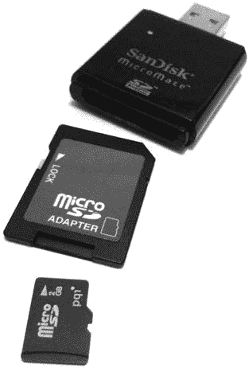
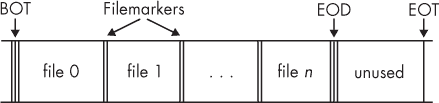

## 第七章：**取证图像获取**


本章解释了存储介质的取证成像，重点是执行取证性图像获取。这意味着最大化从特定存储介质中提取的数据量，最小化对存储设备和介质的干扰，保存收集到的证据，并记录过程（包括错误）。

你将在这里阅读到几种工具和方法，以及每种工具的优缺点。结果，你将能够根据特定情况做出明智的决定，选择最合适的工具。你将学习如何使用多种免费的或开源的取证成像工具，例如 dd、dcfldd、dc3dd、ewfacquire 和 ftkimager-cli。此外，我还描述了 sfsimage 工具，这是一个使用现有获取工具创建 SquashFS 取证证据容器的脚本。

在进行磁盘成像时，如何选择使用哪个工具？在某种程度上，这取决于个人偏好。你可能比其他工具更熟悉某个工具，或者基于过去的经验信任某个特定的工具（或者由于过去的经验不信任某个工具）。每个工具都有其优势和独特的功能。广泛使用 EnCase 或 FTK 的取证实验室可能会选择 ewfacquire 或 ftkimager-cli，出于兼容性和政策原因。dcfldd 和 dc3dd 基于成熟且经过充分测试的软件，旨在进行取证性原始图像获取，并且具备广泛的哈希计算和日志记录功能。对于具有许多坏道的磁盘，GNU ddrescue 可能是一个不错的选择。对于在获取过程中进行集成哈希、加密和压缩，近期版本的 dd_rescue 可能是一个有趣的替代方案。最终，所使用的工具将取决于取证实验室的组织政策、检查类型、个人偏好以及其他情况。本书中没有推荐特定的工具。

本章中的所有示例都基于以下假设：

• 受检存储设备物理上连接到取证检查员的获取工作站。

• 受检存储设备已被确认。

• 已采取适当的写入阻断措施，以防止修改受检驱动器。

• 已经进行了磁盘容量规划，以确保磁盘空间不成为问题。

### 使用 dd 工具获取图像

使用基于 dd 的工具生成的图像文件，并不像其他取证格式（例如 EnCase EWF 或 FTK SMART）那样是“格式”。由 dd 工具创建的图像没有头部、尾部、内部标记，或者有关案件或事件的描述性元数据。它们只是数据的一种原始镜像，在本例中，是受检磁盘或其他大容量存储的镜像。

**注意**

***警告：** 如果你犯任何错误，dd 工具将毫不宽容地不可逆地覆盖任何未受保护的磁盘。*

为了减少损坏证据或检查工作站的风险，始终仔细检查以下事项：

• 写保护器正在保护证据/目标驱动器。

• 输入设备的序列号（`if=`）与物理目标磁盘标签上的序列号匹配。

• 确认输出文件（`of=`）是一个普通文件，位于检查员系统中，或者是一个能够处理预期输入的程序，接收标准输入（stdin）。

#### *标准 Unix dd 和 GNU dd*

dd 命令的语法简单地指定了输入文件和输出文件，并且可以包括其他选项来修改命令的行为。以下示例展示了使用 dd 将磁盘块设备复制到文件的操作：

```
# dd if=/dev/sde of=image.raw
15466496+0 records in
15466496+0 records out
7918845952 bytes (7.9 GB) copied, 130.952 s, 60.5 MB/s
```

这里的 `if=` 指定了输入文件，在此情况下是连接到采集系统的原始磁盘设备。`of=` 参数是输出文件，它是一个包含从磁盘设备复制的原始数据的普通文件。完成后，dd 会报告传输了多少字节。你可以将传输的字节数除以扇区大小，结果应该与连接设备时识别的扇区数完全匹配。

在使用 dd 进行法证磁盘成像时可能会遇到挑战。如果在采集过程中发生读取错误，dd 会以“输入/输出错误”中止。通过添加 `conv=noerror` 可以解决这个问题，它会强制 dd 跳过无法读取的块并继续执行。跳过无法读取的块的问题在于，目标文件中的扇区偏移会发生变化，这会导致磁盘其余部分的文件系统块出现错误。例如，考虑一本书的页面。假设 第 99 页被撕掉。如果目录指向以 第 200 页 开头的章节，仍然可以找到它。即使缺少一页，书的页码仍然是完整的。但是，当磁盘镜像中的第 99 扇区由于读取错误被撕掉时，情况就不同了。其余的扇区会重新编号，文件系统的“目录”会在第 99 扇区之后指向错误的块。

`sync` 参数通过用零填充无法读取的输出块来修正这一问题，实质上创建了一个“虚拟”扇区或块（全是零），以代表丢失的块。磁盘镜像的其余部分将会有文件系统期望的正确扇区号（偏移量）。

使用前面的示例，但这次启用了防止读取错误块（跳过并用零填充它们），结果如下：

```
# dd if=/dev/sde of=image.raw conv=noerror,sync
15466496+0 records in
15466496+0 records out
7918845952 bytes (7.9 GB) copied, 136.702 s, 57.9 MB/s
```

填充输出会影响取证获取，因为镜像已经被修改并添加了新数据（零）。磁盘的加密校验和将与磁盘上的原始数据不匹配（特别是当磁盘上有新的或变化的不可读区域时）。这个问题可以通过记录哈希窗口来管理。有关这一点，请参见 “哈希窗口” 第 152 页。

dd 的另一个问题是，传输块的大小可能大于物理介质的扇区大小。当发生读取错误时，这是一个问题，因为较大的块中剩余的扇区会被填充零，而不仅仅是不可读的一个扇区。这意味着一些正常可读的扇区可能会被排除在取证镜像之外。大于扇区大小的块大小还可能导致在取证镜像的末尾添加额外的填充扇区（如果镜像大小不能被块大小整除）。增加块大小可能带来的性能提升，必须与丢失来自大填充块的证据的风险进行权衡。

传统的 dd 工具没有哈希、日志记录或其他你期望从取证获取工具中得到的功能。由于原始镜像不包含关于原始磁盘的元数据，你必须单独记录任何描述磁盘的信息（或将部分信息嵌入到文件名中）。

#### *dcfldd 和 dc3dd 工具*

两个流行的 dd 派生工具，dcfldd 和 dc3dd，都是专门为取证环境独立开发的。

因为 dcfldd 和 dc3dd 都源自 GNU dd，所以它们使用相似的命令语法。两个工具都没有内置支持写入取证格式（FTK、EnCase、AFF）、压缩或镜像加密。但你可以通过使用命令管道来实现这些功能，我将在后续部分进行演示。

以下例子使用 dcfldd 来对磁盘进行镜像，确保包含不可读扇区的块会被填充，并且不会导致中止：

```
# dcfldd if=/dev/sde of=image.raw conv=noerror,sync errlog=error.log
241664 blocks (7552Mb) written.
241664+0 records in
241664+0 records out
```

错误会被写入单独的错误日志文件。dcfldd 工具默认不使用 `conv=noerror,sync`，你必须手动添加它。

下一个例子展示了 dc3dd 的类似镜像命令。默认情况下，dc3dd 在获取过程中能够很好地管理错误。无需 `conv=noerror,sync` 标志，因为它是内置的。输出会很好地记录，既写入 `stdout`，也写入日志文件。这里是一个简单的获取示例：

```
# dc3dd if=/dev/sde of=image.raw log=error.log

dc3dd 7.2.641 started at 2016-05-07 14:37:10 +0200
compiled options:
command line: dc3dd if=/dev/sde of=image.raw log=error.log
device size: 15466496 sectors (probed),    7,918,845,952 bytes
sector size: 512 bytes (probed)
  7918845952 bytes ( 7.4 G ) copied ( 100% ),   80 s, 95 M/s

input results for device `/dev/sde':
   15466496 sectors in
   0 bad sectors replaced by zeros
output results for file `image.raw':
   15466496 sectors out

dc3dd completed at 2016-05-07 14:38:30 +0200
```

你也可以配置 sfsimage 脚本，使用 dcfldd 或 dc3dd 将数据镜像到 SquashFS 取证容器中。在以下例子中，使用 sfsimage 镜像一个 4K 原生（4096 字节原生扇区大小）驱动器：

```
# sfsimage -i /dev/sdd 4Knative.sfs
Started: 2016-05-07T17:16:54
Sfsimage version: Sfsimage Version 0.8
Sfsimage command: /usr/bin/sfsimage -i /dev/sdd
Current working directory: /exam
Forensic evidence source: if=/dev/sdd
Destination squashfs container: 4Knative.sfs
Image filename inside container: image.raw
Aquisition command: sudo dc3dd if=/dev/sdd log=errorlog.txt hlog=hashlog.txt
    hash=md5 2>/dev/null | pv -s 3000592982016
2.73TiB 5:29:31 [ 144MiB/s] [==========================================>] 100%
Completed: 2016-05-07T22:47:42
# cat /sys/block/sdd/queue/logical_block_size
4096
# cat /sys/block/sdd/queue/physical_block_size
4096
```

这个例子也说明了，当使用 dd 风格的镜像工具时，驱动器的物理和逻辑扇区大小不会影响获取过程。

dcfldd 和 dc3dd 具有额外的功能，包括加密哈希、镜像拆分和与外部程序的管道传输。我将在本书的接下来的部分中展示这些功能在各种情况下的应用。

### 使用取证格式采集镜像

有几个成像格式是专门为取证设计的。例如，FTK 和 EnCase 是商业专有格式，已经被逆向工程化，以便开发兼容开源工具。接下来的两节将介绍使用这些专有格式进行采集的工具。

#### *ewfacquire 工具*

ewfacquire 是一个专门用于 Guidance EnCase Expert Witness 格式的采集工具，来自 libewf (*[`github.com/libyal/libewf/`](https://github.com/libyal/libewf/)*)。该工具可以在命令行上接受信息性参数，或者交互式地询问用户。你可以从多个商业格式中进行选择，包括各种 EnCase 格式以及 FTK。ewfacquire 工具创建的采集文件支持与 EnCase、FTK 和 Sleuth Kit 的互操作性。该工具还可以将原始镜像转换为其他格式。

本示例展示了 ewfacquire 采集一个附加的磁盘设备（一个通过 Thunderbolt 到 FireWire 适配器连接到检查工作站的 MacBook Air，处于目标磁盘模式）：

```
# ewfacquire -c best -t /exam/macbookair /dev/sdf
ewfacquire 20160424

Device information:
Bus type:                             FireWire (IEEE1394)
Vendor:
Model:
Serial:

Storage media information:
Type:                                 Device
Media type:                           Fixed
Media size:                           121 GB (121332826112 bytes)
Bytes per sector:                     512

Acquiry parameters required, please provide the necessary input
Case number: 42
Description: The case of the missing vase
Evidence number: 1
Examiner name: holmes
Notes: The vase was blue.
Media type (fixed, removable, optical, memory) [fixed]:
Media characteristics (logical, physical) [physical]:
Use EWF file format (ewf, smart, ftk, encase1, encase2, encase3, encase4, encase5,
    encase6, encase7, encase7-v2, linen5, linen6, linen7, ewfx) [encase6]:
Start to acquire at offset (0 <= value <= 121332826112) [0]:
The number of bytes to acquire (0 <= value <= 121332826112) [121332826112]:
Evidence segment file size in bytes (1.0 MiB <= value <= 7.9 EiB) [1.4 GiB]:
The number of bytes per sector (1 <= value <= 4294967295) [512]:
The number of sectors to read at once (16, 32, 64, 128, 256, 512, 1024, 2048, 4096,
    8192, 16384, 32768) [64]:
The number of sectors to be used as error granularity (1 <= value <= 64) [64]:
The number of retries when a read error occurs (0 <= value <= 255) [2]:
Wipe sectors on read error (mimic EnCase like behavior) (yes, no) [no]:

The following acquiry parameters were provided:
Image path and filename:                /exam/macbookair.E01
Case number:                            42
Description:                            The case of the missing vase
Evidence number:                        1
Examiner name:                          holmes
Notes:                                  The vase was blue.
Media type:                             fixed disk
Is physical:                            yes
EWF file format:                        EnCase 6 (.E01)
Compression method:                     deflate
Compression level:                      best
Acquiry start offset:                   0
Number of bytes to acquire:             113 GiB (121332826112 bytes)
Evidence segment file size:             1.4 GiB (1572864000 bytes)
Bytes per sector:                       512
Block size:                             64 sectors
Error granularity:                      64 sectors
Retries on read error:                  2
Zero sectors on read error:             no

Continue acquiry with these values (yes, no) [yes]:

Acquiry started at: May 07, 2016 14:54:52
This could take a while.

Status: at 0.0%
        acquired 60 MiB (62914560 bytes) of total 113 GiB (121332826112 bytes)
        completion in 2 hour(s), 8 minute(s) and 38 second(s) with 14 MiB/s
    (15712616 bytes/second)
...
Status: at 99.9%
        acquired 112 GiB (121329188864 bytes) of total 113 GiB (121332826112 bytes)
        completion in 0 second(s) with 51 MiB/s (54069886 bytes/second)

Acquiry completed at: May 07, 2016 15:32:16

Written: 113 GiB (121332826300 bytes) in 37 minute(s) and 24 second(s) with
    51 MiB/s (54069886 bytes/second)
MD5 hash calculated over data:          083e2131d0a59a9e3b59d48dbc451591
ewfacquire: SUCCESS
```

ewfacquire 采集在 37 分钟内成功完成，120GB 文件被拆分为 54 个压缩的**.E0*文件，总计 79GB。

#### *AccessData ftkimager*

AccessData 提供了免费的、预编译的命令行版本 FTK Imager。该工具名为 ftkimager，二进制文件（没有源代码）适用于 Debian Linux、Fedora Linux、OS X 和 Windows，你可以从 AccessData 网站下载，网址是*[`accessdata.com/product-download/digital-forensics/`](http://accessdata.com/product-download/digital-forensics/)*。

ftkimager 工具可以从原始设备、文件或 stdin 接收输入。它可以输出到 FTK SMART 格式、EnCase EWF 格式或 stdout。stdin 和 stdout 流特别适用于与其他程序之间的管道传输。还支持许多其他功能，包括将案件元数据添加到保存的格式中、压缩、输出文件拆分（“镜像碎片”）、哈希处理和加密镜像。

以下基本示例演示了使用 ftkimager 获取附加磁盘：

```
# ftkimager /dev/sdf --s01 --description "SN4C53000120 Ultra Fit" sandisk
AccessData FTK Imager v3.1.1 CLI (Aug 24 2012)
Copyright 2006-2012 AccessData Corp., 384 South 400 West, Lindon, UT 84042
All rights reserved.

Creating image...
Image creation complete.
```

在此示例中，源设备是通过*/dev/sdf*访问的 SanDisk U 盘，目标文件名是*sandisk*。由于默认格式是原始格式，添加`--s01`标志将其保存为 FTK 的 SMART 格式。通过`--description`标志添加了一个序列号和型号字符串到元数据中。

ftkimager 创建了一个日志文件，记录了基本元数据以及使用命令行标志添加的任何附加信息，如下所示：

```
# cat sandisk.s01.txt
Case Information:
Acquired using: ADI3
Case Number:
Evidence Number:
Unique description: SN4C53000120 Ultra Fit
Examiner:
Notes:

--------------------------------------------------------------

Information for sandisk:

Physical Evidentiary Item (Source) Information:
[Device Info]
 Source Type: Physical
[Drive Geometry]
 Cylinders: 14832
 Heads: 64
 Sectors per Track: 32
 Bytes per Sector: 512
 Sector Count: 30375936
 Source data size: 14832 MB
 Sector count:    30375936
[Computed Hashes]
 MD5 checksum:    a2a9a891eed92edbf47ffba9f4fad402
 SHA1 checksum:   2e73cc2a2c21c9d4198e93db04303f9b38e0aefe

Image Information:
 Acquisition started:   Sat May  7 15:49:07 2016
 Acquisition finished:  Sat May  7 15:53:07 2016
 Segment list:
  sandisk.s01
  sandisk.s02
```

你可以通过使用`--print-info`标志并结合文件名来提取相同的信息。

#### *SquashFS 取证证据容器*

sfsimage 工具仅仅是一个 shell 包装脚本，你可以配置它以使用任何支持将镜像干净地写入 stdout 的镜像工具。该脚本将这些成像字节流放入一个 SquashFS 压缩文件系统中。

在这个示例中，通过编辑 shell 脚本开头的`DD`变量，sfsimage 被配置为使用 dc3dd 作为成像工具：

```
DD="dc3dd if=$DDIN log=errorlog.txt hlog=hashlog.txt hash=md5"
```

然后，使用`-i`标志对块设备进行镜像：

```
$ sfsimage -i /dev/sde philips-usb-drive.sfs
Started: 2016-05-07T15:40:03
Sfsimage version: Sfsimage Version 0.8
Sfsimage command: /usr/bin/sfsimage -i /dev/sde
Current working directory: /exam
Forensic evidence source: if=/dev/sde
Destination squashfs container: philips-usb-drive.sfs
Image filename inside container: image.raw
Aquisition command: sudo dc3dd if=/dev/sde log=errorlog.txt hlog=hashlog.txt
    hash=md5 2>/dev/null | pv -s 7918845952
7.38GiB 0:01:18 [95.7MiB/s] [=====================================>] 100%
Completed: 2016-05-07T15:41:22
```

以下输出显示了压缩后的**.sfs**文件的大小：

```
$ ls -lh *.sfs
-rw-r----- 1 holmes holmes 4.5G May  7 15:41 philips-usb-drive.sfs
```

你可以使用`sfsimage -l`列出 SquashFS 容器文件的内容，或者使用`sfsimage -m`挂载它（只读）。在获取过程中，sfsimage 会保存错误日志、哈希日志以及它自己的日志，并将其与原始镜像文件一起保存。你可以使用`sfsimage -a`将额外的文件添加到 sfsimage 容器中。

#### *获取图像到多个目标位置*

Unix 管道机制的灵活性使得在单一步骤中可以完成多个复杂任务。dc3dd 和 dcfldd 都可以指定多个目标文件名，从而使得可以同时进行镜像复制。以下示例展示了如何对磁盘进行镜像，并同时将数据写入多个目标驱动器：一个是本地主机上的本地副本，另一个是已挂载的外部第三方驱动器上的副本。这两个输出文件通过多个`of=`标志来指定，如下所示：

```
# dc3dd if=/dev/sde of=/exam/local-lab.raw of=/ext/third-party.raw

dc3dd 7.2.641 started at 2016-05-07 15:56:10 +0200
compiled options:
command line: dc3dd if=/dev/sde of=/exam/local-lab.raw of=/ext/third-party.raw
device size: 15466496 sectors (probed),    7,918,845,952 bytes
sector size: 512 bytes (probed)
  7918845952 bytes ( 7.4 G ) copied ( 100% ),   79 s, 95 M/s

input results for device `/dev/sde':
   15466496 sectors in
   0 bad sectors replaced by zeros

output results for file `/exam/local-lab.raw':
   15466496 sectors out

output results for file `/ext/third-party.raw':
   15466496 sectors out

dc3dd completed at 2016-05-07 15:57:30 +0200
```

这种技术在你创建一个用于分析的镜像和一个用于备份的镜像时非常有用，也适用于你为第三方创建额外镜像的情况，或者任何需要多个镜像副本的情况。这两个镜像应该是完全相同的，你可以通过比较加密校验和来验证它们。

### 使用加密技术保存数字证据

保证证据的完整性是数字取证过程中的基础。通过使用加密哈希并通过执行获取的技术人员进一步增强加密签名，可以保持完整性。哈希或签名镜像的目的是验证镜像自获取以来没有发生变化。由于法庭程序和证据展示可能需要几个月甚至几年的时间，因此确认证据在此期间没有被修改非常有用。这可以被视为一种数字化的证据链。

接下来的几个部分展示了使用哈希窗口、PGP 和 S/MIME 签名以及 RFC-3161 时间戳来保存数字证据。我们先从一些基本的加密哈希示例开始。

#### *基本的加密哈希*

数字取证镜像的加密哈希通常是成像过程的一部分。整个媒体镜像（每个扇区按顺序）会通过单向哈希函数。到目前为止，本书讨论的四个主要的取证成像工具支持表 6-1 中所示的加密哈希算法。

**表 6-1：** 支持的加密哈希算法

| **工具** | **支持的哈希算法** |
| --- | --- |
| dcfldd | MD5, SHA1, SHA256, SHA384, SHA512 |
| dc3dd | MD5, SHA1, SHA256, SHA512 |
| ewfacquire | MD5, SHA1, SHA256 |
| ftkimager | MD5, SHA1 |

使用取证格式的工具通常会默认生成哈希值。ftkimager 和 ewfacquire 会在采集过程中自动生成哈希值，这一点你在前面的示例中已经看到了。

要使用 dcfldd 创建哈希（或多个哈希），你需要在命令行中指定所需的哈希算法，如下所示：

```
# dcfldd if=/dev/sde of=image.raw conv=noerror,sync hash=md5,sha256
241664 blocks (7552Mb) written.Total (md5): ebda11ffb776f183325cf1d8941109f8
Total (sha256): 792996cb7f54cbfd91b5ea9d817546f001f5f8ac05f2d9140fc0778fa60980a2

241664+0 records in
241664+0 records out
```

使用 dc3dd 时，你可以通过多次使用`hash=`来指定哈希算法，如下所示：

```
# dc3dd if=/dev/sde of=image.raw hash=md5 hash=sha1 hash=sha512

dc3dd 7.2.641 started at 2016-05-07 16:02:56 +0200
compiled options:
command line: dc3dd if=/dev/sde of=image.raw hash=md5 hash=sha1 hash=sha512
device size: 15466496 sectors (probed),    7,918,845,952 bytes
sector size: 512 bytes (probed)
  7918845952 bytes ( 7.4 G ) copied ( 100% ),   80 s, 94 M/s
input results for device `/dev/sde':
   15466496 sectors in
   0 bad sectors replaced by zeros
   ebda11ffb776f183325cf1d8941109f8 (md5)
   62e5045fbf6a07fa77c48f82eddb59dfaf7d4d81 (sha1)
   f0d1132bf569b68d900433aa52bfc08da10a4c45f6b89847f244834ef20bb04f8c35dd625a31c2e3
   a29724e18d9abbf924b16d8f608f0ff0944dcb35e7387b8d (sha512)

output results for file `image.raw':
   15466496 sectors out

dc3dd completed at 2016-05-07 16:04:17 +0200
```

传统的 `dd` 命令不支持哈希。相反，你必须在采集过程中将镜像管道传输到一个独立的程序，这可以通过使用 Unix 的 `tee` 命令来实现：

```
# dd if=/dev/sde | tee image.raw | md5sum
15466496+0 records in
15466496+0 records out
7918845952 bytes (7.9 GB, 7.4 GiB) copied, 108.822 s, 72.8 MB/s
ebda11ffb776f183325cf1d8941109f8 -
```

当`dd`没有指定`of=`时，数据会被发送到 stdout，可以将其重定向或管道传输到另一个程序。在这个例子中，它被管道传输到 Unix 的 `tee` 命令，该命令同时将数据保存到文件并将其发送到 stdout。然后，它被管道传输到独立的哈希工具 md5sum，这时它会生成哈希。除了 md5sum 之外，Linux 的 coreutils 软件包还包括其他哈希程序：sha1sum、sha224sum、sha256sum、sha384sum 和 sha512sum。

我在 “验证取证镜像的完整性” 章节中解释了验证生成的哈希的过程，详见 第 197 页。

#### *哈希窗口*

当你对旧的或损坏的磁盘进行镜像时，可能会出现块读取错误。这些错误可能在采集过程中随机发生，且随着时间的推移，发生的频率可能增加。这会在保全证据的完整性时带来挑战，因为每次读取磁盘时（重新采集、复制、验证等），加密哈希可能会不同。

解决这个问题的方法是使用哈希窗口，或分段哈希。哈希窗口是对磁盘上较小一段扇区序列进行的独立加密哈希。例如，在采集过程中使用 10MB 的哈希窗口大小，会为每 10MB 的扇区序列生成一个单独的哈希，并为磁盘生成一个哈希列表。如果某个扇区变得无法读取（或因某种原因被修改），该窗口的哈希将无效。但磁盘上其他的哈希窗口仍然会保持其完整性。因此，即使整个磁盘的哈希无效，如果某个哈希窗口匹配，窗口内数据的完整性也会得到保留。

在商业取证格式中，早期版本的专家证人格式（EWF）仅使用循环冗余校验（CRC）校验和对数据的单独块进行检查。更新版本不是开放格式，且 ftkimager 没有创建或查看哈希窗口的选项。

要使用 dcfldd 创建哈希窗口，您需要添加`hashwindow=`参数来指定窗口大小。您可以在获取过程中使用`hashlog=`参数并指定文件名，将哈希窗口列表保存到文件中。以下示例指定了 1MB 的哈希窗口大小，并将每个扇区范围的哈希值记录到 stdout：

```
# dcfldd if=/dev/sde of=image.raw conv=noerror,sync hashwindow=1M
0 - 1048576: e0796359399e85ecc03b9ca2fae7b9cf
1048576 - 2097152: 5f44a2407d244c24e261b00de65949d7
2097152 - 3145728: d6d8c4ae64b464dc77658730aec34a01
3145728 - 4194304: 0eae942f041ea38d560e26dc3cbfac48
4194304 - 5242880: 382897281f396b70e76b79dd042cfa7f
5242880 - 6291456: 17664a919d533a91df8d26dfb3d84fb9
6291456 - 7340032: ce29d3ca2c459c311eb8c9d08391a446
7340032 - 8388608: cd0ac7cbbd58f768cd949b082de18d55
256 blocks (8Mb) written.8388608 - 9437184: 31ca089fce536aea91d957e070b189d8
9437184 - 10485760: 48586d6dde4c630ebb168b0276bec0e3
10485760 - 11534336: 0969f7533736e7a2ee480d0ca8d9fad1
...
```

相同的磁盘扇区组将具有相同的哈希值。这通常发生在磁盘的较大部分是零值或重复模式时。

使用 dc3dd 时，哈希窗口被称为*分段哈希*，哈希可以通过每个拆分文件创建，而不是通过扇区范围。在下面的示例中，每个拆分文件中扇区范围的哈希值都会被记录：

```
# dc3dd if=/dev/sda hof=image.raw ofs=image.000 ofsz=1G hlog=hash.log hash=md5

dc3dd 7.2.641 started at 2016-05-07 17:10:31 +0200
compiled options:
command line: dc3dd if=/dev/sda hof=image.raw ofs=image.000 ofsz=1G hlog=hash.log
    hash=md5
device size: 15466496 sectors (probed),    7,918,845,952 bytes
sector size: 512 bytes (probed)
  7918845952 bytes ( 7.4 G ) copied ( 100% ),  114 s, 66 M/s
  7918845952 bytes ( 7.4 G ) hashed ( 100% ),   24 s, 314 M/s

input results for device `/dev/sda':
   15466496 sectors in
   0 bad sectors replaced by zeros
   5dfe68597f8ad9f20600a453101f2c57 (md5)
   c250163554581d94958018d8cca61db6, sectors 0 - 2097151
   cd573cfaace07e7949bc0c46028904ff, sectors 2097152 - 4194303
   83d63636749194bcc7152d9d1f4b9df1, sectors 4194304 - 6291455
   da961f072998b8897c4fbed4c0f74e0e, sectors 6291456 - 8388607
   4cd5560038faee09da94a0c829f07f7a, sectors 8388608 - 10485759
   516ba0bdf8d969fd7e86cd005c992600, sectors 10485760 - 12582911
   c19f8c710088b785c3f2ad2fb636cfcd, sectors 12582912 - 14680063
   fb2eb5b178839878c1778453805b8bf6, sectors 14680064 - 15466495

output results for file `image.raw':
   15466496 sectors out
   [ok] 5dfe68597f8ad9f20600a453101f2c57 (md5)

output results for files `image.000':
   15466496 sectors out

dc3dd completed at 2016-05-07 17:12:25 +0200
```

如果只有一个镜像文件（即没有拆分），则没有单独的哈希窗口，只有一个针对整个镜像的哈希值。在前面的示例中，创建了八个镜像文件，每个文件的 MD5 哈希值与获取时报告的值一致。可以使用 md5sum 轻松确认，如下所示：

```
# md5sum image.*
c250163554581d94958018d8cca61db6  image.000
cd573cfaace07e7949bc0c46028904ff  image.001
83d63636749194bcc7152d9d1f4b9df1  image.002
da961f072998b8897c4fbed4c0f74e0e  image.003
4cd5560038faee09da94a0c829f07f7a  image.004
516ba0bdf8d969fd7e86cd005c992600  image.005
c19f8c710088b785c3f2ad2fb636cfcd  image.006
fb2eb5b178839878c1778453805b8bf6  image.007
```

#### *使用 PGP 或 S/MIME 签名镜像文件*

哈希值对于在时间上保持镜像的完整性非常有用，但任何人都可以随时对镜像进行加密哈希。考虑一个磁盘被未经授权的人修改，并为该磁盘镜像创建一个新的哈希值。除非原始哈希在获取时被妥善保管，否则很难证明哪个哈希值（旧的还是新的）是正确的。对取证镜像进行加密签名将某个人（或该人的密钥）与镜像的完整性绑定。取证检查员、上级或外部中立方可以在获取时签署该镜像。

这并不意味着您需要传递多个 TB 大小的镜像文件让别人签名。只需签名磁盘的哈希值或哈希窗口列表即可。最佳选择是签名包含时间戳、获取字节数和所有生成的加密哈希值的完整输出日志。

就像授权的个人用钢笔签署纸质表格一样，他们也可以使用数字签名签署数字表格。与钢笔和纸质签名不同，数字签名很难伪造（除非私钥被盗）。两种常见的数字签名标准是*Pretty Good Privacy (PGP)*和*Secure/Multipurpose Internet Mail Extensions (S/MIME)*。

最常见的 Linux OpenPGP 标准实现是 GnuPG (GPG)。^(1) 三种不同的签名方法包括常规二进制签名、明文签名和分离签名。使用明文签名是最有利的，因为它可以将文本与签名一起显示，并且可以轻松嵌入到其他文档和报告中。

在以下示例中，S. Holmes 进行了磁盘的取证获取，并签署了包含 MD5 哈希值和其他详细信息的日志输出：

```
$ gpg --clearsign hash.log

You need a passphrase to unlock the secret key for
user: "Sherlock Holmes <holmes@digitalforensics.ch>"
2048-bit RSA key, ID CF87856B, created 2016-01-11

Enter passphrase:
```

上述命令创建了 *hash.log.asc* 文件，其中包含文件的内容以及签名：

```
$ cat hash.log.asc
-----BEGIN PGP SIGNED MESSAGE-----
Hash: SHA1

dc3dd 7.2.641 started at 2016-05-07 17:23:49 +0200
compiled options:
command line: dc3dd if=/dev/sda hof=image.raw ofs=image.000 ofsz=1G hlog=hash.log
    hash=md5

input results for device `/dev/sda':
   5dfe68597f8ad9f20600a453101f2c57 (md5)
      c250163554581d94958018d8cca61db6, sectors 0 - 2097151
      cd573cfaace07e7949bc0c46028904ff, sectors 2097152 - 4194303
      83d63636749194bcc7152d9d1f4b9df1, sectors 4194304 - 6291455
      da961f072998b8897c4fbed4c0f74e0e, sectors 6291456 - 8388607
      4cd5560038faee09da94a0c829f07f7a, sectors 8388608 - 10485759
      516ba0bdf8d969fd7e86cd005c992600, sectors 10485760 - 12582911
      c19f8c710088b785c3f2ad2fb636cfcd, sectors 12582912 - 14680063
      fb2eb5b178839878c1778453805b8bf6, sectors 14680064 - 15466495

output results for file `image.raw':
   [ok] 5dfe68597f8ad9f20600a453101f2c57 (md5)

output results for files `image.000':

dc3dd completed at 2016-05-07 17:25:40 +0200

-----BEGIN PGP SIGNATURE-----
Version: GnuPG v1

iQEcBAEBAgAGBQJXLgnoAAoJEEg0vvzPh4VrdeAH/0EhCLFSWwTZDNUrIn++1rI3
XI6KuwES19EKR18PrK/Nhf5MsF3xyy3c/j7tjopkfnDGLYRA615ycWEvIJlevNh7
k7QHJoPTDnyJcF29uuTINPWk2MsBlkNdTTiyA6ab3U4Qm+DMC4wVKpOp/io52qq3
KP7Kh558aw8m+0Froc0/4sF7rer9xvBThA2cw+ZiyF5a8wTCBmavDchCfWm+NREr
RIncJV45nuHrQW8MObPOK6G34mruT9nSQFH1LR1FL830m/W69WHS2JX+shfk5g5X
I6I7jNEn6FgiRyhm+BizoSl5F6mv3ff6mRlVysGDJ+FXE3CiE6ZzK+jNB7Pw+Zg=
=6GrG
-----END PGP SIGNATURE-----
```

该签名文本可以通过任何第三方使用 Holmes 的 GPG 公钥副本在以后进行验证。

另一种可以用来签署文件的加密标准是 S/MIME。S/MIME 的使用依赖于来自公钥基础设施（PKI）的 X.509 证书，这些证书可以是组织内私有的，也可以来自公共证书颁发机构（CA）。如果授权人员拥有个人证书（通常是他们用来签署和加密 S/MIME 电子邮件的证书），他们可以使用它来签署包含获取细节的文件。

gpgsm 工具是 GnuPG2 的一部分，支持使用 S/MIME 标准管理 X.509 密钥、加密和签名。一旦生成了必要的密钥并安装了证书，您就可以像使用 GPG 一样使用 gpgsm 对文件进行签名。以下命令对指定的文件生成签名：

```
$ gpgsm -a -r holmes@digitalforensics.ch -o hash.log.pem --sign hash.log
```

`-a` 标志指定应使用 ASCII 装甲，这是一种将二进制数据以明文格式编码的方法，而不是使用二进制（因为它更容易复制到报告或电子邮件中）。`-r` 标志指定用于签名的接收者密钥。在这个命令示例中，使用的是电子邮件地址，但也可以通过密钥 ID、指纹或匹配的 X.509 字符串组件来指定密钥。`-o` 指定签名的输出文件，`--sign` 指示 gpgsm 对指定的 *hash.log* 文件进行签名。

在签名时，gpgsm 将创建一个 PEM^(2) 签名文件，内容类似于以下内容：

```
-----BEGIN SIGNED MESSAGE-----
MIAGCSqGSIb3DQEHAqCAMIACAQExDzANBglghkgBZQMEAgEFADCABgkqhkiG9w0B
BwGggCSABIICIApkYzNkZCA3LjIuNjQxIHN0YXJ0ZWQgYXQgMjAxNi0wMS0xMSAy
...
GR2YC4Mx5xQ63Kbxg/5BxT7rlC7DBjHOVMCMJzVPy4OVUOXPnL2IdP2dhvkOtojk
UKIjSw40xIIAAAAAAAA=
-----END SIGNED MESSAGE-----
```

一旦由授权方创建了签名，原始法医获取的哈希值和细节就无法更改。只有创建签名的人才能进行更改并重新签名。^(3) 使用这些签名，可以验证获取细节的完整性，而无需涉及签名的人。我在第七章中描述了签名验证过程。

您可以购买类似于网站 SSL 证书的个人 S/MIME 证书。您可以在 *[`www.sslshopper.com/email-certificates-smime-certificates.html`](https://www.sslshopper.com/email-certificates-smime-certificates.html)* 查看提供个人 S/MIME 证书的 CA 概述。使用个人 S/MIME 证书，您也可以通过发送包含输出日志内容的签名电子邮件消息来简单地签署获取细节。

本节中显示的示例很简单，使用了 GNU 隐私保护工具。还有其他命令行工具可以用于执行加密签名。OpenSSL 命令行工具提供了丰富的加密工具包，包括使用 X.509 证书和 S/MIME 签署文件的能力。下一节将使用 OpenSSL 演示加密时间戳。

#### *RFC-3161 时间戳*

使用 PGP 或 S/MIME 签名可以将授权个人（或多个个人）强烈绑定到包含取证获取结果的文件的完整性上。在某些情况下，将取证获取结果强烈绑定到特定时间点也是非常有用的。你可以通过使用独立的时间戳服务来做到这一点。

时间戳是一个正式的标准，定义在 RFC-3161 中，描述了时间戳请求和响应的格式。OpenSSL 可以创建和发送时间戳请求并验证响应。在以下示例中，创建了一个符合 RFC-3161 标准的时间戳请求，用于获取日志，生成一个带有 **.tsq* 扩展名的请求文件：

```
$ openssl ts -query -data hash.log -out hash.log.tsq -cert
```

这个时间戳请求包含 *hash.log* 文件的哈希值，而不是实际的文件。文件*不会*发送到时间戳服务器。这从信息安全的角度来看非常重要。时间戳服务提供商只会信任时间戳信息，而不是被时间戳的文件内容。

然后，可以使用 OpenSSL 中包含的 `tsget` 命令将生成的请求发送到时间戳服务。^(4) 以下示例使用 FreeTSA 服务：

```
$ tsget -h https://freetsa.org/tsr hash.log.tsq
```

在某些 Linux 发行版中，可能缺少或损坏这个脚本。你可以通过手动提交时间戳请求，使用 `curl` 命令来绕过它，命令如下：

```
$ curl -s -H "Content-Type: application/timestamp-query" --data-binary
    "@hash.log.tsq" https://freetsa.org/tsr > hash.log.tsr
```

如果时间戳服务器接受请求，它会返回一个符合 RFC-3161 标准的时间戳。在这个例子中，时间戳会以 **.tsr* 文件扩展名保存到 `hash.log.tsr` 中。你可以使用 OpenSSL `ts` 命令查看时间戳的内容：

```
$ openssl ts -reply -in hash.log.tsr -text
Status info:
Status: Granted.
Status description: unspecified
Failure info: unspecified

TST info:
Version: 1
Policy OID: 1.2.3.4.1
Hash Algorithm: sha1
Message data:
    0000 - 63 5a 86 52 01 24 72 43-8e 10 24 bc 24 97 d0 50   cZ.R.$rC..$.$..P
    0010 - 4a 69 ad a9                                       Ji..
Serial number: 0x0AF4
Time stamp: May  7 22:03:49 2016 GMT
Accuracy: 0x01 seconds, 0x01F4 millis, 0x64 micros
Ordering: yes
Nonce: 0xBC6F68553A3E5EF5
TSA: DirName:/O=Free TSA/OU=TSA/description=This certificate digitally signs
    documents and time stamp requests made using the freetsa.org online
    services/CN=www.freetsa.org/emailAddress=busilezas@gmail.com/L=Wuerzburg/
    C=DE/ST=Bayern
Extensions:
```

*hash.log.tsr* 文件的副本提供了一个证明，表明获取结果在特定时间点存在。独立的第三方也可以验证时间戳的有效性。我将在第七章中演示时间戳的验证。

互联网上有许多免费和商业的时间戳服务。这里列出了一些示例：

• Comodo RFC-3161 时间戳服务: *[`timestamp.comodoca.com/?td=sha256`](http://timestamp.comodoca.com/?td=sha256)*

• FreeTSA: *[`freetsa.org/index_en.php`](http://freetsa.org/index_en.php)*

• 波兰 CERTUM PCC - 一般认证机构: *[`time.certum.pl/`](http://time.certum.pl/)*

• Safe Creative 时间戳认证机构（TSA）服务器: *[`tsa.safecreative.org/`](http://tsa.safecreative.org/)*

• StartCom 免费 RFC-3161 时间戳服务: *[`tsa.startssl.com/rfc3161`](http://tsa.startssl.com/rfc3161)*

• DFN-PKI 的 Zeitstempeldienst: *[`www.pki.dfn.de/zeitstempeldienst/`](http://www.pki.dfn.de/zeitstempeldienst/)*

最后两部分中的示例强烈地将个人和时间与镜像的完整性绑定在一起。可以使用诸如智能卡或硬件安全模块（HSM）等加密令牌来保护私钥，并保证物理拥有令牌来签署镜像。硬令牌上的加密密钥不能被复制或窃取。一些可以用来制作加密签名的硬令牌包括 Nitrokey、Yubikey 和 GnuPG OpenPGP 智能卡。

### 管理驱动器故障和错误

有时，取证实验室会收到一个有问题的硬盘进行分析。磁盘可能很旧、损坏或正在故障中。它可能有接口错误、盘片读取错误、磁头错误、电机重置等问题。在某些情况下，您仍然可以获取该驱动器的部分取证镜像。根据磁盘大小、块大小和无法读取的扇区数量，映像制作可能需要几天时间。

重要的是要理解，这里描述的错误是指驱动器硬件的错误。它们并不指代如文件系统损坏、分区表破坏等软件错误。

本部分展示了不同工具的示例，以及它们如何处理错误情况。dmsetup 工具用于模拟磁盘错误，并测试取证工具在各种故障条件下的表现，并在以下多个示例中使用（磁盘设备为*/dev/mapper/errdisk*）。下面的部分概述了 dc3dd、dcfldd、ewfacquire 和 ftkimager 如何管理和报告错误。

#### *取证工具错误处理*

以下示例展示了 dcfldd 工具遇到带有两个错误的磁盘。错误在磁盘上的位置（块偏移量）会报告到标准输出，并记录到指定的文件中，如下所示：

```
# dcfldd if=/dev/mapper/errdisk of=errdisk.raw conv=noerror,sync errlog=error.log
...
# cat error.log
dcfldd:/dev/mapper/errdisk: Input/output error
(null)+15 records in
(null)+16 records out
dcfldd:/dev/mapper/errdisk: Input/output error
(null)+29 records in
(null)+32 records out
(null)+62496 records in
(null)+62501 records out
```

在 Debian Linux 下测试 dcfldd 时遇到了几个 bug。即使指定了 512 字节的块大小，填充使用的块大小仍然保持为 4K（dd 也表现出相同的行为）。在某些错误情况下，dcfldd 进入了死循环，必须手动终止。

dc3dd 工具提供了非常详细的错误概述。错误被发送到标准输出，并保存在指定的日志文件中，如下所示：

```
# dc3dd if=/dev/mapper/errdisk of=errdisk.raw log=error.log
...
# cat error.log

dc3dd 7.2.641 started at 2016-01-12 19:42:26 +0100
compiled options:
command line: dc3dd if=/dev/mapper/errdisk of=errdisk.raw log=error.log
device size: 4000000 sectors (probed),    2,048,000,000 bytes
sector size: 512 bytes (probed)
[!!] reading `/dev/mapper/errdisk' at sector 1000 : Input/output error
[!!] 4 occurences while reading `/dev/mapper/errdisk' from sector 2001 to sector 2004
    : Input/output error
  2048000000 bytes ( 1.9 G ) copied ( 100% ), 5.74919 s, 340 M/s

input results for device `/dev/mapper/errdisk':
   4000000 sectors in
   5 bad sectors replaced by zeros
output results for file `errdisk.raw':
   4000000 sectors out

dc3dd completed at 2016-01-12 19:42:31 +0100
```

ewfacquire 工具提供了默认的错误粒度为 64 个扇区，且可以更改为 1，以减少填充为零的扇区数。在这个例子中，ewfacquire 只检测到两个读取错误（类似于 dcfldd；它跳过并填充了一个 4k 块，而没有检查其他扇区）：

```
# ewfacquire -t errdisk /dev/mapper/errdisk
ewfacquire 20150126
...
The number of bytes per sector (1 <= value <= 4294967295) [512]:
The number of sectors to read at once (16, 32, 64, 128, 256, 512, 1024, 2048, 4096,
    8192, 16384, 32768) [64]:
The number of sectors to be used as error granularity (1 <= value <= 64) [64]: 1
The number of retries when a read error occurs (0 <= value <= 255) [2]: 1
Wipe sectors on read error (mimic EnCase like behavior) (yes, no) [no]: yes
...
Acquiry completed at: Jan 12, 2016 19:57:58

Written: 1.9 GiB (2048000804 bytes) in 14 second(s) with 139 MiB/s (146285771
    bytes/second).
Errors reading device:
        total number: 2
        at sector(s): 1000 - 1008 number: 8 (offset: 0x0007d000 of size: 4096)
        at sector(s): 2000 - 2008 number: 8 (offset: 0x000fa000 of size: 4096)

MD5 hash calculated over data:          4d319b12088b3990bded7834211308eb
ewfacquire: SUCCESS
```

ftkimager 报告并记录错误。以下示例使用了一个实际的物理损坏磁盘（一台原始的第一代 iPod），因为 ftkimager 在与 dmsetup 创建的模拟错误下无法正常工作：

```
# ftkimager /dev/sdg ipod
AccessData FTK Imager v3.1.1 CLI (Aug 24 2012)
Copyright 2006-2012 AccessData Corp., 384 South 400 West, Lindon, UT 84042
All rights reserved.

Creating image...
234.25 / 4775.76 MB (11.71 MB/sec) - 0:06:27 left
Image creation complete.
# cat ipod.001.txt
Case Information:
Acquired using: FTK
...
ATTENTION:
The following sector(s) on the source drive could not be read:
        491584 through 491591
        491928 through 491935
The contents of these sectors were replaced with zeros in the image.
...
```

每个取证采集工具都具有一些错误检测、处理和日志记录功能。然而，对于那些有大量错误或硬件损坏的磁盘，使用更专业的工具可能更为合适。下一节将介绍为此目的使用数据恢复工具的方法。

#### *数据恢复工具*

有几个磁盘块恢复工具值得一提，因为它们具有强大的错误处理和积极的恢复方法。尽管这些工具不是专为取证设计的，但它们在其他取证工具失败的情况下非常有用。

ddrescue 工具（由 Antonio Diaz Diaz 开发）旨在从损坏的磁盘中恢复数据块。与 dd 家族的工具不同，它有一个多阶段恢复算法，你可以多次运行它以填补镜像中的空白。该算法包括反向读取磁盘中有问题的部分，以增加恢复的扇区数量，并在多个传输过程中执行各种重试操作。

完成的 ddrescue 操作会生成统计数据，描述恢复的成功率：

```
# ddrescue /dev/sda image.raw image.log
rescued:    40968 MB,  errsize:   2895 kB,  current rate:        0 B/s
   ipos:    39026 MB,   errors:      38,    average rate:     563 kB/s
   opos:    39026 MB, run time:   20.18 h,  successful read:    8.04 h ago
Finished
```

ddrescue 生成的日志文件显示了开始和结束时间，并详细概述了磁盘的问题区域：

```
# Rescue Logfile. Created by GNU ddrescue version 1.19
# Command line: ddrescue /dev/sda image.raw image.log
# Start time:   2015-06-13 22:57:39
# Current time: 2015-06-14 19:09:03
# Finished
# current_pos  current_status
0x9162CAC00     +
#      pos        size  status
0x00000000  0x4F29D000  +
0x4F29D000  0x00002000  -
0x4F29F000  0x00253000  +
...
```

dd_rescue 工具（注意下划线）由 Kurt Garloff 于 1990 年代末开发，尽管其名称中包含 *dd*，但命令语法完全不同，并且它不执行数据转换（与 ddrescue 相同）。但是，它确实像 dd 一样传输数据块。该工具具有若干功能，使其成为数字取证实验室中的一个可能选择。当磁盘发生错误时，块大小会动态调整，自动减小到物理块大小。在一段时间内没有错误发生后，块大小会再次调整，以提高性能。你还可以将磁盘反向成像，从磁盘的末端到开始。这项技术对于驱动器在读取磁盘某些点时遇到困难的情况非常有用。

myrescue 工具旨在初始时避免无法读取的区域（不重试），并专注于恢复尽可能多的可读区域。读取扇区复制后，它会处理失败的范围。该工具的文档建议在重试之间让有问题的驱动器休息几个小时。

另一个名为 recoverdm 的工具也可以执行数据恢复。它具有独特的特点，即能够在扇区级别或单个文件级别从损坏的磁盘中恢复数据。该工具还具有额外的功能，用于软盘和光盘介质。

#### *SMART 和内核错误*

磁盘上的 SMART 信息可以提供关于驱动器健康状况和成功恢复可能性的额外指标。例如：

```
# smartctl -x /dev/sda
smartctl 6.4 2014-10-07 r4002 [x86_64-linux-3.19.0-18-generic] (local build)
Copyright (C) 2002-14, Bruce Allen, Christian Franke, www.smartmontools.org

=== START OF INFORMATION SECTION ===
Model Family:     Maxtor DiamondMax D540X-4K
Device Model:     MAXTOR 4K040H2
Serial Number:    672136472275
Firmware Version: A08.1500
User Capacity:    40,971,571,200 bytes [40.9 GB]
Sector Size:      512 bytes logical/physical
...
Vendor Specific SMART Attributes with Thresholds:
ID# ATTRIBUTE_NAME          FLAGS    VALUE WORST THRESH FAIL RAW_VALUE
  1 Raw_Read_Error_Rate     P--R-K   100   253   020    -    0
  3 Spin_Up_Time            POS--K   087   086   020    -    1678
  4 Start_Stop_Count        -O--CK   078   078   008    -    14628
  5 Reallocated_Sector_Ct   PO--CK   003   001   020    NOW  486
  7 Seek_Error_Rate         PO-R--   100   100   023    -    0
  9 Power_On_Hours          -O--C-   073   073   001    -    17814
 10 Spin_Retry_Count        -OS--K   100   100   000    -    0
 11 Calibration_Retry_Count PO--C-   100   080   020    -    0
 12 Power_Cycle_Count       -O--CK   100   100   008    -    294
 13 Read_Soft_Error_Rate    PO-R--   100   100   023    -    0
194 Temperature_Celsius     -O---K   094   083   042    -    17
195 Hardware_ECC_Recovered  -O-RC-   100   031   000    -    7137262
196 Reallocated_Event_Count ----C-   100   253   020    -    0
197 Current_Pending_Sector  -O--CK   003   001   020    NOW  486
198 Offline_Uncorrectable   ----C-   100   253   000    -    0
199 UDMA_CRC_Error_Count    -O-RC-   199   199   000    -    1
                            ||||||_ K auto-keep
                            |||||__ C event count
                            ||||___ R error rate
                            |||____ S speed/performance
                            ||_____ O updated online
                            |______ P prefailure warning

Read SMART Log Directory failed: scsi error badly formed scsi parameters

ATA_READ_LOG_EXT (addr=0x00:0x00, page=0, n=1) failed: scsi error aborted command
Read GP Log Directory failed
...
ATA Error Count: 9883 (device log contains only the most recent five errors)
...
Error 9883 occurred at disk power-on lifetime: 17810 hours (742 days + 2 hours)
...
Error 9882 occurred at disk power-on lifetime: 17810 hours (742 days + 2 hours)
...
Error 9881 occurred at disk power-on lifetime: 17810 hours (742 days + 2 hours)
...
```

在进行取证采集时，应注意记录在 dmesg 或工具输出中出现的任何错误和失败信息。如果无法读取某些扇区并且已添加零填充，这需要记录下来（具体取决于所使用的取证采集工具，通常会进行日志记录）。

#### *失败驱动器的其他选项*

在本节中，我提供了一些附加的提示和建议，帮助你获取有问题的磁盘。

在某些情况下，磁盘可能只有在冷却时才会正常工作几分钟，然后就变得无法访问或不稳定。如果磁盘在失败前能正常工作几分钟，你仍然可以通过反复重启恢复过程来逐渐制作镜像。在第 162 页的“数据恢复工具”中提到的一些工具会保存上次尝试恢复时的状态文件。恢复操作可以被中断，然后从上次的地方继续进行。

在尝试对驱动器进行镜像一段时间后，让驱动器冷却下来然后再试。有时驱动器过热时，访问问题可能会变得更严重。同样，磁盘恢复工具的重启功能在这种情况下非常有用。

如果你怀疑驱动器的电子元件有故障，并且有一台相同型号（即相同的品牌、型号和固件版本）且功能正常的备用驱动器，^(5)你可能能够暂时交换驱动器电子元件来恢复数据。你不需要打开磁盘进行此操作，因此损坏的风险（如灰尘等）最小。

专业的数据恢复公司拥有无尘室，训练有素的工作人员可以在无尘环境中打开驱动器、解开驱动器头、替换驱动器执行器，并进行其他精细操作。没有适当的环境、设备和培训，请勿尝试这些操作。仅在无尘室外打开驱动器会暴露在灰尘中，可能会对磁盘造成损坏。

#### *损坏的光盘*

前面提到的大多数工具也应该能在光盘介质上使用。某些工具为光盘介质增加了特殊的功能或行为。

ddrescue 工具建议为光盘介质指定 2048 字节的扇区大小。以下是 ddrescue 恢复损坏的 CD-ROM 磁盘过程中的示例：

```
# ddrescue -b 2048 /dev/cdrom cdrom.raw
GNU ddrescue 1.19
Press Ctrl-C to interrupt
rescued:    15671 kB,  errsize:   3878 kB,  current rate:         0 B/s
   ipos:   408485 kB,   errors:    126,     average rate:     12557 B/s
   opos:   408485 kB, run time:   20.80 m,  successful read:       31 s ago
Copying non-tried blocks... Pass 2 (backwards)
```

请注意，ddrescue 会倒着读取 CD-ROM，以尝试恢复扇区。

对于部分可恢复但文件系统损坏的光盘，可以使用文件雕刻工具提取文件。专为光盘设计的数据雕刻工具是 dares 雕刻工具（*ftp://ftp.heise.de/pub/ct/ctsi/dares.tgz*），它支持多种光盘文件系统格式。

本节已经涵盖了磁盘故障和错误的管理。磁盘故障和错误是会发生的，并且可能导致部分或完全的数据丢失。如果你遇到磁盘问题，请确保记录错误的性质，并尽可能记录受影响的扇区。

### 通过网络获取映像

通过网络对磁盘进行成像在多种情况下是有用的：

• 磁盘可能位于远程位置，并且可能无法将磁盘物理扣押并运送到中央法医实验室（可能是由于业务中断、资源不足或其他物流问题）。

• 时间紧迫的事件可能需要尽快获取远程磁盘映像，而不因运输而产生延迟（根据网络带宽、磁盘大小和运输时间，运输磁盘可能仍然更快）。^(6)

• 本地法医实验室中的机器可能有一个无法物理拆卸的磁盘。这可能是由于 PC 的设计、缺少所需的工具，或是拆卸可能导致损坏或破坏证据的风险。

通常来说，扣押磁盘在大规模组织中不容易扩展，拥有一个广泛部署的企业级远程磁盘筛查和采集解决方案是很常见的。EnCase Enterprise 是一个经典的例子，许多新兴公司也在市场上推出了类似的产品。

与磁盘成像类似，存在许多通过网络进行法医采集的方式。大多数解决方案包括在远程机器上启动法医 CD，建立网络连接，并将 dd 输出通过网络传输到本地文件。你可以通过简单地使用 dd 和 netcat 的组合来实现。也可以使用 ssh 或安全 netcat 替代品（如 socat 和 cryptcat）建立安全连接。

本节提供了几个使用 ssh 进行安全网络连接的示例。但首先，让我们来看一下 rdd，它是专门为法医采集而设计的。

#### *使用 rdd 进行远程法医成像*

rdd 工具是专门为通过网络获取磁盘映像而设计的，由荷兰法医研究所（NFI）开发。rdd 工具具有许多有用的功能，包括哈希、日志记录、压缩、错误处理、文件分割、进度指示器和统计信息。支持 EWF 输出可以在编译时包含。rdd 工具采用客户端-服务器模型，受试 PC（从法医启动 CD 启动）是客户端，检查员 PC 是服务器。通过在服务器（检查员 PC）上启动监听进程，并在客户端运行采集命令来执行采集操作。

rdd 工具没有内建的安全功能；必须使用 VPN、安全外壳或类似工具来添加安全性。当你在不可信或敌对网络上使用 rdd 时，网络流量需要加密，并且监听的 TCP 端口不应暴露。你可以通过建立安全网络通道并利用该通道进行数据获取的两步过程来实现这一点。

如果没有安全性，rdd 工具仍然可以在受信任的网络段中使用，比如在受保护的实验室环境中，或者在使用交叉以太网线缆或连接两台 PC 的 FireWire 线缆时（FireWire 接口可以用作网络接口）。

在考官的工作站上，通过指定`-S`运行`rdd-copy`的服务器模式，如下例所示。在客户端启动之前，必须先启动服务器模式。确保没有防火墙或 iptables 包过滤阻止 TCP 端口 4832（默认端口）。

```
# rdd-copy -S --md5 -l server.log
# cat server.log
2016-01-13 01:34:21 +0100:
2016-01-13 01:34:21 +0100: 2016-01-13 01:34:21 CET
2016-01-13 01:34:21 +0100: rdd version 3.0.4
...
2016-01-13 01:34:21 +0100: rdd-copy -S --md5 -l server.log
2016-01-13 01:34:21 +0100: ========== Parameter settings ==========
2016-01-13 01:34:21 +0100: mode: server
2016-01-13 01:34:21 +0100: verbose: no
2016-01-13 01:34:21 +0100: quiet: no
2016-01-13 01:34:21 +0100: server port: 4832
2016-01-13 01:34:21 +0100: input file: <none>
2016-01-13 01:34:21 +0100: log file: server.log
...
2016-01-13 01:37:05 +0100: === done ***
2016-01-13 01:37:05 +0100: seconds: 147.787
2016-01-13 01:37:05 +0100: bytes written: 7918845952
2016-01-13 01:37:05 +0100: bytes lost: 0
2016-01-13 01:37:05 +0100: read errors: 0
2016-01-13 01:37:05 +0100: zero-block substitutions: 0
2016-01-13 01:37:05 +0100: MD5: a3fa962816227e35f954bb0b5be893ea
...
```

在远程目标 PC 上，使用`-C`运行`rdd-copy`的客户端模式。通过`-I`指定输入设备。输入设备可以是任何本地连接的存储设备（在这个示例中是远程 USB 闪存驱动器）。输出文件`-O`有一个额外的选项来指示网络目标。客户端通过使用传统的 Unix 约定*hostname:/path/to/filename*告知服务器获取镜像所使用的文件：

```
# rdd-copy -C --md5 -l client.log -I /dev/sde -O -N lab-pc:/evi/image.raw
# cat client.log
2016-01-13 01:34:37 +0100:
2016-01-13 01:34:37 +0100: 2016-01-13 01:34:37 CET
2016-01-13 01:34:37 +0100: rdd version 3.0.4
...
2016-01-13 01:34:37 +0100: rdd-copy -C --md5 -l client.log -I /dev/sde -O -N
    lab-pc:/evi/image.raw
2016-01-13 01:34:37 +0100: ========== Parameter settings ==========
2016-01-13 01:34:37 +0100: mode: client
2016-01-13 01:34:37 +0100: verbose: no
2016-01-13 01:34:37 +0100: quiet: no
2016-01-13 01:34:37 +0100: server port: 4832
2016-01-13 01:34:37 +0100: input file: /dev/sde
2016-01-13 01:34:37 +0100: log file: client.log
2016-01-13 01:34:37 +0100: output #0
2016-01-13 01:34:37 +0100:      output file: /evi/image.raw
2016-01-13 01:34:37 +0100:      segment size: 0
2016-01-13 01:34:37 +0100:      output as ewf compression: no ewf
2016-01-13 01:34:37 +0100:      output host: lab-pc
2016-01-13 01:34:37 +0100:      output port: 4832
...
2016-01-13 01:37:05 +0100: === done ***
2016-01-13 01:37:05 +0100: seconds: 147.787
2016-01-13 01:37:05 +0100: bytes written: 7918845952
2016-01-13 01:37:05 +0100: bytes lost: 0
2016-01-13 01:37:05 +0100: read errors: 0
2016-01-13 01:37:05 +0100: zero-block substitutions: 0
2016-01-13 01:37:05 +0100: MD5: a3fa962816227e35f954bb0b5be893ea
...
```

客户端和服务器都通过`-l`指定日志文件，并使用一种可以在传输结束时验证的哈希算法。你可以通过在任何一方（或两方）添加`-P 1`来监控客户端和服务器的进度。

#### *使用 ssh 进行安全远程镜像*

在 rdd 不可用的情况下，你可以仅使用一个`ssh`命令进行基本的获取，无论是在包含目标磁盘的远程 PC 上还是在考官 PC 上。以下示例展示了通过从远程 PC 发起的安全外壳会话在网络上获取磁盘镜像（本示例中的 USB 闪存驱动器是插入远程 PC 的）。

```
# dd if=/dev/sdb | ssh lab-pc "cat > sandisk-02028302BCA1D848.raw"
7856127+0 records in
7856127+0 records out
4022337024 bytes (4.0 GB) copied, 347.411 s, 11.6 MB/s
```

在本地运行`dd`命令，并将输出通过管道传输到`ssh`命令。安全外壳将该数据流通过管道传输到考官 PC 上的`cat`程序。`cat`程序的输出被重定向到考官 PC 上的一个文件中。完成后，原始镜像文件可以用其他取证工具进行检查。

你也可以通过安全外壳从考官工作站获取镜像，连接到带有目标磁盘的远程 PC。以下示例演示了从考官 PC 获取相同 USB 镜像的过程：

```
# ssh remote-pc "dd if=/dev/sdb" > sandisk-02028302BCA1D848.raw
7856127+0 records in
7856127+0 records out
4022337024 bytes (4.0 GB) copied, 343.991 s, 11.7 MB/s
```

在这里，指示安全外壳在远程（目标）机器上运行`dd`命令。远程`dd`命令的输出成为本地`ssh`命令的输出，并重定向到本地文件。完成后，考官的 PC 上将生成可用于分析的原始镜像文件。

你可以用 dcfldd、dc3dd 或任何其他将数据成像到标准输出的工具，替换本节中显示的基本 `dd` 命令。你可以使用此方法收集有关远程（目标）机器的其他信息。为了说明这一点，下面是一些收集关于已启动 DEFT Linux 启动 CD 的远程 PC 数据的示例。在这个示例中，hdparm、smartctl 和 lshw 数据被收集并保存在检查员工作站上：

```
# ssh remote-pc "hdparm --dco-identify /dev/sda" > dco.lenovo-W38237SJ.txt
# ssh remote-pc "hdparm -I /dev/sda" > hdparm.lenovo-W38237SJ.txt
# ssh remote-pc "smartctl -x /dev/sda" > smartctl.lenovo-W38237SJ.txt
# ssh remote-pc "lshw" > lshw.lenovo-W38237SJ.txt
```

如同前一个示例，`ssh` 在远程机器上执行各种命令，并将输出重定向到本地（检查员）工作站上的文件中。磁盘的序列号包含在文件名中，以确保物理磁盘与收集的数据文件之间有明确的关联。

#### *远程采集到 SquashFS 证据容器*

如前所示，SquashFS 可以作为法医证据容器使用，sfsimage 用于对本地磁盘进行成像。sfsimage 脚本还可以直接将远程机器上的磁盘成像到 SquashFS 证据容器中。这里展示了两个示例。

远程 dd 输出可以通过 ssh 管道传输到本地 `sfsimage` 命令，从而创建一个包含原始镜像的 SquashFS 法医证据容器：

```
$ ssh root@remote-pc "dd if=/dev/mmcblk0" | sfsimage -i - remote-pc.sfs
Started: 2016-05-08T10:30:34
Sfsimage version: Sfsimage Version 0.8
Sfsimage command: /usr/bin/sfsimage -i -
Current working directory: /home/holmes
Forensic evidence source:
Destination squashfs container: remote-pc.sfs
Image filename inside container: image.raw
Aquisition command: sudo dc3dd   log=errorlog.txt hlog=hashlog.txt hash=md5
    2>/dev/null | pv -s 0
31116288+0 records inMiB/s] [     <=>      ]
31116288+0 records out
15931539456 bytes (16 GB, 15 GiB) copied, 597.913 s, 26.6 MB/s
14.8GiB 0:09:58 [25.4MiB/s] [ <=>     ]
Completed: 2016-05-08T10:40:32
```

在这个例子中，通过 root 用户 (`root@remote-pc`) 访问远程 PC，使用 `dd` 命令将远程媒体卡 (`/dev/mmcblk0`) 成像到标准输出（stdout）。标准输出流通过 ssh 连接传输到本地 `sfsimage` 命令，其中 `-`（stdin）是输入文件。

第二种方法使用相同的原理，但为 sfsimage shell 脚本设置了变量。在 sfsimage 的 `config()` 块或单独的 *sfsimage.conf* 文件中，你可以指定控制 sfsimage 行为的变量和配置设置。将 `DD` 变量设置为 `ssh` 命令，将导致 mksquashfs 从远程机器通过 ssh 获取输入。这里展示了一个当前工作目录中的配置文件：

```
$ cat sfsimage.conf
DD="ssh root@remote-pc \"dd if=/dev/mmcblk0\""
SQSUDO=""
```

`DD` 变量中的双引号需要进行转义。`SQSUDO` 变量被设置为空字符串，因为不需要本地根权限。当你在本地工作目录中运行带有此配置文件的 `sfsimage` 时，你的配置设置将覆盖默认的 sfsimage 设置。

需要注意的是，输入文件仍应指定为短横线（`-`），因为输入会通过 `ssh` 命令在 `DD` 变量中被内部传输到标准输入（stdin）。使用这种方式通过 sfsimage 进行远程采集如下所示：

```
$ sfsimage -i - remote-pc.sfs
Started: 2016-05-08T10:56:30
Sfsimage version: Sfsimage Version 0.8
Sfsimage command: /usr/bin/sfsimage -i -
Current working directory: /home/holmes
Forensic evidence source:
Destination squashfs container: remote-pc.sfs
Image filename inside container: image.raw
Aquisition command:  ssh root@remote-pc "dd if=/dev/mmcblk0" 2>/dev/null | pv -s 0
14.8GiB 0:09:03 [  28MiB/s] [          <=>           ]
Completed: 2016-05-08T11:05:33
```

我展示这个 `DD` 配置示例，主要是为了说明将远程网络成像命令嵌入到 sfsimage 中的可能性。通常，将复杂的采集命令嵌入配置文件可以改变 sfsimage 脚本的操作方式。

#### *获取远程磁盘以便转换为 EnCase 或 FTK 格式*

你还可以将远程`ssh`命令管道传递给其他程序，以执行任务或转换成其他格式。一个有用的示例是远程获取原始图像并在写入磁盘时将其转换为 Encase/EWF 格式。此示例展示了远程 PC 被远程镜像到检查工作站并保存为**.ewf**文件：

```
# ssh remote-pc "dd if=/dev/sda" | ewfacquirestream -D 16048539022588504422 -t
    eepc-16048539022588504422
ewfacquirestream 20140608

Using the following acquiry parameters:
Image path and filename:                eepc-16048539022588504422.E01
Case number:                            case_number
Description:                            16048539022588504422
Evidence number:                        evidence_number
Examiner name:                          examiner_name
Notes:                                  notes
Media type:                             fixed disk
Is physical:                            yes
EWF file format:                        EnCase 6 (.E01)
Compression method:                     deflate
Compression level:                      none
Acquiry start offset:                   0
Number of bytes to acquire:             0 (until end of input)
Evidence segment file size:             1.4 GiB (1572864000 bytes)
Bytes per sector:                       512
Block size:                             64 sectors
Error granularity:                      64 sectors
Retries on read error:                  2
Zero sectors on read error:             no

Acquiry started at: Jun 22, 2015 21:22:47
This could take a while.
...
Status: acquired 3.7 GiB (3999301632 bytes)
        in 7 minute(s) and 38 second(s) with 8.3 MiB/s (8732099 bytes/second).

7815024+0 records in
7815024+0 records out
4001292288 bytes (4.0 GB) copied, 451.948 s, 8.9 MB/s
Acquiry completed at: Jun 22, 2015 21:30:25
Written: 3.7 GiB (4001526432 bytes) in 7 minute(s) and 38 second(s) with 8.3 MiB/s
    (8736957 bytes/second).
MD5 hash calculated over data:          e86d952a68546fbdab55d0b205cd1c6e
ewfacquirestream: SUCCESS
```

在这个例子中，PC（eepc）的描述和序列号（16048539022588504422）被嵌入到镜像文件名中。`dd`命令的最终输出将在完成后显示，紧接着是 ewfacquirestream 完成消息。

你可以使用 EnCase、Sleuth Kit 或任何其他支持 EWF 的工具对获取到的镜像进行法医分析。

```
# ls -l eepc-16048539022588504422.*
-rw-r----- 1 root root 1572852270 Jun 22 21:30 eepc-16048539022588504422.E01
-rw-r----- 1 root root 1572851461 Jun 22 21:30 eepc-16048539022588504422.E02
-rw-r----- 1 root root 857059301 Jun 22 21:30 eepc-16048539022588504422.E03
```

使用 ewfacquirestream 附加标志可以提供更多的案件元数据细节、增加压缩比并提供其他功能。有关更多信息，请参见 ewfacquirestream(1)手册页。

#### *使用写时复制快照进行实时镜像*

一般来说，当你需要获取的磁盘包含正在运行的操作系统时，创建实时系统的法医镜像没有意义。在实时系统上，块是不断变化的。在获取每个扇区的镜像所需的时间内，文件系统将发生显著变化，导致镜像的文件系统副本损坏且不一致。

有时可能无法通过法医启动 CD 启动系统来远程获取镜像。在无法关闭的实时服务器上，可能会在某些情况下使用用于冻结文件系统的备份方法。如果系统具有写时复制（CoW）文件系统，并且文件系统快照具有关联的块设备（例如逻辑卷管理器[LVM]），那么你可能能够进行一定量的法医镜像。这将提供文件系统块在某个时间点的一致快照。如果 CoW 文件系统没有与快照关联的块设备，那么文件至少会被冻结，从而进行文件级的获取。

如果目标系统是基于云的虚拟机，通过网络对实时系统进行镜像可能是唯一的选择，除非云服务提供商能够提供快照图像。

### 获取可移动媒体

可移动媒体的独特之处在于，驱动设备可以连接到系统并在没有任何媒体的情况下操作。只有在插入媒体后，才能获取那些只能通过法医方式获取的块设备。USB 闪存驱动器可以被描述为可移动设备，但不是可移动媒体。除非它是存储卡适配器或读卡器，否则介质不会从 USB 闪存驱动器中取出。

本节涵盖了基本的可移动媒体类型，包括存储卡、光盘和磁带。

#### *存储卡*

大多数存储卡的行为与常规磁盘相似。它们的存储表现为一系列线性块，给人一种常规磁盘的印象，你可以使用任何操作块设备的工具访问这些扇区。

在 图 6-1 中，Micro SD 卡插入 SD 卡适配器，再插入 SD 卡读卡器，最后插入 PC。这里，几项可移动存储介质被堆叠并且仍然显示为一个可以正常成像的块设备。



*图 6-1：可移动存储卡适配器*

在这个示例中，所有三项设备都插入并连接到采集主机。内核检测到了它们并创建了一个 */dev/sdg* 块设备：

```
# dmesg
...
[65396.394080] usb-storage 3-2:1.0: USB Mass Storage device detected
[65396.394211] scsi host21: usb-storage 3-2:1.0
[65397.392652] scsi 21:0:0:0: Direct-Access     SanDisk SDDR-113         1.00 PQ:
     0 ANSI: 0
[65397.393098] sd 21:0:0:0: Attached scsi generic sg5 type 0
[65398.073649] sd 21:0:0:0: [sdf] 3911680 512-byte logical blocks: (2.00 GB/1.87
    GiB)
[65398.074060] sd 21:0:0:0: [sdf] Write Protect is on
...
```

SD 适配器已启用写保护标签，可以在 dmesg 输出中看到。

在这个示例中，Micro SD 卡被使用 sfsimage 脚本成像到一个 SquashFS 证据容器中：

```
$ sfsimage -i /dev/sdf MicroSD.sfs
Started: 2016-05-08T11:19:35
Sfsimage version: Sfsimage Version 0.8
Sfsimage command: /usr/bin/sfsimage -i /dev/sdf
Current working directory: /home/holmes
Forensic evidence source: if=/dev/sdf
Destination squashfs container: MicroSD.sfs
Image filename inside container: image.raw
Aquisition command: sudo dc3dd if=/dev/sdf log=errorlog.txt hlog=hashlog.txt hash=md5
    2>/dev/null | pv -s 2002780160
1.87GiB 0:02:34 [12.3MiB/s] [================================================>] 100%
Completed: 2016-05-08T11:22:10
```

成像后，可以安全地将存储卡从读卡器中取出（假设它没有被挂载）。

#### *光盘*

不同类型的光学介质在其物理和化学属性上有所不同；然而，一旦将它们插入附加的光驱，它们的相似之处多于差异。三种最常见的光盘（DVD、CD-ROM 和蓝光）都有 2048 字节的扇区大小，并且表现为一个线性扇区序列（类似于磁带，但呈螺旋形）。主要的区别在于数据比特的密度（这一点由设备硬件抽象化）和光盘的容量。

映像数据光盘非常简单，类似于硬盘或闪存的镜像。以下是使用 dc3dd 对光盘进行成像的示例：

```
# dc3dd if=/dev/cdrom of=datacd.raw

dc3dd 7.2.641 started at 2016-01-13 23:04:31 +0100
compiled options:
command line: dc3dd if=/dev/cdrom of=datacd.raw
device size: 331414 sectors (probed),      678,735,872 bytes
sector size: 2048 bytes (probed)
   678735872 bytes ( 647 M ) copied ( 100% ),  142 s, 4.5 M/s

input results for device `/dev/cdrom':
   331414 sectors in
   0 bad sectors replaced by zeros

output results for file `datacd.raw':
   331414 sectors out

dc3dd completed at 2016-01-13 23:06:53 +0100
```

使用常见的取证工具，你可以分析 *datacd.raw* 镜像文件。

恢复紧凑型光盘数字音频（CDDA），或音乐光盘，与数据光盘的恢复方式不同。它们包含一组音乐轨道，这些轨道是线性的脉冲编码调制（PCM）编码的比特流。与数据光盘不同，它们对错误有一定的容忍度。正因如此，工具已经被创建出来，以尝试恢复 CDDA 并管理驱动器问题，如未对齐和帧抖动。^(7) 大多数 CDDA 工具是简单的音乐光盘 *提取工具*，它们将光盘轨道转换为音频文件（重新编码为其他音频格式）。在这个示例中，cdparanoia 执行了 PCM 数据的原始提取：

```
# cdparanoia --output-raw --log-summary 1- cdda.raw
cdparanoia III release 10.2 (September 11, 2008)

Ripping from sector      0 (track 1 [0:00.00])
          to sector 251487 (track 15 [4:58.72])

outputting to cdda.raw

(== PROGRESS == [                             | 251487 00 ] == :^D * ==)

Done.
```

这个命令将整个音乐光盘提取为一个包含所有音频轨道的原始 PCM 音频镜像文件。然后，你可以将此文件导入音频分析软件中。由于音频数据未被修改或重新编码，因此没有音频质量的损失或退化。

具有数字版权管理（DRM）和区域保护的 DVD 和蓝光光盘恢复起来具有挑战性。虽然存在用于恢复加密内容的 Linux 工具和指令，但这些内容故意不包括在本书的范围内。

#### *磁带*

磁带几乎在家庭环境中消失了。但它们仍然在小型、中型和企业环境中用于备份和归档。偶尔，您可能会收到要求从磁带中恢复数据的请求。例如，在公司法医实验室中，有时会在公司部门重组或搬迁时找到旧磁带。

历史上，常用的磁带有 4mm DAT、8mm Exabyte 和 DLT 磁带。如今，最常用的类型是 LTO 和 8mm DAT。这些磁带的最大原生/压缩容量分别为 DAT-320 的 160GB/320GB 和 LTO-7 的 6TB/15TB。现代 LTO 驱动器还支持加密磁带。

现代磁带驱动器通过 SAS 或光纤通道接口连接到主机系统。历史上，几乎所有磁带驱动器都遵循 SCSI 流命令（SSC）标准（SSC-5 是最新的）。

磁带技术使用自己的“文件”概念，这些文件按顺序放置在磁带上。通常，磁带文件由备份或归档软件创建的备份档案组成。磁带文件不像硬盘驱动器和光盘那样可以随机访问。相反，您需要通过前进或 *间隔* 跳到文件编号的开始位置，然后读取逻辑块直到文件末尾。

磁带上有不同的标记，用于告诉磁带驱动器磁头在磁带上的位置（见 图 6-2）。需要了解的有趣标记如下：

**BOT 或 BOM（磁带或介质开始）** 告诉驱动器可以开始读取或写入数据的位置。

**EOF（文件结束）** 告诉驱动器已经到达磁带文件的末尾。

**EOD（数据结束）** 告诉驱动器已到达写入数据的末尾（位于最后一个磁带文件之后）。这是磁带的逻辑末尾。

**PEOT、EOT 或 EOM（[物理] 磁带或介质结束）** 告诉驱动器已到达物理磁带长度的末尾。



*图 6-2：磁带上的文件和标记*

在进行法医收集时，至关重要的是将磁带上的每个文件复制到 EOD 标记（磁带上最后一个可读文件）之前。使用标准的 SCSI 命令无法读取 EOD 之后的内容。一些法医公司提供专门的硬件和服务，能够恢复超出 EOD 的数据。

你可以使用 dd 的变体从磁带中提取文件。在以下示例中，三个位于磁带上的文件被恢复。选择非回绕设备进行磁带访问，通常为 Linux 上的 */dev/nst0*，以防在复制所有文件之前，驱动器回绕磁带。命令会反复执行，始终使用相同的输入设备（它会取出磁带上的下一个文件），直到出现“0+0 records in”表示所有文件已提取完毕：

```
# dcfldd if=/dev/nst0 of=file0.tape hashlog=hash0.log
0+46 records in
14+1 records out
# dcfldd if=/dev/nst0 of=file1.tape hashlog=hash1.log
22016 blocks (688Mb) written.
0+70736 records in
22105+0 records out
# dcfldd if=/dev/nst0 of=file2.tape hashlog=hash2.log
256 blocks (8Mb) written.
0+1442 records in
450+1 records out
# dcfldd if=/dev/nst0 of=file3.tape hashlog=hash3.log
0+0 records in
0+0 records out
```

在带磁带文件恢复后，您可以分析文件类型。通常，您可以使用一个基本的文件类型程序来确定使用了哪种存档或备份格式。在此示例中，提取了两个 *.tar* 文件和一个 *.dump* 文件：

```
# ls -l
total 722260
-rw-r----- 1 root root    471040 Jan 14 01:46 file0.tape
-rw-r----- 1 root root 724336640 Jan 14 01:46 file1.tape
-rw-r----- 1 root root  14766080 Jan 14 01:47 file2.tape
-rw-r----- 1 root root         0 Jan 14 01:47 file3.tape
-rw-r----- 1 root root        46 Jan 14 01:46 hash0.log
-rw-r----- 1 root root        46 Jan 14 01:46 hash1.log
-rw-r----- 1 root root        46 Jan 14 01:47 hash2.log
-rw-r----- 1 root root        46 Jan 14 01:47 hash3.log
# file *.tape
file0.tape: POSIX tar archive (GNU)
file1.tape: POSIX tar archive (GNU)
file2.tape: new-fs dump file (little endian),  Previous dump Thu Jan 14 01:39:29
    2016, This dump Thu Jan  1 01:00:00 1970, Volume 1, Level zero, type: tape
    header, Label none, Filesystem / (dir etc), Device /dev/sdf1, Host lab-pc,
    Flags 3
file3.tape: empty
```

每个 *hash*.log* 文件包含一个单独的 MD5 哈希值，用于每个提取的磁带文件。在此示例中，*file3.tape* 是空的，可以忽略。

### RAID 和多磁盘系统

对冗余独立磁盘阵列（RAID）系统的法医采集面临许多挑战，可能需要额外的步骤来完成。容量规划很重要，因为这可能涉及到对大量磁盘的成像。

本节假设 RAID 中的各个磁盘已分别成像并存在于采集工作站上。目标是将这些成像磁盘组装起来，使元设备层作为文件或块设备可访问，从而使用法医分析工具。

通常，RAID 系统在磁盘的开始位置（有时也在磁盘的结束位置）创建自己的头信息。该头信息用于唯一标识符（UUID）、阵列名称、时间戳、RAID 配置信息以及其他管理信息。

#### *专有 RAID 采集*

在使用硬件 RAID 控制器且没有软件工具来离线组装 RAID 的情况下，您可能需要克隆 RAID 磁盘，并启动一个带有控制器物理安装的检查系统。

本节中的示例聚焦于 Linux 软件 RAID，但也有许多开源工具可以支持获取和分析专有 RAID 系统。

例如，以下软件包包含这些工具，并可以从 Debian 软件库中获取：

**dpt-i2o-raidutils** Adaptec I2O 硬件 RAID 管理工具

**array-info** 一个用于报告多种 RAID 类型的 RAID 状态的命令行工具

**cciss-vol-status** HP SmartArray RAID 卷状态检查工具

**cpqarrayd** HP（Compaq）SmartArray 控制器的监控工具

**dpt-i2o-raidutils** Adaptec I2O 硬件 RAID 管理工具

**mpt-status** 一个从 mpt（及其他）硬件 RAID 控制器获取 RAID 状态的工具

**varmon** VA RAID 监控工具

除了这些软件包之外，dmraid 工具还能够识别多种专有格式的 RAID 元数据。您可以使用 `-l` 标志查看支持的格式列表，具体如下：

```
# dmraid -l
asr     : Adaptec HostRAID ASR (0,1,10)
ddf1    : SNIA DDF1 (0,1,4,5,linear)
hpt37x  : Highpoint HPT37X (S,0,1,10,01)
hpt45x  : Highpoint HPT45X (S,0,1,10)
isw     : Intel Software RAID (0,1,5,01)
jmicron : JMicron ATARAID (S,0,1)
lsi     : LSI Logic MegaRAID (0,1,10)
nvidia  : NVidia RAID (S,0,1,10,5)
pdc     : Promise FastTrack (S,0,1,10)
sil     : Silicon Image(tm) Medley(tm) (0,1,10)
via     : VIA Software RAID (S,0,1,10)
dos     : DOS partitions on SW RAIDs
```

dmraid 工具使用与 “管理驱动器故障和错误” 中所示相同的设备映射功能，见 第 159 页（其中使用了 dmsetup 工具模拟错误）。dmraid(8) 手册页提供了多个示例，用于重新组装各种专有 RAID 配置。^(8)

#### *JBOD 和 RAID-0 条带化磁盘*

"Just a Bunch Of Disks"（JBOD）是用来表示将多个磁盘连接成一个逻辑驱动器的术语（没有任何 RAID 配置来提高性能或冗余）。要将一组磁盘组装成一个单一的 JBOD 设备，您可以使用`dmsetup`命令。

当您从多个磁盘构建设备时，拥有一个单独的表文件来定义设备、偏移量和映射非常有用。在这个简单的文本文件中，您还可以包含有关磁盘的信息评论。

以下示例包含一个具有三个不同大小磁盘的 JBOD（JBOD 系统的特点是可以使用任何组合的驱动器大小）。该 JBOD 设备映射表文件（此示例中的*jbod-table.txt*）定义了它们如何连接。使用`dmsetup`命令并将表文件作为输入，以在*/dev/mapper*中创建设备：

```
# cat jbod-table.txt
0        15589376 linear /dev/sdm 0
15589376 15466496 linear /dev/sdn 0
31055872 15728640 linear /dev/sdo 0
# dmsetup create jbod < jbod-table.txt
```

此表定义了构建设备文件的三个映射，这些文件将出现在*/dev/mapper*中。每行定义了映射器设备中的偏移量、要映射的扇区数量、目标类型（线性）以及带有偏移量的目标设备（此处为零扇区，因为我们希望使用整个设备）。正确获取偏移量可能很棘手，可能需要一些计算。如果遇到问题，请先仔细检查偏移量。

表被管道传输到`dmsetup create`命令中，指定映射器设备的名称。设备创建后，您可以使用常规取证工具对其进行操作。以下示例展示了 Sleuth Kit 的`fsstat`命令在新创建的设备上使用：

```
# fsstat /dev/mapper/jbod
FILE SYSTEM INFORMATION
--------------------------------------------
File System Type: Ext4
Volume Name:
Volume ID: cfd74d32abd105b18043840bfd2743b3
...
```

当您不再需要映射器设备时，可以使用`dmsetup`命令将其删除，如下所示：

```
# dmsetup remove /dev/mapper/jbod
```

有关`dmsetup`工具使用的不同设备映射器类型的更多信息，请参阅 dmsetup(8)手册页。您可以使用设备映射进行加密、快照、RAID 系统，甚至模拟错误和故障设备（这对于测试取证工具的行为非常有用）。

RAID-0 条带磁盘是为了性能而创建的，而不是冗余。RAID-0 配置中的磁盘组具有所有驱动器的总容量，并且磁盘访问分布在阵列中（随着磁盘数量的增加，性能提高）。

如果您知道条带化 RAID-0 阵列的偏移量和块大小，则`dmsetup`工具可以创建一个映射器设备来表示已组装的阵列。

在以下示例中，一个由两个条带磁盘组成的 RAID-0 被附加到采集主机。已知该 RAID 系统有 2048 个初始扇区，其中包含元数据，块大小为 128 个扇区。然后，您可以按如下方式组装 RAID：

```
# dmsetup create striped --table '0 117243904 striped 2 128 /dev/sda 2048 /dev/sdb
    2048'
```

您可以使用常规文件系统取证工具分析此*/dev/mapper*设备。以下是使用 Sleuth Kit 的`fls`命令分析新创建的设备的示例：

```
# fls /dev/mapper/striped
r/r 4-128-4:    $AttrDef
r/r 8-128-2:    $BadClus
r/r 8-128-1:    $BadClus:$Bad
```

完成任务后，请勿忘记删除设备。

#### *Microsoft 动态磁盘*

微软创建了逻辑磁盘管理器（LDM）来管理逻辑卷，你可以使用基于 Linux 的工具 ldmtool 来分析微软的动态磁盘。这里的目标是使卷对取证工具具有块级访问权限。

在这个示例中，两个由微软 LDM 创建的卷的目标磁盘连接到采集主机。LDM 磁盘组由其*全球唯一标识符（GUID）*标识。你可以扫描磁盘以查找磁盘组的 GUID，使用 ldmtool 的`show`命令将获取更多关于该磁盘组的信息：

```
# ldmtool scan /dev/sda /dev/sdb
[
  "04729fd9-bac0-11e5-ae3c-c03fd5eafb47"
]
# ldmtool show diskgroup 04729fd9-bac0-11e5-ae3c-c03fd5eafb47
{
  "name" : "LENNY-Dg0",
  "guid" : "04729fd9-bac0-11e5-ae3c-c03fd5eafb47",
  "volumes" : [
    "Volume1"
  ],
  "disks" : [
    "Disk1",
    "Disk2"
  ]
}
```

`show`命令提供了磁盘组的名称和 GUID、卷名称以及磁盘的名称。这些信息足以创建映射设备。

知道 GUID 和卷名称后，你可以创建一个卷设备：

```
# ldmtool create volume 04729fd9-bac0-11e5-ae3c-c03fd5eafb47 Volume1
[
  "ldm_vol_LENNY-Dg0_Volume1"
]
```

这会在*/dev/mapper*中创建一个设备，它对应于动态磁盘上的文件系统（这相当于一个分区设备，如*/dev/sda1*）。然后，你可以使用常规的取证分析工具对该设备进行操作。以下是使用 Sleuth Kit 的`fsstat`命令的示例：

```
# fsstat /dev/mapper/ldm_vol_LENNY-Dg0_Volume1
FILE SYSTEM INFORMATION
--------------------------------------------
File System Type: NTFS
Volume Serial Number: 0CD28FC0D28FAD10
OEM Name: NTFS
Version: Windows XP

METADATA INFORMATION
--------------------------------------------
First Cluster of MFT: 786432
First Cluster of MFT Mirror: 2
Size of MFT Entries: 1024 bytes
Size of Index Records: 4096 bytes
...
```

当你不再需要该设备时，可以使用`dmsetup`命令将其移除，如在第 179 页的“JBOD 与 RAID-0 条带磁盘”中所示。

#### *RAID-1 镜像磁盘*

镜像磁盘很简单，由两个相同的磁盘组成（如果它们已同步的话）。将两个磁盘分别制作成镜像文件。根据镜像软件或硬件的不同，磁盘的起始扇区可能包含一个头信息，进行分析时需要跳过这些扇区。

以下示例展示了包含 EXT4 分区的镜像磁盘。镜像软件（Linux 软件 RAID）使用了前 32,768 个扇区，镜像文件系统从物理磁盘的该偏移开始，并且多个设备没有偏移，^(9) md0：

```
# fsstat /dev/md0
FILE SYSTEM INFORMATION
--------------------------------------------
File System Type: Ext4
Volume Name:
Volume ID: f45d47511e6a2db2db4a5e9778c60685
...
# fsstat -o 32768 /dev/sde
FILE SYSTEM INFORMATION
--------------------------------------------
File System Type: Ext4
Volume Name:
Volume ID: f45d47511e6a2db2db4a5e9778c60685
...
# fsstat -o 32768 /dev/sdg
FILE SYSTEM INFORMATION
--------------------------------------------
File System Type: Ext4
Volume Name:
Volume ID: f45d47511e6a2db2db4a5e9778c60685
```

在这个示例中，md0 上的相同文件系统也存在于两个物理设备（sde 和 sdg）的 32k 偏移处。镜像磁盘的加密校验和可能不会相互匹配，因为 RAID 头信息可能不同（如独特的磁盘 UUID 等），并且磁盘可能没有完全同步。

#### *Linux RAID-5*

如果多个磁盘是 Linux RAID 阵列的一部分，你可以分别获取它们，然后使用几种方法将它们组合在一起。dmsetup 工具通过表格提供了一个与 mdadm 交互的接口。mdadm 工具可以在已映射或已挂载的设备上运行。在以下示例中，使用了来自 Linux MD RAID-5 设置的三个获取的驱动器镜像。

对单个分区表进行 mmls 分析，揭示了每个磁盘映像（*sda.raw*，*sdb.raw*，和*sdc.raw*）的第 2048 个扇区有一个 Linux RAID 分区。此扇区偏移被转换（使用 Bash 数学扩展）为`losetup`命令的字节偏移：

```
# mmls sda.raw
DOS Partition Table
Offset Sector: 0
Units are in 512-byte sectors

     Slot    Start        End          Length       Description
00:  Meta    0000000000   0000000000   0000000001   Primary Table (#0)
01:  -----   0000000000   0000002047   0000002048   Unallocated
02:  00:00   0000002048   0312580095   0312578048   Linux RAID (0xfd)
03:  -----   0312580096   0312581807   0000001712   Unallocated
# echo $((2048*512))
1048576
```

对阵列中每个磁盘创建一个只读循环设备，使用计算出的字节偏移（2048 个扇区，即 1048576 字节）：

```
# losetup --read-only --find --show -o 1048576 sda.raw
/dev/loop0
# losetup --read-only --find --show -o 1048576 sdb.raw
/dev/loop1
# losetup --read-only --find --show -o 1048576 sdc.raw
/dev/loop2
```

前面的命令创建了与三个获取的映像文件对应的循环设备。你可以使用 mdadm 组装一个阵列，方法如下：

```
# mdadm -A --readonly /dev/md0 /dev/loop0 /dev/loop1 /dev/loop2
mdadm: /dev/md0 has been started with 3 drives.
```

现在，你可以使用常规取证工具访问和分析 RAID 元磁盘设备，路径为*/dev/md0*。这里展示了一个使用 Sleuth Kit 的`fsstat`命令的示例：

```
# fsstat /dev/md0
FILE SYSTEM INFORMATION
--------------------------------------------
File System Type: Ext4
Volume Name:
Volume ID: 37b9d96d8ba240b446894383764412
...
```

你也可以挂载新创建的设备，并使用常规文件工具访问它。可以使用正常的 Linux `mount`命令，方法如下：

```
# mkdir mnt
# mount /dev/md0 mnt
mount: /dev/md0 is write-protected, mounting read-only
```

完成分析后，按照清理过程的步骤反向操作，包括使用`stop`命令与 mdadm 系统：

```
# umount mnt
# rmdir mnt
# mdadm --stop /dev/md0
# losetup -d /dev/loop2
# losetup -d /dev/loop1
# losetup -d /dev/loop0
```

根据系统配置，Linux 内核可能会自动尝试重新组装已检测到的附加 RAID 设备，可能会启动一个重建操作，从而销毁证据。使用实时设备时，务必使用写入阻止，并确保创建只读循环设备和阵列。

本章中描述的许多技术适用于映射到映像文件的循环设备。创建和使用循环设备的更多示例，请参见第八章。

### 结束语

本章我介绍了本书的主要主题——取证采集。你学习了如何使用不同的基于 dd 的工具，创建具有取证格式的映像，并使用 SquashFS 作为取证证据容器。本书还展示了使用加密技术进行证据保存的各个方面，包括哈希、哈希窗口、签名和时间戳。你现在对在成像问题媒体时的错误管理和恢复有了更深入的了解。你能够在网络上成像，成像可移动媒体和多磁盘（RAID）系统。这是取证采集过程的核心。
