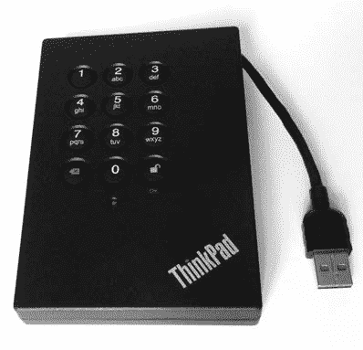

## **取证图像管理**


本章涉及获取后管理取证图像文件的各个方面。与磁盘上的典型文件相比，磁盘镜像非常庞大，移动、复制和转换这些大文件可能会变得笨重且耗时。你将学习多种管理大图像文件的技术，以帮助克服各种挑战。这些技术包括压缩和拆分图像以便更容易处理、使用加密保障图像安全以及在格式之间转换图像。此外，我还将描述如何以只读方式挂载图像进行安全的本地浏览，并演示取证克隆（或磁盘复制）。我还会讨论大图像文件的安全、可靠存储和网络传输。章节的最后我将介绍如何安全地擦除和处置图像及文件。我将从管理图像压缩开始。

### 管理图像压缩

原始磁盘镜像的大小始终与其包含的扇区总数相同。磁盘上的文件数量或数据量无关紧要，并不会影响未压缩原始镜像的大小。随着当前多太字节磁盘的广泛使用，在时间和磁盘容量的限制下操作镜像可能会面临挑战。即使是简单地复制一个镜像，也可能需要花费几个小时才能完成。通过保持图像压缩，你可以在一定程度上减少这个问题。

在取证背景下压缩图像涉及对整个磁盘的逐扇区压缩（与压缩磁盘上每个文件不同）。未曾写入过数据的磁盘，尤其是那些存有大量千兆字节或太字节空间的磁盘，会更容易压缩，因为磁盘的很多部分仍然是未触及的扇区，里面填充着零。使用过的磁盘压缩效果较差，因为大多数扇区已经被分配并且仍然包含残留数据。包含大量音频和视频文件的磁盘镜像压缩效果也不好，因为这些文件已经通过它们自己的算法进行了压缩。

选择最合适和高效的压缩工具和技术非常重要。有些工具可能对原始源文件或压缩后的目标文件有大小限制。其他工具可能效率较低，或者在压缩过程中使用临时文件，导致内存耗尽或产生磁盘空间问题。为了在进行压缩操作时解决这些问题，你可以使用管道和重定向。

使用压缩后的取证镜像最有用的功能之一是能够在不解压整个镜像的情况下直接使用取证工具进行分析。但这对于某些压缩工具来说是个问题，因为它们无法在压缩文件中进行定位。*定位* 允许程序随机访问文件中的任何位置。取证格式被设计为允许分析程序在压缩镜像上进行实时的随机访问。流行的取证格式都支持镜像压缩，通常在采集过程中进行，尽管并非所有工具默认进行压缩。

#### *标准 Linux 压缩工具*

当前开源世界中常用的压缩工具有 zip、gzip 和 bzip（版本 1 或 2）。本节中的示例使用了 gzip，但您也可以使用其他压缩工具。如果希望以时间和 CPU 周期为代价，尝试更好的压缩，您可以调整压缩级别。

如果有足够的磁盘空间，您可以直接压缩磁盘镜像文件，方法如下：

```
$ gzip image.raw
```

此命令创建文件 *image.raw.gz*，并在完成后删除原始文件。在压缩过程中，压缩文件和解压文件需要足够的空间共存。使用 gunzip 解压文件时同样适用。

您还可以在采集过程中通过管道和重定向实现即时压缩。例如：

```
# dcfldd if=/dev/sde | gzip > image.raw.gz
```

这里的输入文件是一个原始磁盘设备。没有指定输出文件时，dcfldd 会将镜像数据流发送到标准输出（stdout），然后通过管道传递给 gzip，最后重定向到一个压缩文件中。

压缩文件可以解压为原始镜像文件，您可以使用取证工具直接对其进行操作。或者，您可以将解压后的数据流通过 stdout 和 stdin 管道传递给某些程序。例如：

```
$ zcat image.raw.gz | sha256sum
1b52ab6c1ff8f292ca88404acfc9f576ff9db3c1bbeb73e50697a4f3bbf42dd0 -
```

这里，zcat 解压图像并将其传递给程序，以生成 sha256 加密哈希。值得注意的是，gzip 文件格式包含额外的元数据，如创建时间戳、原始文件名和其他信息。即使压缩文件内的哈希值相同，gzip 容器（*image.raw.gz*）的哈希值每次创建时也会不同。

#### *EnCase EWF 压缩格式*

ewfacquire 工具提供了控制采集过程中文件压缩的标志。例如：

```
# ewfacquire -c bzip2:best -f encase7-v2 /dev/sdj
ewfacquire 20150126
...
EWF file format:                        EnCase 7 (.Ex01)
Compression method:                     bzip2
Compression level:                      best
...
MD5 hash calculated over data:          9749f1561dacd9ae85ac0e08f4e4272e
ewfacquire: SUCCESS
```

在这个示例中，`-c` 标志可以指定一个压缩算法以及压缩级别。这里，算法是 bzip2，配置为最佳的压缩级别。由于只有 EWFv2 格式支持 bzip2，因此指定了格式版本 `encase7-v2` 作为参数。请注意，ewftools 需要编译时支持 bzip2。^(1)

#### *FTK SMART 压缩格式*

命令行工具 ftkimager 支持在采集过程中使用压缩镜像，如以下示例所示：

```
# ftkimager --compress 9 --s01 /dev/sdj image
AccessData FTK Imager v3.1.1 CLI (Aug 24 2012)
Copyright 2006-2012 AccessData Corp., 384 South 400 West, Lindon, UT 84042
All rights reserved.

Creating image...
Image creation complete.
```

在这里，`--s01`标志指定创建一个 SMART ew 压缩映像，而`--compress`标志设置为最高压缩级别。你可以使用`--help`标志来获取有关 ftkimager 压缩选项的更多信息。

#### *AFFlib 内置压缩*

尽管 AFFv3 已被弃用（*[`forensicswiki.org/wiki/AFF`](http://forensicswiki.org/wiki/AFF)*)，并且不鼓励使用 aimage（*[`forensicswiki.org/wiki/Aimage`](http://forensicswiki.org/wiki/Aimage)*)，但这里提到 aimage 使用 AFFv3 压缩仅用于示范目的。

以下示例演示了使用 aimage 进行磁盘映像并指定 LZMA 压缩算法（而不是默认的 zlib）：

```
# aimage --lzma_compress --compression=9 /dev/sdj image.aff
im->outfile=image.aff
image.aff****************************** IMAGING REPORT ******************************
Input: /dev/sdj
  Model: Nano S/N: 07A40C03C895171A
  Output file: image.aff
  Bytes read: 2,003,828,736
  Bytes written: 628,991,770

raw image md5:  9749 F156 1DAC D9AE 85AC 0E08 F4E4 272E
raw image sha1: 9871 0FB5 531E F390 2ED0 47A7 5BE4 747E 6BC1 BDB0
raw image sha256: 85B7 6D38 D60A 91F6 A0B6 9F65 B2C5 3BD9 F7E7 D944 639C 6F40 B3C4
    0B06 83D8 A7E5
Free space remaining on capture drive:  527,524 MB
```

Sleuth Kit 法医学软件提供了对 AFFlib 压缩映像的集成支持。AFFv4 引入了 aff4imager 工具，新增了额外的功能。这个工具可以在*[`github.com/google/aff4/`](https://github.com/google/aff4/)*找到。

#### *SquashFS 压缩证据容器*

回想一下，在第六章中描述了如何使用 SquashFS 作为法医证据容器。当你创建 SquashFS 文件时，可以调整多个压缩参数。提供了三种压缩算法（gzip、lzo、xz），可以压缩 SquashFS 的各种元数据（如 inode 表、扩展属性），还可以进行其他调整。更多信息请参见 squashfs(1)手册页。

在这个示例中，一个原始映像文件被转换为一个压缩的 SquashFS 文件：

```
# mksquashfs image.raw image.sfs -comp lzo -noI
Parallel mksquashfs: Using 8 processors
Creating 4.0 filesystem on image.sfs, block size 131072.
...
Exportable Squashfs 4.0 filesystem, lzo compressed, data block size 131072
        compressed data, uncompressed metadata, compressed fragments, compressed
    xattrs
        duplicates are removed
Filesystem size 615435.77 Kbytes (601.01 Mbytes)
        31.45% of uncompressed filesystem size (1956923.96 Kbytes)
Inode table size 61232 bytes (59.80 Kbytes)
        100.00% of uncompressed inode table size (61232 bytes)
Directory table size 31 bytes (0.03 Kbytes)
        100.00% of uncompressed directory table size (31 bytes)
...
```

在这里，`-comp`标志将压缩算法设置为 lzo（gzip 是默认的），而`-noI`标志则阻止压缩 inode（指的是 SquashFS 容器中的 inode，而不是证据映像中的 inode）。

sfsimage shell 脚本管理 SquashFS 法医证据容器的创建，并增加了一些额外的法医功能。

在处理大型法医映像时，压缩的使用是至关重要的。然而，即使是压缩的映像，管理起来仍然可能非常庞大。还有一种方法可以简化这一过程：你可以将法医映像拆分成多个较小的部分。

### 管理拆分映像

由于文件大小庞大，管理获取的磁盘映像可能会出现问题。将映像分割成较小、易于处理的部分可以帮助解决这个问题。请考虑以下几个例子，在这些情况下，拆分映像可能是有益的：

• 在不稳定的网络连接下，可以通过多个较小的下载来进行网络传输，使用拆分映像。

• 一个大的映像文件可能会超过软件工具的最大文件大小。拆分映像提供了一种解决方法。

• 存储介质，如磁带、CD 或 DVD，具有固定的最大容量。拆分映像使你可以使用一组这些介质。

• 某些文件系统（尤其是 FAT）具有相对较小的最大文件大小。

拆分映像在数字取证中的最常见用途是用于证据的传输和存储。历史上，这通常是通过将映像刻录到一组 CD 或 DVD 中来完成的。

#### *GNU split 命令*

标准的 Unix 和 Linux 系统提供了 split 工具，用于将大文件分割成多个较小的文件。以下示例使用`split`命令将现有图像分割成 DVD 大小的块：

```
$ split -d -b 4G image.raw image.raw.
$ ls
image.raw.00  image.raw.01  image.raw.02  image.raw.03  image.raw.04
...
```

`-d`标志指定应该将数字扩展名添加到*image.raw.*（注意末尾的点）；`-b`标志指定从*image.raw*文件中分割出的块的大小。

通过将多个工具结合使用，可以在采集过程中同时进行压缩和分割，从而节省时间和空间。以下是一个示例：使用 dd 命令采集图像，使用 gzip 压缩，并将其分割成 CD 大小的块：

```
# dd if=/dev/sdb | gzip | split -d -b 640m - image.raw.gz.
```

`split`命令的输入文件是*-*，指定了标准输入，并将压缩字节流分割成多个部分。需要注意的是，这些部分不会被单独压缩，不能单独解压。必须将分割后的部分重新组装才能进行解压。

#### *采集过程中分割图像*

你可以在采集过程中将成像的硬盘分割成多个部分，而不是在后续的单独步骤中进行分割。在采集大磁盘之前，考虑一下是否可能需要分割图像，以及什么样的碎片大小最合适。从一开始就使用合适的分割图像可以在调查过程中节省时间和磁盘空间。

分割图像在数字取证中非常常见，因此取证采集和分析工具对其提供了良好的支持。通常，标志可以设置碎片大小并自定义分割图像的扩展名。

dcfldd 工具提供了内建的分割功能。例如，如果你以后将图像通过一组 16GB 的 USB 闪存盘传输给第三方，可以在输出文件之前使用`split=16G`标志来使用 dcfldd 采集图像：

```
# dcfldd if=/dev/sdc split=16G of=image.raw
# ls
image.raw.000  image.raw.001  image.raw.002  image.raw.003  image.raw.004
...
```

默认扩展名是附加到输出文件名后的三位数字。

使用 dc3dd 工具时，可以通过指定`ofsz=`来分割采集过程中的图像，设置输出大小。文件扩展名是数字，如下所示：

```
# dc3dd if=/dev/sdh ofsz=640M ofs=image.raw.000
# ls -l
total 7733284
-rw-r----- 1 root root 671088640 Jan 14 10:59 image.raw.000
-rw-r----- 1 root root 671088640 Jan 14 10:59 image.raw.001
-rw-r----- 1 root root 671088640 Jan 14 10:59 image.raw.002
...
-rw-r----- 1 root root 671088640 Jan 14 11:00 image.raw.009
-rw-r----- 1 root root 671088640 Jan 14 11:00 image.raw.010
-rw-r----- 1 root root 536870912 Jan 14 11:00 image.raw.011
```

确保文件扩展名中有足够的零，否则 dc3dd 将无法完成并生成错误消息，例如`[!!] file extensions exhausted for image.raw.0`。该文件集中的最后一个文件通常会比其他文件小（除非图像大小正好可以被分割文件大小整除）。

EnCase 工具通常默认为在采集过程中分割图像。你可以使用 ewfacquire 通过指定最大分段文件大小（`-S`标志）来将磁盘采集成一个分割的 EnCase 图像：

```
# ewfacquire -S 2G /dev/sdc
...
# ls
image.E01  image.E02  image.E03  image.E04  image.E05  image.E06
...
```

商业版 EnCase 取证套件可以直接使用这些图像。

ftkimager 工具提供了`--frag`标志，用于在采集过程中将图像保存为多个部分，如下示例所示：

```
# ftkimager /dev/sdk image --frag 20GB --s01
AccessData FTK Imager v3.1.1 CLI (Aug 24 2012)
Copyright 2006-2012 AccessData Corp., 384 South 400 West, Lindon, UT 84042
All rights reserved.
...
# ls -l
total 53771524
-rw-r----- 1 holmes root 2147442006 Jul  2 08:01 image.s01
-rw-r----- 1 holmes root       1038 Jul  2 08:43 image.s01.txt
-rw-r----- 1 holmes root 2147412323 Jul  2 08:01 image.s02
-rw-r----- 1 holmes root 2147423595 Jul  2 08:02 image.s03
-rw-r----- 1 holmes root 2147420805 Jul  2 08:02 image.s04
...
```

这里的磁盘是通过设置最大碎片大小为 20GB 的方式进行获取，格式是 SMART 压缩镜像。请注意，添加了包含元数据的**.txt**文件。与某些法医格式不同，这些元数据并未嵌入由 ftkimager 创建的 FTK 拆分文件中。

#### *访问拆分镜像文件集*

法医工具，如 Sleuth Kit，支持直接对拆分镜像集进行操作，而无需先重新组装它们。要列出 Sleuth Kit 中支持的镜像，可以在任何 Sleuth Kit 图像处理工具中使用`-i list`标志：

```
$ mmls -i list
Supported image format types:
        raw (Single raw file (dd))
        aff (Advanced Forensic Format)
        afd (AFF Multiple File)
        afm (AFF with external metadata)
        afflib (All AFFLIB image formats (including beta ones))
        ewf (Expert Witness format (encase))
        split (Split raw files)
```

在这个示例中，支持拆分原始镜像（包括 Unix 拆分文件）、拆分 AFF 镜像和拆分 EnCase 文件（尽管没有明确说明，但拆分 EnCase 文件是受支持的）。这些图像格式类型中的一些可能需要在编译 Sleuth Kit 软件时显式包含。

在以下示例中，一个 EWF 镜像被拆分为 54 个部分。运行`img_stat`命令对第一个文件进行操作，可以提供完整文件集的信息：

```
$ img_stat image.E01
IMAGE FILE INFORMATION
--------------------------------------------
Image Type:            ewf

Size of data in bytes: 121332826112
MD5 hash of data:      ce85c1dffc2807a205f49355f4f5a029
```

使用各种工具，你可以直接操作拆分的镜像。当你指定拆分镜像类型的第一个文件时，大多数 Sleuth Kit 命令将适用于拆分的原始文件集。

最近版本的 Sleuth Kit 会自动检查拆分文件集：

```
$ mmls image.raw.000
```

早期版本的 Sleuth Kit 可能要求你指定拆分镜像类型：

```
$ fls -o 63 -i split image.000 image.001 image.002
```

要检查一组拆分文件是否被识别，`img_stat`命令将显示已识别的总字节数，对于原始类型，它还会显示每个部分的字节偏移范围：

```
$ img_stat image.raw.000
IMAGE FILE INFORMATION
--------------------------------------------
Image Type: raw

Size in bytes: 2003828736

--------------------------------------------
Split Information:
image.raw.000  (0 to 16777215)
image.raw.001  (16777216 to 33554431)
image.raw.002  (33554432 to 50331647)
image.raw.003  (50331648 to 67108863)
image.raw.004  (67108864 to 83886079)
...
```

另一种确定是否支持拆分文件的方法是运行命令或工具，并使用`strace -e open`来查看是否打开了每个拆分文件部分。

拆分文件并操作拆分文件集非常有用，但有时你需要将它们重新组装成一个完整的镜像。这将在下一节中展示。

#### *重新组装拆分镜像*

一般情况下，不需要重新组装拆分的法医格式文件，因为与特定法医格式（如 EWF、SMART 或 AFF）兼容的工具应该能够支持拆分文件。

因为原始镜像中不包含任何头部或元数据信息，重新组装只是将一组镜像片段连接成一个完整的镜像。仔细操作时，这应该是一个两步过程，如下所示：

```
$ ls -1 image.raw.*
image.raw.000
image.raw.001
image.raw.002
image.raw.003
...
$ cat image.raw.* > image.raw
```

`ls -1`标志将列出由 shell 通配符模式识别的文件。使用此列表将文件连接成一个完整镜像之前，请务必确认这是一份完整且有序的列表。如果拆分片段丢失或文件顺序错误，组装后的部分将无法创建正确的法医镜像。

如果你收到一堆 DVD，每张 DVD 包含一个压缩原始镜像的片段，你可以按以下方式重新组装它们：

```
$ cat /dvd/image.raw.gz.00 > image.raw.gz
$ cat /dvd/image.raw.gz.01 >> image.raw.gz
$ cat /dvd/image.raw.gz.02 >> image.raw.gz
$ cat /dvd/image.raw.gz.03 >> image.raw.gz
...
```

在这里，DVD 被反复插入并挂载到`/dvd`，直到映像文件被恢复，期间不断添加分割部分。请注意，初始的 cat 命令中的`>`创建了映像文件，而随后的命令中的`>>`则是追加数据（而非覆盖）。所有部分添加到目标文件后，解压后的映像的加密哈希应与获取时记录的哈希一致。

你还可以通过将所有分割文件传输到 zcat，并将输出重定向到一个文件，来解压并组装来自压缩映像的一组分割文件：

```
# cat image.raw.gz.* | zcat > image.raw
```

AFFlib 提供的一个有用方法允许使用 FUSE 文件系统对一组碎片进行*虚拟重组*。affuse 工具可以将一组分割文件呈现为一个完整的原始映像文件，如下所示：

```
# ls
image.raw.000  image.raw.011  image.raw.022  image.raw.033  image.raw.044
image.raw.001  image.raw.012  image.raw.023  image.raw.034  image.raw.045
...
#
# affuse image.raw.000 /mnt
# ls -l /mnt
total 0
-r--r--r-- 1 root root 8011120640 1970-01-01 01:00 image.raw.000.raw
```

在这里，一个包含原始文件的目录被表示为一个单一的磁盘映像文件，并且可以在*/mnt*虚拟文件系统中找到。你可以直接使用取证工具对这个原始文件进行操作。

### 验证取证映像的完整性

验证映像的加密哈希是数字取证中至关重要的一步，它是保留数字证据的基础。本节提供了验证映像的加密哈希和签名的示例。

验证证据的保留涉及确认映像的当前加密哈希与之前某个时间点的哈希是否一致。你可以使用哈希值来验证磁盘或映像上的成功操作（获取、转换、传输、备份等）。你还可以用它来验证磁盘或映像文件在较长时间内（几个月甚至几年）是否未被篡改。

哈希的要求（过程和算法）取决于使用的法律管辖区以及对取证实验室的组织政策。因此，本节不提供具体的哈希推荐。

#### *验证获取时的哈希值*

获取磁盘后，如果你需要验证获取的哈希值，任务非常简单（但可能耗时），只需将磁盘内容传输到加密哈希程序中。使用不同的程序来验证磁盘的哈希值，能够在工具层面提供独立的验证。例如：

```
# img_stat image.E01
IMAGE FILE INFORMATION
--------------------------------------------
Image Type:             ewf

Size of data in bytes:  2003828736
MD5 hash of data:       9749f1561dacd9ae85ac0e08f4e4272e
# dd if=/dev/sdj | md5sum
3913728+0 records in
3913728+0 records out
9749f1561dacd9ae85ac0e08f4e4272e  -
2003828736 bytes (2.0 GB) copied, 126.639 s, 15.8 MB/s
```

在这里，img_stat 输出指示了 EnCase 成像工具记录的 MD5 获取哈希。接着，使用第二个工具——常规的 dd 命令，重新计算来自原始磁盘设备的哈希。在这个例子中，两个 MD5 哈希匹配，确认证据的完整性得到了保留。

#### *重新计算取证映像的哈希值*

每种取证格式和基于 dd 的取证工具都可以记录或日志记录磁盘映像的哈希值。为了验证记录的哈希值，你可以重新计算磁盘映像的哈希值。在以下示例中，哈希值是在使用 dc3dd 进行获取时记录的，并存储在*hashlog.txt*中。哈希值可以通过以下方式验证：

```
# grep "(md5)" hashlog.txt
   5dfe68597f8ad9f20600a453101f2c57 (md5)
# md5sum image.raw
5dfe68597f8ad9f20600a453101f2c57  image.raw
```

哈希匹配，确认证据文件和哈希日志一致，从而表明证据的完整性得到了保留。

以下示例验证存储在 EnCase 格式元数据中的镜像。在此示例中，使用专用工具 ewfverify 来验证哈希：

```
# ewfverify image.Ex01
ewfverify 20160424

Verify started at: May 14, 2016 14:47:32
This could take a while.
...
MD5 hash stored in file:                 5dfe68597f8ad9f20600a453101f2c57
MD5 hash calculated over data:           5dfe68597f8ad9f20600a453101f2c57

ewfverify: SUCCESS
```

在这里，重新计算的哈希值匹配，确认了 EWF 镜像文件的一致性。该工具会自动验证一组拆分文件的哈希值，这些文件属于 EnCase 取证格式。

affinfo 工具对 AFF 文件执行类似的有效性检查。在此示例中，SHA1 哈希值被验证：

```
$ affinfo -S image.aff
image.aff is a AFF file
...
Validating SHA1 hash codes.
computed sha1: 9871 0FB5 531E F390 2ED0 47A7 5BE4 747E 6BC1 BDB0
  stored sha1: 9871 0FB5 531E F390 2ED0 47A7 5BE4 747E 6BC1 BDB0   MATCH
```

该输出确认 AFF 文件中包含的镜像的哈希值与 AFF 元数据中记录的哈希值相同。

#### *拆分原始镜像的加密哈希值*

计算一组原始拆分文件的加密哈希值是直接的，你可以通过将连接起来的部分传递到哈希程序中来完成此操作。以下示例计算一组拆分原始文件的 sha256 哈希值：

```
$ cat image.raw.* | sha256sum
12ef4b26e01eb306d732a314753fd86de099b02105ba534d1b365a232c2fd36a -
```

本示例假设文件部分的文件名可以按正确的顺序排序（在此示例中，可以通过`ls -1 image.raw.*`进行验证）。这里需要使用`cat`命令，因为它在将所有部分拼接在一起后，才能将其传递给 sha256sum。

你可以通过形成多个程序的命令管道来验证已压缩并拆分成多个部分的镜像的加密哈希值。在以下示例中，cat 将镜像拼接在一起，并将其传递给 zcat 进行解压。zcat 的输出被发送到哈希程序中，程序完成后会生成一个哈希值：

```
$ cat image.raw.gz.* | zcat | md5sum
9749f1561dacd9ae85ac0e08f4e4272e  -
```

这里，`cat`命令是必要的，因为它在传递给 zcat 之前将所有拆分的部分连接在一起。使用`zcat image.raw.gz.*`会失败，因为它会尝试解压每个文件片段，而不是解压整个拼接后的镜像。

在 Unix 社区中，*无用的 cat 命令使用（UUOC）*指的是使用`cat`命令将文件传送到命令，而可以使用`<`来代替。传统的 Unix 社区会授予 UUOC 奖项，鼓励更高效地使用 Shell 命令重定向。然而，本节中的示例确实需要`cat`命令，因为它们执行了连接功能。

#### *识别不匹配的哈希窗口*

随着磁盘老化，或在运输和处理过程中，可能会出现损坏的风险，进而可能引入坏道。如果原始证据磁盘自首次镜像以来就出现不可读的扇区错误，那么该磁盘的加密校验和将无法匹配。在这种情况下，哈希窗口变得非常有价值，因为你可以利用它们更精确地识别磁盘上哪个部分未能匹配。更重要的是，哈希窗口可以显示磁盘哪些区域仍然被保留，即使整个磁盘的哈希匹配失败。

哈希窗口的指定大小决定了在获取磁盘或验证磁盘哈希窗口时，每次写入新哈希的频率。当比较两个哈希列表以进行验证时，两个列表必须使用相同大小的哈希窗口。要找到不匹配的区域，可以使用 Unix diff 工具比较这两个哈希日志。

在以下示例中，使用 dcfldd 对磁盘进行了成像，并保存了一个具有 10M 哈希窗口大小的哈希日志。后续的验证未能匹配整个磁盘的 MD5 哈希，并提供了一个新的哈希日志，仍然使用 10M 哈希窗口大小：

```
$ diff hash1.log hash2.log
3c3
< 20971520 - 31457280: b587779d76eac5711e92334922f5649e
---
> 20971520 - 31457280: cf6453e4453210a3fd8383ff8ad1511d
193c193
< Total (md5): 9749f1561dacd9ae85ac0e08f4e4272e
---
> Total (md5): fde1aa944dd8027c7b874a400a56dde1
```

该输出揭示了完整图像以及介于 20971520 到 31457280 字节之间的字节范围的哈希值不匹配。通过除以 512 字节的扇区大小，可以确定哈希值不匹配发生的扇区范围为 40960 到 61440。磁盘其余部分的哈希值仍然是有效的；只有哈希值不匹配的扇区没有进行法医保留。位于哈希值不匹配的扇区范围内的内容（块、文件、文件部分等）可以在后续阶段从提交的证据中排除。如果两个完整图像的加密哈希值匹配，那么可以假设所有哈希窗口也匹配。

法医图像的加密哈希值保持了收集证据的完整性。然而，哈希值本身并未受到防止恶意或意外修改的保护。通过加密签名和时间戳，可以确认计算的哈希值的完整性得到保留。验证签名和时间戳的有效性将在下一节中展示。

#### *验证签名和时间戳*

前一章节演示了如何使用 GnuPG 对磁盘的哈希值进行签名。你可以在没有签名私钥的情况下验证签名。无需原始签署证据的人；只需要他们的公钥即可。此示例验证了对获取的磁盘镜像进行签名的人员的 gpg 签名：

```
$ gpg < hash.log.asc

dc3dd 7.2.641 started at 2016-05-07 17:23:49 +0200
compiled options:
command line: dc3dd if=/dev/sda hof=image.raw ofs=image.000 ofsz=1G hlog=hash.log
   hash=md5
input results for device `/dev/sda':
   5dfe68597f8ad9f20600a453101f2c57 (md5)
...
dc3dd completed at 2016-05-07 17:25:40 +0200

gpg: Signature made Sat 07 May 2016 17:29:44 CEST using RSA key ID CF87856B
gpg: Good signature from "Sherlock Holmes <holmes@digitalforensics.ch>"
```

在这里，显示了签名消息的内容（获取输出和哈希），以及一个 gpg 消息，表明签名是有效的。

对于 S/MIME 签名消息，类似的命令将验证（或使之失效）来自 PEM 文件的签名，命令如下所示：

```
$ gpgsm --verify image.log.pem
gpgsm: Signature made 2016-01-25 19:49:42 using certificate ID 0xFFFFFFFFABCD1234
...
gpgsm: Good signature from "/CN=holmes@digitalforensics.ch/EMail=holmes@
    digitalforensics.ch"
gpgsm:                 aka "holmes@digitalforensics.ch"
```

第六章讨论了使用时间戳服务从时间戳机构生成 RFC-3161 时间戳。验证时间戳类似于使用 S/MIME 验证签名，并且需要安装正确的证书颁发机构（CA）证书链，以便验证成功。此示例验证了之前使用 FreeTSA 创建的时间戳（*http://freetsa.org/*）。

如果时间戳服务的 CA 证书未安装在你的系统中，可以手动获取。TSA 证书应在请求时作为时间戳的一部分返回（由于`-cert`标志）。在此示例中，CA 证书是从 FreeTSA 获取的，方法如下：

```
$ curl http://freetsa.org/files/cacert.pem > cacert.pem
```

假设 CA 和 TSA 证书已经提供给 OpenSSL 并且有效，你可以通过以下方式验证时间戳：

```
$ openssl ts -verify -in hash.log.tsr -queryfile hash.log.tsq -CAfile cacert.pem
Verification: OK
```

`openssl ts`命令用于验证时间戳。提供时间戳查询（`tsq`）和时间戳响应（`tsr`），在此示例中，指定包含时间戳服务器 CA 证书的文件。第三方时间戳有效（`Verification: OK`），这表明自指定时间以来，文件（以及它包含的取证获取哈希值）未被修改。如果期望永久使用某个特定的时间戳认证机构，可以将 CA 证书添加到操作系统的受信任 CA 存储中。

AFFlib 还规定了使用 X.509 证书签名和验证获取的图像签名的功能。

本节未讨论信任链或公钥基础设施（PKI），这些是用于信任签署图像和验证时间戳的密钥所必需的。示例假设此信任已建立。

### 在图像格式之间转换

在不同取证图像格式之间转换可能有多种好处。如果实验室有新的软件或基础设施，并且当前格式不受支持或效率较低，转换为其他格式可能是一个选择。如果你需要将图像传输给第三方，他们可能有首选的图像格式。如果你接收来自第三方的图像，可能希望将其转换为你偏好的格式。本节提供了在命令行中进行格式转换的示例。展示了几种源格式的转换，包括 EnCase、FTK、AFF 和原始图像。此外，示例展示了将各种格式转换为 SquashFS 证据容器。

当你在不同图像格式之间转换时，最好使用管道和重定向。避免使用临时文件的工具。在转换过程中，可能会同时存在两份图像（其中一份或两份可能被压缩）。在准备转换过程时，进行一些容量规划。

转换后，检查原始图像和目标图像的哈希值，以确保匹配。

#### *从原始图像转换*

将原始图像转换为其他格式通常很简单，因为可以使用常规的磁盘映像功能。与其使用原始设备名称，通常使用原始图像的文件名。

以下示例展示了如何将一个原始图像文件转换为 EnCase 和 FTK 格式。第一个示例使用`ewfacquire`将*image.raw*转换为 EnCase 专家证人格式：

```
$ ewfacquire image.raw -t image -f encase7
ewfacquire 20160424

Storage media information:
Type:                                   RAW image
Media size:                             7.9 GB (7918845952 bytes)
Bytes per sector:                       512

Acquiry parameters required, please provide the necessary input
Case number: 42
Description: The case of the missing red stapler
Evidence number: 1
Examiner name: S. Holmes
Notes: This red USB stick was found at the scene
...
Acquiry completed at: May 14, 2016 15:03:40

Written: 7.3 GiB (7918846140 bytes) in 54 second(s) with 139 MiB/s
    (146645298 bytes/second)
MD5 hash calculated over data:          5dfe68597f8ad9f20600a453101f2c57
ewfacquire: SUCCESS
```

在这里，指定的源文件是原始镜像；`-t` 是 EnCase 目标 **.e01** 文件的基本名称。指定了 EnCase 版本 7，当命令执行时，会询问一系列问题。由于原始文件没有案件元数据，你需要手动输入这些信息。

从原始镜像转换为 FTK SMART 类似：你将原始镜像指定为源，并手动添加案件元数据。使用 ftkimage，你在命令行上指定案件元数据，如以下示例所示：

```
$ ftkimager image.raw image --s01 --case-number 1 --evidence-number 1 --description
    "The case of the missing red stapler" --examiner "S. Holmes" --notes "This USB
    stick was found at the scene"
AccessData FTK Imager v3.1.1 CLI (Aug 24 2012)
Copyright 2006-2012 AccessData Corp., 384 South 400 West, Lindon, UT 84042
All rights reserved.

Creating image...
Image creation complete.
```

`--s01` 标志指定将创建一个 SMART 压缩图像。基本文件名仅指定为 `image`，并且适当的文件扩展名会自动添加。

如果你使用 sfsimage 脚本，将图像转换为 SquashFS 取证证据容器也只是一个简单的命令，如下所示：

```
$ sfsimage -i image.raw image.sfs
Started: 2016-05-14T15:14:13
Sfsimage version: Sfsimage Version 0.8
Sfsimage command: /usr/bin/sfsimage -i image.raw
Current working directory: /exam
Forensic evidence source: if=/exam/image.raw
Destination squashfs container: image.sfs
Image filename inside container: image.raw
Aquisition command: sudo dc3dd if=/exam/image.raw log=errorlog.txt hlog=hashlog.txt
    hash=md5 2>/dev/null | pv -s 7918845952
7.38GiB 0:00:22 [ 339MiB/s] [=================================>] 100%
Completed: 2016-05-14T15:14:37
```

在这里，原始镜像文件与目标 SquashFS 容器文件名一起指定。sfsimage 脚本构建所需的 SquashFS 虚拟设备，并将日志和哈希信息添加为常规文本文件。你可以手动向证据容器中附加额外的案件元数据（使用 `sfsimage -a`）。

你无法直接使用典型的取证工具访问 gzip 压缩的原始镜像，因为无法在 gzip 文件中进行寻址（随机访问文件中的任意块）。最好将此类文件转换为可以寻址的压缩格式。然后你可以直接使用取证分析工具进行操作。在此示例中，一个 gzip 压缩的原始镜像文件被转换为一个使用 sfsimage 创建的 SquashFS 压缩文件：

```
$ zcat image.raw.gz | sfsimage -i - image.sfs
Started: 2016-05-14T15:20:39
Sfsimage version: Sfsimage Version 0.8
Sfsimage command: /usr/bin/sfsimage -i -
Current working directory: /exam
Forensic evidence source:
Destination squashfs container: image.sfs
Image filename inside container: image.raw
Aquisition command: sudo dc3dd   log=errorlog.txt hlog=hashlog.txt hash=md5
    2>/dev/null | pv -s 0
7.38GiB 0:00:38 [ 195MiB/s] [     <=> ]
Completed: 2016-05-14T15:21:18
```

原始文件仍然以原始形式存在，但现在它位于一个压缩文件系统中。你可以挂载生成的**.sfs**文件来访问原始镜像，如此处所示：

```
$ sfsimage -m image.sfs
image.sfs.d mount created
$ ls image.sfs.d/
errorlog.txt  hashlog.txt  image.raw  sfsimagelog.txt
```

你可以使用一个简单的 `affconvert` 命令将原始镜像文件转换为 AFF 文件：

```
$ affconvert image.raw
convert image.raw --> image.aff
Converting page 119 of 119
md5: 9749f1561dacd9ae85ac0e08f4e4272e
sha1: 98710fb5531ef3902ed047a75be4747e6bc1bdb0
bytes converted: 2003828736
Total pages: 120  (117 compressed)
Conversion finished.
```

然后你可以使用一个单独的工具（如 affsegment）添加案件元数据。affconvert 工具提供了合理的压缩默认设置，生成的文件具有**.aff**扩展名，并以原始文件的基本名称命名。

以下是最后一个示例，展示了如何使用 `affconvert` 命令将 SquashFS 取证证据容器中的原始镜像转换为 AFF 文件：

```
# affconvert -Oaff image.sfs.d/image.raw
convert image.sfs.d/image.raw --> aff/image.aff
Converting page 953 of 953
md5: d469842a3233cc4e7d4e77fd81e21035
sha1: 9ad205b1c7889d0e4ccc9185efce2c4b9a1a8ec6
bytes converted: 16001269760
Total pages: 954  (954 compressed)
Conversion finished.
```

由于 SquashFS 是只读的，你需要告诉`affconvert`将输出文件写入一个可写的不同目录。

#### *从 EnCase/E01 格式转换*

libewf 包含了 ewfexport 工具，用于将 EnCase EWF (**.E0**) 文件转换为其他格式。这包括读取一个或多个文件并将它们通过管道传输到其他程序的功能。

**注意**

*某些旧版本的 ewfexport 存在一个 bug，会在导出到 stdout 后，将 `ewfexport: SUCCESS` 这一行附加到镜像的末尾。这个添加的字符串会导致图像的 MD5 校验和不匹配。该字符串的长度为 19 字节，因此你可以通过管道命令* `tail -c 19` *来抑制它。*

##### 手动创建 SquashFS 容器

在本书中，你已经看到了 sfsimage shell 脚本的示例。但看到没有脚本的情况下如何创建 SquashFS 文件也是很有用的。下一个示例将帮助你更好地理解 sfsimage 如何在内部工作。

以下的 EnCase 获取包含 54 个 **.E0* 文件，这些文件将被组合成一个原始镜像并放入 SquashFS 证据容器中：

```
# ls
image.E01  image.E10  image.E19  image.E28  image.E37  image.E46
image.E02  image.E11  image.E20  image.E29  image.E38  image.E47
image.E03  image.E12  image.E21  image.E30  image.E39  image.E48
image.E04  image.E13  image.E22  image.E31  image.E40  image.E49
image.E05  image.E14  image.E23  image.E32  image.E41  image.E50
image.E06  image.E15  image.E24  image.E33  image.E42  image.E51
image.E07  image.E16  image.E25  image.E34  image.E43  image.E52
image.E08  image.E17  image.E26  image.E35  image.E44  image.E53
image.E09  image.E18  image.E27  image.E36  image.E45  image.E54
```

首先，你需要一个 mksquashfs 伪定义文件来定义将创建 SquashFS 容器中文件的命令。伪定义文件包含目标文件名、文件类型、权限、所有者和要执行的命令。该命令的输出将成为定义的文件名在 SquashFS 文件系统中的内容。

在以下示例中，已创建一个名为 *pseudo_files.txt* 的文件，文件中包含两个定义。第一个定义使用 ewfinfo 提取 EnCase 元数据并将其放入 *image.txt*（否则这些元数据将丢失）。第二个定义将 **.E0* 文件中的原始镜像导出为 *image.raw*：

```
# cat pseudo_files.txt
image.txt f 444 root root ewfinfo image.E01
image.raw f 444 root root ewfexport -u -t - image.E01
```

`ewfexport` 标志 `-u` 允许转换过程以无人值守的方式执行（否则它会提示用户提问）。`-t` 标志指定目标，在此示例中是 stdout 或者破折号 `-`。

使用这个定义文件，你可以创建包含生成文件的压缩文件系统，如下所示：

```
# mksquashfs pseudo_files.txt image.sfs -pf pseudo_files.txt
Parallel mksquashfs: Using 12 processors
Creating 4.0 filesystem on image.sfs, block size 131072.
ewfexport 20160424

Export started at: May 12, 2016 19:09:42
This could take a while.
...
Export completed at: May 12, 2016 19:28:56

Written: 113 GiB (121332826112 bytes) in 19 minute(s) and 14 second(s) with
    100 MiB/s (105141097 bytes/second)
MD5 hash calculated over data:          083e2131d0a59a9e3b59d48dbc451591
ewfexport: SUCCESS
...
Filesystem size 62068754.40 Kbytes (60614.02 Mbytes)
        52.38% of uncompressed filesystem size (118492706.13 Kbytes)
...
```

生成的 SquashFS 文件系统 *image.sfs* 将包含三个文件：原始镜像文件 *image.raw*，包含元数据的 *image.txt*，以及包含已执行命令定义的 *pseudo_files.txt* 文件。mksquashfs(1) 手册页面提供了有关创建 SquashFS 文件系统的标志和选项的更多信息。

你可以通过以下命令使用 `unsquashfs` 查看 SquashFS 文件的内容：

```
# unsquashfs -lls image.sfs
...
-r--r--r-- root/root      121332826112 2016-05-12 19:09 squashfs-root/image.raw
-r--r--r-- root/root               770 2016-05-12 19:09 squashfs-root/image.txt
-rw-r----- root/root                98 2016-05-12 16:58 squashfs-root/
    pseudo_files.txt
```

最后的步骤是通过比较 MD5 哈希值来验证证据的完整性。`ewfinfo` 命令提供了原始 EnCase 获取过程中计算的 MD5 哈希值。你可以使用 md5sum 在 SquashFS 容器中的新转换的原始镜像上计算第二个 MD5 校验和。为此，你需要首先挂载 SquashFS 文件系统。以下示例展示了这些步骤：

```
# ewfinfo image.E01
ewfinfo 20160424
...
Digest hash information
        MD5:                    083e2131d0a59a9e3b59d48dbc451591

# mkdir image.sfs.d; mount image.sfs image.sfs.d
# md5sum image.sfs.d/image.raw
083e2131d0a59a9e3b59d48dbc451591  image.sfs.d/image.raw
```

结果显示两个 MD5 哈希值匹配，表明从 EnCase 到 SquashFS 容器中的原始镜像的证据转换已成功保存。在转换过程中计算的第三个匹配的 MD5 哈希可以在 ewfexport 输出中看到。ewfexport 工具还可以转换或导出为其他 EnCase 格式。

当挂载的 SquashFS 文件系统 *image.sfs.d* 不再需要时，可以通过 `umount image.sfs.d` 将其卸载。sfsimage 脚本会为你管理这些步骤。

##### 从 EnCase 转换文件到 FTK

ftkimager 工具可以从 EnCase 转换到 FTK。在此示例中，一组 EnCase **.e01* 文件被转换为 SMART ew 压缩文件，这些文件与原文件具有相同的名称，但扩展名为 **.s01*：

```
# ftkimager image.E01 image --s01
AccessData FTK Imager v3.1.1 CLI (Aug 24 2012)
Copyright 2006-2012 AccessData Corp., 384 South 400 West, Lindon, UT 84042
All rights reserved.
Creating image...
Image creation complete.
```

哈希值会被检查并添加到新的 FTK 文件中。原始的案例元数据不会添加到新转换的文件中，而是从原始格式中提取并保存为一个单独的文件，文件名相同，但扩展名为**.txt*（例如在这个例子中是*image.s01.txt*）。

#### *从 FTK 格式转换*

命令行工具 ftkimager 可以在 EnCase 和 FTK 格式之间进行转换，并允许您使用 stdin 和 stdout 与原始镜像文件进行转换。

在以下示例中，一组压缩的 FTK SMART **.s01* 文件被转换为 EnCase EWF *E01 格式：

```
# ftkimager image.s01 image --e01
AccessData FTK Imager v3.1.1 CLI (Aug 24 2012)
Copyright 2006-2012 AccessData Corp., 384 South 400 West, Lindon, UT 84042
All rights reserved.

Creating image...
Image creation complete.
```

案例元数据不会转移到新格式中，而是自动保存到单独的文件中（*image.E01.txt*）。

ftkimager 可以将 SMART **.s01* 文件转换为 stdout，您可以将其重定向到原始镜像文件，或者将其通过管道输入到其他程序中。在以下示例中，一组 FTK SMART 文件被转换为 SquashFS 法医证据容器，使用 ftkimager 输出通过管道传递给 sfsimage：

```
# ftkimager sandisk.s01 - | sfsimage -i - sandisk.sfs
Started: 2016-05-12T19:59:13
Sfsimage version: Sfsimage Version 0.8
Sfsimage command: /usr/bin/sfsimage -i -
Current working directory: /exam
Forensic evidence source:
Destination squashfs container: sandisk.sfs
Image filename inside container: image.raw
Aquisition command: sudo dc3dd   log=errorlog.txt hlog=hashlog.txt hash=md5
    2>/dev/null | pv -s 0
AccessData FTK Imager v3.1.1 CLI (Aug 24 2012)
Copyright 2006-2012 AccessData Corp., 384 South 400 West, Lindon, UT 84042
All rights reserved.

14.5GiB 0:01:37 [ 151MiB/s] [    <=>    ]
Completed: 2016-05-12T20:00:51
# sfsimage -a sandisk.s01.txt sandisk.sfs
Appending to existing 4.0 filesystem on sandisk.sfs, block size 131072
```

当您将 FTK 格式转换为原始磁盘镜像时，案例元数据不会被转移。您需要手动保存案例元数据，通常它保存在单独的文本文件中。您可以像之前的示例那样，使用`sfsimage -a`命令将其添加到 SquashFS 容器中。

在进行任何格式转换后，您应当在目标格式上单独验证哈希值，以确保证据的完整性已被保留。

#### *从 AFF 格式转换*

affconvert 工具可以将 AFF 镜像转换为原始镜像（也可以将原始镜像转换为 AFF 格式）。affconvert 工具不使用 stdin 或 stdout，而是读取或创建独立的文件。以下简单示例展示了将 AFF 文件转换为原始镜像：

```
$ affconvert -r image.aff
convert image.aff --> image.raw
Converting page 96 of 96
bytes converted: 1625702400
Conversion finished.
```

要将原始镜像转换为 AFF 格式，只需使用`affconvert image.raw`，系统会生成相应的*image.aff*文件。

要在 AFF 文件中使用管道和重定向，您可以使用 affcat 工具。之前的示例也可以通过`affcat`完成，并将输出重定向到文件（不包含任何状态或完成信息，这对于脚本很有用），如下面所示：

```
$ affcat image.aff > image.raw
```

要将 AFF 镜像转换为 EnCase 或 FTK 格式，可以使用 affcat 工具通过 stdout 或 stdin 将镜像传输到相应工具，从而创建所需格式的新镜像。例如，您可以像这样将 AFF 格式转换为压缩的 FTK SMART 镜像：

```
$ affcat image.aff | ftkimager - image --s01
AccessData FTK Imager v3.1.1 CLI (Aug 24 2012)
Copyright 2006-2012 AccessData Corp., 384 South 400 West, Lindon, UT 84042
All rights reserved.

Creating image...
Image creation complete.
```

这里，`-`代表接收原始镜像数据的 stdin 文件描述符，`image`是基础文件名，最后的标志`--s01`指定了压缩格式。

同样，您可以使用 efwacquirestream 转换为各种 EnCase 格式。例如：

```
$ affcat image.aff | ewfacquirestream -C 42 -E 1 -e "S. Holmes" -D "Data theft
    case" image
ewfacquirestream 20160424

Using the following acquiry parameters:
Image path and filename:                image.E01
Case number:                            42
Description:                            Data theft case
Evidence number:                        1
Examiner name:                          S. Holmes
...
Acquiry completed at: May 14, 2016 15:41:42

Written: 1.8 GiB (2003934492 bytes) in 10 second(s) with 191 MiB/s (200393449
    bytes/second)
MD5 hash calculated over data:          9749f1561dacd9ae85ac0e08f4e4272e
ewfacquirestream: SUCCESS
```

在之前的 AFF 转换示例中，案例元数据（如案件名称、检查员姓名、采集时间、哈希值等）在从 AFF 转换为其他格式时没有得到保留。但你可以使用 affinfo 导出这些信息，然后手动添加或保存到目标格式中。根据所使用的工具，你也可以将元数据作为命令行参数包含在内，正如前面示例中的`-C 42 -E 1 -e "S. Holmes" -D "Data theft case"`所示。

最后的这个例子展示了如何使用 sfsimage 将 AFF 文件转换为压缩的 SquashFS 取证证据容器：

```
$ affcat image.aff | sfsimage -i - image.sfs
Started: 2016-05-14T15:47:19
Sfsimage version: Sfsimage Version 0.8
Sfsimage command: /usr/bin/sfsimage -i -
Current working directory: /exam
Forensic evidence source:
Destination squashfs container: image.sfs
Image filename inside container: image.raw
Aquisition command: sudo dc3dd   log=errorlog.txt hlog=hashlog.txt hash=md5
    2>/dev/null | pv -s 0
1.87GiB 0:00:06 [ 276MiB/s] [          <=>         ]
Completed: 2016-05-14T15:47:26
```

你可以使用 affinfo 提取 AFF 文件的元数据，然后将其添加到 SquashFS 取证证据容器中，方法如下：

```
$ affinfo image.aff > affinfo.txt
$ sfsimage -a affinfo.txt image.sfs
Appending to existing 4.0 filesystem on image.sfs, block size 131072
```

一旦镜像转换完成，比较原始镜像和目标镜像的哈希值，以确保一致性。

### 使用加密保护镜像

数字取证中一个重要但常被忽视的组成部分是信息安全。在调查过程中，你应当将获得和提取的信息视为敏感信息，并适当保护其安全性。

数据机密性的丧失可能带来不良后果。例如，这可能违反组织的政策要求，危及法律和合规性，带来受害者隐私问题，甚至损害调查组织的声誉。如果没有充分保护获取的证据，可能会对任何相关方造成损害，包括调查人员及其雇主、受害者、被告及其他参与方。泄露的信息还可能干扰或危及正在进行的调查。

本节重点介绍确保信息保护的方法，特别是在数据传输和存储（包括长期和短期存储）过程中维持安全性。为镜像添加安全性会增加加密和后续解密的复杂性和所需时间，但你将在这里看到的示例尽力将这一过程保持尽可能简单高效。这里使用的是基本的对称加密，而非更复杂的公钥基础设施（PKI）或信任网系统。

除了本节中展示的方法外，ZIP 归档格式也可以用于加密。具有 ZIP64 扩展的较新版本支持超过 4GB 的文件大小。ZIP 格式具有与其他平台（如 Windows）高度兼容的优势。

#### *GPG 加密*

使用对称加密，你可以轻松地加密磁盘镜像，以便在网络传输或存储过程中保护数据。GNU 隐私保护工具（GPG）提供了一个免费的实现，符合 RFC-4880 定义的 OpenPGP 标准。它是传统 PGP 加密的替代方案，后者由 Phil Zimmerman 于 1990 年代初期创建。

在使用 GPG 时，启动代理是非常有用的。（使用 gpg2 时，代理会自动启动。）通常在登录时，通过以下命令启动代理：

```
$ eval $(gpg-agent --daemon)
```

在接下来的所有示例中，`-v` 标志用于增加详细输出。这使得输出对于文档编写（无论是本书还是用于创建正式的取证报告）更加有用。

使用 GPG 对现有图像进行加密非常简单，如下所示：

```
$ gpg -cv image.raw
gpg: using cipher AES
gpg: writing to `image.raw.gpg'
Enter passphrase:
```

会请求输入密码短语，并使用默认的对称加密算法对图像进行加密，创建一个扩展名为 *.gpg* 的新文件。由于 GPG 在加密的同时进行压缩，图像的大小会变小。这可以在这里看到：

```
$ ls -lh
total 1.2G
-r--r----- 1 holmes holmes 1.9G May 14 15:56 image.raw
-rw-r----- 1 holmes holmes 603M May 14 15:57 image.raw.gpg
```

上面的示例展示了在原地加密文件。但你也可以在采集过程中实时加密：

```
$ sudo dcfldd if=/dev/sde | gpg -cv > image.raw.gpg
Enter passphrase:
gpg: using cipher AES
gpg: writing to stdout
241664 blocks (7552Mb) written.
241664+0 records in
241664+0 records out
```

在这里，dcfldd 通过 */dev/sde* 获取附加的磁盘，并将其直接传输到 GPG 程序。GPG 的加密输出然后被重定向到一个文件。`sudo` 命令将权限提升为 root，以便读取原始设备。

解密一个 GPG 加密的图像和加密过程一样简单。唯一的区别是使用解密标志以及需要指定输出文件（默认情况下，它会输出到 stdout）。在以下示例中，GPG 加密的图像文件被解密为一个常规（未加密）文件：

```
$ gpg -dv -o image.raw image.raw.gpg
gpg: AES encrypted data
Enter passphrase:
gpg: encrypted with 1 passphrase
gpg: original file name='image.raw'
```

这个示例展示了不带签名的对称加密。你还可以使用 GPG 公钥和私钥来加密、解密和签名图像。通过将 GPG 加密的图像的哈希与原始图像文件的哈希进行比较，可以验证其完整性，如下所示：

```
$ gpg -dv image.raw.gpg | md5sum
gpg: AES encrypted data
Enter passphrase:
gpg: encrypted with 1 passphrase
gpg: original file name='image.raw'
5dfe68597f8ad9f20600a453101f2c57  -
md5sum image.raw
5dfe68597f8ad9f20600a453101f2c57  image.raw
```

在解密图像时，需要进行一些容量规划。解密后，将会存在两个图像副本（其中一个或两个可能会被压缩）。

GPG 加密的文件是不可寻址的，因此不能直接使用取证分析工具对其内容进行操作。

#### *OpenSSL 加密*

其他加密系统也可以为磁盘镜像提供安全性。OpenSSL 工具包（*[`www.openssl.org/`](http://www.openssl.org/)）*提供了许多可以用来加密文件的算法。例如，要使用 256 位 AES 和密码块链接模式对图像进行密码加密，可以使用以下命令：

```
# openssl enc -aes-256-cbc -in image.raw -out image.raw.aes
enter aes-256-cbc encryption password:
Verifying - enter aes-256-cbc encryption password:
```

OpenSSL 对于加密算法和模式非常灵活，提供了数十种选择。还支持管道和重定向，你可以在采集过程中轻松进行加密，例如：

```
# dcfldd if=/dev/sdg | openssl enc -aes-256-cbc > image.raw.aes
enter aes-256-cbc encryption password:
Verifying - enter aes-256-cbc encryption password:
241664 blocks (7552Mb) written.
241664+0 records in
241664+0 records out
```

解密一个 OpenSSL 加密的文件也相对简单，只要知道加密算法，如下所示：

```
# openssl enc -d -aes-256-cbc -in image.raw.aes -out image.raw
enter aes-256-cbc decryption password:
```

添加 `-d` 标志表示这是一个解密操作（`enc` 指定使用对称加密）。由于 OpenSSL 没有提供自动检测使用了哪种对称加密算法的方法，因此记录文件的加密方式非常重要。

除非专门使用 zlib 编译，否则 OpenSSL 不会压缩文件。为了在采集过程中实时添加压缩，可以将 gzip 添加到管道中，像这样：

```
# dcfldd if=/dev/sdg | gzip | openssl enc -aes-256-cbc > image.raw.gz.aes
enter aes-256-cbc encryption password:
Verifying - enter aes-256-cbc encryption password:
241664 blocks (7552Mb) written.
241664+0 records in
241664+0 records out
```

要验证图像的加密哈希，可以运行类似的命令管道，如下所示：

```
$ openssl enc -d -aes-256-cbc < image.raw.gz.aes | gunzip | md5sum
enter aes-256-cbc decryption password:
4f9f576113d981ad420bbc9c251bea0c  -
```

在这里，解密命令将压缩并加密的文件作为输入，并将解密后的输出通过管道传送给 gunzip，后者将原始镜像输出到哈希程序。

一些 ZIP 实现也支持内建加密，可以用来保护镜像文件和其他证据文件。

#### *法医格式内建加密*

GPG 和 OpenSSL 是众所周知的加密工具，提供与其他工具的兼容性和互操作性。然而，它们并非专为数字取证设计，加密后的镜像文件不能直接被标准的法医工具使用（必须先解密）。本书中讨论的某些流行法医格式支持随机访问加密镜像。

ftkimager 程序可以使用密码或证书来保护镜像文件。以下是一个在采集过程中使用密码（*monkey99*）进行加密的示例：

```
# ftkimager --outpass monkey99 --e01 /dev/sdg image
AccessData FTK Imager v3.1.1 CLI (Aug 24 2012)
Copyright 2006-2012 AccessData Corp., 384 South 400 West, Lindon, UT 84042
All rights reserved.

Creating image...
Image creation complete.
```

**注意**

*在命令参数中包含密码通常是不好的做法。密码会显示在 shell 历史记录中，任何人都可以在进程表中查看密码。*

尝试在没有密码或密码错误的情况下访问加密镜像将会生成以下错误信息：

```
** Source is encrypted; please provide credentials for decryption.
** AD Decryption setup failed.
```

对加密镜像进行操作需要在命令行中包含密码，示例如下：

```
# ftkimager --inpass monkey99 image.E01 - > image.raw
AccessData FTK Imager v3.1.1 CLI (Aug 24 2012)
Copyright 2006-2012 AccessData Corp., 384 South 400 West, Lindon, UT 84042
All rights reserved.
```

一些版本的 EWF 格式支持加密，截至本文撰写时，libewf 的支持处于不同的开发阶段。有关当前加密格式支持的信息，请参见最新的源代码。

AFFlibsuite 允许你通过高级法医格式（AFF）库直接访问加密镜像。从一开始，AFFlib 就是考虑到信息安全而开发的。它提供了多种加密方式来保护法医镜像，包括基于密码的（对称）加密和基于证书的（X.509）加密。你可以使用 affcrypto 工具为已获取的镜像添加保护。以下是一个示例：

```
# affcrypto -e -N monkey99 image.aff
image.aff:   967 segments;     0 signed;   967 encrypted;     0 pages;
    0 encrypted pages
```

最近版本的 dd_rescue 实现了插件接口，并且（截至本文撰写时）有 LZO 压缩、加密哈希和对称加密（AES）插件。以下示例展示了如何对磁盘（*/dev/sdc*）进行镜像，并使用 AES 插件以加密形式保存输出：

```
# dd_rescue -L crypt=enc:passfd=0:pbkdf2 /dev/sdc samsung.raw.aes
dd_rescue: (info): Using softbs=128.0kiB, hardbs=4.0kiB
dd_rescue: (input): crypt(0): Enter passphrase:
dd_rescue: (warning): some plugins don't handle sparse, enabled -A/--nosparse!
dd_rescue: (info): expect to copy 156290904.0kiB from /dev/sdc
dd_rescue: (info): crypt(0): Derived salt from samsung.raw.aes=00000025433d6000
dd_rescue: (info): crypt(0): Generate KEY and IV from same passwd/salt
dd_rescue: (info): ipos: 156286976.0k, opos: 156286976.0k, xferd: 156286976.0k
                   errs:      0, errxfer:         0.0k, succxfer: 156286976.0k
             +curr.rate:    38650kB/s, avg.rate:    56830kB/s, avg.load: 14.9%
             >----------------------------------------.<  99%  ETA:  0:00:00
dd_rescue: (info): read /dev/sdc (156290904.0kiB): EOF
dd_rescue: (info): Summary for /dev/sdc -> samsung.raw.aes
dd_rescue: (info): ipos: 156290904.0k, opos: 156290904.0k, xferd: 156290904.0k
                   errs:      0, errxfer:         0.0k, succxfer: 156290904.0k
             +curr.rate:    29345kB/s, avg.rate:    56775kB/s, avg.load: 14.9%
             >-----------------------------------------< 100%  TOT:  0:45:53
```

如果法医实验室的检查员预计会处理大量加密、签名和时间戳的镜像与证据文件，那么投资使用公钥基础设施（PKI）是值得的。可以选择使用内部的 PKI 系统，或者外部的商业 PKI 提供商。

#### *通用磁盘加密*

前面的示例集中在保护单个文件或文件容器上。另一种选择是保护存放镜像文件的整个驱动器。你可以通过文件系统加密、硬件加密、用户空间加密或内核加密来实现。你将在本节中看到几个示例。

市场上有一些高容量的安全外部硬盘，可用于安全传输镜像文件，例如联想的 ThinkPad 安全硬盘，其中一款如图 7-1 所示。这些硬盘与操作系统无关，并通过设备上的物理键盘输入 PIN 码来加密硬盘内容。



*图 7-1：ThinkPad 安全硬盘*

TrueCrypt 曾是最流行的免费跨平台文件系统软件。但在 2014 年 5 月，开发者发布了一则意外且未作解释的公告，建议用户寻找 TrueCrypt 的替代品，因为该项目已停止开发。由此衍生出了一些分支和兼容项目，其中一些项目在这里列出：

• VeraCrypt: *[`veracrypt.codeplex.com/`](https://veracrypt.codeplex.com/)*

• tc-play: *[`github.com/bwalex/tc-play/`](https://github.com/bwalex/tc-play/)*

• CipherShed: *[`ciphershed.org/`](https://ciphershed.org/)*

• zuluCrypt: *[`mhogomchungu.github.io/zuluCrypt/`](http://mhogomchungu.github.io/zuluCrypt/)*（不是 TrueCrypt 的实现，而是值得一提的 TrueCrypt 管理工具）

本节中的其余示例使用 VeraCrypt。撰写本文时，VeraCrypt 仍在积极开发中，并作为 TrueCrypt 的替代品，正在获得越来越多的关注。

以下示例演示了如何对整个外部硬盘进行加密。你可以将加密后的容器用于安全传输或存储证据数据。veracrypt 工具会询问一些有关加密容器设置的问题。请注意，在此示例中，*/dev/sda*是检查员的硬盘，而非被调查者的硬盘。

```
# veracrypt -c /dev/sda
Volume type:
 1) Normal
 2) Hidden
Select [1]:

Encryption Algorithm:
 1) AES
 2) Serpent
 3) Twofish
 4) AES(Twofish)
 5) AES(Twofish(Serpent))
 6) Serpent(AES)
 7) Serpent(Twofish(AES))
 8) Twofish(Serpent)
Select [1]:

Hash algorithm:
 1) SHA-512
 2) Whirlpool
 3) SHA-256
Select [1]:

Filesystem:
 1) None
 2) FAT
 3) Linux Ext2
 4) Linux Ext3
 5) Linux Ext4
 6) NTFS

Select [2]: 5

Enter password:
Re-enter password:

Enter PIM:

Enter keyfile path [none]:

Please type at least 320 randomly chosen characters and then press Enter:

The VeraCrypt volume has been successfully created.
```

现在，硬盘已经初始化为 VeraCrypt 容器（根据 PC 的速度和硬盘的大小，这可能需要较长时间）。要挂载 VeraCrypt 卷，你需要使用一个简单的命令，其中包括源设备和挂载点：

```
# veracrypt /dev/sda /mnt
Enter password for /dev/sda:
Enter PIM for /dev/sda:
Enter keyfile [none]:
Protect hidden volume (if any)? (y=Yes/n=No) [No]:
# veracrypt -l
1: /dev/sda /dev/mapper/veracrypt1 /mnt
```

安全移除设备需要“卸载”VeraCrypt 卷，这也可以通过一个简单的命令来完成，命令中指定了挂载点：

```
# veracrypt --dismount /mnt
```

此时，你可以将硬盘从系统中物理分离。此示例中的加密硬盘是整个原始设备，但也可以使用 VeraCrypt 容器文件。此示例中的挂载点是*/mnt*，但它可以是文件系统中的任何位置。

还有其他完整磁盘加密系统可以用来保护法证镜像文件和其他数据。你可以使用自加密硬盘（SED），详细内容请参阅“识别和解锁 Opal 自加密硬盘”第 128 页，使用`sedutil-cli`命令创建加密硬盘进行存储和传输。像 Linux LUKS 和 dm-crypt 这样的文件系统加密也提供类似的保护级别。尽管这些加密系统能在硬盘上保护证据数据，但它们可能与其他操作系统（例如 Windows 或 OS X）不兼容。

### 磁盘克隆与复制

在某些情况下，磁盘的克隆或复制副本比镜像文件更受欢迎。每个副本都是原始磁盘的逐扇区精确复制。新克隆的磁盘将拥有与原始磁盘匹配的加密校验和。克隆磁盘有几个用途：

• 使用需要写入磁盘的分析工具和方法

• 用克隆磁盘启动 PC

• 使用专有控制器重建 RAID 阵列

磁盘克隆是一个直接的过程；它基本上是反向的采集过程。在克隆过程中一定要小心，因为如果错误地使用了错误的设备作为目标磁盘，可能会破坏数据。

#### *准备克隆磁盘*

目标磁盘或克隆磁盘的大小（扇区数量）必须大于或等于原始磁盘。因为克隆涉及逐扇区复制，所以目标磁盘必须有足够的容量来容纳原始磁盘的所有扇区。在某些情况下，拥有更大的目标磁盘并不成问题，因为 PC 和操作系统会受限于分区表中定义的内容，并忽略磁盘的其余部分。在其他情况下，复制磁盘的精确扇区数量非常重要，因为软件和工具可能对扇区数量有特定的预期。一些例子包括 GPT 分区分析（备份存储在磁盘的末尾）和 RAID 系统，以及分析部分存储在磁盘最后几个扇区的恶意软件。

在克隆之前，安全地擦除目标磁盘（用零填充扇区）对于去除以前数据的痕迹并减少污染克隆的风险至关重要。

#### *使用 HPA 复制扇区大小*

HPA 可以用来模拟克隆磁盘上与原始磁盘相同数量的扇区。^(2) 如果有期望克隆磁盘和原始磁盘有完全相同数量的扇区，设置 HPA 会很有帮助。当你正在使用专有控制器重建 RAID 系统或复制一个数据预期存储在磁盘最后几个扇区的磁盘时，这一点尤其重要。

**注意**

*在使用 hdparm 工具设置 HPA 之前，你应该知道原始磁盘的确切扇区数量（这是在将磁盘连接到检查主机时确定的）。*

在这个示例中，500GB 硬盘上的 HPA 被设置为复制一个 120GB 的硬盘。原始磁盘报告了 234441648 个 512 字节的扇区，你可以利用这些信息来设置克隆磁盘上的*最大可见扇区*。使用以下命令：

```
# hdparm -N /dev/sdk

/dev/sdk:
 max sectors   = 976773168/976773168, HPA is disabled
# hdparm --yes-i-know-what-i-am-doing -N p234441648 /dev/sdk

/dev/sdk:
 setting max visible sectors to 234441648 (permanent)
 max sectors   = 234441648/976773168, HPA is enabled
# hdparm -I /dev/sdk
...
        LBA    user addressable sectors:  234441648
...
        device size with M = 1000*1000:      120034 MBytes (120 GB)
...
```

第一个`hdparm -N`命令显示了初始状态，500GB 的可访问扇区和禁用的 HPA。第二个`hdparm`命令需要`--yes-i-know-what-i-am-doing`标志来配置危险设置，例如更改扇区大小。`-N p234441648`指定扇区数量。它以字母`p`为前缀，这样更改将在磁盘重启后保持永久有效。最后一个`hdparm`命令检查磁盘是否报告新的扇区大小，现在与克隆磁盘（120GB）相同。

#### *将镜像文件写入克隆磁盘*

要将镜像写入新磁盘，使用与获取磁盘时相同的工具，只是过程是反向的。

你可以直接从原始嫌疑磁盘或先前获取的镜像文件使用标准的 dd 工具创建磁盘克隆。此示例展示了使用 dc3dd 将原始镜像文件写入克隆磁盘的过程：

```
# dc3dd if=image.raw of=/dev/sdk log=clone.log

dc3dd 7.2.641 started at 2016-01-16 01:41:44 +0100
compiled options:
command line: dc3dd if=image.raw of=/dev/sdk log=clone.log
sector size: 512 bytes (assumed)
120034123776 bytes ( 112 G ) copied ( 100% ), 663 s, 173 M/s

input results for file `image.raw':
   234441648 sectors in
output results for device `/dev/sdk':
   234441648 sectors out

dc3dd completed at 2016-01-16 01:52:48 +0100
```

现在你可以验证加密哈希值与原始文件的匹配情况。如果原始磁盘和克隆磁盘的扇区数量不匹配，则会产生错误（如果克隆磁盘的扇区不足以完成复制操作），或者哈希值将不匹配。

你可以将一组拆分图像、压缩图像或加密图像写回克隆磁盘，而无需先创建常规的镜像文件。

你还可以使用非原始格式，如 AFF、EnCase EWF 或 FTK SMART，来创建克隆磁盘。如果某个特定的取证工具无法将镜像写回设备，它可能能够将原始镜像传递到 dd 程序中，这样就可以完成操作。

### 镜像传输与存储

安全和成功地管理取证镜像的传输和长期存储需要一些思考和规划。通常，会发生需要将镜像传输给另一方的情况，例如大型组织内部的其他部门、独立的第三方取证公司或执法机构。

完成传输的过程受到多个因素的影响，主要是数据的大小和数据的安全性。此外，根据不同的组织，你可能还需要考虑法律和监管要求，以及组织的政策要求。例如，由于银行监管规定禁止将客户数据转移到境外，全球银行可能无法将某些磁盘镜像跨国界传输。

长期存储镜像也需要一定的思考和规划。如果某个镜像在几年后重新打开，可能会使用不同的员工、工具和基础设施。重要的是要记录已存储的内容，并保持与过去使用的软件的向后兼容性。

#### *写入可移动媒体*

过去，使用一堆 CD 或 DVD 来传输获取的磁盘镜像。通过压缩和分割，使用这些介质是一种便宜且可行的传输方法。如今，4TB 和 6TB 的硬盘已经很常见，10TB 硬盘已经进入消费市场。即使在压缩的情况下，光盘已不再是今天更大镜像文件的实用传输媒介。然而，为了完整性，以下仍然展示了几个示例。

以下简单示例演示了将 SquashFS 文件刻录到 CDROM。`mkisofs`命令是指向 genisoimage 的符号链接，用于创建文件系统，并通过 wodim 工具将其刻录到光盘。

```
# mkisofs -r -J maxtor-2gb-L905T60S.sfs | wodim dev=/dev/cdrom -
...
Starting to write CD/DVD at speed 48.0 in real TAO mode for single session.
...
 97.45% done, estimate finish Sat Jan 16 02:36:16 2016
 98.88% done, estimate finish Sat Jan 16 02:36:15 2016
...
348929 extents written (681 MB)
Track 01: Total bytes read/written: 714606592/714606592 (348929 sectors).
```

下面是一个简单的将镜像刻录到 DVD 的示例。growisofs 工具最初是作为 genisoimage 的前端，后来发展成为一个通用的 DVD 和 Blu-ray 刻录工具。

```
# growisofs -Z /dev/dvd -R -J ibm-4gb-J30J30K5215.sfs
Executing 'genisoimage -R -J ibm-4gb-J30J30K5215.sfs | builtin_dd of=/dev/dvd
    obs=32k seek=0'
...
 99.58% done, estimate finish Sat Jan 16 02:30:07 2016
 99.98% done, estimate finish Sat Jan 16 02:30:07 2016
1240225 extents written (2422 MB)
...
```

以下示例演示了使用`growisofs`命令将镜像刻录到 Blu-ray 光盘：

```
# growisofs -allow-limited-size  -Z /dev/dvd -R -J atlas-18gb.sfs
Executing 'genisoimage -allow-limited-size -R -J atlas-18gb.sfs | builtin_dd
    of=/dev/dvd obs=32k seek=0'
...
This size can only be represented in the UDF filesystem.
...
/dev/dvd: pre-formatting blank BD-R for 24.8GB...
...
 99.79% done, estimate finish Sat Jan 16 02:20:10 2016
 99.98% done, estimate finish Sat Jan 16 02:20:10 2016
2525420 extents written (4932 MB)
...
```

在 Linux 下将大型镜像刻录到光盘时可能会遇到一些问题。根据使用的驱动器和介质，可能会出现意外或不一致的行为。在将其用于生产环境之前，务必测试驱动器和介质的兼容性。

#### *便宜的磁盘用于存储和传输*

从一组分割和压缩的镜像创建一堆光盘需要一个系统化的过程，这个过程可能既费时又容易出错。目前 Blu-ray 光盘的最大容量为 100GB（BD-R XL）。Blu-ray 光盘每 GB 的成本高于便宜硬盘的每 GB 成本。

考虑到人工努力、错误风险、刻录数据到光盘所需的时间和每 GB 的成本，仅仅购买和使用便宜的硬盘，成为离线存储和转移取证镜像的一个有吸引力的选择。

#### *执行大规模网络传输*

有关通过网络获取镜像的一些问题，已经在第六章中讨论过。

获取的大型镜像进行网络传输可能需要较长的时间才能完成，且可能会饱和公司内部网络或互联网连接。在此类长时间网络传输过程中，也可能发生连接丢失和超时。

在网络之间传输大型取证镜像的速度远不如在本地机器上的磁盘之间传输。为了更好地理解网络带宽的速度，将其与常见的磁盘速度进行比较会很有帮助。表 7-1 将两种快速驱动器接口与两种快速网络接口进行了比较。

**表 7-1：** 常见接口的传输速度

| **接口** | **速度** |
| --- | --- |
| NVME | 4000MB/s |
| SATA III | 600MB/s |
| Gigabit 以太网 | 125MB/s |
| 快速以太网 | 12.5MB/s |

有关不同带宽的更详细比较，请参阅 Wikipedia 页面上的* [`en.wikipedia.org/wiki/List_of_device_bit_rates`](https://en.wikipedia.org/wiki/List_of_device_bit_rates)*。

根据网络带宽和映像大小，物理传输一个存储容器，其中包含获取的主题图像，可能比网络传输更快。

但在某些情况下，安全的网络数据传输是必要的。在传输过程中确保安全可能会带来一些副作用，例如增加复杂性或性能下降。对于不受信任或未知的网络，可以使用几种标准的安全协议，包括 SSL/TLS、ssh/sftp 或 IPSEC。

以下简单示例展示了如何使用 OpenSSH 软件包中的 scp（安全复制）传输一个取证图像文件：

```
$ scp image.raw server1.company.com:/data/image.raw
image.raw                11% 1955MB  37.8MB/s   06:51 ETA
...
```

在这里，一个图像文件 (*image.raw*) 被通过不安全的网络复制到远程服务器的特定数据目录中。使用 scp 有多个优点，包括强大的加密算法、内置压缩、实时进度状态、预计完成时间和强身份验证功能。对于取证调查员来说，最重要的是，scp 支持非常大的文件大小（前提是软件二进制文件已编译为支持 64 位大文件大小），并且能够轻松传输大型磁盘映像。

如果一个图像文件已经加密，那么底层的安全性可能不那么重要，你可以使用传统的文件传输协议，如文件传输协议（FTP）或 Windows 服务器消息块（SMB）。然而，当你使用不安全和弱认证的协议传输加密文件时，应该在传输完成后通过验证加密哈希来确认文件的完整性。

### 安全擦除与数据销毁

每当你丢弃或重复使用磁盘，或者不再需要临时文件时，都应采取细致的措施来正确擦除内容。有多种命令行擦除和安全删除方法可以用于此目的。

#### *销毁单个文件*

在某些情况下，你可能需要安全地擦除单个文件，而不是整个磁盘。例如，你可能需要销毁临时获取的图像文件，这些图像文件存储在采集主机上。在这种情况下，使用文件销毁工具是合理的，因为它减少了破坏其他数据的风险，特别是在检查员的工作站上。

标准的 Linux 核心工具包包含 shred 工具，它试图安全地删除文件，如下所示：

```
$ shred -v confidential-case-notes.txt
shred: confidential-case-notes.txt: pass 1/3 (random)...
shred: confidential-case-notes.txt: pass 2/3 (random)...
shred: confidential-case-notes.txt: pass 3/3 (random)...
```

一个名为 secure_deletion 工具包的软件包提供了一套工具，旨在擦除交换空间、缓存、内存、i 节点和文件。特别是，srm 将擦除单个文件。另一个命令行工具叫做 wipe，也可以擦除文件。

擦除单个文件是一个复杂的过程，取决于所使用的操作系统和文件系统的许多变量。不能保证所有擦除或销毁的文件碎片都已被完全销毁。

#### *安全擦除存储设备*

擦除整个物理驱动器涉及将零或随机字节写入驱动器上的每个用户可访问扇区。这并不能保证所有隐藏或用户无法访问的物理驱动器区域都已被擦除。由 HPA 或 DCO 保护的扇区（这些可以被移除）、重新映射的坏扇区、闪存驱动器的过度配置区域，以及驱动器的不可访问系统区域都不能通过正常的 Linux 工具擦除。尽管如此，擦除所有用户可访问的扇区仍然提供了一个合理的保证，因此这是一种适用于实验室中重用驱动器的数据销毁方法。

根据特定组织的风险偏好和政策，数据销毁可能需要以下一种或多种方法：

• 完全不擦除，仅进行常规格式化

• 使用一次零擦除所有可见扇区

• 使用多次随机数据擦除所有可见扇区

• 物理消磁驱动器

• 物理粉碎驱动器

所需的销毁方法是基于风险的决策，取决于驱动器上数据的敏感性、可能对恢复数据有兴趣的人、恢复的成本和努力以及其他因素。

第一个示例使用 dc3dd 将零写入磁盘的每个可见扇区。dc3dd 工具具有内置的擦除功能，您可以按如下方式使用它：

```
# dc3dd wipe=/dev/sdi

dc3dd 7.2.641 started at 2016-01-16 00:03:16 +0100
compiled options:
command line: dc3dd wipe=/dev/sdi
device size: 29305206 sectors (probed),   120,034,123,776 bytes
sector size: 4096 bytes (probed)
120034123776 bytes ( 112 G ) copied ( 100% ), 3619 s, 32 M/s

input results for pattern `00':
   29305206 sectors in

output results for device `/dev/sdi':
   29305206 sectors out

dc3dd completed at 2016-01-16 01:03:35 +0100
```

你也可以使用 dd 配合*/dev/zero*作为输入文件来完成此任务，但 dc3dd 更快。

要确认磁盘已经被零擦除，你可以使用 dd 将磁盘读入 hexdump 程序：

```
# dd if=/dev/sda | hd
```

如果整个磁盘充满零，hexdump（hd）工具将显示一行零后跟一个星号（`[*]`），表示整个磁盘上的重复模式。

```
0000000 000000 000000 000000 000000 000000 000000 000000 000000
*
```

如果结果仅显示零，表示驱动器的用户可访问扇区已成功擦除。

以下示例使用 nwipe 工具，这是 Darik 的启动和清除（dban）工具的一个分支。nwipe 工具可以指定不同的擦除标准、随机性和轮次数量，并提供活动日志文件。这里显示的是加拿大 RCMP TSSIT OPS-II 擦除版本：^(3)

```
# nwipe --autonuke --nogui --method=ops2 /dev/sdj
[2016/01/15 23:14:56] nwipe: notice: Opened entropy source '/dev/urandom'.
[2016/01/15 23:14:56] nwipe: info: Device '/dev/sdj' has sector size 512.
[2016/01/15 23:14:56] nwipe: warning: Changing '/dev/sdj' block size from 4096 to
    512.
[2016/01/15 23:14:56] nwipe: info: Device '/dev/sdj' is size 160041885696.
[2016/01/15 23:14:56] nwipe: notice: Invoking method 'RCMP TSSIT OPS-II' on device
    '/dev/sdj'.
[2016/01/15 23:14:56] nwipe: notice: Starting round 1 of 1 on device '/dev/sdj'.
[2016/01/15 23:14:56] nwipe: notice: Starting pass 1 of 8, round 1 of 1, on device
    '/dev/sdj'.
[2016/01/15 23:57:00] nwipe: notice: 160041885696 bytes written to device
    '/dev/sdj'.
[2016/01/15 23:57:00] nwipe: notice: Finished pass 1 of 8, round 1 of 1, on device
    '/dev/sdj'.
...
```

在擦除驱动器时，确保已移除 DCO 和 HPA。对于 NVME 驱动器，确保已擦除每个独立的命名空间（大多数消费者级 NVME 驱动器只有一个命名空间）。

#### *发出 ATA 安全擦除单元命令*

ATA 标准规定了一个安全擦除命令，可以直接向驱动器发出该命令以擦除磁盘。`ATA SECURITY ERASE UNIT`命令会将零写入磁盘的所有用户可访问扇区。`EXTENDED SECURITY ERASE`命令会写入一个预定义的模式（由驱动器制造商定义），而不是零。

运行`hdparm`命令可以显示驱动器安全功能的能力和状态。还会提供估算的安全擦除驱动器所需的时间，如下所示：

```
# hdparm -I /dev/sdh
...
        device size with M = 1000*1000:     500107 MBytes (500 GB)
...
Security:
        Master password revision code = 7
                supported
                enabled
        not     locked
        not     frozen
        not     expired: security count
                supported: enhanced erase
        Security level high
        60min for SECURITY ERASE UNIT. 60min for ENHANCED SECURITY ERASE UNIT.
```

如果您没有明确设置密码，有些驱动器会拒绝擦除命令。在以下示例中，使用的是 Western Digital 驱动器，密码首先设置为 *dummy*，然后才接受 `--security-erase` 命令：

```
# hdparm --security-erase dummy /dev/sdh
security_password="dummy"

/dev/sdh:
 Issuing SECURITY_ERASE command, password="dummy", user=user
```

该驱动器现已安全擦除，可以重新使用。如果驱动器需要设置密码，请在安全擦除完成后不要忘记禁用密码。

#### *销毁加密磁盘密钥*

您可以通过销毁加密密钥的所有已知副本来安全销毁加密的磁盘和文件系统。如果密钥是在如智能卡、TPM 或 Opal 驱动器等安全设备上生成的，那么只有一个密钥副本。如果驱动器或文件系统是在企业环境中配置的，则可能会有用于恢复目的的备份或托管副本。

针对基于操作系统的加密驱动器（如 Microsoft BitLocker、Apple FileVault、Linux LUKS/dm-crypt 或 TrueCrypt 变体）的密钥擦除程序，要求详细了解密钥存储的位置。密钥可能受到密码/短语保护，并存储在文件或驱动器的某个块中。它们也可能存储在其他地方的密钥文件中。如果无法定位并安全销毁所有副本的私钥，则替代方法是使用前述的完全驱动器擦除方法擦除磁盘。

通常，安全外部 USB 闪存驱动器具有用于找回丢失密码的出厂重置功能。这可以用来销毁密钥，从而销毁驱动器的内容。例如，您可以通过同时按住 KEY 和 0/1 按钮三秒钟来重置 Corsair Padlock2 闪存驱动器，然后输入 `911` 来重置密钥并销毁驱动器内容。在 iStorage datashur 驱动器上，按住 KEY 和 2 按钮三秒钟，然后输入 `999` 来重置密钥。

销毁 Opal SED 驱动器内容也是即时的，只需通过输入 *物理安全 ID（PSID）* 来销毁驱动器上的加密密钥即可。PSID 通常在驱动器的物理封面上有一个二维码，您可以扫描它来代替手动输入。您无法通过 ATA 命令查询获取 PSID；它仅在物理驱动器的封面上可见。

`sedutil-cli` 命令有一个特殊选项，可以使用 PSID 永久重置驱动器密钥：

```
# time sedutil-cli --yesIreallywanttoERASEALLmydatausingthePSID
     3HTEWZB0TVOLH2MZU8F7LCFD28U7GJPG /dev/sdi
- 22:21:13.738 INFO: revertTper completed successfully

real    0m0.541s
user    0m0.000s
sys     0m0.000s
```

驱动器中的加密密钥现在已重置，数据已有效销毁。磁盘已恢复出厂设置，解锁，并可以重新使用。销毁此 120GB 驱动器上的数据所需的时间为半秒。

### 结束语

在本章中，你学习了多种管理取证镜像的技术，包括使用常见的 Linux 工具进行压缩和取证格式中的内建压缩。你看到了更多关于 SquashFS 压缩文件系统的示例，以及用于管理取证证据容器的 sfsimage 脚本。我演示了镜像的分割与重组、驱动器的复制，以及镜像格式之间的转换。你还学习了如何验证哈希值、签名和时间戳，以及如何在网络传输和存储过程中使用加密保护镜像。最后，我展示了如何安全销毁取证镜像文件和驱动器。
